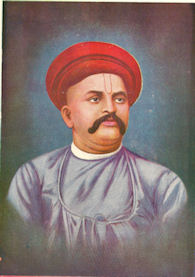

by Vaman Shivaram Apte

Apte, Vaman Shivaram &lt;1858 - 1892&gt;: The student\'s guide to Sanskrit Composition (Being a treatise on Sanskrit Syntax). \-- 3. ed. \-- 1890.

Apte, Vaman Shivaram &lt;1858 - 1892&gt;: The student\'s guide to Sanskrit composition : being a treatise on Sanskrit syntax; for the use of schools and colleges. \-- 3rd ed. \-- Poona : R. A. Sagoon, 1890. \-- 450 S.

A Key to Apte\'s Guide to Sanskrit composition : giving a close rendering into English and Sanskrit of all the Sanskrit and English sentences / compiled by an experienced graduate teacher. \-- 2d ed. \-- Bombay : Standard Pub., 1923. \-- 136 p.; 18 cm

# Table of contents

## Part I. Concord.

• Lesson I: Concord of Subject and Verb

• Lesson II: Concord of Substantive and Adjective; Concord of Relative and its Antecedent

## Part II. Government.

• Lesson III: The Accusative Case

• Lesson IV: Verbs governing two Accusatives

• Lesson V: The Causal

• Lesson VI: The Instrumental Case

• Lesson VII: The Dative Case

• Lesson VIII: The Ablative Case

• Lesson IX: The Locative Case

• Lesson X: The Genitive Case

• Lesson XI: The Genitive and Locative absolutes

## Part III. The use and meaning of Grammatical Forms & Words.

• Lesson XII: Pronouns

• Lesson XIII: Participles. Present Participles. Future Participles. Perfect Participles.

• Lesson XIV: Past Participles. Potential Passive Participles

• Lesson XV: Gerunds. Namul or Gerund in अम्

• Lesson XVI: The Infinitive Mood

• Lesson XVII: Tenses and Moods. Present Tense. The Imperative Mood. The Benedictive Mood.

• Lesson XVIII: The Potential Mood

• Lesson XIX: Imperfect, Perfect and Aorist

• Lesson XX: The two Futures and the Conditional

## Particles.

• Lesson XXI: अंग, अथ, अधिकृत्य, अपि, अये, अहह, and अहो

• Lesson XXII: आ, आं, आः, इति, इव, उत, एव, एवं, and ॐ

• Lesson XXIII: कच्चित्, क्व - क्व, कामं, किं, किल, केवल, and खलु

• Lesson XXIV: च (च - च), जातु, तत्, ततः, तथा, तावत्, and तु

• Lesson XXV: दिष्ट्या, न, नाम, नु, ननु, and नूनं

• Lesson XXVI: पुनः, प्रायः, बत, बलवत्, मुहुः, यत्, and यत्सत्यं

• Lesson XXVII: यथा - तथा, and यावत् - तावत्

• Lesson XXVIII: वरं - न, स्थाने, हंत, हा, and हि

• Lesson XXIX: Parasmaipada and Ātmanepada. Roots of the first Conjugation

• Lesson XXX: Roots of the remaining Conjugations and Causals

## Part IV. Analysis and Synthesis of Sentences.

## Glossary

• Glossary English - Sanskrit.

00\. Preface and Introductory

\-- 00. Preface and Introductory. \--

Use of brackets:

&lt;&gt; = Apte\`s own Notes (loc. cit. pp. 277ff.)

\[\] =

\{\} = Notes by Alois Payer

# Preface to the Second Edition

A glance at the Table of Contents will show that this edition differs from the first in many respects. The additions and alterations that have been made both in matter and arrangement require a few words of explanation.

The main body of the work is divided into four parts. The first part gives the general scope of Syntax and lays down the principal laws of Concord. The second part deals with Government and gives principal rules in the Kāraka Prakaraṇa. In the third part are considered the more important Grammatical Forms, the meaning and use of which require explanation; such as, several kinds of Participles, the Infinitive Mood, the ten Tenses and Moods. Particles, such as are most frequently used in Sanskrit Literature, are also treated and illustrated being alphabetically arranged and distributed over eight Lessons, some peculiarities of the Parasmaipada and Atmanepada---certain roots taking the one or the other pada according as they are used in a particular sense or are preceded by certain prepositions----which were given in an Appendix in the first edition, have here been incorporated into the body of the work, and treated in two additional Lessons. The fourth Part gives matter not given in the first edition---the Analysis and Synthesis of Sanskrit sentences. I have tried to apply the system of English analysis to Sanskrit sentences, and in doing so I have illustrated the rules of English Grammar by examples from Sanskrit authors, making such additions and alterations as were necessitated by the peculiarity of the Sanskrit idiom. To some this portion may perhaps appear superfluous. But my experience is that a correct nowledge of the relations subsisting between the different parts of a Sanskrit sentence is highly useful to the student, not only in translating from Sanskrit into English, but also in translating from English into Sanskrit, inasmuch as it clearly brings to his notice the difference in construction between the two languages, and in composing sentences. The general rules of Analysis are much the same in all languages, but their application is not easily understood. In Section II. of this part some rules on the order of words have been given, mostly drawn from an examination of the construction of Sanskrit Sentences and comparison with Latin idiom. The third Section takes up the Composition of sentences, where the student has to frame some sentences so as to apply the rules of analysis given in the first Section. Several exercises have, with this view, been given in this Section. I am inclined to believe that these exercises, if carefully worked, will give the student, considerable facility in writing a few sentences of original Sanskrit on a given subject. The student has also been shown how to paraphrase Sanskrit passages, and it is expected that, with the help of Analysis, he will be able to paraphrase in Sanskrit as he does in English. The fourth Section treats of Letter-writing, in which are given, with examples and exercises, some of the common forms of letters. On this subject I have derived considerable help from a number of manuscripts, dealing with प्रशस्तयः---forms of writing---that were brought to my notice by Dr. Bhandarkar, and kindly placed at my disposal for some months.

This edition differs also in the arrangement of matter. Each Lesson here consists of three parts: the first gives the rules with illustrations; the second and third give sentences for exercise. Choice Expressions and Idioms, which were, in the former editions, given after the rules, and the Sentences for Correction, which were given last, have here been given after the Notes. The Idioms have been arranged in the alphabetical order of the important words in their English equivalents, and a good many taken from standard authors have been added so as to increase the former number by over one-half. The Sentences for Correction have been promiscuously arranged, and they may be attempted after the rules have been fully mastered. There is one more material change in arrangement that will not fail to strike the reader. The Sanskrit sentences have been divided into two parts: those in large type for reading in class, and \'Additional Sentences for Exercise,\' which may be read at home as additional reading. I have been obliged to make this division, not because I considered the number of sentences very large, as some of my critics did, but because the sentences, as they stood, were too many to be read by students in the ordinary course of class lessons. I myself felt the difficulty, while teaching the book; and I thought it proper to do that which I myself did, and which other teachers also, who did me the honour of teaching it to their pupils, must have done, namely to effect a division of the Sanskrit sentences. This has, moreover, enabled me to add under the \' Additional Sentences\' several passages from authors not previously drawn upon.

The lesson on the Nominative case in the first edition has been omitted, as it was found to be superfluous, and that on Pronouns, being out of place in Concord, has been transferred to Part III. The Appendix on the formation of the feminine of nouns and adjectives has been dropped.

Other improvements made in this edition are two Glossaries---Sanskrit-English and English-Sanskrit---which give the difficult words occurring in the exercises for translation, and an alphabetical Index of all the nouns, adjectives, roots, &c. which have given rise to syntactical or other rules. The want of the two Glossaries, more especially of the first, was much felt by students. The most ordinary words, which the student must have come across in his elementary course of study, have not been included. The importance of the Index need not be much dilated upon, since it facilitates reference to a very remarkable degree and is now regarded as almost a sine qua non of such works. For this I must thank Professor Max Müller, who was kind enough to suggest, among other things, this idea of giving an Index. The Notes, given after Part IV., retain much of their former character. They are mostly intended to be explanatory. Individual words, being included in the Glossaries, have not here been repeated.

These are the main additions and alterations made in this edition. Besides, the work has been most carefully revised throughout; indeed, it will be difficult to find a page which has not undergone careful revision. Several rules have been recast; and many more, drawn from a closer study of Sanskrit Grammar and the works of classical authors, have been added to each Lesson. Throughout the book several Sanskrit passages have been added, either to the illustrative sentences, or to the sentences for exercise. The effect of this and the like additions has been to increase the matter by nearly one-half. Yet by a suitable arrangement of types, the volume of the work has not much increased, and that it may be within the reach of all classes of students, the price has been reduced to Rs. 1, As. 8. The rapid sale of a large edition in less than three years shows that the book, in some measure, supplied a felt want; and it is hoped that the student of Sanskrit will find this edition more useful and a better guide to Sanskrit composition than the first, on account of the improvements effected in it.

Before concluding, I must not omit to tender my most sincere thanks to Dr. R. G. Bhandarkar, who was kind enough to spare time to go over the greater portion of the book with me, and to make several important suggestions which have been mostly acted upon; and secondly, to Mr. Lee Warner, Acting Director of Public Instruction who, at the recommendation of Dr. Bhandarkar, was pleased to sanction the work for use in High Schools. My acknowledgements are also due to Dr. Morell, Professor Bain, and Mr. McMordie, whose works have been useful to me in writing Part IV.; and lastly to Mr. M. Sheshagiri Prabhu of the Madras Presidency, who was the first to suggest the addition of Analysis and Synthesis of **sentences.**

Poona, 24th December 1885.

V. S. APTE.

# Preface to the Third Edition.

For this edition the book has been carefully revised throughout, and some sentences have been added, particularly in the illustration of rules. As the work is now used as a text-book in several High Schools, even in the other Presidencies, no material changes in its plan and scope have been effected. It gives me great pleasure to find that the several important changes made in the second edition have met with general approval, and that the book affords help, however light, to the student, in writing Sanskrit correctly and mastering some of the intricacies of its idiom.

Poona, 11th December 1890.

V.S. APTE

# Part I

# Introductory

§ 1. \'SYNTAX\' in English deals with the mode of arranging words in sentences and lays down rules for the proper and correct arrangement of words. In Sanskrit and other languages that are rich in inflexions, Syntax has not this definite scope. The grammatical inflexion itself shows the relation of one word to another, and no harm or inaccuracy occurs, if the student does not observe the usual order of words in a sentence. Take, for example, the English sentence, \"Rāma saw Govinda.\" If the order of the words \'Rāma\' and \'Govinda\' be changed, there will be a very great difference in the meaning; it will, in fact, be a different sentence altogether. Take, however, the Sanskrit sentence for the same: रामो गोविन्दमपश्यत्. Here, even if the order of the words be changed, no difference occurs in the meaning; the sentences रामो गोविन्दमपश्यत्, गोविन्दं रामोऽपश्यत्, अपश्यद्रामो गोविन्दं &c., all mean the same thing. The order or arrangement of words in Sanskrit sentences is not, therefore, a point of great importance except in some cases; but this does not mean that perfect arbitrariness is allowed, and there are certain cases in which it is necessary to arrange words in a particular manner. In Sanskrit Grammars, rules on Concord and Order are rarely given. The \"Kāraka-Prakaraṇa\" in the Siddhānta-Kaumudī is popularly, though not correctly, taken to represent Syntax in Sanskrit, but it represents only one of the parts of Syntax properly so called, i. e. Government. The use and meaning of particles and grammatical forms has also to be taken into account in the joining together of words into sentences. This portion of Grammar is usually considered in English Grammars under Etymology, and in Sanskrit Grammars, in explaining the formation of words in Accidence, the use of the words themselves is given; as in the Sūtra लटः शतृशानन्चावप्रथमासमानाधिकरणे (Pāṇini III. 2. 324) \[1\] , which states how to form present participles as well as when to use them. In treating of \'Syntax\' in Sanskrit, one has thus to look mainly to Concord and Government and the Use and Meaning of Grammatical Forms and Words, and the Lessons in this work are accordingly arranged.

\[1\] \[i.e. अप्रथमान्तेन सामण्याधिकरण्ये सति लटः शतृशानचौ स्तः . The terminations शतृ i.e. अत् and शानच् i.e. आन are adder to Par. and Ātm. roots respectively to form (active) present participles, provided the participles so formed do not agree with a Noun in the Nom. case. (Sometimes they do agree with a noun in the Nom. case; see Sid. Kau. on Pāṇ. VII.2.82\]

As already remarked, the order of words is not so important a point in Sanskrit as in English; but there are a few cases in which it has to be carefully attended to. Some hints on this subject will be found in Part IV.

§ 2. There are in Sanskrit, as in English and other languages, three persons and three genders.

The use of persons is not practically different from what it is in English.

As regards genders of nouns in Sanskrit, no definite rules can be laid down to distinguish one from another. The assignment of genders is purely arbitrary, except in those cases where the male and female sexes are indicated, and where the distinction is natural; as, चटक \'a male sparrow,\' चटका \'a female sparrow;\' हंसः, हंसी; अजः, अजा, &c. The arbitrariness of genders may well be seen from the fact that there are, in Sanskrit, three words of three different genders for one and the same thing; \'wife\' is represented by दार ( mase. ), भार्या (fem. ), and कलत्र् (neut. );\' body \' by कायः, तनुः, and शरीरं; &c. Genders must, for the most part, be studied from the dictionary.

There are three numbers, instead of two, as in English or Latin, some peculiarities in the use of which are noted below.

§ 3. The three numbers in Sanskrit are the singular, dual and plural.

The singular number denotes \'one\' or a single individual, but often represents, as in English, the whole class; as नरः \'a man\', सिंहः सर्वश्वापदेषु बलिष्ठः \'the lion is the strongest of all beasts.\'

Note. To represent a class the singular or plural may be used: \'Brāhmaṇas must be respected\' may be expresses by ब्राह्मणः पूज्यः or ब्राह्मणाः पूज्याः.

§ 4. The dual denotes \'two\'; अश्विनौ \'the two Aśvins,\' दम्पती \'a pair\' (husband and wife). But words meaning a \'couple\' or \'pair\', such as द्वय, द्वितय, युगल, द्वंद्व &c. are always singular, except when several pairs are indicated; as बाहुद्वयं \'a pair of arms;\' सुकुमारचरणयुगलं \'a pair of delicate feet.\'

\(a\) The dual form sometimes denotes a \'male\' and a \'female\' belonging to the same class, the form being an instance of एकशेषद्वन्द्व compound; as जगतः पितरौ वन्दे पार्वतीपरमेश्वरौ (Raghuvaṃśa I.1) \'I salute the parents of the universe, Pārvatī and Parameśvara (Śiva)\'.

§ 5. Some words having a dual sense, that occur in the plural form in English ought, in Sanskrit, to be translated by the dual alone; as, \'he washed his hands and feet\' हस्तौ पदौ चाक्षलयत्; \'she shut her eyes\' सा लोचने न्यमीलयत्.

§ 6. The plural denotes \'more than two\', and may, like the singular, represent the whole class; शकुण्ताः \'birds\' or a \'class of birds\'. But there are some words in Sanskrit, which, though used in the plural are singular in sense; as दाराः \'wife\'; similarly अप् \{fem. pl. आपः water\}, वर्षा \[fem. the rainy season\] , सिकता \[fem. sand\], अक्षता \[अक्षत masc. whole unhusked and clean grains of rice\], असु \{masc. life\}, प्राण \{masc. breath\} &c.

\(a\) Sometimes the plural is used to show respect, or to speak of a person with reverence, as, इति श्रीशंकराचार्याः \'so says the revered Śaṃkara.\'

\(b\) In the first person the plural sometimes stands for the singular, if the speaker is a high personage, as, वयमपि भवत्यौ सखीगतं किमपि पृच्छामः (Śakuntalā 1) \'we too, (i. e. I) ask your ladyship something regarding your friend\'; वयमपि स्वकर्मण्यभियुज्यामहे (Mudrārākṣasa 3) \'we, too, shall apply ourselves to our work\'. But this condition is not absolutely necessary; e. g. किंत्वरण्यसदो वयमनभ्यस्तरथचर्याः (Uttararāmacarita 5) \[But we who live in forests are not accustomed to drive or move in chariots.\]

§ 7. Names of countries are always in Sanskrit used in the plural, because they are taken from the people themselves; as, अहं गतः कदाचित् कलिंगान् (Daśakumāracarita II.7) \'I once went to Kaliṅga\' (the country of the Kaliṅgas).

N.B. When the words देश, विषय &c. are used with the names of countries, the singular must be used; as, मगधदेशे पाटलिपुत्रं नाम नगरं \'there is a town called Pāṭaliputra in the country of the Magadhas\'.

§ 8. The plural of proper nouns not infrequently denotes the family or race, as in English; as, रघूणामन्वयं वक्ष्ये (Raghuvaṃśa I.9) \' I shall describe the family (genealogy) of the race of Raghu;\' जनकानां रघूणां च संबन्धः कस्य न प्रियः (Uttararāmacarita 1) \'to whom is the connexion between the families of Raghu and Janaka not dear ?\'

# 01. Lesson I

\-- 01. Lesson I. \--

§ 9. \"When two connected words are of the same gender, number, person, or tense, they are said to agree with one another or to be in Concord. Speaking of man, we have to say he, of a woman she, of plurality of persons they, these are agreements or concords.\" \-- Bain.

The concords that deserve notice in Sanskrit are three:

1\. Concord of Subject and Verb

2\. Concord of Substantive and Adjective and

3\. Concord of Relative and its Antecedent.

Concord of Subject and Verb.

§ 10. That about which something is said or asserted is called the subject of a sentence, and is put in the nominative case. A verb, as in English, agrees with its subject in number and in person; as, आसीद्राजा शूद्रको नाम (Kādambarī) \'there was a king named Śūdraka;\' साधयामो वयं (Śakuntalā 1) \'we go\' (take our way).

§ 11. The predicate, or that which is said about the subject, may be a finite verb, as in the above instances, or a substantive or an adjective with अस् \'to be,\' expressed or understood. In such cases the substantive should be used in ts natural gender, being made to agree with the subject only in case, as, सा कुलपतेरुच्छ्वसितमिव (Śakuntalā 3) \'she is, as it were, the life of the Kulapati\'; ककुदं वेदविदां (Mṛcchakaṭika 1) \'who is the hump (chief) of those who are conversant with the Vedas.\'

Obs. The concord of the adjective is given in Lesson II.

\(a\) The verb, when used in such cases, always agrees with the subject; as तस्माट्सखा त्वमसि (Uttararāmacarita 5) \'thou art, therefore, a friend\'.

\(b\) When words like पात्र, आस्पद, स्थान, पद, and भाजन, are used as predicates, they are always in the singular number and neuter gender, though the subject be of any number or gender, and the verb agrees with the subject, and not with the predicative noun, whatever be its position; as, गुणाः पूजास्थानं गुणिषु (Uttararāmacarita 4) \'in the meritorious, merits are the object of worship;\' आर्यमिश्राः प्रमाणं (Mālavikāgnimitra 1) \'your honour is an authority\' (your opinion is accepted); संपदः पदमापदां (Hitopadeśa 1) \'wealth is the abode of miseries\'; त्वमसि महसां भाजनं (Mālatimādhava 1) \'thou art the receptacle of light\'; विविधमहमभूवं पात्रमालोकितानाम् (Mālatimādhava 1) \'in various ways did I become the object of (her) looks.\'

Here it would be wrong to say \'गुणाः पूजास्थानमस्ति\', \'अहं पात्रमभूत्\', though the words स्थानं and पात्रं be placed anywhere in the sentence.

§ 12. The noun or adjective used to complete the sense of the so-called verbs of incomplete predication, such as, \'be\', \'become\', \'grow\', \'seem\', \'appear\', is put in the nominative case; as, यदि सर्ग एष ते (Raghuvaṃśa III.51) \'if this be thy resolution;\' प्रभुर्बुभूषुर्भुवनत्रयस्य (Śiśupālavadha I.49) \'wishing to become the lord of three worlds;\' so मदनक्लिष्टेयमालक्ष्यते (Śakuntalā 3) \[\'She appears to be tormented by the God of love.\'\]

\(a\) The same rule holds good in the passive construction of the transitive verbs of inclompete predication, such as, \'call,\' \'name,\' \'make,\', \'consider,\' \'think,\' \'choose,\' \'appoint,\' &c.; as कुक्कुरो व्याघ्रः कृतः (Hitopadeśa 4) \'the dog was made a tiger;\' नायं मूर्खो मन्तव्यः \'he should not be considered a fool\' &c.

§ 13. When the subject consits of two or more nouns connected by \'and\'\', the verb agrees with their combined number; as, तयोर्जगृहतुः पादान्राजा राज्ञी च मागधी (Raghuvaṃśa I.57) \'the king and the Queen Māgadhī seized their feet.\'

\(a\) When the nouns are not taken together, but each is considered separately, or when they together form but one idea, the verb may be singular; as, न मां त्रातुं तातः प्रभवति न चांबा न भवती (Mālatīmādhava 2) \'my father cannot save me, neither can my mother, nor yourself;\' पदुत्वं सत्यवादित्वं कथायोगेन बुध्यते (Hitopadeśa ) \'skill and truth-speaking is known in conversation.\'

\(b\) Sometimes the verb agrees with the nearest subject, and is left to be understood with the rest; as, अहश्च रात्रिश्च उभे च संध्ये धर्मोऽपि जानाति नरस्य वृत्तम् (Pañcatantra I.4) \'day and night, both the twilights, and Dharma also knows the action of man.\'

So in Latin (a) Tempus necessitasque postulat,\' \'time and necessity demand;\' (b) \'Filia et unus e filiis captus est.\' \'a daughter and one of the sons was taken prisoner.\'

§ 14. Singular subjects connected by \'or\' will take a singular verb; as, रामो गोविन्दः कृष्णो वा गच्छतु \'let Rāma, Govinda or Kṛṣṇa go;\' so शिशुत्वं स्त्रैणं वा भवतु ननु वन्द्याऽसि जगतः (Uttararāmacarita 4) \[\'Let it be that you are a child or a woman; thou art surelय् adorable to the world.\'\]

\(a\) When the subjects are of different numbers, the verb will agree with the nearest subject; as ते वाऽयं वा पारितोषिकं गृह्णातु \'let them or this (person) take the reward.\'

§ 15. When two or more nominatives of different persons are connected by \'and\', the verb agrees with their combined number; and in person, agrees with the first person in preference to the second or third, and with the second in preference to the third; as, त्वं चाहं च पचावः (Mahābhāṣya) \'thou and I cook\'; similarly, ते किंकरा अहं च श्वो ग्रामं प्रतिष्ठेमहि \'those servants and myself shall start for the village tomorrow;\' त्वं चैव सौमदत्तिश्च कर्णश्चैव \... तिष्ठत (Mahābhārata VII.87.12) \'thou, Saumadatti, and KarNa remain.\'

So in Latin: \'Si tu et Tullia lux nostra valetis, ego et suavissimus Cicero valemus,\' \'if thou and my darling Tullia are well, so am I and my sweetest Cicero.\'

§ 16. When two or more nominatives of different persons are connected by \'or\', the verb agrees with the one nearest to it in number and person; as, \'he or you have done the work\' स वा यूयं वैतत्कर्माकुरुत; \'either they or we can do this difficult work\' ते वा वयं वेदं दुष्करं कार्यं संपादयितुं शक्नुमः.

§ 17. When two or more subjects are in apposition to some pronoun or noun, the predicate agrees with the latter; as माता मित्रं पिता चेति स्वभावात्त्रयं हितम् (Hitopadeśa 1) \'the mother, the friend, and father, (these) three are naturally friendly.\'

## Sentences

ऊर्वशी सुकुमारं प्रहरणं महेन्द्रस्य । प्रत्यादेशो रूपगर्वितायाः श्रियः । अलंकारः स्वर्गस्य ॥१॥ (Vikramorvaśīyam 1)

\[Key: प्रत्यादेशः \-- lit. निराकृति an ordering back of; hence, one who throws into the back-ground, surpasses, another. गर्वोऽस्याः संजात इति गर्विता (cf. सुखित, तारकित &c.); रूपेण गर्विता रूपगर्विता तस्याः ।

Ūrvaśī is the delicate weapon (for, his other weapon, the thunderbolt, is not so) of the great Indra; she is the obscurerer of Lakṣmī, proud of her beauty and the ornament of heaven.\]

सर्वत्रौदरिकस्याभ्यवहार्यमेव विषयः ॥२॥ (Vikramorvaśīyam ३)

&lt;Notes: Said by Pururavas with reference to Vidūṣaka, when he compared the moon to a मोदक. \'With a glutton food becomes in every case his proper scope or province,\' i.e. even his similes and metaphors a derived from food.&gt;

\[Key: औदरिकः \-- उदरे एव प्रसितः from उदर + affix इक; one attentive to his belly, voracious, a glutton. अभ्यवहार्यम् \-- from हृ with अभ् and अव; pot.p.p. \-- what is fit to be eaten, eatable. For translation see notes.\]

हा कथं महाराजदशरथस्य धर्मदाराः प्रियसखी मे कौशल्या । क एतत्प्रत्येति सैवेयमिति ॥३॥ (Uttararāmacarita 4)

&lt;Notes: \'Who can assure himself (believe for certain) that she is the same?\' \-- there is such a vast change in her appearance.&gt;

\[Key: Ah, how is that she is my dear friend Kauśalyā, the lawfully wedded wife of Daśaratha! (see notes) धर्मार्था दाराः धर्मदाराः \-- a wife for religious purposes; one who joins her husband in the performance of religious rites.\]

सार्थवाहस्यार्थपतेर्विमर्दको बहिश्चराः प्राणाः ॥४॥ (Daśakumāracarita II.2)

&lt;Notes: अर्थपति a proper name (\'lord of wealth\'); the meaning is - \'Vimardaka forms the external life, as it were, of अर्थपति\'; he helds him as dear as his own life which is अंतश्चराः प्राणाः.&gt;

\[Key: अर्थो यस्यासौ सार्थः a body of men having a common object; generally merchants going together for the purpose of trading. सार्थं वाहयतीति the leader of. See notes.\]

ममापि दुर्योधनस्य शंकास्थानं पांडवाः ॥५॥ (Veṇīsamhāra 2)

&lt;Notes: A question: \'are the Pāṇḍavas not a an object of dread\' etc.&gt;

त्वं चाहं च वृत्रहन्नुभौ संप्रयुज्यावहै ॥६॥ (Mahābhārata)

प्रवृद्धं यद्वैरं मम खलु शिशोरेव कुरुभिर्न तत्रार्थो हेतुर्न भवति किरीटी न च युवाम् ॥७॥ (Veṇīsamhāra 1)

&lt;Notes: Bhīma says to Sahadava: \'neither my worthy brother (Dharma), nor Arjuna, nor you two, are the cause\' etc. मम शिशोरेव \'of me, while yet a boy, when a mere child.\'&gt;

\[Key: शिशोरेव मम कुरुभिर्यद्वैरं प्रवृत्तम् तत्र तस्मिन्विषये तस्येत्यर्थः आर्थो धर्मः न हेतुः &c. - of the enmity which grew up between the Kauravas and myself when just a boy. See notes.\]

त्वं जीवितं त्वमसि मे हृदयं द्वितीयं

त्वं कौमुदी नयनयोरमृतं त्वमङ्गे ॥८॥ (Uttararāmacarita 3)

&lt;Notes: द्वितीयं हृदयं \'a second heart;\' thou formest a part and parcel of myself.&gt;

\[Key: कौमुदी - (as delight giving as) the moon-light to my eyes. अमृतं i.e. your touch is colling and gratifying as that of.\]

बलवानपि निस्तेजाः कस्य नाभिभवास्पदम् ।

निःशंकं दीयते लोकैः पश्य भस्मचये पदम् ॥९॥ (Hitopadeśa 2)

&lt;Notes: निस्तेजाः \'void of spirit or pluck\' and \'wanting fire,\' having no power to burn. It refes to भस्मचय also, which though very big, is easily trodden under the foot, because there is no fire in it.&gt;

\[Key: To whome is one, strong but lacking (wanting in) spirit (energy) not an object of contempt? Mark! A foot is fearlessly set on a heap of ashes (as it has no fire on it) though big &c.\]

तीर्थोदकं च वह्निश्च नान्यतः शुद्धिमर्हतः ॥१०॥ (Uttararāmacarita 1)

इक्ष्वाकुवम्श्यः ककुदं नृपाणां ककुत्स्थ इत्याहितलक्षणोऽभूत् ॥११॥ (Raghuvaṃśa VI.71)

&lt;Notes: आहितलक्षणः \'was given the characteristic name Kakutstha,\' became known as Kakutstha; or, \'noted for his good qualities\' (according to Amara).&gt;

\[Key: A descendent of the Ikṣvāku race (वंशे भवः वंश्यः), the foremost of kings, became known by the distinctive title of Kakutstha (the hump-rider ककुदि तिष्ठतीति). This was PuraMjaya, who assisted the gods in a fierce fight with the demons on the condition that Indra would assume the form of a bull and allow him to sit on his hump.\]

## Additional sentences for exercise

अस्ति तावदेकदा प्रसंगतः कथित एव मया माधवाभिधानः कुमारो यस्त्वमिव ममकीनस्य मनसो द्वितीयं निबन्धनम् ॥१२॥ (Mālatīmādhava 3)

&lt;Notes: \'Who, like yourself, is the second tie of my mind.\' Said by Kāmandakī to Mālatī, when she related her who Mādhava was.&gt;

\[Key: There is a youth, Mādhava by name (माधवः अभिधानं यस्य), of whom mention was already made to you by me on a (former) occasion, who like you is the second tie of my hesrt. (She means - My life depends upon you two). मामकीन adj. from अस्मत्.\]

एकस्मिञ्जीर्णकोटरे जायया निवसतः पश्चिमे वयसि वर्तमानस्य कथमपि पितुरहमेवैको विधिवशात्सूनुरभवम् ॥१३॥ (Kādambarī 25)

&lt;Notes: पश्चिमे वयसि वर्तमानस्य \'being in his last (declining, old) age\', who was advanced in age.&gt;

\[Key: I was, somehow, born an only son, as destiny would have it (or, in obedience to the will of destiny), to my father who lived with his wife in an old hollow of a tree and who was in the last stage (decline) of life.\]

देव काचिच्चंडालकन्यका शुकमादाय देवं विज्ञापयति । सकलभुवनतलसर्वरत्नानामुदधिरिवैकभिजनं देवः । विहंगमश्वायमाश्चर्यभूतो निखिलभुवनतलरत्नमिति कृत्वा देवपादमूलमागताऽहमिच्छामि देवदर्शनसुखमनुभवितुमिति ॥१४॥ (Kādambarī 8)

&lt;Notes: शुकमादाय \'bringing with her a parrot.\' आश्चर्यभूतः \'an object of wonder.\' a prodigy. इति कृत्वा \'so thinking,\' \'with this thought.\' देवपादमूलमागता \'come to Your Majesty\'s feet.\'&gt;

\[Key: कन्या एव कन्यका. भुवनस्य तलं भुवनतलं, सकलं च तद् भुवनतलं च सकलभुवनतलं; सर्वाणि रत्नानि सर्वरत्नानि तेषाम् । उदकानि धीयन्ते (are stored up) अस्मिन् उदधिः the ocean; उदक become उद before धि in this sense; see Pāṇini VI.3.57. आश्चर्यं भूतः आश्चर्यभूतः a comp. सुप्सुपा.

My lord, a certain Caṇḍāla girl, who has brought a parrot with her, thus requests Your Majesty - Your Majesty is, like the ocean, the abode of all jewels on the whole surface of the earth; and this bird is an object of wonder and a jewel of the whole world; thinking thus I heve come to Your Majesty\'s feet and wish to enjoy the pleasure of seeing Your Majesty.\]

आयुः कर्म च वित्तं च विद्या निधनमेव च ।

पञ्चैतान्यपि सृज्यन्ते गर्भस्थस्यैव देहिनः ॥१५॥ (Hitopadeśa 1)

&lt;Notes: गर्भस्थस्यैव \'while he is yet in the womb\', i.e. all these five are born with him.&gt;

\[Key: The period of life, actions, property (to be possessed by one), the degree of knowledge and (the time of) death - these five are created (determinated) while a being is yet in the womb. देहोऽस्य विद्यते इति देही.

रहस्यभेदो याच्ञा च नैष्ठुर्यं चलचित्तता ।

क्रोधो निःसत्यता द्युतमेतन्मित्रस्य दूषणम् ॥१६॥ (Hitopadeśa 1)

\[Key: निष्ठुरस्य भावो निष्ठुर्यम्, चलं चित्तं यस्यासौ चलचित्तस्तस्य भावः चलचित्तता, निर्गतं सत्यं यस्मादसौ निःसत्यस्तस्य भावो निःसत्यता. Divulging a secret, begging (the habit of), having cruelty, flickle-heartedness, irascibility, want of truthfulness, and gambling - these are the defects in (disqualification of) a friend; i.e. one should not form friendship with one who has these.

अदेयमासीत्त्रयमेव भूपतेः शशिप्रभं छ्त्रमुभे च चामरे ॥१७॥ (Raghuvaṃśa III.16)

&lt;Notes: भूपतेः = भूपतिना; only three things could not be given away by him, because they were the essential insignia of royalty.&gt;

\[Key: दातुं शक्यं देयं न देयाम् अदेयं that could not be given away. शशिन इव प्रभा यस्य तत्. Three things only the king could not give away (as they are marks of royalty), viz. the (white silken) umbrella bright like the moon, and the two cāmaras \{chowries\}\]

निसर्गभिन्नात्पदमेकसंस्थमस्मिन्द्वयं श्रीश्च सरस्वती च ॥१८॥ (Raghuvaṃśa III.29)

&lt;Notes: The line means that, though Wealth and Learning occupy, by their nature, different stations, yet in this king they live together; the combination aof wealth and learning, which is very rare, is found in this king. एकसंस्थं = एका संस्था यस्य.&gt;

\[Key: निसर्गाद्भिन्नमास्पदं यस्य तत्. The two, viz. the goddess of wealth and the goddess of learning, who occupy by nature two different stations (abodes), live together in this (king). See notes.\]

व्यतिकरितदिगन्ताः श्वेतमानैर्यशोभिः

सुकृतविलसितानां स्थानमूर्शस्वलानाम् ।

अकलितमहिमानः केतनं मङ्गलानां

कथमपि भुवनेऽस्मिंस्तादृशाः संभवन्ति ॥१९॥ (Mālatīmādhava 2)

&lt;Notes: व्यतिकरितदिगन्ताः \'who have (completely filled) the end of quarters.\' सुकृतविलसितानाम् \'who are the abode of mighty manifestations (displays) of good actions\', who have done many meritorious deeds.&gt;

\[Key: व्यतिकरितदिगन्ताः - व्यतिकर एषां संजात इति व्यतिकरिताः; दिशामन्ता दिगन्ताः; व्यतिकरिता दिगन्ता येषाम् । श्वेतमान - Pres. P. of श्वित् 1 Ātm., to be white.

Men of that sort (or type) somehow exist in this world - men who have filled up or pervaded all space between the ends of quarters with their white (spotless) fame, who are the abodes of mighty meritorious deeds (see notes), whose greatness is incomprehensible and who are the banners (harbingers, marks) of auspicious things (bring blessings in their train).\]

## Sentences for Translation into Sanskrit

All translations from the Key.

1\. The king of the Vaṅgas lost his life in battle.

वङ्गानां राजा युद्धे (मृधे - संख्ये &c.) प्रानान्विजहौ or असुभिर्वियुक्तः or वियुयुजे ॥१॥

2\. When she saw that dreadful sight, her hands and feet began to tremble.

यदा सा तद्भयावहं दर्शनमपश्यत् तदा तस्या हस्तौ पादौ चावेपन्त ॥२॥

3\. O Govinda, thou art my life, my joy, my object of pride, my all the world.

भो गोविन्द त्वं मम जीवितं (प्राणाः), प्रमोदोऽभिमानास्स्पदं - हेतुर्मम सर्वस्वीभूतश्च ॥३॥

4\. They became an object of suspicion without any fault of theirs.

स्वापराधमन्तरेण - विना or ऋतेऽपराधात् - ते शङ्कास्थानं बभूवुः ॥४॥

5\. Good wives are the prime cause of all religious actions.

स्तयः - शीलसंपन्नाः, - सुवृत्ताः स्त्रियः स्रवासां धर्म्यक्रियानां मूल - प्रधान - हेतुः - आदिकारणं सन्ति ॥५॥

6\. Bhīṣma, Droṇa, Kṛpa, Karṇa, thyself, the powerful Bhoja, Śakuni, drauṇi, and myself, constitute, o king, your army.

भीष्मद्रोणकृपकर्णास्त्वं बलवान्भोजः शकुनिर्द्रौणिरहं च भो रजंस्तव सैन्यं भवामः or स्मः ॥६॥

7\. When he fell down from his horse, Rāma, Gopāla, and we two were present.

तस्मिनश्वात्पतति रामो गोपाल आवाम् च तत्र संनिहिता आस्म ॥७॥

8\. Why do you and Kṛṣṇa not try to finish this work? Is it very difficult?

यूयं कृष्णश्च तत्कार्यं समापयितुं किं न यतध्वे । अपि तदतिदुष्करम् ॥८॥

9\. Obedience, truthfulness, want of pride, and assiduity in doing his work: these are merits of a servant.

आज्ञाकारित्वं - अनुविधायित्वं - आज्ञानुरोधः सत्यवादित्वमनवलिप्तता - दरोआभावः - स्वकार्यतत्परता च भृत्यस्य गुणाः ॥९॥

10\. You, Rāma, and myself passed the time happily in the forest of Daṇḍakā.

यूयं रामोऽहं च दण्डकारण्ये सुखेन कालमनयाम - अयापयाम ॥१०॥

11\. Riches are a source of innumerable miseries in this world.

अस्मिञ्जगति सम्पदः संख्यातीतानां - अगणेयानां आपदां पदम् ॥११॥

12\. Paraśurāma, the son of Hari, is the jewel of his class, and the ornament of his family.

प्रशुरामो हरिपुत्रः स्ववर्गस्य रत्नं स्वकुलस्यालंकारश्च ॥१२॥

13\. Let that man or these boys take this fruit.

स नर इमे बाला वैतत्फलं गृह्णन्तु ॥१३॥

14\. Hari and I, or you and Kṣṇa, can do this work; neither Gopāla nor his younger brothers can do it.

हरिरहं च यूयं कृष्णश्च वैतत्कार्यं कर्तुं शक्नुथ । न गोपालस्तस्य कनीयांसो भ्रातारो वा (कर्तुं शक्नुयुः) ॥१४॥

15\. You two, the three servants of Puṣpamitra, and two other men should go to the royal court.

युवां पुष्पमित्रस्य त्रयो भृत्या अन्यौ द्वौ नरौ च राजसभां गच्छेत ॥१५॥

# 02. Lesson II

# Concord of Substantive and Adjective

§ 18. In English an adjective is used with all genders, numbers and cases, in the same unaltered form; as a good man, good tables, I saw a good horse &c. In Sanskrit, however, all adjectives, wheter participial, pronominal, or qualitative, must take the same gender, number and case as the noun which they qualify, as, गच्छन्ती नारी, का तृप्तिः, तत्सुखं; शोबनानि गृहाणि \'good houses\'; शोभनेभ्यो गृहेभ्यः \'from good houses\'; शोभनाभ्यो वापीभ्यः \'from good wells;\' हरिं पश्यन्मुच्यते &c. The adjective in Sanskrit must, in fact, be treated like a noun capable of taking cases, genders, and numbers.

Obs. Numeral adjectives differ from ordinary adjectives. They have particular rules for their use, for which see Grammar.

§ 19. When adjectives are used in Appositional or BahuvrIhi compounds, they are used in their original unmodified form; as, कृष्णमृगः \'a black deer\'; रक्तनेत्रा \'of red eyes\' (fem.); रूपवद्भार्या \[रूपवती भार्या\] \'a beautiful wife\'; गृहीतधनुः \'a bow taken;\' अन्यसंक्रान्तहृदयो नरः \[अन्यस्यां संक्रान्तं हृदयं यस्य सः\] \'a man whose heart is fixed on another (lady)\' &c.

\(a\) There are a few exceptions. The sign of the feminine gender is retained, when the feminine is treated as an appelative, when an ordinal number in the feminine gender is the first member, or when the first member is regarded as a class name; as, दत्ताभार्यः, पंचमीभार्यः, शूद्राभार्यः &c.; also सुकेशीभार्यः, स्रौघ्नीभार्यः. For further particulars, see Siddhāntakaumudī, on Pāṇini VI.3.34-41.

§ 20. When participial adjectives, such as past and potential passive, are used as predicates, and when the subject is followed by an appositional noun used predicatively, the participle agrees with the subject (see § 11); as, मालविकोपायन प्रेषिता (Mālavikāgnimitra 1) \'Mālavikā was sent (as) a present.\'

§ 21. When there are two or more substantives qualified by the same adjective, the latter is used in their combined number. As regards gender, when the substantives are masculine and feminine, the adjective will be masculine; and when they are masculine or feminine and neuter, the adjective will be neuter; as, पक्षपातिनावनयोरहं देवी च (Mālavikāgnimitra 1) \'I and the queen are (respectively) interested in these two\'; तस्मिन्सत्यं धृतिर्ज्ञानं तपः शौचं दमः शमः । ध्रुवाणि पुरुषव्याघ्रे लोकपालसमे नृपे ॥ (Mahābhārata III.58.10) \'truth, courage, knowledge, religious austerities, purity, self-control and tranquillity, are firm in that king, pre-eminent among men and resembling the guardians of the worlds.\'

Obs. This rule is based on the principle involved in Pāṇini 1.2.72 त्यादीनि सर्वैर्नित्यम् \{\'The pronouns tyad &c. when spoken of along with any other noun, (pronoun other than tyad &c.) are always retained as ekeśeṣa, (to the exclusion of others\' tansl. Vasu, 1891\}, on which a Vārttika says त्यादितङ् शेषे पुंनपुंसकतो लिन्गवचनानि; सा च देवदत्तश्च तौ; तच्च देवदत्तश्च यज्ञदत्ता च तानि; तच्च देवदत्तश्च ते.

So in Latin: \'Pater mihi et mater mortui sunt,\' ma father and mother are dead.\'

§ 22. But an adjective in Sanskrit often agrees with the substantive nearest to it; as, यस्य वीर्येण कृतिनो वयं च भुवनानि च (Uttararāmacarita 1) \'by whose valour we are rendered happy, as also the three worlds\' (भुवनानि कृतीनि); कामश्च जृम्भितगुणो नवयौवनं च (Mālatīmādhava 1) \'Love has displayed its power, as also the blooming youth.\' \[जृन्भिता गुणा यस्य\]. Here we must follow what is called the लिंगविपरिणाम process; that is, the gender must be understood again to suit the next substantive.

## Concord of Relative and its Antecedent.

§ 23. The concord of the relative pronoun and its antecedent has no special peculiarities in Sanskrit. The relative pronoun agrees with its antecedent in gender, number and person, the case of the relative being determined by its relation to its own clause. Like other pronouns in Sanskrit, it may stand by itself, or may be used adjectively. The relative pronoun generally precedes the noun to which it relates in the relative clause; or the relative may stand alone, the antecedent noun being used with the demonstrative pronoun; while sometimes the antecedent noun is not expressed at all, अंतर्यो मृग्यते स स्थाणुर्वा निःश्रेयसायास्तु (Vikramorvaśīya 1) \'may that Sthāṇu, who is inwardly sought, contribute to your supreme happiness;\' बुद्धिर्यस्य बलं तस्य (Pañcatantra I.9) \'he who has intellect has strength\' (knowledge is power); धिगस्मान् सर्वान्ये एकाकिना बहुना सह युध्यामहे \'fie upon us all, who are fighting with a single-handed boy.\'

§ 24. When the relative has for its predicate a substantive differing in gender from the antecedent, the relative generally agrees with the predicate; as, शैत्यं हि यत् सा प्रकृतिर्जलस्य (Raghuvaṃśa V.54) \'for what is coolness is the natural property of water;\' so मातुस्तु यौतकं यत् स्यात् कुमारीभाग एव सः (Manu IX.131) \[यौनकं - युते विवाहकालेऽधिगतं - property acquired at the time of marriage, dowry. What the mother gets at the time of marriage is legally the property (lit. falls to the share) of the daughter.

Obs. It will be seen from these examples that the correlative pronoun agrees in gender with the noun it qualifies. But Pāṇini in I.4.32 says कर्मणा यमभिप्रैति स (not तत्) संप्रदानम्.

§ 25. When the relative stands for a whole sentence, such as is represented by \'that\' in English, it is always used in the neuter gender singular (यत्); as, ननु वज्रिण एव वीर्यमेतद्विजयन्ते द्विषतो यदस्य पक्ष्याः । (Vikramorvaśīya 1) \'is it not, indeed, Indras valour that his allies subdue their enemies?\'; मम तु यदियं याता लोके विलोचनचन्द्रिका नयनविषयं जन्मन्येकः स एव महोत्सवः । (Mālatīmādhava 1) \'But that she, the moonlight of my eyes, came within the range of my sight, is the only great festival (joyous occasion) in my whole existence.\'

In such cases in the principal sentences, the gender of the demonstrative is the same as that of the antecedent noun (महोत्सवः), and not neuter because यत् is neuter.

## Sentences

तयौव देवतया तयोः कुशलबाविति नामनी प्रभावश्चाख्यातः ॥१॥ (Uttararāmacarita 2)

\[Key: By that very deity their names were mentioned as Kuśa and Laba and their prowess was described.\]

यदेते चंद्रसरोरक्षकास्त्वया निःसारितास्तदनुचितं कृतम् ॥२॥ (Hitopedeśa 3)

&lt;Notes: चंद्रसरोरक्षकाः \'guardians of the moon-lake\' i.e. hares.&gt;

\[Key: You acted improperly in that you drove away these guardians of the lake sacred to the moon; or you did an improper thing or did not act wisely inasmuch as &c.\]

यस्मिन्नेवाधिकं चक्षुरारोपयति पार्थिवः ।

अकुलीनः कुलीनो वा स श्रियो भाजनं नरः ॥३॥ (Pañcatantra I.8)

&lt;Notes: \'On whom the king fixes more his eye,\' i.e. who is looked upon with a more favourable eye than others.&gt;

\[Key: He on whom a king fixes his eye more often (as a mark of favour), becomes the abode of wealth, whether he belongs to a low family or a high family. Or that man - whether low-born or high-born - on whom &c.\]

कृताः शरव्यं हरिणा तवासुराः

शरासनं तेषु विकृष्यतामिदम् ॥४॥ (Śakuntalā 6)

&lt;Notes: The meaning is: \'The demons are fit marks for your arrows; so, let your bow be bent against them.\'&gt;

\[Key: हरिणा by Indra, असुराः the demons, तव शरव्यं कृताः are made your target or the mark for your arrows. Let this bow be drawn against them.\]

स सुहृद् व्यसने यः स्यात् स पुत्रो यस्तु भक्तिमान् ।

स भृत्यो यो विधेयज्ञः सा भार्या यत्र निर्वृतिः ॥५॥ (Pañcatantra I.15)

&lt;Key: स सुहृद् व्यसने यः स्यात् \'he is a friens who is so in adversity; or \'a friend in need is a friend indeed.\'&gt;

\[Key: He is a friend who remains so (or, stands by one) in adversity; he is a son who is devoted to his parents; he is a servant who knows how to obey (is always obedient); and she is a wife in whom one finds happiness.\]

पांण्डवाश्च महात्मानो द्रौपदी च यशस्विनी ।

कृतोपवासाः कौरव्य प्रययुः प्राङ्मुखास्ततः ॥६॥ (Mahābhārata XVII.1.29)

\[Key: महानात्मा येषां ते; प्रशस्तं यशोऽस्य अस्तीति यशस्विनी; प्राङ् मुखं येषां ते.

Then the magnanimous Pāṇḍavas, and the illustrious Draupadī, who had observed a fast, set out, O decendent of Kuru, facing the east (in eastern direction).\]

धर्मः कामश्च दर्पश्च हर्षः क्रोधः सुखं वयः ।

अर्थादेतानि सर्वाणि प्रवर्तन्ते न संशयः ॥७॥ (Rāmāyaṇa VI.62.37)

\[Key: Discharge of religious duties or deeds of righteousness, satisfaction of desires, pride, joy, anger, hapiness and life - all these proceed from (depend upon) money, without doubt.\]

उमावृषाङ्कौ शरजन्मना यथा् यथा जयन्तेन शचीपुरंदरौ ।

तथा नृपः सा च सुतेन मागधी ननन्दतुस्ततत्सदृशेन तत्समौ ॥८॥ (Raghuvaṃśa III.23)

&lt;Notes: \'In like manner the king and Māgadhī (Sudakṣiṇā) who were like them (Śiva and Umā, and Indra and Śacī) were pleased with their son (who was) like them (Kārttikeya and Jayanta).\'&gt;

\[Key: Like Umā and Śiva (lit. the God wwho has the bull for his mark) with their son born in the Śara reeds (Kārttikeya); or like Śacī and Indra with their son Jayanta, the two - the King and the Princess of Magadha (his queen), who were their equals, were delighted with their son who was also like the two (divine princes).\]

## Additional Sentences for Exercise.

धन्या सा यार्यपुत्रेण बहु मन्यते या चार्यपुत्रं विनोदयन्त्याशानिबन्धनं जाता जीवलोकस्य ॥९॥ (Uttararāmacarita 3)

&lt;Notes: बहु मन्यते \'is esteemed\', \'highly thought of.\' आशानिबन्धनं etc. \'became the tie of the hope of whole world.\' Sītā means to say: \'Happy indeed is that woman who, having contributed to divert my lord, has caused the hopes of the people to be concentrated upon herself.\'&gt;

\[Key: Blessed is she who is highly thought of by my husband and who diverting him (making his life happy) has become the tie of hope of the world of mortals.\]

सोऽयं पुत्रस्तव मदमुचां वारणानां विजेता

यत्कल्याणं वयसि तरुणे भाजनं तस्य जातः ॥१०॥ (Uttararāmacarita 3)

&lt;Notes: Said by Rāma with reference to the cub of elephant tenderly reared by Sītā. यत् कल्याणं &c. \'He has become the receptacle of what is good in youthful age,\' i.e. is possessed of youthful freshness and vigour.&gt;

\[Key: This is that son of thine, the subduer of rut-shedding elephants, who has become the abode of all that is auspicious in his youth.\]

न प्रमाणीकृतः पाणिर्बाल्ये बालेन पीडितः ।

नाहं न जनको नाग्निर्नानुवृत्तिर्न संततिः ॥११॥ (Uttararāmacarita 7)

&lt;Notes: Pṛthvī means to say that Rāma, in abandoning Sītā, was not swayed by these considerations, any of which would have decides against him.&gt;

\[Key: The hand (of Sītā) that was seized in (her) childhood by him, (also) a boy, was not looked upon as an authority (against abandoning her); nor was I (considered), nor Janaka, nor the sacred fire, nor her dutiful conduct, nor progeny.\]

यं ब्राह्मणमियं देवी वाग्वश्येवानुवर्तते ।

उत्तरं रामचरितं तत्प्रणीतं प्रयुज्यते ॥१२॥ (Uttararāmacarita 1)

\[Key: Now will be represented (before you - the audience) the play Uttararāmacarita - the account of Rāmas latter part of life, composed by that poet, whom, a Brāhmaṇa, this Goddess of Speech follows like one enslaved (i.e. who has perfect command of language.)\]

चतुर्दश सहस्राणि रक्षसां भीमकर्मणाम् ।

त्रयश्च दूषणखरत्रिमूर्धानो रणे हताः ॥१३॥ (Uttararāmacarita 2)

&lt;Notes: Dūṣaṇa, Khara and TrimUrdhan are the names of demons killed by Rāma.&gt;

\[Key: Fourteen thousand Rakṣasas, of horrible deeds, and three mor, viz. Dūṣaṇa, Khara and Trimūrdhan (the three-handed giant) were killed in the battle.\]

रोगी चिरप्रवासी परान्नभोजी परवसथशायी ।

यज्जीवति तन्मरणं यन्मरणं सोऽस्य विश्रामः ॥१४॥ (Hitopedeśa 1)

&lt;Notes: \'That he lives is death (really speaking); and death is rest to him;\' i.e. the existence of such a man is a living death, and actual death only is his final rest..&gt;

\[Key: A person who is always sickly, one always a (homeless) wanderer, one eating another\'s food, one living (lit. sleeping) in another\'s house - the life that such a man leads is death to him, and what is death means rest to him.\]

मित्रं प्रीतिरसायनं नयनयोरानन्दनं चेतसः

पात्रं यत्सुखदुःखयोः सह भवेन्मित्रेण तद्दुर्लभम् ।

ये चान्ये सुहृदः समृद्धिसमये द्रव्याभ्लाषाकुलास्

ते सर्वत्र मिलन्ति तत्त्वनिकषाग्रावा तु तेषां विपत् ॥१५॥ (Hitopedeśa 1)

&lt;Notes: l. 19 \{=b\} is a rather doubful line. It appears to mean: \'That which may become a fit object both in joy and sorrow (prosperity and adversity), equally with afriend, is difficult to be found;\' i.e. none but a friend will keep company with us in good and bad days. For ये \... मिलन्ति cf. Samson Agonistes: \'In prosperous days they swarm; in adverse withdraw their heads, not to be found though sought.\' तत्त्वनिकष &c. \'But adversity is their touch stone (on which their true character may be tested).\'&gt;

\[Key: Cons. यन्मित्रं नयनयोः प्रीतिरसायनं \... यन्मित्रेण सह सुखदुःखयोः पात्रं भव्त्तद्दुर्लभम्. - A friend who is the elixir of joy to the eyes, who gladdens the mind and who shares with his friend his joy or sorrow, is difficult to be found: while those others, of a different class, who, led by the desire for wealth, become friend in prosperity are found everywhere (ये चान्ये द्रव्याभिलाषाकुलाः समृद्धिसमये सुहृदस्ते सर्वत्र मिलन्ति): Adversity is the touch-stone for testing their sincerity.\]

यस्यार्थास्तस्य मित्राणि यस्यार्थास्तस्य बान्धवाः ।

यस्यार्थाः स पुमांल्लोके यस्यार्थाः स हि पण्डितः ॥१६॥ (Hitopadeśa 1)

\[Key: \{He who has money has friends;\} he who has money has relatives (बान्धवाः); he who has money is a man (i.e. then only treated as such), &c. \{for he who has money is a scholar.\}\]

हिंसाशून्यमयत्नलभ्यमशनं धात्रा मरुत्कल्पितं

व्यालानां पशवस्तृणाङ्कुरभुजः सृष्टाः स्थलीशायिनः ।

संसारार्णवलंघनक्षमधियां वृत्तिः कृता सा नृणां

यामन्वेषयतां प्रयान्ति सततं सर्वे समाप्तिं गुणाः ॥१७॥ (Bhartṛhari Vairāgyaśataka 10)

&lt;Notes: हिंसाशून्य \'void of injury,\' got without injuring any one; cf. Goldsmith: \'And from the mountain\'s grassy side, a guiltless feast I bring.\' अशनं goes with व्यालानां. समाप्तिं प्रयान्ति \'are spent away\', \'are alle exhausted\' in trying to earn their livelihood.&gt;

\[Key: हिंसया शून्यं हिंसाशून्यं; यत्नेन लभ्दुं शक्यं यत्नलभ्यं; यत्नलभ्यं न भव्तीत्ययत्नलभ्यम् । तृणानामङ्कुरास्तृणाङ्कुरास्तान् भुञ्जते इति; स्थाल्यां शेरते तच्छीलाः । संसार एवार्णवः संसारार्नवः तस्य लङ्घने क्षमा धीर्येषां lit. whose intellect is able &c

By the creator the wind has been designed as food for serpents, a food in which there is no sin of killing and which is obtained without labour or effort; while the land-animals are created such as feed on tender grass (or the sprouts of grass). But for men, who, by their intellect, are able to cross the sea of worldly life, that livelihood gas been designed, going in search of which all their merits (qualifications) are exhausted (come to an end); i.e. every one has to do his utmost to gain his livelihood.\]

महिमानं यदुत्कीर्त्य तव संह्रियते वचः ।

श्रमेण तदस्क्त्या वा न गुणानामियत्तया ॥१८॥ (Raghuvaṃśa X.32)

&lt;Notes: An address to god Viṣṇu. \'That (our) words, having extolled thy greatness, are curtailed (fall short), is either through our exhaustion, or inability (to describe), and not because thy merity are limited.\'&gt;

\[Key: उत्कीर्त्य After having loudly proclaimed or sung. इदं परिमाणमस्य इयत् तस्य भाव इयत्ता तया. See notes.\]

यस्मिन् सत्यं च मेधा च नीतिश्च भरतर्षभ ।

अप्रमेयाणि दुर्धर्षे कथं स निहतो युधि ॥१९॥ (Mahābhārata VI.6.26)

\[Key: How was he killed in battle? He, in whom, the best of the descendants of unassailable (or difficult to be braved), truthfulness, talent, and morality existed to an immeasurable degree or extent.\]

## Sentences for Translation into Sanskrit

All translations from the Key.

1\. There are many good people in this city, but they are despises by some peevish, wicked, and narrow-minded men.

अस्मिन्नगरे बहवः सज्जनाङ् (सुशीलाः, साधुवृत्ताः &c.) जनाः सन्ति किंतु ते केचित्पिशुनैः खलैः (दुराचारैः &c.) कृपणमतिभिः (लघुचेतोभिः) जनैस्तिरस्क्रियन्ते or विगण्यन्ते or अवमन्यन्ते &c. ॥१॥

2\. The king of Pāṭaliputra and his queen are both very generous.

पाटलिपुत्राधिपः तस्य राज्ञी चोभावप्युदारौ स्तः ॥२॥

3\. I saw yesterday three beautiful lakes, six deep wells, and fifty-six extensive gardens.

अहं ह्यस्त्रीणि रमणीयानि सरांसि षड् गम्भीरान्कूपान्षद्पञ्चशतं विस्तीर्णानि - विशालानि - उपवनान्यपश्यम् ॥३॥

4\. He, who speaks a lie in order to hide his fault, commits two faults.

य एकमपराधं प्रच्छादयितुं or गूहितुं &c. असत्वं भाषते स द्वावपराधौ करोति ॥४॥

5\. That you should say so is certainly astonishing.

यत्त्वमपेवं ब्रूयास्तदाश्चर्यकरं - विस्मयावहं खलु ॥५॥

6\. That man should be always virtuous is the opinion of all philosophers, ancient and modern.

यन्नरेण सर्वदा सुगुणिना or सदाचारेण भाव्यं तत्सर्वेषां प्राचीनानामर्वाचीनानां च तत्त्वविदां मतम् ॥६॥

7\. These sweet mangoes are sent (use a participial adjective) as a present by my younger brother.

एतानि मधुराणि or रसवम्ति आम्राणि मम कनीयसा भ्रात्रोपायनं प्रेषितानि ॥७॥

8\. That wicked people should hate the virtuous is but their inborn disposition.

यद्दुर्जनाः सज्जनान्निन्दन्ति स तेषां केवलं नैसर्गिकः स्वभावः ॥८॥

9\. Those persons, who are ready-witted, can surmount difficulties.

ये जनाः प्रत्युत्पन्नमतयस्त आपदमुत्तरन्ति ॥९॥

10\. On account of this incident I became (adj. from जन्) the object of their envy.

अनेन व्यतिकरेणाहं तेषां मात्सर्यास्पदं जातः ॥१०॥

11\. Patience, industry, and honesty are always commendable; but rashness, idleness, and faithlessness are censurable.

सहिष्णुत्वम् (शान्तिः &c.) उद्यमः or उद्योगशीलता आर्जवं चैतानि सर्वदा प्रशस्यानि (श्लाघ्यानि) किंतु रभसाचरित्वं or असमीक्ष्यकारित्वं आलस्यमसत्यसंधेयता चैतानि गर्ह्याणि or निन्द्यानि ॥११॥

# 03. Lesson III

# Part II. Government

# The Accusative Case

§ 26. We come to Government, the second general principle regulating the grammatical union of words in sentences. \'Government\' is the power which a word has to regulate the case of a noun or pronoun. The Lessons in this part are intended to explain and illustrate this power.

§ 27. \'Kāraka\' is the name given to the relation subsisting between a noun and a verb in a sentence. Thus any relation subsisting between words not connected with the verb will not be called a Kāraka.

There are six Kārakas in Sanskrit:

• कर्ता

• कर्म

• करण

• संप्रदान

• अपादान

• अधिकरण

These relations belong to the first seven cases except the Genitive, which is not regarded as a Kāraka case \[because it is not connected with the verb.\]

कर्ता is principally the sense of the Instrumental, and means \'agent\'.

The nominative in Sanskrit, as in other languages, is simply the naming case, that which is concerned in अभिधान \'predication\'. According to Pāṇini II.3.46 (प्रातिपदिकार्थलिंगपरिमाणवचनमात्रे प्रथमा), the nominative is used to denote the crude form or base of a word, gender, measure, and number only; as, नीचैः, कृष्णः, ज्ञानं, तटः तटी तटं, द्रोणो व्रीहिः, एकः, द्वौ, बहवः &c.

Note. Several indeclinable words govern nouns in one or another of the Kāraka cases, and such cases are then called \'उपपदविभक्ति,\' i.e. cases governed by indeclinables &c., as distinguished from कारकविभक्ति, cases governed by verbs; as, नमो नृसिंहाय, मांअन्तरा, ग्रामादुत्तरं &c. The latter predominate over the former, where both are possible (उपपदविभक्तेः कारकविभक्तिर्बलीयसी).

§ 28. The person or thing, upon whom or which the effect of an action takes place, is called an object of that action. An object is put in the Accusative case, except in the passive voice; as, स हरिमपश्यत् \'he saw Hari;\' ओदनं बुभुक्षुर्विषं भुंक्ते \'wishing to eat food he eats poison.\' Here हरि and विष are objects of the verbs अपश्यत् and भुंक्ते. But in हरिः सेव्यते the passive form सेव्यते expresses the relation of object an verb which exist between हरि and सेव्, and therefore हरि is not required to be in the Accusative case; but in हरिं सेवते, there being no passive termination, the noun हरि is put in the Accusative case.

§ 29. Verbs signifying \'to nam\', \'to choose\', \'to make\', \'to appoint\', \'to call\', \'to know\', \'to consider\' &c. and the like, govern a factitive or indirect object, besides a direct; as, त्वामामनन्ति प्रकृतिं (Kumārasambhava II.13) \'they consider thee to be Prakṛti;\' कामपि गणिकामवरोधनकरोत् (Daśakumāracarita II.6) \'made a certain courtesan his wife;\' जानामि त्वाम् प्रकृतिपुरुषम् (Meghadūta 6) \'I know thee (to be) the chief person (minister)\'.

§ 30. All verbs that show motion govern the Accusative case; as, गतोऽहं कामदेवायतनं (Mālatīmādhava 1) \'I had gone to the temple of Cupid;\' अहमपि महीमटन् (Daśakumāracarita II.2.) \'I also roaming over the earth;\' यमुनाकच्छमवतीर्णः (Pañcatantra I.1) \'went down the bank of the Jumna;\' so विचचार दावं (Raghuvaṃśa III.3) \{\'he got lost in the forest\'\}. But this idea of motion is expressed in a variety of idiomatic expressions, when the motion is not actual but merely conceived; as, परं विपादमगच्छत् (Pañcatantra I.1) \'was greatly dejected;\' अश्वत्थामा न यातः स्मृतिं ते (Veṇīsaṃhāra 3) \'was not Aśvatthāman thought of by you?\'; पश्चादुमाख्यां सुमुखी जगाम (Kumārasaṃbhava I.26) \'the fair-faced lady afterwards went by (acquired) the name Umā\'; so नरपतिहितकर्ता द्वेष्यतां याति लोके \{who acts to the advantage of the king becomes hated by the people\} (Pañcatantra I.2); न तृप्तिमाययौ (Raghuvaṃśa III.3) \{\'he did not become content\'\}.

\(a\) Generally intransitive roots preceded by prepositions become transitive in sense, and then govern this case; as वृत् \'to be\'; अनुवृत् \'to act according to,\' \'to follow\', as, प्रभुचित्तमेव जनोऽनुवर्तते (Śiśupālavadha XV.41) \'the people, indeed, follow the will of their lord\'; अचलतंगशिखरमारुरोह (Kādambarī 120) \'ascended the lofty summit of the mountain\'; similarly, यन्ता गजस्याभ्यपतद्गजस्थं (Raghuvaṃśa VII.37)1; नोत्पतति वा दिवं (Kādambarī 132); ऋषीणां पुराद्यानां वाचमर्थोऽनुधावति (Uttararāmacarita 1) \[\'But in the case of primeval sages sense follows their utterance (i.e. whatever they say comes to pass).\].

1 \[Key: यान्ता - a rider; an elephant-warrior attacked one who rode an elephant (i.e. a warrior sitting on an elephant).\]

§ 31.1 The roots शी \'to lie down\', स्था \'to stand\' and आस् \'to sit\', when preceeded by अधि, govern the Accusative of place where these actions are performed; as, चन्द्रापीडो मुक्ताशिलापट्टमधिशिश्ये (Kādambarī 206) \'Candrapīḍa lay down on a slab of pearl-stone\'; अर्धासनं गोत्रभिदोऽधितष्ठौ (Raghuvaṃśa VI.73) \'stood on (occupied) half the seat of Indra\'; अध्यास्य पर्णशालां (Raghuvaṃśa I.95) \'lying in a hut (made) of leaves.\'

1 अधिशीङ्स्थासां कर्म Pāṇini I.4.46

\(a\) 1 विश् with अभिनि governs the same case; as, अभिनिविशते सन्मार्गम् (Siddhāntakaumudī) \'he resorts to a good path;\' so भयं तावत्सेवादभ्निविशते सेवकजनं (Mudrārākṣasa 5) \[\'In the first place fear from (of) the master (lit. the person to be served) takes possession or overtakes a servant.\]

1 अभिनिविशश्च Pāṇini I.4.47 \{\'That which is the site of the verb abhiniviś to enter, is also called karma-kāraka.\' transl. Vasu, 1891\}

§ 32.1 The root वस् \'to dwell\', when precedded by the prepositions उप, अनु, अधि or आ, governs the Accusative case of that which forms the place of residence; as, उप-अनु-अधि-आ-वसति वैकुण्ठं हरिः (Siddhāntakaumudī) \'Hari dwells in Vaikuṇṭha (the heaven).\'

1 उपान्वध्याङ्वसः Pāṇini I.4.48 \{\'That which is the site of the verb vas to dwell, when preceeded by upa, anu, adhi, and āṅ, is called karma-kāraka.\' transl. Vasu, 1891\}

§ 33.1 The words उभयतः, सर्वतः, धिक् and the double forms उपर्युपरि, अधोधः, अध्यधि, when they have the sense of \'nearness\', and प्रति \'to\', govern the Accusative case; as, उभयतः कृष्णं गोपाः (Siddhāntakaumudī) \'cowherds are on both sides of Kṛṣṇa;\' उपर्युपरि लोकं हरिः (Siddhāntakaumudī) \'Hari is just over the world;\' अधोधो लोकं (Siddhāntakaumudī) \'just below the world;\' धिग्जाल्मान् (Uttararāmacarita 5) \'fie upon the rogues\'; न मे संशीतिरस्या दिव्यतां प्रति (Kādambarī 132) \'I have no doubt as to her being heavenly\'; so बुभुक्षितं न प्रति भाति किंचित् (Mahābhāṣya). When nearness is not indicated, the Genetive may be used; as उपर्युपरि सर्वेषामादित्य इव तेजसा (Mahābhārata) \'higher and higher than all by means of his lustre, like the sun.\'

1 उभसर्वतसोः कार्या धिगुपर्यादिषु त्रिषु ।

द्वितीयाम्रेडितान्तेषु ततोऽन्यत्रापि दृश्यते ॥ (Vārttika)

\(a\) धिक् may be sometime be used with the nominative or vokative; as धिङ् मूढ \'fie upon thee, fool\'; धिगियं दरिद्रता (Pañcatantra II) \'cursed be this poverty.\'

§ 34.1 The words अभ्तः, परितः (both meaning \'round\'), समया, निकषा (both meaning \'near\' ) and हा \'woe be to\', govern the Accusative case; as परिजनो राजानमभ्तः स्थितः (Mālavikāgnimitra 1) \'the attendants stood round the king\'; रक्षांसि वेदीं परितो निरास्थत् (Bhaṭṭikāvya I.12) \'destroyed the demons (seated) round the alltar;\' ग्रामं समया or निकषा (Siddhāntakaumudī) \'near the village;\' so निकषा सौधभित्तिं (Daśakumāracarita); (पयोधिं) विलंघ्य लंकां निकषा हनिष्यति (Śiśupālavadha I.68); हा कृष्णाभक्तं (Siddhāntakaumudī) \'woe be to a non-worshipper of Kṛṣṇa.\' हा is sometimes used with the Vocative; as हा भगवत्यरुन्धति (Uttararāmacarita 1) \'alas! O revered Arundhatī.\'

1 अभितःपरितःसमयानिकषाहाप्रतियोगेऽपि । (Vārttika)

§ 35.1 The word अन्तरेण meaning \'without,\' \'excepting\', and \'with reference to, regarding,\' governs the same case; as कोऽन्यस्त्वामन्तरेण शक्तः प्रतिकर्तुं (Veṇīsamhāra 3) \'who else but thee is able to retaliate?\' भवन्तमन्तरेण कीदृशोऽस्या दृष्टिरागः (Śakuntalā 2) \'how is her eye-love regarding you?\'

1 अन्तरान्तरेणयुक्ते Pāṇini II.3.4 \{\'A word joined with (or governed by\} the word antarā, or antareṇa takes the second case-affix.\' transl. Vasu, 1891\}

\(a\) So also अन्तरा, meaning \'between\'; अन्तरा त्वां च मां च कमण्डलुः (Mahābhāṣya); पंचालस्तव पश्चिमेन त इमे वामा गिरां भाजनास्त्वद्दृष्टेरतिथीभवन्तु यमुनां त्रिस्रोतसं चांतरा (Prasannarāghava) \[\'This is the beautiful country of Pañcāla lying to your west, the subject of our conversation; let it meet (lit. be the guest of) your eyes, lying between the Yamunā and the Ganges.\'\]

§ 36. Words denoting duration of time and space are put in the Accusative case; as, न ववर्ष वर्षाणि द्वादश दशशताक्षः (Daśakumāracarita II.6) \'the thousand-eyed (indra) did not rain for 12 years\'; क्रोशं कुटिला नदी (Siddhāntakaumudī) \'the river runs winding for 2 miles\'; सभा वैश्रवणी राजन् शतयोजनमायता (Mahābhārata II.10.1) \'O king, the hall of Viśravaṇa is 100 yojanas in length.\'

§ 37. The preposition अनु is sometimes found to be used by itself with nouns in the Accusative case, in the sense of \'after, in consequence of, or being indicated by,\' \'resmbling, or imitating;\' as जपमनु प्रावर्षत् (Siddhāntakaumudī) \'it rained after the muttering of prayers;\' सर्वं मामनु ते (Vikramorvaśīya V.4) \'everything of thee is after mine (resembles mine).\'

Obs. Pāṇini mentions अभि in the sense of \'before,\' \'hard by,\' \'in\', उप \'near\', \'inferior to\', अति \'superior to\', and अनु \'by the side of,\' \'along,\' \'inferior,\' under the category of prepositions, which can be used by themselves and which govern the Accusative case (See Pāṇini I.4.84-87, 90.1-5); as, हरिमभिवर्तते, भक्तो हरिमभि, उप हरिं सुराः, अति देवान् कृष्णः, नदीमन्ववसिता सेना \[\'the army standing in close contact with the river\'\], अनु हरिं सुराः, &c. (Siddhāntakaumudī). Prepositions, used by themselves and governing a noun in some case, are called कर्मप्रवचनीय.

## Sentences

धारिणीभूतधारिण्योर् भव भर्ता शरच्छतम् ॥१॥ (Mālavikāgnimitra 1)

\[Key: Be thou the lord of queen Dhāriṇī and of the earth (the supporter of creature) for a hundred years (शरदां शतं).\]

बिंदूत्क्षेपान् पिपासुः परितपति शिखी भ्रामन्तमद्वारियन्त्रम् ॥२॥ (Mālavikāgnimitra 2)

&lt;Notes: बिंदूत्क्षेपान् \'the drops of water thrown out\' by the revolving wheel.\'&gt;

\[Key: पिपासुः - Desiderative noun from पा (पिपासति). शिखा crest अयास्तीति शिखी. The peacock wheels round the whirling water-machine desirous of drinking the drops thrown up (by it).\]

मन्दौत्सुक्योऽस्मि नगरगमनं प्रति ॥३॥ (Śakuntalā 1)

\[Key: My desire to return to the city has become feeble (I am not anxious to return &c.)\]

एषा मे मनोरथप्रियतमा सकुसुमास्तरणं शिलापट्टमधिशयाना सखीभ्यामन्वास्यते ॥४॥ (Śakuntalā 3)

\[Key: Here is the darling of my heart (the object of my cherished desire) lying (reclined) on a stone-slab with a flowery bed spread over it, and attended upon by her two friends. मनोरथ्येन प्रियतमा; सकुसुमानामास्तरणं यस्मिंस्तत् \]

सागरं वर्जयित्वा कुत्र वा महानद्यवतरति । क इदानीं सहकारमन्तरेणातिमुक्तलतां पल्लवितां सहते ॥५॥ (Śakuntalā 3)

&lt;Notes: Priyaṃvada means to say: \'Who else but DuṢyanta can support (the live of) her who has exhibited signs of deep love?\'&gt;

\[Key: Where can a great river descend to, leaving (if not to) the sea? Who now, except the Sahakāra (a kind of mango) can bear the Atimukta creeper in blossoms? पल्लवा अस्याः संजाताः पल्लविता ताम् ।\]

\{अतिमुक्त = Hiptage benghalensis (L.) Kurz

\"H. benghalensis is a stout, high-climbing liana or large shrub, with white or yellowish hairs on the stem. Its leaves are lanceolate to ovate-lanceolate and approximately 20 cm (8 in) long, and 9 cm (4 in) broad; petioles are up to 1 cm long. It has scandent branches up to 5 m (16 ft) high.

H. benghalensis flowers intermittently during the year, and produces fragrant flowers borne in compact ten-to-thirty-flowered axillary racemes. The flowers are pink to white, with yellow marks. Fruits are samaras with three spreading, papery oblanceolate to elliptic wings, 2-5 cm long, and propagate via wind or by cuttings.

Hiptage benghalensis is a native of India, Southeast Asia and the Philippines.\"

\[Source: http://en.wikipedia.org/wiki/Hiptage_benghalensis. \-- Accessed on 2009-03-20\]

स राजर्षिरिमानि दिवसानि प्रजागरकृशो लक्ष्यते ॥६॥ (Śakuntalā 3)

\[Key: The royal sage appears, now-a-days, to have been reduced by weakfulness (by passing sleepless nights.) प्रजागरेण कृशः \]

धिङ् मामुपस्थितश्रेयोऽवमानिनम् ॥७॥ (Śakuntalā 6)

\[Key: Fie upon me, the despiser of good fortune that had com to me!\]

धिगिमां देहभृतामसारताम् ॥८॥ (Raghuvaṃśa VIII.51)

\[Key: Fie upon the transitoriness or frailty of embodied beings.\]

इष्टान्देशान्विचर जलद प्रावृषा संभृतश्रीः ॥९॥ (Meghadūta 118)

&lt;Notes: प्रवृषा संभृतश्रीः \'whose splendour is enhanced by the rainy season.\'&gt;

\[Key: Roam over countries desired by you, o cloud, with your beauty enhanced by the rainy season.\]

कृतकार्यमिदं दुर्गं वनं व्यालनिषेवितम् ।

यदध्यास्ते महाराजो रामः शस्त्रभृतां वरः ॥१०॥ (Rāmāyaṇa II.98.13)

&lt;Notes: कृतकार्यं predicate of वनं, \'having its object accomplished\', blessed. यद् object of अध्यास्ते.&gt;

\[Key: Blessed is this impassable forest, inhabited by ferocious beasts, in which dwells the great king Rāma, the foremost of warriors (lit. weapon-holders). कृतं कार्यं येन, दुःखेन गम्यते इति दुर्गः; शस्त्राणि बिभ्रतीति शस्त्रभृतः तेषु वरः.\]

धिक् प्रहसनम् । अयमृष्यशृंगाश्रमादरुन्धतीपुरस्कृतान् महाराजदशरथस्य दारानधिष्ठाय भगवान् वसिष्ठः प्राप्तः । तकिमेवं प्रलपामि ॥११॥ (Uttararāmacarita 4)

&lt;Notes: अधिष्ठाय \'becoming the leader or conductor\', becoming the guide.&gt;

\[Key: Fie upon (this) joking! This is the venerable Vasiṣṭha that has come here, leading (bringing with him) the wives (of wife) of the great king Daśaratha from the hermitage of Ṛyaśṛṅga.

N.B. दार is m. and pl.\]

तत्र च निखिलधरणितलपर्यटनखिन्नस्य निजबलस्य विश्रामहेतोः कतिपयान् दिवसानतिष्ठत् ॥१२॥ (Kādambarī 119)

\[Key: There he halted for some days with the object of (for) giving rest to his army that was fatigued by its journey over the whole world. निखिलं च तद्धरणितलं च तत्र पर्यटनं तेन खिन्नं तस्य.\]

अस्यां वेलायां किं नु खलु मामन्तरेण वैशंपायन इति चिन्तयन्नेव स निद्रां ययौ ॥१३॥ (Kādambarī 178)

\[Key: What may Vaiśampāyana be thinking about me at this time - while lost in such thoughts he fell asleep (sank into sleep).\]

अमी वेदिं परितः कॢप्तधिष्ण्याः समिन्दूतः प्रान्तसंस्तीर्णदर्भाः ।

अपघ्नन्तो दुरितं हव्यगन्धैर्वैतानास्त्वां वह्नयः पावयन्तु ॥१४॥ (Śakuntalā 4)

&lt;Notes: अमी goes with वह्नयः. कॢप्तधिष्ण्यः \'whose plases have been fixed or assigned.\'&gt;

\[Key: May these sacrificial fires, whose places round the Vedi (alter) are fixed, to which the holy sticks are offered, which have the Kuśa grass strewn round them, and which destroy sin by the smell of the oblations, purify thee! कॢप्तं धिष्ण्यं place येषां, प्रान्तेषु संस्तीर्ना दर्भा येषाम्, वैतान of वितान or sacrifice.\]

\{दर्भ = Kuśagras = Desmostachya bipinnata (L.) Stapf\}

शक्रस्य दिव्या सभा -

विस्तीर्णा योजन्शतं शतमधध्यर्धमायता ।

वैहायसी कामगमा पञ्चयोजनमुच्छ्रिता ॥१५॥ (Mahābhārata II.7.3)

&lt;Notes: give the dimensions of the hall. शतमध्यर्धं \'one hundr\[ed and fifty\'.&gt;

\[Key: The heavenly (or luminous) hall of Indra, situated in heaven and moving at will (or, where all desires are obtained कामानां गमो यस्यां or where can move at will कामेन गमो यस्यां) is a hundred Yojanas in breath, a hundred and fifty Yojanas in length, and five Yojanas in heigh.\]

\{1 Yojana \~ 13 km (?)\}

रम्यां रघुप्रतिनिधिः स नवकोपकार्यं

बाल्यात्वरामिव द्शां मदनोऽध्युवास ॥१६॥ (Raghuvaṃśa V.63)

&lt;Notes: रघुप्रतिनिधिः \'the representative of Raghu\', i.e. Aja. \'Like cupid assuming a state other than boyhood.\' (or rather - the state next to childhood (i.e. youth).&gt;

\[Key: That son (lit. representative) of Raghu (Aja) dwelt in the beautiful new tent, as Madana (God of love) does in the stage that comes next to childhood (i.e. youth).\]

तस्य पुत्रो महातेजाः संप्रत्येष पुरीमिमाम् ।

आवसत्परमप्रख्यः सुमतिर्नाम दुर्जयः ॥१७॥ (Rāmāyaṇa I.47.17)

&lt;Notes: संप्रत्यावसत् \'has recently dwelt.&gt;

\[Key: His son, of mighty spirit (or great splendour), Sumati by name, of great renown and unconquerable, has recently dwelt in this city.\]

क्रमेण सुप्तामनु संविवेश सुप्तोत्थितां प्रातरनूदतिष्ठत् ॥१८॥ (Raghuvaṃśa II.24\]

&lt;Notes: \'He slept after she had slept, and rose in the morning after she had risen from sleep.\'&gt;

\[Key: Following the order (of the actions of the cow) he slept &c. See notes.\]

## Additional Sentences for Exercise.

सकृत्कृतप्रणयोऽयं जनः । तदस्या देवीं वसुमतीमन्तरेण महदुपालम्भनं गतोऽस्मि ॥१९॥ (Śakuntalā 5)

&lt;Notes: अयं जनः generally refers to the speaker. Duṣyanta means to sey: \'This person (i.e. I) once made love (to her, i.e. Haṃsapadikā); and hence have I been subjected to a great taunt with reference to the queen Vasumatī.\'&gt;

\[Key: This person (see notes) once made love. So I am subjected to great taunt by her with reference to queen Vasumatī.\]

कथय कथमियन्तं कालमवस्थिता मया विना भवती ॥२०॥ (Vikramorvaśīya 4)

\[Key: Tell me, pray, how your lordship stayed away so long (इयत्प्रमाणमस्यासौ इयान् तं) without (in separation from) me.\]

भाव प्रेषिता हि स्वगृहान्महारजेन लंकासमरभुहृदो महात्मानः प्लवंगराक्षसा नानादिगंतागता ब्रह्मर्षयो राजर्षयश्च येषामाराधनायेयतो दिवसानुत्सव आसीत् ॥२१॥ (Uttararāmacarita 1)

\[Key: भाव The Sūtradhāra is so addressed in dramas. लङ्कायां समरं तस्मिन्सुहृदः ।

Sir, (this is) because the great king has sent off from his palace his friends (those who fought on his side) in the war of Laṅkā, the great monkeys and Rākṣasas, as also the Brāhmaṇa sages and the royal sages that had come from different quarters, in whose honour (or for whose recreation) festivities were held for so many days.\]

विवक्षता दोषमपि च्युतात्मना

त्वैकमीशं प्रति साधु भाषितम् ॥२२॥ (Kumārasambhava V.81)

&lt;Notes: दोषं विवक्षता त्वया \'by thee intending to imply a fault.\'&gt;

\[Key: विवक्षिता Pres. part. of the Desid. of वच्, wishing to mention. च्युत आत्मा यस्य. By thee wishing to point out the faults (of Śiva) and therefore, a degraded soul, one thing was spoken well (properly) about Īśa.\]

धिग्विधातारमसदृशसंयोगकारि्णम् ॥२३॥ (Kādambarī 12)

\[Key: न सदृशौ असदृशौ तयोः संयोगं कर्तुं शीलमस्य. Fie upon the Creator who unites (brings together) things unworthy of each other!\]

आर्य आर्य प्रणिपत्य देवश्चन्द्रगुप्तो विज्ञापयति क्रियान्तरान्तरायमन्तरेणार्यं द्रष्टुमिच्छामीति ॥२४॥ (Mudrārākṣasa 5)

&lt;Notes: क्रियान्तरान्तरायमन्तरेण \'without interfering with your other duties\', i.e., at a time when you have no other matters to attend to.&gt;

\[Key: Sir, having bowed (or paid his respects) to Your Excellency His Majesty Candragupta says that he wishes to see Your Excellency without being an obstacle to (at a time when it will nor interfere with) your duties (i.e. at leisure). See notes.\]

मन्दो प्यमन्दतामेति संसर्गेण विपश्चितः ।

पङ्कच्छिदः पलस्येव निकषेणाविलं पयः ॥२५॥ (Mālavikāgnimitra 2)

\[Key: Even a dull person loses his dullness (becomes sharp) by keeping company with a learned man; just as turbid water becomes clear by means of the power of the dust-removing fruit.\]

\{पङ्कच्छिद् = Strychnos potatorum = Therran = Nirmal. \"The ripe seeds of Strychnos potatorum,, known as Therran or Nirmal, can be ground and used as a coagulant to purify water; or they may be rubbed against the inside walls of the earthenware water containers.\" \[Source: http://en.wikipedia.org/wiki/Strychnos. \-- Accessed 2009-03-23\]

भर्तुर्मित्रं प्रियमविधवे विद्धि मामम्बुवाहम् ॥२६॥ (Meghadūta 102)

\[Key: O you who are not a widow (whose husband is safe) know me to be a cloud, a dear friend of your husband.\]

अथाधिशिश्ये प्रयतः प्रदोषे रथं रघुः कल्पितशस्त्रगर्भम् ॥२७॥ (Raghuvaṃśa V.28)

&lt;Notes: कल्पितशस्त्रगर्भम \'in the interior of which were weapons kept ready.\'&gt;

\[Key: After that, Raghu, being pure, slept in the first part of the night, in his chariot, in the interior of which weapons had been arranged. (कल्पितानि शस्त्राणि गर्भे यस्य).\]

मनुष्यवाह्यं चतुरस्त्रयानमधयास्य कन्या परिवारशोभि ।

विवेश मञ्चान्तरराजमार्गं पतिंवरा कॢप्तविवाहवेषा ॥२८॥ (Raghuvaṃśa VI.10)

&lt;Notes: चतुरस्त्रयानं \'a conveyance having four corners,\' i.e. a palanquin. चतस्रः अस्रयओ यस्य तत्. मञ्चान्तरराजमार्गं \'the high (royal) road formed by the (rows of) sofas.\' कॢप्तविवाहवेषा \'decked in her wedding dress.\'&gt;

\[Key: मनुष्यैर्वाह्यम्; चतुरस्रं (see notes) ca तद्यानं च चतुरस्रयानम्. परिवारेण शोभ्यत इति परिवरशोभि; मञ्चान्तरे राजमार्गस्तम्. कॢप्तो विवाहस्य वेषो यया.

Then the princess, who was going to choose a husband and who had put on her wedding dress, sat in a palnquin (lit. a four-cornered vehicle) borne by men and charming on account of the retinue, and entered the broad (lit. royal) road between the two rows of the sofas.\]

अभिन्यविक्षथास्त्वं मे यथैवाव्याहता मनः ।

तवाप्यध्यायसन्तं मां मा रौत्सीर्हृदयं तथा ॥२९॥ (Bhaṭṭikāvya VIII.80)

&lt;Notes: Said by Rāvaṇa to Sītā.&gt;

\[Key: As you entered my heart without being obstructed (i.e. I freely gave you a seat in my heart) so you should not prevent me from dwelling in your heart (i.e. as I loved you so you should also love me).\]

अर्थानामर्जने दुःखमर्जितानां च रक्षणे ।

आये दुःखं व्यये दुःखं धिगर्थाः कष्टसंश्रयाः ॥३०॥ (Pañcatantra I.4)

&lt;Notes: कष्टसंश्रयाः \'attended with miseries.\'&gt;

\[Key: आय Acquisition. कष्टस्य संश्रयाः the abode of trouble or misery.\]

\{In acquisition of wealth is sorrow, in saving of acquired wealth is sorrow, in getting wealth is sorrow, in loosing wealth is sorrow. Fie upon wealth, the abode of misery.\}

हा हा धिक् प्रगृहवासदूषणं यद्वैदेह्याः प्रशमितमद्भुतरुपायैः ।

एतत्त्तत्पुनरपि दैवदुर्विपाकादालर्कं विषमिव सर्वतः प्रसृप्तम् ॥३१॥ (Uttararāmacarita 1)

&lt;Notes: यत् \'since\'. The meaning is that, like the poison of a mad dog, this scandal about Sītā has spread everywhere, though it was removed before by miraculous means.&gt;

\[परगृहे वास एव दूषणं. अलर्कस्य इदमालर्कम्. हा हा परगृहवासदूषणं धिक् यद्वैदेह्याः अद्भुतैरुपायैः प्रशमितमपि आलर्कं विषमिव सदेतद् दैवदुर्विपाकादालर्कं प्रसृप्तम्.

Alas, alas! Fie upon the infamy attaching to one\'s stay in the house of another; since the same, in the case of Vaidehī (or attaching to Vaidehī\'s residence in another\'s house), although put down (removed) by miraculous means, has again, owing to an adverse turn of destiny, thus spread all round (everywhere) like the poison of a mad dog.\]

यत्र द्रुमा अपि मृगा अपि बन्धवो मे

यानि प्रियासहचरश्चिरमध्यवातसम् ।

एतानि तानि बहुनिर्झरकंदराणि

गोदावरीपरिसरस्य गिरेस्तटानि ॥३२॥ (Uttararāmacarita 3)

&lt;Notes: प्रियासहचरः \'the companion of my beloved\', i.e. accompanied by my beloved. गोदावरीपरिसरस्य \'in the vicinity of which is the river Godāvarī.&gt;

\[Key: बहवो निझराः कन्दराणि च येषु तानि । गोदावरी परिसरे यस्य तस्य ।

These are the slopes of the mountain, in the vicinity of which runs the Godāvarī, abounding in streams and caves where even the trees and the deer were my relatives and where I dwelt for along time in the company of my beloved wife.\]

को वीरस्य मनस्विनः स्वविषयः को वा विदेशस्तथा

यं देशं श्रयते तमेव कुरुते बाहुप्रतापार्जितम् ।

यद् दंष्ट्रानखलांगुलप्रहरणः सिंहो वनं गाहते

तस्मिन्नेव हतद्विपेन्द्ररुधिरैस्तृष्णां छिनत्त्यआत्मनः ॥३३॥ (Hitopadeśa 1)

&lt;Notes: दंष्ट्रा &c. \'having for his weapons his jaws, claws and tail\'. तृष्णां छिनत्ति \'slakes or quenches his thirst.\'&gt;

\[Key: प्रशस्तं मनोऽस्यास्तीति मनस्वी तस्य । बाह्वोः प्रतापः बाहुप्रतापः तेनार्जितम् । दंष्ट्रा च नखानि च लांगुलं च दंष्ट्रानखलांगुलं तत्प्रहरणमसय । हताश्च ते द्विपेन्द्राश्च तेषां रुधिरैः ।

To a high-souled (spirited) heroic person what country is his own or what is a foreign one? Whichever country he betakes himself to, the same he conquers (makes his own) by the might of his arms. Whatever forest a lion, armed with his jaws, claws and tail, enters, in the same he quenches his thirst with the blood of the lordly elephants he kills.\]

धिक् सानुजं कुरुपतिं धिगजातशत्रुं

धिग्भूपतीन्विफलशस्त्रभृतो धिगस्मान् ।

केशग्रहः खलु तदा द्रुपदात्मजाया

द्रोणस्य चाद्य लिखितैरिव वीक्षितो यैः ॥३४॥ (Veṇīsaṃhāra 3)

&lt;Notes: अजातशत्रुः \'Dharma\', who has no enemies. लिखितैरिव \'as if drawn in a picture\', as if we were so many pictures devoid of the power of movement and retaliation.&gt;

\[Key: अनुजैः सहितः सानुजस्तम् । न जातः अजातः, अजातः शत्रुः यस्य one who regarded no one as his enemy (and not one who had no enemies); or अजातः शत्रुः a comp. सुप्सुपा; one who never became an enemy of another. विगतं फलं येषां तानि विफलानि, विफलानि शस्त्राणि बिभ्रति तान् । Const. यैः अस्माभिः लिखितैः इव तदा द्रुपदात्मजायाः केशग्रहः वीक्षितः अद्य च द्रोणस्य &c.

Fie upon the lord of the Kurus and all his brothers; fie upon Dharma; fie upon the kings also who held weapons to no purpose; and fie also upon us, by whom, indeed (as by so many pictures) witnessed the seizure of the hair of Draupadī at that time and today of Droṇa !\]

जलानि सा तीरनिखातयूपा वहत्ययोध्यामनु राजधानीम् ॥३५॥ (Raghuvaṃśa XIII.61)

&lt;Notes: \'It (the river Sarayū), on the banks of which are erected sacrificial posts, carries off its waters along the capital Ayodhyā.\'&gt;

\[Key: तिरयोः निखाता यूपा यस्याः That river, having sacrificial posts planted on its banks, carries its waters along (flows near) the capital, Ayodhyā.\]

प्रमदामनु संस्थितः शुचा नृपतिः सन्निति वाच्यदर्शनात् ।

न चकार शरीरमग्निसात्सह देव्या न तु जीविताशया ॥३६॥ (Raghuvaṃśa VIII.72)

&lt;Notes: वाच्यदर्शनात् \'perceiving the censure\' (to which he would be exposed). नृपतिः सन् \'lord of men as he was\'.&gt;

\[Key: Seeing that there would be the censure, that he, being a king (and should have acted as such) died (संस्थितः) after his young wife through grief, he did not conseign his body to fire, along with (that of) the queen and not through the desire to live (after his wife\'s death).\]

## Sentences for Translation into Sanskrit

All translations from the Key.

1\. A wife should always follow the will of her husband.

भार्या सर्वदा पत्युरिच्छामनुवर्तेत ॥१॥

2\. Here is another person coming to wait upon us with regard to another business.

अयमागच्छत्यन्यो नरोऽन्यं विषयमन्तरेणास्मानुपस्थातुम् ॥२॥

3\. Then she was made acquainted with (use अंतरेण) your immodesty by the girl when greatly importuned.

तदातिनिर्बन्धपृष्टया तया कन्यया सा भवतोऽविनयमन्तरेण परिगृहीतार्था कृता ॥३॥

4\. There is a beautiful garden round the city of Puṣpapura.

पुष्पौरं नगरं परितो रमणीयान्युद्यानानि सन्ति ॥४॥

\{पुष्पपुर = पाटलिपुत्र\}

5\. O (हा) my misfortune ! May only son also is reported to be dead !

हा मम मन्दभाग्यम् । ममैकाकी पुत्रोऽपि मृत इति श्रूयते ॥५॥

6\. He studied Nyāya for three years and seventy-five days, and has now become proficient in it.

त्रीणि वर्षाणि पञ्चसप्ततिं दिनानि च स न्यायमध्यैताधुना च तस्मिन्निपुणः - प्रवीणः - जातः ॥६॥

7\. For two miles from Avantī are to be seen beautiful gardens on all sides.

अवन्तीं परितः क्रोशौ सर्वत्र रमणीयान्युद्यानानि दृश्यन्ते ॥७॥

8\. Has she not yet recovered her senses? I believe it is impossible without the application of a better remedy.

अद्यापि सा न किं प्रकृतिमापन्ना or प्रकृतिस्था संवृत्ता । साधीयसः प्रतीकारस्य विधानमन्तरेण तद् दुष्करमिति मन्ये ॥८॥

9\. What will the people of Maṇipura think of (अंतरेण) my past adventures in that city?

ममातीतानि चेष्टितान्यन्तरेण मणिपुरवासिनां जनानां किं मतं स्यात् ॥९॥

10\. It appears to (प्रति) us proper that we should now return to the subject of our discussion.

अधुना प्रस्तुतं (or विवादविषयं) अनुसरेमेत्यस्मान्प्रति युक्तं भाति ॥१०॥

11\. Fie upon those who wish to afflict others without any advantage to themselves!

धिक्तान्ये कमपि स्वलाभमन्तरेणान्यान्पीडयितुमिच्छन्ति ॥११॥

12\. Woe be to those who follow immoral paths!

हा तान्ये कुनीतिपथं (कुमार्गं) अनुसरन्ति ॥१२॥

13\. Rāma dwelt on (वस् with अधि) the mountain Citrakūṭa for several days.

रामः कतिचिद्दिनानि चित्रकूटपर्वतमध्यवसत् ॥१३॥

14\. The servant informed the Queen that His Majesty was sitting (आस् with अधि) on the pleasure-mountain, and that he had called her there without delay.

भृत्यो देवीं व्यज्ञपयत् - महाराजः क्रीडापर्वतमध्यास्तेऽत्रभवतीं च तत्राविलम्बितमाह्वयतीति ॥१४॥

15\. When she was herself again, she burnt the body of her dead brother, and then slept (शी with अधि) on a mat for the whole night.

यदा स प्रकृतिमापन्ना (or संज्ञां लेभे) तदा मृतस्य भ्रातुः शवमग्निसात्कृत्वाखिलां रात्रिं कटमधिशिश्ये ॥१५॥

16\. That cow now resides (स्था with अधि) in the lower regions, the doors of which are closed by large serpents.

सा धेनुः संप्रति महाभुजंगपिहितद्वारं पातालमधितिष्ठति ॥१६॥

17\. The vernal season does not appear splendid without the presence of mango-spouts.

आम्रमञ्जरीणामुद्गमम् (प्रादुर्भावं, सद्भावं) अन्तरेण वसन्तो न शोभते ॥१७॥

18\. I do not remember what you said to me after (अनु) the departure of that young sage.

ऋषिकुमारस्य गमनमनु यन्मामवोचत तन्न स्मरामि ॥१८॥

19\. What do you say - \"There is no Kṣatriya but our Emperor?\" Fie upon you, rogues ! Here I take away your banner; save it if you can !

किं ब्रूथ । अस्माकं सम्राजमन्तरेण न कोऽप्यन्यः क्षत्रियो विद्यत इति । धिग्वो जाल्मान् । अयमहं यिष्माकं पताकामपहरामि । तां रक्षत यदि वः शक्तिरस्ति ॥१९॥

# 04. Lesson IV

# Verbs governing two Accusatives.

§ 38. There are some verbs in Sanskrit which take what is called an akathita (अकथित) object, in addition to their usual direct one. As its name indicates, it is that object which is not otherwise kathita (कथित) or mentioned by way of any of the other case relations, such as उपादान, अधिकरण &c., and is, therefore, optional. If the noun capable of taking this akathita object be not intended for any other case, it is put in the Accusative case with such verbs, as धेनुं दोग्धि पयः \'he milks the cow (her milk)\'; व्रजमवरुणद्धि गां \'he confines the cow to the fold.\' Here धेनुं and व्रजं are akathita or optional objects. If the speaker do not intend to have this object, the words will be put in their natural cases; as, धेन्वाः (ablative) पयो दोग्धि, व्रजे (locative) अवरुणद्धि गां.

§ 39. The roots that are capable of governing two accusatives are mentioned in the following Kārikā:

दुह्याच्पच्दण्ड्रुधिप्रच्छिचिब्रूशासुजिमन्थ्प्नुषाम् ।

कर्मयुक् स्यादकथितं तथा स्यान्नीहृकृष्वहाम् ॥

In case of the roots दुह् \'to milk,\', याच् \'to beg\', पच् \'to cook\', दण्ड् \'to punish\', रुध् \'to obstruct\', or \'to confine\', प्रच्छ् \'to ask\', चि \'to collect\', ब्रू \'to tell\', शास् \'to instruct\', जि \'to win\' (as a prize of wager), मन्थ् \'to churn\', मुष् \'to steal\', and also in the case of नी, हृ, कृष्, and वह्, all meaning \'to take\' or \'carry\', and others having the same signification, the noun which, besides the direct object, is affected by the verb, is put in the Accusative case; as, गां दोग्धि पयः (Siddhāntakaumudī) \'he milks the cow,\' बलिं याचते वसुधां (ibid.) \'he begs the Earth of Bali\'; similarly तण्डुलानोदनं पचति, गर्गाञ्शतं दण्दयति, व्रजमवरुणद्धि गां, माणवकं पंथानं पृच्छति, वृक्षमवचिनोति फलानि, माणवकं धर्मं ब्रूते - शास्ति, शतं जयति देवदत्तं \[wins ahundred from Devadatta\], क्षिरनिधिं सु्धां मथ्नाति, देवदत्तं शतं मुष्णाति, ग्राममजां नयति - हरति - कर्षति - वहति वा, are examples of the other roots in order. माणवकं धर्मं भाषते - वक्ति वा, बलिं वसुधां भिक्षते, तां त्वां संवरणस्यार्थे वरयामि विभावसो (Mahābhārata I.171.92) \[Her, I sollicit of the, O sun, for Saṃvaraṇa (a king of that name)\] are instances of this kind of object, because भाष् or वच् and भिक्ष् or वृ have the same meaning as ब्रू and याच्, the roots given in the Kārikā.

Obs. The roots चि, मुष्, पच्, मन्थ्, रुध्, जि, कृष्, हृ, and even वह्, are of very rare occurrence, as governing two accusatives, in classical literature, though given in the above list.

§ 40. The roots mentioned above and others, having the same sense, thus take two objects. One of them is principal, and the other secondary. In the case of the first twelve roots from दुह् to मुष्, the nouns पयः, वसुधां, फलानि, सुधां &c. are principal objects, and गां, बलिं, वृक्षं, क्षीरनिधिं &c. are secondary objects; for they can, according to the speaker\'s volition, be put in other cases. And in the case of the last four roots, अजां is the principal object, and ग्रामं, the secondary. Thus, that which is necessary put in the Accusative case in order to complete the idea of the verb, is the principal object, and that which may be put in the Accusative case, depending upon the speaker\'s will, is called the secondary object.

§ 41.1 In passive construction of roots governing two accusatives, the secondary object in the case of the first twelve roots, and the principal object in the case of the last four, is put in the nominative case, the other object remaining the same as in the active construction, e.g.:

Active construction Passive construction

(स) धेनुं पयो दोग्धि । (तेन) धेनुः (nom.) पयो (acc.) दुह्यते ।

देवाः समुद्रं सुधां ममंथुः । देवैः समुद्रः (nom.) सुधां (acc.) ममंथे ।

सोऽजां ग्रामं नयति हरति कर्षति वहति वा । तेनाजा (nom.) ग्रामं (acc.) नीयते ह्रियते कृष्यते उह्यते वा ।

1 गौणे कर्मणि दुह्यादेः प्रधाने नीहृकृष्वहाम् । \...लादयो मताः ॥ (Siddhāntakaumudī)

## Sentences

आज्ञाप्तास्मि देव्या धारिण्या अचिरप्रवृत्तोपदेशं चलितं नाम नाट्यमंतरेण कीदृशी मालविकेति नात्याचार्यमार्यगणदासं प्रष्टुम् ॥१॥ (Mālavikāgnimitra 1)

&lt;Notes: अचिरप्रवृत्तोपदेशं \'instruction in which has not been long commenced,\' she being but recently made over to her master. कीदृशी मालविका \'how Mālavikā fares or progresses,\' what degree of proficiency she has attained.&gt;

\[Key: I am commanded (told) by the queen Dhāriṇī to ask the venerable Gaṇadāsa, the dancing preceptor, what progress Mālavikā has made in dance named Calita, instruction in which has been lately begun. अचिरात्प्रवृत्त उपदेशो यस्य तत् ।\]

ह्यस्तत्रभवतिरावती देवीं सुखं प्रष्टुमागता ॥२॥ (Mālavikāgnimitra 4)

&lt;Notes: सुखं प्रष्टुं \'to ask how she is doing.\'&gt;

\[Key: Yesterday her ladyship Irāvatī came to ask the queen if she had fared well.\]

महाश्वेता कादंबरीमनामयं पप्रच्छ ॥३॥ (Kādambarī 192)

\[Key: Mahāśvetā asked Kādambarī, if she kept good health.\]

हिमालयं सर्वशैला वत्सं परिकल्प्य -

भास्वन्ति रत्नानि महौषधीश्च

पृथूपदिष्टां दुदुहुर्धरित्रीम् ॥४॥ (Kumārasambhava I.2)

&lt;Notes: पृथूपदिष्टां \'pointed out by the king Pṛthu,\' as capable of yielding several precious things when properly milked.&gt;

\[Key: All the mountains, having fixed upon (treated) Himālaya as the calf, milked out from the earth, as pointed out by Pṛthu, bright gems and powerful herbs.\]

संकल्पितार्थे विवृतात्मशक्तिम्

आखण्डलः काममिदं बभाषे ॥५॥ (Kumārasambhava III.11)

&lt;Notes: \'Who has shown his power with regards to the work aimed at\' by Indra, who had proved his capacity to do the work intended.&gt;

\[Key: संकल्पितश्चासावर्थश्च सम्कल्पितार्थः तस्मिन् विवृता आत्मशक्तिर्येन तम् । Indra (आखण्डल) said this to Kāma who had declared his strength as equal to the task he had in contemplation (the object determined upon).\]

सोऽहं तृष्णातुरैर्वृष्टिं विद्युत्वानिव चातकैः ।

अरिविप्रकृतैर्देवैः प्रसूतिं प्रतियाचितः ॥६॥ (Kumārasambhava VI.27)

&lt;Notes: सोऽहं \'I therefore,\' \'hence I.\'&gt;

\[Key: तृष्णया आतुरास्तृष्णातुराः तैः । अरिभिर्विप्रकृताः तैः । That I (or I who am such) have been requested by the gods, harassed by their enemies, to beget a son as a cloud is for a shower by the Cātakas afflicted with thirst.\]

\{चातकः Cuculus varius (Common Hawk Cuckoo) or Clamator jacobinus (Pied Cuckoo, Pied Crested Cuckoo, or Jacobin Cuckoo), of whom was thought that he only drinks rain-drops. See

Dave, K. N. &lt;1884 - 1983&gt;: Birds in Sanskrit literature. \-- Delhi : Motilal Banarsidass, 1985. \-- XXIV, 481 S. : Ill. \-- ISBN 0-89581-676-8. \-- p.494.

किमत्र चित्रं यदि कामसूर्भूर्वृत्ते स्थितस्याधिपतेः प्रजानाम् ।

अचिन्तनीयस्तु तव प्रभावो मनीषितं द्यौरपि येन दुग्धा ॥७॥ (Raghuvaṃśa V.33)

&lt;Notes: Said by Kautsa when he found that Raghu had made Kubera pour down treasure from the heavens. वृत्ते स्थितस्य \'of him who acts according to the duty (right policy)\' of kings. मनीषितं &c. \'even the heaven has been made to yield desired objects.\'&gt;

\[Key: कामान्सूतेऽसौ कामसूः । Where is the wonder if the earth fulfils the desires of you, lord of the earth, who abide by your (keep within the bounds of) duty? But your power is beyond comprehension, since by you even heaven is made to grant your desire.\]

तमरण्यसमाश्रयोन्मुखं शिरसा वेष्टनशोभिना सुतः ।

पितरं प्रणिपत्य पादयोरपरित्यागमयाचतात्मनः ॥८॥ (Raghuvaṃśa VIII.12)

\[Key: अरण्यस्य समाश्रयस्तस्योन्मुखः तम् । The son with his head decked (beautiful) with the royal turban, fell at the feet of his father who was about to repair to the forest and begged that he should not be abandoned (by him).\]

अथ ज्येष्ठां सुराः सर्वे देवकार्यचिकीर्षया ।

शलैन्द्रे वरयामासुर्गङ्गां त्रिपथगां नदीम् ॥९॥ (Rāmāyaṇa I.35.16)

&lt;Notes: ज्येष्ठा \'the eldest daughter of Himavat.\' त्रिपथगा \'running in three streams,\' through Heaven, Earth and Pātāla.&gt;

\[Key: देवानां कार्यं देवकार्यं तस्य चिकीर्षया कर्तुमिच्छया । शैलेषु इन्द्र इव शैलेन्द्रः । Then all the gods wishing to accomplish their object asked of the lord of mountains his eldest daughter Gaṅgā, the river that has three courses.\]

## Additional Sentences for Exercise.

तमातिथ्यक्रियाशान्तरथक्षोभप्रश्रमम् ।

पप्रच्छ कुशलं राज्ये राज्याश्रममुनिं मुनिः ॥१०॥ (Raghuvaṃśa I.58)

&lt;Notes: राज्याश्रममुनिं \'the king who was, as it were, a Muni in the hermitage in the form of a kingdom.\'&gt;

\[Key: आतिथ्यस्य क्रिया आतिथ्यक्रिया तया शान्तः रथक्षोभेण परिश्रमो यस्य ।

The sage asked him who was a Muni (hermit) in the hermitage of a kingdom, after his fatigue caused by the jolting of the chariot had been allayed by the act of hospitality, whether all was right with his kingdom.\]

तं क्रमेण जन्मभूमिं जातिं विद्यां कलत्रमपत्यानि विभवं वयःप्रमाणं प्रव्रज्याकारणं च स्वयमेव पप्रच्छ चन्द्रापीडः ॥११॥ (Kādambarī 228)

\[Key: Candrāpīḍa himself asked him in order, his birthplace, the caste he belonged to, what knowledge he possessed, whether he had a wife and children, what wealth he possessed, the degree of his age and the cause of his turning out a recluse.\]

कौशिकेन स किल क्षितीश्वरो राममध्वरविघातशांतये ।

काकपक्षधरमेत्य याचितस्तेजसां हि न वयः समीक्ष्यते ॥१२॥ (Raghuvaṃśa XI.1)

&lt;Notes: काकपक्षधरं \'who wore (graceful) side-locks of hair,\' i.e. who was quite a boy; a Gen. Tatpuruṣa compound. तेजसां &c. \'age is not considered in the case of those who are possessed of lustre.\' Cf. Bhatṛhari न खलु वयस्तेजसो हेतुः.&gt;

\[Key: स क्षितीश्वरः कौशिकेन एत्य अध्व्रविघातशान्तये काकपक्षधरं रामं याचितः किल । तेजसां वयः न समीक्ष्यते हि ।

Kauśika, we are told, came to that lord of the earth (Daśaratha) and asked for Rāma, who yet wore the sidelocks (who was only a boy) that the obstacles to his sacrifice should be warded off (removed); for, in the case of the spirited mighty, age is not taken into consideration.\]

तं तथा कृपयाविष्टमश्रुपूर्णाकुलेक्षणम् ।

विषीदन्तमिदं वाक्यमुवाच मधुसूदनः ॥१३॥ (Bhagavadgītā II.1)

&lt;Notes: कृपयाविष्टं \'overcome by (the feeling of) pity.\'&gt;

\[Key: Madhusūdana addressed these words to him (Arjuna) who was overpowered by the pity in that manner, whose eyes overflowed with tears and who was sorrowing.\]

बर्तुस्तथा कलुषितां बहुवल्लभस्य

मार्गे कथंचिदवतार्य तनूभवन्तीम् ।

सर्वात्मना रतिकथाचतुरेव दूती

गङ्गां शरन्नयति सिन्धुपतिं प्रसन्नाम् ॥१४॥ (Mudrārākṣasa 3)

&lt;Notes: The Śarat season is here compared to a clever messenger who takes her friend (the Ganges) to her lord (the ocean) in a perfectly pleased mood (with its extremely pure waters), after having, with great difficulty, brought her to the right path (having brought the river to its usual course), who has grown lean (which has shrunk within its bed), and who was much enraged at her husband\'s having many wives (which had turbid water in the rains, the ocean, too, having several wives, the rivers).&gt;

\[Key: Construe - रतिकथा चतुरा दूती इव शरद् बहवो वल्लभा यस्य स बहुवल्लभस्तस्य भर्तुः तथ कलुषितां तनूभवन्तीं गङ्गां कथंचिन्मार्गे अवतार्य सर्वात्मना प्रसन्नां तां सिन्धुपतिं नयति । For translation see notes.\]

तामायुष्मन्मम च वचनादात्मनश्चोपकर्तुं

ब्रूया एवं तव सहचरो रामगिर्याश्रमस्थः ।

अव्यापन्नः कुशलमबले पृच्छति त्वां वियुक्तः

पूर्वाभाष्यं सुलभविपदां प्राणिनामेतदेव ॥१५॥ (Meghadūta 104)

&lt;Notes: मम वचनात् \'at my instance, in my name.\' पूर्वभाष्यं &c. \'This (कुशलप्रश्न) is the only mode of adress (to be used) by those beings who are easily subject to miseries.\'&gt;

\[Key: O you of long life, at my instance (because I request you) and of your own accord to oblige me, say this to her - O woman, thy consort, separated (वियुक्तः) from you and dwelling in Rāmagiri is all safe and asks thee if thou art doing well; for this is the only thing (viz. telling about and inquiry after one\' healt and welfare) to be said first in the case of beings, who fall easy victims to miseries.\]

सोऽपृच्छल्लक्ष्मणं सीतां च याचमानः शिवं सुरान् ।

रामं यथास्थितं सर्वं भ्राता ब्रूते स्म विह्वलः ॥

संदृश्य शरणं शून्यं भिक्षमाणो वनं प्रियाम् ।

प्राणान्दुहन्निवात्मानं शोकं चित्तमवारुधत् ॥

गता स्यादवचिन्वाना कुसुमान्याश्रनद्रुमान् ।

आ यत्र तापसान् धर्मं सुतीक्ष्णः शास्ति तत्र सा ॥१६॥ (Bhaṭṭikāvya VI.8-10)

&lt;Notes: सः \'Rāma\'. याचमानः शिवं सुरान् \'begging a blessing of the gods\', praying to gods to wish well of Sītā. यथास्थितं सर्वं \'everything as it stood.\' भिक्षमाणो वनं प्रियां \'asking the forest (any information) about his beloved.

\'As if squeezing out life from himself, he confined sorrow to his mind,\' i.e. became very desperate and hence was sad at heart. l. 17 \{= e\} throws aout a conjecture. आ is a particle meaning \'yes, perhaps, it may be.\'&gt;

\[Key: He asked Lakṣmaṇa where Sītā was, (at the same time) begging of the gods that all should be well with her. His brother (Lakṣmaṇa), distracted at heart, told him all as it has happened.

Finding the house (hut) vacant he, asking the forest (information) about his wife, restrained his sorrow within his mind, thereby squeezing life, as it were, out of himself.

Const.: - आश्रमद्रुमान् कुसुमानि अवचिन्वाना सा तत्र गता स्यात् यत्र सुतीक्ष्णस्तापसान् धर्मं शास्ति ।

Perhaps she might have gone, plucking the floers of the trees of the heritage, to the place where (the sage) Sutīkṣṇa gives instructions to the ascetics in religious matters.\]

## Sentences for Translation into Sanskrit

All translations from the Key.

1\. I asked him ten questions, but he did not answer any one of them.

अहं तं दश प्रश्नानपृच्छम् । किन्तु स एकस्याप्युत्तरं न ददौ ॥१॥

2\. The mendicant begged fifty rupees of a rich man, who was reported to be very liberal.

याचकः परमोदारत्वेन विश्रुतं धनिनं पञ्चशतं रूपकानयाचत (or यः परमोदार इति विश्रुत आसीत् तं &c.) ॥२॥

3\. The king punished (दण्ड्) the culprit with a fine of three hundred and sixty rupees.

नृपोऽपराधिनं षष्ट्यधिकत्रिशतं रूपकानदण्डयत् ॥३॥

4\. The preceptor instructs (शास्) these pupils in the principles of Nyāya and Vyākaraṇa.

आचार्यश्छात्रान् न्यायस्य व्याकरणस्य च तत्त्वानि शास्ति ॥४॥

5\. The king was begged (pass. of याच्) by the minister to pardon (क्षमा) the fault of his servant.

नृपोऽमात्येन स्वभृत्यापराधस्य क्षमां याचितः ॥५॥

6\. He tells (ब्रू) me that Gopāla has milked his cows.

गीपालो धेनूः पयोऽधोगिति स मां ब्रूते ॥६॥

7\. Sir, you were asked by me your name and family, and not how much wealth you have.

आर्य भवान्मया स्वनाम कुलं च पृष्टः न कियद्भवतो धनं विद्यत इति ॥७॥

8\. Fourteen jewels were churned out of the milk-ocean.

चतुर्दश रत्नानि दुग्धोदधिर्ममन्थे ॥८॥

\{The 14 jewels are (there are differences between the texts):

1\. लक्ष्मी

2\. कौस्तुभ

3\. पारिजात

4\. वारुणी

5\. धन्वंतरिन्

6\. चन्द्र

7\. कामधेनु

8\. कल्पवृक्ष

9\. ऐरावत

10\. अप्सरस:

11\. उच्चैःश्रवस्

12\. शार्ङ्ग

13\. शंख

14\. अमृत \}

9\. The shepherd took all the sheep to the market and sold them.

मेषपालः सर्वान्मेषानापणं निनाय तान् व्यक्रीणीत च ॥९॥

10\. Yesterday the cows were milked by my youngest daughter.

ह्यो गावो मम कनिष्ठया दुहित्राऽदुह्यन्त ॥१०॥

11\. The gods went to Brahman and asked (वृ) him for a deliverer from Tāraka.

देवा ब्रह्माणं जग्मुस्तं तारकाद्रक्षितारं वरयामासुश्च ॥११॥

\{\"Taraka (तारक) is a male daitya, Son of Vajranaka, whose powers were so great that the gods grew alarmed, and Skanda, the god of war, was born in order to defeat him.\" Source: http://en.wikipedia.org/wiki/Taraka. \-- Accessed 2009-03-25\}

# 05. Lesson V

# The Causal

§ 42. \"The Causal of a root conveys the notion that a person or thing causes or makes another person or thing to perform the action or to undergo the state denoted by the root\" (Dr. Kielhorn\'s Grammar § 424); e.g. गम् \'to go\', गच्छति \'he goes\', गमयति \'he causes to go\'; अश् \'to eat\', अश्नाति \'he eats\', आशयति \'he causes to eat.\'

§ 43. That which is the subject of a verb in its primitive sense is put in the Instrumental case in the causal, the object remaining unchanged; e.g.

Primitive Causal

देवदत्त ओदनं पचति

Devadatta cooks food. (स) देवदत्तेनओदनं पाचयति

(He) causes Devadatta to cook food.

रामो भार्यां त्यजति

Rāma abandons (his) wife. (स) रामेण भार्यां त्याजयति

(He) makes Rāma abandon (his) wife.

§ 44.1 In the case of roots that imply

• \'motion\',

• \'knowledge\',

• or \'information\',

• or some kind of \'eating\',

• and other roots having a similar sense,

• also of roots that have some literary work for their object,

• and of intransitive roots,

that which is the subject of the verb in its primitive sense is put in the Accusative case in the causal, the object remaining unchanged; e.g.2

Primitive Causal

शत्रवः स्वर्गमगच्छन् । शत्रून् स्वर्गमगमयत् ।

स्वे वेदार्थमविदुः । स्वान् वेदार्थमवेदयत् ।

देवा अमृतमाश्नन् । देवानमृतमाशयत् ।

विधिर्वेदमध्यते । विधिं वेदमध्यापयत् ।

पृथ्व्Y सलिले आस्त । पृथ्वीं सलिले आसयत् ।

1 गतिबुद्धिप्रत्यवसानार्थशब्दकर्माकर्मकाणामणिकर्ता स णौ । (Pāṇini I.4.52) \{\'Of the verbs having the sense of \'motion\' \'knowledge\' or \'information\' and \'eating\', and of verbs that have some literary work for their object, and of intransitive verbs, that which was the agent of the verb in its primitive form (non-ṇi or non-causal state), is called the object (karma) in its causative state (when the verb takes the affix ṇi.\' transl. Vasu, 1891\}

2 These examples are put together in the following verse:

शत्रूनगमयत्स्वर्गं वेदार्थं स्वानवेदयत् ।

आशयच्चामृतं देवान्वेदमध्यापयद्विधिम् ।

आसयत्सलिले पृथ्वीं यः स मे श्रीहरिर्गतिः ॥

But in गमयति रामो गोविन्दं (Rāma makes Govinda go), if somebody else (विष्णुमित्र) promts Rāma to do this, we shall have to say विष्णुमित्रो रामेण गोविन्दं गमयति \'Viṣṇumitra promts Rāma to cause Govinda to go\'. Here राम is not put in the Accusative case, because it is the subject of the verb, not in its primitive, but causal sense.

Note: Patañjali, in his Mahābhāṣya, adds this explanation on the meaning of the word शब्दकर्म in the Sūtra गतिबुद्धि &c. शब्दकर्म may mean either शब्दो येषां क्रिया or शब्दो येषां कर्म. When we take the former interpretation, the roots ह्वयति (ह्वे), क्रन्दत् (क्रन्द्) and शब्दायते (denom. of शब्द) have to be excluded from the rule; as, ह्वयति देवदत्तः, ह्वाययति देवदत्तेन; क्रन्दति - शब्दायते-देवदत्तः, क्रन्दयति-शब्दाययति-देवदत्तेन. And the roots श्रु, ज्ञा with वि, and labh with उप, must be included in the rule; as शृणोति-विजानाति-उपलभते-देवदत्तः, श्रावयति-विज्ञापयति-उपल्म्भयति-देवदत्तम्. When we adopt the second interpretation, the roots जल्प्, भाष् with आ, and लप् with वि, must be included in the rule; जल्पति-आभाषाते-विलपति-देवदत्तः, जल्पयति-आभाषयति-विलापयति-देवदत्तं.

§ 45. There are several exceptions and counter-exceptions to the preceding rules, which are important:

(a)1 The causals of नी \'to lead\' and वह् \'to carry\' do not govern the Accusative, but the Instrumental; e.g.

भृत्यो भारं नयति वहति वा

A servat carries a load भृत्येन भारं नाययति वाहयति वा

(He) causes a servant to carry a load.

(Siddhāntakaumudī)

But वह्, when it has for its subject in the causal a word signifying a \'driver\', obeys the general rule; as

वाह रथं वहन्ति

Horses draw the chariot. सूतो वाहान् रथं वाहयति

The charioteer makes the horses draw the chariot.

(Siddhāntakaumudī)

वहन्ति यवान् बलीवर्दाः वाहयन्ति यवान् बलीवर्दान्

(Mahābhārata)

1 नीवह्योर्न । नियन्तृकर्तृकस्य वहेरनिषेधः । (Vārttika)

(b)1 The causals of the roots अद् and खाद्, \'to eat\', govern the Instrumental case; e.g.

बटुरन्नमत्ति खादति वा

The boy eats his food. बटुनाऽन्नमादयति खादयति वा

(He) causes the boy to eat his food.

1 आदिखाद्योर्न । (Vārttika)

(c)1 भक्ष्, when it has not the sense of हिंसा \'injury to a sentient thing\', governs the Instrumental; as, भ्क्षयति पिंडीं \[a ball or lump of food\] देवदत्तः, भक्षयति पिंदीं देवदत्तेन; but भक्षयन्ति यवान् \[which are supposed to contain life\] बलीवर्दाः, भक्षयति बलीवर्दान् यवान् (Mahābhārata).

1 भक्षेरहिंसार्थस्य न । (Vārttika)

\(d\) The roots स्मृ and घ्रा, which denote particular kinds of \'knowledge\' or \'perception\', are not used with the Accusative; as, स्मरति-जिघ्रति-देवदत्तः, स्मारयति-घ्रापयति-देवदत्तेन.

Sometimes, however, the Accusative also is used in the case of the root स्मृ, especially when it means \'to think of or remember with regret\'; as, अपि चन्द्रगुप्तदोषा अतिक्रान्तपार्थैवगुणान् स्मरयन्ति प्रकृतीः \[Do the faults of Candragupta remind the subjects of the virtues of the past kings?\] (Mudrārākṣasa 1); See Śiśupālavadha VI.56 also.

(e)1 दृश् is construed with the Accusative in the causal; as भक्ता हरिं पश्यन्ति, दर्शयति भक्तान् हरिं (Siddhāntakaumudī).

Obs. दृश् in classical literature is sometimes found used with the Dative, instead of the Accusative; as, प्रत्यभिज्ञानरत्नं च रामायादर्शयत् कृती (Raghuvaṃśa XII.64) \[The monkey who had done the duty entrusted to him (कृती) showed the jewel of recognition to Rāma.\]

1 दृशेश्च । (Vārttika)

(f)1 The subject of the verb in the primitive sense in the case of हृ and कृ, and of अभ्वद् and दृश् when used in the Ātmanepada, is either put in the Accusative or Instrumental case in the causal; e.g.

भृत्यः कटं करोति हरति वा

The servant makes or takes a mat. भृत्यं भृत्येन वा कटं कारयति हारयति वा

(He) causes the servant to make or take a mat.

(Siddhānatakaumudī)

So अभिवादयते-दर्शयते देवं भक्तं भक्तेन वा (Siddhāntakaumudī) \'(He) makes the devotee bow down to, or see, the God.\'

1 हृक्रोरन्यतरस्याम् । (Pāṇini I.4.53) \{\'The agent of the verb in its non-ṇi (primitive) form in the case of hṛ to lose and kṛ to make, is optionally called karma or object when these verbs take the affix.\' transl. Vasu, 1891\} अभ्वाद्विवृशोरात्मनेपदे वेति वाच्यम् । (Vārttika)

§ 46. By \'intransitive roots\' mentioned in § 44 are meant such roots as are not, by their nature, capable of governing an object other than that of \'time\', \'place\' &c., and not those roots which, though transitive, may sometimes be used intransitively according to the speakers volition, or when their meaning is quite evident; as किंकरः पचति. Here पचति, though trabnsitive, is used without an object, because it can be easily understood; hence किंकरेण पाचयति and not किंकरं; but मासमासयति देवदत्तं.

§ 47.1 In forming the passive construction of causal verbs, the principal object in the causal, which is the subject (agent) of the verb in its primitive sense, is put in the Nominative case, and the other object remains unchanged; e.g.

Primitive Causal Active Causal Passive

रामो ग्रामं गच्छति

Rāma goes to a village. रामं ग्रामं गमयति

(He) causes Rāma to go to a village. रामो ग्रामं गम्यते

Rāma is caused to go to a village.

भृत्यः कटं करोति

The servant prepares a mat. भृत्येन भृत्यम् वा कटं कारयति

(He) causes the servant to prepare a mat. भृत्यः कटं कार्यते

The servant is made to prepare a mat.

गोविन्दो मासमास्ते गोविन्दं मासमासयति गोविन्दो मासमास्यते

\(a\) But in the case of roots that imply \'knowledge\', \'eating\', and those that have a literary work for their object, the principal object is put in the Nominative case, and the secondary in the Accusative, or vice versa; e.g.

माणवकं धर्मं बोधयति \'he makes Māṇavaka know his duty;\' माणवको धर्मं बोध्यते or माणवकं धर्मो बोध्यते \' Māṇavaka is made to know duty\', or \'duty is made known to Māṇavaka\'; बटुमोदनं भोजयति \'he makes the boy eat food\'; बटुरोदनं भोज्यते or बटुमोदननो भोज्यते (Siddhāntakaumudī).

1 बुद्धिभक्षार्थयोः शब्दकर्मणां च निजेच्छया ।

प्रयोज्यकर्मण्यन्येषां ण्यन्तानां लादयो मताः ॥ (Siddhāntakaumudī)

§ 48. The causal forms of roots of the tenth conjugation are the same as the primitive forms, and the meaning must be decided by context; as, रामो धनं चोरयति \'Rāma steals wealth;\' रामो गोविन्देन धनं चोरयति \'Rāma causes Govinda to steal wealth.\' In the latter sentence, the verb has a causal sense.

§ 49. With regards to roots that govern two accusatives, the rules mentioned in § 43 and § 44 hold good in their case also; i.e. those roots that imply motion and govern the Accusative of the subject of the primitive base, and others, the Instrumental case, subject to § 45; as, वामनो बलिं वसुधां याचते; (ईश्वरो) वामेन बलिं वसुधां याचयति \'(God) makes Vāmana ask Bali for earth;\' गोपोऽजां नग्रं हरति; (स्वमी) गोपं गोपेन वाजां नगरं हारयति \'(The master) makes the cowherd take the sheep to the town.\'

## Sentences.

अभिमन्युतनयं परिक्षितमुदरादुपरतमेव निर्गतमुत्तराप्रलापोपजन्तकृपो भगवान् वासुदेवो दुर्लभानसून् प्रापितवान् ॥१॥ (Kādambarī 175)

\[Key: उत्तरायाः प्रलापैः उपजनिता कृपा तस्य ।

The divine Vāsudeva, whose mercy was roused by the lamentation of Uttarā, restored to life, which is difficult to obtain, Parīkṣit, the son of Abhimanyu, who had escaped dead from the womb.\]

अयं शिशुर्न शक्नोति शिरोद्गरां धारयितुम् । तदेहि गृहानेममवतारय सलिलसमीपमित्यभिधाय तेनार्षिकुमारेण मां सरस्तीरमनाययत् । उपसृत्य च जलसमीपं स्वयं मामादाय मुक्तप्रयत्नमुत्तानिसमुखमङ्गुल्या कतिचित्सलिलबिन्दूनपाययत् ॥२॥ (Kādambarī 38)

&lt;Notes: अनाययत् i.e. हारितः, when he found the little parrot in that helpless state. मुक्त्पयत्नं \'who had left off strugling\'.&gt;

\[Key: This young one is not able to support its neck; come then, take it to the water-side. With these words he made the young sage take me down to the bank of the lake. Then having approached the water, he himself took me up and opening my mouth as I lay helpless (मुक्ताः प्रयत्ना येन तं), made me drink some drops of water with his own finger.

काम इदानीं सकामो भवतु येनास्त्यसंधे जने सखी पदं कारिता ॥३॥ (Śakuntalā 4)

&lt;Notes: येनासत्यसंधे etc. \'By whom my friend was made to relay on that person false to his promise.\'&gt;

\[Key: असत्या सन्धा यस्य । Let the God of love have his desire fulfilled by whom my friend was made to confide in a man false to his promise.\]

महेन्द्रभवनं गच्छतोपाध्यायेन त्वमासनं प्रतिग्राहितः ॥४॥ (Veṇīsaṃhāra 3)

&lt;Notes: आसनं प्रतिग्राहितः \'you were made to carry the (guru\'s) seat.\'&gt;

\[Key: You were made to carry his seat by our preceptor when going to the palace of Mahendra.\]

तौ कुशलवौ भगवता वाल्मीकिना धात्रीकर्मवस्तुतः परिगृह्य पोषितौ परिरक्षितौ च । वृत्तचूडौ च त्रयीवर्जमितरा विद्याङ् सावधानेन परिपाठितौ । समनन्तरं च गर्भादेकादेशे वर्षे क्षात्रेण कल्पेनोपनीय गुरुणा त्रयीविद्यामध्यापितौ ॥५॥ (Uttararāmacarita 2)

&lt;Notes: धात्रीकर्मवस्तुतः परिगृह्य \'having taken charge (of them) commencing with the duty of a nurse,\' i.e. doing all that a nurse would have done under the same circumstances. Perhaps the sentence may be read as धात्रीकर्म वस्तुतः परिगृह्य \'having actually undertaken a nurse\'s duties.\' वृत्तचूडौ \'after the tonsure ceremony was over.\' त्रयीवर्जं \'excepting the three Vedas.\'&gt;

\[Key: धात्र्याः कर्म धात्रीकर्म तदेव वस्तु तस्मात् । वृत्ता चूडा ययोस्तौ । त्रयीं वर्जयित्वा त्रयीवर्जम् ।

Those two, Kuśa and Lava, were taken (into his charge) by the revered Vālmīki, undertaking to do a nurse\'s duty (or धात्रीकर्म वस्तुतः having actually undertaken &c.) and were brought up and taken care of in every was (परि). When their tonsure-ceremony was performed they were carefully taught all the lores except the three Vedas. Just after that, in their eleventh year, they were invested with the sacred thread in the form proper for a Kṣatriya and taught the three Vedas (also).\]

नलिनिके पायय कमलमधुरसं कलहंसीन् । पल्लविके भोजय मरिचाग्रपल्लवदलानि भवनहारीतान् ॥६॥ (Kādambarī 184)

\[Key: O Nalinikā, make the swans drink the floral juice of lotuses. Pallavikā, feed the domestic pigeons on the bits of the tender leaves of the black-pepper.\]

\{कलहंस stands for all grey Geese (not swans!), esp. Anser anser - Greylag Goose. See

Dave, K. N. &lt;1884 - 1983&gt;: Birds in Sanskrit literature. \-- Delhi : Motilal Banarsidass, 1985. \-- XXIV, 481 S. : Ill. \-- ISBN 0-89581-676-8. \-- p. 487.

हारीत Chalcophaps indica - Emerald dove, esp. Treron apicauda - Pin-tailed Green Pigeon (Dave, a.a.O. p. 515)

मरिच Piper sp. - Pepper

आर्यो दापयतु मे वैशंपायनायनाय गमनाभ्यन्ज्ञां तातेन । नान्यथा मे दोषशुद्धिर्भवति ॥७॥ (Kādambarī 292)

&lt;Notes: Said by Candrāpīḍa to Śukanāsa, when rewuesting him to persuade his father to allow him to go to bring back Vaiśaṃpāyana.&gt;

\[Key: Your Excellency should make my father give permission to me to bring back Vaiśaṃpāyana. Else the blame attaching to me will not be removed.\]

तौ दंपती स्वां प्रति राजधानीं

प्रस्थापयामास वशी वसिष्ठः ॥८॥ (Raghuvaṃśa II.70)

\[Key: The self-controlled Vasiṣṭha sent back the king and his wife to their capital.\]

ततो द्रोणोऽर्जुनं भूयो रणशिक्षामशिक्षयत् ॥९॥ (Mahābhārata I.130.25)

\[Key: Then Droṇa again taught Arjuna the art of fighting.\]

तौ दंपती बहु विलप्य शिशोः प्रहर्त्रा

शल्यं निखातमुदहारयतामुरस्तः ॥१०॥ (Raghuvaṃśa IX.78)

&lt;Notes: \'They two, having lamented, made the killer of their child extract from his heart the dart therein implanted.\'&gt;

\[Key: The two, husband and wife, lamented very much and made the striker of their son take out the implanted dart from his bosom.\]

वाल्मीकिस्तौ कुशलवौ -

साङ्गं च वेदमध्याप्य किंचिदुत्क्रान्तशैशवौ ।

स्वकृतिं गापयामास कविप्रथमपद्धतिम् ॥११॥ (Raghuvaṃśa XV.33)

&lt;Notes: साङ्गं \'with its aṅgas, which are six: Śikṣā, Chandas, Vyākaraṇa, Nirukta, Kalpa and Jyotiṣa.\' उत्क्रांतशैशवौ \'who had passed their (state of) childhood.\' कविप्रथमपद्धतिं \'the first path or road of (to be followed by) poets,\' who first showed poets the way. He is \'आद्यः कविः\' and hence the epithet.&gt;

\[Key: Vālmīki, having taught the Veda with its Aṅgas to Kuśa and Lava, who had passed alittle of their stage of childhood, made them sing (taught them) his own work - the first path trodden by a poet (the first poetic composition).\]

स सेतुं बन्धयामास प्लवंगैर्लवणांभसि ।

तेनोत्तीर्य यथा लंकां रोधयामास पिंगलैः ।

द्वितीयं हेमप्राकारं कुर्वद्भिर् इव वानरैः ॥१२॥ (Raghuvaṃśa XII.70-71)

\[Key: He caused a bridge to be built \{by the monkeys\} on the ocean (saline body of water); and crossing it by that path made the tawny-coloured monkeys besiege Laṅkā, who formed, as it were, a second gold-rampart (round it).\]

## Additional Sentences for Exercise.

एवं क्रियते युष्मदादेशः । किंतु या यस्य युज्यते भूमिका तां तथैव भावेन सर्वे वार्ग्याः पाठिताः ॥१३॥ (Mālatīmādhava 1)

&lt;Notes: भावेन \'by your honour\', referring to the Sūtradhāra.&gt;

\[Key: This your order will be obeyed. But Your Honour has taught all the actors in a way in which each is assigned (cast for) a character which is best suited to him.\]

स कार्तान्तिकस्तां विलोक्य स्निग्धदृष्टिराचष्ट । भद्रे अस्ति कौश्शलं शालिप्रस्थेनानेन संपन्नमाहारमस्मानभ्यवहारयितुमिति ॥१४॥ (Daśakumāracarita II.6)

\[Key: स्निग्धा दृष्टिर्यस्य । शालीनां प्रस्थं शालिप्रस्थं तेन ।

The astrologer, havin surveyed her, asked her with an affectionate look - good girl, hast thou the skill to serve us (me) with food prepared out of this Prastha of Śāli (paddy).\]

ततो मया पाटलिपुत्रं गत्वा श्रावितोऽमात्यसंदेशो वैतालिकः स्तनकलशः ॥१५॥ (Mudrārākṣasa 4)

\[Key: Then I went to Pāṭaliputra, and communicated Your Excellency\'s message to the Bard Stanakalaśa.\]

रजनीतिमिरावगुण्ठिते पुरमार्गे धनशब्दविक्लवाः ।

वसतिं प्रिय कामिनां प्रियात्स्वदृते प्रापयितुं क ईश्वरः ॥१६॥ (Kumārasaṃbhava IV.11)

&lt;Notes: Said by Rati to Cupid after he had been reduced to ashes by Śiva. रजनीतिमिरावगुण्ठिते पुरमार्गे may be simple Lokative, or Lokative absolute: \'enveloped in nocturnal darkness.\'&gt;

\[Key: रजन्याः तिमिरं रजनीतिमिरं तेनावगुण्ठिताः । धनानां शब्दो धनशब्दस्तेन विक्लवाः ।

Construe - हे प्रिय रजनीतिमिरावगुण्ठिते पुरमार्ग सति धनशब्दविक्लवाः प्रियाः कामिनां वसतिं प्रापयितुं र्वदृते क ईश्वरः ।

When the streets of the city are enveloped in darkness, who but you, O dear one, is able to take beloveds, frightened by the thunder of clouds, to the abodes of their lovers.\]

तामर्चिताभ्यः कुलदेवताभ्यः कुलप्रतिष्ठां प्रणम्य्य माता ।

अकारयत् कारयितव्यदक्षा क्रमेण पादग्रहणं सतीनाम् ॥१७॥ (Kumārasabhava VII.27)

&lt;Notes: तां कुलप्रतिष्ठां प्रणमय्य \'meking her, who was the glory or strength (source of stability) of the family, bow down to the tutelary deities.\' कारयितव्यदक्षा \'knowing well what others should be made to do.\' सतीनां पादग्रहणमकारयत् \'made her seize (fall at) the feet of the chaste (matronly) women.\'&gt;

\[Key: कुलस्य देवताः कुलदेवताः ताभ्यः । कारयितव्ये दक्षा ।

Construe - कारयितव्यदक्षा माता कुलप्रतिष्ठां तां अर्चिताभ्यः कुलदेवताभ्यः प्रणमय्य क्रमेण सतीनां पादग्रहणमकारयत् ।

The mother, who was well-versed in the duties to be done (lit. waht one is to be made to do) made her who was the glory (or main stay) of the family, bow down to the tutelary deities that were worshipped, and then to seize (fall at) the feet of the chaste (matronly) ladies in due order.\]

प्रियागुणसहस्राणामेकोन्मीलनपेशलः ।

य एव दुःस्मरः कालस्तमेव स्मारिता वयस् ॥१८॥ (Uttararāmacarita 6)

&lt;Notes: एकोन्मीलनपेशलः \'calculated to at once unfold (recall to memory).\'&gt;

\[Key: प्रियायाः गुणस्तेषां सहस्राणि तेषाम् । एक्कं च तदुन्मीलनं च एकोन्मीलनं तत्र पेशलः clever; hence able. दुखेन स्मर्यते इति दुःस्मरः । स्मारिताः P.P.P. of the Caus. of स्मृ.

I am reminded of that time, which is painful to remember and able at once to unfold (bring prominently before my mind) thousands of my beloved\'s virtues.\]

शरैरुत्सवसंकेतान् स कृत्वा विरतोत्सवान् ।

जयोदाहरणं बाह्वोर्गापयमास किंनरान् ॥१९॥ (Raghuvaṃśa IV.78)

&lt;Notes: उत्सवसंकेतान् name of a people. जयोदाहरणं \'declaration or announcement of his victory,\' i.e. verses declaratory of the success of his arms.&gt;

\[Key: विरत उत्सवो येषां; जयस्य उदाहरणं जयोदाहरणम् ।

Making by his arrows the Utsavasaṃketas suspend their gaieties (stop their festivals) he made the Kinnaras sing the songs of the victory of his arms.\]

अथानाथाः प्रकृतयो मातृबंधुनिवासिनम् ।

मौलैरानाययामासुर्भरतं स्त्म्भिताश्रुभिः ॥२०॥ (Raghuvaṃśa XII.12)

&lt;Notes: अथ \'after the death of Daśaratha.\' अनाथाः \'without a lord, owing to the king\'s death.&gt;

\[Key: अविद्यमानः नाथः यासां ता अनाथाः । मातुः बन्धवो मातृबन्धवस्तेषु निवसतीति मातृबन्धुनिवासी तम् । मूलादागता मौलाः । स्तम्भितानि अश्रूणि यैः तैः ।

Construe - अथ (see notes) अनाथाः प्रकृतयः स्तम्भिताश्रुभिः मौलैः मात्र्बंधुनिवासिनं भरतं आनाययामासुः ।

Then the Counsellors who were without a king (or helpless) caused the hereditary ministers, with their tears restrained (who were asked not to shed tears) to bring back Bharata who was then staying with his mothers relatives.\]

त्वं रक्षसा भीरु यतोऽपनीता तं मार्गमेताः कृपया लता मे ।

अदर्शयन् वक्तुमशक्नुवत्यः शाखाभिरावर्जितपल्लवाभिः ॥२१॥ (Raghuvaṃśa XIII.24)

&lt;Notes: Said by Rāma to Sītā. रक्षसा \'by Rāvaṇa.\'&gt;

\[Key: आवर्जिताः वल्लवा यासां ताभिः ।

Construe - हे भीरु रक्षसा त्वं यतः अपनीता तं मार्गं एताः लताः कृपया वक्तुमशक्नुवत्यः (अतः) आवर्शितपल्लवाभिः शाखाभिः अदर्शयन् ।

O timid one, these creepers, unable to speak, pointed out to me, through compassion, the way by which you were carried away be the Rakṣas (Rāvaṇa), by means of their branches with leaves bent down (pointing to the south).\]

गुणानुरक्तामनुरक्तसाधनः

कुलाभिमानी कुलजां नराधिपः ।

परैस्त्वनयः क इवापहारयेन्

मनोरमामात्मवधूमिव श्रियम् ॥२२॥ (Kirātārjunīya I.31)

&lt;Notes: Said by Draupadī to Yudhiṣṭhira. \'What other king than yourself, who has all means favourable to him and who is proud of his family, will allow others to take away his wealth, like his own wife, attached to him by virtue of good qualities, and born of a noble family. क इव \'who possibly\'.&gt;

\[Key: गुणैः (virtues; the six political expedients, peace and others) अनुरक्ता ताम् । अनुरक्तं साधनं यस्य । कुलस्याभिमानोऽस्यास्तीति कुलाभ्मानी । कुलाज्जायते असौ कुलजा ताम् । मनसो रमा मनोरमा ।

कुलाभिमानी is used to show that such a king ought to do his utmost to preserve his royalty. For translation see notes.\]

यः पयो दोग्धि पाषाणं स रामाद्भृतिमाप्नुयात् ।

रावणं गमय प्रीतिं बोधयन्तं हिताहितम् ॥

प्रीतोऽहं भोजयिष्यामि भवतीं भुवनत्रयम् ।

किं विलापयसेऽत्यर्थं पार्श्वे शायय रावणम् ॥

आज्ञां कारय रक्षोभिर्मां प्रियाण्युपहारय ।

कः शक्रेण कृतं नेच्छेदधिमूर्धनमञ्जलिम् ॥२३॥ (Bhaṭṭikāvya VIII.82-84)

&lt;Notes: These three lines and the next two are addressed by Rāvaṇa to Sītā, when he was endeavouring to win over her mind to himself. यः etc. \'he who extracts milk from a stone, will alone derive happiness from Rāma\', meaning that it is simply impossible. बोधयंतं हिताहितं \'who (Rāvaṇa) is telling you what is good and bad.\' किं विलापयसे \'why make me talk much.\'

\'Employ the demons and myself in rendering you service.\' \'Who will not wish for the reverential bow made by Indra by folding his hands on his head\', i.e. as Indra, my conquered vassal, bows down to me, so will he bow down to you, my dear beloved, मूर्धानमधिगतः, or अधिगतो मूर्धा येन, तमधिमूर्धानम्. &gt;

\[Key: He who can get milk out of a stone, will obtain happiness from Rāma; transfer your love to Rāvaṇa who has been telling you what is good for you and what is not (to your profit or otherwise). Why do you force me to talk much? \{Let Rāvaṇa lie on your side!\} Make the Rakṣas obey your commands; make me bring to you your desired objects. Who will not wish that Indra should join his hands and place across his brow (when doing obeisance)? See notes.\]

विद्यामथैनं विजयां जयां च रक्षोगणं क्षिप्तुमविक्षतात्मा ।

अध्यापिपद्गाधिसुतो यथावन्निघातयिष्यन्युधि यातुधानान् ॥२४॥ (Bhaṭṭikāvya II.21)

&lt;Notes: एनं i.e. रामं. रक्षोगणं क्षिप्तुं \'calculated to disperse (destroy) the multitude of demons.\' गाधिसुतः Viśvāmitra.&gt;

\[Key: रक्षसां गणः तम् । अविक्षतः (not wounded by passion) आत्मा यस्य सः ।

Construe - अथ अविक्षतात्मा गाधिसुतः युधि तेन यातुधानान् निघातयिष्यन् एनं रक्षोगणं क्षिप्तुं जयां विजयां च विद्यां यथावद् अध्यापिपत् (Aor. of इ with अधि Caus.).

Then the son of Gādhi (Viśvāmitra), of pure soul, desirous to get the Rakṣas slain (by him) in battle, taught him, in the proper manner, the two lores (charms), (named) Jayā and Vijayā, capable of dispersing hosts of demons.\]

## Sentences for Translation into Sanskrit

All translations from the Key.

1\. We made him know (विद्) his duty, and sent (caus. of स्था with प्र) him home.

वयं तं धर्ननवेदयाम गृहं प्रस्थापयाम च ॥१॥

2\. When the desire of independence enters the heart of a minister, he will make the king himself lose (त्यज्) his life.

यदा स्वातन्त्र्यस्पृहा सचिवस्य चेतसि पदं करोति तदा स नृपेणैव प्राणांस्त्याजयति ॥२॥

3\. Having vanquished his foe in the battle, he made his bards sing (गै) the glory of his warlike deeds.

युद्धे शत्रुं जित्वा स स्वपराक्र्माणां यशो वन्दिनो गापयामास ॥३॥

4\. He caused his servants to bring (नी or हृ) fuel from the market.

स भृत्यैरापणादिन्धनमानाययत् (or अहारयत्) ॥४॥

5\. It is no wonder that the tributary princes are made by the Emperor to obey his commands.

नैतच्चित्रं यत्तेन सम्राजा (अधिराजेन) सामान्ता आज्ञाः कार्यन्ते ॥५॥

6\. These persons were told to get garlands prepared by those maid-servants.

एते नरा दासीभिः (or दासीः) मालाः कारयितुमादिष्टाः ॥६॥

7\. When a student is made to know the theory of a subject, he is taught the practice of it.

यदा अध्येता कस्यापि विषयस्यागमं बोध्यते तदा स तस्य प्रयोगमपि शिक्ष्यते ॥७॥

8\. Overcome your enemies and make them pay (दा) you tributes.

शत्रूञ्जित्वा तैरात्मने करान्दापय ॥८॥

9\. He caused a large mandap to be erected (कृ) by his servants for the marriage of his son.

स पुत्रस्य विवाहार्थं भृत्यैर्महान्तं मण्डपमकारयत् ॥९॥

10\. He made the boy eat (अद् or खाद्) food against his will.

असौऽनिच्छतापि (or बलात्) बटुनान्नमखादयत् आदयद्वा ॥१०॥

11\. I showed (Caus. of दृश्) my library to my distinguished guest.

अहं ममातिथिविशेषं पुस्तकसम्ग्रहम्(पुस्तकालयम्) अदर्शयम् ॥११॥

12\. He makes Rāma ask the pilgrims the way to Benares.

स रामेण यात्रिकान्काशीपथं प्रच्छयति ॥१२॥

13\. The sheep were caused by the master to be taken (वह्) to the village by his servant.

मेषा अधिपतिना किंकरैर्ग्राममवाह्यन्त ॥१३॥

14\. A lord should be made by a servant to give him rewards, by adapting himself to his will.

भर्ता सेवकेन छन्दोनुवृत्त्या (भावमनुप्रविश्य) आत्मने पारितोषिकानि दापयितव्यः ॥१४॥

15\. I caused them to stand round the king, and made them salute (Caus. of वद् with अभि) him.

अहं तान्नृपतिमभितोऽस्थापयं तैः (तान्वा) तमभ्यवादये ॥१५॥

# 06. Lesson VI

# The Instrumental Case.

§ 50.1 The Instrumental case in Sanskrit has two principal senses:

• it either denotes the agent of an action

• or the instrument or means by which the action is done;

as, ततो देव्या किमभिहितम् (Veṇīsaṃhāra 1) \'then what was said by the Queen?\'; संचूर्ण्यामि गदया न सुयोधनोरू (Veṇīsaṃhāra 1) \'shall I not reduce to powder the tights of Suyodhana with my club?\' तामेवे दिव्ययोषितं चक्षुषा पनर्निरूपयामास (Kādambarī 131) \'again looked at the same celestial woman with his eye.\'

1 कर्तृकरणयोस्तृतीया । (Pāṇini II.3.18) \{\'In denoting the agent (I.4.54) or the instrument (I.4.42), the third case-affix is employed.\' Transl. Vasu, 1891\}

§ 51. The instrumentality, which this case denotes, may be expressed by various relations:

\(a\) The manner of doing an action, or an attribute which characterizes a noun; आत्मानुरूपां विध्नोपयेमे (Kumārasaṃbhava I.18) \'he married (her) worthy of himself according to the rite\'; प्रकृत्या दर्तनीयः (Mahābhāṣya) \'lovely by nature\'; माठरोऽस्मि गोत्रेण (ibid.) \'I am Māṭhara by my family-name\'; विषमेण धावति (ibid.) \'walks unevenly\'; similarly द्विद्रोणेन धान्यं क्रीणाति, सहस्रेण पशून् क्रीणाति, शतेन शतेन पाययति वत्सान् &c.

\(b\) The price at which a thing is bought; as, कियता मूल्येन क्रीतं पुस्तकं \'at what price was the book bought?\'

\(c\) With verbs indication motion, the conveyance becomes the instrument; as, आत्मनः पदं विमानेन विगाहमानः (Raghuvaṃśa XIII.1) \'passing through his own abode (the sky) in a balloon.\'

\(d\) With verbs of carrying or placing, that on which a thing is carried or placed is put in the Instrumental; as, स श्वानं स्कन्धेनोवाह (Hitopadeśa 4) \'he bore the dog on his shoulder\'; भर्तुराज्ञां मूर्ध्ना आदाय (Kumārasaṃbhava III.22) \'placing his master\'s order on his head.\'

\(e\) With words of \'swearing\' that, in whose name the oath is taken, becomes the instrument; as, जीवितेनैव शपामि ते (Kādambarī 233) \'I swear to thee by my very life.\'

\(f\) The direction or route followed to go to a particular place also becomes the instrument; as कतमेन गिग्भागेन गतः स जामः (Veṇīsaṃhāra 1) \'in what direction did the rogue go?\'

§ 52. With verbs implying \'excelling\' and \'resembling\', the Instrumental is used with the qualities in which the excellence consists, or the points or particulars referred to in the resemblance; as, पूर्वान्महाभाग तयातिशेषे (Raghuvaṃśa V.14) \'O you fortunate one, you excel your ancestors in that (devotion)\'; स्वरेण रामभद्रमनुहरति (Uttararāmacarita 4) \'resembles Rāma in his voice.\'

Obs. Sometimes the Lokative is used in the same sense; as, धनदेन सम्स्त्यागे सत्ये धर्म इवापरः (Rāmāyaṇa I.1.19) \'equal to Kubera in (point of) charity (munificence), and like another Dharma (a second Dharma) in truthfulness\'.

\(a\) Words implying \'separation from\' are usually construed with the Instrumental; as, अयमेकपदे तया वियोग उपनतः (Vikramorvaśīya 4) \'here is the separation from her suddenly fallen to my lot\'; so मा भूदेवं क्षणमपि च ते विद्युता विप्रयोगः (Meghadūta 118).

\(b\) Words expressing \'likeness\' or \'equality\' are also used with this case; as, धनदेन समस्त्यागे \'equal to Kubera in munificence\'; अस्य मुखं सीताया मुखचन्द्रेण संवदति (Uttararāmacarita 4) \'his face corresponds to (is just similar to) the moonlike face of Sītā.\' See under Genitive also.

§ 53.1 The Instrumental is used with words expressive of time or place when the accomplishment of the desired object is meant to be expressed; as, द्वादशवर्शैर्व्याकरणं श्रूयते (Pañcatantra 1) \'grammar is learnt in twelve years\'; क्रोशेन पाठस्तेनाधीतः (Siddhāntakaumudī) \'the lesson was learnt by him in (i.e. by going over) a Koss.\'

1 अपवर्गे तृतीया । (Pāṇini II.3.6) \{\'The third case-affix is employed after the words denoting the duration of time or place, when the accomplishment of the desired object is meant to be expressed.\' Transl. Vasu, 1891\}

§ 54.1 When a noun denotes the cause or motive of a thing or action, as distinguished from the means or instrumen, it is put in the Instrumental case; as, गुरौ भक्त्या प्रीतास्मि ते (Raghuvaṃśa II.63) \'I am pleased with thee for thy devotion to thy preceptor\'; अतिदवीयस्तया च तस्य प्रदेशस्य न किंचिद्ददर्श (Kādambarī 126) \'the place being very far off, he could not see anything.\'

1 हेतौ । (Pāṇini II.3.23) \{\'When a word denotes \'cause\', it takes the third case-affix.\' Transl. Vasu, 1891\}

\(a\) The object or purpose also is put in the Instrumental case; as, अध्ययनेन वसति (Siddhāntakaumudī) \'dwells with the view (for the purpose) of studying.\'

Obs. The Instrumental which is used with verbs meaning \'to be satisfied,\' \'to rejoice at,\' \'to be astonished at,\' \'to be ashamed of,\' is accounted for by this rule; as, कापुरुषः स्वल्पकेनापि तृष्यति (Pañcatantra I.1) \'a low person is pleased even with little\'; उभयोर्न तथा लोकह् प्रावीण्येन विसिष्मिये (Raghuvaṃśa XV.68) \'the people did not so much wunder at the proficiency of both of them\'; अनेन प्रागल्भ्येन लज्जे (Kādambarī 193) \'I am ashamed of this boldness.\'

§ 55.1 Attributes, which show some defect of the body, govern the (word expressive of the) defective limb in the Instrumental case; as, अक्ष्णा काणः (Siddhāntakaumudī) \'blind of one eye\'; so पादेन खञ्जः, कर्णेन बधिरः, etc.

1 येनाङ्गविकारः । (Pāṇini II.3.20) \{\'By whatever limb, being defective, is pointed out the defect of the person, after that the third case-affix is employed.\' Transl. Vasu, 1891\}

§ 56.1 An attribute, which indicates the existence of a particular state or condition, is put in the Instrumental case to express this relation; as, जटाभिस्तापस्यः (Siddhāntakaumudī) \'he is an ascetic (by the fact of his having) matted hair.\'

1 इत्थंभूतलक्षणे । (Pāṇini II.3.21) \{\'Any mark or attribute, by which is indicated the existence of a particular state or condition, is put in the third case to express this relation.\' Transl. Vasu, 1891\}

§ 57. अलं and कृतं, meaning \'enough\', govern this case; as, अलमतिविस्तरेण (Veṇīsaṃhāra 1) \'enough of prolixity\'; कृतमश्वेन (Uttararāmacarita 4) \'away with the horse\'; तस्मात्कृतं चरणपात्स्विडम्बनाभिः (Pañcatantra IV.1) \[\'Away, therefore, with this mockery of falling at my feet.\]

\(a\) In this sense अलं is often used with agerund; as, अलमन्यथा गृहीत्वा (Mālavikāgnimitra 1) \'enough of misunderstanding (do not misunderstand).\' In such case it has a prohibitive force.

§ 58.1 Words like सह, साकं, सार्धं, समं &c., having the sense of \'companionship,\' govern the Instrumental case of that which expresses the accompaniment of the principal subject of assertion; as, त्वया सह निवत्स्यामि वनेषु (Uttararāmacarita 2) \'I will dwell with thee in forests\'; अमरसिंधुः सार्धमस्मद्विधाभिः (Uttararāmacarita 3) \'the heavenly river with persons like us\'; आस्स्व साकं मया सौधे (Bhaṭṭikāvya VIII.79) \'sit with me on the mansion.\'

1 सहयुक्तेऽप्रधाने । (Pāṇini II.3.19) \{\'When the word सह \'with,\' is joined to a word, the latter takes the third case, when the sense is that the word in the third case is not the principal but the accompaniment of the principal thing.\' Transl. Vasu, 1891\}

§ 59. Words like किं, कार्यं, अर्थः, प्रयोजनं, गुणः, &c., expressing use or need, and the root कृ with किं when used in this sense, govern the Instrumental of that which is used or needed, and the Genitive of the user; as, देवपादानां सेवकैर्न प्रयोजनं (Hitopadeśa 1) \'your Mayesty\'s feet have no need of servants\'; तृणेन कार्यं भवतीश्वराणां (Pañcatantra I.1) \'of rich persons (even) some purpose is served by a blade of grass\'; किं तया दृष्टया (Śakuntalā 2) \'what is the good of seeing her?\'; अप्राज्ञेन सानुरागेण मृत्येन को गुणः (Mudrārākṣasa 1) \'what is the use of a devoted but foolish servant?\'

Obs. Pāṇini mentions दिवः कर्म च (I.4.43) i.e. दिव् to play governs the Accusative or Instrumental; as, अक्षैरक्सान्वा दीव्यति \'he plays at dice\'; also संज्ञोऽन्यतरस्यां कर्मणि (Pāṇini II.3.22); पित्रा पितरं वा संजानीते \'he lives in harmony with his father.\'

## Sentences

अलमलं बहु विकत्थ्य । राज्ञः समक्षमेवावयोरधरोत्तरव्यक्तिर्भविष्यति ॥१॥ (Mālavikāgnimitra 1)

&lt;Notes: अधरोत्तरव्यक्तिर्भविष्यति \'it will be manifest who is inferior and who is superior.\'&gt;

\[Key: अधरश्चोत्तर्श्च तयोर्व्यक्तिः । Enough, enough of too much bragging. It will be manifest just in the presence of the king which of us two is superior and which inferior.\]

देवेन देव्या च परिगृहीतोऽहममुना हरदत्तेन प्रधानपुरुषसमक्षमयं न मे पादरजसा तुल्य इत्यधिक्षिप्तः ॥२॥ (Mālavikāgnimitra 1)

&lt;Notes: अहम् - अयम् Gaṇadāśa, who complained to the king about Haradatta.&gt;

\[Key: प्रधानाश्च ते पुरुषाश्च, तेषां समक्षं; पादस्य रजः पादरजस्तेन । I, who was received with favor or patronized by your Majesty and the Queen was traduced, in the presence of the chief persons, by this Haradatta, saying \'He is not equal to the dust of my feet\'.\]

शापितासि मम लवंगिकावलोकितयोश्च जीवितेन यदि वाचा न कथयसि ॥३॥ (Mālatīmādhava 8)

&lt;Notes: I conjure you by the life of\' &c., if you do not say it in words. - Said by Mādhava, when Mālatī simply nodded replies to his questions.&gt;

\[Key: Thou art conjured by my life as well as that of Lavaṅgikā and Avalokitā, if you will not tell it in words.\]

आगंतुकतयाश्रुतपूर्व आवाभ्यामेष वृत्तान्तः ॥४॥ (Śakuntalā 6)

\[Key: पूर्वं श्रुतः श्रुतपूर्वः; नश्रुतपूर्वः अश्रुतपूर्वः । On account of our being strangers (here) this affair was not heard by us before.\]

भगवति तमसे अयं (करिकलभकः) तावदीदृशः संपन्नाः । तौ पुनर्न जाने कुशलवावेतावता कालेन कीदृशाविव भवतः ॥३॥ (Uttararāmacarita 3)

\[Key: Revered Tamasā, as for this (elephants cub) it has grown as much; but I do not know how far the two, Kuśa and Lava, have grown by this time.\]

चन्द्रापीडस्य सहपांशुक्रीडिततया सहसंवृद्धतया च सर्वविश्रमस्थानं द्वितीयमिव हृदयं वैशंपायनः परं मित्रमासीत् ॥४॥ (Kādambarī 76)

\[Key: On account of their having played in the same dust (सहं पांशौ क्रीडनं ययोः तयोर्भावस्तत्ता तया) and having been brought up together, Vaiśaṃpāyana became the great friend of Candrāpīḍa, the abode of all his confidential matters and his second heart, as it were.\]

अलमतियन्त्रणया । कृतमतिप्रसादेन । भगवति प्रसीद विमुच्यतामयमत्यादर इति तामब्रवीत् ॥५॥ (Kādambarī 133)

\[Key: Away with great constraint, enough of too great a favor; revered lady, be pleased; give up showing this high respect - thus he addressed her.\]

उषसि चोत्थाय तस्य जरद्द्रविडधार्मिकस्येच्छया निसृष्टैर्धनविसरैः पूरयित्वा मनोरथमभ्मतमभ्रमर्णायेषु प्रदेशेषु विवसन्नल्पैरेवाहोभिरुज्जयिनीमाजगाम ॥६॥ (Kādambarī 229)

&lt;Notes: जरद्द्रविडधार्मिकः \'an old Driviḍa ascetic.\' इच्छया goes with निसृष्टैः, and means \'to the satisfaction of.\' अभिमतं goes with मनोरथं \'wished for,\' \'cherished.\'&gt;

\[Key: जरद् द्रविडधार्मिकस्तस्य । धनस्य विसरः तैः । Construe - धार्मिकस्य इच्छया निसृष्टैः धनविसरैः अभिमतं मनोरथं पूरयित्वा &c.

Having got up early in the morning he gratified the cherished desire of the old Draviḍa ascetic by giving him large amounts of money in accordance with his wishes, and halting in spots delightful all round, returned in a few days to Ujjain.\]

अलमुपाल्भ्य । आर्य दैवेनेदमनुष्ठितं किमत्रार्यस्य ॥७॥ (Mudrārākṣasa 3)

\[Key: अलमु- This seems to be not properly copied down from the Mudrārākṣasa. As it stands, the meaning will be. \-- Away with blaming yourself, sir; this was the work of (was brought about by) fate; what hand had Your Honour in this!\]

अयि पंचालतनये अलं विषादेन । किं बहुना । यत्करिष्ये तच्छ्रूयताम् । अचिरेणैव कालेन सुयोधनशोणितशोणपानिस्तव कचान् भीम उत्तंसयिष्यति ॥८॥ (Veṇīsamhāra 1)

&lt;Notes: किं बहुना \'why say much,\' to be brief.&gt;

\[Key: O you, daughter of the king of the Pañcālas, dismiss this soorow. Why waste words! Hear, what I will do.

सुयोधनस्य शोणितं तेन शोनौ पाणी यस्य । In short time shall Bhīma, his hands red with the blood of Suyodhana, tie up your hair.\]

स्वहृदयेनापि विदितवृत्तान्तेनामुना जिह्रेमि ॥९॥ (Kādambarī 232)

&lt;Notes: \'I am ashamed of my very heart, now that it knows the whole affair.\'&gt;

\[Key: I am ashamed even of this my heart, now that it has known the matter.\]

प्रवातशयने निषण्णा देवी परिजनहस्तगृहीतेन चरणेन परिव्राजिकया कथाभिर्वनोद्यमाना तिष्ठति ॥१०॥ (Mālavikāgnimitra 4)

\[Key: प्रकृष्टो वातो यत्र तत्प्रवातं (स्थानं) तत्र शयनं तस्मिन् परिजनेन हस्ते गृहीतः । The queen, who is reclined on a bed spread in a windy place, with her foot taken in her hand by a maid-servant, is being amused with tales by the female ascetic.\]

मदनमपि गुणैर्विशेषयन्ती

रतिरिव मूर्तिमती विभाति सेयम् ॥११॥ (Mṛcchakaṭika 4)

\[Key: Setting off even Madana by her graces, this is she who appears like Rati incarnate.\]

शुद्धान्तदुर्लभमिदं वपुराश्रमवासिनो यदि जनस्य ।

दूरीकृताः खलु गुणैरुद्यानलता वनलताभिः ॥१२॥ (Śakuntalā 1)

&lt;Notes: जनस्य scil. अस्ति \'belongs to;\' \'is possessed by.\' \'Then garden-creepers are, indeed, distanced by wild creepers, in point of excellence\', i.e. \'nature unadorned adorns the most.\'&gt;

\[Key: शुद्धान्ते दुर्लभं शुद्धान्तदुर्लभं; आश्रमे वस्तुं शीलं यस्य असौ आश्रमशीली तस्य । Construe - आश्रमवासिनो जनस्य शुद्धान्तदुर्लभमिदं वपुः यदि तर्हि उद्यानलताः वनलताभिः गुणैः दूरीकृताः खलु ।

If such (so exquisitely beautiful) be the form of a person living in a hermitage, then garden-creepers &lt;are, indeed, distanced by wild creepers, in point of excellence.&gt;; see notes (distanced i.e. surpassed).\]

शरीरसादाद्समग्रभूषणा मुखेन सालक्ष्यत लोध्रपाण्डुना ।

तनुप्रकाशेन विचेयतारका प्रभातकल्पा शशिनेव शर्वरी ॥१३॥ (Raghuvaṃśa III.2)

&lt;Notes: describe the state of Sudakiṇā when pregnant. असमग्रभूषणा \'not having put on all her ornaments.,\' but only a few necessary ones, such as मंगलसूत्र, कंकण &c. मुखेन = मुखेनोपलक्षिता. तनुप्रकाश \'of dim lustre\'. विचेयतारका the night, \'the stars in which have to be searched out,\' being very few, as it is nearly day-break.&gt;

\[Key: शरीरस्य सादः शरीरसादः । न समाग्राणि असमाग्राणि भूषणानि यस्याः । लोघ्रमिव पाण्डु लोघ्रपाण्डु तेन । तनुः प्रकाशः यस्य तेन । विचेयाः तारका यस्याम् ।

Construe - शरीरसादाद् असमग्रभूषणा सा लोघ्रपाण्डुना मुखेन विचेयतारका प्रभातकल्पा शर्वरी त्नुप्रकाशेन शशिना इवालक्ष्यत ।

She, who did not put on all her ornaments (i.e. had a few ornaments on) on account of the emaciation of her body, appeared, with her face pale like the lodhra flower, like the night when near day-break, having a few stars appearing therein and with the moon dimly shining.\]

\{लोध्रः = Symplocos racemosa Roxb. = Sweetleaf, Sapphire Berry, Californian Cinchona, China Nora, Lodh Tree

यो मामजमनादिं च वेत्ति लोकमहेश्वरम् ।

असंमूढः स मर्त्येषु सर्वपापैः प्रमुच्यते ॥१४॥ (Bhagavadgītā X.3)

&lt;Notes: मर्त्येषु असंमूढः \'he among all men, who, undeluded, knows me\' etc.&gt;

\[Key: He who (being) undeluded, among all men, knows me to be unborn, without beginning and the supreme lord of the world, is freed from all sins.\]

किं तया क्रियते धेन्वा या न सूते न दुग्धदा ।

कोऽर्थः पुत्रेण जातेन यो न विद्वान् न भक्तिमान् ॥१५॥ (Pañcatantra I)

\[Key: What is the use of that cow that brings forth no calf no gives milk; what purpose is served by that son who is neither learned nor pious (or devoted to his parents)?\]

## Additional Sentences.

अधुनान्या गतिर्नास्ति । अकथ्यमाने च महाननर्थोपनिपातो जायते प्राण्परित्यागेनापि रक्षणीयाः सुहृदसव इति कथयामि ॥१६॥ (Kādambarī 152)

&lt;Notes: अकथ्यमाने i.e. पुण्डरीकवृत्तांते.&gt;

\[Key: Now, there is no other course left; if it be not told, a great calamity will result; and the life of a friend ought to be saved even at the cost of one\'s life; so (for these reasons) I tell.\]

तेषु तेषु रम्यतरेषु स्थानेषु तया सह तानि तान्यपरिसमाप्तान्यपुनरुक्तानि न केवलं चन्द्रमाः कादंबर्या सह कादंबरी महाश्वेतया स्ह महश्वेता तु पुण्डरिकेन सह पुण्डरीकोऽपि चन्द्रमसा सह परस्परावियोगेन सर्व एव सर्वकालं सर्वसुखान्यनुभवन्तः परां कोटिमानन्दस्याधगच्छन् ॥१७॥ (Kādambarī 369)

\[Key: अतिशयेन रम्याणि रम्यतराणि । परस्परस्य अवियोगस्तेन । Not only did the (Candrāpīḍa) in the company of Kādambarī, and Kādambarī in that of Mahāśvetā, but Mahāśvetā also in the company of Puṇḍarīka, and Puṇḍarīka in that of the moon, enjoy, in various delightful spots, those different kinds of a pleasure that knew no end and that were ever new (lit. non repeated), but all of them, enjoying all kinds of pleasures, all the times, without being separated from one another, reached the highest pinnacle of joy.\]

अवधूतप्रणिपाताः पश्चात्संतप्यमानमनसोऽपि ।

निभृतैर्व्यपत्रपन्ते दयितानुयैर्मनिस्विन्यः ॥१८॥ (Vikramorvaśīya 3)

&lt;Notes: Translate: \'Proud women, though they, having first slighted a prostration, are subsequently stung with remorse, are nevertheless secretly (at heart) ashamed of propitiating their beloved ones,\' i.e. do not like to openly conciliate them.&gt;

\[Key: अवधूतः प्रणिपातः याभिः । प्रशस्तं मनोऽस्या अस्तीति मन्स्विनी; a high-minded lady. For translation see Notes.\]

कष्टं जनः कुलधनैरतुरञ्जनीयस्तन्नो यदुक्तमशिवं न हि तत्क्षमं ते ।

नैसर्गिकी सुरभिणः कुसुमस्य सिद्धा मूर्ध्नि स्थितिर्न चरणैरवताडनानि ॥१९॥ (Uttararāmacarita 1)

&lt;Notes: Said by Rāma to Sītā, when Lakṣmaṇa said \'यावदार्याया हुताशने विशुद्धिं\' \'till the purification of Sītā in fire.\' Rāma means to say: \'Pity is it that people have to be propitiated by those whose wealth consists in their noble (untarnished) family, and hence that step (purification) was taken simply to please the people; and therefore what ill we have said of you, does not befit you.\' नः = अस्माभिः.&gt;

\[Key: कष्टं A pity it is, a hard lot it is. कुलमेव धनं येषां तैः Lit. who have family as their wealth i.e. who attach the highest importance to the maintenance of their family honour. न हि तत्क्षमं ते - Certainly it is not worthy of thee, i.e. proper to be said of thee. Rāma fears that the mention of purification might imply real sin on Sītā\'s part and hence this remark. For translation of the 1st line se Notes. 2nd line - The natural position of a fragrant flower is (fixed) on the head; i.e. the natural place for a flower to lie is the head; it ought not to be trampled down under the feet.\]

अथ दुर्लघ्यशासनतया भगवतो मनोभुवो मदजननतया च मधुमासस्यातिरमणीयतया च तस्य प्रदेशस्याविनयबहुलतया चाभिनवयौवनस्य चंचलप्रकृतितया चेन्द्रियाणां दुर्निवारतया च विषयाभिलाषाणां तथा भवितव्यतया च तस्य वस्तुनस्तमपि तरलतामनयदनंगः ॥२०॥ (Kādambarī 143)

&lt;Notes: Every Instrumental is tu be construed with the noun following it. अविनयबहुलतया etc. \'because blooming youth abounds in immodest acts.\' तमपि = पुंडरीकं.&gt;

\[Key: दुर्लघ्यं शासनमस्यासौ दुर्लघ्यशासनः तस्य भावस्तत्ता तया । मनसि भवतीति मनोभूः the god of love मदं जनयतीति मदजननः तस्य भावस्तत्ता । मधु Caitra अविनया बहुला यस्मिन् सः अविनयबहुलस्तस्य भावस्त्तत्ता तया । अभिनवं च तद्यौवनं च अभिनवयौवनम् । चंचला प्रकृतिः येषां तानि चंचलप्रकृतीनि तेषां भावस्तत्ता तया । the state of being fickle by nature.

Now, on account of the revered god of love being difficult to be transgressed (lit. the intransgressibleness of the command of Cupid) the capacity of the spring season (lit. the month Madhu) to beget passion and the extreme loveliness of the region, as youth abounds in acts of immodesty, as the senses are fickle by nature, as the desire for carnal pleasures is difficult to be repelled and (after all) as every thing was so destined to happen, the bodiless one (Cupid) agitated him (lit. shook off the peace of his mind) also.\]

\{मधु = चैत्र = March/April\}

विनाप्यर्थैर्वीरः स्पृशति बहुमानोन्नतिपदम्

समायुक्तो चप्यर्थैः परिभवपदं याति कृपणः ।

स्वभावादुद्भूतां गुणसमुदयावाप्तिविषयाम्

द्युतिं सैंहीं किं श्वा धृतकनकमालोऽपि लभते ॥२१॥ (Hitopadeśa 1)

&lt;Notes: स्पृशति पदं \'attains to a position.\' गुण etc. \'being connected with (arising from) the possession of a number of qualities\', which are not found in the dog.&gt;

\[Key: बहुर्मानो यस्मिन्; तच्च तदुन्नतेः पदम् च; यद्वा बहुमानेन युक्तमुन्नतिपदं; गुणानां समुदयः गुणसमुदयस्तस्यावाप्तिस्या विषया ताम् । सिंहस्येयं सैंही ताम् । धृता कनकस्य माला येन सः ।

A valiant man, even though without wealth, attains to a high position attended with honour, while a miser, although possessing wealth, becomes an object of contempt. Can a dog, although wearing necklaces of gold, possess the majesty of the lion which is manifested naturally and which is the seat (cause) of the attainment of a number of good qualities?\]

अलं महीपल तव श्रमेण प्रयुक्तमप्यस्त्रमितो वृथा स्यात् ।

न पादपोन्मूलनशक्ति रंहः शिलोच्चये मूर्च्छति मारुतस्य ॥२२॥ (Raghuvaṃśa II.34)

&lt;Notes: इतः = मयि.&gt;

\[Key: पादैः पिबति इति पादपः; पादपानामुन्मूलने शक्तिर्यस्य तत् । शिलानामुच्चयः । रंहः (neuter) force, velocity.

Construction 2nd line - मारुतस्य पादपोन्मूलशक्ति रंहः शिलोच्चये न मूर्च्छति.

Away with your efforts, O protector of the earth; your weapon, though employed (discharged) here (against me) will be of no avail; the force of the wind that has power to uproot trees has no effect on a mountain.\]

कुलेन कांत्या वयसा नवेन गुणैश्च तैस्तैर्विनयप्रधानैः ।

त्वमात्मनस्तुल्यममुं वृणीष्व रत्नं समागच्छतु कांचनेन ॥२३॥ (Raghuvaṃśa VI.79)

&lt;Notes: विनयप्रधानैः - विनयः प्रधानः येषां तैः \'amongs which modesty stands foremost\'.&gt;

\[Key: Do you choose him who is your equal as regards family, bodily complexion, freh youth and those virtues of which modesty is the chief: let a jewel be united with gold.\]

लोभश्चेदगुणेन किं पिशुनता यद्यस्ति किं पातकैः

सत्यं चेत्तपसा च किं शुचि मनो यद्यस्ति तीर्थेन किम् ।

सौजन्यं यदि किं गुणैः सुमहिमा यद्यस्ति किं मण्डनैः

सद्विद्या यदि किं धनैरपयशो यद्यस्ति किं मृत्युना ॥२४॥ (Bhartṛhari, Nītiśataka 55)

\[Key: If there be greed, why want other bad qualities; if there be wickedness why need other sins; if one has truthfulness why practice penance; if the mind be pure where is the need for bathing in holi water; &c. &c.\]

\{\"55. If a man be covetous, what worse vice can he have ? What sin is worse than slandering ? Why should the cheerful man stand in need of penances ? Why should the pure-minded man require a sacred bathing-place ? What virtue is higher than generosity? If a man possess greatness of mind, what further adornment should he require ? If a man be learned, why should he stand in need of the company of others ? And if a man is overtaken by disgrace, why need he be afraid of death ?\" (transl. by J. M. Kennedy)\}

अयमार्यचाणक्यस्तिष्ठति -

यो नन्दमौर्यनृप्योः परिभूय लोकम्

अस्तोदयौ प्रतिदिशन्नविभिन्नकालम् ।

पर्यायपातितहिमोष्णमसर्वगामि

धाम्नातिशाययति धाम सहस्रधाम्नः ॥२५॥ (Mudrārākṣasa 3)

&lt;Notes: नंदमौर्यनृपयोः goes with अस्तोदयौ. अविभिन्नकालं \'simultaneously\'. These lines show the superiority of Cāṇakya to the sun: \'Who surpasses, by his lustre, the lustre of the thousand-rayed god, which is not all-pervading, and which causes cold and heat in alternate succession (and not at one and the same time as did Cāṇakya).&gt;

\[Key: अयं &c. \... नन्दश्च मौर्यश्च नन्दमौर्यौ नृपौ तयोः; न विभिन्नः कालः यस्मिन्कर्मणि तद्यथा तया । पर्यायेण पातितं हिमं च उष्णं च येन तत् । सर्व गन्तुं शीलमस्य तत्सर्वगामि न सर्वगामि असर्वगामि; सहस्रं धामानि यस्य स सहस्रधामा सूर्यः तस्य ।

Construe - यः लोकं परिभूय नन्दमौर्यनृपयोः अस्तोदयौ अविभिन्नकालं प्रतिदिशन् पर्यायपातितहिमोष्णं सर्वगामि सहस्रधामः धाम (आत्मनः) धाम्ना अतिशाययति ।

Here is the venerable Cāṇakya, who, overpowering (excelling) all the people, and bringing about the fall and rise of the Nanda and Maurya kings (respectively) at one and the same time, causes his own lustre (power) to surpass that of the sun which causes cold and heat in alternative succession and which is not all-reaching,\]

भूषणाद्युपचारेण प्रभुर्भवति न प्रभुः ।

परैरपरिभूताज्ञस्त्वमिव प्रभुरुच्यते ॥२६॥ (Mudrārākṣasa 3)

\[Key: भूषणान्यादौ यस्य स भूषणादिः स चासौ उपचारश्च तेन । न परिभूता आज्ञा यस्यासौ अपरिभूताज्ञः ।

A sovereign does not become a sovereign by such outer forms (decorations) as ornaments and other things; a king is (truly) called a king, like you, whose commands are not slighted by others.\]

आज्ञा कीर्तिः पालनं ब्राह्मणानां ज्ञानं भोगो मित्रसंरक्षणं च ।

येषामेते षड्गुणा न प्रवृत्ताः कोऽर्थस्तेषां पार्थिवोपाश्रयेन ॥२७॥ (Bhartṛhari, Nītiśataka 48)

\[Key: Enforcement of commands, reputation, power to protect the Brāhmaṇas, knowledge, enjoyment, and the protection of fiends; those who have not gained these six advantages, what is the use of their resorting to a king, or resorting to you, O king. (पार्थिव स्वोपाश्रयेण or हे पार्थिव तवोपाश्रयेण).\]

न तेन सज्यं क्वचिदुद्यतं धनुः कृतं न वा कोपविजिह्माननम् ।

गुणानुरागेण शिरोभिरुह्यते नराधिपैर्माल्यमिवास्य शासनम् ॥२८॥ (Kirātārjunīya I.21)

&lt;Notes: describe the qualities of Duryodhana. उद्यतं \'uplifted\' or drawn against enemies. His orders are most respectfully obeyed by kings. गुण also means \'a thread.\'&gt;

\[Key: कोपेन विजिह्यं कोपविजिह्मं; गुणेषु अनुरागः गुणानुरागः तेन ।

By him the ready bow was never raised (against an enemy) nor was the face made wry through anger; out of love for his good qualities his commands are born on their heads (respectfully obeyed) by kings, like garlands.\]

समुद्र इव गांभीर्ये स्थैर्ये च हिमवानिव ।

विष्णुना सदृशो वीर्ये क्षमया पृथिवीसमः ॥२९॥ (Rāmāyaṇa I.1.17-18)

\[Key: In gravity (depth) he was like a sea, and in stability he was like the mountain Himālaya; he was like Viṣṇu in valour, and like the earth in patience.\]

स बाल आसीद्वयुषा चतुर्भुजो मुखेन पूर्णेन्दुनिभस्त्रिलोचनः ।

युवा कराक्रान्तमहीभृदुच्चकैरसंशयं सम्प्रति तेजसा रविः ॥३०॥ (Śiśupālavadha I.70)

&lt;Notes: refer to Śiśupāla, as described by Nārada to Viṣṇu. बालः \'while yet a boy.\' मुखेन etc. \'in face like the full moon, he was like the three-eyed god.\' \'Now he being a youth (grown-up man), who has made kings subject to tributes, is, to be sure, pre-emeinantly like the sun (who occupies mountains with his rays).\'&gt;

\[Key: चत्वारो भुजा यस्य; पूर्णशासौ इन्दुश्च तेन सदृशः । त्रीणि लोचनान्यस्य । करैः राजदेयद्रव्यैः किरणैश्च आक्रान्ता महीभुजः नृपाः पर्वताश्च येन ।

He, when a boy, having four arms, was like Viṣṇu by his body and with a face resembling the full moon he was three-eyed (like Śiva); and now he, a young man, who has levied tributes from (other) kings is, by his mighty (उच्चकैः) lustre (power) undoubtedly like the sun covering the mountains with his bright rays.\]

## Sentences for Translation into Sanskrit

All translations from the Key.

1\. A king should protect his subjects according to the rules laid down by Manu.

Should protect - रक्सेत्, पालयेत्, शिष्यात् or तन्वयेत्. According to the rules etc. - मनुप्रनीतैः नियमैः; मनुप्रणीतेन विधिना, मनुप्रणीतनियमानुसारेण; etc. ॥१॥

2\. Morality says that one should save the life of one\'s friend even at the cost of one\'s own life.

स्वप्राण(जीवित)व्ययेन (परित्यागेन) अपि, स्वासुभिरपि, रक्षणीयाः सुहृदसयः इति नीतिः or नीतिविदो मन्यन्ते ॥२॥

3\. This man is avarice incarnate; he will never be satisfied with hoarding money.

अयं नरो मुर्तो - मूर्तिमान् - लोभः । स धनसंचयनेनेन - संग्रहेण न कदाचिदपि तुष्येत् ॥३॥

4\. Are you not ashamed of your ignorance, and do you boast of your noble birth, not attended with knowledge?

त्वमात्मनोऽज्ञानेन न जिह्रेसि - लज्जसे किम् । आत्मनो ज्ञानासहकृतेन - ज्ञानविनाकृतेन - रहितेन आभिज्ञात्वेन - अभिजनेने - कुले जन्मना आत्मानं विकत्थसे - श्लावसे किम् । Or use the plural यूयं etc. ॥४॥

5\. This king excels all others in bravery, knowledge, and a desire to keep his subjects contented.

अयं नृपः - महीपालः - राज्ञा &c. शौर्येण ज्ञानेन प्रजानुरञ्जनेच्छया च सर्वानन्यान्नरपालानतिशेते ॥५॥

6\. That your orders are borne by other kings on their heads is one great sign of your sovereignty.

यत्तव शासनानि - आज्ञाः सर्वैर्नृपैः शिरोभिरुह्यन्ते तत्तवाधिपत्यस्य एकं निदर्शनं - चिह्नं - लक्षणम् ॥६॥

7\. The man took the lamb on his shoulder, and went by the road to the slaughter-house.

स नरश्छागं स्कन्देनोढ्वानेन मार्गेण वधस्थानं - गृहमगात् ॥७॥

8\. I swear by my tutelary deity that I have never before seen your ring.

शपेऽहं गृहदेवतया यत्तवाङ्गुलीयकं मया न कदाचिदपि दृष्टपूर्वम् ॥८॥

9\. I know my servants will come back within fifteen days: for what is the use of their staying longer?

जाने - अवैमि मम भृत्याः पञ्चदशाहेन-हाभ्यन्तरे आगमिष्यन्तीति । यतः कोऽर्थस्तेषां ततः परं तत्रावस्थानेन ॥९॥

10\. Even a sinner is freed from all his sins by repeating but once the syllable Om through ardent devotion.

गाढया-उत्कटया भक्त्या or दृढभक्त्या ॐइत्येतस्याक्षरस्य सकृदपि तावदुच्चारणेन पापोऽप्यात्मनः सर्वेभ्यः पापेभ्यो मुच्यते ॥१०॥

11\. What is the use of walking with this man? He is lame of his right leg and cannot walk swiftly.

कोऽर्थोऽनेन नरेण सह गमनेन । स दक्षिणेन पादेन खञ्जो जवेन (or शीघ्रं) चलितुमक्षमश्च असमर्थश्च or चरितुं न शक्नोति-पारयति ॥११॥

12\. Away with doubts in this respect. This matter is all but agreed to by my sister\'s husband.

अस्मिन् विषये-अर्थे अलं or कृतं शङ्काभिः-संदेहैः or संशीतिभिः । अङ्गीकृतप्रायः-प्रतिपन्नकल्पः अयमर्थः मम स्वसुः पत्या ॥१२॥

13\. Fie upon you, fool! What is the use of this burden of books to you if you do not read them?

धिक्त्वां मुर्ख-वैधेय । कोऽर्थस्तवैषां पुस्तकानां भरेण etc. ॥१३॥

14\. Do not (अलं) censure me; this was not done by me.

अलं मां निन्दित्वा or निर्भत्स्य &c. ॥१४॥

15\. Child, do not (अलं) weep; when thy mother comes here, I shall cause thee to be fed with food by her.

बालक अलं रुदितेन । यदा तव मातागमिष्यति तदाहं त्वां तया भोजयिष्यामि ॥१५॥

16\. Śakuntalā did not notice the approach of Durvāsas on account of her thinking of her lover.

भर्तृगतमनस्कतया-गतया चिन्तया शकुंतला दुर्वासस आगमनं नालक्षयत्-आचेतयत् ॥१६॥

17\. O blind man, what is the use of this lamp to you?

रे अन्ध कोऽथस्तवानेन &c. ॥१७॥

# 07. Lesson VII

# The Dative Case.

§ 60. The person to whom something is given is called संप्रदान. A noun denoting संप्रदान is put in the Dative case; as, किं वस्तु विद्वन् गुरवे प्रदेयं (Raghuvaṃśa V.18) \'O learned Sir, what is to be given to the preceptor?\' The person or thing with reference to whom or having in view which an action is done is also संप्रदान; as, युद्धाय संनह्यते (Mahābhāṣya) \'he prepares for battle\'; तां नन्दनाय प्रार्थयते (Mālatīmādhava 1) \'he demands her for Nandana.\'

\(a\) 1 In the case of the root यज् \'to sacrifice\' or \'to give as in a sacrifice,\' the person to whom the sacrifice is offered is put in the Instrumental; as, पशुना रुद्रं यजते (Siddhāntakaumudī) \'he sacrifices a bull to Rudra.\'

1 यज्ञेः कर्मणः करणसंज्ञा संप्रदानस्य च कर्मसंज्ञा । (Vārttika)

§ 61.1 In the case of the root रुच् \'to like,\' and others having the same signification, the person or thing that is pleased or satisfied is put in the Dative case; as, यत्प्रभविष्णवे रोचते (Śakuntalā 2) \'what pleases your Lordship\'; यज्ञदत्ताय स्वदतेऽपूपः (Kāśikā) \'Yajñadatta likes Apūpa.\'

1 रुच्यर्थानां प्रीयमाणः । (Pāṇini I.4.33) \{\'In case of verbs having the signification of the root ruc \'to like\', the person or thing that is pleased or satisfied, is called Sampradāna or recipent.\' Transl. Vasu, 1891\}

§ 62.1 The person to whom something is due (the creditor) in the case of the root धृ (10 cl.) \'to owe,\' and the thing desired in the case of स्पृह्, are put in the Dative case; as, वृक्षसेचने द्वे धारयसि मे (Śakuntalā 1) \'thou owest me two sprinklings of trees\'; परिक्षीणो यवानां प्रसृतये स्पृहयति (Bhartṛhari, Vairāgyaśataka 45) \'an impoverished person desires a handful of barley corn.\'

1 धारेरुत्तमर्णः । स्पृहेरीप्सितः । (Pāṇini I.4.35-36) \{\'35. In the case of the verb dhāri \'to owe,\' the creditor is called Sampradāna. 36. In the case of the verb spṛh to desire, the thing desired is called Sampradāna karaka.\' Transl. Vasu, 1891\}

Obs. Derivatives from स्पृह् are sometimes construed with the dative; as, भोगेभ्यः स्पृहयालवः (Bhartṛhari, Vairāgyaśataka 64) \'desirous of enjoyments\'; कथमन्ये करिष्यन्ति पुत्रेभ्यः पुत्रिणः स्पृहां (Veṇīsaṃhāra 3) \[How will other fathers desire to have sons (living).\]; but generally with the Lokative; स्पृहावती वस्तुषु केषु मागधी (Raghuvaṃśa III.5) \[For waht things has the Princess of Magadha a desire? i.e. what things does she long for?\]

§ 63.1 The roots क्रुध्, द्रुह्, ईर्ष्य्, असूय् and others having the same sense, govern the Dative of the person against whom the feeling of anger, hatred, malice &c., is directed; as, हरये क्रुध्यति-द्रुह्यति-ईर्ष्यति-असूयति वा (Siddhāntakaumudī) \'he is angry with, or bears hatred towards, Hari.\' But क्रुध् and द्रुह्, when preceeded by prepositions, govern the Accusative; as, मच्छरीरमभिद्रोग्धुं (Mudrārākṣasa 1) \'to do injury to my person\'; न खलु तामभिक्रुद्धो गुरुः (Vikramorvaśīya 3) \'did not the preceptor get angry with her?\'

1 क्रुधद्रुहेर्ष्यासूयार्थानां यं प्रति कोपः । क्रुधद्रुहोरुपसृष्टयोः कर्म । (Pāṇini I.4.37-38) \{\'37. In the case of the verbs having the sense of krudh to be angry, druh to injure, īrṣya to envy, asūyā to detract, the person against whom the feeling of anger &c., is directed is called Sampradāna. 38. But in the case of the verbs krudh and druh, when preceded by prepositions, the person against whom the feeling of anger &c., is directed is called karma karaka or object.\" Transl. Vasu, 1891\}

§ 64.1 In the case of the root श्रु with प्रति or आ meaning \'to promise,\' the person to whom something is promised, is put in the Dative case; as, प्रतिशुश्राव काकुत्स्थस्तेभ्यो विघ्नप्रतिक्रियां (Raghuvaṃśa XV.4) \'Kakutstha promised them the removal of obstacles.\'

1 प्रत्याङ्भ्यां श्रुवः पूर्वस्य कर्ता । (Pāṇini I.4.40) \{\'In the case of the verb śru preceeded by the prepositions prati and āṅ; and meaning \'to promise,\' the person to whom promise is made (lit: the person who was the agent of the former verb) is called Sampradāna.\' Transl. Vasu, 1891\}

§ 65.1 The purpose for which an action is done, or that for making which another thing exists or is used (as a thing made for a caertain purpose) is put in the Dative case; as, काव्यं यशसे (Kāvyaprakāśa 1) \'a poem (is composed) for fame\'; यूपाय दारु (Mahābhāṣya) \'a piece of wood for (making a sacrificial) post\'; कुंडलाय हिरण्यं (ibid.) \'gold is (used) for Kuṇḍala (ornament)\'; अवहननाय उलूखलं (ibid.) \'a mortar for pounding down.\'

1 तादर्थ्ये चतुर्थी वाच्या । (Vārttika)

(a)1 When the sense of an infinitive of purpose is suppressed in a sentence, the object of this infinitive is put in the Dative case; as, फलेभ्यो याति = फलान्याहर्तुं याति \'he goes for fruits\', i.e. \'to bring fruits\'; वनाय गां मुमोच = वनं गन्तुं गां मुमोच \'he let loose the cow for (i.e. to go to) the forest.\' Here फल and वन, the objects of the infinitives आहर्तुं and गन्तुं, are put in the Dative.

1 क्रियार्थोपपदस्य च कर्मणि स्थानिनः । (Pāṇini II.3.14) \{\'The fourth case-affix is employed in denoting the object (karma) of that verb, which is suppressed (sthāni) in a sentence, and which has in construction (upapada) therewith another verb, denoting an action, performed for the sake of the future action (kriyārthe III.3.10). In other words, when the sense of an infinitive of purpose formed by tumum and nvul (III.3.10,) is suppressed in a sentence, the object of this infinitive is put in the Dative case.\' Transl. Vasu, 1891\}

\(b\) 1 The Dative of an abstract noun is often used to express the sense of the infinitive of purpose from the root; as, यागाय याति = यष्टुं याति \'he goes to offer a sacrifice\'; so समिदाहरणाय प्रस्थिता वयं (Śakuntalā 1) \[We have set out to bring holy sticks\]; यतिष्ये वः सखीप्रत्यानयनाय (Vikramorvaśīya 1).

1 तुमर्थाच्च भाववचनात् । (Pāṇini II.3.15) \{\'The fourth case-affix is employed after a crude-form which ends in an affix denoting \'condition\' (abstract noun, III.3.11.) and having the force of the affix tum (or Infinitive of purpose).\' Transl. Vasu, 1891\}

§ 66.1 In the case of the root कॢप् \'to be adequate to,\' \'to bring about,\' \'to tend to,\' and roots having a similar sense, such as संपद्, भू, जन् &c., the result brought about, or the end to which anything leads, is put in the Dative case; as, कल्पसे रक्षणाय (Śakuntalā 5) \'thou art adequate to bring about (our) protection\'; मूत्रय कल्पते-जायते-साम्पद्यते यवागूः (Mahābhāṣya) \'gruel tends to (produce) urine.\' The Dative is frequently used in this sense without भू or अस्; as, यतस्तौ स्वल्पदुःखाय (Pañcatantra I) \'since they two cause very little pain.\'

1 कॢपि संपद्यमाने च । (Vārttika)

(a)1 That which is foreboded by a portentous phenomenon is also put in the Dative case; as, वाताय कपिला विद्युत् (Mahābhāṣya) \'the tawny lightning forebodes a hurricane\'; मांसौदनाय व्याहरति मृगः (ibid.) \'the sound of a deer indicates (the getting of) food of flesh.\'ṭ

1 उत्पातेने ज्ञापिते च । (Vārttika)

\(b\) With the words हित and सुख the Dativ is used; as, ब्राह्मणाय हितं-सुखं (Siddhāntakaumudī) \'good for a Brāhmaṇa\'; हितमामायाविने (Mahābhāṣya) \'good for a sickly person.\'

Obs. हित in the sense \'good in or to\' is used with the Locative and Genitive also.

§ 67.1 The words नमः, स्वस्ति, स्वाहा, स्वधा, and वषट् (terms used in offering oblations to gods &c.), and अलं in the sense of \'a match for,\' \'sufficient for,\' govern this case; as, नमो विश्वसृजे तुभ्यं (Raghvaṃśa X.16) \'a bow to you who created the universe\'; स्वस्ति भवते (Malāvikāgnimitra 2) \'good-bye to you\'; अग्नये स्वाहा (Siddhāntakaumudī) \'this offering to Agni\'; similarly पितृभ्यः स्वधा, इन्द्राय वषट्; दैत्येभ्यो हरिरलं (Siddhāntakaumudī) \'Hari is a match for the demons\'; अलमेषा क्षुधितस्य (मे) तृप्यै (Raghuvaṃśa II.39) \'this (cow) is sufficient to satisfy my who am hungry.\'

1 नमःस्वस्तिस्वाहास्वधालंवषट्योगाच्च । (Pāṇini II.3.16) \{\'The fourth case-affix is employed in conjunction with the words namaḥ \'salutation\', svasti \'peace\',\' svāhā, svadhā (terms used in offering oblations to Gods and Pitṛs respectively), alam \' a match for\' \'sufficient for\' and vaṣat a term of oblation.\' Transl. Vasu, 1891\}

\(a\) Words having the sense of अलं \'sufficient for,\' \'able to do,\' such as प्रभु, शक्त and even the verb प्रभू, are used with the Dative; as, प्रभुर्मल्लो मल्लाय, शक्तो मल्लो मल्लाय, प्रभवति मल्लो मल्लाय (Mahābhāṣya) \'one wrestler is a match for another\'; विधिरपि न येभ्यः प्रभवति (Bhaṭṭikāvya II.94) \'over whom even the Creator does not prevail.\'

\(b\) नमः joined to कृ generally governs the Accusative, but sometimes the Dative also; as, मुनित्रयं नमस्कृत्य (Siddhāntakaumudī) \'saluting the three sages\'; but नमस्कुर्मो नृसिंहाय (ibid.) \'we salute Nṛsiṃha.\'

\(c\) Roots meaning \'to salute\', such as प्रणिपत्, प्रणम्, are construed with the Dative or Accusative; as, धातारं प्रणिपत्य (Kumārasaṃbhava II.3) \'saluting the creator\'; also तस्मै प्रणिपत्य नन्दी (Kumārasaṃbhava III.60), आर्यं प्रणिपत्य (Mudrārākṣasa I); so, तां भक्तिप्रवणेन चेतसा प्रणनाम (Kādambarī 228) \[Bowing down to her with a mind bent down (humble) by devotion\]; तां कुलदेवताभ्यः परणमय्य (Kumārasambhava VII.27); प्रणम्य त्रिलोचनाय (Kādambarī 131).

Note. Classical authors occasionally use the nouns also derived from these verbs with the Dative; as, मूर्ध्ना प्रणामं वृषभध्वजाय चकार (Kumārasambhava II.62); अस्मै प्रणाममकरवम् (Kādambarī 142); तस्मै दण्डप्रणाममकरवम् (Daśakumāracarita I.2) \[I fell prostrate before him like a staff, i.e. with every part of the body touching the ground\].

\(d\) In greeting and in expressing a blessing, the dative is used with words like स्वागतं, कुशलं; as, देवदत्ताय कुशलं (Mahābhāṣya); स्वागतं देव्यै (Mālavikāgnimitra 1) \'welcome to the Queen.\' Words like कुशलं, भद्रं, सुखं &c. are used with the Genetive also. see Lesson X.

§ 68. The roots कथ्, ख्या, शंस्, and चक्ष्, all meaning \'to tell,\' (contrary to the principle of दुह्याच्पच् &c.), the causa of विद् with नि (contrary to § 44), and other roots having the same sense, govern the Dative of the person to whom something is told; आर्ये कथयामि ते भूतार्थं (Śalkuntalā 1) \'O worthy lady, I tell you the truth\'; एहि इमां वनस्पतिसेवां काZयपाय निवेदयावः (Śakuntalā 4) \'come, let us communicate this service of the trees to Kāśyapa;\' soयस्मै ब्रह्मपारायणं जगौ (Uttararāmacarita 4) \'to whom he sang (revealed) the Veda\'; यस्मै मुनिर्ब्रह्म परं विवव्रे \[Expounded, explained\] (Mahāvīracarita 2).

§ 69. Verbs meaning \'to send\' or \'dispatch\' generally govern the Dative of the person, but Accusative of the place, to whom or which a thing is sent; as, भोजनेन दूतो रघवे विसृष्टः (Raghuvaṃśa V.39) \'a messenger was sent to Raghu by Bhoja\'; माधवं पद्मावर्तीं प्रहिण्वता देवरातेन (Mālavikāgnimitra 1) \'by Devarāta sending Mādhava to Padmāvatī.\'

§ 70.1 The secondary or indirect object of the root मन् \'to think\' (cl. 4), which is not an animal, takes either the Accusative or Dative, when contempt is to be shown; as न त्वां तृणाय तृणं वा मन्ये (Siddhāntakaumudī) \'I do not consider thee to be worth a straw.\'

1 मन्यकर्मण्यनादरे विभाषाप्राणिषु । (Pāṇini II.3.17) \{\'In denoting the indirect object, which is not an animal, of the verb manya \'to think,\' the Dative case is optinally employed, when contempt is to be shown.\' Transl. Vasu, 1891\}

Obs. When no negation or contempt are meant, but mere comparison, the Accusative alone is used; as त्वां तृणं मन्ये (Mahābhāṣya) \'I consider thee as a straw\'; but हरिमप्यमंसत तृणाय (Śiśupālavadha XV.61).

§ 71.1 In the case of roots implying motion, the place to which motion is directed is put in the Dative or Accusative case when physical motion is indicated; as, ग्रामं ग्रामाय वा गच्छति; but मनसा हरिं व्रजति \'he goes to Hari mentally\' (contemplates him).

1 गत्यर्थकर्मणि द्वितीयाचतुर्थ्यौ चेष्टायामनध्वनि । (Pāṇini II.3.12) \{\'In the case of roots implying motion, the place to which motion is directed takes the affix of the 2nd (Accusative) or the 4th (Dative) case in denoting the \'object,\' when physical motion is meant, and the object is not a word expressing \'road.\' Transl. Vasu, 1891\}

Obs. (1) राधीक्ष्योर्यस्य विप्रश्नः (Pāṇini I.4.59) i.e. the person, with regard to whom some questions as to good fortune or welfare are asked, is put in the Dative in the case of the roots राध् \'to propitiate\' and ईक्ष् \'to look to the welfare of any one\'; as, कृष्णाय राध्यति ईक्षाते वा गर्गः (i.e. पृष्टो गर्गः शुभाशुभम् पर्यालोचयति);

\(2\) परिक्रयणे संप्रदानमन्यतरस्यां (Pāṇini I.4.44) i.e. the price at which a person is employed on stipulated wages is put in the Instrumental or Dative case; as, शतेन शताय वा परिक्रीतोऽयं दासः.

## Sentences.

नैतन्न्याय्यम् । सवज्ञस्याप्येकाकिनो निर्णयाभ्युपगमो दोषाय ॥१॥ (Mālavikāgnimitra 1)

&lt;Notes: सर्वज्ञस्य has the sense of the instrumental. \'Undertaking to decide by only one person, however conscient, is liable to be faulty.\'&gt;

\[Key: न्यायादनपेयं न्याय्यम् । निर्णयस्याभुपगमः ।

This is not just. The arriving at a decision by one, although all-knowing (very learned), is likely to be faulty.\]

चपलोऽयं बटुः कदाचिदस्मत्प्रार्थनामन्तःपुरेभ्यः कथयते ॥२॥ (Śakuntalā 2)

\[Key: This fellow is mischievous. He may possibly tell the ladies of the harem about my longing for Śakuntalā.\]

अहमपि वैतानिकम् शान्त्युदमस्यै गौतमीहस्ते विसर्जयिष्यामि ॥३॥ (Śakuntalā 3)

&lt;Notes: अस्मै scil. बालकाय&gt;

\[Key: वैतानिकं - belonging to a sacrifice (वितान). शान्त्यर्थमुदकं शान्त्युदकं.

I, too, will send for her by Gautamī, sacrificial water having power to allay (her torment).\]

स्पृहयामि खलु दुर्ललितायास्मै । मृगतृष्णिकेव नाममात्रप्रस्तावो मे विषादाय कल्पते ॥४॥ (Śakuntalā 7)

\[Key: दुष्टं ललैतमस्य दुर्ललितः । मृगाणां तृष्णास्यां मृगतृष्णिका । नाम एव नाममात्रअम् तस्य प्रस्तावः ।

Surely I long for the company of this obstinate boy. The mention of his mere name may led me to dejection like mirage.\]

मूर्ख नैष तव दोषः । साधोः शिक्षा गुणाय संपद्यते नासाधोः ॥५॥ (Pañcatantra I.18)

&lt;Notes: साधोः \'given to a good person.\'&gt;

\[Key: Fool, this is not your fault. Instruction given to a good (able) disciple proves beneficial or leads to an excellent result, and not to a bad man.\]

प्रसीद भगवति वसूम्धरे शरीरमसि संसारस्य । तत्किमसंविदानेव जामात्रे कुप्यसि ॥६॥ (Uttararāmacarita 7)

&lt;Notes. Said by Gaṅgā to Earth when she was angry with Rāma for having abandoned her daughter Sītā. शरीरमसि साम्सारस्य \'you are the very body (mainstay) of worldly life.\'&gt;

\[Key: Be pleased, divine Earth; thou art the body (support) of the world. Why dost you then, like not knowing things, get angry with thy son-in-law.\]

मिथ्यामहात्मगर्वनिर्भरा न प्रणमन्ति देवताभ्यो न मानन्यन्ति मान्यानात्मप्रज्ञापरिभव इत्यसूयन्ति सुचिवोपदेशाय कुप्यन्ति हितवादिने ॥७॥ (Kādambarī 108)

&lt;Notes: मिथ्यामहात्मगर्वनिर्भरः \'full of pride of pretended (false) greatness.\' आत्मप्रज्ञा etc. \'they hate the ministers advice, thinking that it (following the advice) is degrading (derogatory to their own wisdom\'.&gt;

\[Key: मिथ्या च तन्महात्म्यं च मिथ्यामहात्म्यं । तस्य गर्वस्तेन निर्भराः । आत्मनः प्रज्ञा आत्मप्रज्ञा तस्याः परिभवः । An insult to or slighting of. हितं वदतीति हितवादी तस्मै.

Fully inflated with the pride of their vain greatness, they do not bow down to deities, do not honour those who deserve to be honoured, resent to counsel given by ministers as an insult to their own understanding (talent) and get angry with one who tells what is beneficial (for their good).\]

प्रतिश्रुतं तेन तस्मै स्वसुरवन्तिसुंदर्याः प्रदानम् ॥८॥ (Daśakumāracarita II.1)

\[Key: He has promised him the gift of his sister Avantisundarī.\]

चन्द्रपीडः समुपसृत्य पूर्ववदेव तां महश्वेताप्रणामपुरःसरं दर्शितविनयः प्रणमाम ॥९॥ (Kādambarī 219)

&lt;Notes: महाश्वेता्प्रणामपुरःसरं \'first making his salutation (paying his respects) to Mahāśvetā.\'&gt;

\[Key: महाश्वेतायै प्रणामः महाश्वेताप्रणामः स पुरःसरः यस्मिन्कर्मणि तद्यथा तथा दर्शितो विनयो येन ।

Chandrapīḍa, having approached her, showed respect and bowed to her as before, having first saluted Mahāśvetā.\]

प्रणिपत्य सुरास्तस्मै शमयित्रे सुरद्विषाम् ।

अथैनं तुष्टुवुः स्तुत्यमवाङ्मनसगोचरम् ॥१०॥ (Raghuvaṃśa X.15)

&lt;Notes: अवाङ्मनसगोचरम् \'who is beyond the reach (range) of speech and mind\', i.e. who can neither be described nor conceived.&gt;

\[Key: सुराणां द्विषः तेषाण् । वाक् च मनश्च वाङ्मनसे ,वाङ्मनसयोः गोचरः, वङ्मनसगोचरः न बव्तीति अवाङ्मनसगोचरस्तम् ।

The Gods bowed down to him, the destroyer of demons (lit. the enemies of gods); and they lauded him, the laudable one, who stands beyond the reach of speech and mind.\]

रविमावसते सतां क्रियायै सुधया तर्पयते सुरान् पितॄंश्च ।

तमसां निशि मूर्च्छतां निहन्त्रे हरचुडानिहितात्मने नमस्ते ॥११॥ (Veṇīsaṃhāra 3)

&lt;Notes: An address to the moon. The Amāvāsyā (new-moon day) occurs when the moon enters (आवसति) the body of the sun, but for which, there being no Darśa day, there would be no performances of sacred rites by the pious. सुधया etc. cf. पर्यायपीतस्य सुरैर्हिमांशोह् कलाक्षयः श्लाघ्यतरो हि वृद्धेः (Raghuvaṃśa V. 16), the waning of the moon from day to day being ascribed to his being drunk up, digit by digit, by the Gods and Manes.&gt;

\[Key: हस्य चूडा हरचूडा; हरचूडायां निहतः आत्मा यस्य तस्मै.

Homage to thee who dwellest with the moon that the righteous may perform their holy rites, who satisfiest the gods and the manes with nectar, who dispellest the darkness that prevails by night and whose self (digit) is placed in the crest of Hara (or on his crest by Hara).\]

उमा वधूर्भवान् दाता याचितार इमे वयम् ।

वरः शुंभुरलं ह्येष त्वत्कुलोध्भूतये विधिः ॥१२॥ (Kumārasaṃbhava VI.82)

&lt;Notes: Said by the seven sages to Himālaya when they asked Umā in marriage for Śiva. त्वत्कुल etc. \'this manner (collection of circumstances) is insufficient to elevate your family.\'&gt;

\[Key: Umā is the bride and you the giver; we here are solicitors (for the hand) and the bridegroom is Śambhu; the combination of these circumstances is sufficient to raise your family.\]

चरतः किल दुश्चरं तपस्तृणबिन्दोः परिशांकितः पुरा ।

प्रजिघाय समाधिभेदिनीं हरिरस्मै हरिणीं सुरांगनाम् ॥१३॥ (Raghuvaṃśa VIII.79)

&lt;Notes: तृणबिन्दोः परिशंकितः \'Indra afraid of Tṛṇabindu\' who was practising austere penance. Gods, and especially Indra, are always afraid of the penance of others; cf. Śakuntalā Act 1 - अस्त्येतदन्यसमाधिभीरुत्वं देवानां. हरिणी - name of a nymph.&gt;

\[Key: समाधिं (contemplation, penance) भेत्तुं शीलमस्यास्ताम्.

Once Hari (indra), it is said, afraid of Tṛṇabindu practising penance, difficult to be practised, sent against him the heavenly nymph Hariṇī able to break up his contemplation (obstruct his penance).\]

वाताय कपिला विद्युदातपायातिलोहिनी ।

पीता भवति सस्याय दुर्भिक्षाय सिता भवेत् ॥१४॥ (Mahābhāṣya)

\[Key: A tawny lightning is for (forbodes) a storm; an exceedingly red one for heat (want of rain); a yellow one indicates (abundances of) corn, while a white one foreshadows famine.\]

स्वस्त्यस्तु ते निर्गलिततांबुगर्भं

शरद्धनं नार्दति चातकोऽपि ॥१५॥ (Raghuvaṃśa V.17)

&lt;Notes: Said by Kautsa, when he found Ragu almost penniless, and wished to take his departure. निर्गलितांबुगर्भं etc. \'even the Cātaka does not trouble (press with request) an autumnal cloud, whose watery contents have been poured out or emptied.\'&gt;

\[Key: निर्गलितमम्बु यस्मात् स निर्गलितांबुः; निर्गलिताम्बुर्गर्भो यस्य तम् ।

May you fare well? See notes.\]

\{चातक = Cuculus varius = Common Hawk-cuckoo; oder Clamator jacobinus = Pied Cuckoo. Siehe: Dave, K. N. &lt;1884 - 1983&gt;: Birds in Sanskrit literature. \-- Revised ed. \--Delhi : Motilal Banarsidass, 2005. \-- ISBN 81-208-1842-3. \-- S. 494.\}

ताभ्यां तथागतमुपेत्य तमेकपुत्रम्

अज्ञानतः स्वचरितं नृपतिः शशंस ॥१६॥ (Raghuvaṃśa IX.77)

&lt;Notes: \'The king, having approached them, told them of the condition their only son was in, and his own deed done through ignorance.\' उपेत्य according to some means उद्दिश्य.&gt;

\[Key: तथा गतः तथागतः a compositum सुप्सुपा. Construe - उपेत्य ताभ्यां तथागतं तमेकपुत्रम् अज्ञानतः स्वचरितं च नृपतिः शशंस. For translation see notes.\]

परित्राणाय साधूनां विनाZआय च दुष्कृताम् ।

धर्मस्थाPअनार्थाय संभवामि युगे युगे ॥१७॥ (Bhagavadgītā IV.8)

\[Key: For the protection of the virtuous and for the destruction of the performers of unrighteous deeds and for the establishment of religious order, I get born in every age.\]

## Additional sentences for exercise

तदाकर्ण्य तामहं दंड्वत्प्रणम्य तस्यै मदुदन्तमखिलमाख्याय विस्मयविकसिताक्षं जनकमदर्शयम् ॥१८॥ (Daśakumāracarita I.4)

&lt;Notes: दंडवत्प्रणम्य \'falling quite prostrate on the ground,\' like a stick lying horizontally down.&gt;

\[Key: दण्डेन तुल्यं दण्डवत् । मम उदन्तः (news, account) विस्मयेन विकसिते अक्षिणी यस्य तम् ।

Hearing that, I protected myself before her, lying down like a staff, communicated to her my full account and showed her to my father whose eyes brightend with wonder.\]

सखि वासन्ति दुःखायेदानीं रामस्य दर्शनं सुहृदाम् । तत्कियच्चिरं त्वां रोदयिष्यामि । तदनुजानीहि मां गमनाय ॥१९॥ (Uttararāmacarita 3)

&lt;Notes: रामस्य दर्शनं सुहृदाम् \'the seeing of friends by Rāma,\' \'Rāma\'s seeing his friends.\'&gt;

\[Key: Friend Vāsanti, Rāma\'s visit to (lit. seeing) his friends, now, will cause them sorrow; how long then shall I make you weep (keep you weeping? \{Allow therefore me to go.\}\]

त्वयमेवोत्पद्यन्त एवंविधाः कुलपांशवो निःस्नेहाः पशवो येषां क्षुद्राणां प्रज्ञा पराभिसंधानाय न ज्ञानाय पराक्रमः प्राणिनामुपघाटाय नोपकाराय धन्परित्यागः कामाय न धर्माय । किं बहुना । सर्वमेव येषां दोषाय न गुणाय ॥२०॥ (Kādambarī 288)

&lt;Notes: कुलपांशवः \'a disgrace to the family,\' who sully the honour of their family.&gt;

\[Key: कुलस्य पांशवः (like dust, digrace to). निर्गतः स्नेहो येषाम् । परेषामभ्संधानं तस्मै ।

Such persons, who are the banes (of disgrace to) their families and who are beasts, destitute of affection, are born as the result of their own mis-deeds, the the talent of whom, mean wretches, is employed in deceiving others and not in gaining knowledge, whose valour is exhibited in the destruction of creatures and not in deeds of benevolence, whose expenditure of money is for the satisfaction of carnal desire and not for righteous deeds; in short everithing connected with whom contribute to wrong and not to virtue.\]

श्रोत्रियायाभ्यागताय वत्सतरीं महोक्षं वा निर्वपन्ति गृहमेधिनः ॥२१॥ (Uttararāmacarita 4)

\[Key: Householders offer a heifer or a stout bull to a Śrotriya (learned Brāhmaṇa) coming as a guest.\]

दुदोह गां स यज्ञाय सस्याय मघवा दिवम् ।

संपद्विनिमयेनोभौ दधतुर्भुवनद्वयम् ॥२२॥ (Raghuvaṃśa I.26)

&lt;Notes: स = दिलीपः. यज्ञाय \'for the performance of sacrifices,\' which keep gods contented. Indra sent down rain (lit. milked the heaven) for corn to grow; thus the two reciprocated services and supported the two worlds. गां दुदोह \'milked the earth\' (took taxes).&gt;

\[Key: दुदोह etc. see notes.\]

नमस्त्रिमूर्तये तुभ्यं प्राक्सृष्टेः केवलात्मने ।

गुणत्रयविभागाय पश्चाद्भेदमुपेयुषे ॥२३॥ (Kumārasambhava II.4)

&lt;Notes: An address to Brahman. केवलात्मन् \'who was single, undivided,\' गुणत्रय \'rajas, sattva and tamas.\' Brahma was afterwards divided at the rimes of creation, the three qualities appearing respectively at the times of creation, preservation, and destruction.&gt;

\[Key: I bow to thee who hast three forms, but whose one (undivided) self alone exists before creation; who dividest thyself according to the three qualities and then manifestest a diversity of forms.\]

स स्थाणुः स्थिरभक्तियोगसुलभो निःश्रेयसायास्तु वः ॥२४॥ (Veṇīsaṃhāra 1)

\[Key: स्थिरा भक्तिः स्थिरभक्तिस्तस्या योगः तेन, स्थिरभक्तिः योगश्च ताभ्यां वा सुलभः । निर्गतं श्रेयो यस्मात् तन्निःश्रेयसं तस्मै ।

May that Sthāṇu (Śiva, the eternal One) easily attainable by means of unswerving devotion (or firm devotion and contemplation) be for your (grant you) final beatitude!\]

सर्वः कल्ये वयसि यतते लब्धुमर्थान्कुदुम्बी

पश्चात्पुत्रैरपहृतभरः कल्पते विश्रमाय ॥२५॥ (Veṇīsaṃhāra 3)

\[Key: अपहृतः भरः यस्य ।

Every householder endeavours to acquire money in the first part of his age (youth); afterwards (in old age), the burden (of supporting the family) being removed by his sons, he is able to take rest.\]

यदेवोप्नतं दुःखात्सुखं तद्रसवत्तरम् ।

निर्वाणाय तरुच्छाया तप्तस्य हि विशेषतः ॥२६॥ (Veṇīsaṃhāra 3)

&lt;Notes: दुःखात्सुखमुपनतं \'that happiness which falls to ones lot after (suffering) misery,\' the savouriness of the pleasure arising from contrasted enjoyment.&gt;

\[Key: The happiness alone which comes after misery has better flavour (is better enjoyed): the shade of a tree is for cooling especially of (gives relief particularly to) one who is heated (oppressed by heat).\]

शुद्धान्तसंभोगनितान्तदुष्टे न नैषधे कार्यमिदं निगाद्यम् ।

अपां हि तृप्ताय न वारिधारा स्वादुः सुगन्धिः स्वदते तुषारा ॥२७॥ (N. III. 95)

\[Key: शुद्धान्ते संभोगाः शुद्धान्तसंभोगाः तैः नितान्तं तुष्टः तस्मिन् ।

The business should not be mentioned (entrusted) to Naiṣadha (Nala) who is quite satiated with the enjoyment of the pleasures of the harem; the stream of water, sweet, scented and cool, is not relished by one who has his fill of water.\]

किमित्यपास्याभरणानि यौवने धृतं त्वया वार्द्धकशोभि वल्कलम् ।

वद प्रदोषे स्फुटचन्द्रतारका विभावरी यद्यरुणाय कल्पते ॥२८॥ (Kumārasaṃbhava V.44)

&lt;Notes: अरुणाय कल्पते \'is fit to receive Arua,\' the harbinger of the sun, which indicates the close of night.&gt;

\[Key: वृद्धस्य वृद्धाय वा भावो वार्द्धकम् । वार्द्धके शोभते तद्वार्द्धकशोभि । स्फुटाः चन्द्रः तारकाश्च यस्यां सा.

Casting away ornaments in youth, why is it that you have pu on bark garments fit for old age? Say if the night, at its beginning, with the moon and the stars clearly displayed (brithly shining) in it, is fit to approach Aruṇa (dawn).\]

पुंसामसमर्थानामुपद्रवायात्मनो भवेत्कोपः ।

पिठरं क्वथदतिमात्रं विजपार्श्वानेव दहतितराम् ॥२९॥ (Pañcatantra I. 14)

\[Key: The anger of powerless persons proves to their own trouble only; an earthen pot, with the liquid in it fiercely boiling, burns severely its outer sides only.\]

पयःपानं भुजंगानां केवलं विषवर्धनम् ।

उपदेशो हि मुर्क्खाणां प्रकोपाय न शान्तये ॥३०॥ (Hitopadeśa 3)

\[Key: Giving of milk as drink to serpents is simply to increase their poison; advice given to fools serves to irritate them and not to pacify them.\]

प्रतिवाचमदत्त केशवः शपमानाय न चेदिभूभुजे ।

अनुहुंकुरुते घनध्वनिं न हि गोमायुरुतानि केसरी ॥३१॥ (Śiśupālavadha XVI. 25)

&lt;Notes: अनुहुंकुरुते \'roars in return.\'&gt;

\[Key: Keśava gave no reply to the King of Cedi (Śiśupāla) abusing him; the lion roars in reply to the roar of clouds and not to the howling of jackals.\]

संतानकामाय तथेति कामं रज्ञे प्रतिश्रुत्य पयस्विनी सा ।

दुग्ध्वा पयः पत्रपुटे मदीयं पुत्रोपभुङ्क्ष्वेति तमादिदेश ॥३२॥ (Raghuvaṃśa II. 65)

&lt;Notes: तथेति saying \'yes\'. संतानकामाय \'who longed for issue or progeny.\'&gt;

\[Key: संतानः कामो यस्य तस्मै । पत्राणां पुटं पत्रपुटं तस्मिन् । Construe - सा पयस्विनी संतानकामाय रज्ञे तथा इति कामं प्रतिश्रुत्य हे पुत्र मदीयं पयः पत्रपुटे दुग्ध्वा उपभुंक्ष्व इति तमादिदेश ।

That cow, rich in milk, having promised his wish to the king, who desired progeny, saying \'be it so\', directed him thus - drink my milk, O son, having drawn a leaf-vessel.\]

तस्याः प्रसन्नेन्दुमुखः प्रसादं गुरुर्नृपाणां गुरवे निवेद्य ।

प्रहर्षचिह्णानुमितं प्रियायै शशंस वाचा पुनरुक्तयेव ॥३३॥ (Raghuvaṃśa II.68)

&lt;Notes: तस्याः goes with प्रसादं. line c/d \'Communicated to his beloved the favour of the cow, inferred from the signs of delight (on his face), in words which were, as it were, superfluous,\' as the very appearance of delight informed the queen of the auspicious event.&gt;

\[Key: प्रसन्नश्चासौ इन्दुः प्रसन्नेन्दुः स इव मुखं यस्य । प्रहर्षस्य चिह्नानि प्रहर्षचिह्नानि तैः अनुमितम् ।

Construe - प्रसन्नेन्दुमुखः नृपाणां गुरुस्तस्याः प्रहर्षचिह्नानुमितं प्रसादं पुनरुक्तया इव वाचा गुरवे निवेद्य प्रियायै शशंस ।

The lord of kings his face like the bright moon (or with his moon-like face smiling) having reported to his preceptor by word of mouth, repeated as it were, her favour, inferred from the signs of joy, communicated it to his wife.\]

ततो यथावद्विहिताध्वराय तस्मै स्मयावेशविवर्जिताय ।

वर्णाश्रमाणां गुरवे स वर्णो विचक्षणः प्रस्तुतमाचचक्षे ॥३४॥ (Raghuvaṃśa V. 19)

\[Key: यथावद्विहितः अध्वरः येन तस्मै । स्मयस्यावेशस्तेन विवर्जिताय । वर्णाश्च आश्रनाश्च वर्णाश्रमाश्तेषाम् ।

Thereupon the learned ascetic (Brahmacārin) told his purpose (the business for which he had come) to him, the master of the castes and the stages of life, by whom a sacrifice had been duly performed and who was free from the influence of vanity.\]

वसन्स तस्यां वसतौ रघूणां पुराणशोभामधिरोपितायाम् ।

न मैथिलेयः स्पृहयांबभूव भर्त्रे दिवो नाप्यलकेश्वराय ॥३५॥ (Raghuvaṃśa XVI.42)

&lt;Notes: पुराणशोभां &c. \'restored to his former grandeur or magnificence.\' न स्पृहयांबभूव &c., \'did not at all envy the happiness of either.\' because he already enjoyed it in his capital.&gt;

\[Key: The son of Maithilī (Sītā, - Kuśa), living in that city (lit. residence) of the Raghus, which was restored to its original grandeur, did not envy (the happiness of) the lord of heaven (Indra) or even the lord of Alakā (Kubera).\]

तस्यै स्पृहयमाणोऽसौ बहुप्रियमभाषत ।

सानुनीतिश्च सीतायै नाक्रुधन्नाप्यसूयत ॥

संक्रुध्यसि मृषा किं त्वं दिदृक्षुं मां मृगेक्षणे ।

ईक्षितव्यं परस्त्रीभ्यः स्वधर्मो रक्षसामयम् ॥

रावणाय नमस्कुर्याः स्यात् सीते स्वस्ति ते ध्रुवम् ।

अन्यथा प्रातराशाय कुर्याम त्वामलं वयम् ॥३६॥ (Bhaṭṭikāvya VIII. 76-78,98)

&lt;Notes: दिदृक्षुं - त्वं शुभा न वेति द्रष्टुमिच्छन्तं. \'It is the very charakter of demons that they should make inquiries about others\' wives.\' नमस्कुर्याः scil. यदि.&gt;

\[Key: अनुनीत्या सहितः सानुनीतिः.

He (Rāvaṇa), longing for her, said many a sweet thing to her (or talked sweetly a great deal) assuming a conciliatory tone, he neither got angry nor found fault with Sītā. O fawn-eyed one, why dost thou, in vain, get angry with me, who wish to look at you? To make enquiries about (the well-being of) the wives of others is but the duty of Rākṣasas.

If thou wouldst bow down (submit) to Rāvaṇa, the indeed, O Sitā, thou wilt fare well (wilt be save); if not, we shall have thee enough for (eat thee up at) our morning meal.\]

## Sentences for Translation into Sanskrit

All translations from the Key.

1\. Wretched man, do you like services in the house of a Cāṇḍāla ?

नरहतक (नरापसद) चाण्डालगृहे सेवा तुभ्यं रोचते किम् ॥१॥

2\. Lady, do not misunderstand me, and do not get angry with me in vain.

आर्ये अलं मामन्यथा गृहीत्वा or मामन्यथा गृहाण । मय्हं वृथा मा कुप्य च ॥२॥

3\. I do not long for (स्पृह्) wealth, but immortal glory.

नाहं धनाय स्पृहयामि किंतु शाश्वताय - अविनाशिने or नित्याय यशसे ॥३॥

4\. Having promised Lakṣmaṇa to accompany him, why do you now tell him that you are unable to do so ?

लक्ष्मणाय त्वया सहागमिष्यामि - or तव सहचरो भविष्यामीति प्रतिश्रुत्य किमिति संप्रति तं ब्रूषे कर्तुं नाहं समर्थ इति or अहमसमर्थ इति ॥४॥

5\. Being greatly delighted at hearing the account, they communicated (विद् with नि) to him even their very secrete.

तद्वृत्तान्तश्रवणेनातिव मुदिताः or प्रीताः - हृष्टाः &c. त आत्मनो गोप्यानि - रहस्यान्यपि तस्मै न्यवेदयन् ॥५॥

6\. Even a sight of this pious men will bring about (कॢप्) my purification; I shall, therefore, wait upon them for the accomplishment of my desired object.

एतेषां पादणानां - पुण्यदर्शनानां - पुण्यात्मनां - पुण्य- धर्मशीलानां - दर्शनमपि मम शुद्धये - पवित्रीकरणाय - पूत्यै कल्पेत । अतोऽहं मम - इष्टसिद्धये or अभिमतसिद्ध्यर्थं - समीहित- अभीष्टप्राप्त्यै एतानुपासिष्ये or उपस्थास्ये ॥६॥

7\. I told him (ख्या with आ) through my brother that I had nothing to do with seeing him.

तस्य दर्शनेन न किमपि - स्तोकमपि मम कार्यं or प्रयोजनं or कोऽप्यर्थः or न काचिदिष्टसिद्धिः - इति भ्रातृमुखेन - द्वारा तस्मायाख्यम् ॥७॥

8\. Old lady, such sad thoughts will only result in greater sorrow; therefore compose yourself for a time.

भवति or आर्ये एते उद्वेगकराः - शोकावहाः or दुःखकराः संकल्पाः अधिकतराय विषादाय - दुःखाय - शोकाय - कल्पेरन् or भवेयुः । अतः संस्थम्भय, पर्यवस्थापयात्मानं स्थिरीक्रियतामात्मा - कंचित्कालम् ॥८॥

9\. The enjoyment of pleasures in this world leads only to disgust.

अस्मिञ्जगति विषयोपभोगः - विषयसुखास्वादः - सुखनिर्वेशः केवलं विषादाय - उद्वेगाय भवति or कल्पते ॥१०॥

10\. My subjects bear hatred towards (असूय्) me and plot against (द्रुह्) my life.

11\. First salute (प्रणम्) your preceptor and then begin to learn your lesson.

आदौ or प्रथमं गुरुं प्रणम ततोऽधयनम् ॥११॥

12\. A bow to the three-eyed God, who reduced Cupid to ashes with the fire of his third eye.

येन त्रिनेत्रेश्वरेण तृतीयनेत्राग्निना कामो भस्मावशेषीकृतः or यस्तृतीयनेत्राग्निना कामं भस्मसाचकार तस्मै प्रणमामि ॥१२॥

13\. When a man gets a son, he pays off the debt to his fathers.

यदा नरः पुत्रं लभते तदा स पितृभ्यो देयमृणमपकरोति or परिशोधयति ॥१३॥

14\. You yourself are able to defeat (use अलं) the whole troop of the enemy.

त्वं or यूयमखिलशत्रुसैन्यायालम् ॥१४॥

15\. When a man is doomed by fate, even a trifling cause is sufficient (अलं) to bring about his ruin.

दैवेनोपहते नरे स्वल्पमपि कारणं तस्य नाशायालम् ॥१५॥

16\. I shall send a messenger to the king of Videha and communicate to him this glad tidings.

विदेहनाथाय दूतं विस्रक्ष्यामि or विसर्जयिष्यामि तस्मायिमां प्रीतिदां - प्रमोद- हर्षकरीं वार्तां निवेदयिष्यामि च ॥१६॥

# 08. Lesson VIII

# The Ablative Case

§ 72. The chief sense of the Ablative case is अपादान. That from which separation, whether actual or conceived, takes place, is called अपादान and is put in the Ablative case; as, ग्रामादायाति \'he comes from a village\'; i.e. that from which the separation takes place is ग्राम. It has thus the sense of \'from\' in English.

§ 73.1 A noun in the Ablative case frequently denotes the cause of an action or phenomenon, and has the sense of \'on account of\', \'for\', \'by reason of\' &c.; as, सौहृदादपृथगाश्रयां (Uttararāmacarita 1) \'not living apart (whose resort was not different) on account of affection.\' A noun, not of the feminine gender, denoting the cause of an action, is put in the Instrumental or Ablative; as, जाड्येन जाद्यात् वा बद्धः (Siddhāntakaumudī) \'he was caught by reason of his dullness;\' बुद्ध्या मुक्तः (Siddhāntakaumudī) \'he was set at liberty on account of his skill\'; भक्त्या गुरौ मय्यनुकम्पया च प्रीतास्मि ते (Raghuvaṃśa II.63) \'I am pleased with thee for thy devotion to (thy) preceptor and compassion on me.\'

1 विभाषा गुणेऽस्त्रियाम् । (Pāṇini II.3.25) \{\'The fifth case-affix is employed optionally when the noun expresses an attribute, being the cause of an action, and not being of the feminine gender.\' Transl. Vasu, 1891\}

Obs. - Sometimes a feminine noun is also used in the Ablative in this sense; as, नास्ति घटोऽनुपलब्धेः (Siddhāntakaumudī) \[There is no jar here, because it is not found (seen).\]

\(a\) The Ablative often serves the purpose of a whole causative assertion in replying to, or advancing arguments in, discussions; as, पर्वतो वह्निमान् धूमात् (Tarka) \'the mountain has fire (in it) because there is smoke\'; नेश्वरो जगतः कारणमुपपद्यते । कुतः । वैषम्यनैर्घृण्यप्रसंगात् (Śaṃkarabhāṣya) \'(A disputant says), God cannot be efficient cause of the world. Why? (Because) he is liable to (the two charges of) being partial and cruel.\' \[Key: उपपद्यते - is reasonably proved or shown to be.\]

§ 74. Words in the comparative degree, or such as have the sense of comparision, are used with the Ablative of that with reference to which the comparison is made; as सत्यादप्यनृतं श्रेयः (Veṇīsaṃhāra 3) \'falsehood is better even than truth\'; मोहादभूत्कष्टतरः प्रबोधः (Raghuvaṃśa XIV.56) \'consciousness became more painful than swoon\'; चैत्ररथादनूने वृन्दावने (Raghuvaṃśa VI.50) \'in Vṛndāvana not inferior to Caitraratha\'; \{चैत्ररथ = garden of Kubera, where he is waited upon by the Kinnaras.\} अश्वमेधसहस्रेभ्यः सत्यमेवातिरिच्यते (Hitopadeśa 4) \'truth itself is superior to a thousand horse sacrifices\'; श्र्āद्धस्य पूर्वाह्नादपराह्नो विशिष्यते (Manu III.278) \'for a Śrāddha ceremony afternoon is preferred to forenoon.\'

§ 75.1 When the sense of an absolutive is supressed in a sentence, the object of the absolutive is put in the Ablative case; as, प्रासादट्प्रेक्षते (Siddhāntakaumudī) = प्रासादमारुह्य प्रेक्षते \'sees from a palace\'; so श्वशुराज्जिह्रेति (Siddhāntakaumudī) = श्वशुरं वीक्ष्य जिह्रेति \{he is ashamed of his father-in-law.\}

1 ल्यब्लोपे कर्मण्युपसंख्यानम् । अधिकरणे च । प्रश्नाख्यानयोश्च । (Vārtika)

\(a\) The place where an action is performed is also put in the Ablative under the same circumstances; as, आसनात्प्रेक्षते i.e. आसने उप्विश्य प्रेक्षते \'sees from a seat.\'

\(b\) In questions and answers also the Ablative is used; as, कुतो भवान् । पाटलिपुत्रात् (Mahābhāṣya) \{Where are you from? From Pāṭaliputra.\}

§ 76.1 Words denoting जुगुप्सा \'abhorrence\', विराम \'cessation,\' \'refraining\', and प्रमाद \'swerving\', govern the Ablative case; as, पापाज्जुगुप्सते (Mahābhāṣya) \'he shrinks from sin\'; वत्सैतस्माद्विरम (Uttararāmacarita 1) \'desist from this, O child\'; स्वाधिकारात्प्रमत्तः (Meghadūta 1) \'swerving from his duty\'; similarly प्राणाघातान्निवृत्तिः (Nītiśataka 26) \'refraining from injuri to life\'; धर्मान्मुह्यति (Mahābhāṣya).

1 जुगुप्साविरामप्रमादार्थानामुपसंख्यानम् । (Vārtika)

Obs. प्रमद् is usually construed with the Lokative in the sense of \'to be careless about\'; as, न प्रमाद्यन्ति प्रमदासु विपश्चितः (Manu II.213) \'wise men are not careless about their women.\'

§ 77.1 The teacher from whom something is learnt, the \'prime cause\' in the case of जन् \'to be born\', and the \'source\' in the case of भू, are put in the Ablative case; as, उपाध्यायादधीते (Siddhāntakaumudī) \'learns from the preceptor\'; so मया तीर्थादिभिनयविद्या शिक्षिता (Mālatīmādhava 1) \'I learnt the art of dramatic representation from a teacher\'; गोमयाद्वृश्चिको जायते (Mahābhāṣya) \'the scorpion is produced from cowdung\'; प्राणाद्वायुरजायत (Ṛgveda X.90) \'the wind was born from the breath\'; हिमवतो गंगा प्रभवति (Mahābhāṣya) \'the Ganges has its source in the Himālayas\'; लोभात्क्रोधः प्रभवति (Hitopadeśa 1) \'anger proceeds from avarice\'.

1 आख्यातोपयोगे । जनिकर्तुः प्रकृतिः । भुवः प्रभवः । (Pāṇini I.4.29-31) \{\'29. The noun denoting the teacher is called Apādāna or ablation, in relation to the action signifying formal ´teaching. 30. The prime cause of the agent of the verb jan to be born, is called Apādāna. 31. The source of the agent of the verb bhū, to become, is called Apādāna.\' Transl. Vasu, 1891\}

Obs. Verbs meaning \'to be born\' are often used with the Locative of the \'source\'; as, परदारेषु जायेते द्वौ सुतौ कुंडगोलकौ (Manu III.174) \[Key: The two, born of anothers wife (by adultery) are Kuṇḍa and Golaka.\]; जातोऽपि दास्यां शूद्रेण (Yājñavalkya II. 133); शुकनासस्यापि रेणुकायां तनयो जातः (Kādambarī 73); सा तस्यामुदपादि (Kumārasambhava I.22).

§ 78.1 In the case of words implying \'fear\' and \'protection from danger,\' that from which the fear or danger proceeds is put in the Ablative case; as, न भीतो मरणादस्मि (Mṛcchakaṭika 10) \'I am not afraid of death\'; कपेरत्रासिषुर्नादात् (Bhaṭṭikāvya IX.11) \'were afraid of the monkey\'s sound\'; तीक्ष्णादुद्विजते (Mudrārākṣasa 3) \'is afraid of (shrinks away from) a severe person\'; भीमाद्दुःशासनं त्रातुं (Veṇisaṃhāra 3) \'to save Duḥśāsana from Bhīma\'; so लोकापवादाद्भयं (Nītiśataka 62) \[Key: Fear of public censure.\]; तृणबिन्दोः परिशंकितः (Raghuvaṃśa VIII.79).

1 भीत्रार्थानां भयहेतुः । (Pāṇini I.4.25) \{\'In case of words implying \'fear\' and \'protection from danger\' that from which the danger or fear procedes is called Apādāna kāraka.\' Transl. Vasu, 1891\}

(a)1 That from which a person is warded off or prevented, is also put in the Ablative; as, पापान्निवारयति (Nītiśataka 72) \'wards off from sin\'.

1 वारणार्थानामीप्सितः । (Pāṇini I.4.27) \{\'In case of verbs having the sense of \'preventing,\' the desired object from which one is prevented or warded off is called Ablation or Apādāna kāraka.\' Transl. Vasu, 1891\}

§ 79.1 In the case of the root जि with परा, that which becomes unbearable is put in the Ablative case; as अध्ययनात्पराजयते (Mahābhāṣya) \'finds study unbearable\'.

1 पराजेरसोढः । (Pāṇini I.4.26) \{\'In the case of the verb parāji, \'to be tired or weary of,\' that which becomes unbearable, is called Apādāna kāraka.\' Transl. Vasu, 1891\}

§ 80.1 The point of time or space from which some \'distance or time or space\' is measured, is put in the Ablative case. The word denoting the \'distance in space\' is put either in the Nominative or Locative, and that denoting the \'distance in time\', in the Locative; as, गवीभुमतः सांकाश्यं चत्वारि योजनानि चतुर्षु योजनेषु वा (Mahābhāṣya) \"Śāṃkāśya is four yojanas from Gavībhuma\'; कार्तिक्या आग्रहायणी मासे (Mahābhāṣya) \'Āgrahāyaṇi is one month (at the interval of one month) from Kārtikī.\' So समुद्रात्पुरी क्रोशौ or क्रोशयोः. \{1 क्रोश \~ 3-4 km\}

1 यतश्चाध्वकालनिर्माणं तत्र पञ्चमी । तद्युक्तादध्वनः प्रथमासप्तम्यौ । कालात्सप्तमी च वक्तवा । (Vārtika)

§ 81.1 Words meaning \'other than\' or \'different from\', such as अन्य, पर, इतर; आरात् \'near\' or \'remote\'; ऋते \'without\'; words indicative of the \'directions\' used also with reference to the \'time\' corresponding to them; words expressive of \'directions\' derived from the root अञ्च् (e.g. प्राक्, प्रत्यक्); and such as end in आ and आहि; all these govern the Ablative case; as, कृष्णादन्यो भिन्न इतरो वा (Siddhāntakaumudī) \'different from, or other than, Kṛṣṇa\'; आराद्वनात् (Siddhāntakaumudī) \'near the forest, or away from it\'; विविक्तादृतेऽन्यच्छरणं नास्ति (Vikramorvaśīya 2) \'there is no resort other than a retired spot\'; ग्रामात्पूर्व उत्तरो वा \'to the east or north of the village\'; चैत्रात्पूर्वः फाल्गुनः (Siddhāntakaumudī) \'the month of Phālguna is prior to that of Caitra\'; प्राक् प्रत्यग्वा ग्रामात् (Siddhāntakaumudī) \'to the east or west of the village\'; दक्षिणा दक्षिणाहि वा ग्रामात् (Siddhāntakaumudī) \'to the south, or in the southern direction, of the village\'; प्राङ्नाभिवर्धनात् (Manu II.29) \'before the navel is cut.\'

1 अन्यारादितरर्तेदिक्शब्दाञ्चूत्तरपदाजाहियुक्ते । (Pāṇini II.3.29) \{\'When a noun is joined with words meaning \'other than\' or with ārāt \'near or remote\' or itara \'different from\' or ṛte \'without,\' or words indicative of the \'directions\' (used also with reference to the time corresponding to them) or with words having añcu \'to bend\' as the last member of the compound and expressive of direction, or with words ending with the affix āc or āhi (V.3.36 and 37) the fifth case case-affix is employed.\' Transl. Vasu, 1891\}

§ 82. The words प्रभृति, आरभ्य, बहिः, अनन्तरं, परं and ऊर्ध्वं govern this case; as, शैशवात्प्रभृति पोषितां (Uttararāmacarita 1) \'brought up ever since her childhood\'; मालत्याः प्रथमावलोकदिवसादारभ्य (Mālatīmādhava 6) \'from the day of first seeing Mālatī\'; निवसन्नावसथे पुराद्बहिः (Raghuvaṃśa VIII.14) \'residing in a dwelling out of the town\'; पाणिपीडनविधेरनन्तरं (Kumārasaṃbhava VIII.1) \'after the espousing of her hand\'; अमात्परं (Śakuntalā 6) \'after this person\'; ऊर्ध्वं म्रिये मुहूर्ताद्धि (Bhaṭṭikāvya XVIII.36) \'I shall die after a moment.\'

Obs. - (a) The words प्रभृति and आरभ्य are often found used with adverbs of time in the same sense; as, यतः प्रभृति, ततः प्रभृति (Śakuntalā 3); अद्य प्रभृति तवास्मि दासः (Kumārasambhava V. 86).

\(b\) The sense of अनन्तरं, परं &c. is sometimes understood; as, बहोर्दृष्टं कालात् (Uttararāmacarita 2) \'seen after a long time.\'

§ 83.1 The words पृथक् \'different\', विना and नाना, govern, besides this case, the Accusative and Instrumental cases; as, रामाद्रामेण रामं वा विना पृथग् नाना वा (Siddhāntakaumudī) \'without or different from Rāma\'; नाना नारीं निष्फला लोकयात्रा (Vopadeva) \[Key: Without a woman, worldly life is useless.\]

1 पृथग्विनानानाभिस्तृतीयान्यतरस्याम् । (Pāṇini II.3.32) \{\'When joined with the words pṛthak \'without,\' vinā \'without,\' and nāna \'without\' the third case-affix is employed, optionally (as well as the fifth and the second).\' Transl. Vasu, 1891\}

§ 84. The preposition आ in the sense of \'till\', \'as far as\', and \'from\' governs the Ablative case; as, आ परितोषाद्विदु्षां (Śakuntalā 1) \'till the satisfaction of the learned\'; आ मूलाच्छ्रोतुमिच्छामि (Śakuntalā 1) \' I wish to hear from the beginning\'; आ कैलासात् (Meghadūta 11) \'as far as the Kailāsa\'. Sometimes आ is joined to nouns to form Avyayībhāva compounds; as, आमेखलं संचरतां घनानां (Kumārasambhava I.5) \'of clouds sweeping as far as the girdle (middle part).\'

§ 85.1 When \'concealment\' is indicated, the person whose sight one wishes to avoid is put in the Ablative case; as, मातुर्निलीयते कृष्णः (Siddhāntakaumudī) \'Kṛṣṇa hides himself from his mother.\'

1 अन्तर्धौ येनादर्शनमिच्छति । (Pāṇini I.4.28) \{\'When concealment is indicated, the person whose sight one wishes to avoid, is called Apādāna kāraka.\' Transl. Vasu, 1891\}

§ 86.1 The preposition प्रति in the sense of \'representative of\' or \'in exchange for\', governs the Ablative; as, प्रद्युम्नः कृष्णात्प्रति (Siddhāntakaumudī) \'Pradyumna is the representative of Kṛṣṇa\'; तिलेभ्यः प्रतियच्छति माषान् (Siddhāntakaumudī) \'exchanges Māṣas for sesamum.\' \{माष = Vigna radiata (L.) R. Wilczek = Mung bean\}

1 प्रतिनिधिप्रतिदाने च यस्मात् । (Pāṇini II.3.11) \{\'The 5th case-affix (Ablative) is employed after whatsoever is governed by a karmapravacanīya in the sense of \'substitute\' or \'exchange\' (I.4.22).\' Transl. Vasu, 1891\}

## Sentences.

अनुष्ठितनिदेशोऽपि सत्क्रियाविशेषादनुपयुक्तमिवात्मानं समर्थये ॥१॥ (Śakuntalā 7)

&lt;Notes: सत्क्रियाविशेषात् \'on account of the distinguished reception\' (on the part of Indra); the king means to say that he has done nothing to merit such a grand reception at Indra\'s hands.&gt;

\[Key: अनुष्ठितो निदेशो येन सः । सक्रियाया विशेषस्तस्मात् । न उपयुक्तः अनुपयुक्तः ।

Although I have executed his (Indra\'s) command, yet, on account of the extraordinary reception (given to me), I consider myself as having been of no use to him.\]

अलमलमाक्रन्दितेन । सूर्योपस्थानात्प्रतिनिवृत्तं पुरूरवसं मामुपेत्य कथ्यतां कुतो भवत्यः परित्रातव्या इति ॥२॥ (Vikramorvaśīya 1)

&lt;Notes: सूर्योपस्थानात् प्रतिनिवृत्तं \'returned after having served, or waited upon, the sun.\'&gt;

\[Key: Away, away with crying. Come to mu, Purūravas, who have just returned from having paid my rspects to (or waited on) the sun, and tell me from whom your ladyships are to be protected.\]

रामः \-- एवमेतत् । एते हि हृदयमर्मभिदः संसारभावा येभ्यो बीभत्समानाः सम्त्यज्य सर्वान्कामान्मनीषिणोऽरण्ये विश्राम्यन्ति ॥३॥ (Uttararāmacarita 1)

\[Key: ह्र्दयस्य मर्माणि हृदयमर्माणि । हृदयमर्माणि भिन्दन्तीति ह्र्दयमर्मभिदः ।

Rāma - Thus it is. These are the worldly incidents that cut the vital parts of the heart, disgusted with which wise men, leaving off all desires, find rest in the forest.\]

नास्ति जीवितादन्यदभिमततरमिह जगति सर्वजंतूनाम् ॥४॥ (Kādambarī 35)

\[Key: There is nothing dearer to creatures in this world than life.\]

नैव जानासि तं देवमैक्ष्वाकं यदेवं वदसि । तद्विरम्यतामतिप्रसंगात् ॥५॥ (Uttararāmacarita 5)

\[Key. You certainly do not know the king of the Ikṣvāku race, since you talk so (speak about him in this way). Desist then from transgressing the proper bounds (from this impertinence).\]

कृतातिथ्यया महाश्वेतया परिपृष्टो दिग्विजयादारभ्य किंनरमिथुनानुसरणप्रसंगेनाअगमनमात्मनः स्रवमाचचक्षे ॥६॥ (Kādambarī 134)

\[Key: कृतमातिथ्यं यया तया । दिशां विजयः दिग्विजयः तस्मात् । किन्नरयोर्मिथुनं किन्नरमिथुनं तस्यानुसरणं तस्य प्रसंगेन ।

Asked by Mahāśvetā who had received him hospitably, he told her everything, beginning from his conquest of the quarters and his arrival there on account of his pursuit of the pair of the Kinnaras.\]

वत्से मालति जन्मनः प्रभृति वल्लभा ते लवंगिका । तत्किमुज्जिहानजीवितां वराकीं नानुकम्पसे ॥७॥ (Mālatīmādhava 10)

&lt;Notes: उज्जिहानजीवितां \'whose life is departing\', or leaving her.&gt;

\[Key: उज्जिहानं (pre. p. of हा to go) जीवितं यस्याः ।

Dear Mālatī, from the time of your birth Lavāṅgikā has been thy dear friend. Why doest thou not take pity on the poor girl whose life is about to pass away?\]

चाणक्यः \-- वृषल वृषल अलमुत्तरोत्तरेण । यद्यमत्तो वरीयान् राक्षसो ऽवगम्यते तदिदं शस्त्रं तस्मै दीयताम् ॥८॥ (Mudrārākṣasa 3)K

&lt;Notes: उत्तरोत्तरं \'more following more,\' \'talking more and more.\'&gt;

\[Key: Cāṇakya \-- Vṛṣala, O Vṛṣala, have done with the bandying of words (altercation). If you think Rākṣasa is superior to me, give this (ministerial) sword to him (have him for your minister).\]

तासां चतुर्दश कुलानि । एकं भगवतः कमलयोनेर्मनसः समुत्पन्नम् । अन्यद्वेदेभ्यः संभूतम् । अन्यदग्ररुद्भूतम् । अन्यत्प्वनात्प्रसूतम् । अन्यदमृतादुन्मथ्यमानादुत्थितम् । अन्यज्जलाज्जातम् । अन्यदर्ककिरणेभ्यो निर्गतम् । अन्यत्सौदामनीतः प्रवृत्तम् ॥९॥ (Kādambarī 136)

&lt;Notes: तासां = अप्सरसां.&gt;

\[Key: तासां &c. may be easily translated. कमलं योनिर्यस्य - Sprung from the lotus (issuing from Viṣṇu\'s navel), Brahman. - सौदामनी - Lightning.\]

मां तावदुद्धर शुचो दयिताप्रवृत्त्या

स्वार्थात्सतां गुरुतरा प्रणयिक्रियैव ॥१०॥ (Vikramorvaśīya 4)

&lt;Notes: Said by Purūravas to the Swan. तावत् \'first,\' \'before doing anything else.\' \"To the good the business of a suupplicant is more weighty (important) than their own interest.\'&gt;

\[Key: दयितायाः प्रवृत्तिः दयिताप्रवृत्तिः तया । प्रणयिनः (of a petitioner) क्रिया प्रणयिक्रिया ।

In the first place rescue me from sorrow by giving me some intelligence about my beloved; complying with the request of a supplicant is weightier (more important) in the eyes of good than their own business.\]

निशम्य चैनां तपसे कृतोद्यमाम् सुतां गिरीशप्रतिसक्तमानसाम् ।

उवाच मेना परिरभ्य वक्षसा निवारयन्ती महतो मुनिव्रतात् ॥११॥ (Kumārasaṃbhava V.3)

&lt;Notes: तपसे कृतोद्यमां \'who had made up her mind to practise penance.\' मुनिव्रतं = तपश्चरणरूपं&gt;

\[Key: गिरेः ईशः गिरीशः Śiva; गिरीशे प्रतिसक्तं मानसं यस्याः ताम् । Construe - मेना गिरीशप्रतिसक्तमानसां सुतां तपसे कृतोद्यमां निशम्य एनां वक्षसा परिरभ्य महतो मुनिव्रतात् निवारयन्ती उवाच ।

Hearing that her daughter, who had set her heart on the Lord of Kailāśa (Śiva), was preparing for penances, Menā (her mother) pressing her to her bosom (embracing her) said, dissuading her from the great (difficult) vow of asceticism.\]

प्रजां संरक्षति नृपः सा वर्धयति पार्थिवम् ।

वर्धनाद्रक्षणं श्रेयस्तदभावे सदप्यसत् ॥१२॥ (Hitopadeśa 3)

&lt;Notes: तदभावे &c. \-- \'In its absence (there being no protection) even that which exists becomes non-existing.\' i.e. there is no security of person or property.&gt;

\[Key: A king protects his subjects and they contribute to his prosperity; but protection is better than contribution (to power); for in its absence what is is not (i.e. see Notes); or सद् what is good (beneficial, to one\'s advantage) is bad (is not so).\]

त्वचं स मेध्यां परिधाय रौरवीम्

अशिक्षतास्त्रं पितुरेव मन्त्रवत् ॥१३॥ (Raghuvaṃśa III.31)

&lt;Notes: सः = रघुः । अस्त्रं \'the science of missiles.\' His father himself was his guru.&gt;

\[Key: रौरवी \... रुरोः इयं of Ruru (a kind of deer).

Having put on the holy skin of the Ruru deer he learnt the use of weapons with their proper incantations from his father; his father was not only king upon earth but he was the one archer (bow-wielder) as well.\]

अनम्राणां समुद्धर्तुस्तस्मात्सिन्धुरयादिव ।

आत्मा संरक्षितः सुह्मैर्वृत्तिमाश्रित्य वैतसीम् ॥१४॥ (Raghuvamśa IV.35)

&lt;Notes: तस्मात् \'from the conqueror, Raghu.\' आत्मा संरक्षितः \'the Suhmas saved themselves.\' वैतसीं वृत्तिमाश्रित्य \'following the course of reeds,\' which bend down to the current water; hence \'yielding to a stronger enemy.\'&gt;

\[Key: From him, the uprooter of unyielding, as from the tide of a river, their selves were saved by Suhmas by adopting the course of the action of the cane-plant (which bends as the current sweeps over it).\]

ध्यायतो विषयान्पुंसः संगस्तेषूपजायते ।

संगात्संजायते कामः कामात्क्रोधोऽभिजायते ॥

क्रोधाद्भवति संमोहः संमोहात्स्मृतिविभ्रमः ।

स्मृतिभ्रंशाद्बुद्धिनाशो बुद्धिनाशात्प्रणश्यति ॥१५॥ (Bhagavadgītā VI. 62-63)

\[Key: As a man broods over objects of senses he gets attached to them; attachment begets Kāma (desire for them) which produces restlessness (क्रोध); restlessness gives rise to stupefaction which leads to loss of memory; loss of memory results in loss of senses (discrimination) and from loss of discrimination one suffers ruin.\]

हिमवद्विन्ध्ययोर्मध्यं यत्प्राग्विनशनादपि ।

प्रत्यगेव प्रयागाच्च मध्यदेशः प्रकीर्तितः ॥१६॥ (Manu II.21)

&lt;Notes: describe the position of \'Madhyadeśa.\'&gt;

\[Key: That which lies between Himālaya and Vindhya and which is to the east of Vinaśana and to the west of Prayāga, is called the middle country.\]

विनशन: \"the disappearing\" = where river Sarasvatī seeps away, maybe near हनुमानगढ़ in राजस्थान.

प्रयाग = \"place for offering\" today Allahābād (Hindi: इलाहाबाद, Urdu: [الہ آباد] Ilāhābād) in Uttar Pradesh (उत्तर प्रदेश, [اتر پردیش])\}

## Additional sentences for exercise

जन्मकर्मतो मलिनतरजनम् जनतो निस्त्रिंशतरलोकहृदयं लोकहृदयेभ्यो निर्घृणतरसर्वसंव्यवहारमपुण्यकर्मैकापणं पक्कणमपश्यम् ॥१॥ (Kādambarī 356)

\[Notes: जन्मकर्मतो मलिनतरजनं \'the people in which were dirtier than their birth and deeds.\' निर्घृणतर etc. \'all whose practises were more aboinable than their hearts.\'\]

&lt;Key: जनम च कर्म च तस्मात्; अतिशयेन निस्त्रिंशं निस्त्रिंशतरं, निस्त्रिंशतराणि लोकानां हृदयानि यस्मिन् । न्र्घृणतराः सर्वे संव्यवहारा यस्मिन् । न पुण्यानि अपुण्यानि अपुण्यानि च तानि कर्माणि तेषामेक आपण्स्तम्.

I saw the habitation of Cāṇḍālas wherein the people were dirtier than their birth and actions (signified), in which the hearts of men were more cruel than the people themselves, in which all the transactions were more heart-rending than the hearts of the people and which are the sole market-place for foul (sinful) deeds.&gt;

सा कुसुमघटितशिलीमुखमनोहरान्मदनचापादिव प्रमदवनात्त्रस्यति जानकीव पीतरक्तेभ्यो रजनिचरेभ्य इव चम्पकाशोकेभ्यो बिभेति ॥२॥ (Kādambarī 225)

\[Notes: She considers the pleasure-garden to be the bow of Cupid, which is lovely on account of having arrows made of flowers, and the garden is also lovely on account of bees clinging to the flowers. शिलीमुख \'arrow\', and \'bee\'. पीतरक्ताः - पीताश्च ते रक्ताश्च, Campaka and Aśoka being yellow and red respectively; and पीतं रक्तं यैस्र्ते when taken with रजनिचर.\]

&lt;Key: कुसुम° goes with मदनचाप and प्रमदवन. सा कुसुमेषु घटिताः शिलीमुखा भ्रमराः तैः मनोहरं तस्मात्प्रमदवनात् बिभेति; कुसुमैः घटिताः शिलीमुखा बाणाः तैर्मनोहरं तस्मात् कुसुमचापादिव । जानकी पीतं रक्तं (blood) यैः तेभ्यः रजनिचरेभ्य इव पीता रक्ताश्च ये चम्पका अशोकाश्च तेभ्यः &c.

She (Kādambarī) shrinks from (going to) the Pramadavana (female garden) attractive on account of the bees perching on flowers as if it were the bow of Madana charming on account of its arrows being formed of flowers; or (which deprives one of consciousness and the arrows of which &c.); she is afraid of the Campaka and Aśoka trees which are (respectively) yellow and red, like Jānakī who was afraid of the demons that had drunk blood.\]

\{चम्पक m. Michelia champaka L. = Magnolia champaka (L.) Baillon ex Pierre = Champaka, Joy Parfümbaum

चम्पक n. = flower of Michelia champaka L.

अशोक m. = Ashoka-tree = Saraca asoca (Roxb.) Wilde

जानकी (daughter of जनक) = सीता\}

तं नृपं वसुरक्षितो नाम मन्त्रिवृद्ध एकदाभाषत । तात अत्रभवति सर्वैवात्मसंपदभ्जनात्प्रभृत्यन्यूनैव लक्ष्यते । वृद्धिश्च निसर्गपट्वी तवेतेरेभ्यः प्रतिविशिष्यते ॥३॥ (Daśakumāracarita II.8)

&lt;Notes: आत्मसंपद् \'self-excellence.\' अभिजनात्प्रभृति \'beginnig with noble descent.\'&gt;

\[Key: An old minister (or a minister who was old among the ministers), by name Vasurakṣita, said to the King, \"Dear Prince, all the excellence of the soul, beginning with noble birth, appear to be not at all wanting in you. And your talent, naturally sharp, surpasses that of others.\"\]

अहो दुराराध्या राजलक्ष्नीरात्मविद्भिरपि राजभिः -

तीक्ष्नादुद्विजते मृदौ परिभवत्रासान्न संतिष्टते

मूर्खान्द्वेष्टि न गच्छति प्रणयितामत्यन्तविवत्स्वपि ।

शूरेभ्योऽप्यधिकं बिभेत्युपहसत्येकान्तभीरूनहो

श्रिरलब्धप्रसरेव वेशवनिता दुःखोपचर्या भृशम् ॥४॥ (Mudrārākṣasa 3)

&lt;Notes: Oh, the goddess of wealth is difficult to be propitiated (managed), even by kings who know their selves (i.e. their duty). Another reading for आत्मविद्भिः is आत्मवद्भिः where वत् shows excellence, even by excellent (knowing diplomacy) kings.

लब्धप्रसरा \'who has got room for free or unhampered conduct,\' \'grown ascendant.\' दुःखोपचर्या \'served or propitiated with difficulty.\'&gt;

\[Key: परिभवात् त्रासः प्रैभवत्रासः तस्मात् । एकान्तं भीरवः एकान्तभीरवः तान् । लब्धः प्रसरो यया । वेशस्य वनिता वेशवनिता ।

She shrinks with fright from one who is rigorous and does not bide with one who is mild for fear of an outrage; she hates fools and feels no affection even for those who are profoundly learned; she feels shy all the more of the valiant and laughs at those who are exceedingly timid: like a courtesan that has gained ascendancy (lit. has got room for action), Śrī is very much difficult to wait upon (to please).\]

सर्वद्रव्येषु विद्यैव द्रव्यमाहुरनुत्तमम् ।

अहार्यत्वादनर्घत्वादक्षयत्वाच्च सर्वदा ॥५॥ (Hitopadeśa 1)

&lt;Key: नास्ति उत्तमं यस्मात् । Of all things (the wise) say learning is the best; because it is incapable of being taken away, or valued or wasted away.&gt;

प्रजानां विनयाधानाद्रक्षणाद्भरणादपि ।

स पिता पितरस्तासां केवलं जन्महेतवः ॥६॥ (Raghuvaṃśa I.24)

\[Notes: विनयाधानं \'imparting moral training,\' \'teaching good manners.\'\]

&lt;Key: विनयस्याधानं तस्मात् । On account of his imparting education to his subjects, his protecting them and bringing them up, he was a father to them; their parents were simply the causes of their birth.\]

न नवः प्रभुराफलोदयात्स्थिरकर्मा विरराम कर्मनः ।

न च योगविधेर्नवेतरः स्थिरधीरा परमात्मदर्शनात् ॥७॥ (Raghuvamśa VIII.22)

\[Notes: नवः = अजः; नवेतरः = रघुः. \'He, of firm resolve, did not desist from his practice of meditation till he had seen the Supremje Being.\'\]

\{The Raghu-lineage:

1\. Dilīpa - दिलीप

2\. Raghu - रघु

3\. Aja - अज

4\. Daśaratha - दशरथ

5\. Rāma - राम\}

&lt;Key: स्थिराणि कर्माणि यस्य सः । योगस्य विधिः योगविधिः । नवादितरः ० नवेतरः । स्थिरा धीर्यस्य सः । परमश्चासौ आत्मा परमात्मा तस्य दर्शनात् ।

The new king, firm of pupose (steadily carrying out his plans) did not desist from action until it bore fruit; nor did the one other than the new (the old king) of firm mind desist from the practice of contemplation until he obtaines a vision of the Supreme Soul.&gt;

रत्नैर्महार्हैस्तुतुषुर्न देवा न भेजिरे भीमविषेण भीतिम् ।

सुधां विना न प्रययुर्विरामं न निश्चितार्थाद्विरमन्ति धीराः ॥८॥ (Nītiśataka 80)

&lt;Key: The gods were not satisfied with the jewels of great value nor were they deterred at the sight of the terrible poison; they ceased not their efforts until they obtained nectar. The wise (or steadyminded) stop not short of their desired object.&gt;

श्रेयान्स्वधर्मो विगुणः परधर्मात्स्वनुष्ठितात् ।

स्वधर्मे निधनं श्रेयः प्रधर्मो भयावहः ॥९॥ (Bhagavadgītā III.35)

\[Notes: स्वनुष्ठित \'well observed.\'\]

&lt;Key: विगता गुणा यस्य । सुष्ठु अनुष्ठितः स्वनुष्ठितह् । भयमावहतीति भयावहः ।

The proper duties prescribed for one\'s own class though defective are better than those of others though well performed. Death in (performing) ones own duties is preferable; the performance of the duties of others is dangerous.&gt;

लोभान्मोहाद्भयान्मैत्र्यात्कामात्क्रोधात्तथैव च ।

अज्ञानाद्बालभावाच्च् साक्ष्यं वितथमुच्यते ॥१०॥ (Manu VIII.118)

\[Key: The evidence tendered by a witness is said to be false (not trustworthy), (when proceeding) from greed (i.e. when the man is known to be covetous) or infatuation or fear or friendship or desire, or anger, as well as from ignorance or childhood.\]

पूर्वस्मादन्यवद्भाति भावाद्दाशरथिं स्तुवन् ।

ऋते क्रौर्यात्समायातो मां विश्वासयितुं तु किम् ॥

इतरो रावणादेष राघवानुचरो यदि ।

सफलानि निमित्तानि प्राक्प्रभातात्ततो मम ॥११॥ (Bhaṭṭikāvya VIII.105-6)

&lt;Notes: Said by Sītā, when she found Māruti near her in the Aśoka garden. पूर्वस्मात् &c. \'he appears to be different from the former (i.e. Rāvaṇa), since he devoutly glorifies Rāma; or is it that he has come here to inspire confidence in me, without any cruelty?\' प्रभातात् प्राक् scil. दृष्टानि स्वप्नदर्शनादीनि शुभनिमित्तानि.&gt;

\[Key: पुर्वस्तात् &c. - See Notes. ऋते क्रौर्यात् - Setting aside his cruelty (i.e. having assumed a gentle form).

If he is other than Rāvaṇa and a follower of Rāghava, then the auspicious omens observed before day-break have borne fruit.\]

\{Rāghava = Rāma\}

वृक्षाद्वृक्षं प्रक्रामन्रावणाद्बिभ्यतीं भृशम् ।

शत्रोस्त्राणमपश्यन्तीमद्र्श्यो जनकात्मजाम् ॥

तां पराजयमानां स प्रीते रक्ष्यां दशाननात् ।

अन्तर्दधानां रक्षेभ्यो मलिनां ध्याममूर्धजाम् ॥ (अपश्यत्) ॥१२॥ (Bhaṭṭikāvya VIII.70-1)

&lt;Notes: सः = मारुतिः; तां = सीतां. प्रीतेः पराजयमानां \' who found (Rāvaṇa\'s) adresses to be unbearable.\'&gt;

\[Key: Construe. - स मारुतिः अदृश्यः सन् वृक्साद्वृक्षं परिक्रामन् रावणात् भृशं बिभ्यतीं जनकात्मजामपश्यत् ।

He, jumping from tree to tree without being observed, saw the daughter of Janaka, who was mightily afraid of Rāvaṇa, who did not know how to protect herself from her enemy, who turned back with disgust from the love of the demon, who deserved protection from Rāvaṇa, who hid herself from the Rākṣasas and whose hair was dirty (not being combed and dressed).\]

\{daughter of Janaka = Sītā\}

एतद्वोऽयं भृगुः शास्त्रं श्रावयिष्यत्यशेषतः ।

एतद्धि मत्तोऽधिजगे सर्वमेषोऽखिलं मुनिः ॥१३॥ (Manu I.59)

\[Key: This Bhṛgu will impart to you (lit. will make you hear) this Śāstra fully (lit. without leaving out anything); the sage has learnt the whole from me.\]

एकाक्षरं परं ब्रह्म प्राणायामः परं तपः ।

सावित्र्यास्तु परं नास्ति मौनात्मात्सत्यं विशिष्यते ॥१४॥ (Manu II.83)

&lt;Notes: एकाक्षरं \'the one syllable\' ॐ. सावित्र्यास्तु परं नास्ति \'there is nothing superior to Sāvitṛ,\' the celebrated Gāyatrī Mantra (which has to be silently repeated or muttered).&gt;

\[Key: The one syllable (Om) is the highest Brahma; practising Prāṇāyāma (the inhaling, through one nostril the other being closed up, retaining and then exhaling through the other, of the breath) is the highest form of asceticism; there is nothing superior to Sāvitrī; truthfulness is superior to the vow of practising silence.\]

## Sentences for Translation into Sanskrit

All translations from the Key.

1\. A house without a house-wife surpasses forest in dreariness.

ग्र्हिणीं or गेहिनीं विना गृहं शून्यतया कान्तारादतिरिच्यते ॥१॥

2\. Go in the northern direction (उत्तरं) of this tree, and I shall just follow you.

गच्छ त्वं तस्माद्वृक्षादुत्तरमहमहमप्यनुपदमागत एव ॥२॥

3\. Do not desist from the work you have once promised to perform.

एकदा कार्यत्वेनाङ्गीकृतात् - अध्यवसितात्कार्यान्मा विरम ॥३॥

4\. I have walked to this place from the hermitage of Vālmīki to learn the Vedas from these ascetics.

एभ्य ऋषिभ्यो वेदानध्येतुं or निगमविद्यामधिगन्तुं वाल्मीक्याश्रमादिह पर्यटामि । इदं स्थानमुपगतास्मि ॥४॥

5\. He exposed himself to much trouble in saving that girl from danger.

संकटात् or जीवितसंशयात्तां कुमारीं रक्षता or उद्धरता तेनात्मा महति क्लेशे पातितः or क्लेशस्य पदमुपनीतः or पात्रं कृतः ॥५॥

6\. He who wards off his friend\'s mind from sin and makes him set it on virtue, is called a real friend.

य आत्मनो मित्रस्य मनः पापान्निवारयति - परावर्तयति धर्मे or पुण्यकर्मणि नियोजयति च स एव परमार्थतो मित्रं or सुहृदुच्यते ॥६॥

7\. Do you know what various kinds of miseries result from treading in the foot-steps of the wicked?

दुरात्मनां पदस्यानुसरणात् विविधा or नानाविधा or अनेकप्रकारा आपदः or अनर्थाः - उद्भवन्तीति न जानासि किम् ॥७॥

8\. This your illness arose (जन्) from your great exertions of yesterday. Is there now any change for the better?

अयं तव व्याधिस्तव ह्यस्तनान्महतः परिश्रमात् or आयासाज्जातः । अस्त्यधुना कोऽपि विशेषः ॥८॥

9\. Who else but this powerful king can protect his realm as far as (आ) the regions of the Himālayas?

अस्माद्बलवतः or बाहुशालिनः - नृपात्कोऽन्य आ हिमालयप्रदेशेभ्य आत्मनो राज्यं रक्षितुं समर्थः ॥९॥

10\. Before (प्राक्) beginning his studies he places his grammar and dictionary by him.

अध्ययनस्यारम्भात्प्राक्स व्याकरणं कोशं च सन्निधौ स्थापयति ॥१०॥

11\. Five years ago I saw this very charming forest; but now it has undergone a vast change.

पञ्चवर्षात्प्राक् or पञ्चेभ्यो वर्सेभ्यः प्रागहमिदमतिरमणीयं वनमपश्यम् । किन्त्वधुना तद्तीव विपर्यस्तं or विपर्यासं यातम् ॥११॥

12\. Ever since the day on which I happened to see her, my mind has become perturbed, and I do not think even of taking my food, on account of my constantly thinking of her.

यस्मिन्दिवसे तामहं यदृच्छयाद्राक्षं or सा मे दर्शनपथं or नयनविषयं याता तस्माद्दिनादारभ्य मम मनः पर्याकुलं जातं or परिप्लवतां यातं तस्याश्चाविरतचिन्तनेनाहारसेवने अन्नग्रहणेऽपि न मतिं करोमि or मतिर्जायते

13\. I do not approve the speech you made yesterday after (ऊर्ध्वं or अनन्तरं) the excellent oration of the President.

अध्यक्षस्य प्रकृष्टात् or प्रशस्तात् or उत्तमगुणात् वाक्यप्रपञ्चादूर्ध्वं ह्यस्त्वय कृतं भाषणं नाभिनन्दामि ॥१३॥

14\. Sītā was dearer to Rāma (gen.) than his very life.

Dearer - प्रेयसी

15\. Honesty is superior to all other virtues; without it one cannot inspire any one with confidence.

सुचिता, दाक्षिण्यं सर्वेभ्य इतरेभ्यो गुणेभ्यः प्रतिविशिष्यते । यतस्तया or तेन विना न कोऽपि कस्मिंश्चिदपि विश्वासं - प्रत्ययं - जनयेत् or उत्पादयेत् ॥१५॥

16\. That wretched fowler did not see the little parrot on account of his body being contracted through fear.

भयसम्पिण्डिताङ्गत्वात् or भयसंकुचितगात्रत्वात्स व्यधहतकस्तं शुकशिशुं नापश्यत् or अलक्षयत् ॥१६॥

17\. Revered Sir, we wish to hear from you the history of this parrot from (आ) the beginning.

भगवन् त्वत्त आमूलादस्य शुकस्य कथां श्रोतुमिच्छामः ॥१७॥

18\. Bombay is one hundred and twenty miles from Poona.

मुम्बापुरी ओऊन्यओअत्तनात्षष्टिः क्रोशाः or पञ्चदश योजनानि (or Loc.) ॥१८॥

To Lesson IX

# 09. Lesson IX

# The Locative Case

§ 87. The place, in or on which an action is represented as taking place, is called अधिकरण, and is put in the Locative case; as, स्थाल्यामोदनं पचति \'cooks food in a cooking-utensil\'; आसने उपविशति \'sits on a seat.\'

\(a\) The Locative is used to denote the time when an action takes place; as, आषाढस्य प्रथमदिवसे (Meghadūta 2) \'on the first day of Āṣādha\'; so शैशवेऽभ्यस्तविद्यानां यौवने विषयैषिणाम् (Raghuvaṃśa I.8) \[\'Who acquired knowledge in childhood and sought after worldly pleasures in youth.\'\].

§ 88. The Locative has very often the sense of \'towards,\' \'about,\' \'as to\' &c.; as, मयि मा भूरकरुणा (Mālatīmādhava 9) \'be not ruthless towards me\'; विषयेषु विनाशधमसु निःस्पृहोऽभवत् (Raghuvaṃśa VIII.10) \'became free from desire for perishable objects.\' \[विनाशधर्मसु - विनाशो धर्मः natural property येषां. निर्गता स्पृहा यस्य निःस्पृहः।\]

§ 89.1 With adjectives in the superlative degree, and in those cases where a distinction is made, as of an individual from his whole class, (generally expressed by \'of\', or \'among\' in English), the nouns, with respect to which such pre-eminence or distinction is shown, are put in the Genitive or Locative; as, गवां गोषु वा कृष्णा बहुक्षीरा (Siddhāntakaumudī) \'among cows the black one gives much milk\'; so नृणां नृषु वा द्विजः श्रेष्ठः (ibid.) \{\'among men the Brahmin is the best\'\}.

1 यतश्च निर्धारणम् \{षष्ठी-सप्तम\} (Pāṇini II.3.41) \{\'The sixth and the seventh case affixes are used after those words from which specification is made, (as of an individual from the whole class). transl. Vasu, 1891\}

§ 90.1 Word expressive of the interval of time or space are put in the Ablative or Locative, as अस्मिन्दिने भुक्त्वायं त्र्यहात् त्र्यहे वा भोक्ता (Siddhāntakaumudī) \[त्र्यहात् - त्रयाणामह्नां समाहारः।\] \'having dined to-day, he will dine again after (the interval of) three days;\' इहस्थोऽयं क्रोशात्क्रोशे वा लक्ष्यं विध्येत् (Siddhāntakaumudī) \'standing here, he will hit a mark at (the distance of) one Koss.\'

1 सप्तमीपञ्चम्यौ कारकमध्ये । (Pāṇini II.3.7) \{\'A noun denoting time or place gets the affix of the seventh or the fifth case, when the sense implied is that the time or space is the interval between one action and another action (or implies an interval of time and space between two kārakas).\' Transl. Vasu, 1891\}

§ 91. This case is used in lexicons to denote \'in the sense of;\' as बाणो बलिसुते शरे (Amarakośa) \'बाण is used in the sense of \'son of Bali\', and \'an arrow\'.

\{बलिसुत = बाणासुर

\"Bāṇa. A Daitya, eldest son of Bali, who had a thousand arms. He was a friend of Śiva and enemy of Viṣṇu. His daughter Uṣā fell in love with Aniruddha, the grandson of Kṛṣṇa, and had him conveyed to her by magic art. Kṛṣṇa, Balarāma, and Pradyumna went to the rescue, and were resisted by Bāṇa, who was assisted by Śiva and Skanda, god of war. Śiva was overpowered by Kṛṣṇa; Skanda was wounded; and the many arms of Bāṇa were cut off by the missile weapons of Kṛṣṇa. Śiva then interceded for the life of Bāṇa, and Kṛṣṇa granted it. He is called also Vairoci.\" \[Source: Dowson, John &lt;1820 -1881&gt;: A classical dictionary of Hindu mythology and religion, geography, history, and literature. \-- London: Trübner, 1879\]\}

§ 92. The Locative is sometimes used to denote the object or purpose for which anything is done; as, चर्मणि द्वीपिनं हन्ति दन्तयोर्हन्ति कुञ्जरम् । केशेषु चमरीं हन्ति सीम्नि पुष्कलको हतः (Mahābhāṣya) \'man kills the tiger for skin, the elephant for tusks, the Camarī for hair, and the musk dear for musk.\'

\{चमरी = female yak (Tibetan འབྲི 'bri ) = Bos grunniens L.

चमरी = female yak (Tibetan འབྲི 'bri ) = Bos grunniens L.

Koko Nor (青海湖)

\[Source: B_cool. \-- http://www.flickr.com/photos/34323424@N00/529461706. \-- Downloaded on 2010-02-11. \-- Creative commons license (attribution)\]

सीमन् = मुष्क = scrotum, here: gland of the male musk deer, which is situated between its back/rectal area.

पुष्कलक = musk deer = Moschus moschiferus

§ 93. Words meaning \'to act\', \'to behave\', \'to deal with\', are construed with the Locative; as, आर्योऽस्मिन्विन्येन वर्ततां (Uttararāmacarita) \'let your honour act modestly towards this person\'; कथं कार्यविनिमयेन व्यवहरति मय्यनात्मज्ञः (Mālavikāgnimitra 1) \[अनात्मज्ञः - आत्मानं जानातीति आत्मज्ञः One who knowes one\'s interest.\] \'Oh! Does the fool deal with me by an exchange of duties?\'; कुरु प्रियसखीवृत्तिं सपत्नीजने (Śakuntalā 4) \'act the part of a dear friend towards the rival wives.\'

§ 94. Words signifying \'love,\' \'attachement,\' \'respect,\' such as स्निह्, अभ्लष्, अनुरञ्ज् &c. govern the Lओcative of the person or thing for whom or which the \'love\' &c. is shown; as, किं नु खलु बालेऽस्मिन्स्निह्यति मे मनः (Śakuntalā 7) \'why, indeed, does my mind love this child?\'; न तापसकन्यकायां शकुन्तलायां ममाभिलाषः (Śakuntalā 2) \'I cherish no love for Śakuntalā the daughter of the sage\'; स्वयोषिति रतिः (Nītiśataka 62) \'attachement to one\'s own wife\'; दण्डनीत्यां नात्यादृतोऽभूत् (Daśakumāracarita II.8) \'had no great regard for politics\'; देवे चन्द्रगुप्ते दृढमनुरक्ताः प्रकृतयः (Mudrārākṣasa 1) \'the subjects are firmly attached (devotedly loyal) to His Majesty Candragupta;\' अस्ति मे सोदरस्नेहोऽप्येतेषु (Śakuntalā 1) \'I have also a sisterly affection for them\'.

Obs. - Derivatives from अनुतञ्ज् are usually used with the Accusative; as, एषा भवन्तमनुरक्ता (Śakuntalā 6); अपि वृषलमनुरक्ताः प्रकृतयः (Mudrārākṣasa 1). In such cases अनु must be taken separately, and understood as कर्मप्रवचनीय governing the Accusative case. See § 37.

§ 95. When a word indicating \'cause\' is used, the \'effect\' is often put in the Locative; as, दैवमेव हि नृणां वृद्धौ क्षये कारणं (Nītiśatakam 84) \'fate alone is the cause of decline and prosperity (rise and fall) of men\'.

§ 96. The root युज् and its derivatives govern the Locative o0f the thing in the sense of \'to\' in English; as, असाधुदर्शी तत्रभवान्काश्यपो य इमामाश्रमम्धर्मे नियुङ्क्ते (Śakuntalā 1) \'the revered Kāśyapa is not prudent, as he appoints her to the duties of the hermitage.\'

\(a\) With words expressive of \'fitness\', \'suitableness\' &c., the nouns regarding which the fitness is expressed are put in the Locative case; as, युक्तरूपमिदं त्वयि (Śakuntalā 2) \'this is fit for thee\'; त्रैलोकस्यापि प्रभुत्वं तस्मिन्युज्यते (Hitopadeśa 3) \'the sovereignity of even the three worlds suits him\'; अथवोपपन्नमेतदृषिकल्पेऽस्मिन्राजनि (Śakuntalā 2) \'or this is quite proper for this sage-like king\'; ते गुणाः परस्मिन्ब्रह्मण्युपपद्यन्ते (Śāṅkarabhāṣya 190) \'those attributes suit the Supreme Brahma.\'

Obs. The Genitive is not infrequently used in the same sense; as, उपपन्नमिदं विशेषणं वायोः (Vikramorvaśīya 2) \'this epithet suits the wind.\'

§ 97. The Locative, strictly speaking, implies place, but in several cases it is used with the object or recipient to which anything is entrusted or imparted; as, शुकनासनाम्नि मन्त्रिणि राज्यभारमारोप्य यौवनसुखमनुबभूव (Kādambarī 57) \'having entrusted the responsibilities of the kingdom to his minister, Śukanāsa, (he) enjoyed the pleasures of youth\'; वितरति गुरुः प्राज्ञे विद्यां यथैव तथा जडे (Uttararāmacarita 2) \'a preceptor imparts instruction to a clever person in the same way as he does to a dull-headed one\'; so, योग्यसचिवे न्यस्तः समस्तो भरः (Ratnāvalī 1) \[\'The entire burden (of government) entrusted to a proper minister.\'\]

Note. तॄ with वि is used with the Dative also; as, मह्यं तं व्यतरन् (Daśakumāracarita I.1) \'gave him over to me\'; so, मारीचस्ते दर्शनं वितरति (Śakuntala 7) \[\'Mārīca grants you an interview.\'\]

\(a\) Roots implying \'to seize\' or \'to strike\', often govern the Locative of that which is caught hold of or struck; as, आर्तत्राणाय वः शस्त्रं न प्रहर्तुमनागसि (Śakuntalā 1) \'your weapon is for protecting the distressed, and not for striking the innocent;\' केशेषु गृहीत्वा \'seizing by the hair.\'

§ 98. Words like क्षिप्, मुच्, अस्, having the sense of \'throwing\' or \'darting\', govern the Locative of that against which anything is thrown; as, मृगेषु शरान्मुमुक्षोः (Raghuvaṃśa IX.58) \'of him who wished to throw arrows at the deer;\' न वाणः संनिपात्योऽस्मिन्मृगशरीरे (Śakuntalā 1) \'an arrow should not be discharged at this body of the deer.\'

\(a\) Words implying \'belief,\' \'confidens,\' generally govern the Locative of that in which belief is placed; as, पुंसि विश्वसिति कुत्र कुमारी (N. V. 100) \'when does a virgin ever believe in man?\'

Obs. श्रद्धा governs the Accusative; as, कः श्रद्धास्यति भूतार्थं (Mṛcchakaṭika 3) \'who will believe the real state (of things)?\'

§ 99.1 Words like अधीतिन् \'who has learnt\', गृहीतिन् \'who has comprehended,\' govern the Locative of that which forms their object; and साधु and असाधु, of that towards whom the goodness or otherwise is shown; as, अधीती चतुर्ष्वाम्नायेषु (Daśakumāracarita II.5) \'versed in the four Vedas\'; गृहीती षत्स्वङ्गेषु (ibid.) \'who has mastered the six Vedāṅgas;\' मातरि साधुरसाधुर्वा (Siddhāntakaumudī) \'well behaved or ill behaved towards his mother.\'

1 क्तस्येन्विषयस्य कर्मण्युपसंख्यानम् । साध्वसाधुप्रयोगे च । (Vārtika)

§ 100. Words like व्यापृत, आसक्त, व्यग्र, तत्पर, having the sense of \'engaged in,\' \'intent on,\' and कुशल, निपुण, शौण्ड, पटु, प्रवीण, पण्डित, meaning \'skilful,\' and धूर्त and कितव meaning \'a rogue,\' are used with the Locative; as, गृहकर्मणि व्यापृता व्यग्रा वा (Pañcatantra II.) \'engaged in her household duties;\' रामोऽक्षद्यूते निपुणः - प्रवीणः (Siddhāntakaumudī) \'Rāma is skilful in playing at dice.\'

(a)1 The words प्रसित and उत्सुक meaning \'greatly desirous of,\' \'longing for\', govern the Locative or Instrumental; as, निद्रायां निद्रया वा उत्सुकः (Siddhāntakaumudī) \'longing for sleep\'; so मनो नियोगक्रिययोत्सुकं मे (Raghvaṃśa V,11) \{\'My mind longs for the execution of the command.\'\}

1 प्रसितोत्सुकाभ्यां तृतीया च । (Pāṇini II.3.44) \{\'In conjunction with the words prasita \'longing for,\' and utsuka \'greatly desirous of;\' the third case affix is used after a word, as well as the seventh.\' Transl. Vasu, 1891\}

Note. - राध् with अप in the sense of \'to offend\' generally governs the Locative in the sense of the Accusative, and sometimes the Genitive; as, कसमिन्नपि पूजार्हेऽपराद्धा शकुन्तला (Śakuntalā 4) \'Śakuntalā has offended (erred with respect to) some one deserving respect\'; so अपराद्धोऽस्मि तत्रभवतः कण्वस्य (Śakuntalā 7) \{\'I have offended the revered Kaṇva.\'\}

## Sentences.

प्रथितयशसां भासकविसौमिल्लकविमिश्रादीनां पबन्धानतिक्रम्य वर्तमानकवेः कालिदासस्य क्रियायां कथं परिषदो बहुमानः ॥१॥ (Mālavikāgnimitra 1)

&lt;Notes: वर्तमानकवि \'a living or contemporary poet.\'&gt;

\[Key: How is it that the audience has a great regard for (highly esteems) the composition of Kālidāsa, a poet of the present day, leaving aside the works of great (मिश्र) poets, Bhāsa, Saumilla and others, so well known to fame (lit. whose fame is spread).\]

\{Saumilla / Somila: author (together with Rāmila) of the lost Śūdrakakathā.\}

यः पौरवेण राज्ञा धर्माधिकरि नियुक्तः सोऽहमविघ्नक्रियोपलम्भाय धर्मारण्यमिदमायातः ॥२॥ (Śakuntalā 1)

\[Key: न विद्यते विघ्नो यास्यां सा अविघग्ना; अविघ्नाश्च ताः क्रियाश्च तासामुपलम्भाय । धर्मस्य धर्मप्र्धानं वारण्यं.

I am the person appointed by the king of the Puru race to superintend religious matters who who have come to this holy forest to see if the religious rites are performed without obstacles.\]

दृढं त्वयि बद्धभावोर्वशी । न सेतोगतमनुरागं शिथिलयति ॥३॥ (Vikramorvaśīya 2)

&lt;Notes: बद्धभावा \'has fixed affection\' on you. इतोगतं = त्वयि आहितं.&gt;

\[Key: बद्धो भावः love यया । इतः गतः इतोगतः ।

Deep is the affection fixed on you by Ūrvaśī. She will not slacken her love for you.\]

एष देवो रघुपतिस्तिष्ठति । स च स्निह्यत्यावयोरुत्कण्ठते च युष्मत्संनिकर्षस्य ॥४॥ (Vikramorvaśīya 6)

&lt;Notes: Said by Lava to Kuśa.&gt;

\[Key: Here is king Raghupati. He loves us and is anxious to meet you (longs for your company).\]

दुर्जनत्वं च भवतो वाक्यादेव विज्ञातं यदनयोर्भूपालयोर्विग्रहे भवद्वचनमेव निदानम् ॥५॥ (Hitopadeśa 3)

\[Key: As to your wickedness is known from your speech itself, since your words are the cause of the fight between these two kings.\]

एष धृष्टद्युम्नेन द्रोणः केशेष्वाकृष्यासिपत्रेण व्यापाद्यते ॥६॥ (Veṇīsaṃhāra 3)

\[Key: Here is \{Droṇa beeing killed by\} Dhṛṣṭadyumna, seizing him by the hair.\]

न जानामि केनापि कारणेनापहस्तितसकलसखीजनं त्वयि विश्वसिति मे हृदयम् ॥७॥ (Kādambarī 233)

\[Key: अपहस्तितः सकलः सखीनां जनः सखीजनो येन Bahuvrīhi qualifying हृदयं; or - जनः यस्मिन्कर्मणि Adv. comp.

I do not know (why it is); from some cause my mind having cast off all my friends feels confidence in you. Or My mind feels confidence in you in a manner in which all my friends are left off.\]

उपकारिषु यः साधुः साधुत्वे तस्य को गुणः ।

अपकारिषु यः साधुः स साधुः सद्भिरुच्यते ॥८॥ (Hitopadeśa 2)

\[Key: What merit is there in the goodness of him who acts well towards his benefactors? He is called a good man by the wise who acts well towards those who maltreat him.\]

न मातरि न डरिषु न सोदर्ये न चात्मनि ।

विश्वासस्तादृशः पुंसां यावान्मित्रे स्वभावजे ॥९॥ (Hitopadeśa 1)

\[Key: Not in the mother or wife or brother, or one\'s own self that confidence is felt by men which is felt in a natural friend.\]

क्षमा शत्रौ च मित्रे च यतीनामेव भूषणम् ।

अपराधिषु सत्त्वेषु नृपाणां सैव दूषणम् ॥१०॥ (Hitopadeśa 2)

\[Key: Forgiveness towards foe or friend is an ornament to ascetics only; the same when shown towards guilty persons \{beings\} by kings constitutes a fault.\]

वाञ्छा सज्जनसंगमे गुणिगणे प्रीतिर्गुरौ नम्रता

विद्यायां व्यसनं स्वयोषिति रतिर्लोकापवादाद्भयम् ।

भक्तिः शूलिनि शक्तिरात्मदमने संसर्गमुक्तिः खलेष्व्

एते येषु वसन्ति निर्मलगुणास्तेभ्यो नरेभ्यो नमः ॥११॥ (Nītiśataka 62)

&lt;Notes: संसर्गमुक्तिः खलेषु = खलसंसर्गमुक्तिः \'shunning the company of wicked people\'&gt;

\[Key: A desire for the company of the good, liking for a multitude of meritorious men (or परगुणे - joy at the merits of others); humility towards one\'s preceptor (or elders), strong attachment to learning, love for one\'s wife, dread of public censure, devotion to Śiva, power to curb one\'s passion (self-control) and giving up the company of the wicked - a bow to those men in whom reside these spotless virtues.\]

संतानार्थाय विधये स्वभुजादवतरिता ।

तेन धूर्जगतो गुर्वी सचिवेषु निचिक्षिपे ॥१२॥ (Raghuvaṃśa I.34)

&lt;Notes: संतानार्थाय विधये \'for (the performance of) some rite, having for its object progeny.\'&gt;

\[Key: सन्तानाय अयं सन्तानार्थः । or सन्तानमेवार्थः सन्तानर्थस्तस्मै ।

For the performance of some rite the object whereof was progeny, the heavy yoke (the responsibility) of governing the earth taken down from his arms was thrown upon (entrusted to) his ministers.\]

भूतानां प्राणिनः श्रेष्ठाः प्राणिनां बुद्धिजीविनः ।

बुद्धिमत्सु नराः श्रेष्ठा नरेषु ब्राह्मणाः स्मृताः ॥१३॥ (Manu I.96)

\[Key: Of all beings those that breathe are the best (chief); of the breathing creatures that live by the power of reason (instinct) are the best; among animals gifted with the reasoning faculty, men are the best; among men the Brāhmaṇas are the best.\]

## Additional sentences

अवैमि ते सारमतः खलु त्वां कार्ये गुरुण्यात्मसमं नियोक्ष्ये ।

व्यादिश्यते भूधरतामवेक्ष्य कृष्णेन देहोद्वहनाय शेषः ॥१॥ (Kumārasambhava III.13)

&lt;Notes: Said by Indra to Cupid, when entrusting to him a great mission. आत्मसमं \'you who are like myself.\' भूधरतामवेक्ष्य \'seeing his capacity to hold up the earth.\'&gt;

\[Key: आत्मना समः आत्मसमः तम् ।

I know thy power; hence, indeed, it is that I employ you, like myself (in my own capacity), in a responsible affair: Śeṣa is directed to support his body by Kṛṣṇa after observing his ability to sustain the earth.\]

अशुद्धप्रकृतौ राज्ञि जनता नानुरज्यते ॥२॥ (Pañcatantra I.11)

\[Key: न शुद्धा अशुद्धा, अशुद्धाः प्रकृतयो यस्य तस्मिन् । जनता the termination ता here means \'the multitude of\' (समूहः); cf. बन्धुता, ग्रामता &c.

Men do not love a king, who has bad (corrupt) ministers.\]

जनकानां रघूणां च यत्कृत्स्नं गोत्रमङ्गलम् ।

तस्मिन्नकरुणे पापे वृथा वः करुणा मयि ॥३॥ (Uttararāmacarita 6)

&lt;Notes: कृत्स्नं गोत्रमंगलं \'Sītā who formed the entire auspiciousness\' of both the families.&gt;

\[Key: Vain (out of place) is your compassion for me, who have been cruel to her who was the sole blessing of the families of the Janakas and the Raghus.\]

निर्गुणेष्वपि सत्त्वेषु दयां कुर्वन्ति साधवः ।

न हि संहरते ज्योत्स्नां चन्द्र्श्चांडलवेश्मनि ॥४॥ (Hitopadeśa 1)

\[Key: Good men take pity of creatures though void of merits; the moon, indeed, does not withdraw her light from the house of a Cāṇḍāla (pariah).\]

इत्युक्तवन्तं जनकात्मजायां नितान्तरूक्षाभिनिवेशमीशम् ।

न कश्चन भ्रातृषु तेषु शक्तो निषेद्धमासीदनुमोदितुं वा ॥५॥ (Raghuvaṃśa XIV.43)

&lt;Notes: ईशं \'their lord,\' i.e. Rāma. नितांत &c., \'who entertained a very cruel thought with respect to Sītā,\' i.e. of abandoning her.\]

\[Key: नितान्तं रूक्षः अभिनिवेशो यस्य तम् ।

None of the brothers was able either to dissuade from or give his consent to (the intended purpose of) his brother, who had thus declared himself and whose firm resolve (intention) towards the daughter of Janaka (Sītā) was exceedingly cruel.\]

परकर्मापहः सोऽभूदुद्यतः स्वेषु कर्मसु ।

आवृनोदात्मनो रन्ध्रं रन्ध्रेषु प्रहरन् रिपून् ॥६॥ (Raghuvaṃśa XVII.61)

&lt;Notes: परकर्मापहः \'destroying the works of his enemies.\' c/d \'Striking his foes in their weak points, he covered his own weak ones.\'&gt;

\[Key: परेषां कर्माणि अपहन्तीति परकर्मपहः ।

Diligently engaged in carrying out his own plans, he became the frustrater of his enemies\' purposes; striking his enemies in their weak points he covered his own.\]

भवति कमलालये भृशमगुणज्ञासि ।

आनन्दहेतुमपि देवमपास्य नन्दं

रक्तासि किं कथय वैरिणि मौर्यपुत्रे ॥७॥ (Mudrārākṣasa 2)

&lt;Notes: Said by Rākṣasa to Lakṣmī, with reference to the want of appreciation of merits shown by her in leaving Nanda and falling in love with Candragupta.&gt;

\[Key: कमलमालयो यस्याः सा कमलालया । जानातीति ज्ञा गुणानां ज्ञा गुणज्ञा न गुणज्ञा अगुणज्ञा । आनन्दस्य हेतुरानन्दहेतुः ।

O divine Goddess that hast the lotus for thy throne (Lakṣmī) thou art extremely averse to the recognition (appreciation) of merits. Having cast off king Nanda, though a source of delight (to thee), how are thou, tell me, attached to the son of Maurya?\]

साक्षात्प्रियामुपगतामपहाय पूर्वं

चित्रार्पितां मुहुरिमां बहु मन्यमानः ।

स्रोतोवहां पथि निकामजलामतीत्य

जातः सखे प्रणयवान्मृगतृष्णिकायाम् ॥८॥ (Śakuntalā 6)

&lt;Notes: Said to Vidūṣaka by Duṣyanta who was pleased with the picture of Śakuntalā, though he had himself first repudiated her when she came to him in person.&gt;

\[Key: चित्रे अर्पिता चित्रार्पिता । निकामं जलं ययां सा ताम् ।

Having first repudiated my beloved when she came to me in person and now thinking highly of her committed to a picture, I have become, o friend, (as it were) possessed of a longing for (the water of) the mirage.\]

पोतो दुस्तरवारिराशितरणे दीपोऽन्धकारागमे

निर्वाते व्यजनं मदान्धकरिणां दर्पोपशान्त्यै सृणिः ।

इत्थं तद्भुवि नास्ति यस्य विधिना नोपायचिन्ता कृता

मन्ये दुर्जनचित्तवृत्तिहरणे धाताऽपि भग्नोद्यमः ॥९॥ (Hitopadeśa 2)

\[Key: वारीणां राशिः वारिराशिः । दुस्तरश्चासौ वारिराशिः दुस्तरवारिराशिः । तस्य तरणे । अन्धकारस्यागमः अन्धकारागमः तस्मिन्सति । निर्गतो वातो यस्मात्तन्निर्वातम् । मदेनान्धाः मदान्धाः मदन्धाश्च ते करिणश्च तेषाम् । दर्पस्यपशान्तिः तस्यै । उपायस्य चिन्ता । दुर्जनानां चित्तस्य वृत्तिः तस्या हरणे । भग्न उद्यमो यस्य ।

There is provided a boat for crossing the sea, difficult to be crossed over; a lamp when darkness comes; a fan when there is no breeze and a goad (hook) for quelling down the pride of elephants, blind with rut; thus there is nothing to provide a remedy for which the Creator has not given his thought; but me seems even the Creator is foiled in his efforts to devise a remedy for removing the (bad) tendencies in the minds of the wicked.\]

चिरेणानुगुणं प्रोक्ता प्रतिपत्तिपराङ्मुखी ।

न मासे प्रतिपत्तासे मां चेन्मर्तासि मैथिलि ॥१०॥ (Bhaṭṭikāvya VIII.95)

&lt;Notes: Said by Rāvaṇa to Sītā when she contemptuously spurned all his supplications. प्रतिपत्तिपराङ्मुखी \'not inclined to acknowledge me\' as your lord.&gt;

\[Key: गुणानामनुरूपमनुगुणम् । प्रतिपत्तेः पराङ्मुखी प्रतिपत्तिपराङ्मुखी । पराङ् मुखं यस्याः सा पराङ्मुखी ।

Although addressed (spoken to) favourably for a long time, thou art not inclined to accept (or art averse to accepting) me; if thou wilt not accept me in a month, O Maithilī, thou shalt die.\]

एतस्मान्मां कुशलिनमभिज्ञानदानाद्विदित्वा

मा कौलीनादसितनयने मय्यविश्वासिनी भूः ॥११॥ (Meghadūta 115)

\[Key: कुशलमस्यास्तीति कुशली तम् । न सिते असिते नयने यस्याः सा तत्संबुद्धिः । न विश्वासः अविश्वासः सोऽस्या अस्तीति ।

Knowing me to be safe from this token, do not thou, O dark-eyed one, lose confidence in me through evil report.\]

एवमाप्तवचनात्स पौरुषं काकपक्षकधरेऽपि राघवे ।

श्रद्दधे त्रिदशगोपमात्रके राहुशक्तिमिव कृष्णवर्त्मनि ॥१२॥ (Raguvaṃśa XI.42)

&lt;Notes: सः = जनकः. आप्तवचनात् \'from the words of the trustworthy sage.\' \'At these words of the sage, Janaka became assured of the manly heroism existing in Rāghava though he appeared to be but a boy.\' त्रिदशगोपमात्रके \' of the size of a Indragopa insect\', as small as etc.&gt;

\[Key: आप्तस्य वचनमाप्तवचनम् । काकस्य पक्ष इव काकपक्षः । धरतीति धरः । काकपक्षयोर्धरः काकपक्षधरः तस्मिन् । त्रिदशगोपः प्रमाणमस्य त्रिदशगोपमात्रः स एव त्रिदशगोपप्रमाणकः तस्मिन् । कृष्णं वर्त्म यस्य स कृष्णवर्त्मा that which leaves a dark track behind, fire तस्मिन् ।

Thus from the words of the truth-speaking sage, he believed (was convinced of) that power (to exist) in the descendant of Raghu (Rāma) though wearing side-locks of hair (a boy), as one does burning power (in a spark of) fire even though tiny as an Indragopa worm.\]

\{इन्द्रगोप some insect, cannot be Coccus cacti - as this insect is native in America.\}

## Sentences for Translation into Sanskrit

All translations from the Key.

1\. The subjects of this king are all attached (रज् with अनु) to him.

अस्मिन्नृपेऽनुरक्ताः &c. ॥१॥

2\. He who shows pity towards helpless men, and he who performs sacrifice to gods, are considered equal in merit.

योऽनाथेषु दयां करोति यश्च देवान्यज्ञैर्यजते or देब्वेभ्यो यज्ञानाहरति तावुभावपि तुल्यपुण्यौ स्मृतौ or मतौ ॥२॥

3\. My husband does not love (स्निह्) me, does not believe in what I tell him, and appoints me to unworthy acts; will you, my friend, tell me what I should do under these circumstances?

मम भर्ता मयि न स्निह्यति मम वचसि न विश्वसिति मां चायोग्ये कर्मणि or अकार्ये नियोजयति । अपि मां कथयेः सखि एवं गते किं कुर्यामिति ॥३॥

4\. A sage becomes regardless (निःस्पृह) of the pleasures or pain of the worldly life.

यतिः संसारसुखदुःखेषु निःस्पृहो भवति ॥४॥

5\. Have no anxiety whatever as to the education of this boy.

अस्य कुमारस्याध्यापनविषये (शिक्षणे) न काचिदपि चिन्ता कार्या or सर्वथा वीतचिन्तो भव ॥५॥

6\. He entrusted the burden of his family to his eldest son, and bidding farewell to all his friends and relations, betook himself to a forest residence.

स ज्येष्ठपुत्रे कुटुम्बभारं निवेश्य सर्वान्बन्धून्सुहृदश्चामन्त्र्य or आपृच्छ्य वनवासमङ्गीचकार ॥६॥

7\. He was seized by the hair and pulled down; and then all the spectators threw (क्षिप् or मुच्) stones at him.

स केशेष्वाकृष्य - गृहीत्वा - अधःपातितः पश्चात्सर्वे प्रेक्षकास्तस्मिन् दृषदः or अश्मखण्डान् चिक्षिपुः or अमुञ्चन् ॥७॥

8\. The absent-minded woman did not cast even a look at what was taking place near her.

सा शून्यमनस्का or हृदयेनासन्निहिता नारी तामभितः or तस्या आरात् वर्तमाने वृत्तान्ते व्यतिकरे चक्षुः - दृष्टमात्रमपि नापातयत् or दृशंअपि न चिक्षेप ॥८॥

9\. This news has all got abroad. Has its not reached your ears that the king has fixed his love on Sāgarikā.

सर्वत्र प्रसृता or प्रकाशीभूतेयं वार्ता or बहुलीभूतोऽयं वृत्तान्तः - अर्थः । किमेतदत्रभवतो - भव्त्या वा श्रुतिपथं नायातं यत्सागारिकायां बद्धभावो देव इति । Also बद्धाभिलाषः अनुरागवान् or सानुरागः &c. ।

\{सागरिका = रत्नावली, daughter of King विक्रमबाहु, wife of king उदयन of कौशाम्बी\}

10\. He always spends his time in gambling with men expert in that art.

सर्वदाक्ष-द्यूते-कर्मणि निपुणैः - प्रवीणैः नरैः सह दीव्यन्कालं नयति or यापयति ॥१०॥

11\. This is the tallest tree of all in this garden.

अयं वृक्षोऽस्योद्याने सर्वेषां प्रांशुतमः - उद्यतमः ॥११॥

12\. Of all persons, he who is intent on doing good to others, is most to be praised.

सर्वेषु नरेषु परोपकारकरणे दक्षः - निरतः - नरः प्रशस्यतमः - श्रेष्ठः ॥१२॥

13\. Among Indian poets Kālidāsa and Bhavabhūti are the most renowned.

भारतकविषु कालिदासभवभूती विह्याततमौ - यशवत्तमौ ॥१३॥

14\. Rākṣasa will not leave his family with men not equal to him in dignity.

न हि राक्षस आभिजात्येनात्मनोऽसदृशेषु or अनात्मसदृशेषु नरेषु कल्त्रं न्यासीकरिष्यति ॥१४॥

# 10. Lesson X

# The Genitive Case

§ 101. The Genitive case, as observed in Lesson III., is not a Kāraka case, and, strictly speaking, expresses the relation of one noun to an other in a sentence. In the rules given in this Lesson the Genitive has one principal sense, viz. संबन्ध, and even in those cases where verbs are used with the Genitive, it is to be considered as having the sense of relation only. But in several instances this case is used by loose, and not infrequently even classical, authors, to express relations pertaining to other cases; as, तं च व्यसृजद्भरतस्य (Uttararāmacarita 4) \'sent it to Bharata\' (भरतस्य being put for भरताय); जयसेनायास्तावत्संवेद्य गच्छ (Mālavikāgnimitra 4) \[\'Having in the first place informed Jayasenā of it, go.\'\] for जयसेनायै &c.; स्त्रीणां विश्वासो नैव कर्तव्यः (Hitopadeśa 1) \{\'One may trust to women\'\} for स्त्रीषु &c. Such constructions should be considered as deviations from the usual practice, and should not be imitated.

§ 102. Generally speaking, the Genitive case denotes the dependence of a substantive or pronoun upon another word, which is usually a substantive or adjective, but sometimes a verb.

\(a\) It is thus used to represent \'of\' in English; but in several cases compounds are used instead of the Genitive; as, दशरथस्य पुत्रः or दशरथपुत्रः \'the son of Daśaratha.\'

Obs. Mark that all the relations expressed by \'of\' in English cannot be expressed by the Genitive in Sanskrit; e.g. the adjective meaning and the apposition meaning; as, \'a pot of gold\' is generally translated by a compound, हेमपात्रं, or by a derivative, हैमं पात्रं, but not by हेम्नः पात्रं; \'a pot of clay,\' मृद्भाण्डं or मृन्मयं भाण्डं; \'a pearl of great price,\' महार्घं मुक्ताफलं; \'a man of strength,\' सबलो नरः, not बलस्य नरः. Similarly, \'in the month of Vaiśākha,\' वैशाखे मासे or वैशाखमासे, but not वैशाखस्य मासे; \'the town of Bombay,\' मुंबापुरी or मुंबा नाम पुरी.

So in Latin: \'a man of talent\' is \'homo ingeniosus\' (धीमान्नरः), not \'homo ingenii\'; but \'a man of great talent\' is, unlike Sanskrit, \'homo magni ingenii.\'

§ 103. The Genitive denotes the possessor, or the person or thing whereto anything belongs, that which belongs, or is possessed, being put in the Nominative case; as, यस्य नास्ति स्वयं प्रज्ञा (Pañcatantra I.) \'he who himself possesses or has no talent\'; इमे नो गृहाः (Mṛcchakaṭika I) \'this is our house\'; \'to err belongs to men\' स्खलनं मनुष्याणां धर्मः.

Obs. This sense is often expressed by derivatives; as, पैतृकं रिक्थं \'property belonging to ancestors\'; so अस्मदीयं गृहं \{\'our house\'\} &c.

§ 104. The Genitive is used with substantives, and words used substantively, to denote the whole of which a part is taken, and it is then called \'partitive Genitive \'; as, जलस्य बिन्दुः \'a drop of water\'; अयुतं शरदां ययौ (Raghuvaṃśa X.1) \'ten thousand years passed\'; so, गवां शतसहस्राणि \'thousands of cows.\'

So in Latin: \'Mille hominum valentium\', \'a thousand of strong men.\'

\(a\) The Partitive Genitive is also found used with ordinals and pronouns or adjectives implying a number; as, त्वमेव कल्याणि तयोस्तृतीया (Raghuvaṃśa VI.39) \'blessed girl, you alone are their third\'; गृह्यतामनयोरन्यतरा (Mālavikāgnimitra 5) \'let one of the two be accepted\'; तासामन्यतमा (Mālatīmādhava 5) \'one of those (girls).\'

Compare Latin: \'primi juvenum,\' \{\'the firsts of the juvenils\'\} and \'consulum alter.\' \{\'the other consul\'\}

\(b\) The Partitive Genitive is likewise used with superlatives and words having the force of superlatives; as, द्विजानां ब्राह्मणः श्रेष्ठः \{\'among the twice-borne the Brāhmaṇa is the best\'\}; धौरेयः साहसिकानामग्रणीर्विदग्धानां (Kādambarī 5) \'the foremost among the bold, and among the clever.\'

Obs. This use of the Genitive is already considered in § 89.

So in Latin: \'Maximi principum\' \'greatest of princes\'; \'oratorum praestantissimi \' \'the most eminent of orators.\'

\(c\) Sometimes मध्ये is used with the Genitive in the sense of \'of \' or \'among \'; as, एतेषां मध्ये केचिदरेः कोषदण्डाभ्यामर्थिनः (Mudrārākṣasa 5) \'of these some are desirous of the treasure and army of the enemy.\'

§ 105. When a certain period is represented to have elapsed after the occurence of an action, the word expressing the occurrence is put in the Genitive case; as अद्य दशमो मासस्तातस्योपरतस्य (Mudrārākṣasa 6) \'it is today ten months since the dead of my father\'; कतिपये संवत्सरास्तस्य तपस्तप्यमानस्य (Uttararāmacarita 4) \'several years have elapsed since he began to practice penance.\'

§ 106. Words having the sense of \'dear to\' or the reverse, are used with this case; as, प्रकृत्यैव प्रिया सीता रामस्यासीत् (Uttararāmacarita 6) \'Sītā was by her very nature dear to Rāma\'; कायः कस्य न वल्लभः (Pañcatantra I.) \'to whom is the body not dear?\'

\(a\) This case also occurs in the construction of words signifying \'difference\', such as, विशेषः, अन्तरं; as, एतावानेवायुष्मतः शतक्रतोश्च विशेषः (Śakuntalā 7) \'this is the only difference between the long-lived one (you) and Indra\'; अत्रभवतो मम च समुद्रपल्वलयोरिवान्तरं (Mālavikāgnimitra 1) \'there is as much difference between this worthy person and myself as between the sea and a puddle.\'

§ 107.1 In the case of potential passive participles, the agent of the action is put in the Genitive or Instrumental case; as, नास्त्यसाध्यं नाम मनोभुवः (Kādambarī 157) \'indeed there is nothing that cannot be accomplished by the mind-born (Cupid)\'; so न वयमनुग्राह्याः प्रायो देवतानां (Kādambarī 61) \[\'Probably we do not deserve to be or are not fit to be favoured by the deities\'\]; न वञ्चनीयाः प्रभवोऽनुजीविभिः (Kirātārjunīya I.4) \[\'servants ought not to deceive or mislead their masters\'\]; राक्षसेन्द्रस्य संरक्ष्यं मया लव्यमिदं वनं (Bhaṭṭikāvya VIII.129) \'this forest, fit to be preserved by the lord of the demons, must be cut down by me.\'

1 कृत्यानां कर्तरि वा । (Pāṇini II.3.71) \{\'The sixth case-affix is optionally employed in denoting the agent (but not the object), when the word is governed by a Future Passive Participle (kṛtya).\' Transl. Vasu, 1891\}

§ 108.1 With words meanik \'cause\', \'sake\', \'reason\', the Genitive is used; as, अल्पस्य हेतोर्बहु हातुमिच्छन् (Raghvaṃśa II.47) \'wishing to give up (lose) much for the sake of little\'; विस्मृतं कस्य हेतोः (Mudrārākṣasa 1) \'for what reason is it forgotten?\'

1 षष्ठी हेतुप्रयोगे । (Pāṇini II.3.26) \{\'The sixth case-affix is employed after a noun implying the cause of an action, when the word hetu is used along with such a word.\' Transl. Vasu, 1891\}

Obs. Patañjali says that the words meaning \'cause\', \'reason,\' such as निमित्त, कारण, हेतु may be used in this sense in any case in agreement with pronouns. But this is not universally supported by the use of classical authors. केन निमित्तेन - कारणेन - हेतुना and कस्मान्निमित्तात् - कारणात् - हेतोः, are the usual constructions in this sense. We do not say को हेतुः वससि or कं हेतुं वससि in the same sense, nor even कस्मै हेतवे वससि which means \'for what object (purpose) in view do you dwell?\' किंनिमित्तं - प्रयोजनं - कारणं - अर्थं is, however, not uncommon. Patañjali\'s rule must, therefore, be understood in a restricted sense.

§ 109.1 With nouns derived from roots by Kṛt affixes, such as ति, तृ, अ, अन &c., the Genitive is used in the sense of the agent and object of the action denoted by the nouns; in other words, the Genitive in Sanskrit is both subjective and objective; as, क्रियामिमां कालिदासस्य (Vikramorvaśīya 1) \'this composition of Kālidāsa\'; भर्तुः प्रणाशात् (Raghuvaṃśa XIV.1) \'on account of the death of their lord\'; शास्त्राणां परिचयः (Kādambarī 18) \'the knowledge of Śāstras\'; आहर्ता क्रतूनां (Kādambarī 5) \'the performer of sacrifices\'; दुःखायेदानीं रामस्य सुहृदां दर्शनं (Uttararāmacarita 3) \'Rāma\'s seeing his friends now only contributes to (produce) sorrow\'.

1 कर्तृकर्मणोः कृति । (Pāṇini II.3.65) \[\'The sixth case-affix is employed after a word, in denoting the agent and the object, when used along with a word ending with a kṛt-affix (III.1.93).\' Transl. Vasu, 1891\]

Obs. In the case of verbs governing two objects, the secondary object is put in the Genitive or Accusative; as, नेता अश्वस्य स्रुघ्नं स्रुघ्नस्य वा (Mahābhāṣya) \'the taker of the horse to Srughna\'. This construction, however, is very rare; the Genitive is more generally used with both object (principal and secondary); गवां दुग्धस्य दोहनं \{\'milking cow\'s milk\'\}, सागरस्यामृतस्य मन्थनं \{\'churning of Amṛta from the ocean\'\}, where the first Genitive has the sense of the Ablative.

§ 110.1 When the agent and object of the action denoted by the nouns formed by Kṛt affixes are both used in a sentence, the object is put in the Genitive case, and not the agent; as, आश्चर्यं गवां दोहोऽगोपेन (Siddhāntakaumudī) \'the milking of cows without a cowherd is a wonder.\'

1 उभयप्राप्तौ कर्मणि । (Pāṇini II.3.66) \{\'When the agent and the object of the action denoted by the words formed by kṛt-affixes, are both used in a sentence, in the object only, the sixth case-affix is employed, and not in the agent (the object is put in the Genitive case and not the agent).\' Transl. Vasu, 1891\}

(a)1 When the agent and object are both used, the agent is put in the Instrumental or Genitive case, when, as some say, the Kṛt terminations are of feminine gender, or, as others say, when the terminations are of any gender; as, विचित्रा जगतः कृतिर्हरेर्हरिन वा (Siddhāntakaumudī) \'the creation of the world by Hari is wonderful;\' शब्दानामनुशासनमाचार्येण आचार्यस्य वा (Siddhāntakaumudī) \[\'exposition of the rules of grammar by the teacher\'\]; so, शोभना खलु पाणिनेः (or पाणिनिना) सूत्रस्य कृतिः (Mahābhāṣya) \{\'beautiful is indeed the composition of the Sūtra by Pāṇini\'\}.

1 शेषे विभाषा । स्त्रीप्रत्यय इत्येके । केचिदविशेषेण विभाषामिच्छन्ति । (Vārtika)

§ 111.1 The words आयुष्यम्, मद्रं, भद्रं, कुशलं, सुखं अर्थः, and हितं, govern the Dative or Genitive case, when a blessing is intended; as, कृष्णस्य - कृष्णाय - कुशलम्, हितं, भद्रं भूयात् (Siddhāntakaumudī) \'may happiness or good luck attend Kṛṣṇa.\'

1 चतुर्थी चाशिष्यायुष्यमद्रभद्रकुशलसुखार्थहितैः । (Pāṇini II.3.73) \{\'The fourth as well the sixth case-affix may be employed, when blessing is intended in connection with the words āyuṣya \'long life\', madra \'joy\', bhadra \'good fortune\', kuśala \'welfare\', sukha \'happiness\', artha \'prosperity\', and hita \'good\'. Transl. Vasu, 1891\}

§ 112.1 Words ending in तस् showing direction and other words such as उपरि, अधः, पुरः, पश्चात्, अग्रे, पुरस्तात् &c. having the same meaning as those ending in तस्, govern the Genitive of that with reference to which the direction is shown; as, ग्रामस्य दक्षिणतः - उत्तरतः (Siddhāntakaumudī) \'to the south or north of the village\'; गतं उपरि घनानां (Śakuntalā 7) \'going bove dthe clouds\'; तरूणामधः (Śakuntalā 1) \'under the trees\'; तिष्ठन्भाति पितुः पुरो भुवि यथा (Nāgānanda 1) \' as one shines standing on the ground before his father;\' यः पुरस्ताद्यतीनां (Mālavikāgnimitra 1) \'who is foremost among (is at the head of) ascetics.\'

1 षष्ठ्यतसर्थप्रत्ययेन । (Pāṇini II.3.30) \{\'The sixth case-affix is employed when used in connection with words ending with affixes having the sense of the affix atasuc (V.3.28).\' Transl. Vasu, 1891\}

Obs. उपरि is often joined in a compound; as प्रत्यारोपय रथोपरि राजपुत्रं (Uttararāmacarita 5); चाणक्योपरि प्रद्वेषपक्षपातः (Mudrārākṣasa 3).

(a)1 Words expressive of \'direction\' ending in एन such as दक्षिणेन, उत्तरेण &c., govern the Genitive or Accusative of the place with respect to which the direction is shown; as दक्षिणेन तु श्वेतस्य निषधस्योत्तरेण तु (Mahābhārata VI.8.2) \' to the south of Śveta and to the north of Niṣadha\'; दकिṇएन वृक्षवाटिकां (Śakuntalā 1) \'to the south of the grove of tress\'; धनपतिगृहानुत्तरेण (Meghadūta 78) \'to the north of the house of Kubera.\'

1 एनपा द्वितीया । (Pāṇini II.3.31) \{\'With a word ending with the affix enap (V.3.35), the second case-affix is employed as well as the sixth.\' Transl. Vasu, 1891\}

(b)1 Words having the sense of दूर \'distant\', and अन्तिक \'near\' govern either the Genitive or Ablative; as, ग्रामात् ग्रामस्य वा वनं दूरं - निकटं - समीपं &c. (Siddhāntakaumudī) \'the forest is distant from or near the village.\'

1 दुरान्तिकार्थैः षाष्ठ्यन्तरस्याम् । (Pāṇini II.3.34) \{\'When in conjunction with words having the sense of dūra \'distant\' and antika \'near\', the sixth case-affix is optionally employed.\' Transl. Vasu, 1891\}

Obs. The Genitive, however, is more generally used; as, तस्याश्रमपदस्य नातिदूरे (Kādambarī 22); अतः समीपे परिणेतुरिस्यते (Śakuntalā 5) \[\'hence a woman is desired to be near (in the house of) her husband\'\]; प्रयामि तस्याः शकाशं (Kādambarī 158) &c.

§ 113.1 Verbs implying \'to be master of\', \'to rule\' like ईश्, भू with प्र, दय \'to pity\', \'to have compassion on,\' and words implying \'remembering\' (with regret), \'to think of\' like स्मृ, इ with अधि, govern the object of these actions in the Genitive case; as ननु प्रभवत्यार्यः शिष्यजनस्य (Mālavikāgnimitra 1) \'why, your honour has mastery over your pupils\'; प्रभवति निजस्य कन्यकाजनस्य महाराजः (Mālatīmādhava 4); यदि प्रभविष्यामि आत्मनः (Śakuntalā 1); नायं गात्राणामीष्टे (Kādambarī 312) \'he cannot rule (control) his limbs\'; रामस्य दयमानोऽसावध्येति तव लक्ष्मणः (Bhaṭṭikāvya VIII.119) \'Lakṣmaṇa taking pity on Rāma, remembers (thinks of) you\'; स्मर्तुं दिशन्ति न दिवः सुरसुंदरीभ्यः (Kirātārjunīya V.28) \'do not persuade the heavenly nymphs to think of heaven\'; अस्मार्षिज्जलनिधिमंथनस्य शौरिः (Śiṣupālavadha VIII.64).

1 अधीगर्थदयेषां कर्माणि । (Pāṇini II.3.52) \{\'Of the verbs having the sense of \'remembering,\' (adhik) and of daya \'to give,\' \'to pity\' \'to protect,\' \'to move,\' and of īśa \'to rule or be master of,\' the object takes the sixth case-affix.\'\}

So in Latin: animus meminit praeteritorum \{\'the mind remebered the past\'\}; o virgo miserere mei \{Virgin, have mercy upon me\'\}.

Obs. (a) भू with प्र in the sense of \'to be able\' is used with the infinitive (see the Lesson XVI.), and in the sense of to be \'sufficient for\' governs the Dative; see § 67 (a).

\(b\) स्मृ in the ordinary sense of \'remembering\' is used with the Accusative; as, स्मरसि तान्यहानि स्मरसि गोदावरीं वा (Uttararāmacarita 1) \{\'Do you remember those days or do you remember the Godāvarī\'\}. In this case the object is intended to be used (यदा कर्म विवक्षितं भवति तदा षष्ठी न भवति Mahābhāṣya).

\(c\) Adjectives signifying \'conscious\' or \'knowing\', \'mindful\', and their opposites, govern the Genitive of the object; as अनभिज्ञो गुणानां यः स भृट्यैर्नानुगम्यते (Pañcatantra I.1) \'he who is not mindful o0f merits (does not appreciate merits) is not followed by his servants\'; so, अनभ्यंतरे आवां मदनगतस्य वृत्तान्तस्य (Śakuntalā 3) \[\'We two are ignorant of love-matters\'\]. The Locative also is sometimes used; as, यदि त्वमीदृशः कथायामभिज्ञः (Uttararāmacarita 4) \[\'If you are so well-versed in the story\'\]; तत्राप्यभिज्ञो जनः (Uttararāmacarita 5) \[\'Even that the people know very well\'\].

§ 114.1 Words showing \'so many times\' or the numeral adverbs of frequency, such as द्विः, त्रिः, अष्टकृत्वः, शतकृत्वः &c., govern the Genitive of time in the sense of the Locative; as, द्विरह्नो भोजनं (Siddhāntakaumudī) \'taking meals twice (in) a day\'; शतकृत्वस्तवैकस्याः स्मरत्यह्नो रघूत्तमः (Bhaṭṭikāvya VIII.112) \'the best of Raghus thinks of you alone a hundred times a day.\'

1 कृट्वोऽर्थप्रयोगे कालेऽधिकरणे । (Pāṇini II.3.64) \{\'The sixth case-affix is employed in denoting location (adhikaraṇa) after a word denoting time (kāla) when used along with a word ending with an affix having the sense of krtvasuc (V.4.17) \'so many times.\' Transl. Vasu, 1891\}

§ 115.1 Past participles in त are used with the Genitive, when they are used in the sense of the present tense; as, अहमेव मतो महीपतेः (Raghuvaṃśa VIII.8) \'I alone am regarded by the king\'; विदितं तप्यमानं च तेन मे भुवनत्रयं (Raghuvaṃśa X.39) \'I know that the three worlds are being tormented by him\'; राज्ञां पूजितः (Siddhāntakaumudī) \'is honoured by kings.\'

1 क्तस्य च वर्तमाने । (Pāṇini II.3.67) \{\'The past participle ending in क्त when used in the sense of the present tense (III.2.187 and 188), is used with the Genitive.\' Transl. Vasu, 1891\}

\(a\) But when past time is meant to be indicated, the Instrumental alone is used; as न खलु विदितास्ते चाणक्यहतकेन (Mudrākākṣasa 2) \'were they not discovered by the wretched Cāṇakya?\'

\(b\) When used as abstract neuter nouns, past participles are, of course, used with the Genitive; as, मयूरस्य नृत्तं (Mahābhāṣya) \'the dancing of a peacock\'; कोकिलस्य व्याहृतं \[\'The utterance of notes of the cuckoo\'\], नटस्य भुक्त \{\'the meal of an actor\'\}; छात्रस्य हसितं \{\'the laughing of a pupil\'\} (ibid.).

§ 116. कृते \'for\', \'for the sake of,\' and समक्षं \'in the presence of,\' govern the Genitive; as, अमीषां प्राणानां कृते (Vairāgyaśataka 36) \'for this life\'; राज्ञः समक्षमेव (Mālavikāgnimitra 1) \'in the presence of the king himself.\'

Obs. कृते is often compounded with another word; as, कावमर्थकृते (Kāvyaprakāśa 1).

§ 117.1 Words having the sense of \'equal to\', \'like\', such as तुल्य, सदृश, सम, सकाश &c., govern the Genitive or Instrumental of that with which any object is compared; as कृष्णस्य तुल्यः - सदृशः &c. (Siddhāntakaumudī). For the Instrumental see § 52 (b).

1 तुल्यार्थैरतुलोपमाभ्यां तृतीयाअन्यतरस्याम् । (Pāṇini II.3.72) \{\'The third or sixth case-affix may optionally be employed, when the word is joined with another word meaning \'like to, or resemblance\'; except तुला and उपमा. Transl. Vasu, 1891\}

Obs. Pāṇini says that the words तुला and उपमा cannot be used with Instrumental. But this is against good usage; as, तुलां यदारोहति दंतवाससा (Kumārasambhava V.34) \[\'Which attains equality - resembles your lip\'\]; नभसा तुलां समारुरोह (Raghuvaṃśa VIII.15); स्फुटोपमं भूतिसितेन शंभुना (Śiṣupālavadha I.4) \[\'Clearly (prominently) comparable with Śambhu, white with ashes\'\]. Mallinātha tries to reconcile these instances with Pāṇini\'s Sūtra; but the defence is evidently lame.

\(a\) Adjectives implying \'worthy of\', \'proper\', \'befitting\', are usually construed with the Genitive; as, सखे पुंडरीक नैतदनुरूपं भवतः (Kādambarī 146) \'friend, Puṇḍarīka, this is not worthy of you\'; सदृशमेवैतत्स्नेहस्यानवलेपस्य (Śakuntalā 6) \'this, indeed, befits the prideless love.\' See also § 96(a).

§ 118. Nouns ending in तृ are used with the Accusative instead of the Genitive, when \'habit\' or \'disposition\' is intended to be expressed; as, पितरमाराधयिता भव (Vikramorvaśīya 5) \'always keep thy father pleased\'; संभावयिता बुधान्न्यग्भावयिता शत्रून् (Daśakumāracarita II.8) \'whose habitual disposition is to respect the wise and to humble his foes\'; but जगतो निर्माता, घटस्य कर्ता, &c.

\(a\) कृ with अनु \'to imitate\', \'resemble\', is often found used with the Genitive or Accusative of the object; as, ततोऽनुरुर्यात्तस्याः स्मितस्य (Kumārasambhava I.44) \'then it might imitate (resemble) her smile;\' श्यामतया भगवतो हरेरिवानुकुर्वतीं (Kādambarī 10) \'as if resembling the God Hari in point of sableness\'; सर्वाभिरन्याभिः कलाभिरनुचकार तं वैशंपायनः (Kādambarī 75) \'Vaiśampāyana imitated him in all other arts\'; so, शैलाधिपस्यानुचकार लक्ष्मीं (Bhaṭṭikāvya II.8) \[\'imitated the beauty of the lord of mountains (Himālaya)\'\].

§ 119.1 The roots व्यवहृ and पण् (I Ā) in the sense of \'dealing in transactions\', \'staking in gambling\', govern the Genitive of the object; as, शतस्य व्यवहरणं - पणनं (Siddhāntakaumudī) \'dealing in hundred\' or \'staking hundred\'; so, प्राणानामपणिष्टासौ (Bhaṭṭikāvya VIII.121) \[\'he staked (risked) his life\'\]. But the Accusative is more generally used; so, पणस्व कृष्णां पांचालीं (Mahābhārata II.65.32) \[\'put to stake Kṛṣṇā (Draupadī, princess of) Pāñcāl country\'\].

\(a\) दिव्, when it has the same sense, is similarly used; as, शतस्य दीव्यति (Siddhāntakaumudī); but when it is preceded by a preposition, the Accusative or Genitive may be used; as, शतस्य शतं वा प्रतिदीव्यति (Siddhāntakaumudī).

1 व्यवहृपणोः समर्थयोः । दिवस्तदर्थस्य । विभावोपसर्गे । (Pāṇini II.3.57-59) \{\'57. The object of the verbs vyavahṛ and paṇ when they are synonymous, that is when they mean \'dealing in sale and purchase transactions\' or \'staking in gambling,\' takes the sixth case-affix. 58. The object of the verb div when having the above-mentioned sense of \'dealing\' or \'staking,\' takes the sixth case-affix. 59. The object of the verb div when having the above-mentioned sense of dealing or staking, optionally takes the sixth case-affix, when it is preceded by an upasarga (or preposition).\' Transl. Vasu, 1891\}

## Sentences.

तस्याः पंडितकौशिक्या सहितायाः समक्षमेव न्याय्यो व्यवहारः ॥१॥ (Mālavikāgnimitra 1)

\[Key: पण्डिता चासौ कौशिकी च तस्याः ।

Then it is proper that the case should be decided in the presence of her, accompanied by the learned Kauśikī.\]

श्वापदानुसरणैर्मम गात्राणामनीशोऽस्मि संवृत्तः ॥२॥ (Śakuntalā 2)

\[Key: श्वापदानामनुसरणानि तैः ।

I am not the master of my senses (have no control over my limbs) on account of my pursuit of the beasts (game).\]

कथं मामेकाकिनीं त्यक्त्वार्यपुत्रो गतः । भवतु कोपिष्यामि यदि तं प्रेक्षमाणात्मनः प्रभविष्यामि ॥३॥ (Uttararāmacarita 1)

\[Key: How is it that my lord (husband) has gone away leaving me alone? Very well; I shall get angry with him if I can have mastery over myself when I see him (i.e. if my anger does not melt away at his sight).\]

अयि भागीरथीप्रसादाद्वनदेवतानामप्यदृश्यासि संवृत्ता ॥४॥ (Uttararāmacarita 3)

\[Key: O you, you have become invisible even to the sylvan deities by the favour of Bhāgīrathī.\]

\{\"BHĀGĪRATHĪ. The Ganges. The name is derived from Bhagīratha, a descendant of Sagara, whose austerities induced Śiva to allow the sacred river to descend to the earth for the purpose of bathing the ashes of Sagara\'s sons, who had been consumed by the wrath of the sage Kapila. Bhagīratha named the river Sagara, and after leading it over the earth to the sea, he conducted it to Patala, where the ashes of his ancestors were laved with its waters and purified.\"

\[Source: Dowson, John &lt;1820-1881&gt;: A classical dictionary of Hindu mythology and religion, geography, history, and literature. \-- London, Trübner, 1879. \-- s.v. \]\}

हा देवि स्मरसि वा तस्य प्रदेशस्य तत्समयविश्रंभातिशयप्रसंगसाक्षिणः ॥५॥ (Uttararāmacarita 6)

&lt;Notes: विश्रंभातिशयप्रसंगसाक्षिणः \'bearing testimony to the occurrences (incidents) of much familiarity\' between us two.&gt;

\[Key: स समयस्तत्समयः, विश्रम्भस्यातिशयाः विश्रम्भातिशयाः तेषां प्रसंगास्तेषां साक्षिणः ।

Ah queen, dost thou remember that region, the witness of the occasions of our great familiarity?\]

एवमवस्थिते यदत्रावसरप्राप्तमीदृशस्य चानुरागस्य सदृशनस्मदागमनस्य चानुरूपमातम्नो वा समुचितं तत्र प्रभवति देवीत्यभिधाय मन्मुखासक्तदृष्टिः कपिञ्जलस्तूष्णीमासीत् ॥६॥ (Kādambarī 158)

&lt;Notes: एवमवस्थिते \'under these circumstances.\' तत्र प्रभवति देवी \'your ladyship has full power to do that\' etc.&gt;

\[Key: अवसरः प्रप्तोऽस्य तत् । रूपस्य योग्यमनुरूपम् । मम मुखम्मन्मुखं, मन्मुखे आसक्ता दृष्टिर्यस्य ।

Such being the case or under these circumstances your ladyship has the power (it depends upon your discretion) to do that which the time requires, which befits such love, which is worthy of my coming here and which is proper for you to do - with these words Kapiñjala resumed silence, his eyes fixed on my face.\]

धिङ् मां दुष्कृतकारिणीं यस्याः कृते तवेयमीदृशी दशा वर्तते ॥७॥ (Kādambarī 167)

\[Key: Fie upon me, the perpetrator of wrong, on whose account such has been your condition.\'\]

हा दयित माधव प्रलोकगतोऽपि स्मर्तव्यो युष्माभिरयं जनः । न खलु स उपरतो यस्य वल्लभो जनः स्मरति ॥८॥ (Mālatīmādhava 5)

&lt;Notes: अयं जनः i.e. Mālatī. न खलु etc. \'that being is surely not dead, who is remembered by his beloved.\'&gt;

\[Key: Alas, beloved Mādhava! You should remember this person, although gone to the next world; he is not, indeed, dead whose memory a beloved person cherishes.\]

कापि महती वेला वर्तते तवादृष्टस्य । तदनया सहैवागच्छ ॥९॥ (Kādambarī 241)

\[Key: For a long time, you have not been seen. So come along with her.\]

अहं हि संमतो रज्ञो य एवं मन्यते कुधीः ।

बलीवर्दः स विज्ञेयो विषाणपरिवर्जितः ॥१०॥ (Pañcatantra I.10)

\[Key: कुत्सिता धीर्यस्य । विषाणाभ्यां परिवर्जितः ।

The foolish man who thinks that he is esteemed by (trusts in the favour of) a king should be known (set down) a bull without horns.\]

शरीरस्य गुणानां च दूरमत्यन्तमन्तरम् ।

शरीरं क्षणविध्वंसि कल्पान्तस्थायिनो गुणाः ॥११॥ (Hitopadeśa 1)

\[Key: Very great is the difference between the body and merits : the body is perishable in a moment while the merits endure to the end of a Kalpa (कल्पान्तं तिष्ठन्तीति).\]

अर्थानामीशिषे त्वं वयमपि च गिरामीश्महे यावदर्थम् ॥१२॥ (Vairāgyaśataka III.30)

\[Key: Thou art the master of riches; and we too have full command over words.\]

समरशिरसि चञ्चत्पञ्चचूडश्चमूनाम्

उपरि शरतुषारे कोऽप्ययं वीरपोतः (किरति) ॥१३॥ (Uttararāmacarita 5)

&lt;Notes: समरशिरसि \'in the front of battle,\' \'in the thickest of the fight.\'&gt;

\[Key: समरस्य शिरः समरशिरः तस्मिन् । चञ्चन्त्यः पञ्च चूदा यस्य । शराणां तुषारः तम् । वीरः पोतः वीरपोतः a comp. सुप्सुपा ।

Here is some young warrior, with his five crests fluttering (moving) about, pouring a shower of arrows on the forces in the thickest of the fight.\]

## Additional sentences for exercise.

स राजा मनसि धर्मेण कोपे यमेन प्रतापे वह्निना मुखे शशिना प्रज्ञायां सुरगुरुणा तेजसि सवित्रा च वसता सर्वदेवमयस्य प्रकटितविश्वरूपाकृतेरनुकरोति भगवतो नारायणस्य ॥१॥ (Kādambarī 6)

&lt;Notes: सर्वदेवमयस्य \'he was like Nārāyaṇa, who represents all gods, because he had the several deities dwelling in himself.\' He had Dharma dwelling in his mind, i.e. he was straightforward or righteous as Dharma; etc.&gt;

\[Key: प्रकटितानि विश्वानि रूपाणि यया सा प्रकटितरूपा आकृतिर्यस्य; or प्रकटितरूपा विश्वरूपा आकृतयो येन तस्य ।

The king imitates (resembles) the divine Nārāyaṇa who represents all gods and who has manifested multifarious forms (or forms of various kinds) inasmuch as Dharma dwells in his mind, Yama in his anger, fire \{Agni\} in his exploit (or glory), the moon \{Candra\} in his face, the preceptor of gods \{Bṛhaspati\} in his intellect and the sun \{Savitṛ\} in his fiery energy (majesty); i.e. the king was pious in his mind, as terrible as Yama when angry, &c. &c.\]

नियतमिह सर्वात्मना कृतावस्थितिना भगवता परिभूतकलिकालविलसितेना धर्मेण न स्मर्यते कृतयुगस्य ॥२॥ (Kādambarī 44)

&lt;Notes: Certainly Dharma staying here in his entirety, setting at naught the sports of the Kali age (not being influenced by its effects) does not think of the (good old) Kṛta age,\' the age proper for Dharma; so good is the life of those who dwell in this hermitage.&gt;

\[Key: सर्व आत्मा यस्यासौ सर्वात्मा तेन । कृतावस्थितिर्येन । परिभूतं कलिकालस्य विलसितं येन ।

Certainly Dharma, who dwells in his entirety here, does not remember (with regret) the Kṛta age and who defies the effect of Kaliyuga.\]

उदेति पूर्वं कुसुमं ततः फलं घनोदयः प्राक्तदनन्तरं पयः ।

निमित्तनैमित्तिकयोरयं क्रमस्तव प्रसादस्य पुरस्तु संपदः ॥३॥ (Śakuntalā 7)

&lt;Notes: तव प्रसादस्य etc. \'But with you, the blessings have preceded your favour,\' against the general course of cause and effect.&gt;

\[Key: घनानामुदयः तस्यानन्तरं तदनन्तरम् । निमित्तं च नैमित्तिकं च तयोः ।

First appears the flower and then the fruit; the clouds rise up first and then follows shower: such is the order of cause and effect; but (in your case) prosperity or good fortune (lit. riches) comes before your favour is shown.\]

शंबूको नाम वृषलः पृथिव्यां तप्यते तपः ।

शीर्षच्छेद्यः स ते राम तं हत्वा जीवय द्विजम् ॥४॥ (Uttararāmacarita 2)

&lt;Notes: शीर्षच्छेद्यः \'to be decapitated.\' ते = त्वया.&gt;

\[Key: A Vṛṣala (son of a Vaiśya man and a Śūdra woman), Śambūka by name, practices penance on earth; he deserves to be decapitated by you. Kill him and save the Brāhmaṇa.\]

\"The oldest mention of Shambuka occurs in the Ramayana of Valmiki, in the last book of the epic Uttara-kanda. After Lord Rama returns to Ayodhya and is crowned the king of Ayodhya, the death of a child occurs in the kingdom. He is told that calamities such as this occur when Dharma is not followed in a kingdom. Rama tries to find out the reason and comes to know that a person of the Shudra jati, called Shambuka is performing penance which he is strictly not supposed to do according to the Varna system. He is executed, by beheading, personally by Rama.

The place where Shambuka was beheaded is identified as the hill of Ramtek, near Nagpur in Maharashtra.\"

\[Source: http://en.wikipedia.org/wiki/Shambuka. \-- Accessed on 2010-02-25\]

अपीप्सितं क्षत्रकुलांगनानां

न वीरसूशब्दमकामयेताम् ॥५॥ (Raghuvaṃśa XIV.4)

&lt;Notes: अकामयेतां scil. \'the two mothers, Kauśalyā and Sumitrā.\'&gt;

\[Key: कुलपालिका अङ्गना कुलाङ्गना - A woman who maintains the honour of the family. क्षत्रस्यांगनाः तासाम् । वीरं सूते असौ वीरसूः; वीरसूरिति शब्दः तम् ।

They (two) did not desire the title of \'the generator of a hero\' though much coveted by Kṣatriya ladies of family.\'\]

\{Kauśalyā: wife of Daśaratha and mother of Rāma; Sumitrā: wife of Daśaratha and mother of Lakṣmaṇa and Śatrughna.\}

वाच्यस्त्वया मद्वचनात्स राजा वह्नौ विशुद्धामपि यत्समक्षम् ।

मां लोकवादश्रवणादहासीः श्रुतस्य किं तत्सदृशं कुलस्य ॥६॥ (Raghuvaṃśa XIV.61)

&lt;Notes: Said by Sītā to Lakṣmaṇa when she was ruthlessly abandoned. मद्वचनात् \'in my name.\'&gt;

\[Key: मम वचनं मद्वचन; तस्मात् । लोकस्य वादः लोकवादः तस्य श्रवणं तस्मात् ।

That king should thus be addressed in my name - You abandoned me though I was proved to be pure by the fiery ordeal in your presence, by hearing the scandalous talk of the people - was that worthy of your family or of your learning (or श्रुतस्य कुलस्य worthy of your illustrious family)?\]

देव्या शून्यस्य जगतो द्वादशः परिवत्सरः ।

प्रनष्टमिव नामापि न च रामो न जीवति ॥७॥ (Uttararāmacarita 3)

&lt;Notes: द्वादशः परिवत्सरः \'it is now 12 years since the world was made destitute of the queen.\'&gt;

\[Key: This the twelfth year since the world became destitute of the queen; her name, too, seems to be forgotten; and yet it is not that Rāma does not live.\]

अये मैथिल्यभिज्ञानं काकुत्स्थस्यांगुलीयकः ।

भवत्याः स्मरतात्यर्थमर्पितः सादरं मम ॥८॥ (Bhaṭṭikāvya VIII.118)

&lt;Notes: मैथिल्यभिज्ञानं = मैथिलि अभिज्ञानं.&gt;

\[Key: O princess of Mithilā, this finger-ring of the descendent of Kākutstha (Rāma), which is to serve as a token of recognition, was given me in great earnest by him who remembers your ladyship constantly (or very much).\]

पुरः प्रवेशमाश्चर्यं बुद्ध्वा शाखामृगेण सा ।

चूडामणिमभिज्ञानं ददौ रामस्य संमतम् ॥

रामस्य शयितं भुंक्ते जल्पितं हसितं स्थितम् ।

प्रक्रान्तं च मुहुः पृष्ट्वा हनुमन्तं व्यसर्जयत् ॥९॥ (Bhaṭṭikāvya VIII.124-5)

&lt;Notes: सा = सीता. पुरः etc. \'Knowing the entry of the monkey into the (impregnable) city of Laṅkā to be a miraculous occurrence.\'&gt;

\[Key: शाखायां मृग इव शाखामृगः ।

Knowing (feeling) the entrance into the city by a monkey to be a wonder, gave him her crest-jewel that was highly prized by Rāma, as a token of recognition. She dismissed Hanumat after asking him again how Rāma slept, what he ate, what was his talk, if he smiled, how he lived and what he was about.\]

तं दृष्ट्वाचिन्तयत्सीता हेतोः कस्यैष रावणः ।

अवरुह्य तरोरारादैति वानरविग्रहः ॥

उत्तराहि वसन्रामः समुद्राद्रक्षसां पुरम् ।

अवैल्लवणतोयस्य स्थितां दक्षिणतः कथम् ॥१०॥ (Bhaṭṭikāvya VIII.104,107)

&lt;Notes: Reflections of Sītā, at her first seeing Māruti alighting in the garden. She first believed him to be Rāvaṇa; verse 107 states why she does not believe that the person had been sent by Rāma. \'Dwelling to the north of this sea, how could Rāma know this city situated to the south of the salt ocean?\'&gt;

\[Key: Seeing him Sītā thought to herself - \"With what object in view does this Rāvaṇa, in the form of a monkey, descend from a tree and approach me? How could Rāma, living to the north of the sea, know of the city of the Rākṣasas that lies to the south of the salt sea?\" (लवणं तोयं यस्य)\]

\{अवैत् + लवणतोयस्य; अवैत् = Impf. 3. sg. इ + अव\}

## Sentences for Translation into Sanskrit

All translations from the Key.

1\. The women looking intently on the young man could, with great difficulty, control (ईश्) themselves.

तं युवानं सोत्कण्ठं or एकामत्या पश्यन्त्यः (or नयनैः पिबन्त्यः) अंगनाः कथंचिन्मनसः or आत्मन ईशा बभुवुः ॥१॥

2\. What difference is there between men and beasts if the former imitate (कृ with अनु) the latter in their actions?

यदि नराः कर्मभिः पशूनामनुकुर्युस्तर्हि तेषां तेषां च को विशेषः ॥२॥

3\. Friend, do not despair; she, for (कृते) whom you are so much afflicted, will herself come to you.

मित्र मा नैराश्यं गमः or वैक्लव्यं गच्छ or विक्लवीभव । यस्याः कृते त्वमेवं पर्याकुलः - पर्युत्सुकः - असि or उत्ताम्यसि साचिरात्त्वामुपैष्यति ॥३॥

4\. There is no pleasure equal to (तुल्य) that enjoyed by those who, devolving their household duties upon their sons, reside in forests.

ये पुत्रेषु गृहकार्यभारं निक्षिप्यारण्यमधिवसन्ति तैरनुभूतस्य सुखस्य तुल्यं नास्ति ॥४॥

5\. Is this your act suitable to the dignity of the high family in which you are born?

एतत्तव कृत्यं यस्मिन्नुच्चकुले त्वमुत्पन्नस्तस्य सदृशं किम् ॥५॥

6\. The order of my elders will only have power (भू with प्र) over my body, but not over my mind and its workings.

प्रभवति मम शरीरस्य गुरुजनानामाज्ञा न तु मन् मनसस्तस्य वृत्तीनां - व्यापाराणां वा ॥६॥

7\. The child, being long kept away (दूर) from its mother, remembers (स्मृ) her often and often.

चिरं मातुर्दूरं स्थापितः or वासितो बालस्तस्या वारं वारं स्मरति ॥७॥

8\. To the north (उत्तरतः) of this mountain is an extensive plain, covered all over with verdant grass, which almost enchants the beholder\'s eye.

अस्य पर्वतस्योत्तरतः सर्वतो हरिततृणाच्छादितो विस्तीर्णः समभू्प्रदेशोऽस्ति यः प्रेक्षितुर्मनो हरति or विलोमयतीव ॥८॥

9\. The story, which the attendant narrated to the king in the presence of (समक्षं) all his ministers, went home to his heart.

भृत्यः सर्वेषां प्रकृतीनां or सचिवानां समक्षं यां कथां रज्ञेऽकथयत् or आवेदयत्सा तस्य हृदयमर्माण्यस्पृशत् or भृत्येनावेद्यमाना कथा &c. ॥९॥

10\. Here I see before (पुरः) me a large heap of bones; there a number of bits of flesh under (अधः) the trees. What may it be?

इहोऽहं मम पुरोऽस्थ्नां महान्तं राशिं पश्यामि । ततो वृक्षाणामधः कतिपयानि मांसखण्डानि । किमेतत्स्यात् or किम्नन्वेतत् ॥१०॥

11\. In the reign of Suṣeṇa every one out of his subjects thought that he was respected (पूज्) and liked (मन्) by the king.

सुषेणे राजनि or महीं शासति प्रजानां मध्ये सर्वोऽपि अहमेव महीपतेर्मतः पूजितश्चेत्यमंस्त or अचिन्तयत् ॥११॥

12\. Be thou worthy of thy father by reason of thy qualities liked by the people!

भव पितुरनुरूपस्त्वं गुणैर्लोककान्तैः ॥१२॥

13\. A long time has elapsed since the venerable lady went to see Mālavikā.

कापि महती वेला or कियानपि कालः तत्रभवत्या मालविकां द्रष्टुं गतायाः ॥१३॥

14\. This king is fit to be waited upon (सेव्य) by servants; and the epithet \'protector of men\' quite becomes him.

अयं भूपो भृत्यानां भृत्यैर्वा सेव्यः । अपि च नृपाल इति विशेषणमस्मिन्सर्वथोपपन्नम् ॥१४॥

15\. There is nothing in this world like (सदृश) friendship with the good.

सद्भिः सह मैत्र्याः सदृशमस्मिञ्जगति नास्त्यन्यत्कुञ्चित् ॥१५॥

16\. Good books are dearer to clever students than fine clothes.

Clever = धीमत्, पटुः. Fine clothes = सुक्ष्मवस्त्रेभ्यः , भासुर - उज्ज्वल - or शोभनवासोभ्यः ।

\{धीमतां विद्यार्थिनां कल्याणानि पुस्तकानि सुक्ष्मवस्त्रेभ्यः प्रेयांसि ॥१६॥\}

17\. A devout Brāhmaṇa should perform his Saṃdhyā adoration twice a day and eat only once in a day before sunset.

धार्मिकः - शीलः or निष्ठः ब्राह्मनो द्विरह्नः सन्ध्यामुपासीत सकृच्च सूर्यास्तात्प्राग्भुञ्जीत ॥१७॥

18\. Rāma was dearer to Sītā than her very life.

Easy.

# 11. Lesson XI

# The Genitive and Locative Absolutes.

§ 120. \'When the participle agrees with a subject, different from the subject of the verb, the phrase is said to be in the Absolute construction.\' (Bain). The phrase is unconnected with the general structure of the clause in which it stands; as, \'the wind, being favourable, the ship set to sail.\' The Absolute case differs in different languages; in English it is the Nominative; in Latin, the Ablative; and in Sanskrit, the Genitive and Locative. If it be found that the nominative of the subordinate sentence is not a noun occurring in the principal sentence, or a pronoun representing such a noun, the Absolute construction may be used. Take the sentence: \'Rāma, after he had taken Laṅkā, returned to Ayodhyā.\' Here the subject of both the sentences are the same, and no absolute construction can be used. The sentence may be translated by लंकां गृहीत्वा (or गृहीतलंकः) रामोऽयोध्यां निववृते. But the sentence \'Rāma, after the monkeys had taken Laṅkā, returned to Ayodhyā,\' may be translated by कपिभिर्गृहीतायां लंकायां (or कपिषु लंकां गृहीतवत्सु) रामऽयोध्यां निववृते.

Note. - To form these Absolutes, the subject of the participle must be put in the Genitive or Locative case, and the participle made to agree with it in gender and number.

§ 121.1 A noun or pronoun, which expresses a thing the action done or suffered by which indicates the time of another action, is put in the Locative case, i.e. the time of the first action is supposed to be known, and that of the second, which is unknown, is determined with reference to it; as, कः पौरवे वसुमतीं शासति अविनयमाचरति (Śakuntalā 6) \'who, while Paurava is ruling the Earth, acts unmodestly?\'; वचस्यवसिते तस्मिन् ससर्ज गिरमात्मभूः (Kumārasambhava II.53) \'that speech being finished, the self-existent (Brahmā) uttered the words\'. क एष मयि स्थिते चन्द्रगुप्तमभिभवितुमिच्छति (Mudrārākṣasa 1) \'who, while I am still living, wishes to overcome Candragupta?\'

1 यस्य च भावेन भावलक्षणम् । (Pāṇini II.3.37) \{\'By the action (bhāva) of whatsoever, the time of an other action is indicated, that takes the seventh case-affix.\'\}

Obs. The Locative Absolute in Sanskrit is used in the sense of the Nominative Absolute in English.

§ 122. When \'contempt\' or \'disregard\' is to be shown, the Genitive absolute is used; as, नन्दाः पशव इव हताः पश्यतो राक्षसस्य (Mudrārākṣasa 3) \'the Nandas were killed like (so many) beasts, Rākṣasa looking on (notwithstanding that Rākṣasa was looking on).\' Thus, where clauses or sentences introduced by \'notwithstanding\', \'in spite of\', \'for all\' &c. occur in English, the Genitive absolute may be used; as \'in spite of (for all) my looking on, the child was snatched away by a hawk\' पश्यतोऽपि मे श्येनेनापहृतः शिशुः (Pañcatantra I.24).

§ 123. The Genitive, like the Locative absolute, is frequently used to express the sense of the English particles \'when\', \'while\', &c., it not conveying its usual meaning; as, एवं तयोः परस्परं वदतोः स राजा शयनमासाद्य प्रसुप्तः (Pañcatantra I.9) \'while they two were thus speaking, the king coming to his bed slept down\'.

Obs. When the participle of an absolute construction is \'being,\' it is omitted in Sanskrit, and two substantives or a substantive and adjective, are put together in the absolute case; as, नाथे कुतस्त्वय्यशुभं प्रजानां (Raghuvaṃśa V.13) \'you (being) the lord, how can any mishap befall the subjects?\'

So in Latin: \'M. Tullio Cicerone et Antonio consulibus.\' \{\'When M. Tullius Cicero and Antonius were consuls.\'\}

§ 124. Sometimes both the Genitive and Locative absolutes are used to show \'disregard\', \'in spite of\' &c.; as, रुदति पुत्रे रुदतो वा पुत्रस्य पिता प्राव्राजीत् (Siddhāntakaumudī) \'the father turned out a recluse, in spite of his son\'s weeping.\'

\(a\) The sense of \'as soon as\', \'no sooner - than\'; \'scarcely - when\', \'the moment that\' &c. is expressed by the Locative absolute, with the word एव used with the Locative, or मात्र joined to the participle, and the compound word is put in the Locative, with or without एव; as, अनवसितवचन एव मयि महानाशीविष उदैरयच्छिरः (Daśakumāracarita II.4) \'the moment I had finished my speech (scarcely had I finished etc.) when a large serpent lifted up its hood\'; अप्रभातायामेव रजन्यां (Mudrārākṣasa 1) \'when it had scarcely dawned (scarcely had the night dawned)\'; प्रविष्टमात्र एव तत्रभवति निरुपप्लवानि नः कर्माणि संवृत्तानि (Śakuntalā 3) \'no sooner had his honour stopped in, than our actions were left without any obstruction.\'

Note. - मात्र with or without एव, joined to other cases, gives the same meaning; as, जातमात्रं न यः शत्रुं व्याधिं च प्रशमं नयेत् (Pañcatantra III.1) \'he who does not quell an enemy and a disease as soon as that is born (arises.\'

\(b\) Sometimes the word agreeing with the participle is an indeclinable, such as एवं, इत्थं, तथा, इति, &c.; as, एवं गते (Śakuntalā 4) \'such being the case\'; तथानुष्ठिते (Hitopadeśa 3) \'it being so done\' &c.

§ 125. The subject or object of an absolute construction is not repeated in the principal sentence, in any case except the Genitive, either in its own form, or when it is represented by a demonstrative pronoun.

\[Key: The subject or object of an absolute construction is not repeated, as in गोषु दुह्यमानासु &c. - except in the Genitive, as in मदने हरेण दग्धे तस्य (मदन्यस्य); see the next instance, विवशा बभूव - Became unconscious, fainted.\]

When instances occur in which the subject or object, or the pronoun representing it, is to be used in the principal sentence, the absolute construction should not be used; the whole should be treated as one sentence, and translated by the use of participles; e.g. instead of saying गोषु दुह्यमानाद्सु ता जलमपाययत्, we should say दुह्यमाना गा जलमपाययत्; similarly, आगतेषु विप्रेषु तेभ्यो दक्षिणां देहि is not so idiomatic as आगतेभ्यो विप्रेभ्यः &c.; or आपणात्पात्रे समानीते तस्मिन्नन्नं पचामि, as आपणात्समानीते पात्रेऽन्नं पचामि. So also सारंगे एवं विचारयति स (सारंगः) व्याधेन हतः is not so idiomatic as एवं विचारयन्सारंगो व्याधेन हतः; and तादयतोऽपि स्वामिनस्तस्मै भृत्या न कुप्यन्ति is not as idiomatic as ताडयतेऽपि स्वामिने भृत्या न कुप्यन्ति. But मदने हरेण दग्धे तस्य पत्नी विवशा बभूव, or मृतेऽस्मिन्राज्ञि तस्य पुत्रो राज्यमधिगमिष्यति is perfectly idiomatic.1

1 This is a point on which grammarians are silent; still I think it may be said to be definitely settled by

1\. the very definition of an absolute construction,

2\. the overwhelming evidence furnished by the best Sanskrit writers, and

3\. the analogy of other classical languages, e.g. Latin.

1\. The definition distinctly implies that the subject of the absolute phrase must not be a noun occurring in the principal sentence, and hence it cannot be repeated in any case.

2\. Secondly, in the several instances of absolute constructions that we find in Sanskrit authors, we find very few, or hardly any, cases in which the subject or object is repeated in the principal assertion in any case except in the Genitive. And just as we should not say महाबली in the sense of \'having much strength,\' but merely महाबलः, the same meaning being more compactly expressed in this word; so also constructions like दुह्यमाना गा जलमपाययत् are more compact than गोषु दुह्यमानासु &c., and have, therefore, become more idiomatic.

3\. Thirdly, the nature of an absolute case in Latin is precisely the same. \"When a substantive or pronoun together with a participle or an adjective, form a clause by themselves and are not under the government of, or in agreement with, any other words, they are put in Ablative absolute;\" as \'Pythagoras Tarquinio Superbo regnante in Italiam venit.\' \{\'Pythagoras came under the reign of Tarquinius Superbus to Italy\'.\}

Thus, though Sanskrit grammarians are silent on this point, the three circumstances above alluded to lead to the conclusion that what is more compact and idiomatic is more correct than that which grammarians by their silence do not condemn.

A friend from the South draws my attention to a work called Nārāyaṇīyam - an abridgement of Śrī-Bhāgavatapurāṇa - in which the writer does not invariably observe the rule given above. My friend quotes two or three instances in support of his statement. I, for my part, should consider such instances inaccurate and unidiomatic if not positively incorrect constructions, rather than modify the rule by relying on insufficient evidence.

## Sentences.

अलमलमुपालम्भेन । पत्तने विद्यमानेऽपि ग्रामे रत्नपरीक्षा ॥१॥ (Malavikāgnimitra 1)

&lt;Notes: Said by Parivrājikā, when she was told to sit as a judge to decide the quarrel between the two dancing preceptors. पत्तने etc. - a question; \'is a jewel examined in a village, there being a town (hard by)?\' - meaning that the king alone was fit to do the duty asked of her.&gt;

\[Key: Enough of taunting. Is a jewel to be examined in a village where there is a town at hand?\]

इदमवस्थान्तरं गते ताद्दृशेऽनुरागे किं वा स्मारितेन ॥२॥ (Śakuntalā 5)

\[Key: What is the use of reminding him when love of that kind has undergone such a change?\]

मा तावदनात्मज्ञे । देवेन पतिषिद्धे वसन्तोत्सवे त्वमाम्रकलिकाभङ्गं किमारभसे ॥३॥ (Śakuntalā 6)

&lt;Notes: मा तावत् \'Oh, do not so\', \'hold, hold.\'&gt;

\[Key: Act not so, thou silly girl (lit. who dost not know thy interest). When the vernal festival has been forbidden by His Majesty why doest thou pluck the mango-blossoms?\]

अभिव्यक्तायां चन्दिकायां किं दीपिकापौनरुक्त्येन ॥४॥ (Vikramorvaśīya 3)

&lt;Notes: किं दीपिकापौनरुक्त्येन \'why the superfluity of lights,\' \'why want these lights\', they are superfluous.&gt;

\[Key: What is the use of this superfluous light of torches when the moon-light is quite clear (bright)?\]

आर्ये आत्रेयि अथ तस्मादरण्यात्परित्यज्य गते लक्ष्मणे सीतादेव्याः किं वृत्तमित्यस्ति काचित्प्रवृत्तिः ॥५॥ (Uttararāmacarita 2)

&lt;Notes: किं वृत्तं \'what became of her,\' \'how it fared with her.\'&gt;

\[Key: Venerable Ātreyī, hast thou any knowledge as to what happened to (what fate overtook) queen Sītā, after Lakṣmaṇa went away from the forest, leaving her there?\]

हा कष्टमरुन्धतीवसिष्ठाधिष्ठितेषु रघुकदंबकेषु जीवन्तीषु च प्रवृद्धासु राज्ञीषु कथमिदमापतितम् ॥६॥ (Uttararāmacarita 2)

&lt;Notes: रघुकदंबकेषु \'the pre-eminent among Raghus\'.&gt;

\[Key: अरुन्धतीवसिष्ठाभ्यामधिष्ठितेषु । प्रशस्ता रघवः रघुकदम्बकास्तेषु ।

Alas o pity! How could this come to pass when the eminent Raghus are guided by Arundhatī and Vasiṣṭha and while the old queens are yet alive.\]

\{कदम्बक m. = Neolamarckia cadamba (Roxb.) Bosser = Kadam; from there derived n.: multitude\}

अत्रान्तरे शक्तिखंडामर्षितेन गांडीविनैवं भणितम् । अरे दुर्योधनप्रमुखाः कुरुबलसेनाप्रभवः अरे अविनयनदीकर्णधार कर्ण युष्माभिर्मम परोक्ष एकाकी पुत्रकोऽभिमन्युर्व्यापादितः । अहं पुनर्युष्माकं प्रेक्षमाणानामेनं कुमारवृषसेनं स्मर्त्व्यशेषं नयामि ॥७॥ (Veṇīsaṃhāra 4)

&lt;Notes: स्मर्तव्यशेषं नयामि \'make him only remain his memory,\' i.e. kill him.&gt;

\[Key: शक्तेः खण्डः शक्तिखण्डः तेन अमर्षितः तेन । सेनायाः प्रभवः सेनाप्रभवः । कुरुबलस्य सेनाप्रभवः । न विनयः अविनयः; अविनय एव नदी तत्र कर्णधारः । अक्ष्णः परं परोक्षं तस्मिन् ।

In the meantime it was thus proclaimed by Arjuna, enraged at his missile cut into pieces - O you, generals of the Kuru force Duryodhana and otrhers, O you, Karṇa, the helmsman in the river of injustice (unjust actions), my son, Abhimanyu, who was alone (fighting single-handed), was killed by you, in my absence; but I, on the other hand, will consign the young Vṛṣasena to the domain of history (memory i.e. will kill him) while you are looking on (in spite of your presence).\]

\{गाण्डिव = the bow of Arjuna; therefore गाण्डिविन् = Arjuna\}

कुतो धर्मक्रियाविघ्नः सतां रक्षितरि त्वयि ।

तमस्तपति धर्मांशौ कथमाविर्भविष्यति ॥८॥ (Śakuntalā 5)

\[Key: धर्मस्य क्रिया धर्मक्रियाः तासु विघ्नः । Construe धर्मांशौ तपति तमः &c.

Thou being the protector of the good (or the righteous) whence can there be obstacles in our religious performances? When the sun is shining, how can darkness make its appearance?\]

मनोरथस्य यद्बीजं तद्दैवेनादितो हतम् ।

लतायां पूर्वलूनायां प्रसूनस्यागमः कुतः ॥९॥ (Uttararāmacarita 5)

&lt;Notes: बीजं Sītā herself, who, when she was pregnant, was cast off.&gt;

\[Key: That which was the germ of your desire (i.e. Sītā) was cut at its root by fate. When the creeper is already cut off how can a flower appear?\]

सा सीतामङ्कमारोप्य भर्तृप्रणिहितेक्षणाम् ।

मा मेति व्याहरत्येव तस्मिन्पातालमभ्यगात् ॥१०॥ (Raghuvaṃśa XV.84)

&lt;Notes: सा Pṛthvī. मा मेति व्याहरत्येव \'just as he (the lord) was saying \'Oh, do not, do not take her away\'.&gt;

\[Key: भर्तरि प्रणिहिते ईक्षणे यया ताम् ।

She, having placed Sītā, whose eyes were fixed on her husband, on her lap, entered the nether world just as he cried out \'Don\'t don\'t\'.\' See notes.\]

## Additional Sentences for Exercise.

राजा देवीमुखेन दुहितरमुवाच । पुत्रि त्वयि दुहितरि स्थितायां किमेवं युज्यते यत् सर्वे पार्थिवा मया सह विग्रहं कुर्वन्ति ॥१॥ (Pañcatantra I.5)

\[Key: देवी एव मुखं देव्या मुखं वा तेन ।

The king addressed (or said to) his daughter through the queen, - \'When thou art my daughter, is it proper that all the kings should wage war with me?\'\]

अथ कदाचिदवसन्नायां रात्रावस्ताचलचूडावलम्बिनि भगवति कुमुदिनीनायके चन्द्रमसि लघुपतनको नाम वायासो व्याधमपश्यत् ॥२॥ (Hitopadeśa 1)

\[Key: अवसन्ना - P.P.P. of सद् with अव. अस्ताचलस्य चूडा अस्ताचलचूडामवलबतेऽसौ अस्ताचलचूडावलम्बी तस्मिन् । कुमुदिन्या नायकः कुमुदिनीनायकः तस्मिन् । लघुपतनमस्यासौ लघु्पतनकः ।

Now, on one occasion, as the night drew to its close and the divine moon, the lord of the night lotus, hung on the crest of the setting mountain, a crow, Laghupatanaka by name, saw a hunter.\]

\{कुमुदिनी = Nymphea sp. (varieties which bloom only in the night). In India the following species of Nymphea occur: N. alba L., N. nouchali Burm. f., N. stellata Willd., N. tetragona Georgi\}

विकारहेतौ सति विक्रियन्ते

येषां न चेतांसि त एव धीराः ॥३॥ (Kumārasambhava I.59)

\[Key: Those only are patient (men of fortitude) whose minds are not allured (lit. undergo no change) when the cause of temptation is present.\]

अनपायिनि संश्रयद्रुमे गजभग्ने पतनाय वल्लरी ॥४॥ (Kumārasambhava IV.31)

&lt;Notes: पतनाय वल्लरी \'a creeper (dependent on the tree) tends (is sure) to fall down.\'&gt;

\[Key: अपायः विद्यतेऽस्यासौ अपायी न अपायी अनपायी तस्मिन् । संश्रयस्य द्रुमः संश्रयद्रुमः तस्मिन् । गजेन भग्नः गजभग्नः तस्मिन् ।

When the tree of resort that was safe is demolished by an elephant, the creeper (clinging to it) falls.\]

यस्मिञ्जीवति जीवन्ति बहवः सोऽत्र जीवति ।

वयांसि किं न कुर्वन्ति चञ्च्वा स्वोदरपूरणम् ॥५॥ (Pañcatantra I.1)

\[Key: He only lives in this world who living, many live (i.e. who supports many;) (else) do not the birds maintain themselves by means of their bills?\]

दर्शितभयेऽपि धातरि धैर्यध्वंसो भवेन्न धीराणाम् ।

शोषितसरसि निदाघे नितरामेवोद्धतः सिंधुः ॥६॥ (Pañcatantra I.11)

&lt;Notes: The strong-minded are deterred by the appearance of danger.&gt;

\[Key: दर्शितं भयं येन तस्मिन् । शोषितानि सरांसि येन तस्मिन् ।

Though the Creator (fate) assumes an attitude of terror (though fate frowns) there is no loss of fortitude on the part of the patient or wise (they do not lose courage); when the hot season dries up lakes, the ocean swells exceedingly (as proudly as before).\]

गुणवत्तरपात्रेण छाद्यन्ते गुणिनो गुणाः ।

रात्रौ दीपशिखाकान्तिर्न भानावुदिते सति ॥७॥ (Pañcatantra I.16)

\[Key: The merits of meritorious persons are eclipsed by one possessed of greater merits; the light of a lamp prevails by night and not when the sun rises.\]

संतानवाहीन्यपि मानुषाणां दुःखानि सद्बन्धुवियोगजानि ।

दृष्टे जने प्रेयसि दुःसहानि स्रोतःसहस्रैरिव संप्लवन्ते ॥८॥ (Uttararāmacarita 4)

&lt;Notes: संतानवाहीनि \'continuously flowing,\' \'incessantly working.\' श्रोतःसहस्रैरिव संप्लवन्ते \'flow together, as it were, in thousands of currents,\' find out thousands of new channels to vent themselves.&gt;

\[Key: सन्तानेन वहन्तीति सन्तानवाहीनि । सञ्चासौ बन्धुः सबन्धुस्तस्माद्वियोगः सद्बन्धुवियोगः तस्माज्जायन्ते इति तानि स्रोतसां सहस्राणि तैः ।

The griefs of men, caused by separation from beloved (सत्) relative, though flowing in a continuous stream, become unbearable when a dearly loved person is seen and flow forth in a thousand streams, as it were.\]

पञ्चभिर्निर्मिते देहे पञ्चत्वं च पुनर्गते ।

स्वां स्वां योनिमनुप्राप्ते तत्र का परिदेवना ॥९॥ (Hitopadeśa 4)

&lt;Notes: पञ्चभिः \'the five constituent elements.\' पञ्चत्वं गते \'reduced to the state of five,\' resolved or decomposed into its component members.&gt;

\[Key: When the body, which is created out of the five lements, is again reduced to the state of five (resolved back into its constituent elements) and each is restored to its own self, what lamentation can there be (where is the cause for lamentation?\'\]

सर्वत्र नो वार्तमवेहि राजन्नाथे कुतस्त्वय्यशुभं प्रजानाम् ।

सूर्ये तपत्यावरणाय दृष्टेः कल्पेत लोकस्य कथम् तमिस्रा ॥१०॥ (Raghuvaṃśa V.13)

\[Key: Know thou our welfare in all respects; thou being the protector (or master) how can misfortune (or evil) befall thy subjects? The sun shining (while the sun shines) how can (a mass of) darkness blindfold the eyes of men?\]

तस्मिन्ह्रदः संहितमात्र एव क्षोभात्समाविद्धतरंगहस्तः ।

रोधांसि निघ्नन्नवपातमग्नः करीव वन्यः परुषं ररास ॥११॥ (Rahuvaṃśa XVI.78)

&lt;Notes: तस्मिन् = अस्त्रे, the missile which was used by Kuśa against Vāsuki to get back his golden bracelet. समाविद्ध etc. \'with its hands in the form of waves tossed about through agitation.\' रोधांसि निघ्नन् \'violently dashing against the sides.\'&gt;

\[Key: संहित एव संहितमात्रं तस्मिन् । Construe - तस्मिन् (अस्त्रे) सम्हितमात्र एव ह्रदः क्षोभात् समाविद्धाः तरङ्गा एव हस्ता येन स तथा रोधांसि निघ्नन् अवपाते मग्नः अवपातनग्नः समाविद्धः तरङ इव हस्तः शुण्डा येन स तथा रोधांसि निघ्नन् वन्यः करी इव ररास ।

The moment the miraculous weapon was fixed (on the bow-string) the pool, tossing about its hands in the form of waves through agitation and violently dashing against its sides roared like a wild elephant fallen into a pit that then throws about his trunk curling like a wave in wild fury and strikes against its sides.\]

जीवत्सु तातपादेषु नवे दारपरिग्रहे ।

मातृभिश्चिन्त्यमानानां ते हि नो दिवसा गताः ॥१२॥ (Uttararāmacarita 1)

\[Key: Even those days are gone when my father lived and I was newly married and taken care of by my mothers.\]

त्वय्युत्कृष्टबलेऽभियोक्तरि नृपे नन्दानुरक्ते पुरे

चाणक्ये चलिताधिकारविमुखे मौर्ये नवे राजनि ।

स्वाधीने मयि मार्गमात्रकथनव्यापारयोगोद्यमे

त्वद्वाञ्छान्तरितानि संप्रति विभो तिष्ठन्ति साध्यानि वः ॥१३॥ (Mudrārākṣasa 4)

&lt;Notes: Rākṣasa says to Malayaketu that everything is ready for action, and every circumstance is favourable to them. त्वद्वाञ्छांतर्तानि \'obstructed by your desire,\' i.e. \'only desire to march onward, and everything else is ready.\' The several Locative absolutes show the favourable circumstances. चलिताधिकारविमुखे \'indifferent, being dismissed from his authority.\' मार्ग etc. - योग is superfluous; \'whose business is only pointing out the way.\'&gt;

\[Key: उत्कृष्टं बलं यस्य स तस्मिन् । नन्दे अनुरक्तं नन्दानुरक्तं तस्मिन् । मार्ग एव मार्गमात्रं तस्य कथनं तत्र व्यापारस्तेन योगः तस्मिन्नुद्यमो यस्य स मार्गमात्रकथनव्यापारयोगोद्यमः तस्मिन् । तव वाञ्छा त्वद्वाञ्छा तया अन्तरितानि ।

When we have a king like you possessed of superior strength (or an excellent army) as the leader of the invasion (अभियोक्तरि) when the city (of Pāṭaliputra) is attached to Nanda, when Cāṇakya is estranged (lit. turned away from Maurya) and Maurya (Candragupta) is a new king (i.e. has not yet secured the affections of the people), and when I am at your disposal whose exertion will be confined (solely) to the office of pointing out the way (i.e. to serve as your guide), the objects we want to accomplish, O lord, are now hidden from us (remain unachieved) by the (want of) your desire (to march) only.\]

अस्त्रज्वालावलीढप्रतिबलजलधेरन्तरौर्वायमाणे

सेनानाथे स्थिते ऽस्मिन्मम पितरि गुरौ सर्वधन्वीश्वराणाम् ।

कर्णालं संभमेण व्रज कृप समरं मुञ्च हार्दिक्य सङ्कां

ताते चापद्वितीये वहति रणधुरां को भयस्यावकाशः ॥१४॥ (Veṇīsaṃhāra 3)

&lt;Notes: Said by Aśvatthāman. a/b \'Who acted like the submarine fire in the ocean consisting of the enemy\'s forces lapped by the flames of the missiles\' hurled against them.&gt;

\[Key: अस्त्राणां ज्वाला अस्त्रज्वालाः ताभिः अवलीढं यत्प्रतिबलं तदेव जलधिः or अवलीढः प्रतिबलंएव जलधिस्तत्र । और्वा इव आचरमाणे । धनुरस्यास्तीति धन्वी धन्विनामीश्वराः धन्वीश्वराः सर्वे च ते धन्वीश्वरास्तेषाम् । चापं द्वितीयो यस्य तस्मिन् । रणस्य धूः रणधूरा ताम् ।

When my father here, the preceptor of all eminent leaders (lit. princes) of bowmen, who is acting like the submarine fire in the ocean of the army of the enemy licked up by the flames of his missiles, is the leader of our forces, O Karṇa, enough of your fear; Kṛpa, go to the battlefield; Hārdikya, dismiss all fear; when my father, armed with his bow, is bearing the brunt (lit. yoke) of the battle where is the room for fear?\]

## Sentences for Translation into Sanskrit

All translations from the Key.

N.B. The following sentences should be translated by using the absolute construction only.

1\. Men commit misdeeds, though gods see them.

देवेषु पश्यत्स्वपि or पश्यतां देवानां नरा दुष्कर्माणि कुर्वन्ति ॥१॥

2\. The tree of self-respect being cut down by the wild elephant of poverty, all the birds of merit fly away.

दैन्यमतङ्गनेन (दारिद्र्यगजेन) भग्नेऽभिमानद्रुमे सर्वे गुणपक्षिन उड्डयन्ते ॥२॥

3\. The moment the picture is finished by the painter, come to call me.

चित्रकारेण कृते (or आलेखकेन) संपितमात्र एवालेख्ये मामाह्वातुमागच्छ ॥३॥

4\. Scarcely had the sage uttered these words, when the lovely nymph was transformed in a moment into a stone.

एताञ्शब्दानुदीरितवत्येव मुनौ सा रमणीयदर्शना - चारुगात्री अप्सरा क्षणेनाश्मभावेन - रूपेण परिणता ॥४॥

5\. The cause of danger being so distant, why do you, under colour of illness, say that you will be unable to accompany us ?

तथा दूरे भयहेतौ किमिति त्वमामय - रुजा - व्याजेन or व्याधिं निमित्तीकृत्यास्मभिः सहागन्तुमसमर्थोऽस्मीति वदसि ॥५॥

6\. When this sad news reached their ears, they were excessively distressed.

अस्यां शोकावहायां or उद्वेगजनकायां वार्तायां तेषां श्रवणपथमागतायामेव ते or इमां वार्तां श्रुवन्त एव ते अतीव दुःखपीडिता or व्यथिता बभुवुः ॥६॥

7\. I do not know what became of the boy after he had been ruthlessly abandoned by his mother.

मात्रा निष्करूणं or निर्दयतया त्यक्ते बाले तस्य किं वृत्तमिति न जाने ॥७॥

8\. His mind being engrossed by these and the like perplexing thoughts, he passed a sleepless night.

एवंविधैः एतादृशैरन्यैश्च व्यामोहकारिभिः or चित्तविक्षेप - वैक्लव्य - कारिभिः - विचारैः - संकल्पैः व्याप्तान्तःकरणस्य तस्य निर्णिद्रा or उत्सन्ननिद्रा शिशा जगाम or अन्तःकरणतया विनिद्रस्य etc. ॥८॥

9\. No sooner was an arrow discharged at the object that he heard a plaintive cry in that direction.

लक्ष्यमभि or उद्दिश्य मुक्तमात्र एव शरे स तस्यां दिशि कस्यापि आर्तरदं - क्रन्दितं or करुणस्वरं शुश्राव ॥९॥

10\. Damayantī wishes to have Nala for her husband, though there are the resplendent guardians of the worlds.

सतां भास्वरतेजसां लोकपालानां or सत्सु लोकपालेषु दमयन्ती नलमेव भर्तारमिच्छति ॥१०॥

11\. Fie upon ye, base vaunters ! Who is able to cross even the shadow of my brother, while we, hundred brothers, are yet alive ?

धिग्वो नीचान्वृथा बलगर्वितान् - दृप्तान् or शूरमन्यान् or आत्मश्लाघापरान् जीवत्स्वस्मासु शते भ्रातृषु कस्य शक्तिरस्ति मम भ्रातुश्छायामप्याक्रामितुम् ॥११॥

12\. The mass of darkness being dispelled by the rising moon, the eastern direction attracts my eyes.

उद्यता or उदयमानेन शशिना दूरोत्सारिते तमःसंघाते हरिवाहनदिक् or प्राची मे चक्षुषी - दृष्टिं हरति ॥१२॥

13\. Notwithstanding my entreaties for the prisoner\'s life, the king ordered him to be executed.

बन्दिजनस्य or अपराधिनः प्राणान्रक्षितुं or प्राणरक्षणार्थं सनिर्बन्धं प्राथयमानेऽपि मयि or प्राणान्सविनयं याचमानेऽपि मयि नृपस्तस्य वधमादिशत् or नृपेण तस्य वध आदिष्टः ॥१३॥

14\. Since death is certain, why do you sully your fame by having recourse to retreat ?

अवश्यंभाविनि - ध्रुवे मरणे किमिति पलायनेन यशो मलिनं कुरुध्वे ॥१४॥

# 12. Lesson XII

# Part III. 

# The Use and Meaning of Grammatical Forms and Words.

# Pronouns.

## Personal Pronouns.

§ 126. The use of the personal pronouns is not peculiar. They are subject to the same rules as nouns, when under the government of verbs or prepositions; as, अहं त्वां प्रार्थये \'I pray to thee\'; त्यया विना सोऽपि समुत्सुको भवेत् (Vikramorvaśīya 1).

§ 127. 1 But the short forms of अस्मद् and त्वद्, i.e. मा, मे, नौ, नः, त्वा, ते, वां, and वः, deserve notice. They are never used at the beginning of a sentence and immediately before the particles च, वा, एव and हा (rarely अह or ह) and at the beginning of a foot of metre; as मे मित्रं, नः पाहि, वां मुख्यं &c. are wrong; तस्य च मम (not मे) च वैरमस्ति \'there is enmity betwixt him and me\'; तस्य मम वा गृहम् (not मे वा); इदं पुस्तकं ममैव (not मे एव); हा मम मंदभाग्यं (not मे); वेदैरशेषैः संवेद्योऽस्मान् (not नः) कृष्णः सर्वदावतु (Siddhāntakaumudī) \'may Kṛṣṇa, fit to be known by all the Vedas, always protect us!\'

1 न चवाहवैवयुक्ते । (Pāṇini VIII.1.24) \{\'The above substitutions do not take place when there is connection with the pronouns any of these: - च, \'and\' वा, \'or\' ह, \'oh!\' अह, \'wonderful\', or एव \'only\'.\' Transl. Vasu, 1891\}

पदात् । अपादादौ । युष्मदस्मदोः षष्टीचतुर्थीद्वितीयास्थयोर्वानावौ । (Pāṇini VIII.1.17.18.20) \{\'17. Upto VIII.1.68 inclusive should always be supplied the phrase \"after a pada\". 18. Upto VIII.1.74 inclusive is to be supplied the phrase \"The whole is unaccented, if it does not stand at the beginning of the foot of a verse\". 20. For the Genitive, Dative and Accusative Dual of yuṣmad and asmad, are substituted वाम् and नौ respectively, when a word precedes, and these substitutes are anudātta.\' Transl. Vasu, 1891\}

\(a\) When the particles do not connect these forms, the short form may be used with them; as, हरो हरिश्च मे स्वामी (Siddhāntakaumudī) \'Hara and Hari are my lords\'; किं वा मे पुत्री करोतु \'what indees, will my daughter do?\'

\(b\) Similarly these short forms are not used immediately after Vocative forms; as; वयस्य मम (not मे) गृहमेतत्त्; देवास्मान् (not नः) पाहि सर्वदा (Siddhāntakaumudī) \'O God, always protect us.\' The Vocative is in fact, an abridged sentence.

\(c\) If a qualifying adjective follows the Vocative forms, the short forms may be used; as, हरे दयालो नः पाहि (Siddhāntakaumudī) \'Oh, kind Hari, protect us.\' \{In fact the Nominative दयालो is not qualifying the Vocative. The sentence means: \'Hari, thou art kind, protect us,\' or \'Hari, protect us as you are kind.\'\}

§ 128. भवत् is often used with reference to the person addresses, as a courteous form of expression, not necessarily implying respect; it is to be regarded as a pronoun of the third person, and the verb must agree with the third person; as, अथ वा कथं भवान्मन्यते (Mālavikāgnimitra 1) \'or how do you think?\'; वयमपि भवत्यौ किमपि पृच्छामः \'I too, ask you something.\'

§ 129. When respect is to be shown, भवत् (भवती f.) is preceded by अत्र and तत्र् or स1, the former referring to a person that is near, the latter to one who is at a distance, or absent, from the speaker; as, क्व तत्रभवती कामन्दकी \'where is the worshipful Kāmandakī?\'; आदिष्टोऽस्म तत्रभवता काश्यपेन (Śakuntalā 4) \'I am ordered by the worthy Kāśyapa\'; अपेहि रे अत्रभवान्प्रकृतिमापन्नः (Śakuntalā 2) \'begone, this worthy person is himself again\'; मां स भवान्नियुंक्ते (Mālatīmādhava 1) \'His honour appoints me.\'

1 This is an inaccuracy. स is not prefixed to भवत् like अत्र or तत्र; we do not find such forms as सभवता &c. in use. In the instances cited it must be read separately.

## Demonstrative Pronouns.

§ 130. There are three demonstrative pronouns; इदम् or एतद् \'this\', तद् \'that\', and अदस् \'this,\' or \'that\'; they are used along with nouns they refer to, or are used without them; as, एष नृपः; स पुरुषः; तद् गृहं; स आहः; एष मे किंकरः; इदं नो गृहं, असौ विद्याधरः.

§ 131. The forms of इदम् and एतद् are sometimes used in the sense of \'here\' in sentences like \'here I come\', \'here comes the boy,\' usually in conjunction with the 1st or 3rd persons, and agreeing with the subject of the sentence like an ordinary adjective; as, आर्यपुत्र इयमस्मि (Śakunatalā 1) \'lord, here I am;\' इयमहमारोहामि (Uttararāmacarita 1) \'here I mount\'; अयमागच्छामि (Śakuntalā 3) \'here I come\'; so इयं सा जातिः परित्यक्ता (Veṇīsaṃhāra 3).

§ 132. तद् is often used in the sense of celebrated or well-known; as, सा रम्या नगरी (Vairāgyaśataka III.37) \'that celebrated charming city\'; सामंतचक्रं च तत् (ibid.) \'an that well-known circle of tributary princes\'.

Compare the use of ille \{\'that\'\} in Latin.

\(a\) तद् is often used in the sense of very, same, with एव generally expressed or implied from the context; as, तानीन्द्रियाणि सकलानि (Nītiśataka II.40) \'all the organs are the same\'; तदेव नाम (ibid.) \'the name is the same;\' एते त एव गिरयः (Uttararāmacarita 3) \'these are those very mountains\'; तदेव पंचवटीवनं (Uttararāmacarita 3) \'the forest of Pañcavaṭī is the same.\'

\(b\) When तद् is repeated, it has the sense of several, various; as, तेषु तेषु स्थानेषु (Kādambarī 369) \'in various places.\'

## Relative Pronouns.

§ 133. When the relative pronoun is repeated, it has the sense of totality, whatever, and the correlative pronoun is generally repeated; as, क्रियते यद्यदेषा कथयति (Uttararāmacarita 1) \'I shall do all that she says;\' यो यः शस्त्रं बिभर्ति \... क्रोधान्धस्तस्य स्वयमिह जगतामन्तकस्यान्तकोऽहं (Veṇisamhāra 3) \'whoever bears a weapon, of him, even the destroyer of the worlds, I become the destroyer\'; so, यं यं पश्यसि तस्य तस्य पुरतो मा ब्रूहि दीनं वचः (Nītiśataka 51) \[\'do not utter pitiable words before every one you happen to see.\'\]

\(a\) Sometimes the idea of whatever, or any whatever, is expressed by joining the relative with the interrogative pronoun, with or without the particles अपि, चित् or चन; as, एतादृशी रूपवती कन्या यस्मै कस्मैचिन्न दातव्या \'a girl, so beautiful as this, should not be given to any person whatsoever\'; यो वा को वा भवाम्यहं (Veṇīsaṃhāra 3) \'whoever I may be\'; यत्र कुत्रापि स्वपिति \'he sleeps anywhere.\'

## Interrogative, Indefinite and Reflexive Pronouns.

§ 134. Interrogative pronouns and their derivatives are used in asking questions; as, कः पुनरसौ जान्माता (Uttararāmacarita 1) \'but who is this son-in-law?\'; कतमेन दिग्भागेन गतः स जाल्मः (Veṇīsaṃhāra 1) \'in what direction is the rogue gone?\'; किं करोमि क्व गच्छामि (Uttararāmacarita 1) \'what shall I do? where shall I go?\'

§ 135. चित्, चन, अपि, and sometimes स्विद्, are added to interrogative pronouns and adverbs to give them the sense of indefinite pronouns; as, कश्चिद्यक्षो वसतिं चक्रे (Meghadūta 1) \'a certain Yakṣa made his abode;\' कदाचिद्-चन-अपि \'at some time\'; कास्विदवगुण्ठनवती नारी (Śakuntalā 5) \'some veiled lady.\'

\(a\) अपिऽ sometimes in the sense of \"indescribable\" (अनिर्वाच्य); as, कोऽपि हेतुः (Uttararāmacarita 6) \'some indescribable motive\'; so, तत्तस्य किमपि द्रव्यं यो हि यस्य प्रियो जनः (Uttararāmacarita 2) \[\'whoever is a dear person to anyone, that is is indescribable treasure.\'\]

\(b\) क्वचित् - क्वचित्, कदाचित् - कदाचित् are used in the sense of in some place - in another place (here - there) and at one time - a another time, (sometimes - sometimes, now - now); as, क्वचिद्वीणावाद्यं क्वचिदपि च हा हेति रुदितं (Vairāgyaśataka 12) \'in one place is the playing on the lute; in another the cry of \'alas\' (here you hear the lute - there you hear the cries of \'alas\')\'; कदाचित्काननं जगाहे कदाचित्कमलवनेषु रेमे (Kādambarī 58) \'sometimes (now) he plunged into the forest, and sometimes (now) he sported in lotus-forests.\'

\(c\) क्वचित् - क्वचित् has rarely a reference to time also; as, क्वचिद् घनानां पततां क्वचिच्च (Raghuvaṃśa XIII.19) \'now of cloud, now of birds.\'

§ 137. More generally एक - अपर or अन्य is used in the sense of the one - the other with reference to the two objects that are before specified; as, एको ययौ चैत्ररथप्रदेशान्सौराज्यरम्यानपरो विदर्भान् (Raghuvaṃśa V.60) \'the one went to regions of Caitraratha, the other to the country of the Vidarbhas (which was) happy on account of a good king.\'

§ 138. When एक - अपर or अन्य is used in the plural, it has the sense of some others; as, विधवानां पुनरुद्वाहः शास्त्रप्रतिषिद्ध इत्येके मन्यन्ते शास्त्रविहित इत्यपरे (or अन्ये) \'some think that widow-marriage is prohibited by the Śāstras, others that it is ordained by them.\'

\(a\) In this sense केचित् sometimes takes the place of एके; as, मदुक्तं केचिदन्वमन्यन्त । अपरे पुनर्निनिन्दुः (Daśakumāracarita II.4) \'some approved of my speech, others however, censured (it).\'

§ 139. स्व, स्वकीय, आत्मीय and नीज are used reflexively; as, स्व नाम कथय \'tell your own name\'; निजं धैर्यमदर्शयत् \'he showed his (own) courage.\'

\(a\) स्वयं meaning of one\'s self is a reflexive adverb; as, सा स्वयमेव तत्र जगाम \'she herself went there.\'

§ 140. The word more commonly used as a reflexive pronoun is आत्मन् (= self). It is always used in the masculine gender and singular number, though the noun to which it refers be in any gender or number; as, का स्त्री अनेन प्रार्थ्यमानमात्मानं विकत्थते (Vikramorvaśīya 2) \'what woman boasts of herself being sought after by him?;\' आत्मानं बहु मन्यामहे वयं (Kumārasambhava VI.20) \'we think highly of ourselves\'; so, गुप्तं ददृसुरात्मानं सर्वाः स्वप्नेषु वामनैः (Raghuvaṃśa X.60) \[\'they saw in dreams that they were all guarded by dwarfs.\'\]

## Sentences.

तस्य च मम च पौरधूर्तैर्वैरमुदपाद्यत ॥१॥ (Daśakumāracarita II.2)

\[Key: पौरेषु धूर्ताः पौरधूर्तास्तैः

Enmity was produced between him and me by those cunning among the citizens.\]

न नः कुतूहलमस्ति सर्पदर्शने ॥२॥ (Mudrārākṣasa 2)

\[Key: We have no curiosity to see serpents.\]

श्रिशस्त्वावतु मापीह दत्तात्ते मेऽपि शर्मः सः ।

स्वामी ते मेऽपि स हरिः पातु वामपि नौ विभुः ॥

सुखं वां नौ ददात्वीशः पतिर्वामपि नौ हरिः ।

सोऽव्याद्वो नः शिवं वो नो दद्यात्सेव्योऽत्र वः स नः ॥३॥ (Siddhāntakaumudī)

&lt;Notes: These four lines give the use of all the short forms. वः - नः in the sense of the instrumental; \'fit to be served by you or us.\'&gt;

\[Key: May the lord of Śrī (Viṣṇu) protect thee and me in this world; he is the giver of (or, is to give) happiness to thee and to me; he is the lord of thee and me; may the all-pervading (or powerful) one protect you two and us two; Hari is the lord of you two and us two; may he protect you and us and grant you and us well-being; he deserves homage of you and of us.\]

एवमत्रभवन्तो विदां कुर्वन्तु । अस्ति तत्रभवान्कश्यपः श्रीकण्ठपदलाञ्छनो भवभूतिर्नाम जातुकर्णीपुत्रः ॥४॥ (Uttararāmacarita 1)

\[Key: May Your Honours know this; there is the revered (poet) Bhavabhūti by name, of the race of Kaśyapa, the son of Jātukarṇī and distinguished by the title, Śrīkaṇṭha.\]

एषोऽस्मि कार्यवशादायोध्यिकस्रदानींतनश्च संवृत्तः ॥५॥ (Uttararāmacarita 1)

&lt;Notes: कार्यवशात् \'for my purpose\', that I might understand and realize the events of that time.&gt;

\[Key: Here am I turned, and my business requires me, into an inhabitant of Ayodhyā and a contemporary of that time.\]

तदेव पंचवटीवनम् । सैव प्रियसखी वसन्ती । त एव जातनिर्विशेषाः पादपाः । मम पुनर्मन्दभाग्यायाः सर्वमेवैतद्दृश्यमानमपि नास्ति ॥६॥ (Uttararāmacarita 3)

&lt;Notes: Said by Sītā. जातनिर्विशेषाः \'just like my children.\'&gt;

\[Key: जातेभ्यः निर्गतः विशेषो येषाम् । पादैः पिबन्तीति पादपाः । मन्दं भाग्यं यस्याः ।

This is the same forest of Pañcavaṭī; my dear friend Vasantī is the same; the same are the trees that were regarded as not different from children (i.e. reared up like children.) To me again, an unlucky creature, all this, though being seen, does not exist.\]

आयुष्मन्नेस वाग्विषयीभूतः स वीरः ॥७॥ (Uttararāmacarita 5)

&lt;Notes: वाविषयीभूतेषु \'who formed the subject of our talk.\'&gt;

\[Key: Long-living one, here is the warrior who formed the subject of our talk or here has the warrior come within speakable distance.\]

राजा - आर्य बहु प्राष्टव्यमत्र । चाणक्यः - वृषल विश्रब्धं ब्रूहि । ममापि बह्वाख्येयमत्र । राजा - एष पृच्छामि । चाणक्यः - अहमप्येष कथयामि ॥८॥ (Mudrārākṣasa 3)

\[Key: King - Revered sir, much is to be asked in this matter. Cāṇakya - Vṛṣala, ask freely (lit. without hesitation or misgiving). I, too, have much to tell you in connection with this matter. King - Here I ask. Cāṇakya - I, too, am ready to explain.\]

अमुना व्यतिकरेण कृतापराधमिव त्वय्यात्मानमवगच्छति कादम्बरी ॥९॥ (Kādambarī 203)

\[Key: On account of this incident (व्यतिकर) Kādambarī considers herself as guilty towards you.\]

केचित्संपद्भिः प्रलोभ्यमाना रागावेशेन बाध्यमाना विह्वलतामुपयान्ति । अपरे तु धूर्तैः प्रतार्थमाणाः सर्वजनस्योपहास्यतामुपयान्ति ॥१०॥ (Kādambarī 106-8)

\[Key: Some, powerfully allured by wealth and affected by the vehemence of passion, suffer affliction or distress. Others, who are deceived by rogues, become the laughing stock of all men (or are exposed to public ridicule).\]

साहसकरिन्यस्ताः कुमार्यो याः स्वयं संदिशन्ति समुपसर्पन्ति वा ॥११॥ (Kādambarī 237)

&lt;Notes: संदिशन्ति \'send love-messages.\' समुपसर्पन्ति \'draw near their beloved ones.\'&gt;

\[Key: Rash (or adventurous) are those girls who themselves (or of their own accord) send messages to or approach (their lovers).\]

अनयत्प्रभुशक्तिसंपदा वशमेको नृपतीननन्तरान् ।

अपरः प्रणिधानयोग्यया मरुतः पंच शरीरगोचरान् ॥१२॥ (Raghuvaṃśa VIII.19)

&lt;Notes: एकः - अपरः Aja and Raghu. प्रभुशक्तिसंपदा \'by the excellence of his sovereign power,\' प्रभुशक्ति consisting of कोष, दण्ड, and बल. प्रणिधानयोग्यया \'by the practice of concentration (meditation)\'. शरीरगोचरान् \'visible in (i.e. pervading) the body.\'&gt;

\[Key: The one (Aja) brought under his power (subdued) the neighbouring princes by the excellence of his regal power; the other (Raghu), by the practice of contemplation, brought under control the five vital airs in the body.\]

\{पञ्च मरुतः = प्राण, अपान, उदान, समान, व्यान\}

कामैस्तैस्तैर्हृतज्ञानाः प्रपद्यन्तेऽन्यदेवताः ।

तं तं नियममास्थाय प्रकृत्या नियताः स्वया ॥१३॥ (Bhagavadgītā VII.20)

&lt;Notes: Kṛṣṇa says to Arjuna: \'Those who are deprived of their discerning power by various desires, look up to other Gods, performing various rites and controlled (guided) by their own nature.&gt;

\[Key: See notes for translation. प्रकृत्या &c. - Explains how the natural tendency of their minds lead them to seek the help of such as Gaṇapati &c.\]

## Additional Sentences for Exercise.

अयमसौ मम ज्यायानार्यः कुशो नाम भरताश्रमात्प्रतिनिवृत्तः ॥१॥ (Uttararāmacarita 6)

\[Key: This that elder brother of mine, Kuśa by name, who has now returned from the hermitage of Bharata.\]

लक्ष्म्योन्मादिता व्यसनशतशरव्यतामुपगता वल्मीकतृणाग्रावस्थिता जलबन्धव इव पतितमप्यात्मानं नावगच्छन्ति ॥२॥ (Kādambarī 107)

&lt;Notes: these lines describe the state of those who are puffed up with the possession of riches. व्यसनशत &c. \'though become the mark of hundreds of calamities\', though exposed to hundreds of miseries, they do not perceive that their fall is imminent like that of the drops of water on the ends of grass growing on ant-hills.&gt;

\[Key: व्यसनानां शतानि व्शसनशतानि तेषां शरव्यताम् । वल्मीके तृणं वल्मीकतृणं तस्य अग्राणि तेषु अवस्थिताः ।

Stupefied by (the intoxication of) wealth and becoming the targets or marks of hundreds of vices or calamities, they do not even know that they are fallen, like drops of water lying on the points of grass growing on an anthill.\]

तस्य तरुषंदस्य मध्ये मणिदर्पणमिव त्रैलोक्यलक्ष्म्याः क्वचित् त्र्यंबकवृषभविषाणकोटिखण्डिततटशिलाखण्डं क्वचिदैरावतदशनमुसलखाण्डितकुमुददण्डमच्छोदं बाम सरो दृष्टवान् ॥३॥ (Kādambarī 123)

&lt;Notes: मणिदर्पनमिव etc. On account of its lucid and transparent water, it served, as it were, as a mirror for the Goddess of Splendour to see her face in.&gt;

\[Key: तरूणां षण्डः तस्य । मणीनां दर्पणम् । त्रीन्यम्बकान्यस्य त्र्यम्बकस्तस्य वृषभस्तस्य विषाणे तयोः कोटी त्र्यंबकवृषभविषाणकोटी; शिलानां खण्डानि शिलाखण्डानि, तटे शिलाखण्डानि तटशिलाखण्डानि, त्र्यम्बकवृषभविषाणकिटिभ्यां खण्डितानि तटशिलाखण्डान । दशनौ मुसले इव दशनमुसले; ताभ्यां खण्डिताः कुमुदानां दण्डा यस्मिन् ।

In the midst of that (vast) cluster of trees he saw a lake Acchoda by name, which was, as it were, the jewel-mirror of the goddess of beauty of the three worlds, in a part of which the pieces of rocks on the bank were broken by the points of the horns of Śiva\'s bull, and in another the lotus stalks in which were crushed by the pestle-like tusks of Airāvata.\]

इति नरपतिरस्त्रं यद्यदाविश्चकार

क्रमिवदथ मुरारिः प्रत्यहस्तत्तदाशु ॥४॥ (Śiśupālavadha XX.76)

&lt;Notes: नरपतिः the Cedi king. आविश्चकार \'put forth,\' \'exhibited.\'&gt;

\[Key: Whatever missile the king thus put forth (lit. manifested) the enemy of Mura (Kṛṣṇa), who knew the order (of employing the proper missile against another), rendered nugatory (or repelled) quickly.\]

\{\"MURA, MURU. A great demon who had seven thousand sons. He was an ally of the demon Naraka, who ruled over Pragjyotisha, and assisted him in the defence of that city against Krishna. He placed in the environs of that city \"nooses the edges of which were sharp as razors,\" but Krishna cut them to pieces with is discus, slew Muru, \"and burnt his seven thousand sons like moths with the flame of the edge of his discus.\" \[Dowson, John &lt;1820-1881&gt;: A classical dictionary of Hindu mythology and religion, geography, history, and literature. \-- London, Trübner, 1879. \-- s.v. \]\}

तानीन्द्रियाणि सकलानि तदेव नाम

सा बुद्धिरप्रतिहता वचनं तदेव ।

अर्थोष्मणा विरहितः पुरुषः स एव

त्वन्यः क्षणेन भवतीति विचित्रमेतत् ॥५॥ (Nītiśataka 40)

&lt;Notes: अर्थोष्मणा विरहितः \'devoid of the warmth of wealth;\' cf. the English phrase \'a warm man.\'&gt;

\[Key: कलाभिः सहितानि सकलानि । अर्थस्योष्मा अर्थोष्मा तेन ।

His limbs, in their entirety, are the same (i.e. without being named); his name is the same; his unimpaired or unobstructed intellect is the same, his words the same; and yet the same man, deprived of the warmth of wealth, becomes quite a different person; this is very strange.\]

एते त एव गिरयो विरुवन्मयूरास्

तान्येव मत्तहरिणानि वनस्थलानि ।

आमञ्जुमञ्जुललतानि च तान्यमूनि

नीरन्भ्रनीलनिचुलानि सरित्तटानि ॥६॥ (Uttararāmacarita 2)

\[Key: निरुवन्तो मयूरा येषु । मत्ता हरिणा येषु तानि । आमञ्जवो मञ्जुललता येषु तानि । यद्वा आमञ्जवो मञ्जुलाः पक्षिविशेषा यासु तादृशा लता येषु तानि । निर्गतानि रन्ध्राणि येभ्यस्ते नीरन्ध्राश्च ते नीलाश्च नुचुला येषु तानि । सरितां तटानि ।

These are the same mountains with peacocks uttering notes thereon; these are the forest sites with impassioned deer; and these are the banks of rivers with lovely Mañjula creepers (or, with creepers having sweetly warbling gallinules in them) and having thickly growing dark Nicula trees.\]

\{मञ्जुलः = मञ्जुलदात्यूहः = Porphyrio porphyrio L. = Purple moorhen (swamphen)

निचुल m. = Barringtonia acutangula (L.) Gaertn.

योऽत्ति यस्य यदा मांसमुभयोः पश्यतान्तरम् ।

एकस्य क्षणिको प्रीतिरन्यः प्राणैर्विमुच्यते ॥७॥ (Hitopadeśa 1)

\[Key: When one eats the flesh of another mark the difference between the two: one derives a momentary pleasure while the other loses his life.\]

वज्रं च राजतेजश्च द्वयमेवातिभीषणम् ।

एकमेकत्र पतति पपत्यन्यत्समंततः ॥८॥ (Hitopadeśa 1)

\[Key: The thunderbolt and sovereign power are both very terrible: the one falls in one place while the other falls all round (covers all place).\]

विश्वम्भरात्मजा देवी राज्ञा त्यक्ता महावने ।

प्राप्तप्रसवमात्मानं गंगादेव्यां विमुञ्चति ॥९॥ (Uttararāmacarita 7)

\[Key: विश्वं बिभर्तीति विश्वम्भरा तस्या आत्मजा । महच्च तद्वनं च तस्मिन् । प्राप्तः प्रसवो यस्य ।

The queen, (or, the divine) daughter of Earth, abandoned in the forest by the king, is throwing herself into the divine Ganges, the time of her delivery having arrived.\]

काप्यभिख्या तयोरासीद्व्रजतोः शुद्धवेषयोः ।

हिमनिर्मुक्तयोर्योगे चित्राचन्द्रमसोरिव ॥१०॥ (Raghuvaṃśa I.46)

&lt;Notes: \'As is seen in Citrā and the moon in their conjunction, when freed from mists.&gt;

\[Key: शुद्धो वेषो ययोस्तौ शुद्धवेशौ तयोः । हिमात् निर्मुक्तौ तयोः ।

As the two, dressed in clean or bright garments, passed on, a certain indescribable beauty was visible in their union, as there is in that of Citrā and the moon, of bright appearance (वेष) when freed from the mists of winter, as they journey through the sky.\]

कोऽप्येष एव पिशुनोग्रमनुष्यधर्मः

कर्णे परं स्पृशति हन्ति परं समूलम् ॥११॥ (Pañcatantra I.11)

&lt;Notes: The peculiarity of slander is that he poisons the ears of one and destroys another (by reason of his backbiting), unlike the ordinary course of bites, which kill only him who is bitten.&gt;

\[Key: विशुनश्चासौ उग्रश्च विशुनोग्रः विशुनोग्रश्चासौ मनुष्यश्च तस्य धर्मः ।

This is the strange peculiarity of a wicked and terrible man, for he touches (whispers something into) the ear of one and destroys another, root and branch.\]

रूपं तदोशस्वि तदेव वीर्यं तदेव नैसर्गिकमुन्नतत्वम् ।

न कारणात्स्वाद्विभिदे कुमारः प्रवर्तितो दीप इव प्रदीपात् ॥१२॥ (Raghuvaṃśa V.37)

&lt;Notes: these lines describe the qualities of Aja. \'The Prince did not differ from his (generating) cause, his father, just as a lamp lighted from another, does not differ from it\' (in flame or light).&gt;

\[Key: His resplendent form was the same; just the same his (innate) strength and his natural tallness: the &c. see notes.\]

\{\"AJA. \'Unborn.\' An epithet applied to many of the gods.

A prince of the Solar race, sometimes said to be the son of Raghu, at others the son of Dilipa, son of Raghu.

He was the husband chosen at her swayamvara by Indumati, daughter of the Raja of Vidarbha, and was the father of Dasaratha and grandfather of Rama.

The Raghuvansa relates how on his way to the swayamvara he was annoyed by a wild elephant and ordered it to be shot. When the elephant was mortally wounded, a beautiful figure issued from it, which declared itself a gandharva who had been transformed into a mad elephant for deriding a holy man. The gandharva was delivered, as it had been foretold to him, by Aja, and he gave the prince some arrows, which enabled him to excel in the contest at the swayamvara.

When Dasaratha grew up, Aja ascended to Indra\'s heaven.\" \[Dowson, John &lt;1820-1881&gt;: A classical dictionary of Hindu mythology and religion, geography, history, and literature. \-- London, Trübner, 1879. \-- s.v. \]\}

## Sentences for Translation into Sanskrit

All translations from the Key.

1\. The worshipful Gautama has ordered me to do this work.

भगवान्गौतमः &c. ॥१॥

2\. What does your reverence intend to speak on this auspicious occasion?

अस्मिन्मङ्गलसमये अत्रभवान्किं वक्तुमनाः or वक्तुमिच्छति ॥२॥

3\. Dear Gopāla, do not weep; here come thy two brothers whom thou regardedst as dead.

भद्र गोपाल मा रुदिहि । इमावागच्छतस्तव भ्रातरौ यौ त्वं मृतौ मन्यसे ॥३॥

4\. Here comes the mother of this child with fruits in her hand.

इयमागच्छति &c. ॥४॥

5\. There is some indescribable pleasure in the company of the wise.

धीमतां समागमे कोऽप्यानन्दो वर्ततते ॥५॥

6\. They saved themselves with great difficulty at that perilous time.

ते तस्मिञ्जीवितसंशयकाले (भयहेतुके काले) कथमप्यास्मानमरक्षन् ॥६॥

7\. These two boys were brought up by me just like my own children; the one was very clever, but the other extremely dull.

एतौ बालौ मया स्वपुत्रनिर्विशेषं वर्धितौ or पोषितौ । तयोरेकोऽतीव पटुरन्योऽत्यन्तं मन्दमतिः ॥७॥

8\. She thought herself most unfortunate at hearing that news.

तां वार्तां श्रुत्वा सात्मानमत्यन्तं मन्दभाग्यं दैवोपहतं or अधन्यममन्यत ॥८॥

9\. There goes a report that in the temple of Bhadrakālī lives an old woman. At one time she begins to rave, at another to speak sensibly.

अस्त्येषा किंवदन्ती or अयं लोकवा्दो or जनप्रवादो यद्भद्रकाल्या आयतने कापि स्थविरा or जरसी वसति । सा कदाचिदसंबद्धं or उन्मत्तवत् प्रलपितुमारभते कदाचित्सयुक्तिकं भाषते च or सा एकदा \... अन्यदा &c. ॥९॥

10\. Some philosophers believe that God created the whole Universe; others hold that it sprang up of itself.

ईश्वरेणाखिलमिदं विश्वं सृष्टमित्येके तत्त्वविदः । अपरे तु तत्स्वयंभ्विति or स्वयमेवोत्पन्नमिति मन्यन्ते ॥१०॥

11\. Some men accomplish their own good, some the good of the people alone, while others try to accomplish both.

केचिदात्मनो हितं साध्नुवन्त्यन्ये परेषामेव केवलम् । अपरे तूभयमेव सम्पादयन्ति ॥११॥

12\. The sons of Yajñadatta have become proficient in various arts and sciences.

यज्ञदत्तपुत्रास्तासु तासु कलासु तेषु तेषु शास्त्रेषु च निपुणाअभन् or प्रवीण्यं लेभिरे ॥१२॥

13\. It is the very man I saw on the road dressed in tattered rags.

अयमेवासौ नरो यं चीरवाससं or कार्पटिकं रथ्यायामपश्यम् ॥१३॥

14\. He studies anywhere, goes out with anybody, dines in anybody\'s house, and sleeps anywhere.

स क्वाप्यधीते येन केनापि सह बहिर्याति यस्य कस्यापि गृहे भुंक्ते यत्र कुत्रापि स्वपिति च ॥१४॥

15\. Whoever is strong-minded, will try to take revenge for any insults given to him.

यः कोऽपि स्थिरधीः or मन्स्वी भवेत् सः परकृतावज्ञायाः - परकृतनिकृतेः or परिभवस्य प्रतिकारं कर्तुं यतेत ॥१५॥

16\. Speak sweetly with all those persons that may come to your house.

ये केचन गृहमपेयुस्ते प्रियभाषेण or मधुरया गिरा सत्कर्तव्याः or सम्भावयितव्याः or तैः सह मधुरभाषणं कर्तव्यम् &c. or तान्मधुरमालप ॥१६॥

# 13. Lesson XIII

# Participles.

§ 141. All participles in Sanskrit, except the so-called indeclinable past participles or absolutives, are to be regarded as adjectives, agreeing with the nouns they qualify, in gender, number, and case. They are called \'participles\' from the supposed participation or sharing in the functions of the verb, the adjective, and the noun. The principal kinds of participles in Sanskrit are these:

• Present

• Past

• Future

• Perfect

• Potential Passive, and

• Indeclinable Past Participles;

(for the rules of formation see Grammar). These participles obey the same rules for governing cases that may have been laid down regarding the roots from which they are derives. Present, Future and Perfect Participles are treated in this lesson.

Present Participles.

§ 142. The present participle (for rules of formation see Dr. Kielhorn\'s Grammar1 § 498 - 500) corresponds to the participle in English ending in \'ing.\' It is used when contemporaneity of action is indicated; as, इति विचारयन्नेव दुर्गादवततार (Kādambarī 125) \'while thinking in this manner, he dismounted from his horse\'; विवाहकौतुकं बिभ्रत एव तस्य वसुधां हस्तगामिनीमकरोत् (Raghuvaṃśa VIII.1) \'he made over the earth to him while (yet) wearing the marriage-string\'; व्रजंश्च समर्थयामास (Kādambarī 141) \'and going, he thought.\'

\{1 Kielhorn, Franz &lt;1840-1908&gt;: A grammar of the Sanskrit language. \-- 3d ed., revised and enlarged \-- Bombay, Government Central Book Depôt, 1888. \-- xiv, 286 p. : 25 cm. \-- Online: http://www.archive.org/details/agrammarsanskri00kielgoog. \-- Accessed on 2010-03-11\}

The sense of \'while\', \'whilst\', is thus inherent in this participle which serves to express an idea expressed in English by a whole sentence.

Obs. (a) The Sanskrit participle must never be confounded with the participial substantive or gerund in English which also ends in \'ing\'.

\(b\) When no contemporaneity of action is indicated, this participle cannot be used; as, \'ascending the mountain, they rested for some time\' पर्वतमारुह्य ते कंचित्कालं व्यश्राम्यन् and not पर्वतमारोहन्तः &c., unless the sentence implies that both actions are performed at the same time.

\(c\) The present participle is not used in the nominative case as a predicative adjective. We do not say कुर्वन्नस्ति \'he is doing,\' though we say कार्यं कुर्वन्क्रीडति.

§ 143.1 The present participle Ātmanepada is often used to denote \'disposition\' or \'habit\', \'some standard of age\', and \'ability\' or \'capacity to do a thing\'; as, भोगं भुञ्जानः (Siddhāntakaumudī) \'habituated to enjoy\'; कवचं बिभाणः (ibid.) \'wearing an armour\' (of the age at which armour may be worn);\' शत्रुं निघ्नानः (ibid.) \'able to destroy his foe.\'

Compare with the second example: सम्यग्विनीतमथ वर्महरं कुमारं (Raghuvaṃśa VIII.94) where वर्महरः = कवचधारनार्हवयस्कः.

1 ताच्छील्यवयोवचनशक्तिषु चानश् ॥ (Pāṇini III.2.129) \{\'The affix चानश् comes after a verb in expressing \'habit\', \'standard of age\' and \'ability\'.\' Transl. Vasu, 1891\}

§ 144.1 The present participle is used to denote an attendant circumstance or attribute, and the cause of an action; as, शयाना भुञ्जते यवनाः (Siddhāntakaumudī) \'the Yavanas take their meals , (by) lying down;\' so तिष्ठन्मूत्रयति (Mahābhāṣya); गच्छन्भक्षयति (ibid.); हरिं पश्यन्मुच्यते (Siddhāntakaumudī) \'by (reason of) seeing Hari he gets absolution.\' The first sentence is an answer to the question कथं भुञ्जते, and the last to केन मुच्यते.

1 लक्षणहेत्वोः क्रियायाः ॥ (Pāṇini III.2.126) \{\'The affixes शतृ and शानच् are the substitutes of लट् and come after a verb, in expressing an attendant circumstance or characteristic, and the cause of an action.\' Transl. Vasu, 1891\}

\(a\) This participle also defines the agent of an action; as योऽधीयान आस्ते स देवदत्तः (Mahābhāṣya) \'he is Devadattta who sits studying\'; so य आसीनोऽधीते स देवदत्तः (ibid.).

Obs. This use corresponds to the restrictive use of the participle in English; \'students, preparing their lessons, will be rewarded\' पाठानधीयानाः शिष्याः पारितोषिकाणि लप्स्यन्ते.

\(b\) This participle is also used to state a general truth; as, शयाना वर्धते दूर्वा (Mahābhāṣya) \'the Dūrvā grass grows (when) in a recumbent position\'; आसीन वर्धते बिसं (ibid.) \'a lotus-stalk grows (when) in an upright position.\'

\{दूर्वा = Cynodon dactylon (L.) Pers. = Bahama grass / Bermuda grass / Star grass.\}

§ 145. The roots आस् \'to sit\', स्था \'to stand\' and rarely भू and अस्, are used with the present participle of roots to show the continuity of the action denoted by them; as, वल्मीकाग्राणि विदारयन्प्रगर्जंश्चास्ते (Pañcatantra I.1) \'kept on pulling down the tops of ant-hills and bellowing loudly;\' गीतसमप्त्यवसरं प्रतीक्षमाणस्तथौ (Kādambarī 132) \'continued to await the time of the conclusion of the song.\'

§ 146. Verbs like लज्ज्, ह्री \'to be ashamed\', are usually used with the present participle of roots in the sense of \'to\' in English. एवं निघृणं प्रहसन्न लज्जसे (Kādambarī 247) \'are thou not ashamed to strike so mercilessly?\'; स्वयं साहसं संदिशन्ती बाला जिह्रेमि (Kādamnbarī 237) \'I, a young girl, are ashamed to communicate a rash thing myself.\'

§ 147. The present participle is rarely used with the prohibitive particle मा to imply a curse; as, मा जीवन्यः प्रावज्ञादुःखदग्धोऽपि जीवति (Śiśupālavadha II.45) \'cursed he be (lit. may he not live) who, though smitten by the pain of contempt of others, still lives.\'

Future Participles.

§ 148. The future participle which ends in स्यत् (or ष्यत्) (pass. मान) denotes that a person or thing is going, or is about, to do the action, or to undergo the state, expressed by the root; as, करिष्यन् \'going to do\' or \'about to do\'; मोक्ष्यन् \'going to lossen\'; करिष्यमानं \'being about to be done\'.

\(a\) besides sho0wing simple futurity, it denotes intention or purpose; as, वन्यान्विनोष्यन्निव दुष्टसत्त्वान्स दावं विचचार (Raghuvaṃśa II.8) \'he ranged over the forest as if wishing to tame the wild beasts;\' करिष्यमाणः सशरं शरासनं (Raghuvaṃśa III.52) \'intending to fit an arrow to his bow.\' This participle thus corresponds to the English prospective form.

Note. Such sentences as \'before taking his departure, he dr5ank a little water\' are translated by means of the future participle made to qualify the subject; as, प्रयाणं करिष्यन्स किंजिज्जलं पपौ. \'Before\' has here the sense of \'going\' or \'about to take\' &c.

Perfect Participles.

§ 149. The perfect participle (ending in वस् or आन) is less frequently used. It has the sense of \'who or what has or has been done;\' as, श्रेयांसि सर्वाण्यधिजिग्मुषस्ते (Raghuvaṃśa V.34) \'of thee who hast obtained all good things (blessing)\'; निषेदुषीमासनवन्धधीरः (Raghuvaṃśa II.6) \'firmly maintaining his seat when she had sat down.\'

##  Sentences.

सा टिट्टिभी स्वाण्डभङ्गाभिभूता प्रलापान्कुर्वाणा न कथंचिदतिष्ठत् ॥१॥ (Pañcatantra I.15)

\[Key: That female lapwing, overpowered by the destruction of her eggs, could not stop lamenting by any means.\]

\{टिट्टिभः = Vanellus sp.; i.e. Vanellus indicus Boddaert = Red-wattled Lapwing or Vanellus malabaricus Boddaert = Yellow-wattled Lapwing or Vanellus duvaucelii Lesson = River Lapwing\}

अथ द्वावपि तौ पुष्पितपलाशप्रतिमौ परस्परवधकांक्षिणौ दृष्ट्वा करटको दमनकमाह । भो मूढमेते अनयोर्विरोधं वितन्वता त्वया न साधु कृतम् ॥२॥ (Pañcatantra I.16)

\[Key: पुष्पाण्यस्य संजातानि असौ पुष्पितः पुष्पितश्चासौ पलाशश्च पुष्पितपलाशः; पुश्पितपलाशः प्रतिमा तयोः or पलाशेन प्रतिमा (प्रतिमियेते इति) । परस्परस्य वधः परस्परवधः तमाकांक्षेते इति परस्परवधकांक्षिणौ । मूढा मतिर्यस्य ।

Then seeing both of them looking like a Palāśa tree in blossom and desirous of (bent on) killing each other, Karaṭaka said to Damanaka - O you of a perverted mind, or O silly one, you did not do well in bringing about enmity (or, a feud) between these two.\]

\{पलाशः = Butea monosperma (Lam.) Taub., 1894\}

राजा विस्फारितेन स्निग्धेन चक्षुषा पिबन्निवालपन्निव स्पृशन्निव मनोरथसहस्रप्राप्तदर्शनं सस्पृहमीक्षमाणस्तनयाननं मुमुदे । कृतकृत्यं चात्मानं मेने ॥३॥ (Kādambarī 72)

\[Key: मनोरथानां सहस्रं तेन प्राप्तं दर्शनं यस्य ।

The king intently looking at the face of his son, the sight of which was obtained after a thousand longings, as if drinking it in or talking with it or touching it with the eyes expanded, and full of tenderness (or affection) rejoiced and thought himself blessed.\]

साहित्यसंगीतकलाविहीनाः साक्षात्पशुः पुच्छविषाणहीनः ।

तृणं न खादन्नपि जीवमानस्तद्भागधेयं परमं पशूनाम् ॥४॥ (Nītiśataka 12)

\[Key: साहित्यं च संगीतं च कलाश्च ताभिर्विहीनः । पुच्छं च विषाणे च पुच्छविषानम् तेन हीनः ।

A man, who is destitute of (the knowledge) of poetics, music and the fine arts, is a beast itself, not having a tail and horns; he lives habitually although not eating grass; and that is the highest fortune of beasts.\]

सज्जीभूतं साधनम् । प्रयाणाभिमुखः सकलः स्कन्धावारस्त्वां प्रतिपालयन्नास्ते । तत्किमद्यापि विलंबितेन ॥५॥ (Kādambarī 277)

\[Key: प्रयाणस्याभिमुखः प्रयाणाभिमुखः ।

The vehicles have been got ready; the whole army is ready for marching and is waiting for you; what is the use of waiting then even now?\]

राजाधिराजनन्दन नगरन्ध्रगत्स्य ते गतिं ज्ञास्यन्नहं च गतः कदाचित्कलिंगान् ॥६॥ (Daśakumāracarita II.7)

&lt;Notes: ते गतिं ज्ञास्यन् \'wishing to know your fate,\' what had become of you.&gt;

\[Key: राज्ञामदिराजः राजाधिराजः तस्य नन्दन । नगस्य रन्ध्रं नगरन्ध्रं तद्गतः तस्य ।

Prince, son of his Imperial Majesty wishing to know waht had become of you who had entered the mountain-cave I went, one day, to the country of Kaliṅga.\]

अनुयास्यन्मुनितनयां सहसा विनयेन वारितप्रसरः ।

स्थानादनुच्चलन्नपि गत्वेव पुनः प्रतिनिवृत्तः ॥७॥ (Śakuntalā 1)

&lt;Notes: वारितप्रसरः \'prevented from advancing.\'&gt;

\[Key: Wishing to follow the daughter of the sage but with my motion foreward at once arrested by modesty (propriety of conduct), I, as it were, returned after having gone forth, though I did not move from my place.\]

वामनाश्रमपदं ततः परं पावनं श्रुतमृषेरुपेयिवान् ।

जन्मनाः प्रथमजन्मचेष्टितान्यस्मरन्नपि बभूव राघवः ॥८॥ (Raghuvaṃśa XI.22)

&lt;Notes: श्रुतमृषेः \'learnt from the sage\', of which he had heard from the sage. c/d: \'Rāghava became excited though he was not conscious of the acts of his former existence (in th Dwarf incarnation).\'&gt;

\[Key: ततः परं ऋषेः (विश्वमित्रात्) श्रुतं पावनं वामनाश्रमपदं उपेयिवान्(Nom. sing. of the perf. part. of इ with उप उपेयिवस्) राघवः प्रथमजन्मचेष्टितान्यस्मरन्नपि उद्गतं मनो यस्य स उन्मना अभवत् ।

After that the descendant of Raghu, having arrived at the purifying hermitage of Vāmana (Viṣṇu\'s dwarf incarnation), of which he heard from the sage, became agitated at heart, though he did not remember his acts in his previous life.\]

## Additional Sentences for Exercise.

आसीच्च मे मनसि । शांतात्मन्यस्मिञ्जने मां निक्षिपता किमिदमनार्येणासदृशमारब्धं मनसिजेन ॥१॥ (Kādambarī 142)

&lt;Notes: Said by Mahāśvetā, when her mind was drawn by Cupid towards the holy sage Puṇḍarīka.&gt;

\[Key: शान्त आत्मा यस्य तस्मिन् । न आर्यः अनार्यस्तेन ।

I thought to myself - what is this that is set on foot by the wicked got of love (the mind-born) who has impelled me towards (excited live in me for) this person who is tranquil (free from passion).\]

अग्रजन्माब्रवीत् । महाभाग सुतानेतान्मातृहीनाननेकैरुपायै रक्षन्निदानीमस्मिन्कुदेशे भैक्षं साम्पाद्य दददेतेभ्यो वसामि शिवालयेऽस्मिन्निति ॥२॥ (Daśakumāracarita I.3)

\[Key: अग्र जन्म यस्यासौ अग्रजन्मा । महान्भागो यस्य ।

The Brāhmaṇa said - Magnanimous one, I, protecting (maintaining) these sons who are bereft of their mother by various efforts now live in this temple of Śiva procuring food by beggin \{in this bad country\} and giving it to them.\]

विवादे दर्शयिष्यन्तम् क्रियासंक्रान्तिमात्मनः ।

यदि मां नानुजानासि परित्यक्तोऽस्म्यहं त्वया ॥३॥ (Mālavikāgnimitra 1)

&lt;Notes: Said by Gaṇadāsa, when Dhāriṇī was not willing to allow him to exhibit his skill acting in the person of his pupil Mālavikā. क्रियासंक्रान्ति \'the power of transferring or imparting to another what one knows or can do.\'&gt;

\[Key: दर्शयिष्यन्तं Fut. part. of the caus. of दृश्. क्रियायाः संक्रान्तिः क्रियासंक्रान्तिस्ताम् ।

If you do not give your consent to me who wish to exhibit my power to transfer my skill (to my pupil) in this dispute, I shall consider myself as given up by you.\]

अविदित्वात्मनः शक्तिं परस्य च समुत्सुकः ।

गच्छन्नभिमुखे वह्नौ नाशं याति पतंगवत् ॥४॥ (Pañcatantra I.8)

\[Key: A man, who, without knowing (ascertaining) his own power as well as that of his enemy, goes forth (attacks his enemy), meets with destruction like a moth in fire.\]

अन्तर्लीनस्य दुःखग्नेरद्योद्दामं ज्वलिष्यतः ।

उत्पीड इव धूमस्य मोहः प्रागावृणोति माम् ॥५॥ (Uttararāmacarita 3)

\[Key: दुःखमेवाग्निर्दुःखाग्निः तस्य । उद्गतं दामं यस्मिन्कर्मणि तद्यथा तथा ।

Infatuation seizes upon me as if it were the thick column of smoke of the fire of grief going to blaze forth unchecked today.\]

आदिदेशाथ शत्रुघ्नं तेषां क्षेमाय राघवः ।

करिष्यन्निव नामास्य यथार्थमरिनिग्रहात् ॥६॥ (Raghuvaṃśa XV.6)

&lt;Notes: क्षमाय \"for security\", to ensure their safety. शत्रून्हन्तीति शत्रुघ्नः and hence the significance of his name.&gt;

\[Key: अर्थमनतिक्रम्य वर्तते तद्यथार्थम् । अरीणां निग्रहः अरिनिग्रहस्तस्मात् ।

Then Rāma (the descendant of Raghu) ordered Śatrughna to ensure safety to them, thereby wishing, as it were, to give a meaning to his name. See notes.\]

कदा वाराणास्याममरतटिनीरोधसि वसन्

वसानः कौपीनं शिरसि निदधानोऽञ्जलिपुटम् ।

अये गौरीनाथ त्रिपुरहर शंभो त्रिनयन

प्रसीदेत्याक्रोशन्निमिषमिव नेष्यामि दिवसान् ॥७॥ (Vairāgyaśataka 10)

\[Key: अमराणां तटिनी अमरतटिनी तस्या रोधसि । अञ्जलेः पुट्मञ्जलिपुटम् । त्रिपुरम् हरतीति ।

When shall I, living on the bank of the Ganges, wearing a Kaupīna (strap) and crying out, with my joined hollowed palms (placed) across my forehead, - O lord of Gaurī, destroyer of the three cities (of the Rākṣasas), O Śambhu and O three-eyed god, be pleased, - pass my days like a twinkling of the eye!\]

तं तस्थिवासं नगरोपकण्ठे तदागमारूढगुरुप्रहर्षः ।

प्रत्युज्जगाम क्रथकैशिकेन्द्रश्चन्द्रं प्रवृद्धोर्मिरिवोर्मिमाली ॥८॥ (Raghuvaṃśa V.61)

&lt;Notes: क्रथकैशिकेन्द्रः = भोजः, the king of the Vaidarbhas. चंद्रं &c. \'like the sea, with its surging waves, going to meet the moon,\' which occurs at the phenomenon known as Tides.&gt;

\[Key: नगरस्योपकण्ठं तस्मिन् । तस्यगमनं तदागमनं तेन उपरूढः गुरुः प्रहर्षः यस्य । क्रथकैशिकानां इन्द्रः । प्रवृद्धा उर्मयो यस्य सः । ऊर्मीणां मालास्यास्तीति ऊर्मिमाली ।

The Lord of the Krathakaiśikas, in whom intense delight was produced by his coming, went forth to receive him, who had halted in the vicinity of the city, as the sea (lit. the possessor of wreaths or lines of billows) with its swelling waves does the moon.\]

## Sentences for Translation into Sanskrit

All translations from the Key.

N. B. - In the following sentences use participles for the italicized words.

1\. I saw many men on the road bearing loads of corn on their heads and walking gently, talking with each other.

अहं मार्गे शिरोभिर्धान्यस्य भारान्वहतः मन्दं मन्दं or मन्दपदं चरतः परस्परेणालपतश्च बहून्नरानपश्यम् ॥१॥

2\. While going to England in a ship, one may see several beautiful scenes.

नावाङ्ग्लभूमिं गच्छन्नरो बहूनि रमणीयानि दृश्यवस्तूनि or स्थानानि पश्येत् ॥२॥

3\. Oh, the beauty of this picture! The painter has fully shown his skill in making the several parts so charming to the eye.

अहो आलेक्यस्यास्य सौन्दर्यं or रमणीयत्वम् । चित्रकारेण तांस्तानवयवान्दृष्टिविलोभनीयान् or नयनाभिरामान् or रुचिरदर्शनानालिखता or उन्मीलयता साकल्येन or संपूर्णं दर्शितमात्मनः कौशलम् ॥३॥

4\. Is he not ashamed (ह्री) to communicate such a message to me through you?

ईदृशं संदेशं त्वन्मुखेन मह्यं निवेदयन्स न जिह्रेति किम् ॥४॥

5\. Rati, looking at the dead body of her husband, and remembering his diverse good qualities, kept on (स्था) weeping for a long time.

भर्तुर्मृतं शरीरमवलोकयन्ती तस्य विविधान्गुणान्स्मरन्ती च रतिश्चिरं रुदती तस्थौ ॥५॥

\{\"In Hinduism, Rati (also called Rūpiņī) is the goddess of passion and lust, and a daughter of Dakṣa. She married Kāma, the god of love.\" http://en.wikipedia.org/wiki/Rati. \-- Accessed on 2010-03-18\}

6\. When Candrāpīḍa was about to be crowned (सिच् with अभि) as heir-apparent to the throne, Śukanāsa advised him, directing his attention to many important things.

शुकनासो यौवराज्येऽभिषेक्ष्यमाणं चन्द्रापीडं तस्य मनो गुरुकार्येषु or महत्स्वर्थेषु नियोजयितुं or आसञ्जयितुमुपदिदेश अनुशासितवान् ॥६॥

7\. Wishing to become proficient in Nyāya, he went to Benares and studied there for several days.

न्याये प्रावीण्यं लब्धुमिच्छन् or लिप्सुः स वाराणसीमगच्छत्तत्र च कतिचिद्दिनानि तदधिजगे ॥७॥

8\. Before giving (दा) Gopāla the reward I had promised him to give, I asked him if he would consider it unworthy of its exertions.

गोपलाय प्रतिश्रुतं पारितोषिकं दास्यन्नहमपृच्छमिदमात्मनः श्रमाणामननुरूपं or अपर्याप्तं मन्येथाः किमिति ॥८॥

9\. Reeds, because they bow down to a stronger foe, are saved, while huge oak trees, proudly standing up, are swept away by the current of water.

बलीयांसं शत्रुं प्रणमन्तो वेतसा रक्ष्यन्ते or सुरक्षितास्तिष्ठन्ति । विशाला वृक्षास्तूद्धतं or उच्छ्रायेण तिष्ठन्तो जलरयेणपनीयन्ते - दाम्यन्ते ॥९॥

\{वेतसः is originally not reed, but Calamus rotang L., rotang or Rattan Palm; reed is कीचकः or धमनः\}

10\. The lion kept on killing beasts of the forest in their turn.

सिंहः पर्यायेण वन्यपशूनां वधं कुर्वन्नास्ते ॥१०॥

11\. You should not bear hatred towards (द्रुह्) this Brāhmaṇa who has studied (इ with अधि) the four Vedas, mastered completely the six Aṅgas, and has seen the end of (fully mastered) the four Śāstras.

युष्माभिश्चतुरो वेदानधिजगानाय षट्स्वङ्गेषु परं प्राविण्यं जग्मुषे चतुर्णां शास्त्राणां पारं ददृशुषेऽस्मै ब्राह्मणाय द्रुह्यद्भिर्न भाव्यम् ॥११॥

12\. Janaka gave his daughter Sītā to Rāma who had broken the bow of Śiva and attracted the minds of the beholders by his uncommon strength and skill.

जनकः शिवधनुर्बभञ्जुष आत्मनओऽसाधारणेन or असामान्येन बलेन प्राविण्येन च प्रेक्षकाणां मनांस्याजह्रुषे रामाय सीतां ददौ ॥१२॥

# 14. Lesson XIV

# Participles (continued).

## Past Participles.

§ 150. There are two kinds of past participles;

• one is passive, formed by the addition of त or न to the root

• and the other active, formed by adding व to the passive participle;

as, तेनेदमुक्तं \'this was said by him\'; स इदमुक्तवान् \'he said this.\' They are both used in the sense of the past tense. In later Sanskrit it became more usual to use participles than verbs. We generally find मया तत्कृतं or अहं तत्कृतवान् instead of अहं तदकरवम्, and many purposes of the predicate are served by this participle.

§ 151. Many intransitive verbs have past passive participles and they, as well as the past participles of transitive verbs used intransitively, are often used impersonally with an instrumental construction; as, प्रतिबुद्धमिदानीं मकरन्दपूर्णचन्द्रेण (Mālatīmādhava 4) \'the full-moon like Makaranda has now recovered his consciousness\'; जितमपत्यस्नेहेन (Uttararāmacarita 7) \'victorious (all-powerful) is the affection for children.\'

Obs. This kind of construction is not restricted to past participles alone; it occurs in the passive voice of verbal tenses also; as, मध्याह्नेऽपि वनराजिषु आहिण्ड्यते (Śakuntalā 2) \'it is wandered (i. e. I wander) through rows of forests even at mid-day.\'

आपदां कथितः पन्था इन्द्रियाणामसंयमः ।

तज्जयः संपदां मार्गो येनेष्टं तेन गम्यताम् ॥ (Cāṇakyaśataka 74)

\'Non-restraint of the senses is regarded as the path to miseries; victory over them, as the road to riches (prosperity). Go by whatever way you please.\'

§ 152.1 The past passive participle of

• roots implying motion

• of intransitive roots generally

• and of the roots श्लिष् to embrace

• शी

• स्था

• आस्

• वस् to dwell

• जन्

• रुह्

• and जॄ to grow old, cl. 4.,

have an active sense; as, गतोऽहं कलिंगान् (Daśakumāracarita II) \'I went to Kaliṅga\'; जलं पातुं यमुनाकच्छमवतीर्णः (Pañcatantra I.1) \'he went down to the bank of the Jumna to drink\'; लक्ष्मीमाश्लिष्टो हरिः (Siddhāntakaumudī) \'Hari embraced Lakṣmī;\' शेषमधिशियितः \'sat on the serpent\'; शिवमुपासितः \'served Śiva\'; विश्वमनुजीर्णः \'grew old after the world\'; उपरते भर्तरि (Kādambarī 173) \'the husband being dead\'; so, वैकुंठमधिष्ठितः, हरिदिनमुपोषितः, वृक्षमारुढः, सुतो जातः &c.

1 गत्यर्थाकर्मकश्लिषशीङ्स्थासवजनरुहजीर्यतिभ्यश्च । (Pāṇini III.4.72) \{\'The affix \'kta\' is employed in denoting the agent as well as the act and the object, after verbs implying motion, after intransitive roots, and after the verbs श्लिष् to embrace, शी to lie down, स्था to stand, आस् to sit, वस् to dwell, जन् to produce, रुह् to mount, and जॄ to grow old.\' Transl. Vasu, 1891\}

विष्णुः शेषमधिशियितः

c\. 1870.

\[Source: Wikipedia. \-- Public domain\]

§ 153.1 Past passive participles ending in त have sometimes the sense of neuter abstract nouns; as, जल्पितं \'speech\', शयितं \'sleeping\', हसितं \'laugh\'; so, गतं, स्थितं, कस्येदमालिखितं \'whose is this picture?\'

Obs. In such cases the forms lose their passive force, and are not used with the instrumental; as, \'her gait is graceful\' तस्याः (not तया) गतं सविलासं; नृत्तादस्याः स्थितमतितरां कान्तं (Mālavikāgnimitra 2) \'her (motionless) posture is far more charming than her dancing.\'

1 नपुंसके भावे क्तः । (Pāṇini III.3.114) \{\'The affix kta is added to the root, when action is expressed, the word being in the neuter gender.\'\}

§ 154. The past passive participle of the roots मन् \'to think,\' \'to wish\'.\' बुध् \'To know,\' and पूज् \'to adore,\' and others having the same signification, are used in the sense of the present tense, and are then construed with the Genitive. See § 115.

Obs. There are other words which are similarly used. They are given in the following verses: -

शीलितो रक्षितः क्षान्त आक्रुष्टो इत्यपि ।

रुष्टश्च रुषितश्चोभावभिव्याहृत इत्यपि ॥

हृष्टतुष्टौ तथा कान्तस्थथोभौ साम्यतोद्यतौ ॥

कष्टं भविष्यतीत्याहुरमृतः पूर्ववत्स्मृतः ॥ (Mahābhāṣya)

Potential Passive Participles. \{Gerundive.\}

§ 155. There are three ways in which potential passive participles are formed in Sanskrit: -

1\. by तव्य

2\. by अनीय

3\. and by य

(for the rules of formation vide Dr. Kielhorn\'s Grammar1 §§ 529-538); as, कर्तव्य, करणीय, and कार्य. They perform a very useful function in the economy of the Sanskrit tongue, and enable it to express in one word an idea which would require many words in English; as, \'he should be killed\' = हंतव्यः. They denote that \'the action or the state expressed by the root or derivative base, must or ought to be done or undergone;\' as, वक्तव्यं - वाच्यं - वचनीयं \'what ought to be said.\' The sense thus conveyed by them is that of fitness, obligation or necessity; e.g., \'I have to go there\' मया तत्र गन्तव्यं; \'I must do it\' मया तत्कर्तव्यं.

\{1 Kielhorn, Franz &lt;1840-1908&gt;: A grammar of the Sanskrit language. \-- 3d ed., revised and enlarged \-- Bombay, Government Central Book Depôt, 1888. \-- xiv, 286 p. : 25 cm. \-- Online: http://www.archive.org/details/agrammarsanskri00kielgoog. \-- Accessed on 2010-03-11\}

§ 156. These participles are used in sentences in the same way as the passive of the roots from which they are derived; as, मद्वचनात्स राजा त्वयेदं वाच्यः (Raghuvaṃśa XIV.61) \' the king should be told this in my behalf\'; अजा ग्रामं नेतव्याः \'the sheep ought to be taken to the village;\' so, असौ दुहितुः पत्या परिग्रहप्रियमस्माभिः श्रावयितव्यः (Śakuntalā 7) \'he should be made to hear the good fortune in the form of the of the acceptance of his daughter by the husband\'. They are used with the Instrumental or Genitive of the agent of the action denoted by them; see § 107.

§ 157. The impersonal use of this participle is not very peculiar. It is used in the neuter gender singular, taking the place of the verb; as, अभिज्ञानशकुन्तलाख्येन नाटकेनोपस्थातव्यमस्मभिः (Śakuntalā 1) \'we must wait upon (the audience) with the drama (represent before them &c.)\'; तत्रभवता तपोवनं गन्तव्यं (Vikramorvaśīya 5) \'his honour should go to a penance-grove.\'

\(a\) The impersonal use of the forms भवितव्यं and भाव्यं deserves notice. They are used impersonally in their literal sense of \'being\', or in the sense of \'must be\', \'in all probability is,\' showing some uncertainty, &c.; and in both cases the noun or adjective coming after \'be\' must agree with the agent like an ordinary adjective; as, स्वेषु स्वेषु पाठेष्वसंमूढैर्भवितव्यं (युष्माभिः) (Vikramorvaśīya 1) \'you should be careful of your respective parts\'; तथास्मिंल्लतामंडपे संनिहितया भवितव्यं (Śakuntalā 3) \'she must be (is most probably) present in this bower of creepers;\' अस्य शब्दानुरूपेण प्राक्रमेण भाव्यं (भवितव्यं) (Pañcatantra I.1) \'his strength must (in all likelihood) be corresponding to his bellowing.\'

\(b\) Sometimes the participle is used in the sense of the future with certainty; as, लुब्धकेन मृगमांसार्थिना गन्तव्यं (Hitopadeśa 1) \'the fowler is sure to go (will surely go) seeking after the deer\'s flesh\'; ततस्तेनापि शब्दः कर्तव्यः (Hitopadeśa 3) \'then he also will surely make a noise.\'

\(c\) Sometimes the potential passive participle merely denotes a future time; as, युवयोः पक्षबलेन मयापि सुखेन गन्तव्यं (Hitopadeśa 4) \'I, too, shall go at ease by the strength (support) of your wings\'.

## Sentences.

अत्रभवतोः परस्परेण ज्ञानसंघर्षो जातः । तदत्रभवत्या प्राश्निकपदमध्यासितव्यम् ॥१॥ (Mālavikāgnimitra 1)

&lt;Notes: अत्रभवतोः of Haradatta and Gaṇadāsa. ज्ञानसंघर्षः \'a literary contest,\' \'a contention for superiority in knowledge.\'&gt;

\[Key: There was a contest for literary superiority between the two eminent preceptors. Therefore Your Ladyship should accept the post of (act as) an examiner.\]

तयोर्बद्धयोः किंनिमित्तोऽयं मोक्षः किं देव्या परिजनमतिक्रम्य भवान्संदिष्ट इत्येवमनया प्रष्टव्यम् ॥२॥ (Mālavikāgnimitra 4)

&lt;Notes: Said by Agmimitra to Viduṣaka when the latter told him how he hade made Mādhavikā set at liberty the two girls, Mālavikā and Bakulāvalikā.&gt;

\[Key: Why were the two released after being confined and why were you entrusted with the message by the queen, leaving her attendants - this she should ask.\]

विश्रान्तेन भवता ममाप्येकस्मिन्ननायासे कर्मणि सहायेन भवितव्यम् ॥३॥ (Śakuntalā 2)

\[Key: अविद्यमान आयासः यस्मिन् ।

When you have taken rest you should become my helper in a business easy to be accomplished (lit. which will entail no trouble upon you).\]

नास्मि भवत्योरीश्वरनियोगप्रत्यर्थी । स्मर्तव्यस्त्वयं जनः ॥४॥ (Vikramorvaśīya 2)

\[Key: ईश्वरस्य नियोगस्तस्य प्रत्यर्थी । प्रतिकूलमर्थयितुं शीलमस्यासौ प्रत्यर्थी ।

I shall not come in the way of your masters order. This person, however, should be remembered by you.\]

तत्किं मन्यसे राजपुत्रि मृषोद्यं तदिति । न हीदं सुक्षत्रियेऽन्यथा मन्तव्यम् । भवितव्यमेव तेन ॥५॥ (Uttararāmacarita 4)

\[Key: What doest thou think then, O princess, that those were false words, O thou of noble Kśatriya birth, do not think them to be otherwise. It (what Vasiṣṭha said) must come to pass.\]

सर्वथा निष्प्रतीकारेयमापदुपस्थिता । किमिदानीं कर्तव्यं कां दिशं गन्तव्यमित्येते चान्ये च विषण्णहृदयस्य मे संकल्पाः प्रादुरासन् ॥६॥ (Kādambarī 157)

\[Key: निर्गतः प्रतिकारो यस्याः सा । विषण्णं हृदयं यस्य तस्य ।

This calamity has come (befallen us) which is irremediable in every way (for which there is no remedy at all). What should be done now? What direction should be resorted to? These and such like thoughts crossed my mind.\]

सततमतिगर्हितेनाक्र्त्येनापि परिरक्षणीयान्मन्यते सुहृदसून्साधवः । तदतिह्रेपणमकर्तव्यमप्येतदस्माकमवश्यकर्तव्यतामापतितम् ॥७॥ (Kādambarī 158)

&lt;Notes: अवश्यकर्तव्यतामापतितं \'has become such as must be done,\' has become an imperative necessity.&gt;

\[Key: न कृत्यमकृत्यम् । सुहृदः असवस्तान् ।

Good men think that the live of a friend should be saved even by an act exceedingly reprehensible. So it has become necessary for me to do this, although it is very shameful and unfit to be done.\]

चाणक्यः - भद्र प्रथमं तावद्वध्यस्थानं गत्वा घातकाः सरोषं दक्षिणाक्षिसंकोचसंज्ञां ग्राहयितव्याः । तेषु गृहीतसंज्ञेषु भयापदेशादितस्ततः प्रद्रुतेषु शकटदासो वध्यस्थानादपनीय राक्षस प्रापयितव्यः ॥८॥ (Mudrārākṣasa 1)

&lt;Notes: दक्षिनाक्षि &c. \'should be made to take the hint given by the contraction (winking) of the right eye;\' you should wink at them in such a manner that they will at once understand what you mean.&gt;

\[Key: वध्यानां स्थानं वस्ह्यस्थानम् । रोषेण सहितं यथा तथा । दक्षिणमक्षि तस्य संकोचस्तेन संज्ञा ताम् । गृहीता संज्ञा यैः । भयस्यापदेशः ।

Cāṇakya - Friend, you should first go to the place of execution and make the executioners take (understand) a hint by contracting the right eye in anger; and when they understand the sign and run in all directions under the pretext of terror, Śakaṭadāsa should be removed from the place of destruction and taken to Rākṣasa.\]

आः क्षुद्राः समरभीरवः । कथमेवं प्रलपतां वः सहस्रधा न दीर्णमनया जिह्वया ॥९॥ (Veṇīsaṃhāra 3)

\[Key: समराद्भीरवः समरभीरवः ।

Ah you, mean wretches, that shrink from a fight, how is it that your tongue is not rifted into a thousand pieces when prattling thus.\]

आपदि येनोपकृतं येन च हसितं दशासु विषमासु ।

उपकृदपकृदपि च तयोर्यस्तं पुरुषं परं मन्ये ॥१०॥ (Pañcatantra I.15)

&lt;Notes: \'I consider him to be the best man who respectively obliges and retaliates upon him who has helped and laughed at him in adversity.&gt;

\[Key: तयोः य उद्कृत् अपकृत् च तं पुरुषं &c. For translation see notes.\]

## Additional Sentences.

आपन्नस्य विषयवासिनो जन्स्यार्तिहरेण राज्ञा भवितव्यमित्येष वो धर्मः ॥१॥ (Śakuntalā 3)

&lt;Notes: \'The king should remove the afflictions of a person who is distressed and who dwells in his dominions.\'&gt;

\[Key: विषये Country वस्तुं शीलं यस्य स विषयवासी तस्य । आर्तिं हरतीति आर्तिहारः तेन । आपन्नस्य आपत्तिं प्राप्तस्य in distress; see notes. Such is your duty.\]

अन्तरिते तस्मिञ्शबरसेनापतौ स जीर्णशबरस्तं वनस्पतिमामूलादपश्यत् । उत्क्रान्तमिव तस्मिन्क्षणे तदालोकभीतानां शुककुलानामसुभिः ॥२॥ (Kādambarī 33)

&lt;Notes: उत्क्रान्तमिवासुभिः \'their life left them, as it were.\'&gt;

\[Key: जीर्णश्चासौ शबरश्च । तस्यालोकस्तदालोकस्तेन भीतास्तेषाम् ।

When the leader of the party of Śabaras was out of sight that old Śabara surveyed the tree from its root. And at the very moment the lives of the families of parrots frightened at his sight left them as it were (seemed to pass away).\]

अहं तच्छ्रुत्वा चेतस्यकरवम् । मयाधुना म्लेच्छजातिभिरपि दूरतः परिहृतप्रवेशं पक्कणं द्रष्टव्यम् । चाण्डालैः सहैकत्र स्थातव्यम् । चाण्डालबालकजनस्य च क्रीडनीयेन भवितव्यमिति ॥३॥ (Kādambarī 355)

\[Key: म्लेच्छानां जातयः ताभिः परिहृतः प्रवेशः यस्मिन् । चाण्डालानां बालकजनः ।

Hearing that I thought to myself - Now I shall have to see the habitation of the Śabaras, entrance into which is avoided from a distance even by the Mleccha tribes, shall have to abide with the Cāṇḍālas and to be a playing (toy) of the children of the Cāṇḍālas.\]

कार्यव्यग्रात्वान्मनसः प्रभूतत्वाच्च प्रणिधीनां कोऽयमिति विस्मृतम् । इदानीं स्मृतिरुपलब्धा । व्यक्तमाहितुण्डिकच्छद्मना कुसुमपुरादागतेन विराधगुप्तेन भवितव्यम् ॥४॥ (Mudrārākṣasa 2)

&lt;Notes: Said by Rākṣasa, when he was told that a person desired to see him on urgent business.&gt;

\[Key: कार्ये कार्येण वा व्यग्रं तस्य भावः वयग्रत्वं तस्मात् । अहितुण्डेन जीवतीति आहितुण्डिकः तस्य छद्म यस्य तेन ।

On account of my mind being engrossed in business and the multiplicity of my emissaries, I have forgotten who he is. Now I have regained remembrance (remember who he is). Clearly he must bi Virādhagupta in the disguise of a serpent charmer, who has come from Kusumapura.\]

\{कुसुमपुरम् = पाटलिपुत्रम्\}

आः दुरात्मन् कुरुकुलपांसुल एवमतिक्रान्तमर्यादे त्वयि निमित्तमात्रेण पाण्डवक्रोधेन भवितव्यम् ॥५॥ (Veṇīsaṃhāra 1)

&lt;Notes: \'When you have thus completely filled the measure of your sins, the anger of the Pāṇḍavas will act only as a triffling cause to lead you to your doom.\'&gt;

\[Key: कुरूणां कुलं कुरुकुलं तस्य पांसुलः । पांसवो दोषा अस्यास्तीति पांसुलः । तत्संबुद्धिः अतिक्राण्ता मर्यादा येन स तस्मिन् । निमितमेव निमित्तमात्रं तेन ।

Ah you, wicked soul, a disgrace to the race of Kuru, when you thus transgress the bounds of proper conduct, the wrath of the Pāṇḍavas will be merely the (apparent) cause (of your destruction, the real cause being your own sins,) See also notes.\]

वत्से सांप्रतिकमेवैतत् । कर्तव्यानि दुःखितैर्दुःखनिर्वापणानि ।

पूरोत्पीडे तडागस्य परिवाहः प्रतिक्रिया ।

शोकक्षो्भे च हृदयं प्रलापैरेव धार्यते ॥६॥ (Uttararāmacarita 3)

&lt;Notes: c/d: \'A heart, agitated by grief, is eased (disburdened) only by lamentations.\'&gt;

\[Key: Dear child, this is but natural (or proper). Those afflicted must allay their grief (by weeping).

पूरस्योत्पीडः पुरोत्पीडः तस्मिन् सति । शोकेन क्सोभो यस्य ।

For when a tank is overfilled with flood, a drain is the (only) remedy. Now. see notes.\]

तेनाधीतं श्रुतं तेन तेन सर्वमनुष्ठितम् ।

येनाशाः पृष्ठतः कृत्वा नैराश्यमवलम्बितम् ॥७॥ (Hitopadeśa 1)

&lt;Notes: पृष्ठतः कृत्वा \'putting in the background,\' repressing.&gt;

\[Key: He has studied, he has gained knowledge (lit heard); and he has done all that is to be done - by whom desire being left behind (repressed) absence of desire (निराशाया भावः) is resorted to.\]

आरूढनद्रीनुदधीन्वितीर्णं भुजंगमानां वसतिं प्रविष्टम् ।

ऊर्ध्वं गतं यस्य न चानुबन्धि यशः परिच्छेत्तुमियत्तयालम् ॥८॥ (Raghuvaṃśa VI.77)

&lt;Notes: These lines describe the fame of Raghu. अनुबन्ध् \'ever continuous\', eternal. इयत्तया परिछत्तुं नालं \'cannot be circumscribed within any limits,\' i. e. no determinate limit can be set to it.&gt;

\[Key: अनुबध्नातीत्यनुबन्धि । इदं परमाणमस्य इयत् तस्य भाव इयत्ता तया ।

Construe ऊर्ध्वं &c. - यस्य अनुबन्धि यशः इयत्तया परिच्छेत्तुं नालम् ।

His fame, which has gone up to the mountains, descended to the seas, entered the (nether world) residence of the serpents and has found its way to heaven and which is continuous, is not being capable of being defined as of a particular measure (unbounded). See notes.\]

अवसितं हसितं प्रसितं मुदा विलसितं ह्रसितं स्मरभासितम् ।

न समदाः प्रमदा हतसंमदाः पुरहितं विहितं न समीहितम् ॥९॥ (Bhaṭṭikāvya X.6)

&lt;Notes: हसितं मुदा प्रसितं \'laughter delightfully continued.\' विलसितं etc. \'joyous sports, enlivened by love, decreased.\' हतसंमदाः \'destitute of exhilaring passions.\' पुरहितं etc. \'and what was beneficial to, and desired by, the town was not done.\'&gt;

\[Key: स्मरेण भासितं, मदेन सहिताः समदाः । प्रकृष्टो मदो यासां ताः प्रमादाः ।

Construe - मुदा प्रसितं हसितमवसितं, स्मरभासितं विलसितं ह्रसितं, प्रमदा न समदाः किन्तु हतसंमदा आसन् समीहितं पुरहितं न विहितम् ।

(All) laughing continued through joy ceased; joyous sports, enlivened by love, decreased; young women were not hilarious but devoid of exhilarating passion; the desired object of the city was not accomplished.\]

शार्ङ्गरव त्वया मद्वचनात्स राजा शकुंतलां पुरस्कृत्य वक्तव्यः -

अस्मान्साधु विचिन्त्य संयमधनानुच्चैःकुलं चात्मनस्

त्वय्यस्याः कथमप्यबान्धवकृतां स्नेहप्रवृत्तिं च ताम् ।

सामान्यप्रतिपत्तिपूर्वकमियं दारेषु दृश्या त्वया

भाग्यायात्तमतः परं न खलु तद्वाच्यं वधूबन्धुभिः ॥१०॥ (Śakuntalā 4)

&lt;Notes: Said by Kaṇva, when sending Duṣyanta a message. संयमधनान् \'whose only wealth is their restraint of passions.\' कथमप्यबान्धवकृतां \'not in any way brought about by her relatives.\' \'She should be looked upon by you as one of your wives with a respect common to all. Further than this rests with fate; it should not be uttered (referred to) by the relatives of the bride.\'&gt;

\[Key: Śārṅgarava, having presented (lit. placed in front) Śakuntalā, the king should thus be addressed by you, in my name.

संयम एव धनं येषां तान् । उच्चैः कुलं उच्चैःकुलम् । बान्धवैः कृता बान्धवकृता न बान्धवकृता अबन्धवकृता ताम् । स्नेहस्य प्रवृत्तिः ताम् । सामान्या चासौ प्रतिपत्तिः सामान्यप्रतिपत्तिः सा पूर्वा यस्मिन्कर्मणि तद्यथा तथा ।

Having considered us well, rich in self-control (penance), as well as thy exalted race, and that flow of affection (of her) towards thee not in any way brought about by relatives, she should be admitted by thee as one of thy wives with respect (प्रति°) common to all; &c. See notes.\]

दुष्यन्तः

शकुन्तला

from the 1914 Berkeley production of Śakuntalā.

Courtesy of University Archives, The Bancroft Library, University of California, Berkeley

Source: http://illuminations.berkeley.edu/archives/2005/history.php?volume=9. \-- Accessed on 2010-03-25. \-- Fair use.

त्वमर्हताम् प्राग्रसरः स्मृतोऽसि नः शकुन्तला मूर्तिमती च सत्क्रिया ।

समानयंस्तुल्यगुणं वधूवरं चिरस्य वाच्यं न गतः प्रजापतिः ॥११॥ (Śakuntalā 5)

\[Key: प्रकर्षेणाग्रे सरतीति प्राग्रसरः a leader. तुल्या गुणा यस्य; वधूश्च वरश्च वधूवरं Samāhāra Dvandva.

Thou art known (regarded) by us the chief of the worthy, and Śakuntalā is good conduct (virtue) incarnate. Brahmā, having brought together a bride and a bridegroom of equal merit, has after a long (i.e. now for the first) time incurred no blame.\]

## Sentences for Translation into Sanskrit

All translations from the Key.

N. B. Use participles for the words italicized.

1\. Kārtikeya defeated Tāraka though he was guarded by strong armies.

कार्तिकेयो बलवतीभिः सेनाभिः परिरक्षितमपि तारकं पराजितवान् पराभूतवन् वा ॥१॥

2\. Dear child, in doing this you have offended (राध् with अप) Jāmadagnya, and not done him any good (कृ with उप).

वत्सैतत्कुर्वता त्वया जामदग्न्येऽपराद्धं न च तस्मिन्किंचिदप्युपकृतम् ॥२॥

3.His army being completely defeated by the enemy, some of his soldiers mounted (रुह् with अधि) hills, some descended to seas, while others entered (विश्) solitary caves.

शत्रुणा सर्वथा भग्ने सैन्ये केचिद्योधाः प्रत्यन्तपर्वतानारूढाः केचित्समुद्रमवतीर्णा अपरे विविक्तान्कन्दरान्प्रविष्टाः ॥३॥

4\. Who may this man be, that calls me by my name ? Oh yes, he is most probably my old friend, Mitravarman.

कोऽयं जनो भवेद्यो मां नाम्नाह्वयति । आं ज्ञातमनेन मम प्रातबसुहृदा मित्रवर्मणा भवितव्यम् ॥४॥

5\. Wait for me a little; I, too, have to be present at the meeting.

प्रतिपालय मां किंचित् । मयापि तत्संसदि संनिहितेन भवितव्यम् or उपस्थातव्यमेव ॥५॥

6\. As soon as he gets up, instead of beginning his studies he goes out to play.

स प्रबुद्ध एवाध्ययन आरब्धव्ये क्रीडितुं निर्गच्छति ॥६॥

7\. Do not give way to sorrow; your child must have by this time come home directly.

शुचो वशं मा गाः or शोकाधीनो मा भव । सुव्यक्तमनेन समयेन तव बालकेन गृहमागतेन भवितव्यम् ॥७॥

8\. I have wandered (भ्रम्) over several countries, suffering many difficulties, but have not obtained (लभ् or आसद् caus.) my desired object.

बहून्क्लेशान् or बहूनि संकटानि अनुभाविता मयानेकेषु देशेषु भ्रान्तं - अनेकदेशा भ्रान्ताः ॥८॥

9\. He appears to be bent on ruining you, but I tell you he is sure to be defeated in his attempts.

स तव विनाशयोद्यतो दृश्यते किंतु कथयामि तुभ्यं तेन विफल - मोघ - प्रयत्नेन भाव्यम् ॥९॥

10\. How should he sustain his life in that country if you were not to assist him?

कथम् तेन तस्मिन्देशे जीवितव्यं or जीवितं धारयितव्यं यदि भवांस्तस्य साहाव्यं न कुर्यात् ॥१०॥

11\. These things should be taken (प्रापय्) by you to the owner of that large palace.

एतानि वस्तूनि त्वया तस्य महतः प्रासादस्याधिपतिं प्रापयितव्यानि ॥११॥

12\. I have yet to read (वाचय्) many books; so I shall not be able to accompany you.

मयाद्यापि बहूनि पुस्तकानि वाचयितव्यान्यन्यतस्त्वया सहागन्तुं न समर्थोऽस्मि ॥१२॥

13\. This great reward indicates that the ring must have been greatly liked (मन्) by the king.

एतन्मह्त्पारितोषकमेव कथयति तेनाङ्हुलीयकेन राज्ञो बहुमतेन भवितव्यमिति ॥१३॥

14\. Nothing is difficult to be accomplished (दुःसाध्य) by wise men.

नास्ति महात्मनां दुःसाध्यं नाम ॥१४॥

15\. Since he had much wealth, he must have had many wives.

बहुधन्त्वाद्बहुपत्नीकेन तेन भवितव्यम् ॥१५॥

16\. How long should we remain with our armies ready for battle?

युद्धाय सन्नद्ध - सज्जित - सैन्यैः कियच्चिरमस्माभिः स्थातव्यम् ॥१६॥

# 15. Lesson XV

# Participles (continued).

## Part I. Indeclinable Past Participles or Gerunds. \{Absolutives.\}

§ 158. The indeclinable past participle, in Sanskrit, commonly called \'absolutive\' or \'gerund\', always denotes a prior action, or an action completed before another, and corresponds to the perfect participle, or the participle in ing having the sense of the perfect participle in English, as, प्रतीहारी समुपसृत्य सविनयमब्रवीत् (Kādambarī 6) \'the female door-keeper, drawing near or having drawn near, modestly said;\' वैशंपायनो मुहूर्तमिव ध्यात्वा सादरमब्रवीत् (Kādambarī 18) \'Vaiśampāyana, as if contemplating for a moment, respectfully said.\'

But in the sentence \'going to a village, he touches a blade of grasss on his way;\' we must say, ग्रामं गच्छन् पथि तृणं स्पृशति.

§ 159. Indeclinable past participles in Sanskrit are formed by त्वा or by य (changed to त्य) when a preposition precedes a root (for rules, vide Dr. Kielhorn\'s Grammar1 §§ 513 - 525). They are, as before stated, used to denote a past or prior action, and must have the same agent as the main verb; as, तुरासाहं पुरोधाय धाम स्वायम्भुवं ययुः (Kumārasambhava II.1) \'having placed Indra at their head (the gods) went to the abode of Brahman\'. Here the agent of \'placing\' and \'going\' is the same, and hence the geround can be used; but स तं हत्वाहमागच्छम् is wrong. In such cases the gerund cannot be used; the Locative absolute construction will have to be used to express the same sense, as, तस्मिंस्तेन हतेऽहमागच्छम्. So, सर्वैः पशुभिर्मिलित्वा सिंहो विज्ञप्तः (Hitopadeśa 2) \'the lion was entreated by all the beasts, having assembled together;\' स एनं दोषं प्रख्याप्य नगरान्निवास्यताम् (Mudrārākṣasa 1) \'let him be expelled the city (by thee) having proclaimed this crime.\'

\{1 Kielhorn, Franz &lt;1840-1908&gt;: A grammar of the Sanskrit language. \-- 3d ed., revised and enlarged \-- Bombay, Government Central Book Depôt, 1888. \-- xiv, 286 p. : 25 cm. \-- Online: http://www.archive.org/details/agrammarsanskri00kielgoog. \-- Accessed on 2010-03-11\}

§ 160. The Sanskrit gerunds are very useful to economize the use of conjunctions and verbal forms in describing or narrating events. In translating constructions introduced by \'after having,\' \'when\' or \'after\'; \'when\', \'after\' &c. nedd not be translated, the gerund of the verb being alone used; as, रावणं हत्वा \'after having killed Rāvaṇa\'; \'when he went there, he did not find anything\' स तत्र गत्वा न किमपि लेभे.

An English sentence containing several clauses introduced by \'having\' would look awkward; but in Sanskrit several gerunds can be strung together to express those ideas which would be expressed in English by a verbal tense and the copulative conjunction; as, मां रुधिरेणालिप्य वृक्षस्याधः प्रक्षिप्य गम्यतां पर्वतमृष्यमूकं प्रति (Pañcatantra III) \'having besmeared me with blood, and thrown me under the tree, go to the mountain Ṛyamūka,\' i.e. besmear me &c. and go &c.; अथ स ब्राह्मणस्तं पशुं राक्षसं मत्वा भयाद्भूमौ प्रक्षिप्य दैवं निर्भर्त्य गृहमुद्दृश्य प्रस्थितः (Hitopadeśa 4) \'then the Brāhmaṇa, thinking the beast to be a demon, threw it on the ground with fear, and censuring Fate, set off for his home.\' When there are copulative assertions in English, the gerunds may be conveniently used in translating them into Sanskrit.

Obs. The natural sequence of events must be observed in the use of these gerunds; as, पक्त्वा भुक्त्वा स्वपिति \'having cooked and taken his food he sleeps\'; but not भुक्त्वा पक्त्वा स्वपिति.

§ 161. Some Sanskrit gerunds may often have the sense of prepositions and prepositional phrases; as मुक्त्वा \'except\', आदाय \'with\'. उद्दिश्य \'towards\', अधिकृत्य \'with reference to.\'

## Part II. Namul or Gerund in अम्.

§ 162. There is another kind of gerund in Sanskrit formed by the addition of अम् immediately to the root or derivative base, and making the same changes as before the इ of the passive Aorist (see Dr. Kielhorn\'s Grammar1 § 526); as, क्षेपं \'having thrown\' from क्षिप्; वादं \'having spoken\'; भोजं \'having dined\'.

\{1 Kielhorn, Franz &lt;1840-1908&gt;: A grammar of the Sanskrit language. \-- 3d ed., revised and enlarged \-- Bombay, Government Central Book Depôt, 1888. \-- xiv, 286 p. : 25 cm. \-- Online: http://www.archive.org/details/agrammarsanskri00kielgoog. \-- Accessed on 2010-03-11\}

§ 163. When this gerund is repeated, it denotes a repetition or recurrence of the action or state expressed by the root, as, स्मारं स्मारं नमति शिवं (Siddhāntakaumudī) \'having often and often called to mind Śiva, he bows to him;\' कलिंगनाथो मयि बद्धवैर इति श्रावं श्रावं चंडवर्मा युद्धायोद्यतो बभूव (Daśakumāracarita II.3) \'having repeatedly heard that the lord of the Kaliṅgas was hostilely inclined towards himself, Caṇḍavarman became ready to fight\'; so also, पायं पायं, दर्शं दर्शं \'having repeatedly drunk or seen.\'

§ 164.1 With the words अग्रे, प्रथमं and पूर्वं this gerund or the ordinary one in त्वा is used; as, अग्रे - प्रथं - पूर्वं वा भोजं - भुक्त्वा वा व्रजति \'having first eaten he goes.\'

1 विभाषाग्रेप्रथमपूर्वेषु । (Pāṇini III.4.24) \{\'The affixes क्त्वा and णमुल् come optionally after that verb which denotes the prior action, when both verbs have the same agent, provided that the following words are in composition: - अग्रे, प्रथम and पूर्व.\' Transl. Vasu, 1891\}

(a)1 With the words अन्यथा, एवं, कथं, and इत्थं this gerund of कृ \'to do\' is used, provided the whole word thus formed retains the same meaning as the words themselves; as, एवंकारं भुंक्ते (Siddhānatakaumudī) \'he eats thus\'; कथंकारं भुंक्ते \'in what manner does he eat\'; but शिरो न्यथा कृत्वा भुंक्ते \[\'he eats turning away his head\'\].

1 अन्यथैवंकथमित्थंसु सिद्धाप्रयोगश्चेत् । (Pāṇini III.4.27) \{\'When the words अम्यथा (otherwise), एवम् (so), कथम् (how) and इत्थम् (thus) are compounded with the verb, then णमुल् comes after कृ (to make), if it be such that its omission would be unobjectionable.\' Transl. Vasu, 1891\}

(b)1 With the words यथा, तथा, when angry reply is given; as, तथाकारं भोक्ष्ये तवानेन (Siddhāntakaumudī) \'I will eat that way; what have you to do with it?\'

1 यथातथयोरसूयाप्रतिवचने । (Pāṇini III.4.28) \{\'The affix णमुल् is added to the root कृ (to make), the words यथा and तथा being compounded with it, when an angry reply is made : (if the omission of कृञ् is unobjectable).\' Transl. Vasu, 1891\}

§ 165.1 With the words \'sweet\' or \'seasoned\' this gerund of कृ is used; as, स्वादुंकारं - लवणंकारं भुंक्ते \'he eats, having made his food sweet or seasoned.\'

1 स्वादुमि णमुल् । (Pāṇini III.4.26) \{\'(When the actions signified by the verbs कृ and another, have the same agent), the affix णमुल् is added to the verb कृ (which is concerned about a time anterior to that of the other), provided that a word signifying \'sweet\' is in composition.\' Transl. Vasu, 1891\}

§ 166.1 In the case of the roots दृश् and विद् \'to know\', this gerund is joined with their object to denote the whole or collection of that object; as, कयादर्शं वरयति (Siddhāntakaumudī) \'he chooses as many girls as he sees\'; i. e. all the girls seen; ब्राह्मणवेदं भोजयति \'he feeds as many Brāhmaṇas he knows\', i. e. all.

\[Key: ब्राह्मणवेदं - यं यं ब्राह्मणं जानाति विचारयति वा तं सर्वं भोजयतीत्यर्थः ।\]

1 कर्मणि दृशिविदोः साकल्पे । (Pāṇini III.4.29) \{\'When the object is compounded with it, the verb दृश् (to see), or विद् (to know) takes the affix णमुल्, to denote the total number of such objects.\' Transl. Vasu, 1891\}

(a)1 विद् \'to get\' and जीव् \'to live\' are combined with यावत् in the same sense; as, यावद्वेदं भुंक्ते \'he east as much as he gets\'; यावज्जीवमधीते \'he studies as long as he lives\' i. e. throughout his life.

1 यावति विन्दजीवोः । (Pāṇini III.4.30) \{\'The affix णमुल् comes after the verb विद् (to get) and जीव् (to live), when the word यावत् is combined with them.

(b)1 With the words चर्मन् and उदर this gerund of पूर् is used with the object; as, उदरपूरं भुंक्ते \'eats as so to fill his belly\'; so चर्मपूरं स्तृणाति \'spreads as to cover the skin.\'

चर्मोदरयोः पूरेः । (III.4.31) \{\'The affix णमुल् comes after the verb पूर् (to fill), when the words चर्मन् and उदर are compounded with it as object.\' Transl. Vasu, 1891\}

§ 167.1 With the words शुष्क, चूर्ण, and रूक्ष this gerund of पिष् is used like the cognate accusative in English; i. e. the gerund of the root and the root itself are used to signify the sense denoted by the root; as, चूर्ण्पेषं पिनष्टि \'he grinds something till it is reduced to powder\', i. e. he grinds it to powder; so शुष्कपेषं पिनाष्टि \[\'pounds a thing dry\'\], रूक्षपेषं पिनाष्टि.

1 शुष्कचूर्णरूक्षेषु पिषः । (Pāṇini III.4.35) \{\'The affix णमुल् comes after the verb पिष् (to grind) when the 1words शुष्क (dry), चूर्ण (powder), and रूक्ष (dry), in the accusative case are compounded with it.\' Trans. Vasu, 1891\}

(a)1 With the words समूल, अकृत, जीव, the roots हन्, कृ and ग्रह् are respectively used in a cognate sense; as, समूलघातं हन्ति \'he destroys so as to tear up by the roots,\' i. e. he totally extirpates; अकृतकारं करोति \'he does a thing which was not done before\'; तं जीवग्राहं गृह्णाति \'captures him so as to preserve his life\', i.e. captures him alive.

1 समूलकृतजीवेषु हन्क्ऋञ्ग्रहः । (Pāṇini III.4.36) \{\'The affix णमुल् comes after the verbs हन् (to kill), कृ (to make) and ग्रह् (to seize), when the words समूल, अकृत and जीव in the accusative case are respectively compounded with them.\' Transl. Vasu, 1891\}

\(b\) In the same way this gerund of हन् and पिष् is used with a noun to denote that it is the instrument of the action; as, पादघातं हन्ति = पादेन हन्ति \'he strikes with the foot;\' उदपेषं पिनष्टि = उदकेन पिनष्टि \'he grinds with water\'; similarly, तं हस्तग्राहं गृह्णाति \'he takes him by the hand\'; so पाणिग्राहं, करग्राहं &c. हस्तवर्तं वर्तयति = हस्तेन &c. Other examples are: - जीवनाशं नश्यति \'perishes so that his life perishes\', i. e. dies away; ऊर्ध्वशोषं शुष्यति वृक्षः \'the tree is tried up while it is still standing\'; so ऊर्ध्वपुरं पूर्यते.

§ 168.1 Sometimes this gerund is used to denote similitude or likeliness, such as would be ordinarily expressed by इव; as, अजनात्शं नष्टः \'he perished like a goat\'; पार्थसंचारं चरति \'he walks like Pārtha\'; घृतनिधानं निहितं जलं \'water was kept as ghee (would be kept).\'

1 उपमाने कर्मणि च । (Pāṇini III.4.45) \{\'The affix णमुल् comes after a root, when an object or an agent, denoting similitude, is in composition with it.\' Transl. Vasu, 1891\}

§ 169.1 Roots having the sense of हिंस् \'to strike\', such as हन्, तड् &c. are used in this gerundive form with nouns, when the object of this gerund is the same as the object of the main verb, and when the noun with which it is compounded would have stood in the instrumental case if the ordinary gerund has been used; as, दण्डोपघातं गाः कालयति \'he collects together the cows, beating (them) with a club.\'

1 हिंसार्थानां च समानकर्मकाणाम् । (Pāṇini III.4.48) \{\'The affix णमुल् comes after roots having the sense of हिंस् (to strike), when the object of this gerund is the same as the object of the main verb, and when the noun with which it is compounded ends with the third case-affix.\' Transl. Vasu, 1891\}

\(a\) Similarly वजोपरोधं गाः स्थापयति \'he stations the cows so that they are all in the fold\'; पार्श्वोपपीडं शेते = पार्श्वाभ्यामुपपीडयन् &c.

\(b\) ग्रह् is joined wizh हस्त, केश and words having the same sense, when immediate contiguity is intended; as, केशग्राहं युध्यन्ते \'having closely caught (each other) by the hair they fight\' (= केशेषु गृहीत्वा). Also हस्तग्राहं = हस्तेन गृहीत्वा; यष्टिग्राहं \'taking a stick\' (यष्टिं गृहीत्वा); so लोष्टग्राहं \{\'taking a clod\'\}.

§ 170.1 With words signifying \'limbs of one\'s own body\' this gerund is used, when the limb is not kept steady; as, भ्रूविक्षेपं कथयति (वृत्तान्तं) \'he narrates (the account), throwing his eyebrows (glances) about in all directions.\'

1 स्वाङ्गेऽध्रुवे । (Pāṇini III.4.54) \{\'The affix णमुल् comes after a root, when a word in the Accusative case is in composition, signifying the limbs of one\'s body, when the limb is such that its loss will not destroy life.\' Transl. Vasu, 1891\}

(a)1 In the same way when a part of the body is completely hurt or afflicted in the action, this gerund is used with that part in the sense of the Accusative; as, उरःप्रतिपेषं युध्यन्ते \'they fight so as to afflict their whole bosom\' (कृत्स्नमुरः पीडयन्तः); स्तनसंबाधमुरो जघान (Kumārasambhava IV.26) \'and she struck her bosom so as to hurt her breasts.\'

1 परिक्लिश्यमाने च । (Pāṇini III.4.55) \{\'The affix णमुल् comes after a root, when a word in the Accusative case denoting a limb of one\'s own body, which is completely afflicted by the action, is in composition.\' Transl. Vasu, 1891\}

§ 171.1 The roots दिश् with आ and ग्रह् are joined in their gerundive form with नामन् in the sense of the Accusative; as, नामादेशमाचष्टे \'he mentions (it) telling his name\'; नामग्राहं मामाह्व्यति \'he calls me by taking my name\' (i. e. by my name).

1 नाम्न्यादिशिग्रहोः । (Pāṇini III.4.58) \{\'The affix णमुल् comes after the roots आ-दिश् and ग्रह्, when the word नामन् (name) in the Accusative is in composition.\' Transl. Vasu, 1891\}

Obs. This gerund is used with nouns to form compound words; as, ब्राह्मणवेदं, not ब्राह्मणान् वेदं; जीवग्राहं, not जीवं ग्राहं &c.

## Sentences.

स दुष्टाशयो बकः क्रमेण तान्पृष्ठमारो्प्य जलाशयस्य नातिदूरे शिलां समासाद्य तस्यामाक्षिप्य स्वेच्छया भक्षयित्वा मुयोऽपि जलाशयं समासाद्य जलचराणां मिथ्यावार्तासंदेशकैर्मनांसि रञ्जयन्नाहारवृत्तिमकरोत् ॥१॥ (Pañcatantra I.7)

&lt;Notes: मिथ्यावार्तासंदेशकैः \'by false accounts and messages.\'&gt;

\[Key: दुष्टः आशयः thought, intention यस्य । जलस्याशयः reservoir of water, a tank. मिथ्या वार्ताश्च संदेशकाश्च तैः । आहोरस्य वृत्तम् ।

That wicked crane made them mount his back by turns, and having gone to a stone not far from the tank, dashed them against it, ate them at pleasure and coming back to the tank delighted all the aquatic creatures with false news and and messages and thus maintained himself.\]

\{बकः = a generic term for all Ciconiidae (stork), Threskiornithidae (ibis), and Ardeidae (heron), especially

• Leptoptilos dubius - Adjutant Stork (Greater Adjutant)

• Threskiornis aethiopicus - White Ibis

See: Dave, K. N. &lt;1884 - 1983&gt;: Birds in Sanskrit literature. \-- Delhi : Motilal Banarsidass, 1985. \-- XXIV, 481 S. : Ill. \-- ISBN 0-89581-676-8. \-- p. 503f.\}

ततो भ्रातृशरीरमग्निसात्कृत्वा पुनर्नवीकृतवैधव्यदुःखया मया त्वदीयं देशमवतीच्॥२॥ (Mālavikāgnimitra 5)

\[Key: निर्गतो धवो यस्याः सा विधवा तस्या भावो वैधव्यं । तस्य दुःखं वैधव्यदुःखं; नवीकृतं वैधव्यदुःखं यस्याः सा तया ।

I then consigned the body of my brother to fire and with my pain of widowhood rendered fresh again, came to your country and became an ascetic (lit. took this two reddish-brown garments).\]

प्रवृत्ते प्रदोषसमये च्रन्द्रापीदश्चरणाभ्यामेव राजकुलं गत्वा पितुः समीपे मुहूर्तं स्थित्वा दृष्ट्वा च विलासवतीमागत्य स्वभवनं शयनतलमधिशिश्ये ॥३॥ (Kādambarī 98)

\[Key: Then at the approach of the evening Candrāpīḍa went, just on foot, to the palace, stayed for a short while near his father, saw Vilāsavatī and returning to his abode, lay down foe rest on a couch.\]

ते हिमालयमामन्त्र्य पुनः प्राप्य च शूलिनम् ।

सिद्धं चास्मै निवेद्यार्थं तद्विसृष्टाः खमुद्ययुः ॥४॥ (Kumārasambhava VI.94)

\[Key: Having taken leave of Himālaya they came back to Śiva and telling him that the object was accomplished, flew up into the sky, being permitted to depart by Him.\]

अहं येनेष्टिपशुमारं मारितः सोऽनेन स्वागतेनाभिनन्द्यते ॥५॥ (Śakuntalā 6)

&lt;Notes: इष्टिपशुमारं मारितः \'slaughtered like a sacrificial victim.\' सः = मातलिः.&gt;

\[Key: He, by whom I was heckled like a sacrificial victim, is greeted by him with words of welcome!\]

सा कुबेरभवनान्निवर्तमाना समापत्तिदृष्तेन केशिना दानवेन चित्रलेखाद्वितीया बन्दिग्राहं गृहीता॥६॥ (Vikramorvaśīya I.)

&lt;Notes: चित्रलेखाद्वितीया \'having Citralekhā for her companion.\'&gt;

\[Key: समापत्या दृष्टः समापत्तिदृष्टः । चित्रलेखा द्वितीया यस्याः ।

She, while returning from the abode of Kubera, was taken (in the manner of a) captive, along with Citralekhā, by the demon Keśin who was seen accidentally.\]

मगधराजः प्रक्षीणसकलसैन्यमण्डलं मालवराजं जीवग्राहमभिगृह्य दयालुतया पुनरपि स्वराज्ये प्रतिष्ठापयमास ॥७॥ (Daśakumāracarita I.1.)

\[Key: प्रक्षीणं destroyed सकलं सैन्यमण्डलं यस्य ।

The King of Magadha captured alive the king of Mālava, the whole of whose army was routed, but through his kindliness set him again on his throne.\]

मत्तकालो नाम लाटेश्वरो वीरकेतोस्तनयां वामलोचनां नाम तरुणीरत्नप्रसामान्यलावण्यं श्रावं श्रावमवधूतदुहितृप्रार्थनस्य तस्य पाटलीं नाम्न नगरीमरौत्सीत् ॥८॥ (Daśakumāracarita I.3)

\[Key: वामे beautiful लोचने यस्याः सा वामलोचना । तरुणीषु रत्नमिव तरुणीरत्नम् । न सामान्यमसामान्यं लावण्यं यस्य तत् । अवधूता दुहितुः प्रार्थना येन ।

The king of the Lāṭa country, named Mattakāla, having again and again heard that Vāmalocanā, the daughter of Vīraketu, was a jewel among young maidens and of uncommon beauty, besieged his (Vīraketu\'s) capital, Pāṭalī by name, as he rejected his suit for her.\]

अनन्तरं सूत्र्धारो दारुवर्मा वैरोधकपुरःसरैः पदातिलोकैर्लोष्टघातं हतः ॥९॥ (Mudrārākṣasa 2)

\[Key: Then the carpenter Dāruvarman was pelted to death by the footmen headed by Vairodhaka. (वैरोधकः पुरःसरो येषां तैः).\]

संप्राप्य राक्षससभां चकन्द क्रोधविह्वला ।

नामग्राहमरोदीत्सा भ्रातरौ रावणान्तिके ॥१०॥ (Bhaṭṭikāvya V.5)

&lt;Notes: क्रोधविह्वला scil. शूर्पणखा. भ्रातरौ = Khara and Dūṣaṇa.&gt;

\[Key: क्रोधेन विह्वला ।

She, overpowered by anger, went to the court of the Rākṣasas and cried aloud; she then mourned (the loss of) her two brothers before Rāvaṇa.\]

## Additional Sentences for Exercise.

लतानुपातं कुसुमान्यगृह्णात्स नद्यवस्कंदमुपास्पृशच्च ।

कुतूहलाच्चारुशिलोपवेशं काकुत्स्थ ईषत्स्मयमान आस्त ॥१॥ (Bhaṭṭikāvya V.11)

&lt;Notes: लतानुपातं \'repeatedly bending down the creepers.\' नद्यवस्कंदं &c. - \'would sip water, troubling the (waters of) rivers.\' चारुशिलोपवेशं \'seating himself on some charming rock.\'&gt;

\[Key: लतामन्पात्यानुपात्य लतानुपातम् । नदीमवस्कन्द्यावस्कन्य । चारुषु शिलासु उपविश्योपविश्य ।

\... Through curiosity he, the descendent of Kakutstha (Rāma), repeatedly culled flowers, bending down creeper after creeper, wading through every river, touched and sipped its water and sat down smiling gently on every beautiful stone-slab (he came across). \'Smiling gently\' may also be taken with each clause.\]

\{ककुत्स्थः = member of the Ikṣvāku-dynasty, son of Bhagīratha, father of Raghu.\}

स्नेहात्स भाजयितुमेत्य दिनान्यमूनि

नीत्वोत्सवेन जनकोऽद्य गतो विदेहान् ।

देव्यास्ततो विमनसः परिसान्त्वनाय

दर्मासनाद्विशति वासगृहं नरेन्द्रः ॥२॥ (Uttararāmacarita 1)

\[Key: Janaka, having come here out of affection to great (Rāma) and passed so many years in festivities, has gone back to Videha today. And the king (Rāma), leaving his judgement-seat, is entering the inner appartement to soothe the queen disconsolate (विगतं मनो यस्याः सा तस्याः) on that account.\]

विश्वासप्रतिपन्नानां वञ्चने का विदग्धता ।

अंकमारुह्य सुप्तं हि हत्वा किं नाम पौरुषम् ॥३॥ (Hitopdeśa 4)

&lt;Notes: विश्वासप्रतिपन्नानां \'who have entered into confidence,\' who repose confidence.&gt;

\[Key: विश्चासं प्रतिपन्नाः विश्वासप्रतिपन्नाः तेषाम् ।

What cleverness is there in deceiving those who have reposed confidence ? What kind of valor is that if one kills one who has gone to sleep after resting on the lap ?\]

तामिन्दुसुन्दरमुखीं सुचिरं विभाव्य

चेतः कथं कथमपि व्यपवर्तते मे ।

लज्जां विजित्य विनयं विनिवार्य धैर्यम्

उन्मथ्य मन्थरविवेकमकाण्ड एव ॥४॥ (Mālatīmādhava 1)

&lt;Notes: \'Overcoming (all sense of) shame, warding off decorum, and at once rooting out strength of mind.\' मन्थरविवेकं \'slow in (forming) judgement.\'&gt;

\[Key: इन्दुरिव सुन्दरं मुखं यस्याः सा ताम् । मन्थरो विवेक यस्य तत् । Construe - मम चेतः अकाण्ड एव मन्थरविवेकं सत् लज्जां विजित्य \..... तामिन्दुसुन्दरमुखीं सुचिरं विभाव्य कथं कथमपि विनिवर्तते ।

Having long dwelt on her, with a face lovely like the moon, my heart, which has suddenly (अकाण्डे lit. at an improper time) overcome shame, set aside modesty, uprooted fortitude and got its power of discrimination blunted, turns back (from her) with difficulty.\]

श्रुत्वा वार्तां जलदकथितां तां धनेशोऽपि सद्यः

शापस्यान्तं सदयहृदयः संविधायास्तकोपः ।

संयोज्यैतौ विगलितशुचौ दंपती दृष्टचित्तौ

भोगानिटानविरतसुखं प्रापयामास शश्वत् ॥५॥ (Meghadūta 119)

&lt;Key: जलदेन कथितां; धन्स्येशः Kubera. सदयं हृदयं यस्य; अस्तः कोपः यस्य; विगलिता शुग् ययोस्तौ; दृष्टं चित्तं यया; अविरतं never ceasing सुखं येषु तान् । Construe - जलदकथितां तां वार्तां सदयहृदयः अस्तकोपः धनेशोऽपि सद्यः शापस्यान्तं कृत्वा विगलितशुचौ दृष्टचित्तौ एतौ दम्पती संयोज्य अविरतसुखान् भोगान् शश्वत्प्रापयामास ।

On hearing the news told by the cloud (messenger), the tender-heared lord of wealth (Kubera), also, with his anger gone, at once put an end to the curse and united the couple (the Yakṣa and his wife) whose sorrow, thereupon, disappeared and who were delighted at heart, and made them enjoy pleasures, which never lost their flavor (lit. the happiness from which never ended - was continuous), for all times.\]

निमित्तानि च पश्यामि विपरितानि केशव ।

न च श्रेयोऽनुपश्यामि हत्वा स्वजनमाहवे ॥६॥ (Bhagavadgītā I.31)

\[Key: I also see ominous signs, O Keśava! And I do not see any benefit accruing from our killing or kinsmen in battle.\]

\-\-\-\-\-\-\-\-\-\-\-\-\-\-\-\-\-\-\-\-\-\-\-\-\-\-\-\-\-\-\-\-\-\-\-\--

राजवाहनो रसालतरुषु कोकिलादीनां पक्षिणामालापाज्श्रावं श्रावं विकसितानि सरांसि दर्शं दर्शममंदलीलया ललनासमीपमवाप ॥७॥ (Daśakumāracarita I.5)

&lt;Notes: अमंदलीलया \'with graceful agility.\'&gt;

\[Key: Rājavāhana repeatedly hearing the notes of the cuckoos and other birds in the mango-trees and again and again observing the sight of lakes with full-blown lotuses, came to the damsel with a sportively brisk gait.\]

\{कोकिलः = Eudynamys scolopaceus L. - Koel; also Cuculus canorus - European or Grey Cuckoo; Cuculus saturatus Blyth - Himalayan Cuckoo.

See: Dave, K. N. &lt;1884 - 1983&gt;: Birds in Sanskrit literature. \-- Delhi : Motilal Banarsidass, 1985. \-- XXIV, 481 S. : Ill. \-- ISBN 0-89581-676-8. \-- p. 491\}

तेनैव दीपदर्शितेन विलपथेन गत्वा स्थितेऽर्धरात्रे वासगृहं प्रविष्टो विश्रब्धप्रसुप्तं सिंहघोषं जीवग्राहमग्रहीषम् ॥८॥ (Daśkumāracarita II.4)

&lt;Notes: स्थितेऽर्धरात्रे \'when it was midnight.\'&gt;

\[Key: दीपेन दर्शितः दीपदर्शितः; विलस्य पन्थाः विलपथः विश्रब्धम् प्रसुप्तं विश्रब्धप्रसुप्तम् ।

Going by the same subterranean passage shown by means of a lamp, I entered the inner apartment, when it was midnight and captured Siṃhaghoṣa alive, when fast asleep, being without suspicion (sleeping unsuspectingly).\]

तं विप्रद्रशं कृतघातयत्ना यान्तं वने रात्रिचरी डुढौके ।

जिघांसुवेदं धृतभासुरास्त्रस्तां ताडकाख्यां निजघान रामः ॥९॥ (Bhaṭṭikāvya II.23)

&lt;Notes: विप्रद्रशं कृतघातयत्ना \'who made an attempt at killing whomever she considered (saw) to be a Brāhmaṇa.\' जिघांसुवेदं धृतभासुरास्त्रः \'who took resplendent missiles to kill whomsoever he knew to be murderous.\'&gt;

\[Key: विप्रं दृष्ट्वा विप्रदर्शं । कृतो घाताय यत्नो यया । जिघांसुं विदित्वा जिघांसुवेदं । धृतं भासुरमस्त्रं येन । ताडका इत्याख्या यस्याः ताम् ।

A female night-stalker (demoness) who made an attempt to kill each and every Brāhmaṇa, she saw, attacked him as he passed through the forest. Rāma, on knowing her to be intent on killing, took up a bright missile and slew here whose name was Tāḍakā (or Rāma who always took up bright missiles whenever he know one to be intent on killing &c.).\]

विद्युत्प्रणाशं स वरं प्रनष्टो यद्वोर्ध्वशोषं तृणवद्विशुष्कः ।

अर्थे दुरापे किमुत प्रवासे न शासनेऽवास्थित यो गुरूणाम् ॥१०॥ (Bhaṭṭikāvya III.14)

&lt;Notes: Better that he dies or is dried up &c. who does not abide by his elders\' order in the case of a difficult thing (to do which is an arduous duty); how much more so when he is told to travel abroad\' (a comparatively easy task).&gt;

\[Key: विद्युदिव प्रन्ष्टः विदुत्प्रणाशः । ऊर्ध्वमेव शुष्यति ऊर्ध्वशोषं । Construe - दुरापे अपि अर्थे यो गुरूणां शासनं नावस्थितः स विद्युत्प्रणाशं प्रनष्टः वरं यद्वा &c. ।

Better he were destroyed (suddenly) like lightening or dried-up like grass while yet standing erect, who would not abide by the order of his elders (or father) even in matters difficult to be accomplished; how much more so then in a matter like (so easy) going into exile or on a journey.\]

यो नष्टानपि जीवनाशमधुना शुश्रूषते स्वामिनस्

तेषां वैरिभिरक्षतः कथमसौ संधास्यते राक्षसः ।

इत्थं वस्तुविवेकमूढमतिना म्लेच्छेन नालोचितं

दैवेनोपहतस्य बुद्धिरथ वा पूर्वं विपर्यस्यति ॥११॥ (Mudrārākṣasa 6)

&lt;Notes: Rākṣasa blames Malayaketu for suspecting his conduct without any ground. \'How\' says he, \'did not occur to his mind that he, who even now served his masters\' cause though they themselves were dead and gone, would not certainly ally himself with his professed enemies, so long as he lived safe and sound?\'&gt;

\[Key: जीवो यया नश्यते तया जीवनाशं (so as to lose their life) । न क्षतः अक्षतः । वस्तुन्O विवेकः तत्र मूढा मतिर्यस्य तेन । Construe - यः जीवनाशं नष्टानपि स्वामिनः अधुना शुश्रूषते असौ राक्षसः अक्षतः सन् तेषां वैरिभिः कथं संधास्यते इति &c. ।

How will that Rākṣasa , who even now, serves (the cause of) his masters though dead and gone, ally himself with their enemies, himself undestroyed ? - of this the Mleccha, with his mind devoid of all sense of discrimination, did not think; or why, the intellect of a man doomed by fate becomes perverted first.\]

## Sentences for Translation into Sanskrit

All translations from the Key.

N. B.---Use participles for the words italicized.

1\. Seeing the fowler coming towards them, all the animals becoming frightened, ran away in different directions.

लुब्धकमायन्तं दृष्ट्वा सर्वे पशवो भयाक्रान्ता भूत्वा कांदिशीकाः संवृत्ताः or सर्वासु दिक्षु पलायन्त - विद्रुताः &c. ॥१॥

2\. When did you come back, acquainting the lord of the Vaṅgas with this news ?

इमां वार्तां वङ्गाधिपतये निवेद्य कदा भवान्निवृत्तः ॥२॥

3\. Becoming of one accord and forming a strong resolution not to desist from the work undertaken, begin your business.

एकचित्तो भूत्वारब्धात्कार्याद्विरामं न यस्यामीति दृढमतिं च कृत्वा कार्यमारभ्यताम् ॥३॥

4\. A jackal, roaming at will near the precincts of a town, accidentally fell into an indigo vat, and being unable to get up, remained there, feigning himself to be dead.

कश्चिच्छृगालो नगरोपकण्ठे भ्रमन्यदृच्छया नीलीभाण्डे पतितः तस्माच्चोत्थातुमशक्नुवन्मृतवदात्मानं संदर्श्य स्थितः ॥४॥

5\. The Brāhmaṇa, hearing the words of the rogue, placed the goat on the ground, looked at it again, and again, placed it once more on his shoulder, and took his way home, thinking over the rogues\' words.

ब्राह्मणो धूर्तस्य वचनं श्रुत्वा छागं भूमौ निधाय तं पुनर्वीक्ष्य भूयोऽपि स्कन्धे निधाय शठस्य वचनमनुध्यायन् or मनसा विभावयन् or चिन्तयन् गृहाभिमुखः प्रायात् ॥५॥

6\. Then he was respectfully dismissed by the minister, having called him to court, honoured him with suitable presents, and communicated to him the message of the king.

ततोऽमात्येन स नृपसदसमाहूयानुरूपैः पारितोषिकैः संभाव्य नृपस्य संदेशं चावेद्य (or श्रावयित्वा) सबहुमानं विसर्जितः ॥६॥

N. B.---Use Namul forms for the words italicized

7\. He chose as many girls as he saw (दृश्) suitable to himself.

सोऽनुरूपकन्यादर्शमवरयत् ॥७॥

8\. He reduced (पिष्) the medicine to powder, and placing it on fire and boiling it, drank it up.

स औषधं चूर्णपेषमपिनट् तच्चाग्नौ निधायोत्क्वथ्यापिबत् ॥८॥

9\. He was pelted to death (हन्) by the followers of the king for having killed their master.

तेषां स्वामिनं हतवान्स नृपानुचरैर्लोष्टघातं हतः ॥९॥

10\. I fell upon my enemy all at once, and routing all his followers caught (ग्रह्) him alive.

अहं मम शत्रुमभिपत्य or अवस्कन्द्य तस्यानुचरान्विद्राव्य तं जीवग्राहमग्रहीषम् ॥१०॥

11\. The king of Pāṭaliputra captured the town of Vasudurga, and took its inhabitants prisoners.

पाटलिपुत्रराजः वसुदुर्गं गृहीत्वा तद्वासिनो बन्दिग्राहमग्रहीत् ॥११॥

12\. Who calls me by my name ?

को मां नामग्राहमाह्वयति ॥१२॥

# 16. Lesson XVI

# The Infinitive Mood.

§ 172. When one action is represented as being done for another action, the latter is, in Sanskrit, expressed by the Infinitive, which is formed by the addition of the termination तुम् to the root in the same way as the third person singular in the Periphrastic Future. It has the sense of \'in order to,\' \'for the purpose of,\' \'for,\' and thus corresponds to that form of the English Infinitive which is called \'Infinitive of purpose\' or \'gerund\'. The Sanskrit Infinitive has the Dative sense and may, if necessary, be replaced by the Dative case of the verbal noun derived from the root; as, पारसीकांस्ततो जेतुं प्रतस्थे (Raghuvaṃśa IV.60) \'he then set out to conquer the Persians,\' i. e. \'for the purpose of conquering &c.\' Here जेतुं = जयाय, and the sentence may stand thus: पारसीकानां जयाय प्रतस्थे; so, स्वेदसलिलस्नातापि पुनः स्नातुमवातरम् (Kādambarī 147) where स्नातुं = स्नानाय.

Obs. (a) Like the English Infinitive, the Sanskrit Infinitive is a remnant of an old inflexion. In Vedic times the verbal noun formed from a root by the termination तु (गन्तु, यातु) was regularly declined. We find such forms as गन्तुम्, गन्तवे, गन्तोः, as if गन्तुं was a regular noun. In course of time the use of the form गन्तोः,गन्तवे, became less and less frequent, and the form that was chiefly used was the Accusative inflection. It was subsequently considered to have a Dative sense, and hence the present Infinitive form in Sanskrit has always the sense of the Dative.

\(b\) The Sanskrit Infinitive corresponds in Latin to the Supine in um (datum = दातुं) which is properly the Accusative of a verbal substantive, just as in Sanskrit; \'Themistocles Argos habitatum (स्थातुं) recessit\' \'Themistocles retired to live at Argos.\' The same sense is expressed, as in Sanskrit, by the Dative of the Gerundive participle; \'Decemviri legibus scribundis\' (विधिनिर्माणाय) \'Decemvirs for framing laws.\'

§ 173. It follows from the definition that the Infinitive in Sanskrit cannot stand as the subject or object of a verb. It has no connection with any words in the sentence, except that it may, where possible, govern a noun in the same case as the root from which it is derived. Where the Infinitive occurs in English as the subject or object of a verb an abstact noun from the root must be used in Sanskrit; as, \'to get up early in the morning is wholesome\' प्रातरेव उत्थानं (not उत्थातुं) आरोग्यावहं; \'I learn to sing\' अहं गानमधीये.

\(a\) The infinitive after verbs of seeing, hearing, is, as in Latin, translated by the present participle; as, \'I heard him speak\' भाषमाणं तमश्रौषं; so अधीयानं ददर्श \'he saw him study.\'

§ 174. The strict sense of the Sanskrit Infinitive is motive or purpose of an action; but there are some cases, as in English, where the Infinitive is used with nouns and also adjectives; as \'fit to go\', \'able to go\', \'time to read\'. Such cases are, however limited by Sanskrit idiom. Some of the principal cases of this nature are given below.

§ 175.1 The Infinitive is used weith verbs and substantives meaning to wish or desire, provided the agents of the Infinitive and the verb are same; as, पिनाकपाणिम् पतिम्ष्प्तुमिच्छति (Kumārasambhava V.53) \'desires to obtain for her husband the Pināka-handed god (Śiva)\'; so अत्तुं वाञ्छति शांभवो गणपतेराखुं क्षुघार्तः फनी (Pañcatantra 1.3); but not त्वां गन्तुमहमिच्छामि \'I wish thee to go\', where the agents of गम् and इष् are not the same.

1 समानकर्तृकेषु तुमिन् । (Pāṇini III.3.158) \{\'The affix तुमुन् comes after a verb, when another verb meaning \'to wishÄ is in construction, provided that the agent of both verbs is the same.\' Transl. Vasu, 1891\}

§ 176.1 It is used with verbs meaning to be able, to make bold, to know, to be wearied, to strive, to begin, to get, to set about, to bear, to be pleased or to condescend, an to be; as, न शक्नोमि हृदयमवस्थापयितुं (Uttararāmacarita 4) \'I am not able to compose my heart\'; वक्तुं मिथः प्राक्रमतैवमेनं (Kumārasambhava III.2) \'thus proceeded to speak to him privately\'; जानासि देवीं विनोदयितुं (Uttararāmacarita 1) \'you know (how) to entertain my queen\'; अस्ति - भवतु - विद्यते वा भोक्तुमन्नं (Siddhāntakaumudī) \'there is food to eat\'; न विषहे विपत्तिमवलोकयितुं (Veṇīsaṃhāra 3) \'I cannot bear to see the distress.\'

1 शकधृषज्ञाग्लाघटरभलभक्रमसहार्हास्त्यर्थेषु तुमुन् । (Pāṇini III.4.65) \{\'The affix तुमुन् is added to every verb, when another verb having the sense of शक् (to be able), धृष् (to make bold), ज्ञा (to know), ग्लै (to be wearied), घट् (to strive), रभ् (to begin), लभ् (to get), क्रम् (to set about), सह् (to bear), अर्ह् (to be pleased or to condescend) and अस् (to be) is in construction.\' Transl. Vasu, 1891\}

This Sūtra presents a knotty point. Bhaṭṭoji Dīkṣita says अर्थग्रहणमस्तिनेनैव संबध्यते अनन्त्रत्वात् i. e. the Sūtra gives roots from शक् to अर्ह् and roots having the same sense as अस् \'to be\'. But this is hardly consistent with the almost overwhelming evidence of usage. According to Dīkṣita\'s interpretation पारय् \'to be able\' cannot be used with the infinitive; but न परायामि निवेदयितुं (Śakuntalā 4), पारयिष्यत्यत्रभवत्या अपराद्धं (Mālavikāgnimitra 3), are instances from a standard author; similarly विद् \'to know\' cannot be used with the infinitive; but न च वेद सम्यग् द्रष्टुं न सा (Raghuvaṃśa VI.30) is as good an instance. We must, therefore, suppose that the Sūtra indicates the existence of an interpretation connnecting अर्थग्रहण with all the proceeding roots; otherwise we shall have to condemn as wrong all such constructions as those given above. Taking this view I have interpreted the Sūtra, connecting अर्थग्रहण with all roots.

§ 177.1 It is used with words meaning \'sufficient, strong, able\', and substantives meaning \'ability, power,\' or \'skill\'; as, लिखितमपि ललाते प्रोज्झितुं कः समर्थः (Hitopadeśa 1) \'who is able to avoid that which is written on his forehead?\' लोकानलं दग्धुं हि तत्तपः (Kumārasambhava II.56) \'his penance is able (sufficient) to burn the worlds\'; अस्ति मे विभवः सर्वं परिज्ञातुं (Vikramorvaśīya 2) \'I have the power to know everything\'; कोऽन्यो हुतवहाद्दग्धुं प्रभविष्यति (Śakuntalā 4) \'who else than fire has power to burn?\'; भोक्तुं प्रवीणः कुशलः पटुर्वा (Siddhāntakaumudī) \'skilful in eating\' (knowing how to eat).

1 पर्याप्तिवचनेष्वलमर्थेषु । (Pāṇini III.4.66) \{\'The affix तुमुन् comes after a verb having in composition with it अलम् and its synonyms, when these words express \'to be capable of something\'.\' Transl. Vasu, 1891\}

§ 178.1 It is used with words meaning \'time\' with reference to the work of time; as, अवसरोऽयमात्मानं प्रकाशयितुं (Śakuntalā 1) \'this is, indeed, the time to show myself\'; समयः खलु स्नानभोजने सेवितुं (Vikramorvaśīya 2) \'it is time to bathe and take food.\'

1 कालसमयवेलासु तुमुन् । (Pāṇini III.3.167) \{\'The affix तुमुन् comes after a root, when the words काल, समय, and वेला (all meaning time) are in composition.\' Transl. Vasu, 1891\}

Note. - As in Latin some verbs in Sanskrit are of the nature of deponents, i.e. passive in form, but active in sense; as, शक्, युज्, अर्ह् and their derivatives; as, न शक्यास्ते दोषाः समाधातुं (Hitopadeśa 3) \'those faults cannot be corrected or remedied\'; न युक्तमशोको वामपादेन ताडयितुं (Malāvikāgnimitra 3) \'the Aśoka does not deserve to be kicked with the left foot.\'

\{अशोकः = Ashoka tree = Saraca asoca (Roxb.) Wilde

§ 179. The Sanskrit Infinitive has no passive form, the same form being used to denote both active and passive senses. In turning a sentence involving an infinitive into the passive voice, the words governed by the Infinitive remain unaffected; as, स मित्राय द्रोग्धुमिच्छति, तेन मित्राय द्रोग्धुमिष्यते; रामो ग्रामं गन्तु्मारेभे, रामेण ग्रामं गन्तुमारेभे. Where the object of the Infinitive and the verb is the same, it is, in the passive voice, put in the nominative case, leaving it to be understood with the Infinitive; as, स ग्रन्थं पठितुमिच्छति, तेन ग्रन्थः पठितुमिष्यते, the object of पठितुं being तं, if necessary. In this case it will not do to say ग्रन्थं पठितुमिष्यते, for this would be an impersonal construction, though इष् is not an intransitive verb.

In the case of roots like those referred to in the Note to § 178, both constructions will be faultless; पवनमालिङ्गितुं श्क्यते or पवनः आलिङ्गितुं शक्यते, though the latter looks more elegant and classical.

§ 180. The use of the root अर्ह् \'to deserve\' deserves to be marked. It is frequently combined withz the Infinitive in the sense of \'prayer\', or \'respectful entreaty\', or in those sentences where \'be pleased\' or \'I pray\' or \'beg\' occurs in English, and in this sense it is generally used with the 2nd and 3rd persons; as, न मां परं संप्रतिपत्तुमर्हसि (Kumārasambhava V.39) \'(I) pray, do not consider me to be a stranger\'; अविहितस्तावच्छ्रोतुमर्हति कुमारः (Mudrārākṣasa 4) \'be pleased, O Prince, to hear it attentively\' (I beg that you will hear &c.); प्रिये जानकि न मामेवंविधं परित्यक्तुमर्हसि (Uttararāmacarita 3) \'dear Jānakī, be pleased not to forsake me who am in this plight.\'

§ 181. The Infinitive with the final म् omitted is used with the words काम and मनः in the sense of \'wishing\' or \'desiring\', or \'having a mind\' to do that indicated by the root; as पुनरपि वक्तुकाम इवार्यो लक्ष्यते (Śakuntalā 1) \'your honour appears desirous of speaking again.\'

## Sentences.

## Sentences for Translation into Sanskrit

All translations from the Key.

1\. He strove as far as possible to effect the good of his countrymen.

2\. Why do you wish to appropriate to yourselves the property of your brother ?

3\. I told him to do the work, which he did most reluctantly.

4\. To take revenge appears at first pleasant to a man, but in the end it results in ruin to himself.

5\. I do not bear to see even poor men disrespectfully treated.

6\. Be pleased, O Krishna, to clear (छिद्) this doubt.

7\. It is now time for you to begin to study your lessons.

8\. Even an insignificant enemy does not deserve (अर्ह्) to be slighted.

9\. I desired them to go to Bombay, but they did not like to do accordingly.

10\. How is it possible (शक्य) to go to another country, leaving you here alone ?

11\. Not to mention the poor, even rich persons find it difficult to live honorably in times of famine.

12\. This villain deserves (युज्) to be punished for his crimes.

13\. Let all the prisoners be ordered to be released on this auspicious day.

14\. To expose one\'s self to danger is sometimes preferable to remaining idle in the house, being deterred by calamities.

15\. In Alakā the splendid palaces will be able (अलं) to equal (तुल्) you in those various particulars.

16\. He was greatly desirous of doing good to others, but has not been able to accomplish his object to any extent.

17\. I beg your honor to grant this request; it will ever be my duty to remember it with gratitude.

To Lesson VII.

Glossary English - Sanskrit

\-- Glossary English - Sanskrit. \-- Fassung vom 2010-03-29. \-- URL: http://www.payer.de/apte/apte0b.htm

A

Ablest a. पटुतम, प्राज्ञतम.

Absence, in one\'s प्रोक्षे, असंनिधाने.

Absent-minded a. शून्यहृदय.

Accidentally adv. देववशात्, सह्सा.

Accomplishment s. siddhi f., संपादनं.

Accord, of one एकचित्त-मनस् a.

Acquaint v.t. बुध् caus., ज्ञा caus.

Acquainted a. ज्ञ in comp., गृहीतार्थ, परिचित.

Adapt one\'s self to the will of भावं अनुप्रविश् 6 P., छन्दं अनुवृत् 1 Ā.

Advantage s. हितं, लाभः.

Adventure s. चरितं, चेष्टितं.

Affairs of state राजकार्याणि.

Affected a. पर्याकुल.

Afflicted a. पीडित; to be स्विद् pass.

Agony s. आतंकः.

All but adv. expressed by कल्प or प्राय in comp.; - agreed प्रतिपन्नकल्प.

Ancestral a. पैतृक; - property रिक्थं.

Ancient a. प्राक्कालीन, प्राचीन, पुरातन.

Answer v. t. प्रतिवच् 2 P., -भाष् 1 Ā., उत्तरं प्रतिपद् 4 Ā.

Anxious a. आकुल, सचिन्त.

Appearance s. दर्शनं, रूपं.

Application s. योजनं, विधानं.

Approach s. उपस्थिति f., आगमनं.

Appropriate v. t. आत्मसात्कृ 8 U.

Approve v. अभिनन्द् 1 P.

Ardent a. पर, उत्कट, गाढ.

Assiduity s. तत्परता, निष्ठा.

Assist v. t. साहाय्यं कृ 8 U or दा 3 U.

Association s. संगति f., संगः.

Astonishing a. विस्मयावह, आश्चर्यकर.

Attachment s. अनुरागः, आसक्ति f.

Attendant s. परिजनः, अनुचरः.

Attended a. सहित, युक्त.

Attract v. t. हृ 1 P., आकृष् 1 P

Auspicious a. मंगल, शुभ.

Avarice s. लोभः, गृध्नुता.

Averse a. पराङ्मुख.

Awaken v. t. प्रतिबुध् caus.

B

Baffle v. t. मोघीकृ 8 U.; पथि न वृत् 1 Ā.

Banner s. पताका.

Bard s. वैत्ष्लिकः, बन्दिन् m.

Base a. अधम, क्षुद्र.

Basin s. द्रोणी, जलाशयः.

Become v. t. अनुरूप-उपपन्न a. भू 1 P, शुभ् 1 Ā (gen.).

Befall v. t. आपत् 1 P., उपनम् 1 P. (with gen.)

Beginning s. from the आ मूलात्, आदितः.

Beholder s. प्रेक्षकः, द्रष्टृ m.

Bent a. विहितप्रतिज्ञ, कृतसंकल्प. - double with age जरानमितकाय.

Bid farewell v. आमंत्र् 10 Ā., आप्रच्छ् 6 Ā.

Bit s. शकलं.

Boast v. श्लाघ्-विकत्थ् 1 Ā.

Break open v. t. संधिछेदं कृ 8 U.

Brought up संवर्धित, परिपोषित.

C

Cake s. पिष्टापूपः.

Care, with प्रयत्नेन, सादरं.

Carnivorous a. क्रव्यट्, पिशिताशन.

Cast off v. t. निराकृ 8 U., प्रत्यादिश् 6 P.

Cause s. पक्षः.

Censurable a. गर्हंईय, निंद्य.

Certain a. ध्रुव, नियत.

Certainly adv. नियतं, नूनं, खलु.

Change of failure s. असिद्धिसंभवः.

Change (for the better) s. विशेषः, विपर्यासः, परिवर्तः; undergo a - विपर्यासं या 2 P.

Charming a. सुभग, रम्य.

Circuitous a. वक्र, विजिह्म.

Citadel s. दुर्गः.

Class s. वर्गः, सहाध्यायिगणः.

Clear v. t. प्र-क्षल् 10 P., प्र-सृज् 2 P.

Clever a. बुद्धिमत्, पटुमति.

Close v. t. पिधा 3 U., निरुध् 7 U.

Colour s. व्याजः, अपदेशः.

Commendable a. प्रशस्य, श्लाघ्य.

Commit v. t. आ-चर् 1 P., कृ 8 U.

Communicate v. t. नि-विद् caus.

Company s. समागमः, संगः.

Completely adv. निःशेषं, एकांततः.

Compose v. t. पर्यवस्था caus., सं-स्तंभ् caus.

Concerning a. संबन्धिन्, गत.

Conscious a. अभ्ज्ञ, ज्ञ - विद् in comp.

Constitute v. t. भू 1 P., अस् 2 P.

Consultation, in - with संमंत्र्य, संवाद्य instr.

Contending s. कलहः, विवादः, स्पर्धा.

Contracted adj. संकुचित, संपिंडित

Conversant a. अभ्यन्तर, अभिज्ञ.

Cost s. व्ययः, मूल्यं.

Countryman s. स्वदेशजः, देशबन्धुः.

Court s. सभा; royal - नृप-राज-सभा.

Covered over a. आच्छन्न, आवृत.

Cross v. t. आक्रम् 1 U.

Crowned, to be - with success फल् 1 P.

Crumb s. खंडः, शकलं.

Culprit s. अपराधिन् m.

Current s. रयः, वेगः.

D

Danger s. संकटं, आपद् f., कृच्छ्रं.

Dear a. प्रिय, कांत.

Deed s. चरितं, चेष्टितं.

Deep a. अगाध, गंभीर.

Defaulter s. दंड्यः, अपराधिन् m.

Defeated in one\'s attempts a. भग्नोयम, मोघप्रयत्न.

Definite a विशिष्ट, विशेष in comp.

Delay s. विलंबः, कालातिपातः, without - अकालहीनं.

Delighted a. प्रमुदित, सानन्द.

Delightful a प्रामोदिक, आनन्दन.

Deliverer s. त्रातृ m., रक्षकः.

Demand v. t. प्रच्छ् 6 P.

Desist v. i. वि-रम् 1 P.

Desolate v. t. निर्जनीकृ 8 U., उद्-ध्वंस् caus.

Despair v. i. निराश a. भू 1 P.

Detail s. विशेषः, विस्तरः.

Deterred a. त्रासित, निवारित.

Devise v. t. चिन्त् 10 P., प्रकॢप् caus., युज् caus.

Devolve v. t. संक्रम् caus., निक्षिप् 6 P.

Devoted (to) a. आसक्त, तत्पर.

Devotion s. भक्ति f.

Devout a. धर्मनिष्ठ, धर्मपर.

Dictionary s. कोशः, शब्दाभिधानं.

Difficult a. दुष्कर, दुःसाध्य.

Difficulty s. आपद् f., कृच्छ्रं, दुर्गं, with great - कथं कथमपि.

Dignity s. आभिजात्यं, प्रतिष्ठा, गौरवं.

Diligently adv. सोद्यमं.

Direct v. t. युज् - निविश् caus.

Directed a. आसक्त, अभिनिविष्ट.

Directly adv. सरलमार्गेण, अत्रात्रानागत्य.

Discharged a. मुक्त, क्षिप्त.

Discrimination s. विवेकः, परिच्छेदः.

Disguised as वेषं परिदधान, व्यंजनोपेत.

Disgust s. निर्वेदः.

Disgusted a. निर्विण्ण.

Disloyal, to be वि-अप-रंज् pass.

Dismissed a. निसर्जित.

Dispelled a. निरस्त.

Disrespect v. t. अवमन् 4 Ā.

Disrespectfully adv. सावज्ञं

Distinguished a. विख्यात; - guest अतिथिविशेषः.

Distressed a. शोकापन्न, दुःखार्त.

Disturbed a. विकृत.

Divide v. t. वि-भज् 1 P.

Divine a. देव (देवी f.), दिव्य.

Doomed by fate a. दैवोपहत.

Draw near v. i. प्रत्या-सद् 1 P.

Dreadful a. भयप्रद, भयावह.

Dreariness s. शून्यत्वं, निर्जनत्वं.

Dreary a. निर्जन, घोर.

Dressed a. परिच्छन्न.

Dried up a पीत, उच्छोषित.

Dull a. मंदबुद्धि, जडमति.

Duty s. धर्मः, कर्तव्यं.

E

Early in the morning महति प्रत्यूषे

Earnestly adv. उत्कटं, प्रगाढं; I hope - इति मे गाढाभिलाषः.

Ease, at निर्वृत, वीतचिंत.

Eatable s. भक्ष्यं, अभ्यवहार्यं.

Economically adv. मितव्ययेन.

Education s. अध्यापनं, शिक्षणं.

Effect v. t. संपद् caus., साध् 5 P.

Elapse v. i. व्यति-इ 2 P., अतिक्रम् 1. 4. P.

Elders s. गुरुजनः, गुरु pl.

Emperor s. अधिराजः, चक्रवर्तिन् m., सम्राज् m.

Employ v. t. विलुभ् caus., हृ 1 P.

Engaging s. अभियोगः, व्यापारः.

Engrossed a. निमग्न, आकुल.

Enraged a. सामर्ष, प्रकोपित.

Entreaty s. प्रार्थना.

Envy s. मात्सर्यं.

Epithet s. विशेषणं.

Escape v. t. निर्गम् 1 P., निष्क्रम् 1. 4. P.

Excellent a. विशिष्ट, प्रकृष्टतम.

Excessively adv. भृशं, नितरां, अतिमात्रं.

Exertion s. परिश्रमः, आयासः.

Exhausted a. परिश्रांत, खिन्न.

Expectant a. ईप्सु, लिप्सु.

Expedient s. उपायः, गुणः.

Expose v. t. पात्रं कृ 8 U.; पदं नी 1P., or गम् 1 P.

Extend, how far कियदधिक a.

Extensive a. विस्तीर्ण.

Extent, to any स्तोकांशेनापि.

Extraordinary a. अद्भुत, अनन्यसामान्य.

F

Fail v. i. विफलीभू 1 P., मोघीभू.

Failed in attempts भग्नोद्यम, मोघप्रयत्न.

Faithlessness s. असत्यसंधता, प्रतिज्ञाभंगः.

Fall in with आसद् caus., दृश् 1 P.; -out संपद् 4 Ā.; - upon आपत् 1 P., अवस्कन्द् 1 P., - a victim आमिषतां गम् 1 P., भक्ष्यस्थाने भू 1 P.

Famine s. दुर्भिक्षं.

Fathers s. पितरः, स्वधाभुजः.

Favourite a. वल्लभ, प्रिय.

Fawn (flatter) upon v. चाटुवादैः आराध् caus. or उपस्था 1 U.

Feature s. लक्षणं.

Feed (with food) v. t. भुज् caus.

Feign v. अप-दिश् 6 P.

Fickle a. तरल, चपल.

Field s. क्षेत्रं.

Fierce a. उग्र, भीषण.

Fiery-tempered a. कोपन, सुलभकोप.

Fine s. दंडः; - a. शोभन, सूक्ष्म.

Finish v. t. अवो-सो 4 P., समाप् caus.

Fix (love) v. t. बन्ध् 9 P.

Follower s. अनुचरः, अनुप्यायिन् m.

Fowler s. व्याधः.

Freed, to be मुच् pass.

Fret (oneself) v. परितप् pass., क्सूभ् pass.

Fuel s. इन्धनं.

Fulfilled a. पूर्ण, सफल.

Fully adv. अशेषतः, सर्वात्मना.

Furnished a. सम्पन्न.

G

Gentle a. मृदु, शान्त.

Gently adv. मन्दं मन्दं.

Get abroad v. i. प्रसृ 1 P., प्रकाशतां गम् 1 P.

Give over सं-ऋ caus. (अर्पय)

Glory s. यशस् n., उदाहरणं.

Go home (to) v. i. स्पृश् 6 P., मर्माणि स्पृश्.

Gratitude s. कृतवेदित्वं, कृतज्ञता.

Graze v. i. वि-चर् 1 P.

Guard s. रक्षिन् m., रक्षकः.

Guardian of the world s. लोकपालः.

H

Hail-stone s. वर्षोपलः, करका.

Hastily adv. सरभसं, सत्वरं.

Haughty a. उत्सिक्त, अवलिप्त.

Haunted a. निवेषित, समाश्रित.

Hearing of a case s. व्यवहारदर्शनं.

Heart-rending a. हृदयभेदिन्, अरुंतुद्.

Heat s. आतपः, ऊष्णं.

Heir-apparent s. युवराजः.

Helpless a. अनाथ, अशरण, दीन.

Hesitate v. आ-शंक् 1 Ā.

Hide v. t. गुह् 1 U., प्र-च्छद् 10 U.

High a. उन्नत, अभिजात; - (words) तारतर, कोपगार्भ.

High-mettled a. उरुसत्त्व.

Hold v. t. मन् 4 Ā.

Honesty s. आर्जवं, निष्कापट्यं.

Honeyed a. मुधास्यंदिन्, मधुमय, मधुमधुर.

Honour v. t. सं-भू caus.

Honourably adv. सगौरवं, प्रतिपत्तिपूर्वकं.

Householder s. कुटुंबिन्, गृहमेधिन् m.

Household duties s. गृहकार्याणि, कुटुंबभरः.

Housewife s. गृहिणी.

Huge a. स्थूल, विशाल.

Humour s. छंदः.

Hung a. अवलंबित, अवसक्त.

I

Ill a. अस्वस्थशरीर.

Illness s. अस्वस्थ्यं, विकारः.

Image s. प्रतिबिंबं, प्रतिफलं.

Imagination s. धी f.

Immediately adv. सपद्येव.

Immodesty s. अविनयः.

Immoral a. असाधु; अधर्म in comp.

Immortal a. अमर, अक्षय, अनश्वर.

Impending, to be closely उन्नम् 1 P.

Important a. गुरु.

Importune v. t. अनु-बन्ध् 9 P., निर्बन्धेन प्रच्छ् 6 P.

Impose upon वञ्च् 10 P., विप्र-लभ् 1 Ā.

Impossible a. दुःसाध्य, अशक्य.

Improve v. t. उन्नतिं - श्रेयस्त्वं - नी 1 P., उत्कृष् 1 P.

Improvement s. उन्नति f., उत्कर्षः.

Inanimate a. अचेतन.

Inauspicious a. अभद्र.

Inborn a. नैसर्गिक (की f.), सहज.

Incarnate a. मूर्त, शरीरिन्.

Incur displeasure कोप-अकृपा-पात्रं भू 1 P.

Independence s. स्वातन्त्र्यं, स्वैराचारः.

Indian a. भरतवर्षीय.

Indicate v. t. व्यञ्ज् caus., द्युत् caus.

Indifferent a. तटस्थ, उदासीन, मध्यस्थ.

Indigo-pot s. नीलीभाण्डं.

Industry s. उद्यमः, अध्यवसायः, कार्यनियोगः.

Inflicting punishment s. दण्डनं.

Influence s. विकारः.

Inform v. t. नि-विद् caus., वि-ज्ञा caus.

Innumerable a. असंख्य, संख्यातीत.

Inquiry s. व्यवहारः.

Insignificant a. क्षुद्र, नीच.

Inspire (with confidence) v. विश्वासं नी 1 P., वि-श्वस् caus.

Insult s. निकृति f., मानभङ्गः.

Intent a. पर, तत्पर, परायन in comp.

Intimate a. रूढसौहृद.

J

Jaw s. दंष्ट्रा, दशनः.

K

Keep contented v. t. अनुरञ्ज् caus.

Kept a. स्थापित.

L

Lady (voc.) भवति.

Laid down a. प्रणीत.

Lamb s. छागः.

Lavish a. मुक्तहस्त.

Leave v. t. नि-क्षिप् 6 P., न्यासी-कृ 8 U.

Liberal a. वदान्य, त्यागिन्, उदार.

Library s. पुस्तकालयः, पुस्तकसंग्रहः.

Lie s. असत्यं, अनृतं.

Liked a. कान्त, अभिमत.

Limited a. अल्पविषय, परिच्छिन्न.

Livelihood s. वृत्ति f., जीविका.

Look to v. अव-ईक्ष् 1 Ā., अनुसं-धा 3 U.

Look intently v. t. स्तिमितदृष्ट्या प्र-ईक्ष् 1 Ā., दृष्टिभीः - लोचनैः पा 1 P.

Lose v. त्यज् 1 P., हृ caus.; lost one\'s life अपगतासुर्बभूव.

Loss, at a - to do किंकर्तव्यता - प्रतिपानि - मूढ.

Love-lorn a. विधुर.

Lovely a. चारुगात्र, कमनीय, मधुराकृति (garden &c.), रमणीय, रम्य.

Lower region s. पातालः.

Loyal attachment to throne अस्खलित - दृढ - स्वामिभक्ति f.

M

Majesty (His) महाराजः, देवः; (Her) देवी.

Manifold a. नानाविध, बहुविध.

Market s. आपणः, पण्यवीथिका.

Mass s. जालं, पटलं.

Master completely v. t. पारं गम् or दृश् 1 P.

Matter s. अर्थः.

Mention, not to - expressed by का कथा - गणना with loc., or आस् - स्था with तवत्.

Merchant s. वणिज् m., श्रेष्ठिन् m.

Merge into v. नि-मज्ज् 6 P.

Merit s. गुणः, पुण्यं.

Misdeed s. पापं, दुष्कृतं.

Misfortune s. दुर्भाग्यं, मन्दभाग्यं.

Mistress s. भट्टिनी, भर्तृदारिका.

Misunderstand v. t. अन्यथा ग्रह् 9 P., मिथ्या सं-भू caus. or कॢप्.

Modern a. अर्वाचीन, आधुनिक.

Morality s. नीति f., नीतिशास्त्रं.

Mortal s. मर्त्यः; - a. अन्तकर, मृत्युजनन, प्राणहर.

Moved, to be - (to pity) दयार्द्री-भू 1 P., करुणया वि-दृ 1 P.

Multiplied, to be - बहुली-भू 1 P.

N

Naked a. अशरण.

Narrate v. t. कथ् 10 P., आ-चक्ष् 2 Ā.

Narrow-minded a. कृपणमति.

Naturally adv. अवश्यमेव, नूनं, खलु; प्रकृत्या.

Next to impossible a. अशक्यप्राय, दुर्घटकल्प.

Noble a. कुलीन,; - birth अभिजनः, कुले जन्म.

Nocturnal a. नैश.

Noise s. कलकलः.

Notice v. t. लक्ष् 10 P., वि-भू caus.

Number s. निकरः, संघः.

Nymph s. अप्सरस् f., देवता.

O

Obedience s. आज्ञाकरत्वं, अनुविधायित्वं, आज्ञानुरोधः.

Obey v. t. अनु-रुध् 4 Ā., अनु-सृ 1 P.

Object (sole) of love स्नेहस्यैकायनीभूत.

Observe v. t. नि-रूप् 10 P., पर्या-लोच् 10 P.

Occasion s. अवसरः.

Occupation s. व्यापारः, व्यवसायः.

Offend v. t. अप-राध् 4 P. (loc. or gen.).

Old a. वृद्ध, स्थविर, प्रवयस्; चिरंतन, पुराण.

Oppress v. t. उप-प्लु 1 Ā., भृशं पीड् 10 P., विप्र-कृ 8 U.

Oration s. वाक्यप्रबन्धः.

Overcome v. t. वशीकृ 8 U., वशं नी 1 P.

Overtake v. t. आ-सद् caus.

Owner s. स्वामिन् m., अधिपतिः.

P

Painter s. चित्रकरः, आलेखकः.

Palfrey s. वाजिन् m., हयः.

Particular s. विशेषः.

Pass v. t. गम् caus., नी 1 P., वह् with अति caus.

Past a. अतीत, गत.

Patience s. सहिष्णुता, क्षमित्वं.

Pay off v. t. शुध् caus., निर्-यत् caus.

Peevish a. पिशुन, दुःशील.

Perforce adv. बलात्, बेलेन.

Perilous time s. जीवितसंशयकालः.

Perplexing a. उद्वेगकारिन्.

Perturbed a. पर्याकुल, पारिप्लव.

Philosopher s. तत्त्वविद् m., तत्त्वज्ञः.

Picture s. आलेख्यं, चित्रं.

Pious a. पुण्यात्मन्, धर्मशील.

Pitchy a. अन्ध, सूचिभेद्य.

Pitiable a. करुण, अनुकम्प्य.

Plain s. समभूभागः, समस्थाली.

Plaintiff s. अर्थिन् m., अभियोक्तृ m.

Plaintive a. करुण; - cry आर्तस्वरः, करुणपरिदेवितं, विलापः.

Pleasant a. सुखावह.

Pleasure mountain s. क्रीडाशैलः.

Pollution s. कलंकः.

Position s. अव-, स्थिथि f.

Possession s. वित्तं, विभवः.

Possible, as far as - यावच्छक्यं.

Pouring down a. वर्षिन्.

Practice s. प्रयोगः.

Precinct s. उपान्तः, परिसरः.

Precipitate a. सरभस.

Preferable a. श्रेयस्, श्लाघ्यतर.

Preparation s. संविधा f.

Presence s. सद्भावः.

Present a. संनिहित; to be - संनि-धा pass.; - s. उपायनं, उपहारः.

President s. अध्यक्षः.

Prey upon v. भक्ष् 10 P.

Prime a. मूल in comp., प्रधान.

Principle s. तत्त्वं, आगमः.

Prisoner s. बन्दिः, बन्दी f.

Proceed v. i. उद्-भू 1 P., उत्पद् 4 Ā; - with प्र-स्तु 2 U., प्र-वृत्त् caus.

Proceeding from a. उद्भव, संभूत.

Profess to be one\'s daughter v. कन्या नाम भू 1 P.

Proficient a. प्रवीण, पारंगत, पारद्र्श्वन्.

Prompt a. उद्यत, तत्पर, दक्ष.

Proper a. युक्त, उचित.

Properly adv. सम्यक्, यथावत्, तत्त्वतः.

Proudly adv. सदर्पं, उद्धतं, सावलेपं.

Provided a. उपपन्न, सनाथ.

Provoke revolt v. प्रजाकोपं - क्षोभं जन् caus.

Pull down v. t. नि-पत् caus., अव-सद् caus.

Purification s. शुद्धि f., परिपूति f.

Purifying a. पावत्.

Put up with v. सह् 1 Ā., तितिक्ष् 1 Ā.

Q

Qualified a. गुणवत्.

Quarrel v. i. वि-वद् 1 Ā.

R

Rag s. चीरं; dressed in tattered - चीरवासस्, परिहितचीर.

Rainy season s. प्रावृष् f., वर्षा (pl).

Rash a. क्सिप्रकारिन्, अविमृश्यकारिन्.

Rashness s. साहसं, क्षिप्रकारिता.

Rather adv. ईषत्, किंचित्.

Rave v. i. प्र-लप् 1 P.

Reach the ears कर्णविषयं या 2 P., श्रुतिपथं आपत् 1 P.

Ready a. सज्जीभूत, संनद्ध.

Ready-witted a. प्रत्युत्पन्नमति, प्रतिभाववत्.

Real a. तात्त्विक, परमार्थतः adv.

Realized a. अनुभूत, प्रत्यक्षीकृत.

Receive v. t. प्रत्युद्-गम्-व्रज् 1 P.

Recourse, to have - to अंगी-कृ 8 U., आस्था 1 U.

Recover v. t. आ-प्रति-पद् 4 Ā.

Reduce to ashes v. t. भस्मी-कृ, भस्मसात्-कृ 8 U.

Reed s. वेतसः. \{Is not \'reed\', but Rattan - Calamus sp.\}

Regard s. गौरवं, संभावना.

Region s. प्रदेशः.

Reign, in the - of महीं शासति यस्मिन्.

Relation s. ज्ञातिः, बन्धुः.

Relent v. i. मदुतां गम् 1P., काठिन्यं त्यज् 1 P.

Religious a. धर्म्य; - action धर्मक्रिया.

Reluctantly adv. अकामतः, बलेन, अनिच्छत् a.

Remedy s. प्रतिकारः, प्रतीकआरः, प्रतिपत्ति f.

Remove v. t. अप-नी, अप-हृ 1 P.

Renowned a. विश्रुत, प्रथित.

Repeating s. उच्चारणं, उदीरणं.

Reported, to be - expressed by इति श्रूयते, इति जनप्रवादः or इति किंवदन्ती श्रूयते.

Respect s. विषयः; v. मन् caus, पूज् 10 P.

Respectfully adv. सादरं, सप्रश्रयं.

Resplendent a. देदीप्यमान, भाजमान.

Restraining s. निग्रहः, संयमः.

Result v. i. पर्यव-सो 4 P.

Return (to the subject of discussion) प्रकृतं अनुसं-धा 3 U. or अनु-सृ 1 P.

Revenge, to take - वैरनिर्यातनं-साधनं कृ 8 U.

Revile v. t. निर्-भर्त्स् 10 Ā., उपा-लभ् 1 Ā.

Rider s. अश्वारोहः, सादिन् m.

Ring s. अंगुलीयकं.

Rise against v. अभि-द्रुह् 4 P. (acc.).

Risk v. t. संदेह-संशये-पत् caus.

Roam v. i. परि-अट् 1 P., वि-चर् 1 P.

Rogue s. जाल्मः, धूर्तः, कितवः.

Rout v. t. वि-द्रु caus., वि-ध्वंस् caus.

Ruin v. t. नश् caus.; s. प्रणाशः.

Run a risk संशये (आत्मानं) पत् caus.

Rush upon v. सहसा अभ्-सृ 1 P. or आ-क्रम् 1 U.

Ruthlessly adv. निर्दयं, निर्धृणं.

S

Sacred ceremony s. संस्कारः, शास्त्रविधिः; - learning श्रुतिः, निगमः.

Sacrificial a. मेध्य.

Sad a. उद्वेगकर, शोकावह, दुःखप्रद.

Safely adv. क्षेमण.

Sandhyā adoration s. संध्योपासना.

Save v. t. रक्ष् 1 P., त्रै 1 Ā.

Saying s. उक्ति f., वचनं.

Scene s. स्थानं, दृश्यवस्तु n.

Scheme s. उपायः.

Scorching a. तीव्र, तिग्म, प्रखर.

Scriptural point s. शास्त्रविषयः.

Season s. समयः, कालः.

Secret s. रहस्यं.

Secure v. t. जन् caus.

Self-respect s. स्वाभिमानः.

Sell v. t. वि-क्री 9 Ā.

Senseless s. निःसंज्ञ, अपगतचेतन.

Senses s. संज्ञा, चेतना.

Sensibly adv. बोधपूर्व, स्चेतनवत्.

Serene a. प्रशान्त.

Set (mind) v. t.l युज् caus., बन्ध् 9 P., निविश् caus.

Severely adv. परुषं, बलवत्.

Sharp a. तीक्ष्नमति, कुशाग्रबुद्धि.

Shepherd s. मेषपालः.

Ship s. पोतः.

Shoot through v. निर्-व्यध् 4 P.

Shoulder s. स्कन्धः, अंसः.

Shy (at) v. दृष्ट्व चकित a. भू 1 P., सहसा नि-वृत् 1 Ā.

Side s. पक्षः.

Sight s. स्थानं, आलोकः, दर्शनं.

Sign s. व्यञ्जनं, लक्षणं.

Silken a. कौशेय.

Silver a. रजत in comp.

Single combat s. नियुद्धं, द्वन्द्वसंप्रहारः; द्वन्द्वयुद्धं.

Sinner s. पापकृत् m., पापिन् m.

Sister\'s husband s. आवुत्तः, भगिनीपतिः.

Slaughter house s. वधस्थानं, वधगृहं.

Sleepless a. उन्निद्र.

Slight v. t. अव-धीर् 10 P., अव-मन् 4 Ā.

Snore v. i. घर्घररवं कृ 8 U.

Solitary a. विविक्त, विजन.

Soundly adv. गाढं, निर्भरं.

Sovereignty s. प्रभुत्वं.

Spectator s. प्रेक्षकः, द्रष्टृ m.

Speed s. वेगः.

Spend - see Pass.

Splendid a. शोभन, चारु; उत्तुङ्ग, विशाल.

Spoil v. t. मलिनी-कृ 8 U.

Sprout s. पल्लवः, किसलयं.

Spy s. चरः.

Stick s. यष्टि f., लगुडः.

Still a. निश्वल, जड.

Stop v. t. प्रति-सिध् 1 P.

Storm v. t. अव-स्कन्द् 1 P.

String v. t. अधिज्य - आततज्य a. कृ 8 U.

Stroke s. निर्घातः, प्रहारः.

Strong-minded a. धीर.

Student s. अध्येतृ m.

Subject a. अधीन; - s. आस्पदं - पात्रं.

Submit v. i. सह् 1 Ā.

Suitable a. अनुरूप, सदृश (सदृशी f.).

Sullied with disgrace a. अयशोदुषित, अपमानमळीमस.

Sully v. t. अम्लिनी-कृ ( U., दुष् caus. (दूषयति).

Superior, to be v. अति-रिच् - वि-शिष् pass.

Supplied a. संपन्न.

Support (oneself) v. वृत्तिं कृ 8 U., जीवितं धृ 10 P.

Surmount v. t. उद्-तॄ 1 P.

Surpass v. t. अति-शी 2 Ā., अति-रिच् - वि-शिष् pass.

Survive v. t. अति - अनु - जीव् 1 P.

Suspicion s. आशङ्का, शङ्का.

Sustain v. t. धृ 10 P., अव-लम्ब् 1 Ā.

Swarm v. t. मिल् 6 P., संघशः सं-पत् 1 P.

Swear v. शप् 1 U.

Sweep away v. t. अप-वह् caus.

Syllable s. अक्षरं.

T

Taking food s. आहारसेवनं, अन्नास्वादनं.

Tall a. तुंग, उच्छ्रित, प्रांशु.

Tamely adv. क्लीबवत्, नष्टवीर्यवत्.

Tarry v. i. चिरायति (denom.), वि-लम्ब् 1 Ā.

Taunt s. उपालम्भः.

Temple s. देवायतनं, देवालयः.

Temporary a. अचिर, क्षणिक.

Temptation s. प्रलोभनं, विकारः.

Theory s. आगमः, शास्त्रं.

Think of v. मतिं कृ 8 U. (with dat.).

This and the like a. एवमादि.

Thought s. सकल्पः, चिन्ता.

Threshold s. देहली.

Through prep. मुखेन in comp.

Thrown down a. निपातित.

Tidings s. उदन्तः, वृत्तान्तः.

Tired a. क्लान्त, श्रान्त.

Tortoise s. कुर्मः, कमठः.

Touchstone s. निकषः.

Transformed, to be भावेन परि-णम् 1 U., भावं आ-पद् 4 Ā.

Treading in the footsteps पदानुसरणं, पदानुविधानं.

Treat v. t. व्यव-हृ 1 P., आ-चर् 1 P., वृत् 1 Ā. (with loc.); - with सं-धा 3 U.

Tributary prince s. सांअन्तः, करदः.

Tribute s. करः, बलिः.

Trifling a. क्षुद्र.

Troop s. सैन्यबलं, अनीकं.

Trouble s. क्लेशः, दुःखं.

Troublesome a. कष्टप्रद, क्लेशावह.

Truthfulness s. सत्यवादित्वं.

Turn s. पर्यायः, वारः.

Tutelary deity s. कुलदेवता.

U

Umbrella s. आतपत्रं.

Uncommon a. असाधारण, लोकोत्तर.

Undertaken a. अभ्युपेत, अङ्गीकृत.

Undertaking s. आरम्भः.

Unending a. अनन्त, शाश्वत, सनातन.

Unfathomable a. दुरवगाह, दुर्बोध.

Unfortunate a. मन्दभाग्य.

Uninterruptedly adv. निर्विघ्नं.

United, to be v. सं-गम् 1 Ā., सं-युज् pass.

Unparalleled a. अनुपम, अप्रतिम.

V

Value v. t. बहु मन् 4 Ā.

Vanquish v. t. वशं नी 1 P., मूर्ध्नि पादं नि-धा 3 U.

Vary v. i. भिद् pass.; varies as the nature of the work प्रयोजनापेक्षितया चलं.

Vaunter s. विकत्थनः, आत्मश्लाघिन् m.

Verdant a. हरित, शाद्वल.

Vernal season s. मधुमासः, वसन्तसमयः.

Very a. परम, or expressed by अपि.

Vie v. i. स्पर्ध् 1 Ā., तुल् 10 P.

Violently adv. प्रसह्य, प्रसभं, वेगेन.

Virtue s. धर्मः, सत्यपथः.

Virtuous a. साधुवृत्त, धर्मशील.

W

Wait v. प्रति-पाल् 10 P., प्रति-ईक्ष् 1 Ā.; - upon v. उप-स्था 1 U.

Walking s. पर्यटनं, विहारः.

Want s. अभावः.

Wanting, to be v. परि-हा pass.

Warlike a. विक्रान्त, शूर; - deeds प्राक्रमः, वीरविजृम्भितं.

Warning s. प्रबोधनं.

Wicked a. दुरात्मन्, दुराशय.

Wild a. वन्य, मत्त.

Will s. इच्छा, कामः; against one\'s - बलात्, बलेन, अनिच्छतोऽपि तस्य; at - स्वैरं, स्वेच्छया.

Win over v. t. वशं नी 1 P., ग्रह् 9 P.

Wolf s. वृकः.

Wonder s. आश्चर्यं; it is no - नैतच्चित्रं, किमत्र चित्रं.

Wonted a. सहज, नैसर्गिक.

Wood-cutter s. काष्टच्छिद्, काष्टतक्ष् m.

Work, cease to - v. व्यापरात् वि-रम् 1 P.

Working s. व्यापारः, चेष्टा.

World, my all the - जीवितसर्वस्तीभूत a.

Worthy a. अनुरूप, सदृश.

Wretched a. दुष्ट; - man नरापसदः, नरहतकः.

Z

Zeal s. भक्ति f., उत्साहः.
