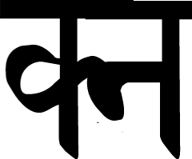

Г.Бюлер

«Руководство к элементарном курсу санскритского языка».

Стокгольм, 1923

Версия 2.0

Электронная версия упражнений из учебника Г.Бюлера предназначена тем, кто совершенствует свои знания в области санскритской грамматики. Ее создание обусловлено, тремя факторами:

-труднодоступностью издания. К сожалению, репринтные переиздания также исчезли из продажи;

\- мелким шрифтом и плохим качеством бумаги репринтного издания.

\- немалым количеством опечаток в тексте на devanāgarī.

В электронной версии 48 уроков, в каждом из которых -- два упражнения: перевод с санскрита и перевод на санскрит. Исключение составляют уроки 43-47, где дан только перевод на санскрит. К упражнениям приложен маленький русско-санскритский словарик.

В электронной версии исправлены переводы некоторых слов. (Согласитесь, что переводы слов aśvin *du* как «Диоскуры», а nakṣatra как «фазис луны» несколько устарели).

Глагольные корни в словах к урокам даны в ступени guṇa.

Отдельная благодарность моим ученикам Сергею Сачкову и Мареку Ганусу за помощь в подготовке электронной версии.

Лихушина Наталия Павловна.

апрель 2008 года.

# СЛОЖЕНИЕ СОГЛАСНЫХ.

क्क kka, क्त kta, क्त्य ktya, क्त्र ktra, क्त्व ktva, क्न kna, {width="0.17152777777777778in" height="0.12569444444444444in"} kma, क्य kya, क्र kra,

> क्व kva, क्ष kṣa,

क्ष्ण kṣṇa, क्ष्म kṣma, क्ष्य kṣya, क्ष्व kṣva.

ख्य khya.

ग्द gda, ग्ध gdha, ग्न gna, ग्भ gbha, ग्म gma, ग्य gya, ग्र gra, ग्र्य grya, ग्ल gla.

घ्न ghna, घ्य ghya, घ्र ghra.

ङ्क ṅka, ङ्क्त ṅkta, ङ्क्ष ṅkṣa, ङ्क्ष्व ṅkṣva, ङ्ख ṅkha, ङ्ख्य ṅkhya, ङ्ग ṅga, ङ्ग्य ṅgya,

> ङ्ग्र ṅgra, ङ्घ ṅgha, ङ्म ṅma.

च्च cca, च्छ ccha, च्छ्र cchra, च्छ्व cchva, च्म cma, च्य cya.

ज्ज jja, ज्झ jjha, ज्ञ jña, ज्य jya, ज्र jra, ज्व jva.

ञ्च ñca, ञ्छ ñcha, ञ्ज ñja.

ट्क ṭka, ट्ट ṭṭa, ट्य ṭya.

ठ्य ṭhya.

ड्य ḍya.

ढ्य ḍhya.

ण्ट ṇṭa, ण्ठ ṇṭha, ण्ड ṇḍa, ण्ण ṇṇa, ण्य ṇya, ण्व ṇva.

त्क tka, त्त tta, त्त्य ttya, त्त्र ttra, त्थ ttha, त्न tna, त्प tpa, त्म tma, त्म्य tmya,

> त्य tya, त्र tra, त्र्य trya, त्व tva, त्स tsa, त्स्न tsna, त्स्य tsya.

थ्य thya.

द्ग dga, द्ग्र dgra, द्द dda, द्द्य ddya, द्द्र ddra, द्द्व ddva, द्ध ddha, द्ध्य ddhya,

> द्ध्व ddhva, द्न dna, द्भ dbha, द्भ्य dbhya, द्म dma, द्य dya, द्र dra, द्व dva.
>
> ध्न dhna, ध्म dhma, ध्य dhya, ध्न dhra, ध्व dhva.

न्त nta, न्त्य ntya, न्त्र ntra, न्थ ntha, न्द nda, न्द्र ndra, न्ध ndha, न्ध्य ndhya, न्ध्न ndhra, न्न nna, न्म nma, न्य nya, न्र nra, न्व nva, न्स nsa.

प्त pta, प्त्य ptya, प्न pna, प्म pma, प्य pya, प्र pra, प्ल pla, प्स psa.

फ्य phya.

ब्द bda, ब्न bna, ब्र bra, ब्य bya.

भ्य bhya, भ्र bhra.

म्न mna, म्प mpa, म्ब mba, म्भ mbha, म्य mya, म्र mra, म्ल mla.

य्य yya, य्व yva.

र्क rka, र्के rke, र्को rko, र्कि rki, र्की rkī, र्कं rkaṃ.

ल्क lka, ल्प lpa, ल्म lma, ल्य lya, {width="0.14166666666666666in" height="0.12430555555555556in"} lla.

व्य vya, व्र vra.

श्च śca, श्च्य ścya, श्छ ścha, श्न śna, श्य śya, श्र śra, श्ल śla, श्व śva.

ष्क ṣka, ष्क्र ṣkra, ष्ट ṣṭa, ष्ट्य ṣṭya, ष्ट्र ṣṭra, ष्ट्व ṣṭva, ष्ठ ṣṭha, ष्ठ्य ṣṭhya, ष्ण ṣṇa,

> ष्प ṣpa, ष्प्र ṣpra, ष्म ṣma, ष्य ṣya, ष्व ṣva.

स्क ska, स्ख skha, स्त sta, स्त्र stra, स्थ stha, स्न sna, स्प spa, स्फ spha,

> स्म sma, स्म्य smya, स्य sya, स्र sra, स्व sva.

ह्ण hṇa, ह्न hna, ह्म hma, ह्य hya, ह्र hra, ह्ल hla, ह्व hva.

# УРОК I.

**Спряжение.**

[Предварительное замечание.]{.underline} Санскритские глаголы имеют десять времен и наклонений, а каждое из последних три числа (единственное, двойственное и множественное) для трех лиц. Все времена и наклонения имеют и активную (раrаsmaipada), и медиальную (ātmanepada) форму с характерными для каждой из них личными окончаниями. Времена и наклонения следующие:

+:-----------------------------------+:----------------------------------+
| 1\. indicativus (настоящее время), | 6\. описательное будущее,         |
|                                    |                                   |
| 2\. imperfectum,                   | 7\. простое будущее,              |
|                                    |                                   |
| 3\. imperativus,                   | 8\. conditionalis,                |
|                                    |                                   |
| 4\. optativus (potentialis),       | 9\. precativus (benedictivus),    |
|                                    |                                   |
| 5\. perfectum,                     | 10\. аорист.                      |
+------------------------------------+-----------------------------------+

Первые четыре производятся от особой основы настоящего времени, образуемой от корней десятью различными способами. Корни по этому делятся на десять классов.

1.  [Indicativus parasmaipada]{.underline}. К глагольным корням I кл. при образовании основы наст. времени перед личными окончаниями присоединяется **а**, который в первом лице ед., дв. и мн ч. ind. заменяется ā. Напр. vad говорить: vada и vadā.

  --------- -------------------- ------------------- -----------------
                   Ед. ч.              Дв. ч.             Мн. ч.

     1\.          vad-ā-mi          vad-ā-vaḥ(s)       vad-ā-maḥ(s)

     2\.          vad-a-si          vad-a-thaḥ(s)        vad-a-tha

     3\.          vad-a-ti          vad-a-taḥ(s)         vad-a-nti
  --------- -------------------- ------------------- -----------------

2.  Правило saṃdhi. Конечные s и r слов, стоящих в конце предложений, всегда превращаются в висаргу, : = ḥ, обыкновенно также и перед k, kh, p, ph и перед шипящими \[ś, ṣ , s\].

3.  [Indicativus praesentis]{.underline} обозначает

> а) настоящее время;
>
> б) непосредственное будущее;
>
> в) прошедшее при живом изложении (praes. historicum)
>
> Глаголы I класса:
>
> pat - падать, лететь
>
> dah - гореть, жечь
>
> yaj - приносить жертву

(*кому*-Acc., *что*-In. *для кого-*D.)

> śaṃs - прославлять
>
> vas - жить, обитать
>
> rakṣ - защищать
>
> jīv - жить
>
> car - ходить, совершать, пастись
>
> nam - кланяться (D.), почитать
>
> pac - варить, готовить
>
> dhāv - бежать
>
> tyaj - покидать
>
> vah - нести, течь, дуть, веять
>
> Другие части речи (наречия, предлоги, союзы, частицы):

atas - отсюда, поэтому

> atra - здесь, сюда
>
> adhunā - теперь, сейчас
>
> adya - сегодня
>
> itas - отсюда, поэтому
>
> iti - так, *конец прямой речи*
>
> ittham - так
>
> iha - здесь
>
> eva - именно, только
>
> evam - так
>
> katham - как?
>
> kadā - когда?
>
> kutas - откуда? почему?
>
> kutra - где? куда?
>
> kva - где? куда?
>
> ca - и
>
> tatas - оттуда, потому, потом
>
> tathā - так
>
> tatra - там, туда
>
> tadā - тогда
>
> tu, kiṃtu - но, же
>
> punar - снова, опять
>
> yatas - откуда, почему
>
> yathā - как
>
> yatra - где, куда
>
> yadā - когда, если
>
> sadā - всегда
>
> sarvatra - повсюду, везде
>
> he - о!
>
> अद्य जीवामः। सदा पचथः। अत्र रक्षति। अधुना रक्षामि। यदा धावथ तदा पतथ।
>
> क्व यजति। तत्र चरथः। कुतः शंसति। त्यजामि कथम्। पुनः पतावः। दहसि।
>
> एवं वदन्ति। तत्र वसावः। सर्वत्र जीवन्ति॥
>
> Сегодня (1) (они) покидают (2). Теперь (1) (вы) идете (2). (Я) всегда (1) защищаю (2). (Мы оба) снова (2) кланяемся (1). Куда (1) (ты) бежишь (2)? (Они оба) варят. (Вы) покидаете. (Он) горит. Теперь (1) (мы) живем (2). (Вы оба) славите. Почему (2) (вы) кланяетесь (1)? Там (1) (они) летят (2). Где (1) (вы) живете (2)?

# УРОК II.

[Таблица подъема гласных]{.underline}.

  ---------------------------- ---- ---- ---- ---- ----
  Низшая ступень                \-   i    u    ṛ    ḷ

  1ая степень подъема guṇa      a    e    o    ar   al

  2ая степень подъема vṛddhi    ā    ai   au   ār   āl
  ---------------------------- ---- ---- ---- ---- ----

Допускают 1ую степень повышения все гласные, стоящие на конце корня, а также краткие гласные, после которых стоит лишь один согласный.

1\. а) Корни I кл., оканчивающиеся на i, ī, u, ū, ṛ, ṝ заменяют их соответствующим guṇa - e, o, ar; напр. ji и nī образуют je и ne, dru и bhū --- dro и bho, smṛ и tṝ --- smar и tar.

б) e перед следующим за ним признаком основы настоящего времени a превращается в ауа, o в ava, ar в ara, напр. 3. л. ед. ч. dravati, bhavati, jayati, nayati, smarati, tarati.

2\. Корни, оканчивающиеся на один только согласный, перед которым стоят краткие гласные i, u, ṛ или ḷ также заменяют их соответственным guṇa, напр. cit изменяется в cet, budh в bodh, vṛṣ в varṣ, kḷp в kalp, 3. л. ед. ч. cetati, bodhati, varṣati, kalpate**.**

3\. Корни, оканчивающиеся на e и ai, перед признаком основы настоящего, a, изменяют эти звуки в aya и āya, напр, hve, 3. л. ед. ч. hvayati, gai, 3. л. ед. ч. gāyati.

4\. [Мужской и средний род на a]{.underline}

а) Муж. род:

  ------ ---------------- ---------------- -----------------
              Ед.ч.            Дв.ч.             Мн.ч.

  Nom.        devaḥ            devau             devāḥ

  Voc.         deva            devau             devāḥ

  Acc.        devam            devau             devān
  ------ ---------------- ---------------- -----------------

б) Средн. род:

+:-----+:-------------:+:-------------:+:---------------:+
|      | Ед.ч.         | Дв.ч.         | Мн.ч.           |
+------+---------------+---------------+-----------------+
| Nom. | phalam        | phale (a+i)   | phalāni         |
+------+               |               |                 |
| Acc. |               |               |                 |
+------+---------------+---------------+-----------------+
| Voc. | phala         | phale (a+i)   | phalāni         |
+------+---------------+---------------+-----------------+

5\. [Главные значения падежей:]{.underline}

1\. Nominativus --- падеж подлежащего.

2\. Accusativus --- падеж дополнения и обозначает большею частью прямое дополнение, иногда и косвенное, кроме того направление и протяжение (время и пространство).

6\. [Соединения конечных и начальных гласных]{.underline}:

a или ā + a или ā = ā

a или ā + i или ī = e

a или ā + u или ū =o

a или ā + ṛ = ar

a или ā + o или au = au

a или ā + e или ai = ai

7\. Суффиксальный s, за которым следует гласный, n, m, y или v, превращается в ṣ, если предшествует ему какой-нибудь иной гласный чем a или ā либо непосредственно, либо будучи отделен висаргой или анусварой; напр. agni + su \> agniṣu; deve + su \> deveṣu; dhanus + ā \> dhanuṣā.

Точно также начальный корневой s часто изменяется в ṣ, st в ṣṭ, sth в ṣṭh и sn в ṣṇ**,** если ему при удвоении корня предшествует иной гласный чем a или ā, напр, ti + stha = tiṣṭha

Глаголы I класса

ji - побеждать, завоевывать;

nī - вести, направлять;

bhū - быть, становиться, происходить;

smar - вспоминать;

tar - переправлять, спасать;

varṣ - идти (о дожде), осыпать дарами;

pā (piba-) - пить;

sthā (tiṣṭha-) - стоять, находиться;

darś (paśya-) - смотреть, видеть;

gam (gaccha-) - идти, ходить;

yam (yaccha-) - давать;

Существительные

*т*

deva - бог;

nara - мужчина, человек;

putra - сын;

gaja - слон;

grāma - деревня;

nṛpa - царь;

*n*

phala - плод, награда;

gṛha - дом;

nagara - город;

jala - вода;

kṣīra - молоко;

dāna - подарок, подаяние;

सदा देवान्स्मरन्ति। गृहं गच्छामः। जलं पिबति पुत्रः। नृपौ जयतः।

कदा फलानि यच्छथः। कुत्राधुना गजं नयामि। तरन्ति देवाः। तरथ हे देवाः।

ग्रामे गच्छति नरः। नरः पुत्रौ पश्यति। देवं यजावः। पुत्रा ग्रामं गच्छन्ति।

तत्र गृहे भवतः। सर्वत्र दानानि वर्षन्ति नृपाः॥

Мужчина (1) пьет (3) молоко (2).

Царь (3) направляет (2) слона (1).

(Два) дома (1) рушатся (=падают, 2).

Бог (3) дает (2) воду (1).

(Вы оба) вспоминаете (2) (об обоих) богах (1, Acc.).

Царь (3) завоевывает (2) деревню (1).

О мужи (1), (мы) видим (3) город (2).

(Они) варят (2) плоды (1).

Муж (3) преклоняется (2) (перед) богами (1, Acc.).

(Оба) слона (1) живы (=живут, 2).

Боги (2) дают дождь (varṣ, 1).

# УРОК III.

1\. а) [Корни VI кл]{.underline}., подобно корням I кл., в основе настоящего времени перед личными окончаниями вставляют **a**, но их гласные не заменяются соответственным guṇa, напр. kṣip-kṣipa, tud-tuda, kṛṣ-kṛṣa; Ind. pr. par. kṣipāmi, kṣipasi, kṣipati и т. д.

б) Конечный ṝ корней переходит в ir**,** напр. kṝ сыпать -- kira, kirati; конечное u и ū переходит в uv, напр. dhū -- dhuva, dhuvati; конечное i в iy**,** напр. kṣi, kṣiya, kṣiyati.

2\. [Склонение основ муж. и средн. р. на **a**.]{.underline}

+:----:+:-------------:+:-------------:+:---------------:+
|      | Ед.ч.         | Дв.ч.         | Мн.ч.           |
+------+---------------+---------------+-----------------+
| I.   | devena        | devābhyām     | devaiḥ (s)      |
+------+---------------+               +-----------------+
| D.   | devāya        |               | devebhyaḥ (s)   |
+------+---------------+               |                 |
| Abl. | devāt         |               |                 |
+------+---------------+---------------+-----------------+
| G.   | devasya       | devayoḥ (s)   | devānām         |
+------+---------------+               +-----------------+
| L.   | deve (a+i)    |               | deveṣu (su)     |
+------+---------------+---------------+-----------------+

Точно также phalena, phalāya и т. д.

3\. [Главные значения падежей]{.underline}:

a\) [Instrumentalis]{.underline} (Творительный) отвечает на вопросы с кем? посредством чего?, выражает сопровождение, действующее лицо или орудие.

б) [Дательный]{.underline} обозначает направление или то, в пользу чего действие совершается (Dativus commodi).

в) [Ablativus]{.underline} (Отложительный) отвечает на вопрос откуда? и обозначает причину.

г) [Родительный]{.underline} обозначает всякого рода принадлежность (Genitivus subjectivus, objectivus и partitivus).

д) [Locativus]{.underline} (Местный) обозначает место и время совершения действия, и также направление.

Глаголы VI класса:

kṣip - бросать;

viś - входить;

pracch (pṛccha-) - спрашивать;

karṣ (kṛṣa-) - пахать;

sparś (spṛśa-) прикасаться;

iṣ (iccha-) искать, желать;

diś - показывать;

sic (siñca-) - капать, поливать;

sarj (sṛja-) - творить, выпускать;

Глаголы I класса:

hvā (hvaya-) - звать;

sad (sīda-) - сидеть;

guh (gūha-) - прятать;

Существительные:

*т*

megha - облако;

hasta - рука;

mārga - дорога;

kunta - копье;

kaṭa - циновка;

bāla - мальчик;

śara- стрела;

*п*

dhana - деньги, богатство;

sukha - счастье, благо;

lāṅgala - плуг;

kṣetra - поле

viṣa - яд;

धनानि गृहेषु गूहन्ति। कुन्तान्हस्ताभ्यां क्षिपामः। नृपाय नरौ मार्गं दिशतः।

मार्गेण ग्रामं गच्छावः। सुखेनेह गृहे तिष्ठति पुत्रः। जलं सिञ्चति मेघः।

धनेन सुखमिच्छन्ति नराः। हस्तयोः फले तिष्ठतः। जलं हस्तेन स्पृशसि।

नरौ कटे सीदतः। क्षेत्राणि लाङ्गलैः कृषन्ति। नगरं नृपौ विशतः। नरः पुत्रेण मार्गं गच्छति।

नरान्सृजति देवः। बालौ गृहे ह्वयति नरः॥

Мальчик (4) спрашивает (3) людей (1, Acc.) о дороге (2, Acc.).

Облака (1) проливают (4, sic) воду (3, Acc.) (на) поля (2, Loc.).

(Они оба) идут (3) (двумя) путями (1, In.) в город (2).

Царь (4) дает (3) (обоим) людям (1) денег (2).

(На) циновках (3) сидят (4) сыновья (2) (этого) человека (1).

Воду (2) (из) облаков (1, Gen.) дают (3) боги (4).

Водою (1) умываем (=прикасаемся, 3) (мы) (обе) руки (2).

(Оба) человека (1) (своих обоих) сыновей (2) ведут (4) домой (3).

(Оба) мальчика (3) указывают (4) дорогу (2) в город (1, Gen.).

# УРОК IV.

1.  Существ, м. р. на i; agni огонь.

+:----:+:------------:+:-------------:+:--------------:+
|      | Ед.ч.        | Дв.ч.         | Мн.ч.          |
+------+--------------+---------------+----------------+
| N.   | agni-ḥ (s)   | agnī          | agnay-aḥ (s)   |
+------+--------------+               |                |
| V.   | agne         |               |                |
+------+--------------+               +----------------+
| Acc. | agnim        |               | agnī-n         |
+------+--------------+---------------+----------------+
| I.   | agni-n-ā     | agnibhyām     | agni-bhiḥ (s)  |
+------+--------------+               +----------------+
| D.   | agnay-e      |               | agni-bhyaḥ (s) |
+------+--------------+               |                |
| Abl. | agneḥ (s)    |               |                |
+------+              +---------------+----------------+
| G.   |              | agny-oḥ (s)   | agnī-n-ām      |
+------+--------------+               +----------------+
| L.   | agn-au       |               | agni-ṣu (su)   |
+------+--------------+---------------+----------------+

2\. Существ, ср. р. на i; vāri вода.

+:----:+:------------:+:-------------:+:--------------:+
|      | Ед.ч.        | Дв.ч.         | Мн.ч.          |
+------+--------------+---------------+----------------+
| N.   | vāri         | vāri-ṇ-ī      | vārī-ṇ-i       |
+------+--------------+               |                |
| V.   | vāri, vāre   |               |                |
+------+--------------+               |                |
| Acc. | vāri         |               |                |
+------+--------------+---------------+----------------+
| I.   | vāri-ṇ-ā     | vāri-bhyām    | vāri-bhiḥ (s)  |
+------+--------------+               +----------------+
| D.   | vāri-ṇ-e     |               | vāri-bhyaḥ (s) |
+------+--------------+               |                |
| Abl. | vāri-ṇ-as    |               |                |
+------+              +---------------+----------------+
| G.   |              | vāri-ṇ-oḥ (s) | vārī-ṇ-ām      |
+------+--------------+               +----------------+
| L.   | vāri-ṇ-i     |               | vāri-ṣu (su)   |
+------+--------------+---------------+----------------+

> 3\. Прилагательные на i (m,n.) склоняются одинаково с существительными. Но в среднем роде для dat., abl., gen., loc. sing., и gen. loc. dualis могут употребляться также формы муж. р.

4\. Правила saṃdhi.

а) Перед начальным кратким a и звонкими согласными конечный aḥ, восходящий к as, превращается в o, а краткий a исчезает, напр. nṛpaḥ atra \> nṛpo \`tra; nṛpaḥ jayati \> nṛpo jayati.

б) Перед всеми гласными, за исключением краткого a, т. е. перед i, ī, u, ū, ṛ и двугласными (e, ai, o, au), aḥ, восходящий к as, превращается в a, напр. nṛpaḥ + icchati \> nṛpa icchati; tataḥ udakam \> tata udakam.

в) Конечный āḥ, восходящий к ās, перед гласными, двугласными и звонкими согласными превращается в ā, напр. nṛpāḥ icchanti \> nṛpā icchanti; nṛpāḥ jayanti \> nṛpā jayanti.

г) Висарга конечных aḥ и āḥ, восходящих к ar и ār, а также висарга окончаний iḥ, īḥ, uḥ, ūḥ, eḥ, aiḥ, oḥ перед начальными гласными и звонкими согласными превращается в r; перед r же она исчезает, а краткий предыдущий гласный удлинняется, напр. punaḥ atra \> punar atra, dvāḥ atra \> dvār atra, agniḥ dahati \> agnir dahati, punaḥ rāmaḥ \> punā rāmaḥ, agniḥ rocate \> agnī rocate.

> Глаголы VI класса: Глаголы I класса
>
> muc (muñca-) - освобождать, отпускать; gup (gopāya-) - стеречь, защищать;
>
> kart (kṛnta-) - резать; ruh - расти;
>
> lip (limpa-) - мазать;
>
> lup (lumpa-) - ломать, грабить;

Существительные на -а

> *т п*
>
> jana - человек, люди; pāpa - грех, зло;
>
> vṛkṣa - дерево; duḥkha - несчастье, горе;
>
> śiva - имя бога; satya - правда, истина;

rāma - имя героя; viṣa - яд;

śara - стрела;

Существительные на -i, *m*

agni - огонь;

ari - враг;

ṛṣi - пророк, мудрец;

kavi - поэт;

asi - меч;

pāṇi - рука;

giri - гора;

hari - имя бога

सदा देवा जनान्मुञ्चन्ति पापात्। नृपस्य पुत्रौ क्व वसतः। ऋषिर्दुःखात्पुत्रं गोपायति।

नृपो ऽसिना ऽरेः पाणी कृन्तति। कवयो हरिं शंसन्ति। अरयो जनानां धनं लुम्पन्ति।

जलं गिरेः पतति। शरान्विषेण लिम्पथ। वृक्षा गिरौ रोहन्ति। ऋषेः पुत्रौ तत्र मार्गे तिष्ठतः।

हरिः कविभ्यां दानानि यच्छति। ऋषिभी रामो वसति। अग्निना ऽरीणां गृहाणि नृपा दहन्ति।

हरिं क्षीरेण यजतः॥

Шива (1) живет (3) в горах (2).

(Двое) врагов (1) мечут (4) копья (2) (в) царя (3, Dat.).

Рама (1) трогает (4) (обеими) руками (2) (своих двух) сыновей (3).

Огонь (1) сжигает (3) деревья (2).

Пророки (1) говорят (2) правду (3).

Правдою (1) люди (2, Gen.) достигают (=возникает, 4) счастье (3, Nom.).

(Обе) руки (2) пророка (1) трогают (4) воду (3).

Плоды (1) находятся (3) на деревьях (2).

Люди (1) помнят (3) Хари (2, Acc.).

Хари (1) выручает (=освобождает, 4) людей (2) из несчастья (3).

**Урок V.**

1\. Корни IV кл. в основе наст времени перед личными окончаниями вставляют ya, напр. lubh, lubhya; Ind. Praes. Par. lubhyāmi, lubhyasi, lubhyati и т.д.

2\. Сущ. м. р. на u; bhānu солнце.

+:-----+:-----------:+:-------------:+:---------------:+
|      | Ед.ч.       | Дв.ч.         | Мн.ч.           |
+------+-------------+---------------+-----------------+
| N.   | bhānu-ḥ (s) | bhānū         | bhānav-aḥ (s)   |
+------+-------------+               |                 |
| V.   | bhāno       |               |                 |
+------+-------------+               +-----------------+
| Acc. | bhānum      |               | bhānū-n         |
+------+-------------+---------------+-----------------+
| I.   | bhānu-n-ā   | bhānu-bhyām   | bhānu-bhiḥ (s)  |
+------+-------------+               +-----------------+
| D.   | bhānav-e    |               | bhānu-bhyaḥ (s) |
+------+-------------+               |                 |
| Abl. | bhāno-ḥ (s) |               |                 |
+------+             +---------------+-----------------+
| G.   |             | bhānv-oḥ      | bhānū-n-ām      |
+------+-------------+               +-----------------+
| L.   | bhān-au     |               | bhānu-ṣu        |
+------+-------------+---------------+-----------------+

Муж. род прилагательных на u склоняется точно так же.

3\. Правила saṃdhi

Конечная висарга превращается

а) перед c и ch в ś, напр. naraḥ carati = naraś carati;

naraḥ chalena = naraś chalena.

б) перед ṭ и ṭh в ṣ, напр. punaḥ ṭaṅkaḥ = punaṣ ṭaṅkaḥ;

rāmaḥ ṭhakkuraḥ = rāmaṣ ṭhakkuraḥ

в) перед t и th в s, напр. rāmaḥ tiṣṭhati = rāmas tiṣṭhati.

4\. Предлог ā «до, вплоть до, начиная от» согласуется с Acc. или Abl. В качестве глагольной приставки он обозначает «при, к, на» и т.д.

Глаголы:

lubh IV - желать;

krudh IV -- гневаться (+D., Gen.);

śuṣ IV - засыхать;

kup IV - гневаться, сердиться (+D.);

as IV - бросать, метать;

naś IV - погибать, обращаться в бегство;

snih IV - любить, быть расположенным к

(+ Gen., Loc.);

likh VI - писать;

ā-gam I - приходить;

ā-ruh I - влезать, подниматься на, восходить;

Существительные:

bhānu *т -* солнце;

śatru *т -* враг;

bāhu *т -* рука;

vāyu *т -* ветер;

viṣṇu *т* - имя бога;

bindu *т -* капля;

paraśu *т -* топор;

guru *т -* учитель;

maṇi *т* - драгоценный камень;

udadhi *т -* океан;

pāda *т* - нога, луч, четверть;

śiṣya *т -* ученик;

anna *п -* еда, корм;

sūkta *п -* ведийский гимн;

śikhara *т -* вершина;

aśva *т -* лошадь;

ratna *п -* драгоценный камень;

pattra (patra) *п -* письмо;

rāśi *т -* куча;

Предлог

ā - до, вплоть до, начиная от (+Acc., Abl.)

कवयो धनं लुभ्यन्ति। ऋषिः सूक्तानि पश्यति। गुरू शिष्ययोः क्रुध्यतः। नृपा अरिभ्यः कुप्यन्ति।

अग्निरुदधौ तिष्ठति। परशुना वृक्षान्कृन्तथ। जलस्य बिन्दवो गिरेः पतन्ति। विष्णुमृषिर्यजति नृपाय।

नृपो ऽश्वमारोहति। क्षेत्रेषु जलं शुष्यति। गुरवः शिष्याणां स्निह्यन्ति। नृपाणां शत्रवो ऽसिना नश्यन्ति।

बालो गुरवे पत्त्रं लिखति। जना मणीनां राशीनिच्छन्ति। आ गिरेर्वृक्षा रोहन्ति। बाहुभ्यां जलं नरास्तरन्ति॥

Лучи (2) солнца (1) взбираются (5) теперь (4) (на) горы (3).

Капля (2) воды (1, vāri, jala) падает (4) (из) облака (3).

(Оба) царя (1) расположены (3) (к) поэтам (2).

Ветер (1) веет (4) с вершин (3) гор (2).

Царь (1) мечет (4) копья (3) на врагов (2).

Ученик (1) преклоняется (3) (перед) учителем (2).

(Два) человека (1) приходят (3) (со своими) сыновьями (2).

(Оба они) желают (1) драгоценных камней (2).

О пророк (1), мы приносим жертву (3) Вишну (2, Acc.).

(Оба они) варят (3) пищу (1) (на) огне (2, In.).

Пророки (1) прославляют (4) Вишну (2) гимнами (3).

# УРОК VI.

1\. а) Корни IVкл. на iv удлиняют гласный перед признаком этого класса ya,

напр. div, dīvya, dīvyati

\* Корневые i и u, за которым следует группа согласных, начинающаяся с r или v, удлиняются.

b\) Следующие корни удлиняют свой краткий a: kram, tam, dam, mad, śam, śram, bhram. Последний образует также bhramyati.

2\. а) Сущ. ср. р. на u; madhu мед.

+:------+:--------------:+:--------------:+:---------------:+
|       | Ед.ч.          | Дв.ч.          | Мн.ч.           |
+-------+----------------+----------------+-----------------+
| N.    | madhu          | madhu-n-ī      | madhū-n-i       |
+-------+                |                |                 |
| Acc.  |                |                |                 |
+-------+----------------+                |                 |
| V.    | madhu, madho   |                |                 |
+-------+----------------+----------------+-----------------+
| I.    | madhu-n-ā      | madhu-bhyām    | madhu-bhiḥ (s)  |
+-------+----------------+                +-----------------+
| D.    | madhu-n-e      |                | madhu-bhyaḥ (s) |
+-------+----------------+                |                 |
| Abl.  | madhu-n-aḥ (s) |                |                 |
+-------+                +----------------+-----------------+
| G.    |                | madhu-n-oḥ (s) | madhū-n-ām      |
+-------+----------------+                +-----------------+
| L.    | madhu-n-i      |                | madhu-ṣu        |
+-------+----------------+----------------+-----------------+

b\) Для средн. р. прилагательных на u в Dat., Abl., Gen., Loc., Sing,

и в Gen. и Loc. Dual. могут также употребляться формы муж. р.

3\. Правила saṃdhi.

Конечный n превращается

а) перед начальным j, jh и ś в ñ, напр. tān janān = tāñ janān,

tān śatrūn = tāñ śatrūn В последнем случае вместо ś может стоять ch,

напр. tān śatrūn = tāñ chatrūn.

б) Перед начальным ḍ, ḍh конечный n превращается в ṇ, а перед l в ṃl (или ṃl с анунасикой), напр. tān ḍamarān = tāṇ ḍamarān, tān lokān = tāṃ-l-lokān.

в) Перед начальным ṭ или ṭh, c или ch и t или th конечный n превращается в anusvāra, и за ним вставляется соответствующий шипящий: ṣ, ś, или s, напр.

tān ca = tāṃ-ś ca, tān tathā = tāṃ-s tathā, tān ṭaṅkān = tāṃ-ṣ ṭaṅkān

Глаголы:

ā-kram IV (тж. I krāma) - наступать,

нападать;

div IV - играть;

mad (mādya-) IV - пьянеть;

tuṣ IV - радоваться, быть довольным;

tam IV - быть печальным;

śam IV - успокаиваться, тухнуть;

śram IV - уставать;

bhram IV - бродить, блуждать;

vyadh (vidhya-) IV - пронзать, попадать;

ā-cam (ā-cāma) I - пить, зачерпывать;

ar (ṛccha) I - идти, падать на к.-л.;

har I - брать, отнимать, похищать;

Существительные:

madhu *п* - мед;

aśru *п* - слеза;

vasu *п* - богатство, добро, вещи;

mṛtyu *т* - смерть;

ali *т* - пчела;

nṛpati *т* - царь;

netra *п* - глаз;

mukha *п* - рот, лицо;

ṛkṣa *т* - медведь;

akṣa *т* - кость (игральная);

kṣatriya *т* - воин;

adharma *т* - несправедливость;

kopa *m* - гнев;

ऋक्षा मधु लुभ्यन्ति। ऋषिरधुना पाणिना जलमाचामति। नृपा अक्षैस्तत्र दीव्यन्ति।

अलिर्मधुना माद्यति। नरा विषेणासींल्लिम्पन्ति। रामः क्षत्रियान्परशुनाक्राम्यति।

गुरूञ्शिष्यांश्च शंसामः। अरयो जनानां वसूनि हरन्ति। नरौ मृत्युमृच्छतः। बालस्य

नेत्राभ्यामश्रूणि पतन्ति। जलेनाग्निः शाम्यति। ऋषेरश्वौ श्राम्यतः। गुरुः शिष्यस्य पापात्ताम्यति।

गजा नगरे भ्राम्यन्ति। मधुना क्षीरेण च तुष्यन्ति बालाः॥

Воины (1) играют (3) (на) деньги (2, In.).

Лошади (3) царя (2) устают (5) сегодня (1) (на) пути (4).

Четвертая часть (2) несправедливости (1) падает (4) (на) царя (3).

Воин (1) пронзает (4) врага (3) копьем (2).

Пчела (1) пьет (4) мед (2) ртом (3).

Вода (2, vāri, jala) (его) слез (1) орошает (4) (его) ноги (3).

Там (2) летают (=блуждают, 3) пчелы (1).

(Двое) мужчин (1) варят (5) мед (2) и (4) плоды (3).

Когда (1) гнев (3) учителя (2) прекращается (успокаивается 4), тогда (5) ученики (7) радуются (6).

(В) глазах (2) воинов (1) стоят (4) слезы (3).

Враги (1) осыпают (4, varṣ) царя (2) стрелами (3).

# УРОК VII.

1.  [Корни X кл]{.underline}. перед личными окончаниями в основе наст. врем. вставляют aya,

напр. pīḍ, pīḍaya; Ind. Pras. Par. pīḍāyami, pīḍayasi, pīḍayati и т.д.

2\. а) Корни, предпоследний звук которых --- i, u ṛ или ḷ вместо него имеют так наз. guṇa (см. урок II, 2), напр. cur, coraya, 3-е л. ед. ч. corayati.

b\) Корни, предпоследний звук которых --- краткий a, удлиняют его большей частью, напр. kṣal, kṣālaya, 3-е л. ед. ч. kṣālayati.

c\) Если корень кончается на гласный, последний повышается во вторую степень (vṛddhi), т. е. ai вместо i и ī, au вместо u и ū, ār вместо ṛ и ṝ; ai и au перед aya превращаются в āy и āv, напр. jri, jrāyaya, 3 л. ед. ч. jrāyayati; dhū, dhāvaya, dhāvayati; gṛ, gāraya, gārayati; pṝ, pāraya, pārayati.

3\. [Правила sandhi]{.underline}. Конечный t

а) превращается в d перед начальными гласными

и звонкими g, gh, d, dh, b, bh, y, r, v, h,

напр. meghāt atra = meghād atra, pāpāt rakṣati или + gopāyati = pāpād rakṣati, pāpād gopayati; jalāt bhavati = jalād bhavati

б) перед начальным c и ch превращается в c, перед j и jh в j, перед ṭ и ṭh в ṭ, перед ḍ и ḍh в ḍ, перед l в l, напр.

meghāt ca = meghāc ca, meghāt jalam = meghāj jalam, pāpāt lokam = pāpāl lokam

в) Перед начальным ś t превращается в c, а ś обычно в ch, напр. nṛpāt śatruḥ = nṛpāc śatruḥ или nṛpāc chatruḥ

г) Перед носовыми t обычно превращается в n, напр. gṛhāt nayati = gṛhān nayati; однако он может превратиться и в d.

Глаголы:

kṣal Х - мыть;

cur Х - красть

tul Х - взвешивать;

taḍ Х - бить;

gaṇ (gaṇaya-) Х - считать;

kath (kathaya-) Х - рассказывать, излагать;

daṇḍ Х - наказывать;

pīḍ Х - мучить;

par Х - преодолевать;

pūj Х - почитать;

ā-nī I - приносить;

Существительные:

sūta *т* - кучер;

stena *т* - вор;

janaka *т* - отец;

daṇḍa *т* - палка, наказание;

loka *т* - мир, люди;

rāmāyaṇa *п* - название поэмы;

suvarṇa *п* - золото;

puṇya *п* - заслуга, добродетель;

rūpaka *п* - рупия;

sādhu *т* - святой, праведник;

iva - как, подобно;

स्तेनः सुवर्णं नृपस्य गृहाच्चोरयति। गुरुर्दण्डेन शिष्यांस्ताडयति। सूतो ऽश्वान्पीडयति।

ऋषिर्जलेन पाणी क्षालयति। ग्रामाज्जनान्नगरं नयन्ति। नरौ रूपकाणि गणयतः। नृपाच्छत्रूणां दण्डः।

रामस्य पुत्रौ जनेभ्यो रामायणं कथयतः। सुवर्णं पाणिभ्यां तोलयामः। जनकः पुत्रान्कोपाद्दण्डयति।

गृहाल्लोका आगच्छन्ति। पुण्येन साधुर्दुःखानि पारयति। देवानिव नृपतील्ँलोकः पूजयति।

Воры (1) крадут (4) деньги (3, pl.) людей (2).

(Оба) мальчика (1) моют (3) рот (2).

Отец (1) объясняет (=рассказывает, 5) сыновьям (2) возмездие (4) (за) грех (3).

Ученики (1) почитают (3) учителя (2) и (5) преклоняются (4) (перед ним).

(Вы оба) приносите (3) плоды (1) (в) руках (2, du.) и (5) считаете (их) (4).

Добродетель (1) защищает (3, rakṣ и gup) от несчастья (2).

Кучера (1) бьют (4) лошадей (2) палками (3).

(В) гневе (1, Abl.) пронзает (5) царь (2) вора (3) копьем (4).

# УРОК VIII.

1.  [Indiс. Praes. Ātmanepada (Medium).]{.underline} Перед личными окончаниями вставляются

те же признаки глагольных классов и происходят те же изменения в корне, как и в Par.,

т. е. в I и VI спряжении a, в IV ya, в X aya, напр. labh, labha; sic, siñca; yudh, yudhya; arth, arthaya.

  ------- -------------- ------------- ---------------
              Ед. ч         Дв. ч.         Мн. ч.

     1        labh-e      labh-ā-vahe    labh-ā-mahe

     2      labh-a-se      labh-ethe     labh-a-dhve

     3      labh-a-te      labh-ete      labh-a-nte
  ------- -------------- ------------- ---------------

2\. Главное значение Ātmanepada (т.е. слово для самого себя) у глаголов, которые имеют и par. и ātm., заключается в том, что действие совершается для самого же действующего лица, напр. yajati он приносит жертву (для кого-нибудь другого), yajate он приносит жертву (для себя самого). Но очень многие глаголы спрягаются только в Ātm., и, таким образом, подобно греческим Media, являются Deponentia.

3\. [Правила saṅdhi]{.underline}. Конечные и начальные гласные:

a)  Из i или ī + i или ī получается ī, напр. gacchati iti = gacchatīti.

> Перед другими гласными или двугласными i и ī превращаются в y,

напр. tiṣṭhati atra = tiṣṭhaty atra; yajati ṛṣiḥ = yajaty ṛṣiḥ; nadī atra = nady atra

б) u или ū + u или ū превращаются в ū, напр. sādhu uktam = sādhūktam

Перед другими гласными и двугласными u и ū превращаются в v,

напр. madhu atra = madhv atra; sādhu evam = sādhv evam

в) Из ṛ + ṛ получается ṝ, напр. kartṛ ṛju = kartṝju. Перед другими гласными и двугласными ṛ превращается в r, напр. kartṛ iha = kartr iha

г) e и o перед a остаются без изменения, но последний выпадает,

напр. vane atra = vane \`tra, bhāno atra = bhāno \`tra. Перед другими гласными и двугласными e и o превращаются или в ay и av или чаще в a,

напр. bhāno iti = bhānav iti = bhāna iti; vane iti = vanay iti = vana iti.

e\) Для ī, ū и e двойств. ч. глаголов и имен, а также для состоящих из одного гласного односложных междометий, не допускается эвфонические слияние со следующими за ними гласными, напр. girī iha, mādhū atra, phale atra, i indra.

Глаголы Ā.:

īkṣ I - видеть, смотреть;

kamp I - дрожать, сотрясаться;

bhāṣ I - говорить;

yat I - стремиться к (+D.):

ā-rabh I начинать, приниматься за;

ruc I - нравиться (+ Dat., Gen.);

labh I - получать;

vand I - кланяться, чтить;

śikṣ I - учиться, учить ч.-л.;

sah I - переносить, терпеть;

sev I - служить, почитать;

jan (jāya-) IV - рождаться, возникать;

yudh IV - сражаться (+In.);

mar (mriya-) VI умирать;

arth X - просить, требовать (+Acc. duplex);

Существительные:

anartha *т* - несчастье;

dharma *т* - добродетель, закон;

udyoga *т* - прилежание;

manuṣya *т* - человек;

yajña *т* - жертва, жертвоприношение;

vinaya *т* - послушание;

śūdra *т* - шудра, человек четвертой касты;

kalyāṇa *п,* hita *п* - благо, лучшее;

bala *п* - сила, могущество;

vana *п* - лес;

śāstra *п* - наука, трактат;

dhairya *п* - стойкость;

dvija, dvijāti *т* - дваждырожденный, ариец;

vīci *т* - волна;

taru *т* - дерево;

paśu *т -* скот, жертвенное животное;

na - не;

वायोर्बलेन तरवः कम्पन्ते। असिनाद्यारयो म्रियन्त इत्यत्र नृपो भाषते। वसूनां राशीन्नृपतीन्कवयो ऽर्थयन्ते।

शास्त्रे अधुना शिक्षामह इति पत्त्रे हरिर्लिखति। पापाद्दुःखं जायते। शिष्याणां विनय उद्योगश्च गुरुभ्यो

रोचेते। अधर्माय न धर्माय यतेथे। विष्णो सूक्ते ऋषी लभेते। अत्रर्षिर्भानुं वन्दते। अग्नी ईक्षते बालः।

धनेन पशूल्लँभध्वे यज्ञाय। सदा गुरोः पादौ बालाः सेवन्ते। फले अत्र मनुष्यस्य पाण्योस्तिष्ठतः।

सहेते अनर्थं साधू। वनेष्विहर्क्षा वसन्ति। क्षत्रिया ऋषी सेवन्ते॥

Там (5) (два) дома (4) сотрясаются (6) от силы (3) волн (2) океана (1).

Отец (3) смотрит (4) (на) лицо (2) (своего) сына (1).

(Мы) стремимся (3) (к) благу (2) учеников (1); так (4) говорят (6) учителя (5).

Дети (2) просят (4) отца (1) (о) хлебе (=пище, 3, Acc.).

Там (2) (в) лесу (1) борются (5) слоны (3) (с) медведями (4).

(Два) шудры (3) служат (4) здесь (2) (двум) дваждырожденным (1).

Плоды (1) нравятся (3) детям (2).

Откуда (1) (вы) получаете (3) деньги (2)?

Теперь (1) (оба) пророка (2) начинают (4) жертвоприношение (3).

# УРОК IX.

1\. [Существительные жен. р. на ā]{.underline}; jāyā жена

+------+:------------:+:-------------:+:--------------:+
|      | Ед.ч.        | Дв.ч.         | Мн.ч.          |
+------+--------------+---------------+----------------+
| N.   | jāyā         | jāye          | jāyāḥ (s)      |
+------+--------------+               |                |
| V.   | jāye         |               |                |
+------+--------------+               |                |
| Acc. | jāyā-m       |               |                |
+------+--------------+---------------+----------------+
| I.   | jāya-y-ā     | jāyā-bhyām    | jāyā-bhiḥ (s)  |
+------+--------------+               +----------------+
| D.   | jāyā-y-ai    |               | jāyā-bhyaḥ (s) |
+------+--------------+               |                |
| Abl. | jāyā-y-ās    |               |                |
+------+              +---------------+----------------+
| G.   |              | jāya-y-oḥ (s) | jāyā-n-ām      |
+------+--------------+               +----------------+
| L.   | jāyā-y-ām    |               | jāyā-su        |
+------+--------------+---------------+----------------+

2\. Прилагательные на. a (муж. и ср. р.), ж. р. ā, склоняются в муж. р. как deva,

в ср. р. как phala и в ж. р. как jāyā

3\. Правила saṃdhi. Если слово оканчивается на ai или au, а следующее начинается на гласный, то конечный ai обращается в āy, а au в āv, а также оба могут обратиться в ā напр. jāyāyai atra = jāyāyāy atra = jāyāyā atra; devau atra = devāv atra = devā atra.

Обычно пишут ā вместо ai, но āv вместо au.

4\. После кратких гласных, предлога ā и частицы mā начальный ch превращается в cch, напр. atra chāyā = atra cchāyā, ā chādayati = ā cchādayati

5\. Начальный n в большинстве корней обращается в ṇ после приставок antaḥ (r) между, niḥ(s), parā, pari, pra и duḥ(s) плохо, напр. pra + nayati = praṇayati

6\. Перед глаголами появляются часто следующие приставки:

ava вниз; ud вверх; upa к, при, около; niḥ (s) из; parā прочь, вон, над;

pari кругом, у, совершенно; pra перед, вперед, очень; sam с, вместе с, совершенно.

Глаголы:

saṃ-gam I Ā. - сходиться вместе, соединяться (+In.);

parā-ji I Ā. -- побеждать;

uḍ-ḍī I Ā. -- взлетать;

bhikṣ I Ā. - просить милостыню;

śubh I Ā. -- блистать;

vart I Ā. - становиться, существовать;

pra-pad IV Ā. - отправляться, прибегать к;

marg (mṛgaya) X Ā. -- искать;

ava-gam I P. -- понимать;

ava-tar I P. -- слезать;

ava-ruh I P. -- слезать;

upa-nī I P. - приводить, посвящать;

pari-nī I P.- обводить кругом, жениться;

Существительные:

kanyā *f* - дочь, девушка;

gaṅgā *f* - Ганг;

chāyā *f -* тень;

bhāryā *f* - супруга, жена;

bhāṣā *f -* язык;

bhikṣā *f -* милостыня;

yamunā *f* - название реки;

rathyā *f* - улица;

vidyā *f -* знание, наука;

saṅdhyā *f -* сумерки;

gṛhastha *т -* отец семейства;

prayāga *т* - название города;

vihaga *m* - птица;

vyādha *т -* охотник;

iṣu *т* - стрела;

bhaya *п --* страх;

raṇa *т, п -* сражение;

śaraṇa *п* - защита;

svarga *т --* небо;

hṛdaya *п --* сердце;

Прилагательные:

kṛṣṇa, *f* ā - черный;

pāpa, *f* ā - злой, дурной;

prabhūta, *f* ā - многочисленный;

Наречия:

sahasā - внезапно, быстро;

saha с, - вместе (+In.)

रत्नं रत्नेन संगच्छते। यदा विहगा व्याधं पश्यन्ति तदा सहसोड्डयन्ते। सत्यं हृदयेषु मृगयन्त ऋषयः।

हरेः कन्यां रामः परिणयति। विष्णोर्हरेश्च भार्ये कन्याभिः सहागच्छतः। रामो विष्णुश्च देवाञ्शरणं प्रपद्येते।

भिक्षया रामस्य शिष्यौ वर्तेते। यदा जना गङ्गायां म्रियन्ते तदा स्वर्गं लभन्ते। कन्याया अन्नं यच्छत्यृषेर्भार्या।

वन ऋक्षेष्विषून्मुञ्चन्ति व्याधाः कृष्णौ च म्रियेते। द्विजातीनां भाषां शूद्रा नावगच्छन्ति। हे शिष्या नगरस्य

> रथ्यासु साधूनां भार्याभ्यो भिक्षां लभध्वे। अत्र च्छायायां प्रभूता विहगास्तिष्ठन्ति।
>
> क्षत्रियस्य बालावृषिरुपनयति॥

(Оба) ученика (1) выпрашивают (6) (от) жен (5) отца семейства (4) много (2) милостыни (3, Acc). При (городе) Праяга (1) соединяется (4) Ганг (2) с Ямуной (3). Дурные (1) люди (2) не (4) достигают (5) неба (3). О Вишну (1), сегодня (3) Шива (2) женится (7) (на) Ганге (6), дочери (5) Хари (4). В бою (1) цари (3) сражаются (4) стрелами (2) и (6) побеждают (7) (своих) врагов (5) Здесь (2) (на) улице (3) слезают (6) (оба) царя (1) (с) черных (4) лошадей (5). (Оба) сына (3) пророка (2) блистают (4) знанием (1). (Обе) птицы (4) улетают (5) (из) боязни (3) злого (1) охотника (2, Gen.) (Мы оба) не (3) понимаем (4) языка (2) Хари (1). (В) сумерках (1, du) почитают (4) пророки (2) богов (3). (На) улице (2) деревни (1) встречаются (6) учитель (3) и (5) ученик (4). (Мы оба) приносим жертву (2) богам (1) (для нас самих); мы не (4) приносим жертвы (5) (для) Хари (3).

# УРОК X.

1.  [Страдательный залог]{.underline} образуется при помощи суффикса ya,

присоединяющегося непосредственно к глагольному корню, и принимает личные окончатя Ātm. Глаголы X кл. отбрасывают признак aya, но сохраняют перед ya ту форму, которую они должны иметь перед aya,

напр. labh, labhyate; cur X, coryate; taḍ X, tāḍyate.

2\. Конечный гласный корня подвергается следующим изменениям перед ya:

a\) i и u удлиняются, напр. ji, jīyate; stu, stūyate.

б) ṛ обращается в ri, если предшествует согласный, и в ar, если предшествует группа согласных, напр. kṛ, kriyate; smṛ, smaryate;

в) ṝ обращается в īr, или, если предшествует губной, в ūr, напр. tṝ, tīryate; pṝ, pūryate.

г) ai и o обращаются в ā напр. dhyai, dhyāyate.

д) Конечный гласный обращается в ī в следующих корнях: gai, dā давать, do, dhā, dhe, pā пить, mā, sthā, so, hā, напр. gīyate,dīyate, dhīyate.

3\. i и u в средине глаголов, корни которых оканчиваются на v и r, удлиняются,

напр. div, dīvyate.

4\. Носовой в средине корня часто исчезает, напр. bandh, badhyate; daṅś, daśyate; śaṅs, śasyate.

5\. В корнях vac, vad, vap, vas, vah и svap va превращается в u, напр. vac, ucyate; vas, uṣyate; ya корня yaj превращается в i, а r корней grah и prach в ṛ; hve превращается в hū, śās --- śiṣ; khan, jan, tan растягивать и san образуют khanyate или khāyate, janyate или jāyate и т. д.; śī лежать образует śayyate.

6\. Личная пассивная конструкция очень употребительна в санскрите при переходных глаголах, а также и безличная --- как при переходных, так и при непереходных. Действующее лицо (или вещь) стоит в Instr.

Глаголы:

kar -- делать;

khan I., P. -- копать;

gā I., P. -- петь;

grah -- брать, принимать, схватывать;

daṃś I., P. (daśati) -- кусать;

dā/do I., P.(dyati) -- резать;

dhā -- ставить, класть;

dhe I., P. -- сосать, пить;

dhyā/dhyai I., P. -- думать, размышлять;

par -- наполнять;

bandh -- вязать;

mā -- мерить;

vac -- говорить;

vap I., P. -- сеять;

śās II., P. -- наказывать, повелевать;

śru -- слышать;

stu -- прославлять;

svap -- спать;

hā -- оставлять, покидать, пренебрегать;

ā-hvā -- призывать;

Существительные:

ājñā *f* -- приказание;

āśā *f* -- надежда;

kāṣṭha *n* -- кусок дерева, полено;

gīta *n* -- песня;

ghaṭa *m* -- горшок, сосуд;

ghṛta *n* -- топленое масло;

dhānya *n* -- хлеб;

pāśa *m* -- петля, веревка;

bhāra *m* -- ноша;

bhikṣu *m* -- нищий, аскет;

bhṛtya *m* -- слуга;

mālā *f* -- венок;

rājya *n* -- царство;

śiśu *m* -- дитя;

sarpa *m* -- змея;

Прилагательные:

vidheya*, f* ā -- послушный;

रामेण पुत्रावद्योपनीयेते इति श्रूयते। ऋषिर्नृपेण धर्मं पृछ्यते। घटौ घृतेन पूर्येते। विहगाः॒ पाशैर्बध्यन्ते।

जनैर्नगरं गम्यते। हे शिष्या गुरुणाहूयध्वे। नरैः कटाः क्रियन्ते। कविभिर्नृपाः सदा स्तूयन्ते। प्रभूता भिक्षा गृहस्थस्य भार्यया भिक्षुभ्यो दीयते। कन्याभ्यां गीतं गीयते। स्तेनैर्लोकानां वसु चोर्यते। इषुभी रणे ऽरयो नृपतिना जीयन्ते।

हे देवौ साधुभिः सदा स्मर्येथे। पुण्येन जनास्तीर्यन्ते। प्रभूतः काष्ठानां भारो नरेणोह्यते। अश्वेन जलं पीयते। धर्मेण राज्यं शिष्यते नृपेण। सर्पेण दश्येते नरौ। सूतेनाश्वस्ताड्यते॒॥

Птицам (1) сыплют (3) зерно (2) \[хлеб\]. Венки (1) свиваются (3) девицами (2). Хари (1) снова (2) прославляется (śaṃs, stu, 4). Вишну (1, In.) пьет (4, pass.) воду (3, Nom.) из руки (2). Приятно (1, In. *от* sukha) спится (3) (в) тени (2); так (4) говорят (5, pass.) люди (6, In.). (Обоими) пророками (1) приносится жертва (2). Отцом (1) возлагаются (4) надежды (2) (на свое) дитя (3). Ученик (3, In.) пренебрегает (4, pass.) приказанием (2, Nom.) учителя (1). (Оба) ученика (1, In.) размышляют (3, pass.) (об) учебнике (2, Nom.). (На) полях (1) сеется (3) зерно (2) \[хлеб\]. Играют (2, pass.) (в) кости (1). Приказания (2) царя (1) принимаются (5) послушными (3) слугами (4). Человек (1, In.) копает (3, pass.) на поле (2).

# УРОК XI

1\. Imperfectum Par., подобно индикативу, образуется от основы настоящего времени, к которой присоединяются вторичные формы личных окончаний. Перед глаголом появляется приращение a. Таким образом ji образует ajaya; kṣip -- akṣipa; lubh -- alubhya.

2\. а) Если глагол начинается с гласного, то в результате слияния последнего с приращением получается соответствующий двугласный vṛddhi, т. е. a + i или ī = ai;

a + u или ū = au, a + ṛ = ār

б) Если перед глаголом стоит приставка, то приращение вставляется между нею и глаголом и соединяется с конечным гласным приставки согласно эвфоническим правилам, напр. upa + nī дает основу Imperfecta upānaya.

3\. Парадигма Imperf. Par.

  ------ --------------- ---------------- ----------------
              Ед.ч.           Дв.ч.            Мн.ч.

  1         a-vad-a-m       a-vad-ā-va       a-vad-ā-ma

  2       a-vad-a-ḥ (s)    a-vad-a-tam       a-vad-a-ta

  3         a-vad-a-t      a-vad-a-tām       a-vad-a-n
  ------ --------------- ---------------- ----------------

4\. Imperfectum выражает прошедшее время и употребляется в историческом раcсказе.

5\. [Многосложные сущ. ж. р. на ī,]{.underline} nadī река

+------+:------------:+:-------------:+:--------------:+
|      | Ед.ч.        | Дв.ч.         | Мн.ч.          |
+------+--------------+---------------+----------------+
| N.   | nadī         | nady-au       | nady-aḥ (s)    |
+------+--------------+               |                |
| V.   | nadi         |               |                |
+------+--------------+               +----------------+
| Acc. | nadī-m       |               | nadī-ḥ (s)     |
+------+--------------+---------------+----------------+
| I.   | nady-ā       | nadī-bhyām    | nadī-bhiḥ (s)  |
+------+--------------+               +----------------+
| D.   | nady-ai      |               | nadī-bhyaḥ (s) |
+------+--------------+               |                |
| Abl. | nady-āḥ (s)  |               |                |
+------+              +---------------+----------------+
| G.   |              | nady-oḥ (s)   | nadī-n-ām      |
+------+--------------+               +----------------+
| L.   | nady-ām      |               | nadī-ṣu        |
+------+--------------+---------------+----------------+

6\. Правило saṃdhi. Конечные n̄, ṇ и n, если им предшествует краткий гласный, перед начальными гласными и двугласными удваиваются,

напр. atiṣṭhan atra = atiṣṭhann atra

Глаголы:

ava-kart VI P. - срубать;

paṭh I P. - читать (вслух);

upa-viś VI U.- садиться;

pra-viś VI U. - входить;

ā-har I P. - приносить;

Существительные:

artha *m* -- цель, смысл, богатство;

indra -- имя бога;

indrāṇī -- имя богини;

kāvya *n* -- стихотворение;

grantha *m* -- сочинение, текст, книга;

jananī *f* -- мать;

dāsī *f* -- рабыня, служанка;

devī *f* -- богиня, царица;

nagarī *f* -- город;

nārī *f* -- женщина, жена;

patnī *f* -- супруга;

putrī *f* -- дочь;

pustaka n -- книга (рукопись);

pūra *m* -- высокая вода, половодье;

pṛthivī *f* -- земля, почва;

matsya *m* -- рыба;

vāpī *f* -- пруд;

sabhā *f* -- собрание;

senā *f* -- войско;

stotra *n* -- хвалебная песнь;

Прилагательные:

śīta, *f* ā -- прохладный, холодный;

नृपतिर्नगरीं सेनयाजयत्। कवयः सभायां काव्यान्यपठन्। देवीर्देवांश्च हरिरपूजयत्। साधोः पत्न्या भिक्षवे रूपकाणि दीयन्ते। नदीषु मत्स्यानपश्याम। पुस्तकं पुत्र्या अयच्छद्विष्णुः। नगर्या रथ्यासु गजावभ्राम्यताम्। पृथिव्या विहगा उड्ड यन्ते । गृहं पूरेणोह्यते। पत्नीभिर्नरा नगर आगच्छन्। यदा शिवो विष्णुश्च ग्रन्थमपठतां तदार्थं नावागच्छाव। शिष्या गुरोर्गृहं प्राविशन्नुपाविशंश्च कटयोः पृथिव्याम्॥

(От) реки (1) веет (4) прохладный ветер (3). Когда (1) (вы) просили (4) (у) царя (2) защиты (3), тогда (5) (вы) находились (7) в несчастье (6). (В обеих) реках (1), Ганге (2) и (4) Ямуне (3), половодье (5) (дополнить глаг. vart, 6). (Обе) женщины (1) пели (4) хвалебную песнь (3) Раме (2, Gen.). О пророки (1), почему (2) приносите (вы оба) в жертву (5) богиням (3) топленое масло (4, In.)? Служанки (2) царицы (1) принесли (6) алмазы (3) и (5) драгоценные камни (4). (В) гневе (1) учитель (2) бил (4) рукой (3) ученика (5). (Двое) слуг (1) принесли (5) (из) пруда (3) воду (4) (в) кувшинах (2). (Вы) рубили (4) топором (1) дрова (3) (с) деревьев (2). Пророк прославлял (6) гимнами (5) Индрани (4), супругу (3) Индры (2).

# УРОК XII.

1\. Существительное ж.р. на i; mati мнение

+------+:-----------:+:-----------:+:--------------:+
|      | Ед.ч.       | Дв.ч.       | Мн.ч.          |
+------+-------------+-------------+----------------+
| N.   | mati-ḥ (s)  | matī        | matay-aḥ (s)   |
+------+-------------+             |                |
| V.   | mate        |             |                |
+------+-------------+             +----------------+
| Acc. | mati-m      |             | matī-ḥ (s)     |
+------+-------------+-------------+----------------+
| I.   | maty-ā      | mati-bhyām  | mati-bhiḥ (s)  |
+------+-------------+             +----------------+
| D.   | matay-e     |             | mati-bhyaḥ (s) |
|      |             |             |                |
|      | maty-ai     |             |                |
+------+-------------+             |                |
| Abl. | mate-ḥ (s)  |             |                |
|      |             |             |                |
|      | maty-āḥ (s) |             |                |
+------+             +-------------+----------------+
| G.   |             | maty-oḥ (s) | matī-n-ām      |
+------+-------------+             +----------------+
| L.   | mat-au      |             | mati-ṣu        |
|      |             |             |                |
|      | maty-ām     |             |                |
+------+-------------+-------------+----------------+

2\. Существ, ж. р. на u; dhenu корова.

+------+:------------:+:------------:+:---------------:+
|      | Ед.ч.        | Дв.ч.        | Мн.ч.           |
+------+--------------+--------------+-----------------+
| N.   | dhenu-ḥ (s)  | dhenū        | dhenav-aḥ (s)   |
+------+--------------+              |                 |
| V.   | dheno        |              |                 |
+------+--------------+              +-----------------+
| Acc. | dhenu-m      |              | dhenū-ḥ (s)     |
+------+--------------+--------------+-----------------+
| I.   | dhenv-ā      | dhenu-bhyām  | dhenu-bhiḥ (s)  |
+------+--------------+              +-----------------+
| D.   | dhenav-e     |              | dhenu-bhyaḥ (s) |
|      |              |              |                 |
|      | dhenv-ai     |              |                 |
+------+--------------+              |                 |
| Abl. | dheno-ḥ (s)  |              |                 |
|      |              |              |                 |
|      | dhenv-āḥ (s) |              |                 |
+------+              +--------------+-----------------+
| G.   |              | dhenv-oḥ (s) | dhenū-n-ām      |
+------+--------------+              +-----------------+
| L.   | dhen-au      |              | dhenu-ṣu        |
|      |              |              |                 |
|      | dhenv-ām     |              |                 |
+------+--------------+--------------+-----------------+

3\. a) Прилагательные на i и u (см. выше IV.3, V.2 и VI.2б) в ж. р. часто склоняются как mati и dhenu.

б) Прилагательные на u, если конечному u предшествует только один согласный, в ж. р. могут принимать суффикс ī, и склоняются как nadī, напр. guru тяжелый, ж. p. gurvī; bahu\| многий --- bahvī. Эти формы ж. р. более употребительны.

Глаголы:

kalp I Ā. - делать, служить чему;

upa-diś VI P. - учить, наставлять;

vid VI U. (vinda-) - достигать, находить.

Существительные:

kalaha *m.,* *n* - ссора;

kīrti *f* - слава;

gopa *m* - пастух;

jāti *f* - порода, каста;

dhṛti *f* - решимость, мужество;

pārthiva *m*. - царь, князь;

buddhi *f* - ум, разум;

bhakti *f* - преданность, почитание;

bhāga *m*. - кусок, часть, доля;

bhūti *f* - благополучие, благословение;

bhūmi *f* - земля, почва, страна;

makṣikā *f* - муха, комар;

mukti *f* - избавление, спасение;

yaṣṭi *f* - прут;

raśmi *m* - узда, луч;

rātri *f* - ночь;

vraṇa *m, n* - рана;

śānti *f* - покой;

śruti *f* - слух, священное писание;

smṛti *f* - воспоминание, предание, свод законов;

svapna *m* - сон, сновидение;

hanu *f* - челюсть.

Прилагательные:

nīca, *f* ā - низкий;

mukhya, *f* ā - отличный, превосходный, первый;

laghu *m, f, n*, (или *f* laghvī) - легкий.

मक्षिका व्रणमिच्छन्ति धनमिच्छन्ति पार्थिवाः।

नीचाः कलहमिच्छन्ति शान्तिमिच्छन्ति साधवः ॥ १॥

शान्त्यर्षय इह शोभन्ते। श्रुतौ बहुषु स्मृतिषु च धर्म उपदिश्यते। रात्र्यां स्वप्नं न लभामहे। बह्वीं कीर्तिं धृत्याविन्दन्नृपतिः। पुण्येन मुक्तिं लभध्वे। बहूनिषून्रणे ऽरिष्वक्षिपन्नृपतिः। हन्वामश्वाल्लँँघ्वा यष्ट्याताडयम्।

नृपतेर्बुद्ध्या क्षत्रियाणां कलहो ऽशाम्यत्। शूद्राणां जातयो नीचा गण्यन्ते। द्विजातीनां जातिषु ब्राह्मणा मुख्याः।

धर्मो भूत्यै कल्पते। जात्या क्षत्रियौ वर्तेथे। भूमेर्भागं ब्राह्मणायायच्छत्पार्थिवः। अश्वा अश्राम्यन्भूमावपतंश्च॥

Вишну (3) радуется (4) почитанию (2, In.) благочестивых (1) и (6) дает (7) избавление (5). Люди (3) многих (1) каст (2) жили (5) (в) городе (4). Птицы (1) взлетают (3) (с) земли (2). Силою (2) ума (1) преодолеваем (4) (мы) несчастье (3, pl.). Пастух (1) стережет (4) коров (3) (в) лесу (2). Умом (1) и (3) прилежанием (2) (вы) добываете (6) великую (4, = многую) славу (5). Стихотворение (1) служит (4) поэту (2) (к) почету (3). (Ради) благополучия (1) (мы оба) преклоняемся (3) (перед) Шивой (2). Узда (1, pl.) прикреплена (bandh) (4) (к обеим) челюстям лошади (2). Ночью (1) читали (мы оба) (3) священное писание (2).

# УРОК XIII.

1\. Imperfectum Ātmanepada (Medium) образуется, подобно Par., от основы наст. вр. и получает приращение a. Личные окончания являются большей частью видоизменениями окончаний Praes. Ātm. --- Passivum в имперфекте имеет окончания среднего залога

  ------ ------------------- ----------------- ----------------
                Ед.ч.              Дв.ч.            Мн.ч.

  1         a-labhe (a+i)      a-labh-ā-vahi    a-labh-ā-mahi

  2       a-labh-a-thāḥ (s)    a-labh-ethām     a-labh-a-dhvam

  3          a-labh-a-ta        a-labh-etām      a-labh-a-nta
  ------ ------------------- ----------------- ----------------

2\. Склонение односложных сущ. ж. р. на ī; dhī ум.

+------+:-----------:+:-----------:+:-------------:+
|      | Ед.ч.       | Дв.ч.       | Мн.ч.         |
+------+-------------+-------------+---------------+
| N.   | dhīḥ (s)    | dhiy-au     | dhiy-aḥ (s)   |
+------+             |             |               |
| V.   |             |             |               |
+------+-------------+             |               |
| Acc. | dhiy-am     |             |               |
+------+-------------+-------------+---------------+
| I.   | dhiy-ā      | dhī-bhyām   | dhī-bhiḥ (s)  |
+------+-------------+             +---------------+
| D.   | dhiy-e      |             | dhī-bhyaḥ (s) |
|      |             |             |               |
|      | dhiy-ai     |             |               |
+------+-------------+             |               |
| Abl. | dhiy-aḥ (s) |             |               |
|      |             |             |               |
|      | dhiy-āḥ (s) |             |               |
+------+             +-------------+---------------+
| G.   |             | dhiy-oḥ (s) | dhī-n-ām      |
|      |             |             |               |
|      |             |             | dhiy-ām       |
+------+-------------+             +---------------+
| L.   | dhiy-i      |             | dhī-ṣu        |
|      |             |             |               |
|      | dhiy-ām     |             |               |
+------+-------------+-------------+---------------+

3\. Перед глаголами ставятся еще следующие приставки: ati пере-, за, из; adhi над, на; anu около, за; api или pi на, к; abhi при, к, против; ni вниз, на, в; prati обратно, против, напротив; vi от.

4\. Saṃdhi после приставок:

а) после приставок, кончающихся на i и u, и также после приставки nis (niḥ) начальный s многих глагольных корней превращается в ṣ, st и sth в ṣṭ и ṣṭh,

напр. ni + sad = niṣad; pari + sic = pariṣic; prati + sidh = pratiṣidh

б) конечный s приставок на is и us перед начальным k, kh, p ph превращается в ṣ,

напр. nis + padyate = niṣpadyate

Глаголы:

ati-kram IV, I P. / I Ā. (kramate) - переходить за, проходить, переступать, нарушать;

adhi-sthā - стоять над, на, взлезать, повелевать;

ud-jan - рождаться, происходить из;

ni-sev - обслуживать, населять, посещать;

nis-pad IV Ā. - исходить, происходить;

api(pi)-dhā - покрывать, прикрывать;

pra-jan - возникать;

prati-bhāṣ - отвечать;

prati-sidh I P. - удерживать, запрещать;

prati-han - препятствовать, повреждать;

pra-bhū - возникать, властвовать;

rac X P. (racayati) - составлять, сочинять;

vi-naś - исчезать, гибнуть;

sam-nah IV P - опоясывать, снаряжать.

Существительные:

anujñā *f* - разрешение;

īśvara *m* - бог;

kapota *m* - голубь;

karṇa *m* - ухо;

kāma m - желание, бог любви;

kāraṇa *n* - основание, причина;

krodha *m* - гнев;

jāla *n* - сеть;

dhī *f* - ум, проницательность;

nāśa *m* - погибель;

padma *m, n* - лотос;

puruṣa *m* - человек;

mahārāja *m* - великий царь;

muni *m* - мудрец, аскет;

mekhalā *f* - пояс;

moha *m* - ослепление;

ratha *m* - повозка;

lobha *m* - алчность, жадность;

vasati *f* - жилище;

śrī *f* - счастье, богиня счастья, богатство;

samudra *m* - океан;

sṛṣṭi *f* - творение;

hrī *f* - стыдливость, скромность.

Прилагательные:

kṛtsna, *f* ā - весь, целый;

cāru - красивый;

dhīra, *f* ā стойкий, мудрый, мужественный;

śveta, *f* ā белый;

लोभात्क्रोधः प्रभवति लोभात्कामः प्रजायते।

लोभान्मोहश्च नाशश्च लोभः पापस्य कारणम्॥ २॥

नृपतिरृषिणा पापात्प्रत्यषिध्यत। हरेर्भार्यायां चारवः पुत्रा अजायन्त। धीरं पुरुषं श्रियः सदा निषेवन्ते। पार्थिवस्याज्ञां शत्रू अत्यक्रमेताम्। पद्मं श्रिया वसतिः। धियो बलेन पुरुषा दुःखानि पारयन्ति। रथो ऽध्यष्ठीयत रामेण। कवेर्गृहं श्रियाशोभत। शिशू आहूयेथां जनन्या। भानुमैक्षतर्षिः। गुरोरनुज्ञया कटे शिष्यावुपाविशताम्। मुनिरीश्वरस्य सृष्टिं ध्यायति। क्षेत्रेषु धान्यं निष्पद्यते। गुरवो ग्रन्थान्रचयन्ति शिष्याश्च पुस्तकानि लिखन्ति॥

Богиня счастья родилась из океана. Почему вы закрывали (pass.) себе уши? Щудры говорили на языке арийцев; так отвечали (pass.) брахманы. Благодаря уму голубь освободился (pass.) из сети. Учитель опоясал обоих мальчиков поясом. Когда исчезла стыдливость ученика, то закон был нарушен. Откуда получили вы белых коров? Великий царь владел (pass.) всей землей. Ради счастья мы прибегли к царю. Два свода законов были cоставлены Вишну (In.). Двое детей пьют (pass.) молоко черной коровы.

# УРОК XIV

1\. Imperativus Parasmaipada образуется от основы наст. вр. Его окончания отчасти одинаковы с окончаниями Impf. Par.

  ------ --------------- ---------------- ----------------
              Ед.ч.           Дв.ч.            Мн.ч.

  1          vad-āni         vad-ā-va         vad-āma

  2          vad-a\*        vad-a-tam         vad-a-ta

  3        vad-a-tu\*       vad-a-tām        vad-a-ntu
  ------ --------------- ---------------- ----------------

\* Иногда при благословении 2-е и 3-е л. ед. ч. принимают форму: vad-a-tāt.

2\. а) Многосложные существ. на ū; vadhū женщина.

+------+:------------:+:------------:+:---------------:+
|      | Ед.ч.        | Дв.ч.        | Мн.ч.           |
+------+--------------+--------------+-----------------+
| N.   | vadhū-ḥ (s)  | vadhv-au     | vadhv-aḥ (s)    |
+------+--------------+              |                 |
| V.   | vadhu        |              |                 |
+------+--------------+              +-----------------+
| Acc. | vadhū-m      |              | vadhū-ḥ (s)     |
+------+--------------+--------------+-----------------+
| I.   | vadhv-ā      | vadhū-bhyām  | vadhū-bhiḥ (s)  |
+------+--------------+              +-----------------+
| D.   | vadhv-ai     |              | vadhū-bhyaḥ (s) |
+------+--------------+              |                 |
| Abl. | vadhv-āḥ (s) |              |                 |
+------+              +--------------+-----------------+
| G.   |              | vadhv-oḥ (s) | vadhū-n-ām      |
+------+--------------+              +-----------------+
| L.   | vadhv-ām     |              | vadhū-ṣu        |
+------+--------------+--------------+-----------------+

b\) Односложные существ. ж. р. на ū; bhū земля.

+------+:-----------:+:-----------:+:-------------:+
|      | Ед.ч.       | Дв.ч.       | Мн.ч.         |
+------+-------------+-------------+---------------+
| N.   | bhūḥ (s)    | bhuv-au     | bhuv-aḥ (s)   |
+------+             |             |               |
| V.   |             |             |               |
+------+-------------+             |               |
| Acc. | bhuv-am     |             |               |
+------+-------------+-------------+---------------+
| I.   | bhuv-ā      | bhū-bhyām   | bhū-bhiḥ (s)  |
+------+-------------+             +---------------+
| D.   | bhuv-e      |             | bhū-bhyaḥ (s) |
|      |             |             |               |
|      | bhuv-ai     |             |               |
+------+-------------+             |               |
| Abl. | bhuv-aḥ (s) |             |               |
|      |             |             |               |
|      | bhuv-āḥ (s) |             |               |
+------+             +-------------+---------------+
| G.   |             | bhuv-oḥ (s) | bhū-n-ām      |
|      |             |             |               |
|      |             |             | bhuv-ām       |
+------+-------------+             +---------------+
| L.   | bhuv-i      |             | bhū-ṣu        |
|      |             |             |               |
|      | bhuv-ām     |             |               |
+------+-------------+-------------+---------------+

3\. Второе и третье лицо императива большей частью выражают приказание, первое же лицо выражает желание или будущее время. Иногда 2-е и 3-е лицо употребляются в том же значении, как и первое.

Глаголы:

abhi + as - повторять, изучать, учить(ся);

pra + as - бросать вперед, бросать во что-нибудь;

ā + diś - приказывать;

darś pass. - казаться, выглядеть;

ni + vas - жить;

pra + vart - приходить в движение, начинаться,

возникать;

śuc I P. - печалиться, заботиться;

ni + sad - садиться;

Существительные:

atithi *m* - гость;

anṛta *n* - неправда;

abhyāsa *m* - изучение, повторение;

ādeśa *m* - приказание, предписание;

āsana *n* - сидение, стул;

juhū *f* - ложка, жертвенная ложка;

pāṭha *m* - урок;

prajā *f* - тварь, подданый;

bhū *f* - земля, почва;

bhūṣaṇa *n* - украшение, драгоценность;

bhrū *f* - бровь;

vadhū *f* - женщина, жена;

vedi *f* - алтарь;

śvaśrū *f* - теща, свекровь;

stuti *f* - хвала, хвалебная песнь;

snuṣā *f* - сноха.

Прилагательные:

apara, *f*. ā - низкий, другой;

para, *f* ā- высший, другой, чужой, дальний;

vakra, *f* ā- кривой, согнутый;

sundara, *f* ī- красивый.

Наречия:

adhastāt - под, внизу;

ciram - долго;

dīrgham - долго;

hrasvam - коротко, ближе к;

mā - отрицание при imp. = лат. ne;

vā - или.

> धर्मं चरत माधर्मं सत्यं वदत मानृतम्।
>
> दीर्घं पश्यत मा ह्रस्वं परं पश्यत मापरम्॥ ३॥

जयतु महाराजश्चिरं च कृत्स्नां भुवमधितिष्ठतु। प्रयागं गच्छतं सुखेन च तत्र निवसतम्। सुन्दर्या भ्रुवौ वक्रे दृश्येते। गुरव आसने निषीदन्तु भुवि शिष्याः। स्नुषाभिः सह श्वश्रूणां कलहः प्रावर्तत। हे क्षत्रियाः कुन्तान्क्षिपतेषून्मुञ्चत पापाञ्शत्रून्दण्डयतेति क्रोधान्नृपतिरभाषत। अतिथिं पृच्छतु रात्रौ कुत्र न्यवस इति। श्वश्र्वाः कोपाच्छोचतः स्नुषे। वध्वाः स्निह्यत्यृषिः। पाठस्याभ्यासाय शिष्यावागच्छतामिति गुरोराज्ञा। जुह्वाग्नौ घृतं प्रास्यानि। हे वधु वाप्या जलमानय। जुह्वां घृतं तिष्ठति। भ्रुवोरधस्तान्नेत्रे वर्तेते॥

Женщины поют (act. и pass.) славу Индрани. Изучайте священное писание и науки, говорите правду, чтите учителей; таково (так) предписание сводов законов для учеников (Gen.). Цари пусть защищают подданных и наказывают злых; таким образом закон не нарушается (hā, pass.). О жены, преклоняйтесь перед свекровями. Пусть кучер не бьет лошадей, и не (=или) мучает. Принесите драгоценности (pl.) - так приказала (pass.) царица обеим служанкам. (Двумя) жертвенными ложками окропим алтарь водой. Давайте играть в кости за деньги; так сказали (pass.) оба воина. Сегодня я хочу посвятить моих обоих сыновей, говорит брахман. Пусть (эти) люди выкопают пруд.

# УРОК XV

1\. Imperativus Ātmanepada (Medium) образуется, подобно Imper. Par., от основы наст. времени. Пассивные формы имеют окончания Imp. Ātm.

  ------ --------------- ---------------- ----------------
              Ед.ч.           Дв.ч.            Мн.ч.

  1          labh-ai       labh-ā-vahai     labh-ā-mahai

  2        labh-a-sva       labh-ethām      labh-a-dhvam

  3        labh-a-tām       labh-etām       labh-a-ntām
  ------ --------------- ---------------- ----------------

2\. Существ. м. р. на ṛ; kartṛ действующий.

+------+:-----------:+:------------:+:---------------:+
|      | Ед.ч.       | Дв.ч.        | Мн.ч.           |
+------+-------------+--------------+-----------------+
| N.   | kartā       | kartār-au    | kartār-aḥ (s)   |
+------+-------------+              |                 |
| V.   | kartaḥ (r)  |              |                 |
+------+-------------+              +-----------------+
| Acc. | kartār-am   |              | kartṝ-n         |
+------+-------------+--------------+-----------------+
| I.   | kartr-ā     | kartṛ-bhyām  | kartṛ-bhiḥ (s)  |
+------+-------------+              +-----------------+
| D.   | kartr-e     |              | kartṛ-bhyaḥ (s) |
+------+-------------+              |                 |
| Abl. | kart-uḥ (r) |              |                 |
+------+             +--------------+-----------------+
| G.   |             | kartr-oḥ (s) | kartṝ-ṇ-ām      |
+------+-------------+              +-----------------+
| L.   | kartar-i    |              | kartṛ-ṣu        |
+------+-------------+--------------+-----------------+

3\. Существ. ср. р. на ṛ; kartṛ действующее.

+------+:--------------:+:--------------:+:---------------:+
|      | Ед.ч.          | Дв.ч.          | Мн.ч.           |
+------+----------------+----------------+-----------------+
| N.   | kartṛ          | kartṛ-ṇ-ī      | kartṝ-ṇ-i       |
+------+                |                |                 |
| Acc. |                |                |                 |
+------+----------------+                |                 |
| V.   | kartṛ          |                |                 |
|      |                |                |                 |
|      | kartaḥ (s)     |                |                 |
+------+----------------+----------------+-----------------+
| I.   | kartṛ-ṇ-ā      | kartṛ-bhyām    | kartṛ-bhiḥ (s)  |
+------+----------------+                +-----------------+
| D.   | kartṛ-ṇ-e      |                | kartṛ-bhyaḥ (s) |
+------+----------------+                |                 |
| Abl. | kartṛ-ṇ-aḥ (s) |                |                 |
+------+                +----------------+-----------------+
| G.   |                | kartṛ-ṇ-oḥ (s) | kartṝ-ṇ-ām      |
+------+----------------+                +-----------------+
| L.   | kartṛ-ṇ-i      |                | kartṛ-ṣu        |
+------+----------------+----------------+-----------------+

4\. Существ. ж. р. на ṛ склоняются одинаково с м. р., за исключением Асc. pl, который оканчивается на ṝḥ,

svasṛ сестра, N.sg. svasā, Acc.pl. svasṝḥ

5\. Nomina actoris на -tṛ образуют ж. р. на -trī, который клоняется как nadī.

Глаголы:

anu-gam - следовать;

sam-ā-car - справлять, исполнять, делать;

vi-vad I Ā. - спорить, состязаться;

ā-śri - идти к, уходить под защиту кого-либо;

Существительные:

ācārya *m* - учитель;

kartar *m* - виновник, делатель, составитель, автор; *m, n* - делающий;

kāla *m* - время;

kṛpā *f* - милость, сострадание;

dātar *m* - податель; *m, n* - щедрый;

durjana *m* - злодей;

draṣṭar m - пророк, судья, составитель (гимнов); *m,* *n* - видящий;

dhātar *m* - творец;

niścaya *m* - решение, уверенность;

netar *m* - проводник, вождь; *m., n*. - ведущий;

paṇḍita *m* - ученый;

pada *n* - шаг;

prāyaścitta *n* - покаяние;

bhartar *m* - кормилец, содержатель, господин, муж;

rakṣitar *m* - защитник; *m., n*. - защищающий;

vyavahāra *m* - тяжба;

śāstar *m* - каратель, правитель;

sraṣṭar *m* - творец; *m, n* - творящий;

namas - почет, хвала (indecl. +Dat.).

Прилагательные:

daridra, *f* ā бедный;

vara, *f* ā лучший, превосходнейший;

दुर्जनस्य च सर्पस्य वरं सर्पो न दुर्जनः।

> सर्पो दंशति कालेन दुर्जनस्तु पदे पदे॥ ४॥

आचार्यं लभस्व प्रायश्चित्तं समाचरेति पापं द्विजातय आदिशन्ति। काव्यानि रचयाम कीर्तिं विन्दाम नृपतीनाश्रयामहै श्रियं लभामहा इति कवयो वदन्ति। स्वसुर्गृहे कन्ये न्यवसताम्। नृपे रक्षितरि सुखेन प्रजा वसन्ति। धर्माय देवान्यजावहा अर्थाय कीर्तये च सभासु पण्डितैः सह विवदावहा इति ब्राह्मणस्य पुत्रयोर्निश्चयः। मुक्तय ईश्वरः सृष्टेः कर्ता मनुष्यैर्भक्त्या सेव्यताम्। नृपतयः प्रजानां रक्षितारो दुर्जनानां च शास्तारो वर्तन्ताम्। शास्त्रस्य कर्त्रे पाणिनये नमः। लोकस्य स्रष्टृभ्यो वसूनां दातृभ्यो देवेभ्यो नमो नमः॥

Васиштха (Vasiṣṭha) и Вишвамитра (Viśvāmitra), два пророка - авторы многих гимнов. Жена пусть любит мужа (snih). Воины пусть следуют вождям и сражаются с врагами. У реки пусть встретится мальчик со (своими обеими) сестрами. Творцом сотворен мир. В домах благочестивых подателей аскетам дается милостыня. Царь Бходжа (Bhoja) был щедр по отношению к автору (Loc.) хвалебных песен. Слуги пусть будут всегда услужливы (к своим) господам (sev). Идите под защиту богов, защитников благочестивых (людей). Милостью творца живут люди. О, щедрый (муж), бедные преклоняются (перед тобою). (Этот) человек ведет (своих) сестер в город.

# УРОК XVI

1\. Optativus (Potentials) образуется от основы наст. вр. посредством присоединения ī, за которым следуют окончания имперфекта. Только в 3 л. мн. ч. вместо окончания an появляется uḥ (r). С конечным a основы наст. вр. I, IV, VI и X классов оптативный ī сливается в e.

  ------ --------------- ---------------- ----------------
              Ед.ч.           Дв.ч.            Мн.ч.

  1         vad-ey-am        vad-e-va         vad-e-ma

  2        vad-e-ḥ (s)      vad-e-tam         vad-e-ta

  3          vad-e-t        vad-e-tām      vad-e-yuḥ (r)
  ------ --------------- ---------------- ----------------

2\. Optativus обыкновенно выражает возможность, желание или приказание; он также имеет значение и будущего времени.

3\. Некоторые обозначения родства на ṛ (*т., f*.): pitṛ отец; bhrātṛ брат; jāmātṛ зять, муж дочери; devṛ деверь; mātṛ мать; duhitṛ дочь; nanandṛ или nanāndṛ сестра мужа, невестка; yātṛ жена деверя, а также nṛ мужчина обращают свое ṛ в N. V. Du. pl. и Асc. sing., du. в guṇa вместо vṛddhi. nṛ кроме того образует в Gen. pl. nṛṇām или nṝṇām.

+-------+:---------------:+:-------------------:+:-------------------:+
|       | Ед.ч.           | Дв.ч.               | Мн.ч.               |
+-------+-----------------+---------------------+---------------------+
| N.    | pitā mātā       | pitarau mātarau     | pitaraḥ mātaraḥ     |
+-------+-----------------+                     |                     |
| V.    | pitaḥ mātaḥ     |                     |                     |
+-------+-----------------+                     +---------------------+
| Acc.  | pitaram mātaram |                     | pitṝn mātṝḥ         |
+-------+-----------------+---------------------+---------------------+
| I.    | pitrā mātrā     | pitṛbhtām mātṛbhyām | pitṛbhiḥ mātṛbhiḥ   |
+-------+-----------------+                     +---------------------+
| D.    | pitre mātre     |                     | pitṛbhyaḥ mātṛbhyaḥ |
+-------+-----------------+                     |                     |
| Abl.  | pituḥ mātuḥ     |                     |                     |
+-------+                 +---------------------+---------------------+
| G.    |                 | pitroḥ              | pitṝṇām mātṝṇām     |
|       |                 |                     |                     |
|       |                 | mātroḥ              |                     |
+-------+-----------------+                     +---------------------+
| L.    | pitari mātari   |                     | pitṛṣu mātṛṣu       |
+-------+-----------------+---------------------+---------------------+

4\. Существительные на o; go f. m. корова или бык.

+------+:-----------:+:----------:+:------------:+
|      | Ед.ч.       | Дв.ч.      | Мн.ч.        |
+------+-------------+------------+--------------+
| N.   | gau-ḥ (s)   | gāv-au     | gāv-aḥ (s)   |
+------+             |            |              |
| V.   |             |            |              |
+------+-------------+            +--------------+
| Acc. | gām         |            | gāḥ (s)      |
+------+-------------+------------+--------------+
| I.   | gav-ā       | go-bhyām   | go-bhiḥ (s)  |
+------+-------------+            +--------------+
| D.   | gav-e       |            | go-bhyaḥ (s) |
+------+-------------+            |              |
| Abl. | go-ḥ (s)    |            |              |
+------+             +------------+--------------+
| G.   |             | gav-oḥ (s) | gav-ām       |
+------+-------------+            +--------------+
| L.   | gav-i       |            | go-ṣu        |
+------+-------------+------------+--------------+

Глаголы:

car - пастись;

man IV Ā. - думать, полагать;

mud I Ā. -- радоваться (+In.);

śaṃs - доносить, рассказывать, сообщать; хвалить, одобрять; обижать;

smar - учить.

Существительные:

go *m, f* - бык, корова; *f* - речь;

gotva *n* - природа быка;

ghāsa *m* - корм, сено;

paṅka *m, n* - болото;

pitar - du. родители; pl. тени усопших, предки;

budha *m* - мудрец;

māsa *m* - месяц;

yugma *n* - пара;

rakṣaṇa *n* - защита;

śrāddha *n* - поминальная жертва.

Прилагательные:

adhika, *f* ā - больше, больший, величайший;

kāmadugha, *f* ā - исполняющий желание;

duṣprayukta, *f* ā - плохо устроенный, или употребленный;

prayukta, *f* ā - употребленный или устроенный;

jyeṣṭha, *f* ā - старший;

śreṣṭha, *f* ā - лучший.

Местоимения: sā *f* - она.

Наречия:

cet - если;

nityam - всегда, ежедневно;

yadi - если;

samyak - хорошо.

> गौर्गौः कामदुघा सम्यक् प्रयुक्ता स्मर्यते बुधैः।
>
> दुष्प्रयुक्ता पुनर्गाेत्वं प्रयोक्तुः सैव शंसति॥ ५॥

भर्तारं भर्तुश्च पितरं मातरं च पत्नी देवानिव पूजयेत्। गा रक्षेद्गवां रक्षणेन पुण्यं भवतीति द्विजातयो मन्यन्ते। यदा

प्रयागमागच्छेव तदा पित्रे पत्त्रं लिखेव। पितृभ्यो मासे मासे श्राद्धं यच्छेयुः। ग्राममद्य गच्छेतमिति मातरौ

पुत्रावभाषेताम्। गोः क्षीरेण शिशवो मोदन्ताम्। गामतिथये पचेमेत्यृषिर्भार्यामवदत्। दुहितरं पितरौ रक्षेतां स्वसारं भ्रातरो मातॄः पुत्राश्च रक्षेयुः। यदि शास्त्रमभ्यस्येयं तदा गुरवस्तुष्येयुः। हे स्वसः पित्रोर्गृहे तिष्ठेः। बाहुभ्यां नदीं न तरेत्। हे शिशवः पितॄन्सेवध्वं भ्रातॄणां स्निह्यत॥

Ришабхадаттой (ṛṣabhadatta), зятем Нахапаны (nahapāna), дано браминам много коров и деревень и много золота. Отдай сестрам драгоценности матери (imp. и opt.). Пусть кучер принесет лошадям корм (ā-hṛ); пусть он не мучает лошадей. Пусть старшему из братьев (Loc., Gen.) будет дана отцом бо́льшая часть имущества. О дети, приносите ежедневно в дом дрова и воду, так (гласило) приказание отца. Пусть коровы пасутся в лесу. (Оба они) пусть живут молоком черной коровы. Два быка тащат (pass.) повозку. Пророк радуется двум белым быкам. Хари и Шива женятся на двух сестрах, дочерях Рамы (rāma).

# УРОК XVII

1\. Характерным признаком Optativi (Potentialis) Ātm. является ī (e), как и в Par.; личные окончания сходны с окончаниями Impf. Ātm. Пассивные формы оптатива имеют окончания Ātm.

  ------ ----------------- ---------------- ----------------
               Ед.ч.            Дв.ч.            Мн.ч.

  1          labh-ey-a       labh-e-vahi      labh-e-mahi

  2       labh-e-thāḥ (s)   labh-ey-āthām     labh-e-dhvam

  3          labh-e-ta       labh-ey-ātām      labh-e-ran
  ------ ----------------- ---------------- ----------------

2\. Существительные на au; nau *f* корабль, лодка.

+------+:-----------:+:----------:+:-------------:+
|      | Ед.ч.       | Дв.ч.      | Мн.ч.         |
+------+-------------+------------+---------------+
| N.   | nau-ḥ (s)   | nāv-au     | nāv-aḥ (s)    |
+------+             |            |               |
| V.   |             |            |               |
+------+-------------+            |               |
| Acc. | nāv-am      |            |               |
+------+-------------+------------+---------------+
| I.   | nāv-ā       | nau-bhyām  | nau-bhiḥ (s)  |
+------+-------------+            +---------------+
| D.   | nāv-e       |            | nau-bhyaḥ (s) |
+------+-------------+            |               |
| Abl. | nāv-aḥ (s)  |            |               |
+------+             +------------+---------------+
| G.   |             | nāv-oḥ (s) | nāv-ām        |
+------+-------------+            +---------------+
| L.   | nāv-i       |            | nau-ṣu        |
+------+-------------+------------+---------------+

3\. Существ. м. и ж. р. на ā, ī и ū, последним слогом которых является неизмененный глагольный корень, принимают те же окончания, что и nau. Те из них, которые оканчиваются на ā, теряют гласный перед гласными окончаниями, за искл. N. sing. pl. и Асc. pl. Основы на ī и ū перед гласными окончаниями изменяют гласный в y и v, если предшествует один согласный; в iy и uv, если предшествует несколько согласных, напр.

viśva-pā *т., f.* всезащищающий, N. V. viśvapāḥ, viśvapau, viśvapāḥ; Асc. viśvapām, viśvapau, viśvapaḥ;

khala-pū *т., f*. чистильщик улиц, N. V. khalapūḥ, khalapvau, khalapvaḥ;

yava-krī *т., f.* покупающий зерно, N. V. yavakrīḥ, yavakriyau, yavakriyaḥ

Слова сложенные с nī „ведущий\" в Loc. sing. принимают ām, напр.

grāma-ṇī сельский староста, L. grāmaṇyām, grāmaṇyoḥ, grāmaṇīṣu.

Глаголы:

prati-īkṣ - ожидать;

abhi-nand I U. - радоваться;

ram I Ā - забавляться;

vi-ram - оставлять, прекращать;

anu-sthā - следовать за, исполнять.

Существительные:

udyāna *n* - сад;

kṛṣi *f* - земледелие;

jīvita *n* - жизнь;

nideśa *m* - приказание;

pāśupālya *n* - скотоводство;

purohita *m* - домашний, придворный жрец;

bhakṣaṇa *n* - еда;

bhṛtaka *m* - слуга;

maraṇa *n* - смерть;

mitra *m*- друг;

yuddha *n* - битва, сражение;

vāṇijya *n* - торговля;

vidhi *m* - правило, судьба;

śvaśura *m* - тесть, свекор.

Прилагательные:

bhadra, *f* ā - хороший, милый; *n* - счастье;

saṃdigdha, *f* ā - сомнительный, ненадежный.

नाभिनन्देत मरणं नाभिनन्देत जीवितम्।

> कालमेव प्रतीक्षेत निदेशं भृतको यथा॥ ६॥

ग्रामण्यां स्तेनाः शरानमुञ्चन्। यदि नरः श्रुतेः स्मृतेश्च विधीननुतिष्ठेयुस्तदा साधुभिः शस्येरन्। वैश्याः कृष्या वाणिज्येन पाशुपाल्येन वा वर्तेरन्। संदिग्धां नावं नारोहेत्। यदि गङ्गाया वारिणि म्रियेध्वं तदा स्वर्गं लभेध्वम्। जामातरः श्वशुरान्स्नुषाः श्वश्रूर्दुहितरश्च पुत्राश्च पितरौ सेवेरन्। ब्राह्मणैर्नावोदधिर्न तीर्येत। शत्रून्पराजयेथा इति नृपतिं प्रजा वदन्ति। नृपती अरिभिर्युध्येयाताम्। नौषु नृणां युद्धमभवत्। बालावुद्याने रमेयाताम्॥

Пусть сельский староста принесет (ā-har, opt. и imp. pass.) корм для лошадей всезащищающего (viśvapā) царя. Да увидите вы счастье (pl.); да добудете вы славу.

На корабле царь со (своими) воинами переправился через море. Расскажи (imp., opt.), где могут друзья встретить (своих) братьев. Вы можете забавляться в саду, но воздержитесь от кушанья плодов. Да спасет тебя Всезащитник из (твоего) несчастья (pass.). Пусть посвятит (pass., opt., imp.) сегодня придворный жрец обоих сыновей царя! Вы оба должны приветствовать (opt., imp.) родителей. Если бы мы оба говорили неправду, то царь нас наказал бы. Да одержу я победу над врагами с (моими) храбрыми воинами; так гласит желание (iṣ, pass.) царя. Да получим мы награду добродетели.

# УРОК XVIII

1\. От всех глагольных корней может быть произведен Causativus (causalis), основа наст. вр. которого образуется посредством суффикса paya или aya и спрягается точно так как глаголы Х кл.

2\. а) paya присоединяется к большинству корней на ā и двугласные e, ai, au и некоторым другим --- напр. jñā знать, jñāpayati он сообщает, дает знать; dā давать, dāpayati он заставляет давать; gai петь, gāpayati он заставляет петь. Конечные двугласные корней в causativ-e всегда заменяются ā.\*

(\*śrā, śrai варить образует śrapayati; glai быть усталым и snā купаться, когда перед ними нет приставок, могут образовывать glāpayati или glapayati, snāpayati или snapayati)

3\. К остальным корням присоединяется aya, и гласные корней претерпевают те же изменения, что и в X кл., т. е.

a\) Если предпоследний звук --- краткое a то оно удлиняется (vṛddhi), напр. pat, pātayati. Исключение составляют корни на am\*\* затем jan, tvar спешить, prath быть знаменитым, vyath страдать; иногда также jval сиять: gam, gamayati; jan, janayati.

(\*\*Глаголы kam любить, cam есть и niśam слышать удлиняют свой a, а глаголы nam и vam могут удлинять его факультативно)

б) Если на предпоследнем месте стоят краткие i, u, ṛ и ḷ, то они повышаются в guṇa, напр. budh, bodhayati; viś, veśayati; vṛdh расти, vardhayati он дает или заставляет расти;

kḷp, kalpayati.

в) ṝ внутри корня обращается в īr, напр, stṝh повреждать, stīrhayati.

г) Конечные краткие или долгие i, u и ṛ повышаются в vṛddhi,

напр. nī, nāyayati; śru, śrāvayati; bhū, bhāvayati; kṛ, kārayati; tṝ, tārayati.

4.От каузативов страдательный залог образуется посредством суффикса ya, перед которым суффикс каузатива aya отбрасывается,

напр. jñāpayati, jñāpyate; pātayati, pātyate.

5\. Каузативы непереходных глаголов становятся переходными. Каузативы переходных глаголов иногда сочетаются с двойными Acc., или с Асc. и Instr.

6\. Местоимение первого лица. Основы --- mad, asmad.

  ------ -------------- --------------- ----------------
             Ед.ч.           Дв.ч.           Мн.ч.

  N.V.        aham           āvām            vayam

  Acc.      mām, mā        āvām, nau       asmān, naḥ

  I.          mayā         āvābhyām         asmābhiḥ

  D.       mahyam, me    āvābhyām, nau   asmabhyam, naḥ

  Abl.        mat          āvābhyām          asmat

  G.        mama, me      āvayoḥ, nau     asmākam, naḥ

  L.          mayi          āvayoḥ           asmāsu
  ------ -------------- --------------- ----------------

Глаголы:

aś - есть, caus. давать есть;

adhi-i - изучать, caus. (adhyāpaya-) учить;

kalp - caus. делать, устанавливать;

ā-jñā - caus. приказывать;

darś - caus. показывать;

pari-dhā - одевать;

apa-nī - уводить;

mar - caus. убивать;

yaj - caus. приносить жертву для кого (+Acc.);

abhi + vad - caus. приветствовать;

vid - знать;

vardh I Ā. - расти;

sthā - caus. ставить, останавливать, устанавливать;

pra-sthā I Ā, - отправляться, caus. посылать

.

Существительные:

amṛta *n* - нектар;

upanayana *n* - посвящение (арийцев);

kara *m* - рука, хобот, луч, руль; подать, налог;

kālidāsa - имя поэта;

kāśī *f* - Варанаси (*совр.* Бенарес);

guṇa *m* - качество, преимущество;

dāsa *m* - раб, слуга;

dūta *m* - вестник, посланник;

pāṭaliputra *n* - Патна;

manoratha *m* - желание, мечта;

vastra *n* - платье;

vidhi *m* - Брахма;

vṛka *m* - волк;

veda *m* - наука, свящ. писание.

Прилагательные:

navīna, *f* ā - новый;

sva, *f* ā - свой;

शत्रूनगमयत्स्वर्गं वेदार्थं स्वानवेदयत्।

> आशयच्चामृतं देवान्वेदमध्यापयद्विधिम्॥ ७॥

सूत अधुना स्थापय रथम्। यथाज्ञापयति देवः। दशरथश्चारून्पुत्रानजनयत्। कालिदासस्य काव्यं मां श्रावयेः। वैश्यान्करान्दापयेन्नृपः। उपनयने बालान्नवीनानि वस्त्राणि परिधापयेयुः। भ्रातरो ऽस्मान्नगरं प्रास्थापयन्। स्वसार आगच्छन्तीति मह्यं न्यवेद्यत। वायोर्बलेन तरवो ऽपात्यन्त। क्षत्रिया युद्धे ऽरीन्मारयन्ति। कवयो ऽस्माकं गुणान्प्रथयेयुः कीर्तिं च वर्धयेयुरिति पार्थिवैरिष्यते। अहं प्रयागे निवसामि रामः काश्यां तिष्ठति। ग्रन्थो ऽस्माभी रच्यते पुस्तकं रामेण लेखयामः॥

Я (sg., pl.) отдаю сделать (pass., caus) циновку. Покажи мне книги. Брахманы пусть учат нас обоих и приносят для нас (Acc.) жертвы (yaj, caus.). Царь установил подати в (своем) царстве. Я (sg., pl.) заставляю своих слуг вспахивать поле. Дай мне (sg., pl.) воду и еду. Они приказали увести мальчика от меня (Abl. sg., pl.). Цари послали послов в Паталипутру. Воры украли наш (Gen.) мелкий скот. Царь велел поэту прочитать (caus.) хвалебную песнь в честь Вишну. Мы мучим (vyath, caus.) наши сердца желаниями. Оба ученика приветствуют (своих) учителей. Мать велела (своим обеим) дочерям спеть песнь.

# УРОК XIX.

1\. Местоимение второго лица. Основы --- tvad, yuṣmad

  ------ -------------- ---------------- ----------------
             Ед.ч.           Дв.ч.            Мн.ч.

  N.V.        tvam           yuvām            yūyam

  Acc.     tvām, tvā       yuvām, vām      yuṣmān, vaḥ

  I.         tvayā         yuvābhyām        yuṣmābhiḥ

  D.      tubhyam, te    yuvābhyām, vām   yuṣmabhyam vaḥ

  Abl.        tvat         yuvābhyām          yuṣmat

  G.        tava, te      yuvayoḥ, vām    yuṣmākam, vaḥ

  L.         tvayi          yuvayoḥ          yuṣmāsu
  ------ -------------- ---------------- ----------------

2\. Местоимение третьего лица tad он, она, оно; тот, та, то.

+------+:------:+:------:+:------:+:-----:+:-----:+:-----:+:--------:+:--------:+:--------:+
|      | Ед.ч.                    | Дв.ч.                 | Мн.ч.                          |
+------+--------+--------+--------+-------+-------+-------+----------+----------+----------+
|      | *m*    | *n*    | *f*    | *m*   | *n*   | *f*   | *m*      | *n*      | *f*      |
+------+--------+--------+--------+-------+-------+-------+----------+----------+----------+
| N.V. | saḥ    | tat    | sā     | tau   | te            | te       | tāni     | tāḥ      |
+------+--------+        +--------+       |               +----------+          |          |
| Acc. | tam    |        | tām    |       |               | tān      |          |          |
+------+--------+--------+--------+-------+---------------+----------+----------+----------+
| I.   | tena            | tayā   | tābhyām               | taiḥ                | tābhiḥ   |
+------+-----------------+--------+                       +---------------------+----------+
| D.   | tasmai          | tasyai |                       | tebhyaḥ             | tābhyaḥ  |
+------+-----------------+--------+                       |                     |          |
| Abl. | tasmāt          | tasyāḥ |                       |                     |          |
+------+-----------------+        +-----------------------+---------------------+----------+
| G.   | tasya           |        | tayoḥ                 | teṣām               | tāsām    |
+------+-----------------+--------+                       +---------------------+----------+
| L.   | tasmin          | tasyām |                       | teṣu                | tāsu     |
+------+-----------------+--------+-----------------------+---------------------+----------+

3\. Так же как tad склоняются

etad этот: eṣaḥ. eṣā, etat;

yad который: yaḥ, yā, yat;

anya другой: anyaḥ, anyā, anyat;

itara иной: itaraḥ, itarā, itarat;

anyatara другой (из двух): anyataraḥ, anyatarā, anyatarat

ekatama один из многих:

katara который (из двух);

katama который из многих.

4\. а) sarva, viśva все, ekatara один из двух, ubhaya *т. п*. оба (только sg. и pl.),

eka sg. один, pl. некоторые, склоняются как tad, за искл. N. V. Асc. sg., которые оканчиваются на m, напр. N. V. Асc. sg. viśvam.

б) Вопросительное мест. kim образует N. sg. kaḥ, kā, kim, Асc. kam, kām, kim и следует tad в остальных падежах.

в) nema полу- склоняется как sarva, но N. pl. m. может быть neme или nemāḥ.

г) adhara нижний, antara внутренний, apara или avara следующий, западный,

uttara выше, северный, dakṣiṇa южный, para следующий, другой,

pūrva прежний, восточный и sva свой склоняются как sarva.

Но в Аbl. L. sg, и N. pl. они могут следовать также deva.

д) ardha полу-, alpa немного, katipaya некоторые, carama последний склоняются как deva, но N. pl. могут образовывать также как sarva.

5\. Висарга форм saḥ и eṣaḥ исчезает перед всеми согласными и гласными за исключением краткого a, напр.: sa gacchati, sa tiṣṭhati, но saḥ + asyati = so \`syati, gacchati saḥ.

6\. Часто употребляется множ. ч. вместо ед. ч. местоимений первого и второго лица. Формы mā, me, nau, naḥ; tvā, te, vām, vaḥ суть энклитики и употребляются только в том случае, если в предложении предшествует другое слово и на местоимении не лежит ударения по смыслу.

Глаголы:

ās - сидеть, caus. садить, ставить;

pā - пить, caus. pāyayati - поить;

pā - защищать, caus. pālayati - защищать;

prī - радоваться, caus. prīṇayati - радовать;

bhī - бояться, caus. bhīṣayate, bhāyayate - пугать;

vac - говорить, называть;

sah I. Ā. - терпеть;

sidh - удаваться, caus. sādhayati - (*о светских* *вещах*) совершать, достигать;

han - убивать, caus. ghātayati - велеть убивать;

hvā -- звать; caus. hvāyayati - велеть позвать.

Существительные:

kṛṣṇa *m* - имя бога, N. pr.;

gati *f* -- путь, ход, убежище;

chatra *n* - зонт;

dugdha *n* - молоко.;

devakī *f* - N. pr.;

pṛthvī *f* - земля;

vasudeva *m* - N. pr.;

vāta *m* - ветер;

vārida *m* - облако, туча;

śrī - *употребляется перед собств. именами в* *смысле* «достопочтенный, знаменитый»;

salila *n* - вода.

Прилагательные: svādu - сладкий;

Местоимения:

kas, kā+cit, +cana или +api - кто-нибудь, некто;

kim+cit, +cana или +api - какое-нибудь, что-то, нечто;

na kaścit и т.п. - никто;

na kiṃcit и т.п. - ничто;

आसयत्सलिले पृथ्वीं यः स मे श्रीहरिर्गतिः ॥ ८॥

येन येन च वातेन वारिदो वारि मुञ्चति।

तेन तेन च वातेन च्छत्त्रं वहति पण्डितः ॥ ९॥

मयि त्वयि च पितरौ स्निह्यतः। यः पृथिवीं पालयति स पार्थिव उच्यते। कस्यै देव्यै स्तोत्रं रचयेम। गुरुर्युष्मानाह्वाययत्। या अस्मान्दुग्धं पाययन्ति ता धेनूर्मा घातयत। युष्मन्मम दुःखं भवति। साधवः पुण्यैः स्वर्गं

लभन्ते न त्वितरे जनाः। वयमेतत्पुस्तकं नेच्छामस्तदन्यस्मै कस्मैचिद्दीयताम्। त्वदन्यो न कोऽप्यस्माभिः शस्यते। या देवकी वसुदेवस्य पत्न्यभवत्तस्यां कृष्णो ऽजायत। तव पित्रा सह नगर्या आगच्छाम। यूयं पितॄञ्श्राद्धैः प्रीणयथ वयं जलेन। विश्वे देवास्त्वा पालयन्तु। अन्येषां काव्यैरेष कविः कीर्तिमसाधयत्॥

Мужа (6) той (5, Gen.) Каусальи (2, Kausalyā, Loc.), которая (1, Loc.) родила ( = в которой был рожден) (4) Раму (3, Nom.), зовут (8) (vac, pass.) Дащаратха (7, Daśaratha). Твоему прилежанию (Abl.) радуется учитель. Почему (Abl.) ты так говоришь? Другие (чем) мы (Abl.) не могли бы сносить это горе. Учитель учит нас священному писанию и сводам законов. Пусть побеждают все цари, которые защищают (pā, caus.) своих подданных согласно закону. Плоды всех этих деревьев сладки. Пусть растет (imp.) слава всех жен, которые служат (своим мужьям). В этом царстве царское (Gen.) наказание устрашает злых. Который из двух плодов желаете (вы получить)? Мне отец велел дать (caus.) золота, тебе - коров, другому брату ничего. Никто (pl., m.) не мог бы это совершить.

# УРОК XX

1\. Существительные муж. и женск. р., основы которых оканчиваются на согласный, принимают те же окончания, что и nau (XVII,2 Loc.pl. su). Но s имен. и зв. падежей ед. ч. всегда отпадает.\*

> (\*В исходе санскритских слов могут стоять только следующие согласные: k, n̄, ṭ, ṇ, t, n, p, m; l; корневые сочетания rk, rṭ, rt, rp)

Сущ. ср. р. в N. V. Асc. du. имеют суффикс ī, а в pl. ni. Звук n последнего окончания стоит перед конечным согласным и, если он оказывается шипящим или h, то он превращается в анусвару. У сущ. ср. р. на ṇ, r, l и некоторых на at он исчезает.

2\. а) Основы на согласный, образованные прямо от корней без присоединения суффиксов, или с суффиксом t, а также основы с суффиксами it, ut, ad, in, as, is, us имеют только одну форму, т. е. изменяют основу исключительно по законам saṅdhi.

б) Имена, оканчивающиеся на суф. at, mat, vat, yat, yas и большинство основ на an имеют две формы. В сильных падежах, N. Асc.sg. *m*., N. V. Acc. du. *m*, N. V. pl. *m*, N. V. A. pl. *n*. им присуща более полная или сильная форма, и более краткая или слабая в остальных падежах.

в) Имена, оканчивающиеся на суфф vas, ac и некоторые на an имеют три формы. Они образуют более полную или сильную форму в сильных падежах, более короткую или среднюю в косвенных падежах, суффиксы которых начинаются с согласного, и в N. V. Асc. sg. *n*., и совсем короткую или слабую в косвенных падежах, суф. которых начинаются с гласного, и в N. V. Асc. du. *n*.

3\. Основы на согласный, имеющие только одну форму, на t, d и dh, в N. V. Sing. *m*. f., в N. V. Асc. sg. *n*. и в Loc. pl. имеют t, а основы на bh в тех же падежах p.

t, d, dh обращаются в d, а bh в b перед окончаниями, начинающимися с bh. Примеры: marut *m*. ветер; āpad *f*. несчастье; jagat *п*. миp.

+------+:--------:+:--------:+:--------:+:-----------:+:-----------:+:-----------:+
|      | Ед.ч                           | Мн.ч.                                   |
+------+----------+----------+----------+-------------+-------------+-------------+
| N.V. | marut    | āpat     | jagat    | marutaḥ     | āpadaḥ      | jaganti     |
+------+----------+----------+          |             |             |             |
| Acc. | marutam  | āpadam   |          |             |             |             |
+------+----------+----------+----------+-------------+-------------+-------------+
| I.   | marutā   | āpadā    | jagatā   | marudbhiḥ   | āpadbhiḥ    | jagadbhiḥ   |
+------+----------+----------+----------+-------------+-------------+-------------+
| D.   | marute   | āpade    | jagate   | marudbhyaḥ  | āpadbhyaḥ   | jagadbhyaḥ  |
+------+----------+----------+----------+             |             |             |
| Abl. | marutaḥ  | āpadaḥ   | jagataḥ  |             |             |             |
+------+          |          |          +-------------+-------------+-------------+
| G.   |          |          |          | marutām     | āpadām      | jagatām     |
+------+----------+----------+----------+-------------+-------------+-------------+
| L.   | maruti   | āpadi    | jagati   | marutsu     | āpatsu      | jagatsu     |
+------+----------+----------+----------+-------------+-------------+-------------+

+------------+:------------:+:------------:+:------------:+
|            | Дв. ч                                      |
+------------+--------------+--------------+--------------+
| N. V. Acc  | marutau      | āpadau       | jagatī       |
+------------+--------------+--------------+--------------+
| I. D. Abl. | marudbhyām   | āpadbhyām    | jagadbhyām   |
+------------+--------------+--------------+--------------+
| G. L.      | marutoḥ      | āpadoḥ       | jagatoḥ      |
+------------+--------------+--------------+--------------+

4\. Правило saṅdhi. Если конечные dh, ḍh, bh и h заменяются лишенными придыхания t, d, ṭ, ḍ, p, b, а слово начинается с g, d, ḍ или b, то начальный звук получает придыхание, напр. budh N.V.sg. bhut, Loc. pl. bhutsu.

5\. Прилагательное, относящееся к нескольким существительным различного рода, стоит в м. р., если эти сущ. состоят из имен м. и ж. рода; и в ср. р., если среди них находятся сущ. ср. р.

Глаголы:

ruh - caus. rohayati или ropayati -- заставлять подниматься, расти, сажать;

labh - caus. lambhayati - заставлять достичь, давать.

Существительные:

upaniṣad *f* - отдел писания, в котором идет речь о спасении;

upavīta *n* - священный шнурок;

kārya *n* - дело;

caraṇa *m* - нога;

taḍit *f* - молния;

dṛṣad *f* - камень;

nirvṛti *f* - довольство, счастье;

poṣaka *m* - кормилец;

bhūbhṛt *m* - царь, гора;

marut *m* - ветер; pl. N. pr. богов бури;

yoṣit *f* - жена;

viśvāsa *m* - доверие;

vṛtra *m* - N. pr. демона;

śata *n* - сотня;

śarad *f* - осень, год;

samidh *f* - полено;

sarit *f* - река;

sahāya *m* - товарищ, помощник;

suhṛd *m* - друг.

Прилагательные:

kuśala, *f* ā - ловкий, опытный, ученый;

trivṛt *m, f, n* - тройной;

durlabha, *f* ā - трудно находимый, недостижимый;

bhakta, *f* ā - преданный, верный;

Несклоняемые слова:

api - также, даже, хотя, и;

paścāt - за (Gen.), позади;

vinā - без (In. или Acc.).

सहायेन विना नैव कार्यं किमपि सिध्यति।

एकेन चरणेनापि गतिः कस्य प्रवर्तते॥ १०॥

ते पुत्रा ये पितुर्भक्ताः स पिता यस्तु पोषकः।

तन्मित्रं यत्र विश्वासः सा भार्या यत्र निर्वृतिः॥ ११॥

हे शिष्य समिधो वनादाहर। उपनिषत्सु मुक्तेर्मार्ग उपदिश्यते। आपदि सुहृदो ऽस्मान्पालयेयुः। विश्वस्यां भुवि पापा

भूभृद्भिर्दण्ड्यन्ताम्। समिद्भिरग्निं यजेत। पुण्येन जगती जयेः। त्वं जीव शरदः शतम्। भूभृतः शिखरं वयमारोहाम यूयमधस्तादतिष्ठत। काश्चित्सरितः समुद्रेण काश्चिदन्याभिः सरिद्भिः संगच्छन्ते। रात्रौ तडिददृश्यत। भक्ताः सुहृदो ऽस्मान्सुखं लम्भयन्ति। अश्रुभिर्योषितो बालाश्च मनोरथान्साधयन्ति। शरदि कासुचित्सरित्सु पद्मानि दृश्यन्ते॥

Индра убил Вритру (Vṛtra) со (своими) помощниками, марутами. Без друга никто не может совершать какое-либо трудное дело. По всем улицам для тени следует посадить деревья. Друзей, которые верны в несчастьи, трудно найти в (трех) мирах. Пояс и священный шнурок арийцев должны быть сделаны тройными (neut. du.). Положи (caus., sthā) этот камень позади огня. Океан поэтами называется супругом рек. Царями должны быть защищаемы подданные. Некоторые из этих брахманов сведущи в упанишадах, другие - в сводах законов.

# УРОК XXI

1\. Все имена на c и большая часть им. на j, а также производные от dṛś, diś, spṛś \[и mṛś трогать\] в N. V. Sing, *m., f.,* в N. V. Асc. Sing. *п.* и в L. pl. имеют k, а перед окончаниями начинающимися с bh --- g. Окончание L. pl. su после k изменяется в ṣu \[kṣu\].

Примеры: vāc *f*. речь, слово; ruj *f* болезнь; diś *f* страна света.

+:----:+:--------:+:--------:+:--------:+:----------:+:----------:+:----------:+
|      | Ед.ч.                          | Дв.ч.                                |
+------+----------+----------+----------+------------+------------+------------+
| N.V. | vāk      | ruk      | dik      | vācau      | rujau      | diśau      |
+------+----------+----------+----------+            |            |            |
| Acc. | vācam    | rujam    | diśam    |            |            |            |
+------+----------+----------+----------+------------+------------+------------+
| I.   | vācā     | rujā     | diśā     | vāgbhyām   | rugbhyām   | digbhyām   |
+------+----------+----------+----------+------------+------------+------------+
| L.   | vāci     | ruji     | diśi     | vācoḥ      | rujoḥ      | diśoḥ      |
+------+----------+----------+----------+------------+------------+------------+

+:--------:+:----------:+:----------:+:----------:+
|          | Мн.ч.                                |
+----------+------------+------------+------------+
| N.V.Acc. | vācaḥ      | rujaḥ      | diśaḥ      |
+----------+------------+------------+------------+
| I.       | vāgbhiḥ    | rugbhiḥ    | digbhiḥ    |
+----------+------------+------------+------------+
| L.       | vākṣu      | rukṣu      | dikṣu      |
+----------+------------+------------+------------+

2\. а) Почти все имена на ṣ\* и ś\*\* и большинство имен на h, а также образованные от mṛj чистить, rāj управлять, \[bhrāj блестеть\], yaj (кроме ṛtvij священник), sṛj (за искл. sraj *f*. венок) и parivrāj *m*. аскет, нищий, в N. V. sg *m., f*., в N. V. Асc. sg, *п*. и в L. pl. имеют ṭ, а перед начин. c bh окончаниями ḍ.

\* За исключением dadhṛṣ смелый, N. V. dadhṛk.

\*\* За исключением перечисленных под 1) и сущ. naś, которое безразлично может образовывать nak или naṭ.

Примеры: dviṣ *т*. враг; viś pl. народ, вайщья; lih *т*., *f* лижущий.

+:----:+:------:+:------:+:----------:+:----------:+:---------:+:---------:+:---------:+
|      | Ед.ч.           | Дв.ч.                   | Мн.ч.                             |
+------+--------+--------+------------+------------+-----------+-----------+-----------+
| N.V. | dviṭ   | liṭ    | dviṣau     | lihau      | dviṣaḥ    | viśaḥ     | lihaḥ     |
+------+--------+--------+            |            |           |           |           |
| Acc. | dviṣam | liham  |            |            |           |           |           |
+------+--------+--------+------------+------------+-----------+-----------+-----------+
| I.   | dviṣā  | lihā   | dviḍbhyām  | liḍbhyām   | dviḍbhiḥ  | viḍbhiḥ   | liḍbhiḥ   |
+------+--------+--------+------------+------------+-----------+-----------+-----------+
| L.   | dviṣi  | lihi   | dviṣoḥ     | lihoḥ      | dviṭsu    | viṭsu     | liṭsu     |
+------+--------+--------+------------+------------+-----------+-----------+-----------+

б) Имена, образованные с корнями dah жечь и duh доить а также uṣṇih *f* - стихотворный размер превращают h в k и g;

имена, произведенные от druh ненавидеть \[muh, snih, snuh\], в ṭ и ḍ или в k и g;

а имена, произведенные от nah вязать, в t и d; напр. kāṣṭhadah\*\*\* сжигающий дрова, N. V. sg. kāṣṭhadhak; kāmaduh N. V. sg. kāmadhuk, mitradruh обманывающий друзей, N. V. sg. mitradhruṭ или mitradhruk; upānah сандалия, N. V. sg. upānat , I. D. Abl.du. upānadbhyām

\*\*\* По поводу dh вм. d см. урок XX, 4.

3\. После k, r и l суффиксальный s, за которым сдедуют гласные, дифтонги, n, m y или v, превращается в ṣ, напр. vāk + su \> vākṣu; gir + su = gīrṣu (XXII, 1).

Глаголы:

dam - caus. украшать, одолевать;

druh IV. P. - ненавидеть, обижать;

dhar - caus. нести;

bhar I. P. Ā. - нести, сохранять, содержать;

ut-sarj - выпускать, поднимать;

pari-svaj I. Ā. (pariṣvajate) - обнимать;

pra-har -- бить, поражать.

Существительные:

andhra - pl. N. pr. народа;

ṛc *f* - стих Ригведы;

ṛtvij *m* - жрец;

ruj *f* болезнь, боль

auṣadha *n* - лекарство;

kāmaduh *m, f, n* - исполняющий желания;

*f* мифическая корова,

исполнительница всех желаний;

kaunteya *m* - N. pr.;

dṛś *f* - взгляд, глаз;

madhulih *m* - пчела;

mādhurya *n* - сладость;

vāṣpa *m, n* - слеза;

samrāj *m* - царь царей, император;

sāmanta *m* - вассал;

svādhyāya *m* - чтение (Вед), самообучение.

Прилагательные:

ākrānta, *f* ā - подвергшийся нападению,

> подверженный чему;

īśvara, *f* ā - богатый;

nīruj - здоровый;

pathya, *f* ā - полезный, целительный;

baliṣṭha, *f* ā - сильнейший;

ruddha, *f* ā - осажденный, покрытый;

vidviṣṭa *f* ā - ненавистный;

vṛddha, *f* ā - старый;

vyādhita, *f* ā - больной;

sameta, *f* ā - снабженный чем.

Наречия:

kadācana, kadāpi, kadācit - когда-то;

दरिद्रान्भर कौन्तेय मा प्रयच्छेश्वरे धनम्।

व्याधितस्यौषधं पथ्यं नीरुजस्तु किमौषधैः॥ १२॥

मरुतः सर्वाभ्यो दिग्भ्यो वहन्ति। सम्राजो ऽपि राज्यं द्विड्भिर्व्यनाश्यत। तव वाक्षु कालिदास माधुर्यं वर्तते। यदा दिशो दहन्ति तदा शिष्यान्नाध्यापयेत्। वाष्पै रुद्धाभ्यां दृग्भ्यां पिता पुत्रमैक्षत पर्यष्वजत च। ऋत्विजां वाक् कामधुक् सा सर्वान्नृणां मनोरथान्पूरयति। सर्वासु दिक्षु द्विषो ऽदृश्यन्त। परिव्राड्वाचं नोत्सृजेत्। मित्रध्नुक् सर्वेषां विद्विष्टः।

स्रग्भिरुपानद्भ्यां समेताः शिष्या गुरुं नोपतिष्ठेरन्। रुग्भिराक्रान्ता बहवो जना म्रियन्ते। दक्षिणस्यां दिशि कृष्णो ऽन्ध्नाणां सम्राडभवत्। मधुलिड्भिरेष बालो ऽदश्यत॥

Аскет при чтении (вед) должен возвышать голос. Из жрецов тот называется Hotar, который читает Ригведу. Snātaka должен носить венок, башмаки и зонт. Среди моих (sg., pl.) врагов Рама - самый сильный; так сказал Rāvaṇa. Верховный царь должен обуздывать (dam, caus.) вассалов и защищать (pā, caus.) народ на всей земле. В Ригведе (Loc. pl.) находится (dṛś, pass.) (размер) Uṣṇih. Взгляд отца упал на меня (sg., pl.). В числе предателей называют (gaṇ, pass.) Вибхишану (Vibhīṣaṇa). Стихами Ригведы пророк прославляет Индрани. Мечом верховный царь поразил (своих) врагов (Loc., D., Acc.). В битве Kṛṣṇa был убит врагами. Да будут мучимы болезнями наши враги; так в гневе сказал брахман.

# УРОК XXII.

1\. Имена на r в N. V. sg. *m., f*. и в N. V. Асc. sg. *n.* заменяют его висаргой. Имена на ir и ur удлиняют гласный в N. V. sg. и перед окончаниями, начинающимися с согласного. Ср. XX, 1 и XXI, 3.

Примеры: gir *f.* голос; pur *f*. город; vār *n*. вода.

+:----:+:--------:+:--------:+:--------:+:----------:+:----------:+:----------:+
|      | Ед.ч.                          | Дв.ч.                                |
+------+----------+----------+----------+------------+------------+------------+
| N.V. | gīḥ      | pūḥ      | vāḥ      | girau      | purau      | vārī       |
+------+----------+----------+          |            |            |            |
| Acc. | giram    | puram    |          |            |            |            |
+------+----------+----------+----------+------------+------------+------------+
| I.   | girā     | purā     | vārā     | gīrbhyām   | pūrbhyām   | vārbhyām   |
+------+----------+----------+----------+------------+------------+------------+
| L.   | giri     | puri     | vāri     | giroḥ      | puroḥ      | vāroḥ      |
+------+----------+----------+----------+------------+------------+------------+

+:--------:+:----------:+:----------:+:----------:+
|          | Мн.ч.                                |
+----------+------------+------------+------------+
| N.V.Acc. | giraḥ      | puraḥ      | vāri       |
+----------+------------+------------+------------+
| I.       | gīrbhiḥ    | pūrbhiḥ    | vārbhiḥ    |
+----------+------------+------------+------------+
| L.       | gīrṣu      | pūrṣu      | vārṣu      |
+----------+------------+------------+------------+

2\. Имена на in, min и vin в N. sg. *m*. и в N. V. Acc. pl. *п*. удлиняют i и отбрасывают n в N. Асc.sg. *п*. (в V. факультативно), а также отбрасывают его перед окончаниями начинающимися с согласного.

Пример: dhanin *m. n*. богатый.

+:----:+:------------:+:------------:+:------------:+:-------------:+:---------:+:---------:+
|      | Муж. р.                                    | Ср. р.                                |
+------+--------------+--------------+--------------+---------------+-----------+-----------+
|      | sg.          | du.          | pl.          | sg.           | du.       | pl.       |
+------+--------------+--------------+--------------+---------------+-----------+-----------+
| N.   | dhanī        | dhaninau     | dhaninaḥ     | dhani         | dhaninī   | dhanīni   |
+------+--------------+              |              +---------------+           |           |
| V.   | dhanin       |              |              | dhani, dhanin |           |           |
+------+--------------+              |              +---------------+           |           |
| Acc. | dhaninam     |              |              | dhani         |           |           |
+------+--------------+--------------+--------------+---------------+-----------+-----------+
| I.   | dhaninā      | dhanibhyām   | dhanibhiḥ    | Как в муж. р.                         |
+------+--------------+--------------+--------------+                                       |
| L.   | dhanini      | dhaninoḥ     | dhaniṣu      |                                       |
+------+--------------+--------------+--------------+---------------------------------------+

Женский род прилагательных на in, min и vin образуется посредством суффикса ī напр. dhanin,. *f.* dhaninī.

3\. Сущ. ср. р. на as, is и us перед bh изменяют свое окончание в o, ir и ur; в Loc.pl. as может остаться, а is и us превратиться в iṣ и uṣ или во всех трех случаях вместо s может появится висарга. Перед вокальными окончаниями is и us изменяются в iṣ и uṣ. В N. V. Асc.sg. конечный s обращается в висаргу, а в N. V. Асс. pl. получается āṅsi, īṅṣi, ūṅṣi.

Примеры: manas дух, сердце; havis жертвоприношение, возлияние; dhanus лук.

+:-------:+:-------:+:-------:+:-------:+:-------------:+:-------------:+:-------------:+
|         | Ед.ч.                       | Дв.ч.                                         |
+---------+---------+---------+---------+---------------+---------------+---------------+
| N.V.Acc | manaḥ   | haviḥ   | dhanuḥ  | manasī        | haviṣī        | dhanuṣī       |
+---------+---------+---------+---------+---------------+---------------+---------------+
| I.      | manasā  | haviṣā  | dhanuṣā | manobhyām     | havirbhyām    | dhanurbhyām   |
+---------+---------+---------+---------+---------------+---------------+---------------+
| L.      | manasi  | haviṣi  | dhanuṣi | manasoḥ       | haviṣoḥ       | dhanuṣoḥ      |
+---------+---------+---------+---------+---------------+---------------+---------------+

+:--------:+:-----------:+:-----------:+:-----------:+
|          | Мн.ч.                                   |
+----------+-------------+-------------+-------------+
| N.V.Acc. | manāṅsi     | havīṅṣi     | dhanūṅṣi    |
+----------+-------------+-------------+-------------+
| I.       | manobhiḥ    | havirbhiḥ   | dhanurbhiḥ  |
+----------+-------------+-------------+-------------+
| L.       | manaḥsu     | haviḥṣu     | dhanuḥṣu    |
|          |             |             |             |
|          | manassu     | haviṣṣu     | dhanuṣṣu    |
+----------+-------------+-------------+-------------+

б) Имена муж. и женск. р. на as в N. sg. имеют āḥ, в V. aḥ, а в N. V. Асc. du. pl. и Асc.sg. принимают окончания муж. и ж. рода, напр. sumanas *m. f*., N. sumanāḥ, sumanasau, sumanasaḥ V. sumanaḥ, sumanasau, sumanasaḥ Асc. sumanasam и т. д. Имена муж. и женск. р. на is и us имеют в N. V. sg. iḥ и uḥ и принимают в N. V. Асc. du., pl. и Асc. sg. окончания муж. и женск. рода.

Глаголы:

sañj I. P. (sajati) - виснуть на чем, быть привязанным к ч.-л.;

Существительные:

apsaras - небесная нимфа;

kṣitipa *m* - царь;

gandha *m* - запах;

cakṣus *n* - глаз;

candramas *m* - луна;

cāra *m* - шпион;

jyā *f* - тетива;

jyotis *n* - свет, светило, созвездие;

taḍāga *m* - пруд;

tapasvin - страдающий, кающийся; *m* аскет;

dvār *f* - дверь, ворота;

dvija *m* - брахман;

nālī *f* - труба;

payas *n* - вода, молоко;

prāṇin *m* - тварь, живое существо;

bharatakhaṇḍa *m* - Индия;

mantrin *m* - министр;

yajus *n* - жертвенное изречение;

yaśas *n -* слава;

vaṇij *m -* купец;

vayas *n -* возраст;

sumanas *f* цветок;

sūrya *m* - солнце;

sthāna *n* - место;

svāmin *m* - собственник, господин.

Прилагательные:

ākṛṣṭa, *f* ā - натянутый;

tejasvin - мужественный;

prathama, *f* ā - первый;

mṛta, *f* ā - умерший, павший;

sthita, *f* ā - стоящий.

Частицы:

vai - действительно.

गन्धेन गावः पश्यन्ति वेदैः पश्यन्ति वै द्विजाः।

चारैः पश्यन्ति क्षितिपाश्चक्षुर्भ्यामितरे जनाः॥ १३॥

आ कर्णमाकृष्टेन धनुषा द्विट्सु शरान्मुञ्चन्ति क्षत्रियाः। सूर्यश्च चन्द्रमाश्च जगतो ज्योतिषी। धनी वणिग्द्वारि स्थितेभ्यस्तपस्विभ्यो वसु दापयेत्। यज्ञेषु य ऋत्विजो यजूंषि पठन्ति ते ऽध्वर्यव उच्यन्ते। विश्वस्या भुवः सम्राट् पुरूरवा उर्वशीमप्सरसं पर्यणयत्तस्यां च पुत्रो ऽजायत। कामस्य धनुषि ज्यायाः स्थाने ऽलयः शराणां स्थाने सुमनसस्तिष्ठन्ति। प्राणिनां मनांसि जीविते सजन्ति। पुरि वास्तडागान्नाल्या पार्थिवो ऽनाययत्। मन्त्रिणः स्वामिने कदापि न द्रुह्येयुः। एतस्या धेन्वाः पयो बालान्पितरावपाययताम्॥

Возвышайте голос (gir) для хвалы Хари. В городах Индии живут богатые купцы и мужественные воины. Слава Purūravas\'a воспета Калидасой. Царь приказал позвать своих министров (or. dir). Дух (pl.) аскетов не должен быть привязан к богатству. Ночью луна дает свет живым существам. Жертвовать богам следует цветы, плоды и молоко, (а) не (живые) существа. Апсары ведут на небо воинов, павших в битве. По возрасту, не по знанию, Шива - первый (из) братьев. Жертвенной пищей живут боги (vart). Купец желает богатства (śrī), воин славы, аскет спасения. Глаза жен наполнены (покрыты) слезами.

# УРОК XXIII

1.  Имена м. р. на yas имеют две основы: в сильных падежах они имеют yāṃs, а в N.sg. yān. В слабых падежах yas трактуется как as. V.sg. имеет yan. Ср. род на yas склоняется как manas.

+:----:+:------------:+:------------:+:------------:+:---------:+:---------:+:---------:+
|      | Муж. р.                                    | Ср. р.                            |
+------+--------------+--------------+--------------+-----------+-----------+-----------+
|      | sg.          | du.          | pl.          | sg.       | du.       | pl.       |
+------+--------------+--------------+--------------+-----------+-----------+-----------+
| N.   | śreyān       | śreyāṅsau    | śreyāṃsaḥ    | śreyaḥ    | śreyasī   | śreyāṃsi  |
+------+--------------+              |              |           |           |           |
| V.   | śreyan       |              |              |           |           |           |
+------+--------------+              +--------------+           |           |           |
| Acc. | śreyāṃsam    |              | śreyasaḥ     |           |           |           |
+------+--------------+--------------+--------------+-----------+-----------+-----------+
| I.   | śreyasā      | śreyobhyām   | śreyobhiḥ    | Как в муж. р.                     |
+------+--------------+--------------+--------------+                                   |
| L.   | śreyasi      | śreyasoḥ     | śreyaḥsu     |                                   |
|      |              |              |              |                                   |
|      |              |              | śreyassu     |                                   |
+------+--------------+--------------+--------------+-----------------------------------+

Имена на yas выражают сравнительную степень и образуют женск. р. посредством ī от слабой формы, напр. śreyas *т. п*. лучше, *f.* śreyasī.

2\. Имена муж. р. на at в сильных пад. имеют ant, которое в N. V.sg. является в виде an. В слабых пад. и в ср. р. основа остается at, за искл. N. V. Асc.pl. и иногда (см. 3в.)

N. V. Acc. du. Конечный t перед окончаниями, нач. на --bh, изменяется в d.

+:-----:+:-----------:+:-----------:+:-----------:+:----------:+:----------:+:----------:+
|       | Муж. р.                                 | Ср. р.                               |
+-------+-------------+-------------+-------------+------------+------------+------------+
|       | sg.         | du.         | pl.         | sg.        | du.        | pl.        |
+-------+-------------+-------------+-------------+------------+------------+------------+
| N. V. | jīvan       | jīvantau    | jīvantaḥ    | jīvat      | jīvantī    | jīvanti    |
+-------+-------------+             +-------------+            |            |            |
| Acc.  | jīvantam    |             | jīvataḥ     |            |            |            |
+-------+-------------+-------------+-------------+------------+------------+------------+
| I.    | jīvatā      | jīvadbhyām  | jīvadbhiḥ   | Как в муж. р.                        |
+-------+-------------+-------------+-------------+                                      |
| L.    | jīvati      | jīvatoḥ     | jīvatsu     |                                      |
+-------+-------------+-------------+-------------+--------------------------------------+

3\. а) Большинство имен на at суть причастия наст. вр. или будущего. Par. Сильная форма получается, если в З.л. pl. ind. praes. или fut. удалить окончание i напр. nayanti, сильн. ф. nayant, слаб. ф. nayat; nahyanti, сильн. ф. nahyant, слаб. nahyat; kiranti, с. ф. kirant, сл.ф. kirat; daṇḍayanti, c. ф. daṇḍayant, сл. daṇḍayat.

б) Если З л. мн. ч. praes. оканчивается на ati вм. anti, что происходит у всех глаголов с редупликацией, то part. не имеет сильной формы, а в N. V. Асc. pl. *п*. n может вставляться факультативно, напр. dadat дающий, N. V. *m*. dadat, dadatau, dadataḥ; Асc. dadatam, dadatau, dadataḥ; N. V. Асc. *п*. dadat, dadatī, dadati или dadanti.

в) Только причастия глаголов I, IV и X кл. в N. V. Асc. du. *n*. всегда вставляют n. Причастия глаголов VI кл. будущего вр. и глаголов II кл. на ā могут вставлять его или не вставлять, напр. N. V. Асc.du. *n*. kirat, kiratī или kirantī; kariṣyat (кто будет делать) kariṣyatī или kariṣyantī; yāt (идущий), yātī или yāntī Причастия всех других глаголов, а также все остальные имена на at не имеют n в этом падеже, напр. adat (едящий), adatī.

4\. mahat великий, большой, в сильных пад. имеет основу mahānt, N.sg. *m*. mahān, V.sg. *m*. mahan.

5\. Женcк. род причастий и прилагательных на at образуется поср. ī, и эта форма всегда совпадает с N. V. Асc.du. *n*.

Глаголы:

nind I. P. - порицать;

rāj I. Ā. - сиять, властвовать;

apa-sar -- уходить.

Существительные:

āditya *m* - солнце;

garīyaṃs - почтенный, почтеннейший;

prakāśin - освещающий;

bhūta, *f* ā - возникший, ставший; *n* существо;

vatsa *m* - теленок;

śreyaṃs - лучше, лучший (самый); *n* благо;

sat (sant) - существующий; *m* хороший человек;

*f* верная жена.

Наречия:

śvas - завтра;

सन्तो ऽपि न हि राजन्ते दरिद्रस्येतरे गुणाः।

आदित्य इव भूतानां श्रीर्गुणानां प्रकाशिनी॥ १४॥

तिष्ठन्तं गुरुं शिष्यो ऽनुतिष्ठेद्गच्छन्तमनुगच्छेद्धावन्तमनुधावेत्। गरीयसः श्रेयसे पूजयेत्। धनिनस्तपस्विभ्यो धनं ददतः शस्यन्ते। स्निह्यन्तीं भार्यां त्यजन्निन्द्यते। जीवतः पुत्रस्य मुखं पश्यन्तौ पितरौ तुष्यतः। भ्रात्रो रामो यशसा गरीयान्। एतेषां वणिजां धनानि महान्ति वर्तन्ते। कुप्यते मा कुप्यत। उद्याने पतद्भ्यो विहगेभ्यो धान्यं किरतीः कन्या अपश्यम्। पित्रोर्जीवतोर्भ्रातरः स्वसारश्च तयोर्धनस्य स्वामिनो न भवेयुः। धेनुं धयन्तं वत्सं मापसारय। गुरुषु पिताचार्यो माता च गरीयांसः। त्वयि जीवति सुखेन वयं जीवामः॥

Мы порицаем бьющего лошадей кучера. Царь, наказывающий злых и дающий пищу добрым, прославляется. Большой славы достигает воин, побеждающий в сражении. Среди светил солнце и месяц - самые большие. Я (sg., pl.) видел на поле летящих птиц. Живущий сегодня завтра мертв. Слово людей добрых пусть будет исполнено. Живите у людей добрых. Девочка, плетущая (sarj) венки, сидит на камне. Муж пусть наказывает жену, ворующую его добро. Ребенок (Gen.) боится (имеет страх) летающих (bhram) в доме пчел (Abl.).

# УРОК XXIV

1\. Имена ср. р. на mat, yat и vat склоняются как имена на at; но в N. V. Асc. du. никогда не вставляется n. Имена муж. р. на mat, yat и vat имеют две формы и образуют сильные и слабые формы, как и муж. р. на at. В N.sg. он оканчивается на mān, yān и vān, в V.sg. на man, yan, van.

> Пример: śrīmat *т. п*. богатый, знаменитый.

+:----:+:-------------:+:-------------:+:-------------:+:--------:+:--------:+:--------:+
|      | Муж. р.                                       | Ср. р.                         |
+------+---------------+---------------+---------------+----------+----------+----------+
|      | sg.           | du.           | pl.           | sg.      | du.      | pl.      |
+------+---------------+---------------+---------------+----------+----------+----------+
| N.   | śrīmān        | śrīmantau     | śrīmantaḥ     | śrīmat   | śrīmatī  | śrīmanti |
+------+---------------+               |               |          |          |          |
| V.   | śrīman        |               |               |          |          |          |
+------+---------------+               +---------------+          |          |          |
| Acc. | śrīmantam     |               | śrīmataḥ      |          |          |          |
+------+---------------+---------------+---------------+----------+----------+----------+
| I.   | śrīmatā       | śrīmadbhyām   | śrīmadbhiḥ    | Как в муж. р.                  |
+------+---------------+---------------+---------------+                                |
| L.   | śrīmati       | śrīmatoḥ      | śrīmatsu      |                                |
+------+---------------+---------------+---------------+--------------------------------+

2\. Имена на mat, yat и vat - прилагательные, причем им. на mat и vat --- прил. притяжательные. Жен. р. они образуют на matī, yatī и vatī. Part praes. parasm. глагола bhū, bhavat, следует аналогии имен на vat, если оно обозначает „господин, Вы\", напр. N. bhavān, bhavantau, bhavantaḥ, *f*. bhavatī.

3\. Имена муж. и женск. р. на an, man и van имеют две формы и в сильных пад. образуют ān, mān и vān. В N. sg. n всегда отпадает. V. sg. оканчивается на an, man, van. В слабых пад. n отпадает перед консонантическими окончаниями. Звук a в словах на an всегда отпадает перед вокальными окончаниями, за искл. L.sg., где он по желанию может быть сохранен. Имена на man и van сохраняют a, если этим суффиксам предшествует согласный. Сред р. отбрасывает n также в N. Асc.sg. (в V. по желанию) и может сохранять a также перед окончанием N. V. Асc.du.

Примеры: rājan *m*. царь; nāman *п*. имя; ātman *т*. душа, я; brahman *п*. брахман, мировой дух, Веды.

+------+:---------:+:---------:+:---------:+:-------------:+:----------:+:----------:+
|      | Муж. р.                           | Ср. р.                                  |
|      +-----------+-----------+-----------+---------------+------------+------------+
|      | sg.       | du.       | pl.       | sg.           | du.        | pl.        |
+------+-----------+-----------+-----------+---------------+------------+------------+
| N.   | rājā      | rājānau   | rājānaḥ   | nāma          | nāmanī,    | nāmāni     |
|      |           |           |           |               |            |            |
|      |           |           |           |               | nāmnī      |            |
+------+-----------+           |           +---------------+            |            |
| V.   | rājan     |           |           | nāma, nāman   |            |            |
+------+-----------+           +-----------+---------------+            |            |
| Acc. | rājānam   |           | rājñaḥ    | nāma          |            |            |
+------+-----------+-----------+-----------+---------------+------------+------------+
| I.   | rājñā     | rājabhyām | rājabhiḥ  | nāmnā         | nāmabhyām  | nāmabhiḥ   |
+------+-----------+-----------+-----------+---------------+------------+------------+
| L.   | rājñi     | rājñoḥ    | rājasu    | nāmani, nāmni | nāmnoḥ     | nāmasu     |
|      |           |           |           |               |            |            |
|      | rājani    |           |           |               |            |            |
+------+-----------+-----------+-----------+---------------+------------+------------+

+------+:-----------:+:-----------:+:-----------:+:---------------:+:----------:+:----------:+
|      | Муж. р.                                 | Ср. р.                                    |
+------+-------------+-------------+-------------+-----------------+------------+------------+
|      | sg.         | du.         | pl.         | sg.             | du.        | pl.        |
+------+-------------+-------------+-------------+-----------------+------------+------------+
| N.   | ātmā        | ātmānau     | ātmānaḥ     | brahma          | brahmaṇī   | brahmāṇi   |
+------+-------------+             |             +-----------------+            |            |
| V.   | ātman       |             |             | brahma, brahman |            |            |
+------+-------------+             +-------------+-----------------+            |            |
| Acc. | ātmānam     |             | ātmanaḥ     | brahma          |            |            |
+------+-------------+-------------+-------------+-----------------+------------+------------+
| I.   | ātmanā      | ātmabhyām   | ātmabhiḥ    | и т.д.                                    |
+------+-------------+-------------+-------------+-------------------------------------------+

Правила saṃdhi: а) Конечные k, ṭ и p остаются перед начальными глухими согласными; перед звонкими они превращаются в g, ḍ, b, а перед носовыми могут остаться звонкими или перейти в носовые;

напр. parivrāṭ + na = parivrāḍ-na или parivrāṇ-na; samyak + na = samyag-na или samyaṅ-na.

б) Начальный h после конечного g, ḍ, d, b (вм. k, ṭ, t, p) может превращаться в gh, ḍh, dh, bh,

напр. samyag + hastaḥ = samyag-ghastaḥ, samyag-hastaḥ;

tasmāt + hastāt = tasmād-hastāt или tasmād-dhastāt.

Глаголы:

ava-chid - отрезать, заключать;

marj - caus. mārjayati - натирать, обтирать;

varṇ X. P. - описывать, изображать;

ud-vij - caus. - пугать.

Существительные:

karman *n* - дело, обряд, судьба;

carman *n* - шкура, кожа;

janman *n* - рождение;

tīra *n* - берег;

triṣṭubh *f* - наименование размера;

dina *n* - день;

devakula *n* - храм;

naraka *m* - ад;

pātra *n* - сосуд;

brahman *m* - имя бога творца; *n -* Парабрахман, единое божественное начало;

bhasman *n* - зола;

yati *m* - аскет;

loman *n* - волосы;

varṣa *n* - год;

saṃgama *m* - встреча;

sīman *f* - граница;

hantar *m* - убийца.

Прилагательные:

āyuṣmant - долголетний, *m* величество;

kiyant - сколь великий;

kṛpaṇa, *f* ā - бедный, скупой;

tāvant - столь великий;

bhagavant - достопочтенный;

dvitīya, *f* ā - второй;

priyakarman - милостивый;

priyavāc - ласковый;

balavant - сильный, могущественный;

bhāsvant - сияющий;

matimant - умный;

rūkṣa, *f* ā - твердый, грубый;

yāvant - сколь многий;

vibhu, *f* vibhvī - вездесущий;

hata, *f* ā - убитый.

Наречия: prāyeṇa - обыкновенно.

नोद्वेजयेज्जगद्वाचा रूक्षया प्रियवाग्भवेत्।

प्रायेण प्रियकर्मा यः कृपणो ऽपि हि सेव्यते॥ १५॥

यावन्ति हतस्य पशोश्चर्मणि लोमानि विद्यन्ते तावन्ति वर्षाणि हन्ता नरके वसेत्। भृत्या बलवन्तं राजानमायुष्मन्निति वदन्तु। भास्वन्तं सूर्यं दिने द्विजातयः पूजयन्तु। कियतो मासान्भवान्काश्यां न्यवसत्। केचिद्यतयो भस्मना शरीरं मार्जयन्ति। कर्म बलवदिति मतिमतो दरिद्रान्पश्यतो मे मतिः। त्वयि राज्ञि तिष्ठत्यस्माकं सर्वासां च प्रजानां सुखं न विनश्येत्। एकस्मिञ्जन्मनि ये शूद्रा अजायन्त त आत्मनां धर्मान्सम्यगनुतिष्ठन्तो द्वितीये जन्मनि द्विजातयो भवेयुः। ग्रामे परिव्राण्न तिष्ठेद्वने परिभ्रमन्ब्रह्म ध्यायेत्। एतस्यां पुरि श्रीमतो राज्ञोः समागमो ऽजायत। ब्रह्मा जगतः स्रष्टा वेदेषु श्रूयते॥

Брахманы дают делать (себе) башмаки из кожи или дерева (In.). Храм досточтимого Вишну стоит на границе этой деревни, на берегу реки (sarit). Пусть он хорошо потрет (caus.) сосуды золой (pl). Царю возвестили слуги, что оба знаменитых поэта прибыли. О дети (du.), назовите мне ваши (ātman) имена. Мировая душа описывается во многих упанишадах. Пророки говорят (pass.), что мировая душа вездесуща (*or. dir*.). Та часть мировой души, которая замкнута в теле, называется душой человека. Чандрагупта был могущественным царем всей земли. Все сильные воины, которые сражались в войске Кришны, были убиты в сражении. В Ригведе (ṛc, pl.) встречается triṣṭubh. Царь Паталипутры по рождению - шудра.

# УРОК XXV

1\. а) Имена на vas (part. perf. act.) имеют три основы: в сильных падежах основу на vāṃs, в средних (т. е. в косвенных с суффиксами начинающимися на согласный и N. А. V. sg. *n*) на vat, в слабых (т. е. в косвенных с суфф. начинающимися на гласный и N. V. A. du. *n*.) на uṣ. В N.sg. *m*. окончанием служит vān, а в V.sg. *m.* van.

б) Когда суффиксу предшествует соед. гласный i, то он исчезает перед uṣ. Коренные i и ī перед uṣ изменяются в y, когда им предшествует один согласный, и в iy, когда несколько; u и ū переходят в uv, ṛ в r, напр. ninīvas, ninyuṣ; śuśruvas, śuśruvuṣ; cakṛvas, cakruṣ; jaganvas ушедший, имеет формы: jaganvas, jaganvat и jagmuṣ.

Примеры: vidvas знающий; jagmivas шедший.

+------+:-------------:+:-------------:+:-------------:+:--------:+:--------:+:--------:+
|      | Муж. р.                                       | Ср. р.                         |
|      +---------------+---------------+---------------+----------+----------+----------+
|      | sg.           | du.           | pl.           | sg.      | du.      | pl.      |
+------+---------------+---------------+---------------+----------+----------+----------+
| N.   | vidvān        | vidvāṅsau     | vidvāṃsaḥ     | vidvat   | viduṣī   | vidvāṃsi |
+------+---------------+               |               |          |          |          |
| V.   | vidvan        |               |               |          |          |          |
+------+---------------+               +---------------+          |          |          |
| Acc. | vidvāṃsam     |               | viduṣaḥ       |          |          |          |
+------+---------------+---------------+---------------+----------+----------+----------+
| I.   | viduṣā        | vidvadbhyām   | vidvadbhiḥ    | Как в муж. р.                  |
+------+---------------+---------------+---------------+                                |
| L.   | viduṣi        | viduṣoḥ       | vidvatsu      |                                |
+------+---------------+---------------+---------------+--------------------------------+

+------+:-------------:+:-------------:+:-------------:+:--------:+:--------:+:--------:+
|      | Муж. р.                                       | Ср. р.                         |
|      +---------------+---------------+---------------+----------+----------+----------+
|      | sg.           | du.           | pl.           | sg.      | du.      | pl.      |
+------+---------------+---------------+---------------+----------+----------+----------+
| N.   | jagmivān      | jagmivāṅsau   | jagmivāṃsaḥ   | jagmivat | jagmuṣī  | jagmi-   |
|      |               |               |               |          |          |          |
|      |               |               |               |          |          | vāṃsi    |
+------+---------------+               |               |          |          |          |
| V.   | jagmivan      |               |               |          |          |          |
+------+---------------+               +---------------+          |          |          |
| Acc. | jagmivāṃsam   |               | jagmuṣaḥ      |          |          |          |
+------+---------------+---------------+---------------+----------+----------+----------+
| I.   | jagmuṣā       | jagmivadbhyām | jagmivadbhiḥ  | Как в муж. р.                  |
+------+---------------+---------------+---------------+                                |
| L.   | jagmuṣi       | jagmuṣoḥ      | jagmivatsu    |                                |
+------+---------------+---------------+---------------+--------------------------------+

2\. Cледующие имена м.р. на an имеют три формы:

śvan собака: śvān, śvan (śva), śun.

yuvan молодой: yuvān, yuvan (yuva), yūn.

maghavan Индра: maghavān, maghavan (maghava), maghon

N.sg. śvā, yuvā, maghavā V.sg. śvan и. т. д.

Сред. р. прил. yuvan имеет три формы как и муж. р.: N. V. Асc. yuva, yūnī, yuvāni; I. yūnā, yuvabhyām, yuvabhiḥ

ahan *п*. день, имеет в сильных пад. ahān, в средних пад. ahas, в слабых пад. ahan или ahn: в N. ahaḥ (висарга стоит вм. r).

+:--------:+:----------:+:----------:+:----------:+
|          | sg.        | du.        | pl.        |
+----------+------------+------------+------------+
| N.V.Acc. | ahaḥ       | ahanī      | ahāni      |
|          |            |            |            |
|          |            | ahnī       |            |
+----------+------------+------------+------------+
| I.       | ahnā       | ahobhyām   | ahobhiḥ    |
+----------+------------+------------+------------+
| L.       | ahani      | ahnoḥ      | ahaḥsu     |
|          |            |            |            |
|          | ahni       |            | ahassu     |
+----------+------------+------------+------------+

3\. Прилагательные муж. и средн. р. на ac имеют три формы; напр.

  ------------------------- ------------ ------------ ------------
                             сильн. ст.   средн. ст.     сл.ст

       prāc восточный          prāñc         prāc         prāc

      avāc удаляющийся         avāñc         avāc         avāc

        udac северный          udañc         udac         udīc

      pratyac западный        pratyañc     pratyac       pratīc

         nyac низкий           nyañc         nyac         nīc

       anvac следующий         anvañc       anvac         anūc

   tiryac идущий в сторону    tiryañc       tiryac       tiraśc
  ------------------------- ------------ ------------ ------------

N. V.sg. *m*. этих слов оканчиваются на a, N. V. Асc.sg, *п*. на ak; перед согласными оканчиниями конечный c изменяется согласно XXI, 1.

4\. Женский род слов на an, vas и ac образуется посредством ī, который присоединяется к кратчайшей форме основы, напр. rājan, rājñī; śvan, śunī; vidvas, viduṣī; udac, udicī. Но yuvan образ. yuvati или yuvatī.

Глаголы:

astam gam - заходить;

ud-gam - восходить;

sparh X. P. (spṛhayati) - стремиться, желать.

Существительные:

gaurava *n* - тяжесть, достоинство;

jagat *n* -- мир, живущее;

takṣaśilā *f* -- название столицы страны Гандхары;

tiryañc *m, n* - зверь;

tvaṣṭar *m* - имя бога;

pariṣad *f* - собрание;

bhṛgukaccha *n* -- название свящ. места на берегу Нармады (совр. Барох);

vipāka *m* - созревание, воздаяние;

śrama *m* -- труд, усталость;

samāgama *m* - встреча;

siṃha *m* - лев;

snāna *n* - купание;

hariṇa *m* - газель.

Прилагательные:

adhīta, *f* ā - ученый, образованный;

tasthivaṃs - стоявший; *n* недвижимое;

triśīrṣan - триголовый;

daṣṭa, *f* ā - укушенный;

vanavāsin - живущий в лесу.

विद्वान्प्रशस्यते लोके विद्वान्गच्छति गौरवम्।

विद्यया लभ्यते सर्वं विद्या सर्वत्र पूज्यते॥ १६॥

प्राच्यां दिशि ज्योतींष्युद्गच्छन्ति प्रतीच्यामस्तंगच्छन्ति। विद्वद्भिरेव विदुषां श्रमो ज्ञायते। त्वष्टुस्त्रिशीर्षाणं पुत्रं मघवामारयत्। अहनी एव क्षत्रियावयुध्येताम्। शुना दष्टो द्विजातिः स्नानमाचरेत्। काश्या आजग्मुषो भ्रातॄनपश्याम। येन वेदा अधीतास्तं युवानमपि गुरुं गणयन्ति। पापाः कर्मणां विपाकेन द्वितीये जन्मनि तिर्यक्षु जायन्त इति स्मृतिः। विद्वांसो विद्वद्भिः सह समागमाय स्पृहयन्ति। कियद्भिरहोभिः काश्याः प्रयागमगच्छत। प्राचां देशे पाटलिपुत्रं नाम महन्नगरं विद्यत उदीचां तक्षशिला प्रतीचां भृगुकच्छम्॥

Магхаваном (maghavan) и Марутами убит Вритра (han, caus. pass.). Молодые (женщины) пели песнь. Два ученых брамина спорят (состязаются). Сарама (saramā) называется в Ригведе собакой (сукой) богов. На западе (N. pl.) находятся большие леса. В собрании пусть лучшие из ученых (Loc., Gen.) преподают (upadiś) закон. Те, которые совершили худые дела, должны днем (Acc.) стоять, а ночью сидеть. Молодым воином добыта слава. На восток (повернувшись, N. sing.) следует почитать богов; восток страна богов. Изо дня в день следует поклоняться солнцу. Газель убита собаками. Царь населяющих лес зверей - лев.

# УРОК XXVI

[Неправильное склонение]{.underline}.

1\. ambā *f*. мать; V.sg. amba.

2\. pati господин, супруг: I.sg. patyā, D.sg. patye, Abl. G.sg. patyuḥ, L.sg. patyau

sakhi друг: N. sakhā, sakhāyau, sakhāyaḥ;

V. sakhe, sakhāyau, sakhāyaḥ;

Асc. sakhāyam, sakhāyau, sakhīn;

I.D.Abl.G.sg. как pati.

akṣi *п*. глаз, asthi *п*. кость, dadhi *п.* кислое молоко и sakthi *п*. бедро:

в косвенных падежах с вокальными суффиксами вместо основы на i появляется основа на an, напр. I.sg. akṣṇā, G.pl. akṣṇām, asthnām.

3\. lakṣmī *f*. счастье, Лакшми образует N. V. lakṣmīḥ

strī жена, женщина: N.sg.: strī, V.sg. stri, Acc.sg. pl. striyam, strīm; striyaḥ, strīḥ

G.pl. strīṇām; а в D.Abl. G. L.sg. употребляются исключительно окончания, характерные для многосложных существительных женск. р.

4\. svayaṃbhū *m*. Брама („самосущий\") перед окончаниями, начин. с гласного, имеет uv, напр. I. svayaṃbhuvā

punarbhū "женщина, вторично вышедшая замуж" следует vadhū, но в Асc.sg. имеет punarbhvam, в Асс.pl. punarbhvaḥ.

5\. ap *f*., pl. tantum, вода: N.V. āpaḥ, Асc. apaḥ, I.. adbhiḥ, D.Abl. adbhyaḥ, G. apām, L. apsu.

div *f*. небо: N. V.sg. dyauḥ, перед окончаниями, начин. с согласного, превращается в dyu, напр. I.pl. dyubhiḥ

rai *f.* богатство: в N. V.sg. и перед согласными суффиксами образует rā, напр. N.V.sg. rāḥ, I.D.Abl.du. rābhyām; перед гласными же суффиксами принимает форму rāy.

6\. anaḍuh *т*. бык: сильная осн. anaḍvāh, средн. осн. anaḍut, слаб. осн. anaḍuh; N.sg. anaḍvān, V.sg. anaḍvan.

pathin *т*. тропа, mathin мутовка, ṛbhukṣin имя Индры:

сильная осн. panthān, manthān, ṛbhukṣān,

средн. осн. pathi, mathi, ṛbhukṣi,

слаб. осн. path и. т. д., N. V.sg. panthāḥ и. т. д.

puṅs *т.* мужчина: сильная основа pumāṅs, средн. осн. pum, слаб. осн. puṅs;

N. pumān, pumāṅsau, pumāṅsaḥ;

V. puman, pumāṅsau, pumāṅsaḥ;

Асc. pumāṅsam, pumāṅsau, puṅsaḥ;

I. puṅsā, pumbhyām, puṅbhiḥ; L.pl. puṅsu

7\. jarā *f*. старость может иметь основу jaras перед всеми окончаниями, начин. с гласного.

pāda *m* нога может принимать форму pad во всех падежах, кроме N.V.sg.du.pl. и Acc.sg.du.

hṛdaya *п*. сердце может принимать форму hṛd во всех падежах, кроме N.V.sg.du.pl и Асc.sg.du., напр. I.sg. jarayā или jarasā; pādena или padā; hṛdayena или hṛdā.

8\. dos *т. п*. рука (bracchium) во всех слабых падежах может принимать форму doṣan, напр. N. doḥ, doṣī или doṣau, doṅṣi или doṣaḥ;

Асc. doḥ или doṣam, doṣī или doṣau, doṅṣi или doṣṇaḥ;

I. doṣā или doṣṇā, dorbhyām или doṣabhyām и. т. д.

9\. Вместо формы pād, стоящей в конце сложных слов, в слабых падежах с вокальн. окончаниями, появляется pad,

напр. N.V. dvipāt двуногий, dvipādau, dvipādaḥ;

Асc.dvipādam, dvipādau, dvipadaḥ

10\. kroṣṭṛ *m*. шакал образует V.sg., I. D. Abl.du. и Асc.I. D. Abl. G. L.pl. от kroṣṭṛ, а косвенные с вокальн. оканчаниями формы может образовывать от kroṣṭṛ или от kroṣṭu, напр. N. kroṣṭā, kroṣṭārau, kroṣṭāraḥ;

V. kroṣṭo, kroṣṭārau, kroṣṭāraḥ;

Асc. kroṣṭāram, kroṣṭārau, kroṣṭūn;

I. kroṣṭunā или kroṣṭrā, kroṣṭubhyām, kroṣṭubhiḥ.

11\. pūṣan и aryaman два имени бога солнца, а также имена сложные с han, напр. brahmahan *m. п*. убивающий брамина, в N.sg. *т*. имеют окончание āḥ; перед согласными суффиксами они отбрасывают n и перед гласными суффиксами слабых падежей выбрасывают a. В последнем случае звук h в слове han изменяется в gh, напр. N. brahmahā, brahmahaṇau, brahmahaṇaḥ\*; I. brahmaghnā, brahmahabhyām, brahmahabhiḥ

\* В составных словах и после приставок конечный n корня han изменяется в ṇ, если первый член составного слова или приставка содержит ṛ, r или ṣ, а h не превращается в ghn.

12\. anehas *m*. время, purudeśas *т*. имя Индры, uśanas N. рr. мудреца, теряют висаргу в N.sg. uśanā; uśanas в V.sg. образует uśana или uśanan.

Глаголы:

ar - идти, caus. arpayati - заставлять идти, передавать;

guh, caus. gūhayati - скрывать, прятать;

tarp IV. P. - радоваться, насыщаться.

Существительные:

adroha *m* - верность;

devatā *f* - божество, божественность;

pālana *n* - защита;

vrata *n* - обет, долг.

Прилагательные:

kāṇa, *f* ā - одноглазый, кривой;

catuṣpād - четырехногий;

niyata, *f* ā - определенный, постоянный;

śiva, *f* ā - спасительный, милостивый.

पत्यौ भक्तिर्व्रतं स्त्रीणामद्रोहो मन्त्रिणां व्रतम्।

प्रजानां पालनं चैव नियतं भूभृतां व्रतम्॥ १७॥

बलवन्तावनड्वाहौ लाङ्गलं वहेताम्। शिवास्ते पन्थानः। लक्ष्मीर्विष्णोर्भार्या । हृद्येष पुमान्परं ब्रह्म ध्यायति। दोर्भ्यां भूभृत्कृत्स्नं जगदजयत्। केन पथा भवान्सख्या सहागच्छत्। पदा मामस्पृशत्सखा। पुम्भिः सह स्त्रीरागमयद्राजा। हे युवन्पन्थानं मे दर्शय। अद्भिः पादौ क्षालयत्येष परिव्राट्। स्त्री पत्ये रूपकाण्यर्पयति। एकेनाक्ष्णा यो न किंचित्पश्यति तं काणं वदन्ति। द्यौः पिता पृथिवी च माता वो रक्षताम्। एते पुमांसो हृदयेषु पापं गूहयन्ति। ब्रह्मघ्ना सह न संभाषेत न च तमध्यापयेद्याजयेद्वा॥

На дороге произошла встреча мужчин и женщин. В веде солнце называется Pūṣan, Mitra, Aryaman и Savitar. Вода и в стихах Ригведы и в жертвенных формулах называется в числе божеств (gaṇ, pass.). Будь милостив, о Щива, к двуногому и четырехногому. Мнение пророков (состоит) в том, что огонь находится в воде. Костью Dadhyac'а Асура был убит Maghavan'ом. Кто знает (*pass*.) путь ветра? Мать, накорми (насыти) детей простоквашей! Велите принести еды из дома нашего друга! Маруты - друзья Магавана.

# УРОК XXVII

1\. Склонение местоимений:

а) idam этот.

+------+:---------:+:---------:+:--------:+:--------:+:----------:+:----------:+
|      | Ед.ч.                 | Дв.ч.               | Мн.ч.                   |
+------+-----------+-----------+----------+----------+------------+------------+
|      | *m*       | *f*       | *m*      | *f*      | *m*        | *f*        |
+------+-----------+-----------+----------+----------+------------+------------+
| N.   | ayam      | iyam      | imau     | ime      | ime        | imāḥ       |
+------+-----------+-----------+          |          +------------+            |
| Acc. | imam      | imām      |          |          | imān       |            |
+------+-----------+-----------+----------+----------+------------+------------+
| I.   | anena     | anayā     | ābhyām              | ebhiḥ      | ābhiḥ      |
+------+-----------+-----------+                     +------------+------------+
| D.   | asmai     | asyai     |                     | ebhyaḥ     | ābhyaḥ     |
+------+-----------+-----------+                     |            |            |
| Abl. | asmāt     | asyāḥ     |                     |            |            |
+------+-----------+           +---------------------+------------+------------+
| G.   | asya      |           | anayoḥ              | eṣām       | āsām       |
+------+-----------+-----------+                     +------------+------------+
| L.   | asmin     | asyām     |                     | eṣu        | āsu        |
+------+-----------+-----------+---------------------+------------+------------+

Средний род: N.Acc. idam, ime, imāni, остальные падежи как в муж.р.

etad и idam в Acc.I.sg., Acc.G.L.du. и Acc.pl во всех родах могут быть заменены формами, образованными от основы enad, напр. Асc.sg. enam,enām,enat. Но эти формы употребляются только тогда, когда то, к чему они относятся, уже раныше обозначено было посредством idam и etad, напр. anena kāvyam-adhītam-enaṃ vyākaraṇam-adhyāpaya

б) adas тот.

+------+:---------:+:---------:+:--------:+:--------:+:----------:+:----------:+
|      | Ед.ч.                 | Дв.ч.               | Мн.ч.                   |
+------+-----------+-----------+----------+----------+------------+------------+
|      | *m*       | *f*       | *m*      | *f*      | *m*        | *f*        |
+------+-----------+-----------+----------+----------+------------+------------+
| N.   | asau                  | amū                 | amī        | amūḥ       |
+------+-----------+-----------+                     +------------+            |
| Acc. | amum      | amūm      |                     | amūn       |            |
+------+-----------+-----------+---------------------+------------+------------+
| I.   | amunā     | amuyā     | amūbhyām            | amībhiḥ    | amūbhiḥ    |
+------+-----------+-----------+                     +------------+------------+
| D.   | amuṣmai   | amuṣyai   |                     | amībhyaḥ   | amūbhyaḥ   |
+------+-----------+-----------+                     |            |            |
| Abl. | amuṣmāt   | amuṣyāḥ   |                     |            |            |
+------+-----------+           +---------------------+------------+------------+
| G.   | amuṣya    |           | amuyoḥ              | amīṣām     | amūṣām     |
+------+-----------+-----------+                     +------------+------------+
| L.   | amuṣmin   | amuṣyām   |                     | amīṣu      | amūṣu      |
+------+-----------+-----------+---------------------+------------+------------+

Средний род: N.Acc. adaḥ, amū, amūni и т.д. как в муж.р. Конечный гласный N.pl. amī не может изменяться.

2\. Part. praes. Ātm. классов I, IV, VI и X и каузативов, а также причастие страдательного залога образуется посредством māna \[māṇa\], *f* ā, приставляемого к основе настоящего времени, напр. modamāna, mriyamāṇa, arthayamāna, kriyamāṇa.

3\. Part. perf. pass. образуется посредством ta, *f*. ā, или na \[ṇa\], *f*. ā, от корня, принимающего обыкновенно кратчайшую форму.

4\. na \[ṇa\], обыкновенно присоединяется к глаголам на ṝ (который трактуется, как в praes. pass.), а также к многим глаголам на r и на простой d\*, напр.

tṝ, tīrṇa,

pūr (pṝ) наполнять, pūrṇa;

sad, sanna;

niṣad, niṣaṇṇa;

bhid, bhinna;

hā покидать, hīna;

glai быть усталым, glāna;

mlai увядать, mlāna;

pyai, pyāna, pīna;

kṣi разрушать, kṣīṇa;

śvi пухнуть, надуваться, śūna;

ḍī, ḍīna;

lī приставать к, līna;

lū резать, lūna;

lag приставать, приклеиваться к, lagna;

bhañj ломать, bhagna;

bhuj гнуть, bhugna;

majj погружаться в, magna;

ruj быть больным, rugṇa;

vij бояться, vigna

и другие более редкие глаголы.

\* Наиболее обычными исключениями являются: ad есть, jagdha; khād есть, khadita; mad быть пьяным matta; mud радоваться, mudita; rud, rudita; vad, udita; vid знать, vidita; svād пробовать, svādita.

5\. Некоторые глаголы принимают и na и ta, напр.

ghrā пахнуть, ghrāta или ghrāṇa;

trai защищать, trāta или trāṇa;

tvar спешить, tūrṇa или tvarita

vid находить, приобретать, vinna или vitta.

6\. Part. perf. pass. часто употребляется как прилагательное и часто со значением глагола (verbi finiti), напр. sa gataḥ „он пошел\". Его средн. р. --- nomen actionis.

Глаголы:

upekṣ (upa-īkṣ) - упускать, запускать;

ava-gaṇ - презирать;

uccar (ud-car) - caus. произносить;

ava-tar (ava-tṝ) - сходить;

ut-tar (ud-tṝ) - выходить;

pyai I. Ā. - жиреть;

bhakṣ X. P. - есть;

upa-bhuj - наслаждаться;

pari-bhū - презирать;

majj VI. P. - погружаться;

yuj - caus. запрягать;

lag I. P. - приставать, прижиматься, находиться в;

sad - погибать.

Существительные:

aśvin - *m,* *du. nom pr.* (*двух божеств утренней и вечерней зари,* *сыновей бога солнца*) Ащвины;

ācāra *m* - поведение, благочестивая жизнь;

ṛṇa *n* - долг;

auṣadha *n* - лекарство;

kṣudh *f* - голод;

bhojana *n* - питание, еда;

madhuparka *m* - медовый напиток;

muktā *f* - жемчужина;

rākṣasa *m* - демон;

lābha *m* - достижение, выгода;

vyādhi *m* - болезнь;

śakaṭa *m* - тележка;

śayyā *f* - постель;

hala *m, n* - плуг;

hāra *m* - цепь, гирлянда.

Прилагательные:

kṣīṇa - изнуренный, исхудалый;

tīvra - большой, стремительный, строгий, суровый; тяжелый.

Междометия:

bhoḥ - о! эй!

> वर्धमानमृणं राजन्परिभूताश्च शत्रवः॥
>
> जनयन्ति भयं तीव्रं व्याधयश्चाप्युपेक्षिताः॥ १८॥

यानि कर्माण्यस्मिँल्लोके क्रियन्ते तेषां फलं कर्त्रामुष्मिँल्लोक उपभुज्यन्ते। भो असावहमित्युच्चारयन्गरीयसो

ऽभिवादयेत्। अयं नः पिता रथादवतीर्णः सख्या सह संभाषमाणस्तिष्ठति। आचारेण हीनं पुमांसं वद्वांसमप्यवगणयन्ति सन्तः। उदधौ मग्नं म्रियमाणं भुज्युमश्विनौ नावोदहरताम्। एभ्यः क्षुधा सीदद्भ्यो भिक्षुभ्यो ऽन्नं प्रयच्छ। पथ्यस्माकं रथो भग्नः। युध्यमानानमूननडुहः पश्य। भवतां विकीर्णं धान्यमिमे विहगा भक्षयन्ति। आभिरद्भिः पाणी प्रक्षालय। इदमासनमिमा आपः स्नानायायं मधुपर्क इदं भोजनमिमानि वस्त्राणीयं शय्येति गृहस्थो ऽतिथिं गृहमागच्छन्तं वदेत्॥

Велите поскорей принести лекарство этим больным. Это та гора Kailāsa, на которой живет Щива. Ради достижения этого и того мира жрец принес жертву (*caus*.) для меня (*Acc.*). Цветы в венках этих женщин завяли. Тем царем, которого мы прославляли в хвалебных песнях (*pt. pr. pass*.), мы были обрадованы этими драгоценными камнями. Земледелец запряг своих двух тучных быков в плуг. Ученый брамин вышел (*pt. pf. pass*.) из воды. Вот (здесь) приближается (приходит) царица. Цепь из жемчужин. висела (*pt. pf. pass*.) на шее этого демона. Какой грех не совершают опустившиеся (kṣīṇa) люди? Этот сад полон мужчин и женщин.

# УРОК XXVIII

1\. Суффикс ta part. perf. pass. может присоединяться к корню либо непосредственно, либо при посредстве соединительного гласного i.

2\. Непосредственно он присоединяется почти ко всем корням, оканчивающимся на гласный и не образующим этой формы через na,

напр. jñā, jñāta; ji, jita; nī, nīta; stu, stuta; bhū, bhūta; kṛ, kṛta.

Неправильны, однако, между прочими следующие глаголы:

gai, gīta;

dā, datta\*;

dhā, hita;

pā пить, pīta;

mā мерить, mita;

śī лежать śayita;

so, sita;

sthā, sthita;

hve, hūta.

\* После приставок, оканчивающихся на гласный, d иногда выпускается, напр. pradatta или pratta, nidatta или nītta, anudatta или anūtta.

3 а) Непосредственно он присоединяется ко многим корням первых девяти классов с краткими внутренними гласными, оканчивающимися на простые t, p, s\*\*, c, j, ś, ṣ, dh, bh, h, m, ṇ и n, а также к таким, которые оканчиваются на сочетания, образованные при помощи носовых (ndh, mbh, ṅs), но теряют носовой в praes. pass., напр. vṛt, vṛtta; kṣip, kṣipta; vap, upta; śaṅs, śasta.

\*\* После следующих, довольно употребительных корней на t, p и s вставляется i:

dyut сиять, pat падать, krudh гневаться, lap говорить, vas жить, uṣita; śvas дышать, has смеяться.

б) Конечные c и j превращаются в k\*\*\*, напр.

vac, ukta;

sic, sikta;

yuj, yukta,

tyaj, tyakta;

\*\*\* Следующие довольно употребительные корни на c и j имеют i:

uc быть подходящим, ucita;

ruc нравиться, rucita;

vraj идти, vrajita.

в) Конечный ś превращается в ṣ, после которого, как и после коренного ṣ, вместо t появляется ṭ, напр. dṛś, dṛṣṭa; daṅś, daṣṭa; dviṣ, dviṣṭa;\*\*\*\*. Подобным образом образуется от pṛch, pṛṣṭa; yaj, iṣṭa; sṛj, sṛṣṭa, mṛj, mṛṣṭa; śās, śiṣṭa.

\*\*\*\* Следующие довольно употребит. корни на ṣ принимают i:

tṛṣ жаждать,

muṣ красть,

mṛṣ терпеть marṣita.

г) Конечные dh и bh превращаются в d и b, а следующий за ними t - в dh, напр.

vṛdh, vṛddha;

bandh, baddha;

labh, labdha.

Конечный h сливается с t в ḍh, перед которым краткие гласные, за исключением ṛ, удлиняются, напр.

gāh погружать, gāḍha;

guh, gūḍha;

lih, līḍha;

vah, ūḍha;

но dṛh укреплять, dṛḍha крепкий\*\*\*\*\*.

\*\*\*\*\* Исключения: śubh сиять --- śubhita;

dṛh расти, также --- dṛhita;

mah почитать --- mahita.

Неправильны между прочим

dah, dagdha;

dih марать, digdha;

duh, dugdha;

druh, drugdha или drūḍha;

muh, mugdha или mūḍha;

snih, snigdha --- snīḍha;

nah, naddha;

sah, soḍha.

д) Конечный m большей частью превращается в n, причем удлиняется предшествующий гласный, напр.

kam любить --- kānta;

kram, krānta;

dam, dānta;

но gam, gata;

nam, nata;

yam укрощать yata;

ram, rata.

е) Самые обычные глаголы на n и ṇ --- следующие:

khan, khāta;

jan, jāta;

tan растягивать, tata;

man, mata;

sam давать, sata;

kṣaṇ повреждать, kṣata.

4\. Соединит, гласный i присоединяется ко всем глаголам X класса и каузативам, трактуемым как в praes. pass., ко всем отыменным и прочим производным формам корня, а также к большинству простых корней на простой k (кроме śak быть в состоянии), kh, g, gh, ch, язычные, th, ph, l, v и группы согласных\*, напр.

cur, corita;

taḍ, tāḍita;

mārayati, mārita;

śaṅk, śaṅkita;

likh, likhita;

sev, sevita;

īkṣ, īkṣita;

nind, nindita.

\* Исключения: div играть (за деньги), dyūta;

ṣṭhīv плевать --- ṣṭhyūta;

siv шить --- syūta;

takṣ плотничать --- taṣṭa;

bhrajj поджаривать --- bhṛṣṭa.

5\. grah схватывать принимает соединит гласный ī -- gṛhīta.

6\. Совершенно неправильны:

kṣai истощать --- kṣāma;

kṛś худеть, kṛśa;

pac, pakva;

śuṣ, śuṣka;

phul расцветать phulla.

7\. Part. perf. act. образуется посредством присоединения суффикса vat (N. vān, vatī, vat) к part. perf. pass., напр. kṛtavat сделавший, dattavat давший. Это причастие также часто заменяет verbum finitum.

Глаголы:

palāy I. Ā. - бежать;

ā-ghrā (jighrati) I.-P. - обнюхивать, целовать;

pra-tar (pra-tṝ) - caus. обманывать;

saṃ-nah - приготовляться;

vyā-pad - caus. умерщвлять;

upa-star (upa-stṝ) -- покрывать, сыпать;

bhuj - есть;

saṃ-man - чтить;

muh IV.-P. - заблуждаться, быть глупым; падать в обморок;

upa-rudh - осаждать;

varṇ X. P. - описывать;

pra-viś - проникать;

pra-vart - caus. продолжать;

ava-śiṣ - оставаться.

darh (p.p. dṛḍha) -- укреплять, устанавливать, завязывать

Существительные:

anta *m* - конец;

indraprastha *n* - Дели;

khara *m* - осел;

guhā *f* - пещера;

carita *n* - жизнь;

pṛthvīrāja *m* - *nom. pr.*;

paura *m* - горожанин;

prāsāda *m* - дворец;

yavana *m* - грек, варвар;

sainika *m* - солдат;

sainya *n* - войско;

hastin *m* - слон.

Прилагательные:

bhūyas - больше, большей частью.

श्रीमतो राज्ञः संमतैरेभिः कविभिरिष्टानि वसूनि लब्धानि। कुतो भवानागत इति द्वारि स्थितः परिव्राड्गृहस्य पत्या पृष्टः। श्वभिर्गृहीतो हरिणो व्याधैर्व्यापादितः। मूढः खरः क्रोष्टोः स्निग्धाभिर्वाग्भिः प्रतारितः सिंहस्य गुहायामागतस्तेन हतः। क्षेत्रेषु सिक्ताभिर्मेघानामद्भिर्धान्यं प्ररूढम्। पदा स्पृष्टं शुनाघ्रातमन्नं भस्मनोपस्तीर्णं वाचा प्रशस्तं द्विजातिना

भुक्तम्। काश्यामुषितैर्भ्रातृभिः शास्त्राणि सम्यगधीतानीति तेषामाचार्येण लिखितात्पत्त्रादवगम्यते। उदीच्या दिशो यवनेष्वागच्छत्सु पृथ्वीराज इन्द्रप्रस्थात्सैन्येन सह निष्क्रान्तः। पथि संगच्छमानैर्द्विड्भिः सह महद्युद्धं संजातम्। तस्मिन्राजा पराजितः शरैर्विद्धो हस्तिनो भूमौ पतितो यवनैर्जीवन्नेव गृहीतः पश्चाच्चासिना घातितः॥

Из солдат многие были убиты, некоторые оставшиеся (в живых) бежали в город. Ворота города были накрепко (darh, pt.) заперты (pidhā), горожане готовились к битве. Яваны приблизились, осадили город. Много дней продолжалось (pass.) сражение. В конце (концов) победили Яваны и силою проникли в город. Молодые и старые мужчины большей частью были убиты, женщины сделаны рабынями; крупные (большие) имущества горожан разграблены, дворцы и дома сожжены огнем. Кончина (конец) Притхвираджи описана греками, и его прежняя жизнь воспета поэтом Caṇḍa[^1].

# УРОК XXIX

[Absolutivum или Gerundium]{.underline} на tvā образуется следующим образом:

1\. К простым корням tvā приставляестя либо непосредственно, либо при посредстве соединительного гласного i.

a\) tvā непосредственно приставляется большей частью в тех корнях, которые образуют причастия на ta и na без соед. гласного, причем корень принимает кратчайшую (слабейшую) форму, напр.

jñātvā, jitvā, nītvā, śrutvā, bhūtvā, sthitvā, hitvā, dattvā, gītvā, uktvā, yuktvā, gatvā, matvā но hā покидать hitvā. У некоторых корней, однако, встречаются также формы с соединительным гласным, напр.

vṛttvā или vartitvā,

khātvā или khanitvā,

kramitvā или krāntvā,

devitvā или dyūtvā,

damitvā или dāntvā,

śamitvā или śāntvā,

bhramitvā или bhrāntvā,

śasitvā или śastvā.

б) Соединительный гласный i (ī) употребляется большей частью у тех же самых корней как и в pt. pf. p., и с корнем происходят часто те же изменения, что и в pt., напр. viditvā, uṣitvā, śayitvā, gṛhītvā. Но способные к guṇa средние гласные принимают guṇa, а носовые часто сохраняются, напр. likhitvā или lekhitvā, sraṅsitvā, grathitvā или grantitvā. К глаголам X класса и каузативам всегда приставляется --ayitvā, напр. corayitvā, yojayitvā.

2\. Absolutivum на уа. Корни, соединенные с приставками, образуют abs. посредством ya или, если корень оканчивается на краткий гласный, посредством tya, напр. ādāya, ādhāya, vijitya, pariṇīya, saṅstutya, adhītya, adhikṛtya.

Корни на e, ai, ā имеют ā; корни на ṛ, корни, в середине которых находится носовой и корни, перечисленные в X, 2 б, трактуются как в praes. pass., напр. pradhyāya, vikīrya, prapūrya, nibadhya, procya, āhūya, pragṛhya, saṃpṛcchya.

Неправильны между прочим: gam, nam и ram, обазующие напр.:

avagamya или avagatya,

praṇamya или praṇatya,

viramya или viratya,

а также tan, man и han, образующие только \[vi\]tatya, \[ava\]matya, \[pra\]hatya.

Глаголы X класса и каузативы трактуются как в praes. pass., за исключением тех корней, в которых краткий a является предпоследним звуком слога, предшествующего сочетанию aya. В последнем случае приставляется ayya, напр. pracorya, pratāḍya, ānāyya, но avagaṇayya, avagamayya. Глагол prāpayati заставлять, достигать, может следовать этому правилу, напр. prāpayya или prāpya.

3\. Absolutivum на am.

Очень редкая форма abs. образуется при помощи am, перед которым внутренние, способные к guṇa гласные изменяются в guṇa, а внутренний предпоследний a и конечные способные к vṛddhi гласные, изменяются большей частью в vṛddhi,

напр. smṛ, smāram; bhuj, bhojam.

4\. Abs. следует переводить причастиями, относительными предложениями, придаточными предложениями, начинающимися с союзов: „когда, после того как и. т. д.\", или особыми главными предложениями с союзом „и\", смотря по потребности. Некоторые abs. употребляются также как предлоги.

5\. Перед всеми abs. может быть приставлено a privativum (a, an), напр. alabdhvā „не получив\", anāhūya „не призвав\".

Глаголы:

ny-as (ni-as) - поручать;

āp - достигать;

adhi-kar - ставить перед, ставить над;

pra-cal I.P - двигаться (в походе);

cint X. P - обдумывать;

cyu I. Ā. - падать;

ā-dā - брать, ādāya - c;

samā-dhā - класть на;

nirṇī (nis-nī) - решать, доводить до конца;

vi-bhaj I. P. Ā. - раздавать, распределять;

muc - abs., без;

pra-vraj - уходить, становиться аскетом.

Существительные:

abhiprāya *m* - план, намерение;

ahita *n* - неприятное;

āharaṇa *n* - принесение;

kapi *m* - обезьяна;

karin *m* - слон;

jaya *m* - победа;

durdaśā *f* - несчастье;

pakṣa *m* - бок, крыло, партия, сторона;

bheka *m* - лягушка;

laṅkā *f* - Цейлон;

śūra *m* - герой;

sādhana *n* - средство;

setu *m* - мост, насыпь;

hanumant - *nom. pr.* царя обезьян;

hutabhuj *m* - огонь.

Прилагательные:

āpta - надежный;

ubha *du.* - оба;

kṣudra, *f*- ā, малый, небольшой, ничтожный;

nitya, *f* ā, ежедневный, постоянный;

mūrdhaga, *f* - ā, восходящий на голову.

Предлог

prati - c *Acc.* против;

> गते हि दुर्दशां लोके क्षुद्रो ऽप्यहितमाचरेत्।
>
> पङ्के निमग्ने करिणि भेको भवति मूर्धगः॥ १९ ॥

गुरावुषित्वा वेदमधीत्य स्त्रीं परिणीय पुत्रं जनयित्वा नित्यानि कर्माण्यनुष्ठाय यज्ञानिा दानानि च दत्त्वा ब्राह्मणो न च्यवते ब्रह्मणो लोकात्। भुा पीत्वा चैते नरः सुप्ताः। धीमतां मन्त्रिणामागमनं स्वामिने निवेद्य भृत्यो निष्क्रान्तः।

सख्या हनुमतान्यैश्च कपिभिः समेतो ऽपां भर्तरि सेतुं बद्ध्वा लङ्कां प्रविश्य च रामो रावणं हतवान्। कृत्स्नं वनं दग्ध्वा हुतभुगधुना शान्तः। बलवतो मरुत आदाय मघवा गवामाहरणाय निर्गतः। शिष्यानाहूय गुरुस्तैः सम्यग्वन्दितस्तानृचो यजूंषि चाध्यापितवान्। हविषेर्त्विग्भ्यो भूयो धनं यजमानेन दत्तम्। त्वां मुक्त्वा न केनापि तादृग्दुःखं सोढम्। गूढैश्चारैः शत्रूणां बलं विदित्वा कार्याणि मन्त्रिषु न्यस्य सैन्य आप्ताञ्शूरानधिकृत्य राजा युद्धाय निर्गच्छेत्॥

Победив (*abs.*) вассалов западных стран, царь двинулся (*pt. pf. pass.*) против восточных. Обрадованные купцы взяли (*abs.*) (*instr.*) деньги (и) отдали (*pt. pf. pass.*) драгоценные камни царю. Почтив (*abs.*) богов в сумерках и положив поленья в (на) огонь, принеси воды из пруда; это (так) сказав (*abs.*), учитель сел (*pt. pf. pass.*) на циновку. Герой (*instr.*) сразился (*abs.*) с врагами (и) добыл (*pt. pf. pass.*) великую славу победою над ними (*gen.*). Брамин покинул (tyaj, *abs.*) своих (и) стал аскетом (*pt. pf. pass.*). Сообщив (nivid, *abs.*) слуге (*gen., dat., loc.*) свой план, купец послал его в деревню. Отец семейства велел принести (*abs.*) денег (и) роздал (*pt. pf. act.*) их бедным. Не выслушав речи обеих сторон, цари не должны решать тяжб. Кто, презирая (*abs.*) сильных врагов и не обдумав средств к победе, с ними сражается, (тот) погибает. Кто, не изучив веды, становится аскетом, (тот) не достигает избавления (*abs.*), (но) падает в преисподнюю (*loc.*).

# УРОК XXX

1\. [Infinitivus]{.underline} образуется посредством суффикса tum, перед которым гласные, допускающие подъем, изменяются в guṇa.

2\. tum присоединяется непосредственно:

а) ко всем почти односложным корням, оканчивающимся на гласный, за исключением корней на ū и ṝ. Конечные дифтонги e, ai, o изменяются в ā, напр.

pā, pātum;

dā, dātum;

ji, jetum;

nī, netum;

śru, śrotum;

dhā, dhātum;

gai, gātum.

б) К ряду корней, оканчивающихся на следующие простые согласные:

1\. k, n, p, s;

2\. c, j;

3\. ch, ś, ṣ

4\. dh, bh, h;

5\. d и m.\*

Конечный звук корней первой группы остается неизмененным, напр.

man, mantum;

han, hantum;

āp достигать, āptum;

kṣip, kṣeptum;

lup, loptum;

vap, vaptum;

śap проклинать --- śaptum;

svap, svaptum;

vas жить, обитать --- vastum.

Конечные звуки корней следующих трех групп трактуют согласно XXVIII, 3, a---г, напр. pac, paktum;

vac, vaktum;

sic, sektum;

tyaj, tyaktum;

bhañj, bhaktum;

bhuj, bhoktum;

dṛś, draṣṭum\*\*;

diś, deṣṭum;

viś, veṣṭum;

spṛś, spraṣṭum, sparṣṭum;

kṛṣ, kraṣṭum, karṣṭum;

dviṣ, dveṣṭum;

prach, praṣṭum;

yaj, yaṣṭum;

sṛj, sraṣṭum;

krudh, kroddhum;

bandh, banddhum;

yudh, yoddhum;

rudh, roddhum;

labh, labdhum; ruh, roddhum;

lih, leḍhum;

vah, voḍhum;

dah, dagdhum;

duh,dogdhum;

nah, naddhum

Конечный d изменяется в t, а m в n; напр.

ad, attum;

vid знать, vettum;

gam, gantum.

\* Наиболее употребительные корни, не имеющие соединит. гласной i, следующие:

1\. śak, man (manyate), han, āp, kṣip, tap, lip, vap, śap, svap, sup, vas;

2\. pac, muc, ric, vac, sic, tyaj, bhaj, bhañj, bhuj, majj, yaj, yuj, sañj, sṛj, svañj;

3\. prach, kruś, daṅś, diś, dṛś, mṛś, viś, spṛś, kṛṣ, tuṣ, dviṣ, duṣ, puṣ (puṣyate), piṣ, śiṣ, śuṣ, śliṣ;

4\. krudh, kṣudh, budh (budhyate), bandh, yudh, rudh, rādh, vyadh, śudh, sidh (sidhyati), rabh, labh, dah, dih, duh, nah, ruh, lih, vah;

5\. ad, chid, tud, nud, pad, bhid, vid, sad, svid, gam, nam, yam, ram.

Техническим обозначением им служит aniṭ.

\*\* Перед суффиксами, начинающимися с согласного, dṛś и sṛj должны принимать r вместо guṇa, а некоторые другие глаголы, как kṛṣ, tṛṣ, spṛś могут следовать этому правилу.

3\. У корней на ū, корней ḍī, śī и некоторых других, оканчивающихся на гласный, а также у большинства, оканчивающихся на согласный, у корней X класса, каузативов и других производных вставляется i, напр. bhū -- bhavitum; ḍī - ḍayitum; īkṣ - īkṣitum; vand -- vanditum. Глаголы X класса и каузативы оканчиваются на ayitum, напр. kath -- kathayitum; yojayati - yojayitum.

4\. В некоторых глаголах, оканчивающихся на согласный, i вставляется по желанию, напр. gāh погружать, gāhitum, gāḍhum; mṛj -- mārṣṭum, mārjitum; sah -- sahitum, soḍhum; guh -- gūhitum, goḍhum.

\* Корень mṛj всегда принимает vṛddhi вместо guṇa.

5\. У корней на ṝ вставляется либо i, либо ī, напр. tṝ - taritum или tarītum, grah имеет всегда ī: grahītum.

6\. Part. fut. pass. образуется посредством tavya (*f* ā), anīya \[aṇīya\] (*f*. ā) и ya (*f*. ā).

a\) Перед tavya с корнями происходят те же изменения, и i или ī вставляются по тем же правилам, как в инфинитиве, напр. vaktavya, labdhavya.

б) Перед anīya конечные дифтонги корней изменяются в ā, а допускающие подъем гласные --- в guṇa, каузативы и корни X класса трактуются как в praes. pass. Примеры: dā -- dānīya; gai -- gānīya; śru -- śravaṇīya; budh -- bodhanīya; cur -- coraṇīya; śrāvayati -- śrāvaṇīya, но gūhanīya, mārjanīya.

в) Перед ya конечные ā, e, ai, o корней изменяются в e, напр. dā -- deya, gai -- geya, so -- seya. Конечные i и ī изменяются в guṇa, а ṛ и ṝ в vṛddhi, напр. ji -- jeya; nī -- neya; kṛ - kārya; tṝ - tārya. Конечные u и ū изменяются в av, или, если должна быть выражена необходимость, --- в āv, напр. śravya кого следует слушать, śrāvya кого необходимо слушать.

i, u, ḷ стоящие на предпоследнем месте изменяются в guṇa, между тем как ṛ при тех же условиях остается без изменения, напр. vid -- vedya; budh -- bodhya; tṛd разрушать --- tṛdya. a, стоящий на предпоследнем месте, изменяется в vṛddhi, за исключением корней, оканчивающихся на губной и jan, yat, śak, sah, напр. vac -- vācya, labh -- labhya, śak -- śakya.

Конечный c и j, корней, образующих Pt. pf. pass. без i, изменяется в k и g (за исключением vac, tyaj, yac, yaj, bhuj есть, niyuj и prayuj), напр. sic -- sekya; anj -- aṅgya. Неправильны между прочим i идти --- itya; kṛ также kṛtya; khan -- khāya; dṛ чтить --- dṛtya; bhṛ - bhṛtya; ālabh -- ālabmbhya; mṛj -- mṛjya или mārjya; śaṅs - śasya или śaṅsya; stu -- stutya; han - vadhya. Каузативы и глаголы X кл. трактуются как и в praes. pass.

Глаголы:

sam-āp - оканчивать;

apā-kar - платить;

arh I.P. - быть достойным, долженствовать;

ava-gāh I.Ā. - погружаться;

vi-dhā - делать распоряжение, приказывать;

nart IV.P. - плясать;

pra-bhū - быть могущественным или в состоянии;

yat I.Ā. - стремиться;

vac - *caus.* читать;

pra-vart - отправляться.

manas kar - решаться, намереваться

Существительные:

nāṭaka *n* - драма;

brahmacārin *m* - изучающий веду, благочестивый;

vapus *n* - тело, стан;

samāja *m* - собрание, общество;

sāman *n* - ведическая мелодия, *pl.* Sāmaveda.

Прилагательные:

taruṇa, *f* ī - молодой, нежный;

priyavādin - говорящий приятное;

puṣṭa - сильный, тучный;

phalavant - богатый плодами, плодородный;

yajñiya, *f* ā - предназначенный в жертву или подходящий для нее;

samartha, *f* ā - способный.

Наречия:

alam - довольно, очень; с *dat.* способный; с *instr.* довольно, долой!;

svairam - по желанию.

सर्वे पौराः कालिदासेन रचितं नाटकं द्रष्टुमागच्छन्। सर्वान्द्विषो दोर्भ्यां जेतुं स्वामी समर्थ इति प्रियवादिनो भृत्या राजानमुक्तवन्तः। पापान्यपमार्ष्टुमपो ऽवगाह्यर्चः पठनीयाः सामानि वा गेयानि। तीव्रं तपस्तप्तुं यतिर्वनाय प्रस्थितः। अश्वमारोढुमधुना मे पथि श्रान्तस्य मतिर्जाता। पितृभ्यो दातव्यमृणमपाकर्तंु ब्राह्मणः पुत्रं जनयेत्। स्वर्गं लब्धुं भूयसो यज्ञान्यष्टुमर्हसि। सर्वासु दिक्षु स्वैरं चरितुं यज्ञियो ऽश्वो भवद्भिर्माेक्तव्य इति राज्ञादिश्यत। भवतां भाषां नावगन्तुं शक्यते[^2]। पुष्टावन ड्व ाहौ शकटे योक्तुं कृषीवल आदेष्टव्यः। स्वयंभुवा जगत्स्रष्टुं मनः कृतम्॥

Брахмачарин (brahmacārin) не должен посещать[^3]^\*^ обществ чтобы видеть пляску (*pt. pf. pass.*) или слышать пение (*pt. pf. pass.*). (Добрые) дела будут приносящими плоды в иной жизни; так думая, человек должен стремиться исполнять предписанное (*pt. pf. pass.*). Девушки присели (*pt. pf. pass.*) в саду, чтобы плести венки. Верные друзья способны спасать из несчастья. Дочери пришли (*pt. pf. pass.*) преклониться перед родителями. Каким образом нежное тело этой красавицы способно сносить бичевания? Вы (bhavant) должны сделаться ученым. Ты должен велеть доставить лодку, для того чтобы переправиться через реку. Кто способен задержать (rudh) могучий ветер? Господа (bhavant, *pl.*) должны прочесть это письмо. Окончив (*abs.*) веду, он продолжал изучать другие науки.

# УРОК XXXI.

[Имена числительные]{.underline}:

1.  Количественные:

+------------------+------------------+-----------------+
|                  | 1 eka                              |
+------------------+------------------------------------+
|                  | 2 dvi                              |
+------------------+------------------------------------+
|                  | 3 tri                              |
+------------------+------------------------------------+
|                  | 4 catur                            |
+------------------+------------------------------------+
|                  | 5 pañcan                           |
+------------------+------------------------------------+
|                  | 6 ṣaṣ                              |
+------------------+------------------------------------+
|                  | 7 saptan                           |
+------------------+------------------------------------+
|                  | 8 aṣṭan                            |
+------------------+------------------------------------+
|                  | 9 navan                            |
+------------------+------------------------------------+
|                  | 10 daśan                           |
|                  |                                    |
|                  | 11 ekādaśan                        |
|                  |                                    |
|                  | 12 dvādaśan                        |
|                  |                                    |
|                  | 13 trayodaśan                      |
|                  |                                    |
|                  | 14 caturdaśan                      |
|                  |                                    |
|                  | 15 pañcadaśan                      |
|                  |                                    |
|                  | 16 ṣodaśan                         |
|                  |                                    |
|                  | 17 saptadaśan                      |
|                  |                                    |
|                  | 18 aṣṭadaśan                       |
|                  |                                    |
|                  | 19 navadaśan, ūnaviṅśati,          |
|                  |                                    |
|                  | ekonaviṅśati                       |
+------------------+------------------------------------+
|                  | 20 viṅśati                         |
|                  |                                    |
|                  | 21 ekaviṅśati                      |
+------------------+------------------+-----------------+
| 30 triṅśat                          |                 |
+-------------------------------------+-----------------+
| 40 catvāriṅśat                      |                 |
+-------------------------------------+-----------------+
| 50 pañcāśat                         |                 |
+-------------------------------------+-----------------+
| 60 ṣaṣṭi                            |                 |
+-------------------------------------+-----------------+
| 70 saptati                          |                 |
+-------------------------------------+-----------------+
| 80 aśīti                            |                 |
|                                     |                 |
| 82 dvāśīti                          |                 |
|                                     |                 |
| 83 tryaśīti                         |                 |
+-------------------------------------+-----------------+
| 90 navati                           |                 |
+-------------------------------------+-----------------+
| 100 śata *n*                        |                 |
+-------------------------------------+-----------------+
| 101 ekaśata, ekottaraśata           |                 |
|                                     |                 |
| 200 dviśata, dve śate               |                 |
|                                     |                 |
| 800 aṣṭaśata, aṣṭau śatāni          |                 |
|                                     |                 |
| 1000 sahasra *n*                    |                 |
|                                     |                 |
| 2000 dvisahasra, dvi sahasre        |                 |
|                                     |                 |
| 100 000 śatasahasra, lakṣa, *n*     |                 |
+-------------------------------------+-----------------+

2\. Порядковые:

prathama, *f* ā;

dvitīya, *f* ā

tṛtīya, *f* ā;

caturtha,

pañcama,

ṣaṣṭha,

saptama,

aṣṭama,

navama,

daśama,

ekādaśa,

dvādaśa и т.д.

viṅśa, viṅśatitama

triṅśa, trṅśattama

catvāriṅśa, catvariṅśattama,

pañcāśa, pañcāśattama,

ṣaṣṭitama,

saptatitama и т. д.

Женcк. р. всех порядковых, за исключением первых трех, образуется при помощи ī.

3\. Склонение числительных:

a\) eka *f*. ā, в ед. ч. и мн. ч. („некоторые\") склоняется подобно sarva.

б) dvi N.V.Acc *m* dvau, *f. n* dve, I.D.Abl. dvābhyām, G.L. dvayoḥ.

в) tri

*m* N.V. trayaḥ, Acc. trīn, I. tribhiḥ, D.Abl. tribhyaḥ, G. trayāṇām, L. triṣu;

*n* trīṇi, tribhiḥ и т. д.;

*f* N. V. Acc. tisraḥ, I. tisṛbhiḥ, D. Abl. tisṛbhyaḥ, G. tisṛṇām, L. tisṛṣu

г) catur

*m* N.V. catvāraḥ, Acc. caturaḥ, I. caturbhiḥ, D.Abl. caturbhyaḥ, G. caturṇām,

L. caturṣu;

*n* catvāri, caturbhiḥ и т.д.;

*f* catasraḥ, catasṛbhiḥ, catasṛbhyaḥ, catasṛṇām, catasṛṣu.

д) pañcan, saptan, navan и составные числительные на daśan склоняются следующим образом: N. V. Асc. pañca, I. pañcabhiḥ, D. Аbl. pañcabhyaḥ, G. pañcānām, L. pañcasu.

ж) ṣaṣ N. V. Асc. ṣaṭ, I. ṣaḍbhiḥ, D. Abl. ṣaḍbhyaḥ, G. ṣaṇṇām, L. ṣaṭsu.

з) aṣṭan может следовать pañcan или принимать следующие формы: N. V. Асc. aṣṭau, I. aṣṭābhiḥ, D. Abl. aṣṭābhyaḥ, G. aṣṭānām, L. aṣṭāsu.

и) Числительные количественные на i и t суть существительные женского р. и как таковые и склоняются; śata, sahasra и lakṣa и другие на a следуют phala.

к) От prathama N. pl. *m*. гласит prathamāḥ или prathame; dvitīya и tṛtīya в D. Abl. L. sing. всех трех родов могут следовать либо местоименному, либо именному склонению. Все остальные порядковые следуют именному склонению.

4\. Числительные наречия:

a\) sakṛt однажды,

dviḥ дважды,

triḥ трижды,

catuḥ четырежды,

pañcakṛtvaḥ пять раз и. т. д. посредством kṛtvaḥ или vāram.

б) ekadhā по одному, одним способом;

dvidhā, dvedhā вдвое;

tridhā, tredhā втрое;

caturdhā вчетверо;

pañcadhā впятеро;

ṣoḍhā, ṣaḍdhā вшестеро.

5\. Числительные количественные на i, t и a в отношении синтаксиса играют роль существительных: либо от них зависит род. пад., либо они стоят в виде приложения,

напр. viṅśatir gāvaḥ или viṅśatir gavām.

Остальные количественные суть прилагательные.

Глаголы:

saṅ-kal X.P. (kala-, kāla-) - слагать, прибавлять;

ati-kram - протекать;

jalp I.P. - говорить, болтать;

bhuj - *caus.* угощать;

abhi-ṣic (abhi-sic) - помазать в цари;

udā-har - приводить.

Существительные:

anahilapāṭaka *n* - город Aṇhilvāḍ;

atharvaveda *m* - Атхарваведа;

kaliyuga *m* - железный век;

cakra *n* - колесо;

jyotiṣa *n* - астрономия, учебник астрономии;

darśana *n* - философская система;

nakṣatra *n* - созвездие;

pāṇḍava *m* - сын Pāṇḍu;

purāṇa *n* -- *собрание мифов и легенд*;

vikramāditya *m* - имя царя Ujjayinī;

vivāha *m* - свадьба, брак;

śaka *m* - скиф;

śākhā *f* - ветка, редакция;

saṃvatsara *m* - год.

Наречия:

anantaram -- после;

sāṃpratam - теперь.

सकृज्जल्पन्ति राजानः सकृज्जल्पन्ति साधवः।

सकृत्कन्याः प्रदीयन्ते त्रीण्येतानि सतां सकृत्॥ २०॥

सप्तानामृषीणां शरीराणि दिवि राजमानानि दृश्यन्ते। चत्वारो वेदा विद्यन्ते ऽष्टादश पुराणानि षट्त्रिंशत्स्मृतयः षड् दर्शनानीति विदुषां मतम्। चतुर्णां वेदानां तु बहवः शाखा वर्तन्ते। तद्यथा ऋग्वेदस्य पञ्च शाखा यजुर्वेदस्य षडशीतिः सामवेदस्य सप्ताथर्ववेदस्य नवेति सर्वाः संकलय्य सप्तोत्तरं शतं शाखानां श्रूयते। सांप्रतं चत्वारि सहस्राणि नव शतानि त्र्यशीतिश्च कलियुगस्य वर्षाण्यतिक्रान्तानि। श्रीविक्रमादित्यादनन्तरं पञ्चपञ्चाशोत्तरे शततमे संवत्सरे शकानां राजाभिषिक्तः। अधुना त्वष्टादश शतानि चत्वारि च शकानां राज्ञो वर्षाणि गतानि। त्रीणि लक्षाणि गवां षोडश ग्रामाश्चर्षभदत्तेन ब्राह्मणेभ्यो दत्तानि। स एव वर्षे वर्षे शतसहस्रं ब्राह्मणानामभोजयत्॥

Колесница Ащвинов снабжена (yuj, *pt. pf. pass.*) тремя колесами. Пророк прославляет *(pass.)* Ащвинов четырьмя стихами. Кришна - старший из шести братьев, Арджуна - третий из числа пяти Пандавов. Некоторые полагают, (что существуют) восемь (видов) брака; другие (полагают, что их) шесть. 27 или 28 созвездий упоминаются в астрономии. Брахмана следует посвящать на восьмом году, воина на одиннадцатом, вайщью на двенадцатом. Два великих светила сияют на небе. Преподав пятый стих (ṛc), учитель произнес шестой. Щакьямуни Будда умер на восьмидесятом году жизни. Иногда (kvacit) в ведах перечисляется 33 бога, а иногда 3339.

# УРОК XXXII.

1\. Все прилагательные могут образовывать **сравнительную степень** посредством tara, *f*. tarā, а превосходную посредством tama, *f*. tamā, напр. priya, priyatara, priyatama; guru, gurutara.

Основы на согласный принимают ту форму, которую они имеют перед окончанием L. pl, но основы на as это as всегда сохраняют. Основы на is и us принимают iṣ и uṣ, после которого начальный t суффикса превращается в ṭ, напр. priyavāc, priyavāktara, priyavāktama; dhanin, dhanitara, dhanitama; sumanas доброжелательный, sumanastara, sumanastama; udarcis пламенеющий вверх, udarciṣṭara, udarciṣṭama; balavat, balavattara, balavattama; vidvas, vidvattara, vidvattama.

Суффиксы сравнительной и превосходной степеней могут присоединяться также к существительным, напр. gaja, gajatama „лучший слон\". К наречиям приставляются формы tarām и tamām, напр. uccaiḥ высоко, uccaistarām, uccaistamām; su красиво, хорошо, sutarām, sutamām.

2\. Реже сравнительная степень образуется посредством суфф. īyas (XXXIII, 1), а превосходная степень посредством iṣṭha, *f*. ā. Эти суффиксы присоединяются не к прилагательным, а к корням, напр. pāpa, pāpīyas, pāpiṣṭha; paṭu умный, paṭīyas, paṭiṣṭha; mahat, mahīyas, mahiṣṭha; balavat и balin, balīyas, baliṣṭha; vasumat богатый, vasīyas, vasiṣṭha. --- Гласные корней изменяются в guṇa, напр. kṣipra скорый, kṣepīyas, kṣepiṣṭha. Но для ṛ вместо guṇa иногда получается ra, напр. dṛḍha крепкий, draḍhīyas, draḍhiṣṭha; pṛthu широкий, prathīyas, prathiṣṭha; mṛdu мягкий, mradīyas, mradiṣṭha. Конечные согласные корня, которые претерпели перед суффиксом какое-либо изменение, принимают первоначальный вид, напр. sragvin увенчанный, srajīyas, srajiṣṭha.

3\. Следующие неправильные образования встречаются наиболее часто:

antika близкий --- nedīyas, nediṣṭha;

alpa малый --- kanīyas, kaniṣṭha или alpīyas, alpiṣṭha;

guru, garīyas, gariṣṭha;

dīrgha долгий --- drāghīyas, drāghiṣṭha;

praśasya достойный похвалы --- śreyas, śreṣṭha или jyāyas, jyeṣṭha;

priya -- preyas, preṣṭha;

bahu -- bhūyas, bhūyiṣṭha;

yuvan -- yavīyas, yaviṣṭha;

vṛddha старый --- varṣīyas, varṣiṣṭha;

jyāyas, jyeṣṭha;

4\. Сравнительная степень сочетается с Аbl., а превосходная степень --- с Gen. или Loc. Сравнительной степени часто присуще значение „усиленной превосходной\", напр. garīyān „самый досточтимый\".

Существительные:

dhāvana *n* - бег;

pakṣin *m* - птица;

dakṣa *n* - *nom. pr.*;

loha *n* - железо;

vāyasa *m* - ворона;

vedānta *m* - название философского учения;

surāpa *m* - пьяница;

hemanta *m* - зима.

Прилагательные:

aṇu - малый; *n* атом;

āśu - быстрый;

īdṛś, *f* I - такой;

purāṇa, *f* ā и ī - древний;

laghu - легкий, малый, немногий;

vartin - находящийся.

Частицы:

ca - и, или.

> ज्येष्ठो भ्राता पिता वापि यश्च विद्यां प्रयच्छति।
>
> त्रयस्ते पितरो ज्ञेयाः धर्मे च पथि वर्तिनः॥ २१॥

मोक्षाय ज्ञानं यज्ञेभ्यः साधीय इति पुराणैरुक्तम्। सांप्रतं तु भक्त्या श्रेयो लब्धुं द्विजातयो यतन्ते। त्रयः कनीयांसो भ्रातरो रामस्याभवन्। यवीयसीं भार्यां परिणयेत्। यदि ज्येष्ठायां भार्यायां कनिष्ठः पुत्रो जायेत तदा स एव श्रेष्ठं धनस्य भागं लभेतेत्येके। परमात्माणोरप्यणीयान्महतो ऽपि महीयान्वेदान्तेषु वर्ण्यते। पञ्चभिरेताभिर्नदीभिः सह संगतः सिन्धुर्गङ्गाया अपि वरीयान्दृश्यते। या अष्टाविंशतिर्दक्षस्य दुहितरश्चन्द्रमसा परिणीतास्तासां रोहिणी भर्तुः प्रेष्ठाभवत्। स्तेनेभ्यः सुरापाः पापीयांसः स्मर्यन्ते। पापानां पापिष्ठास्तु ब्रह्महणः। प्रथीयो यशस्त्रिषु लोकेष्वर्जुनेन लब्धम्॥

Из трех супруг Дащаратхи (daśaratha) Каусалья (kausalyā)была старше и почтеннее, чем Kaikeyī и Sumitrā. Зимой ночи очень длинные. Таких украшений (vid, *pass.*) не очень много на земле. Среди тех царей севера Притхвираджа был самый могущественный. Стихотворения Калидасы приятнее (svādu) произведений Баны (bāna). Anāthapiṇḍika был самым богатым из купцов (города) Rajagṛha. Железо легче золота и тяжелей дерева. В беге лошадь - быстрейшее из четвероногих. Щакунтала была красивее всех других женщин того времени и стала супругой величайшего верховного царя вселенной. Ворону зовут умнейшей из птиц.

# УРОК XXXIII.

[Composita.]{.underline} Первая часть сложного слова по большей части принимает форму основы, реже какого-нибудь падежа. Основы, оканчивающиеся на согласный, принимают ту форму, которую они имеют перед падежными окончаниями, начинающимися с согласного. Конечные звуки первых составных частей с начальными звуками следующих сочетаются по законам saṅdhi. Местоимения в таких случаях имеют основу ср. рода, а личные местоимения в sing, в виде mad, tvad принимают во множ. ч. asmad и yuṣmad. Форма mahat в karmadhāraya и bahuvrīhi изменяется в mahā.

1\. Соединительные составные имена (dvandva) выражают связь своих членов или их соединение (samāhāra) в одну группу (samāhāradvandva):

a\) composita первого рода стоят в дв. ч., если их составляют два стоящие в ед. ч. слова, и во множ. ч., если они состоят из нескольких слов, напр. rāmaśca kṛṣṇaśca = rāmakṛṣṇau, brāhmaṇaśca kṣatriyaśca vaiśyaśca = brāhmaṇakṣatriyavaiśyāḥ;

б) соmposita второго рода стоят в форме neutr. sing., напр. pāṇī ca pādau ca = pāṇipādam, sarpanakulam змея и ихневмон; к конечным словам на d, ṣ и h приставляется a, напр. chatropānaham;

\* Конечные is и us также перед твердыми гортанными, зубными и губными превращаются в iṣ и uṣ. Конечное as перед твердыми гортанными и губными иногда остаются без изменения. После конечных i, u и ṛ начальные s, st, sth часто становятся язычными.

в) неправильны: ahorātra *m* один день и одна ночь; mātāpitarau, pitāputrau, dyāvābhūmī, dyāvāpṛthivyau и соmр. имен богов, в которых первый член большей частью имеет долготу, напр. mitrāvaruṇau Митра и Варуна; agnīṣomau Агни и Сома.

2\. Определительными составными именами (tatpuruṣa) являются:

a\) те, где один член (большей частью передний) состоит ко второму в соотношении косвенного падежа, напр. grāmagataḥ = grāmaṃ gataḥ; śivarakṣitaḥ = śivena rakṣitaḥ; gohitaḥ = gave hitaḥ хороший (полезный) для коровы; caurabhayam = caurād-bhayam боязнь воров; svargapatitaḥ = svargāt-patitaḥ; tatpuruṣaḥ = tasya puruṣaḥ его слуга; sthālīpakvaḥ = sthālyāṃ pakvaḥ сваренный в горшке.

Обратные случаи: pūrvakāyaḥ = pūrvaṃ kāyasya передняя часть тела; madhyāhnaḥ = madhyamahnaḥ (m.) полдень. Иногда первый член удерживает падежное окончание, напр. ātmanotṛtīyaḥ втроём; ātmanopadam; vācaspatiḥ владыка слова, имя бога; manasija\* возникший в сердще, любовь.

\* Если второй член представляет собою глагольное прилагательное, никогда или редко пояляющееся в виде самостоятельного слова, то состав, имя разрешается посредством предложения с verbam finitam, напр. प्रजापालः = प्रजाः पालयतीति, गृहस्थः = गृहे तिष्ठतीति, मनसिजः = मनसि जायत इति

б) составные с отрицательной частицей a, an или с предлогом, напр. apaṇḍitaḥ = na paṇḍitaḥ неученый; anarthaḥ = na arthaḥ несчастие; atidevaḥ = devam atikrāntah более чем бог;

в) те, где один член (большей частью передний) состоит ко второму в соотношении определения, наречия или приложения (karmadhāraya), напр. kṛṣṇāśvaḥ = kṛṣṇo \`śvaḥ; mahāpuruṣaḥ (см. выше); snātānuliptaḥ = pūrvaṃ snātaḥ paścād-anuliptaḥ сначала умытый, за тем умащенный; supuruṣaḥ хороший человек; prācāryaḥ = pragata ācāryaḥ учитель, учителя; dhanaśyāmaḥ = dhana iva śyāmaḥ черный как туча.

Наоборот: puruṣavyāghraḥ = vyāghra iva puruṣaḥ человек подобный тигру; pādapadmam = padmam-iva pādaḥ нога подобная лотосу;

г) такие, первым членом которых является числительное количестьенное (dvigu). Они выражают большей частью группу или скопление и являются в таком случае сущ. сред. р. или женского рода на ī, напр. caturyugam = caturṇāṃ yugānāṃ samāhāraḥ период из четырех мировых эпох; tribhuvanam тройной мир; trilokam или trilokī тройной мир. Реже встречаются прилагательные этого класса, напр. dvigu, pañcagu \"купленный за 2 или за 5 коров\".

Глаголы:

sam-āp - завершить;

ni-yuj - ставить на;

anu-rajj IV.-U. (rajya) - льнуть к, быть расположенным к;

pra-vas - уезжать;

ni-vart - возвращаться.

Существительные:

ākāśa *m* - воздух, небо;

āśrama *m* - жилище отшельника;

kumāra *m* - мальчик, принц;

krīḍā *f* - игра, увеселение;

tilaka *m* - украшение;

tīra *n* - берег;

tīrtha *n* - место омовения, священное место;

dvīpin *m* - леопард;

pada *n* - шаг, место;

pūru *m* - *nom. pr.*;

mahiṣī *f* - царица;

mṛgayā *f* - охота;

yātrā *f* - поход, поездка; средства жизни;

vaṅśa *m* - род;

vṛttānta *m* - обстоятельства дела, известия;

sakhī *f* - подруга;

satkāra *m* - угощение.

Прилагательные:

agra, *f* ā - сделанный, установленный;

anurūpa, *f* ā - подходящий;

kṛtrima, *f* ā - сделанный, усыновленный;

gāndharva, *f* ī - подобный гандхарвам;

divya, *f* ā - небесный, чудесный;

mānuṣa, *f* ī - человеческий;

samīpa, *f* ā - близкий; *n* близость.

Наречия: purā - раньше;

दुष्षन्तो नाम राजर्षिः पूरुवंशतिलकस्त्रिलोक्यां विश्रुतः पुरा कृत्स्नां पृथिवीमपालयत्। स चैकदा मन्त्रिसूतसैनिकान्वितो मृगयाक्रीडार्थं महावनं प्रविष्टः। तस्मिन्वने दुष्षन्तो ऽनेकान्व्याघ्रसिंहर्क्षद्वीपिनो ऽन्यांश्च वनेचरान्प्राणिनः स्वशरैर्व्यापादयत्। एकं तु हरिणं पलायमानं रथस्थो ऽनुसरन्स नदीतीरे दिव्याश्रमपदं दृष्टवान्। कण्वस्य ब्रह्मर्षेरयमाश्रम इति सूतमुखाच्छ्रुत्वा सैनिकान्वने संस्थाप्यर्षिं नन्तुं राजा तत्र प्रविष्टः। तदा कण्वे तीर्थयात्रार्थं प्रोषिते सति तस्य कृत्रिमा दुहिता शकुन्तला नाम सखीसमेता महाराजमतिथिसत्कारेण पूजयितुमाश्रमान्निर्गता॥

Когда он увидел ее, сияющую божественной-красотой, (казавшуюся) как-бы (iva) сверх-человеком, то сердце царственного-мудреца стало расположенным к ней (*pt. pf. pass.*). Затем, узнав (avagam), что она-дочь-апсары, он женился на ней согласно (способу) гандхарвов-подобающему-кшатриям. Прожив очень много дней-и-ночей в обители, Duṣṣanta, покинув Щакунталу, возвратился в-свой-город. Затем Kaṇva, совершив путешествие к святым местам возвратился (pratyāgam, *abs.*) в обитель и, узнав (vid, *abs.*) весть-о-замужестве-дочери, отправился к-(в близость)-Душшанты. Но царственный мудрец сначала отрекся (*abs.*) от Щакунталы прибывшей-в-город, (а) впоследствии назначил (*pt. pf.*) ее на-место-первой-царицы. С течением (*pt.pf.* gam) времени (*instr.*) она (*loc.*) родила (*pass.*) красивого-принца (*nom.*) по имени Bharata.

# УРОК XXXIV

3\. В конце всех tatpuruṣa rājan изменяется в rāja; sakhi в sakha; pathin в patha, за исключением тех случаев, когда предшествует su, kiṃ (худой) или a (не).

go изменяется в gava, за исключением рилагательных dvigu.

ahan изменяется в aha (*т*.) или после sarva, apara, pūrva, madhya в ahna \[ahṇa\] *т*.

rātri после числительных и sarva, apara, pūrva, madhya и puṇya изменяется в ratra *т*.

4\. Притяжательными сложными словами (bahuvrīhi) является:

а) такие, которые разрешаются относительным придаточным предложением, в котором оба члена стоят в Nom., напр. dīrghabāhuḥ = dīrghāu bāhū yasya saḥ долгорукий; caturmukhaḥ = catvāri mukhāni yasya saḥ четырехлицый; mahābāhuḥ = mahāntau bāhū yasya saḥ; kṛṣṇanāmā = kṛṣṇo nāma yasya по имени kṛṣṇa; kṛtakṛtyaḥ = kṛtaṃ kṛtyaṃ yena исполнивший обязанность; uddhṛtaudanaḥ \[напр. ghaṭaḥ \] = odanam-uddhṛtaṃ yasmāt-saḥ горшок из которого вынута рисовая каша; vīrapuruṣaḥ \[напр. grāma\] = vīrāḥ puruṣā yasmin-saḥ --- деревня, в которой люди-герои; śivādayaḥ \[напр. devāḥ\] = śiva ādir-eṣāṃ te боги, первым из которых является Шива, или Шива и другие боги;

б) такие сложные имена прилагательные, один член которых имеет значение косвенного падежа, напр. devarūpaḥ \[напр. naraḥ\] = devasya-iva rūpaṃ yasya saḥ --- человек божественного вида; asipāṇiḥ = asiḥ pāṇau yasya saḥ держащий в руке меч;

в) такие сложные прилагательные, первым членом которых является предлог или приставка, употребленная эллиптически, или частица отрицания, напр. nirbalaḥ = nirgataṃ balaṃ yasya saḥ бессильный; unmukhaḥ = udgataṃ mukhaṃ yasya saḥ повернувший кверху лицо; aputraḥ не имеющий сына; бездетный; saputraḥ или sahaputraḥ = putreṇa sahitaḥ сопровождаемый сыном или имеющий сына.\*

\* К соmр. bahuvrīhi причисляются, между прочим, следующие особые слова: dvitra pl. t. два или три; tridaśa pl. t. триждыдесять, тридцать; dakṣiṇapūrvā *f*. юго-восточная сторона, daṇḍādaṇḍi indecl. палка против палки; keśākeśa indecl. вцепившись друг другу в волосы.

г) Если первым членом bahuvrīhi является прилагательное, то большей частью --- за исключением тех случаев в которых могло бы возникнуть недоразумение - жен. р. заменяется мужским, напр. rūpavadbhāryaḥ = rūpavatī bhāryā yasya saḥ имеющий красивую супругу.

д) В конце bahuvrīhi сущест. женского рода на ā обыкновенно изменяются в a, напр. rūpavadbhāryaḥ; к существительным женского рода на ī и ū, а также к словам на ṛ всегда приставляется суффикс ka, по желанию прибавляемый и к другим словам, напр. bahunadīka, mṛtabhrtṛkaḥ, mahāyaśāḥ или mahāyaśaskaḥ. Далее, в конце bahuvrīhi go изменяется в большей частью в gu; akṣi большей частью в akṣa; dhanus в dhanvan; dharma, если ему предшествует одно слово, --- в dharman; nāsikā, особенно после приставок, в nasa, напр. unnasa у кого вздернутый нос; pāda, особенно после числительных, в pād, напр. dvipād; prajā и medhā изменяются в prajas и medhas; gandha запах, особенно после su, в gandhi; danta после числит. и su, --- в dat, N. sudat, *f.* sudatī .

5\. Сложные наречия (avyayībhāva) образуются преимущественно из предлогов и частиц и последующего имени, напр. yathākāmam, yatheccham согласно желанию; yathāśakti = śaktim-anatikramya по силам; yāvajjīvam пожизненно; anugaṅgam = gaṅgām-anu по течению Ганга; upagaṅgam у Ганга; prativarṣam = varṣaṃ prati ежегодно; upanadi или upanadam у реки.

Глаголы:

niś-ci (nis-ci) - решать;

vi-dar (vi-dṝ) - *caus.* разрывать;

paṭ I.-P - взламывать, расщеплять, прорывать;

abhi-bhū - пересылать, преодолевать;

ā-rabh I. Ā. - начинать;

var I.Ā. (varaya) - избирать;

ā-sad - приближаться; *caus.* встречать, находить;

has IV, I. P - радоваться.

Существительные:

aṅga *n* - член, тело;

ākāra *m* - форма, стан;

indu *m* - месяц, луна;

udara *n* - живот;

ketu *m* - знамя;

koṭi *f* -- острие, конец;

tālu *n* -- нёбо;

cūḍā *f* - вихо́р (на темени);

jñāna *n* - познание;

tṛṣṇā *f* - жажда, страстное желание;

daṃṣṭrā *f* - зуб;

dyuti *f* - блеск, сияние;

parvata *m* - гора;

pulinda *m* - имя народности;

prahāra *m* - удар, рана;

prāṇa *m* - дыхание, жизнь;

mastaka *n* - голова;

mīna *m* - рыба;

vakṣas *n* - грудь;

varāha *m* - вепрь;

vedanā *f* - боль;

śṛgāla *m* - шакал;

snāyu *m* - жила, тетива.

Прилагательные:

anavadya, *f* ā - безукоризненный;

anukūla, *f* ā - благоприятный; *n* милость;

antara, *f* ā - внутренний, находящийся между, иной;

*n.* внутреннее, промежуток, промежуток времени;

bāla, *f* ā - молодой.

Частицы:

atha - и вот, затем;

tat - потому;

tāvat - тогда, между тем;

yāvat - пока;

sma - *придает настоящему времени*

> *значение прошедшего*;
>
> अतितृष्णा न कर्तव्या तृष्णां नैव परित्यजेत्।
>
> अतितृष्णाभिभूतस्य चूडा भवति मस्तके॥ २२॥

कस्मिंश्चिद्वने पुलिन्दः प्रतिवसति स्म। स चैकदा मृगयां कर्तंु प्रस्थितः। अथ तेन प्रसर्पता पर्वतशिखराकारो महावराहः समासादितः। तं दृा कर्णान्ताकृष्टशरेण स तेन समाहतः। तेनापि वराहेण कोपाविष्टेन बालेन्दुद्युतिना दंष्ट्राग्रेण पाटितोदरः पुलिन्दो गतप्राणो भुमावपतत्। अथ व्याधं व्यापाद्य वराहो ऽपि शरप्रहारवेदनया मृतः। एतस्मिन्नन्तरे कश्चिदासन्नमृत्युः शृगाल इतस्ततः परिभ्रमंस्तं देशमागतः। यावद्वराहपुलिन्दौ पश्यति तावत्प्रहृष्टो ऽचिन्तयत्। भोः सानुकूलो मे विधिः। तेनैतदचिन्तितं भोजनमुपस्थितम्। तदहं तथा भक्षयामि यथा बहून्यहानि मे प्राणयात्रा भवति। तत्तावत्प्रथमं स्नायुपाशं धनुष्कोटिगतं भक्षयामि। एवं मनसा निश्चित्य धनुष्कोटिं मुखे क्षिप्त्वा स्नायुं भक्षयितुमारब्धः। ततश्च कर्तिते स्नायौ तालुं विदार्य धनुष्कोटिर्मस्तकमध्येन निष्क्रान्ता। सो ऽपि मृतः॥

Те, кто учинили-злые-дела, должны совершать покаяния в течение 12-ти-дней, 6-ти-дней или трех-дней. Purūravas, друг-Индры, женился на апсаре Urvaśī, имевшей подобное‑луне‑лицо[^4] и безукоризненные члены.^\*^ Bhṛgukaccha лежит (vart) на Нармаде (Narmadā). Там находится долгорукий, широкогрудый царь-Ангов с мечом в руке. Путь-познавания лучше пути‑добрых дел. По мнению-древних пророков, (жена,‑) муж‑(которой)‑умер, может по-желанию избрать второго. Бог-любви беcтелесен и на‑его‑знамени‑(находится)‑рыба, так говорят поэты. Дочь‑брахманов, по имени-Sītā, (имеет) глаза‑(подобные)‑лотосу.^\*^ Хотя (api) у царя (*nom.*) много‑жен, (но) у него‑(все‑же)‑нет‑сына. Ловкий (paṭu) в речах ученый явился в‑сопровождении‑учеников. С‑обращенным‑кверху‑лицом чатака (cāṭaka) просит дождевой воды[.]{dir="rtl"}

[]{dir="rtl"}

# УРОК XXXV

[Спряжение.]{.underline} Основа настоящего времени II, III, V, VII, VIII, IX классов имеет сильную и слабую формы.

Сильная форма является в

1\) sing. ind. и imperf. par.,

2\) во всех первых лицах imper.

3\) в третьем лице sing, imper. par.

Остальные формы слабы. Личные окончания в этих классах отличаются в следующих случаях: 1) вместо ante, anta, antām употребляются ate, ata, atām; в III классе и в некоторых других случаях anti и antu также теряют n, а вместо an (3. pi. impf. par.) появляется uḥ (s).

2\. 2-е лицо sing. imper. par. оканчивается на dhi, после гласных его заменяет hi или оно отпадает.

3\. Pot. par. образуется при помощи yā, спрягается подобно имперфекту, за исключением 3. pl., где приставляется uḥ (s).

[V класс]{.underline}: признак настоящего времени, сильн. no \[ṇo\], слаб. nu.

1\. Корни, оканчивающиеся на гласные: no перед гласными превращается в nav; nu перед гласными превращается в nv, а перед m и v может быть заменено простым n; hi (2 imper. par.) отпадает.

Пример: su Р. А. выжимать.

[Indicativus]{.underline}

+----+:----------:+:----------:+:----------:+:----------:+:----------:+:----------:+
|    | Parasmaipada                         | Ātmanepada                           |
+----+------------+------------+------------+------------+------------+------------+
|    | Ед.ч.      | Дв.ч.      | Мн.ч.      | Ед.ч.      | Дв.ч.      | Мн.ч.      |
+----+------------+------------+------------+------------+------------+------------+
| 1  | sunomi     | sunuvaḥ    | sunumaḥ    | sunve      | sunuvahe   | sunumahe   |
|    |            |            |            |            |            |            |
|    |            | sunvaḥ     | sunmaḥ     |            | sunvahe    | sunmahe    |
+----+------------+------------+------------+------------+------------+------------+
| 2  | sunoṣi     | sunuthaḥ   | sunutha    | sunuṣe     | sunvāthe   | sunudhve   |
+----+------------+------------+------------+------------+------------+------------+
| 3  | sunoti     | sunutaḥ    | sunvanti   | sunute     | sunvāte    | sunvate    |
+----+------------+------------+------------+------------+------------+------------+

[Imperfectum]{.underline}

+---+:----------:+:----------:+:----------:+:-----------:+:-----------:+:-----------:+
|   | Parasmaipada                         | Ātmanepada                              |
+---+------------+------------+------------+-------------+-------------+-------------+
|   | Ед.ч.      | Дв.ч.      | Мн.ч.      | Ед.ч.       | Дв.ч.       | Мн.ч.       |
+---+------------+------------+------------+-------------+-------------+-------------+
| 1 | asunavam   | asunuva    | asunuma    | asunvi      | asunuvahi   | asunumahi   |
|   |            |            |            |             |             |             |
|   |            | asunva     | asunma     |             | asunvahi    | asunmahi    |
+---+------------+------------+------------+-------------+-------------+-------------+
| 2 | asunoḥ     | asunutam   | asunuta    | asunuthāḥ   | asunvāthām  | asunudhvam  |
+---+------------+------------+------------+-------------+-------------+-------------+
| 3 | asunot     | asunutām   | asunvan    | asunuta     | asunvātām   | asunvata    |
+---+------------+------------+------------+-------------+-------------+-------------+

[Imperativus]{.underline}

+----+:---------:+:---------:+:---------:+:------------:+:------------:+:------------:+
|    | Parasmaipada                      | Ātmanepada                                 |
+----+-----------+-----------+-----------+--------------+--------------+--------------+
|    | Ед.ч.     | Дв.ч.     | Мн.ч.     | Ед.ч.        | Дв.ч.        | Мн.ч.        |
+----+-----------+-----------+-----------+--------------+--------------+--------------+
| 1  | sunavāni  | sunavāva  | sunavāma  | sunavai      | sunavāvahai  | sunavāmahai  |
+----+-----------+-----------+-----------+--------------+--------------+--------------+
| 2  | sunu\*    | sunutam   | sunuta    | sunuṣva      | sunvāthām    | sunudhvam    |
+----+-----------+-----------+-----------+--------------+--------------+--------------+
| 3  | sunotu    | sunutām   | sunvantu  | sunutām      | sunvātām     | sunvatām     |
+----+-----------+-----------+-----------+--------------+--------------+--------------+

[Potentialis]{.underline}

+----+:----------:+:----------:+:----------:+:-----------:+:-----------:+:-----------:+
|    | Parasmaipada                         | Ātmanepada                              |
+----+------------+------------+------------+-------------+-------------+-------------+
|    | Ед.ч.      | Дв.ч.      | Мн.ч.      | Ед.ч.       | Дв.ч.       | Мн.ч.       |
+----+------------+------------+------------+-------------+-------------+-------------+
| 1  | sunuyām    | sunuyāva   | sunuyāma   | sunvīya     | sunvīvahi   | sunvīmahi   |
+----+------------+------------+------------+-------------+-------------+-------------+
| 2  | sunuyāḥ    | sunuyātam  | sunuyāta   | sunvīthāḥ   | sunvīyāthām | sunvīdhvam  |
+----+------------+------------+------------+-------------+-------------+-------------+
| 3  | sunuyāt    | sunuyātām  | sunuyuḥ    | sunvīta     | sunvīyātām  | sunvīran    |
+----+------------+------------+------------+-------------+-------------+-------------+

\* 2-е и 3-е лицо sing. impr. par. этого и всех других спряжений в значении благословения принимают окончание tāt. Оно присоединяется к слабому виду основы, напр. sunutāt, krīṇītāt (IX кл.).

2\. Корни, оканчивающиеся на согласный, в сильных формах имеют no, в слабых nu; перед гласными no изменяется в nav, a nu в nuv; 2 лицо sing. imper. par. оканчивается на hi. Пример: āp Р.Ā. достигать.

[Indicativus.]{.underline}

+----+:----------:+:----------:+:----------:+:----------:+:----------:+:----------:+
|    | Parasmaipada                         | Ātmanepada                           |
+----+------------+------------+------------+------------+------------+------------+
|    | Ед.ч.      | Дв.ч.      | Мн.ч.      | Ед.ч.      | Дв.ч.      | Мн.ч.      |
+----+------------+------------+------------+------------+------------+------------+
| 1  | āpnomi     | āpnuvaḥ    | āpnumaḥ    | āpnuve     | āpnuvāhe   | āpnumahe   |
+----+------------+------------+------------+------------+------------+------------+
| 2  | āpnoṣi     | āpnuthaḥ   | āpnutha    | āpnuṣe     | āpnuvāthe  | āpnudhve   |
+----+------------+------------+------------+------------+------------+------------+
| 3  | āpnoti     | āpnutaḥ    | āpnuvanti  | āpnute     | āpnuvāte   | āpnuvate   |
+----+------------+------------+------------+------------+------------+------------+

[Imperativus.]{.underline}

+----+:---------:+:---------:+:---------:+:------------:+:------------:+:------------:+
|    | Parasmaipada                      | Ātmanepada                                 |
+----+-----------+-----------+-----------+--------------+--------------+--------------+
|    | Ед.ч.     | Дв.ч.     | Мн.ч.     | Ед.ч.        | Дв.ч.        | Мн.ч.        |
+----+-----------+-----------+-----------+--------------+--------------+--------------+
| 1  | āpnavāni  | āpnavāva  | āpnavāma  | āpnavai      | āpnavāvahai  | āpnavāmahai  |
+----+-----------+-----------+-----------+--------------+--------------+--------------+
| 2  | āpnuhi    | āpnutam   | āpnuta    | āpnuṣva      | āpnuvāthām   | āpnudhvam    |
+----+-----------+-----------+-----------+--------------+--------------+--------------+
| 3  | āpnotu    | āpnutām   | āpnuvantu | āpnutām      | āpnuvātām    | āpnuvatām    |
+----+-----------+-----------+-----------+--------------+--------------+--------------+

3\. Корень śru Р., слышать, перед признаком настоящего времени превращается в śṛ, напр. śṛṇomi, śṛṇvaḥ или śṛṇuvaḥ, и. т. д.

4\. Part. praes. Ātm. классов II, III, V, VII, VIII, IX образуется при помощи суф. āna \[āṇa\], *f.* ā, перед которым основа имеет ту же форму, как и перед 3 лиц. plur. Ātm., напр. su, sunvāna; āp, āpnuvāna. --- ās II. А. сидеть образует āsīna.

Глаголы:

aś V Ā. -- достигать, получать;

āp V U. (также ava-, pra-, sam-) -- достигать, получать;

ci V. U. (также pra- или sam-) - собирать;

nis- или vinis- решать;

pra-cud X P - погонять, понуждать;

du V P - жечь, причинять боль; скорбеть;

dhu V U. - трясти;

var V U. покрывать;

apā-var - раскрывать;

vi-var - объяснять, являть;

sam-var - закрывать, запирать;

śak V P - быть в состоянии;

śru V P - слышать (śṛṇomi);

star V U. - сыпать;

hi V P - посылать;

pratyā-hū - возвращать.

Существительные:

āhāra *m* - еда;

guhā *f* - пещера;

paṇi - *nom. pr.*;

prabhāva *m* - могущество;

bhoga *m* - наслаждение;

mūla *n* - корень;

rasa *m* - вкус, чувство;

vipra *m* - брахман;

śabda *m* - звук, шум, слово;

śruti *f* - слушание, слух.

Прилагательные:

nava, *f* ā - новый;

puṇya, *f* ā - похвальный, священный, приносящий счастье;

-bhāj - участвующий, сопричастный;

manohara, *f* ā - очаровательный, приятный;

sadṛśa, *f* ī - похожий, достойный.

> आचाराद्विच्युतो विप्रो न वेदफलमश्नुते।
>
> आचारेण तु संयुक्तः संपूर्णफलभाग्भवेत्॥ २३॥

बलहीना अपि बुद्धिप्रभावेन महान्तं दुःखोदधिं तरीतुं शक्नुवन्ति। वानप्रस्थः शय्यार्थं भूमिं

नवपत्त्रैर्हरिणचर्मभिश्चोपास्तृणोत्। स्वपितरावुद्यानादाह्वातुं बालं प्रहिणु [^5]। हे मघवन् पणिभिरपहृता अस्मद्गाः प्रत्याहर्तंु मरुतः सहायानादाय गुहाया द्वारमपावृणुया इत्यृषिभिरिन्द्रः प्रार्थ्यत। वनवृक्षान्धुन्वानस्य वायोः शब्दं पथा गच्छन्तावशृणुव। पुण्यकर्मभिर्धर्मं संचित्य मृताः स्वर्गं जन्मान्तरे च विद्यारूपादीन्गुणानाप्नवाम। यज्ञेषु होतृप्रचोदिता अध्वर्यवः सोमं सुन्वताम्। महावने त्रिरात्रं परिभ्रम्य चतुर्थदिवसस्य मध्याह्ने गिरिशिखरमवाप्नुवत। मूलफलादि वन आहारार्थं प्रचिन्वीरंस्तपस्विनः। पण्डितः शिष्येभ्यः शब्दशास्त्रं व्यवृणोत्॥

Войдя в храм досточтимого Вишну, мы услыхали пение молодых‑женщин (jana), приятное‑для‑слуха. Прислушайтесь к этому слову любящего (snih, *pt. pf. pass.*) друга. Жадные (lubh, *pt. pf. pass.*), постоянно собирающие (saṃci, *pt. pr.*) богатства, никогда не достигают наслаждения ими. Прочувствованными (богатыми чувством), красиво сочиненными стихами вы можете достичь славы в десяти странах света. Щакунтала, да добудешь ты супруга, достойного тебя! Оба‑мои‑брата решили поехать в Бенарес. Меч царя да погрузит в скорбь (du*, imp., pot.*) сердца‑жен‑его‑врагов. Тучи покрывают (Ā*.*) небо. Привратник пусть запрет дверь[.]{dir="rtl"}

# УРОК XXXVI.

1\. К [корням VIII класса]{.underline} в сильных формах присоединяется o (перед гласными av), в слабых u, причем последний перед гласными превращается в v, а перед m и v может выпадать. Корни этого класса почти все оканчиваются на n или ṇ и спрягаются подобно корням V класса, оканчивающимся на гласные, напр. tan Р. Ā. растягивать, pt. ind. par. tanomi, tanuvaḥ или tanvaḥ; tanumaḥ или tanmaḥ; Ātm. tanve, tanuvahe или tanvahe, tanumahe или tanmahe.

2\. От корня kṛ делать, Р. Ā., в сильных формах образуется karo, в слабых kuru, а перед m, y и v --- kur.

[Indicativus]{.underline}

+----+:----------:+:----------:+:----------:+:----------:+:----------:+:----------:+
|    | Parasmaipada                         | Ātmanepada                           |
+----+------------+------------+------------+------------+------------+------------+
|    | Ед.ч.      | Дв.ч.      | Мн.ч.      | Ед.ч.      | Дв.ч.      | Мн.ч.      |
+----+------------+------------+------------+------------+------------+------------+
| 1  | karomi     | kurvaḥ     | kurmaḥ     | kurve      | kurvahe    | kurmahe    |
+----+------------+------------+------------+------------+------------+------------+
| 2  | karoṣi     | kuruthaḥ   | kurutha    | kuruṣe     | kurvāthe   | kurudhve   |
+----+------------+------------+------------+------------+------------+------------+
| 3  | karoti     | kurutaḥ    | kurvanti   | kurute     | kurvāte    | kurvate    |
+----+------------+------------+------------+------------+------------+------------+

[Imperfectum]{.underline}

+---+:----------:+:----------:+:----------:+:-----------:+:-----------:+:-----------:+
|   | Parasmaipada                         | Ātmanepada                              |
+---+------------+------------+------------+-------------+-------------+-------------+
|   | Ед.ч.      | Дв.ч.      | Мн.ч.      | Ед.ч.       | Дв.ч.       | Мн.ч.       |
+---+------------+------------+------------+-------------+-------------+-------------+
| 1 | akaravam   | akurva     | akurma     | akurvi      | akurvahi    | akurmahi    |
+---+------------+------------+------------+-------------+-------------+-------------+
| 2 | akaroḥ     | akurutam   | akuruta    | akuruthāḥ   | akurvāthām  | akurudhvam  |
+---+------------+------------+------------+-------------+-------------+-------------+
| 3 | akarot     | akurutām   | akurvan    | akuruta     | akurvātām   | akurvata    |
+---+------------+------------+------------+-------------+-------------+-------------+

[Imperativus]{.underline}

+----+:----------:+:----------:+:----------:+:-----------:+:-----------:+:-----------:+
|    | Parasmaipada                         | Ātmanepada                              |
+----+------------+------------+------------+-------------+-------------+-------------+
|    | Ед.ч.      | Дв.ч.      | Мн.ч.      | Ед.ч.       | Дв.ч.       | Мн.ч.       |
+----+------------+------------+------------+-------------+-------------+-------------+
| 1  | karavāṇi   | karavāva   | karavāma   | karavai     | karavāvahai | karavāmahai |
+----+------------+------------+------------+-------------+-------------+-------------+
| 2  | kuru\*     | kurutam    | kuruta     | kuruṣva     | kurvāthām   | kurudhvam   |
+----+------------+------------+------------+-------------+-------------+-------------+
| 3  | karotu     | kurutām    | kurvantu   | kurutām     | kurvātām    | kurvatām    |
+----+------------+------------+------------+-------------+-------------+-------------+

Pot. par. kuryām и. т. д., Ātm. kurvīya и. т. д.

3\. a) sam + kṛ дает saṅskṛ подготавливать, освящать. К этому корню приставляются также префиксы prādus и āvis делать очевидным, tiras закрывать, презирать, puras ставить впереди и alam украшать.

б) С глаголами as в значении „быть чем нибудь\", kṛ и bhū в значении „превращать(ся) во что-нибудь\" могут соединяться также имена. Те из последних, которые оканчиваются на a, ā и an, принимают в таком случае ī, напр. svīkṛ присваивать, принимать; bhasmīkṛ превращать в золу. Имена на i и u удлинняют эти конечные гласные, а имена на ṛ принимают rī, напр. śucībhū становиться чистым, sadhūkṛ делать святым, pitrībhū становиться отцом. Основы, оканчивающиеся на согласный, за исключением оснoв на an, (со соблюдением правил saṅdhi), принимают те формы, которые они имеют перед суффиксами, начинающимися с согласного, напр. tiryakkṛ откладывать в сторону, tiryagbhū быть в стороне.

Глаголы:

apa-kar VIII U. - делать худое;

upa-kar делать доброе;

prati-kar воздавать;

kṣaṇ VIII U. - ранить;

tan VIII U. - растягивать, раскладывать, распростирать, совершать (жертвоприношение);

ā-tan - причинять;

duṣ IV P - быть запятнанным;

man VIII Ā. - думать, полагать, считать.

Существительные:

anvaya *m* - потомки;

abhiprāya *m* - мнение, план;

uras *n* - грудь;

kānti *f* - миловидность;

camatkāra *m* - удивление;

tiraskariṇī *f* - покрывало;

doṣa *m* - недостаток, ошибка;

dvija *m* -- брахман, ариец;

nīti *f* - политика;

mahānasa *n* - кухня;

māṃsa *n* - мясо;

lavaṇa *n* - соль;

vyañjana *n* - приправа, пряность;

vyavahāra *m* - торговля;

saṅśaya *m* - сомнение;

sūda *m* - повар.

Прилагательные:

andha, *f* ā - слепой;

avaśya, *f* ā - необходимый;

ºjña, *f* ā - знающий;

ºbhuj - наслаждающийся;

vallabha, *f* ā - милый, дорогой;

vyalīka, *f* ā - неправдивый, обманчивый;

śubha, *f* ā - хороший;

sajja, *f* ā - готовый.

> यो ऽनधीत्य द्विजो वेदमन्यत्र कुरुते श्रमम्।
>
> स जीवन्नेव शूद्रत्वमाशु[^6] गच्छति सान्वयः॥ २४॥
>
> यत्करोत्यशुभं कर्म शुभं वा यदि सत्तम।
>
> अवश्यं तत्समाप्नोति पुरुषो ऽत्र न संशयः॥ २५॥
>
> कुर्वन्नपि व्यलीकानि यः प्रियः प्रिय एव सः।
>
> अनेकदोषदुष्टो ऽपि कायः कस्य न वल्लभः॥ २६॥
>
> यो ब्रह्मणा कर्णावावृणोति तं पितरं मातरं च मन्वानो न द्रुह्येत्तस्मै कदाचन। इदं ते लोभान्धस्य वृत्तं मनसि चमत्कारमातनोति। भो राजन् नीतिज्ञानां मन्त्रिणामभिप्रायं श्रुत्वा यद्धितं तत्स्वीकुरुष्व। अस्मद्यशांसि दिक्षु प्रतनुयुरिति मत्वा भूयसीं श्रियं भूभुजः कविभ्यो विभजन्ति। मांसमूलफलादि प्रभूतव्यञ्जनैः सूदा महानसे संस्कुर्युः। शत्रुषूपागतेषु शूरा युद्धाय सज्जीभूय स्वगुणानाविष्कुर्वन्तु। अप्सरसस्तिरस्करिण्या वपुस्तिरस्कुर्वते ऽविज्ञाताश्च मनुष्यानुपागच्छन्ति॥

Agnihotrin должен ежегодно приносить (жертвы) cāturmāsya. Пусть хранишь ты, о великий‑царь, твое царство, делая добро твоим друзьям и делая зло твоим врагам (*gen.*)! Брамины порицают торговлю‑солью. Что ты сделал (*Ā.*), то и теперь опечаливает твоих друзей. Да воздам я тому, кто мне делает добро! По приказанию великого царя посвяти четырех принцев согласно закону (vidhi). Caulukya царили (rājyam kṛ) в Anhilvād'е 247 лет. Миловидностью‑своего‑лица лотосоглазая затемняет (закрывает) даже (сияние) луны. Если он посвящает ученика, его учит, делает святым, (то) тот становится его сыном (prajā). Царь‑Калингов ранил своего врага стрелою в грудь.

# УРОК XXXVII.

[Корни IX класса]{.underline} в сильных формах имеют nā \[ṇā\], в слабых перед согласными nī \[ṇī\], а перед гласными n \[ṇ\].

1\. Корни с исходом на гласный: krī I Р. Ā. покупать.

[Indicativus.]{.underline}

+----+:----------:+:----------:+:----------:+:----------:+:----------:+:----------:+
|    | Parasmaipada                         | Ātmanepada                           |
+----+------------+------------+------------+------------+------------+------------+
|    | Ед.ч.      | Дв.ч.      | Мн.ч.      | Ед.ч.      | Дв.ч.      | Мн.ч.      |
+----+------------+------------+------------+------------+------------+------------+
| 1  | krīṇāmi    | krīṇīvaḥ   | krīṇīmaḥ   | krīṇe      | krīṇīvahe  | krīṇīmahe  |
+----+------------+------------+------------+------------+------------+------------+
| 2  | krīṇāsi    | krīṇīthaḥ  | krīṇītha   | krīṇīṣe    | krīṇāthe   | krīṇīdhve  |
+----+------------+------------+------------+------------+------------+------------+
| 3  | krīṇāti    | krīṇītaḥ   | krīṇanti   | krīṇīte    | krīṇāte    | krīṇate    |
+----+------------+------------+------------+------------+------------+------------+

[Imperfectum.]{.underline}

+----+:---------:+:---------:+:---------:+:------------:+:------------:+:------------:+
|    | Parasmaipada                      | Ātmanepada                                 |
+----+-----------+-----------+-----------+--------------+--------------+--------------+
|    | Ед.ч.     | Дв.ч.     | Мн.ч.     | Ед.ч.        | Дв.ч.        | Мн.ч.        |
+----+-----------+-----------+-----------+--------------+--------------+--------------+
| 1  | akrīṇām   | akrīṇīva  | akrīṇīma  | akrīṇi       | akrīṇīvahi   | akrīṇīmahi   |
+----+-----------+-----------+-----------+--------------+--------------+--------------+
| 2  | akrīṇāḥ   | akrīṇītam | akrīṇīta  | akrīṇīthāḥ   | akrīṇāthām   | akrīṇīdhvam  |
+----+-----------+-----------+-----------+--------------+--------------+--------------+
| 3  | akrīṇāt   | akrīṇītām | akrīṇan   | akrīṇīta     | akrīṇātām    | akrīṇata     |
+----+-----------+-----------+-----------+--------------+--------------+--------------+

[Imperativus.]{.underline}

+----+:---------:+:---------:+:---------:+:------------:+:------------:+:------------:+
|    | Parasmaipada                      | Ātmanepada                                 |
+----+-----------+-----------+-----------+--------------+--------------+--------------+
|    | Ед.ч.     | Дв.ч.     | Мн.ч.     | Ед.ч.        | Дв.ч.        | Мн.ч.        |
+----+-----------+-----------+-----------+--------------+--------------+--------------+
| 1  | krīṇāni   | krīṇāva   | krīṇāma   | krīṇai       | krīṇāvahai   | krīṇāmahai   |
+----+-----------+-----------+-----------+--------------+--------------+--------------+
| 2  | krīṇīhi   | krīṇītam  | krīṇīta   | krīṇīṣva     | krīṇāthām    | krīṇīdhvam   |
+----+-----------+-----------+-----------+--------------+--------------+--------------+
| 3  | krīṇātu   | krīṇītām  | krīṇantu  | krīṇītām     | krīṇātām     | krīṇatām     |
+----+-----------+-----------+-----------+--------------+--------------+--------------+

Pot. par. krīṇīyām, krīṇīyāḥ и. т. д.; Ātm. krīṇīya, krīṇīthāḥ, krīṇīta и. т. д.

2\. Корни с исходом на согласный спрягаются точно также, но во 2 лице sing. par. imp. имеют āna \[āṇa\]. Те, которые в середине содержат носовой, всегда его лишаются, напр. bandh, imper. par. badhnāni, badhnāna, badhnātu; badhnāva, badhnītam, badhnītām; badhnāma, badhnīta, badhnantu.

3\. Конечный гласный корней dhū Р. Ā. трясти, pū Р. Ā. чистить, lū Р. Ā. срезать, пожинать, и всех корней на ṝ сокращается перед признаком настоящего времени, напр. dhunāti, lunāti; stṝ Р. Ā. сыпать, stṛṇāti. --- От grah образуется gṛhṇāti и jñā ---

jānāti.

Корни [II класса]{.underline} не имеют никакого суффикса для образования основы настоящего времени, а присоединяют личные окончания непосредственно к корню. Начальные, внутренние и конечные, способные к guṇa гласные, в сильных формах изменяются в guṇa.

1\. Корни на ā, исключительно Parasmaipada: yā идти.

Indicativus.

  ----- --------- --------- ---------
          Ед.ч.     Дв.ч.     Мн.ч.

  1       yāmi      yāvaḥ     yāmaḥ

  2       yāsi     yāthaḥ     yātha

  3       yāti      yātaḥ     yānti
  ----- --------- --------- ---------

Imperfectum

  ----- --------- --------- -----------------
          Ед.ч.     Дв.ч.         Мн.ч.

  1       ayām      ayāva         ayāma

  2       ayāḥ     ayātam         ayāta

  3       ayāt     ayātām     ayān или ayuḥ
  ----- --------- --------- -----------------

Imperativus

  ----- --------- --------- ---------
          Ед.ч.     Дв.ч.     Мн.ч.

  1       yāni      yāva      yāma

  2       yāhi      yātam     yāta

  3       yātu      yātām     yāntu
  ----- --------- --------- ---------

Potentialis

  ----- --------- --------- ---------
          Ед.ч.     Дв.ч.     Мн.ч.

  1       yāyām    yāyāva    yāyāma

  2       yāyāh    yāyātam   yāyāta

  3       yāyāt    yāyātām    yāyuḥ
  ----- --------- --------- ---------

Глаголы:

aś IX P. - есть;

granth IX P. - плести;

grah IX U. -- брать, хватать;

ni- сдерживать, держать строго,

держать в руках;

prati- принимать;

jñā IX U. - знать; anu- позволять;

pā II P. - защищать;

puṣ IX P. - умножать, питать;

prī IX U. - радовать;

ā-plu - обливать;

bhā II P. - сиять, блестеть;

manth IX P. - пахтать, взбалтывать;

mā II P. - мерить; nis- творить;

muṣ IX P. - красть, обкрадывать;

nir-luṇṭh (nis-luṇṭh) - похищать;

var (vṝ) IX U. - избирать;

snā II.-P. - купать;

apa-han - устранять.

Существительные:

añjali *m* - руки сложенные ладонями вместе;

icchā *f* - желание;

udaya *m* - восход;

kalā *f* - серп (луны);

kṛti *f* - дело;

koṣa, kośa *m* - сокровище, сокровищница;

kṣaṇa *m,* *n* - миг, мгновение, время;

cāmīkara *n* - золото;

dānava *m* - демон;

nāga *m* - змея;

netra *n* - глаз, привязь, веревка;

mathin *m* - мутовка;

yūpa *m* - жертвенный столб;

lalāṭa *n* - лоб;

vara *m* - жених, благосклонность, милость;

śeṣa *m* - *nom. pr.* мировой змей;

samunnati *f* -- возвышение

Прилагательные:

dhārmika - праведный;

vida - знающий;

vivekin - умный.

Наречия:

sutarām - в высшей степени, еще более, очень;

samakṣam - в присутствии, перед (+ *gen.*).

परकाव्येन कवयः परद्रव्येण चेश्वराः। निर्लुण्ठितेन स्वकृतिं पुष्णन्त्यद्यतने [^7] क्षणे॥ २७॥

विवेकिनमनुप्राप्य गुणा यान्ति समुन्नतिम्। सुतरां रत्नमाभाति चामीकरनियोजितम्॥ २८॥

यज्ञं विधातुमिच्छन्यजमानः प्रथमं वेदविद ऋत्विजो वृणीताम्। यज्ञेषु पशून्स्वलंकृतेषु यूपेषु रज्जुभिर्बध्नन्ति। देवानां कोपाग्निं शान्तिं नेतुं तान्स्तुतिभिर्नलराजो ऽप्रीणात्। प्रसन्ना वयं वरं वृणीष्वेति तैरुक्तो राजा धार्मिकत्वमवृणीत । सोमं दृषद्भ्यां सुत्वाध्वर्यवस्तं पुनन्तु। मन्दरपर्वतं मन्थानं शेषनागं च नेत्रं कृत्वा देवदानवा अमृतार्थं क्षीरोदधिममथ्नन्। यथा सूर्य उदये भाति तथा पापान्यपहत्य गङ्गाजलाप्लुता नरा विभान्ति। लुब्धमर्थेन गृह्णीयात्क्रुद्धमञ्जलिकर्मणा॥

Позволь мне (*acc.*) теперь уйти. Возьми эти драгоценные камни, которые я тебе дал (*pt. pf. pass.*). Великий‑поэт пусть сплетет венец‑стихов из слов‑жемчужин (*instr.*). Ежедневно два вора обкрадывали сокровищницу царя. Тот, кто от каждого (sarva) принимает (*p. pr. Ā*) дары, становится нечистым (duṣ). Творец один сотворил мир своей волей. Ради спасения иди (yā) под защиту богов. Цари пусть удерживают злых путем наказания. Мы видели дочерей Рамы выходящими из дома (*pt. pr.*). Жених должен перед огнем взять руку девушки. Ариец не должен есть остатков (ucchiṣ, *pt. pf. pass.*) другого. Следует ежедневно купаться в текучей (не стоячей - nirudh) воде. Да защищает вас трехглазый (бог), великий‑господин (īśvara), чело‑которого украшено‑серпом‑луны!

# УРОК XXXVIII.

[Основа настоящего времени II класса]{.underline}:

2\. i Р. - идти; adhi + i Ā. изучать.

[Indicativus.]{.underline}

+----+:----------:+:----------:+:----------:+:----------:+:----------:+:----------:+
|    | Parasmaipada                         | Ātmanepada                           |
+----+------------+------------+------------+------------+------------+------------+
|    | Ед.ч.      | Дв.ч.      | Мн.ч.      | Ед.ч.      | Дв.ч.      | Мн.ч.      |
+----+------------+------------+------------+------------+------------+------------+
| 1  | emi        | ivaḥ       | imaḥ       | adhīye     | adhīvahe   | adhīmahe   |
+----+------------+------------+------------+------------+------------+------------+
| 2  | eṣi        | ithaḥ      | itha       | adhīṣe     | adhīyāthe  | adhīdhve   |
+----+------------+------------+------------+------------+------------+------------+
| 3  | eti        | itaḥ       | yanti      | adhīte     | adhīyāte   | adhīyate   |
+----+------------+------------+------------+------------+------------+------------+

[Imperfectum.]{.underline}

+----+:---------:+:---------:+:---------:+:-------------:+:-------------:+:-------------:+
|    | Parasmaipada                      | Ātmanepada                                    |
+----+-----------+-----------+-----------+---------------+---------------+---------------+
|    | Ед.ч.     | Дв.ч.     | Мн.ч.     | Ед.ч.         | Дв.ч.         | Мн.ч.         |
+----+-----------+-----------+-----------+---------------+---------------+---------------+
| 1  | āyam      | aiva      | aima      | adhyaiyi      | adhyaivahi    | adhyaimahi    |
+----+-----------+-----------+-----------+---------------+---------------+---------------+
| 2  | aiḥ       | aitam     | aita      | adhyaithāḥ    | adhyaiyāthām  | adhyaidhvam   |
+----+-----------+-----------+-----------+---------------+---------------+---------------+
| 3  | ait       | aitām     | āyan      | adhyaita      | adhyaiyātām   | adhyaiyata    |
+----+-----------+-----------+-----------+---------------+---------------+---------------+

[Imperativus.]{.underline}

+----+:----------:+:----------:+:----------:+:------------:+:------------:+:------------:+
|    | Parasmaipada                         | Ātmanepada                                 |
+----+------------+------------+------------+--------------+--------------+--------------+
|    | Ед.ч.      | Дв.ч.      | Мн.ч.      | Ед.ч.        | Дв.ч.        | Мн.ч.        |
+----+------------+------------+------------+--------------+--------------+--------------+
| 1  | ayāni      | ayāva      | ayāma      | adhyayai     | adhyayāvahai | adhyayāmahai |
+----+------------+------------+------------+--------------+--------------+--------------+
| 2  | ihi        | itam       | ita        | adhīṣva      | adhīyāthām   | adhīdhvam    |
+----+------------+------------+------------+--------------+--------------+--------------+
| 3  | etu        | itām       | yantu      | adhītām      | adhīyātām    | adhīyatām    |
+----+------------+------------+------------+--------------+--------------+--------------+

Potentialis par. iyām, iyāḥ и. т. д., Ātm. adhīyīya, adhīyīthāḥ и. т. д.; part. pr. par. yat.

3\. Корень śī II Ā. всюду принимает guṇa (e перед согласн. и ay перед гласными); перед окончаниями 3 лиц. pl. ind., impf. и imper. вставляется r, напр. 3 л. ind. śete, śayāte, śerate; impf. aśeta, aśayātām, aśerata; imper. śetām, śayātām, śeratām.

4\. Все корни на u в сильных формах перед согласными окончаниями имеют vṛddhi (au) вместо guṇa (o). В корнях tu Р. быть сильным, ru Р. кричать, stu Р. Ā. прославлять может являться и guṇa. Но в таком случае вставляется долгий ī, который может стоять и в слабых формах перед согласными окончаниями. Перед слабыми вокальными окончаниями корневой u превращается в uv напр. stu прославлять ---

[Indicativus.]{.underline}

+----+:--------------:+:----------:+:----------:+:----------:+:----------:+:----------:+
|    | Parasmaipada                             | Ātmanepada                           |
+----+----------------+------------+------------+------------+------------+------------+
|    | Ед.ч.          | Дв.ч.      | Мн.ч.      | Ед.ч.      | Дв.ч.      | Мн.ч.      |
+----+----------------+------------+------------+------------+------------+------------+
| 1  | staumi stavīmi | stuvaḥ     | stumaḥ     | stuve      | stuvahe    | stumahe    |
|    |                |            |            |            |            |            |
|    |                | stuvīvaḥ   | stuvīmaḥ   |            | stuvīvahe  | stuvīmahe  |
+----+----------------+------------+------------+------------+------------+------------+
| 2  | stauṣi         | stuthaḥ    | stutha     | stuṣe      | stuvāthe   | studhve    |
|    |                |            |            |            |            |            |
|    | stavīṣi        | stuvīthaḥ  | stuvītha   | stuvīṣe    |            | stuvīdhve  |
+----+----------------+------------+------------+------------+------------+------------+
| 3  | stauti         | stutaḥ     | stuvanti   | stute      | stuvāte    | stuvate    |
|    |                |            |            |            |            |            |
|    | stavīti        | stuvītaḥ   |            | stuvīte    |            |            |
+----+----------------+------------+------------+------------+------------+------------+

5\. Корни на ū перед гласными (т. е. начинающимися с гласного) слабыми окончаниями имеют uv; brū P. Ā. говорить (исключительно основа настоящего времени) в сильных формах перед согласными окончаниями вставляет ī \[avī\].

[Indicativus.]{.underline}

+----+:----------:+:----------:+:----------:+:----------:+:----------:+:----------:+
|    | Parasmaipada                         | Ātmanepada                           |
+----+------------+------------+------------+------------+------------+------------+
|    | Ед.ч.      | Дв.ч.      | Мн.ч.      | Ед.ч.      | Дв.ч.      | Мн.ч.      |
+----+------------+------------+------------+------------+------------+------------+
| 1  | bravīmi    | brūvaḥ     | brūmaḥ     | brūve      | brūvahe    | brūmahe    |
+----+------------+------------+------------+------------+------------+------------+
| 2  | bravīṣi    | brūthaḥ    | brūtha     | brūṣe      | bruvāthe   | brūdhve    |
+----+------------+------------+------------+------------+------------+------------+
| 3  | bravīti    | brūtaḥ     | bruvanti   | brūte      | bruvāte    | bruvate    |
+----+------------+------------+------------+------------+------------+------------+

sū II. Ā. рождать в сильных формах не имеет guṇa, следовательно 1 л. imp. suvai, suvāvahai, suvāmahai.

Глаголы:

(ape) apa-i - уходить;

astam- заходить (о светилах и созвездиях);

abhi- (P.) или upa (P.) - подходить, приходить;

ud- (P.) восходить;

adhi- (Ā.) -- учиться;

pra- или vi-brū - объявлять.

Существительные:

kāma *m* - желание, страстное желание;

rata *n* - любовь;

krodha *m* - гнев;

citta *n* - ум, сердце;

jina *m* - Будда;

jihvā *f* - язык;

nIlakaṇṭha *m* - *nom. pr.*;

nyāya *m* - логика;

puṣpa *n* - цветок;

praśna *m* - вопрос;

mānava *m* - человек;

manas *n* - дух, ум;

vadha *m* - убийство;

sabhā *f* - собрание, двор;

sahacara *m* - товарищ;

> *f* ī - супруга;

sākṣin *m* - свидетель;

yūpa *m* - жертвенный столб;

sārasa *m* - исполинский журавль.

Прилагательные:

udyata - готовый;

udyogin - прилежный, энергичный;

karuṇa - жалкий;

-kārin - делающий.

Местоимения:

svayam - сам;

Наречия:

vai - подлинно, право, воистину;

> स्तुवतो दुहिता त्वं वै याचतः प्रतिगृह्णतः।
>
> अथाहं स्तूयमानस्य ददतो ऽप्रतिगृह्णतः॥ २९॥[^8]
>
> पुष्पाणीव विचिन्वन्तमन्यत्र गतमानसम्।
>
> अनवाप्तेषु कामेषु मृत्युरभ्यैति मानवम्॥ ३०॥

भो दुष्कृतकारिणः। अस्माद्वनादपेतेति क्रोधादृषिराश्रमहरिणवधोद्यतान्व्याधानब्रवीत्। गुरुमभिवाद्य शिष्यस्तं ब्रूयादधीष्व भो इति। कानि शास्त्राणि काश्यां त्वमध्यैथाः। न्यायादीनि षड् दर्शनानि श्रीनीलकण्ठपण्डितस्य गृहे ऽहमध्यैयि। अग्नीषोमावष्टाभिरृग्भिरृषिरस्तौदिन्द्रावरुणौ च तिसृभिः। उद्योगिनं पुरुषसिंहं स्वयमुपैति लक्ष्मीः। सा जिह्वा या जिनं स्तौति तच्चित्तं यज्जिने रतम्। आचार्याः शिष्यान्धर्मं प्रब्रुवते। हतसहचराः सारसाः करुणं विरुवन्ति। श्रीमद्भी राजभिराहूताः पण्डिताः सभां यन्ति धर्मप्रश्नांश्च विब्रुवते॥

Три жены Дащаратхи родили (prasū) четырех сыновей. Рама и Лакшмана в cопровождении Ситы пошли в лес. Жены, мужья‑которых‑умерли, шесть месяцев должны лежать на земле (adhaḥ). Свидетель, высказывающий (*pr. pr.*) иное чем виденное‑и‑слышанное, заслуживает наказания (*pt. fut. pass.*). Всякая вина покидает (ape) того, кто‑совершил‑покаяние. На восходящее и заходящее солнце не следует смотреть. Зачем пришел ты (abhī) в‑мой‑дом с‑женой и с‑детьми? Прославляй Варуну - так сказали боги Щунахшепе, привязанному к жертвенному столбу. Говори всегда правду! В стране, в которой‑нет‑царя, богачи не спят (śī) спокойно (sukham).

**Урок XXXIX**

6\. Корни на ṛ в 2 и З л. sing. impf. par. отбрасывают окончания; в слабых формах перед гласными окончаниями ṛ превращается в r; jāgṛ II. Р. просыпаться, принимает оконч. ati, atu, а в 3 л. pl. impf. par. --- uḥ (ур. XXXV), перед которым появляется guṇa.

Impf. ajāgaram, ajāgaḥ (2), ajāgaḥ (3); ajāgṛva, ajāgṛtam, ajāgṛtām ajāgṛma, ajāgṛta, ajāgaruḥ.

7\. В корнях на c и j эти конечные звуки перед окончаниями, начинающимися с t, th и s, превращаются в k, после которого ṣ заменяет s (ур ХХI, 3); перед dh звуки c и j превращаются в g, напр. vac II. Р. говорить ---

+----+:----------:+:----------:+:----------:+:----------:+:----------:+:----------:+
|    | Indicativus                          | Imperfectum                          |
+----+------------+------------+------------+------------+------------+------------+
|    | Ед.ч.      | Дв.ч.      | Мн.ч.      | Ед.ч.      | Дв.ч.      | Мн.ч.      |
+----+------------+------------+------------+------------+------------+------------+
| 1  | vacmi      | vacvaḥ     | vacmaḥ     | avacam     | avacva     | avacma     |
+----+------------+------------+------------+------------+------------+------------+
| 2  | vakṣi      | vakthaḥ    | vaktha     | avak       | avaktam    | avakta     |
+----+------------+------------+------------+------------+------------+------------+
| 3  | vakti      | vaktaḥ     | \-         | avak       | avaktām    | avacan     |
+----+------------+------------+------------+------------+------------+------------+

3 л. pl. ind. не существует, употребительно одно только ед. ч.

8\. В корнях на d перед окончаниями с t, th и s, это d заменяется посредством t; 2 л. sing. impf. par. по желанию оканчивается на t или на висаргу (s), а З л. на t, напр. vid II. Р., знать (3 л. pl. impf. оканчивается на uḥ).

+----+:----------:+:----------:+:----------:+:-----------:+:-----------:+:-----------:+
|    | Indicativus                          | Imperfectum                             |
+----+------------+------------+------------+-------------+-------------+-------------+
|    | Ед.ч.      | Дв.ч.      | Мн.ч.      | Ед.ч.       | Дв.ч.       | Мн.ч.       |
+----+------------+------------+------------+-------------+-------------+-------------+
| 1  | vedmi      | vidvaḥ     | vidmaḥ     | avedam      | avidva      | avidma      |
+----+------------+------------+------------+-------------+-------------+-------------+
| 2  | vetsi      | vitthaḥ    | vittha     | avet, aveḥ  | avittam     | avitta      |
+----+------------+------------+------------+-------------+-------------+-------------+
| 3  | vetti      | vittaḥ     | vidanti    | avet        | avittām     | aviduḥ      |
+----+------------+------------+------------+-------------+-------------+-------------+

Imperativus.

  ----- --------- ------------ ------------
          Ед.ч.      Дв.ч.        Мн.ч.

  1      vedāni      vedāva       vedāma

  2      viddhi      vittam       vitta

  3       vettu      vittām      vidantu
  ----- --------- ------------ ------------

Pot. vidyām. ---

Indicat. может также быть:

  ----- --------- ------------ ------------
          Ед.ч.      Дв.ч.        Мн.ч.

  1       veda       vidva        vidma

  2      vettha     vidathuḥ       vida

  3       veda      vidatuḥ       viduḥ
  ----- --------- ------------ ------------

a imperat. также vidāṃ karavāṇi и. т. д.

От ad II. Р. есть, образуется 2 л. sing. impf. ādaḥ, 3 л. ādat

9\. han II Р. убивать, бить.

+----+:----------:+:----------:+:----------:+:----------:+:----------:+:----------:+
|    | Indicativus                          | Imperfectum                          |
+----+------------+------------+------------+------------+------------+------------+
|    | Ед.ч.      | Дв.ч.      | Мн.ч.      | Ед.ч.      | Дв.ч.      | Мн.ч.      |
+----+------------+------------+------------+------------+------------+------------+
| 1  | hanmi      | hanvaḥ     | hanmaḥ     | ahanam     | ahanva     | ahanma     |
+----+------------+------------+------------+------------+------------+------------+
| 2  | haṅsi      | hathaḥ     | hatha      | ahan       | ahatam     | ahata      |
+----+------------+------------+------------+------------+------------+------------+
| 3  | hanti      | hataḥ      | ghnanti    | ahan       | ahatām     | aghnan     |
+----+------------+------------+------------+------------+------------+------------+

Imperativus.

  ----- --------- ------------ ------------
          Ед.ч.      Дв.ч.        Мн.ч.

  1      hanāni      hanāva       hanāma

  2       jahi       hatam         hata

  3       hantu      hatām       ghnantu
  ----- --------- ------------ ------------

Pot. hanyām.

10\. В корнях на ś, ṣ, kṣ и mṛj конечные звуки перед s (кот. в таком случае становится ṣ) превращаются в k, перед t и th (которые в таком случае становятся ṭ и ṭh) в ṣ, и перед dh (кот. становится ḍh) - в ḍ, напр. dviṣ II. Р. Ā. ненавидеть:

+----+:----------:+:----------:+:----------:+:----------:+:----------:+:----------:+
|    | Indicativus                          | Imperativus                          |
+----+------------+------------+------------+------------+------------+------------+
|    | Ед.ч.      | Дв.ч.      | Мн.ч.      | Ед.ч.      | Дв.ч.      | Мн.ч.      |
+----+------------+------------+------------+------------+------------+------------+
| 1  | dveṣmi     | dviṣvaḥ    | dviṣmaḥ    | dveṣāṇi    | dveṣāva    | dveṣāma    |
+----+------------+------------+------------+------------+------------+------------+
| 2  | dvekṣi     | dviṣṭhaḥ   | dviṣṭa     | dviḍḍhi    | dviṣṭam    | dviḍḍhve   |
+----+------------+------------+------------+------------+------------+------------+
| 3  | dveṣṭi     | dviṣṭaḥ    | dviṣanti   | dveṣṭu     | dviṣṭām    | dviṣantu   |
+----+------------+------------+------------+------------+------------+------------+

cakṣ II. Ā. видеть, говорить:

+----+:-----------:+:-----------:+:-----------:+:----------:+:----------:+:----------:+
|    | Indicativus                             | Imperfectum                          |
+----+-------------+-------------+-------------+------------+------------+------------+
|    | Ед.ч.       | Дв.ч.       | Мн.ч.       | Ед.ч.      | Дв.ч.      | Мн.ч.      |
+----+-------------+-------------+-------------+------------+------------+------------+
| 1  | cakṣe       | cakṣvahe    | cakṣmahe    | acakṣi     | acakṣvahi  | acakṣmahi  |
+----+-------------+-------------+-------------+------------+------------+------------+
| 2  | cakṣe       | cakṣāthe    | caḍḍhve     | acaṣṭhāḥ   | acakṣāthām | acaḍḍhvam  |
+----+-------------+-------------+-------------+------------+------------+------------+
| 3  | caṣṭe       | cakṣāte     | cakṣate     | acaṣṭa     | acakṣātām  | acakṣata   |
+----+-------------+-------------+-------------+------------+------------+------------+

īś II. Ā., властвовать, имеет i перед окончаниями se, sva, dhve, dhvam, (imper.).

vaś II. Р. желать, в слабых формах является в виде uś.

mṛj II. Р. в сильных формах всегда имеет vṛddhi, а в слабых формах с окончаниями, начинающимися с гласного, по желанию может иметь vṛddhi; 3 л. ind. mārṣṭi, mṛṣṭaḥ, mṛjanti или mārjanti

Глаголы:

ā-cakṣ - рассказывать; vyā-cakṣ- объяснять;

ceṣṭ I Ā. - двигаться;

apa-rādh V P. - поступать несправедливо;

vi-lap I P. - сетовать, жаловаться.

Существительные:

anṛta *n* - неправда;

oṣṭha *m* - губа;

kṣaya *m* - гибель;

cakṣus *n* - глаз;

jetar *m* - победитель;

dayā *f* - милосердие, сострадание;

pralaya *m* - гибель;

brahmacarya *n* - изучение вед, благочестие;

yāma *m* - стража (ночная);

vṛta *n* - поведение;

vyākaraṇa *n* - грамматика;

vyāsa *m* - имя ṛṣi;

śaṅkā *f* - сомнение, размышление;

mṛd *f* - земля;

śruta *n* - книжная ученость;

sarga *m* - творение;

sthiti *f*- существование, состояние.

Прилагательные:

vācya - достойный порицания;

anaparāddha - непогрешимый, невиновный, невинный;

carama - последний.

> करोति पापं यो ऽज्ञानान्नात्मनो वेत्ति च क्षयम्।
>
> प्रद्वेष्टि साधुवृत्तांश्च स लोकस्यैति वाच्यताम्॥ ३१॥
>
> पञ्च पश्वनृते हन्ति दश हन्ति गवानृते।
>
> शतमश्वानृते हन्ति सहस्रं पुरुषानृते [^9]॥ ३२॥

सर्वं वृत्तान्तं यथावृत्तमाचड्ढ्व्वम्। शर्व इति प्राञ्चः शिवमाचक्षते भव इत्युदञ्चः। यदा स देवो[^10]^\*^ जागर्ति तदेदं चेष्टते जगत्। प्रद्विषतीं भार्यां किं मां द्वेक्षीत्यब्रवीत्पतिः। पुराणेषु त्रिभुवनसर्गस्थितिप्रलयान्व्यासो व्याचष्टे। यो ऽस्मान्द्वेष्टि यं च वयं द्विष्मस्तमेभिर्मन्त्रैर्हनाम। यो ब्रह्मचर्यं चरित्वा गुरुणानुज्ञातो यथाविधि स्नाति तं सर्वलोकपूज्यं स्नातकं विदुः। अनपराद्धं तवोपकुर्वाणं कथं भोः पापात्मंस्त्वं मां हंसि। अशुचिलिप्तमङ्गं मृदा प्रमृष्टमद्भिः परिमृड्ढि। भवो दिवो भव ईष्टे पृथिव्याः। गां धयन्तीं परस्मै नाचक्षीत। बद्धमपि पृथ्वीराजं निर्दया यवना असिनाघ्नन्॥

Слушай слова ученого, объясняющего науку‑грамматики. В последнюю ночную стражу брахманы должны бодрствовать и совершать что-нибудь ради (artham) благочестия (puṇya). Знай, (что) Рама (*acc.*) в трех мирах славный сын Дащаратхи - победитель Раваны (Rāvaṇa), властителя Ланки. Трижды хлебнув (ācam) воды, обтирают губы дважды, по другим - один раз. Два воина своими стрелами попали в царя Ангов, убившего их товарищей. Убивай без размышления даже (api) учителя, пришедшего, чтобы совершить убийство. Почему ты меня считаешь (vid) щудрой, раз ты знаешь (jñā, *abs.*) (мою) ученость‑и‑(мое)‑поведение. Не ненавидь сыновей Панду (Pāṇḍu). Жены, сыновья‑которых‑умерли (vipad), долго (много) просетовав, вытерли слезы с глаз. Ты, о владыка, властвуешь над двуногими и четвероногими (*gen.*).

# УРОК XL

11\. К корню īḍ II. Ā., почитать, перед se, sva, dhve, dhvam (imper.) приставляется i; ḍ в соединении с t и th превращается в ṭṭ и ṭṭh, а с dhvam в impf. --- в ḍḍhvam, напр. 3 л. ind. īṭṭe, īḍāte, īḍate; 2 л. impf. aiṭṭhāḥ, aiḍāthām, aiḍḍhvam ; 2 л. imper. īḍiṣva, īḍāthām, īḍidhvam.

12\. Корни на s в 2 л. impf. par. оканчиваются на t или на висаргу, а в 3 л. на t; перед dh s выпадает, напр.

ās II. Ā., сидеть: ind. āse, āsse, āste; āsvahe,āsāthe, āsāte; āsmahe, ādhve, āsate.

cakās П. Р., сиять, в 3 л. pl. ind. получает окончание ati, 3 л. pl. imp. atu, а в 3 л. pl. impf. uḥ (s), напр. impf. sing. acakāsam, acakāḥ или acakāt, acakāt; 3 л. pl. acakāsuḥ.

śās II. Р., повелевать, наказывать, имеет в слабых формах śiṣ и образует 3 л. pl. śāsati, в 3 л. pl. impf. aśāsuḥ, 3 л. pl. imperat. śāsatu.

[Корень as]{.underline} II. Р. Ā., быть, в слабых формах отбрасывает начальный гласный, за исключением 2 л. sing, imperat. par., где имеется форма edhi, имеет также много и других неправильностей.

[Indicativus.]{.underline}

+----+:----------:+:----------:+:----------:+:----------:+:----------:+:----------:+
|    | Parasmaipada                         | Ātmanepada                           |
+----+------------+------------+------------+------------+------------+------------+
|    | Ед.ч.      | Дв.ч.      | Мн.ч.      | Ед.ч.      | Дв.ч.      | Мн.ч.      |
+----+------------+------------+------------+------------+------------+------------+
| 1  | asmi       | svaḥ       | smaḥ       | he         | svahe      | smahe      |
+----+------------+------------+------------+------------+------------+------------+
| 2  | asi        | sthaḥ      | stha       | se         | sāthe      | dhve       |
+----+------------+------------+------------+------------+------------+------------+
| 3  | asti       | staḥ       | santi      | ste        | sāte       | sate       |
+----+------------+------------+------------+------------+------------+------------+

[Imperfectum.]{.underline}

+----+:---------:+:---------:+:---------:+:------------:+:------------:+:------------:+
|    | Parasmaipada                      | Ātmanepada                                 |
+----+-----------+-----------+-----------+--------------+--------------+--------------+
|    | Ед.ч.     | Дв.ч.     | Мн.ч.     | Ед.ч.        | Дв.ч.        | Мн.ч.        |
+----+-----------+-----------+-----------+--------------+--------------+--------------+
| 1  | āsam      | āsva      | āsma      | āsi          | āsvahi       | āsmahi       |
+----+-----------+-----------+-----------+--------------+--------------+--------------+
| 2  | āsīḥ      | āstam     | āsta      | āsthāḥ       | āsāthām      | ādhvam       |
+----+-----------+-----------+-----------+--------------+--------------+--------------+
| 3  | āsīt      | āstām     | āsan      | āsta         | āsātām       | āsata        |
+----+-----------+-----------+-----------+--------------+--------------+--------------+

[Imperativus.]{.underline}

+----+:---------:+:---------:+:---------:+:------------:+:------------:+:------------:+
|    | Parasmaipada                      | Ātmanepada                                 |
+----+-----------+-----------+-----------+--------------+--------------+--------------+
|    | Ед.ч.     | Дв.ч.     | Мн.ч.     | Ед.ч.        | Дв.ч.        | Мн.ч.        |
+----+-----------+-----------+-----------+--------------+--------------+--------------+
| 1  | asāni     | asāva     | asāma     | asai         | asāvahai     | asāmahai     |
+----+-----------+-----------+-----------+--------------+--------------+--------------+
| 2  | edhi      | stam      | sta       | sva          | sāthām       | dhvam        |
+----+-----------+-----------+-----------+--------------+--------------+--------------+
| 3  | astu      | stām      | santu     | stām         | sātām        | satām        |
+----+-----------+-----------+-----------+--------------+--------------+--------------+

Pot Par. syām, Ā. sīya.

13\. У корней на h конечный звук сливается с t, th и dh в ḍh и удлиняются предшествующие a, i, u; перед s конечный этот звук является в виде k, а во 2 и 3 л. sing. impf. par. в виде ṭ, напр.

lih II. Р. Ā. лизать:

impf. Par. aleham, aleṭ, aleṭ; alihva, alīḍham, alīḍhām; alihma, alīḍha, alihan.

Imp. Ātm. lehai, likṣva, līḍhām; lehāvahai, lihāthām,lihātām; lehāmahai, līḍhvam, lihatām.

У корней duh II. Р., доить, и dih II. Р. Ā., мазать, конечный звук перед согласными, за исключением m, y и v, изменяется в gh, сливающийся с последующими t, th и dh в gdh, а с последующим s в kṣ. В impf. par. 2 и 3 л. sing. gh изменяется в k. В последнем случае, а также если kṣ заменяет gh + s, или gdhvam и gdhve заменяют gh + dhvam и gh + dhve, начальный корневой d превращается в dh (ур. XX, 4), напр.

duh, impf. par. adoham, adhok, adhok; aduhva, adugdham, adugdhām; aduhma, adugdha, aduhan.

dih imp. Ātm. dehai, dhikṣva, digdhām; dehāvahai, dihāthām, dihātām; dehāmahai, dhigdhvam, dihatām.

14\. У корней rud II. P., плакать, śvas II Р., дышать, svap II. P., спать, an II. Р., дышать и jakṣ II. Р., есть\*, перед окончаниями, начинающимися с согласного, вставляется i, за исключением 2 и 3 л. sing. impf. par., где является a или ī, напр.

rud, impf. arodam, arodīḥ или arodaḥ, arodīt или arodat; arudiva, aruditam, aruditām; arudima, arudita, arudan.

\*jakṣ, 3 л. мн. ч. ind. jakṣati, 3 л. мн. ч impf. ajakṣuḥ, 3 л. мн. ч. imp. jakṣatu.

Глаголы:

prāṇ (pra-an[^11]^\*^) - быть живым;

upās (upa-ās) - совершать, почитать;

ni-mīl - замыкать;

samā-viś - подходить, приближаться;

ā- *или* samā-śvas - вздыхать, отдыхать;

vi-śvas - доверять;

utthā (ud-sthā[^12]^\*\*^) - вставать.

Существительные:

upabhoga *m* - наслаждение;

keśa *m* - волосы;

dāna *n* - подаяние, щедрость;

musala *m,* *n* - дубина;

rudhira *n* - кровь;

sattra *n* - жертва;

skandha *m* - плечо.

Прилагательные:

dhīra, *f* ā - стойкий;

nipuṇa, *f* ā - опытный;

nyāyya, *f* ā - правильный, справедливый;

pramatta - нерадивый, беспечный.

Наречия:

prātar - рано, утром;

bhṛśam - очень, сильно.

> निन्दन्तु नीतिनिपुणा यदि वा स्तुवन्तु
>
> लक्ष्मीः समाविशतु गच्छतु वा यथेष्टम्।
>
> अद्यैव वा मरणमस्तु युगान्तरे वा
>
> न्याय्यात्पथः प्रविचलन्ति पदं न धीराः॥ ३३॥

स्तेनो मुसलं स्कन्धे कृत्वा मुक्तकेशो राजानमुपेत्य शाधि मामिति ब्रूयात्। मित्रध्नुक्षु पापेषु न विश्वसिति बुद्धिमान्। महोदधिमध्ये शेषनागमधिशयानो विष्णुः सुखं स्वपिति। प्रमत्तैरृत्विग्भिर्भूमौ निहितानि हवींषि श्वानाववालीढाम्। सुखमास्तां भवानिति गन्तुमनुज्ञातो ऽपयन्सखा सखायं ब्रूयात्। सुन्दरि समाश्वसिहि समाश्वसिहीति

भयनिमीलिताक्षीमुर्वशीं पुरूरवा अब्रवीत्। गुरुक्रोधभीताः शिष्या वेदानधीयाना रात्रिमजागरुः। अस्तु यशः श्रुतवृत्ते स्तां श्रियः सन्तु न तु भक्तिं विना स्वर्गं प्राप्नुयाः। दानोपभोगहीनः पुमाञ्श्वसन्नपि न जीवति। दीर्घसत्त्रमुपासते ये ब्रह्मचर्यं चरन्ति॥

Да властвует великий царь долго над землей согласно законам! Был могущественный царь по имени Нала, сын Вирасены. Лев, насытившийся‑кровью‑убитых‑газелей, лижет языком морду. Отец семейства должен говорить (*imp.*) гостю: где спал ты ночью? Пастух доил коров ежедневно два раза. Мальчик побитый (taḍ) отцом, плакал сильно. Пророк прославлял (īḍ) богов гимнами. Чья ты дочь, о девушка (bālā)? Знай, что то, чем ты живешь и живет весь этот мир, есть мировая душа. Встав поутру, поклоняйтесь (upās) солнцу (savitar). Если ты не (будешь) прославлять Раму, нет (as *pot.*) тебе спасения.

# УРОК XLI

1\. Глаголы III кл. присоединяют личные окончания прямо к корню, причем в корне происходит удвоение. Правила удвоения следующие:

a\) согласные придыхательные заменяются соответственными согласными без придыхания, напр. вместо th --- t, вм. dh --- d;

б) вместо гортанных являются соответственные небные, с соблюдением правила а, т. е. вместо k и kh --- c, вм. g и gh --- j;

в) если корень начинается на группу согласных, то в удвоении представлен только первый, за исключением корней, начинающихся с sk, skh, st, sth, sp, sph. В этих случаях удвоению подлежит второй согласный, по правилам а) и б);

г) гласные a, ā, i, ī, u, ū --- представлены в удвоении только краткими, вместо ṛ и ṝ является i.

В сильных формах все способные к подъему гласные изменяются в guṇa, а в 3 л. pl. impf. parasm. конечные допускающие гунацию гласные (т. е. краткие гласные на конце корня) имеют тот же подъем.

2\. а) bhṛ III. P. Ā., носить, нести (следует обратить внимание на XXXV, предварит. замечание, и XXXIX, 6.

[Indicativus.]{.underline}

+---+:---------:+:---------:+:---------:+:----------:+:----------:+:----------:+
|   | Parasmaipada                      | Ātmanepada                           |
+---+-----------+-----------+-----------+------------+------------+------------+
|   | Ед.ч.     | Дв.ч.     | Мн.ч.     | Ед.ч.      | Дв.ч.      | Мн.ч.      |
+---+-----------+-----------+-----------+------------+------------+------------+
| 1 | bibharmi  | bibhṛvaḥ  | bibhṛmaḥ  | bibhre     | bibhṛvahe  | bibhṛmahe  |
+---+-----------+-----------+-----------+------------+------------+------------+
| 2 | bibharṣi  | bibhṛthaḥ | bibhṛtha  | bibhṛṣe    | bibhrāthe  | bibhṛdhve  |
+---+-----------+-----------+-----------+------------+------------+------------+
| 3 | bibharti  | bibhṛtaḥ  | bibhrati  | bibhṛte    | bibhrāte   | bibhrate   |
+---+-----------+-----------+-----------+------------+------------+------------+

[Imperfectum]{.underline}

+---+:-----------:+:-----------:+:-----------:+:------------:+:------------:+:------------:+
|   | Parasmaipada                            | Ātmanepada                                 |
+---+-------------+-------------+-------------+--------------+--------------+--------------+
|   | Ед.ч.       | Дв.ч.       | Мн.ч.       | Ед.ч.        | Дв.ч.        | Мн.ч.        |
+---+-------------+-------------+-------------+--------------+--------------+--------------+
| 1 | abibharam   | abibhṛva    | abibhṛma    | abibhri      | abibhṛvahi   | abibhṛmahi   |
+---+-------------+-------------+-------------+--------------+--------------+--------------+
| 2 | abibhaḥ     | abibhṛtam   | abibhṛta    | abibhṛthāḥ   | abibhrāthām  | abibhṛdhvam  |
+---+-------------+-------------+-------------+--------------+--------------+--------------+
| 3 | abibhaḥ     | abibhṛtām   | abibharuḥ   | abibhṛta     | abibhrātām   | abibhrata    |
+---+-------------+-------------+-------------+--------------+--------------+--------------+

[Imperativus]{.underline}

+---+:----------:+:----------:+:----------:+:------------:+:------------:+:------------:+
|   | Parasmaipada                         | Ātmanepada                                 |
+---+------------+------------+------------+--------------+--------------+--------------+
|   | Ед.ч.      | Дв.ч.      | Мн.ч.      | Ед.ч.        | Дв.ч.        | Мн.ч.        |
+---+------------+------------+------------+--------------+--------------+--------------+
| 1 | bibharāṇi  | bibharāva  | bibharāma  | bibharai     | bibharāvahai | bibharāmahai |
+---+------------+------------+------------+--------------+--------------+--------------+
| 2 | bibhṛhi    | bibhṛtam   | bibhṛta    | bibhṛṣva     | bibhrāthām   | bibhṛdhvam   |
+---+------------+------------+------------+--------------+--------------+--------------+
| 3 | bibhartu   | bibhṛtām   | bibhratu   | bibhṛtām     | bibhrātām    | bibhratām    |
+---+------------+------------+------------+--------------+--------------+--------------+

Pot. Par. bibhṛyām, bibhṛyāḥ и. т. д., Ātm. bibhrīya, bibhrīthāḥ и. т. д.

б) dhā III. P. Ā. в слабых формах отбрасывает ā и в 2 л. sing. imp. образует dhehi.

[Indicativus.]{.underline}

+---+:---------:+:---------:+:---------:+:----------:+:----------:+:----------:+
|   | Parasmaipada                      | Ātmanepada                           |
+---+-----------+-----------+-----------+------------+------------+------------+
|   | Ед.ч.     | Дв.ч.     | Мн.ч.     | Ед.ч.      | Дв.ч.      | Мн.ч.      |
+---+-----------+-----------+-----------+------------+------------+------------+
| 1 | dadhāmi   | dadhvaḥ   | dadhmaḥ   | dadhe      | dadhvahe   | dadhmahe   |
+---+-----------+-----------+-----------+------------+------------+------------+
| 2 | dadhāsi   | dhatthaḥ  | dhattha   | dhatse     | dadhāthe   | dhaddhve   |
+---+-----------+-----------+-----------+------------+------------+------------+
| 3 | dadhāti   | dhattaḥ   | dadhati   | dhatte     | dadhāte    | dadhate    |
+---+-----------+-----------+-----------+------------+------------+------------+

[Imperfectum.]{.underline}

+---+:-----------:+:-----------:+:-----------:+:------------:+:------------:+:------------:+
|   | Parasmaipada                            | Ātmanepada                                 |
+---+-------------+-------------+-------------+--------------+--------------+--------------+
|   | Ед.ч.       | Дв.ч.       | Мн.ч.       | Ед.ч.        | Дв.ч.        | Мн.ч.        |
+---+-------------+-------------+-------------+--------------+--------------+--------------+
| 1 | adadhām     | adadhva     | adadhma     | adadhi       | adadhvahi    | adadhmahi    |
+---+-------------+-------------+-------------+--------------+--------------+--------------+
| 2 | adadhāḥ     | adhattam    | adhatta     | adhatthāḥ    | adadhāthām   | adhaddhvam   |
+---+-------------+-------------+-------------+--------------+--------------+--------------+
| 3 | adadhāt     | adhattām    | adadhuḥ     | adhatta      | adadhātām    | adadhata     |
+---+-------------+-------------+-------------+--------------+--------------+--------------+

[Imperativus.]{.underline}

+---+:----------:+:----------:+:----------:+:------------:+:------------:+:------------:+
|   | Parasmaipada                         | Ātmanepada                                 |
+---+------------+------------+------------+--------------+--------------+--------------+
|   | Ед.ч.      | Дв.ч.      | Мн.ч.      | Ед.ч.        | Дв.ч.        | Мн.ч.        |
+---+------------+------------+------------+--------------+--------------+--------------+
| 1 | dadhāni    | dadhāva    | dadhāma    | dadhai       | dadhāvahai   | dadhāmahai   |
+---+------------+------------+------------+--------------+--------------+--------------+
| 2 | dhehi      | dhattam    | dhatta     | dhatsva      | dadhāthām    | dhaddhvam    |
+---+------------+------------+------------+--------------+--------------+--------------+
| 3 | dadhātu    | dhattām    | dadhatu    | dhattām      | dadhātām     | dadhatām     |
+---+------------+------------+------------+--------------+--------------+--------------+

Pot. Par. dadhyām и. т. д.; Ātm. dadhīya.

Точно также спрягается dā III. Р. Ā. давать.

hā III. Р. покидать, оставлять, jahāti, отбрасывает ā в pot. и перед гласными слабых окончаний, jahyāt; 3 л. pl. ind. jahati, impf. ajahuḥ, imp. jahatu; 2 л. sing. imp.jahāhi, jahīhi или jahihi; в остальных слабых формах перед согласными окончаний являются jahī или jahi, напр. 1 л. pl. ind. jahīmaḥ, jahimaḥ.

mā III. Ā. мерить и hā III. Ā. идти, перед согласными окончаний имеют формы mimī и jihī, и перед гласными mim и jih напр. ind. 3 л. mimīte, mimāte, mimate.

в) hu Р. Ā. жертвовать, сильная основа перед согласными juho, перед гласными juhav, слабая перед согласными juhu, перед гласными juhv, 2 л. sing. imp. par. juhudhi, напр. ind. par. 3 л. juhoti, juhvataḥ, juhvati, impf. ajuhot, ajuhutām, ajuhavuḥ.

г) bhī III. P. бояться, сильная основа bibhe, перед гласными bibhay, слабая перед согласными bibhī или bibhi, перед гласными bibhy, напр. bibheti; bibhītaḥ, bibhitaḥ; bibhyati

hrī III. P., стыдиться, сильная основа jihre, перед гласными jihray, слабая jihrī, перед гласными jihriy.

д) pṝ III. Р. наполнять, сильная осн. pipar, слаб. перед согл. pipūr, перед гласн. pipur.

е) nij III. P. мыть, vij III. P. пугать и viṣ III. P. Ā. проникать, в слоге удвоения имеют guṇa, а касательно конечных звуков следуют XXXIX, 7 и 10: nenekti, neniktaḥ, nenijati.

Глаголы:

vi-dhā - устраивать, предписывать;

saṃ-dhā - накладывать, соединять.

Существительные:

asura *m* - демон;

āhuti *f* - возлияние;

abhaya *n* - обещание безопасности;

mahiṣa *m* - *nom. pr.*;

mṛga *m* - газель;

vitta *n* - имущество, богатство;

vipra *m* - брахман;

śeṣa *m* - остаток.

Прилагательные:

daiva, *f* ī - божественный;

viśiṣṭa - отличный.

Наречия:

sāyam - вечером.

> यद्ददासि विशिष्टेभ्यो यच्चाश्नासि दिने दिने।
>
> तत्ते वित्तमहं मन्ये शेषं कस्यापि रक्षसि॥ ३४॥
>
> यश्च काष्ठमयो [^13] हस्ती यश्च चर्ममयो मृगः।
>
> यश्च विप्रो ऽनधीयानस्त्रयस्ते नाम बिभ्रति॥ ३५॥

यः सर्वभूतेभ्यो ऽभयं दत्त्वा प्रव्रजति तस्माद्यतेर्भूतानि न बिभ्यति स च तेभ्यो न बिभेति। सायं प्रातर्ब्रह्मचारी प्रत्यहं समिधमग्नावादध्यात्। ये द्वे कालं विधत्तस्ते महती ज्योतिषी स्तवीमि। नैकं पुत्रमन्यस्मै दद्यादन्यस्मात्परिगृह्णीयाद्वा। यस्मान्महिषासुरात्सर्वे ऽपि देवा अबिभयुस्तं शिवस्य पत्नी पर्वती न्यहन्। भिक्षां भवति देहीति क्षत्रियो भिक्षां चरन्ब्रूयात्। रुजा जरसा वाक्रान्तं पतिं पत्नी कदापि न जह्यात्। यत्र भूषणालंकृतां कन्यां पिता यज्ञभूम्यामृत्विजे ददाति स दैवो विवाह उच्यते। शत्रूनायातो दृा क्षत्रियाविषू धनुषोः समधत्ताम्। प्रायश्चित्तार्थे ऽष्टशतं घृताहूतीनां जुहुधि॥

Адхварью должны приносить (hu, *imp.*) жертвоприношения в огне. Пророки в предании (smṛti, *pl.*) предписывают 40 таинств. Дащаратха передал (pradā) своих сыновей Васиштхе в качестве учеников. К женщине, встречающийся (с ней) в лесу должен обращаться со словами (говорить): «Сестра, не бойся!» Снатака должен носить (*imp. pot.*) венок и зонт‑и‑башмаки. Кто берет (ādā, *pt. pr. Ā.*) с чужого‑поля корни‑плоды‑(или)‑зерно, заслуживает наказания. Оба привратника пусть запрут (pidhā, *imp.*) дверь. Раб пусть умоет (nij, *imp.*) ноги прибывшего‑в‑дом гостя. Не оставляй без внимания (hā) приказания учителя. Царственный‑мудрец, носивший (*pt. pr. P.*) много украшений, сиял (vibhā) великим‑сиянием, подобно солнцу. Ученики, не‑выучившие‑урока (*pt. pf. pass.*), стыдятся учителя.

# УРОК XLII.

1\. а) Глаголы VII. кл. перед конечными согласными в сильных формах вставляют na \[ṇa\], в слабых n; последний ассимилируется следующему за ним согласному или, перед шипящими и h, превращается в anusvāra. Если корень уже содержит носовой, то последний исчезает.

б) Окончания присоединяются непосредственно к корню. О трактовке конечного c, j см. XXXIX, 7; конечного d XXXIX, 8; конечного ṣ XXXIX, 10; конечного s XL, 12; конечного h XL, 13; конечный dh с последующими t, th и dh сливается в ddh, а перед s и в 2 и 3 л. sing. impf. переходит в t.

2\. yuj VII. Р. Ā. соединять, запрягать.

[Indicativus.]{.underline}

+---+:---------:+:---------:+:---------:+:----------:+:----------:+:----------:+
|   | Parasmaipada                      | Ātmanepada                           |
+---+-----------+-----------+-----------+------------+------------+------------+
|   | Ед.ч.     | Дв.ч.     | Мн.ч.     | Ед.ч.      | Дв.ч.      | Мн.ч.      |
+---+-----------+-----------+-----------+------------+------------+------------+
| 1 | yunajmi   | yuñjvaḥ   | yuñjmaḥ   | yuñje      | yuñjvahe   | yuñjmahe   |
+---+-----------+-----------+-----------+------------+------------+------------+
| 2 | yunakṣi   | yuṅkthaḥ  | yuṅktha   | yuṅkṣe     | yuñjāthe   | yuṅgdhve   |
+---+-----------+-----------+-----------+------------+------------+------------+
| 3 | yunakti   | yuṅktaḥ   | yuñjanti  | yuṅkte     | yuñjāte    | yuñjate    |
+---+-----------+-----------+-----------+------------+------------+------------+

[Imperfectum.]{.underline}

+---+:-----------:+:-----------:+:-----------:+:------------:+:------------:+:------------:+
|   | Parasmaipada                            | Ātmanepada                                 |
+---+-------------+-------------+-------------+--------------+--------------+--------------+
|   | Ед.ч.       | Дв.ч.       | Мн.ч.       | Ед.ч.        | Дв.ч.        | Мн.ч.        |
+---+-------------+-------------+-------------+--------------+--------------+--------------+
| 1 | ayunajam    | ayuñjva     | ayuñjma     | ayuñji       | ayuñjvahi    | ayuñjmahi    |
+---+-------------+-------------+-------------+--------------+--------------+--------------+
| 2 | ayunak      | ayuṅktam    | ayuṅkta     | ayuṅkthāḥ    | ayuñjāthām   | ayuṅgdhvam   |
+---+-------------+-------------+-------------+--------------+--------------+--------------+
| 3 | ayunak      | ayuṅktām    | ayuñjan     | ayuṅkta      | ayuñjātām    | ayuñjata     |
+---+-------------+-------------+-------------+--------------+--------------+--------------+

[Imperativus.]{.underline}

+---+:----------:+:----------:+:----------:+:------------:+:------------:+:------------:+
|   | Parasmaipada                         | Ātmanepada                                 |
+---+------------+------------+------------+--------------+--------------+--------------+
|   | Ед.ч.      | Дв.ч.      | Мн.ч.      | Ед.ч.        | Дв.ч.        | Мн.ч.        |
+---+------------+------------+------------+--------------+--------------+--------------+
| 1 | yunajāni   | yunajāva   | yunajāma   | yunajai      | yunajāvahai  | yunajāmahai  |
+---+------------+------------+------------+--------------+--------------+--------------+
| 2 | yuṅgdhi    | yuṅktam    | yuṅkta     | yuṅkṣva      | yuñjāthām    | yuṅgdhvam    |
+---+------------+------------+------------+--------------+--------------+--------------+
| 3 | yunaktu    | yuṅktām    | yuñjantu   | yuṅktām      | yuñjātām     | yuñjatām     |
+---+------------+------------+------------+--------------+--------------+--------------+

Pot. Par. yujyām, yujyāḥ и. т. д., Ātm. yuñjīya, yuñjīthāḥ и. т. д.

3\. rudh VII P. Ā. запирать, осаждать, препятствовать, задерживать.

[Indicativus.]{.underline}

+---+:---------:+:---------:+:---------:+:----------:+:----------:+:----------:+
|   | Parasmaipada                      | Ātmanepada                           |
+---+-----------+-----------+-----------+------------+------------+------------+
|   | Ед.ч.     | Дв.ч.     | Мн.ч.     | Ед.ч.      | Дв.ч.      | Мн.ч.      |
+---+-----------+-----------+-----------+------------+------------+------------+
| 1 | ruṇadhmi  | rundhvaḥ  | rundhmaḥ  | rundhe     | rundhvahe  | rundhmahe  |
+---+-----------+-----------+-----------+------------+------------+------------+
| 2 | ruṇatsi   | runddhaḥ  | runddha   | runtse     | rundhāthe  | runddhvam  |
+---+-----------+-----------+-----------+------------+------------+------------+
| 3 | ruṇaddhi  | runddhaḥ  | rundhanti | runddhe    | rundhāte   | rundhate   |
+---+-----------+-----------+-----------+------------+------------+------------+

[Imperativus.]{.underline}

+---+:----------:+:----------:+:----------:+:-----------:+:------------:+:------------:+
|   | Parasmaipada                         | Ātmanepada                                |
+---+------------+------------+------------+-------------+--------------+--------------+
|   | Ед.ч.      | Дв.ч.      | Мн.ч.      | Ед.ч.       | Дв.ч.        | Мн.ч.        |
+---+------------+------------+------------+-------------+--------------+--------------+
| 1 | ruṇadhāni  | ruṇadhāva  | ruṇadhāma  | ruṇadhai    | ruṇadhāvahai | ruṇadhāmahai |
+---+------------+------------+------------+-------------+--------------+--------------+
| 2 | runddhi    | runddham   | runddha    | runtsva     | rundhāthām   | runddhvam    |
+---+------------+------------+------------+-------------+--------------+--------------+
| 3 | ruṇaddhu   | runddhām   | rundhantu  | runddhām    | rundhātām    | rundhatām    |
+---+------------+------------+------------+-------------+--------------+--------------+

4\. piṣ VII. Р. раздроблять, толочь, молоть,

hiṅs VII. Р. повреждать, уничтожать.

[Imperfectum.]{.underline}

Parasmaipada

+---+:-----------:+:-----------:+:-----------:+:--------------:+:------------:+:------------:+
|   | piṣ                                     | hiṅs                                         |
+---+-------------+-------------+-------------+----------------+--------------+--------------+
|   | Ед.ч.       | Дв.ч.       | Мн.ч.       | Ед.ч.          | Дв.ч.        | Мн.ч.        |
+---+-------------+-------------+-------------+----------------+--------------+--------------+
| 1 | apinaṣam    | apiṅṣva     | apiṅṣma     | ahinasam       | ahiṅsva      | ahiṅsma      |
+---+-------------+-------------+-------------+----------------+--------------+--------------+
| 2 | apinaṭ      | apiṅṣṭam    | apiṅṣṭa     | ahinaḥ, ahinat | ahiṅstam     | ahiṅsta      |
+---+-------------+-------------+-------------+----------------+--------------+--------------+
| 3 | apinaṭ      | apiṅṣṭām    | apiṅṣan     | ahinat         | ahiṅstām     | ahiṅsan      |
+---+-------------+-------------+-------------+----------------+--------------+--------------+

2 л. ind.pinakṣi, piṅṣṭhaḥ, piṅṣṭha; hinassi, hiṅsthaḥ, hiṅstha;

2 л. imp. piṇḍḍhi, piṅṣṭam, piṅṣṭa; hindhi, hiṅstam, hiṅsta.

5\. Корень tṛh VII. P. в сильных формах перед согласными окончаниями имеет слог ne \[ṇe\], напр. 3 л. ind.tṛṇeḍhi, tṛṇḍhaḥ, tṛṅhanti; imp. sing, tṛṇahāni, tṛṇḍhi, tṛṇeḍhu.

Глаголы:

indh VII U. - зажигать;

chid VII U. - отрезать; ā- отнимать;

bhañj VII P. - ломать, разрушать;

bhid VII U. - колоть, разрубать, разделять;

bhuj VII U. - есть, наслаждаться;

vi-śiṣ VII P. - увеличивать, определять;

saṃ-han II - соединять.

dhṛtiṃ bandh IX -- добиваться;

piṣ VII P. -- дробить, молоть, толочь;

hiṃs VII P. -- повреждать, уничтожать;

Существительные:

śākhā *f* - ветка;

vaṃśa *m* - род;

avasthā *f* - состояние;

uṣas *f* - утренняя заря;

kaṇṭaka *m,* *n* - колючка, враг;

grāsa *m* - кусок;

taṇḍula *m* - рис;

dūta *m* - вестник, посланник;

dhṛti *f* - сильная воля;

pātaka *n* - проступок;

pautra *m* - внук;

bandhu *m* - родственник;

lekhana *n* - писание, списывание;

manoruj *f -* сердечная боль или печаль.

Прилагательные:

ucchrita - высокий;

kṣātra - подходящий для воинов;

pratikūla, *f* ā - неблагоприятный;

śubha, *f* ā - блестящий, красивый, хороший.

> यद्ध्यायते यत्कुरुते धृतिं बध्नाति यत्र च। \| यस्यां यस्यामवस्थायां यत्करोति शुभाशुभम्।
>
> तदवाप्नोत्ययत्नेन यो हिनस्ति न किंचन॥ ३६॥ \| तस्यां तस्यामवस्थायां भुङ्क्ते जन्मनि जन्मनि॥ ३७॥
>
> दूत एव हि संधत्ते भिनत्त्येव च संहतान्।
>
> दूतस्तत्कुरुते कर्म येन भिद्यन्ते वा न वा॥ ३८॥

ये गा हिंसन्ति तेषां गरीयः प्रायश्चित्तं विदधति तस्माद्गा मा हिन्धि। जीवत्पुत्रपौत्रो वर्षशतं निष्कण्टकं राज्यं भुङ्क्ष्वेति कवयो महाराजमस्तुवन्। यथा वातो बलेन वृक्षान्भनक्त्येवं त्वं मे द्विषो भङ्ग्धि। रणे शत्रुभिर्युध्यमानः शूरः कांश्चिदिषुभिरभिनत्केषांचिन्मूर्धहस्तपादादिकमसिनाच्छिनत्। प्रातरश्विनावुषसा स्वस्रा सह भूतानि जागरयितुं त्रिचक्रे रथे ऽश्वौ युङ्क्त इत्यृक्षु श्रूयते। यो भूमिदानमाच्छिन्द्यादाच्छिद्यमानं वानुमोदेत स पञ्चभिर्महापातकैः संयुक्तः स्यात्। अहो प्रतिकूलो विधिर्विशिनष्टि मनोरुजं मे। यत्र पित्रादीनां बन्धूनां शिरांसि भिन्दन्तो रुदतीं कन्यां बलाद्धरन्ति तं क्षात्रं विवाहमृषयो विदुः॥

Явана осадил Сакету (Sāketā). После того как Jaysiṃha долгое время осаждал (*abs.*) Гирнар (Girinagara), он наконец его разрушил (bhañj). Аскет в течение месяца должен съедать (bhuj, *pot., imp.*) только 240 кусков. Зажги огонь, отрежь ветки, чтобы (artham) (добыть) топлива (samidh). Подои коров, размели зерна - так рано поутру говорил (brū) один жрец другому. Учитель поручил (niyuj, Ā.) ученикам переписывание‑книг (*dat.*). Гора Гималаи (Himavat) задерживает ход (gati) облаков (своими) чрезвычайно‑высокими вершинами. Творящие‑добродетель (puṇyakṛt) радуются (mud) на небе, наслаждаясь (*pt. pr. Ā.*) плодами‑(своих)‑дел. Завоевав (*abs.*) чужое‑царство, царь не должен истреблять (ucchid, *pot.*) царского рода. Арийцы во‑время‑свадьбы должны зажигать (священный)‑домашний‑(gṛhya)‑огонь. Женщины пестами толкут рис.

# УРОК XLIII.

**Перфект.**

[А. Перфект с удвоением.]{.underline}

1\. Удвоение.

а) Удвоение начальных гласных происходит согласно XLI, 1, а---в.

б) Долгие и краткие, внутренние и конечные гласные замещаются соответственными краткими гласными, внутренние дифтонги --- своей второй частью; но конечные e, ai, o (превращающиеся в ā), а также ṛ и ṝ, замещаются посредством a, напр. kram, cakrama; sthā, tasthā; sic, siṣic; jīv, jijīv; stu, tuṣṭu; sev, siṣev; gai, jagā; kṛ, cakṛ; tṝ, tatṝ.

в) Начальный a, за которым следует согласный, превращается в ā, напр. ad, ād; начальный ā остается без изменения, напр. āp, āp; начальные i и u замещаются посредством iy или i, uv или u (2б); удвоением начального ṛ и начального a, за которым следует группа согласных, является ān, напр. ṛc, ānṛc; añj, ānañj; akṣ, ānakṣ.

2\. Сильные и слабые формы.

а) Сильными формами являются ед. ч. Parasm.; остальные формы слабы. У глаголов с

долгими внутренними гласными, с внутренними краткими гласными, за которыми следуют сочетания согласных, и с начальными a и ā это различие незаметно.

б) Внутренние и начальные, допускающие подъем гласные, в сильных формах изменяются в guṇa, напр. bhid, сильная форма bibhed, слабая форма bibhid; tud, сильная ф. tutod, слабая ф. tutud; iṣ сильная ф. iyeṣ, слабая ф. īṣ; ukh сильная ф. uvokh, слабая ф. ūkh(1 в).

в) Краткий внутренний a, за которым следует согласный, в 3 л. sing. par. удлинняется всегда, а в 1 л. sing. par. --- по желанию; напр. pac, papāc, papac.

г) Конечные допускающие подъем гласные в 3 л. sing. par. всегда изменяются в vṛddhi, в 1 л. sing. par. --- в vṛddhi или guṇa, а во 2 л. --- в guṇa, напр. nī, ninai, nine.

д) Некоторые корни ослабляют основу в слабых формах (см. ниже 11, б---г, 12).

3\. Окончания.

Par. sing. a, tha, a;

du. va, athuḥ(s), atuḥ(s);

pl. ma, a, uḥ(s);

Ātm. sing. e, se(ṣe), e;

du. vahe, āthe, āte;

pl. mahe, dhve (ḍhve), ire.

4\. Способ присоединения личных окончаний.

а) Все консонантические окончания присоединяются непосредственно к

следующим корням: dru бежать, бросаться, śru, stu и sru течь, kṛ, bhṛ, vṛ избирать,

и sṛ.

б) Окончание 2 л. sing. par. tha непосредственно присоединяется также ко всем корням на ṛ, за исключением ṛ идти \[āritha\], jāgṛ, svṛ, vṛ избирать, и saṅskṛ \[saṅcaskaritha\].

в) Все остальные корни должны или могут вставлять соодинительную гласную i

перед косонантическими окончаниями. \*

г) После коренных гласных dhve (2 л. pl. Ātm.) должно превращаться в ḍhve, и после

соединительной гласной это изменение может произойти, если ему предшествует полугласный или h (см. 5, 7, 8).

\* Начинающим лучше всего держаться этих правил и употреблять соединительную гласную всюду, за исключением случаев, указанных 4 а, б. Несколько случаев, где i во 2 л. sing. par. по желанию может выпускаться, указано в парадигмах. Самые употребительные из корней, в которых i везде может выпускатся --- следующие: vraśc, añj, mṛj, kḷp, gup, aś V Ā., gāh, guh, tṛp, druh, naś, muh и snih.

5\. Корни, не различающие сильных и слабых форм, напр. jīv Р, sev Ā.

+----+:---------:+:----------:+:--------:+:-------------:+:-------------:+:------------------:+
|    | Parasmaipada                      | Ātmanepada                                         |
+----+-----------+------------+----------+---------------+---------------+--------------------+
|    | Ед.ч.     | Дв.ч.      | Мн.ч.    | Ед.ч.         | Дв.ч.         | Мн.ч.              |
+----+-----------+------------+----------+---------------+---------------+--------------------+
| 1  | jijīva    | jijīviva   | jijīvima | siṣeve        | siṣevivahe    | siṣevimahe         |
+----+-----------+------------+----------+---------------+---------------+--------------------+
| 2  | jijīvitha | jijīvathuḥ | jijīva   | siṣeviṣe      | siṣevāthe     | siṣevidhve (-ḍhve) |
+----+-----------+------------+----------+---------------+---------------+--------------------+
| 3  | jijīva    | jijīvatuḥ  | jijīvuḥ  | siṣeve        | siṣevāte      | siṣevire           |
+----+-----------+------------+----------+---------------+---------------+--------------------+

6\. Корни на i или ī сильная форма e или ai, перед гласными ay, āy; слабая ф.i, ī, или перед гласными, если предшествует один гласный --- y, после группы согласных --- iy. Соединительный гласный необходим всюду, за исключением 2 л. sing, par., \|где его может и не быть, если корень в inf. не имеет i напр.

nī, P. Ā.

par. sing. nināya или ninaya, ninayitha или ninetha, nināya;

dualis ninyiva, ninyathuḥ, ninyatuḥ;

pl. ninyima, ninya, ninyuḥ;

Ātm. ninye и т. д.

krī P. Ā.,

Par. sing. cikrāya или cikraya, cikrayitha или cikretha, cikrāya

dualis cikriyiva и. т. д.,

Ātm. cikriye, cikriyiṣe, cikriye и. т. д.

7\. Корни на u и ū, сильная форма o или au, перед гласными av или āv, слабая ф. u, перед гласн. uv; соединительный гласный необходим везде, за исключением корней dru, śru, stu и sru (4 а) и 2го лица sing. P. тех корней, которые не имеют i в infinit.

stu P. Ā.,

Par. sing. tuṣṭāva или tuṣṭava, tuṣṭotha, tuṣṭāva

du. tuṣṭuva, tuṣṭuvathuḥ, tuṣṭuvatuḥ

pl. tuṣṭuma, tuṣṭuva, tuṣṭuvuḥ.

Ātm. sing.; tuṣṭuve, tuṣṭuṣe, tuṣṭuve;

du. tuṣṭuvahe, tuṣṭuvāthe, tuṣṭuvāte

pl. tuṣṭumahe, tuṣṭuḍhve, tuṣṭuvire.

lu Р. Ā.,

Par. sing. lulāva или lulava т. д.;

Ātm. sing. luluve и. т. д.

Непривильно: bhū P. Ā.

+---+:----------:+:-----------:+:----------:+:-----------:+:-----------:+:-------------------:+
|   | Parasmaipada                          | Ātmanepada                                      |
+---+------------+-------------+------------+-------------+-------------+---------------------+
|   | Ед.ч.      | Дв.ч.       | Мн.ч.      | Ед.ч.       | Дв.ч.       | Мн.ч.               |
+---+------------+-------------+------------+-------------+-------------+---------------------+
| 1 | babhūva    | babhūviva   | babhūvima  | babhūve     | babhūvivahe | babhūvimahe         |
+---+------------+-------------+------------+-------------+-------------+---------------------+
| 2 | babhūvitha | babhūvathuḥ | babhūva    | babhūvi-ṣe  | babhūvāthe  | babhūvidhve, (ḍhve) |
+---+------------+-------------+------------+-------------+-------------+---------------------+
| 3 | babhūva    | babhūvatuḥ  | babhūvuḥ   | babhūve     | babhūvāte   | babhūvire           |
+---+------------+-------------+------------+-------------+-------------+---------------------+

8\. Корни на ṛ

а) когда предшествует один согласный, cильная форма ar или ār, слабая ф. ṛ, перед гласными r\*;

б) когда предшествует группа согласных, сильная форма ar, ār слабая ф. ar (о соединит. гласн., см. 4 а, б), напр. kṛ Р. Ā. ---

+---+:--------------:+:----------:+:----------:+:----------:+:----------:+:----------:+
|   | Parasmaipada                             | Ātmanepada                           |
+---+----------------+------------+------------+------------+------------+------------+
|   | Ед.ч.          | Дв.ч.      | Мн.ч.      | Ед.ч.      | Дв.ч.      | Мн.ч.      |
+---+----------------+------------+------------+------------+------------+------------+
| 1 | cakāra, cakara | cakṛva     | cakṛma     | cakre      | cakṛvahe   | cakṛmahe   |
+---+----------------+------------+------------+------------+------------+------------+
| 2 | cakartha       | cakrathuḥ  | cakra      | cakṛṣe     | cakrāthe   | cakṛḍhve   |
+---+----------------+------------+------------+------------+------------+------------+
| 3 | cakāra         | cakratuḥ   | cakruḥ     | cakre      | cakrāte    | cakrire    |
+---+----------------+------------+------------+------------+------------+------------+

smṛ P.

Par. sing. sasmāra или sasmara, sasmartha, sasmāra;

du. sasmariva, sasmarathuḥ, sasmaratuḥ и. т. д. .

\* Исключения: jāgṛ и ṛ „идти\" следуют 8б.

9\. Корни на ṝ, сильная форма ār, ar слабая ф. ar, соединительный гласный всюду; напр. kṝ P. Ā.

Par. sing. cakāra, cakaritha, cakāra; du. cakariva и. т. д.;

Ātm. sing. cakare, cakariṣe, cakare и. т. д.

10\. а) Корни на согласные с внутренними гласными, допускающими подъем, напр. bhid, P. Ā.

Par. sing. bibheda, bibheditha, bibheda;

du. bibhidiva и. т. д.,

Ātm. sing. bibhide, bibhidiṣe и. т. д.

tud Р. Ā.

Par. sing. tutoda, tutoditha, tutoda;

du. tutudiva и. т. д.;

Ātm. sing. tutude, tutudiṣe и. т. д.

dṛś P. sing. dadarśa, dadarśitha или dadarṣṭha, dadarśa

du. dadarśiva и. т. д.

б) Корни окончивающиеся на согласный, начинающиеся с гласного, допускающего подъем, напр. iṣ P., sing. iyeṣa, iyeṣitha, iyeṣa; du. īṣiva, īṣathuḥ, īṣatuḥ; pl. īṣima, īṣa, īṣuḥ.

ṛc Par. sing. ānarca, ānarcitha, ānarca;

du. ānṛciva, ānṛcathuḥ, ānṛcatuḥ и. т. д.

11\. а) Корни с внутренним a, оканчивающиеся на согласный и начинающиеся на двойной согласный, придыхательный, гортанный или h (см. 2 в), напр. kram: P. Ā.,

Par. sing. cakrāma или cakrama, cakramitha, cakrāma;

du. cakramiva и. т. д.

Ātm. cakrame, cakramiṣe, cakrame и. т. д.

б) Корни с внутренним a, оканчивающиеся на согласный и начинающиеся с небного, язычного, зубного или губного беcпридыхательного, y, r, l, v, ś или s (т. е. с простых согласных, при удвоении не замещаемых другим согласным) опускают слог удвоения в слабых формах и перед itha во 2 л. sing, par.\*\*, и вместо гласного a имеют e, напр. pac Р. Ā. сильная форма papāc, papac, слабая форма pec.

+---+:-----------------:+:----------:+:----------:+:----------:+:----------:+:----------:+
|   | Parasmaipada                                | Ātmanepada                           |
+---+-------------------+------------+------------+------------+------------+------------+
|   | Ед.ч.             | Дв.ч.      | Мн.ч.      | Ед.ч.      | Дв.ч.      | Мн.ч.      |
+---+-------------------+------------+------------+------------+------------+------------+
| 1 | papāca            | peciva     | pecima     | pece       | pecivahe   | pecimahe   |
|   |                   |            |            |            |            |            |
|   | papaca            |            |            |            |            |            |
+---+-------------------+------------+------------+------------+------------+------------+
| 2 | pecitha, papaktha | pecathuḥ   | peca       | peciṣe     | pecāthe    | pecidhve   |
+---+-------------------+------------+------------+------------+------------+------------+
| 3 | papāca            | pecatuḥ    | pecuḥ      | pece       | pecāte     | pecire     |
+---+-------------------+------------+------------+------------+------------+------------+

Этой схеме а) должны следовать: tṛ Р., Зл. tatāra, teratuḥ, teruḥ; bhram Ā., phal P. bhal Р. Ā.; б) могут следовать: granth Р. (greth), tras Р., bhras, bhrāj, rāj.

в) Корни vac, vad, vap, vaś, vas жить, и vah удваиваются посредством слога u, но в слабых формах удвоение отбрасывается, и коренной слог va переходит в ū. Подобно этому, корень yaj удваивается посредством i, а слабые формы имеют ī напр.

vac Par. sing. uvāca или uvaca, uvacitha или uvaktha, uvāca;

du. ūciva и. т. д.; Ātm. sing. ūce и. т. д.;

vah Par. sing. uvāha, uvaha; uvahitha, uvoḍha; uvāha и. т. д.;

yaj Par. sing. iyāja или iyaja, iyajitha или iyaṣṭha, iyāja

du. ījiva и. т. д.; Ātm. sing. īje и. т. д.

г) khan Р., сильная форма cakhāna или cakhana, слабая форма cakhn;

gam Р. Ā., сильная ф. jagāma или jagama (2 л. sing. Par. jagamitha, jagantha),

слабая ф. jagm;

grah Р. Ā., сильная ф. jagrāha, jagraha, слабая форма jagṛh;

ghas Р. есть, сильная ф. jaghāsa или jaghasa, слабая ф. jakṣ;

jan, сильная ф. jajāna или jajana, слабая ф. jajñ;

han Р., сильная ф. jaghāna, jaghana, слабая ф. jaghn;

vyadh Р., сильная ф. vivyādh или vivyadh, слабая ф. vividh;

svap Р., сильная ф. suṣvāp или suṣvap, слабая ф. suṣup.

\* равным образом sraj; sasraṣṭha или sasrajitha;.

\*\* itha факультативно присоединяются к корням с a внутри, не имеющим i в infinit. Все другие должны иметь itha

12\. Корни на ā, e, ai и au в 1 л. и Зл. sing. Par. оканчиваются на au и теряют гласный перед вокальными окончаниями. Соединительный гласный необходим всюду, за исключением 2 л. sing. Par., где он факультативен, напр. dhā Р. Ā.:

+---+:----------:+:----------:+:----------:+:----------:+:----------:+:----------:+
|   | Parasmaipada                         | Ātmanepada                           |
+---+------------+------------+------------+------------+------------+------------+
|   | Ед.ч.      | Дв.ч.      | Мн.ч.      | Ед.ч.      | Дв.ч.      | Мн.ч.      |
+---+------------+------------+------------+------------+------------+------------+
| 1 | dadhau     | dadhiva    | dadhima    | dadhe      | dadhivahe  | dadhimahe  |
+---+------------+------------+------------+------------+------------+------------+
| 2 | dadhitha,  | dadhathuḥ  | dadha      | dadhiṣe    | dadhāthe   | dadhidhve  |
|   |            |            |            |            |            |            |
|   | dadhātha   |            |            |            |            |            |
+---+------------+------------+------------+------------+------------+------------+
| 3 | dadhau     | dadhatuḥ   | dadhuḥ     | dadhe      | dadhāte    | dadhire    |
+---+------------+------------+------------+------------+------------+------------+

Точно так же gai Р., jagau, jagitha или jagatha и. т. д.

hve Р. Ā. образует правильным образом Р. jahāva, A. juhuve (по 7);

pyai, Ātm. pipye.

13\. Неполный перфект, со значением настоящего времени, образуется от ah говорить, 2 л. par. āttha; āhathuḥ; 3 л. par. āha, āhatuḥ, āhuḥ

Неправильно удвоение у глаголов: ci P. Ā., cikāya, cikye, или правильно --- cicāya;

ji Р. Ā., jigāya, jigye;

hi P. посылать: jighāya;

vyath Ā. vivyathe;

dyut сиять: didyute;

aś V Ā. ānaśe

[В. Описательный перфект]{.underline}

1а) обязателен для всех односложных корней, начинающихся с i и u, когда они по положению долгие, с ī, ū, ṝ или двугласных, а также для некоторых двусложных корней, напр. cakās, всех корней X кл, всех каузативов и других производных форм корней, и отыменных глаголов (см. ур. XLVIII);

б) факультативен наряду с удвоенным перфектом, между прочим для vid, bhī, hrī, bhṛ, jāgṛ, daridrā.

2\. К корню присоединяется суффикс ām, в X кл. и для каузативов ayām, и к образованной таким образом форме прибавляется в Par. āsa, cakāra или babhūva, в Ātm. cakre, спрягаемые правильно, напр.

und Р., undāṃ cakāra, āsa или babhūva

īkṣ Ā. īkṣāṃ cakre;

kath X. P., kathayāṃ cakāra, āsa или babhūva

abhivādayate, abhivādayāṃ cakre;

vid образует vidāṃ cakāra и. т. д.;

bhī; bibhayāṃ cakāra\...

hrī; jihrayāṃ cakāra\...

bhṛ; bibharāṃ cakāra;

jāgṛ jāgarāṃ cakāra;

daridrā; daridrāṃ cakāra

3\. Part. perf. Par. образуется посредством суффикса vas, *f* uṣī (см. ур. XXV, 1), присоединяемого к слабой основе. Если слабая основа перфекта односложна, то вставляется соединительный гласный i перед vas, напр.

iṣ, iṣivas, iṣuṣī;

pac, pecivas, pecuṣī;

vac, ūcivas, ūcuṣī;

ghas, jakṣivas, jakṣuṣī;

dā, dadivas, daduṣī и т.д.

но nī, ninīvas, ninyuṣī;

stu, tuṣṭuvas, tuṣṭuvuṣī;

kṛ, cakṛvas, cakruṣī;

bhid, bibhidvas, bibhiduṣī

gam образует jagmivas или jaganvas, *f*. jagmuṣī;

han, jaghivas или jaghanvas, jaghuṣī.

4\. Part. perf. Ātm. образуется посредством āna \[āṇa\], *f.* ā, приставляемого к той форме основы, которая появляется перед окончанием ire напр.

dhā, dadhāna; kṛ, cakrāṇa; nī, ninyāna; stu, tuṣṭuvāna.

Перфект в классическом санскрите имеет то же значение, как и imperf. и только реже употребляется.

Харищчандра, царь, произошедший (prabhava) из‑рода‑Икшваку (ikṣvāku), был (as)[^14] бездетен (aputra). У него было (bhū) сто жен (*nom.*). От них (*loc.*) он не имел сына. В его доме жили пророки Парвата‑и‑Нарада (Parvata, Nārada). Он спросил Нараду: «Чего достигает человек посредством сына? Поведай (ācakṣ) это, о Нарада». Тот ответил: «Когда отец видит лицо живого сына, то он сбрасывает (saṃnī) свои долги на него и идет к бессмертию. Моли (upadhāv) царя Варуну, (чтобы) у тебя родился сын (*or. dir*), (и обещай, что) ты его принесешь в жертву (*imp. Ā., or. dir)*». Харищчандра помолился (upasar) царю Варуне. Тогда у него родился сын. Его назвали (nāman kar) Рохита. Царь Варуна приказал Харищчандре принести в жертву своего сына. А он, приводя в извинение (pradarśayati, *pt. pr.*) различные причины, не принес его в жертву. (Когда) Рохита стал‑юношей (yauvanaṃ prāp), отец подозвал (āmantr, X Ā.) его (к себе) и сказал: «Дитя (мое), Варуна даровал тебя мне; я хочу принести тебя ему в жертву». Тогда Рохита взял (*abs.*) свой лук и отправился (prasthā) в лес. После этого (тогда) Варуна схватил Харищчандру, и его живот надулся[^15]^\*^. Об этом услыхал Рохита и пришел (ā-i) из леса в деревню. К нему приблизился (upa-i, *abs.*) Индра в‑облике‑человека и сказал ему: «Мы слышали, Рохита, что тому, кто не устал, нет (as) счастья; странствуй!» После этого пространствовал он второй год в лесу. Таким образом Рохита пять раз возвращался на свою родину (grāma), и пять‑раз Индра побуждал (cud) его к странствованию. На шестом году встретил он (darś) в лесу Аджигарту (Ajīgarta) пророка с (sahita)‑тремя‑сыновьями, мучимого‑голодом. Его среднего (madhyama) сына, по‑имени Щунахшепа (Śunaḥṣepa), он купил за сто‑золотых, думая (*pt. pr.*): «Им я выкуплю себя (niṣkrī, *imp. Ā.*)», и повел его к Харищчандре. Тот обратился (upasar) к Варуне (со словами): «Этого принесу тебе в жертву». Варуна сказал: «Да будет так; действительно, брахман больше воина». Затем они начали жертвоприношение rājasūya. За‑сто‑золотых Аджигарта привязал своего сына к жертвенному столбу и за другую сотню обещал (abhyupagam) убить его. Увидав это, Щунахшепа сильно испугался и прибег к помощи богов. Он стал прославлять Агни‑и‑других‑богов стихами‑Ригведы. Боги развязали его узы. Вищвамитра при этом жертвоприношении был жрецом‑hotar; его избрал (var, U.) Щунахшепа своим отцом. Так (заканчивается) рассказ‑о‑Харищчандре‑и‑Щунахшепе.

# УРОК XLIV.

[I. Описательное будущее время.]{.underline}

1\. Описательное будущее можно образовывать от всех корней. Оно состоит из: Им. п. sing. du. или pl. nominis actoris на tṛ; для отличия первого и второго лиц всех трех чисел приставляются соответствующие спрягаемые формы настоящего времени глагола as быть, в третьем лице глагольная форма опускается.

2\. Перед суффиксом tā с корнем происходят те же изменения, как и перед суфф. tum в inf. (ур. XXX), напр. gai, gātā; ji, jetā; nī, netā; stu, stotā; bhū, bhavitā; kṛ, kartā; tṝ, taritā; kath, kathayitā и. т. д.

Спряжение kṛ Р. Ā. -

+---+:-----------:+:-----------:+:-----------:+:-----------:+:-----------:+:-----------:+
|   | Parasmaipada                            | Ātmanepada                              |
+---+-------------+-------------+-------------+-------------+-------------+-------------+
|   | Ед.ч.       | Дв.ч.       | Мн.ч.       | Ед.ч.       | Дв.ч.       | Мн.ч.       |
+---+-------------+-------------+-------------+-------------+-------------+-------------+
| 1 | kartāsmi    | kartāsvaḥ   | kartāsmaḥ   | kartāhe     | kartāsvahe  | kartāsmahe  |
+---+-------------+-------------+-------------+-------------+-------------+-------------+
| 2 | kartāsi     | kartāsthaḥ  | kartāstha   | kartāse     | kartāsāthe  | kartādhve   |
+---+-------------+-------------+-------------+-------------+-------------+-------------+
| 3 | kartā       | kartārau    | kartāraḥ    | kartā       | kartārau    | kartāraḥ    |
+---+-------------+-------------+-------------+-------------+-------------+-------------+

[II. Простое будущее время.]{.underline}

1\. Простое будущее время можно образовать от любого корня; оно образуется посредством суфф. sya \[ṣya\], присоединяемого к корню либо непосредственно, либо при посредстве соединительного гласного i или ī и принимающего окончания ind. praes.

2\. а) Допускающие подъем корневые гласные изменяются в guṇa.

б) Конечные дифтонги e, ai и o изменяются в ā конечные согласные, при отсутствии соединительного гласного, изменяются так же, как в классах II, Ш и VII перед личными окончаниями с s, т. е. конечные c, j, ś, ṣ, kṣ и h превращаются в k, после которого (как и после исконнoго k) sya переходит в ṣya, конечные d и dh превращает в t, bh в p, m и n в anusvāra; конечный s --- в t.

в) Соединительный гласный употребляется большей частью у тех же самых глаголов, у которых он встречается в infin. (yp. XXX) и в описательном будущем Но есть между прочим следующие исключения: у корней на ṛ всегда вставляется i; у корней gam и han i вставляется в par; но vṛt, vṛdh и syand капать соединительного гласного в par. не имеют.

В глаголах X кл. и каузативах приставляется ayiṣya; напр.

dā, dāsyati;

gai, gāsyati;

ji, jeṣyati;

nī, neṣyati;

śī, śayiṣyati;

śru, śroṣyati;

bhū, bhaviṣyati;

kṛ, kariṣyati;

tṝ, tariṣyati или tarīṣyati;

śak, śakṣyati;

muc, mokṣyati;

bhuj, bhokṣyati;

sṛj, srakṣyati\*;

dṛś, drakṣyati\*;

dviṣ, dvekṣyati;

lih, lekṣyati\*\*;

duh, dhokṣyati\*\*;

bhid, bhetsyati;

rudh, rotsyati;;

labh, lapsyate;

gam, gamiṣyati, saṅgaṅsyate;

man, maṅsyate;

vas, vatsyati

cur, corayiṣyati;

mārayati, mārayiṣyati;

grah, grahīṣyati.

\*урок XXX, прим.

\*\*урок XL, 13.

+---+:-----------:+:-----------:+:-----------:+:-----------:+:-----------:+:-----------:+
|   | Parasmaipada                            | Ātmanepada                              |
+---+-------------+-------------+-------------+-------------+-------------+-------------+
|   | Ед.ч.       | Дв.ч.       | Мн.ч.       | Ед.ч.       | Дв.ч.       | Мн.ч.       |
+---+-------------+-------------+-------------+-------------+-------------+-------------+
| 1 | dāsyāmi     | dāsyāvaḥ    | dāsyāmaḥ    | dāsye       | dāsyāvahe   | dāsyāmahe   |
+---+-------------+-------------+-------------+-------------+-------------+-------------+
| 2 | dāsyasi     | dāsyathaḥ   | dāsyatha    | dāsyase     | dāsyethe    | dāsyadhve   |
+---+-------------+-------------+-------------+-------------+-------------+-------------+
| 3 | dāsyati     | dāsyataḥ    | dāsyanti    | dāsyate     | dāsyete     | dāsyante    |
+---+-------------+-------------+-------------+-------------+-------------+-------------+

[III. Причастия простого будущего]{.underline} образуются подобно причастиям настоящего времени классов I, IV, VI и X, напр. dā, P. dāsyat (ур. XXIII, 3 а, в), Ā. dāsyamāna; kṛ, P. kariṣyat, Ā. kariṣyamāna.

[IV. Conditionalis.]{.underline}

Imperfectum, образованное от простого будущего, называеся conditionalis и употребляется в условных предложениях, напр. dā, P. adāsyām, adāsyaḥ, adāsyat и. т. д., Ā. adāsye, adāsyathāḥ, adāsyata и. т. д.

[V. Benedictivus или precativus.]{.underline}

1\. Precativus P. образуется посредством yās, Ā. посредством sī \[ṣī\]; и тот и другой спрягаются сходно с pot. кл. II, III, V, VII-IX.

2\. В P. с корнем перед суффиксомь yās происходят те же изменения, как и перед ya praes. pass. (yp. X). Но гласные глаголов dā давать, dhā, mā, sthā, pā пить, hā покидать, dhe, gai, so и do всегда превращаются в e, напр. 3 л. sing. dā, deyāt; ji, jīyat; śru, śrūyāt; kṛ, kriyāt; smṛ, smaryāt; tṝ, tīryāt; pṝ, pūryāt; hve, huyāt; śās, śiṣyāt; vah, uhyāt; vas, uṣyāt и т. д; i образует īyāt, но с приставками iyāt, напр. udiyāt.

3\. а) В Ā. большей частью те же самые корни, у которых i вставляется в infin. (yp. XXX), имеют соединительный гласный. Но корни, начинающиеся с группы согласных и оканчивающиеся на ṛ, и глагол vṛ избирать (в infin. не имеющие соединит. гласнoго) могут иметь i.

У корней на ṛ соединительный гласный по желанию может выпускаться. Соединительный гласный ī встречается только у корня grah.

б) Если вставляется соединительный гласный, то допускающие подъем корневые гласные изменяются в guṇa.

в) Если не вставляется соединительный гласный, то конечные i, ī, u изменяются в guṇa, конечный ṝ --- в īr или после губных в ūr, конечные дифтонги --- в ā. Конечные согласные изменяются как в простом будущем (II, 2б). Корни X кл. и каузативы оканчиваются на ayiṣī, напр. 3 л. sing. Ā.

dā, dāsīṣṭa;

glai, glāsīṣṭa;

ji, jeṣīṣṭa;

śru, śroṣīṣṭa;

bhū, bhaviṣīṣṭa;

kṛ, kariṣīṣṭa;

smṛ, smṛṣīṣṭa или smariṣīṣṭa;

stṛ, stīrṣīṣṭa или stariṣīṣṭa;

pṝ, pūrṣīṣṭa или pūriṣīṣṭa;

yaj, yakṣīṣṭa; lih, likṣīṣṭa;

vṛdh, vardhiṣīṣṭa;

grah, grahīṣīṣṭa;

cur, corayiṣīṣṭa.

Неправильно: gam, saṅgaṅsīṣṭa или saṅgasīṣṭa.

Парадигма dā, P. Ā.

+---+:-----------:+:-----------:+:-----------:+:-----------:+:-----------:+:-----------:+
|   | Parasmaipada                            | Ātmanepada                              |
+---+-------------+-------------+-------------+-------------+-------------+-------------+
|   | Ед.ч.       | Дв.ч.       | Мн.ч.       | Ед.ч.       | Дв.ч.       | Мн.ч.       |
+---+-------------+-------------+-------------+-------------+-------------+-------------+
| 1 | deyāsam     | deyāsva     | deyāsma     | dāsīya      | dāsīvahi    | dāsīmahi    |
+---+-------------+-------------+-------------+-------------+-------------+-------------+
| 2 | deyāḥ       | deyāstam    | deyāsta     | dāsīṣṭhāḥ   | dāsīyāsthām | dāsīdhvam\* |
+---+-------------+-------------+-------------+-------------+-------------+-------------+
| 3 | deyāt       | deyāstām    | deyāsuḥ     | dāsīṣṭa     | dāsīyāstām  | dāsīran     |
+---+-------------+-------------+-------------+-------------+-------------+-------------+

\* dhvam при тех же точно условиях изменяется в ḍhvam, при которых в перфекте с удвоением (XLIII, 4г) dhve переходит в ḍhve.

Когда железный век (kaliyuga) достигнет силы (balaṃ prāp), и будет предстоять (samupasthā, *loc. abs*.) гибель мира (pralaya), закон погибнет[^16]^\*^. Отпав от правильного‑образа жизни, многие брахманы бросят (utsarj) веды и будут совершать запретные дела. Они будут продавать запрещенные‑товары (apaṇya, *n.*), будут есть не‑съедобное и будут пить чего‑нельзя‑пить. Другие, ослепленные (andha) жадностью и озабоченные‑исключительно‑наживой, будут приносить жертвы (*caus.*) для женщин и щудр, их посвящать, обучать их ведам, и объяснять им закон (vivar или vyākhyā)[^17]^\*\*^. Вместе с щудрами они будут жить, щудрам служить, будут есть еду щудр, щудрам будут давать своих дочерей (замуж) и будут жениться на дочерях щудр. А шудры, набравшись гордости, займут место (sthā) дваждырожденных, будут давать приказания брахманам, решать тяжбы и властвовать над землею. Семьи (рода) воинов, правивших ранее согласно с законом, станут бессильными и постепенно погибнут (nāśaṃ gam). Когда таким образом возникнет (*abs.*) ужасное смешение каст (*loc. abs.*), Явана, Щака и другие варвары появятся на севере, юге и западе. С течением времени их сила возрастет. Они нападут на арийцев, будут сражаться с ними и победят их. Города они осадят; деревни, дома и дворцы сожгут огнем, горожан, старых и молодых, убьют мечoм, похитят их добро и уведут их жен и детей связанными. Так земля станет необитаемой. Но некоторые немногие убегут на горы и избегнут (uttar) опасности. Так (заканчивается) описание железного века.

# УРОК XLV.

[**Аорист. --- А. Корневые аористы**.]{.underline}

I. [Первый аорист]{.underline} образуется также как impf. II кл. (окончания присоединяются без соединит. гласной.). Встречается только P.

dā давать (правильно); bhū возникать, становиться (неправильно):

+---+:-----------:+:-----------:+:-----------:+:-----------:+:-----------:+:-----------:+
|   | dā                                      | bhū                                     |
+---+-------------+-------------+-------------+-------------+-------------+-------------+
|   | Ед.ч.       | Дв.ч.       | Мн.ч.       | Ед.ч.       | Дв.ч.       | Мн.ч.       |
+---+-------------+-------------+-------------+-------------+-------------+-------------+
| 1 | adām        | adāva       | adāma       | abhūvam     | abhūva      | abhūma      |
+---+-------------+-------------+-------------+-------------+-------------+-------------+
| 2 | adāḥ        | adātam      | adāta       | abhūḥ       | abhūtam     | abhūta      |
+---+-------------+-------------+-------------+-------------+-------------+-------------+
| 3 | adāt        | adātām      | aduḥ        | abhūt       | abhūtām     | abhūvan     |
+---+-------------+-------------+-------------+-------------+-------------+-------------+

Примеры: dhā, adhāt; sthā, asthāt; pā пить, apāt; i идти, agāt.

II\. [Второй аорист]{.underline} образуется также как impf. VII кл., имеет P. и Ā.

sic, 1 л. P.asicam, asicāva, asicāma и. т. д.; Ā. asice, asicāvahi, asicāmahi и. т. д. Средние носовые выпадают, конечный ṛ переходит в guṇa.

Примеры (правильные): āp, āpat; gam Р., agamat; bhraṅś падать, abhraśat; muc, amucat; śak, aśakat; sad, asadat; sraṅs падать, asrasat.

Неправильные: as бросать, āsthat; khyā Р. говорить, akhyat; dṛś, adarśat; śās, aśiṣat; śvi надуваться, aśvat; hve, ahvat.

III\. [Третий аорист]{.underline} --- по форме есть imperf. с удвоением, спрягаемый по примеру VI кл. P. и Ā.

śri идти, 1 л. P. aśiśriyam, aśiśriyāva и. т. д.; Ā aśiśriye и. т. д.

Правильно образуются напр. dru P. adudruvat; sru P. asusruvat; kam Ā любить, acakamat; śvi P. надуватся, aśiśviyat; dhe Р. сосать, adadhat.

Неправильны vac Р., avocat; pat Р., apaptat.

Этот аорист (и никакой другой) образуется от корней X кл. и каузативов по следующим правилам:

1\. aya всегда отбрасывается.

2\. На основы с консонантическим началом, простой корень которых оканчивается на группу согласных, распространяются правила удвоения в перфекте, напр. rakṣayati, ararakṣat; bhikṣayati, abibhikṣat; dīkṣayati, adidīkṣat. Этому образцу следуют между прочим: kathayati, acakathat; tvarayati, atatvarat; prathayati, apaprathat; rahayati, ararahat; śāsayati, aśaśāsat; smārayati (smarayati), asasmarat; stārayati, atastarat; sūcayati, asusūcat; rūpayati, arurūpat; sevayati, asiṣevat; lokayati, alulokat; locayati, alulocat; mṛgayate, amamṛgat.

3\. В корнях начинающихся на согласный, и оканчивающиеся, после потери слога aya, на согласный, или же на группу согласных, которая возникла из гунации ṛ или ḷ, или путем превращения внутреннего ṝ в īr, большей частью происходят еще следующие изменения:

a\) внутренние гунированные гласные заменяются первоначальным гласным, причем ar вместо ṛ и al вместо ḷ могут и оставаться;

б) внутренний ā очень часто заменяется посредством a, внутренние ī и ū иногда (отчасти по желанию) заменяются посредством i и u; īr вм. ṝ остается, или превращается в ṛ;

в) вместо конечных гласных vṛddhi появляется соотв. guṇa;

г) в тех случаях, когда происходят сокращения основы, указанные в а---в, и если основа после потери aya (как напр. dam+aya) содержит просодически краткий a, то в удвоении краткие a и ṛ основы замещаются посредством ī перед простым согласным, и посредством i перед группой. Вместо av, происшедшего из u, появляется иногда также ū или u. При тех же условиях i и u укороченной основы замещаются посредством ī или i, и ū или u. Примеры:

bhedayati, abībhidat;

corayati, acūcurat;

vartayati, avīvṛtat, avavartat;

kalpayati, acīkḷpat;

kṣepayati, acikṣipat;

cyotayati, acucyutat;

damayati, adīdamat;

pālayati, apīpalat;

dāpayati, adīdapat;

jñapayati, ajijñapat;

bhrāmayati, abibhramat;

jñāpayati, ajijñapat;

pīḍayati, apīpiḍat, apipīḍat;

sūdayati, asūṣudat;

kīrtayati, acīkṛtat, acikīrtat;

nāyayati, anīnayat;

bhāvayati, abībhavat;

kārayati, acīkarat;

jrāyayati, ajijrayat;

cyāvayati, acicyavat, acucyavat;

dāvayati, adūdavat.

Неправильны: gaṇ, ajagaṇat, ajīgaṇat; sthāpayati, atiṣṭhipat; svāpayati, asūṣupat (см. также 2).

4\. Начинающиеся с гласного корни удваивают конечный гласный, если они оканчиваются на один согласный или на группу, начинающуюся с r или n. При других сочетаниях удваивается большей частью первый согласный. Между согласными основы и удвоения вставляется i, очень редко a, напр. āśayati, āśiśat; arjayati, arjijat; añjayati, āñjijat; arthayate, ārtathat; īkṣayati, aicikṣat.

\* В классическом санскрите все аористы большей частью употребляются в качестве редких форм прошедшего времени, совершенно равноправно с perf. и imperf. В соединении с частицей mā, они лишаются приращения и заменяют imperativ, напр. mā dāḥ не давай; mā bhaiṣīḥ не бойся.

Когда-то лежала (*pt. praes.*) перед домом собака и спала[^18]^\*^ (svapnam anubhū). В это время подбежал (upadru III) волк, чтобы ее сожрать. Собака смиренно (praṇam, *abs.*) молила (prārth III) его, не есть ее теперь (mā с *aor., or. dir.*). говоря (vac): «теперь я тоща и изнурена (kṣai, *pt. pf. pass.*) голодом; если ты подождешь несколько дней, то мои‑хозяева устроят (kar) свадебное празднество, и тогда я благодаря съедению многих сладких‑кушаний стану жирной. После этого мое откормленное (puṣ, *pt. pf. pass.*) тело послужит тебе (ты достигнешь в моем теле, prāp) достаточной едой.» Волк счел (man, *abs.*) это за правду, отпустил ее (muc II) и ушел (nir-i, I *от* nir-gā) в лес. По истечении нескольких дней он пришел обратно (pratyāgam II) и увидел собаку спящей на вышке дома. Он остановился внизу (avasthā I), позвал собаку (ākārayati III *или* āhvā I) и напомнил (smārayati III) ей об их соглашении. Услыхав это, она ответила (pratyabhidhā I): «О, волк, если бы ты сегодня увидел (*condit.*) меня спящей перед домом, то ты не стал бы ожидать (*condit.*) срока‑свадебного‑пиршества».

# УРОК XLVI.

**[В. Аористы, образованные при помощи суффиксов (сигматические).]{.underline}**

[IV. Четвертый аорист]{.underline}.

1\. Окончания:

P sam, sīḥ, sīt;

sva, stam, stām

sma, sta, suḥ;

Ā. si, sthāḥ, sta;

svahi, sāthām, sātām;

smahi, dhvam, sata.

Окончания, начинающиеся с sta или stha отбрасывают s после кратких гласных и после всех согласных, за исключением анусвары и r; dhvam после корневых гласных и дифтонгов, за исключением a, ā и после r превращается в ḍhvam.

2\. Способы присоединения: в P., все допускающие vṛddhi гласные переходят во vṛddhi; в dṛś и sṛj появляются rā вместо ār;\*\* в Ā. только конечные i, ī, u, ū изменяются в guṇa. Конечные согласные в P. и Ā. перед s трактуются согласно с XLIV, 2б), перед t, th и dh как в P. II, III и VII классов.

Глагол nī:

+---+:-----------:+:-----------:+:-----------:+:-----------:+:-----------:+:-----------:+
|   | Parasmaipada                            | Ātmanepada                              |
+---+-------------+-------------+-------------+-------------+-------------+-------------+
|   | Ед.ч.       | Дв.ч.       | Мн.ч.       | Ед.ч.       | Дв.ч.       | Мн.ч.       |
+---+-------------+-------------+-------------+-------------+-------------+-------------+
| 1 | anaiṣam     | anaiṣva     | anaiṣma     | aneṣi       | aneṣvahi    | aneṣmahi    |
+---+-------------+-------------+-------------+-------------+-------------+-------------+
| 2 | anaiṣīḥ     | anaiṣṭam    | anaiṣṭa     | aneṣṭhāḥ    | aneṣāthām   | aneḍhvam    |
+---+-------------+-------------+-------------+-------------+-------------+-------------+
| 3 | anaiṣīt     | anaiṣṭām    | anaiṣuḥ     | aneṣṭa      | aneṣātām    | aneṣata     |
+---+-------------+-------------+-------------+-------------+-------------+-------------+

kṛ:

+---+:-----------:+:-----------:+:-----------:+:-----------:+:-----------:+:-----------:+
|   | Parasmaipada                            | Ātmanepada                              |
+---+-------------+-------------+-------------+-------------+-------------+-------------+
|   | Ед.ч.       | Дв.ч.       | Мн.ч.       | Ед.ч.       | Дв.ч.       | Мн.ч.       |
+---+-------------+-------------+-------------+-------------+-------------+-------------+
| 1 | akārṣam     | akārṣva     | akārṣma     | akṛṣi       | akṛṣvahi    | akṛṣmahi    |
+---+-------------+-------------+-------------+-------------+-------------+-------------+
| 2 | akārṣīḥ     | akārṣṭam    | akārṣṭa     | akṛthāḥ     | akṛṣāthām   | akṛḍhvam    |
+---+-------------+-------------+-------------+-------------+-------------+-------------+
| 3 | akārṣīt     | akārṣṭām    | akārṣuḥ     | akṛta       | akṛṣātām    | akṛṣata     |
+---+-------------+-------------+-------------+-------------+-------------+-------------+

+---+:-----------:+:-----------:+:-----------:+:-----------:+:-----------:+:-----------:+
|   | dṛś, P.                                 | labh, Ā.                                |
+---+-------------+-------------+-------------+-------------+-------------+-------------+
|   | Ед.ч.       | Дв.ч.       | Мн.ч.       | Ед.ч.       | Дв.ч.       | Мн.ч.       |
+---+-------------+-------------+-------------+-------------+-------------+-------------+
| 1 | adrākṣam    | adrākṣva    | adrākṣma    | alapsi      | alapsvahi   | alapsmahi   |
+---+-------------+-------------+-------------+-------------+-------------+-------------+
| 2 | adrākṣīḥ    | adrāṣṭam    | adrāṣṭa     | alabdhāḥ    | alapsāthām  | alabdhvam   |
+---+-------------+-------------+-------------+-------------+-------------+-------------+
| 3 | adrākṣīt    | adrāṣṭām    | adrākṣuḥ    | alabdha     | alapsātām   | alapsata    |
+---+-------------+-------------+-------------+-------------+-------------+-------------+

3\. Этот аорист большей частью образуется от тех глаголов, которые имеют окончание infin. (yp. XXX) без соединительного гласного.

4\. Неправильности: от adhi+i образуется adhyaiṣṭa или adhyagīṣṭa. От глаголов dā давать, dhā, sthā этот аорист образуется в Ā., на место их гласного является i, а 2-е и З-е лица оканчи ваются на thāḥ: и ta, напр. adiṣi, adithāḥ, adita и. т. д.; gam и upayam жениться, могут выбрасывать носовой: agaṅsi или agasi, agaṅsthāḥ, agasthāḥ и. т. д. От pad Ā. образуется 3 л. ед. ч. apādi; budh Ā. abuddha или abodhi.

[V. Пятый аорист.]{.underline}

1\. Окончания те же, что в IVом аористе, только им предшествует i или ī (последний у корней на ṛ и у vṛ по желанию, у grah всегда), а 2-е и З-е лица sing. P. оканчиваются на īḥ и īt.

2\. Конечные допускающие vṛddhi корневые гласные в P. изменяются в vṛddhi, а в Ā. в guṇa. Внутренние и начальные допускающие гунацию гласные в P. и Ā. изменяются в guṇa. Краткий a корней на ar и al, а также корней vad и vraj удлиняется в P.; в корнях на am, ay и ah, а также в корнях śvas, has и некоторых других более редких краткий a остается неизмененным, а в остальных он удлинняется в P. факультативно.

Глаголь lū:

+---+:----------:+:----------:+:----------:+:------------:+:------------:+:------------:+
|   | Parasmaipada                         | Ātmanepada                                 |
+---+------------+------------+------------+--------------+--------------+--------------+
|   | Ед.ч.      | Дв.ч.      | Мн.ч.      | Ед.ч.        | Дв.ч.        | Мн.ч.        |
+---+------------+------------+------------+--------------+--------------+--------------+
| 1 | alāviṣam   | alāviṣva   | alāviṣma   | alaviṣi      | alaviṣva     | alaviṣma     |
+---+------------+------------+------------+--------------+--------------+--------------+
| 2 | alāvīḥ     | alāviṣṭam  | alāviṣṭa   | alaviṣṭhāḥ   | alaviṣāthām  | alavidhvam   |
+---+------------+------------+------------+--------------+--------------+--------------+
| 3 | alāvīt     | alāviṣṭām  | alāviṣuḥ   | alaviṣṭa     | alaviṣātām   | alaviṣata    |
+---+------------+------------+------------+--------------+--------------+--------------+

3\. Употребление. Этот аорист образуется обыкновенно от корней, образующих inf. посредством i но также в P. от корней stu, su, kram и факультативно в Ā от корней на ṛ, начинающихся с группы согласных.

4\. Неправильности: śvi, P. aśvayīt. Корни на n и ṇ VIII кл. во 2 и 3 л. sing. Ā. могут отбросить носовой и иметь окончания thāḥ и ta, напр. tan, ataniṣṭhāḥ, atathāḥ, ataniṣṭa, atata; jan в 3 л. sing. Ā. образует ajaniṣṭa или ajani.

[VI. Шестой аорист]{.underline}, исключительно P., образуется от большинства корней на ā, e, ai и o (вместо которых является ā) и от корней yam, ram и nam (вместо конечного m является анусвара). Глаголы yā и nam:

+---+:---------:+:---------:+:---------:+:-----------:+:-----------:+:-----------:+
|   | yā                                | nam                                     |
+---+-----------+-----------+-----------+-------------+-------------+-------------+
|   | Ед.ч.     | Дв.ч.     | Мн.ч.     | Ед.ч.       | Дв.ч.       | Мн.ч.       |
+---+-----------+-----------+-----------+-------------+-------------+-------------+
| 1 | ayāsiṣam  | ayāsiṣva  | ayāsiṣma  | anaṅsiṣa    | anaṅsiṣva   | anaṅsiṣma   |
+---+-----------+-----------+-----------+-------------+-------------+-------------+
| 2 | ayāsīḥ    | ayāsiṣṭam | ayāsiṣṭa  | anaṅsīḥ     | anaṅsiṣṭam  | anaṅsiṣṭa   |
+---+-----------+-----------+-----------+-------------+-------------+-------------+
| 3 | ayāsīt    | ayāsiṣṭām | ayāsiṣuḥ  | anaṅsīt     | anaṅsiṣṭām  | anaṅsiṣuḥ   |
+---+-----------+-----------+-----------+-------------+-------------+-------------+

Однажды коршун и самка шакала заключили (bandh IV) дружбу, и, считая (man, *pt.pr.*) проживание‑вместе средством к‑закреплению‑дружбы, решили (nirṇī, IV) поселиться (сделать‑kar‑жилище) близко‑друг от друга. Затем коршун свил (сделал kar IV) гнездо в‑большом‑дереве, а самка шакала родила (jan, *caus.*III) детенышей в соседней заросли‑лиан. Но однажды шакалиха отправилась (prasthā IV) искать-корм. Когда она удалилась (*loc. abs.*), коршун слетел (nipat V) в заросли лиан, схватил (grah V) детенышей‑своей‑подруги, и сожрал (bhakṣ II) их вследствии‑недостатка‑иного‑корма вместе со всем выводком (śāvaka). Когда шакалиха вернулась (pratyāyā IV, VI) домой, то заметила (jñā IV, īkṣ V, или darś IV) поступок изменника (mitradruh) и сильно опечалилась (śuc, II *или* V*)* смертью‑детенышей и невозможностью (aśakti)-наказать (nigrahaṇa)‑коршуна. Ибо будучи четвероногой (*abstractum* от catuṣpād, *abl.*), она не могла (śak, II*)* следовать за птицей. Поэтому остановившись (*abs.*) вдалеке и делая (*abs.*) то, что только и могут делать слабые, она осыпала (ākṣip IV) коршуна ругательствами и проклятиями. Несколькими‑днями‑позже (anantaram) люди приносили в жертву (ālabh IV или yaj IV) на поле богам козу. Увидав это (*abs.*), коршун взлетел (uḍ-ḍī V) и похитил (apahar IV) кусок (bhāga) жертвенного животного вместе с (sameta)‑горящими (tap, *pt. pf. pass.*)‑углями и положил (nidhā IV) его в свое гнездо. Раздутый (vardh) мощью‑сильного‑ветра возник (ud-jan V) там большой огонь, и птенцы-коршуна, неспособные летать, полу‑сожженные пали на землю. Тогда шакалиха быстро подбежала (upadru, *abs.*) и сожрала (khād V) их перед‑глазами коршуна.

# УРОК XLVII

**[С. Аористы, образованные при помощи s.]{.underline}**

[VII. Седьмой аорист]{.underline} образуется посредством sa \[ṣa\] и в P. и Ā. спрягается подобно impf. I кл. Употребляется этот аорист от корней на ś, ṣ и h, гласным которых являются i, u или ṛ. Конечные согласные трактуются согласно ур. XLIV, 2б.

Глагол diś:

+---+:---------:+:---------:+:---------:+:------------:+:------------:+:------------:+
|   | Parasmaipada                      | Ātmanepada                                 |
+---+-----------+-----------+-----------+--------------+--------------+--------------+
|   | Ед.ч.     | Дв.ч.     | Мн.ч.     | Ед.ч.        | Дв.ч.        | Мн.ч.        |
+---+-----------+-----------+-----------+--------------+--------------+--------------+
| 1 | adikṣam   | adikṣāva  | adikṣāma  | adikṣe       | adikṣāvahi   | adikṣāmahi   |
+---+-----------+-----------+-----------+--------------+--------------+--------------+
| 2 | adikṣaḥ   | adikṣatam | adikṣata  | adikṣathāḥ   | adikṣethām   | adikṣadhvam  |
+---+-----------+-----------+-----------+--------------+--------------+--------------+
| 3 | adikṣat   | adikṣatām | adikṣan   | adikṣata     | adikṣetām    | adikṣanta    |
+---+-----------+-----------+-----------+--------------+--------------+--------------+

Неправильности: корни guh, dih, duh или lih, смотря по желанию, могут отбрасывать sa во 2 и 3 л. sing., в 1 л. du. и во 2 л. pl. Ā., напр. aghukṣathāḥ, agūḍhāḥ; aghukṣata, agūḍha; aghukṣāvahi, aguhvahi; aghukṣadhvam, aghūḍhvam.

[VIII. Аорист страдательного залога.]{.underline}

1\. Обыкновенно aoristus passivi во всех лицах, кроме 3 л. ед. ч., тожествен с Ā. аориста IV, V или VII типов. Те корни, от которых указанные аористы обыкновенно не употребляются, образуют аористы IV и V специально для страдательного залога. Корни X кл. и каузативные глаголы, а также все те корни, к которым суффикс inf. присоединяется с i, образуют V аорист. Каузативные глаголы и корни X кл. могут сохранять или отбрасывать слог aya.

2\. Третье лицо ед. ч. (встречающееся особенно часто) принимает окончание i перед которым с корнем происходят следующие изменения:

а) после конечного ā, e, ai, o (последние три звука превращаются в ā) вставляется y, напр. dā, adāyi; gai, agāyi;

б) конечные, допускающие vṛddhi, гласные изменяются в vṛddhi, напр. nī, anāyi; śru, aśrāvi; kṛ, akāri;

в) начальные или внутренние, допускающие гунацию, гласные изменяются в guṇa, напр. lih, alehi; duh, adohi; dṛś, adarśi;

г) краткий a, стоящий на предпоследнем месте, удлинняется, за исключением случаев исхода корня на am. В последних он остается кратким, за исключением глаголов kam, gam, nam, yam, ram, vam плевать, блевать; и ācam, напр. vac, avāci; dam, adami; gam, agāmi.

e\) Корни X кл. и каузативы отбрасывают ay, напр. cur, acori; bhedayati, abhedi.

ж) Неправильности: jan, ajani; labh, alābhi или alambhi (последнее всегда после приставок); han, aghāni.

3\. Все корни на гласные, а также grah, dṛś и han могут по желанию остальные формы аориста образовывать от 3 л. ед. ч. путем приставления окончаний V. вида, Ā, напр. dā:

+---+:---------:+:---------:+:---------:+:------------:+:------------:+:------------:+
|   | либо                              | либо                                       |
+---+-----------+-----------+-----------+--------------+--------------+--------------+
|   | Ед.ч.     | Дв.ч.     | Мн.ч.     | Ед.ч.        | Дв.ч.        | Мн.ч.        |
+---+-----------+-----------+-----------+--------------+--------------+--------------+
| 1 | adiṣi     | adiṣvahi  | adiṣmahi  | adāyiṣi      | adāyiṣvahi   | adāyiṣmahi   |
+---+-----------+-----------+-----------+--------------+--------------+--------------+
| 2 | adithāḥ   | adiṣāthām | adidhvam  | adāyiṣṭhāḥ   | adāyiṣāthām  | adāyidhvam   |
+---+-----------+-----------+-----------+--------------+--------------+--------------+
| 3 | adāyi     | adiṣātām  | adiṣata   | adāyi        | adāyiṣātām   | adāyiṣata    |
+---+-----------+-----------+-----------+--------------+--------------+--------------+

kṛ: 1. P. sing. akṛṣi, akāriṣi; 3. P. akāri

dṛś: 1 P. sing. adṛkṣi, adarśiṣi; 3 P. adarśi;

grah; 1 P. sing. agrahīṣi, agrāhiṣi; 3 P. agrahi;

han; ahasi, aghāniṣi; 3 P. aghāni.

Перфекты, будущие времена, conditionalis и precativus страд. залога образуются посредством окончаний Ā. В описательном перфекте также as и bhū Ā. образуют страдат. залог. Корни на гласные, а равным образом и grah, dṛś и han для будущего времени, condition. и precat. могут образовывать также особые формы от основы 3 л. ед. ч. аоr., напр. kṛ, kartā, kāritā; kariṣye, kāriṣyate; akariṣyata, akāriṣyata; kṛṣīṣṭa, kāriṣīṣṭa.

Однажды шакал и коза, мучимые-жаждой, спустились (avagam *pf.* или *aor.*) в колодец. Напившись (*abl.*) воды, они стали кругом высматривать (parīkṣāṃ kar, *aor. pass.*) путь‑чтобы‑выбраться (uttaraṇa). Затем шакал сказал (vac, *aor. pass.*): «мужайся; я (*instr.*) придумал (cint, *aor. pass.*) средство, которым мы оба будем спасены (uddhar, *fut. pass.*) из несчастья. Если ты (*instr.*) обе передние ноги упрешь (ava-ṣṭambh[^19]^\*^, *abs.*) в стену (*loc.*) и наклонишь вперед (prahvat kar, *fut. pass.*) рога, то я опираясь (*abs.*) на твою спину и твои рога, выпрыгну (прыгая кверху‑(*abs.*)‑выйду). Очутившись вне (bahis) колодца вытащу затем тебя.» Коза (*instr.*) согласилась (agī-kar, *abs.*) и сделала (anu-ṣṭhā, *aor. pass.*) как‑(ей‑было)‑сказано. А шакал (*instr.*), выбравшись из колодца, очень‑радостный начал (*aor. pass.*) плясать (nṛtta, *n.*). Тогда сказала (abhidhā, *aor. pass.*) коза (*instr.*) с упреком (*adv.* от сложного sa-ākṣepa): «О (āḥ) злодей, ты (*instr.*) не сдержал (sthā, с *loc., aor. pass.*) уговор.» Услышав (*abs.*) это шакал (*instr.*) ответил (prativac, *perf. pass.*): «О, дурак, если бы твой рассудок был (*cond.*) подходящим (anumāna, *instr.*)‑к‑твоей‑длинной‑бороде, то ты не опускался бы (avatar, *cond.*) в колодец, не подумав (avalok) о пути‑возвращения (pratyāgamana).»

# УРОК XLVIII.

**[1. Производные глагольные основы.]{.underline}**

1\. [Desiderativum]{.underline}.

1\. Все корни всех десяти классов и каузативные глаголы могут образовывать дезидератив, выражающий желание совершить действие, путем удвоения корня и присоединения суффикса sa \[ṣa\].

2\. Правилами удвоения корней с консонант. началом большей частью служат те же, которые указаны и для перфекта; но корневые a, ṛ и ṝ замещаются посредством i. Удвоение корней с гласным началом совершается как в aor. III каузативных глаголов (ур. XLV, III, 3). Но между удвоенными согласными всегда вставляется i.

3\. Суффикс sa \[ṣa\] присоединяется непосредственно к большинству корней с исходом на гласный (кроме корней на ṝ, где также возможны и i, и ī) и к тем корням с исходом на согласный, которые приставляют суффикс непосредственно в inf. (ур. XXX). Исходные согласные корней изменяются также, как и в простом будущем. Конечные i и u удлинняются, ṛ и ṝ изменяются в īr или, если предшествует губной --- в ūr. Если sa приставляется посредством соединительного гласного, то допускающие подъем корневые гласные большей частью изменяются в guṇa. К каузативам и к корням X класса приставляется ayiṣya.

4\. Настоящее время дезидератива, которое одно только и встречается довольно часто, спрягается (P. и Ā.) подобно VI классу. Перфект употребляется описательный. В fut., condic. и precat. (Ā.) всегда вставляется соединительный гласный i; аорист образуется V вида. Перед соединительным гласным и перед y precativ-a P. и pass. praes. суффиксальный a выпадает. Причастия, infinit. и absolut. в настоящем времени образуются по примеру VI класса, в остальных случаях с соединительным гласным.

5\. Примеры 3 л. ед. ч. P., Ā:

yā, yiyāsati;

gai, jigāsati;

so, siṣāsati;

śri, śiśrayiṣati, -te;

nī, ninīṣati, -te;

śru, śuśrūṣate;

bhū, bubhūṣati;

kṛ, cikīrṣati, -te;

mṛ, mamūrṣati;

tṝ, titīrṣati, titariṣati, titarīṣati, -te;

pac, pipakṣati, -te;

bhaj, babhakṣati, -te;

mṛj, mimṛkṣati, mimārjiṣati;

bhid, bibhitsati, -te;

budh, bubodhiṣati, bubudhiṣati, -te,

bubutsate;

man, mimaniṣate, mimaṅsate;

gam, jigamiṣati, jigaṅsate;

div, dideviṣati, dudyūṣati\*;

dṛś, didṛkṣate;

dviṣ, didvikṣati, -te;

vas, vivatsati;

dah, didhakṣati;

cur, cucorayiṣati;

nāyayati, nināyayiṣati;

aś, aśiśiṣati;

iṣ, eṣiṣiṣati;

und, undidiṣati;

ṛc, arciciṣati;

īkṣ, īcikṣiṣate.

\*Сходные формы можно образовывать от всех корней на iv.

6\. Перечень некоторых неправильных дезидеративов:

āp, īpsa;

adhi+i, adhijigāṅsa;

grah, jighṛkṣa;

ji, jigīṣa;

jñapayati, jñīpsa, jijñapayiṣa;

dā (de и do), ditsa;

dhā и dhe, dhitsa;

pat, pitsa, pipatiṣa;

pad, pitsa;

prach, pipṛcchiṣa;

majj , mimaṅkṣa;

mā (mi, mī, me),mitsa;

rabh, ripsa;

rādh повреждать, ritsa;

labh, lipsa;

śak, śikṣa;

svap, suṣupsa;

han, jighāṅsa;

hve, jahūṣa.

II\. [Intensivuim]{.underline}.

1\. Все односложные корни первых девяти классов, начинающиеся с согласных,\*\* могут образовывать два интенсива (фреквентатива), чтобы выразить повторение действия. Интенсив глаголов значения „идти\" обозначает движение по кривой линии, у некоторых других глаголов он указывает, что действие совершается плохо.

\*\* Исключения: aṭ идти, aṭāṭyate; ṛ идти ararti, ariyarti, arāryate; aś, проникать, aśāśyate.

2\. Первый интенсив образуется исключительно путем удвоения. Второй принимает суффикс ya, перед которым с корнем большей частью происходят те же изменения, как перед суффиксом страдательнаго залога (ур. X), и удваивает образованную таким способом основу. (Важнейшие частные правила для удвоения и изменения корней перед ya даны в примерах).

3\. Первый интенсив (исключительно P.) в настоящем вр. может спрягаться совсем как глагол Ш кл, или же перед окончаниями, начинающимися с согласного, вставляется ī. Второй (исключительно Ā.) спрягается как Ā. IV класса. Иные формы, чем производные от основы настоящего времени, встречаются крайне редко. Но согласно индийским грамматикам можно образовать perf. periphrast, futura и сonditionalis (с i), precat. (Ā c i) и также страд. залог, где суффикс ya теряет свой исходный a, если корень оканчивается на гласный. При глаголах с исходом на согласный суффикс совершенно отпадает.

4\. Примеры (3 л. ед. ч.) обоих интенсивов:

  ---------- ----------------------------------------------- ---------------------------
                                   P.                                     Ā

      dā                     dādāti, dādeti                           dedīyate

     jñā                    jājñāti, jājñeti                          jājñāyate

     gai                     jāgāti, jāgeti                           jegīyate

      so                     sāsāti, sāseti                           seṣīyate

     śri                   śeśreti, śeśrayīti                         śeśrīyate

     bhū                   bobhoti, bobhavīti                         bobhūyate

      kṛ        cakarti, carikarti, carīkarti, carikarīti             cekrīyate

     smṛ                   sāsmarti, sāsmarīti                       sāsmaryate

      tṝ                    tātarti, tātarīti                         tetīryate

      pṝ                    pāparti, pāparīti                         popūryate

     pac                    pāpakti, pāpacīti                         pāpacyate

     svap                  sāsvapti, sāsvapīti                        soṣupyate

    bhram           babhranti, bambhranti, babhramīti         babhramyate, bambhramyate

     tan              taṅtanti, tantanti, tantanīti             tatanyate, tantanyate

     bhid                  bebhetti, bebhidīti                       bebhidyate

     budh                  boboddhi, bobudhīti                       bobudhyate

     vṛt      varvartti, varivartti, varīvartti, varīvṛtīti          varīvṛtyate
  ---------- ----------------------------------------------- ---------------------------

III\. [Denominativa,]{.underline} отыменные формы.

Отыменные глаголы образуются посредством ya, aya, āpaya ("делать\[ся\] тем-то, то-то желать"), и sya или asya ("того-то сильно желать") или путем непосредственного приставления глагольных окончаний к имени („вести себя так-то\"). Наиболее часто в классич. санскрите встречаются формы первых двух способов, напр.

tapas покаяние, tapasyati каяться;

namas почтение, namasyati почитать;

kalaha ссора, kalahāyate ссориться;

kṛṣṇa черный, kṛṣṇayate делать черным,

unmanas неспокойный, unmanāyate выхoдить из себя;

muṇḍa плешивый, muṇḍayati остригать наголо;

laghu легкий, laghayati подымать;

dṛḍha крепкий, draḍhayati закреплять;

satya истинный, satyāpayati объявлять правильным.

# САНСКРИТСКО-РУССКИЙ ГЛОССАРИЙ

अ

अक्ष *m* очко, кость

अक्षि *п* глаз

अग्नि *m* огонь

अग्र, *f --*ā, первый; *n* острие

अङ्ग *n* член, тело

अञ्जलि *т* руки, молитвенно сложенные вместе

अणु ( *f* aṇvī) маленький; *п* атом

अति через

अतिथि *m* гость

अत्र здесь, сюда

अथ но, затем

अथर्ववेद *m* Атхарваведа (*название четвертой веды, содержащей заклина­ния и заговоры*)

अदस् *n* то, тот, тамошний

अद्य сегодня

अद्यतन, *f* -ī сегодняшний

अद्रोह *т* верность

अधर्म *т* несправедливость

अधस्तात् внизу

अधीत выученный

अधुना сейчас, теперь

अध्वर्यु *т* жрец, произносящий стихи Яджурведы при жертвоприношении

अनडुह् *т* бык, вол

अनन्तरम् после, вслед за

अनर्थ *m* несчастье

अनहिलपाटक *п* название города Aṇhilvāḍ

अनुकूल, *f* --ā, благоприятный; *п* милость

अनुज्ञा *f* разрешение

अनृत *n* неправда

अन्तर другой, внутренний

अन्ध, *f* --ā, слепой

अन्न *n* кушанье; корм

अन्य другой

अन्यत्र в другом месте

अन्वय *m* потомок

अप् *f* *pl.* вода

अपर другой, нижний

अपि также

अप्सरस् *f* небесная нимфа

अभय *n* безопасность, обеспечение безопасности

अभिप्राय *m* план, намерение

अभ्यास *т* изучение, повторение, привычка

अमृत *п* нектар

अय् I Ā. идти; + पला убежать

अरि *m* враг

अर्थ् X Ā. просить, требовать, + प्र *то же*

अर्थ *m* цель; смысл, имущество

अर्ह् I P. быть достойным, долженствовать

अलम् очень; +D. способный к ч.л.; +In довольно, будет!

अलि *т* пчела

अवश्य, *f* --ā, необходимый

अवस्था *f* состояние, положение

अश् V Ā. достигать

अश् IX P. есть, кушать; *caus.* кормить

अश्रु *n* слеза

अश्व *т* лошадь

अश्विन् *m* *du.* Ащвины, божества утренней и вечерней зари, братья-близнецы, целители богов

अष्टादशन् восемнадцать

अष्टविंशति двадцать восемь

अस् II P. быть, иметься

अस् IV P. бросать; + अभि учить, повторять; + नि поручать; + प्र бросать в

असि *т* меч

असुर *m* демон

अस्मद् мы

अहन् *п* день

अहित *n* неприятность, вред

अहो о! ax!

आ

आ до, вплоть до, начиная от

आकार *т* форма, вид

आकृष्ट натянутый, напряженный

आक्रान्त подвергшийся нападению, угнетенный

आगमन *n* прибытие

आचार *п* хорошее поведение, благочестие, цивилизация

आचार्य *m* наставник, учитель

आज्ञा *f* приказание

आत्मन् *m* душа; сам, свое «я»

आदि первый

आदित्य *т* солнце

आप् V U. достигать; + अव, प्र, अनुप्र *то же;* + सम् оканчивать

आपद् *f* несчастье, беда

आप्त надежный, авторитетный

आयुष्मन्त् имеющий долгую жизнь; *т* (*обращение к царю*) (его) величество

आविष्ट наполненный

आशु быстрый

आश्रम *т* обитель

आस् II Ā. сидеть; *caus.* усаживать, ставить; +उप почитать, служить

आसन *п* сидение

आहरण *п* доставление, принесение

आहार *т* еда

आहूति *f* возлияние на огонь жертвенного масла и пр.

इ

इ II P. идти; *с абстр.* делаться ч.-л.; + अनु следовать; + अप уходить; +उप подходить к; + अधि II Ā. изучать, *caus.* преподавать

इतर другой

इतस् отсюда

इति так

इदम् *n* это

इदानीम् теперь

इन्द्र *т* *nom. pr*. бог Индра

इन्द्रप्रस्थ *п* город Дели

इव подобно тому как

इष् VI U. желать

इषु *т* стрела

इष्ट *p.p.* *от* √iṣ или √yaj

इष्टि *f* жертвоприношение

इह здесь

ई

ईक्ष् I Ā. видеть, смотреть; +उप пренебрегать; + परि рассматривать, критиковать; + प्रति ожидать

ईड् II Ā. хвалить

ईदृश *тж*. ईदृश् подобный

ईर् II Ā. двигать, двигаться; + प्र *то же*

ईश *т* господин, владыка

ईश्वर богатый, способный; *m* бог, царь

ईह् I Ā. желать, стремиться

उ

उक्ति *f* слово, речь

उक्ष् VI U. окроплять

उग्र жестокий, страшный

उच् IV U. охотно делать, подобать

उच्चैस् громко

उत्तम высший

उत्तर более высокий

उत्पल *n* лотос

उत्सङ्ग *т* сидение у к.-л на коленях

उत्सव *т* праздник

उत्साह усилие, решение

उदक *n* вода

उदञ्च् верхний, северный

उदधि *m* море, океан

उदय *m* восход

उदर *m* живот

उदार *m* возвышенный, благородный

उद्यान *n* сад

उद्योग *m* усилие, прилежание

उद्योगिन् прилежный

उद्वेग *m* раздражение

उपकार *m* помощь

उपचार *m* услуга, уход

उपनयन *n* посвящение

उपनिषद् *f* философская часть Вед

उपभोग *m* использование, наслаждение

उपमा *f* сравнение

उपरि над

उपानह् *f* сандалия

उपाय *т* средство

उभ *du*. оба

उभय *то же*

उरग *m* змея

उरु широкий

उर्वशी *f* *nom. pr*. апсара Урваши

उषस् *f* утренняя заря

उष्ट्र *m* верблюд

उष्ण горячий; *п* жара

ऊ

ऊर्ध्व высокий, направленный вверх

ऊह् I U. двигать, размышлять

ऋ

ऋ I P. идти, доставаться; *caus.* arpayati давать

ऋक्ष *т* медведь

ऋच् *f* стих Ригведы; pl. Ригведа

ऋण *п* долг

ऋतु *т* время года

ऋत्विज् *т* жрец

ऋषभ *т* бык

ऋषि *т* ясновидец, пророк

ए

एक один

एकदा однажды

एकादशन् одиннадцать

एतद् это

एव только, исключительно, именно

एवम् так

ओ

ओघ *m* течение, масса

ओजस् сила, блеск

ओषधि, ओषधी *f* растение, лекарственная трава

औ

औषध *п* лекарство

क

कट *т* циновка

कटाक्ष *т* влюбленный взгляд, кокетливая стрельба глазами

कटु острый, пикантный (вкус)

कण्टक *т, n* колючка, враг

कण्ठ *т* шея, горло

कतिपय *f* ā, ī несколько

कथ् X U. рассказывать

कथम् как?

कदा когда? + चित्, चन, अपि когда-нибудь, когда-то, однажды

कनीयंस्, कनिष्ठ младше, самый младший

कन्या *f* молодая девушка

कपि *m* обезьяна

कम् IV, X Ā. любить

कमल *п* лотос

कम्प् I Ā. дрожать

कर् VIII U. делать; + अधि ставить во главе, + अपा платить, + अलम् украшать, + अविस् открывать,+ उप помогать, делать добро, + तिरस् скрывать, порицать

कर् (*или* kṝ) VI U. рассыпать; + वि *то же*

कर *т* рука, хобот, луч, подать

करिन् *m* cлон

करुण, *f -*ā несчастный, достойный сострадания

कर्ण *т* ухо

कर्त् VI P. резать

कर्तर् *m* творец, автор; *m, n* делающий

कर्मन् *п* дело, жертвоприношение, влияние добрых и дурных дел на последющую судьбу, судьба

कर्ष् VI U. пахать

कल् X P. + सम् считать, делать сложение

कलह *т, п* спор

कलियुग *n* железный век (*в котором мы живем в настоящее время*)

कल्प् I Ā служить для ч.-л., годиться; *caus.* делать

कवि *т* поэт

काण одноглазый, кривой

काम *т* любовь; *nom.pr.* бог любви Кама

कामदुघ, *f -*ā исполняющий все желания

कामदुह् (*N*.sg. kāmadhuk) *f* корова, исполняющая все желания

काय *m* тело

कारण *n* причина

कारिन् делающий

कार्य *п* дело, задача

काल *т* время

कालिदास *т* *nom.pr*. Калидаса (*поэт и драматург V в.)*

काव्य *п* стихотворение, поэма; поэзия, высокий поэтический стиль

काशी *f* Каши (*город Варанаси или Бенарес*)

काष्ठ kāṣṭha *п* дрова, полено

काष्ठमय, *f* ī деревянный

किम् что? какое? + चित्, चन, अपि что-то, что-нибудь

कियन्त् сколь великий?

किरीट *т, п* диадема

किल конечно, да, говорят

कीट *m* червь

कीदृश्, *f* ī какой? что за?

कीर्ति *f* слава

कुतस् откуда? почему?

कुत्र где? куда?

कुन्त *т* копье

कुप् IV P. гневаться

कुल *n* семья, род

कुसुम *m, n* цветок

कूप *т* колодец

कूर्म *т* черепаха

कृति *f* дело

कृत्रिम, *f -*ā искусственный, приемный

कृत्स्न, f *-*ā весь, целый

कृपण бедный, скупой

कृषि *f* земледелие

कृषीवल *m* земледелец

कृष्ण, f *-*ā черный; *т* *nom.pr* бог Кришна; *т* черная антилопа

केवल, *f* ā исключительный

केश *т* волосы (на голове)

कोटि *f* острие

कोप *т* гнев

कोलाहल *т* спор, шум

कोविद्, *f* ā знающий, знаток

कौन्तेय *т metron.* сын Кунти

क्रम् I U. IV P. идти, шагать; + अति переходить через, проходить мимо; + आ наступать на, нападать; + निस् выходить

क्रीडा *f* игра, удовольствие

क्रुध् IV P. сердиться

क्रोध *т* гнев

क्रोष्टर् *т* шакал

क्व где? куда?

क्षत्रिय *т* воин

क्षम, *f* ā терпеливый

क्षय *m* уничтожение

क्षल् X P. мыть, полоскать; + प्र *то же*

क्षात्र, *f* ī подходящий для воина

क्षान्ति *f* терпение

क्षितिप *т* царь

क्षिप् VI U. бросать, брать

क्षीर *n* молоко

क्षुद्र, *f* ā малый, незначительный

क्षुध् *f* голод

क्षेत्र *n* поле

क्षेम спокойный, обеспеченный

ख

ख *n* воздушное пространство; небо

खण्ड *т, п* кусок, обломок

खन् I U. копать

खर *m* осел

खाद् I P. есть, жевать

ख्या II P. смотреть; + आ называть

ग

गगन *n* небо

गङ्गा *f* Ганга (*назв. реки, имя богини*)

गज *m* слон

गण् X U. считать; + अव презирать

गण *т* толпа, множество

गणना *f* счет

गति *f* ход; прохождение, защита

गन्ध *m* запах

गम् I P. идти; + अनु следовать; + अव понимать; + अस्तम् заходить; + आ приходить; +उद् восходить; + निस् уходить, выходить; + सम् I Ā. сходиться вместе

गरीयंस् (*cpv*. *от* guru) почтенный, самый почтенный

गर्भ *т* чрево, дитя

गर्व *т* гордость

गाह् I Ā. погружать; + अव *то же*

गिरि *т* гора

गीत *n* песня

गुण *т* качество, преимущество, добродетель

गुरु тяжелый; *т* учитель

गुह् I U. прятать; *caus*. *то же*

गुहा *f* пещера

गृह *n* дом, жилище

गृहस्थ *т* семьянин

गै I P. петь

गो *т* бык; *f* корова, речь

गोत्व *п* бычья природа

गौरव *n* тяжесть, достоинство, уважение

ग्रन्थ *т* сочинение, текст (книги)

ग्रह् IX U. брать; + प्रति принимать

ग्राम *т* деревня, город

ग्रामणी *т* деревенский староста

ग्रीष्म *т* лето

घ

घट् I Ā. стараться, подходить, годиться

घट *т* кувшин, горшок

घन густой, крепкий

घृत *п* топленое масло

घ्रा III P. + आ нюхать, целовать

च

च *encl.* и, также

चक्र *т* колесо

चक्ष् II Ā. видеть; + आ рассказывать, называть; + व्या объяснять, рассказывать

चक्षुस् *n* глаз

चतुर् четыре

चन्द्रमस् *т* луна

चम् I P. + आ пить, хлебать

चमत्कार *т* восхищение

चर् I P. идти, совершать, пастись; + आ + समा совершать; +उद् *caus*. произносить;

° चर, *f* ī идущий

चरण *т, п* нога

चर्मन् *п* кожа, шкура

चर्ममय, *f* ī кожаный

चल् I P. идти; + प्र шагать, идти, двитаться; + प्रवि уходить

चामीर *т* золото

चार *т* шпион

चारु чарующий, красивый

चि V U. собирать, искать; + निस् решать; + प्र или वि собирать, срывать (цветы); + सम् нагромождать

चित्त *n* сердце, ум

चिन्त् X U. думать

चिरम् долго

चुद् X U. подталкивать; + प्र *то же*

चुर् X U. воровать

चूडा *f* темя, волосы на темени

चेत् если

चेष्ट् I Ā. двигаться, жить

च्यु I Ā. падать; + वि отпадать

छ

छत्र *п* зонтик

छद् X U. покрывать

छाया *f* тень

छिद् VII U. резать; + वि отрезать

ज

° ज, *f* ā, рожденный

जगत् *n* все живое, мир

जटा *f* коса; прическа из кос, уложенных на затылке в пучок

जन् IV Ā. рождаться, происходить, совершаться; *caus.* производить; + प्र или सम् происходить

जन *т* человек, люди, народ

जनक *т* отец

जननी *f* мать

जन्मन् *n* рождение

जय *т* победа

जरा *f* старость

जल *n* вода

जल्प् I P. шептать, говорить

जागर् II P. бодрствовать

जाति *f* род, класс, каста

जामातर् *т* зять

जि I U. побеждать, завоевывать; + परा покорять

जिन *т* Будда

जिह्वा *f* язык

जीव् I P. жить

जीवित *п* жизнь

जुहू *f* жертвенная ложка

°ज्ञ, *f* ā, знающий

ज्ञा IX U. знать; + अनु соизволять + आ *caus*. приказывать

ज्ञान *п* познание

ज्या *f* тетива

ज्येष्ठ *spv*. старший

ज्योतिष *п* астрономия, учебник астрономии

ज्योतिस् *n* свет, созвездие, звезда

ज्वल् I P. пылать

झ

झष *т* большая рыба, морское чудовище

ड

डम्ब् X P. бросать; + वि обманывать

डी IV Ā. летать

त

तक्षशिला *f* город Таксила

तड् X P. бить

तडाग *т* озеро

तडित् *f* молния

ततस् оттуда, туда

तत्र там, туда

तथा так

तद् он, этот

तदा тогда

तन् VIII U. тянуть; + आ причинять, делать; + प्र растягивать, распространять

तप् I P. быть теплым, совершать аскезу, искупать

तपस् *n* аскеза, умерщвление плоти

तपस्विन् искупающий, кающийся, страдалец; *т* аскет

तम् IV P. томиться, скучать

तरु *т* дерево

तरुण, *f* ī, молодой, нежный

तर्प् IV P. насыщаться

तादृश्, तादृश, *f* ī, такой

तालु *п* нёбо

तावत् *adj.* столь многий

तिरस्करिणी *f* занавесь, вуаль

तिर्यञ्च् идущий в сторону, поперек; *т, п* зверь, животное

तिलक *п* украшение, знак на лбу

तीर *n* берег

तीर्थ *п* спуск (к воде), святое место

तीव्र, *f* ā, сильный, большой

तु но

तुल् X P. взвешивать

तुष् IV P. радоваться

तृष्णा *f* жажда

तर् (*или* tṝ) I P. переправляться через; спасать; + अव спускаться; + प्र *caus*. обманывать, надувать

त्यज् I P. покидать, оставлять

त्रस् I P. трястись

त्रा IV Ā. спасать

त्रि три

त्रिंशत् *f* тридцать

त्रिदशन् тринадцать

त्रिशीर्षन् трехголовый

त्र्यशीति *f* восемьдесят три

त्वद् ты

त्वष्टर् *т* Тваштар, имя божества

द

दंश् I P. кусать

दंष्ट्रा *f* зуб, клык

दक्ष *т* воля; Дакша, имя бога

दक्षिण правый

दण्ड् X P. наказывать

दण्ड *т* палка, наказание

दधि *п* кислое молоко

दन्त *т* зуб

दम् X P. укрощать

दम्भ *т* обман

दया *f* любовь, сострадание

दर् (*или* dṝ) IX P. рвать, разрывать; + वि *caus*. *то же*

दरिद्र бедный

दर्श् IV P. смотреть

दर्श *т* новолуние

दर्शन *n* взор, рассматривание

दशन् десять

दशन *п* зуб

दष्ट укушенный

दस्यु *т* враг, варвар

दह् I P.жечь

दा III U. давать; + आ брать; abs. с, вместе; + प्र предлагать

दातर् *m* податель; *m, n* дающий, щедрый;

दान *n* подаяние, дар

दानव *т* демон

दारु *т, п* дерево

दास *m* раб

दासी *f* рабыня

दिन *n* день

दिव् IV P. играть

दिव् *f, m* небо

दिवस *т* день

दिव्य divya божественный, дивный

दिश् VI P. показывать; + आ приказывать; +उप наставлять, учить

दिश् *f* направление, сторона света

दीर्घ, *f* ā, долгий

दीर्घम् долго

दुःख *n* несчастье

दुग्ध *п* молоко

दुर्जन *т* дурной человек

दुर्दशा *f* несчастье, неудобство

दुष् IV P. портить, запятнать

दुष्प्रयुक्त плохо применяемый

दुष्षन्त *т* (*или* duṣyanta) *nom.pr* царь Душьянта

दुस् *indecl.* дурной, злой

दुह् II P. доить

दुहितर् *f* дочь

दूत *т* посол

दूर далекий

दृश् *f* взор, глаз

दृषद् *f* камень

देव *т* бог, царь

देवकी *f* *nom. pr.* Деваки

देवी *f* богиня, царица

देश *т* место, местность, страна

देह *т* тело

दैव, *f* ī, божественный; *п* судьба

दोष *т* недостаток, ошибка

दोस् *т, п* рука (bracchium)

द्युति *f* блеск

द्रव्य *п* вещь

द्रुह् IV P. ненавидеть, оскорблять

द्वार् *f* дверь; ворота

द्विज *т* ариец, брахман

द्विजति *т то же*

द्वितीय второй

द्विष् II U. ненавидеть; + प्र очень сильно ненавидеть

द्विष् *т* враг

द्विप *т* слон

द्विशत двести

द्वीप *m* остров

द्वीपिन् *т* пантера

ध

धन *п* деньги, богатство

धनिन् богатый

धनुस् *п* лук

धर् I U. держать

धरा *f* земля

धर्म *m* добро, право, закон, элемент

धवलगृह *п* дворец

धा III U. класть, ставить; + आ или + समा налагать, устраивать; + नि ставить вниз; + परि надевать; + वि устраивать, приказывать; + सम् налагать, соединять

धान्य *п* зерно, зерновой хлеб

धार्मिक, *f* ī, справедливый

धाव् I P. бежать; + अनु бежать следом

धावन *п* бег

धी *f* ум

धीमन्त् умный

धीर стойкий, умный, храбрый

धू V U. колебать

धृति *f* решимость, мужество

धे I P. сосать, пить

धेनु *f* корова

ध्या I P. думать

ध्वंस् I U. бросать, разбрасывать; + वि *то же*

न

न не

नक्तम् ночью

नक्षत्र *n* созвездие

नगर *n* город; नगरी *то же*

नट *т* танцор, актер

नद् I P. шуметь, кричать

नदी *f* река

नन्द् I Р. радовать; + अभि (поэтически I Ā.) радоваться ч.-л

नभस् *n* небо

नम् I P. поклоняться; кланяться

नमस् *indecl*. хвала! поклонение!

नर् *т* человек

नर *т* человек, мужчина

नरक *т, п* ад

नल *m* *nom. рr*. Наль, имя царя

नव, *f --*ā, новый

नवन् девять

नवीन новый

नश् IV P. погибать, исчезать; + वि *то же*

नह् IV P. связывать

नाग *m* змея

नाटक *п* драма

नाना *indecl.* различный

नामन् *n* имя

नाली *f* трубка, труба

नाश *т* гибель

निकेतन *n* жилище

निचय *т* собрание, куча

निज собственный

नित्य вечный

निधन *п* смерть

निदेश *т* приказ

निन्द् I P. хулить

निपुण, *f --*ā, опытный

नियत определенный, постоянный

नियम *т* обет, правило

निर्वृत्ति *f* счастье, удовлетворенность

निर्वेद *т* отчаяние

निवास *т* жилище

निशीथ *т* полночь

निश्चय *т* решение, несомненность

नी I U. вести, принести; + आ доставать; +उप приводить, посвящать; + निस् решать, кончать; + परि обводить вокруг, жениться

नीच, *f --*ā, низкий

नीति *f* житейская мудрость, политика

नीरुज् здоровый

नील синий; + कण्ठ *m nom.pr.*

नीहार *т* туман

नूनम् теперь, наверное

नर्त् IV P. плясать

नृप *т* царь

नृपति *т* царь

नेतर् *т* вождь, проводник

नेत्र *n* глаз

नौ *f* корабль, лодка

न्यग्रोध *т* фиговое дерево *Ficus indica*

न्याय *т* логика

न्याय्य, *f --*ā, логичный, справедливый

प

पक्ष *т* крыло, сторона, партия

पक्षिन् *т* птица

पङ्क *т* грязь, болото

पच् I U. печь, варить

पञ्चन् пять

पञ्चपञ्चाश пятьдесят пятый

पट् I P. разрывать; *caus. то же*

पठ् I Р. читать; учиться

पणि *m.pl*. имя особых демонов

पण्डित, *f --*ā, ученый

पत् I Р. летать, падать

पति *m* муж, владыка

पत्नी *f* жена

पत्र (или pattra) *п* лист, письмо

पथिन् (panthan/ pathi/ path) *т* путь

पथ्य, *f --*ā, полезный; здоровый

पद् IV Ā. попадать, идти: + प्र прибегать к к.-л. за помощью; + व्या *caus.* погубить, убить; + निस् выходить, рождаться

पद *n* шаг, место, слово

पद्म *т, п* лотос

पयस् *n* молоко, вода

पर् (*или* pṝ) III, IX P. наполнять

पर् (*или* pṝ) X P. превозмогать, переправляться

पर, *f --*ā, высший, другой, чужой

परम, *f --*ā, высший

परमात्मन् *т* мировая душа

परशु *т* топор

परिव्राज् *т* аскет, нищенствующий монах

पर्वत *т* гора

पशु *т* мелкий , жертвенное животное

पश्चात् затем, позже

पा I P. пить; *caus*. поить

पा II P. охранять; *caus. то же*

पाटलिपुत्र *п* название города (*совр*. Патна)

पाठ *т* лекция, урок

पाणि *т* рука

पाणिनि *т* *nom. pr*. Панини, величайший индийский грамматист

पाण्डव *т* Пандава, потомок Панду

पातक *п* грех

पाद *m* нога, луч, четвертая часть

पाप, *f --*ā, злой, плохой; *n* грех

पार्थिव *т* царь

पार्वती *f* *nom. pr*. Парвати, имя богини

पालन *п* охранение, управление

पाश *т* веревка, сеть

पाशुपाल्य *n* скотоводство

पितर् *т* отец; *du*. родители; *pl*. умершие предки

पीड् X U. мучить

पुंस् (pumāṃs/pum/puṃs) *т* мужчина

पुण्य *п* добро, религиозная заслуга

पुत्र *т* сын

पुत्री *f* дочь

पुनर् опять, но

पुर् *f* город

पुरा раньше

पुराण *п* пурана, собрание мифов и легенд

पुरुष *т* человек

पुरूरवस् *т* *nom.pr*. имя царя

पुलक *т pl* поднятие волосков по всему телу, содрогание

पुलिन्द *т* *nom.pr*. имя народности

पुष् IV P. IX P. толстеть, делать тучным, умножать

पुष्ट сильный, тучный

पुष्प *n* цветок

पुस्तक *п* книга; рукопись

पू IX U. очищать

पूज् X U. почитать

पूजा *f* почет, праздник

पूर *т* половодье

पूर्व первый

पृथक् отдельно

पृथिवी *f* земля

पृथु широкий

पृथ्वीराज *т* *nom. pr.* царя

पोषक *т* кормилец

पौत्र *т* внук

प्रकाशिन् светящий

प्रच्छ् VI P спрашивать

प्रजा *f* создание, подданные

प्रति против

प्रतिकूल неблагоприятный

प्रत्यञ्च् западный

प्रथ् I Ā. быть знаменитым, распространенным

प्रथम, *f --*ā, первый

प्रधान главный

प्रभाव *т* мощь

प्रभूत многочисленный, обильный

प्रयाग *m* Праяга (*совр. город Аллахабад*)

प्रयुक्त применяемый, составленный

प्रयोक्तर् *m* составитель

प्रयोजन *n* цель

प्रलय *т* конец мира

प्रश्न *т* вопрос

प्रसाद *т* милость

प्रहार *т* удар, рана

प्राञ्च् восточный

प्राण *m* дыхание, *pl*. жизнь

प्राणिन् *m* живое существо

प्रायश्चित्त *п* искупление

प्रायेण обыкновенно, большей частью

प्रासाद *т* дворец

प्रिय, *f --*ā, милый, дорогой

प्रियकर्मन् добрый

प्रियवाच् льстивый, ласковый

प्रियवादिन् говорящий приятное

प्री IX U. радоваться, *caus.* обрадовать

प्रीति *f* любовь, милость

प्लु I Ā. плавать; + आ оросить; +उत् вспрыгнуть, перепрыгнуть

फ

फटा *f* щит, каска, капюшон змеи

फणा *f* *то же*

फल *n* плод

फलवन्त् плодоносный

फेन *т* пена

ब

बन्ध् IX U. связывать, строить

बल *n* сила

बलवन्त् сильный

बहु многий; многочисленный

बाल *т* мальчик, дитя

बाहु *т* рука (bracchium)

बिन्दु *т* капля

बुद्धि *f* ум, мудрость

बुद्धिमन्त् умный

बुध *т* мудрец

ब्रह्मचर्य *п* изучение Вед, воздержание

ब्रह्मचारिन् изучающий Веды

ब्रह्मन् *n* Высший брахман, мировая душа, Веды; *т* бог Брахма; брахман (жрец)

ब्रह्महन् убивающий брахмана

ब्राह्मण *т* брахман (жрец)

ब्रू II U. говорить; + प्र или वि объяснять

भ

भक्त преданный, верный

भक्ति *f* любовь, преданность

भक्ष् X U. есть

भज् I U. служить, почитать, уделять, + वि разделять

भञ्ज् VII P. ломать

भय *n* опасность, страх

भर् III U. нести, кормить поддерживать

भर्तर् *т* кормилец, муж

भव *т* эпитет бога Шивы

भवन्त् господин, Вы; *f* bhavatī госпожа

भस्मन् *п* пепел, зола

भा II P. блестеть; + आ или वि *то же*

भाग *т* часть

°भाज् причастный

भानु *т* солнце

भार *m* тяжесть

भार्या *f* жена

भाष् I Ā. говорить; + सम् разговаривать

भाषा *f* язык, разговор

भास्वन्त् блестящий

भिक्षा *f* милостыня;

भिक्षु *т* монах, аскет, нищий

भिद् VII U. разделять

भी III P. бояться

भुज् VII U. есть, наслаждаться; *caus*. кормить

भुज्यु *т* *nom.pr.*

भुवन *n* мир

भू I P. быть, являться, происходить; + अभि превозмогать; + परि презирать; + प्र происходить, иметь силу, властвовать

भू *f* земля, почва

भूत сделавшийся; *п* существо

भूति *f* благо, благословение

भूभुज् *т* царь

भूभृत् *т* царь, гора

भूमि *f* земля, почва; страна

भूयस् больше, большей частью

भूयंस् *сompar.* больший

भूषण *n* украшение

भृगुकच्छ *п* *nom.pr*. название города (*совр. Барох*)

भृतक *т* слуга

भृत्य *т* слуга

भेक *т* лягушка

भोजन *n* еда, кушание

भोस् о! послушай!

भ्रम् I P., IV P. блуждать вокруг

भ्रातर् *т* брат

भ्रू *f* бровь

मकरध्वज *т* имеющий дельфина на своем знамени, бог любви Кама

मक्षिका *f* муха

मघवन् *т* эпитет бога Индры

मङ्गल *п* хорошее предзнаменование, счастье, праздник

मणि *т* драгоценный камень

मण्डप *т* беседка, комната

मण्डल *п* круг, диск, округ

मण्डूक *т* лягушка

मति *f* мнение, мысль

मतिमन्त् умный

मत्स्य *m* рыба

मथ् см. मन्थ्

मथिन् *т* мутовка

मद् я

मद् IV P. быть пьяным; + प्र быть небрежным

मद *т* опьянение

मधु *п* мёд

मधुपर्क *т* медовый напиток

मध्य *п* середина

मन् IV Ā., VIII Ā. думать, считать за; + सम् почитать

मनस् *n* ум, сердце

मनुष्य *т* человек

मनोरथ *т* желание

मन्त्र *т* изречение, заговор, волшебство

मन्त्रिन् *т* министр

मन्थ् IX P. взбалтывать, пахтать, мучить

मन्द медленный

मन्दर *m nom pr.* гора Мандара

मन्दिर *п* дом, дворец

मर् VI Ā. умирать; *caus.* убивать

मरण *п* смерть

मरुत् *т* ветер; *pl*. боги ветров и бурь

मर्ग् X Ā. искать

मर्ज् II P. тереть; *caus.* втирать, растирать; + अप, परि, प्र обтираться, очищаться

मर्याद *т* граница

मर्श् VI P. касаться

मर्ष् IV U. терпеть

मस्तक *п* голова

महन्त् большой

महानस *n* кухня

महाराज *т* царь

महिष *т* буйвол; *nom. pr.* демона

महिषी *f* буйволица; царица

मही *f* земля

मा не (*при запрещении*)

मांस *n* мясо

मातर् *f* мать

माधुर्य *n* сладость

मान *т* честь

मानव *т* человек

मानस *т* ум, чувство

मानुष *т* человек, *f* ī

माया *f* обман, иллюзия

मार्ग *т* дорога

मार्तण्ड *т* птица; солнце

मास *т* месяц

माहात्म्य *п* величие, сила

मित्र *n* друг

मित्रद्रुह् изменяющий друзьям

मथस् взаимно

मिथ्या ложно, обманным образом

मिल् VI U. соединять, получать

मी VII, IX U. уменьшать

मील् I P. закрывать (глаза); + वि *то же*

मुक्ति *f* спасение

मुख *n* рот; лицо

मुख्य главный

मुच् VI U. освобождать, отделять, оканчивать, дать стечь; *abs.* без

मुद् I Ā. радоваться; + अनु позволять, радоваться

मुनि *т* аскет, мудрец

मुसल *т, п* дубина; пестик

मुह् IV P. растеряться, быть глупым

मूर्ख *т* дурак

मूर्ति *f* тело, изображение

मूर्धग садящийся на голову

मूर्धन् *т* голова

मूल *n* корень

मूल्य *п* цена

मृग *т* газель, антилопа, лань

मृगया *f* охота

मृत्यु *т* смерть

मृद् *f* земля

मृषा напрасно

मेघ *т* облако; туча

मोक्ष *т* спасение души

मोह *т* заблуждение, сумасшествие

मौर्ख्य *п* глупость

मौल्य основной, старинный

य

यक्ष *m* якша, вид полубогов; демон

यज् I U. приносить жертву; *caus.* приносить жертву за кого-л. (Acc.)

यजुस् *n* жертвенное изречение

यज्ञ *т* жертвоприношение

यज्ञीय, *f --*ā, подходящий для жертвы

यत् I Ā. стараться

यति *т* аскет

यत्न *т* усилие

यत्र где (*относ.*), куда

यथा как (*относ.*), что

यद् yad который (*относ.*),

यदा когда (*относ.*), если

यम् I P. укрощать; +उद् поднимать

यम *т* *nom. pr*. Яма (*бог смерти*)

यवन *т* грек, варвар

यशस् *n* слава

यष्टि *f* прут

या II P. идти; с abstr. становиться

याच् I U. просить

यात्रा *f* путешествие, средства к жизни

यावन्त् сколь большой (*относ.*), *adv.* как

युग *п* мировой период

युज् VII U. запрягать, налагать ярмо; + नि поручать, *caus.* вставлять в оправу

युद्ध *n* борьба, битва

युवन् молодой

युष्मद् вы

यूप *т* жертвенный столб (*к которому привязывается жертвенное животное*)

योनि *f* утроба матери

योषित् *f* женщина

यौवन *n* юность

र

रक्ष् I P. защищать

रक्षण *п* защита

रक्षितर् *т* защитник

रच् X U. приводить в порядок, сочинять

रज्जु *f* веревка, канат

रण *m,n* сражение

रत्न *п* драгоценность

रथ *т* колесница, повозка

रथ्या *f* улица

रभ् I Ā. + आ начинать

रम् I Ā. забавляться, наслаждаться

राज् I Ā. блистать, царствовать

राजन् *т* царь

राज्ञी *f* царица

राज्य *п* царство

रात्रि *f* ночь

राध् V P. + अप совершить по отношению к к.-л. проступок

राम *т* *nom. pr*. Рама (*герой эпоса «Рамаяна»*)

रामायण *n* «Странствия Рамы» (*назв. эпической поэмы*)

रावण *m* *nom. pr*. демон Равана

राशि *m* куча

रु II P. кричать; + वि *то же*

रुच् I Ā. нравиться

रुद् II P. плакать

रुध् VII U. препятствовать, осаждать

रुद्ध осажденный, окруженный

रुह् I P. расти; + आ садиться на ч.-л., всходить на ч.-л.; + प्र вырасти

रूक्ष , *f --*ā, твердый, сухой

रूप *n* форма, красота

रूपक *п* рупия

रेखा *f* линия, черта

रै *m* богатство

रोष *m* гнев

रोहिणी *f* *nom. pr.* Рохини

रौद्र, *f --*ā, страшный

ल

लक्ष *п* 100 000

लक्ष्मी *f* *nom. pr.* Лакшми (*богиня счастья и красоты*); счастье

लघु легкий, малый, незначительный

लङ्का *f* Ланка, остров Цейлон

लङ्घ् I P. прыгать

लज्जा *f* срам, стыд

लभ् I Ā. получать, *caus.* давать

लम्ब् I Ā. висеть

लवण *п* соль

लाङ्गल *n* плуг

लिख् VI P. писать, царапать

लिङ्ग *п* знак, мужской член

लिप् VI U. мазать

लिह् II U. лизать

लुण्ठ् I P. + निस् терять, отнимать

लुप् VI P. ломать, грабить

लुभ् IV P. желать, любить

लोक *т* мир, люди

लोचन *n* глаз

लभ *т* жадность

लमन् *п* волосы на теле

लह *п* железо

व

वशं *т* род, поколение

वक्तर् *m* оратор

वक्र кривой

वच् II P. говорить, *caus*. читать

वणिज् *т* купец

वत्स *т* теленок

वद् I P. говорить; + अभि *caus.* приветствовать, здороваться; + वि спорить, дискутировать

वध *m* убийство

वधू *f* женщина, законная жена

वन *n* лес

वन्द् I Ā. восхвалять, почитать

वपुस् *n* тело

वर् V U. покрывать; + अप открывать; + आ прикрывать, наполнять; + वि объяснять

वर् IX U. выбирать

वर, *f* ā, лучший, превосходный; *т* желание, милость, жених

वराह *т* вепрь

वरुण *т* *nom.pr*. бог Варуна

वर्त् I Ā. быть, становиться, жить ч.-л.; + प्र начинаться, происходить, продолжаться, *caus.* продолжать

वर्तिन् находящийся

वर्ध् I U. расти

वर्ष् I P. посылать дождь

वर्ष *m, n* год

वल्ल्भ, *f* ā, дорогой, милый

वस् I U. жить; + नि или प्रति обитать, населять; + प्र уезжать

वसति *f* жилище

वसु *n* богатство, деньги, добро

वसुदेव *m* *nom. pr*. Васудева, отец Кришны

वस्त्र *n* платье, одежда

वह् I U. нести, течь, веять

वा или

वाच् *f* речь, слово

वाच्य, *f* ā, достойный порицания

वाणिज्य *n* торговля

वात *m* ветер

वानप्रस्थ *m* отшельник

वापी *f* пруд, бассейн

वायस *т* ворона

वायु *т* ветер

वार् *п* вода

वारि *n* вода

वारिद *т* облако

वाष्प *т* слеза

विक्रमादित्य *m nom. pr.* царь Викрамадитья

विज् +उद् *caus.* угрожать

वित्त *n* богатство

विद् II P. знать; + नि *caus.* оповещать

विद् VI U. достигать, находить

विद् *adj*. знающий

विद्या *f* знание, наука

विद्वंस् (vidvat, viduṣ-) знающий, ученый

विद्विष्ट ненавистный

विधवा *f* вдова

विधि *m* правило, судьба, Брахма

विनय *т* послушание, дисциплина

विना без

विपाक *т* созревание; возмездие

विप्र *т* брахман

विवाह *т* брак

विवेकिन् разумный

विश् VI U. входить; +उप садиться; + समा приходить; + प्र войти

विशिष्ट особый, квалифицированный, превосходный

विश्रुत знаменитый

विश्व весь

विश्वास *т* доверие

विष *п* яд

विष्णु *m* *nom. pr.* бог Вишну

विहग *т* птица

वीथी *f* улица

वीर *т* герой

वीर्य *т* героизм

वृक्ष *т* дерево

वृत्त *n* поведение, благочестивое поведение

वृत्तान्त *т* весть, рассказ

वेद *т* наука, священное писание

वेदना *f* ощущение; боль

वेदान्त *m* название философской системы

वै конечно

वैश्य *т* вайшья, человек третьей касты (*торговцы, земледельцы и скотоводы*)

व्यञ्जन *п* приправа, согласный звук

व्यध् IV P. протыкать

व्यलीक *n* неправда

व्याघ्र *т* тигр

व्याध *т* охотник

व्याधि *m* болезнь

व्याधित больной

व्यास *т* *nom. pr*. мудрец Вьяса

व्ययोमन् *n* небо

व्रज् I P. идти; + प्र сделаться аскетом

व्रण *т, п* рана

व्रत *n* обет, долг

श

शंस् I P. хвалить, указывать; + प्र восхвалять

शक् V P. мочь

शक *т* скиф

शकट *т* повозка

शत *n* сто

शततम сотый

शत्रु *т* враг

शम् IV P. успокоиться, исчезнуть

शय्या *f* кровать

शर *т* стрела

शरण *n* защита

शरद् *f* осень

शरीर *п* тело

शर्व *т* эпитет бога Шивы

शाखा *f* ветвь, редакция Веды

शान्ति *f* успокоение

शास् II P. наказывать, управлять

शास्तर् *т* укротитель, правитель

शास्त्र *n* наука, учебник

शिक्ष् I Ā. учить, дисциплинировать

शिखर *т* вершина

शिरस् *n* голова

शिव милостливый, благословенный; *m* *nom. pr*. бог Шива

शिशु *т* дитя

शिष् VII P. оставаться; + वि умножать, отличаться

शिष्य *т* ученик

शी II Ā. лежать; + अधि возлежать

शुच् I P. заботиться, печалиться

शुचि чистый

शुभ् I Ā. блестеть

शुभ, *f --*ā, хороший, красивый

शुष् IV P. высыхать

शूद्र *т* шудра, человек четвертой касты

शूर *т* герой

शृगाल *т* шакал

शेष *т* остаток; *m nom.pr.* Щеша (*имя мирового змея*)

श्रद्धा *f* вера

श्रम् IV P. уставать

श्रम *т* труд, старание

श्राद्ध *п* жертвоприношение умершим

श्रि I U. идти; + आ прибегать за помощью или защитой *к к.-л.*

श्री *f* счастье, богатство, красота; *nom. pr*. Шри (*богиня счастья*); *приставка при именах со значением* «почтенный»

श्रीमन्त् богатый, известный

श्रु V U. слушать

श्रुत *n* ученость

श्रुति *f* слушание, священное писание

श्रेयंस् лучший

श्रेयस् *п* благо

श्रेष्ठ самый лучший

श्वन् *т* собака

श्वशुर *m* свекор, тесть

श्वश्रू *f* свекровь, теща

श्वस् II P. дышать; + समा отдыхать; + वि доверять

ष

षट्त्रिंशत् тридцать шесть

षडशीति восемьдесят шесть

षष् шесть

षोदशन् шестнадцать

स

संयुक्त снабженный

संवत्सर *т* год

संशय *т* сомнение

सकृत् однажды

सखि *т* друг; *f* ī подруга

सज्ज, *f --*ā, готовый

सञ्ज् I P. прилипать, приставать, быть привязанным

सत्कार *т* угощение, прием

सत्त्र *п* жертвоприношение (*длительное*)

सत्य *п* правда

सद् I P. сидеть, гибнуть; + आ приближаться; + समा *caus.* настигать; + नि присесть; + प्र быть милостивым

सदा всегда

सन्त् сущий, хороший; *т* хороший человек; *f* *satī* - верная жена

संदिग्ध сомнительный, неверный

सप्तन् семь

सभा *f* зал собраний

समर्थ способный

समागम् *т* встреча

समाज *т* общество

समिध् *f* полено

समुद्र *m* океан

समुन्नति *f* возвышение

समेत сопровождаемый, снабженный

संपूर्ण полный

सम्यक् хорошо, основательно

सम्राज् *т* верховный царь

सर् I P. идти; + अनु следовать; + अप уходить

सरस्वती *f* *nom. pr.* Сарасвати*, богиня слова, красноречия и учености*

सरित् *f* река

सर्ग *т* сотворение

सर्ज् VI U. творить; +उद् выпускать, поднимать

सर्प् I P. идти; + प्र *то же*

सर्प *т* змея

सर्व весь, каждый

सर्वत्र всюду

सलिल *п* вода

सह् I Ā. переносить, терпеть

सह вместе с (+*In.*)

सहचर *m* товарищ, муж

सहसा вдруг

सहस्र *п* тысяча

सहाय *т* товарищ, помощник

साधन *n* средство

साधु ( *f* sadhvī) хороший, благочестивый; *т* святой

सामन् *п* ведийское пение, мелодия; *pl*. Самаведа

सांप्रतम् теперь

सायम् вечером

सारस *т* журавль

सिंह *т* лев

सिच् VI U. орошать, капать; + अभि помазать на царство, короновать

सिध् I P., + प्रति запрещать, удерживать

सिध् IV P. удаваться; *caus.* совершать, достигать

सिन्धु *т* *nom. pr*. река Инд

सु V U. выжимать

सु хорошо

सुख *п* счастье

सुन्दर, *f* ī красивый

सुमनस् *т* бог; *f* цветок

सराप *т* пьяница

सुवर्ण *п* золото

सुहृद् *т* друг

सूक्त *п* ведийский гимн

सूत *т* кучер, возница

सूद *т* повар

सूर्य *т* солнце; *nom. pr*. Сурья

सृष्टि *f* творение

सेतु *т* мост

सेना *f* войско

सेव् I Ā. служить, почитать; + नि обитать, обслуживать

सैनिक *т* солдат

सैन्य *п* войско

सोम *т* священный напиток сома

स्कन्ध *т* плечо; собрание

स्तर् (*или* stṝ) V U. постилать; +उप *то же*

स्तु II U. хвалить

स्तेन *т* вор

स्तोत्र *n* хвалебная песня

स्त्री *f* женщина

स्था I U. стоять, находиться; *caus.* ставить, определять; + अधि стоять над, управлять, подниматься; + अनु следовать, исполнять; +उप приближаться; + प्र уходить, *caus.* отсылать; + सम् *caus.* ставить, оставлять

स्थान *n* место

स्थिति *f* состояние

स्ना II P. купаться; совершать омовение

स्नातक *т* окончивший обучение Ведам и перешедший в состояние домохозяина (*gṛhastha*)

स्नान *п* купание

स्नायु *т* жила

स्निग्ध маслянистый, нежный, любящий

स्निह् IV P. любить (+*Gen. Loc.*)

स्नुषा *f* невестка, золовка

स्पर्श् VI P. касаться

स्पर्ह् X U. желать

स्म *частица, предающая настоящему времени значение прошедшего*

स्मर् I P. помнить

स्मृति *f* воспоминание

स्रज् *f* венок

स्रष्टर् *т* творец, творящий

स्व, *f --*ā, свой

स्वञ्ज् I Ā. + परि обнимать

स्वप् P. II спать

स्वप्न *т* сон, сновидение

स्वयम् сам, сам по себе

स्वयंभू Самосущий (*эпитет Брахмы*)

स्वर्ग *т* небо

स्वसर् *f* сестра

स्वामिन् *т* хозяин, господин

स्वैरम् по своему желанию

ह

हन् II P. ударять, убивать; *caus.* то же; + अप устранять; + समा ранить; + नि побороть; + सम् соединять

हनु *f* челюсть

हनुमन्त् *т* *nom. pr.* Хануман, царь обезьян

हन्तर् *т* убийца

हर् I U. отбирать, отнимать; + अप *то же*; + आ приносить; +उद् вынимать, спасать; +उदा приводить (пример); + प्रत्या достать обратно

हरि *т* *nom. pr*. Хари (*имя бога Вишну*)

हरिण *т* антилопа, лань

हर्ष् IV P. радоваться

हविस् *n* жертвенный дар, возлияние

हस्त *т* рука

हस्तिन् *т* слон

हा III U. покидать

हि V P. посылать; + प्र *то же*

हि поэтому

हिंस् VII P. вредить, убивать

हु III U. приносить жертву

हुतभुज् *т* огонь

हृदय *п* сердце

हे о!

हेमन्त *т* зима

ह्रस्व короткий, близкий

ह्वा (*или* √hve) I U. звать; *caus.* велеть позвать; + आ призывать.

# РУССКО-САНСКРИТСКИЙ ГЛОССАРИЙ

А

автор - kartar *m*

алтарь - vedi *f*

алчность - lobha *m*

Амур, бог любви - kāma *m;* pañcabāṇa *m*

ариец (брахман, дваждырожденный) ārya *m*; dvija; dvijāti *m*

аскет -- bhikṣu *m*; muni *m*; yati *m*; sādhu *m*; parivrāj *m;* стать аскетом pravraj

астрономия - jyotiṣa *n*

Б

башмак - upānah *f*

бег - dhāvana *n*

бедный - daridra, *f* ā

бедствие - duḥkha *n,* āpad *f*

бежать - dhāv I U.; = убегать palāy I Ā.

без - vinā (*instr.*)

безукоризненный anavadya, *f* ā

белый - śveta, *f* ā

бессильный - durbala

бессмертие -- amṛtatva *n*

бестелесный - anaṅga, *f* ī

битва - yuddha *n*

бить - taḍ X P.

бичевание - tapas *m*

благо - kalyāṇa *n;* hita *n;* śreyas *n;*

благополучие - bhūti *f*

благословение - bhūti *f*

близость - samīpa *m*

блистать - bhā II P., śubh I Ā.

блуждать - bhram IV P.

бодрствовать, - будить jāgar II P.

бог - deva *m*

бог (единый) - īśvara *m*

бог любви - kāmadeva *m*

богатство - artha *m,* dhana *n,* vasu *n,* śrī *f*

богатый - dhanin; śrīmant; vasumant

богач - dhanin; śrīmant; vasumant

богиня - devī *f*

божественный - devya, *f* ā

болото - paṅka *m, n*

больной - rugṇa

большей частью - prāyeṇa

больший -- adhika, *f* ā

большой - mahant

борода - kūrca *m n*

бояться - bhī III Ā.

брак - vivāha *m*

брат - bhrātar *m*

брать - grah IX P.

бровь - bhrū *f*

бросать - as; prās IV P. kṣip VI P.

бросить (=оставить) - utsarj VI P.

бык - go *m;* vṛṣabha *m*

быстрый - āśu; быстро sahasā

быть - bhū I P., as II U., vart I Ā.

В

варвар - mleccha *т*

варить - pac I U.

вассал - sāmanta *m*

везде - sarvatra

вездесущий -- vibhu, *f* vibhvī

век - yuga *n*

век железный - kaliyuga *n*

венок - mālā *f,* sraj *f*

веревка -- pāśa *m,* rajju *f*

верный -- dhīra, *f* ā; bhakta

верховный царь - saṃrāj *m*

вершина - śikhara *m*

вестник - dūta *m*

вести - nī I U.

весь -- sarva, *f* ā , kṛtsna, *f* ā ,

> viśva, *f* ā

ветка - śākhā *f*

ветер - vāyu *m*

вечером - sāyam

веять - vah I U.

взаимный - anyonya; mithas *ind.*

взбираться на - āruh I P.

взвешивать - tul X P.

взлетать -- uḍḍī I Ā

взять - grah IX U., pratigrah, ādā III U

видеть - darś I P.(paśya), īkṣ I Ā.

вина - pāpa *n,* enas *n*

висеть на - sañj I P. lag I P.

вместе - saha

владыка - bhartar *m*

властвовать - prabhū I U. śās II P.

вне - bahis

внезапно - sahasā; jhaṭiti

внизу - adhas; adhastāt

вода -- jala *n,* vāri *n,* vār *n,* āp *pl. f,* udaka *n*

вождь - netar *m*

возвестить - nivid *caus.*

возвращаться - nivart I Ā.

> pratyāgam I P.

возвышать (голос) - utsarj VI P.

воздавать - pratikar VIII U.

возмездие -- phala *n*

возникать - jan, prajan IV Ā., utpad, niṣid IV Ā., prabhū I U.

возрастать - vardh I Ā., ruh I U.

воин - kṣatriya *m,* yoddhar *m*

войско - senā *f*

волк - vṛka *m*

волна - vīci *m*

воля - icchā *f*

вор - stena *m,* caura *m*

воровать - cur X P., muṣ IX P.

ворона - vāyasa *m* , kāka *m*

ворота - dvār *f*

воспевать - gā I P.

воспоминание - smṛti *f*

восстать - utthā I P.

восточный - prāñc, *f* -cī , pūrva, *f* ā

восходить - āruh I P., adhiṣṭhā II P.

впоследствии - ante

враг - ari *m,* śatru *m,* dviṣ *m*

время - kāla *m*

всегда - sadā

вселенная - kṛtsnā bhū *f*

вспоминать - smar I P.

встать - utthā I U.

всюду - sarvatra

встречаться - saṃgam I Ā

выбирать - var X U.

выбраться - nirgam I P.

выводок - śāvaka *m*

выглядеть - darś *pass.*

выйти - nirgam I P.

выкупить - niṣkrī IV U.

выпрашивать (милостыню) - bhikṣ I Ā.

выслушивать - śru V P.

высказывать *см.* говорить

высокий - ucchrita

высший -- para, parama, uttama

вытереть - marj II P.

входить - viś, praviś VI P.

выходить - nirgam I P.

выучить - adhī (adhi+i) II P.

вязать - bandh IX P.

Г

газель -- hariṇa *т ,* mṛga *т*

где - kutra; kva; (*относ*.) yatra

герой - śūra *т*

гибель -- pradhvasa *т ,* nāśa *т*

гибель мира - pralaya *т*

гибнуть - naś, vinaś IV P.

гимн (ведийский) - sūkta *n*

глаз - netra *n;* cakṣus *n*

гнев - kopa *m;* krodha *m*

гневаться - krudh IV P.; kup IV P.

гнездо - nīḍa *m, n*

говорить - vac II P., vad I U. , bhāṣ I Ā. , ah perf., ācakṣ II Ā., kath X P., brū II U.

голод - kṣudh *f*

голос - gir *f*

голубь - kapota *m*

гора - giri *m,* parvata *m*

гордость - māna *m,* darpa *m*

гореть - dah I P.

город - nagara *n,* nagarī *f,* pur *f,* pura *n*

горожанин - paura *m*

горшок -- ghaṭa *m*

господин - bhartar *m,* svāmin *m,* īśvara *m*

гость - atithi *m*

готовиться - saṃnah IV P.

грамматика - vyākaraṇa *n*

граница - maryāda *m*

грех - pāpa *n*

грудь - vakṣas *n,* uras *n*

губа -- oṣṭha *n*

Д

далеко - dīrgham

давать - dā III U., yam I P. (yaccha)

давать замуж - pradā III U.

даже - api

дар - dāna *п*

дваждырожденный - dvija, *f* ā*,*

> dvijāti *m*

дверь - dvār *f*

движение - kriyā *f*; приходить в движение pravart I Ā.

двинуться (=уходить) - prasthā II P.

двуногий - dvipād *т*

девушка - kanyā *f*

действительно - vai

делать - kar VIII U.; - добро upakar; -зло apakar;

демон - rākṣasa *т*

дело - karman *п*

день - dina *п;*изо дня в день - nityam

деньги -- dhana *п*

деревня - grāma *т*

дерево - vṛkṣa *т,* taru *т*

дерево (кусок) - kāṣṭha *п*

деятель - kartar *т*

дитя - śiśu *т;* bāla *т*

дитеныш - śiśu *т*

длинный - dīrgha

до - ā (+ *Abl., Acc*)

добро (= имущество) - vasu *п;* dhana *п*

добродетель - dharma *т;* puṇya *п*

добрый - sat, bhadra, *f* ā

добыть - labh I Ā.

дождь - vṛṣṭi *f*

дождить (идти *о дожде*) - varṣ I P.

доить - duh II U.

долг (денежный) - ṛṇa *n*

долг на долг (т.е. сложенные проценты) - ṛṇārṇa *n*

долго - ciram

долгорукий - dīrghabāhu

дом - gṛha *n*

дорога - mārga *m*

достаточный - paryāpta

достаться кому - ar I P.

достигать - labh I Ā., vid VI U., āp, avāp, prāp V U.,

досточтимый -- śrī-; (о богах) bhagavant

дочь - kanyā *f,* duhitar *f,* putrī *f*

древний - purāṇa, *f* ā; ī; vṛddha

дрожать - kamp I Ā.

друг - sakhi *m,* mitra *m,* suhṛd *m*

другой - anya; apara; para

дружба - sakhya *n,* maitrī *f*

думать - dhyā I P., man IV Ā.

дурак - mūrkha *m*

дурной - pāpa, *f* ā

дуть (про ветер) - vah I P. Ā.

душа - ātman *m;* мировая душа paramātman *m*

Е

еда - anna *п;* bhakṣaṇa *п;* bhojana *п*

ежедневно - sadā; nityam; sarvadā;

если - yadi; cet; yadā

есть (кушать) - aś IV P., bhakṣ I P. khād I P.

Ж

жадность - lobha *т*

же - tu; kiṃtu; punar

желание - icchā *f;* kāma *m;* по желанию svairam

желать - lubh IV P.; iṣ (iccha) VI P.

железо - ayas *n*

жемчужина - muktā *f*

жена - bhāryā *f;* jāyā *f*; vadhū *f*

жениться на к.-л. - pariṇī I U.

жених - vara *m*

женщина, жена - narī *f,* vadhū *f*; jāyā *f*

жертва, жертвоприношение - yajña *n,*

жертва поминальная - śrāddha *n*

жечь - dah I P.

живой - jīvant

живот - udara *n*

животное - paśu *m*

жизнь (=время жизни) - jīvita *n*

жизнь (=продолжительность жизни) - āyus *n*

жилище - vasati *f*

жирный - pīna

жить (=быть живым) - jīv I P.; vas (=обитать) I P.

жрец (домашний) -- purohita *m*

З

забавляться - ram I Ā.

заботиться - śuc I P.

завоевать - ji I U.; viji

завянуть - mlai I P.

задерживать - rudh VII U.

зажечь, зажигать -- idh (indh) VII U.

закон - dharma *n*

закреплять -- dṛḍhaṃ kar VIII U.

замкнуть - avacchid VII P.

западный - pratyañc, *f* ī

запереть - saṃvar V U., pidhā III U.

запретный - pratiṣiddha

запрещать - pratiṣidh I P.

запрячь - yuj VII U.

заросль - gulma *m, n*

заслуживать - arh I P.

засыхать - śuṣ IV P.

затем - tadā; tadanantaram

затемнять - tiraskar VII U.

защита - śaraṇa *n*

защитник - rakṣitar *n*

защищать - gup I P., rakṣ I P.

звать - hvā I P.

зваться (=называться) - vac *pass*.

здесь - atra; iha

земледелец - kṛṣīvala *m*

земледелие - kṛṣi *f*

земля - pṛthivī *f;* bhū *f;* urvī *f*

зерно - dhānya *n*

зима - hemanta *m*

злой -- pāpa, *f* ā

злодей - durjana *m;* pāpa *m*

змея - sarpa *m;* bhujaṃga *m*

знаменитый - viśruta

знамя - dhvaja *m*

знание - vidyā *f,* jñāna *n*

золото - suvarṇa *n*

зонт - chātra *n*

И

играть - div IV P. (dīvya)

идти - i II P.; gam I P.; yā II P.; car I P.; ar I P. (ṛccha)

избавление (=спасение) - mukti *f*

избежать - uttar I P.

избирать - var X U.; IX U.

изнуренный - kṣāma

изучать - adhyas IV P.; adhī (adhi+i) II U.

изучение - abhyāsa *m;* paṭhana *n*

или -- vā; athavā

именно - eva

иметь (=получать) - labh I Ā.

имя - nāman *n*

иначе - anyathā

иной - anya

искать - marg X P. (mṛgaya)

исключительно -matra

исполнять - samācar I P.;

> anuṣṭhā II P.

испугаться - bhī III Ā

истязание - tapas *n*

исчезать - naś, vinaś IV P.

истекший - atīta

К

казаться - darś *pass*.

как (подобно) - iva

камень - dṛṣad *f;* aśman *m*

камень драгоценный - maṇi *m;*

> ratna *n*

капля - bindu *m*

капать - sic VI P. (siñca)

каратель - śāstar *m*

касаться - sparś VI P.

каста - jāti *f;* varṇa *m*

качество - guṇa *m*

кланяться - nam I P.

класть - dhā III U.

книга (рукопись) - pustaka *n*

книга (текст) - grantha *m*

князь (царь) - pārthiva *m*

когда - kadā; *относ*. yadā

кожа - tvac *f;* carman *n*

коза - ajā *f*

колесница - ratha *m*

колесо - cakra *n*

колодец - kūpa *m*

комар - makṣikā *f*

конец - anta *m*

копать - khan I P.

копье - kunta *m*

корень - mūla *n*

корм - anna *n ;*ghāsa *m*

кормилец - bhartar *m;* poṣaka *m*

корова - go *f;* dhenu *f*

короткий -- hrasva, *f* ā

коршун - gṛdhra *m*

кость - asthi *n*

красть - cur X P.

красиво сочиненный - suracita

красивый - cāru, sundara *f* ā*;* śubha *f* ā

кривой - vakra, *f* ā

кровь - asṛj *n;* rudhira *n*

куда - kutra; kva; *относ*. yatra

купаться - snā II P.

купец - vaṇij *m*

купить - krī IX U.

кусать daṃś I P.

кусок (часть) bhāga *m*; - дерева kāṣṭha *n*

кусок (кушания) - grāsa *m;* kavala *m*

куча - rāśi *m*

кучер - sūta *m*

кушание - bhojana *n*

Л

лев - siṃha *m*

легкий - laghu *m f n* или *f* -vī

лежать - śī II Ā.

лекарство - auṣadha *n*

лес - vana *n*

лететь - pat I P.; ḍī I Ā.

лиана - latā *f*

лизать - lih, avalih II U.

лист - patra, pattra *n*

лицо - mukha *n*

ловкий -- paṭu

ложка (жертвенная) - juhū *f*

ломать - lup VI P. (lumpa)

лотос - padma *m n,* kamala *n*

лошадь - aśva *n*

лук - dhanus *n;* cāpa *m*

луна - candra *m*

луч - pāda *m;* raśmi *m*

любить - lubh IV P.; snih IV P. (+ Gen., Loc)

лучшее - kalyāṇa *n;* hita *n ;* śreyaṃs *n*

люди - jana *m;* loka *m*

львица - siṃhī

М

мальчик - bāla *m*

марать - lip VI P (limpa)

масло - navanīta *n*; топленое ghṛta *n*

мать - mātar *f;* jananī *f*

мед - madhu *n*

медведь - ṛkṣa *т*

мерить - mā III U.

место - sthāna *n*

месяц - māsa *m*

метать - as IV P.; - kṣip VI P.

меч - asi *m;* śastra *n*

миловидность - kānti *f*

милостивый -- śiva, *f* ā

милостыня - bhikṣā *f*

милость - kṛpā *f*

милый - bhadra

мир (вселенная) - bhuvana *n;* loka *m;* jagat *n*

мир (согласие) - saṃdhi *f*

мнение -- mati *f*

многий -- prabhūta, *f* ā; bahu

могущественный - balin; balavant

могущество - bala *n*

молить - upadhāv I P., upasar I P., upaśri I P. Ā

молодая женщина - yuvati; yuvatī

молодой - yuvan *m, n*

молоко - kṣīra *n*

морда - mukha *n*

мощь - bala *n,* śakti *f*

муж - bhartar *m*

мудрец (аскет) - muni *m*

мудрый -- dhīra, *f* ā; vidvaṃs

мужественный -- dhīra, *f* ā

мужество - dhṛti *f*

мужчина - nara *m,* nṛ *m,* puṃs

муха - makṣikā *f*

мучить -- pīḍ X P. vyath caus.

мыть - kṣāl X U., nij III P.

Н

надежда - āśā *f*

надуваться - śvi I P.

нажива - lābha *m*

называть - vac II P., vad II U.

наказание - daṇḍa *m;* nigraha *m*

наказывать - śās II P., daṇḍ X P. nigrah IX P.

накормить - tarp *caus.,* bhuj *caus.*

нападать - ākram IV P., I Ā (krāma)

напоминать - smar *caus.,* bhuj *caus.*

наполнять - par IX P., III P.

направлять - nī I U.

нарушать - atikram IV P., I U.

наслаждаться - bhuj VII U.

наслаждение - bhoga *m*

населять - niṣev I Ā.

наставлять - upadiś VI P.

насытиться - tarp IV P.

находиться - sthā I P. (tiṣṭha); vart I Ā.; (=быть) bhū I U.; as II P.

начать - upakram IV U., I Ā., ārabh I Ā.

начинаться - pravart I Ā.

наука - śāstra *n;* vidyā *f*

не - na; mā

небо - svarga *m,* div *f*

недостаток - abhāva *m*

нежный -- taruṇa, *f* ī

нектар - amṛta *n*

ненавидеть - dviṣ II U.

ненадежный -- saṃdigdha, *f* ā

необитаемый - śūnya, *f* ā

неправда - asatya *n,* anṛta *n*

несколько - katipaya

несправедливость - adharma *m*

нести - vah I U.; dhar *caus. ;* bhar I III U.

несчастье - anartha *n,* duḥkha *n,*

āpad *f*

низкий - nīca

низший -- apara, *f* ā

никогда -- na kadāpi

нищий - bhikṣu *m*

но - tu; kiṃtu; punar

новый - nava, *f* ā*,* navīna, *f* ā

нога - pāda *m*

носить (одевать) - paridhā II U.

ночь - rātri *f,* niśā *f*

ноша - bhāra *m*

нравиться - ruc I Ā.

О

о! - he

обдумать - parīkṣ I Ā.

обещать - abhyupagam I P.

обводить кругом (=жениться) - pariṇī I P.

обитать - vas I P.

обитель - āśrama *m*

обкрадывать - cur X P.

облако - megha *m*

облик -- rūpa *n*

обрадовать - tuṣ *caus.*

образ - rūpa *n*

образ жизни - ācāra *m*

обратиться к - upasar I P.

обращенный кверху - udañc

обслуживать -- sev, niṣev I Ā.

обтирать - apamarj II P.

общество - samāja *m*

обыденная жизнь - vyavahāra *m*

объяснять - vivar V U., vyākhyā II P., vyacakṣ I Ā., vivar V U.

огонь - agni *m*

одевать - paridhā III U.

ожидать - pratīkṣ I Ā.

озабоченный --para, *f* ā

океан - samudra *m;* udadhi *m*

окончить - samāp V U.

опасность - bhaya *m*

опечалить - du V P.

опираться - avalamb I P.

описать - varṇ X P.

описание - varṇana *n*

опоясывать - saṃnah IV P.

опустившийся - kṣīṇa

опять - punar

осадить - rudh VII P.

освобождать - muc VI P. (muñca)

ослепление - moha *m*

ослепленный -- andha, *f* ā

основание - kāraṇa *n,* hetu *m*

основательно - samyak

оставлять - hā III P.

оставшийся -- avaśiṣṭa

остановиться - avasthā II P.

от - ā (+ Abl., Acc.)

отвечать - prativac II P., prativad I U. pratibhāṣ I Ā, pratyabhidhā II U.

отец -- janaka *m,* pitar *m*

отец семейства - gṛhastha *m*

откуда - kutas; *относ*. yatas

отличный - mukhya, *f* ā; viśiṣṭa

отправляться - prasthā I P.

отпадать - vicyu I Ā.

отпускать - muc VI P. (muñca)

отрезать - chid VII U.

отречься - pratyākhyā II P.

откормленный - puṣṭa

отсюда - itas; atas

оттуда - tatas

отшельничество (место) - āśrama *m*

охотник - vyādha *m*

П

падать - pat I P.

падать на к.-л. (=доставаться к.-л.) ar I P.

палка -- daṇḍa *m*

пара - yugma *m*

пастись - car I P.

пастух - gopa *m*

пасть (в битве) - han *pass*.

пахать - karṣ VI P.

пение - gīta *n*

первый -- prathama, mukhya

перевозить - tar I P.

перед - purastāt

передний -- pūrva, *f* ā

переписывание - lekhana *n*

переправлять - tar I P.

перечислять - gaṇ X P.

переходить за - atikram IV P., I U.

песнь -- gīta *n*; - хвалебная stuti *f*

пестик - musala *m, n*

петля - pāśa *m*

петь - gā I P.

печалиться - śuc I P., tam IV P.

печь - pac I U.

писание (священное) - śruti *f ,* veda *m*

письмо -- patra, pattra *n*

пить - pā I P. (piba)

пить=хлебать - ācam I P. (ācāma)

плакать - rud II P.

план - abhiprāya *m*

платье - vastra *n*

плести (венок) - sarj VI P.

плод - phala *n*; приносящий плод - phalavant

плуг - lāṅgala *n*

пляска -- nṛtta *n*

победа - jaya *m*

победитель - jetar *m*

побеждать - ji I U., parāji

побуждать -- cud, pracud X P.

поведать - ācakṣ II Ā.

поведение - ācāra *m,*vṛtta *n*

повелевать - śās II P., adhiṣṭhā I P.

повреждать - pratihan II P.

повторение - abhyāsa *m*

повести - nī I U.

повозка - ratha *m,* śakaṭa *m,n*

повторять - abhyas IV P.

под - adhastāt

податель - dātar *m*

подать - kara *m*

подарок - dāna *n*

подаяние - dāna *n*

подданный - prajā *f*

подниматься на - āruh I P.

подобающий -- anurūpa, *f* ā

подобно - iva

подождать - pratīkṣ I Ā.

подозвать - āmantr X P., āhvā I P.

подоить - duh II P.

подруга - sakhī *f*

поехать - prasthā I P., pravas I P.

погибать - naś IV P.

погибель - nāśa *m*

позади - paścāt

позвать - āhvā I P., ākārayati

позволять - anujñā IX U.

показывать - diś; darś *caus.*

покаяние - prāyaścitta *n*

покидать - tyaj I P., hā III P.

покой - śānti *f*

покрывать - var; saṃvar V U., apidhā, pidhā II U.

пол-, полу-, половина - ardha

поле - kṣetra *n*

полено -- kāṣṭha *n,* samidh *f*

полный - pūrṇa, *f* ā

половодье (высокая вода) - pūra *m*

полагать (=думать) - man IV Ā.

положить на - samādhā II U.

получать - labh I Ā.

понимать - avagam I P.

попадать в (=пронзать) - vyadh IV P. (vidhya)

попасть (ударить) - han II P.

поразить (мечом) - prahar I U.

порицать - nind I P., tiraskar VIII U.

порода - jāti *f*

поручить - niyuj VII U.

посвящать - upanī I P.

посвящение (арийцев) - upanayana *n*

посещать - gam I P. praviś VI P.

поскорей - tvaritam; āśu

после - paścāt

последний -- paścima, *f* ā; carama

постоянство - dhairya *n*

послушание - vinaya *m,* śuśrūṣā *f*

послушный - vidheya

посол - dūta *m*

постепенно - krameṇa

поступок - kṛta *m*

посылать - prasthā *caus.,* preṣ *caus.*

потому - tatas

похитить -- luṇṭh I P. apahar I U.

почему - kutas; *относ*. yatas

почва - pṛthivī *f*

почет - kīrti *f,* yaśas *n*

почитать - nam I P., pūj X P., vand I Ā., upās II Ā.

почитание - bhakti *f,* pūjā *f*

почтенный - guru; śrī-

поэт - kavi *m*

поэтому - itas; atas

пояс - mekhalā *f*

правда - satya *n*

правило - vidhi *m*

правильный - sat

правитель - śāstar *m,* rājan *m*

править - śās II P., rājye kar V U.

право - dharma *m*

празднество - utsava *m*

превосходный -- mukhya, *f* ā

предание - smṛti *f*

преданность - bhakti *f*

преданный - bhakta

предатель - mitradruh *m*

предписание - ādeśa *m,* ājñā *f*

предписанное - vihita

предписывать - vidhā II U.

предпринимать - ārabh I Ā.

предстоять -- samupasthā I P.

презирать - avaman IV, VIII Ā.

преимущество - guṇa *m*

преисподняя - naraka *m*

преклониться - nam I P.

прекращать - viram I Ā. и *caus.*

прекращаться - śam IV P.

пренебрегать - hā III P.

преодолевать - par X P.

преподавать - adhyāpayati

препятствовать - pratiṣidh I P., pratihan II P.

преступать - atikram IV P., I U.

прибегать - upadhāv I P., prapad IV Ā., āśri I U.

прибегать к помощи - śaraṇaṃ prapad IV Ā.

приблизиться -- upe (upa+i) II P., upagam I P.

прибыть - āgam I P.

приводить - upanī I Ā.

привратник - dvāḥstha *m*

привязать - bandh IX U.

прижимать -- pīḍ X P.

призывать - āhvā I P.

приказание - ājñā *f,* śāsana *n*

приказывать - ādiś VI P., ājñā IV P.

прикасаться - sparś VI P.

прикрывать - apidhā; pidhā II U.

прилежание - udyoga *m*

приносить - ānī I U., āhar I U., - в жертву yaj I U. (кому - Acc., кого, что - In.)

принимать - grah IX P., ādā II U.

принц - kumāra *m*

присесть - niṣad I P.

прислушаться - śru V U.

приходить - āgam I P., i (ā+i) II P.

причина - kāraṇa *n,* hetu *m*

приятный -- manohara, *f* ā

проводник - netar *m*

продолжаться - pravart I Ā.

проживать - vas I P.

проживание вместе - saṃvasana *n*

произведение (литер.), текст - grantha *m*

произнести -- paṭh I P.

происходить - bhū, prabhū I U., jan IV Ā., pravart, saṃvart I Ā., utpad IV Ā., niṣpad IV Ā., ujjan IV Ā.

проклятие - śāpa *m*

пронзать - vyadh IV P (vidhya)

проникнуть - praviś VI P.

проницательность - dhī *f,* buddhi *f*

пророк - ṛṣi *m*

просить - arth X Ā. (Acc. duplex)

просить милостыню - bhikṣ I Ā.

прославлять - śaṃs I U., stu II U., īḍ II Ā.

простокваша, творог - dadhi *n*

прохладный - śīta

проходить - atikram IV P., I U.

прочувствованный - rasavant

прочесть - vac *caus.*

пруд - vāpī *f*

прут -- yaṣṭi *f*

прыгать вверх - utplu I Ā.

прятать - guh I P. (gūha)

птенец - śiśu *m,* śāvaka *m*

птица - vihaga; pakṣin *m*

путь - mārga *m,* pathi *m* ; =средство upāya *m*

путь добрых дел - karmamārga *m*

путешествие - yātrā *f,* prasthāna *n*

пчела - ali *m,* bhramara *m*

пьянеть - mad IV P.

Р

раб, 4-я каста - śūdra *m,* dāsa *m*

рабыня - dāsī *f*

ради -artham

радоваться - tuṣ IV P., mud IV Ā.

радостный - tuṣṭa

развязать - muc VI P.

раздать - vibhaj I U.

раздутый - vṛddha

разграбить - luṇṭh I P.

различный - vividha, *f* ā

размышлять - dhyā I P., parīkṣ I Ā.

разрешение - anujñā *f*

разрушить - bhañj VII P., dhvaṃs I P.

разум - buddhi *f*

рана -- vraṇa *n*

ранить - kṣaṇ VIII U.

рано - prātar

расплющить - piṣ VII P.

расположенным быть - anurañj I U., snih IV P.

рассказывать - kath X P.

рассудок - buddhi *f*

расти - ruh I P., vardh I U.

резать - do I P. (dyati), kart VI P. (kṛnta)

речь - vāc *f*

решение - niścaya *m*

решить - niści V P., nirṇī I U.

решимость - dhṛti *f*

рог - śṛṅga *n*

род (=семья) - kula *n*

род - jāti *f*

родить - sū; prasū II Ā.

родина - svadeśa *m,* grāma *m*

родители - pitar *du.*

рождаться - jan IV Ā. (jāya),

utpad IV Ā.

рожденный дважды - dvija, *f* ā*,*

> dvijāti *m*

рот - mukha *n*

рубить - avakart VI P. (avakṛnta-)

ругательство - paruṣavākya *n*

рука (bracchium) -- hasta *m,* dos *m,n* bāhu *m*

рука - pāṇi *m*

рукопись - pustaka *n*

рупия, рубль - rūpaka *n*

рушиться - pat I P., dhvaṃs I P.

рыба - matsya *m,* makara *m,* mīna *m*

С

сад - udyāna *n*

садиться - upaviś VI P., niṣad I P.

сбрасывать - saṃnī I U., tyaj I U., hā III U.

свадьба - vivāha *m*

свекр - śvaśura *m*

свекровь - śvaśrū *f*

сверхчеловек -- atimānuṣa, *f* ī

светило - jyotis *n*

свидетель - sākṣin *m*

свод законов - smṛti *f,* dharmaśāstra *n*

святой - sādhu ; св. место tīrtha *n*

север udīcī (diś)

северный - udañc

сегодня - adya

семейство - kula *n,* kuṭumba *n*

сено - ghāsa *m*

сердиться - krudh IV P., kup IV P.

сердце - hṛd *n,* hṛdaya *n*

серп (луны) - kalā *f*

сестра - svasar *f*

сесть - niṣad I P., upaviś VI P.

сетовать - vilap I P.

сеть - jāla *n*

сеять - vap I P.

сжечь - dah I P.

сидеть - sad I P. (sīda), ās II Ā.

сидение - āsana *n*

сила - bala *n,* śakti *f*

сильно - bhṛśam

сильный - balavant; balin

сиять - śubh I Ā, rāj I Ā.

сияние - śobhā *f*

скот (мелкий) - paśu *m*

скотоводство - pāśupālya *n*

скромность - hrī *f*

слава - kīrti *f,* yaśas *n*

сладкий - svādu

следовать - anugam I P.

слеза - aśru *n*

слезать - avaruh I P., avatar I P.

слово - vacas *n,* śabda *m,* vāc *f*

слон -- gaja *m,*

слуга - bhṛtaka *m,* sevaka *m,* dāsa *m*

служанка - dāsī *f*

служить - sev I Ā.

служить к ч.-л. - kalp I Ā.

слух - śruti *f*

слышать - śru V U.

смерть - mṛtyu *m,* maraṇa *n*

смешение - saṃkara *m*

смотреть - īkṣ I Ā.

смысл - artha *m*

снаряжать - saṃnah IV P.

снова - punar

сновидение - svapna *n*

сносить - sah I Ā.

сноха - snuṣā *f*

собака - śvan *m,* śūnī *f*

собрание - sabhā *f*

совершать - car I P., samācar I P. kar VIII U., sidh *caus.*

согласно - anu-, yathā-

соглашение - samaya *m*

согнутый -- vakra, *f* ā

сожрать - bhakṣ I P., khād I P.

сосать - dhe I P.

соединяться - yuj VII U, saṃgam I Ā.

солдат - sainika *m*

солнце - bhānu *m,* sūrya *m,* āditya *m,* savitar *m,* pūṣan *m*

соль - lavaṇa *n*

сомнительный -- saṃdigdha, *f* ā

сон - svapna *m*

сокровищница - kośa *m*

сопровождать - anugam I P., anvi II P., anusar I P.

созвездие - nakṣatra *n*

соседний - samīpastha *m*

составлять - rac X P.

составитель - kartar *m*

составитель (вед. гимнов) - draṣṭar *m*

сострадание - kṛpā *f,* kāruṇya *n,* dayā *f*

состязаться - vivad I Ā.

сотворить - sarj VI P.

сотрясаться -- kamp I Ā.

сосуд -- ghaṭa *m,* bhānḍa *n*

сохнуть - śuṣ IV P.

сочинение - grantha *m,* prakaraṇa *n*

сочинять - rac X P.

спасать - tar I P.

спасение - mukti *f,* mokṣa *m,*

nirvāṇa *n*

спать -- svap II P.

спина -- pṛṣṭha *n*

спорить - vivad I Ā.

способный -- kṣama, *f* ā

спрашивать - pracch VI P. (pṛccha)

сражаться -yudh IV Ā.

сражение - raṇa *m n,* yuddha *n*

средний - madhyama

срок - kāla *m*

срубать - avakart VI P. (avakṛnta)

ссора - kalaha *m, n*

ставить - dhā III U.

становиться - bhū I U., vart I Ā.

старый - vṛddha

старший -- jyāyaṃs, *f* ī*;* jyeṣṭha *m*

стена - bhitti *f*

стеречь - gup I P., rakṣ I P.

стихотворение - kāvya *n*

стих Ригведы - ṛc *f*

стойкий -- dhīra, *f* ā

стоять - sthā II P.(tiṣṭha), avasthā; стоять над adhiṣṭhā II P.

стража (=часть ночи) - praharaka *m,* yāmā *f*

сторона - pakṣa *m*

страна - diś *f,* bhūmi *f*

странствовать - car I. P, bhram IV P.

страх - bhaya *m*

стрела - iṣu *m,* śara *m*

стремиться - yat I Ā. (+Dat.), iṣ VI P. (iccha)

столб (жертвенный) - yūpa *m*

стул - āsana *n*

стыдиться - hrī III U.

стыдливость - hrī *f*

судьба - vidhi *m,* karman *n*

сумерки -- saṃdhyā *f (только du.)*

супруг - pati *m*

супруга - bhāryā *f,* patnī *f,* vadhū *f*

существовать см. быть

схватить - grah IV U.

сходиться - saṃgam I Ā.

счастье - sukha *n*

счастье, богиня счастья - śrī *f*

считать - gaṇ X P. (gaṇaya)

сын - putra *m,* sūnu *m,* ātmaja *m*

сыпать - kar VI P. (kirati)

съедобный - bhojya

сюда - atra

Т

таинство - saṃskāra *т*

так - ittham; tathā; evam; iti

также - api

там - tatra

тварь - prajā *f,* jagat *п*

творение -- sṛṣṭi *f*

творец sraṣṭar *т*

творить - sarj VI P.

текст - grantha *т*

тело - vapus *п,* śarīra *п*

тень -- chāyā, cchāyā *f*

теперь - adhunā, adya

терпение - dhairya *n,* kṣānti *f*

терпеть - sah I Ā.

тесть - śvaśura *т*

течь - vah I U., sru I P.

теща - śvaśrū *f*

товар - paṇya *п*

товарищ - sahāya *т*

тогда - tadā

только - eva

топливо - samidh *f*

топор - paraśu *m*

торговля - vāṇijya *n*

тощий -- kṛśa, *f* ā

требовать - arth X Ā. (+Acc. duplex)

трижды - tris

тройной - trivṛt

труднодостижимый - durlabha

туда - tatra

тухнуть, потухнуть - śam IV P.

туча - megha *m,* vārida *m*

тучный - pīna

тяжба - vyavahāra *т*

тяжелый - guru

У

убегать palāy I Ā.

убить - han II P., han *caus,* mar *caus.*

уводить - upanī I P.

уголь - aṅgāra *m*

удерживать - pratiṣidh I P., pratihan II P. =наказывать nigrah IX U.

ужасный - ghora, *f* ā

узда - raśmi *m*

узы - pāśa *m*

уйти - gam I P.

украшение - bhūṣaṇa *n*

улица - rathyā *f*

ум - dhī *f,* buddhi *f*

умирать - mar VI Ā. (mriya)

умывать - nij III P.

упереть - avastambh IX P., V P.

урок -- pāṭha *m*

услыхать - śru V U.

успокаиваться - śam IV P.

уставать - śram IV P.

устанавливать - kalp *caus.*

устрашать - bhī *caus.*

утром - prātar

ухо - karṇa *m*

учебник - śāstra *n*

ученик - śiṣya *m,* antevasin *m*

ученость - vidyā *f,* śruta *n*

ученый - adhīta; vidvaṃs; paṇḍita

учинить - kar V U,

учитель - guru *т,* ācārya *т,* upādhyāya *m*

учить, обучать - adhyāpayati; upadiś VI P., paṭh *caus.*

учиться, учить ч.-л. - śikṣ I Ā., abhyas IV P.

Ф

формула (жертвенная) - yajus *n*

Х

хвала - stuti *f*

хвала! - namas (+ Dat.)

хвалить - stu II U, īḍ II Ā.

хлеб (зерно) - dhānya *n*

хлебнуть - ācam I P.

хозяин - svāmin *m*

холодный - śīta

хороший - bhadra, *f* ā

хорошо - samyak

хотеть - iṣ VI P. (iccha)

хотя - api

храм - devakula *n*

хранить - rakṣ I P.

Ц

царапать - likh VI P.

царица - devī; mahiṣī; rājñī *f*

царица (первая) - prathamamahiṣī *f*

царственный мудрец - rājarṣi *m*

царство - rājya *n*

царь - nṛpa; nṛpati; rājan; pārthiva; deva; bhūbhṛt *m*

цель - artha *m*

целый -- kṛtsna, *f* ā

цепь (=ожерелье) - hāra *m*

циновка -- kaṭa *m*

цистерна, пруд - vāpī *f*

Ч

часть -- bhāga *m*

чело - lalāṭa *m*

человек - nara; nṛ; jana; manuṣya; ānava; puruṣa *m*

челюсть - hanu *m*

черный -- kṛṣṇa, *f* ā

четверть - pāda *m*

четвероногий - catuṣpād *m*

читать (вслух) -- paṭh I P., vac *caus.*

член тела - aṅga *n*

чрезвычайно - ati-

чтить, почитать - vand I Ā., sev I Ā.

чужой -- para, *f* ā

Ш

шаг - pada *n*

шакал -- kroṣṭar *m,* śṛgāla *m*

шакал-самка - śṛgālī *f*

шея -- kaṇṭha *n*

широкогрудый - pṛthuvakṣas

Щ

щедрый - dātar *m, n*

Ю

юность - yauvana *n*

Я

яд - viṣa *n*

язык - bhāṣā *f,* (орган речи) jihvā *f*

[^1]: ^\*^ Все глаголы следует перевести причастиями.

[^2]: ^\*^ Passivum глагол śak []{.mark}«мочь», с *inf.* употребляется вместо *inf.* *pass.* с *activum.* глагола «мочь».

[^3]: ^\*\*^ Все предложения со сказуемым «должен» следует перевести посредством *pt. fut. pass.*

    и посредством arh []{.mark}с *inf.*

[^4]: ^\*^ Женский род compos. bah. на ī.

[^5]: ^\*^ Звук **n** приметы настоящего времени корня **hi** превращается в **ṇ**, если предшествуют приставки, содержащие **r**.

[^6]: ^\*^ Суффиксы -tva- и -tA-, приставляемые к именам, образуют *abstracta.*

[^7]: ^\*^ Суффикс -tana-, *f* ī, образует прилагательные от наречия времени.

[^8]: ^\*^ Обращение царевны к дочери брамина.

[^9]: ^\*^ Относится к ложному свидетельству (перед судом).

[^10]: ^\*\*^ т.е. Брахма.

[^11]: ^\*\*^ -n корня an после pra- становиться язычным.

[^12]: ^\*\*\*^ После ud- корни sthā и stambh V.P. - укреплять, теряют начальный s-,

    например: ud + sthitaḥ → utthitaḥ.

[^13]: ^\*^ Суффикс -maya-, ж.р. ī, обозначает «сделанный из».

[^14]: ^\*^ Все прошедшее время следует перевести посредством перфекта.

    Перфект глагола as обыкновенно употребляется только в качестве вспомогательного глагола.

[^15]: ^\*\*^ śvi - надуваться, перфект образуется правильно или от śū.

[^16]: ^\*\*^ От naś *inf.* и *fut.* образуется либо с -i-, либо без него, при чем перед śa вставляется носовой,

    например: naśitum или naṃṣṭum.

[^17]: ^\*\*\*^ khyā замещает cakṣ во всех временах кроме *praes.* и *perf.*

[^18]: ^\*\*^ В настоящем и в последующих упражнениях все прошедшие времена следует выражать аористами.

[^19]: ^\*\*^ Корень stambh, если имеет приставку ava-, изменяется в ṣṭambh.
