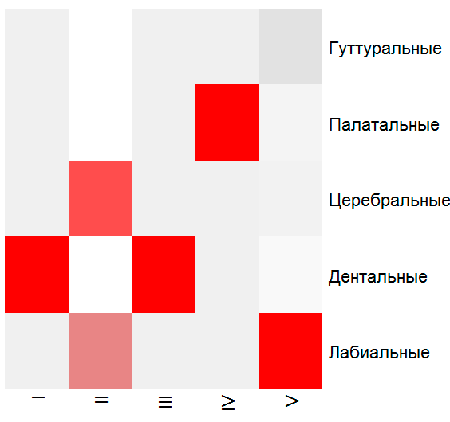

ФЕДЕРАЛЬНОЕ ГОСУДАРСТВЕННОЕ БЮДЖЕТНОЕ УЧРЕЖДЕНИЕ НАУКИ

ИНСТИТУТ ЯЗЫКОЗНАНИЯ РОССИЙСКОЙ АКАДЕМИИ НАУК

*На правах рукописи*

ГАСУНС МАРЦИС ЮРИСОВИЧ

**<span className="smallcaps">Состав и строй древнеиндийских</span>**

**<span className="smallcaps">корней: история изучения</span>**

Специальность 10.02.20 -- Сравнительно-историческое,

типологическое и сопоставительное языкознание

Диссертация на соискание ученой степени\
кандидата филологических наук

> Научный руководитель:
>
> доктор филологических наук, проф.
>
> *Красухин Константин Геннадьевич*

Москва --- 2014

Оглавление

[Введение 4](#введение)

[Используемая терминология 17](#используемая-терминология)

[Отбор материала 19](#отбор-материала)

[Неиспользование реконструкций 21](#неиспользование-реконструкций)

[Обзор литературы 22](#обзор-литературы)

[Индийские исследования 28](#индийские-исследования)

[Европейские исследования 34](#европейские-исследования)

[Глава 1. Структура древнеиндийского перечня корней 51](#глава-1.-структура-древнеиндийского-перечня-корней)

[1.1. Зарождение грамматического анализа в Индии 51](#зарождение-грамматического-анализа-в-индии)

[1.2. Индийские способы цитирования корней 60](#индийские-способы-цитирования-корней)

[1.3. Роль корня в системе древнеиндийского языка 66](#роль-корня-в-системе-древнеиндийского-языка)

[1.4. Устройство *dhātupāṭha* 69](#устройство-dhātupāṭha)

[Выводы по первой главе 78](#выводы-по-первой-главе)

[Глава 2. Понятие глагольного корня и количество корней 80](#глава-2.-понятие-глагольного-корня-и-количество-корней)

[2.1. Понятие *dhātu* и его интерпретация в лингвистике 80](#понятие-dhātu-и-его-интерпретация-в-лингвистике)

[2.2. Формальные показатели корня 88](#формальные-показатели-корня)

[2.3. Первичные и вторичные корни 95](#первичные-и-вторичные-корни)

[2.4. Количество корней в санскрите 109](#количество-корней-в-санскрите)

[2.5. Статистические характеристики санскрита 114](#статистические-характеристики-санскрита)

[2.6. Распределение рядов согласных 120](#распределение-рядов-согласных)

[Выводы по второй главе 124](#выводы-по-второй-главе)

[Глава 3. Строй корня и способы морфонологической записи 126](#глава-3.-строй-корня-и-способы-морфонологической-записи)

[3.1. Структура глагольного корня 127](#структура-глагольного-корня)

[3.2. Способы морфонологической записи 137](#способы-морфонологической-записи)

[3.3. Известные классификации и списки корней 142](#известные-классификации-и-списки-корней)

[3.4. Материалы для конкорданса древнеиндийских корней 165](#материалы-для-конкорданса-древнеиндийских-корней)

[Выводы по третьей главе 183](#выводы-по-третьей-главе)

[Заключение 184](#заключение)

[Состояние вопроса на 2026 год](#состояние-вопроса-на-2026-год)

[Принятые сокращения 186](#принятые-сокращения)

[Список иллюстративного материала 187](#section-14)

[Библиография 188](#библиография)

Приложения 224

> Приложение 1, Список корней У. Уитни и Р. Бакнелла 224
>
> Приложение 2, Обратный список корней У. Уитни (по префиксам) 233
>
> Приложение 3, Конкорданс древнеиндийских корней 240
>
> Приложение 4, Список корней Ж. Юэта (обычный и обратный) 477
>
> Приложение 5, Бинарное сопоставление книг-источников 480

# Введение

Настоящая работа посвящена сопоставлению индийской и европейской филологических традиций. Древнеиндийская грамматическая традиция является одним из высших достижений научной мысли, дошедших до наших дней. Панини (Pāṇini) и его комментаторы по сей день продолжают вдохновлять специалистов по теории языкознания на новые оригинальные работы.

Один из центральных вопросов индийской грамматической традиции связан с понятием глагольного корня — дхату (*dhātu*), «*der Urstoff der Wörter*». Несмотря на отведённую ему значимую роль в структуре лингвистического описания, давно назрела потребность обобщения разрозненных наблюдений.

**Актуальность** исследования определяется значимостью глагольного корня в системе языка как одной из его структурных основ. Обращение к данной теме связано с необходимостью более глубокого осмысления отношений между разными корнями и принципами выделения корней в санскритологии, истории и теории языкознания и дальнейшего изучения вопросов теории и практики корнесловов[^edc5a], не получивших однозначного толкования в современной лингвистике и, следовательно, не потерявших своей актуальности.

Не существует, в частности, единой системы воззрений на важнейшие проблемы, связанные с количественными и структурными особенностями морфемариев[^edc5b] древнеиндийского языка (далее — ДЯ). Многие проблемы взаимосвязей корней и способов их лингвистического описания остаются недостаточно изученными.

Глагол и глагольный корень в меньшей степени, чем имя, служил объектом лингво-философских построений.

**Объектом** исследования выступают глагольные корни древнеиндийского языка в том виде, в каком они зафиксированы корнесловами индийской традиции (дхатупатхи, вплоть до конкорданса Пальсуле) и европейской науки (Вестергаард, Уитни, Х. Верба)[^edrws1]. В работе предлагается структурная интерпретация предшествующих научных работ индийского и западного происхождения.

Непосредственным **предметом** исследования служат системные отношения первичных и вторичных рядов глагольных корней и критерии их выделения. Частные явления намеренно опускаются. Работа ориентирована на несколько идеализированное состояние древнеиндийского языка, а также на описание способов организации корней и отдельные аспекты звукового устройства древнеиндийского языка в целом.

**Гипотеза**, выдвигаемая в исследовании, состоит в том, что хотя структура слога разнообразна, количество реально засвидетельствованных корней поддается достаточно точному подсчету.

**Цель** исследования заключается в изучении глагольных корней в качестве исходных единиц описания (абстрактных сущностей языка) на морфологическом уровне по разным количественным и качественным показателям.

Поставленная цель предполагает решение следующих **задач**:

1.  Выявить подходы к изучению феномена глагольного корня в контексте индийской и европейских лингвистических традиций.

2.  Уточнить понятия глагольного корня и «дхату» (*dhātu*) на материале трудов по истории санскритского языкознания (с расхождениями в индийском и европейских подходах).

3.  Систематизировать современные представления о роли глагольных корней в рамках работ по санскритологии отечественных и зарубежных авторов.

4.  Провести структурный анализ ряда известных корнесловов древнеиндийского языка и выделить основные типы расхождений в них. Делается попытка выделения морфемария санскрита[^edrws2].

5.  Определить какие слоговые модели наиболее распространены, среднее количество слогов в слове, распространенность открытых слогов в глагольных корнях санскрита.

6.  Выявить и описать отдельные количественные характеристики корнесловов и словарей в целом. Выяснить, поддается ли подсчету количество реально засвидетельствованных корней и если да, то каково оно.

7.  Уточнить данные по распределению рядов согласных и консонантных кластеров в диахронии.

8.  Сопоставить полученные количественные характеристики по древнеиндийскому языку с другими, в том числе неиндоевропейскими языками мира.

В качестве **материала для исследования** помимо конкордансов корней взяты 36 словарей и справочников[^1] древнеиндийского языка и реалий за период от 20‑x годов XIX в. до начала XXI в., из которых методом сплошной выборки было обработано 44 838 страниц. Работа подкреплялась картотекой из 190 письменных памятников древнеиндийского языка, начиная с вед до новейшего времени, без стилистических и жанровых ограничений (порядка 430 000 предложений).

**Общетеоретическую и методологическую базу** диссертации составили труды отечественных и зарубежных (более всего индийских) ученых в области сравнительно-исторического языкознания и санскритологии.

Основным методом исследования служил структурный анализ, основанный на научных принципах Ф. де Соссюра и позволяющий изучать классы лингвистических элементов. Данный метод дает возможность отвлечься от индивидуальных явлений, рассматривая их лишь как элементы некоторых множеств. В ходе исследования также применялись: методы таксономического и динамического описания, метод исчисления и ряд других.

Кроме того, в работе используются стандартные для гуманитарных исследований индуктивный и дедуктивный методы. Применение индуктивного метода проявляется в том, что при описании инвентаря корней мы опираемся на реально наблюдаемые в древнеиндийском языке явления. Применение дедуктивного метода заключается в исчислении параметров, по которым разумно группировать алломорфы корней (например, по частотным и характерным признакам).

**Научная** **новизна** работы заключается в том, что в ней впервые введены принципы составления полного морфемария древнеиндийского языка; впервые в истории санскритологии можно проверить отдельные гипотезы ученых, сформулированные еще до создания корпуса санскритских текстов.

**Теоретическая значимость** диссертационного исследования заключается в уточнении теоретически возможного количества корней в древнеиндийском языке, а также в анализе метаязыка грамматической литературы и способов морфонологической записи корней.

**Практическая значимость** данной работы вытекает из возможности использования полученных списков глагольных корней древнеиндийского языка на занятиях по морфологии санскрита, в курсах по общему языкознанию и теоретической грамматики, спецсеминарах, при написании дипломных и курсовых работ, как словник в работе лексикографа.

На основе Приложений создана база для оболочки http://starling.rinet.ru.

Конкорданс глагольных корней, составлен на основе пяти словарей и справочников (см. Palsule, PWG, Whitney, EWA, VIA I). Отдельные списки корней можно в дальнейшем классифицировать по до десяти параметрам: по начальной букве, по конечной букве, по структуре слога, по длине корня, по типу чередования, по частотности, по засвидетельствованным префиксам, показателю *сет* и *анит*, по базовым значениям, по принадлежности к «авторскому» списку.

На защиту выносятся следующие **положения**[^edp0]:

1. Число выделяемых в санскрите глагольных корней (*dhātu*) зависит от критерия включения и колеблется почти на порядок: объединение одиннадцати дхатупатх даёт 3 690 единиц (Пальсуле), цифровая паниниевская дхатупатха -- 2 259 (vidyut), собственно Панини (§2.4) -- около 1 993, словарь Монье-Вильямса -- 2 113 корневых статей (из них 750 подлинных), «рассудочный» список Уитни -- 935, этимологически надёжное ядро (Mayrhofer; Lubotsky; Юэт) -- около 580. Противопоставление «индийское против европейского» некорректно: сравниваются не традиции, а критерии включения -- максимум-объединение против этимологического минимума; сам термин *dhātu* не тождествен европейскому понятию корня и может охватывать неодносложные единицы.[^edp1]

2. Термин *«dhātu*» не имеет однозначного аналога в европейской традиции, и термины «первичный корень» и *«dhātu*» не идентичны между собой. То есть моносиллабичность древнеиндийского корня не служит основанием для исключения двухсложных корней из индийских списков *«dhātu*».

3. Тип корней CVC в санскрите является наиболее частотным (например, *tud-*, *vac-*); к нему близки и другие частотные типы. Шесть типов (CV — например, *dā-*, *dhā-*; VC, CCV, CVC, CVCC, CCVC) суммарно охватывают более 4/5 всех корней санскрита.

4. В текстах преобладают открытые слоги, тогда как среди корней структура обратная: корни с закрытой финалью составляют 84 % против 16 % с открытой[^2]. Корень на долгую гласную (тип *bhū*) -- открытый, но тяжёлый (guru); если предметом является просодический вес финали, к тяжёлым следует отнести и 151 корень на долгую гласную, однако признаки «закрытости» и «тяжести» не взаимозаменяемы. Доля открытых слогов в тексте и доля корней с открытой финалью -- разные популяции; их сопоставление даётся как иллюстрация, а не как вывод.[^edp4]

5. В древнеиндийском широко распространены разнообразные начальные сочетания двух согласных фонем, реже (в 12 раз) -- трех. Аналогичные конечные сочетания встречаются в 5 и 3.5 раза реже, соответственно.[^edp5]

6\. Ригведа, будучи почти вдвое меньше Рамаяны по объему, содержит целых 460 разновидностей консонантных кластеров против всего 371 -- в Рамаяне. В Рамаяне реализовано меньше половины из фонетически засвидетельствованных консонантных кластеров (807).[^edp6]

Засвидетельствованные кластеры (до четырехбуквенных включительно и с исключением в виде *rtsny*) же сами по себе составляют лишь 0.35 % от фонетически возможных. А фонетически допустимые кластеры -- 19 % от теоретически мыслимых консонантных кластеров древнеиндийского языка. Санскрит, в отличие от других литературных языков, использует крайне малую часть (меньше 1 %) из возможного инвентаря.

7\. В эпическом санскрите (на материале Махабхараты), как и в русском литературном языке[^3], на каждые 100 гласных приходится 138 согласных. Объём текста на это соотношение не влияет, а его вариации незначительны (в *Мегхадхуте* коэффициент 1.39 против 1.38 в Рамаяне). В ведийском языке (на материале Ригведы и Атхарваведы) согласных лишь в 1.33 раза больше, чем гласных; таким образом, речь идёт о разных хронологических срезах — ведийском и эпическом, — а не об одном состоянии языка. Как и в большинстве языков мира, в звуковой последовательности древнеиндийского языка преобладают согласные.

**Апробация** результатов исследования и отдельные его разделы обсуждались на восьми лингвистических и востоковедческих конференциях. Среди российских конференций следует упомянуть чтения по восточным языкам: Рериховские чтения (Москва, ИВ РАН, 2005), XXVII Зографские чтения: «Проблемы интерпретации традиционного индийского текста» (Санкт-Петербург, СПбФ ИВ РАН, 2006).

Среди чтений лингвистической направленности: III Международные Бодуэновские чтения «И.А. Бодуэн де Куртенэ и современные проблемы теоретического и прикладного языкознания» (Казань, Филологический факультет КГУ, 2006), IX межвузовская научная конференция студентов-филологов (Санкт-Петербург, ИФИ СПбГУ, 2006).

По различным аспектам диссертации были прочитаны доклады на следующих международных конференциях: XXXVIII Международный конгресс востоковедов (Москва, ИВ РАН, 2004), XLII Всеиндийская конференция востоковедов (Варанаси, BORI, Индия, 2004), XVIII Интернациональный коллоквиум истории языкознания (Лейден, Лейденский Университет, Нидерланды, 2006), XIII Мировая конференция санскритологов (Эдинбург, Эдинбургский Университет, Великобритания, 2006).

Разные положения работы использовались автором в ходе чтения лекций на специальных курсах Гуманитарного факультета НГУ.

Диссертация обсуждалась на заседании Отдела типологии и общей компаративистики Института языкознания РАН в 2014 г.

По теме диссертации опубликовано 7 работ общим объемом 2,4 п.л.

Основная часть данной работы посвящена историографии лингвистики, а точнее, формированию понятия корня (в частности, в его индийском толковании, धातु), а также вычленению некоего морфемария древнеиндийского языка. Охвачен период начиная со времен классической индийской лингвистической традиции (грамматика Панини) и заканчивая более поздними западноевропейскими интерпретациями.

К последним относится в частности грамматика У. Уитни, приложение к ней (Приложение 1), его обработки (Приложение 2) и толкования приложения в работах А. А. Зализняка, Х. Вербы. В конце работы сделана попытка сбора материалов для «Конкорданса древнеиндийских корней» (Приложение 3), к которому текст диссертации служит комментарием. Углубление подхода Уитни в эру NLP дает нам некий урезанный, но базовый список корней Юэта (Приложение 4). А для того, чтобы понять преимущества и недостатки основных источников по перечням глагольных корней, следует рассмотреть их в сводной сопоставительной таблице (Приложение 5).

Ввиду того что итогом и побочной целью работы изначально явлось составление конкорданса именно древнеиндийских глагольных корней, список используемой литературы был намеренно сужен.

С учетом того, что открытия индийской лингвистической традиции нам во многом стали известны благодаря процессу формирования сравнительно-исторического языкознания, в котором, в свою очередь, значительную роль сыграло само открытие санскрита, мы сочли нужным в освещении рассматриваемых нами вопросов выборочно привлекать также и классические работы по компаративистике.

Ведь как говорил еще Дж. Лайонз, филологи-компаративисты (в значительной мере под влиянием ставших доступными для них санскритских грамматических трактатов) стали интересоваться системным изучением образования слов.

Была сделана отчаянная попытка пересчета корней и установления закономерностей в разных их списках, в частности, извлечение глагольных корней из словарей. Делалось это для того, чтобы узнать, сколько же именно корней (проверенных и сомнительных) известно согласно двум кардинально противополжным школам, индийский и европейской.

По причине того что за последние 2600 лет количественная разница между корнями с проверенной индоиранской этимологией (приблизительно 580[^4]) и всеми вариантами корней, представленных в сводном списке авторитетных индийских ученых (до 3690) стала весьма внушительной. Мы попытались собрать и обработать материалы, которые призваны частично объяснить причину столь существенных расхождений.

Насколько санскрит отличается от остальных классических литературных языков прошлого? В чем особенность построения санскрита? Приведем пример. Типологически интересно отметить, что Х. Вер [Wehr 1985] с его 3343 корнями[^5] классического арабского языка весьма близко подходит к цифре Пальсуле (а в нем как раз корней было бы на шестьсот штук меньше, если не учесть те из них, которые встречаются лишь в одном из списков). Как отражение индо-арабской идеализированной теории о первичности глагола [Rousseau 1984] и сводимости всякой словоформы к глагольному корню подобное совпадение, возможно, не безынтересно хотя бы в плане сближения или, наоборот, кардинального расхождения в количестве семантических групп глаголов. Вопрос требует дополнительного изучения.

Хотя и арабские корни очень не похожи на индоевропейские корни (состоят из двух, трех или четырех согласных букв, при этом известны некоторые ограничения сочетаемости), но сам принцип их выделения в чем-то все же схож с индийским. В арабском алфавите с его 28 буквами теоретически допустимо 21952 интересующих нас комбинаций, а если поделить основной состав корней (2967) на возможные комбинации, получим 2967 : 21952 = 13.5 %. То есть арабский язык использует чуть больше десятой части из своих морфологических ресурсов в строительстве корней. Приведем пример из слегка другой области.[^edp10]

Если учесть 33 согласных в санскрите, то двойные консонантные кластеры дают 1089, тройные -- 16920, а четверные и вовсе 209 520 фонетически возможных (то есть с учетом сандхи и правил сочетаемости) варианта. Однако из них лишь 807 консонантых кластеров[^6] (лигатур) встречаются в литературных источниках (без учета искусственных анубандх обильной грамматической литературы, однако и это требует дополнительной проверки), что меньше одной сотой доли возможностей древнеиндийского языка в целом.

«Конкорданс древнеиндийских корней» на основе нескольких источников справочного и словарного типа, как и «Бинарное сопоставление книг-источников»[^7], вошли в данную работу в качестве приложений (см. Приложение № 3, № 5).

За основу состава словника «Конкорданса древнеиндийских корней» взят [Palsule 1955], а от него уже идут отсылки к EWA, PWK, Whitney, VIA I (номер страницы; перевод, если найден; иногда условный номер корня). Состав корней весьма разнообразен: как первичных, так и вторичных, как ранних, так и поздних. Следовательно для нас новые веяния в компаративистике не столь интересны, а уточнение статуса того или иного конкретного корня -- куда важнее.

Изначально предполагалось, что своим внушительным составом в 3690 записи Пальсуле охватит все возможные вариации разных корней более поздних работ включительно. Однако, как вскоре выяснилось, «новые» корни (в частности, омонимы) и новые способы записи «традиционных» корней из EWA и VIA I вынудили пойти на введение дополнительного списка сквозной нумерации, озаглавленного списком Гасунса, в чем-то напоминающем индексы Стинга. Но не избыток или недостача корней в конкордансе Пальсуле является его слабым местом. Пять существенных недостатков, указанных Н. Шайладжой действительно указывают на ахилесовую пяту Г. Пальсуле [Shailaja 2014, 12], ведь список этот нельзя использовать для генерации правильных словоформ, следовательно его полезность в том виде, как он нам известен для задач NLP по крайнее мере сомнительна. Поэтому, в частности, сама Н. Шайладжа обращается к более традиционным, авторитеным источникам [см. Dhātupradīpa 1986; Dhātuvṛtti 1934; Kṣīrataraṅgiṇī 2005].

Как известно, сохранение языка объясняется устойчивостью грамматического строя (внутреннего порядка), точнее -- постоянством отношений между ярусами языка (их структурой). В основном именно историей системных отношений инвентарей санскритских глагольных корней и групп глаголов мы ограничиваем данное исследование, а не корнем как таковым, тем более в его историческом развитии.

Хотя морфология и исследует отношения между минимальными языковыми единицами вместе с их семантическим содержанием [Красухин 2004b], нас интересуют лишь сами единицы, а точнее их классификация (как основной инструмент лингвистического описания) во всех ее проявлениях (включая возможные отношения между морфемами разных типов, разные отклонения).

Впервые в мире теория для описания подобных структур была составлена в завершенном виде как минимум 2600 лет тому назад на материале древнеиндийского языка.

Выбранный нами подход ориентирован только на морфемы и исключает словоформы, не находя места, соответственно, например, для категорий, которые отвечают за типы аориста или показатели *сет* и *анит*.

Также мы полностью согласны с многократно повторенным разными учеными высказыванием, удачно сформулированным В. З. Деямьянковом, а именно, что морфология «призвана описывать словоформы данного языка более экономным способом, чем простое их перечисление» [Демьянков 1994]. Поэтому одна из заключительных частей работы посвящена именно исследованию способов экономии в описании языка (см. 3.2. Способы морфонологической записи) на древнеиндийском материале (с древнейших письменных памятников до XII столетия нашей эры включительно).

Отсюда возникает связанное с природой любого естественного языка противопоставление грамматики и словаря как двух фундаментальных, но в корне разных компонентов структуры языка, то есть вопрос об «открытых» и «закрытых» списках в языкознании, к которому мы будем постоянно возвращаться. В случае дхатупатх списки никогда не считались «закрытыми».

Дело в том, что полное перечисление слов -- это словарь, а объем любого словаря неоправданно велик, если сравнивать словарь с компактным перечнем грамматических правил. Так, акад. Л. В. Щерба весьма традиционно описывает отношения между грамматикой и словарем: «В описательной "грамматике" должны изучаться лишь более или менее живые способы образования форм слов и их сочетаний; остальное -- дело словаря, который должен содержать между прочим и список морфем» [Щерба 1915].

Собственно «список морфем» как часть морфологии (теория системы, форм слов и их групп) -- круг наших научных интересов. А за одно и разные статистические закономерности, свойственные ДЯ.

При этом не все слова, которые приводит в словаре его составитель, воспринимаемые носителями языка как разложимые на первичные морфы, действительно раскладываются на таковые. Как результат, корни этих слов не описываются в соответствующих разделах грамматики [ср. Виноградов 1972, 20]. Перефразируя данную мысль, можно утверждать, что одного понимания построения слова не всегда достаточно, чтобы вместо словаря его расположить в именно грамматике.

Ведь в общем случае слово представляет собой сложную структуру -- не элементарный знак, а сочетание элементарных знаков. Может возникнуть вопрос: каков же тогда смысл перечислять «вторичные» слова, когда большинство этих слов (если исключить заимствования) легко (или же не столь однозначно) с помощью грамматических правил можно возвести к тому или иному корню слова? Стоит, правда, оговорить, что таким путем мы по меньшей мере неминуемо теряем разного рода идиоматические обороты, но для нас они вторичны.

Индийские лексикографы до какой-то степени старались не включать в словари производные слова. Делали они это в своеобразной форме: структурная связь между грамматикой и словарем осознавалась и использовалась ими на глубинном уровне, начиная от первых известных нам источников. Древнеиндийские лексикографы оставили нам с десяток разных корнесловов и глоссариев. Сама грамматика Панини сопровождается корнесловом как неотъемлемой частью.

При этом словаря, в который входили бы «обыкновенные» (повседневные) слова, до XIX столетия (и то лишь под воздействием английских миссионеров) в Индостане не было. Более того -- он и не был нужен.

Несколько слов о мотивации выбора тематики исследования.

Не будет преувеличением повторить за классиком компаративистики, что «"санскритоцентризм" стоял в основании индоевропеистики» [Майрхофер 1988, 509]. Но почему мы рассматриваем именно глагольные корни, а, например, не древнеиндийские местоимения, ведь не одними глаголами жив санскрит? Из порядка 200 000 словарных карточек в каноническом словаре Монье-Уильямса, глаголов не больше 8000 (даже с учетом префиксированных форм).

Не удивительно, что вопрос о полезности исследования именно санскритских корней поднимался не один раз даже в исследованиях общелингвистического характера [Polivanov 1974, 59], не говоря уже о более узких работах, посвященных индийской теории языка в целом или грамматике Панини и отдельным ее разделам в частности.

История развития представлений о глагольном корне как объекте исследования выбрана нами по той причине, что «глагол играет центральную роль во многих (и не только в индоиранских) языках» [Rix 1998, 1], и речь тут идет отнюдь не только о синтаксической его роли [Speijer 1886], ибо индоевропейской языковой семье свойственно глагольное восприятие мира. Но, как справедливо отмечают русские востоковеды, «целый ряд проблем описания древнеиндийской глагольной системы до сих пор остается нерешенным» [Куликов 1989, 1].

Именно по причине «глубокой внутренней организации» морфологии санскрита мы избрали предметом исследования глагольные корни, а не, предположим, прилагательные или порядок слов[^8] в древнеиндийском языке. Сказанное выше Г. Риксом о глаголе можете быть без натяжки применено и к роли глагольного корня в индоевропейском языкознании.

Из трех принципиальных вопросов морфологии, выдвинутых в [Matthews 1970, 97, цит. по Демьянков 1994, 8], мы рассматриваем лишь первый.

«1. Каковы базисные единицы морфологической структуры и каковы отношения между этими единицами?

2\. Как сигнализируются или реализуются эти единицы в фонологической структуре предложения?

3\. Каковы критерии морфологического анализа конкретного языка?»

При этом ответ на первый вопрос мы отнюдь не считаем тривиальным, наоборот -- даже изложенный столь четко, он остался в своей обманчивой простоте относительно сложным.

Является ли основной единицей морфологического уровня морфема с ее алломорфами? И если так, то считать ли базисными единицы морфологической структуры такие элементы как корни и суффиксы? Могут ли корни существовать отдельно от суффиксов или наоборот? Связаны ли типы морфем с типами суффиксов? Об истории взглядов по данному вопросу подробнее см. 2.2. Формальные показатели корня.

История языкознания на примере разных лингвистических школ уже многократно наглядно демонстрировала, что некоторые заблуждения, базириующися на ложном авторитете, могут удерживаться столетиями и, по той же причине, считаться *apriori* доказанными [Gusdorf 1973]. Именно поэтому вопрос о базисных единицах и отношениях между ними по-прежнему нельзя считать закрытым, ссылаясь на исчерпанность морфологической проблематики.

Простые, «простейшие» проблемы морфологии, притом что проблематика, как известно, отнюдь не нова, подлежат постоянному пересмотру. Даже столь популярную форму *bharati* за последние 70 лет стали делить на морфемы иначе, чем до этого, хотя глагол этот встречается еще у Боппа и обсуждался в десятках, если не сотнях работ.

Под синхроническим исследованием языка нами понимается описание определенного «состояния» этого языка (в тот или иной «момент» времени). Мы считаем вполне возможным синхронный анализ мертвого языка, так как в случае с древнеиндийским языком имеется достаточное количество данных, сохранившихся в дошедших до нас письменных памятниках.

Что подразумевается нами под термином «морфология» в данной работе? Нельзя или по крайнее мере очень трудно снова не согласиться с высказыванием В. З. Демьянкова, что «цель лингвистической морфологии -- описание структуры слов, рассматриваемых как вторичная сущность» [Демьянков 1994, 4]. Данную емкую гипотезу мы принимаем полностью и безоговорочно как аксиому.

Определение морфологической системы, согласно которому это -- «свойства и взаимосвязи языковой системы в целом, затрагивающие структуру слов [...] и словоформ» [Демьянков 1994, 16] нам очень близко по духу. Однако продолжим цитату: «Она задается принципами, определяющими синхронную структуру слова [...] и морфонематические изменения в истории языка. [...] Морфологическая система в целом -- совокупность не отдельно взятых этих членов, а неделимых групп. Отсюда вытекает возможность оперировать этой системой в терминах абстрактной алгебры» [Ibidem]. Сказанное про языкознание в целом, оперирование понятиями «неделимых групп» и «абстрактной алгебры» тем важнее именно для нас, при работе с материалом, для описания которого, собственно, и был впервые изобретен и применен набор перечисленных методов.

Нами «структура» понимается как «структура системы», поэтому для нас не столь существенно физическое содержание фонологических и морфологических элементов, как их взаимные отношения внутри системы. Структура санскрита построена как сеть отношений, совокупность связей, при этом отдельные упорядочиваемые элементы взаимозаменяемы. При этом каждый элемент выполняет строго определенные функции.

Для нас, как и для структуралистов (как мы их понимаем), основная задача морфологии -- в установлении разложимости слов, в «сегментировании и классифицировании мельчайших значимых элементов» [Ibidem]. То есть наши взгляды можно рассматривать как относительно «устарелые». Тем не менее, мы хотели бы развить научную мысль, заложенную Максом Мюллером и Уильямом Уитни в середине позапрошлого века, используя изобилие материала, порой недоступного этим выдающимся ученым прошлого.

Однако что же имел в виду Щерба, говоря о «списке морфем», иными словами каталоге морфем? Сама идея каталога морфем не отличается научной новизной. Под каталогом морфов мы подразумеваем список морфем определенного или смешанных типов, собранных исходя из очевидного критерия экономии при описании языковых явлений.

Прообразом такого типа можно считать известный со времен Панини и ассоциируемый с его именем список глагольных корней, который прилагается к основному списку грамматических правил и тесно с ним переплетен. Это отнюдь не единственное, но, пожалуй, основное приложение к грамматике Панини.

Для нас идея каталога морфем осталась краеугольной и самодостаточной, она и лежит в основе данной работы как незыблемая опора. Именно в такого типа каталогах впервые были приведены известные науке (на время их описания) глагольные корни, которыми оперируем и по сей день мы. У данного способа подачи информации среди всемирно признанных санскритологов по сей день есть авторитетные приверженцы [см. Bucknell 1994; Aklujkar 1997; Werba 1997, 2008; Cardona 2008; Jucquois 1966, 2009].

Помимо прочего в данном диссертационном исследовании семантика определенных корней намеренно останется еще одной не затронутой темой, хотя и тут многое еще не рассмотрено. Так, например, из 2472 санскритских дефиниций корней у Пальсуле, весьма большой популярностью пользуются *gatau* (533 корня имеет данное значение), *hiṁsāyām* (236), *śabde* (159), *vadhe* (93) случая[^9].

### Используемая терминология

Но перед тем как углубиться в обзор литературы с особым вниманием к морфологии, необходимо уточнить, что же нами подразумевается под каждым из употребленных в заглавии терминов [ср. Богатырева 1991, 1]. Что такое состав, или корпус корней, что такое строй, или структура как корней, так и принципов группирования инвентарей корней? Что такое ДЯ в нашем понимании и что, в конце концов, следует подразумевать под термином «корень» в данной работе.

Начнем с простого.

Слово «древнеиндийский», в более широком толковании, имеет до четырех денотатов, как-то: «митанийский, ведийский, санскрит и пракриты» [Thumb 1958, 120], или как один из элементов триады: санскрит в широком толковании, пракриты и новоиндийские языки [Brugmann 1970, 5].

Известно, что древнейшим индийским (или индоарийским) обширно засвидетельствованным языком является именно санскрит (в широком толковании), термин, который часто используется для обозначения всего древнеиндоарийского языка [Зограф 1990, 9; Beekes 1995, 17] как в отечественной, так и в зарубежной традициях.

Нами же термин «санскрит» [Beauzée 1786] в основном используется в более узком смысле, в немецком его толковании [см. «Altindisch» у Meringer 1897, 61; Brugmann 1970, 5; Bechert 1979, 16], то есть как классический санскрит, для разграничения от ведийского языка [Macdonell 1916] и эпического санскрита. Следовательно слово это, в отличие от термина «древнеиндийский язык», мы используем ограничено.

Известна также дихотомия ведийский / не-ведийский санскрит, исходя из предположения, что дальнейшее деление основано на жанровом и стилевом, а не грамматическом разграничении [Cardona 1976; Cardona 2003, 116].

Задолго до начала образования современных индийских языков, на территории современной Индии и Пакистана возникла традиция лингвистической науки, на которую, основываясь на определенном культурном единстве, мы будем ссылаться как на «индийскую». Точнее, «древнеиндийскую», по той причине, что расцвет грамматической мысли в Индии закончился еще до начала нашей эры, предшествуя его зарождению на почти столь же высоком уровне в остальном мире.

То есть под топонимом Индия мы подразумеваем индийский субконтинент в целом [Deshpande 1983, 111], который включает в себя такие две страны современности как Индия и Пакистан[^10]. Ведь известно, что Панини, древнеиндийский лингвист, носитель славного матронима, к которому мы будем постоянно возвращаться как к воплощению индийского лингвистического гения[^11], родился и предположительно жил на территории современного Пакистана [Emeneau 1955, 145].

Перейдем к обсуждению двух важнейших для нашего исследования понятий, понятий «структура» и «система». Понятия «структура» и «система» следует признать не идентичными друг другу [Edmonds 1906, 115; Елизаренкова 1993, 182]. Состав -- это то же самое, что набор корней. Строй -- равен структуре. Поэтому мы, по аналогии, разделяем состав и строй и изучаем, каковы структурные связи в разные исторические эпохи и что менялось в списках санскритских корней.

Под термином «структура», или «строй языка», мы будем понимать не необходимую основу индивидуальных высказываний, а результат анализа, абстракции и синтеза (то есть модель структуры). Выбранное нами понятие системы подчинено понятию типа, а ему подчиняются языковые нормы (нормативы). Тем самым наше мнение согласуется с мнением некоторых романистов [Coseriu 1968, 269].

При этом структура корня напрямую взаимодействует с составом корней [Jucquois 1971a; Jucquois 1971b; Rosiello 1985], потому что для санскритской грамматической традиции крайне важен не просто перечень, а классификация корней в соответствии с их структурой. Эта проблематика подробно исследовалась как в индийской грамматической традиции, так и в европейской индоевропеистике (см. Глава 2. Понятие глагольного корня и количество корней).

Первый из известных нам списков древнеиндийских корней и их классификация на основании структурных признаков [Апресян 1966] представлен как приложение к грамматике Панини (для получения представления о нем см. Приложение 3). Отдельный вопрос, рьяно дебатировавшийся в сравнительном языкознании -- взаимоотношения корня и слова [Brandenstein 1952]. Его начало было положено первой работой по сравнительно-историческому языкознанию Ф. Боппа -- в 1816 г. [Bopp 1816].

Следует отметить, сопоставляя две традиции, что на Западе лингвистика начала развиваться сравнительно поздно. В то время в Индии, наоборот, изучение языка стало «первой наукой, наукой наук» [Staal 1988, 30], используя известное с незапамятных времен индийское выражение. И пришло в упадок к тому времени, когда на Западе филология только зарождалась.

В исследовании санскритского языка нет недостатка накопленных материалов [Bopp 1862, 618, 635, 647] или доступных интерпретаций, чего столь не хватает, например, в анатолийских языках [Beekes 1995, 20]. При этом, как ни парадоксально, открытия Панини еще не полностью оценены [Mayrhofer 1978, 26--27; Mayrhofer 2006; Deshpande 1983, 111; Koerner, Asher 1995, 65]. При наличии комментированных переводов на немецком, английском и французских языках, кроме отдельных (чаще всего одних и тех же) сутр, материал не доступен русскому читателю. Известно, что полный белорусский и русский перевод Панини предпринят минскими филологами.

Для упрощения подачи материала мы выписываем санскритские формы не в деванагари, а в стандартной латинской транслитерации (несмотря на недостатки латинского алфавита [Koerner 1999, 20]), принятой в 1914 г. в Афинах на заседании Всемирной конференции востоковедов. Деванагари оставлен только эпизодически при цитировании словарей PWK и PWG в роли маркера.

Наконец, о паре терминов «морфонологический» и «морфонемный». Морфонология понимается нами широко -- как раздел, изучающий фонологическую структуру морфем и её варьирование; морфонемика (учение о морфонемах в духе З. Харриса и Московской фонологической школы) -- её часть. Поэтому запись корней, о которой пойдет речь в §3.2 (заглавные буквы А. А. Зализняка, надстрочные пометы), будучи по существу морфонемной абстракцией, именуется в работе «морфонологической записью» -- термином более широкого объёма. (Оговорка добавлена в изд. 2026 г.)

### Отбор материала

Состав инвентаря корней интересует нас не сам по себе, а как основа огромного лексического корпуса, который имеет достоверные индоиранские этимологии[^12] и как корпус, который необходимо освоить студентам в процессе университетского обучения санскриту.

Основным критерием отбора корней[^13] для А. Лубоцкого, как и за сто лет до него, при этом служит засвидетельсвованность корней в других индоиранских языках. На сегодняшний день это порядка 550--650 корней из обоих словарей М. Майерхофера [KEWA 1956--1980; EWA 1986--2001], которыми с определенными правилами пересчета можно оперировать как наиболее надежным костяком каталога корневых морфем.

Нас интересует, как методы и получаемые от их применения результаты меняют положения теории языка и, наоборот, как теория языка изменяет ранее сформулированные методы, с помощью которых можно получить новые данные даже о хорошо известных языках [см. Степанов 2005].

Материалом для нас послужили в том числе труды древних и средневековых (раннее Средневековье) грамматистов, в противоположность категорической оценке известного специалиста в данной области В. Парибка, окрестившего последние «практически бесполезными» [Парибок 2004, 7].

Ведь еще до Ф. Ф. Фортунатова немецкий индолог Т. Гольдштукер задавался вопросом о нашей компетенции судить, например, о надежности много раз критиковавшегося уже к тому времени именитого комментатора Ригведы по имени Саяна [Whitney 1873, 130]. Даже О. Бётлинк, известный заступник всего индийского (в частности дхатупатх) перед нападками Уитни, в ценности догадок Саяны сильно сомневался [PWG I, v]

Современные ученые пришли к логичному выводу (соглашаясь с аргументами О. Бётлинка), что Саяна является лишь еще одним источником, а не «отцом и основателем», как считалось еще во времена М. Мюллера. Тем ни менее мы, при всем обилии языковых средств санскрита, все же не настолько «богаты», чтобы исключать даже какой-нибудь второстепенный источник, а тем более, целые пласты туземных исследований, сколь бы сомнительными они бы ни были. Даже единичный подтвержденный в дальнейшем корень, обретенный таким образом, перевесит все недостатки туземного подхода.

Мы попытались, не увязая в описания всевозможных отклонений от некоторого слегка идеализированного состояния языка, показать живость идеи первичности глагольной системы в древнеиндийском языкознании. Раскрывать историю изучения понятия корня (по отношению к современному языкознанию), а также проиллюстрировать порожденные данной гипотезой теории в трудах современных европейских индологов [Filliozat 1953] и компаративистов.

Мы рассматриваем вопросы грамматического строя и словарного состава ведийского и санскритского глагола. Нас интересуют не столько особенности и сами модели словообразования из первичных глаголов, сколько принципы и способы группирования корней -- как в древнеиндийских лингвистических трактатах, так и в современных монографиях, написанных на Западе.

При этом с современной точки зрения крайне важен вопрос о том, является ли тот или иной корень первичным или он осложнен детирминативом [Бенвенист 1955; Откупщиков 1967; Герценберг 1972; Герценберг 1981; Куликов 1993].

Материал упорядочен по формальным категориям. Основной объект для оперирования -- именно более или менее условные группы глаголов. Семантика учитывается только там, где нет других способов разграничения корней. В силу своеобразности материала строгая хронологическая последовательность выдержана не везде.

### Неиспользование реконструкций

Принятая нами система не опирается на реконструкции, которые достигнуты путем «глоттогонических спекуляций» и ностратических реконструкций [ср. Pisani, Pokorny 1953, 43; Sebeok 1963, 118; Герценберг 1972, 148; Mayrhofer 1986, 88; Anttila 1989, 267; Beekes 1995, 255; Levin 1995, 7; Lehmann 1996, 35--37]. Поскольку статус ларингальной теории [Иванов 1981, 67; Mayrhofer 2005, 5] и сам вопрос о количестве ларингалов [Brandenstein 1952, 67; Grassegger 2004, 102; Fortson 2004, 76; Герценберг 2010, 25] нельзя считать решенным, мы, не имея возможности углубиться в данную проблематику, решили вовсе не рассматривать ларингалы.

«Каждая грамматика индоевропейского языка исходит из определенной гипотезы [..] оставаясь всегда незаконченным отражением реконструируемого языка. [..] Мы до сих пор не можем составить даже самое тривиальное предложение [..] и та же нечеткость царит и в прочих ярусах индоевропейской грамматики по сей день» [Watkins 1969, 17].

Помимо этого, представленная нами работа обходит достаточно интересные вопросы ударения (акцентологии, а акцентная характеристика, как известно, в древнеиндийском привязана к корню), потому что для нас важнее возможность использования «удобных» символов для определенных задач категоризации первичных элементов [Buck 1949, 8; Cohen 1976: X]. Эта весьма и весьма интересная тема могла бы послужить темой для дальнейшего исследования.

Здесь почти отсутствуют столь привычные в работах по компаративистике «звездочки», двойные и одинарные, а также «крестики» никогда не существовавших форм [ср. Collinge 1985, XVII], хотя порой они содержат интересный с точки зрения древнеиндийского языка материал. Эта принципиальная позиция связана с научными интересами автора, не стремившегося отразить известные нам, но недоосмысленные лингвистами достижения науки в области сравнительно-исторического языкознания. Также данное исследование старается избегать лингвистической внутренней и внешней реконструкции. Наше исследование стремится скорее к противоположному виду научной абстракции -- к порождающей грамматике.

Чем же объясняется противоположность реконструкции и порождающей грамматики? Единство порождения одного (конкретного отрезка в истории определенного) языка у исходной глубинной формы, на основе которой формулируются правила порождения (в случае порождающей грамматики), с одной стороны, и метода внешнего сравнения с другой стороны (проводившегося, как правило, для нескольких языков) объясняется не только тождеством материала, но и «единством процесса моделирования» [Герценберг 1972, 42--43; Lehmann 1992, xi].

# Обзор литературы

Обзор построен не по хронологии и не по национальным школам, а по трём вопросам, вокруг которых организована вся работа: **что такое корень** (дхату, *dhātu*), **сколько корней** насчитывает древнеиндийский язык и **как их записывать и классифицировать**. Каждая рассматриваемая работа обсуждается по тому, что она дала одному из этих трёх вопросов, а не по тому, кто за кем писал; хронологическая последовательность сохранена лишь внутри каждого вопроса, там, где она действительно проясняет преемственность метода.

Разделение на исследования индийские и европейские, привычное для историографии предмета, удержано только там, где оно совпадает с реальным методологическим водоразделом — между традицией, которая берёт язык как данность и описывает его синхронно, и наукой, которая ищет для перечня корней внешний, проверяемый критерий. Само по себе географическое деление объяснительной силы не имеет: современные фундаментальные индийские исследования после Пальсуле нам неизвестны, а европейские школы — индийско-английская и немецко-французская — долго почти не пересекались, так что достижения одних не всегда становились достоянием других.

Оговорим границы охвата. Литературы на самóм санскрите и о санскрите — великое множество; мы, в силу ограниченных возможностей, рассмотрели лишь печатные труды обобщающего характера, оставляя в стороне работу над рукописями и отдельными текстами.

## Что такое корень: понятие *dhātu* в традиции и в науке

Само содержание термина дхату (*dhātu*) — глагольного корня в индийской грамматической традиции — и формальные показатели корня разбираются ниже, в разделах 2.1–2.2; здесь нас интересует лишь историография понятия — кто и как его выдвигал, оспаривал и переосмыслял.

Исходную рамку задали древнеиндийские грамматисты. Под *дхату* (*dhā́tu-*) они понимали единицу, которая характеризуется определённым действием[^19] — ядро гнезда связанных общим смыслом слов, и не более того. Глагольные формы при этом не считались *conditio sine qua non* корня — грамматисты передавали язык, как они его унаследовали, не прослеживая систематически исторических связей слов. Отсюда и синхронный, вневременной взгляд на язык: санскрит, по мнению ортодоксальных грамматиков, извечен, не сотворён и рассматривался строго синхронно. Мы сознательно пользуемся термином «синхрония», которого сама традиция не знала: пандиты твердят, что санскрит божественен, а следовательно вечен, а раз вечен — не имеет истории. Как иронически замечал О. Бётлинк в предисловии к Большому Петербургскому словарю, «про существование исторического процесса в Индии никогда и не подозревали» [PWG 1855, v]. Своей главной задачей индийские лингвисты считали сохранение вверенного им, как они полагали, языка богов[^20] [Парибок 1981, 1983]: «Человек не может изменить или усовершенствовать божий дар, но может полностью или частично его забыть или испортить» [Алпатов 2005, 20]. Это самопонимание засвидетельствовано и первичными источниками — от косвенного «то, что у богов "нет", то у людей "да"»[^21] и предписания «в меру на санскрите и в меру на местном наречии»[^22] [Kāmasūtra 1900, 60] до прямого у Дандина «санскрит называют божественным языком» [Belvalkar 1924][^23] и аюрведического «того, кто говорит на чистом санскрите»[^24] [Aṣṭāṅgahṛdayasaṃhitā 1998, 14.1].

Из этой рамки следует важное для нашего предмета: факты языка традицией не оспаривались и не требовали доказательства. Почему корень имеет неполную парадигму или то или иное значение — не объяснялось, а заявлялось, что такова природа корня. Грамматика брала язык как данность и анализировала его — в чём и состоит суть самого термина «грамматика» на санскрите. Панини построил почти исчерпывающую систему строгим методом [Staal 1965, 100], которую при всех её недостатках не удалось превзойти ни для какого другого языка; но идеи закономерного языкового изменения у него нет [Deshpande 1983, 111].

Европейская наука подступалась к понятию корня из двух противоположных позиций. Г. Коулбрук [Colebrooke 1805], один из первых защитников древнеиндийских грамматиков, утверждал, что грамматики не изобретали язык, а лишь разработали правила, чтобы обучить уже укоренённому в узусе. Ф. Бопп, напротив, в эпоху Романтизма выдвинул гипотезу, что грамматики сооружали формы и провозглашали их корнями — корни, которые в лучшем случае засвидетельствованы лишь в одной форме или не были «настоящими». С этой гипотезой связана его «теория агглютинации»: именные и глагольные формы возникли из сложения именных корней с местоименными окончаниями [ср. Hirt 1921–1937]. Теорию критиковали современники — Лассен и Вестергаард, подчёркивавшие скудость подкрепляющих её фактов, — но она нашла продолжение у следующего поколения (Шлейхер) [Булич 1904, 32, 79]. В. фон Гумбольдт делил корни на субъективные (полученные анализом, с устранением добавочных звуков) и объективные, исконные [Humboldt 1836, 114], и вслед за Боппом и Поттом приходил к выводу, что многие кажущиеся простыми корни — на деле сложенные или редуплицированные [Bopp 1832; Pott 1833], а значит вопрос «добрались ли мы до исходных корней» остаётся открытым.

Радикальнее всех понятие корня пересмотрел У. Уитни: опираясь на критерий засвидетельствованности, он объявил «мнимыми» и «поддельными» около тысячи ста корней индийских дхатупатх и рассматривал низкую словообразовательную производительность как довод против их подлинности. Тем самым «редкий» приравнивался к «сомнительному». Этот тезис расколол предмет надвое: рациональная статистика как новый для языкознания метод — против традиции, насчитывавшей тридцать столетий. В защиту грамматиков выступили Ф. Кильхорн [Kielhorn 1888] и Б. Либих [Liebich 1930]: Кильхорн отрицал, что комментаторы сознательно вводили в заблуждение или выдумывали правила, не подтверждаемые известным им употреблением. Опорой этой защиты служило именно синхронное самопонимание традиции: грамматист не обязан был предъявлять финитную форму, чтобы признать корень.

Стоит помнить, что морфологические категории, наиболее важные для нашего яруса, пришли в европейскую науку и через семитское языкознание: открытие арабами трёхсогласного корня, по Звегинцеву, «оказало наибольшее влияние на грамматические теории европейских учёных XVIII и XIX вв., в частности на Ф. Боппа» [Звегинцев 1964–1965]. Но, как и индийская, арабская традиция была чужда идее исторического развития языка.

В русской науке теоретическую сторону вопроса — что считать корнем — прямее всего затронул Л. Г. Герценберг: его IV глава «Проблемы теории корня» [Герценберг 1972] касается для нас наиважнейших вопросов, хотя основное внимание там отдано семантической реконструкции. Понятие же *квазикорня* применительно к санскриту вводит в научный оборот российской индологии А. А. Зализняк [Зализняк 1975]; поскольку оно принадлежит уже аппарату записи, подробно оно рассмотрено в разделе 3.2.

## Сколько корней: расхождение оценок и его причина

Все перечни древнеиндийских корней резко расходятся числом, при внешне схожих предпосылках [ср. Slobin 1973], — и именно это расхождение, а не отдельные цифры, есть настоящий предмет вопроса. Диапазон широк: ровно 2490 корней (включая очевидные дубликаты вроде *rih* / *lih*) в перечне, приписываемом самомý Панини[^14]; около 1961 корня в наиболее авторитетном европейском издании дхатупатхи — второй книге грамматики Панини в редакции Бётлинка [Böhtlingk 1887], где нумерация дробная по десяти классам презенса (1‑й класс — 1059, 2‑й — 72, 3‑й — 25, 4‑й — 137, 5‑й — 34, 6‑й — 143, 7‑й — 25, 8‑й — 10, 9‑й — 61, 10‑й — 395); и на другом полюсе — лишь 550–580 корней с установленной индоиранской этимологией (плюс около 100 без подтверждения за пределами субконтинента, из 1298 всего) в более критическом «Полном этимологическом словаре» М. Майрхофера [Mayrhofer 1986–2001, ср. Pokorny 1989].

Границу «сомнительного» первым провёл статистически У. Уитни. В «Приложении к грамматике санскрита» [Whitney 1885] он, опираясь на «Малый Петербургский словарь» [Böhtlingk 1879–1889], насчитал, по нашим подсчётам, 846 подтверждённых корней (без перекрёстных ссылок) и взял на вооружение «статистический метод»: отсутствие корня в дошедшей литературе и его низкая производительность стали доводом фиктивности. Отделяя первичные корни от удвоенных, приставочных и построенных на основах настоящего времени, Уитни и вышел на «одиннадцать сотен неаутентичных» корней.

Тот же счётный вопрос по‑новому поставил математический подход Ж. Юэ. Его санскрито‑французский «Sanskrit Heritage Dictionary», начатый в 1994 г. как база данных для автоматического морфологического анализа, привёл к наблюдению об эффекте насыщения: после первоначального «взрывообразного» этапа, когда словарь дорос до 10 000 вокабул, потребовалось выделить всего 520 корней, а дальнейшее пополнение шло лишь в порядке исключения (к осени 2014 г. — 580 единиц)[^18]. Юэ не признаёт иных источников корней, кроме встретившихся ему лично в текстах; правомерно предположить, что за наблюдаемым насыщением стоит типологическая универсалия, проверяемая и на несанскритском материале.

К «рассудочному» подходу Уитни примыкает и большинство поздних западных корнесловов, каждый со своим числом: А. Макдонелл [Macdonell 1929] — 477 ведийских корней, Р. Бакнелл [Bucknell 1994] — 432[^16], Ж. Юэ [Huet 2004] — 534 частотных корня из повествовательных текстов, Х. Верба [Werba 1997] — 663 засвидетельствованных по всему корпусу и потому предположительно подлинных первичных корня[^17]. Само число задействованных источников от автора к автору сильно колеблется, редко превышая 30 и не доходя до 300 текстов, — что уже само по себе объясняет часть разброса.

К 2026 г. этот разброс перестаёт быть загадкой историографии: каждое из «конкурирующих» чисел удаётся привязать к явному критерию включения, и при такой привязке число корней оказывается функцией критерия, а не свойством языка. Сводная таблица «критерий → число» и её разбор даны в разделе 2.4; здесь достаточно указать, что цифры Уитни, Юэ, Вербы и Майрхофера отвечают на разные вопросы и потому не обязаны совпадать.[^edlr1]

## Как записывать и классифицировать корни

Третий вопрос — самый технический и самый продуктивный: почти каждый корнеслов есть прежде всего *решение о записи*. Здесь важны три вещи: порядок расположения материала, устройство конкорданса и принцип классификации.

### Порядок расположения: два способа упорядочения

Исторически первый среди европейских реестров собрал Ф. А. Розен [Rosen 1827]; работа осталась незамеченной и представляет лишь историографический интерес [Поляков 1984, 2]. По‑настоящему отсчёт западного исследования начинается с Н. Л. Вестергаарда [Westergaard 1841], принадлежавшего к боннской школе Ф. Боппа. Его *Radices linguae Sanscritae* упорядочены по закрывающему слогу на основе дхатупатхи Панини, сопоставленной с грамматиками Катантры и Вопадевы. Корни сведены в гнёзда: например, *yā* развёрнут по префиксам и их сочетаниям (*ati, samati, adhi, anu, upa, ā, prati, ud, vi, saṃ* и т. д.), тогда как *snā* стоит сам по себе[^28] (ср. Приложение 2[^29]); каждое употребление снабжено ссылкой на источник, часть — латинским переводом. Научную ценность издания показывает уже список «Radices falsæ», где отмечены ошибки грамматик Кэри (1810) и Уилкинса (1815), а также Розена и Боппа; сомнительные формы помечены «(?)», фиктивные вынесены в отдельный список [Westergaard 1841, 333–334]. По оценке Виндиша, книга сохраняла авторитет вплоть до выхода Большого Петербургского словаря [Windisch 1920, 234].[^edrws3]

Второе европейское издание дхатупатхи — уже упомянутая бётлинковская перепечатка Вестергаарда [Böhtlingk 1887], почти дословная, вместе с алфавитным перечнем корней. Тот же принцип «по последнему слогу» лежит и в приложении к словарю Э. Бюрнуфа [Burnouf, Leupol 1866, 767–781], где корни разбиты на восемь подразделов по конечному звуку (на гласные — 79, гуттуральные — 28, палатальные — 53, дентальные и церебральные — 152, лабиальные — 65, полугласные — 57, сибилянты — 82, аспираты — 33); работа типографически безупречна, но новизны в изучение корнесловов не внесла и, как и труд Розена, прошла незамеченной.

Второй способ упорядочения — по начальному слогу, алфавитный. К нему переходят Б. Либих в «Anhang V»[^25] (запись, вопреки индийскому обыкновению, латиницей[^26]) и вслед за ним Пальсуле. Сам Уитни совмещает оба: словарные статьи у него идут по начальному слогу, но в конце брошюры он даёт список в стиле дхатупатх — по последнему звуку [Whitney 1885, 243–247], — замечая, что место такому обратному индексу не в грамматике, а отдельным приложением.

### Конкорданс: от синопсиса Либиха к своду Пальсуле

Первой попыткой конкорданса индийских корней стало четвёртое приложение к монографии Либиха — «Synopsis der sieben ältesten Dhātupāṭha's»[^15] — почти 80 страниц сверки, где корням, однако, не присвоены значения и не отмечены омонимы [Liebich 1930, 290–359], — список, годный лишь для сверки. Либих, посвятивший туземным спискам большую часть жизни, издал и парные перечни — глаголы с яскиными значениями, корни *parasmaipada* / *ātmanepada* / *ubhayapada* по Панини и Чандре с условными номерами [Liebich 1921]; подобные списки печатались впервые.

Последней истинно выдающейся работой стала диссертация Г. Пальсуле [Palsule 1955; ср. Palsule 1961]. От приложения Либиха её конкорданс отличается тремя решениями: добавлены четыре новых источника; изменён принцип отбора (в основной словник включены корни не только Панини, но и обоих Петербургских словарей, словаря Моньера‑Уильямса и приложения Уитни); и изменён порядок — по алфавиту начальных слогов, с отклонениями Вестергаарда и Бётлинка, вынесенными в сноски. Это последний фундаментальный свод в традиции.

### Классификация: по засвидетельствованности и по форме

Собственно классификации различаются тем, какой признак кладётся в основу деления. Уитни делит корни хронологически на три разряда: 1) встречающиеся только в раннем языке (включая брахманы, упанишады, сутры); 2) в раннем и позднем; 3) только в позднем [Whitney 1885, 211]; около 200 корней он относит к исключительно раннему языку. Его ученик Х. Эдгрен развил тот же принцип: список «по окончаниям» на 996 корней [Edgren 1878, 50–55] и — что интереснее — засвидетельствованные корни с хронологической пометой в квадратных скобках (ведийские; только из Ригведы; послеведийские; только послеведийские) и указанием на приставки и деривативы. Значения Эдгрен заимствует из Большого Петербургского словаря, реже — из словаря Грассмана [Grassmann 1875], отмечая расхождения с толкованиями Р. Рота.

Уитни критиковали с двух сторон. Ф. Кильхорн в рецензии [Kielhorn 1886] оговаривал «наследственные» опечатки, перешедшие ещё из *Radices* Вестергаарда, но труда Уитни не умалял. Г. Бюлер [см. Bühler 1972] спорил с ним десятилетиями: соглашаясь, что гильдия сторонников туземной грамматики не обсудила противоречий внутри дхатупатх, он резко отвергал вывод об «искусственности» невыводимых корней. Бюлер сводит установки школы Уитни–Эдгрена к четырём: невыводимых корней больше, чем засвидетельствованных; корни нерепродуктивны; редко присутствуют в родственных языках (у Фика — лишь 80 с индоевропейской этимологией); при ближайшем рассмотрении обнаруживают признаки искусственности. И Бётлинк, и Бюлер отмечали при этом, что корни распадаются на «пучки» схожих по звуку и смыслу форм (√*pev* / √*lep* от √*plev*) — наблюдение, которое позднее развил Либих.

Р. Бакнелл [Bucknell 1994] сделал следующий шаг — к парадигматической таблице: он абстрагирует сведения из грамматик Уитни, Макдонелла и Кале [Kale 1894] в систему условных обозначений и составляет индексы глагольных основ и окончаний (исторически первым здесь был [Böhtlingk 1887]). Корни он берёт из словаря к хрестоматии Ч. Ланмана, исключавшего, по образцу учебников греческого и латыни, незасвидетельствованные корни [Lanman 1884]; тем самым труд Бакнелла усовершенствовал Бётлинка и стал удобнее в повседневном пользовании.

Классификация Х. Вербы [Werba 1997] пошла по признаку морфологической структуры — сет/анит (*seṭ* / *aniṭ*), с абляутом или без[^30], — и по общему мнению оказалась самой неудобной из известных, заслужив исключительно отрицательные отзывы в специальных журналах [Schlerath 1998; Gerow 1999; Friedman 2000; Gotō 2001]. В ней классифицируются лишь первичные корни и лишь по засвидетельствованным основам, а не хронологически [Friedman 2000, 208]; отмечена и первая датировка каждого корня, как в EWA Майрхофера. Но категории устроены так, что найти корень иначе как по индексу затруднительно, а часть корней либо повторяется в разных списках, либо отсутствует; не разъяснены и многие аббревиатуры. Второй том, посвящённый примерно 400 вторичным корням, откладывался неоднократно; вместе с 663 первичными он дал бы около 1063 корней — больше прогноза Уитни, близко к Майрхоферу, но вдвое меньше даже скромнейших индийских редакций.

Особняком стоит реконструктивная линия. Почти одновременно с Вербой вышел *Lexikon der indogermanischen Verben* под редакцией Х. Рикса [Rix 1998] — алфавитный список праиндоевропейских корней, от которых засвидетельствованы первичные основы аориста и настоящего времени, с вопросительным знаком у сомнительных форм. Для изучающего собственно санскрит его практическая ценность невелика: «цепочек» и «пучков» развития смысла авторы не приводят, интересуясь лишь формальной стороной, и даже класс глагола из этих списков вычленяется не всегда. Реконструируемый корень — шаг дальше условного обозначения туземных трактатов, но не обязательно шаг в нужном для нас направлении.

### Русская линия: морфонологическая запись

Самый основательный русский труд, специально посвящённый классификации древнеиндийских глагольных корней, — статья А. А. Зализняка «Морфонологическая классификация древнеиндийских глагольных корней» [Зализняк 1975]. Мы считаем её основным теоретическим осмыслением корневой тематики — основой не только научной категоризации, но и дидактики, хотя пока и не ставшей общеизвестной. Именно в ней в российский научный оборот вводится понятие *квазикорня*, различаются усечённая основа глагольной формы и отымённые глаголы, правильные и неправильные типы корней. Предложенный в конце статьи способ морфонологической записи — простой сам по себе и до того для санскрита не применявшийся — рассмотрен подробно в разделе 3.2. Единственный её изъян в охвате — неучёт материала Пальсуле, в чём автор сам признаётся; но работы Пальсуле не были в России вовсе неизвестны [Димри 1973, 101; Катенина, Рудой 1980, 67].

Линия Зализняка не оборвалась: к 2026 г. она продолжена машинным корнесловом Толчельникова, который порождает список Уитни целиком (930 корней), тогда как Зализняк 1975 этот список классифицировал, а Зализняк 2004 свёл к ≈218 учебным. Русская морфонологическая традиция, таким образом, на практике выбрала критерий засвидетельствованности, меняя не состав списка, а глубину его обработки — «Уитни описывает → Зализняк абстрагирует → Толчельников порождает».[^edlr2] На той же линии стоят и более ранние русские работы — В. Н. Топорова [Топоров 1961] и Л. Г. Герценберга [Герценберг 1972]. Оригинальных российских исследований на эту тему немного, и стоят они несколько особняком от европейских, опираясь на них главным образом в части сбора материала.

Три вопроса, вокруг которых выстроен этот обзор, при всей несхожести подходов сходятся в одном пробеле: ни один из перечисленных корнесловов не опирается на явно сформулированный и механически проверяемый критерий включения — число корней у каждого автора есть, а критерий, из которого оно следует, чаще всего подразумевается, а не назван. Восполнить этот пробел — привязать состав и число корней к прозрачному критерию и предложить последовательную запись — и есть задача настоящей работы (см. раздел 2.4 о числе и раздел 3.2 о записи).

# Глава 1. Структура древнеиндийского перечня корней

### 1.1. Зарождение грамматического анализа в Индии

Язык для индийской цивилизации явился исторически первым предметом специализированного теоретического знания [Бархударов 1988]. Однако, чтобы по достоинству оценить древнеиндийских грамматиков, не нужно быть индологом. Ведь одно только «терминологическое смешение нескольких глагольных категорий» [Арискина 2006, 193], известное в славянских грамматиках еще с конца XVI века, было невообразимо уже в IV в. до н. э. в Индии, где хотя и существовали различные взаимоисключающие терминологические системы, но с самого момента их возникновения они были предельно однозначны.

Сложно не согласиться с Лайонзом, когда он пишет о превосходстве древнеиндийского учения о языке над европейским в области внутренней структуры слова [Лайонз 1978, 38].

«Если сравнить в плане морфонологии теории древних греков и римлян с теориями древнееврейских, арабских и в особенности древнеиндийских грамматистов, то бросается в глаза недостаточное понимание морфонологических проблем в период античности и средневековья в Европе. Однако и в новое время такое положение не претерпело существенных изменений. Современная семитология попросту позаимствовала морфонологические теории у арабских и древнееврейских грамматистов [Yngve 1996], не приведя их в соответствие с современными научными точками зрения. Индоевропеисты положили в основу морфонологии индогерманского праязыка морфонологические теории индийцев, тщательно их разработав, вследствие чего возникла так называемая индоевропейская система абляута и вся теория индоевропейских корней и суффиксов» [Трубецкой 1967, 115].

На той же странице далее: «Однако если рассмотреть результаты, полученные современной индоевропеистикой в этой области, то становится ясно, что в сущности они не имеют ничего общего с собственно морфонологическим методом: корни ("основы") и суффиксы приобретают здесь характер метафизических сущностей, а абляут становится своего рода магическим действом. Характерной чертой является также отсутствие здесь связи с каким-либо живым языком» [Ibidem].

При этом и при всей ее сложности, «не допускающая отклонений» [Daalen 1980, 22] грамматика Панини и «приложения к ней допускают устную передачу» [Wackernagel 1896: LIX; Военец 2005, 10]. Допускается это не потому, что, предположительно, не умели писать, а потому, что издревле в Индостане «письменному слову уделяется меньше внимания, чем произносимому» [Bühler 1896, 3].

Общеизвестно, что «основой современного метода внутренней реконструкции являются понятия оппозиции форм слова и понятия позиции, т. е. аналитической записи формы слова, соотнесенные с указаниями о последовательности производства, или порождения, этих форм. В тех грамматических учениях прошлого, где есть эти три элемента, есть и зачатки внутренней реконструкции» [Степанов 2005, 55]. Но не все догадываются, что тут речь в первую очередь идет о Панини и его исторических предшественниках.

Как «четкий прообраз современного метода», выражаясь словами Ю. С. Степанова, часть санскритской терминологии, вместе с «зачатками внутренней реконструкции» вошла в общеевропейский лингвистический оборот, что косвенно «свидетельствует о ее достижениях и степени разработки» [Ibidem], по сравнению с куда более молодой школой современной лингвистики [Martinet 2001, 99]. Ведь данная грамматическая терминология отработана в течение почти трех десятков столетий.

Именно поэтому тем более странными кажутся сомнения и неясные этимологии отдельных терминов, такие, как, например, название сложных слов кармадхарая (*karmadhāraya*) -- Наиболее честные из составителей грамматик вместо буквального перевода термина, который оставляет несколько путей толкования, попросту ставят вопросительный знак (?).

На примере данного термина мы имеем возможность убедиться в научной добросовестности древних языковедов, которые не боялись признавать слабость или лакуны в собственных познаниях [Чаттерджи 1977]. По аналогии санскритские корни отмечены вопросительным знаком рядом с корнем [Rix 1998, 8, 13--14; ср. Whitney 1885; Mayrhofer 1956--1980; Mayrhofer 1986--1996; Mayrhofer 2005] и в трудах современных лингвистов, чем безусловно заслуживают уважение.

Совсем иная картина предстает перед нами в академической якутской грамматике [Böhtlingk 1851; Бетлинг 1990] середины позапрошлого века, где нельзя точно назвать даже количество фонем без длинного дополнительного экскурса.

Автор на протяжении нескольких первых страниц обосновывает количество фонем (поскольку предыдущие авторы, допустим, не догадались о различительной силе долготы), что сложно представить для описания, например, древнеиндийского языка. Составитель данного фундаментального труда нам хорошо известен по Большому Петербургскому словарю, который и спустя полтора века остается основным толковым словарем древнеиндийского языка.

Все традиции, и индийская традиция [Зарайский 1999, 70] в частности, подходили к объекту своего изучения, выражаясь современным языком, строго синхронно [Benveniste 1966, 30; Kilbury 1976, 10; Якобсон 1985; Fleischman 2000, 33]. Многие описания, например у Панини [Иванов 1981, 177], просто не предусматривают выход за пределы одной системы [Bornstein 1976, 1; Алпатов 2005, 20; Hale 2007, 5--6]. Соответственно, и мы постараемся не выходить за них.

Нас, например, интересуют не правила дистрибуции фонем и составление определенных матриц для построения теоретически допустимых морфем, служащих основанием для образования словаря санскрита, а способы и причины той или иной классификации единиц, которые сами древнеиндийские лингвисты посчитали нужными выделить в тот или иной разряд санскритских корней. Попытка эта, возможно, не более совершенная, чем обреченные на неудачу попытки реконструировать единый праязык и, соответственно, реконструируемые корни, не принимается нами некритично, однако именно она служит основой и во многом оказывается не столь уж несовершенной с современной точки научного мировоззрения, как это было принято считать в начале или середине прошлого столетия.

Индийцы никогда не изучали чего бы то ни было из чистого любопытства [Dini 2000, 114]. Начало и конец пути, пройденного индийским теоретическим знанием о языке, равно находятся в сфере практического использования языка, работы с ним. Даже самая абстрактная идея, требующая учета еще 29 столь же абстрактных и искусственных правил [см. Rocher 1969, 73], имеет своей основной, если не единственной целью сэкономить усилия учащегося, и не более.

В основе древнеиндийской грамматики лежит установление первичных элементов [Forster 1810]. При этом интерпретация понятия первичного элемента не претерпела значительной эволюции. Оно было создано в древности и унаследовано нами в предположительно первозданном виде. Данное стремление также стояло у истоков этимологии, следы которой обнаружил еще де Соссюр в своем знаменитом исследовании [см. Зализняк 1977] анаграмм.

Истоки индийской этимологии восходят к (достаточно часто ошибочным) спекулятивным рассуждениям по поводу смысла слов [Sturtevant 1947] в писаниях «брахман и упанишад, к спискам ведийских глосс, называемым *nighantu*, однако яснее всего они просматриваются в списках языковых корней» [Thumb 1958, 167].

Когда провидец поет *ye sahāṃsi sahasā sahante rejate agne pṝthivī makhebhyaḥ* [Ригведа 6.66.9] «кто силой пересилит силы [врагов своих]», более чем очевидно, что он осознает, а возможно даже сознательно применяет однокорневые слова для достижения необходимого ритма и созвучия. При этом вряд ли поэт-провидец умел правильно разделить и понимал оттенки значения каждой морфемы, входящей в *sahāṃsi sahasā sahante*.

Издревле замеченное бережное отношение к текстам (передаваемым устно), по Уитни, -- это существенная часть всего индийского, часть так называемого «духа народа». Тема «духа народа» звучала, впрочем, не только у него, воспользовался ею, оппонируя в рецензии на статью Уитни, и австрийский санскритолог Георг Бюлер, -- он объяснял медленное развитие (в том числе языка) тем же ленивым духом, которому дано столь многое, что ему некуда больше расти. И действительно, индийская лингвистика после Панини и его первых комментаторов выглядит достаточно тускло, традиционно (не в лучшем смысле данного слова).

В связи с этим предполагаемым постоянством время от времени повторялось несколько ключевых вопросов. В том числе вопрос о возможности задать первоэлементы языка списком и о количестве и правилах их сочетания. Отсюда уже недалеко было до гипотезы о бесконечности языка, «неограниченных инвентарей» лексических морфем. Но при всей бесконечности, напомним, что «морфемы, слова (лексемы) могут быть пересчитаны. Их число конечно» Э. Бенвенист цит. по [Лингвистика 2004, 219].

Однако об объеме инвентаря морфов [Bird 1982] подробнее в главе «2.4. Количество корней в санскрите».

«Лексикон как полное (а потому избыточное) перечисление свойств лексических единиц» [Демьянков 1994, 124] никогда не представлял особого интереса в Древней Индии. При этом морфология была «краеугольным камнем лингвистики в целом» [Демьянков 1994, 7].

Следует отметить, что словари появились в Индии относительно позже грамматик. В лексикон не включаются глаголы ни в каких формах. Словарь делился на неодинаково построенные части: тематически упорядоченный список синонимов и упорядоченный по формальным признакам список многозначных слов с толкованиями; первая часть, как правило, гораздо объемнее второй и задает членение всего текста на книги (*kanуa*) и главы (*varga*). Последние в некоторых словарях отсутствуют. Словари составлялись в метрической форме и предназначались для заучивания наизусть [Aronoff 1994].

Везде, где это оправдано, древнеиндийские лингвисты руководствовались концепцией декомпозиции сложных основ, с отдельными списками корней, отдельными списками аффиксов и отдельно -- правилами и исключениями (исключения, увы, часто занимают несправедливо много места по сравнению с лаконичными правилами и тем самым нарушают усвояемость материала, об этом подробнее в главе «1.4. Устройство *dhātupāṭha*»).

Дж. Лайонз: «Традиционные грамматики обычно не составляли списков [..], за исключением списков для "неправильных" форм [..]. Они допускали возможность построения списков слов для целей "синтеза" на основе значения отдельных слов и определении "частей речи"». [цит по. Лингвистика 2004, 31]

Лексикон морфем, впервые в мире разработанный древнеиндийскими лингвистами, тесно связан с их грамматической мыслью в целом и «популярностью» понятия «корень» в частности.

Мы придерживаемся той точки зрения, что в современных языках, как, впрочем, и в древних, лексикография дополняла грамматику. Это видно даже из тесной связи правил *vyākaraṇa*[^31] (то есть «брахманической науки грамматики») [Deshpande 1993, 3] и корней *dhātupāṭha* (дополнительного к грамматике списка) уже у Панини.

Однако в Индии лексикография и *kośa* (словари) всегда ограничивались именно списками слов: тематическими, синонимическими и омонимическими наподобие греческих *onomastika*. Как не без доли критицизма высказался еще А. Ф. Потт, на каком-то определенном этапе индийские спекулятивные рассуждения были возведены до целостного учения о языке (*Sprachlehre*) [Pott 1833: xxii].

Тот факт, что никакой подлинной традиции нет, то есть нет никакого непрерывного развития в подходах к толкованию, восходящего к составителям Вед или их современникам, что все, что мы имеем, это спекуляции древнеиндийских ученых, лишь попытка проникнуть в глубины понимания, используя схожие методы с теми, которые используем и мы, приводит нас к выводу, что древнеиндийские комментарии и комментарии на комментарии не представляют собой нерушимую истину, являясь лишь еще одним вспомогательным средством, как уже отмечалось ранее. Так или иначе, однако же среди исследователей мало кто их берет в учет, ссылаясь на их «невыдержанность» и некритичный подход при отборе материалов.

В отличие от астрономии, где ощущалось явное греческое влияние, индийская грамматика всегда была и оставалась всецело оригинальной и предельно точной областью учености, само название которой *vyākaraṇa* (букв. «анализ») показывает, насколько ясно индусы осознавали важность индуктивного метода, насколько изощренными были их филологические интерпретации.

Панини, -- задолго до появления соответствующей терминологии -- разработал самую что ни есть настоящую порождающую грамматику.

Мы считаем, что достоинство словаря или грамматики должно измеряться возможностью при их посредстве составлять любые правильные фразы на все случаи жизни.

По справедливому мнению Л. В. Щербы, в грамматику попадает происходящее по правилам, а в лексику -- индивидуальное: «Спряжение глаголов *есть*, *дать*, *быть* является достоянием словаря, а при глаголе *играть* в словаре должна стоять лишь ссылка на тип спряжения» [Щерба 1957].

Каждое слово в санскрите принадлежит к одной из трех основных категорий:

1\) имя существительное (*nāman*- «имя»), например, *vagvana*, *vasati*, *dasma*, *samjyā*, *tantrī*;

2\) глагол (акхьята, *ākhyāta*- «рассказанное» или «увиденное»), например, *vapati*, *ghnanti*, *dabhnoti*, *pragacchati* и

3\) несклоняемые слова (*avyaya*- «неизменяемое [слово, например, наречие, частица]» [Wackernagel 1905, 1]), например, *ca*, *iti*, *muhu*, *jyok*, *avas*, *hyas*, *sumad*, *sadivas*, *tiras*.

Можно без преувеличения сказать, что Панини игнорирует предшествующее ему учение о частях речи, оставляя лишь две: «глагол и имя, а точнее, глагол и не глагол» [Волошина 2001, 69], что в чем-то похоже на известную антитезу «слово или неслово» [Смирницкий 1952, 183].

Раздел, который посвящен (глагольному) корню, есть чуть ли не самый трудный раздел во всей грамматике санскрита. Не случайно именно наречие и глагол остались неразобранными проф. Я. Вакернагелем [Wackernagel 1905], которому принадлежит самая фундаментальная среди когда-либо написанных описательных грамматик санскрита.

Не удалось сделать это и гетингскому ученику Я. Вакернагеля А. Дебруннеру спустя еще полстолетия [Wackernagel, Debrunner 1954]. Не восполнили пока этот пробел, несмотря на приложенные огромные усилия, и работы К. Хофмана и Дж. Нартен [Narten 1968], а также Т. Гото [Gotō 2001].

Важным открытием стало выделение самого корня. Открытие это произошло не спонтанно, а постепенно. Первыми суть корня ухватили авторы брахман, но они еще не знали или, по крайней мере, несистемно применяли некоторые способы ссылки на тот или иной корень.

В связываемой с «Восьмикнижием» Унадисутре приведено примерно 1600 слов, произведенных от корней с помощью 211 аффиксов. По большей части возведение слов к корням корректно, нередко вызывает сомнения, иногда очевидно неверно (например, *go* «бык» возводится к *gam* «ходить», *tri* «три» -- к *tar* «переправлять, спасать»), а в некоторых случаях просто анекдотично, как с *murdhan* «голова», которое производится от корня *muh* «дуреть», поскольку, «если ударить человека по голове, то он одуреет».

Однако даже ложные и абсурдные этимологии обнаруживают у автора «Унадисутры» отличное знание того, каким фонетически может быть санскритский корень. Разлагая фактически одноморфемное (например, заимствованное) слово на корень и аффикс, он выделяет как корень группу фонем, могущую фонетически быть корнем, -- односложную, имеющую на конце (если вообще имеющую) лишь определенные согласные или их сочетания [Парибок 1982].

Новаторство в области санскритской грамматики тем более очевидно, если ее сравнить с другими традиционными лингвистическими учениями. Так, в латинской морфологии, например, слово воспринималось как целое, и внимание обращалось исключительно на конечный элемент слова [Фрейденберг 1936; Томсен 1938]. Внимание никогда не фокусировалось на том, что оставалось помимо окончания (или парадигмы окончаний), поэтому не существовало и самого термина грамматического корня, как не существовало, впрочем, и понятий основы слова или суффикса [Booij 2004, 80].

Помимо разделения морфем по их формальным признакам, лингвисты распределяли морфемы по категориям также и согласно их семантическим признакам, изучая взаимоотношения между формальными и семантическими категориями морфем. Из предложенных принципов деления на семантической основе основным является разделение между лексическим и грамматическим значением. Традиционное морфологическое деление между корнем и аффиксом относится к (но не идентично) делению по семантическому принципу. Предполагалось, что разделение между лексическим и грамматическим значением ясно очерчено. На самом же деле это не совсем так, и основной причиной тому является диахронический процесс грамматикализации.

Также, помимо прочих достижений, именно в Индии зародилось представление о нулевых грамматических показателях, то есть проблема пустых и нулевых морфем. Нулевой аффикс [см. Vasu 1891, 55--56; Renou 1948, 12; Rix 1998, 10; Auroux 2000, 123] может послужить хорошим примером практической пользы данного открытия. Корень не может выступать в составе предложения как самостоятельное слово без каких-либо аффиксальных морфем -- как мы видим, эта гипотеза имеет за собой длинную предысторию.

Однако, по мнению голландского философа Ф. Стааля, ошибается тот, кто считает понимание порой противоположных высказываний санскритских грамматиков самоочевидной задачей.

Что именно имеется в виду?

Есть по крайней мере два параллельно существующих, порой дополняющих, а порой исключающих друг друга подхода к традиционному индийскому языкознанию, точнее к исследуемому им объекту. Основное, но далеко не единственное отличие между этими двумя позициями можно подытожить следующим образом:

1)  приводить все слова, основываясь на доступных корпусах текстов, приводить весь состав древнеиндийского языка подряд -- длинными вереницами (хотя никто, включая полубогов и мифических героев, не дошел до самого конца, используя данный метод) -- это считается отсталостью лагерем, приверженцы которого, напротив,

2)  перечисляют в перечнях скорее исключения, то есть дают списки лишь как дополнение к основному, порождающему тексту-формуле.

Проблема наиболее сжатого изложения, сохраняющего все содержание и одновременно достаточно понятного, становится одной из важнейших. Существует легенда о том, как бог Брихаспати излагал богу Индре грамматику «в несвернутом виде» [Захарьин 2003].

Он приводил все словоформы существительных и глаголов, но и через тысячи лет не смог прийти к концу. В изложении легенды дается резюме: если даже богам не хватит времени на пространное представление грамматики, то тем более необходимо свернутое изложение её людям с их короткой жизнью [Парибок 1982].

Всевозможные разрозненные *пратищакьи* (не столь уж и многочисленные, но тем не менее важные в ритуале и фонетике) с одной стороны и опора вед, *шабданушана*, со всевозможными несвойственными *пратищакьям* обобщениями, за последние двести лет обретали с разным успехом известность на Западе, чтобы потом, как это случилось, в частности, с *пратищакьями*, стать снова полностью забытыми. К этому вопросу мы будем возвращаться еще позже.

Несмотря на «сугубо практическое назначение технических текстов [*пратищакхья*]», они имеют «очень большую лингвистическую ценность не только как регистрация фактов, но и как первые образцы строгого научного (если не сказать структурного) анализа» [Булыгина 1964, Елизаренкова 1974, 5--6; Kroeger 2005]. В них же неоднократно возникает «мысль о преобладании морфонологического уровня над фонологическим» [Елизаренкова 1974, 11].

В современном мире теоретическое осмысление языка начинается уже в начальной школе. Считается, что достаточно углубленное изучение словообразования способствует формированию творческого потенциала учащихся. Обращение к содержательной стороне фактов словопроизводства вырабатывает готовность сознательно выбирать языковые средства, наиболее точно и образно передающие мысль в определенной речевой ситуации. То есть сегодня, как и раньше, данная наука имеет вполне утилитарное применение.

Форма языковой единицы характеризуется тем, что имеет возможность разлагаться на конститутивные элементы низшего уровня; значение -- быть составной частью единицы высшего уровня.

В соответствии с традицией, в школе словообразовательная работа заключается в вычленении морфем, иногда и в определении значения конкретных морфем, то есть носит чисто аналитический характер. Производная лексика рассматривается в основном с точки зрения формы (то есть структуры) [Основные направления... 1964]. Почти отсутствуют элементы синтетического подхода, который нашел бы отражение в работе со словообразовательной моделью, словообразовательным гнездом.

Организация наблюдения над структурно-семантическими [Лайонз 1978, 54, 67] особенностями производных слов, учет смысловых связей между словами в словообразовательных парах осуществляется эффективнее на материале словообразовательного гнезда. «Словообразовательное гнездо можно рассматривать как семью однокоренных слов» [Пятаева 2004, 78--79].

То, что древнеиндоевропейский язык представляет ценный материал для сравнительного языкознания [Szemerényi 1989], находится вне всяких сомнений, впрочем, как и то, что огромное количество наших представлений об индоевропейском глаголе опирается на данные древнеиндийской глагольной системы, ведь «древнеиндийский язык содержит достаточно верное отражение древней глагольной системы» [Thumb 1959, 185].

Такому особенному положению дел способствует несколько причин. Относительно высокий возраст первых литературных памятников (Вед), непрерывность и богатство литературы до классического периода, как и частично безупречная сохранность текстов (если сравнить, например, с рукописями тохарских буддийских текстов), -- все вышеперечисленные факторы позволяют определить не только положение и последовательность отдельных языковых фактов среди разных литературных эпох древнеиндийского языка, но часто также отделить более поздние образования от унаследованного более архаичного пласта.

Это можно объяснить тем, что, в то время как в других индоевропейских языках образование слов по модели аналогии произошло уже в долитературную эпоху (например, *iunxi*), в древнеиндийском языке этот же процесс часто разворачивается перед нашими глазами (например, основа презенса *bibheti* от более древнего перфекта *bibhāya*, [см. Jasanoff 1997, 122]).

Однако, несмотря на эти выгодные преимущества, древнеиндийский языковой материал является источником немалого количества ложных суждений как в сравнительно-историческом сопоставлении, так и в теоретических вопросах общего языкознания. В научных трудах, вплоть до недавнего времени, снова и снова встречаются глагольные формы, использование которых в целях сравнительного языкознания как минимум недостаточно надежно (например, такие новообразования как *chandati*, *chantti* вместо старой формы презенса *chandayati* «он понравился»).

Причины подобного ложного разбора древнеиндийских глагольных форм очевидны, и их несколько: большие промежутки времени, разделяющие разные эпохи древнеиндийского языка, а также допускаемая (и одобренная грамматиками), начиная от Ригведы [Семененко 2011, 10] вплоть до классического санскрита, амплитуда вариаций.

Говоря словами классика индологии М. Мюллера: «Разница между арийскими языками и туранскими [в понимании немецких лингвистов того времени, это не индоевропейские, даже не семитские и не хамитские языки, а скорее всего алтайские, дравидские, уральские семьи языков] похожа на разницу между хорошей и плохой мозаикой. Арийские слова как будто сделаны из куска, туранские -- четко обнаруживают швы и границы, где цементируются небольшие элементы» [Müller 1899, 292].

То есть речь, очевидно, идет о флективности [Greenberg, Denning, Kemmer 1990, 8--9] в индоарийских языках. В определение же понятия «арийцы» и «арийские слова» мы предпочитаем не вникать, так как это дань цитируемого автора его эпохе.

Не только корнями вместо слов оперировали древнеиндийские грамматики; оперируя корнями, они предложили несколько оригинальных и весьма удачных способов обозначить, что речь идет именно о каком-то глагольном корне, а не об обычном, полноценном и самостоятельном слове.

### 1.2. Индийские способы цитирования корней

Говоря о понятии исходной словоформы, обычные словари санскрита приводят глаголы не в финитной форме, например, в немаркированной граммеме третьего лица, а под соответствующим корнем, с указанием класса презенса. Вместо *bharati* «он несет» будет *bhṛ* -- I [класс], P. [Parasmaipada] «нести» [Mayrhofer 1978, 65]; вместо *karṣati* «он тащит за собой» будет *karṣ* -- I, P., «тащить»]; вместо *dhāvati* «он бежит» будет *dhāv* -- I, U., «бежать»]; вместо *padyate* «он падает» будет *pad* -- Ā., IV, «падать»; вместо *mādayati* «он пьянеет» будет *mad* -- Ā., X, «пьянеть».

Доказательством того, что во времена сочинения *Brāhmaṇa* уже закрепилось четкое деление на основу и суффикс, служит притяжательный суффикс -- *mat* и -- *vat*. Так, например, когда приводится слово *pitṝbhiḥ* (из Атхарваведы III, 3.8) в форме *pitṝmat*, то становится отчетливо видна основа *pitṝ* -- в отличие и отдельно от окончания -- *bhiḥ* или суффикса -- *mat* [Werba 1997].

Такое деление послужило твердой основой для дальнейшего этимологического теоретизирования. Похоже, что это было революционным нововведением в те отдаленные дни, которое засвидетельствовано в *Taittirīya Samhitā* VI 4.7.3, где говорится о том, что человеческая речь была до этого не разобрана и что Индра, по просьбе богов, разделил ее надвое и проанализировал ее [Whitney 1863, 1856].

Хотя корневая морфема в разговорном языке была доступна лишь условно, тем не менее она впервые абстрагирована и идентифицирована уже в брахманской части текстов самхит черной Яджурведы (1‑я четверть I т. до н. э.). Именно там это сделано с помощью таких до этого неизвестных оборотов метаязыка, как посессивные суффиксы -- *vant*, -- *mant* в значении «содержащий определенное слово (или словоформу)». Таким образом основой посессивного прилагательного становится отрезок слова, который частично совпадает с морфемным делением корня.

По аналогии используется -- *ad* -- в цитате *adityebhyo bhuvadvadhabhyas carum nirvaped bubhusan* «Адитьев должен он со [строфой] содержащей [глагол] *bhū* ["становиться" горшок [риса] принести, если он хочет больше стать [то есть, возвеличиться]». Также в *agnaye tapasvate janadvate pavakavate 'astakapalam nirvapet* «Богу» Агни (agni) должен он с [двумя строфами, которые содержат слова] tapas-, [глагол] *jan* и [слово] *pavaka* -- содержащими, преподнести [испеченных лепешек] на восьми горшочках», где обособлен корень *jan* [Devasthali 1973].

В обычном порядке, если *Brāhmaṇa* хотят сослаться на определенную строку из ведийского корпуса текстов, которая содержит слово, образованное от конкретного корня, они прибегают к причастию прошедшего времени [Edgren 1878; Palsule 1961, 5]. Например, чтобы сослаться на строку, содержащую слово *ud-ajani*, употребляют оборот *jātavat*, а *paryāsa* записано как *paryastavat*. Но употребляются также и другие формы, как *netṛmat* вместо *naya*, *jaghnivat* вместо *jaṅghanat*, *havavat* вместо *huvema*, *pibavat* вместо *pibatu*, *kṣetivat* вместо *kṣayanta*.

Почему эта форма (причастие прошедшего времени) почти полностью затмила все остальные? Предполагается, что авторы *brāhmaṇa* (брахман) выбрали ее потому, что ее почти всегда можно было найти в живом употреблении. Не стоит пренебрегать также тем, что индийские грамматики считали слабую ступень основой, которая потом уже претерпевает процесс *guṇa-vṛddhi* градации, даже если это был скорее подсознательный выбор [Palsule 1961, 6].

По подсчетам Б. Либиха [Liebich 1930], если составить список всех отсылок к глагольным корням в Атхарваведе [Bloomfield 1899], то причастий прошедшего времени ко всем остальным будет 50 к 50. В позднейших брахманах причастие прошедшего времени начинает брать верх, пока оно окончательно не вытесняет прочие формы.

Почему именно данная форма постепенно вытеснила все остальные? На этот вопрос по сей день не дан полностью удовлетворительный ответ. Предполагается, что авторы брахман выбрали данную форму по причине того, что она всегда встречается и засвидетельствована в «реальном» языке. Также следует подметить то обстоятельство, что причастие прошедшего времени на удивление почти всегда содержит в «первозданном», слабом виде сам корень. Слабая ступень корня, в случае полноценных корней, которые подчиняются правилам гунации и вирдхизации, рассматривалась индийскими грамматиками как основа корня, -- повлияло ли это обстоятельство хотя бы подсознательно на выбор данной формы, нам неизвестно.

Но каково бы ни было происхождение представления корня его причастием прошедшего времени, одно ясно, что оно наложило свой след на допаниниевскую грамматическую терминологию. Само слово *ākhyāta*, самый старый из известных нам терминов «корня», насколько можно судить, оформилось под влиянием данного брахманического метода. По аналогии *kārita* «каузальный», *cikīrṣita* «дезидератив», *cekrīyita* «фреквентатив с -- *ya*», *carkarīta* «фреквентантив без -- *ya*» -- все эти термины изначально были причастными образованиями от соответствующих основ корня *kṛ* и были впоследствии выбраны как представители конкретных явлений языка; они также идут от широко распространенной в то время практике представлять глагольный корень через причастие прошедшего времени.

Данный метод, похоже, перестал пользоваться популярностью сразу после периода составления брахманических текстов. В последний раз этот метод встречается у Яски в его известной Нирукте (*Nirukta*), где он цитирует слова Щакапуни (*Śākapūṇiḥ*) в связи с этимологией слова agni. Перефразируя сказанное его предшественником, Яска (*Yāska*) пишет вместо *itād*, *aktād*, и *dagdhād* слова *eteḥ*, *anakteḥ* и *dahateḥ*, соответственно. По всей видимости, упомянутый ранее Щакапуни был предшественником Яски и использовал метод, который был в научном обороте в его дни, в то время как Яска сам везде использует новый метод, цитируя корни в третьем лице, единственном числе, настоящее время, изъявительное наклонение.

Примерно в ту же эпоху создавалось и Нигханту (*Nighaṇṭu*). «Древнеиндийские грамматисты различали в санскрите имена и глаголы, причем определения имени и глагола очень напоминали платоновские определения: имя суть субъект, глагол суть предикат» [Лайонз 1978, 37--38]. Важность Нигханту для нашего исследования санскритского глагола состоит в том, что это наиболее ранняя систематичная работа, которая четко делит слова санскрита на имена, глаголы и частицы, при этом их названия (названия этих трех терминов) нигде в тексте не встречаются.

Также не всегда достаточно четко разграничены именные и глагольные формы, при том, что такие именные образования, как *cakamānaḥ*, *āksānaḥ*, *āpānaḥ*, *talit* и *ākhandalaḥ* числятся как глаголы, в то же время как очевидно глагольные формы, такие как *vavakṣitha* и *vivakṣase* записаны как имена существительные. Однако нельзя отрицать наличие там впервые в истории языкознания сознательного анализа слов и упорядочивания их в синонимические группы имен существительных и глаголов, то есть, собственно, наличие лингвистической работы как таковой. Одним из соссюровских принципов явилось то, что единицы языка можно определить только через их отношения; однако оно было сформулировано значительно позднее аналогичных наблюдений в Древней Индии.

Если ограничиться глаголами, то можно заметить, что в первых трех главах Нигханту приведены 313 глагольных форм в 15 синонимических рядах, помимо 12 глагольных форм в четвертой главе. Корни, как правило, представлены третьим лицом единственного числа настоящего времени изъявительного наклонения в активном или в пассивном залоге, где какой залог уместен [Красухин 1999, 10]. Однако и тут бывают исключения. В частности, это касается ведийских глаголов, когда корень представлен другой формой (другим лицом, числом, наклонением) -- иными словами, встречаются формы, которые непосредственно взяты из Вед и цитируются без изменений.

Хотя и можно было бы сказать, что Нигханту сделало шаг вперед по сравнению с Брахманами -- по той причине, что в них глагольные формы редуцируются до одной определенной формы, которая впоследствии становится основой в работах, подобных Нирукте [Katre 1991], нет прямых доказательств тому, что в Нигханту корень уже полностью выделен как отдельный элемент. Значение имеет не только то обстоятельство, что корень нигде не встречается в «голом» виде, но и сама манера представления глагольных форм наводит нас на мысль, что составитель Нигханту еще не ушел достаточно далеко от конкретных словоформ. Иногда составитель данного трактата приводит такие формы, как *īmahe*, *tāḷhi*, *abhy* *arṣa* и другие, не редуцируя их до привычного 3 Sg. Praes. Ind., возможно, потому, что он сомневается, что именно это за форма и как ее «разобрать» на первоэлементы. С другой стороны, помимо приведения обычного способа цитирования глагола составитель трактата также приводит и другие формы того же корня. Так, помимо *aśnute* он приводит *aśat*, *āṣṭa* и *ānaṭ*; помимо *babhasti* приводит также *bapsati*, *bhasathaḥ* и даже *babdhām*.

Можно предположить, что *ānaśe* сравнительно сложно связать с *āśnute* или *uśmasi* c *vāṣṭi*, однако зачем помещать *vāśmi* бок о бок с *vaṣṭi* или *vicaṣṭe* рядом с *caṣṭe*? Нам остается или предположить, что составитель еще полностью не уловил связь между отдельными словоформами (что по крайней мере в отдельных случаях, как *vāśmi* и *vāṣṭi*, достаточно трудно постижимо), или поверить, что делалось это намеренно, чтобы закрепить правильное понимание смысла глагола. Но так как он приводит больше одной формы только для нескольких глаголов, а не как общую практику, и даже тут приводит лишь некоторые, а не все реально встречающиеся формы, то следует сделать вывод, что, хотя он и уловил отношения между этими глаголами, но еще не абстрагировал корень, лежащий в их основе.

Интересно отметить, что не все глаголы, приведенные в Нигханту, действительно встречаются в Ведах. Есть такие, как *kaṇṭati*, *kavate*, *kṣumpati*, *gavate*, *drūḷati*, *dhrati*, *dhrayati*, *dhrāti*, *bisyati*, *misyati*, *śavati*, *svātrati*, *syamati* и прочие (в рамках одного только раздела), которые не только не встречаются в Ведах, но не встречаются также и в позднейшей литературе (помимо, разумеется, трудов по грамматике, где непременно будет упомянута, хотя бы еще в одном грамматическом труде, цитируемая форма). Внутри самой индийской традиции предполагается, что это искусственные образования, специально составленные ради того, чтобы объяснить деривативы имен существительных, и что уже задолго до Нигханту этимологи были озадачены генерацией глаголов от предполагаемых глаголов.

Другое интересное обстоятельство заключается в том, что есть такие часто встречающиеся в Ригведе глаголы, как *kṛṇoti*, *cinoti*, *tarati*, *dadāti*, *dadhāti*, *nayati*, *yacchati*, *yajati* (чтобы процитировать лишь некоторые из наиболее бросающихся в глаза примеров), которые ни разу не упомянуты в Нигханту, а это свидетельствует, что данный список задумывался отнюдь не как исчерпывающий. Если подытожить вышесказанное, можно заключить, что, так как для замысла Нигханту принципиально важны списки глаголов вместе с их значениями и так как там (возможно, случайно, а может быть, с определенным умыслом) приводятся также и основы настоящего времени плюс косвенное указание на их залог (при цитировании конкретно засвидетельствованной формы конкретного корня), то можно сказать, что это эмбрион позднейших дхатупатх (dhātupāṭha).

От Нигханту мы плавно переходим к Нирукте мудреца Яски, которая является позднейшим комментарием на Нигханту и в области древнеиндийской лингвистики стоит, вероятно, на почетном втором месте после грамматики Панини. Она богата сведениями по грамматической мысли допаниниевской эпохи, однако в данной работе придется урезать это богатство до того, что непосредственно связано с древнеиндийским глаголом.

Как первый и самый важный факт следует отметить уже полное отделение, полную абстракцию глагольного корня. Действительно, правда и то, что Яска чаще всего цитирует корень в форме 3 Sg. Praes. Ind., однако данная практика, по всей видимости, востребована из-за элементарного удобства. Это практика, которая продолжала пользоваться спросом еще многие столетия спустя, продолжает, по существу, пользоваться спросом и по сей день (и не только в самой Индии).

Однако тот факт, что термин *ākhyāta* встречается со значением «финитный глагол» и только в этом значении, когда его употребляет Яска от своего имени, в то время как в отрывках, где он употребляет данный термин со значением «корень», это прямая цитата из трудов предшественников (что вполне объясняет употребление слова под другим значением), -- не случайное совпадение. Два сравниваемых отрывка [Palsule 1961] касаются глагольного происхождения имен собственных, и использование термина *ākhyāta* вместо дхату (*dhātu*) следует объяснять или как то, что древнейшие предшественники еще не вычленили корень в финитных глагольных формах, или, что вероятнее, даже после абстрагирования корня продолжали пользоваться старой номенклатурой.

С другой стороны, хотя Яска всегда употребляет *dhātu* в значении «корень», известно исключение, когда в Нирукте термин *dhātu* относится к группе не корней, а к другим глагольным образованиям из Нигханту. Однако и тут Яска в основном повторяет замечания, которые уже сложились задолго до него [цит. по Chakravarti 1919]. Это доказывает, что, подобно *ākhyāta,* термин *dhātu* также когда-то мог означать «финитный глагол». В этом значении *dhātu* можно рассматривать как минимальную единицу предложения, так как глагол является ключевым словом всего предложения. Позже оба эти термины были разделены, чтобы обозначать две разные идеи, *ākhyāta* -- более широкое «финитный глагол», а *dhātu* -- в привычном нам значении «глагольного корня».

Помимо уже перечисленных способов до нас дошел и промежуточный этап в становлении семантического поля *dhātu*. Похоже, что было время, когда термин *dhātu* обозначал то, что мы называем основой настоящего времени, например, *bhava*-, *dīvya*-, *sunu*- и т. д. Единственным основанием для подобной гипотезы служат термины сарвадхатука (*sārvadhātuka*) [ср. Aṣṭādhyāyī 3.4.113] и его антипод, ардхадхатука (*ārdhadhātuka*).

Этот термин, *sārvadhātuka*, который, вне всяких сомнений, допаниниевский, также используется самим Панини и Шарваварманом, буквально означает «окончания, которые идут за всем корнем», а в грамматике означает присоединение суффикса к основе настоящего времени. Такое определение доказывает, что в то время, когда образовался данный термин, разные элементы, формирующие различные основы настоящего времени, воспринимались как неотделимая часть этих основ.

Другими словами, вместо того, что считать, что *а* -- добавляется к *bhū* -- в таких глагольных формах, как *bhavati*, они скорее склонялись к тому, что -- *а* в слове *bhava* -- отбрасывается в формах, подобных *babhāva* и др. Следовательно, *bhava* -- будет называться *sarvadhātu* «полный корень», а *bhū*-, на основании предполагаемой потери звука -- *а*, *ardhadhātu* «частичный корень» [Chatterji 1964, 35]. Такое терминологическое развитие должно было быть медленным и мучительным; взяв за основу конкретные проявления глагольных форм, затем дойдя до основ настоящего времени, грамматики в конце концов достигли чистого абстрагированного корня. Удивительно, но это эпохальное открытие было сделано задолго до самого Яски.

Следует отметить, что много полезных для нашего исследования сведений сообщается в Нирукте. Известно несколько наблюдений общего характера по поводу природы корней, которые сделали бы честь даже современному лингвисту. Так, там различаются ведийские корни (*naigama*) от корней разговорного языка (бхашика, *bhāṣika*) и отмечено, что иногда производные от ведийских корней слова встречаются и в классическом языке, и наоборот. Автор Нирукты также отмечает диалектальную привязанность говорящих, которые в определенных ареалах Индостана пользуются самими корнями, в других же используют исключительно производные слова. Отмечается, косвенно, также вопрос продуктивности определенных корней.

Возвращаясь к техническому аспекту данного трактата, можно сделать однозначное утверждение-заключение, что даже после полной и окончательной абстракции корня Яска цитирует корни в 3 Sg. Praes. Ind. То же самое мы видели уже в Нигханту, однако при поразительном внешнем сходстве имеется существенная разница между подобными формами в Нигханту и теми же формами в Нирукте. В Нигханту подобные формы оставляют впечатление, что они взяты из живого разговорного обихода, в то время как в Нирукте они куда более «механические», правильные с точки зрения грамматики, но «режущие ухо».

Например, *aniti* в Нигханту -- представитель своего ряда, не теряет связи с родственными формами (имея общий, но еще не абстрагированный элемент между ними). В Нирукте же, с другой стороны, это стало чисто механическим методом, который передает не более и не менее, чем сам корень *an*. Яска, единственно ради соображений удобства, относится к ним как к склоняемым основам, как будто бы они являются отглагольными существительными на -- *ti* (как слова *gati*, *mati*, *kṛti*) и, следовательно, мы имеем засвидетельствованные формы *avatiḥ*, *kanatiḥ*, *śavatiḥ* в Nom. Sg. и *avateḥ*, *īshateh*, *kramateḥ* в Abl. Sg. По аналогии, «насилие» распространилось также на глаголы атманепада. С ними обходились так, как будто они были парасмайпада, очевидно, по причине того, что слова на -- *ti* склонять легче, чем те, что оканчиваются на -- *te*. Так, мы имеем *dayate* в Нигханту, но *dayatiḥ* в Нирукте; *nasate* в Нигханту, но *nasatih* в Нирукте.

В редких случаях Яска использует и другой метод. Он заключается в добавлении -- *i* к корню. В данной записи нам известны *īḷiḥ* рядом с *īṭṭeḥ*, *gṛbheḥ*, *tviṣeḥ* и *dhiṣeḥ*. Эти формы, по-видимому, воспроизводят имена существительные на -- *i* (например, *ruci*, *dyuti*) и опять же по той же причине -- легкости склонения. После Яски обе эти формы, третье лицо единственного числа настоящего времени и форма на -- *i*, использовались весьма широко в разные периоды санскритской грамматической литературы.

### 1.3. Роль корня в системе древнеиндийского языка

Не следует забывать, что «морфологическая система древних индоевропейских языков характеризуется исключительной сложностью» [Одри 1988, 37]. При этом глагол гораздо сложнее имени существительного, это «чрезвычайно широкая область» [Roth 1876, 410]. Ведь «много в нем неясного» [Beekes 1995, 225]. Уместно отметить, что достаточно рано ведийские слова стали возводиться к корням с соответствующими значениями. Делалось это, как уже было сказано, по принципу максимального расчленения каждой словоформы [Abhyankar 1961, IX]. Произошло это в эпоху составления брахманических текстов.

Первое дошедшее до наших дней упоминание *dhātu* (хотя это всего лишь абстракция, но зато очень древняя)* --* весьма древнее и восходит к строке *atyaṃ haviḥ sacate sac ca dhātu cā*[^32] [цит. по Nooten, Holland 1994, 327] из пятой мандалы Ригведы.

Однако именно глагольная система и ее диковинные корни (*racines bizarres*) [Renou 1956, 229] была первым полно описанным сегментом индоевропейской грамматики [Lehmann 1996, 161]. Глагол выстраивает систему, «структура которой внутренне связанна и логична; при этом он независим от других [частей речи]» [Renou 1942, 251]. Другими словами, обозначая отношения между предметами, соединяя их в контекст, глагол занимает «центральную роль в прото-индоевропейском языке (*Urindogermanisch*)» [Rix 1998, 1].

История глагольных форм санскрита -- это история упадка [Speyer 1886, 228; MacDonell 1899, 21; Hirt 1928, 83]. С течением времени сужается большое богатство известных по ведийским текстам глагольных способов выражения [Speyer 1896, 45].

Вместе с основой настоящего времени корень (глагола) занимает первое, а вторичные основы и личные окончания -- второе место по их значимости в древних индоевропейских языках [Rix 1998, 1].

Древние арии (ārya) времен составления гимнов еще на самом раннем этапе стали понимать, что некоторые из привычных имен существительных связаны между собой и, более того, образованы от других слов, которые, в свою очередь, обозначают поступки и действия.

Прозорливые авторы гимнов отметили, что имя чего-либо нередко закрепляется из-за какого-то характерного поступка. Отсюда недалеко и до смелого вывода, что «глаголы первичнее имен существительных» [Katre 1991, 2488], известного с 8 в. д.н. э. Бытовало мнение, что «грамматики связали корни непосредственно с глаголами, а не с существительными ради удобства» [Monier-Williams 1851, ix].

Туземная традиция считает абстрагирование грамматического корня величайшим достижением санскритской филологии, которое было осуществлено задолго до Панини и его перечня корней, являющегося древнейшим образцом данного жанра. Речь идет не об абстрактных корнях, реконструированных на уровне праязыка [Герценберг 1972, 139], а об относительно более реальных и выводимых приемами исключительно внутренней реконструкции.

И хотя традиция эта прослеживается еще в «гимнах напевов», со временем, в поздней литературе она развивается и уже сознательно анализирует и классифицирует самое себя. Так, например, уже ранее процитированная строчка *ye sahāṁsi sahasā sahante*[^33] из мантры свидетельствует, что провидец, сочинивший данный распев, однозначно чувствовал грамматическую связь последних трех форм.

Известный индолог С.К. Чаттерджи [Chatterji 1964] предполагает, что современный носитель арийского языка должен осознавать, что в слове *dharma* элемент *dhar* есть корень, а -- *ma* -- суффикс [цит. по Mahulkar 1981, 66], хотя это не было очевидно даже лингвисту в восемнадцатом столетии.

Распознавание корней и аффиксов в грамматике санскрита вдохновило выделение морфемы в современной лингвистике; конечно, этому способствовало также изучение арабского и древнееврейского языков [Malmkjaer, Anderson 1991, 256].

Другим интересным вопросом в связи с глаголом является его противопоставление имени существительному и вопрос о первичности. Интересно, что даже при определении именной основы «Панини использует понятие глагольного корня, тем самым еще раз их противопоставляя» [Волошина 2001, 67].

Тот, кто даже бегло просмотрит инъюнктив в Ригведе (Ṛgveda), получит такое впечатление, как будто бы он имеет «собрание всех сложностей вед перед собой» [Hoffmann 1967, 7]. К еще более раннему периоду относится высказывание Гумбольдта о вторичности имени (как данности) или глагола (как процесса). Однако вопрос о первичности глаголов -- не только философский вопрос [Humboldt 1836, 116].

Но не ограничимся работами общеизвестными.

«Праиндоевропейский язык имел сравнительно сложную морфологическую структуру» [Beekes 1995, 90--91]. Чаще всего морфологические категории [Гасунс 2008] исчезали, сливаясь друг с другом, «однако одновременно им на замену постепенно приходили другие категории» [Beekes 1995, 90--91].

Разделение индоевропейских слов на имена и глаголы -- сравнительно поздний процесс [ср. Иванов 2004, 51], тем не менее, споры о первичности той или иной части речи продолжаются от предшественников Панини до наших дней.

При этом сравнительно легко подобрать абстрактные значения, которые соединяют процесс и его результат, например, такие пары как *grabh* -- *garbha*, *sṛj* -- *sraj*, как греческие *loigos* «Verderben» -- *oligos* «klein», *gelao* «laugh» -- *glĕnos* «Prachtstuck» [Anttila 1969, 25]. При этом если слова для обозначения результата не подвергаются сомнению, то глагол процесса не всегда «узаконен», порой вводится искусственно.

Противопоставление глагола и имени существительного [Hirt 1928, 84] восходит к грамматическим школам северной и южной Индии времен до Яски, предшественника Панини, а примат глагола можно возвести еще к Нирукте [Renou 1956, 19, Staal 1979, 108].

Школа Нирукты (*Nirukta*, часто переводится как «наука об этимологии») в традиционном толковании не исторична [Aklujkar 2008, 193]. Нирукта концентрируется на деривации определенного слова от одного или нескольких простых элементов, чтобы получить требуемое в определенном контексте значение. Нирукта не обращает внимание на параллелизм языковых явлений [Watkins 1991, 169] или на законы фонетических либо семантических переходов [Scharfe 1977, 78, 83--84].

Мнение Г. Хирта [Hirt 1928, 87] кардинально расходится с мнением грамматика Апищали и Щакатаяны, настаивавших на том, что все существительные можно возвести к глаголам. Шмальштиг [Шмальштиг 1988, 266] также писал: «Идея об именном происхождении глагола не кажется невероятной».

Обратимся к тому, как в данной области обстояли дела в Древней Греции.

В античном языкознании, используя этимологический инструментарий, можно было свести наличный запас «имен» языка к известному количеству «первичных имен» [Фрейденберг 1936, 20]. Только если Платон для разъяснения «первичных», не поддающихся дальнейшему сведению «имен» обратился к возможному варварскому влиянию и к вопросу о происхождении языка, то в индийском языкознании вопроса о возникновении или смешении языков не стояло, потому что считалось, что санскрит был создан богом Брахмой и все остальное суть только отклонения от него.

Еще романтик Ф. Шлегель [Gipper, Schmitter 1979, 16; Lepschy, Davies 1994, 59] полагал, что тематические имена в санскрите есть база для глаголов [Schlegel 1808; Schlegel 1823; Дельбрюк 1904, 4--5; de Saussure 1922, 16; Красухин 2004, 225; Юдакин 2008, 36]. Ф. Бопп различал полнозначные и местоименные корни [Dwight 1859, 219]. Из первых при помощи вторых могут образоваться как имена, так и глаголы [Bopp 1916; de Saussure 1985, 14].

Корневые имена нам интересны именно в силу своей непроизводности.

В баритонных атематических именах (*noms-racines*) Герман Хирт видел основу и исток глагольной системы, так как, по мнению немецкого профессора, все индоевропейские глаголы происходят от имен [Hirt 1928].

Напротив (*gerade Gegenteil*), Е. Курилович считал эти имена производными от глаголов, поскольку деноминативные глаголы должны иметь в своей основе деривационный суффикс [Kuryłowicz 1956; Harkare 1983; Rasmussen 1999, 423].

По поводу данного высказывания Куриловича отмечается, что нет достаточных оснований предполагать, что *padyati* «идти» производно от *pad* «нога», тогда как *diś* «страна» произведено от *diśati* «указывать». Таким образом, «не существует закономерности, которая бы позволяла утверждать, что деноминативные глаголы образуются только посредством какого-либо суффикса, и основной аргумент польского лингвиста Куриловича остается неподтвержденным» [Красухин 2004a: 225].

### 1.4. Устройство dhātupāṭha

Лексикон, в отличие от словаря, как понятие теоретического языкознания тесно соотнесен с грамматической частью теоретической модели. «Все слова во всех своих формах перечислимы в рамках грамматики» [Демьянков 1994, 32]. Руководясь данной гипотезой, древнеиндийские ученые задолго до Панини выстроили следующий комплекс для того, чтобы обходиться, где это возможно и уместно, без словарей [Sharma 2000, 36--41]:

1)  грамматика или набор правил;

2)  список основ и корней, которыми оперируют правила;

3)  для нерегулярных форм (т. е. задаваемых списком) -- список исключений, не поддающихся перечисленным в грамматике правилам.

При этом само понятие морфемы у Панини отсутствует [Deshpande 2010], но это не удивительно. Отсутствует также и имя класса, которое бы по объему совпадало с данным понятием. Вся подлежащая познанию область явлений порождается-описывается сочетаниями конечного набора первичных и явно заданных в тексте единиц. Для грамматистов это фонемы, корни и суффиксы. А лексические правила [Klavans 1983, перевод Демьянков 1994, 84] обладают следующими свойствами:

1\) работают в рамках слова;

2\) имеют доступ к внутренней структуре слова;

3\) предшествуют всем постлексическим правилам;

4\) цикличны;

5\) работают в производном контексте;

6\) сохраняют структуру;

7\) могут иметь исключения;

8\) либо работают, либо нет.

Регулярное словоизменение (типа: *bhar* -- *bharanti*, *tap* -- *tepima*, *yu* -- *yuyuve*, *bhi* -- *bibhyur*, *vid* -- *vivide*, *sad* -- *sadatu, duh *-- *duhate*) описывается грамматическими правилами. Нерегулярное же словоизменение (типа: *hvā* -- *ahvat*, *vyā* -- *avyat*, *randh* -- *radhāma*, *duṣ* -- *dūṣaya*, *bhī* -- *bhīṣaya*, *dā* -- *ditsa, bādh *-- *bābadh*, *duh *-- *duhrate*) бывает непредсказуемым в различной степени и требует простого запоминания.

Ту же картину, одно к одному, без каких-либо изменений, мы видим в «обновленной модели» у М. Халле [Halle 1973]:

1\) список морфем;

2\) правила формирования слов;

3\) фильтр для слов-исключений.

Ее исключительность остается не вполне ясной.

«Первые два компонента задают все потенциальные слова. Фильтр исключений нужен из-за морфологических и семантических особенностей производных слов. Например, [английские] существительные на -- *al* допускают или не допускают формы на -- *ation* в зависимости от того, к какому классу относятся исходные основы [ср. Демьянков 1994, 62]»:

- *reversal*, *recital*, *proposal*, *transmittal* -- *reversion*, *recitation*, *proposition*, *transmission*;

- *refusal*, *rehearsal*, *acquittal*, *arrival* -- при недопустимых: *refusation*, *rehearsion*, *acquitation*, *arrivation*.

Так как все слова и словоформы, исходя из древнеиндийской гипотезы, произведены от глагольных корней, грамматические правила предполагают знание дхатупатхи (dhātupāṭha), или индекса корней, наизусть [Winternitz 1993, 463]. Цель Панини была в том, чтобы перечислить все похожие элементы [Verhaar 1969, 74].

Основной задачей морфонологического анализа становится, таким образом, 1) выделение существующих морфонологических характеристик и 2) их классификация [Кубрякова, Панкрац 1983, 12; Амирова, Ольховиков, Рождественский 1975, 84--85].

Позволим себе процитировать отрывок из монографии Лайонза еще раз, тем более что на русском языке по данной теме почти отсутствуют высказывания ученых: «Основная часть этой грамматики [Панини] состоит примерно из 4000 правил (некоторые их них очень коротки) и списков исходных форм ("корней"), причем в правилах содержатся отсылки к тем или иным корням (эта часть грамматики Панини весьма специфична и отличается высокой формальностью, поэтому понять ее можно лишь с помощью комментариев, составленных последователями Панини)» [Там же].

А коль скоро набор единиц конечен, любое явление в принципе «исчислимо». Однако нет и не может быть единого термина, обозначающего некоторый предмет вообще как носителя своих свойств: он получает столько наименований, сколько качеств необходимо в нем выделить.

Вот несколько примеров из грамматики: нет термина «дательный падеж» (т. е. для самих грамматистов нет и дательного падежа, а не только термина), а есть «окончание дательного падежа», причем в единственном, двойственном и множественном числах по отдельности. Есть «дательный падеж как член падежной парадигмы» (обозначается просто порядковым номером -- «четвертый») и есть «значение дательного падежа» (или «глубинный дательный») -- «давание».

Нет просто «долгих» или «кратких» гласных, есть отдельно «просодически долгие и краткие» и «фонематически долгие и краткие» гласные. Нет некоторого конкретного глагольного корня как такового: если корень спрягается несколькими способами, то он помещается в списке глагольных корней соответствующее число раз, т. е. считается не одним, а несколькими.

Панини представляет тенденцию снимать содержание, низводя его до формы: формалистическая грамматика, учитывающая значение слова только тогда, когда оно может повлиять на план выражения, создана была раньше, чем словари; факт наличия у слов «не вполне словарных» и вполне не словарных значений был систематически осмыслен еще позднее.

Грамматика Панини, обладая строгой логикой, достаточно нескладна [Müller 1899, 377--378] и предназначена для тех, кто уже овладел санскритом. Это очевидно, ибо она написана на данном языке. Уже менее очевидно то обстоятельство, что она не требует предварительного знакомства с математикой, хотя по степени абстрагирования они близки.

Панини, по одной из версий, также автор *dhātupāṭhaḥ*, которая содержит полный список корней (*dhātu*) [Apte 1958, 358; Apte 1957--1959; Iyer 1989, 179]. Панини вводит определенные аугменты с соответствующими им аффиксами и их выпадением, с отсылкой на группы корней [Димри 1972; 1973]. Так, например, правила 2.4.72 и 2.4.75 элиминируют аугменты после корней в списках *ad* «есть» и *hu* «жертвовать» [Sharma 2000, 36--37]. Исходя из сутр (sūtra), можно выделить следующие группы: 1) *adādi*, 2) *juhotyādi*, 3) *divādi*, 4) *svādi*, 5) *tudādi*, 6) *rudhādi*, 7) *tanādi*, 8) *kryādi*, 9) *curādi*, 10) *kanvādi*.

Последняя группа, *kanvādi*, рассматривается как состоящая из отыменных основ, что в целом соответствует также и современным представлениям. То есть остается девять классов глаголов. Дхатупатха, собственно, есть совокупный список десяти классов глаголов [Schleicher 1874, 6; Whitney 1873, 196].

Изменения в языке заметили задолго до Соссюра [Lehmann 1996, 35--37], поэтому грамматикам приходилось следить за тем, чтобы их система могла воспринять нововведения. И если независимым школам грамматиков (например, буддийская школа, бенгальская, джайнская школа) инкорпорация нового материала не доставляла особого труда, то панинистам и последователям прочих более ранних школ всегда приходилось рассматривать свой список как 1) исключительно иллюстративный и не исчерпывающий, или 2) рассматривать определенные классы как открытые списки [Edgren 1878; Devasthali 1973].

Однако сам текст и его авторство спорны [Staal 1979, 62]. Был ли текст унаследован или создан Панини самостоятельно? Совпадает ли дошедший до нас текст с тем, который имел перед собой Панини? Были ли введены значения после Панини [Bronkhorst 1981]? Подобные вопросы решались многократно и с совершенно противоположными выводами, однако в одном аспекте достигнуто согласие. Исходя из сплетенности и соответствия группам глаголов в дхатупатхе и тех, что упоминаются в грамматике, можно выдвинуть тезис о том, что дхатупатха (dhātupāṭha), которой пользовался еще сам Панини, по всей видимости, существовала.

Панини ссылается на корни в «Восьмикнижии» с помощью *it*, своего рода аббревиатур. Некоторые из известных нам *it* обуславливают использование окончаний *ātmanepada*. Другие *it* имеют иные функции. Так, например, «буквенный индикатор» может обозначать определенный класс аффиксов, совместимых с определенными корнями. Такие правила еще раз доказывают существование «списка, к которому Панини мог отсылаться» [Emeneau 1955, 145]. Так как такие и подобные отсылки делались к определенным группам и подгруппам корней, дхатупатха (в той или в иной редакции), дополняла основную грамматику.

Сказать, использовал ли он составленную именно им редакцию дхатупатхи, однозначно нельзя. Трудно поверить, чтобы Панини унаследовал дхатупатху и чтобы она удовлетворила его требования. Но однозначно, что редакция дхатупатхи, приписываемой Панини, как мы ее знаем, к тому времени, когда он стал сочинять сами правила, строго соответствовала правилам организации, структуре и функциям самих правил.

Примечательно, что один и тот же корень, имея разные значения, мог повторяться несколько раз, в разных списках. Нет некоторого конкретного глагольного корня как такового: если корень спрягается несколькими способами, то он помещается в списке глагольных корней соответствующее число раз, т. е. считается не одним, а несколькими.

Помимо *unādi* сутр (списка неправильно образованных слов) есть еще два приложения, на которые ссылается Панини. Одно приложение называется дхатупатхой и содержит «порядка 2000 корней, но лишь около 800 обнаружено в санскритской литературе, из которых 50 -- чисто ведийских глаголов». Второе называется ганапатха -- «список групп слов», к которым применимы определенные правила [Macdonell 1899, 431].

Выше уже отмечалось: грамматика Панини, какой мы ее знаем, содержит, помимо прочего, список глагольных корней, называемый *dhātupāṭha*. Среди ученых нет однозначного мнения, собрал ли данный список Панини сам или это сделал кто-то другой. Неизвестно также, содержал ли изначальный список все те корни, которые находим в нем мы сейчас; некоторые авторитеные ученые утверждают, что их было меньше [Cardona 1976, 161--64; 240--41]. Однако, каково бы ни было происхождение данного перечня, кто бы ни был его составителем, списки корней сопровождали грамматику аштадхьяи (сутры) с самого начала, о чем свидетельствует хрестоматийная отсылка в сутре P.1.3.1: *bhūvādayo dhātavaḥ* „ те, которые [в списке] начинаются с *bhū*, именуются *dhātu*» [Bronkhorst 1981, 335].

Не менее важным организующим началом, чем анубандхи, являются классы глаголов. Не имея новых достижений в данной области и не желая повторять ранее сказанное в связи с десятью классами древнеиндийских глаголов, будем кратки.

Все корни делятся на десять классов [Bühler 1988, 1; Stenzler 1915, 31]. Даже традиционный перечень корней в работах общелингвистического характера определяется как «упорядоченный список простейших глагольных базисов / основ, который разделен на десять групп» [Auroux 2000, 115].

Всего насчитывалось не менее 10 базисных типов[^34] основ презенса. Именно 10 типов основ задействовано у Панини (а также в расположенной по тематическому принципу грамматике Варадараджи [Захарьин 2007, 175--302]), их количество осталось непоколебимым и во времена Бюлера [Bühler 1927, 1].

Глагольная система классического санскрита включала чрезвычайно большое количество симметрично построенных форм, многие из которых носили потенциальный характер и скорее устанавливались древнеиндийскими грамматиками «по определенным принципам, чем извлекались из имеющегося материала» [Топоров, Иванов 1960, 114].

То есть по факту получается, что узус манифестирует языковую схему, хотя теоретиками языка в Древней Индии заявлялось обратное. Предусмотренные пандитами (paṇḍita) всевозможные комбинации грамматических категорий отражают стремление традиционных лингвистов к построению полной системы, однако имеют достаточно ограниченное применение. Но несмотря на все стремления пандитов «было бы грубой ошибкой [..] считать язык симметричной и гармонической конструкцией» [Балли 2001, 191].

То есть древнеиндийская грамматика, как мы ее знаем, по словам некоторых выдающихся российских ученых, исходит не из узуса, а, наоборот, моделирует язык, исходя из идеалов полной симметрии, вместо, например, «реально обнаруживаемых нами неполноизменяемых корней» [Елизаренкова 1987, 40].

«Всякая грамматика пропускает, то есть содержит исключения. [..] Однако за последние полтора века после зарождения младограмматиков, многие скрытые тенденции (слово более подходящее в данном контексте, чем закон) стали явными. [..] Но при всем при этом абсолютная (100 %) регулярность остается упрощением и идеализацией». [Antilla 1989, 85]

Утверждение не однозначное и по крайней мере вступающее в противоречие с утверждениями самих индийских лингвистов. Однако в реестрах корней, как мы их знаем, есть еще прелюбопытная часть, и часть эта касается значений корней, которым в нашей работе как и в работах древнеиндийских ученых отведена второстепенная роль.

Лингвистический трактат, носящий название Нигханту, -- первая из известных (приблизительно IV век до Р.Х.) попыток упорядочения и описания значений имён существительных и глаголов древнеиндийского языка [Десницкая 2009, 15]. Он -- единственный представитель целого жанра.

В течение веков многие слова в ведийских текстах становились непонятны и нуждались в объяснении. Древние толкователи вед составили сборник таких слов, известный под вышеупомянутым именем. Нас же интересует его построение. В синонимических рядах отмечается, что определенное количество существительных и глаголов несет то или иное значение. Так, позднейшими комментаторами в этом лексикографическом труде подсчитаны 15 классов глаголов: «*attikarmāṇaḥ*, *adhyeṣaṇākarmāṇaḥ*, *arcati*°, *aiśvarya*°, *kānti*°, *krudhyati*°, *gati*°, *jvalati*°, *dāna*°, *paricaraṇa*°, *paśyati*°, *yācñā*°, *vadha*°, *vyāpti*° и, наконец, *svapitikarmāṇaḥ*» [Carey 1806].

Вторая часть «ярлыков» (из 15 вышеприведенных, как, например, «хождение», «видение», «произнесение стихов») каждого класса -- термин *karman* воплощает значение «действие» вместо более широкого *artha* «цель, смысл», который в данном контексте может указывать как на глаголы, так и на существительные. Технический термин *karman* указывает на то, что глагол немыслим без какого-либо поступка (или, реже, состояния). Чаще всего значение глагола передается отвлеченным существительным (девять случаев) как, например, *adhyeṣaṇā* и *aiśvarya,* и т. п. По-видимому, другие шесть слов являются глаголами в форме третьего лица единственного числа (как самая частая форма), например, *atti*, *arcati* и т. п.

Обычно к корню отнесено лишь одно значение. Но, в виде исключения, один и тот же корень может повторяться в двух лексемах. Например, корень √aś -- выделяется в категориях, озаглавленных ярлыками *vyāpti* и *adhyeṣaṇā*, корень √*inv* -- в *gati* и *vyāpti*, корень √*chand* -- в *arcati* (в позднейшем, *stuti* или *pūja*) и *kānti* и т. п.

Остановимся подробнее на сопоставлении двух древних глоссариев темных слов. По сравнению с Нигханту в Нирукте количество значений возросло (достигая около 60 новых определений). Новшества сводятся к следующим четырем подгруппам:

1\) Слова, оканчивающиеся на -- *karman*:

*apatrapaṇa*, *aślāghā, ākrośa, āpnoti, āśleṣa, utsāha, upadayā, karoti, krodha, khanati, khādati, gaticalā, girati, gṝṇāti, gṝhṇāti, carcati, jīvana, tṝpti, dahati, dhārayati, namati, nivāsa, pūjā, prakāśayati, prasādhana, prīti, prepsā, bhedana, mīśrībhava, mṝdūbhāva, modati, lamba, vibhāga, visarjana, vṝddhi, śabda, śītībhava, śrayati, saṁyamana, saṁstambha, samardhayati, saraṇa, siñcati, stuti, spṝśati, sravati, hanti, hartai* и *hiṁsā*;

2\) Существительные в местном падеже:

*nāśane*, *paricaryāyām*, *manasvībhāve*, *vaśagamange*, *vimocane* и *spardhāyām*;

3\) Оканчивающиеся на -- *artha*:

*kṣaya, gṝṇāti, dadhāti, lavanda* и *śuddhi*;

4\) Остальные случаи:

*kaṇatiḥ śabdāṇūbhāve bhāṣyate, knopayati snehyati* и *drātīti gatikutsanā*.

Как видно (относительно общего количества случаев), первая модель пользуется наибольшим спросом, она даже переросла первоначальное ограничение, согласно которому распространялась только на глагольные дефиниции. Так, даже для несклоняемых частиц *cit* и *nu* составитель правил уже речитативом произносит *anekakarmān*. Не забыта и конструкция с -- *artha*, но тенденция, частично затронувшая и ее (*dadhātyarthe* и *lavānarthe*), а именно, местный падеж, скоро станет преобладающей.

Но не все глаголы -- глаголы действия. Санскритский грамматик Яска (Yāska) вводит термин *bhāva* для обозначения состояния, тогда как *karman* постепенно теряет первичную семантику (от √*kṝ*) и становится рамочной конструкцией, обозначая лишь «в таком-то значении».

Из 78 значений 61 совпадает с теми, что приведены в первом этимологическом толковнике. Из этих 61 в 35 случаях значения в обоих трактатах совпадают, в четырех случаях значение дополнено, а в 22 оставшихся -- Нирукта (Nirukta) отходит от Нигханту (Nighaṇṭu). Слова, для которых в Нирукте уточнено значение, обычно совпадают с дхатупатхой Панини (*Pāṇini*). Более того, признавая в двух глаголах, в *√day* и в *√vī*, больше одного лексического оттенка, автор Нирукты подводит нас к доктрине «множественности значений (глагольных) корней» -- *dhātūnām* *anekārthatva*.

И хотя, по Ю. С. Маслову, «план выражения изучается в языковедении в тесной связи с планом содержания» [Маслов 2007, 30], мы касаемся почти исключительно плана выражения, обходя связь определенных «цепей фонем» с определенными значениями [Mayrhofer 1980, 12].

Сказано, что «глагол сам по себе не имеет никакого реального значения, но представляет только грамматическую связь. Все слова сводятся к корням с глагольным значением действия и его результата» [Кодухов 1974, 7].

Нельзя с той же степенью уверенности говорить о том, были или не были изначальные списки глагольных корней снабжены значениями [Cardona 1976, 162; Bronkhorst 1981]. В списках корней в том виде, как они дошли до нас, значения следуют за корнями или группами корней, передавая обобщающие значения, к которым может относиться данный корень. Примером может послужить *bhū sattayam* «корень *bhū* [в значении] существования», которым открываются все индийские редакции списка корней.

Современные (впрочем, не только современные [Yudhiṣṭhira 1973 II, 545]) ученые склонны считать, что значения были добавлены позднее. К такому выводу пришли еще раньше два виднейших исследователя данного вопроса, Б. Либих [Liebich 1895; Liebich 1919, 47--53], а вслед за ним и под его влиянием Г. Пальсуле [Palsule 1961, 91] в Пуне в Индии [ср. Wujastyk 1996, 392].

Рассмотрим аргументы за и против в той хронологической последовательности, в которой они выдвигались учеными, начиная с комментаторов и критиков Панини и вплоть до современных западных исследований [ср. Cardona 1999, 140--144].

Корни в «Восьмикнижии» иногда снабжены значением, однако гораздо чаще приведены без него. Из этого можно сделать косвенный вывод, что функция значений здесь исключительно ограничивающая, то есть какое-то правило касается не всех омонимов, а лишь перечисленных.

Следует отметить, что в основном тексте сутр корни со значениями встречаются в несколько раз реже, чем с ними, исполняя функцию ограничения. По подсчетам английского индолога Йоханна Бронкхорста, список, приписываемый Панини, содержит 964 корня с одним значением, 243 -- с двумя, 99 -- с тремя, 25 -- с четырьмя, 16 -- с пятью, 4 -- с шестью, 2 -- с семью и по одному, соответственно, с 8, 13 и 18 значениями. Если считать за корень уникальную комбинацию плана выражения и плана содержания, то таких уникальных комбинаций, в соответствии с выше приведенными подсчетами, получается 2004 штуки.

Суждение о том, сколько именно значений имеет тот или иной корень, в значительной мере зависит от индивидуальных взглядов исследователя. Значения корней, как уже неоднократно отмечалось, носят не исчерпывающий, а скорее иллюстративный характер. Иногда значение приводится для сращения приставки с корнем.

Разные морфемы могут обозначать одну и ту же семантическую единицу, но верно и то, что одной и той же морфемой могут быть выражены разные семантические значения. «Морфемы не обладают значениями, они представляют их» [Anttila 1989, 6].

### Выводы по первой главе

Системное (формальное) описание языка в индийской традиции основано на способности индийских грамматиков объединять языковые единицы в классы. То есть классифицировать их, абстрагируясь от конкретных проявлений лингвистических сущностей. При этом грамматике отводилась скромная роль -- инструмент и не более. Санскрит представляет, как и любой язык, в своей совокупности, строго когерентную систему, состоящую из множества систем, связанных между собой отношениями системной зависимости.

Для древнеиндийских грамматиков факты языка не подвергались сомнениям, они были очевидными. Почему тот или иной корень имеет ограниченное количество форм, или почему какой-то корень обозначает то, а не иное, или почему исследуемый корень имеет определенный оттенок значения -- ответы на подобные вопросы до нас не дошли. Мы имеем в распоряжении лишь отсылки к самой природе корня. Грамматика анализировала факты языка, как они ей известны.

Так как язык хотя и медленно, но все же меняется, грамматики должны были заметить, что их терминология и технический аппарат не стали неподвижными. Они оставались достаточно эластичными, чтобы внедрять новшества.

Последователи Панини и более ранних грамматических школ применяли концепцию разных стилей языка, рассматривая списки для целей иллюстрирования, а не приведения исчерпывающей информации о них. Либо же определенные группы слов рассматривались как открытые списки, или делалась ссылка на мнение какого-нибудь авторитетного комментатора, или, если все остальные аргументы оказывались бессильными, сам язык, а точнее речь, всегда оставалась последним авторитетом для себя самой. Не только список корней, но и реестр значений носил исключительно иллюстративный характер, а отнюдь не исчерпывающий[^35].

Невозможно воздать полную справедливость сложному и изысканному техническому арсеналу, каким являются анубандхи, достаточно оригинальные группировки у древнеиндийских грамматиков. Хотя теперь это скорее музейный экспонат, пользу, которую принес этот прием, подкрепленный наибольшей краткостью (основным требованием), нельзя недооценивать. С помощью дополнительных звуков и ударений, глагольный корень нередко представляет целую глагольную систему в миниатюре.

Как мы уже отмечали, реестр корней на протяжении столетий не оставался одним и тем же. Каждая грамматическая школа подвергала реестр пересмотру. Помимо упорядочивания и усовершенствованной систематизации, каждая школа что-то добавляет и что-то выбрасывает на свое усмотрение -- с общей тенденцией сохранить вверенное и вносить дополнения лишь в свете новейших открытий того времени (включая исключительно ведийские, «незамеченные» корни).

Из этого не следует, что древние реестры корней (*dhātupāṭha*) лишены недостатков. Даже У. Уитни, работая в конце XIX столетия и располагая современным инструментарием, осознавал, что ошибки его «обновленного» реестра «будут восприняты с разумной долей снисхождения, исходя из новизны подхода и огромного объема материала».

Грамматическая система Панини, включающая, помимо самой грамматики, разные списки корней, аффиксов и слов, интересна тем, что она -- четкий прообраз современного метода внутренней реконструкции с его пониманием последовательности производства, или порождения, форм.

Задача описания языка с точки зрения «глубинных структур» состоит из двух этапов: формулировки элементов и формулировки правил, связывающих элементы. Если формулировкой правил занимается грамматика, то формулировкой элементов -- всевозможные списки (корней, аффиксов, исключений и т. д.). Достижения древнеиндийских лингвистов в исследовании обоих ярусов языковой системы остаются в ряде отношений непревзойденными, в чем можно убедиться на примере перечня глагольных корней (*dhātupāṭha*).

# Глава 2. Понятие глагольного корня и количество корней[^edc6]

По мнению средневековых европейских грамматиков, главное предназначение глагола -- передача «движений нашей души: желать, просить, приказывать» и другие ментальные состояния и процессы [Арно 1991, 65]. При этом в «Грамматике Пор-Рояля» сделано утверждение об ошибочности мнения, согласно которому глаголы обязательно выражают действия [ср. Димри 1973, 100; Cardona 1999, 143; Auroux 2000, 115], претерпевания или что-либо происходящее. Контрпримеры: *albet* «белеет», *viret* «зеленеет», *istit* «возникает» [Арно 1991, 66--67].

Глагол в Древней Индии тоже часто означает всевозможные «движения» [Rocher 1969:76], но в нем много индивидуального. Чтобы не оставаться голословными, проиллюстрируем данную гипотезу, исследуя диахроническое развитие основополагающих терминов и классов, имеющих прямое отношение к понятиям «глагол» и «(глагольный) корень».

### 2.1. Понятие dhātu и его интерпретация в лингвистике

Почему главная морфема слова называется корнем? Вероятно, потому, что есть некоторая аналогия в понятиях корня растения и корня слова. При этом первичным является «растительное» значение данного слова. Что такое корень растения? Это та часть растения, которая является основой, базой.

Определение языковедческого термина «корень» дается далеко не в каждом разделе монографий, посвященных морфологии или генеративной грамматике, что отмечают и сами авторы исследований [Chomsky 1978; Greenberg, Denning, Kemmer 1990, 56; Hulst, Ritter 1999; Baayen, Schreuder 2003]. А там, где и дается такое определение, неизбежны расхождения, начиная от самого способа записи [ср. Jackson 1890, 5--6] и заканчивая противоборствующими теоретическими предпосылками.

Странно, что по столь коренным вопросам о самой сущности языка и началах языкознания у нас высказываются самые различные взгляды, и все из-за часто отсутствующей, «само собой разумевшимся» дефиниции [см. Rocher 1969:82] основополагающих терминов. В этом положение термина «корень» аналогично неоднозначности термина «слово» [Лайонз 1978, 209].

Корень -- это «туловище» (по Ф. И. Буслаеву) слова. Это достаточно емкое и метафорическое определение, однако оно недостаточно четко определяет границы термина, поэтому перед тем, как выбрать тот или иной уточняющий вариант, позволим сделать очередной экскурс в историю лингвистической мысли.

В индийском понимании это не корень растения. Это некий «первоэлемент». В грамматической литературе термин дхату (*dhātu*) встречается до Панини [Rocher 1969:81] и его последователей. Уже Яска в труде «Нирукте», который посвящен этимологии, употреблял данный термин в значении «корня». Правда, он не дал его определения, но из его же труда становится видно, что термин *dhātu* образован от корня *dhā*- «ставить, класть». Разногласий по данному вопросу нет.

У Панини термин *dhātu*, по крайней мере семантически, не определяется [Ogawa 2005; Deshpande 2010] (как и прочие грамматические термины) [Rocher 1969:73], но существует вполне самодостаточно в рамках санскрита.

В этой связи полезно помнить о существовании двух принципиально разных задач: когда мы имеем дело с замкнутой системой и системой разомкнутой. Панини работал с открытым списком для закрытой системы [см. Cardona 2003, 115], он оперирует определением «списочным». Лингвист, желающий создать более универсальное, абстрагированное определение-объяснение, оперирует открытой системой, и его определение корня может быть применимо не к одному, а сразу нескольким языкам.

Анализируя и разбирая этимологию слов из сутр, можно выделить два значения термина (впервые разграниченные в статье Дж. Димри, известной своей лаконичностью [Димри 1973]):

Первое, это сутра «*bhūvādayo dhātavaḥ*» [ср. Aṣṭādhyāyī 1.3.1], которую можно перевести как «те, которые [в списке] начинаются с *bhū*, именуются *dhātu*». Например, в глагольных формах *bhavati* «бывает», *bhavita* «будет, станет», *abhut* «стал», *pacati* «готовит», *pakta* «приготовит», *apacat* «готовил» и т. д. выделяются глагольные корни *bhū*- и *pac*-, которые по данной сутре носят название «*dhātu*». Таким образом, для нас существенно отнюдь не первое по порядку словарное, а именно это значение данного термина -- «корень» (*dhātu*).

Основываясь на параллелизме между частичными различиями, индийские ученые отмечали общее и отличающееся в обиходных словах [Staal 1979, 37], и, пройдя столетний путь дедукции и индукции, заново построили язык, повторяющий эталон [Bhandarkar 1914, 4], но уже основываясь на грамматических правилах. В этом они задолго до его появления предвосхитили постулат Ф. де Соссюра, говорящий, что в языке нет ничего, кроме тождеств и различий.

Этим общим, после разбиения на множества и установления общих свойств, оказались корни и аффиксы (без учета того, что «морфема, в отличие от аффиксов, не субкатегоризующая другие морфемы» [цит. по Демьянков 1994, 111]). Но подразумевали ли индийцы под корнем то же, что и мы? В целом да, при том отличии, что они считали их именно глагольными корнями, во-первых, и что они не разграничивали строго первичные от вторичных корней, во-вторых.

Что же такое корень? Однозначного определения данного термина не существует [Pei, Gaynor 1954, 187--188; Hartmann, Stork 1972, 199; Crystal 1980, 268; Matthews 1991, 64; Mish 1991, 1023], даже при всем превосходстве и полноте древнеиндийской грамматической терминологии [ср. Harlez 1882, 22].

Известна многократно повторяемая нами дефиниция корня самого Панини: «слова *bhū* ("быть, становиться" и т. д.) называются *dhātu*», однако ее отнюдь нельзя назвать исчерпывающей [Захарьин 2007]. Возможно, в ней заложена идея действия или пребывания в определенном состоянии вообще, и не более.

Аналогичная проблема решается по сей день в семитской грамматической мысли. Само повторное возникновение вопроса «Что такое корень в иврите [и в классическом арабском языке]?» [Berent, Shimron 2003, 201; Holes 2004] еще раз подтверждает, что наш вопрос по поводу корня слова вообще и санскритского корня в частности отнюдь не празден.

В связи с данной проблемой у исследователей возникают два вопроса. Первый вопрос касается фонологической структуры (может ли любая произвольная последовательность согласных звуков [Staal 1962] соответствовать потенциальному корню, или все же существуют определенные ограничения относительно рядом расположенных согласных), второй, более глубокий, -- следует ли рассматривать корень как морфему.

Круг вопросов в санскрите совсем другой. Фонологических ограничений на порядок фонем больше, они разнообразнее, а вот что касается соотнесенности корня с морфом, то вопроса такого не возникает.

Однако же, при всем предельно прозрачном и логичном построении грамматики санскрита, корень, под влиянием разных фонологических процессов, отнюдь не настолько прозрачен в слове, как это имеет место в современном иврите [Reuchlin 1506; Berent, Shimron 2003, 215]. Это при том, что санскрит славится относительной прозрачностью построения грамматических форм, которые сохранились неизмененными в отличие от, например, «древнегреческого языка, где "*s*", "*i*" и "*u*" были утеряны сравнительно рано, приводя к редукции гласных, делая иногда неясной изначальную структуру слова» [Beekes 1995, 13].

Корень (по индийской традиции это глагольный корень, то есть любой корень является глагольным -- число именных корней невелико) -- всегда односложный [Humboldt 1836, 116; Guissani 1868, 23; Елизаренкова 1987, 38; 2004, 35], в древнеиндийском языке он с древнейших пор называется *dhātu* (хотя и известен также термин акхьята (*ākhyāta*)). Что корни в древнеиндийской традиции чаще всего именно глагольные (и поэтому определение это нередко опускается), читаем уже у Л. Рену [Renou 1952, 141]. Подавляющее большинство корней в древнейших пластах, действительно, глагольные. При этом некоторая их часть входит в состав только имен.

Понятие «корня» (со всеми его аббревиатурами «*Dh*» [Werba 1997, 31], «*Dhât.»* [Edgren 1878, 19], «*Dhā*» [Mayrhofer 2005, 126], «*dhp*» [Renou 1942: xi]; «*dh*, *dhātup*» [Palsule 1961, 257], «*DP*, *DhP*» [Devasthali 1967]) составляет основную единицу древнеиндийской глагольной системы. Корень -- это «основа и чрево» всего прочего (*mūla*, *yoni*). В течение последних двух столетий накопилось достаточное количество разных определений общелингвистического корня, интересных сегодня, возможно, только с точки зрения истории языкознания, но тем не менее уместных в данном контексте. Понятие корня -- *dhātu* («руда, металл[^36], основной элемент») -- было краеугольным камнем не только грамматики Панини, но и большинства древнеиндийских грамматик [Thumb 1958, 163].

В этом отношении небезынтересна четвертая глава в недавно вышедшем переводе трактата Варадараджи, озаглавленная как «Классы глаголов и их словоизменение». Трактат этот впервые был переведен уже более полувека назад Ф. И. Щербатским [Cardona 2006], однако остался в рукописном виде почти неизвестным в Архиве РАН, в результате чего в новейшем переводе, увы, на него даже нет ссылки.

Во введении к упомянутой главе дается своеобразное определение того, что такое традиционный перечень глагольных корней. А именно, это «оригинальная классификация глагольных корней санскрита, основанная на формальном устройстве т.н. "основ презенса". Всего насчитывалось десять базисных типов таких основ; типы могли далее члениться на подтипы, подподтипы и т. д. [Захарьин 2007, 175]»

Общим местом в подобного рода вводных замечаниях является утверждение или отрицание гипотезы об авторстве и пионерском характере проделанной Панини работы. Автор данного перевода придерживается мнения, что Панини не просто упорядочил попавший ему в руки список, а создал его -- то есть Панини и есть автор известного нам приложения к «Восьмикнижию». К сожалению, данное мнение у переводчика не аргументировано.

Однако же с интерпретацией Б. А. Захарьиным термина *dhātu*- (по текстам, приписываемым Панини) именно как «означаемого, не означающего» согласиться можно лишь частично. Сама грамматика Варадараджи не дает к этому твердых оснований; по-разному интерпретируются основополагающие термины и у Панини, который также не дает точного положительного определения данного термина.

По мнению одних ученых, ведийские корни бывают только односложными и единственным обязательным элементом корня является гласный [Елизаренкова 1987]. Другие же считают основой корня два согласных и гласный звук [Renou 1952, 246; Rix 1998].

Однако подобного вида определения пересекаются с проблемой структуры корня, рассматриваемой в соответствующей главе (см. 3.1. Структура глагольного корня), поэтому на этом аспекте мы пока останавливаться не станем.

Корень имеет лексическое значение и является первичным источником для производных слов [Müller 2007, 316]. Тем самым подчеркивается словообразовательный аспект наряду с тем, что корень несет основное значение слова.

Каково происхождение термина *dhātu*?

Про сложность дефиниции *dhātu* писалось уже многократно, в том числе и в западной литературе [Curtius, Windisch 1879, 44]. Достоверно известно, что данное слово, встречающееся еще в Ригведе [Grassmann 1872, 676], восходит к глагольному корню *dhā* «ставить, класть» [Shastri 1953, 147; Mayrhofer 1963, 97; Димри 1973, 102; Mayrhofer 1992, 783--787], при этом расхождений в данной этимологии за рассмотренный нами период ни разу не возникало.

На более глубинном уровне, по структуре, корни *dhā* «класть» и *dā* «давать» аналогичны [Красухин 2004, 226--227] и не во всех случаях различимы даже по смыслу [Hübschmann 1976, 14; Mayrhofer 1992, 785--786]. Как и в других аналогичных случаях, не всегда легко распознать ту нить, которая проходит через широко развернувшуюся целую семью слов и приводит нас «к простому началу первичного корня» [Дельбрюк 1904, 4]. Совершенно с таким же значением в немецкой грамматической литературе употребляются такие аналогичные термины, как *Sanskrit-Wurzel*, *Verbal-Wurzel* [Windischmann 1844, 25].

Основное, первичное значение слова *dhātu* -- элемент, металлическая руда, и только позже, по аналогии между языком и земной корой, возникло значение «глагольный корень» (как основополагающие элементы земли и языка) [Cappeller 1891, 252]. В словаре В. Апте именно второе значение слова *dhātu* наиболее близко к интересующим нас значениям -- первичная, или основополагающая, субстанция [Apte 1958, 358]. В словаре Т. Бенфея и К. Капельера значение глагольного корня (*Verbalwurzel*) лишь пятое [Benfey 1866, 438; Cappeller 1887, 196].

«Грамматическое» значение слова *dhātu* -- не основное, однако по частоте употребления не уступает другим значениям, семантика которых в основном связана с природными элементами.

Показательно, что в англо-санскритском словаре того же автора В. Апте под вокабулой «корень» (*root*) вариант перевода «корень» (*dhātu*) не числится и вовсе [Apte 1914, 286]. То же самое мы видим в словаре М. Милиуса, где вокабула «корень» (*Wurzel*), с пометкой «грамматика» (*Gramm*) имеет два перевода -- *nigama*, *prakṛti* [Mylius 1988, 311], и только *Verbalwurzel* [Mylius 1988, 278] содержит искомый перевод. В середине XIX в. немецкий компаративист А. Шлейхер считал, что корни выражают значения в противовес аффиксам, которые выражают отношение.

Что входит в понятие *dhātu*?

Определений данного термина много, но их можно свести всего к нескольким категориям. Нельзя согласиться с мнением О. С. Широкова, который, описывая строение грамматики Панини, утверждает, что в основе (в *prakṛti*) выделялся первичный корень (или *dhātu*) [Широков 2003, 570]. Из самой индийской традиции никак не следует, что *dhātu* обозначает именно первичный корень. Наоборот -- мы видим в рядах дхату как первичные («чистые»), так и вторичные корни. По одному из определений Л. Рену, *dhātu* -- это также и просто глагол, не глагольный корень, а именно глагол [Stchoupak, Nitti, Renou 1959, 340].

В арабской грамматической литературе корень определен как через положительные признаки (наличие определенных свойств), так и через отрицательные (отсутствие определенных свойств) [Cohen 1976; Versteegh 1977, 70], -- такую же картину мы видим и в санскрите.

В недавно вышедшем «Словаре языка и лингвистики» вокабула «корень» имеет два определения: диахроническое и синхронное. Диахронически корень -- исторически простейшая форма слова, которую нельзя разложить на дальнейшие элементы и которая фонетически и семантически рассматривается как основа соответствующего словарного гнезда. Синхронически корень -- синоним «свободной» морфемы или базиса [Macdonell 1929, 131; Asher, Simpson 1994, 409--410; ср. Соломоник 2002, 253]. При этом по другой дефиниции допускается исключительно синхронное толкование корня, ибо «корень в сущности является понятием синхронного описания языка» [Герценберг 1972, 128].

То, что корень, который мы чаще всего имеем в виду, принадлежит синхронному плану описания языка [Nyman 1982, 25], — при всей кажущейся ясности этого положения — в четкой форме было сформулировано относительно недавно. В условиях диахронии необходимо учитывать: сегмент, который может рассматриваться как одна морфема в конкретную языковую эпоху, часто является сложной единицей в предшествующий период и представляет собой лишь рефлекс, не поддающийся обособлению, на следующем этапе развития языка [Герценберг 1972, 128].

Если рассматривать имя и глагол как члены бинарной оппозиции, то, с чисто синхронной точки зрения, глагол является маркированным членом, так как характеризуется положительными дифференциальными признаками имплицитного времени и наклонения [Бенвенист 1974]. Поэтому в якобсоновском понимании бинарных оппозиций глагол должен быть вторичным [Jakobson 1985].

Еще несколько дефиниций [Trask 2000, 290]: «1. минимальная единица лексической морфемы. Корни играют важную роль в индоевропейских исследованиях. 2. особенно в австронезийской лингвистике, морф закрепленной формы и значения, который воспроизводится в разных проявлениях в различных языках, которые нельзя путем реконструкции возвести к какому-то одному древнему языку, такие, как, например, *\*gilap*, *\*kilap* "блестеть", тагалогский *kisláp* "искриться, сверкать" и малайский *relap* "ярко блестеть". Эти явления похожи на фонестемы [термин, введенный в научный оборот британским лингвистом Дж. Р. Фиртом, обозначающий систематическую связь формы и значения в определенном языке, при этом отличается от морфемы]».

Рассмотрим вкратце явление фонестемы, чтобы понять, в чем же ее отличие от морфемы. Фонестемы представляют определенный интерес для изучающих строение слов, то есть слово с содержащейся в нем фонестемой состоит из «вещества», которое не является морфемой само по себе. В английском языке, например, фонестема «*gl*-» встречается в большом количестве слов, связанных со светом или зрением, как-то: «*glitter*», «*glisten*», «*glow*», «*gleam*», «*glare*», «*glint*»; при этом «остаток» каждого слова не является морфемой (то есть слиянием формы и значения); например, «-*isten*», «-*ow*», и «-*eam*» не дополняют «осмысленно» слова «*glisten*», «*glow*» и «*gleam*» [Firth 1930].

Хотя и фонестемы чаще всего позиционно обусловлены и встречаются именно в начале слов и слогов, бывают и другие случаи. Позволим себе обратиться к примерам слов, приводимым автором данного термина, и будет уместно вспомнить окончания слов «-*ash*» и «-*ack*». Причина тому предельно простая -- оба они обозначают насильственный, разрушающий контакт («*smash*» столкновение, «*crash*» крушение, «*bash*» сильный удар) и непредвиденное столкновение («*smack*» шлепание, «*whack*» звучный удар, «*crack*» хруст), соответственно.

Важным аспектом фонестем является их мотивированность. В отдельных случаях можно предположить, что есть звуко-символические причины, хорошо объясняющие, почему фонестемы имеют тот или иной звуковой облик. В случае с «-*ack*», например, мы можем представить себе, что слова, разделяющие данную фонестему, делают это по той причине, что они обозначают события, которые бы воспроизвели похожие звуки. Однако же есть не меньше фонестем, у которых все же не удается обнаружить звуко-символическую основу, как, например, «*gl*-», по той простой причине, что значения определенных слов («имеющий свет») не передают никакого звука.

Рассматривая индологические труды, написанные за пределами Индии, следует иметь в виду некоторые особенности понятия корня у санскритологов [Benfey 1869], которые могут расходиться с общепринятыми в языкознании в целом и в сравнительно-сопоставительном языкознании в частности.

Санскритологи часто употребляют термины «корень» и «основа» как часть метаязыка [Fick 1873, 206]. Однако эти термины в санскритской традиции должны быть отделены от того значения, которое в них вкладывают специалисты по общему языкознанию. Термин «корень» (*dhātu*) используется санскритологами для отсылки к абстрактной несуществующей форме [Müller 1866, 335; Killingley, Killingley 1995, 22], которая представляет собой абстрактный источник гиперкласса для основ лексем разных частей речи, чаще всего именно для глаголов.

Имеются и иные различия между понятиями корня в современной лингвистике и в санскритской традиции (в частности, ср. [Killingley, Killingley 1995, 89, 91], где отражено мнение индийских грамматистов, что корень в речи всегда сопровождается аффиксами и не встречается у служебных слов, и противоположную точку зрения в современном языкознании [Killingley, Killingley 1995, 131--132]).

Если провести аналогию с английским языком, то необходимо представить корень «*lov*», от которого, с помощью деривативной аффиксации, можно сгенерировать реально существующие слова разных частей речи, например, *love*, *loving*, *lover*, *loveable*, *lovely*, *beloved*. Чтобы постичь понятие корня в санскрите, нам пришлось бы продлить данную аналогию, группируя такие слова, как *food*, *feed*, *fodder* под одним несуществующим корнем «*fod*».

В качестве примера возьмем часто цитируемый (и, пожалуй, наиболее широко распространенный) глагольный корень «*kṛ*» с основным значением «делать»: называясь глагольным, он представляет собой незасвидетельствованный источник всевозможных основ [Killingley, Killingley 1995], некоторые из которых приводятся ниже:

1\) *karoti* «он делает»;

2\) *kartṛ*- «деятель»;

3\) *kṛti*- «поступок»;

4\) *kara*- «рука»;

5\) *karaṇa* «служащий причиной»;

6\) *karman* «поступок»;

7\) *kāraṇa* «причина»;

8) -- *kṛt*- «делающий».

Так как мы имеем дело с ярко выраженным флективным языком, многие корни санскрита (*dhātu*) встречаются в лексемах нескольких склонений / спряжений. В основном это достигается путем суффиксации, однако в некоторых случаях задействовано чередование гласных [Benloew 1858, xiii; Gune 1962, 54] при достаточно ограниченном использовании пре-, инфиксации и редупликации в самих корнях.

Иногда два корня в целях симметрии системы [Batistella 1995, 56--57] описываются как взаимно дополняющие: например, в случае *as* «быть» и *bhū* «стать, становиться» [Димри 1973, 103; Cardona 1999, 187]. В традиционном описании это явление понимается как трансформация [Chatterji 1964, 16], а не замена или подстановка.

### 2.2. Формальные показатели корня

Полный список свойств, приписываемых глагольному корню в санскрите, можно разделить на четыре крупных подраздела (по двум парам): относящиеся к форме (морфологические) и к содержанию (семантике) и относящиеся к синхронии и диахронии [Ахманова 1966].

Ниже мы рассмотрим каждый случай отдельно, пока же приведем полный список возможных свойств (порядок элементов не значим):

1\) корни как вечные минимальные элементы языка;

2\) корень как результат анализа, то есть малейшая единица, далее не поддающаяся расчленению;

3\) противопоставление корней аффиксам;

4\) корень как простая основа слова, не включающая аффиксов;

5\) в речи корень всегда с аффиксом[^37];

6\) корень имеет абстрактный, «воображаемый» характер;

7\) корень как производная основа (в диахроническом аспекте);

8\) корень как член определенного открытого списка;

9\) глагольный корень -- не именная основа;

10\) корень -- совокупность его алломорфов (то есть несколько поверхностных реализаций с общей морфонологической записью);

11\) корень -- сегментная морфема;

12\) корень -- это одно- (или двух-) сложная морфема (у более ранних лингвистов «двух--, трехбуквенная»);

13\) корень -- элементарный звук;

14\) лексическое ядро слова, носитель основного вещественного значения;

15\) единица, которую нельзя расчленить, не разрушив или не изменив коренным образом ее значения.

При этом еще имеется примерно столько же комбинаций вышеупомянутых элементов.

Однако обо всем по порядку.

Основных типов определений два, что отражает толкование морфемы как двусторонней единицы: корень как непроизводная (простая) основа слова, не включающая никаких аффиксов (структурный, организующий центр слова), и корень как лексическое (смысловое) ядро слова, то есть носитель его основного вещественного значения.

«Основа может быть анализируемой (мотивируемой), и тогда ее производные будут называться вторичными, или неанализируемой (немотивированной): это лексическая монема, которую называют корнем, а его производные -- первичными производными» [Одри 1988, 39].

Подводя итог, можно привести следующую классификацию определений *dhātu* (сначала морфологические, затем семантические).

Корень как результат анализа из групп связанных между собой слов [Pedersen, Spargo 1965, 22; Cantineau 1950]. Небезынтересно сравнить, что говорит о выделении корней предшественник И. К. Аделунга, Ф. Фульда [Fulda 1776, 59]: «Отнимите у отдельного слова его грамматические функции, префиксы и суффиксы глагольные, именные, родовые, числа, падежа, лица, времени. Если спереди и сзади стоят рядом по два гласных, отбросьте самый передний и самый задний: корень, ничего не теряя в своем главном значении, явится в виде отдельного слога».

В. фон Гумбольдт разграничивал корни как 1) «продукт частой рефлексии» и «результат анализа слов», то есть «как результат работы грамматистов», и 2) реальные корни, используемые говорящими с «определенными законами деривации» [ср. Humboldt 1836, 114].

А. А. Потебня считал, что «только слово имеет в языке объективное бытие», корень же вычленяется из слова лингвистом в результате «выделения из слова всех остальных знаменательных сочетаний» и «устранения звуковых случайностей».[^edc4]

Процитируем классика индологии М. Мюллера в нашем переводе (за неимением лучшего): «На [синхронном] уровне языка мы должны принять корни как исконные факты, поэтому нами выбрана отрицательная дефиниция корня, или радикала, как того, что не может быть в словах редуцировано к более простой или более исконной форме» [Müller 1899, 375].

Как отмечает М. Мюллер [Müller 1866], если бы это соответствовало действительности, корни были бы не более чем обобщениями и как таковые не могли бы объяснить явления языка. Это одна из существующих точек зрения. Корень, по словам М. Мюллера, есть причина, и как у всякой причины, в логической трактовке данного понятия есть абстракция.

Степень условности корней можно проиллюстрировать на примере корня *kṛ*, который Г. Т. Коулбрук передает как «морф *crĭ*» [Staal 1979, 35]. Как причина, корень не имеет реальности, если реально лишь чувственно воспринимаемое. В естественном языке мы никогда не услышим «чистый» корень, встречаясь с ним лишь в виде производных структур, т. е. в сочетании с аффиксами. Именно таков подход туземных ученых в древней Индии, по мнению немецкого индолога М. Мюллера. Индийские грамматики приложили немало усилий, чтобы показать, что корень как таковой никогда не может возникнуть в реальном разговоре. Однако вывод, к которому приходит М. Мюллер, что корни внешне идентичны реально существующим словам [Müller 1899, 378], обоснован лишь частично.

Корень понимается как наименьшая единица, без указания на производность. «База, или корень, есть простейшая единица в глагольной системе» [Cardona 2004, 122]. Во флективных языках корни в основном -- тот последний «остаток», который остается после полного анализа [Müller 1899, 378].

«Корни суть первичные элементы слов, которые в самом языке (в чистом виде) не находятся, но из производных должны быть познаваемы, которые (производные) их (корни) подобно общему корневищу (дерева) или основанию (здания) содержат» [Bopp 1832, 63]. При этом корень (в индоевропейских языках, без учета, например, материала китайского языка) никогда не употребляется сам по себе, без хотя бы нулевого экспонента, например аффикса [Scharf 1996, 45]. Исходя из оппозитивного метода, нулевой аффикс нами понимается как «морфема без морфа» [Кодухов 1974, 212], а не согласно более узкому толкованию, как «отсутствие аффикса в одной форме парадигмы» [Реформатский 2003, 270].

А. Потт [Pott 1833], по интерпретации О. Н. Бётлинка, рассматривая разновидности языков, относил корень к материи, или основному понятию, противопоставляя ему второстепенные понятия -- окончания и другие аффиксы [Böhtlingk 1851, I; Robins 1989, 196; Бетлинг 1990, 15]. Определение Р. Бикса повторяет эту интерпретацию, дополнив характеристику -- носитель основного значения (слова) [Beekes 1995, 282].

То, что остается «в слове после устранения всех [лексических] формативов, с точки зрения формального анализа называется корнем» [Wackernagel 1905, 10]. Под формативами, в толковании К. Бругмана [Brugman 1908], на которого ссылается сам Я. Вакернагель, подразумеваются некие далее не поддающиеся расчленению (морфологическому анализу) минимальные единицы. В современной лингвистике некоторые ученые такими свойствами наделяют морфемы, то есть морфемы как «минимальные единицы грамматического анализа» [Лайонз 1978, 194].

Другое положительное определение термина «корень» исходит из его деривативного потенциала. Исходя из данной установки, корень -- это морфема, от которой могут быть произведены семантически близкие слова [Fortson 2004, 69]. Корень сам по себе обычно не существует в независимой форме, однако содержит семантическое ядро любого от него произведенного слова.

Корень как производящая основа. Считается, что корни обычно представляются как формы, к которым добавляются окончания [Booij 2004, 258]. Корень -- это мельчайшая единица, из которой с помощью суффиксов образуется основа, которая при этом может быть идентична корню (напр., *tud* одновременно корень и основа) [Stiehl 2004, 353].

В санскрите исходной единицей деривации на морфологическом уровне выступает полнозначный корень, что прекрасно осознавалось древнеиндийскими языковедами и нашло отражение в теории происхождения слов от корней (*dhātu*). Это отражается и в структуре санскритских словарей -- содержащих лексические морфемы или основы у имен и корни -- у глаголов [Кочергина 2001, 161]. Ученица В. А. Кочергиной высказывает мнение, идентичное последнему: корень -- исходная единица при построении различных словоформ [Волошина 2001, 67].

Противопоставление корня. Противопоставление корня аффиксам, несамостоятельность корня без аффиксов (включая нулевые): грамматически корень в санскрите не исполняет никакой другой роли и не может быть употреблен в виде отдельного слова [Bhattacharyya 1959, 3] без того, чтобы подвергнуться изменениям [Jasan 1870, 323].

Уже И. К. Аделунг учил [Adelung 1781, 16], что все слова возникли из односложных составных частей, которые носят название корня. Корень он метафорически называет «кирпичом» (нем. *Baustein*).

Комбинированные дефиниции:

1\) (производность и несамостоятельность) исходный глагол, требующий добавления флексий [Wilson 1847, 105];

2\) (простейшее и значащее) основной компонент глагольной формы; в частности, примером является слово, обозначающее словесную активность [Abhyankar 1961, 193].

Наиболее странным определением корня в санскрите является определение венского индолога Хлодвига Вербы, где, помимо существенных свойств, перечислены и второстепенные, явно не способствующие краткости изложения, к которой так стремились древнеиндийские грамматики. Глагольный корень, по дефиниции Х. Вербы, -- это такая одно- (или двух-) сложная морфема, от которой с помощью аффиксов или без них составляются основы четырех времен, а также перифрастическое будущее и перфект, четыре из пяти неопределенных категорий глагола и отглагольные имена, а также, ко всему прочему, корень служит словесным носителем лексического значения самого глагола [Werba 1997, 127].

Семантические определения. Корень -- знаменательная часть глагола без приметы [Кнауэр 1908, 43]; наименьшая форма лексической морфемы [Humboldt 1836, 115; Trask 2000, 290]; корень как носитель понятия: корень -- элемент, выражающий какое-то понятие, а корневые морфемы -- именно вещественные понятия [Реформатский 2003, 35--36]; то, что делает называемый именем предмет [Иванов 2004, 54].

В более узком определении Т. Дженсена корень характеризуется только вторым, семантическим аспектом: корень как основной носитель лексического значения слова [Jensen 1990, 34] в противоположность аффиксу как носителю грамматического значения [Lieb 1992, 233]. Сюда же примыкает К. Ф. Лайдекер, который утверждает, что корень -- это эмбрион, это ядро, обобщающая идея [Leidecker 1976], и В. Моргенрот, который под корнем понимает порядок звуков, которые не могут быть более сокращены без изменения лексического значения основного понятия [Morgenroth 1989, 114].

Есть также и антисемантическое определение корня, хотя и единичное, но высказанное одним из наиболее крупных современных авторитетов в данной области. Все последователи Панини принимают за аксиому, что название *dhātu* дается элементам, которые рецитируются в отдельном вспомогательном тексте, а не по семантике слов [Cardona 1999, 142].

Отдельно стоит группа сравнительно немногочисленных тавтологических определений, никак не проясняющих суть данного явления. Например, корень слова как корневой элемент [Potter 1957, 78], корневая часть [Whitney 1971, xvi; Murti 1984, 39], корневое слово [Monier-Williams 1851, 697; Campbell, Mixco 2007, 174], глагольный элемент [Renou 1942, 167], корневой элемент [Bybee 1985, 14], элемент слов, грамматический корень [Monier-Williams 1899, 513], а также корни, или элементарные звуки [Monier-Williams 1851, ix].

Понятие корня в санскрите образует совокупность его алломорфов [Anttila 1975, 13], или набор языковых вариантов [Бодуэн де Куртенэ 1963, 301], ибо как абстрактная единица всякая морфема есть инвариант. Обычно корень -- это морфема, которая встречается свободно в начале предложения [Krueger 1997, 80]. Но если бы *badh, bandh; subh, sumbh; saj, sanj* считались бы отдельными корнями (а не удобными ярлыками), то, как заключает проф. Эдгрен, число их было бы неисчисляемо.

Понятие корня -- это «понятие функциональное и синхроническое». Это «высший лексический элемент морфологического анализа для данного состояния языка». Корни, как и суффиксы, «изменяются за счет переразложения, новой интерпретации, иногда путем соединения или агглютинации. Корень может включить в себя какой-нибудь аффикс, например, префикс [...] или суффикс, который становится расширителем [...], или же инфикс [...] [например, древнеиндийский корень *bhañj*-]. Наоборот, корень может сокращаться фонетически из-за падения одной или нескольких фонем. Бывает даже, что корень формально исчезает [..]. У корня нет собственного развития; он целиком связан со своими производными, он существует только в них» [Одри 1988, 39].

В словообразовательной системе вариантные отношения находим:

1\) среди морфем;

2\) в их объединениях -- морфемных структурах.

Морфема -- значимая часть слова, знак связанной формы по Бенвенисту. Это отрезок, часть материальной оболочки слова, состоящий из одного звука или сочетания звуков (на письме -- буквы или сочетания букв) и соотносящийся с внутренней, смысловой структурой его значения.

Между морфемным устройством слова и его смысловой (семной) структурой обязательна связь, носящая однонаправленный характер: не морфемный состав обусловливает семную структуру слова, но, напротив, семная структура находит свое выражение в морфемном устройстве слова. Поэтому не может быть морфем, лишенных значения, но могут быть семы, не имеющие выражения в морфемном составе слова. Таким образом, ведущий признак морфемы -- ее функционирование в материальном выражении семной структуры слова, и, следовательно, этот признак и является основным критерием ее выделения. Значения корневых морфем (сапировская модель I) более конкретны, чем значения деривативных (сапировская модель II) и флективных морфем (сепировская модель III или IV) [ср. Sapir 1921, 113; Jespersen 1928].

Морфемы -- принадлежность только «настоящих» слов, т. е. слов

1\) обладающих лексическим значением;

2\) имеющих денотативную соотнесенность;

3\) могущих употребляться в качестве конструктивных членов предложения.

Служебные слова («частицы речи», как их называет акад. В. В. Виноградов) не имеют морфемной структуры, ибо не обладают перечисленными выше признаками [Тимофеев 1986, 3].

Вариантность морфем выражается в употреблении одной морфемы в нескольких материальных разновидностях. Их инвариант характеризуется тождеством смысловой функции и в частично общностью материальной стороны. Вариантные отношения представлены у всех видов морфем, но наибольшую важность в словообразовательной и грамматической системах языка имеют варианты корня, на примере которых могут быть прослежены и некоторые общие вопросы, касающиеся вариантности морфем в целом.

В силу различных исторических обстоятельств значительная часть корней представлена в нескольких звуковых вариантах. Обстоятельства эти двоякого рода: в одних случаях существование разновидностей материальной (звуковой) оболочки одной и той же морфемы есть результат действия фонетических закономерностей, как относящихся к прошлому состоянию языка, так и актуальных в настоящее время; в других же случаях вариантность возникает в результате изменений внутреннего порядка, изменений, происходящих в самой морфемной структуре языка. Следовательно, о вариантах одной морфемы следует говорить при наличии двух условий: 1) если их смысловая функция тождественна, 2) если сохраняется в той или иной мере их материальная близость. Оба эти условия совершенно обязательны.

Каков же минимум материальной близости? Известно, что в наибольшей степени распознавательной функцией в слове обладают согласные. Возможны следующие степени материальной (звуковой) близости вариантов корней:

1\) совпадение первых двух звуков (согласного и гласного) при различии конечного согласного: *пек-у*, *печ-ешь*, *пек-ут*;

2\) совпадение первого и конечного согласного при различии гласного: *пёс*, *пс-а*, *пс-овый*;

3\) тождество только первого согласного при различии следующего гласного и конечного согласного: *нес-у*, *нёс*, *нос-ит*, *нос-ить*, *нáш-ивать*.

Другой источник вариантности морфем -- изменения в морфемной структуре языка. Десемантизация некоторых суффиксов может привести к слиянию их с корнем в одну морфему. Обычно как звук бывшая морфема продолжает существовать, но, утратив смысловую функцию, перестает быть морфемой, становится частью соседней корневой морфемы. Явления подобного рода имеют различное по времени происхождение. Укажем следующие случаи. Ранее представленный в языке суффикс полностью утрачивается как морфема, «ср. суффикс \**s* в *дух*- (\**dou-s*-), *дых*- (\**dhus*-); суффикс \**r* в *пир* (\**pi-r*), *жир* (\**gui-r*), *мир* (\**mi-r*); суффикс \**l* в *мил* (\**mi-l*)» [Богородицкий 1914, 98--100]. Или же «суффикс продолжает существовать, десемантизируясь в отдельных словах в результате слияния двух морфем» (опрощения, по терминологии проф. В. Богородицкого [Ibidem]).

Вариантность корневых морфем возникает только во втором, более позднем по времени случае. Это происходит потому, что суффикс, десемантизируясь, сливается с корнем лишь в некоторых словах определенного гнезда, а в других словах этого же гнезда может отсутствовать, например, *сердц-е*, *сердец*, *сердечный*, *сердечко* (варианты корня фонетического происхождения: *сердц-/сердец-/сердеч*-, исходный вид основы *сьрд-ъц*-), но в словах *сердобольный*, *милосердный*, *жестокосердие* -- корень *серд*-, который мы вправе рассматривать как вариант той же самой морфемы. То же самое находим и в солнце (корень *солнц*-, др.-рус. *сълн-ъце*) и солнышко (корень *солн*-). В этих двух примерах причина десемантизации в том, что утратилось исходное слово (\**сърдо* и \**сълно*) [Тимофеев 1986], поэтому в данном случае суффикс -- *е/0ц*-, обладавший смысловой функцией уменьшительности, десемантизировался и слился с корнем.

Таковы, по мнению К. А. Тимофеева, два источника вариантности корневых морфем.

«[..] Вышеприведенные рассуждения строились на материале корневых морфем прежде всего потому, что вариантность в корнях представлена чаще, чем в аффиксах; в корнях чаще чередуются звуки, и ассортимент чередующихся звуков значительно шире, чем в других морфемах. Поэтому рассмотрение явления вариантности морфем, системный характер их отношений (морфемы -- микросистемы вариантов) удобнее всего прослеживается именно на корнях» [Тимофеев 1986, 13]. А также «варианты корня образуют микропарадигмы, члены которых объединяются соответствующими инвариантами. Инвариантность такой микропарадигмы выражается в тождестве значения, в определенной закономерности отношений звуков, составляющих материальную оболочку данной морфемы: часть звуков совпадает (обязательно тождество начального согласного) или находится в отношениях чередования» [Ibidem].

Так как корни не существуют в языке самостоятельно, некоторые ученые (далеко не только компаративисты) добавляют знак дефиса [Campbell 1998, xvii и др.] после них (например, \**sed*-- «сидеть»), указывая таким образом, что для образования самостоятельного слова необходимо добавить суффикс.

При последовательно синтетическом подходе у Панини [Kuhn, Schleicher 1861, 288] исходной единицей оказывался корень, из которого по правилам внутренних сандхи (sandhi) получались изолированные слова, а затем по правилам внешних сандхи -- предложения и высказывания [Алпатов 2005, 35]. Уже Яска, как и арабские грамматисты, разграничивал имя и глагол, противопоставляя эти классы служебным элементам [Booij 2004, 67--68].

При последовательно синтетическом подходе у Панини [Kuhn, Schleicher 1861, 288] исходной единицей оказывался корень, из которого по правилам внутренних сандхи получались изолированные слова, а затем по правилам внешних сандхи -- предложения и высказывания [Алпатов 2005, 35]. Уже Яска, как и арабские грамматисты, разграничивал имя и глагол, противопоставляя эти классы служебным элементам [Booij 2004, 67--68].

Корни, по другой версии, есть воображаемые источники как имен существительных, так и глаголов, и представляют заключенные в них простейшие идеи. Так, корень *gam* представляет идею «хождения», *ad* -- «кушанья», *yuj* -- «присоединения», *kṛ* -- «делания» [Monier-Williams 1851, ix].

Если в арабском языке, по мнению средневековых грамматиков, суффикс лишь может встречаться в глаголе, то в санскрите нет корня, который употреблялся бы в языке без суффикса, даже если это всего лишь нулевой суффикс.

### 2.3. Первичные и вторичные корни

Подобно тому, как реальные основы противопоставляются потенциальным, -- тем, «которые невозможно соотнести с какими-либо другими морфемами ввиду их изолированности», первичные основы противопоставляются вторичным, или производным. Нас же интересуют исключительно слова, состоящие из одного корневого элемента, а не из нескольких морфем, которые уже «есть кристаллизация предложения или какого-то отрывка предложения» [Виноградов 1972, 13].

Противопоставление производного слова базисному -- яркий пример применения нелинейного оппозитивного метода. Сама система санскрита -- в выявлении оппозиций среди основных элементов. Под «основными корнями» понимаются наиболее продуктивные, то есть первичные корни [Hall 1846: v].

Первичные глаголы содержатся в первых девяти классах корней, составленных индийскими грамматиками [Kielhorn 1888, 61]. В разное время их называли по-разному, приведем лишь несколько из наиболее выразительных и емких дефиниций: простой (первообразный) глагол [Риттер 1916, 80], «голый» корень [Macdonnel 1910, 107], простой корень [Macdonnel 1910, 108], «чистый» корень [Thumb 1959, 220].

Помимо понятий первичного и вторичного корня не менее важен вопрос о засвидетельствованности или отсутствии какого-либо корня в доступных нам рукописях и печатных изданиях. Известно, что лишь ограниченная часть когда-то употребляемого в общении языка встречается в литературе, будь то причины «стилистического, тематического характера, или просто по случайному совпадению обстоятельств» [Narten 1964, 118]. Несмотря на это, проф. Нартен, как и Уитни, справедливо придерживается принципа оперировать с засвидетельствованными формами относительно наиболее древних глагольных корней.

Что такое засвидетельствованные корни?

Это все корни (вне зависимости от того, приведены они или опущены в традиционных перечнях корней, в том числе в приписываемом Панини перечне), которые комментировались традиционными комментаторами и были обнаружены в личной или безличной форме в письменных текстах. Все прочие, хотя в остальном безупречны, исключены из данного раздела.

Количество и классификация этих засвидетельствованных корней могут различаться в зависимости от используемого метода. Значительная часть корней, каталогизированных в дхатупатхах (dhātupāṭha), представляет собой лишь удобные дубликаты одного и того же корня -- слегка изменённые параллельные формы либо варианты без какого-либо расхождения в значении. Примеров достаточно: *da*, *dad*, *dha*, *dadh*; частая назализация корней: *badh*, *bandh*; *subh*, *sumbh*, *saj*, *sanj* (для последнего корня также *sajj* через ассимиляцию).

Как первичные, так и вторичные корни имеют отчетливые (то есть вполне самостоятельные и, в отдельных случаях, служащие основой для других) значения корней, помимо этого вторичные корни используют формы презенса за пределами настоящего времени во всей глагольной деривации [Macdonnel 1910, 312].

Понятие первичного корня (которое ýже, чем понятие *dhātu*) можно отождествить с понятием засвидетельствованного корня в понимании У. Уитни и его ученика Х. Эдгрена.

Интересно отметить, как ученые или делают, или не делают оговорку об ограниченности доступного им материала и, соответственно, его исчерпываемости. Четкую линию раздела проводит А. А. Зализняк, неоднократно оговаривая, на чем он основывает те или иные положения: на основании реально представленных корней [Зализняк 1975, 71], из засвидетельствованных форм [Зализняк 1975, 73], которые проверяются на соответствие с засвидетельствованными фактами [Зализняк 1975, 78].

Примитивные глаголы, или корни, -- это те, которые изначально существуют в языке, в то время как производные глаголы -- это те, «которые могут быть произведены от другого глагольного корня или от имени существительного» [Kale 1894, 239].

Но первичные корни немыслимы без вторичных. С первых публикаций на эту тему неоднократно высказывалось мнение о вторичности сравнительно большой группы глагольных корней -- о том, что они будто бы представляют собой «pura invenzione dei grammatici indiani» [Guissani 1868]. При этом соотношение первичных корней к вторичным, забегая вперёд, составляет примерно два к одному.

«Значение слов с производной основой всегда определимо посредством ссылки на значение соответствующей первичной основы, причем именно такое разъяснение значения производных основ, а не прямое описание соответствующего предмета действительности, и составляет собственно лингвистическую задачу в изучении значений слов» [Винокур 1959, 421].

Другим, хотя и значительно менее популярным проявлением этого феномена являются звукоподражательные глаголы (примеры их лексико-семантических групп см. [Verhaar 1969]). «Звукоподражательные: глаголы движения, всевозможные звуки (с помощью инструментов и частей тела), имена животных (особенно птиц), глаголы трения, чесания, говорения, смеха, сна. Такие слова, как и можно было бы ожидать, доставляют не мало отклонений, особенно в фонетике, поэтому они ненадежны» [Anttila 1969, 26].

Еще одна обширная цитата: «При сравнении разных языков случайное созвучие корней -- это уже массовое явление, особенно если корень состоит из широко распространенных в языках мира фонем. Возьмем корень рус. "*мена*, *менять*" и посмотрим, нет ли в других языках созвучных корней, т. е. таких, которые в русской транскрипции выглядели бы *мен*- или *мэн* -- Ответ довольно ясен: не просто такие корни легко найти в разных языках, более того, оказывается, трудно найти язык, в котором бы не было корня *мен* с каким-то значением. Вопрос в том, много ли дает, если вы нашли в другом языке корень, который так же звучит. Фактически почти ничего.

Совпадение внешних оболочек двух слов может соединиться с совпадением их значений, особенно если под совпадением значения иметь в виду что-то достаточно неточное и понимать значение широко. Случайных созвучий в языках так много, что по элементарным законам теории вероятности в какой-то их доле непременно окажутся близкими также и значения созвучных слов. Таких примеров, когда случайно сходны одновременно и форма, и значение, не слишком много, но они существуют. Примеры, где сходство есть, но никакой исторической связи нет: итал. *strano* «странный» и рус. странный. Итал. *strano* &lt; лат. *extra*, *extractus*, а странный -- это то же, что *сторона* и т. д.» [Зализняк 2008].

Из цикла лекций «Грамматики санскрита» А. А. Зализняка вспоминается еще другой пример, английское слово «*mad*» cо значением «сумасшедший, бешеный» и санскритский корень *mad* -- с близкими значениями [Соссюр 1977]. При всем (внешнем) сходстве этих двух единиц, между ними нет ничего общего.

Многие глагольные формы, которые еще не подтверждены литературой (и вероятнее всего, большинство из которых так и не будет найдены), но предписаны индийскими грамматиками и наделены их авторитетом -- основной фонд вторичных корней. В их числе и «этимологизирующие искусственные образования» [Narten 1968, 121], которые получены посредством этимологических уловок и ухищрений, насильственно сводивших слова к «фантастическим пракорням» [Томсен 1938, 5].

В принципе можно сказать, что каждое слово образовано от какого-то другого слова, то есть является в диахроническом плане производным [Fuss, Trips 2004], состоящим из корня и аффикса. Противопоставление простых основ составным мы обходим стороной.

Цитируемые туземными грамматиками, и не только редкие и неупотребительные [Renou 1956, 175] «глагольные корни и глагольные формы» [Narten 1969, 115] -- еще одна проблема на пути современного исследователя. Руководящий принцип носителей этой традиции -- прибегать к изменениям только «в виде исключения, когда это категорически необходимо» [Palsule 1961, 155].

На деле же большинство из этих двух тысяч корней никогда не встречаются в форме глаголов, ни в какой-либо другой форме, кроме имен существительных, которые они [непосредственно] породили [Monier-Williams 1846, 59].

Неоспоримо, что они сохранили кое-что из незасвидетельствованного в литературных источниках (по стилистическим причинам, из-за тематических соображений или по стечению обстоятельств). Однако верно и обратное, а именно то, что именно в области древнеиндийского глагола существуют многие образования и формы, которые никогда не соответствовали языковой реальности (в отличие от латыни или древнегреческого языка, где такой проблематики не существует).

И хотя Т. Я. Елизаренкова, ссылаясь на Ф. де Соссюра, утверждает, что формальный фонетический и грамматический анализ слов является поэтической функцией текста [Елизаренкова 1993, 5--6], сочинения, искусственно написанные с единственной целью употребить и тем самым узаконить все предписанные грамматиками формы, не учитываются нами. Такой, среди прочих, является поэма про Кришну из Бхагаватпураны, использующая все глагольные корни из «Дхатупатхи» Панини [Vasu 1891; Forthomme 1993].

У. Уитни одним из первых попытался показать индийское имя существительное и индийский глагол такими, каковы они в действительности, а не такими, какими они представлялись прежде, -- «полные искаженных форм вперемешку с домыслами» [Oldenburg 1890, 13]. Критическое замечание С. Ф. Ольденбурга не было новаторским, однако точно выражает отношение западноевропейских учёных к трудам индийских предшественников.

Достоверно известно, что многие из форм, именуемых глагольными, должны рассматриваться как деноминативы, и им как таковым нет места в реестрах глагольных корней -- в той же степени, в которой оттуда сознательно отграничивают другие деноминативы. Однако нельзя с уверенностью утверждать, какие формы однозначно деноминативы или вербоиды; есть предположение, что все глаголы десятого класса именно такого происхождения [Edgren 1878, 3], о чем писал Ф. Кильхорн.

Таких откровенно деноминативных и сравнительно поздних корней -- около 50, в том числе *añkh*, *arth*, *khaṇḍ*, *daṇḍ*, *piṇḍ*, *phull*, *mantr*, *vaṛn*, *śabd*, *sten*, -- при этом некоторые из них встречаются еще в Ригведе, а другие просто имеют четко прослеживаемую основу, к которой их можно возвести, используя методику диахронического анализа.

Если бы все подобные варианты и вариации учитывались (не имеется в виду расхождение между необычайно богатыми [засвидетельствованными] формами корнем *kar* [Whitney 1856, 389; Warder 1967, 72] и *kṛ*, так как они не приведены по отдельности в дхатупатхе), то, как заметил еще Х. Эдгрен, корневому списку не было бы конца. На самом деле дополнение к грамматике Панини порядка 100 корней можно было бы увеличить многократно, используя тот же метод, который мы обнаруживаем в 100 включенных корнях-«дубликатах».

Проблема подвижного *s*, *s*-mobile [Anttila 1989, 59], насколько автору известно, не может считаться решенной. Соответственно, утверждать, какая форма древнее -- без *s* (как предполагалось раньше) или с *s*, мы не можем, впрочем, подобных пучков [Парибок 1982, 143] корней немного -- *skar*, *skhid*, *stan*, *spaś* и *kar*, *khid*, *tan*, *paś*, где не меняется ничего помимо первичного согласного.

Однако даже с вычетом дубликатов и *s*-mobile, при 850 «корневых» образованиях, количество корней должно быть значительно уменьшено, перед тем как получить то, что можно было бы назвать корнем в современном толковании. Поэтому высказывание, что «общее мнение сходится к тому, что в основе санскрита лежат 2000 (глагольных) корней» [Zimmermann 2006, 10], некорректно не самим числом -- под критерием дхатупатхи оно как раз законно (собственно Панини даёт около 1 993 корней, цифровая паниниевская дхатупатха -- 2 259; см. §2.4), -- а подачей: «общего мнения» о числе корней не существует, потому что не назван критерий включения, а без критерия число корней не определено.

Сама принадлежность спорного корня той или иной традиции с 2026 г. проверяется механически: машиночитаемая паниниевская дхатупатха (проект vidyut, 2 259 дхату в кодировке gaṇa.sūtra) позволяет пройти по проблемным случаям поимённо. Так, из трёх корней, названных в отзыве ведущей организации 2014 г. (С. А. Крылов) как примеры пальсуле-центризма нашего конкорданса, проверка подтверждает два случая и опровергает один: омонимичные *añc* в паниниевской традиции действительно представлены (пять дхату семейства *añc*/*ac*, так что исключённый из-за отсутствия у Пальсуле *4añc* восстановим); *2and* действительно засвидетельствован только у Пальсуле; а вот *ast* в паниниевской дхатупатхе есть (класс *curādi*), то есть «только-пальсулевским» не является.[^ed23b]

Небольшая группа состоит из (достаточно древних и поэтому иногда аномальных) деривативных основ (в основном дезидеративов) от существующих корней. Их можно перечислить полностью: № 363 *kāṅkṣ* (дезидератив от № 321 *kam*[^38]), № 579 *kṣal* (каузатив от № 578 *kṣar*[^39]), № 574 2 *kṣap* (каузатив от № 582 *kṣi*[^40]), *jāgar* (интенситив от № 798 3 *gar*[^41]), № 1461 *daridrā* (интенситив от № 1547 *drā*[^42]) [ср. Westergaard 1841, 8], *dikṣ* (дезидератив от № 1439 *dakṣ*[^43]), № 1497 *dīp* (каузатив от № 1491 *dī*[^44]), № 1898 *pūr* (каузатив от № 1905 *par*[^45]), № 2001 3 *badh* (дезидератив от № 2037 *bādh*[^46]), № 2140 *bhikṣ* (дезидератив от № 2105 *bhaj*[^47]), № 2284 *mikṣ* (дезидератив от № 2301 *miś*[^48] или № 2308 *mih*[^49]), № 2404 *mokṣ* (дезидератив от № 2319 *muc*[^50]), № 3069 *śān* (дезидератив от № 3065 *śā*[^51]), № 3597 *hiṃs* (дезидератив от № 3580 *han*[^52]), № 210 *ūrṇu* (от № 2927 *var*[^53] через *samprasaraṇa*); под вопросом остаются корни № 8 *akṣ* (от № 93 *aś*[^54]) и № 1656 *nakṣ* (от № 1682 *naś*[^55]).

В ограниченном количестве случаев сомнений почти нет: например, корни *ramb*[^56], *lamb* (со значением «свисать» [Gotō 1976], первое встречается только в буквальном смысле в Ригведе, второе с несколькими отклонениями в значениях -- исключительно в позднейшем языке[^57]); или *bhan*, *bhaṇ* (первый со значением «кричать» и исключительно ведийский, второй -- «говорить» и послеведийский), при этом *lamb* и *bhaṇ*, очевидно, не более чем позднейшие формы *ramb* и *bhan* [Uhlenbeck 1898].

Такие дублеты, которые не имеют ни дополнительных согласных, ни их потерю без морфологического чередования[^58], представляют на самом деле один и тот же корень. Однако часто разные варианты одного и того же корня имеют разные оттенки значения, или один из них служит производящей основой для слов, содержащих другой, и они встречаются в разных периодах, с наиболее архаичными формами в древнем пласте языка.

Поэтому, несмотря на их генетическую связь, они рассматриваются, в том числе нами, как отдельные формы (*entirely independent roots -- «совершенно самостоятельные корни»*) [Rasmussen 1999, 423], и лишь когда между ними нет ни одного из перечисленных расхождений, их можно объединить в один корень. Помимо особенностей орфографии, как в случае *va* вместо ожидаемого *ba* [Zachariae 1977, 394], которые изначально следует охарактеризовать скорее как региональные варианты, чем как проявление процесса исторического развития, остается почти 30 корней (чаще всего с ротацизмом -- как считалось раньше, что *r* древнее *l* [Schleicher 1874, 91--92]): *langh* (№ 2473 *raṃh*, № 2485 *raṅgh*), № 2669 *lap* (№ 2507 *rap*), № 2670 *labh* (№ 2510 *rabh*), № 2672 *lam* (№ 2511 *ram*), № 2674 *lamb* (№ 2514 *ramb*), № 2687 *las* (№ 2526 *ras*), № 2698 *likh* (№ 2545 *rikh*), № 2704 *lip* (№ 2556 *rip*), № 2706 *liś* (№ 2567 *riś*), № 2708 *lih* (№ 2569 *rih*), *lud* (№ 2736 *lul*), № 2731 *lup* (№ 2606 *rup*), № 579 *kṣal* (каузатив от № 578 *kṣar*), № 946 *cal* и № 3051 *śal* (№ 936 *car*), № 1188 *jval* (№ 1187 *jvar*), № 1462 *dal* (*dar*), № 1984 *phal* (№ 1982 *phar*), № 3508 *sphul* (№ 3505 *sphur*), № 3684 *hval* (№ 3688 *hvar*), № 1973 *plu* (№ 1956 *pru*), № 2423 *mluc* (№ 2412 *mruc*), № 3214 *ślath* (№ 3185 *śrath*), № 3221 *śliṣ* (*criṣ*); № 2114 *bhaṇ* (№ 2119 *bhan*), № 32 *aṭ* (№ 47 *at*), № 3586 *har* (№ 2124? *bhar*), № 2611 *ruh* (№ 2600 *rudh*) [Фортунатов 1896; Thumb 1958, 41].

При этом нужно помнить, что *Reimworterbildung* действительно имело место [Герценберг 1972, 151]. В связи с чем уместно отметить, что вариации существуют не только на уровне звуков, но и в морфологии и синтаксисе [Delbrück 1888; Anttila 1989, 50; Lass 1997, 64, 66].

Классификация большей части этих корневых слов во многом неясна [Schottelius 1663]. Именно здесь индивидуальные склонности и теоретизирование ученого, в основном не подкрепляемое историческими фактами, привели к прямо противоположным мнениям и результатам [Meyer 1873, 25]. Оставляя их без дальнейшего разбора, упомянем имена двух авторов достаточно смелых классификаций: Р. Фика [Fick 1902] и А. Ф. Потта [Pott 1833]. Р. Фик опирается на теорию префиксации и строит свои принципы по Г. Куртиусу [Curtius 1879; Yngve 1996], получая при этом, вне сомнения, достаточно несовершенную группировку. В соответствии с этими принципами утверждается, что в какой-то момент произошло пока не объясненное изменение корней [Westphal 1873], в основном, путем суффиксации определенных согласных, реже -- путем морфонологического чередования, изредка путем потери префиксированных согласных. Последнее изменение Г. Куртиус называет *Wurzelaffection*, а не *Wurzelvariation*.

Мы можем предположить, что куплеты глаголов, подобные *i* «идти», *in* «заставлять идти»; *ci* «наблюдать», *cit* «знать», *cint* «думать»; *gar* «поднимать голос», *garj* «рычать»; *si* «связать», *sīv* «шить»; *mar* «сокрушить», *marṇ* «сокрушить», *mard* «молоть», *marc* «поранить», и другие подобного устройства, близко связанные между собой. Если учесть распространенную тенденцию индоевропейских глаголов разрастаться с помощью суффиксов, при том, что в большинстве случаев (но не во всех) наиболее простое значение можно возвести именно к более простой (то есть краткой) форме, то можно принять за гипотезу, что более длинные формы в предшествующих примерах являются позднейшими образованиями от более коротких, в которых использованы согласные суффиксы *n*, *t*, *j*, *v*, *d*, *c*.

Среди приводимых под ярлыком «закономерных исторических изменений» от древнеиндийского языкового состояния к новоиндийскому: *s* вместо *ś* (и *śv*); *b* вместо *v*; *j* вместо *y*; *n* вместо *ṇ*, таковыми по праву являются *kh* вместо *ṣ* и *kkh* вместо *kṣ* [Пословицы 1998, 213].

Рассматривая пары *pā* «пить», *pī* «пить» (арм. *mpe*- «пить», лат. bibere-, др. греч. *pōtus*), *sādh* «достигать», *sidh* «достигнуть», *raj* «быть ярким», *rāj* «сиять» и ещё несколько, можно заключить, что они тесно связаны между собой и что разные ступени огласовки могут служить средством варьирования корней.

Наконец, мы имеем дело с метатезой [Anttila 1989, 71] либо, по гипотезе К. Бругмана [Brugmann 1970], с особым случаем гласного суффикса: *man* «думать», *mnā* «думать»; *par* «наполнять», *prā* «наполнять»; *gar* «глотать», *gras* «глотать»; *jar* «приближаться», *jri* «перемещаться».

Корни *kamp* «дрожать», *kup* «взволноваться»; *kan* «удовлетвориться», *kam* «любить»; *nad* «звучать», *nard* «реветь»; *jabh* «ухватиться», *jeh* «изумляться» и тому подобные, наоборот -- не произведены друг от друга, а нуждаются в производящей основе, которая утеряна или угадывается, или известна исключительно из родственных языков. Это похоже на ситуацию, когда исторически исходная, не расширенная суффиксом форма может в дальнейшем выпасть из языка.

Д. Г. Миллер тоже говорит о корневых дублетах и о наличии «некоторых новых корней, созданных из исходного корня плюс расширитель или морфема, переосмысленная в ряде диалектов как часть корня» [Миллер 1988, 191--199].

При этом даже такая классификация не может считаться полной. Дальнейшие связи остаются или чересчур сомнительными, или потенциально ошибочными. Нельзя с уверенностью утверждать, происходит ли *jñā* «знать» от *jan* «рождаться» или *man* «думать» от *ma* «мерить».

Удвоенные корни в справочнике Уитни следуют за остальными, в самом же конце расположены квазипервичные формы (из вторичных, редко первичных или третичных) основ спряжения [Whitney 1885, xi].

Есть всего несколько видов разночтений в санскритских (глагольных) корнях, несколько типов ошибок; не углубляясь в их причины, скажем, что разночтения эти обычно не обусловлены правилами Панини или, например, принадлежностью к одному из так называемых 10 классов основ настоящего времени (перечисленных раннее), то есть «адади (*ādādi*), *juhotyādi, divādi, svādi, tudādi, rudhādi, tanādi, kryādi, curādi, kaṇvādi*» (унаследованной из архаичных времён) [Shastri 1912, 36].

Не имея возможности составить специальный указатель ошибок к *дхатупатхам*, я ограничусь общим их распределением по схеме А. Дэна [цит. по Лихачев 2001, 7], которую столь превосходно использовал еще акад. Д. С. Лихачев[^59], правда, применительно к древнерусскому материалу.

Применительно к индийским спискам автор следует делению ошибок, предложенному английским филологом А. Дэном [см. Лихачев 2001], на четыре разновидности: 1) ошибки прочтения; 2) ошибки запоминания; 3) ошибки внутреннего диктанта; 4) ошибки письма.

Коротко опишем эти типы ошибок, не придавая значения последовательности их перечисления.

*Ошибки прочтения*. Неправильное разделение текста (корнеслова) на слова почти отсутствует, при том что многие тексты -- и отнюдь не только записанные деванагари, включая грамматические (лишь в астрономических трактатах изредка встречаются привычные нам столбики и даже таблицы), -- писались без разделения на слова, что уже считалось первым уровнем толкования и относилось к области грамматики.

Плохо засвидетельствован пропуск одного рядом стоящего слога с замещением другим, одинаковым по происхождению. Чаще взгляд писца, у которого текст лежал на коленях, невольно перемещался на строчку ниже. Однако это лишь единичные случаи, поэтому нас гораздо больше интересуют так называемые ошибки письма.

*Ошибки письма*. Нет списка без ошибок. Ошибок может быть больше или меньше. Наиболее очевидной и поэтому достаточно частой их причиной является путаница в написании (на бессознательном уровне). Так, в алфавите («*varṇasamāmnāya*» по трактатам школы *Prātiśākya*) нагари[^60] (*nāgarī*, или *devanāgarī*) часто путают *c*, *v* и *b*[^61]; *p*, *m* и *y*; *m* и *s*, примеры: √*kev*, √*khev*: *secane*[^62] «поливающий», в других источниках *sevane* «посещающий»; √*1tuñj*: *pālane* «охрана», *balane* «процесс усиления», *calane* «деятельность», *valane* «поворот»[^63]. Так, существует, по крайней мере в штате Ассáм, некоторая путаница с шипящими звуками[^64], что прямо отражается и на письме. Приведём примеры: √*śumbh* «украшать» имеет два прочтения: *bhāsane* и более правильное -- *bhāṣaṇe* «говорит». Встречаются и более сложные случаи -- √*1jal*: *ghātye* «бить убитым» и *dhānye* «состоящий из зёрен злаков», при том, что ни одно значение не засвидетельствовано в литературе, кроме нескольких трактатов по грамматике.

Засвидетельствована, кроме всего прочего, метатеза, например, не уместное по смыслу на санскрите слово *hasanа* «совместно с забоем» вместо *sahana* «смех»[^65]. И хотя автору не встречалось, чтобы непонятное слово превратилось в толковании в географическое название летописей (без этимологии, разумеется), однако и индийские писцы, стараясь понять и исправить ошибки оригинала, нередко вносили в текст все новую путаницу. Не имея в своем распоряжении точной статистики, автор, на основании Конкорданса Пальсуле, осмеливается предположить, что это значительная доля всех изменений данного типа текстов.

*Переосмысления*. По причине стремления к точности, или к краткости («Kürze des Ausdrucks» по акад. О. Н. Бётлинку), или и вовсе без какого-либо логического объяснения некоторые значения заменяются синонимами[^66] (иногда архаизируя слово, чаще же наоборот). Так, среди произвольных значений корень глагольной формы *kokate*, засвидетельствованной лишь в лексикографическом перечне √*kuk* «брать» в значении[^67] *ādāne* «взятие» у всех, кроме грамматиста Джинендры (Jinendra)[^68] с его *gṝhītau* «хватание»; √*kram* «ступать» в значении *pādaviharaṇe* «перемещение ног» у Чандры (Candra), у остальных же *pādavikṣepe* «выбрасивание ног»; в √*kup* «кипящий гневом» встречается *roṣe* «в сердцах», *kope* «в сердитом состоянии» у Вопадевы (Vopadeva), основное же значение именно *krodhe* «в гневе». Здесь отсутствует какое бы то ни было прояснение или экономия слогов -- напротив. Однако с момента первичного включения в список опечатки и ошибки увековечивались и передавались (осмысленно или без понимания) из поколения в поколение.

Список значений вряд ли когда-либо рассматривался как окончательно завершенный, так как в него постоянно вносились обобщения до XVIII столетия включительно, разные дополнения из обиходного употребления и высказываний авторитетных поэтов[^69]. Однозначно и то, что известные нам списки совпадают не полностью с цитатами из них в классической литературе:

> √*car* «странствовать»: *gatyarthaḥ* «в значении ходьбы»; (*gatau*) *bhakṣaṇe ca* «и употребляющий ходьбу»; *gamane 'dane ācāre* «принявший ходячий образ жизни» -- у Вопадевы.
>
> √*tṝ* «переправляться через»: *tāre 'bhibhave plutyām* «перешедший вплавь с того берега» -- у Вопадевы; *plavana-taraṇayoḥ* «переправление плаванием» -- у остальных [Palsule 1961].

Если кто-либо из предшественников Вопадевы (обычно некто Кширасвамин, *Kṣīrasvamin* букв. «молочник», или Хэмачандра, *Hemacandra*) вводит дополнительное определение, цитируя авторитетное высказывание или ссылаясь на *eke*, *anye*[^70], то Вопадева, не разбираясь в причинах их возникновения, принимает оба варианта за одинаково истинные -- своеобразный *editio variorum*.

> √*2ark* «прославлять»: *stutau* «восхваление»; *tapana ity eke* «согласно одним, [в значении] нагревания»[^71]; *tāpa stutyoḥ* «восхваляющий с пылом» у Вопадевы.
>
> √*bṝ* «носить»: *bharaṇe* «[в значении] ношения»; *varaṇe ity anye* «другие [указывают в значении] оценивания [по достоинству]»; *vṝtyāṃ bhṝtyām* «содержание избранного» у того же Вопадевы [Palsule 1961].

Среди добавлений, внесенных Вопадевой, следует отметить еще одну подгруппу. Так же слепо, как и в остальном, Вопадева[^72] принимает пояснения к определенным значениям из текста прежнего комментатора -- Кщирасвамина.

> √*phakk* «упасть»: *nīcair gatau* «вниз сойти», изначально *nīcair gatir mandagamanam* «медленно, постепенно сойти»*, asadvyavahāro vā* «или порочное (неодобряемое) поведение»; *asadvyavahāre śanair gatau* «[в значении] медленное движение в сторону порочного поведения» у Вопадевы.
>
> √*majj* «окунаться»*:* *śuddhau* «[в значении] очищения», изначально *śuddhyā snānaṃ vṝuḍanam ca lakṣyate* «[этим словом] обозначается омовение и окунание»; *snāne vṝuḍane* «погружение при омовении» у того же Вопадевы [Palsule 1961].

Другой пандит, по имени Дургадаса[^73], комментатор во многих отношениях своеобразного трактата *Кавикальпадрума*, нередко добавляет дополнительные строчки по своей собственной инициативе:

> √*mnā* «упоминать»: «*abhyāse*» *kvacid anyārthe 'pi. tvām āmananti prakṝtim iti* «в одних местах в значении повторения, а также в другом значении «он упоминает тебя» (пракритизм)».
>
> √*2śaṅs* «славить»: *hiṃsā-stutyoḥ* «[в значениях] «причинение вреда» и «восхваление». *anekārthatvāt kathane 'py ayam* «в силу многозначности также оно [употребляется в значении] повествования» [Palsule 1961].

Из примеров следует, что перечень подвергался изменениям и даже у Панини имеются некоторые нововведения (нередко вводятся посредством союза «*ca*»).

В отличие от добавлений, пропусков в определениях значений гораздо меньше (кроме списка Чандры (Candra), в котором прослеживается тенденция оставлять лишь одно значение, что представляет собой уже не случайное явление, как в случае ошибок при написании, а методологический приём). Не всегда легко определить, имеем ли мы дело с намеренным или случайным пропуском.

> √*nam* «поклоняться»: *prahvatve* «наклоняться»*; prahvate śabde ca* «[в значении] изменение в слове» (грамматическое правило замены зубного на церебральный)*; prahvatve śabde* «смиренная речь»*; śabda-natyoḥ* «с изогнутой [букв.] речью».
>
> √*ruc* «блестеть»: *dīptāv abhiprītyāṃ* «[в значениях] освещения и благосклонности»*; dīptau* «сиять»*; prīti-prakāśayoḥ* «нежно светящийся» [Palsule 1961].

В первом случае налицо намеренный пропуск: значение *śabda* («слово [сопровождающее жест поклона]») отсутствует у средневековых авторов Кщирасвамина, Джайнэндры и Хэмачандры.

Глагольные корни распределены лишь по общим группам, а разработка оттенков значений оставлена позднейшим комментаторам[^74]. Рассмотрим несколько примеров сужения и конкретизации значений на материале частотных глаголов -- глаголов движения:

> √*dru* «бежать»*: объясняется посредством gatau* «идти»*; vegitāyāṃ gatau; vipūrvaḥ palāyanārthaḥ*.
>
> √*pat* «падать»*: gatau* «идти»*; gatir iha patanam* «ходьба, (здесь) падение».
>
> √*bhram* «бродить»*: calane* «путешествовать»*; maṇḍalākareṇa calanam eva dhātvarthaḥ na tu calanamātram* «значение [дхату] сводится только к движению кругами (блужданию), а не движению вообще».
>
> √*sru* «течь»*: gatau *«идти»*; yady api sāmānyena gatir uktā tathāpi dravadravyasyaiva gatir iha jneyā. sravati ghṝtam* «несмотря на то, что указано движение в общем смысле, всё же здесь следует понимать только движение текучего вещества. [Пример] Течёт топлёное масло» [Palsule 1961].

Список случаев конкретизации глаголов движения (20 глаголов из 500 «*gati*» -- «*всякого рода хождения*») можно было бы пополнить аналогичными случаями конвергенции глаголов звучания (15 глаголов из 150 «*śabda*» -- «*речевых*»). Именно на долю глаголов движения [Sharma 2000, 24] и звучания выпало наибольшее количество неуточненных оттенков значения. Среди этих корней много таких, которые до сих пор остаются не засвидетельствованными в литературе.

В заключение данной темы, придерживаясь классификации видного (недавно скончавшегося) индийского пандита из Варанаси, Г. Б. Пальсуле [Palsule 1961, 109], выделим еще одну подгруппу -- подгруппу расхождений во мнениях. Рассмотрим два примера (ибо это не слишком распространенное явление):

*√mṝd* «осчастливить»; *kṣode* «[в значении] дробление»; *sukhane* «в

счастье»[^75]; *saukhasahane* «[в значении] счастливого претерпевания»; *kṣode* *sukhe ca iti kecit*

«размельченный и радостный»; *mode* «в (состоянии) радости» [Palsule 1961].

В вышеприведенном слове первоначальное значение заложено теми комментаторами, которые прибегают к слову *sukha* (и образованным от него производным словам) и *mode* (все они передают оттенок «предпочтения или состояния счастья»). Более позднее добавление значений для *kṣode* «колотить; раздавливать» (основное значение в лексикографическом собрании слов В. А. Кочергиной) не засвидетельствовано. Интересен и другой корень:

> √*yabh* -- *maithune* «[в значении] процесса соития»; *vipārita-maithune* «[в значении] извращённого (запрещённого) совокупления» у остальных комментаторов [Palsule 1961].

В строгом смысле, намеренных отличий во мнениях и подходах весьма мало[^76]. Основная часть разночтений возникла из-за ошибки писца[^77] [Bhandarkar 1914, 196], из-за недоразумения: перепутаны расположенные по соседству «Wurzel in ihren nackten Gestalt» («корни в их "голом" виде») [Brandenstein 1952, v], или значения приняты за корень, или тёмное, невнятное объяснение служит причиной замешательства, где мы уже не в силах добраться «до корней» [Brugmann 1908, 10]. Интересно заметить, что среди всего этого богатства нет ни единого случая, когда прежнее значение категорически отрицалось бы более поздними комментаторами[^78]. Новые значения не вытесняли старые. Общая тенденция заключается в том, чтобы поддержать традицию и прибегать к поправкам лишь там, где это совершенно необходимо.

### 2.4. Количество корней в санскрите

Вопрос о количестве минимальных значимых единиц в языке поднимался многократно [Jakobson 1985, 590]. Не будет преувеличением сказать, что при решении данного вопроса единственным общим местом между разными формулировками является лишь оговорка «примерно» или «около», в остальном разброс достаточно велик -- от количества корней почти 2 500 до более чем скромных оценок в 500 корней, или даже 4 корней (ср. теорию Н. Я. Марра и печально знаменитые корни САЛ, БЕР, ИОН, РОШ). Без оговорки о приблизительности обходятся только комментаторы разных редакций индийских перечней, имея перед собой конкретный список корней, однако называемое ими количество корней, даже по самым скромным оценкам, в 2--3 раза превосходит количество известных нам первичных древнеиндийских корней.

Существует мнение, согласно которому число корней -- сравнительно небольшое (по самым смелым оценкам, 2 000 -- 3 000 корней), однако «количество комбинаций -- бесконечно» [Guissani 1868, 24], и возможно «сочетать глагольные корни с приставками и таким образом создавать новые слова» [Барроу 1976, 26] без конца.

Сосуществование столь разных теорий не позволяет считать что-либо установленным раз и навсегда -- включая и количество глагольных корней в санскрите. Наша задача -- описать весь фактический материал с помощью небольшого числа отдельных единиц.

Хотя однозначного ответа на вопрос о количестве корней нет, но все же предполагается, что оно исчислимо. «Несвободное системное образование [..] происходит в замкнутой сети, заставляя нас выбирать среди некоторого конечного числа форм» (Г. Гийом цит. по [Лингвистика 2004, 84]).

Из 560 засвидетельствованных Ж. Юэтом [Huet 2004, 2006], а позже и 580 [Huet 2013] корней можно построить порядка 200 000 словоформ (в его базе данных 133 655 именных и 55 568 финитных глагольных форм [Huet 2004, 12]). Количество прослеживаемых Ж. Юэтом в доступных ему текстах корней за последние годы было пополнено всего на 40 корней [Huet 2006, 312], совпадая с гипотезой Х. Эдгрена [Edgren 1878] и количеством корней с индийской или индоиранской [Расторгуева, Эдельман 2000--2007] этимологией у М. Майрхофера[^79] по подсчетам А. М. Луботского[^80].

Как утверждает А. А. Реформатский, язык всегда должен быть готов к образованию новых корней, что совпадает с пониманием перечня корней как открытого списка, понимания отнюдь не чуждого и индийской лингвистической мысли древности. Некоторые брали за основу счета понятие *dhātu* во всех доступных рукописях, получая при этом от 1 754 до 2 650 корней (по собственным подсчетам, без учета текстов, существующих исключительно в рукописях). Другие старались вычесть вторичные корни, или же прибегать к внешней реконструкции [см. Gamkerlidze 1997], чтобы сверить подлинность оставшихся первичных корней, получая при этом от 335 до 846 корней.

В свете нашего исследования вопрос сужается: к скольким первичным корням можно свести словарь санскрита, не доходя при этом до *reductio ad absurdum*. Упомянем все известные точки зрения по данному поводу.

В «Грамматическом словаре [санскрита]» под вокабулой «корень» написано, что известно около 2 000 первичных корней и многочисленные вторичные корни и «вторичные имена, количество которых не поддается даже приблизительному подсчету» [Monier-Williams 1846, 59; Abhyankar 1961, XI].

Действительно, стоит ли уточнять, сколько именно корней нам известно, если возможно бесконечное количество комбинаций, если количество корней как «важнейшего исходного пункта» [Zimmermann 2006, 9] доходит до астрономических чисел? Аналогичное, если не идентичное заявление было сделано на заре индологии: «Глаголы подразделяются на первичные и деривативные, первых около 2 000» [Bulletin des sciences 1828, 1] и «туземцы их держат отдельно от прочих слов» [Yates 1820, VII].

Подобные взгляды не перестали поддерживаться и современными индологами. Насчитывают около 2 000 корней, из которых, однако, лишь около 1 200 засвидетельствованы в древних санскритских текстах [Whitney 1885; Stiehl 2004, 353]. Как и другие древнеиндийские грамматики, Панини приводит длинные списки корней (1 993 корня) с указанием их значений [Кодухов 1974, 7].

Более 2 000 корней (правда, не ограничиваясь древнеиндийским материалом) -- такова оценка А. А. Зализняка: «Корни, в отличие от слов, не бывают особенно длинными. В любых языках корень слова обычно состоит из 3 -- 5 фонем. Как более короткие, так и более длинные корни малочисленны. Число корней может быть в разных языках различно, но чаще всего -- порядка 2--3 тысяч. В этой ситуации даже в рамках одного и того же языка практически всегда бывают случаи внешнего совпадения разных корней» [Зализняк 2008]. Получается, что не так далеко от правды был Коулбрук, утверждая, что «корень, или основа, именуемая *dhātu*, состоит из разъединенных от аффиксов и аугментов корневых букв» [Colebrook 1805, 119].

В данных контекстах мы находим явное заблуждение -- отождествляются понятия *dhātu* и первичного корня, а отнюдь не вдвое большее количество первичных корней, как мы видим у позднейших исследователей, начиная с У. Уитни.

Помимо полных перечней корней, существует немало изданий избранного количества корней (например, ведийские корни; или все корни, кроме ведийских; только первичные корни; продуктивные корни; частотные корни), однако не следует считать, что авторы подобных изданий предлагают новую, сверхкритичную, классификацию. Так, например, из почти 2 000 первичных звуков, или корней, К. Ф. Лайдекер по принципу частотности отбирает 200--300, которых будет вполне достаточно для студентов [Leidecker 1976, 43]. Р. Бакнеллом отобрано 432 корня [Bucknell 1994].

И тут мы вплотную подходим к вопросу о недостаточности аргументации индийских языковедов и обоснования ими критериев при том или ином толковании очередного исключительно теоретического вопроса. Отсутствие пояснений, определяющих круг использованных рукописей и излагающих принципы работы над ними [Невелева 1991, 26], делает их почти бесполезными.

Возьмем, к примеру, ничем не выдающуюся работу В. М. Састри, посвященную глагольным корням, а точнее, очередной перепечатке одной из бесчисленных индийских редакций дхатупатхи, в которой он говорит о «более чем 2 000 корнях, или *dhatu* (!)» [Sastri 1968] и тут же приводит занимательную таблицу расхождений, проверить точность которой не представляется возможным из-за упомянутых ранее С. Л. Невелевой проблем, в том числе отсутствия указания на источники [см. Shastri 1912].

Статистическая часть приведенной в работе В. М. Састри таблицы сводится к следующему: «общее количество санскритских дхату, в соответствии с одним источником, 2 032; в соответствии с другим источником, 2 350; включая *sauthra* (корни из сутр) и *vaidika* (ведийские) корни -- 2 650; количество корней в соответствии с Бопадевой (*так в источнике!* -- М.Г.) -- 1 754; количество дхату в соответствии с пандитами из Кералы -- 2 200; в данной книге автор рассматривает 2 279 корней» [Sastri 1968: I]. Иначе говоря, цифры эти лишены смысла до тех пор, пока мы не можем их проверить.

Помимо представления о 2 000 корнях, существуют еще другие популярные и менее популярные деления (с округлением до 50): 1 950, 1 900, 1 350, 1 000, 850, 650, 600. Приведем цитаты из соответствующих работ в порядке убывания упоминаемого в них числа корней.

Почти две тысячи корней глаголов. Например, у Х. К. Бхатачарьи [Bhattacharyya 1959, 60, 63] их оказалось «1 943 штук». Два западных исследователя пишут, что «все количество (корней) насчитывает около 1 900» [Monier-Williams 1851: ix], или «19 сотен» [Wilson 1847, 106; Wilson 1851]. По данным Н. Р. Шармы, «в дхатупатхе 1 970 корней», при этом «было бы ошибкой считать, что эти корни исчерпывают весь инвентарь санскритских корней» [Sharma 2000, 36--38].

В словаре, редактором которого является К. Уоткинс, автор насчитал «604 реконструированных корня» в приложении к «Словарю индоевропейских корней», хотя на обложке указывается, что количество реконструированных корней составляет ровно 1 350 [Watkins 2000], а в фундаментальной монографии Ж. Жюкуа [Jucquois 1966] -- 2 027 индоевропейских корней [Герценберг 1972, 129; Jucquois 1970a, 1970b, 1971a, 1973], и мнение автора, насколько нам известно, с тех пор не изменилось [Jucquois 2009]. Первое число достаточно точно отражает действительное положение дел. Так, Х. Эдгрен насчитывает «633 подлинных, то есть первичных, корня» [Edgren 1878, 6], с вычетом косвенно производных (мотивированных) корней цифра уменьшается до 587. К этому же порогу близок англичанин М. Монье-Уильямс. После проверки, как он утверждает, становится ясно, что почти две трети из 1900 корней не встречаются в словаре (Моньера-Уильямса) ни в какой форме, кроме имен существительных, которые они порождают [Monier-Williams 1851, ix]. К близким результатам пришел и М. Майрхофер в обоих этимологических словарях [Mayrhofer 1956--1980; Mayrhofer 1986--1996]; по подсчетам А. М. Луботского, они содержат около 550 древнеиндийских корней, или 650 индоиранских корней в более широком понимании данного термина [Lubotsky 2005; Гасунс 2011, 333].

Число продуктивных корней немногим больше тысячи, ряд корней из *dhātupāṭha* нашли подтверждение в иранском, ряд древнеиндийских корней реконструирован на основании индоарийского [Герценберг 1972, 230].

Достойными внимания источниками глаголов, помимо слов «классического употребления», М. Монье-Уильямс, как и О. Бётлинк, считают книгу Н. Вестергаарда [Westergaard 1841]. Что понимать под «классическим употреблением», определить трудно, поскольку книга Н. Вестергаарда составлена весьма своеобразно и пользоваться ею для наведения справок затруднительно. Более того, в неё вошло немало незасвидетельствованных корней, а кроме того, представлены исключительно ведийские корни. Таким образом, недостатки индийских источников перешли в первую редакцию англо-санскритского словаря М. Монье-Уильямса [Monier-Williams 1851] вследствие некритического отношения к непроверенному европейскому источнику, который априори считался не содержащим квазикорней.

При составлении перечня (кроме фантазии составителя) важное значение имеет еще соотношение между такими двумя факторами, как 1) дифференциация значений и 2) расхождение реальных корней [Герценберг 1972, 139]. В праязыковом состоянии существовали префиксы (и суффиксы), которые затем вошли в состав корневых морфем и в этимологических исследованиях выявляются в качестве преформантов (и, соответственно, детерминантов), структурных элементов реальных корней. В настоящее время обычно не удается установить их значение, они являются одноплановыми «фигурами» исторического языкознания, своеобразным порогом, дальше которого реконструкция невозможна. Реконструкция однобуквенных корней является диахронической условностью [Герценберг 1972, 150--151].

При этом приходится оспорить тезис о невозможности «задания списком» [Хомский 2005, 39] элементов языкового употребления, выдвигаемый отдельными школами современной зарубежной лингвистики. Как отмечено в дошедших до нас работах древнеиндийских учёных и в комментариях к ним, возможности сочетания практически бесконечны и не поддаются подсчёту [Dosse 1997, 7; Блумфилд 2002, 303] -- их неисчислимое количество (*ordine enumeratae*) [Stenzler 1847, 1].

Позволим себе процитировать в данной связи классика современной русистики академика В. В. Виноградова: «Ни один язык не был бы в состоянии выражать каждую конкретную идею самостоятельным словом или корневым элементом. Конкретность опыта беспредельна, ресурсы же самого богатого языка строго ограничены» [Виноградов 1972, 15]. А раз ресурсы строго ограничены, то и поддаются подсчету.

Ф. де Соссюром был введен принципиально новый метод, который, как пишет А. А. Зализняк, состоял в том, что за видимым беспорядочным разнообразием индоевропейских корней и их вариантов скрывается вполне строгая и единообразная структура корня, а выбор вариантов одного и того же корня подчинен единым, сравнительно простым правилам [Зализняк 1977, 290--291; Anderson 1985, 20; Lehmann 1996, 7]. Это важно хотя бы потому, что в дососсюровской лингвистике нередко смешивалась синхрония и диахрония, и поэтому на равных правах изучались реальные корни и аффиксы и упрощенные элементы былых эпох [Fox 1995, 92--97].

Л. Блумфилд описывает морфему как одну из форм, которая остается после проведения грамматического анализа [Bloomfield 1935, 161]. Э. Стертевант, исходя из данного определения, приходит к выводу, что составление полного лексикона таких единиц для любого языка невозможно [Sturtevant 1948, 52], но база весомых контраргументов отсутствует, поэтому оставим эту точку зрения в стороне.

И тем не менее все «многообразие санскрита легко может быть сведено к очень небольшому числу исходных элементов» [Топоров, Иванов 1960, 116]. Из видных ученых противоположного мнения придерживался А. Мейе [Meillet 1938], то есть вдохновитель Э. Стертеванта и Хомского -- его концепция была направлена против «сведения эмпирического многообразия к теоретически мыслимому единству» [Елизаренкова, Топоров 1979, 36].

Сведём теперь весь приведённый разброс оценок к его действительной причине. К 2026 г. каждое из «конкурирующих» чисел удалось привязать к явному критерию включения, и при такой привязке разброс перестаёт быть загадкой историографии:

**Критерий включения и число корней (сводка изд. 2026 г.)**[^ed24a]

| Критерий включения | Источник | Число корней |
|---|---|---|
| объединение одиннадцати дхатупатх | конкорданс Г. Б. Пальсуле [Palsule 1961] | 3 690 |
| цифровая паниниевская дхатупатха (кодировка gaṇa.sūtra) | проект vidyut | 2 259 |
| дхатупатха в традиционном паниниевском счёте | [Кодухов 1974, 7] | ~1 993 |
| корневые статьи полного словаря | М. Монье-Уильямс [Monier-Williams 1899] | 2 113 (из них 750 «подлинных») |
| засвидетельствованность в доступных текстах | «рассудочный» список У. Уитни [Whitney 1885] | 935 (из них 590, или 63,1 %, подтверждены корпусом DCS) |
| этимологически надёжное ядро | KEWA/EWA (М. Майрхофер) по подсчётам А. М. Луботского [Lubotsky 2005]; Ж. Юэт [Huet 2013] | ~580 |

Числа этого ряда не конкурируют между собой как ответы на один и тот же вопрос -- это ответы на разные вопросы. Ряд упорядочен по строгости критерия: от максимум-объединения всех когда-либо рецитированных дхату до этимологического минимума, и каждая ступень измеряет свою популяцию. Наглядный пример того, как один и тот же источник даёт четыре разных числа, -- словарь Монье-Уильямса: встречающиеся в литературе значения 750, 809, 1 163 и 2 113 относятся соответственно к собственно корням, к корням с учётом омонимов, к статьям с корневой пометой и ко всем корневым статьям, что снимает кажущееся противоречие «сколько корней в MW».

Привычное же противопоставление «индийского» и «европейского» подходов -- с шестикратным разрывом между 3 690 корнями Пальсуле и ~580 корнями этимологического ядра -- при таком взгляде оказывается некорректным: сравниваются не традиции, а критерии включения, и «шестикратный разрыв» есть расстояние между крайними критериями одного ряда, а не между Индией и Европой.

Тем самым вопрос, вынесенный в заглавие раздела, получает ответ, отличный и от агностицизма («сколько ни считай, всё едино»), и от поиска единственно верного числа: количество корней санскрита -- функция явно названного критерия включения, и научная задача состоит не в выборе «правильного» числа, а в удержании соответствия между числом и критерием.

Показательна в этом отношении судьба списка Уитни в русскоязычной традиции. А. А. Зализняк, строя морфонологическую классификацию глагольных корней [Зализняк 1975], взял за инвентарь именно «рассудочный» список Уитни (классифицировано около 750 корней), а в учебном «Конспекте грамматических сведений» (2004) сократил его до ≈218 важнейших корней с индоевропейскими параллелями. Новейшее продолжение той же линии -- генеративное руководство по санскритской морфологии И. Е. Толчельникова (2026), машинный корнеслов которого (930 глагольных корней) воспроизводит список Уитни целиком. Иначе говоря, из всех перечисленных в таблице критериев русская морфонологическая традиция на практике выбрала критерий засвидетельствованности: линия «Уитни описывает → Зализняк абстрагирует → Толчельников порождает» разворачивается внутри одного и того же корневого инвентаря, меняя не состав списка, а глубину его теоретической обработки.[^ed24c]

### 2.5. Статистические характеристики санскрита[^edl8]

Однако разрешите отойти на время устройства от корней в сторону и привести статистические выкладки по древнеиндийскому языку в целом. Изучение статистических характеристик различных элементов языка имеет теоретическое и практическое значение.

Относительно статистических характеристик звуковых элементов санскритских текстов перед нами огромное количество сведений, построенное на очень различном по объему фактическом материале, однако размер текста, как оказалось, особой роли по достижению определенного объема не играет. Коэффициент посчитан по крупной выборке из 3 861 721 гласного (V) и 5 289 873 согласных (C), дробление на отдельные тексты показано в Таблице 1 (Частотность классов гласных и согласных).[^edt1] Увеличение или уменьшение количества однородных текстов не давало значимых отклонений и лишь сопоставление между собой текстов разных эпох предположительно может дать более крупный шаг разброса данных. Вирама и анусвара считались как согласные.

«Консонантный коэффициент» показывает среднее количество согласных на один гласный.

Таблица 1

**Частотность классов гласных и согласных**

```rst-table
+-----------------+-----------------+-----------------+-----------------+
|                 | V\              | C\              | Консонантный\   |
|                 | (гласные)       | (согласные)     | коэффициент     |
+-----------------+-----------------+-----------------+-----------------+
| Атхарваведа     | 159779          | 212812          | 1.33            |
+-----------------+-----------------+-----------------+-----------------+
| Мегхадута       | 8296            | 11510           | 1.39            |
+-----------------+-----------------+-----------------+-----------------+
| Рамаяна         | 620385          | 853340          | 1.38            |
+-----------------+-----------------+-----------------+-----------------+
| Махабхарата     | 2689255         | 3711486         | 1.38            |
+-----------------+-----------------+-----------------+-----------------+
| Ригведа         | 384006          | 500725          | 1.30            |
+-----------------+-----------------+-----------------+-----------------+
```

Таблица пересчитана в 2026 г. по корпусу DCS (срез 2026-03-05); коэффициент C/V совпал с изданием 2014 г. до второго знака при ином объёме корпуса, что подтверждает независимость показателя от размера текста. Добавлена строка «Ригведа» (ведийский срез). -- Прим. ред. 2026.

В данной таблице наглядно видно, что разброс полученных количественных характеристик относительно не значителен. Это, в свою очередь, требует дополнительных исследований и, возможно, не только на данной подобной, хотя и большой, но все же выборке.

Для типологического сопоставления следует отметить, что данные, полученные в Лаборатории экспериментальной фонетики им. Л. В. Щербы Ленинградского университета для литературного русского языка [Бондарко, Зиндер, Штерн 1977, 10] сорок лет тому назад на удивление почти идентичны нашим подсчетам по древнеиндийскому языку.

По той же выборке текстов были сделаны подсчеты по среднему количеству слогов. Санскрит с ≈ 3,2 слога в среднем на слово (пересчёт 2026 г. по DCS: 3,19 по тем же четырём текстам; по жанрам от 2,6 в ведийских до 3,2 в эпосе)[^edt25] опережает остальные три выбранные для сопоставления индоевропейских языка: русский язык (3.0), болгарский язык (2.3) и английский язык (1.4).[^edp7]

По позиционно необусловленным консонантным кластерам для сопоставления взяли два достаточно разных текста, Ригведу (Таблица 2) и Рамаяну (Таблица 3). Оба достаточно крупные, хорошо уцелевшие. Данные подсчетов с примерами для Ригведы приводим не полностью. К каждому кластеру данные два примера слов из Ригведы.

Таблица 2

**Распространенные консонантные кластеры Ригведы**

1.  sy 4627 yajñasya, gopāmṛtasya

2.  dr 4206 bhadraṁ, indravāyū

3.  pr 4170 prapṛñcatī, prayobhirā

4.  st 3258 satyaścitraśravastamaḥ, doṣāvastardhiyā

5.  tr 3221 satyaścitraśravastamaḥ, mitraṁ

6.  ndr 2941 indravāyū, vāyavindraśca

7.  śv 2910 viśvataḥ, aśvinā

8.  tv 2817 devamṛtvijam, tvamagne

9.  kṣ 2761 vakṣati, makṣvitthā

10. sv 2328 vaidikasvaravirahitaḥ, sve

11. rv 2196 pūrvebhirṛṣibhirīḍyo, aharvidaḥ

12. ry 2127 vāryāṇām, maryā

13. ty 2070 satyaścitraśravastamaḥ, tavettatsatyamaṅgiraḥ

14. gn 1919 agnimīḻe, agniḥ

15. vy 1700 navyamāyuḥ, avīvṛdhansamudravyacasaṁ

16. dy 1634 dyavidyavi, avidyavi

17. gh 1461 ghṛtācīṁ, vāghataḥ

18. sm 1453 arirvoceyurdasma, tasmā

19. ṣṭ 1424 vaṣṭu, kṛṣṭayaḥ

20. dv 1357 gamadvājebhirā, vidadvasuṁ

21. nn 1349 kṛṇvannaketave, parijmannā

22. śc 1179 satyaścitraśravastamaḥ, vāyavindraśca

23. ts 1151 tavettatsatyamaṅgiraḥ, patayanmandayatsakham

24. kr 1119 kavikratuḥ, kratuṁ

25. bhy 1060 sakhibhya, abibhyuṣā

26. rm 1030 śarmaṇi, rāyovanirmahānsupāraḥ

27. ch 982 gacchati, tvāmacchā

28. śr 977 satyaścitraśravastamaḥ, śrudhī

29. tt 943 vīravattamam, tavettatsatyamaṅgiraḥ

30. rt 941 rudravartanī, martā

31. ṣṭh 884 jyaiṣṭhyāya, varṣiṣṭhamūtaye

32. cch 852 gacchati, tvāmacchā

33. dhv 807 yajñamadhvaraṁ, rājantamadhvarāṇāṁ

34. sr 761 dasrā, usrā

35. jñ 748 yajñasya, yajñamadhvaraṁ

36. kh 697 khya, sakhibhya

37. sp 672 mitrāvaruṇāvṛtāvṛdhāvṛtaspṛśā, śubhaspatī

38. rdh 579 doṣāvastardhiyā, vardhamānaṁ

39. ṣv 575 makṣvitthā, dadhiṣva

40. rd 565 arirvoceyurdasma, haviṣpatirdūtaṁ

41. sth 552 saṁsthe, tasthuṣaḥ

42. ṣṇ 545 dhiṣṇyā, dhṛṣṇū

43. rh 543 agnirhotā, vṛktabarhiṣaḥ

44. br 539 brahmāṇi, bruvantu

45. rṣ 539 omāsaścarṣaṇīdhṛto, ekaścarṣaṇīnāṁ

46. jy 538 jyaiṣṭhyāya, vasūnāmirajyati

47. rn 515 dyaurna, carantīrna

48. ṇy 513 dhiṣṇyā, hiraṇyayaḥ

49. gr 506 vigramastṛtamindraṁ, ugra

50. ddh 504 vṛddho, iddharyoḥ

Таблица 3

**Распространенные консонантные кластеры Рамаяны**

51. pr 9041 paripapraccha, sāmprataṃ

52. kṣ 8031 vakṣyāmy, ikṣvākuvaṃśaprabhavo

53. tr 6341 cāritreṇa, trilokajño

54. sy 6149 kasya, jātaroṣasya

55. tv 5243 tvaṃ, śrutvā

56. gh 3544 nijaghāna, rāghavaḥ

57. rv 3467 sarvabhūteṣu, dhanurvede

58. ty 3419 satyavākyo, satyasaṃdhaś

59. ṣṭ 3138 prahṛṣṭo, dṛṣṭvā

60. kh 2729 sukham, vasiṣṭhapramukhair

61. śr 2598 śrotuṃ, śrutvā

62. kr 2438 jitakrodho, suvikramaḥ

63. dr 2389 samudra, jagrāhaindraṃ

64. ry 2376 vīryavān, cāmantrya

65. ṣy 2351 vakṣyāmy, ālakṣya

66. tt 2141 vedavedāṅgatattvajño, sarvaśāstrārthatattvajño

67. st 2092 sarvaśāstrārthatattvajño, agastyaṃ

68. rm 2054 dharmajñaś, dharmajñaḥ

69. sv 2006 tapaḥsvādhyāyanirataṃ, tapasvī

70. ddh 1904 buddhvā, buddhimān

Полный список консонантных кластеров доступен по адресу https://github.com/gasyoun.

Начальные и конечные сочетания согласных в слове (Таблица 4) пересчитаны в 2026 г. по открытому союзному словнику (GREP-инвентарь согласных см.[^81]) — своду 12+ словарей CDSL; учитывались разновидности (типы) максимальных согласных цепочек по позиции в слове.[^edt4] Прежняя основа — черновик «Обратного словаря санскрита» из 260 000 слов. Анализа словника подобного масштаба в санскритологии еще не проводилось.

Таблица 4

**Начальные и конечные консонантные кластеры слов (разновидности, союзный словник 323 425 заголовков)**

Всего \*CC\* 375[^82]

Всего \*CCC\* 384[^83]

В начале CC\* 108

В начале CCC\* 21

В конце \*CC 132

В конце \*CCC 30

При подсчетах изменения частотности рядов согласных по разным эпохам, использовалась уже не выборка, а Гейдельбергский корпус (7500 000 слогов), в котором автоматизированным путем было выделено 11 600 разновиностей слога. Для отсечения мусора, который возникал от «грязных» текстов или разного рода артефактов разметки, отсекалось &lt; 0.02 % разновидностей. Исходные данные доступны всем для открытого использования. Первых шесть строк из *syllables.dat*, обработанные в дальнейшем через среду для статистических подсчетов R Studio, приводим ниже:

*слог;I;II;III;IV;V;суммарно*

«a»;5174;57752;21378;13821;7089;105214

«thā»;575;14773;8413;4675;2738;31174

«taḥ»;413;17714;9469;5347;3529;36472

«sne»;8;628;909;262;75;1882

«ha»;1598;29472;15661;9526;6902;63159

«vi»;2338;46330;29158;15401;10141;103368

Увы здесь не учтено, какие слоги могут встречаться только в начале или в конец слова, однако данное упущение возможно можно будет исправить при углублении изучения позиционных особенностей ДЯ. Но о том, каковы выводы по слогам, читайте в «Распределение рядов согласных».

### 2.6. Распределение рядов согласных

Данные по количественному распределению рядов согласных получены как побочный результат при анализе сегментального (в частности структура слога) и надсегментального уровня (в частности ударение в ведийских словах) Гейдельбергского корпуса санскритских текстов [Hellwig 2010].[^edl11] При исчислениях использовались языки программирования среды R и VBA. Представленные нами данные отвечают на следующие основные эмпирические вопросы:

1\) Какие ряды согласных в санскрите преобладают?

2\) Меняется ли частотность разных рядов согласных в диахронии?

В дальнейшем исследование следует углубить.

Перспективными для себя мы считаем два направления.

Во-первых, сейчас мы не разграничиваем прозаические (например, Daśakumāracaritam) и поэтические (стихотворные) тексты (например, Meghadūta). В случае стихотворных текстов, а таких по предварительным данным большинство, мы имеем дело с «условными возможностями». Из-за просодических соображений меняется частотность кратких и долгих гласных, реже это отражается даже на выборе согласных. Насколько именно меняется -- вопрос остается открытым. В случае «Облака-вестника» из-за стихотворного размера Mandākrāntā мы всегда будем иметь 10 долгих и 7 кратких слогов, что может повлиять на частотность тех или иных явлений. Заодно можно было бы посчитать распространенность стихотворных размеров в произведениях.

Во-вторых, также возможно уточнение количественных данных по фонологической интерпретации, высказанных Т. Я. Елизаренковой насчет ведийского языка [Елизаренкова 1982; Елизаренкова 2004]. В статистическом плане ведийских язык и сейчас относительно плохо разработан, но все же лучше, чем раньше.

Впервые в мировой санскритологии [Oldenberg 1890] приводятся исчисления насчет соотношения консонант между собой. Подсчеты проводились не на конкретном литературном памятнике, а на основе крупного корпуса. Но не только сопоставление, даже статистические подсчеты по отдельным согласным древнейших индоиранских языков до недавнего времени были редкостью. Первая отечественная работа, которая оперирует статистическими сведениями отдельных фонем ведийского языка, вышла больше тридцати лет тому назад [Елизаренкова 1982]. С тех пор подобные подсчеты у нас не повторялись.

Крупнейший корпус санскрита (г. Гейдельберг) состоит из 430 000 предложений, 3250 000 слов или около 7500 000 слогов. Единственный альтернативный источник (хранилище разрозненных текстов г. Гёттингена) хотя и содержит вчетверо больше текстов, но не содержит никакой грамматической разметки слов, то есть представлен исключительно в виде слитных текстов. Помимо этого в гёттингенском хранилище порой недостаточно строго проведена граница между текстами на древних, средне- и новоиндийских языках. Даже внутри документов не всегда проведена четкая грань между основным текстом и метаязыковыми пояснениями, которые иначе вносят весьма значимые погрешности.

Рассмотрим статистические данные с двух сторон.

По временным срезам (ведийский, эпический, классический, средневековый и поздний санскрит рассматриваются не сами по себе, но, согласно требованиям теста Пирсона χ ² -- попарно вместе) и по согласным рядам. Начнем с сопоставления временных срезов, условно разбитых на четыре группы.

Каковы хронологические тенденции?[^edp9]

В эпическом санскрите, по сравнению с ведийским срезом, набирают популярность лабиальные и особенно церебральные согласные. Остальные три ряда (то есть гуттуральные, палатальные, дентальные) почти не представлены.

В классическом санскрите, по сравнению с эпическим срезом, набирают популярность исключительно дентальные согласные. Остальные четыре ряда представлены сравнительно одинаково мало. То есть если сравнивать средние значения по четырем временным срезам, то остальные четыре ряда согласных распределяются ровно.

В средневековом санскрите, по сравнению с классическим срезом, набирают популярность исключительно палатальные согласные. Остальные четыре ряда представлены сравнительно одинаково мало.

В позднем санскрите, по сравнению со средневековым срезом, набирают популярность лабиальные и лишь слегка гуттуральные согласные. Палатальные и церебральные представлены сравнительно одинаково мало, дентальные убывают. Следует отметить, что в текстах на позднем санскрите много грамматических конструкций, которые привнесены в него носителями новоиндийских языков.

Продолжим сопоставление рядами согласных (см. Таблица 5).

Гуттуральные -- почти отсутствуя в ведийском и эпическом санскрите, их количество плавно увеличивается в классическом санскрите. Даже более того, наблюдается незначительный рост в позднейшем периоде.

Палатальные -- почти отсутствуя в ведийском и эпическом санскрите, их количество плавно увеличивается в классическом санскрите. Однако, в отличие от гуттурального ряда палатальные переживают резкий рост в средневековом санскрите, возвращаясь к прежним значениям в дальнейшем.

Церебральные -- единственная фаза достаточно резкого роста наблюдается в переходе от ведийского к эпическому санскриту. В дальнейшем выравнивается и приравнивается к средним значениям остальных рядов.

Дентальные -- почти отсутствуя в ведийском и эпическом санскрите, их количество крайне резко увеличивается в классическом санскрите. Потом в средние века падает и становится еще меньше в позднем санскрите. Среди пяти рядов согласных -- дентальные наиболее распространенные.

Лабиальные -- имеют две фазы значительного роста. Резкий рост в эпическом санскрите и еще более резкий в позднем санскрите. Относительно плавное состояние в классическом и средневековом санскрите.

Итоговая таблица (Таблица 5).

*Таблица 5.*

**Распределение рядов согласных (в диахронии): доля варги среди смычных и носовых согласных среза, % (DCS, срез 2026-03-05)**[^edt5]

| Варга (ряд) | ведийский | эпический | классический | средневековый | поздний | всего |
|---|---|---|---|---|---|---|
| кантхья (гуттуральные) | 8,85 | 11,66 | 13,67 | 14,85 | 14,06 | 12,28 |
| талавья (палатальные) | 8,18 | 9,43 | 8,50 | 8,62 | 8,14 | 8,71 |
| мурдханья (церебральные) | 4,49 | 4,91 | 5,35 | 5,72 | 5,85 | 5,14 |
| дантья (дентальные) | 51,51 | 47,31 | 46,82 | 46,60 | 47,29 | 47,96 |
| оштхья (лабиальные) | 26,97 | 26,70 | 25,66 | 24,21 | 24,66 | 25,91 |

Величина эффекта для таблицы сопряжённости 5 варг × 5 срезов: V Крамера = 0,037 (χ² = 54 890 при N = 9 940 591 смычных и носовых варн). Различие между срезами статистически значимо (при таком объёме корпуса значимым оказывается почти любое различие), но по величине мало́: крупнейшие реальные сдвиги -- убывание дентальных от ведийского к эпическому срезу (−4,2 п.п.) и постепенный рост гуттуральных вплоть до средневекового (суммарно +6,0 п.п.).

*Рисунок 2.*

**Распределение рядов согласных (в диахронии)**



### Выводы по второй главе

Понятие глагольного корня остается одним из наименее определенных лингвистических понятий. Ведь корень -- центральная, если не узловая единица вообще языка. Помимо этого всегда остаются сомнения по поводу глагольных корней -- нельзя ли в них обнаружить корневые детерминативы (расширения) и распознать другие, более простые корни.

В Древней Индии корни слов не рассматривались как нечто имеющее реальное существование. Корни рассматривались как теоретические абстракции. Насколько мы можем судить, не все из них считались первичными и далее неразложимыми. Любой фонетический отрезок, обладающий определенным значением, который служил основой для прибавления флективных и деривативных суффиксов, образуя таким образом определенное ядро гнезда слов, назывался дхату. Помимо очевидно вторичных корней, даже некоторые из так называемых первичных корней, как мокш (*mokṣ*), джагр (*jāgṛ*) и др. считались деривативными. Было отмечено, что не все корни одинаково продуктивны, а другие и вовсе дефективны -- здесь стоит различать два разных явления: (а) парадигматические лакуны в системе Панини, когда корень не образует всех времён или совпадают отдельные формы, и (б) историческую утрату финитных форм, засвидетельствованную в ведийском корпусе, когда известны только именные деривативы, как у *ghas*, *vac* и т. д.[^edrws4] Также с древнейших пор отмечалось, что некоторые корни, встречающиеся в ведах, вышли из употребления позже, а с другой стороны, некоторые новые корни появились (засвидетельствованы) в разговорном языке. Кроме того, грамматики отмечали, что в определенных ареалах Индостана встречаются некоторые глагольные формы, в других же исключительно отглагольные образования от этих корней; или что корень имеет одно значение в одной местности и другое -- в другой местности.

То, что Панини должен был предположить наличие шипящего звука в таких корнях, как *majj* и *bhrajj,* уже весьма интересно; также выбор формы, оканчивающейся на дифтонги, как *gai*, *styai*, в качестве репрезентативной, хотя и не приветствуется в Петербургских словарях и, следовательно, у У. Уитни, снова находит себе сторонников в связи с теорией абляута. Не исключено, что даже репрезентативная форма, оканчивающаяся на -- *urv* (*turv*, *jurv* и т. д.) может оказаться исторически значимее первозданных форм на долгое -- *ū* (*tūrv*, *jūrv* и т. д.).

Что же касается значения корней, то те из них, что приведены в дхатупатхе (dhātupāṭha), не были задуманы как логически оправданные или научные. Для того чтобы оправдать включение того или иного корня в дхатупатху, значения «некоторого» действия (или состояния), связанного с корнем, было достаточно. Исходя из ранее выдвинутых предпосылок, примечательно не то, что большинство значений ненаучны, а то, что определённая их часть не только научна, но и «реальна».

Откуда проистекает расхождение в количестве корней? Оно систематично и объяснимо: каждое из известных чисел, от 3 690 у Пальсуле до ~580 этимологического ядра, отвечает своему критерию включения, и при удержании пары «число + критерий» списки перестают противоречить друг другу (см. сводную таблицу в §2.4). Начинать «с нуля» не требуется; требуется сопоставлять списки механически -- цифровая дхатупатха (dhātupāṭha) и корпусная засвидетельствованность (590 из 935 корней Уитни подтверждены корпусом DCS) впервые делают такую сверку выполнимой, -- сохраняя при этом происхождение каждого числа.

В дальнейшем считаем целесообразным провести дополнительные статистические подсчеты, например: по частотности слогов различной длины (по жанрам); частотность «тяжелых» и «легких» слогов согласно древнеиндийскому традиционному делению; вероятность сочетания классов звуков; частотность классов согласных; частотность и позиционные особенности ударений; частотность фонем по текстам; статистика фонем; особенности консонтных кластеров.

# Глава 3. Строй корня и способы морфонологической записи

Данная глава посвящена разным способам группировки корней, а также элементам метаязыка (на основе санскрита разных периодов), используемым при отсылке к тем или иным группам или подгруппам глагольных корней. Эта довольно часто используемая практика, собственно, имеет наиболее тесную связь с практическим применением изложенных ранее идей и наблюдений.

Так как одним из критериев при распределении корней является структура самих корней, мы рассмотрим разные взгляды на идеальный санскритский и, шире, индоевропейский глагольный корень [Graefe 1836, 4], но уже используя современные европейские источники.

Грамматический строй санскрита и глагольная система в частности -- это не просто инвентарь грамматических средств, сумма всех частных категорий, но вполне упорядоченная и самодостаточная система. «Системность языка не подлежит сомнению» [Абаев 1973, 526], а также следует отметить, что «структура индоиранского языка предельно прозрачна» [Böhtlingk 1851, XVII, Beekes 1995, 19], при этом санскрит с древнегреческим языком -- наиболее прозрачные [Beekes 1995, 125; Кочергина 1997, 27] языки. А по Э. Хемп языковая структура и вовсе есть всего лишь научное упорядочение речи.

По утверждению некоторых ученых, в языке есть внутренняя структура [Blust 1988, 2], сеть [Шлегель 1983, 262], но, несмотря на это, «корень есть не скопление атомов (по прихоти случая), а плодоносное семя» [Дельбрюк 1904, 5]. Корень не автономен, он существует лишь в силу своего сочетания с суффиксом.

Однако что же нам достоверно известно об этом «плодоносном семени»? Принимая «внутреннюю структуру» за гипотезу, рассмотрим общие сведения о глагольном корне (dhātu), опираясь исключительно на индийский материал.

### 3.1. Структура глагольного корня

Из наших наблюдений следует, что глагольные корни -- «морфемы с наиболее отчетливой структурой» [Lehmann 1992]. «Из школьных учебников санскрита и греческого», пишет исследователь, «может создаться впечатление, что простого упоминания конкретного корня достаточно, чтобы образовать и воссоздать, во всем ее многообразии, целостную глагольную парадигму [Westphal 1873]».

Однако более пристальное изучение истории языка [Droixhe 1978] демонстрирует прямо противоположное. Оказывается, что чуть ли не каждый корень имеет свои особенности, что «никоим образом все корни как один [даже вместе с аффиксами] не могут употребляться во всех залогах, наклонениях и временах» [Palsule 1961, 194]. Даже беглый взгляд на перечень Уитни [Whitney 1885] покажет нам всю «пропасть между живым, настоящим языком и кодифицированным в грамматиках» [Palsule 1961, 194].

Вышеизложенное распространенное заблуждение легко объяснить тем, что в противоположность древнегреческому языку и латыни, санскритский глагол не является частью одной стройной обобщенной системы, в том виде как его описывает, например, Уитни [Whitney 1896, 200--403]. Санскритский «глагол скорее базируется на корнях» [Lehmann 1992, 161], а не выстраивается глагольной системой [см. другую точку зрения у Lazzeroni 1998, 111].

Принципиальное отличие корня от остальных типов морфем состоит в том, что корень -- единственная обязательная часть (знаменательного) слова. Согласно наиболее распространенному в современной лингвистике взгляду, слов без корня нет[^84], в то время как существует значительное количество слов без приставок, суффиксов (*rāma*-) и без окончаний (*āp*- «воды»). Корень способен употребляться, в отличие от других морфем, вне сочетания с другими корнями.

Определение корня как «общей части родственных слов» верно, но не является исчерпывающей характеристикой, поскольку в языке есть достаточное количество корней, встречающихся только в одном слове, например, русс. *какаду*, *очень*, *увы*, многие существительные -- имена собственные, например, географические названия.

Часто при определении корня указывают, что он «выражает основное лексическое значение слова». У большинства слов это, действительно, так, например: *bahu-la-* «пухленький», *aśva-ka-* «лошадка». Однако есть слова, в которых основной компонент лексического значения выражен не в корне или вовсе не выражен какой-то определенной морфемой. Так, например, в слове *múni --* основной компонент лексического значения -- «молчальник» -- не выражен ни одной из морфем.

Существует множество слов, состоящих только из корня[^85]. Это служебные слова (*iti*, *ca*), междометия (*bhoḥ*, *aho*), многие наречия (очень, весьма), неизменяемые существительные и итератив (*eka-eka-*, *dive-dive-*, хотя дословно последний и локатив). Однако большинство корней все же употребляется в сочетании с формообразующими морфемами: *pad-a-m*, *yam-itvā*.

Корни, которые могут употребляться в слове самостоятельно или в сочетании с флексиями, называются свободными. Таких корней в языке большинство. Те корни, которые могут употребляться только в сочетании с аффиксами, называются связанными, например: *varg-a-m*, *pri-ya-ti* -- *pri-ya-m*.

По некоторым примерам из художественной литературы может сложиться впечатление, что возможны слова, состоящие только из приставок или суффиксов, но это не так: в подобных случаях суффикс превращается в корень и вместе с окончанием или без него образует имя существительное.

Корень -- общая часть всех родственных слов, образующих словообразовательное гнездо (√*ṛ*, *ṛcháti*, *aririṣa-*, *arṇa-*, *ṛtú*, *arí*, *rátha*, *ārya*, *ártha*). Корень также может использоваться как производная основа: *bhar-a-ntu*, *as-ya-*, *vi-dyut*--.

Нет языков без корней. По мнению, бытовавшему в советском языкознании, слова могут быть равны корню (например, рус. да, нет). Согласно одной из популярных дефиниций, по своему морфемному строению индоевропейское слово было двухморфемным и трехморфемным: корень + флексия (аффикс) или корень + тема (суффикс) + флексия. Но можно ли считать двухморфемность слова основой структуры (глагольного) корня?

На протяжении всей истории индологии и компаративистики [Hock, Joseph 1996] европейцев сравнительно мало интересовал способ организации корпуса (первичных, или «голых» и вторичных) корней; индийских же исследователей, в свою очередь -- основополагающая структура отдельного корня [Westphal 1873, 378]. Именно поэтому, рассматривая структуру корня, мы прибегаем к западноевропейским исследованиям [Koch 1996], а касаясь возможных способов построения «пучков» корней -- к древнеиндийским трудам, лишь изредка привлекая современные индийские толкования, которых на самом деле немного.

Включенность в ту или иную категорию есть один из признаков морфологической структуры слова.

Однако стоит отметить, что европейские исследования возникли не на пустом месте. Как, ссылаясь на Дж. Броу [Brough 1951, 46], пишет Р. Якобсон [Jakobson 1971, 394], многие открытия современного общего языкознания на самом деле были сделаны еще в древней Индии [ср. Топоров 1961; Fischer 2001, 140], где они использовались для описания и анализа местных языков [Hockett 2004].

Из чего же состоит корень в древнеиндийском языке?

За последние 200 лет на этот вопрос отвечали исходя из разных уровней изучения языка и разных предпосылок о звуковом строе протоязыка, одним из наследников которого является санскрит. Как мы уже отмечали, «грамматические штудии» европейцев долгое время опирались исключительно на традицию Панини [Gonda 1971, 1], пока она не выделилась в отдельную научную дисциплину.

В эпоху до образования фонологии на Западе, когда звуки и буквы еще воспринимались вместе, одним из первых определение структуры санскритского корня привел У. Йейтс. По его словам, глаголы суть «простые корни, в основном состоящие из двух или трех букв, которые [при этом] никогда не встречаются без добавления спряжения» [Yates 1820, 96].

Не трудно догадаться, что понятие трехбуквенного корня, «скелета» навеяно семитской грамматикой (ср. вопрос о пересмотре «трехбуквенности» корня[^86]). Едва ли обосновано предположение о «трехбуквенности» корня. В семитских языках корень предстаёт в виде 3 согласных (разрывная морфема), между которыми вставляются гласные-интерфиксы.

Однако уже в начале XIX столетия существовали и более научные (с современной точки зрения) определения структуры корня [Radicchi 2002, 165]. Так, Ф. Бопп утверждал, что корни в санскрите могут содержать только один слог, но «никакого другого точного правила, которое предписывает число букв, [корни] не знают» [Bopp 1832, 64]. Ф. Бопп формулировал свой взгляд на этот предмет в «Аналитическом сравнении» [Bopp 1862] следующим образом: [санскритские корни] все односложны, за исключением немногих, относительно которых можно основательно предположить, что они не первичного происхождения [Schlegel 1823, 336]. По другой весьма авторитетной точке зрения, «в санскрите [в отличие от немецкого языка] отдельные корни заканчиваются на гласные, другие же на согласные окончания» [Grimm 1884, 264].

Такая дефиниция просуществовала свыше ста лет, повторяясь в разнообразных источниках.

Позднее данная мысль была изложена точнее: идеальный индоевропейский корень моносиллабичен [Monier-Williams 1851, ix; Renou 1952, 204; Hughes 1962, 201; Sokolov 1967, 40]. Гипотеза о том, что все слова восходят к односложным элементам, то есть содержат моносиллабическое ядро [Guissani 1868, 23; Knobloch, Akhmanova 1986, 13], имеет древние корни (еще до И. Х. Аделунга [Adelung 1806--1809] и В. фон Гумбольдта [Humboldt 1836]), продолжая вполне успешно бытовать и в новейшее время [Szemerényi 1990, 102; Hock, Joseph 1996, 550]. По Монье-Уильямсу, существует большое количество моносиллабических звуковых элементов в санскрите, называемых корнями, которые обладают идеальным существованием, являясь источником как глаголов, так и существительных [Monier-Williams 1846, 57--59]. Однако «анализ структуры односложных корней в генетическом плане может носить лишь характер попытки» [Юлдашев 1958:24].

Однако помимо сторонников моносиллабичности есть также и ученые, допускающие двусложность санскритских корней. Так, например, А. Н. Савченко при обычной односложности признает возможность двусложности [Савченко 2003, 162], а В. И. Кодухов даже трехсложности [Кодухов 1974, 214]. Но авторитет данной гипотезы невелик, так как против нее выступают видные ученые [Sihler 1999, 122; Trask 2000, 164]. Так, еще Р. Анттила, ссылаясь на статью Д. Маурера 1947 г., показал в виде таблицы, что двухслоговые корни являются лишь особым видом моносиллабических корней. Основываясь на этом, Д. Маурер предполагает, что нет основания выделять основы настоящего времени как первое состояние, а аорист, соответственно, -- как второе [Anttila 1969, 5--6].

Для того чтобы доказать метатезу, Р. Анттила предполагает, что исконные корни никогда не имеют двух гласных [Anttila 1969], то есть снова выступает в поддержку моносиллабичности. При этом Дж. Бехтель (в изложении Р. Анттилы) полагает, что все моносиллабические корни изначально были двухчленными, при том, что последние, в свою очередь, не восходили к трехсоставным [Anttila 1969, 17; ср. Sayce 1880, 3].

А. Миллер, критикуя эту точку зрения, утверждает, что корни, с которыми мы имеем дело -- это не настоящие корни, не *Urwort* («первичное слово»). На древнегреческом материале он показывает, что восхождение к трехсоставным корням столь же естественно, как и восхождение к двухчленным [Miller 1977].

Нам известно несколько попыток сформулировать правила строения протоиндоевропейского корня, при этом ни одна не обошлась без критики, включая наиболее известную гипотезу Э. Бенвениста [Benveniste 1935, 170--171; Бенвенист 1955; Bomhard, Kerns 1994, 56--59].

«Формы корня в древних и.-е. языках весьма различны. В индоевропейских языках он подвергается некоторым формальным ограничениям. Означающее индоевропейского корня определяется только консонантными элементами (включая ларингальные и сонанты); апофонические гласные играют лишь морфологическую роль. Реконструируют корни из двух согласных (двуфонемные) [...] и, может быть, из одной согласной (однофонемные) [\...] Двуфонемный корень не может состоять из двух простых звонких; начальный глухой простой звук исключает звонкий придыхательный в конце, и наоборот» [Одри 1988, 39--40]. И далее автор цитаты добавляет, что «среди трехфонемных корней некоторые имеют только одну форму в полной ступени (огласовке) [\...] Другие имеют две формы [\...] C другой стороны, некоторые трехфонемные корни имеют двуфонемные дублеты [\...] Отсюда исходит идея, что трехфонемные корни восходят к древним двуфонемным корням с суффиксами» [Одри 1988, 40].

Первой основательной попыткой описать данное явление была монография Е. Куриловича [Kuryłowicz 1935, 121; ср. Watkins 1994, 52], в которой утверждается, что корень -- это часть [несложного] слова, которая состоит из 1) начального согласного или группы согласных; 2) фундаментального гласного *ĕ*; 3) конечного согласного или группы согласных.

Скрупулезный анализ корневой структуры позволил Э. Бенвенисту открыть основополагающие правила данного распределения. В соответствии с работой, вышедшей в том же году, что и монография Е. Куриловича [Benveniste 1935, 121], эти правила могут быть обобщены следующим образом [ср. Lehmann 1952, 17--18]:

1\) индоевропейский корень моносиллабичен и состоит из фундаментального гласного *ĕ* между двумя разными согласными;

2\) согласные могут быть любые, однако несовместимы глухой и звонкий придыхательный в одном корне;

3\) добавление суффикса к корню служит базой двух типов основ. Тип I: корень в полной ступени и под ударением, суффикс в нулевой ступени; Тип II: корень в нулевой ступени, суффикс в полной ступени и под ударением;

4\) один детерминатив может быть добавлен до или после суффикса основы типа II или, если это *n*, то вставлен между корнем и суффиксом;

5\) дальнейшее добавление детерминантов или суффиксов указывает на именную основу.

Взгляды Э. Бенвениста не обязательно несовместимы со взглядами Е. Куриловича [Курилович 1962]. Отчасти сходные (выдвинутые в 30‑х гг. Куриловичем и Бенвенистом) теории индоевропейского корня существенно развивали «теорию корня, построенную Соссюром» [Зализняк 1977, 301]. Обе теории могут оказаться правильными, если за исходную точку взять гипотезу, что они описывают структуру корня на разных хронологических этапах.

Протоиндоевропейский язык имеет строгие ограничения на допустимый порядок корневых элементов. Эти «стесняющие» правила могут быть сформулированы следующим образом [ср. Hopper 1973, 158--161]:

1\) каждый корень состоял не меньше чем из одного неглоттального согласного;

2\) если оба согласных не взрывные, не фрикативные и не аффрикаты, они должны быть согласованы по звонкости / глухости.

Структура большинства протоиндоевропейских корней может быть сведена к одному-единственному шаблону, \*CeC-, где «C» обозначает любой согласный, а «e» есть фундаментальная гласная [Fortson 2004, 70]. Весьма вероятно, что всякий корень первоначально заканчивался одной неслоговой, перед которой находилась слоговая -- всегда гласная; в начале слова могла быть также неслоговая, но только одна [Елизаренкова 1982, 127--130; 1987, 38--39].

У Т. В. Гамкерлидзе и Вяч. Вс. Иванова в главе «Основные структурные модели индоевропейского корня» мы читаем, что «основным ограничением, налагаемым на сочетание идентичных фонем в пределах индоевропейского корня [...]» была невозможность там двух глоттализованных согласных, и далее, что «подобное ограничение в индоевропейских корнях на сочетание в пределах одной морфемы двух глоттализованных согласных находит широкие типологические параллели в языках с глоттализованными согласными» [Гамкрелидзе 1984, 17--18]. Дополняя свою гипотезу следующим высказыванием, исследователь пишет: «Модели сочетаний конкретных фонем в пределах индоевропейского корня можно будет дать после окончательного установления полной системы локальных рядов и определения соответствующих ограничений на сочетаемость фонемных единиц в корне в пределах каждого ряда, то есть при установлении точек пересечения серий и конкретных локальных рядов» [Гамкерлидзе 1984, 18].

Как и фонемы, морфемы вступают в сочетания друг с другом по определенным сложным моделям. На практике же корень состоит из одного согласного (в известных случаях двух), который связан с кратким гласным [Renou 1952, 246].

Разумеется, не все реконструированные корни являются исконными, «кратчайшими», неделимыми морфемами [Chomsky 1975, 28]. При дальнейшем анализе выделяются еще какие-то составные элементы, однако их значения часто неизвестны. Очевидно, это омертвевшие суффиксы (детерминативы) [Hurwitz 1913, 2].

Сравнивая семитские [Ségéral 2004] и индоевропейские корни, а именно двухсогласные (т. е., по модели «легких баз», C(V)C), которые автор выбрал по причине их сравнительной простоты, С. Левин приходит к достаточно неоднозначному выводу. Главу, посвященную вопросам структуры корней, он заключает словами, что сомневается, нет ли таких корней, в которых гласная составляет не поддающуюся дальнейшему сокращению часть [Levin 1995, 11]. Иными словами, опираясь на теорию ларингалов, два ученых -- С. Левин и Х. Рикс (ср. Обзор литературы) -- пришли к совершенно противоположным выводам.

Наиболее авторитетным сторонником гипотезы, которую позднее детально сформулировал С. Левин, по сей день остается Э. Бенвенист -- см. в главе «Esquisse d'une theorie de la racine» [Benveniste 1935, 147--173]. Л. Г. Герценберг толкует статистические данные в пользу той гипотезы, что корни в истории языков менялись и упрощались, а не усложнялись [Герценберг 1972, 129]. Прямо противоположно, в ключе усложнения языковых элементов рассматривает развитие языка Ю. С. Степанов, который утверждает, что «переносить предмет в прошлое равносильно тому, чтобы сводить его к наиболее простым элементам» [Степанов 2005, 303]. По мнению С. Н. Соколова, мнению общепризнанному и широко постулируемому до и после него, «образцовый корень именно односложный корень, а остальное, то есть корни с усложненной схемой согласных (напр., авестийское *TVRS* [Bartholomae 1904]), понимаются как приращения или искажения первичных, архаичных корней» [Sokolov 1967]. Аналогично и высказывание известного тюрколога: «и односложные корни в значительной своей части распадаются на корневую морфему, более неразложимую, и структурный элемент -- аффикс» [Юлдашев 1958, 25].

Каждый индоевропейский корень начинается или заканчивается на 1 или 2 согласные. При этом ларингал или звук s может дополнительно предшествовать начальному согласному, не нарушая данной схемы. Корни, заканчивающиеся на ларингал после согласного, называются двусложными. В протоиндоевропейском языке, однако, они всегда многосиллабические. Именно с помощью теории ларингалов французский ученый Бенвенист объяснил одинаковую структуру всех корней. [...] У корней с тремя согласными иногда встречаются две формы. [\...] У других же корней, в свою очередь, были удлиненные формы. Изначально вся вариантность эта была наделена определенным смыслом, однако современное состояние науки в силах восстановить стёршееся значение. [Beekes 1995, 163]

Позиционного аспекта корней [см. Красухин 2005] мы касаться не станем, этому аспекту посвящены специальные публикации, высказать же что-либо новое по данному вопросу нам не представляется возможным. В частности, например, о допустимости строго позиционной сдвоенности согласных корней современного иврита [см. Greenberg, Denning, Kemmer 1990, 365--387]).

Однако вернемся к сделанным открытиям.

Мы извлекли все встречающиеся структуры корней и мнимых корней из списка Пальсуле [Palsule 1955]. Список не столь уж крупный, если учесть около восьми миллионов теоретически возможных корней (без учета внутренних сандхи). Список односложных корней разбили по типам до максимально разрешенной структурой слога (по Т.Я. Елизаренковой[^87]):

Таблица 6

**Распределение типов структур дхату**

V 22 0,60% *e*

CV 239 6,48% *1sā*

VC 119 3,22% *ac*

CCV 136 3,69% *snā*

VCC 94 2,55% *abb*

CVC 1409 38,18% *cab*

CCCV 5 0,14% *kṣmā*

CVCC 879 23,82% *1samb*

CCVC 374 10,14% *stab*

VCCC 2 0,05% *antr*

Всего в изначальном списке Пальсуле из 3690 корней оказалось 39 разновидностей (по одному произвольному примеру на тип): V (*ai*); CV (*1sṛ*); VC (*ac*); VV (*īḷ*); CCV (*1smṛ*); CVC (*sṛdh*); VCC (*abb*); VCV (*agha*); CVV (*heḷ*); CCVC (*1snuh*); CVCC (*1sañj*); CCCV (*styai*); CVCV (*sama*); VCCC (*antr*); VCCV (*aśva*); VCVC (*iraṇ*); CCVCC (*1sphuṇṭ*); CCVCV (*spṛha*); CCCVC (*stvan*); CVCCC (*saṃst*); CVCCV (*sūtra*); VCVCC (*alark*); CVCVC (*bhiṣaj*); VCCC (*īrkṣy*); VCCVC (*udhras*); CVCCCC (*1sūrkṣy*); CCVCCV (*skandha*); CVCCCV (*sattra*); CVCVCV (*sabhāja*); VCCVCV (*āhvara*); CVCVCC (*culump*); CCVCCC (*dhmāṅkṣ*); CVVVCC (*dāḷimb*); CVCCVC (*pippal*); CVCCVCV (*saṃketa*); VCVCVCV (*avadhīra*); CVCVCCV (*daridrā*); CVCCCVCV (*saṃgrāma*); CCVCCVCV (*preṅkhola*).

Среди них есть совсем малопродуктивные подтипы, до 10 корней (включительно). Например, по одному примеру: VV, VCCCC, VCCVC, CVVVCC, CVCCVC, VCVCVCV, CVCVCCV, CVCCCVCV, CCVCCVCV. Или по два корня: VCCC, VCVC, CVCCCC, CVCCCV, VCCVCV.

Кроме изначального, первородного списка был получен «чистый», то есть такой, в котором нет:

\- корней на -*а*;

\- двух гласных;

\- длина которого превышает максимально допустимую длину слога (из четырех элементов).

Причина, по которой тот или иной корень не проходит не дифференцируется и в списке «нелегальных», то есть неправильных, одни и те же корни могу иметь два (например, *daridrā*) или даже все три признака (например, *heramb*) непригодности.

Из соображений долготы были отброшены, точнее специально помечены (21 шт.):

CVVVCC 1 0,03% *dāḷimb*

CVCVCC 12 0,33% *heramb*

CVCCVC 1 0,03% *pippal*

CCVCCC 4 0,11% *dhmāṅkṣ*

CVCCCC 2 0,05% *1sūrkṣy*

CVCVCCV 1 0,03% *daridrā*

Остается группа корней, которая на грани того, чтобы быть принятой обратно в список «правильных». Мы решили сузить круг и задали себе вопрос: «Есть ли среди нижеперечисленных корни, которые начинаются на s-?» Да, оказалось 61 корень.

CCVCC 146 3,96% *stamb*

CCCVC 10 0,27% *1kṣvid*

CVCCC 21 0,57% *gundr*

VCCCC 1 0,03% *īrkṣy*

Тогда их тоже можно предположительно условно вернуть к «законным», правильным корням:

3012 *sraṅk*; 3014 *sraṃh*; 3013 *sraṃś*; 3009 *2sraṃs*; 3010 *2srambh*; 3007 *1sraṃs*; 3008 *1srambh*; 3138 *svaṣk*; 3139 *svask*; 3135 *svart*; 3136 *svard*; 3129 *svaṅk*; 3126 *svañj*; 3130 *svaṅg*; 3137 *svall*; 3128 *svakk*; 3078 *stvan*; 3152 *syand*; 3105 *1sūrkṣy*; 3107 *2sūrkṣy*; 2946 *smiṭṭ*; 2937 *skhall*; 2998 *sphiṭṭ*; 3000 *sphuṭṭ*; 3056 *stamb*; 3066 *stumb*; 2940 *sluñc*; 3020 *sruñc*; 2965 *1sparś*; 2970 *2sparś*; 2927 *skund*; 2929 *skand*; 2985 *spand*; 3142 *svind*; 3070 *stṛṃh*; 2939 *slaṅk*; 3065 *stump*; 3071 *stṛkṣ*; 2986 *sparṣ*; 3114 *sūrkṣ*; 2863 *saṃst*; 2891 *sāntv*; 2969 *1sphuṇḍ*; 2977 *2sphuṇḍ*; 2994 *sphaṇḍ*; 2932 *skambh*; 2934 *skumbh*; 2948 *smurch*; 2984 *spardh*; 2987 *spūrdh*; 3016 *srimbh*; 3057 *stambh*; 3067 *stumbh*; 3143 *svūrch*; 3004 *sphurj*; 3006 *sphūrj*; 2963 *1sphuṇṭ*; 2967 *1sphaṇṭ*; 2973 *2sphaṇṭ*; 2976 *2sphuṇṭ*; 3003 *sphurch*.

Список типов корней, чей последний гласный именно краткий -*а* (173 шт.):

VCVa 4 0,11% *agha*

CVCVa 79 2,14% *sama*

VCCVa 9 0,24% *aśva*

CCVCVa 25 0,68% *spṛha*

CVCCVa 29 0,79% *sūtra*

CCVCCVa 4 0,11% *skandha*

CVCCCVa 2 0,05% *sattra*

CVCVCVa 8 0,22% *sabhāja*

VCCVCVa 2 0,05% *āhvara*

CVCCVCVa 8 0,22% *saṃketa*

VCVCVCVa 1 0,03% *avadhīra*

CVCCCVCVa 1 0,03% *saṃgrāma*

CCVCCVCVa 1 0,03% *preṅkhola*

Ниже в Таблице 7 «Структура слога корней (по Пальсуле)» подытожены подсчеты открытых и закрытых слогов по конкордансу Пасльуле, производимых по модели CVC.

Таблица 7

**Структура слога корней (по Пальсуле)**[^88]

V 22 0,60% *e*

CV 239 6,48% *1sā*

VC 119 3,22% *ac*

VV 1 0,03% *īḷ*

CCV 136 3,69% *snā*

VCC 94 2,55% *abb*

CVC 1409 38,18% *cab*

CVV 4 0,11% *heḷ*

CCCV 5 0,14% *kṣmā*

CVCC 879 23,82% *1samb*

CCVC 374 10,14% *stab*

VCVC 2 0,05% *iradh*

CVCV 8 0,22% *ciri*

VCCV 2 0,05% *ṛkṣi*

VCCC 2 0,05% *antr*

CCVCC 146 3,96% *stamb*

CVCVC 10 0,27% *cākaś*

CCCVC 10 0,27% *1kṣvid*

VCVCC 8 0,22% *olaṇḍ*

CCVCV 1 0,03% *druhi*

CVCCC 21 0,57% *gundr*

CVCCV 2 0,05% *śakvṛ*

VCCVC 1 0,03% *udhras*

VCCCC 1 0,03% *īrkṣy*

### 3.2. Способы морфонологической записи

Речь пойдет об «абстрактных способах записи» [Corssen 1868, 604] для морфемы в виде «общего знаменателя», из которого по правилам выводятся все реальные звучания. Хотя решение с морфонемами часто приводит к более долгому времени распознавания, чем без морфонем, мы считаем, что в связи с экономией места для записи различных сложных явлений, этот прием более чем уместен, особенно при составлении лексикона морфов.

«Необходимо иметь в виду, что конкретная запись, выбранная для обозначения морфем, -- вопрос произвольного решения. Мы могли бы с тем же успехом пронумеровать морфемы [...]» [Лайонз 1978, 197]. Если развить данную мысль до абсурда (хотя в некоторых языках такое вполне успешно практикуется, например, индексы Стронга -- общепринятые условные номера, присвоенные каждой лексеме из текстов Ветхого Завета), то можно было бы оперировать понятием корня номер 115, но тогда потребуется отдельный справочник, потому что у Вербы 115 это *1pac*, *4i* у Пальсуле (который соответствует *in*, *inv* Уитни), *bhū* у Зализняка и *kuṇḍ* в EWA. Нет ни одного издания, в котором номера корней совпадали бы.

Нумерацию корней (ср. 3.3.3 Омонимия корней) в санскритской грамматической литературе мы впервые видим у Р. Бакнелла [Bucknell 1994], в его списке каждый из частотных корней имеет свой номер от 1 до 432, например, условный номер 427 присвоен корню *hras*, 382 -- *sad*, 245 -- *mad*, 67 -- *khād*. При этом в книге Р. Бакнелла есть одно исключение, как мы считаем, неудачно выделенное среди других подобных: корень *i* с неотделимой приставкой *adhi*, с условным номером 16а (под 16 номером идет отдельно стоящий корень *i*) в конце списка всех корней (то есть за 432‑м корнем).

Морфемы обычного языка не встречаются у Панини в своем чистом виде (по терминологии Т. В. Гамкерлидзе в «традиционной системе» записи [Гамкерлидзе, Иванов 1984, 18]), изолированном от морфологического окружения, присущего им в санскрите. Корневые морфемы (дхату, *dhātu*) приводятся вместе с анубандхами в тексте «Дхатупатхи» [Волошина 2001, 63]. Вводимые в сутрах постфиксы (*pratyaya*) равным образом никогда не выступают без анубандх.

Что такое *анубандха*?

Сложнейшая система звуковых маркеров (для различного рода языковых объектов) считается наиболее выдающейся особенностью труда Панини [Катенина 1980, 76]. Интересно отметить, что в «приставных» звуках-буквах анубандхах вспомогательным звуком выступает именно «*t*» (откуда и образовано название данного явления, встречающееся у Панини -- IT [Степанов 2005, 56--57]). По мнению некоторых ученых, такой выбор обусловлен самим языком-объектом, для сохранения идентичности корневых морфем.

Грамматические термины, а, следовательно, в какой-то степени и анубандхи, представляют собой стяжение, основанное на сочетании какого-либо реального показателя [Захарьин 2007, 178]. Более того -- всякая форма записи есть часть содержания записи.

Для того чтобы проиллюстрировать данное утверждение, процитируем З. Харриса в переводе Демьянкова [Демьянков 1994, 27--28]: «Морфонологическая запись выглядит как последовательность символов фонем и морфонем. А именно, морфему можно записать как комбинацию символов, не меняющихся от контекста к контексту. Например, для морфемы *knife* "нож", чередующейся с *knive* (*knives* -- "ножи"), имеем запись /naiF/, в которой *F* компактно представляет набор фонем и указывает на возможность чередования *f* -- *v*. Это *F* соответствует реализации *f* в слове *knife* и реализации *v* в слове *knives*. [\...] Таким образом, всевозможные чередования морфем сводятся к чередованиям частей морфемы-то есть, к морфонемам, и не нужно для каждой морфемы эксплицитно задавать список морфов, ее представляющих: достаточно записать морфему в терминах морфонем и задать набор чередований [\...], реализующих морфонемы. В нашем примере, используя морфонему *F*, можно описать свойства целого класса морфем типа: *wife* "жена", *wolf* "волк" (ср. формы множественного числа: *wives*, *wolves*). Соответственно, морфонематическая репрезентация этих морфем такова: /waiF/, /wulF/.

Такая запись содержит символы и морфонем, и простых фонем. Последние записываются (условно) строчными, а не заглавными буквами, в отличие от морфонем. Использование термина морфонемы (само понятие которых оспаривается в [Реформатский 1979]) в рамках комбинированной записи и дает экономию описания»[^89]. Эту мысль подтверждают и современные исследователи: «Условная запись вводится для экономии места» [ср. Лайонз 1978, 243]. Подобную функцию исполняют заглавные буквы не только для обозначения отдельных корней (корни достаточно часто в словарях санскрита, где используется транскрипция, пишутся заглавными буквами), но и в составе глагола [Stchoupak, Nitti, Renou 1959, 340].

То есть, даже если и косвенно, данный прием стал возможен именно благодаря индийским грамматикам. Только данная запись чередований, как, в частности, указывал З. Харрис, является своеобразным сужением возможностей анубандх. Но у обоих методов записи есть один общий недостаток: «Пользуясь понятием морфонемы, лингвист достигает наглядности, но за счет расширения алфавита элементарных символов для записи морфем: к символам фонем добавляются символы морфонем» [Демьянков 1994, 28]. При этом, хотя в случае с *wife* и *wolf* мы имеем дело с «отражением реальности» в виде морфонемы *F*, а в случае анубандх -- с напрямую не связанными с обозначаемым обозначения, это всего лишь фикция описания, исследовательский прием, но при этом весьма лаконичный и удобный. Вынужденное абстрагирование от реальной речи, среди прочего, облегчает изучение языка и, следовательно, имеет право на жизнь, таково наше понимание позиции Панини и порожденной им генеративной фонологии. При этом не следует путать реальность языка с облегченным способом записи. Процитируем в связи с этим вывод Дж. Димри по поводу самой сути явления метаязыка [Димри 1973, 99]:

«1) Непосредственной причиной возникновения техники пратъяхар явилось стремление к максимальной краткости в формулировке правил (сутр).

2\) Звуки в «Щива-сутрах»[^90] сгруппированы не столько в зависимости от их фонетической природы, сколько в зависимости от их поведения в структуре языка; их взаимное расположение в «Щива-сутрах» ориентировано на дальнейшее описание морфологии и синтаксиса санскрита.

3\) Грамматическая модель, разработанная Панини, предполагает возможность синтезирования (порождения) слов и словоформ из составляющих элементов (морфем, суффиксов)».

Следуя принципу краткости, Панини прибегал к разным способам для формулировки сутр, например, опущение глагола, употребление падежей в необычном, условном смысле, применение заглавных правил и цепных последовательностей. В качестве иллюстрации можно сделать отсылку на сутру «*dhātoḥ*», которая условно переводится как «после глагольного корня» и является заглавным правилом, распространяя свое влияние до конца соответствующей, в данном случае третьей, книги. Именно такую особенность заглавных правил по традиции называют анувритти, или цепной последовательностью.

Что же касается специальных алгебраических символов, то в качестве полного примера использования системы условных символических обозначений (анубандх) приведем набор модальных и временных парадигм:

+:----------------------------+:----------------------------+
| LAṬ -- настоящее время      | LOṬ -- императив            |
```rst-table
+-----------------------------+-----------------------------+
| LIṬ -- перфект              | LAṈ -- имперфект            |
+-----------------------------+-----------------------------+
| LUṬ -- описательное будущее | LIṈ -- оптатив и прекатив   |
+-----------------------------+-----------------------------+
| LṚṬ -- будущее время        | LUṈ -- аорист               |
+-----------------------------+-----------------------------+
| LEṬ -- коньюктив            | LṚṈ -- кондиционалис        |
+-----------------------------+-----------------------------+
```

Исходя из установленной со времен древнеиндийских ученых иерархии уровней исследования языка, мы принимаем за возможное обозначение явлений фонологического характера с использованием единицы морфонологического уровня, как это делалось еще у Панини [Böhtlingk 1887, 2; Vasu 1891, 3; Harman 1974, 12], а в современной лингвистике впервые в Московской фонологической школе.

Автор разделяет мнение, что всякая форма записи есть часть содержания записи. Способы записи корней можно разделить на:

1\) те, что записывают корень прописными или заглавными буквами, не передавая при этом какой бы то ни было дополнительной информации [ср. Renou 1952, 12; Mayrhofer 1956--1980];

2\) те, что снабжают корни метаинформацией в виде ударений или добавочных букв, близкие к Панини по степени алгебраической конденсации метаязыка [Müller 1899, 377; Allen 1953, 1; Елизаренкова 1974, 7], нередко использующие символику математической логики.

Впрочем, использование прописных букв для записи корней тоже содержит неразвернутое проявление метаязыка, отличая таким образом корень от остального текста, включая, в частности, основу настоящего времени, например, *KḶP*- и *kalp*-, *DHĀ*- и *dhehí*. Экономия памяти достигается, но усложняется распознавание «параметров», приписываемых ему «атрибутов», что является самым большим, но, пожалуй, единственным их недостатком.

Из двух рассматриваемых в обширной статье А. А. Зализняка видов наименования корня: 1) «реального» способа (предложенного У. Уитни, на основе частично заимствованного у индийских грамматиков способа наименования, который не дает возможности правильно восстановить глагольную парадигму) и 2) «условного» способа (предложенного А. А. Зализняком на основе усовершенствованного индийского способа наименования, с помощью которого уже можно порождать грамматически правильные словоформы) предпочтение приходится отдать скорее второму способу, хотя и с некоторой оговоркой.

В методологическом плане условный метод все же уступает достижениям древнеиндийских грамматиков в области метаязыка. Причин тому несколько. Это обусловлено стремлением современных лингвистов использовать откровенно условные морфологические символы.

Спорными остаются два вопроса: 1) как обозначить наличие, отсутствие или факультативность соединительной гласной и 2) как указать на неполноизменяемость корня. Исторически сложилось, что больше всего вариантов передачи было предложено именно для соединительной гласной.

Способ, введенный Я. Вакернагелем [Wackernagel 1896, 16], где соединительная гласная передается достаточно «реально», следуя за элементом, после которого она, собственно, выступает в обычном языке: например, глаголы, оканчивающиеся на -- *n(i)* и корень *śram(i)*, на который ссылается Л. Рену [Renou 1952, 109; 1968, 383] обозначаются не условным знаком, а самой соединительной гласной *-- i*, которая то присутствует, то отсутствует.

Функцию классификаторов могут выполнять не только приписные (чаще всего согласные в конце корня) или заглавные буквы (в латинской транслитерации корней), а например, разного рода ударения. Так, принадлежность корня к классу *ātmanepada* могло обозначаться ударением *anudātta* или присоединением буквы -*ḍ* в конце слова, или слово могло оканчиваться на аффиксы *yaḍ*, *kyaḍ* [Abhyankar 1961, 193].

В справочнике У. Уитни [Whitney 1885] акцентуация сохранена там, где она засвидетельствована, то есть она не наделена метаинформацией и, следовательно, не задействована также в условном способе наименования корня, как мы это видим в древнеиндийской традиции.

Первым из засвидетельствованных авторов, который использовал знак математического корня перед каждым глагольным корнем, был А. Потт [ср. Pott 1833: xlii]. Такой элемент математической символики повторяется у разных авторов [ср. Lanman 1884] и скорее зависит от богатства типографического набора, нежели от самого автора.

Практика приведения глаголов в форме корней общепринята и заимствована у древнеиндийской традиции. В европейской традиции корни дополнительно выделены заглавными буквами [Mayrhofer 1956--1980; Stchoupak, Nitti, Renou 1959]. Например, *prati-BRŪ*, *VEP*, *sam-ati-VṚT*, *SŪ*, *SṚ*, *vi-KAMP*; более того, там, где это неочевидно, составители санскрито-французского словаря после отглагольных образований проставляют корень, делая доступным понимание их устройства, напр. *dānta*- (*DAM*-), *ekṣ* (*ĪKṢ*) [Stchoupak, Nitti, Renou 1959].

Однако, действительно, разные степени абстрагирования не лишены своих недостатков. Идея о номерах парадигм, которые имеют вид целого числа от 0 до 255 и соответствуют «некоторому множеству номеров флексий, хранимому как отдельная сущность в отдельном списке парадигм» весьма близка к структуре книги Р. Бакнелла [Bucknell 1994] того же года издания, что и столь часто цитируемая нами монография.

### 3.3. Известные классификации и списки корней

#### 3.3.1 Сопоставление списков

Несколько слов о типологии списков корней санскрита в целом. Основное расхождение в списках санскритских корней, которые составлены европейскими лингвистами, можно охарактеризовать двумя крайними подходами.

С одной стороны, выборочное использование определенных хронологических пластов (условно до 580 корней) и, соответственно, корпусов привлекаемых текстов с своеобразным набором жанрово-стилистических особенностей (и лексикой). Подход Макдонелла [Macdonell 1916], Бакнелла [Bucknell 1994], Юэта [Huet 2013], Лихушиной [Лихушина 2012] и Зализняка [Зализняка 1975].

С другой стороны, вся языковая картина, каковой она представлялась, соответственно, в XIX и XX вв., по первоистичникам или из вторичной литературы (условно больше 580 корней). Подход Уитни [Whitney 1885], Вестергаарда [Westergaard 1841], Бётлинка (как редактора Панини [Böhtlingk 1887] и как лексикографа [PWG 1855--1875, PWK 1879--1889]), Ульенбека, Монье-Уильямса [Monier-Williams 1899], Либиха [Liebich 1930], Пасльуле [Palsule 1955], Майрхофера [KEWA, 1956--1980; EWA, 1986--2001] и Вербы [VIA I 1997].

Оказывается, что выше упомянутый выбор по охвату корпуса текстов также можно разделить на тех, кто преследуют строго научные цели и тех, кто намерены пользоваться подобным списком как неотъемлемой частью активного использования языка:

1.  Ученых, которые стремятся охватить все известные им напечатанные труды и, критикуя их, претендуют на «полную» научную картину мироздания (Уитни, Верба);

2.  Ученые, которые заведомо понимают и сознательно идут на сужение, преследуя определенные (чаще всего дидактические) цели (Бакнелл, Юэт).

Интересно отметить, хотя, возможно, это просто совпадение, что ни профессор Бакнелл, ни академик Юэт не являются специалистами-санскритологами, а скорее любителями в языкознании. Для Бакнелла санскрит интересен в связи с буддизмом, для академика Юэта -- как логически совершенная самодостаточная математическая система, которую он, как математик, расчленяет и заново собирает.

#### 3.3.2 Непоследовательность последователей

Рассмотрим подробнее, чем именно отличается Ланман [Lanman 1884] от Уитни [Whitney 1885] и Бакнелл [Bucknell 1994] от Ланмана. Так, отсутствие у Бакнелла соответствующих данных Ланмана на первый взгляд представляется неожиданным (при том что, как сообщает в переписке сам Бакнелл, он не всегда может установить, чем именно вызвано то или иное отклонение[^91]).

В подборке вокабул Бакнелл, с его же слов, опирается на непревозойденную в своем жанре хрестоматию Ланмана[^92], который, в свою очередь, насквозь пронизан перекрестными ссылками на хрестоматийную грамматику Уитни. Если профессор Чарльз Ланман написал «каждый глагол» («every verb»), то исключений быть не должно, или же они должны быть заданы (открытым) правилом или (закрытым) списком.

Однако все не настолько однозначно.

Ланман не совпадает со списком Уитни (хотя хрестоматия ведь была задумана именно как сопровождение к грамматике Уитни) по отдельным вопросам, а Бакнелл не копирует Ланмана вслеупую (хотя заявляет, что опирался исключительно на Ланмана), нарушая тем самим цепочку последовательностей.

Редко попадается книга по древнеиндийской грамматике, изданная в Европе без обращения к списку корней Уитни. Все якобы отталкиваются от Уитни, но результаты, что интересно отметить, при этом весьма и весьма различаются, порой даже кардинально противоложные.

О том, к каким результатам привело обращение к Уитни у Зализняка, а позднее у Вербы, см. в главе «Взгляды А.А. Зализняка в преломлении к VIA I Х. Вербы».

Но чему удивляться, если даже сам Уитни за год (с 1885 на 1886‑й г.) пополнил свой список на целых 60 (!) корней[^93], взять хотя бы его «Index of Sanskrit Roots» с лаконично столбиками перечисленными 996 корнями [Whitney 1886, 25--29] (*подсчет наш* -- М. Г.). Именно корнями, а не отсылочными статьями, -- списком, устроенном по тому же принципу, что и образцовое издание [Whitney 1885].

В публикации 1885 года стоит много вопросительных знаков [Whitney 1885; ср. Rix 2001, 13--14], спустя же год [Whitney 1886] вопросительные знаки сняты, добавились новые вокабулы. Мы можем предположить, что это связано исключительно с самим форматом последнего издания -- статья в ежегодном выпуске записок ученых, по 4 колонки на страницу. Вряд ли за год ученый мог бы однозначно разрешить вопросы, которые терзали его долгие годы и не перестали терзать других исследователей спустя сто лет. Никаких крупных корпусов текстов (сопоставимых, например, с ролью находки в Турфянской долине для иранского языкознания [Bailey 1979]), которые бы существенно дополнили и подтвердили лексикографические догадки, за это время не было напечатано, Уитни опирался на один и тот же материал, на тот же Петербургский словарь.

Какие же корни удостоились вопросительного знака, вынесенного на уровне самой вокабулы в приложении Уитни? Таких не много, их всего шесть штук, то есть всего-то порядка 1,5 % заданного корпуса:

√ *ṛś* (?), «наносить вред» (сюда входят *ṛ́kṣa* V.+, -- *arśani* RV.[^94]);

√ *dvar* ?, без указания на значение (сюда входят *dvā́r* или *dúr* V.+);

√ *pṛś*, *pṛṣ* (?), без значения, не исключена связь с √ spṛś (*pṛ́śana* RV., pṛṣṭá V.B.);

√ *plī* (?), без значения (только в *vi plīyante* SVB. iii 9. 1.);

√ *maṇṭ* ?, без значения, возможно ошибочное прочтение (*maṇṭáyet* TB.);

√ *sul* (?) см. √ *til* (только в *prá sulāmi* TS.TB.).

Из шести вышеперечисленных корней найти дополнительные сведения удалось по четырем из них. Дополнительных цитат в Петербургском словаре, кроме тех, что есть и у Уитни, разумеется, найти не удалось.

Хотя и √ sul и √ maṇṭ (как некие ярлыки, без определенной семантики) встречаются вместе, помимо большого Петербургского словаря, еще у Уитни и Пальсуле, дополнительных ценных сведений, объясняющих их историю и развитие, оттуда извлечь не удается. Даже простое их упоминание автору диссертации, помимо указанных источников, за годы исследований не встретилось.

Обратимся к тому, что удалось установить.

Например, √ ṛś, как часть определенного словообразовательного гнезда, встречается только в словаре Монье-Уильямса (с пометкой *probably*), как предполагаемая народная этимология слова «медведь», со значением «разрушать, ранить» (на английском языке «hurting, pernicious»). Полная запись следующего содержимого: «mfn. (√2. ऋष् Un2. iii, 66; 67; probably fr. √ऋश्), hurting, pernicious RV. viii, 24, 27» [Monier 1899, 224].

Еще несколько следов удалось найти только у Отто Бётлинка.

В Grosses Petersburger Wörterbuch представлен √ *dvar* с рядом переводов «hemmen; bedecken; nicht beachten; sich aneignen» [Böhtlingk 1855, 3; 821] и √ *plī* «gehen, sich bewegen» — без контекста, с отсылкой к Dhātup[atha] [Böhtlingk 1855, 4; 1186]. Кроме того, √ *plī* приведён в сноске статьи Зализняка [Зализняк 1975; 62] как «слабо засвидетельствованный корень», а также √ *maṇṭ* «*ādhyaṇe*» с отсылкой на Вопадеву и Dhātup[atha] [Böhtlingk 1855, V; 446] и √ *sul* [Böhtlingk 1855, 7; 1121].

Ни *pṛś*, ни *pṛṣ* (алломорфы корня с семантикой «окропить») у Бётлинка не встречаются, хотя вокабула *spṛś* [Böhtlingk 1855, 7; 1367], с которой эти корни предположительно связаны через *s*-mobile, на месте. Связано ли это с какими-либо диалектическими или стилистическими соображениями, нам неизвестно.

Ни в малом Петербургском, ни в дополнениях Шмидта тоже ничего не значится и связи между значением «медведь» и указанным гипотическим глагольным корнем (√ *ṛś*) не проводится. Есть √ *dvar* [Böhtlingk 1879, 3; 132], √ *plī* [Böhtlingk 1879, 4; 198] и √ *sul* [Böhtlingk 1879, 7; 165]. Корня √ *maṇṭ*, в малом Петербургском в отличие от большого Петербургского, тоже нет. Корень √ *pṛś*, *pṛṣ* остается не засвидетельствованным в словарях Бётлинка.

В дополнение к источникам позапрошлого века можно добавить нашего современника Вербу, который ссылается на Майерхофера и приводит для √ *dvar* немецкий перевод «laufen» под условным номером 555 с происхождением корня из √ *vṛ* + *ā*. Для √ *pṛṣ* же (даже не упоминая возможную связь с *pṛś*) -- «spritzen, sprenkeln», то есть «брызгать» и предлагает сравнить со словом √ *pruṣ*. Значения корня √ *pruṣ* [Böhtlingk 1879, 4; 194] вполне схожи «a) spritzen, träufeln; b) bespritzen, benetzen», поэтому связь исключать не следует.

Потом мы попытались найти след в современных индийских языках, но тоже безрезультатно. За основу нашего представления современных индийских корней мы взяли словарь Турнера [Turner 1962--1966].

Корень √*aj* «гнать», существует c времен Ригведы (RV. V. 6.10, *ājiṣus*), в то же словарное гнездо положено, например, *aja* «коза». Так у Turner есть вокабула *acchādana*, где прослеживается связь с √*chid* и √*aj*; вокабула *ápājati*, от которого прослеживается хотано-сакское *awetam* «я убрал». То есть корень встречается как в древних, так и в современных текстах, при этом присутствует у Уитни и отсутствует у Бакнелла. То есть причина, повторюсь, предположительно все та же «узость» выбранных текстов.

После чего мы были вынуждены отказаться от дальнейших раскопок в данном направлении, так как они оказались нерезультативными и лишь подтверждали изначальную гипотезу о разности корпусов как первопричине расхождений.

Насчет вопросительного знака, точнее, в каких случаях Уитни помечал те или иные вокабулы или словоформы вопросительным знаком. Ссылаясь на ограничения выбранного жанра публикации, Уитни прибегает к вопросительным знакам, по его же словам, чаще всего в двух случаях:

1.  Редуплицирующие корни;

2.  Корни с основой настоящего времени на -- *ya*.

Однако при проверке заявления расходятся с тем, что удалось обнаружить нам.

Вопросительные знаки в виде вопросов внутри словообразовательных гнезд нам не интересны, ибо отводят в сторону от выяснения мотивов включения тех или иных заглавных вокабул. Именно они нам интересны, а не производные образования, коих на порядок больше, чем исследуемых нами базовых элементов, то есть корней.

При продолжении проверки изначальной гипотезы нас интересовали две из трех категорий, введенных Уитни в его знаменитом перечне корней [Whitney 1885], который лежит в основе данного приложения. Особенно ценны первая и последняя категории:

1.  Основы (глагольные), которые можно найти только в раннем языке (веды, брахманы, упанишады, сутры);

2.  Основы, которые можно найти как в раннем, так и в позднем языке;

3.  Основы, которые можно найти только в позднем языке (эпический и классический санскрит).

Еще в предисловии сам Уитни пишет не о готовом словаре, а о материалах к словарю («assamblage of materials for study»), тем самим снимая определенную ответственность. Форма записи взята из грамматики Уитни, к которой перечень корней является лишь приложением (то есть опирается на форму записи в грамматике). При этом Уитни сам же признает, что отклоняется от Петербургских словарей в форме записи корней в следующих случаях:

1\. *ṛ* вместо *ar*, *ra* (*kṛ*, *kṛp* вместо *kar*, *krap*);

2\. *vid* вместо *ved*;

3\. *vṛt* вместо *vart* (как бы это ни соотносилось с индоевропейскими реконструкциями, которые Уитни не очень интересовали).

Значения, следуя определенной традиции, используются исключительно в целях опознания корней, а не для того, чтобы быть исчерпывающими. Но почему же из 955 корней Уитни у Бакнелла представлено лишь 432, меньше половины?

Позвольте сделать попытку разбора, которая должна показать, по каким же принципам последующие авторы отказываются от включения некоторых конкретных корней, выделенных Уитни. Объективных критериев для отбора всего четыре:

1.  Хронологический срез текста (A);

2.  Частотность или редкость лексем текста (B);

3.  Стилистические особенности текста (C);

4.  Жанровые особенности текста (включая противопоставление таких литературоведческих категорий как драма, проза и поэзия; D).

При этом первые два и последние два образуют определенное единство между собой. Помимо чисто объективных, можно выделить еще несколько субъективных, порой даже скрытых мотивов. Среди них мы бы отметили:

1.  Соображения вкуса (нравится или не нравится, «поэтичность», историческая значимость, этическая и этническая ценность);

2.  Сложность или легкость текста (например, сложность драмы, особенные знаки акцентуации, нарастание степени сложности текстов);

3.  Приверженность к определенной научной школе, сложившаяся традиция преподавания определенных дисциплин или, наоборот, избегание определенных стереотипов;

4.  Определенное содержание (например, про сожжение вдов);

5.  Физическая недоступность прежних списков, дороговизна предшествующих изданий (экстралингвистический, книговедческий аспект).

Несколько слов из истории вопроса, чтобы показать факты, на основе которых мы выделили вышеперечисленные четыре базовых принципа, которые часто встречаются в комбинированном виде. На самом деле между приведенными категориями существует достаточно тесная взаимосвязь, если даже не зависимость.

Первой в западной санскритологии была антология Лассена на 358 страницах, основанная на рукописях из библиотек Лондона и Парижа, с переводом на латынь. Не имея возможности длительного нахождения в этих двух столицах, Лассен не смог завершить свой план соответственно задуманному.

Господин Бётлинк, отталкиваясь от Лассена [Lassen 1838], своего учителя, сетует на недостаточный объем («geringes Umfang») а также на содержание и жанр определенных отрывков, ибо они якобы не воссоздают правдоподобный образ народного духа и языка древних индусов («dem Geiste und der Sprache der alten Inder»). Чтобы исправить положение, Бётлинк собирает совершенно новую хрестоматию, отмечая, что в ней:

- нет ничего печатаемого впервые («nichts bisher Ungedructes»);

- исключительный обхват и емкость («vermöge ihres Umfanges»);

- высокий возраст отдельных отрывков («hohen Alters mancher Stücke»);

- представлена разносторонность стилей («Mannigfaltigkeit der Stilarten»);

- интересное содержание для преподавателей и воспитанников («interessanten Inhalts») [Böhtlingk 1945; III].

Второстепенным мотивом в случае, если составитель хрестоматии оказывается также издателем каких-либо оригинальных текстов или учеником издателя научных текстов, является использование и, среди прочего, внедрение этих текстов.

Какой корпус текстов бы подобрал Бётлинк, основываясь на этих предпосылках? Список включенных им работ можно условно разделить на 7 подразделов:

- Наль и два эпизода из Рамаяны (про Вишвамитру и смерть Дашаратхи), с простым и легко доступным языком («einfachen und leicht verstandlichen Sprache»);

- веды (в широком смысле этого слова), древнейший памятник санскрита («ältesten Denkmalern der Sanskrit-Sprache»);

- законы Ману, язык которых на порядок более сложен («bedeutend schwieriger»);

- проза Хитопадеши, представляющая собой переход на искусственную поэзию позднейших времен («Uebergang zu der Kunstpoesie der spätern Zeit»);

- Амарушатака, Бхартрихари и Рагхувамша как образцы искусственной поэзии;

- история Видушаки -- образец стиля языка приходящего в упадок («schon in Verfall gerathenen Sprache»);

- гимны из Ригведы (1‑я мандала), которые составили бы трудности даже для человека («selbst einem Meister in klassischen Sanskrit Schwierigkeiten darbieten»), который овладел классическим санскром и, соответственно, помещены, следуя Лассену, в самый конец книги [Böhtlingk 1945; IV--IX].

Чтобы проиллюстрировать 3‑ий пункт субъективных критериев, сошлемся на предисловие Ланмана, где он утверждает, что старался избегать гимнов из Ригведы, приведенных в хрестоматиях Бётлинка и Дельбрука. Отрывки из брахман же, наоборот, подобраны, чтобы наладить «мостик» с мантрамы Ригведы. Даже отрывки из грихьясутр подобраны таким образом, чтобы они перекликались с ранее приведенными мантрами, образуя единое целое («all the stanzas here cited by their first words should be given in full among the selectios from the hymns» [Lanman 1884: v]).

Второй вопрос, возникающий в связи с этим: каким образом соотносятся разночтения по отнесению корней к глагольным классам?

Сказать с уверенностью, что Бакнелл исключил, например, большинство глаголов 10 класса или, наоборот, отдает предпочтение глагольным корням 6 класса, нельзя. Бакнелл построен на Ланмане, Ланман же состоит из 68 страниц классического санскрита, 37 страниц ведийского языка. Словарные значения Ланмана построены на основе Большого Петербургского словаря.

В таблице в квадратных скобках дана страница, соответственно, из Уитни (слева) и Бакнелла (справа). Перед квадратными скобками с номером страницы вписан класс -- римскими цифрами, сохраняя последовательность перечисления оригинала, у Уитни и арабскими цифрами у Бакнелла (Таблица 8).

Форма записи корней взята из Бакнелла.

Таблица 8

**Расхождение между классами Уитни и Бакнелла**

Расхождение между классами презенса глаголов, которые пересекаются у [Whitney 1885] и [Bucknell 1994]. В квадратных скобках -- страницы источников:

```rst-table
+--------------------+---------------------------+--------------------+
| Корень             | **W 1885**                | **B 1994**         |
+--------------------+---------------------------+--------------------+
| **añc**            | I \[2\]                   | 1 \[152\]          |
+--------------------+---------------------------+--------------------+
| **añj**            | VII, I \[2\]              | 7 \[152\]          |
+--------------------+---------------------------+--------------------+
| **aṭ**             | I \[3\]                   | 1 \[152\]          |
+--------------------+---------------------------+--------------------+
| **ad**             | II, I \[3\]               | 2 \[152\]          |
+--------------------+---------------------------+--------------------+
| **an**             | II, I, VI \[3\]           | 2 \[152\]          |
+--------------------+---------------------------+--------------------+
| **arh**            | I \[4\]                   | 1 \[152\]          |
+--------------------+---------------------------+--------------------+
| **av**             | I \[4\]                   | 1 \[152\]          |
+--------------------+---------------------------+--------------------+
| **aś 1**           | V, IX? \[4--5\]           | 5 \[153\]          |
+--------------------+---------------------------+--------------------+
| **aś 2**           | IX, I \[5\]               | 9 \[153\]          |
+--------------------+---------------------------+--------------------+
| **as 1**           | II \[5\]                  | 2 \[153\]          |
+--------------------+---------------------------+--------------------+
| **as 2**           | IV, I \[5--6\]            | 4 \[153\]          |
+--------------------+---------------------------+--------------------+
| **ah**             | \[?\] \[6\]               | 1 \[153\]          |
+--------------------+---------------------------+--------------------+
|                    |                           |                    |
+--------------------+---------------------------+--------------------+
| **i**              | II, I, IV, V \[3\]        | 2, 1 \[153\]       |
+--------------------+---------------------------+--------------------+
| **indh**           | I \[8\]                   | 7 \[154\]          |
+--------------------+---------------------------+--------------------+
| **iṣ**             | VI, I, IV \[9\]           | 6 \[154\]          |
+--------------------+---------------------------+--------------------+
| **iṣ**             | IX, IV, VI \[9\]          | 4 \[154\]          |
+--------------------+---------------------------+--------------------+
|                    |                           |                    |
+--------------------+---------------------------+--------------------+
| **īkṣ**            | I \[9--10\]               | 1 \[154\]          |
+--------------------+---------------------------+--------------------+
| **īḍ**             | II, I \[10\]              | 2 \[154\]          |
+--------------------+---------------------------+--------------------+
| **īr**             | II, I \[10\]              | 2 \[154\]          |
+--------------------+---------------------------+--------------------+
| **īś**             | II, I \[11\]              | 2 \[154\]          |
+--------------------+---------------------------+--------------------+
| **īṣ**             | I \[11\]                  | 1 \[154\]          |
+--------------------+---------------------------+--------------------+
|                    |                           |                    |
+--------------------+---------------------------+--------------------+
| **ukṣ**            | VI \[11--12\]             | 1 \[155\]          |
+--------------------+---------------------------+--------------------+
| **uñch**           | VI? \[12\]                | 1, 6 \[155\]       |
+--------------------+---------------------------+--------------------+
| **und**            | VII, VI \[12\]            | 7 \[155\]          |
+--------------------+---------------------------+--------------------+
| **ubh**            | IX, VII, VI \[13\]        | 9, 6 \[155\]       |
+--------------------+---------------------------+--------------------+
| **uṣ**             | I, IX \[13\]              | 1 \[155\]          |
+--------------------+---------------------------+--------------------+
|                    |                           |                    |
+--------------------+---------------------------+--------------------+
| **ūh**             | I \[13\]                  | 1 \[155\]          |
+--------------------+---------------------------+--------------------+
|                    |                           |                    |
+--------------------+---------------------------+--------------------+
| **ṛ**              | VI, III, V, IX, II \[13\] | 1, 3, 5 \[155\]    |
+--------------------+---------------------------+--------------------+
| **ṛc**             | arc I \[14\]              | 6 \[155\]          |
+--------------------+---------------------------+--------------------+
| **ṛj**             | VII, VI, IV, I \[14\]     | 1 \[156\]          |
+--------------------+---------------------------+--------------------+
| **ṛdh**            | V, VII, IV \[15\]         | 5, 4 \[156\]       |
+--------------------+---------------------------+--------------------+
| **ṛṣ**             | I, VI \[16\]              | 6 \[156\]          |
+--------------------+---------------------------+--------------------+
```

У. Уитни, в частности в плане указания на глагольные классы, гораздо более детален, чем Р. Бакнелл. Например, корень √ i согласно Уитни соотносится с I, II, IV, V классами основ презенса и всего лишь с 2/1 (= II/I) у Р. Бакнелла. Следовательно, Уитни, даже в сравнении с современным автором, живущим полтора века спустя, в два раза подробнее описал состояние древнеиндийского языка.

Как это объяснить?

Смеем предположить, что Бакнелл прибегал к определенным текстам, избегая чересчур редких форм. Он, работая во время составления справочника преподавателем санскрита в г. Квинсленде (Австралия), решал собственные дидактические задачи обучения языку студентов первого и второго года.

Таким образом, мы надеемся доказать, что коренные расхождения в списках Уитни и Бакнела связаны исключительно с размером корпуса текстов. Уитни составляет справочник для ученых, которым могут пользоваться, в том числе студенты. Бакнелл же составляет справочник исключительно для удобства студентов, но книга отнюдь не бесполезна и для ученых, ибо содержит, помимо перечня корней, другие даже более новаторские и весьма удобные перечни и таблицы, не имеющие аналогов ни до, ни после него.

Связь класса и выбранных *dhātu* скорее опосредованная, косвенная (кроме глаголов 10‑го класса, которые представлены более полно у Ланмана в противоположность Уитни), что объясняется, как было сказано выше, решением дидактических задач. Бакнелл выбрал хрестоматию Ланмана как достаточно разнообразный (в хронологическом и стилистическом смысле) корпус текстов. При этом он сократил не только количество самих включаемых корней, но и их «излишние» глагольные классы.

Такой подход оправдан. Однако пользоваться Бакнеллом, не сверив соответствующие глагольные классы с Уитни, вряд ли возможно. Так же обстоит дело и с Вербой [Werba 1997], который, казалось бы, должен был полностью учесть материал Уитни: по оценке рецензентов [Friedman 2000; Gotō 2001], полагаться на него также вряд ли следует.

Еще несколько слов об устройстве самого приложения. В самом начале, следуя другим известным нам конкордансам, мы указывали номер страницы из первого издания Бакнелла, в котором встречается тот или иной корень. Этот метод оказался не самым удачным. Изначальная схема разметки, например, W *arc* 252 WR *arc* 140 BL 150, оказалась ненаглядной, и поэтому, по совету А. В. Дыбо от нее пришлось отказаться.

На каждой странице справочника 1994 г. приведены по 8 корней, а в случаях омонимов такое «обобщение» может оказаться весьма даже вредным. Поэтому на определенном этапе мы перешли на систему нумерации, внедренную самим Р. С. Бакнеллом. В ней каждый корень имеет условный порядковый номер от 1 до 432. Помимо этого теперь более четко видны те корни, которые есть у Бакнелла и которых нет у Уитни.

Рассмотрим данный способ записи на конкретном примере. Так, запись [arth‑10; 6], например, расшифровывается как глагольный корень arth, который принадлежит к 10‑му классу, имеет условный порядковый номер 6 по первой редакции справочника Бакнелла.

Теперь к частным случаям отклонений.

Корни, которые есть у Бакнелла (список «Principal parts of verbs»), но отсутствуют у Уитни (шесть корней, все — класса 10), приводим списком: [*arth*‑10; 6] отсутствует в хрестоматии Ланмана [Lanman 1884, 120], где встречается лишь производное √ *arthaya*; [*kal*‑10; 40], [*khaṇḍ*-10; 65], [*gaṇ*-10; 70], [*daṇḍ*-10; 140], [*varṇ*-10; 327] — также.

Обособленно стоит [*adhī* (*adhi* + √ *i*); 16a], вынесенный автором в конец списка из педагогических соображений -- трудности определения принадлежности глагольных образований именно от корня √ *i*. Предполагается, что студент поймет, что это не полноценный и первичный корень, но указание на это внутри самого справочника отсутствует.

Ввиду трудности распознавания отдельных форм обильно представленного √ *i* Ланман, а вслед за ним и Бакнелл, выносят отдельно [*palāy*‑1; 199] — производное от √ *i*. Различие в том, что Ланман помечает эту единицу как квази-корень (и разбивает её на составляющие √ *i* + *parā*), тогда как Бакнелл снимает данную помету и никак её не оговаривает, хотя в остальном широко пользуется ссылочным и сносочным аппаратом, то есть стремится отразить все исключения и отклонения.

Подобное «упрощение» весьма сомнительно как с научной, так и с дидактической точки зрения. Оно приносит больше вреда, чем пользы. Задача Бакнелла облегчить путь изучения санскрита студентам похвальна, но 2--3 дополнительные пометки не помещали бы, а наоборот, сделали бы этот список выдержанным в одном ключе.

Одна словарная статья Уитни иногда соответсвует двум словарным статьям Бакнелла, на-пример, √ 3 *gṛ*, джагр (*jāgṛ*) «wake» у Уитни напротив [*gṝ*-9; 83] «invoke» и [*jāgṛ*-2; 109] «wake» у Бак-нела. Есть еще один пример: √ *gup* [*gup*‑1; 79, *gopā*‑1; 85], но тут все не настолько однозначно (хотя и понятно, что это вторичный корень), так как значительное количество форм действи-тельно отличаются, например: *gup*(*i*)*ta* -- vs. *gopāyita*-, *gupyate* vs. *gopāyyate*. Вопросам произ-водности корней и отсылки одних к другим места в книге Бакнелла, в отличие от Уитни и Лан-мана, увы, не было предусмотрено.

Чтобы проиллюстрировать сказанное примерами из санскрита мы сделали подборку цитат. Нижеприведенные примеры употребления корней (следующие 11 цитат), корней, которые есть у Уитни, и которых нет у Бакнелла, взяты из древнего среза языка, из упанишад и вед. Точнее мы были вынуждены обратиться к ведийскому языку, так как именно данный корпус текстов намеренно наиболее слабо представлен у Ланмана и, соответственно, и Бакнелла.

Цитаты, произвольную выборку, приводим ради иллюстрирования.

Глагол √ 1 *dā*, *dad* [*dā*‑3; 146] (в данном отрезке с приставкой *ā*-) встречается как в древнем, так и в классическом санскрите:

- *sa vṛddhabālam ādāya dvāravatyāstato janam* [Махабхарата I, 2, 226.1]

> Подобно глаголу «давания», такую же судьбу имеет √ 2 *vas* [*vas*‑2; 330]:

- *yuvaṃ vastrāṇi pīvasā vasāthe yuvor acchidrā mantavo ha sargāḥ* [Ригведа I, 152, 1]

Одних только корней «хождения» -- десятки, если не сотни в индийских списках, но об этом уже шла речь раннее. Но даже в европейских изданиях их количество велико, √ 1 *i*, *ī*, *ay* [**-2/1; 16], (тут с приставкой *anu*-):

- *ā no dadhikrāḥ pathyām anaktv ṛtasya panthām anvetavā u* [Ригведа VII, 44, 5]

Но для нашего исследования скорее интересны не совпадения, а именно разночтения. Так корень √ *ej*, *īj* «шевелиться» существует на полноценных, неоспоримых правах у Уитни и отсутствует у Бакнелла:

- *evā te garbha ejatu niraitu daśamāsyaḥ* [Ригведа V, 78, 7]

Корней, подобных √ *ej*, *īj* «шевелиться» несколько десятков, например, √ 1 *yu* «впрягать»:

- *yukṣvā hi tvaṃ rathāsahā yuvasva poṣyā vaso* [Ригведа VII, 26, 20]

Другой показательный пример √ 3 *gṛ*, *jāgṛ* [gṝ-9; 83] «бодрствовать»:

- *iti pragṛṇatāṃ teṣāṃ striyo 'tyadbhutadarśanāḥ* [Бхагаватпурана, XI, 4, 12.1]

Корень √ *riś* «причинять боль»:

- *takṣā riṣṭaṃ rutam bhiṣag brahmā sunvantam icchatīndrāyendo pari srava* [Ригведа IX, 112, 1]

Корень √ *idh* «гореть», с приставкой *sam*--:

- *dūrād āhṛtya samidhaḥ saṃnidadhyād vihāyasi* [Ману, II, 186.1]

Корень √ *sū*, *su* «рождать»:

- *āyuṣmantaṃ sutaṃ sūte yaśomedhāsamanvitam* [Ману, III, 263.1]

Корень √ *sac* «соединиться»:

- *ṛdūdareṇa sakhyā saceya yo mā na riṣyed dharyaśva pītaḥ* [Ригведа VIII, 48, 10]

Другие же отглагольные образования не встречаются ни у Уитни, ни Бакнелла. Таким является, например, √ *mantray*, деноминатив со значением «произносить гимны». При этом √*mantrayа* есть у Ланмана [Lanman 1883, 212]:

- *dhārtarāṣṭrāḥ sahāmātyā mantrayitvā parasparam* [Махабхарата, I, 151, 25.38]

Из более чем 800 корней у Уитни около 200 встречаются только в древних текстах, 500 — как в древних, так и в классических, и около 150 — только в текстах позднейшего периода. Опечатка Бакнелла (пропуск вокабулы) — √ *sūd* [? -- 1; 391] — оставлена в том виде, как в оригинале; по-видимому, она в точности повторяет Уитни (насколько нам известно, в последнем издании она осталась неисправленной, несмотря на указание автора на неё в списке поправок, направленном в издательство годом ранее).

Результат проделанной работы можно увидеть в Приложении 1.

Помимо новаторской статьи, уже рассмотренной нами [Зализняк 1975], в которой фигурируют 18 разных групп (включая разновидности) чередований гласных в корневых морфемах, следует рассмотреть менее оригинальный, но оставшийся совершенно незамеченным подход проф. В. Моргенрота [Morgenroth 1989, 45--48].

По причине того, что оригинальная классификация расположена в учебнике санскрита, здесь отсутствуют сноски, объясняющие, по какому принципу выделено именно 15 групп чередования, например, вместо 18, введенных в научный оборот А. А. Зализняком. То есть вопрос о количестве морфологических классов нельзя считать однозначно решенным [Ахманова 1966; ср. Степанов 2005, 49]. Попробуем их сопоставить (Таблица 9).

Таблица 9

**Классификация корней Зализняка и Моргенрота**

+:-------------+:------------------+:-------------+:-------------+:------------+:------------+:---------------+:------------+
| Классификация А.А. Зализняка [1975][^95]                     | Классификация В. Моргенрота [1989][^96]                |
```rst-table
+----------------------------------+--------------+--------------+---------------------------+----------------+-------------+
| слабая ст.                       | сред. ст.    | сильн. ст.   | средняя ст.               | слабая ст.     | сильн. ст.  |
+--------------+-------------------+--------------+--------------+-------------+-------------+----------------+-------------+
| A~1~         | ø                 | a            | ā            | I           | a           | --             | ā           |
+--------------+-------------------+--------------+--------------+-------------+-------------+----------------+-------------+
| I~1~         | i; ī; iy; y       | e; ay        | ai; āy       | II          | e/ay        | i/y            | ai/āy       |
+--------------+-------------------+--------------+--------------+-------------+-------------+----------------+-------------+
| U~1~         | u; ū; ūv; o       | o; av        | au; āv       | III         | o/av        | u/av           | au/āv       |
+--------------+-------------------+--------------+--------------+-------------+-------------+----------------+-------------+
| R~1~         | ṛ, ri; ir, ur; r  | ar           | ār           | IV          | ar          | ṛ/r            | ār          |
+--------------+-------------------+--------------+--------------+-------------+-------------+----------------+-------------+
| L~1~         | ḷ                 | al           | āl           | V           | al          | ḷ/l            | āl          |
+--------------+-------------------+--------------+--------------+-------------+-------------+----------------+-------------+
| M~1~         | a; am[^97]; am; m | am           | ām           | VI          | am          | a/m            | ām          |
+--------------+-------------------+--------------+--------------+-------------+-------------+----------------+-------------+
| N~1~         | a; an; an; n      | an           | ān           | VII         | an          | a/n            | ān          |
+--------------+-------------------+--------------+--------------+-------------+-------------+----------------+-------------+
| A~2~         | i; ī; ī; ø        | ā; ø         | ā; ø         | VIII        | ā           | I              | --          |
+--------------+-------------------+--------------+--------------+-------------+-------------+----------------+-------------+
| A~2~[^98]    | ī; ø; y           | yā; y        | yā; ø        | IX          | ā(i)/       | Ī              | --          |
|              |                   |              |              |             |             |                |             |
|              |                   |              |              |             | ā(y)        |                |             |
+--------------+-------------------+--------------+--------------+-------------+-------------+----------------+-------------+
| A~2~[^99]    | ū; uv             | vā; v        | vā; ø        | X           | ā(u)/       | Ū              | --          |
|              |                   |              |              |             |             |                |             |
|              |                   |              |              |             | ā(v)        |                |             |
+--------------+-------------------+--------------+--------------+-------------+-------------+----------------+-------------+
| I~2~         | ī; iy; y          | e; ay        | ai; āy       | XI          | ayi/ay      | ī/(i)y         | --          |
+--------------+-------------------+--------------+--------------+-------------+-------------+----------------+-------------+
| U~2~         | ū; uv             | o; av        | au; āv       | XII         | avi/av      | ū/(u)y         | --          |
+--------------+-------------------+--------------+--------------+-------------+-------------+----------------+-------------+
| R~2~         | īr, ūr; ir, ur; r | ar           | ār           | XIII        | ari/ar      | īr(ūr)/ ir(ur) |             |
+--------------+-------------------+--------------+--------------+-------------+-------------+----------------+-------------+
| M~2~         | ām; am; m         | am           | ām           | XIV         | ami/am      | ā(m)           |             |
+--------------+-------------------+--------------+--------------+-------------+-------------+----------------+-------------+
| N~2~         | ān; an; n         | an           | ān           | XV          | ani/an      | Ā              |             |
+--------------+-------------------+--------------+--------------+-------------+-------------+----------------+-------------+
```

Позволим себе еще раз процитировать работу В. З. Демьянкова «Морфологическая интерпретация текста и ее моделирование»: «Каталогизировать мельчайшие элементы, установив законы их комбинирования, а тем самым исчислив все возможности языка, было в духе девятнадцатого века. Вспомним таблицу Менделеева. Судьба этой идеи в языкознании значительно сложней. Филологи давно уже отказались от надежды свести описание эволюции слов в индоевропейских языках к комбинированию четырехсот или пятисот базисных корней, тем самым разгадав секреты происхождения языка» [Демьянков 1994, 4].

Тут сразу затронуто несколько крайне интересных для нас аспектов.

Порождающий характер правил тесно связан с представлением о языке как о закрытой системе, строго исчерпывающейся правилами. У Панини очевидно стремление к закрытым спискам элементов, почти не допускающим указаний типа «и т. д.» [Алпатов 2005, 25]. Ни один словарь не претендовал на охват всех слов какого-либо языка, и лишь Панини стремился перечислить все исходные корни и элементарные единицы (слоги, суффиксы) [Thieme 1935].

Ниже перечислены списки корней, основанные на внешней реконструкции:

Список индоиранских корней [Герценберг 1972, 180--228], реконструированные протоарийские корни с ларингалами [Werba 1997, 488--493], леммата реконструкций протоиндоевропейских корней [Rix 1998, 51--640].

Основанные на внутренней реконструкции:

Корни из дхатупатхи Панини [Liebich 1920, 63--86], ведийские и санскритские корни [Werba 1997, 479--484], перечень корней [Narten 1964, 85--203], перечень корней в виде приложения [Macdonell 1916, 369--435], дхатупатха Панини, первое индийское издание Панини в транслитерации [Katre 1987, 1173--1200], список частотных корней, встречающихся в Бхагавадгите [Leidecker 1976, 44--58] (содержит 289 корней).

Полностью в стиле перечня исключений в употреблении конкретных глагольных корней выдержана «Стилистика санскрита» индийского пандита В. Ш. Апте [Apte 1885, 206--224].

В известной работе Й. Нартен корни приведены без значений из практических соображений и сгруппированы в алфавитном порядке по конечному слогу [Narten 1964, 13--14].

Разграничения на *iṭ* и анит (*aniṭ*) здесь вообще нет, хотя оно положено в основу распределения корней у Х. Вербы. Своеобразна и классификация корней на три основные группы с 9 подгруппами, а именно следующие:

1\. a) корни на гласные:

K-ā (тип *yā*)

K-i (тип *ji*)

K-ī (тип *nī*)

K-u (тип *stu*)

K-ū (тип *pū*);

b\) корни на плавные звуки:

K-ṛ (тип *bhṛ*)

K-ṝ (тип *tṝ*);

c\) корни на носовые звуки:

K-n (тип *man*)

K-m (тип *yam*);

d\) корни на носовые звуки (кроме плавных и назальных):

K-K (тип *bhaj*);

2\. a) корни на двойные согласные:

K‑назальный+согласный (тип *chand*)

K-*kṣ* (тип *takṣ*);

b\) корни на согласные с внутренним *ā* (тип *rādh*);

3\. a) корни на согласную с внутренним *i*:

K-i-K (тип *ric*)

b\) корни на согласную с внутренним *u*:

K-u-K (тип *ruc*)

c\) корни на согласную с внутренним *r*:

K-ṛ-K (тип *pṛc*).

Такие общеизвестные определения, как «легкие» и «тяжелые» базы, двух- и трехрадикальные корни, в отдельных случаях -- недостаточно дифференцирующие. При этом для Й. Нартен важно, чтобы текст монографии был понятен сам по себе, поэтому исследователь по возможности устраняет несущественное, в том числе и в обозначениях.

При этом список глагольных корней Уитни остается краеугольным -- современные авторы лишь указывают места расхождений, остальное перенимается без особенных оговорок. Помимо иной трактовки отдельных омонимов (в том числе и их формы записи), Й. Нартен обозначает сет-корни (*seṭ*-корни), оканчивающиеся на согласные, надстрочным в какой-то степени мотивированным *^«i»^*, например *kram^i^*, *vadh^i^*, пользуясь разновидностью отдельного приема метаязыка Я. Вакернагеля и Л. Рену (см. гл. 3.2.).

Помимо работы Й. Нартен особо выделяется еще учебник В. Моргенрота с весьма интересным с научной точки зрения приложением.

Чтобы правильно образовать глагольные формы, необходимо соблюсти структуру корня данного глагола. При этом важно, находится ли сонант в начале, середине или конце слова. Также важно, какого качества данный сонант.

Без приведения самих глаголов схема В. Моргенрота выглядит так, как приведено ниже. Каждый корень может быть без пометок или помечен 1 (*aniṭ*) или 2 (факультативно *aniṭ*, то есть вет (*veṭ*)) плюсами.

Все 18 типов с их подразделами основываются на рядах чередования, введенных самим автором. Традиционное деление корней на *seṭ*, *aniṭ* и *veṭ* автор расширяет. Во-первых, вместо *veṭ* (не только здесь, но вообще везде) пишет формулу «*seṭ* или *aniṭ*», во вторых, подразделяет традиционный *seṭ* на «только *seṭ*» (то есть исконный *seṭ*) и «в основном *seṭ*», аналогично с *aniṭ* -- на «только *aniṭ*» (то есть исконный *aniṭ*) и «в основном *aniṭ»*. При этом *«*только *aniṭ»* в таблице [Morgenroth 1989, 120--122] встречается сравнительно редко, чуть чаще *«*в основном *seṭ»*, чаще всего «*seṭ* или *aniṭ»*.

Ниже воспроизведена схема приложения В. Моргенрота [Morgenroth 1989, 359--365], без самих глаголов, которых всего 364 (по одному глаголу приводится в качестве примера).

Тип I: *a*º; gṇ + vṛ; *seṭ* или *aniṭ* (напр. *aj*)

Тип II: *an*º; gṇ + сл + vṛ; *seṭ* или *aniṭ* (напр. *añj*)

Тип III: *ya*º, *va*º

a\) gṇ + vṛ; только *seṭ* (напр. *yat*)

b\) gṇ + сл + vṛ; в основном *aniṭ* (напр. *yaj*)

Тип IV: *i*º, *u*º, *ṛ*º; gṇ + сл + vṛ; только *seṭ* (напр. *idh*)

Тип V: *i*º, *u*º перед носовым + согласным; неизменяемые, только *seṭ* (напр. *indh*)

Тип VI: *ī*º, *ū*º; неизменяемые, только *seṭ* (напр. *īkś*)

Тип VII: *ā*º; неизменяемые, *seṭ* или *aniṭ* (напр. *āp*)

Тип VIII: º*a*º; gṇ + vṛ; *seṭ* или *aniṭ*; \*a\* находится между двумя простыми согласными, после или до двух согласных (кроме носового + согласный) (напр. *kaṣ*)

Тип IX: º*an*º, º*am*º;

a\) неизменяемые, только *seṭ* (напр. *kamp*)

b\) gṇ + сл.; в основном *seṭ* (напр. *granth*)

Тип X: º*ya*º, º*va*º, º*ra*º;

a\) gṇ + vṛ; *seṭ* или *aniṭ* (напр. *tyaj*)

b\) gṇ + сл + vṛ; *seṭ* или *aniṭ* (напр. *vyadh*)

Тип XI: º*i*º, º*u*º, º*ṛ*º, º*ḷ*º; gṇ + сл + vṛ; *seṭ* или *aniṭ*; сонанты находятся между простыми согласными, после или перед двойными согласными (напр. *chid*)

Тип XII: º*i*º, º*u*º, º*ṛ*º перед носовым + согласным; неизменяемые, только *seṭ* (напр. *cint*)

Тип XIII: º*ī*º, º*ū*º, º*e*º; неизменяемые, только *seṭ* (напр. *jīv*)

Тип XIV: º*ā*º; неизменяемые, в основном *seṭ* (напр. *kāś*)

Тип XV: º*am*, º*an*;

a\) gṇ + сл + vṛ по ряду чередования VI + VII; *seṭ* или *aniṭ* (напр. *kṣan*)

b\) gṇ + сл + vṛ по ряду чередования XIV + XV; в основном *seṭ* (напр. *kram*)

Тип XVI: º*i*, º*u*, º*r*; gṇ + сл + vṛ по ряду чередования II--IV; в основном *aniṭ* (напр. *ci*)

Тип XVII: º*i*, º*u*, º*r*

a\) º*ī*; gṇ + сл + vṛ по ряду чередования IX или XI; в основном *aniṭ* (напр. *krī*)

b\) º*ū*; gṇ + сл + vṛ по ряду чередования IX; только *seṭ* (напр. *dū*)

c\) º*ṝ*; gṇ + сл + vṛ по ряду чередования XIII; только *seṭ* (напр. *tṝ*)

Тип XVIII: º*ā*, º*ā*(*i*)

a\) неизменяемые, только *aniṭ* (напр. *gā*)

b\) gṇ + сл по ряду чередования XIII, только *aniṭ* (напр. *dā*)

c\) gṇ + сл по ряду чередования IX, только *aniṭ* (напр. *pā*)

d\) gṇ + сл по ряду чередования X, с дифтонгом (напр. *hvā*)

#### 3.3.3 Омонимия корней

Нас интересуют не столько причины, сколько последствия омонимии. Не будучи достаточно компетентными, чтобы выдвинуть новую гипотезу о предыстории определенных омонимичных корней, мы довольствуемся каталогизацией имеющегося арсенала для задач построения конкорданса корней.

Речь пойдет об упрощении идентификации корней, одним из наиболее действенных методов которой служит нумерация омонимов [Rix 2001, 10]. Ведь значения приводятся далеко не везде. Практика нумерации (перед или после, на строке или в надстрочном пространстве) весьма удобна и используются в восточной лексикографии не только для санскрита [см. Wehr 1985: VIII; Yong 2008]. Однако из-за расхождения во взглядах разных авторов на способ записи, польза от применения данного принципа бывает весьма разной.

Из используемых нами источников омонимия распространена там, где не наблюдается четкого деления между первичными и вторичными корнями, а также там, где форма цитирования -- корень, а не форма настоящего времени.

Были проведены подсчеты. Оказалось, что суммарное количество омонимов: у Пальсуле 933 шт.[^edl9a] (25,3 % из 3 690‑членного корпуса корней), а в европейских изданиях 50 шт.[^edl9b] -- в EWA (3,9 % из 1 290), 67 шт. -- Whitney (7,2 % из 935), 18 шт. Edgren (5,2 % из 346), 38 шт. Huet (6,5 % из 580).

В списке ниже везде, где возможно, приведено по два примера. В списке присутствует несколько примеров пар омонимов из Пальсуле. Всего, как уже выше написано, мы насчитали 933 омонима. Это наибольшее количество и в количественном отношении, и в пропорциональном. Подкрепим подсчеты иллюстрирующими примерами (номера присвоены автором, поэтому последовательность имеет значение).

По 6 звеньев (всего 2 шт.):

- 1vas, 2vas, 3vas, 4vas, 5vas, 6vas

- 1bal, 2bal, 3bal, 4bal, 5bal, 6bal

По 5 звеньев (11 шт.):

- 1barh, 2barh, 3barh, 4barh, 5barh

- 1dhṛṣ, 2dhṛṣ, 3dhṛṣ, 4dhṛṣ, 5dhṛṣ

По 4 звеньев (61 шт.):

- 1kaś, 2kaś, 3kaś, 4kaś

- 1kaṣ, 2kaṣ, 3kaṣ, 4kaṣ

По 3 звеньев (201 шт.):

- 1aṃh, 2aṃh, 3aṃh

- 1aṭṭ, 2aṭṭ, 3aṭṭ

По 2 звеньев (658 шт.):

- 1aṅg, 2aṅg

- 1gūrd, 2gūrd

Примеры пар омонимов из EWA. Всего их 50 шт.

По 6 звеньев (всего 1 шт.):

- 4dā, 5dā, 3dā, 2dā, 6dā, 1dā

По 4 звеньев (1 шт.):

- 1mari, 2mari, 3mari, 4mari

По 3 звеньев (8 шт.):

- 1gari, 2gari, 3gari

- 1cay, 2cay, 3cay

По 2 звеньев (40 шт.):

- 1ar, 2ar

- 1ah, 2ah

Примеры пар омонимов из VIA I.

По 5 звеньев:

- 1dā, 2dā, 3dā, 4dā, 5dā

По 4 звеньев:

- 1‑го нет, 2iṣ, 3iṣ, 4iṣ

По 3 звеньев:

- 1kṝ, 2kṝ, 3kṝ

- 2ṛ, 3ṛ, 4ṛ

По 2 звеньев:

- 2ī, 3ī

Если составителя арабско-немецкого словаря, построенного на принципе глагольных гнёзд, занимает то, что «корень или определенно сочетание букв может встретиться в нескольких местах, и, следовательно, не нужно ограничивать круг поисков» [Wehr 1985, XVII], то в научной индологической литературе дело чаще обстоит иначе.

Аппарат словарей и справочных изданий по древнеиндийскому материалу создает головоломки вместо того, чтобы их помогать решить. Хуже всего дела обстоят у Вербы, наиболее поздней попытки сбросить с парохода современности Уитни.

В VIA I Х. Вербы, например, из-за того, что монография задумана как двухтомник (в чем-то напоминая задумку с EWA) и из-за неудобного ссылочного аппарата, легко можно пропустить с десяток -- другой омонимичных корней, ибо корни-омонимы не имеют сквозной нумерации -- омонимы класса сет [ср. Герценберг 2010, 22--23] и не подозревают о других омонимах из сет, например, с сампрасараной или, что еще хуже, из второго тома, который еще не напечатан. Девизом Вербы можно назвать загадывание загадок (выбрав √valh (durch Rätsel) verwirren VIA I, 652 -- № 471 вместо мотто); он не пытается облегчить поиски, а лишь усложняет, намеренно располагая родственное далеко друг от друга.

Но не в Вербе одном дело. Особенно стоит отметить неупорядоченность нумерации омонимов, которая без какой-либо аргументации меняется от издания к изданию. Иначе говоря, каждый автор исходит из предпосылки, что никакой таксономии, традиции или здравого смысла до него не существовало. Несоответствие номеров омонимов из издания в издание, номеров, которые призваны облегчить поиски, может порядком измотать в поисках несуществующего.

Показателен корень √dā [ср. Rix 2001, 9]. Из 8 омонимов दा у первопроходца Бётлинка [PWG 1855, III, 565--579] 1, 3, 4, 5 и 7 -- пять глагольных. Остальные три -- отглагольные, но в результате глагольная нумерация, тем не менее, получается уже «битая».

Поэтому, среди прочих предположительных причин, в точности воспроизводить ее для того же Уитни уже показалось неуместным, хотя, конечно, зря никто из позднейших списков, кроме частично Пальсуле, сверяясь с PWG, не посчитал нужным указать, какой корень с каким именно омонимом старых изданий предположительно связан.

Из заведомо глагольных в PWG остаются:

- [PWG, III, 565] दा 1; 1) geben, schenken; verleihen, gewähren

- [PWG, III, 577] दा 3; 1) abschneiden, abtrennen, abtheilen

- [PWG, III, 579] दा 4; binden

- [PWG, III, 579] दा 5; beschützen

- [PWG, III, 579] दा 7; reinigen

Прочие, неглагольные, омонимичные слова для наших целей заведомо не подходят.

- [PWG, III, 577] दा 2; (= 1. दा) m. Geber

- [PWG, III, 579] दा 6; (von 5. दा) f. Schutz

- [PWG, III, 579] दा 8; (von 7. दा) f. das Reinigen

Бывают случаи, когда количество омонимов у Бётлинка и Пальсуле совпадает, но при этом Бётлинковские не все -- глагольные, а глагольных, чтобы составить пары, при этом не хватает.

Разница между способом записи корней у Бётлинка и Пальсуле незначительная, поэтому единственный метод, который следует попробовать для наведения мостов, это добавить порой суффикс -- *ay* и таким образом найти еще порядка 100 соответствий, ранее не выявленных.

Предположим, что глагол не найден. Если бы обнаруживалось лишь нечто из именного словообразования, мы приводили бы это, но не как прямое соответствие. Если же запись отсутствует, то в сжатом варианте мы оставляем пустую позицию, а в развёрнутом — прямо указываем на её отсутствие, чтобы впоследствии не потребовалось повторной проверки.

Столько же दा было в Малом Петербургском словаре [PWK, III, 78--79]. Список приведён ниже, напротив корней Пальсуле. Хронологически между Большим и Малым словарями выходит в свет Roots Уитни (845 корней по Уитни, с учётом 2 корней, добавленных из приложений; условная нумерация введена нами для упрощения сопоставления; полный список корней с условными номерами приведён в Приложении). У Уитни остаётся лишь 4 омонима √*dā*, что при строгости его статистического метода вполне допустимо.

- № 348 *1dā* *dad* give

- № 349 *2dā* divide, share

- № 350 *3dā* *di* bind

- № 351 *4dā* clear

Wh. № 348 *1dā* точно соответствует [PWG, III, 565] दा 1 geben. Но дальше номера омонимов сбиваются. С этого момента начинаются расхождения, поэтому в Wh. № 349 *2dā* уже соответствует не III, 577 दा 2; (= 1. दा) m. Geber, а III, 577 दा 3; 1) abschneiden, то есть 2‑й у Уитни соответствует 3‑му у Бётлинка. Когда мы имеем дело с 1 909 глагольными корнями в PWK и 2 125 в PWG (предварительные подсчеты), то такие расхождения затрудняют работу со словарем. Более того, случай √*dā* с его количеством омонимов не типичен, и гораздо больше случаев двух или трех омонимов, когда нарушать последовательность не было никакой реальной необходимости.

Можно ли было этого избежать? Где-то да. Везде -- увы, вряд ли. Принцип построения PWG, без главенства глагольных значений, а скорее, исходя из частотности определенных значений, нарушает целостную последовательность глагольных значений.

Поэтому, когда Пальсуле писал свою диссертацию, он посчитал необходимым эпизодически налаживать мосты, которые до и после него никто и не пытался наладить. Если бы у двух из четырех корней в сноске не было указано, какому корню из Бётлинка они соответствуют (хотя наши поиски для подтверждения отсылок и не дали удовлетворительного результата), то мы получили бы следующую картину:

- [Palsule 1955, 66 -- № 1470] *1dā* दा 5; beschützen [PWK, III, 79]

- [Palsule 1955, 66 -- № 1471] *2dā* दा 4; binden [PWK, III, 79]

- [Pl. 66 -- № 1472] *3dā* *do* BR., Wh. दा 1; 1) geben, schenken, hingeben

> [PWK, III, 78]

- [Pl.66 -- № 1473] *4dā* *dai* BR., Wh. दा 3; abschneiden, mähen [PWK, III, 79]

При таком раскладе दा 7 reinigen [PWK, III, 79] оставался бы непристроенным, но так как он есть даже у строгого во всех отношениях Уитни под № 351 *4dā* с вполне соответствующим значением «clear», то потеря दा 7 не осталась бы незамеченной.

Теперь же о противоречиях в данном примере. Согласно сноскам автора, *3dā* соответствует do [Pl.66 -- № 1472], а [Pl.66 -- № 1473] *4dā* -- *dai*. При этом аббревиатуры BR., Wh. якобы указывает нам, что корень в такой записи есть у Бётлинка и Уитни -- однако его там нет. Подобных неточностей у Пальсуле десятки, если не сотни.

Часто там, где О. Бётлинка следовало бы указать в сноске, он, увы, отсутствует. Согласно просматриваемой задумке составителя имя русского ученого указывается только в спорных случаях. Однако следует признать, что вопросов по бесспорным случаям -- достаточно. А в случаях, когда именно в словарях Бётлинка корня нет, -- корень указан наряду со ссылкой на У. Уитни. То есть данные отсылочные корни были призваны освободить как раз место, но при этом отсылают нас, увы, в неведомом направлении.

Первым известным нам изданием, где в непрерывной последовательности приведено наибольшее количество корней, в частности, для данного глагола, является 12 лет тому назад как завершенная EWA:

- *1dā* geben, schenken, spenden [EWA, I, 712--715]

- *2dā* mähen, abschneiden [EWA, I, 716]

- *3dā* binden [EWA, I, 716--717]

- *4dā* teilen, verteilen, abtrennen, abteilen [EWA, I, 717]

- *5dā* jemandem anfeiend nachstellen, jemandem\
  anfeinden, jemandem etwas anhaben wollen [EWA, I, 717--718]

- *6dā* reinigen (Dhā.) [EWA, I, 718]

> Но опять же № 351 *4dā* clear, который превосходно мог бы соответствовать [EWA, I, 717] *4dā*, на самом деле венским ученым поставлен на шестое место *6dā* reinigen (Dhā.) [EWA, I, 718]. Дело в том, что *4dā* teilen, verteilen, abtrennen, abteilen [EWA, I, 717], судя по всему, вынесен как отдельный алломорф от *2dā* mähen, abschneiden [EWA, I, 716]. К тому пометка (Dhā.) должна указать (а в первых двух томах EWA еще и крайне редкая) на некоторую сомнительность (пока не будет доказано обратное), то есть как корень, который засвидетельствован только в грамматической литературе.
>
> Значение *5dā* jemandem anfeiend nachstellen, jemandem anfeinden, jemandem etwas anhaben wollen I, 717--718 отсутствует в других из обозреваемых нами источников, поэтому для нас условно вводится в оборот впервые.
>
> Поэтому Верба, опираясь на труды Майрхофера, дает как саму собой разумеющуюся последовательность (как и EWA четвертым приводя значение «zuteilen», а не «reinigen»):

- *1dā* geben № 294 292--293

- *2dā* (ab) schneiden, mähen № 295 293--294

- *3dā* binden, fesseln № 296 294

- *4dā* (zu) teilen № 297 294

Но тут хотя бы прослеживается последовательность. Что происходит, если номера эпизодически вовсе опущены? Из-за оригинальной задумки Вербы получаются «разорванные» омонимычные пары: например, № 401 \**gandh* (er) greifen, packen, (fest) halten (?), который на самом деле следовало бы окрестить хотя бы как 1\**gandh*, потому что идет отсылка омониму в 2‑м томе, но в скрытом виде, в формате gandh, а могла бы (как в других работах) быть *2gandh*. Можно пойти даже дальше и спросить, почему не наоборот -- первичный корень *1gandh*, а вторичный 2\**gandh*‑но это пусть останется загадкой. Подобных «осколков» десятки, и выстроить целостную систему из-за них пока не представляется возможным.

Так на одном примере мы показали, насколько трудно отслеживать связи, если учесть что индекс значений и указатель корней у Пальсуле существуют порознь и их объединение пока не представляется нам возможным.

Вопросов по омонимам PWG и PWK, кроме того, что там попадаются не глаголы, больше не возникает. У Уитни все предельно ясно. Его последователь Бакнелл нумерацию омонимов опускает вовсе (скорее всего из-за выбранного компактного макета карточки), но при этом вводит сквозную нумерацию и снабжает корни указанием класса глагола, которая, правда, все же не делает избыточной нумерацию омонимов.

В EWA и особенно в KEWA, вольно или невольно, проблема частично обойдена стороной. В EWA Майрхофер добавлят к многим корням вставную -- *i*-, в том числе и к тем, которые иначе стали (оставались бы) омонимичным и, следовательно, получили бы свои номерки. В KEWA (как и у [Uhlenbeck 1908]) усеченные основы настоящего времени и корни -- большая редкость, а совпадение формы третьего лица единственного числа разных глаголов (с учетом ударения) -- мало верятно, а так как форм настоящего времени среди прочих глагольных образований в KEWA большинство, то проблемы омонимии корней как будто бы и нет.

### 3.4. Материалы для конкорданса древнеиндийских корней

Составленное нами приложение по своему замыслу не является чем-то полностью оригинальным, подобные списки существовали испокон веков. Составлялись они и в новейшее время [ср. Edgerton 1909, 145--199].

Перед тем как приступить к сопоставлению корней, мы выписали их страницу, номер (если был), куда ссылается отсылочный корень, и выборочно существенные с точки зрения связей между корнями пометки.

В результате получилась не компиляция, а всплыли разные проблемы, и данная глава -- летопись проблем, с которыми более или менее удачно получалось справиться при составлении списка, который вошел в Приложение.

Начнем с наиболее сложной и требующей подробного разбора работы, которая, собственно, своей недоступностью и побудила приступить к конкордансу конкордансов.

Проф. Верба [Werba 2013] расставляет приоритеты текстов (для составления конкорданса) следующим образом: сначала идут EWA и PWK, потом Roots Уитни и его VIA I. То есть, по представлению австрийского автора VIA I, имея эти четыре источника, том VIA II с его 400 вторичными корнями, по крайнее мере для нашего конкорданса, избыточен. Для того, чтобы закольцевать их на индийских дхатупатхах, мы вводим список Пальсуле и, как как наиболее крупный список, -- кладем его в основу.

Но не все так гладко, и некоторые источники требуют упрощения ради унификации, по крайнее мере на этапе нахождения соответствий. Открытым остается вопрос, необходимо ли возвращать в печатной публикации особенности транскрипций отдельных изданий. Так, например, один и тот же корень у Уитни записан *aṅś*, а у Бакнелла *aṃś*.

Дело в том, что некоторые транскрипции морально все-таки устарели. Так, например, в расширенной версии нашего конкорданса представлены отсылки на словарь Макднелла [Macdonell 1929] и там уже нельзя просто *ś* заменить на *ś*, или *ṅ*, который используется вместо анусвары, на *ṃ*. Если оставить 1 к 1, то неизбежно придется вводить для знаков, которые требуют диакритик, курсив (*s*), например, «-*s*âl in, a. of virtuous conduct», а вместо макронов -- «крышечки» (*â*). Для глаза, конечно, легче понять и свериться с печатным изданием, но вопросов в связи с этим больше, чем ответов в самом процессе составления и сопоставления разрозненных списков.

Бётлинк еще в PWG уходит от индийского способа обозначения корней [PWG 1855, vii]. Уитни с гордостью к нему возвращается [Whitney 1885, xii]. Пальсуле, конечно же, тоже сторонник всего индийского [Palsule 1955]. Но тут появляются EWA и VIA I и мы уходим от традиционного способа обозначения к «индоевропеизмам» (хотя об их существовании был прекрасно уведомлен еще Уитни).

Но если в KEWA проблема стоит не особо остро, потому что корни выделяются относительно редко (поэтому в предисловии о них не сказано ни слова).

Начиная с EWA пояснения нужны и пояснения стоят на месте. «Согласно тому, что известно из области индоевропеистики, против древнеиндийской традиции, [корни] приводятся в полной ступени: то есть не только *AD* "essen", а и *AY* "gehen", *TARi* "überwinden", *BHED* "spalten"» [EWA 1992: XI].

И хотя Майрхофер еще в более ранних своих работах вводит и последовательно придерживается нового -- старого метода номинации, но при этом нужно отдать должное, что последовательно проставлены отсылки для корней, которые индологи будут искать по старинке, то есть:

- *i* = *ay*

- *tṝ* = *tar*, (*tṛ* = *tar*)

- *bhid* = *bhed*

- *kḷp* -- *kalp*

Подытожим сказанное небольшой таблицей для иллюстрации разных способов называния корней в основных источниках конкорданса.

Whitney PWG Palsule EWA VIA I

1 *kṛ* [^100] *kar* 1[^101] 1 *kṛ*[^102] *kar*[^103] *kṛ*[^104]

*kṛp* *krap* 1 *kṛp* *krapi* \**krap*, *kṛp*

*1vid* *vid* 1 1 *vid* *vid* 1 *vid*

*vṛt* *vart* 1 *vṛt* *vart* *vṛt*

2 *gā* 2 *gā*[^105] 3 *gā*, *gai* 2 *gā* 2 *gā*

*in*, *inv* *i* 3 4 *i* *ay* ^2^ 2 *i*

*bhid* *bhid* *bhid* *bhed* *bhid*

Несмотря на то, что предисловие излагается на семи страницах, о способе записи корней там написано крайне мало. «Для облегчения поисков (Aufsuchen zu erleichten) указано, что *ṛ ṝ ḷ* не используются вообще, как и дифтонги в конце слова. Деноминативы даны в вокабуле с их деноминативным суффиксом. [..] У глагольных корней вы не найдете указание на глагольный класс, так как оно очевидно из приведенной формы третьего лица единственного числа презенса, а там где этого недостаточно, поможет ударение» [PWG 1855, vii].

Уитни в своем списке признает авторитетом словари Бётлинка, но оговаривается, что, увы, формы записи в списке и словарях различаются. В Хрестоматии Ланмана есть оговорка, что она опирается на Уитни. Справочник Бакнелла опирается на хрестоматию Ланмана, то есть на подборку текстов. При этом Бакнелл, как в свое время сделал Чандра для индийской традиции дхатупатх, оставил лишь одно значение для каждого корня (из-за ограничений композиционных решений на странице, иначе бы по 8 статей на странице просто не поместилось бы).

Теперь же перейдем к отдельным сложным местам изданий, которые легли в основу разрабатываемого нами конкорданса.

#### 3.4.1 VIA I

Отдельные заглавные корни в квадратных скобках -- те, которых заведомо нет у Уитни и которые появляются лишь в послеведийский период, -- это, пожалуй, та причина, почему эта книга, несмотря на справедливую критику, все равно вызывает уважение как труд кропотливый, хотя и хаотичный.

##### 3.4.1.1 Ссылочный аппарат

При этом при склонности Вербы к разного рода отсылкам, подобные «варианты» в алфавитной последовательности списков не учтены, а преимуществами алфавитного расположения все же хотелось бы воспользоваться. И не редкость, когда оказывается, что даже в списке Пальсуле, превосходящем списки Вербы более чем в шесть раз, нельзя найти подходящий по форме корень (точные значения у Пальсуле редкость, поэтому приходится принимать его перевод на веру, не всегда имея возможность перепроверить).

Если бы автор ставил задачу запутать читателя, то способ записи *dīv*/*d*(*y*)*ū*(/*div*) подходил бы для достижения этой цели идеально. Если же автор стремится сделать списки понятными и удобными для использования, то способ записи Уитни будет удачнее -- *dīv*, *dyū*, *dū*, *div*. Верба постоянно порождает ребусы и сам же их решает. Верба действует не как прозаик, а как поэт, задача которого -- усложнить текст.

Так, например, открыв VIA I на с. 234 в поисках √*vidh*, нельзя найти ничего, кроме отсылочной статьи к √*vyadh* (без номера корня по вербовской же системе, без номера страницы, лишь с условным кодом B1, который еще нужно знать, как расшифровать, ибо он не содержится в списке аббревиатур, хотя даже его знание вряд ли ускорит поиски). Оказывается, что √*1vidh* durchbohren под № 502 на с. 399 стоит, но через запятую с √*vyadh*. В другом же случае, отсылка к № 577 √rej zittern никакой связи с отсылочным √\**rij* на 228 стр. не носит. Логика нарушена.

Есть корень 1586 dhu и 1591 dhū. С dhu проблем нет, у Вербы все на месте. Но стоит дойти до *dhū*, -- и приходится делать выбор. То ли оставить отсылочную статью на с. 300 к *dhu*, то ли сам корень туда поместить (но тогда теряется отсылочная статья). Создавать корень-омоним для отсылочной статьи -- поступок по меньшей мере странный, но единственно возможный, чтобы ее вовсе не выбросить. Рабочая гипотеза заключается в том, что отсылочные корни Вербы это «метки», порожденные делением всех корней на шесть групп, поэтому они служат лишь для того, чтобы не заблудиться среди шести списков. Но ввиду того что прошло уже 16 лет с выхода первого тома, а второй том пока не вышел, то не все отсылочные статьи можно будет заменить полноценными. Иначе говоря, отсылочные корни Вербы можно и нужно выбросить, чтобы случайно не породить новых сущностей.

Пришлось изменить и отсылки Вербы. Так *nu* 422 корень «brüllen, schreien», условно соответствующий nu «praise» у Уитни по нашей версии, по системе Вербе должен был бы получить ярлык 2nu и тогда отсылка к *nu* (1) была бы вполне понятна. Неудобна, сложна для наведения справок, но закономерна. Но для нас важнее не нарушать старые правила, и если Уитни расположил корни именно в такой последовательности, -- а Уитни -- это признанный авторитет, в то время как Верба пока что весьма спорный -- то мы оставили Уитни как есть, а Вербу перестроили. Поэтому вместо отсылки к *nu* (1) у нас стоит *2nu*, то есть ровно наоборот. Из двух зол пришлось выбрать меньшее. Исходя из приоритетности Уитни, это единственное возможное решение. Зная о резкой критике Вербы в научных журналах, мы не решились взять именно его последовательность омонимов за основу.

№ 2393 √*mṛc* (mṛc schädigen) и № 2395 √*mṛj* (*mṛj* streichen, striegeln, (ab) wischen, putzen) оба ссылаются на √*mrakṣ*. Но при этом указаний на то, что mṛj входит в тот же «пучок» корней, что и √*mṛc* -- нет.

Ближайший корень Вербы √*raṭ* 444 -- условно поставлен нами напротив 2511 √*raṭṭ* (встречается только в конкордансе Пальсуле). У Вербы корень и значение взяты в квадратные скобки, что бы это ни означало. Но взят в квадратные скобки и √*raṇ* 445, с точным соответствием не только с 2513 √*raṇ* и Панини, но и у Юэта, что уже о кое-чем говорит. Юэт не лингвист-теоретик, он теоретик-математик, но он не стал бы включать корень, если бы в лично им прочитанных текстах не смог найти слово, которое можно возвести к упомянутому корню. То есть не все корни, взятые Вербой в квадратные скобки, равны перед собой. Статус «нового» корня и статус «подтвержденного» корня весьма различны.

Отсылочные по типу № 2989 √vai № 379 √vā оставлены, так как это существенная помощь. Если нужно искать, например, *vā*, а мы искали *vai*, то такая ссылка ускорит поиски. В справочнике Вербы никакой реальной помощи нет, но вынесенные в алфавитном порядке подобные отсылки приобретают некую осмысленность.

Приведем еще несколько сопоставлений. В строке напротив № 2858 по Пальсуле расположены:

- √*vas* «shine» по перечню У. Уитни;

- √*vas* «glühen, (auf) leuchten» по библиографии Х. Вербы;

- √*vas* «пребывать», «обитать» по А.А. Зализняку.

При этом из последовательности омографов у «классика» Уитни следует, что зализняковское значение является точным соответствием √*3vas* «dwell». Получается, у Зализняка, прописавшего всего одну разновидность данного корня, √*vas* (Зализняка) = √*3vas* (Уитни).

Другой пример: √*kṣaṇ* на с. 425 отсылает к √*kṣan* (то есть не отсылка к другому списку, каких множество, а «настоящая», указывающая на отличия и разночтения в форме записи). Следовательно, можно предположить, что корня kṣaṇ Верба не признает и вопрос исчерпан. Однако на с. 343 стоит √*kṣaṇ* со значением «verwunden/letzen» как полноценный *veṭ* корень. Верба загадывает загадки, но если не листать подряд все страницы, то загадки останутся неразгаданными. Ко всей книге Вербы можно применить его перевод глагола √*valh* -- «(durch Rätsel) verwirren». Это искусственно созданные лабиринты -- свидетельство незаурядного ума его обладателя, но, увы, вместо того, чтобы заменить, обновить справочник Уитни, Верба создает новую книгу, но вместо справочника -- лишь библиографию.

Указатель на с. 479 призван помочь найти разбросанные по разным разделам книги родственные корни. Несмотря на это действительного облегчения работы со справочником не наблюдается. Проиллюстрируем примерами. Так три корня подряд: «(*ī*», «(\**ī*», «(\**ī*» -- без различительного номера омонима, лишь с указанием условного номера корня, но не номером страницы. При этом √*1añc* и √*2añc*, находясь на той же странице монографии, в указателе разделены номерами омонимов. Если и была мысль, то она потерялась, и изъянов у нее больше, чем практической пользы от ее частичного внедрения.

##### 3.4.1.2 Новые корни, отсутствующие у Уитни

Из квадратных скобок нами выписано всего 14 корней, которые, по мнению Вербы, отсутствуют у Уитни.

- √*had*; scheißen (№ 247) фигурировал еще у Вестергаарда и имеет множество засвидетельствованных форм, то есть тут скорее какие-нибудь идеологические соображения или недосмотр.

- √*kvaṇ*; klingen, tönen, krachen (№ 269) вопросов насчет его реальности нет, достаточное количество источников тому свидетельство. Аналогичная картина и с остальными из нижеперечисленных, это не сомнительные глаголы Уитни (помеченные вопросительным знаком), у которых всего одна форма и та под вопросом, тут приводится целый сонм форм из текстов разных эпох.

- √*gal* (№ 276) (herab) träufeln/fallen, (ent) gleiten/schwinden

- √*puth* (№ 317) zermalmen/drücken, (nieder/zer) schlagen/schmettern

- √*dram* (№ 416) laufen

- √*raṭ* (№ 444) heulen, schreien, brüllen, krachen

- √*raṇ* (№ 445) klinge(l)n, tönen

- √*vrīḍ* (№ 467) sich schämen; festmachen

- √*stan* (№ 475) stöhnen

- √*khañj* (№ 623) hinken

- √*garj* (№ 625) dröhnen, brüllen

- √*cumb* (№ 628) abschmatzen, küssen

- √*tarj* (№ 633) (be) drohen, (er) schrecken, hart anfahren, schmähen

- √*pard* (№ 638) furzen

##### 3.4.1.3 Взгляды А. А. Зализняка в преломлении к VIA I Х. Вербы

Остается констатировать, что почти сорок лет спустя мысли А. А. Зализняка из обширной статьи 1975 г. усвоены, увы, плохо. Постоянно возникают и повторяются разногласия на самом плоском уровне «называния» корней, не задаваясь вопросами типологии, не развивая мнемонические способы записи корней. Получается, ученые самодостаточны, и в том, чтобы плодами их трудов можно было бы пользоваться в дидактических целях, они не нуждаются. Но нуждаемся мы, поэтому посмотрим на труды Хлодвига Вербы с точки зрения достижений советской лингвистики.

Статья «Морфонологическая классификация древнеиндийских глагольных корней» А. А. Зализняка в отношении структуры книг М. Майрхофера и его ученика Х. Вербы и способа записи корней (у них) интересна в двух отношениях:

Во-первых, вставные *-- i --* как часть корня в EWA. Как результат, например, обратной сортировки по латинскому алфавиту -- нетрадиционное расположение корней, что, однако, частично смягчается множеством отсылочных корней. Также тяжелее находить соответствия в других списках из-за необходимости отдельных правил пересчета.

Во-вторых, «*i* (*i*) не включается в состав корня, а рассматривается как отдельный морфологический элемент» [Зализняк 1975, 59].

В некотором роде монографию Вербы можно воспринимать как неудачную попытку развертывания мыслей Зализняка. Когда Зализняк говорит про дополнительную информацию, которой полезно было бы снабдить корень, чтобы с «некоторой долей условности» [Зализняк 1975, 60] можно было бы восстановить глагольную парадигму, он действительно имеет ввиду скорее арсенал самого корня и метаязыка для его записи [ср. Зализняк 1975, 84--85], а не искусственно введенные для этого списки (как у Панини, со всеми вытекающими из этого неудобствами).

Но на момент допустим, что существование подобных списков оправдано.

Верба отрекается от расположения корней по начальным буквам (латинского алфавита, как у Уитни) или по конечным слогам (письма деванагари, как в конкордансе Либиха). Он впервые в мировой науке вводит три категории с тремя подгруппами, то есть всего девять списков, категорий, которых никто до него не использовал как основной и единственный способ расположения корней. Да, категориями называются крупные формальные классы, но это еще отнюдь не означает, что это основа для сортировки материала.

Основные категории: корни в ступени гуна; корни, в которых засвидетельствованы изменения по сампрасаране и корни без абляута. Дополнительные категории: в каждом из трех основных списков корни распределены по спискам, сначала *aniṭ*, потом *seṭ* и *veṭ*.

Хотя в теории это может и выглядит как идеальная модель, на практике у такого подхода нет значимых достоинств, но есть очевидные и достаточно критичные недостатки.

##### 3.4.1.3 Примеры новой морфонологической записи

Проиллюстрируем на примере.

Так, согласно взглядам Зализняка корни √*vas* «светиться» и √*vas* «одевать» у Вербы (в 1997 г.), раз он пошел путем расположения корней по типам, должны были бы попасть в разные классы (в разных концах книги, как видим это со множеством других «родственных» корней у него же), однако этого нет:

- № 534 √*1vas* glühen, (auf) leuchten *veṭ saṁprasāraṇa*

- № 535 √*2vas* sich kleiden in, anhaben, ziehen *veṭ saṁprasāraṇa*

Как видно, оба корня по классификации Вербы относятся к подгруппе veṭ списка корней в сампрасарана (*saṃprasāraṇa*) [ср. Emeneau 1966, 2]. Как говорил Э. Сепир, классификации -- эти аккуратные построения спекулятивного разума -- вещь крайне ненадежная.

В таблице «Распределение корней по типам» [Зализняк 1975, 79] (на 20 лет опередившую Вербы), которую можно и нужно было бы положить в основу категорий монографии Вербы, видно, что цитируемые корни относиться к 2 разным типам:

- √*vas* «светиться» к 2‑му случаю Типа I ряду чередования A1 (*samprasāraṇa*), а

- √*vas* «одевать» -- к 2‑му случаю Типа II ряду чередования A1 (*samprasāraṇa*)

по классификации Зализняка. А по дополнительной таблице «Распределение корней по признаку *aniṭ*-*seṭ*» [Зализняк 1975, 83], корни можно было бы поместить в раздел «Прочие корни», тип II, корни ряда A1 под корень-ярлык «*tyaj*» [\~25]. В морфонологической записи Зализняка корень бы выглядел как √v**A**s**H**[^106], где **А** большая как признак неизменяемости обозначает гласную «*а*», которая не выпадает в этой позиции, а **H** -- как своеобразный аналог «*i*», то есть чисто условный знак для обозначения *seṭ*-ности.

Как разновидность данной записи, можно было бы возродить применение трех видов ударений времен школы Панини. В записи √vAsH неизменным следует тогда оставить позицию условного H. Но так знак H не может иметь ударения (ни фонетически, ни типографически), то возврат к более «реальному», хотя и «несколько двусмысленному» способу обозначения с использованием «*i*» или «*I*» кажется нам вполне оправданным.

Таким образом корни aniṭ (более ⅓ списка Уитни) пометки не требуют, также условимся, что не требуют дополнительной пометки и полноизменяемые корни (их 435 против 455 неполноизменяемых по подсчетам Зализняка, то есть незначительно меньше, хотя чем крупнее список и позднее рассматриваемая эпоха, тем больше в нем неполноизменяемых корней). Используя ударение двух разновидностей и отсутствие ударения (как отдельный признак) над гласным корня (например, *à* и *á*), а также (*i*) или ^i^ надстрочное, дополнительные данные по корню, необходимые для восстановления его глагольной парадигмы, например, vas, можно было бы в нашей записи передать следующим образом:

- √*vas* -- полноизменяемый, *aniṭ*

- √*vas*(*i*) -- полноизменяемый, *seṭ*

- √*vás* -- неполноизменяемый, aniṭ

- √*vás*(*i*) -- неполноизменяемый, seṭ

- √*vàs* -- неполноизменяемый, *veṭ*

- √*vàs*(*i*) -- полноизменяемый, *veṭ*

- √*vas* -- *aniṭ*, полноизменяемый

- √*vas*(*í*) -- *seṭ*, полноизменяемый

- √*vas*(*ì*) -- *veṭ*, полноизменяемый

- √*vàs* -- aniṭ, неполноизменяемый

- √*vàs*(*í*) -- seṭ, неполноизменяемый

- √*vàs*(*ì*) -- veṭ, неполноизменяемый

Если бы не было засвидетельствовано корней типа «неполноизменяемый, *aniṭ*» и «неполноизменяемый, *veṭ*», то в одном (отсутствие, *i*, *í*, *ì*) можно было объединить обе критичные функции:

- √*vas* -- полноизменяемый, *aniṭ*

- √*vas*(i) -- полноизменяемый, *seṭ*

- √*vas*(í) -- неполноизменяемый, *seṭ*

- √*vas*(ì) -- полноизменяемый, *veṭ*

Использование маюскулов, таким образом, остается невостребованным. Данный маркер освобожден для передачи других сведений, например, первичные корни можно записать маюскулами а вторичные -- строчными буквами.

Однако на самом деле пустующих категорий нет, и поэтому из двух предложенных нами способов обозначения в дидактических целях мыслим (пытаясь упростить в чем-то напоминающую запись \**h₂ues* индоевропейской праформы в EWA) только первый вариант.

Сложно не согласиться с тем, что «реальный» метод обозначения «√*vás*(*i*)» смотрится куда более приятно глазу (не создавая эффекта башен) и интуитивно понятнее из-за наличия «*i*» вместо совершенно условного «√vAsH». Более того, в том, что мы условно назовем запись Зализняка в редакции Гасунса, есть возможность обозначать условным способом и *veṭ*, в то время как в схеме Зализняка veṭ приходилось обозначать словами (то есть использование специальных знаков не предусмотрено).

Глагол √*vás*(*i*) (или √vAsH) может продолжать самостоятельную жизнь и вне списка (как морфема «глубинного» уровня). В то же время «*1vas*» и «*2vas*» (цифры перед омонимами проставлены нами) из шестого списка первого тома Вербы, с условными номерами № 534 и № 535 или без них -- совершенно беззащитны и не продуктивны (оставаясь всего лишь одним, неизвестно наиболее ли удачно даже выбранным аллофоном). Реальные примеры употребления столь похожих по справочнику корней, которые кроются за ярлыком «√*vas*», совершенно не совпадают.

Примеры употребления корня, со значением √*vas* «одевать»:

- *vasīta carma cīraṃ vā sāyaṃ snāyāt prage tathā* / [Ману, VI]

- *arajāṃsi ca vāsāṃsi vasānāḥ kauśikāni ca* / [Махабхарата III, 156]

Примеры употребления корня, со значением √*vas* «светиться»:

- *uṣyate cānilādidviḍ alpāhaḥ śāntiruddhṛtaiḥ* // [AHS, Utt., 8, 22.2]

- *hiraṇyam āyur annaṃ ca bhūr gauś cāpy oṣatas tanum* / [Ману, IV, 189.1]

Морфонологическая запись Зализняка делает избыточной перечисление списками как основной способ передачи дополнительных данных, оставляя списочный учет лишь для исключений [ср. Зализняк 1975, 68]. Но и исключения у Вербы -- тоже список. Правильные -- списком, неправильные -- списком.

То есть неполноизменяемые корни Верба вынужден задавать списком, в сноске в середине книги, то есть, как уже говорилось, нужно знать, как пользоваться книгой, ибо не очевидно, например, что после библиографии следует Введение [Werba 1997:147], а что во Введении приведен список корней, а не как отдельный указатель в конце книги. Если уж задавать списком, то скорее продублировать отдельным указателем в конце книги, там он будет заметнее и наводить справки -- быстрее.

По сравнению с четырьмя типами корней Зализняка восемнадцать типов Моргенрота [Morgenroth 1989, 359--365] выглядят чем-то промежуточным, между абстракцией Зализняка и «псевдо-индийским» подходом Вербы. Без учета деталей классификация Моргенрота -- это отражение подклассов Зализняка, без надстройки, без выстраивания надтипов, категорий высшего уровня, то есть без абстрагирования.

Другие кардинально отличающийся способы или попытки классификации древнеиндийских корней в Европе нам неизвестны.

#### 3.4.2 KEWA

Хотя в будущем не исключена возможность дополнить конкорданс данными из KEWA, перед этим необходимо решить несколько проблем. В своем большинстве глаголы в KEWA записаны в виде личных форм 3‑го лица единственного числа (так же, как в единственном известном полном до этого изданном этимологическим словаре Уленбека, которым Майрхофер в годы своей молодости активно пользовался). К личным формам нужно найти соответствующие глагольные корни, что не всегда возможно сделать бесспорно или найти вообще.

Однако так как в отличии от разных изданий дхатупатх, слова снабжены переводом, то сделать это все же возможно, хотя и трудоемко. Гораздо реже глагольные корни записаны в более привычной форме как корни или квазикорни. Часть из них опять же не самостоятельная леммата, а служат лишь как отсылочные статьи. Ввиду того что в KEWA нет корней, которых не было бы в EWA, мы пока ограничились именно EWA.

#### 3.4.3 EWA

При вводе данных из EWA пришлось пойти на некоторые упрощения. Например, отсылочный корень √*rudh* (^1^, ^2^) ведущий к √*rodh* (^1^, ^2^) II‑453 записали как √*rudh* √*rodh* II‑453, ибо тут исключений не бывает, то есть сочетание √*rudh*(2) √*rodh*(1) не мыслимо и не встречается (в рамках одного списка). То есть в книге подобный уровень детализации оправдан, для нас же он не несет никакой смысловой нагрузки.

Отсылочные корни, в словаре иногда сгруппированные внутри какого-то одного корня, вынесены нами как самостоятельные (каковыми они на самом деле на интересующем нас синхронном уровне и являются), например, ряды

- √*ri* *ray*, √*rikh* *rekh*, √*ric* *rec*, √*rij* *rej*, √*rip* *rep*, √*riph* *reph*, √*ribh* *rebh* II, 451; √*riś* *reś*, √*riṣ* *reṣ*, √*rih* *reh* II, 451.

Корни и заглавные слова из квадратных скобок также вынесены.

Если корень ссылается на основу существительного, то сняты ударения с существительного. Существительные не входят в круг наших интересов и, следовательно, отсылки к ним для нас -- глухие.

Не учтены не только отсылки от существительных (отсылки к существительным от корней учтены). Не учтены и от финитных форм глагола, то есть ссылки по типу *śṛṇāti* к √*śar*, *śṛṇoti* к *śrav* II‑653.

Алломорфы у Майрхофера записаны разными способами, некоторые из способов записей вынужденно пришлось унифицировать. Например, *sā* (\~*say*) II‑720--721 записан просто как √*sā*, *say*; √*skar* (°*ṣkar*) *kar* II, 751 как *skar*, *ṣkar* *kar*; √*stubh* s. *stobh* -- √*stṛ* s.u. *star* -- √*stṛh* s. *tarh* -- √*stṝ* s. stari II‑760 как √*stubh* *stobh*, √*stṛ* *star*, √*stṛh* *tarh*, √*stṝ* *stari*.

Отсылочные неглагольные не включены в наш список отсылочных, например, *anūvj* s. *VARJ* [I‑75], *avaskavá* -- s.u. *SKAV* [I‑133].

Слова etwa, wohl заменены на (?). Например, было «√*arj*, etwa lassen, schaffen, стало √*arj*, lassen, schaffen (?)»; «*ār* (von Indra) anerkennen (?) I‑172». Вопросительный знак вынесен в конец (после значений), чтобы случайно не отнести его в корню. Сомнительные заглавные корни и не только глагольные корни Майерхофер кладет в квадратных скобках. Например, «[√*1ah* (?) aneinanderfügen]» I‑152--153.

Корни в уникальной записи, не встречающейся нигде, кроме EWA (исчерпывающий список): √tas (*taṃs*[^107]), √nis (*niṃs*), √bah (*baṃh*), √bhraś (*bhraṃś*), √mah (*maṃh*), √rah (raṃh), √śas (*śaṃs*), √sras (*sraṃs*), √his (*hiṃs*).

#### 3.4.4 Конкорданс дхатупатх Пальсуле

##### 3.4.4.1 Сложности справочно-поискового аппарата

Справочной аппарат развит весьма слабо, нет указателей. Проиллюстрируем примером. Например, открыв страницу с корнем № 581 √*kṣi* по Пальсуле, № 36 по Вербе (значение «wohnen»), я никак не могу узнать, что существуют еще омоним, но под другим номером и в другом конце монографии. То есть в статье отсылок нет, ведь это же совершенно другой корень, но из-за искусственно усложненного распределения материала, получается я толком не могу узнать, что существует еще и № 397 (значение «vernichten/gehen, abnehmen») кроме как сплошного прочтения всего справочника. А тогда это не справочник, а роман, то есть предполагается совершенно другой жанр. Перечисленные неудобства сравнимы лишь с неудобствами индийских списков.

Номера корней (перед омонимами) в Пальсуле не поддаются пониманию, но их наличие, несмотря ни на что, -- большое преимущество. Их не приходится расставлять вручную, как у Вербы. Опытным путем установлено, что омонимы корней западных ученых (Бётлинка, Уитни и Монье-Уильямса), Пальсуле по возможности ставит после всех чисто индийских вариантов, в конце списка. При этом порой получается, что основное, например, с нашей точки зрения значение данного корня оказывается задвинутым на пятое место.

Более того, в очередной раз нарушается последовательность значений, заданная Бётлинком. Да, ее нельзя сохранить целиком, но иногда возможно сохранить ее кусочки, то есть последовательность 2--3 звеньев. И получается, что когда дается отсылка к корню «√*sah*», вместо того чтобы, оставив последовательность Бётлинка (или Монье-Уильямса, который берет вокабулы Бётлинка за основу во втором изд. своего словаря), указать именно на 2‑е значение «*sah*»:

- № 3331 √*sāh*, на 148 стр. *sah* BR., Wh. साह्; s. 2. °सह् [PWG 7--126]

Подобная отсылка сокращает поиски и делает ненужными реконструкции хода мысли Пальсуле. Также и в другом примере

- № 3285 √*3sañj* на 146 стр. MW. सञ्ज् 1; to go, move [MW 1132,3]

нельзя понять, к какому из двух √sañj в MW. идет отсылка -- значение первого «дхатупатовское», похоже, относится к смысловой направленности корня. Второго -- конкретные примеры из литературы («to cling or stick or adhere to; to linger; to be devoted to»), достаточно разносторонние и ничем не похожие на «дхатупатховские». То есть остается некоторая неясность и двусмысленность, вариации там, где их можно и нужно было искоренить изначально.

В пальсулевском Конкордансе дхатупатх указано (№ 3289 √*saṭh* на стр. 146 Wg.; Not P. Dh), что корень √saṭh встречается исключительно в Бётлинковском издании Панини. При этом в сноске написано, что Вестергаард цитирует индийских авторитетов, чему Пальсуле найти подтверждение найти не смог, а так как Бётлинковский список корней есть всего лишь редакция Вестергаардовского списка, то словами Not P. Dh, автор предположительно хочет сказать, что корень этот здесь неуместен и Бётлинк допустил ошибку.

С отсылками большая путаница. Например 1535 √*do* у Пальсуле, *do* (zu) teilen 297 у Вербы. Имеет в seṭ списке (294 стр.) отсылку к √*2dā*, но имеет ее также в veṭ списке (353 стр.). Это отсылка к одному и тому же? Можно предположить, что да, но быть уверенным нельзя. Ибо что такое √*2dā* каждому приходится догадываться самому, потому что на 294 стр. хотя и есть 2 корня, но условные номера омонимов им не присвоены, и ошибиться легко. Иногда, делая отсылки, Верба добавляет значение корня, к которому он отсылает, это и то легче, но почему нельзя указать его условный номер или хотя бы номер страницы?

Например, насчет 359 √*kā* Пальсуле не говорит, что √*kā* отсылочный корень у Уитни к √*kan*, но зато в комментариях приводит его английское значение.

##### 3.4.4.2 Отсутствие единообразия

Почему не везде последовательно проставлены ссылки между заведомо родственными корнями, не понятно. Так № 3656 √*2heṣ* с немецким переводом हेष्; wiehern [PWG 7--284] явно связан с № 3686 √*hleṣ* с тем же немецким значением ह्रेष्; wiehern [PWG 7--287]. Но ни у Пальсуле, ни у Бётлинка (PWK) перекрестных ссылок нет. А в PWG, то есть в более ранней работе Бётлинка оба корни связаны: हेष्; Vgl. ह्रेष् [PWG 7--1660] и ह्रेष्; Vgl. हेष् [PWG 7--1676].

Зачем Пальсуле к корню № 1103 √jar дает сноску *jṝ* BR., Wh., если у BR. встречается корень именно в форме √*jar*? Если это не намеренно, по недосмотру, то это выглядит странно, потому что такие случаи далеко не единичные.

№ 1163 √*4jṛ* на 52 стр. approach BR. -- единственная отсылка к литературе в данном месте это к словарю Бётлинка, при этом, как и везде, в сносках дается только текст на английском или санскрите. Но понять откуда взято значение «approach» в санскрито-немецком словаре невозможно. Хотя и Пальсуле здесь и нигде не указывает, к какому из 5 омонимов идет отсылка, каждый раз приходится перебирать все: «1) lobend nennen, beloben, preisen; 2) verschlingen; 3) wachen; wachsam sein; 4) bespritzen; 5) erkennen; wissen lassen».

Увы, Пальсуле не удается выдержать последовательность и в другом. Например, № 1190 √*jhar* на 54 стр. Wh. дает только Wh., но не дает того же BR., хотя регулярно делает это в других корнях. Это при том, что корень под именно таким же названием есть и у Бётлинка с подходящим нам значением «herabfliessen, herabstürzen». А в случае с № 1214 √*ṭup* на 55 стр. swell Bö., Wh. в आटोप, хотя не понятно, что именно скрывается под загадочной аббревиатурой Bö. (какая именно из работ Бётлинка), ибо в обоих его словарях перевода данного дхату нет.

##### 3.4.4.3 Метод записи

Метод записи разных форм заглавных корней создает множество дополительных сложностей. Ну чем √*du*/*dū* (формулировка Вербы) лучше √*du*, √*dū* (запись Уитни)? Да, несомненно компактнее (на целый пробел), но должен признаться, что это уже такой уровень экономии, который не оправдывает средств, излишне затрудняя восприятие материала. Потому что помимо этого встречаются нежизнеспособные нагромождения на подобии √*dīv*/*d*(*y*)*ū*(/*div*), что на самом деле всего лишь √*dīv*, *dyū*, *dū*, *div*. И получается, что *dū*, который запрятан в этой тайнописи, не понятно куда отнести в конкордансе.

Почему? № 1506 √*dū* в Пальсуле уже полностью соответствует *seṭ*-корень √\**dū* «\*(sich) entfernen» (у У. Уитни просто отсылочная запись, см. √du). На той же 295 стр. Вербы в том же *seṭ* списке есть отсылочный корень, который ссылается на *3dīv* (то есть ячейка напротив № 1507 √*2dū* у Пальсуле уже тоже занята). Следовательно вводим новую сущность √*3dū* «spielen, würfeln» уже из *veṭ* списка (№ 412 у Вербы), но с чем соотносить тогда √*dū* четвертый (№ 413 у Вербы)? Вводить *4dū* не считаем оправданным и необходимым шагом -- это уже не первая сущность, порожденная исключительно фантазией Х. Вербы и не встречаемая нигде, кроме как у него, следовательно весьма сомнительная.

Чем же это лучше редких и «диких» корней отдельных дхатупатх тысячелетней давности? В частности корней, которые у Пальсуле встречаются исключительно в списке Kk. (=Kāśakṛtsna). Соответствия из «Кащакритсна» в европейских списках находятся именно у Вербы, а также с единичным случаем (скорее всего случайного, но тем ни менее не менее интересного свойства[^108]) совпадения у У. Уитни, тем самим частично оправдывая существование самого списка Kk. в глазах современного исследователя индийских древностей.

Так по нашим предварительным подсчетам из 3 690 корней Пальсуле за 625 шт. ответственен именно автор Kāśakṛtsna (и еще полдюжины того, что у Пальсуле отмечено опечатками). То есть нигде, кроме как в одном единственном списке, они не встречаются. Случаи, когда корень встречается редко, но еще хотя бы в одном-двух других списках (чаще всего в одних и тех же, то есть попарно) мы сюда намеренно не включаем.

На самом деле список Пальсуле не ограничивается тем, что встречается в 12 дхатупатхах. Сам список Пальсуле является дополненным (дополнительно к 8 спискам Либиха) списком с добавленными отсылками и комментариями, увы, только к отдельным корням.

Значения в конкордансе, кроме редких спорных случаев, в которых комментаторы их приводят, рядом с корнями не представлены. Есть отдельное приложение, где перечислены все значения, а к ним уже -- все соответствующие корни. Хотя не совсем то, что нужно, это было первой подобной попыткой упорядочить корни по значениям. Вторым изданием, которое содержит значения (но уже не санскритские, а немецкие), и пока единственным ответом на Западе было приложение Вербы.

Что же еще входит в конкорданс? Источников несколько, но они часто виноваты в возникновении еще одного омонима или корню, который встречается только в указанном одном дополнительном источнике. Проиллюстрируем примером. Корень № 218 по Пальсуле под условным ярлыком √*3ūh* имеет прочерки во всех 12 индийских списках, а в сноске указано, что *ūh* «carry» related vah BR. То есть в словаре Бётлинка встречается данный корень в таком значении, которое не охвачено первыми двумя приведенными омонимами.

Другой пример -- корень № 33 по Пальсуле под условным ярлыком √*2aṭ*. В сноске дана отсылка к № 36, где в примечании написано, что √*2aṭ* является вариантом √*3aṭṭ* (в колонке C стоит цифра 5), а также что он не принадлежит к дхатупатхе Панини.

При унификации залогов я придерживался следующих правил. Например № 69, *ay* соответствуют две строки в конкордансе, два разных залога Ā. и U. При этом в в итоговой, последней колонке U. проставлен, а Ā. -- нет. В нашей таблице каждому корню (а также каждому его омониму) соответствует только один залог. Поэтому мы оставляем U. как более емкий и содержащий в себе Ā., тем более что именно он самим Пальсуле вынесен в итоговую колонку.

Многое в списке Пальсуле останется загадкой. Зачем иметь, например, два омонимичных корня 3ah и 4ah, значение которых идентично и которые встречаются только в современных западных источниках? К № 103, √*3ah* дана сноска BR (Пальсуле никогда не цитирует словарь Бётлинка кроме как отcылок к нему в отличие, например, от английских источников). Открываем Böhtlingk Sanskrit-Wörterbuch, Т.I, стр. 155, где первое значение корня *ah* это «sagen, sprechen». Дальше смотрим № 104, √*4ah*, который в сноске снабжен английским значением «speak» без источника. Если это Монье--Уильямс, то «to say, speak» на 124 стр. весьма похож на него. Отличается ли √*3ah* от √*4ah* чем-то? Нет. Английское значение полностью соответствует немецкому. Более того -- Уитни и Монье--Уильямс опираются на Бётлинка и всячески на это указывают.

Зря Пальсуле не стал приводить исчерпывающий список аббревиатур. Они далеко не очевидны. Так, например, № 185, √*uḍ* не встречается ни в одном списке, при этому носит загадочную аббревиатуру Sr. Иногда в таких же условиях встречается аналогичная аббревиатура SR и S.R., предположительно синонимична.

#### 3.4.5 PWG, PWK

Номера корней в обеих изданиях Бётлинка не постоянны, поэтому в отсылках к ним нужно быть крайне осторожным. Чем объяснить это непостоянство -- не понятно. В поисках корня मन्द् нужно смотреть s. 1. und 2. मद् в Большом словаре, но уже s. 1. und 3. मद् в Малом словаре. Почему нельзя было добавить новое значение после 2‑го, а не вместо 2‑го и не нарушать заданную ранее самим же последовательность?

#### 3.4.6 Whitney

Единственные корни, добавленные в основной текст из поправок (Additions and Corrections): *aṇṭh* (в цепочке √*aṭ* √*aṇṭh* √*at*) и *laḍ* (в цепочке √*lajj* √*laḍ* √*lap*).

Следует охарактеризовать списки, помимо сведений, которые приведены в таблице, описанием их взаимосвязей.

Среди сравниваемых нами источников, условно можно выделить два направления, два крупных раздела (как в свое время Пальсуле выделял четыре списки школы Панини и все остальные). Во главе каждого направления стоит имя видного ученого. Конкорданс Пальсуле (г. Пуна) следует воспринимать как итог двух с половиной тысячелетней традиции индийского направления дхатупатх. А двухтомную монографию Вербы (г. Вена) -- как преломление взглядов Уитни, то есть резко критических в отношении к индийским ученым.

Пальсуле во многом опирается на грамматику Панини и приложения к ней в редакции Бётлинка, об этом косвенно свидетельствуют сноски к отдельным глоссам. Но Бётлинковское издание -- это переработка списка Вестергаарда (на полвека раньше). Позже Бётлинкская редакция дхатупатхи выходит с дополнениями (без указания на какие именно) Либиха. В предисловии к списку Бётлинк говорит про «приписываемого Панини списку» Бётлинк допускает, что в течении времени кое-что возможно и вкралось в список, чего Панини мог и не иметь ввиду. Однако вряд ли, чтобы какие-то корни выпали или изменилась их последовательность [Boethlingk 1887, 61\*]. Те же слова в другой формулировке встречаем потом у Пальсуле. Емкой формулировкой «Würzeln in Sinne von Pāṇini (s.u. *dhātu*) [Boethlingk 1887, 193\*]» Бётлинк очертил круг проблем, которые мы в частности пытаемся решить и в данной работе -- что же имеется в виду под термином дхату. При этом в противовес termini technici корни входят в wirkliche Wörter (помимо основ и несклоняемых слов) [Boethlingk 1887, 146\*].

Бётлинк отдает себе отчет, что из-за объединения нескольких источников в единый текст приложений попали «испорченные и неправильные словоформы» (verdorbene und falsche Wortformen) [Boethlingk 1887, 301\*]. Но риск искалечить текст в результате правки чересчур велик (Conjecturen zu machen, ist eine gar zu gefährliche Sache), и Бётлинк его на себя не брал. Не брал Вестергаард, Либих, Пальсуле -- они добавляли и из пиетета к авторитету древних и страху испортить приложения, продолжали добавлять все новые дхату. Пальсуле готов утверждать насчет очевидных опечаток в отдельных списках или рукописях (например, сноска 10, 11, 12, 13 [Palsule 1955, 2]), но реже утверждает, что какой-то корень не относиться к списку Панини (33--*2aṭ*, 214--*2ūṣ*, 271--*1kakk*, 292--*2kaḍ*, 318--*1kap*, 353--*2kaṣ*), еще реже, что он заведомо производного, вторичного характера.

Но если как редактор Панини Бётлинк в рамках жанра не имеет права развернуто сомневаться в тех или иных корнях, то как составитель Большого и Малого петербургских словарей он несомненно использует свои глубочайшие познания в области дхатупатх. При этом можно проследить определенные изменения, если не эволюцию во взглядах Бётлинка в обоих словарях. Некоторые корни выброшены, некоторые сформулированы более емко.

Бётлинк приводит список доступных ему словарей, собраний корней и глоссариев Wilson, Haughton, Westergaard, Bopp, Lassen, Gildemeister, Benfey [PWG 1855, 7], но уточняет, что каждое слово прошло проверку, перед тем как быть включенным. Со своей стороны можем добавить, что там, в случае дхату, где проверка не прошла, указаны крайне скудные данные (буквально 1--2 формы) или написано, что корень дхатупатный. Когда свидетельств много, то подобных упоминаний не встретить.

Насчет способа записи. На 7‑ой стр. предисловия Бётлинк пишет, что *ṛ*, *ṝ* и *ḷ* на исходе корней исключены, а вместо *ṛ*, например, пишут *ar*.

Там же Бётлинк оговаривает, что класс корней не указан намеренно, потому что он и так очевиден из формы 3 pr. sg (порой опираясь дополнительно на проставленное ударение). Но, увы, этого знать мало, так, например, корень на первой же странице словаря *aṁśay* в других словарях записан как *aṁśa*. И отсылочных статьей не найти, предполагается, что это единственно возможный способ записи. В случае с глаголами все не столь однозначно.

### Выводы по третьей главе

Характерная черта санскрита заключается в том, что явления, встречающиеся сравнительно во многих языках, получают исключительно четкое распределение по правилам именно в санскрите. Рассмотренные в данной главе языковые факты являются типичными примерами этого феномена.

Дальнейшая разработка темы предполагает установление и уточнение правил пересчета для увеличения количества корней, которые имеют соответствия в разных списках. Мы предполагаем, что в будущем нет насущной необходимости кардинально увеличивать количество привлекаемых списков. Куда важнее установить полуавтоматическим способом через разнородные разметки формата XML новые типы связей между уже имеющимся списками. Так, например, уже установлена достоверная связь между глагольными корнями из сутр Вестергаарда, перечня Уитни и санскритско-английского словаря Монье-Уильямса.

Сравнивать между собой списки корней -- занятие крайне трудоемкое и неблагодарное. Тем более, что их практическая ценность сокрыта в том, как именно эти списки используются с генеративной, словообразовательной точки зрения. Это, в свою очередь зависит от выбранных морфонемических принципов грамматиков -- некоторые используют слабые ступени, другие же -- сильные ступени. Другие же вводит новые условности или реконструкты.

Чтобы наглядно проиллюстировать насколько внешне непохожими бывает один и тот же корень в разных перечнях, возьмем предполседный корень из списка Пальсуле. Корень √*hū* у Юэта и Рену называется √*hve* у Burnouf, Coulson, Gonda, PWG, PWK и Panini, √*hvā* у Perry, и √*hū* или √*hvā* у Whitney.

С одной стороны перед нами авторитет системы Панини, с другой -- всевозможные толкования западных авторов. Современные интерпретаторы дхатупатх, как, например, Ж. Юэт и П. Шарф, которые используют их как морфемарий для нейролингвистического программирования, вводят свой, третий подход, опираясь или отрицая значимость сутр Панини.

# Заключение

Продолжение и посильное углубление предпринятого в области санскритской морфонологии, при заметной неровности освещения темы, был нашим лейтмотивом. Целый ряд сведений о глагольных корнях нуждается в тщательном изучении и проверке. Данный труд следует рассматривать как подготовительный, хотя и значительный этап к созданию конкорданса древнеиндийских корней.

Полноту решения поставленной задачи -- показать первичность глагольной системы в древнеиндийском языкознании -- считаем исчерпывающей, так как наличие современных работ прикладного характера в данной области не заменяет более ранние труды, что, возможно, связано с двумя основными причинами. Во-первых, несмотря на постоянно растущее количество опубликованных текстов на древнеиндийском языке, методология сравнительно-исторического языкознания не претерпела революционных сдвигов за последнее столетие [Meillet 1964], хотя сама теория корня получала очень различные интерпретации. Во-вторых, разница между «достоверным» и «сомнительным» корнем, то есть на практике часто между первичным и вторичным корнем, зависит от индивидуальной оценки тех или иных аргументов, то есть неизбежно влияние субъективного фактора.

В процессе работы выявились существенные различия между пониманием термина «корень» (дхату, *dhātu*) в индийской грамматической традиции и в современной лингвистике, что еще больше затрудняет установление известного эталона. Для санскритской традиции характерны оригинальные представления о природе корня (в частности, о том, что он является элементом лишь знаменательных слов и в речи всегда сопровождается аффиксами, хотя бы нулевым аффиксом). В том числе и в этом древнеиндийские грамматисты показывают внутренне логичную систему научных воззрений, представляющую собой важное достижение лингвистической мысли и имеющую безусловное право на существование даже в наши дни.

**Верификация положений.**[^edz1] Подведём итог по каждому из вынесенных на защиту положений (в нумерации издания 2026 г.).

1\. Разброс подсчётов корней (3 690 у Пальсуле -- ~580 этимологического ядра) объясняется различием критериев включения, а не противостоянием традиций; к 2026 г. это положение получило и корпусную опору: 590 из 935 корней Уитни (63,1 %) засвидетельствованы в корпусе DCS (см. «Состояние вопроса на 2026 год»).

2\. Разграничение *dhātu* и «первичного корня» подтверждается самими индийскими списками (§2.1, §2.4): моносиллабичность не служит критерием отбора *dhātu*.

3\. Преобладание типа CVC подтверждается собственными подсчётами работы (Таблица 6: CVC -- 38,2 %; шесть частотных типов суммарно -- 85,5 %, то есть более 4/5).

4\. Обратное соотношение открытых слогов в тексте и закрытых финалей в корневом инвентаре (84 % против 16 % по конкордансу Пальсуле) подтверждается; сводить «закрытость» и просодическую тяжесть в один показатель работа более не предлагает.

5\. Асимметрия начальных и конечных сочетаний согласных (двойные против тройных -- в 12 раз; конечные реже начальных в 5 и 3,5 раза) опирается на корпусные подсчёты, опубликованные в открытом виде; независимая переверка возможна по выложенным спискам кластеров.

6\. Соотношение инвентаря кластеров Ригведы и Рамаяны (460 против 371 из 807 засвидетельствованных) подтверждается внутренними таблицами работы; выводы о «доле использованного инвентаря» сохраняют статус эвристики (см. оговорку о несоизмеримости комбинаторных баз во Введении).

7\. Консонантный коэффициент (138 согласных на 100 гласных в эпическом санскрите; 133 -- в ведийском) воспроизводится из частот Таблицы 1; поскольку выборка на четыре пятых состоит из Махабхараты, вывод о независимости коэффициента от объёма следует читать в пределах эпического среза.

Что касается предложений по дальнейшим направлениям работы, то остается открытым вопрос о наиболее удачном с утилитарной точки зрения расположении материала. На основе определенной редакции реестра корней необходимо было бы составить учебный тематический глоссарий или словарь-минимум, упорядоченный по частям речи. Подобный словарь-минимум, например, был бы уникальной разработкой на материале древних индоевропейских языков и оказался бы крайне полезен. Стоит также задуматься о новом полном санскритско-русском словаре, в котором, помимо отсылок к достоверным глагольным этимологиям имен существительных (без, например, заведомо вторичных корней), значилась бы разбивка значений конкретной вокабулы по эпохам санскритской литературы. Для работы над такими словарями собранные в нашем исследовании материалы и сделанные выводы могли бы иметь существенное значение.

Глагол представляет одну из важнейших сторон грамматического строя. Вне зависимости от того, насколько может быть расширен и уточнен список корней, семантическая система древнеиндийских корней, безусловно, представляет собой одну из самых своеобразных сторон эволюции древнеиндийского наследия.

Значительная часть корней распадается на структурные типы, которых не знают корни других частей речи. Следовательно, глагол как корень имеет строение, отличающее его от других частей речи.

В дальнейшем возможно углубить разработки по нескольким направлениям:

1.  Семантика корней, разные указатели значений для дхату, расположенные по алфавиту, по финалям, по группам значений;

2.  Грамматическую разметку крупного словаря тезаурусного типа, чтобы иметь возможность порождать и анализировать слова на санскрите;

3.  Сопоставить закономерности ударения, в зависимости от слогов слова, устройства слова; различие ударения для одного и того же слова в разных источниках.

# Состояние вопроса на 2026 год

Раздел добавлен при подготовке издания 2026 г. За двенадцать лет, прошедших с защиты, главные лакуны, отмеченные в работе как «дальнейшая работа», в основном закрыты открытыми данными и репозиториями; ниже -- краткая сводка с указанием живых источников. Содержательное ядро пунктов 1, 3 и 4 с переработкой Гл. 2 (изд. 2026 г.) вошло в основной текст §2.3--§2.4; здесь эти пункты сохранены как сводка с живыми ссылками на данные.

1\. **Корпусная засвидетельствованность корней.** Центральный вопрос §2.3 и Заключения -- сколько корней реально засвидетельствовано -- получил корпусный ответ: **590 из 935 корней Уитни (63,1 %) засвидетельствованы в корпусе DCS** (180 176 лемм -- по срезу [VisualDCS](https://github.com/gasyoun/VisualDCS), релиз DCS-2026). Источник кросс-уока: [MWS/root_crosswalk](https://github.com/sanskrit-lexicon/MWS/tree/master/root_crosswalk).

2\. **Конкорданс, предложенный в Приложении 3, построен в цифровом виде.** Пер-рут указатель MW ↔ Whitney ↔ Apte ↔ DCS -- [WhitneyRoots/crosswalk/roots.csv](https://github.com/gasyoun/WhitneyRoots/blob/main/crosswalk/roots.csv) (930 корней; номер по Уитни, класс презенса, ppp, частота и ранг в DCS, идентификаторы MW и Apte); трёхсторонний кросс-уок MW ↔ Whitney ↔ DCS (550 корней во всех трёх источниках, 58,8 %) и конкорданс классов спряжения (651 корень: 376 источников согласны, 26 конфликтов) -- [MWS/root_crosswalk](https://github.com/sanskrit-lexicon/MWS/tree/master/root_crosswalk); кросс-словарный указатель корней по 8 словарям (62 557 строк) -- csl-orig, v02/etymology_stats/root_oracle.tsv. Цитируемый носитель данных -- релиз [kosha data-v0.1.0](https://github.com/gasyoun/kosha/releases/tag/data-v0.1.0) (CC BY-SA 4.0).

3\. **Цифровая дхатупатха.** Проект vidyut публикует машиночитаемую дхатупатху на ~2 259 дхату (кодировка gaṇa.sūtra) -- надмножество пяти традиционных дхатупатх, обсуждаемых в §1.4 и §2.4; она позволяет впервые механически сверять состав любых списков корней с паниниевской традицией.

4\. **Канонический подсчёт корней Монье-Вильямса:** 2 113 корневых статей, из них 750 помечены genuineroot (csl-orig, v02/mw/mw_roots.tsv); встречающиеся в литературе значения 750 / 809 / 1163 / 2113 измеряют разные популяции (собственно корни; корни с гомонимами; статьи с корневой пометой; все корневые статьи), что снимает кажущееся противоречие «сколько корней в MW».

5\. **Честная лакуна.** Цифрового Пальсуле, KEWA/EWA и VIA (Werba) по-прежнему не существует, поэтому пальсулевские цифры настоящей работы (3 690 корней, 933 омонима) цифровым путём не переверяемы; их оцифровка -- задел будущей работы.

# Цифровое послесловие 2026

Раздел добавлен при подготовке издания 2026 г. (решение автора от 07-07-2026). Если «Состояние вопроса на 2026 год» подводит фактический итог, то здесь -- о продолжении центрального сюжета книги и о том, на какие готовые ресурсы опирается каждое из четырёх направлений «дальнейшей работы», названных в Заключении.

**Продолжение сюжета.** Центральный сюжет работы -- расхождение списков корней между грамматической традицией, словарями и засвидетельствованностью в текстах -- продолжается в цифровой форме: автором готовится отдельная статья о систематическом расхождении показаний грамматики, словаря и корпуса по глагольным корням санскрита (рабочий сюжет «grammar / dictionary / corpus disagreement»), опирающаяся на перечисленные ниже открытые датасеты. Тем самым закрывается и пожелание рецензентов 2014 г. (перевод конкорданса в форму электронной базы данных).

**Карта «будущая работа → готовый ресурс 2026»** (по пунктам Заключения):

| Пункт «дальнейшей работы» (Заключение) | Готовый ресурс 2026 г. |
|---|---|
| (а) Семантические указатели дхату -- по алфавиту, по финалям, по группам значений | [WhitneyRoots/crosswalk/roots.csv](https://github.com/gasyoun/WhitneyRoots/blob/main/crosswalk/roots.csv) (930 корней: значения, класс, ppp, частота и ранг DCS) + машиночитаемая дхатупатха vidyut (2 259 дхату со значениями-*artha*). Указатель по финалям не пред-построен -- тонкая производная от готовых полей. |
| (б) Учебный тематический глоссарий / словарь-минимум по частям речи | Слой лемм русско-санскритского глоссария (40 370 лемм с частями речи) и корпусный лексикон санскритско-русских пар (1 091 528 пар) в [SanskritLexicography/RussianTranslation](https://github.com/gasyoun/SanskritLexicography/tree/master/RussianTranslation). |
| (в) Грамматическая разметка крупного тезаурусного словаря | [mw_roots.tsv](https://github.com/sanskrit-lexicon/csl-orig/blob/master/v02/mw/mw_roots.tsv) (2 113 корневых статей MW) + [root_oracle.tsv](https://github.com/sanskrit-lexicon/csl-orig/blob/master/v02/etymology_stats/root_oracle.tsv) (62 557 пар форма → корень по 8 словарям) + сводный список заголовков словарей ([union_headwords.tsv](https://github.com/gasyoun/SanskritLexicography/blob/master/HeadwordLists/union/union_headwords.tsv), 323 425 заголовков). |
| (г) Закономерности ударения по структуре слога и слова | [WhitneyRoots/crosswalk/accent_rules.json](https://github.com/gasyoun/WhitneyRoots/blob/main/crosswalk/accent_rules.json) (18 правил с корпусной валидацией) + проект VedaWeb (акцентуированная Ригведа с морфологией, CC BY 4.0). |

Диахронические доли рядов согласных (Таблица 5 настоящего издания) имеют канонического близнеца-датасета: [VisualDCS, derived-data/Fonetika/varga-series-diachrony](https://github.com/gasyoun/VisualDCS/tree/main/derived-data/Fonetika/varga-series-diachrony) (подсчёты совпадают байт-в-байт; там же -- эмпирическое соответствие срезов DCS историческим эпохам). Для оцифровки конкорданса и любых транслитерационных работ существует общий инструментарий `sanskrit-util` (Python + JavaScript).

**Честная лакуна** остаётся прежней (см. п. 5 «Состояния вопроса»): цифрового Пальсуле, KEWA/EWA и VIA (Werba) не существует, поэтому пальсулевские цифры работы (3 690 корней, 933 омонима) цифровым путём пока не переверяемы; их оцифровка -- первоочередной задел будущей работы.

# Принятые сокращения

ДЯ -- древнеиндийский язык

Abl. -- аблятив

> AHS -- Aṣṭāṅgahṛdayasaṃhitā 1998

Bk. -- Bucknell 1994 (Р. Бакнэл)

EWA -- Mayrhofer 1986--2001\
(М. Майрхофер)

Ht. -- Huet 2006 (Ж. Юэт)

Ind. -- изъявительное наклонение

KEWA -- Mayrhofer 1956--1980\
(М. Майрхофер)

Lh. -- Лихушина 2015

> ManuS -- Manusmṛti 1983

MBh -- Mahabharata 1919--1966

Mc. -- MacDonell 1929 (А. Макдонелл)

MW. -- Monier--Williams 1899\
(М. Монье-Уильямс)

Nom. -- номинатив, именительный падеж

P. -- Vasu 1891 (Панини, ред. Ш. Васу)

Pā. -- Böhtlingk 1887\
(Панини, ред. О. Бётлинка)

Pl. -- Palsule 1961 (Г. Пальсуле)

praes. -- настоящее время

PWG -- Böhtlingk, Roth 1855--1875 (Большой Петербургский словарь)

PWK -- Böhtlingk 1879--1889\
(Малый Петербургский словарь)

RV -- Rig-Veda 1965 (Ригведа)

sg. -- единственное число

SkPur -- Skandapurāṇa 2013\
(Скандапурана)

Utt. -- Uttara, название главы в Aṣṭāṅgahṛdayasaṃhitā 1998

VIA I -- Werba 1997 (Х. Верба)

Wg. -- Westergaard 1841 (Вестергаард)

Wh. -- Whitney 1885 (У. Уитни)

Zl. -- Зализняк 2015

# Список иллюстративного материала

Рисунок 1 Соотношение количества корней к словарным статьям 25

Таблица 1 Частотность классов гласных и согласных 115

Таблица 2 Распространенные консонантные кластеры Ригведы 116

Таблица 3 Распространенные консонантные кластеры Рамаяны 118

Таблица 4 Начальные и конечные консонантные кластеры слов 119

Таблица 5 Распределение рядов согласных (в диахронии) 122

Рисунок 2 Распределение рядов согласных (в диахронии) 123

Таблица 6 Распределение типов структур дхату 134

Таблица 7 Структура слога корней (по Пальсуле) 136

Таблица 8 Расхождение между классами Уитни и Бакнелла 149

Таблица 9 Классификация корней Зализняка и Моргенрота 154

# Библиография

**I. На русском языке**

**А. Издания источников**

6.  **Атхарваведа** 1962-1965 -- Atharvaveda. Ed. Ś. D. Sātavalekara. -- Pāraḍī : Svādhyāya-maṇḍala, 1962-1965.

79. **Мегхадхута** 1969 -- The Meghadūta of Kālidāsa : with the commentary (Samjivani) of Mallinatha. Ed. M. R. Kāle. 7th ed. -- Delhi : Motilal Banarsidass, 1969.

91. **Пословицы** 1998 -- Пословицы и поговорки Северной Индии. Сост., пер. с хинди и урду и коммент. А. С. Бархударова, В. М. Бескровного и Г. А. Зографа. Сопровод. ст., словарь и указ. Г. А. Зографа. -- СПб.: Центр «Петербургское Востоковедение», 1998. -- (Серия «Orientalia»).

94. **Рамаяна** 1960-1975 -- The Ramayana of Valmiki. Vols. 1-7. -- Baroda: Oriental Institute, 1960-1975.

111. **Фортунатов** 1875 -- Фортунатов Ф.Ф. Самаведа--араньяка--самхита. Магистерская диссертация. -- СПб.: 1875.

**Б. Словари и корнесловы**

77. **Марузо** 1960 -- Марузо Ж. Словарь лингвистических терминов / Пер. с фр. Н. Д. Андреева под ред. А. А. Реформатского, предисловие В. А. Звегинцева. -- М.: Издательство иностранной литературы, 1960.

95. **Расторгуева**, **Эдельман** 2000--2007 -- Эдельман Д. И., Расторгуева В. С. Этимологический словарь иранских языков: Т. 1, М. : 2000, Т. 2. М. : 2003, Т. 3. М. : 2007.

**В. История лингвистических учений и общая теория**

1.  **Абаев** 1973 -- Абаев В. И. Общегуманитарные аспекты теоретического языкознания // Известия АН СССР. Отделение литературы и языка. -- Т. XXXII. Вып. 6. -- М., 1973. -- С. 524--529.

2.  **Алпатов** 2005 -- Алпатов В. М. История лингвистических учений: Учеб пособие. -- 4‑е изд., испр. и доп. -- М.: Языки славянской культуры, 2005.

3.  **Амирова**, **Ольховиков**, **Рождественский** 1975 -- Амирова Т. А., Ольховиков Б. А., Рождественский Ю. В. Очерки по истории лингвистики. -- М.: Наука, 1975.

4.  **Апресян** 1966 -- Апресян Ю. Д. Идеи и методы современной структурной лингвистики (краткий очерк). -- М.: Просвещение, 1966.

5.  **Арно**, **Лансло** 1991 -- Арно А., Лансло К. Всеобщая рациональная грамматика (Грамматика Пор--Рояля). -- Л.: Изд--во ЛГУ, 1991.

8.  **Балли** 2001 -- Балли Ш. Общая лингвистика и вопросы французского языка. -- М.: Эдиториал УРСС, 2001.

12. **Бенвенист** 1955 -- Бенвенист Э. Индоевропейское именное словообразование / Пер. с франц. Н. Д. Андреева. Ред., предисл. и примеч. Б. В. Горнунга. -- М.: Изд--во иностр. лит­ры, 1955.

13. **Бенвенист** 1974 -- Бенвенист Э. Общая лингвистика/ Пер. с франц. -- М.: Прогресс, 1974.

14. **Бетлинг** 1990 -- Бетлинг О.Н. О языке якутов. -- Новосибирск: Наука, 1990.

16. **Богородицкий** 1914 -- Богородицкий В. А. Сравнительная грамматика арio‑европейских языков. -- Казань: Типография Им--го Ун--та, 1914.

19. **Булич** 1904 -- Булич С. Очерк истории языкознания в России. Т. 1. -- СПб, 1904.

20. **Булыгина** 1964 -- Булыгина Т. В. Пражская школа // Основные направления структурализма. -- М.: Наука, 1964.

21. **Бурлак** 2005 -- Бурлак С. А. Сравнительно--историческое языкознание / С. А. Бурлак, С. А. Старостин. -- М.: Издательский центр «Академия», 2005.

22. **Виноградов** 1972 -- Виноградов В.В. Русский язык. -- М., 1972. -- С. 9--45.

23. **Винокур** 1959 -- Винокур Г.О. Заметки по русскому словообразованию // Винокур Г.О. Избранные работы по русскому языку. -- М.: Госучпедгиз, 1959. -- C. 419--442.

25. **Вяселева** 2002 -- Вяселева Р. Р. Истоки и развитие лингвистической теории У. Д. Уитни: диссертация... кандидата филологических наук : 10.02.19. -- Волгоград, 2002.

26. **Гамкерлидзе**, **Иванов** 1984 -- Гамкерлидзе Т. В., Иванов Вяч. Вс. Индоевропейский язык и индоевропейцы. Реконструкция и историко--типологический анализ праязыка и протокультуры. Т. I--II. -- Тбилиси, 1984.

30. **Герценберг** 1981 -- Герценберг Л. Г. Вопросы реконструкции индоевропейской просодики. -- Л.: Наука, 1981.

31. **Герценберг** 2010 -- Герценберг Л.Г. Краткое введение в индоевропеистику. -- СПб.: Нестор--История, 2010.

32. **Гийом** 1992 -- Гийом Г. Принципы теоретической лингвистики. -- М.: Прогресс, 1992.

33. **Гухман** 1978 -- Гухман М.М. Историко--типологическая морфология германских языков: Именные формы глагола, категория наречия, монофлексия. М.: Наука, 1978.

34. **Дельбрюк** 1904 -- Дельбрюк Б. Введение в изучение языка (Einleitung in das Sprachstudium: Из истории и методологии сравнительного языкознания). / Пер. с нем. под ред. и при участии С. Булича. -- СПб., 1904.

35. **Демьянков** 1994 -- Демьянков В. З. Морфологическая интерпретация текста и ее моделирование. -- М.: Изд--во МГУ, 1994.

39. **Дыбо**, **Старостин** 2007 -- Дыбо А. В., Старостин Г. С. ред. Аспекты компаративистики 2. -- М.: Издательство РГГУ, 2007. (Orientalia et Classica: Труды Института восточных культур и античности. Вып. XI).

46. **Зализняк** 1977 -- Зализняк А. А. О «Мемуаре» Ф. де Соссюра // Ф. де Соссюр. Труды по языкознанию. -- М.: Наука, 1977. -- С. 289--301.

47. **Зализняк** 2008 -- Зализняк А.А. «О профессиональной и любительской лингвистике», лекция на Фестивале науки в МГУ 11 октября 2008.

49. **Зарайский** 1999 -- Зарайский А.А. Истоки британской контенсивной лингвистики XX века: диссертация... доктора филологических наук : 10.02.19. -- Саратов, 1999.

53. **Звегинцев** 1964--1965** -- Звегинцев** В. А. История языкознания ХIХ--ХХ веков в очерках и извлечениях. -- М.: Просвещение, 1964. Ч. 1; М., 1965. Ч. 2.

55. **Иванов** 2004 -- Иванов Вяч. Вс. Лингвистика третьего тысячелетия: Вопросы к будущему. -- М.: Языки славянской культуры, 2004. -- (Studia Philologica).

57. **История** **отечественного...** 1990 -- История отечественного востоковедения до середины XIX века -- М.: Наука, 1990.

60. **Кодухов** 1974 -- Кодухов В. И. Общее языкознание. -- М.: «Высш. школа», 1974.

62. **Красухин** 1999 -- Красухин К. Г. Аспекты индоевропейской реконструкции: Акцентология, морфология, синтаксис: диссертация... доктора филологических наук : 10.02.20. -- Москва, 1999.

63. **Красухин** 2004 -- Красухин К. Г. Внутренняя реконструкция, относительная хронология и развитие общеиндоевропейского ударения (пять периодов индоевропейской акцентуации) // Сравнительно--историческое исследование языков: Современное состояние и перспективы. -- М.: МГУ, 2004.

64. **Красухин** 2004a** **-- Красухин К. Г. Аспекты индоевропейской реконструкции: Акцентология. Морфология. Синтаксис / Рос. Акад. Наук. Ин--т языкознания. -- М.: Языки славянской культуры, 2004. -- (Studio philologica).

65. **Красухин** 2004b** **-- Красухин К. Г. Введение в индоевропейское языкознание: Курс лекций. -- М.: Академия, 2004.

66. **Красухин** 2005 -- Красухин К. Г. Очерки по реконструкции индоевропейского синтаксиса. Ин--т языкознания РАН. -- М.: Наука, 2005.

70. **Курилович** 1962 -- Курилович Е. Очерки по лингвистике. -- М.: Наука, 1962.

71. **Лайонз** 1978 -- Лайонз Дж. Введение в теоретическую лингвистику / Перев. с англ. яз. под ред. и с предисл. В.А. Звегинцева. -- М.: Прогресс, 1978.

72. **Левковская** 1955 -- Левковская К. А. О специфике префиксации в системе словообразования (На материале немецкого языка) / К. А. Левковская. -- С .299--321 // Вопросы грамматического строя [Текст] : сборник научных трудов / АН СССР, Ин--т языкознания; ред. В. В. Виноградов. -- М. : Изд--во АН СССР, 1955.

73. **Лингвистика** 2004 -- Лингвистика XX века: система и структура языка: Хрестоматия. Ч. II / Сост. Е.А. Красина. -- М.: Изд--во РУДН, 2004. -- 198 с.

74. **Лихачев** 2001 -- Лихачев Д. С. Текстология: на материале русской литературы X--XVII вв. / При участии А. А. Алексеева и А. Г. Боброва; РАН, Ин--т рус. лит. (Пушкинский Дом). -- СПб.: Алетейя, 2001.

78. **Маслов** 2007 -- Маслов Ю.С. Введение в языкознание. -- М., 2007.

80. **Мейе** 1938 -- Мейе А. Введение в сравнительное изучение индоевропейских языков. / Пер. Д. Кудрявского, переработ. и доп. по 7­му франц. изд. А. Сухотиным. Под ред. и с примеч. Р. Шор. Вступит. статья М. Сергиевского. Учебн. пособие для филол. фак--тов гос. ун--тов. -- М. -- Л.: Соцэкгиз, 1938.

81. **Миллер** 1988 -- Миллер Д.Г. Некоторые теоретические и типологические следствия ограничения структуры индоевропейского корня // Новое в зарубежной лингвистике. Вып. XXI. Новое в современной индоевропеистике: Переводы / Редкол.: В.А. Звегинцев (пред.) и др.; Сост., вступ. ст. и общ. ред. Вяч. Вс. Иванова. -- М.: Прогресс, 1988. -- С. 191--201.

83. **Одри** 1988 -- Одри Ж. Типология и реконструкция // Новое в зарубежной лингвистике. Вып. XXI. Новое в современной индоевропеистике: Переводы / Редкол.: В.А. Звегинцев (пред.) и др.; Сост., вступ. ст. и общ. ред. Вяч. Вс. Иванова. -- М.: Прогресс, 1988. -- С. 507--531.

84. **Основные направления...** 1964 -- Основные направления структурализма / Отв. редакторы М. М. Гухман и В. Н. Ярцева. -- М.: Наука, 1964.

85. **Откупщиков** 1967 -- Откупщиков Ю.В. Из истории индоевропейского словообразования. -- Л.: Наука, 1967.

90. **Поляков** 1984 -- Поляков О. В. Сравнительно--историческое (индоевропейское) языкознание в России конца XIX -- начала XX века (принципы построения сравнительно--исторических грамматик) : диссертация... кандидата филологических наук : 10.02.20. -- Москва, 1984.

92. **Поспелов** 1955 -- Поспелов Н. С. Соотношение между грамматическими категориями и частями речи (На материале современного русского языка), С .74--91 // Вопросы грамматического строя [Текст] : сборник научных трудов / АН СССР, Ин--т языкознания; ред. В. В. Виноградов. -- М. : Изд--во АН СССР, 1955.

93. **Пятаева** 2004 -- Пятаева Н. В. От лексического гнезда к генетической парадигме: к проблеме динамического описания лексической системы языка // Русская и сопоставительная филология: состояние и перспективы: Международная научная конференция, посвященная 200‑летию Казанского университета (Казань, 4--6 октября 2004 г.): Труды и материалы: / Под общ. ред. К. Р. Галиуллина. -- Казань: Изд--во Казан. ун--та, 2004. -- C. 78--79.

97. **Реформатский** 2003 -- Реформатский А. А. Введение в языковедение. Под ред. В. А. Виноградова. -- М.: Аспект Пресс, 2003.

99. **Ромашко** 1983 -- Ромашко С. А. Лингвистическая концепция романтизма (К истории европейского языкознания конца XVIII -- начала XIX вв.) : диссертация... кандидата филологических наук : 10.02.19. -- Москва, 1983.

100. **Савченко** 2003 -- Савченко А. Н. Сравнительная грамматика индоевропейских языков: Учеб. пособие. изд. 2‑е, стереотипное. -- М.: Едиториал УРСС, 2003. -- (Лингвистическое наследие XX века).

102. **Смирницкий** 1952 -- Смирницкий А. И. К вопросу о слове (Проблема «отдельности» слова), С. 182--203 // Вопросы теории и истории языка в свете трудов И.В. Сталина по языкознанию. Под ред. Г.Ф. Александрова, В.В. Виноградова и др. М.: Изд--воАкадемии наук СССР, 1952.

103. **Соломоник** 2002 -- Соломоник А. Философия знаковых систем и язык. -- Изд. 2‑е, доп. и испр. -- М.: MET, 2002.

104. **Соссюр** 1977 -- Соссюр де Ф. Курс общей лингвистики // Соссюр Ф. де. Труды по языкознанию. -- М.: Прогресс, 1977.

105. **Степанов** 2005 -- Степанов Ю. С. Методы и принципы современной лингвистики. Изд. 5‑е, стереотипное. -- М.: Едиториал УРСС, 2005.

107. **Тимофеев** 1986 -- Тимофеев К. А. Вариантность в словообразовании (вариантность корневых морфем) // Вариантные отношения в лексике. -- Новосибирск, 1986. -- С. 3--13.

108. **Томсен** 1938 -- Томсен В. История языковедения до конца XIX века. (Краткий обзор основных моментов). / Пер. студентов в обработке и с послесл. Р. Шор. Учебное пособие для филол. фак--тов. -- М.: Учпедгиз, 1938. (Филол. фак. Ленингр. гос. ун--та. Кафедра общего языковедения).

113. **Фрейденберг** 1936 -- Фрейденберг О. М. Античные теории языка и стиля. -- М. -- Л.: Соцэкгиз, 1936. -- (Научно--исслед. ин--т языкознания Ленингр. ин--та истории, философии, лингвистики и лит--ры. -- ЛИФЛИ).

114. **Хомский** 2005 -- Хомский Н. Картезианская лингвистика. Глава из истории рационалистической мысли. / Пер. с англ., предисл. Б. П. Нарумова. -- М.: КомКнига, 2005. -- (История лингвофилософской мысли).

116. **Широков** 1985 -- Широков О. С. Введение в языкознание. М.: Издательство МГУ, 1985.

117. **Широков** 2003 -- Широков О. С. Языковедение: введение в науку о языках / Под ред. А. А. Волкова. -- М.: «Добросвет», 2003. -- (Studia academica).

118. **Шлегель** 1983 -- Шлегель Ф. Эстетика, философия, критика. Том I. -- М.: Искусство, 1983.

119. **Шмальштиг** 1988 -- Шмальштиг В. Морфология глагола // Новое в зарубежной лингвистике. Вып. XXI. Новое в современной индоевропеистике: Переводы / Редкол.: В.А. Звегинцев (пред.) и др.; Сост., вступ. ст. и общ. ред. Вяч. Вс. Иванова. -- М.: Прогресс, 1988. -- С. 262--330.

120. **Щерба** 1915 -- Щерба Л. В. Некоторые выводы из моих диалектологических лужицких наблюдений // В кн.: Восточнолужицкое наречие. -- Пг., 1915.

121. **Щерба** 1957 -- Щерба Л. В. Избранные работы по русскому языку. -- М., 1957.

122. **Юдакин** 2008 -- Юдакин А. П. Очерки по эволюционной типологии. / Предисл. д.ф.н. проф. Ю.А. Сорокина. -- М.: 2008.

123. **Юлдашев** 1958 -- Юлдашев А. А. Система словообразования и спряжения глагола в башкирском языке. М.: Изд--во Академия наук СССР, 1958.

124. **Якобсон** 1985 -- Якобсон Р. О. Избранные работы. -- М.: Прогресс, 1985.

**Г. Индология и санскритская грамматика (исследования)**

9.  **Барроу** 1976 -- Барроу Т. Санскрит. / Пер. с английского Н. Лариной. Ред. и комм. Т.Я. Елизаренковой. -- М.: Изд--во Прогресс, 1976.

10. **Бархударов** 1979 -- Бархударов А. С. Санскритизация индоарийских языков в лингво--историческом аспекте // Санскрит и древнеиндийская культура. -- М.: Наука. Главная редакция восточной литературы, 1979.

11. **Бархударов** 1988 -- Бархударов А. С. Развитие индоарийских языков и древнеиндийская культурная традиция. -- М.: Наука, 1988.

15. **Богатырева** 1991 -- Богатырева И. И. Система физиологических терминов санскрита: автореферат дис... кандидата филологических наук : 10.02.19 / МГУ им. М. В. Ломоносова. -- Москва, 1991.

24. **Волошина** 2001 -- Волошина О. А. Изучение терминологии Aṣṭādhyāyī Pāṇini как способ знакомства с древнеиндийской лингвистической традицией // Древние языки в системе университетского образования: исследования и преподавание. -- М.: Изд--во Моск. Ун--та, 2001.

27. **Гасунс** 2008 -- Гасунс М. Ю. Рубрикация глагольных корней в традиционно прилагаемых к «Восьмикнижию» перечнях // Τέχνη γραμματική (Искусство грамматики). Вып. 3. -- Новосибирск: Изд-во Новосибирского государственного университета; Право-славная Гимназия во имя Преподобного Сергия Радонежского, 2008. -- С. 143--154.

28. **Гасунс** 2011 -- Dhātu // Учебник санскритскаго языка. Грамматика, хрестоматия, словарь. 2-е изд., испр. и доп. [Редакция и приложения М. Ю. Гасунса], предисловие И. А. Святополк-Четвертынского. -- М.: Старклайт, 2011. -- 342 с. -- (Серия „Bibliotheca Sanscritica". Том I)

29. **Герценберг** 1972 -- Герценберг Л. Г. Морфология и структура слова в древних индоиранских языках. -- Л.: Наука, 1972.

36. **Десницкая** 2009 -- Десницкая Е. А. Методологические основания индийской лингвофилософской традиции на примере трактата Бхартрихари «Вакьяпадия» (V в. н.э.) : диссертация. кандидата философских наук : 24.00.01 / Десницкая Евгения Алексеевна; [Место защиты: С. -- Петерб. гос. ун--т]. -- Санкт--Петербург, 2009.

37. **Димри** 1972 -- Димри Дж. П. Индийская и русская филологическая традиция (опыт сравнения на материале морфемного анализа). Канд. дисс. -- М., 1972.

38. **Димри** 1973 -- Димри Дж. П. Панини и его «Восьмикнижье»// Народы Азии и Африки, No.6. -- М, 1973. -- С. 96--103.

40. **Елизаренкова** 1960 -- Елизаренкова Т. Я. Аорист в «Ригведе». -- М., 1960.

42. **Елизаренкова** 1982 -- Елизаренкова Т. Я. Грамматика ведийского языка. -- М.: Наука, 1982.

43. **Елизаренкова** 2004 -- Елизаренкова Т. Я. Древнеиндийские языки // Языки мира: Индоарийские языки древнего и среднего периодов. -- М.: Academia, 2004.

44. **Елизаренкова**, **Топоров** 1979 -- Елизаренкова Т. Я., Топоров В. Н. Древнеиндийская поэтика и ее индоевропейские истоки // Литература и культура Древней и средневековой Индии. Сборник статей. -- М.: Наука. Главная редакция восточной литературы, 1979. -- С. 36--88.

48. **Зализняк** 2015 -- (= Zl.) А. А. Зализняк. Санскрит: конспект грамматических сведений // Новая книга для чтения на санскрите / Сост. Н. П. Лихушина; под ред. М. Ю. Гасунса, Щ. Б. Теротхмадома. Санскрит: конспект грамматических сведений А. А. Зализняка. Санскритская грамматика П. Я. Петрова. -- М.: АБВ, 2015. -- 338 с. -- (Серия «Bibliotheca Sanscritica». Том II)

50. **Захарьин** 1981 -- Захарьин Б. А. Строй и типология языка кашмири. М.: Изд--во Моск. ун--та, 1981.

51. **Захарьин** 2003 -- Захарьин Б. А. Патанджали «Паспаша», или Введение в науку о языке и лингвофилософию Древней Индии. -- М.: Моск. Ун--т им. М.В. Ломоносова, Ин--т Азии и Африки, изд. Степаненко, 2003.

52. **Захарьин** 2007 -- Захарьин Б. А. Санскритская грамматика Варадараджи. -- М.: Моск. Ун--т им. М.В. Ломоносова, Ин--т Азии и Африки, изд. Степаненко, 2007.

54. **Зограф** 1990 -- Зограф Г. А. Языки Южной Азии. -- М.: Наука, 1990.

56. **Инголлс** 1975 -- Инголлс Д. Г. Х. Введение в индийскую логику Навья--Ньяя / Отв. ред. В. А. Смирнов. -- М.: ГРВЛ Наука, 1975.

58. **Катенина**, **Рудой** 1980 -- Катенина Т. Е., Рудой В. И. Лингвистические знания в Древней Индии // История лингвистических учений. -- Л.: Наука, 1980.

59. **Кнауэр** 1908 -- Кнауэр Ф. И. Учебник санскритского языка. Грамматика, хрестоматия, словарь. -- Лейпциг: В. Другулин, 1908.

61. **Кочергина** 1997 -- Кочергина В. А. Санскрит. В кн.: Программы курсов «Сравнительно--историческое индоевропейское языкознание». -- М.: «Диалог--МГУ», 1997.

68. **Куликов** 1989 -- Куликов Л. И. Каузатив в санскрите: автореферат дис... кандидата филологических наук : 10.02.22 / АН СССР. Ин--т востоковедения. -- Москва, 1989.

69. **Куликов** 1993 -- Куликов Л.И. Синтаксическая классификация глаголов и «залоговая ориентированность» (к проблеме определителей корня в санскрите) // Тезисы первой конференции по теоретической лингвистике. М.: РГГУ, 1993.

75. **Лихушина** 2015 -- (= Lh.) Лихушина Н. П. Новая книга для чтения на санскрите / Сост. Н. П. Лихушина; под ред. М. Ю. Гасунса, Щ. Б. Теротхмадома. Санскрит: конспект грамматических сведений А. А. Зализняка. Санскритская грамматика П. Я. Петрова. -- М.: АБВ, 2015. -- 338 с. -- (Серия «Bibliotheca Sanscritica». Том II)

76. **Майрхофер** 1988 -- Майрхофер М. Санскрит и языки древней Европы. Два века открытий и диспутов // Новое в зарубежной лингвистике. Вып. XXI. Новое в современной индоевропеистике: Переводы / Редкол.: В.А. Звегинцев (пред.) и др.; Сост., вступ. ст. и общ. ред. Вяч. Вс. Иванова. -- М.: Прогресс, 1988. -- С. 507--531.

82. **Невелева** 1991 -- Невелева С. Л. Махабхарата. Изучение древнеиндийского эпоса. -- М.: Наука, 1991.

86. **Парибок** 1981 -- Парибок А. В. О методологических основаниях индийской лингвистики // История лингвистических учений. Средневековый Восток. -- Л.: Наука, Ленинградское отделение, 1981. -- С. 155--176.

88. **Парибок** 1983 -- Парибок А. В. Преемственность, изменчивость и прогресс в грамматике (на примере глагольной системы санскрита и пали) // Проблемы развития грамматического строя. -- Ужгород, 1983.

89. **Парибок** 2004 -- Парибок А. В. Система палийского глагола (Глагольные формы и их значения в диахронии): автореф. дис... канд. филол. наук : 10.02.20. -- СПб, 2004.

98. **Риттер** 1916 -- Риттер П. Г. Санскрит. -- Харьков: С. Иванченко, 1916.

101. **Семененко** 2011 -- Семененко А. А. Изучение Ригведы в дореволюционной России : 1830 -- 1917 гг. : диссертация... кандидата исторических наук : 07.00.09 / Семененко Александр Андреевич; [Место защиты: Воронеж. гос. ун--т]. -- Воронеж, 2011.

106. **Тавастшерна** 2009 -- Тавастшерна С. С. Становление и развитие лингвистической традиции в Древней Индии: диссертация... кандидата филологических наук : 10.02.22 / Тавастшерна Сергей Сергеевич; [Место защиты: С. -- Петерб. гос. ун--т]. -- Санкт--Петербург, 2009.

109. **Топоров** 1961 -- Топоров В. Н. О некоторых аналогиях к проблемам и методомам современного языкознания в трудах древнеиндийских грамматиков // Краткие сообщения Института народов Азии. LVII. -- М.: Акад. Наук СССР, 1961. -- С. 123--133.

115. **Чаттерджи** 1977 -- Чаттерджи С. К. Введение в индоарийское языкознание. -- М.: Наука, 1977.

**Д. Квантитативная лингвистика и фонетика/фонология**

7.  **Ахманова** 1966 -- Ахманова О. С. Фонология, морфонология, морфология. -- М.: Наука, 1966.

17. **Бодуэн** **де Куртенэ** 1963 -- Куртенэ И. А. Опыт теории фонетических альтернаций // В кн.: Бодуэн де Куртенэ И.А. Избранные труды по общему языкознанию. Т. 1. -- М., 1963.

18. **Бондарко**, **Зиндер**, **Штерн** 1977 -- Бондарко Л. В., Зиндер Л. Р., Штерн А. С. Некоторые статистические характеристики русской речи // Слух и речь в норме и патологии. Сб. статей. Вып. 2. Ленинград, 1977. -- С. 3--16.

41. **Елизаренкова** 1974 -- Елизаренкова Т. Я. Исследования по диахронической фонологии индоарийских языков. -- М., 1974.

45. **Зализняк** 1975 -- Зализняк А. А. Морфонологическая классификация древнеиндийских глагольных корней // Очерки по фонологии восточных языков. -- М.: Наука. Главная редакция восточной литературы, 1975. -- С. 59--85

67. **Кубрякова**, **Панкрац** 1983 -- Кубрякова Е. С., Панкрац Ю. Г. Морфонология в описании языков. -- М.: Наука, 1983.

87. **Парибок** 1982 -- Парибок А. В. Паниниевские пратьяхарасутры в свете современной фонологии // Сборник статей и сообщений к V Всемирной конференции по санскриту. -- М.: Наука, 1982, С. 143--147.

96. **Реформатский** 1979 -- Реформатский А.А. Очерки по фонологии, морфонологии и морфологии. -- М.: 1979.

110. **Трубецкой** 1967 -- Трубецкой Н.С. Некоторые соображения относительно морфонологии / Пер. с нем. // Пражский лингвистический кружок: Сборник статей. -- М.: Прогресс, 1967. -- C. 115--118.

112. **Фортунатов** 1896 -- Фортунатов Ф.Ф. Индоевропейские плавные согласные в древнеиндийском языке. -- М.: 1896.

**II. На иностранных языках**

**А. Издания источников**

142. **Aṣṭāṅgahṛdayasaṃhitā** 1998 -- (= AHS) Rahul P. D.; Emmerick R. E. Vāgbhaṭa's Aṣṭāṅgahṛdayasaṃhitā : the romanised text accompanied by line and word indexes. -- Groningen : Forsten, 1998. -- (Groningen Oriental studies, v. 13.)

143. **Aufrecht** 1877 -- Aufrecht Th. Die Hymnen des Rigveda. 2 Theile. 2te Auflage. -- Bonn: A. Marcus, 1877.

153. **Belvalkar** 1924 -- Belvalkar S.K. Dandin. Kavyadarsa. -- Poona, 1924.

171. **Böhtlingk** 1887 -- Böhtlingk O. Pâṇini's Grammatik: Herausgegeben, Übersetzt, Erläutert und mit Verschiedenen Indices versehen. -- Leipzig: Verlag von H. Haessel, 1887.

203. **Candragomin** 1953--1961 -- Candragomin. Cāndravyākaraṇa. Hg. von K. C. Chatterji. -- Poona: Deccan College, 1953--1961.

216. **Chakravarti** 1919 -- Chakravarti S. Ch. The Dhātu--pradeepa by Maitreya--rakṣita; edited with annotations (Dhātu--prādīpaḥ, mahāmahopādhyayā--śrī maitreya--rakṣita--viracitaḥ). -- Rajshahi: Varendra Research Society, 1919.

236. **Dhātupradīpa** 1986 -- Maitreyarakṣita. Dhātupradīpa. Ed. Śīśacandracakravartī Bhaṭṭācārya. -- Sonipat [Haryana]: Rāmlāl Kapūr Trust, 1986.

237. **Dhātuvṛtti** 1934 -- Sāyaṇa. Mādhavīyā Dhātuvṛtti. Ed. A. Ś. Phadake, S. Ś. Śāstri. -- Benares : The Caukhamba Samskrit Series, 1934.

259. **Forthomme** 1993 -- Forthomme D. Le Dhatukavya de Narayanabhatta. Un poème didactique Sanskrit. -- Etude, texte, traduction, notes et indices par D. Forthomme. -- Pondichéry, 1993.

294. **Hemacandra** 1960 -- Hemacandra. Śabdānuśāsana. Hg. von Vijayalāvaṇya Sūri. -- Bombay, 1960.

327. **Kāmasūtra** 1900 -- Vātsyāyana. Kāmasūtram with commentary of Yasodhara, dvitiyam samskaranam. -- Nirnayasagarayantralaya, 1900.

328. **Katre** 1987 -- Katre S. M. Aṣṭādhyāyī of Pāṇini: In Roman Transliteration. -- Austin: University of Texas Press, 1987.

345. **Kṣīrataraṅgiṇī** 2005 -- Kṣīrasvāmin. Kṣīrataraṅgiṇī. Ed. Yudhiṣṭhira Mīmāṃsaka. -- Sonipat [Haryana]: Rāmlāl Kapūr Trust, 2005.

363. **Liebich** 1930 -- Liebich B. Kommentar zu Panini's Dhatupatha. Zum ersten Mal herausgegeben von Bruno Liebich. -- Breslau, 1930.

369. **Mahabharata** 1919--1966 -- (= MBh) The Mahabharata Vishnu Sitaram Sukthankar; Shripad Krishna Belvalkar; Paraśurāma Lakshmaṇa Vaidya. -- Poona: Bhandarkar Oriental Research Institute, 1927--&lt;2009&gt;.

373. **Manusmṛti** 1983 -- (=ManuS) Manusmṛti : with the Sanskrit commentary Manvartha-Muktāvalī of Kullūka Bhaṭṭa. Ed. J. L. Shastri, S. C. Banerji. -- Delhi [etc.] : Motilal Banarsidass, 1983.

388. **Meulenbeld** 1974 -- Meulenbeld G. J. The Mādhavanidāna and its chief commentary. chapters 1--10, chapters 1--10. -- Leiden: E.J. Brill, 1974.

404. **Nooten**, **Holland** 1994 -- Nooten van B.A., Holland G. B. Rig Veda, a metrically restored text with an introduction and notes. -- Cambridge: The Harvard University Press, 1994. -- (Harvard Oriental Series, vol. 50).

432. **Renou** 1948 -- Renou L. La Grammaire de Panini. Traduite du Sanskrit avec extraits des commentaires indigenes. Fascicule 1 (Adhyāya 1, 2 et 3). -- Paris: Libraire C. Klincksieck, 1948.

435. **Rig-Veda** 1965 -- (= RV) Müller F. M. The hymns of the Rig-Veda in the Samhita and Pada texts. -- Varanasi : The Chowkhamba Sanskrit Series Office, 1965. -- (Kashi Sanskrit series, 167)

446. **Sastri** 1900 -- Sastri S. Kamasutram with commentary of Yasodhara. -- Varanasi: Chaukhambha Sanskrit Sansthan, 1900.

449. **Sastri**, **Rangacharya** 1984 -- Sastri M., Rangacharya P. K. Mādhavīyadhātuvṛtti. -- Mysore: Central Institute of Indian Languages, 1984.

450. **Sāyaṇa** 1897 -- Sāyaṇa. Mādhavīya--Dhatuvṛtti. -- Benares, 1897.

467. **Shastri** 1983 -- Shastri D. The Mādhavīyā Dhātuvṛitti [A treatise on Sanskrit roots based on the Dhātupāṭha of Pāṇini] by Sāyaṇācārya. 2nd. ed. Kamachha. -- Varanasi: Tara Book Agency, 1983.

471. **Skandapurāṇa** 2013 -- (= SkPur) The Skandapurāṇa. Vol. 3, Adhyāyas 34.1--61, 53--69 : The Vindhyavāsinī cycle. Ed. Yuko Yukochi. -- Groningen : Forsten, 1998. -- (Groningen Oriental studies, Supplement)

492. **Vasu** 1891 -- Vasu Ś. Ch. The Ashtádhyáyí of Páṇini. Translated into English. -- Allahabad: Panini Office, 1891.

507. **Whitney** 1863 -- Whitney W.D. The Taittirīya--Prātiśākhya. With its Commentary the Tribhāṣyaratna: Text, Translation and Notes. -- New Haven, 1863.

**Б. Словари и корнесловы**

125. **Abhyankar** 1961 -- Abhyankar K. V. A Dictionary of Sanskrit Grammar. -- Baroda: Oriental Institute, 1961.

135. **Apte** 1884 -- Apte V. S. The student's English--Sanskrit dictionary. Poona: Arya bhushana Press, 1884.

136. **Apte** 1890 -- Apte V. S. The practical Sanskrit--English dictionary, containing appendices on Sanskrit prosody and important literary & geographical names in the ancient history of India, for the use of schools and colleges. -- Poona: Shiralkar, 1890.

137. **Apte** 1914 -- Apte V. Sh. The Handy and up to Date English--Sanskrit Dictionary. -- Bombay: Gopal Naratan & Co, 1914.

138. **Apte** 1957--1959 -- Apte V. Sh. Revised and enlarged edition of Prin. V. S. Apte's The Practical Sanskrit--English Dictionary. [Vol. 1--3] -- Poona: Prasad Prakashan, 1957--1959.

141. **Asher**, **Simpson** 1994 -- Asher R. E., Simpson J. M. Y. The Encyclopedia of Language and Linguistics. -- Oxford: Pergamon Press, 1994.

144. **Aufrecht** 1891 -- Aufrecht, T. Catalogus catalogorum. An alphabetical register of Sanskrit works and authors. -- Leipzig: F.A. Brockhaus, 1891.

147. **Bailey** 1979 -- Bailey H.W. Dictionary of Khotan Saka. Cambrdidge: Cambridge University Press, 1979.

148. **Bartholomae** 1904 -- Bartholomae Ch. Altiranisches Wörterbuch. -- Strassburg: Karl J. Trübner, 1904.

154. **Benfey** 1866 -- Benfey T. A Sanskrit--English dictionary: with references to the best editions of Sanskrit authors and etymologies and comparisons of cognate words chiefly in Greek, Latin, Gothic, and Anglo--Saxon. -- London: Longmans, Green, and Co., 1866.

162. **Bhaṭṭācārya** 1873 -- Bhaṭṭācārya T. V. Vācaspatyam: bṛhat saṃskṛtābhidhānam. -- Vārāṇasī: Caukhambā Saṃskṛta Sīrīja Āphisa, 1873.

163. **Bhaṭṭācārya** 1900 -- Bhaṭṭācārya J. V. A comprehensive Sanskrit--English lexicon: chiefly based on Professor Horace Hayman Wilson's Sanskrit--English Dictionary and compiled from various recent authorities for the use of schools and colleges. -- Calcutta: Calcutta Press, 1900.

170. **Böhtlingk** 1879--1889** **-- (=PWK) Böhtlingk O. Sanskrit Wörterbuch in kürzerer Fassung. 1. -- 7. Theil. -- St. Petersburg: Kaiserliche Akademie der Wissenschaften, 1879--1889.

172. **Böhtlingk**, **Roth** 1855--1875** **-- (=PWG) Böhtlingk O., Roth R. Sanskrit--Wörterbuch. 1. -- 7. Theil. -- St. Petersburg: Kaiserliche Akademie der Wissenschaften, 1855--1875.

177. **Bopp** 1847 -- Bopp F. Glossarium Sanscritum in quo omnes radices et vocabula usitatissima explicantur et cum vocabulis Graecis, Latinis, Germanicis, Lithuanicis, Slavicis, Celticis comparantur. -- Berolini: Dümmler, 1847.

181. **Borooah** 1877 -- Borooah A. A Practical English--Sanskrit Dictionary. -- Calcutta: Wyman, 1877.

191. **Buck** 1949 -- Buck C. D. A Dictionary of Selected Synonyms in the Principal Indo--European Languages: A Contribution to the history of ideas. -- Chicago: University of Chicago Press, 1949.

199. **Burnouf**, **Leupol** 1866 -- Burnouf E., Leupol L. Dictionnaire classique sanscrit--français où sont coordonnés, revisés et complétés les travaux de Wilson, Bopp, Westergaard, Johnson, etc. et contenant le dêvanâgari, sa transcription européene, l'interprétation, les racines et de nombreux rapprochements philologiques. -- Paris, Maissonneuve, 1866.

202. **Campbell**, **Mixco** 2007 -- Campbell L., Mixco M. J. A Glossary of Historical Linguistics. -- Edinburgh: Edinburgh Univ. Press, 2007.

205. **Cappeller** 1887 -- Cappeller C. Sanskrit--Wörterbuch nach den Petersburger Wörterbüchern Bearbeitet. -- Strassburg, 1887.

206. **Cappeller** 1891 -- Cappeller C. A Sanskrit--English dictionary: based upon the St. Petersburg lexicons. -- Strassburg: Trübner, 1891.

220. **Cohen** 1976 -- Cohen D. Dictionnaire des Racines Sémitiques out attestées das les langues sémitiques: comprenant un ficher comparatif de J. Canineau. -- Paris. Mouton & Co, 1976.

225. **Crystal** 1980 -- Crystal D. A First Dictionary of Linguistics and Phonetics. -- Boulder: Westview Press, 1980.

245. **Edgerton** 1953 -- Edgerton F. Buddhist Hybrid Sanskrit Grammar and Dictionary. -- New Haven: Yale Univ. Press, 1953.

264. **Friš** 1956 -- Friš O. Sanskrtská čítanka. II. Slovník. -- Praha: Československé Akademie Vĕd, 1956.

265. **Fulda** 1776 -- Fulda F. K. Sammlung und Abstammung germanischer Wurzelwörter, nach der Reihe menschlicher Begriffem zum Erweis der Tabelle, die der Preisschrift uber die zween Hauptdialekte der menschlicher Sprache angefugt worden ist, von dem Verfasser derselben. -- Halle: Johann Georg Meusel, 1776.

269. **Ghatage**, **Joshi**, **Ranade**, **Bhatta**, **Gandhe** 1976--&lt;2009&gt; -- Ghatage, A. M., Joshi, S. D., Ranade, H. G., Bhatta, V. P., Gandhe, V. S., Deccan College Post-graduate and Research Institute., & University of Poona. An encyclopaedic dictionary of Sanskrit on historical principles. Poona: Deccan College Post Graduate and Research Institute, 1976--&lt;2009&gt;.

274. **Goldstücker**, **Wilson** 1856 -- Goldstücker T., Wilson H. H. A Dictionary, Sanskrit and English: extended and improved from the second edition of the dictionary of Prof. H. H. Wilson; together with a supplement, grammatical appendices and an index, serving as an English--Sanskrit vocabulary. -- Berlin: Asher, 1856.

280. **Grassman** 1873 -- Grassman, H. G. Wörterbuch zum Rig--veda. Wiesbaden, O. Harrassowitz, 1873.

287. **Hall** 1846 -- Hall H. Principal roots of the Latin Language, simplified by a display of their incorporation into the English Language: with copious notes. Fifth ed. -- London: Taylor and Walton, 1846.

289. **Harkare** 1983 -- Harkare G. R. Pratyayakośaḥ. -- Hyderabad: Dept. of Sanskrit, Osmania University, 1983.

292. **Hartmann**, **Stork** 1972 -- Hartmann R.R.K., Stork F.C. Dictionary of Language and Linguistics. -- London: Applied Science, 1972.

315. **Jasan** 1870 -- Jasan R. Sanskrit and English Dictionary. -- London: E. J. Lazarus, 1870.

338. **Knobloch**, **Akhmanova** 1986 -- Knobloch J., Akhmanova O. S. Sprachwissenschaftliches Wörterbuch. -- Heidelberg: Carl Winter, 1986.

365. **MacDonell** 1893 -- MacDonell A. A. A Sanskrit--English dictionary: being a practical handbook with transliteration, accentuation, and etymological analysis throughout. -- London: Longmans, Green, 1893.

367. **MacDonell** 1929 -- Macdonell A. A. A practical Sanskrit dictionary with transliteration, accentuation, and etymological analysis throughout. -- London: Oxford University Press, 1929.

368. **MacDonell**, **Keith** 1912 -- MacDonell A. A., Keith A. B. Vedic index of names and subjects. -- London: J. Murray, 1912.

371. **Malmkjaer**, **Anderson** 1991 -- Malmkjaer K., Anderson J. M. The Linguistics Encyclopedia. -- London: Routledge, 1991.

372. **Mani** 1975 -- Mani V. Puranic encyclopaedia: a comprehensive dictionary with special reference to the epic and Puranic literature. -- Delhi: Motilal Banarsidass, 1975.

378. **Mayrhofer** 1956--1980 -- (= KEWA) Mayrhofer M. Kurzgefasstes Etymologisches Woerterbuch des Altindischen. Bd. I--IV. -- Heidelberg: Carl Winter, 1956--1980.

381. **Mayrhofer** 1986--2001 -- (= EWA) Mayrhofer M. Etymologisches Wörterbuch des Altindoarischen. -- Heidelberg: Carl Winter, 1986--2001.

384. **Mehendale** 1993--2007 -- Mehendale M. A. Mahābhārata, cultural index. -- Pune: Bhandarkar Oriental Research Institute, 1993--&lt;2007&gt;.

392. **Mish** 1991 -- Mish F. Webster's Ninth New Collegiate Dictionary. -- Springfield: Merriam--Webster, 1991.

394. **Monier--Williams** 1851 -- Williams M. A Dictionary of English and Sanskrit. -- London: W. H. Allen. 1851.

395. **Monier**--**Williams** 1872 -- Williams M. A Sanskṛit--English dictionary etymologically and philologically arranged with special reference to Greek, Latin, Gothic, German, Anglo--Saxon, and other cognate Indo--European languages. -- Oxford: The Clarendon Press, 1872.

396. **Monier--Williams** 1899 -- (= MW.) Williams M. A Sanskrit--English Dictionary Etymologically and Philologically Arranged with Special Reference to Cognate Indo--European Languages. New ed., greatly enl. and improved. -- Oxford: Clarendon Press, 1899.

411. **Palsule** 1955 -- Palsule G. B. A Concordance of Sanskrit Dhātupāṭhas (with Index of Meanings). -- Poona: Deccan College, 1955.

415. **Pei**, **Gaynor** 1954 -- Pei M. A., Gaynor F. A Dictionary of Linguistics. -- New York: Philosophical Library, 1954.

417. **Pokorny** 1989 -- Pokorny J. Indogermanisches etymologisches Wörterbuch. 2 Bände. Francke Verlag, Bern und München (Bern/Stutgart 1989, 2. Aufl.; Tübingen/Basel 1994, 3. Aufl.); I. Band: S. 1183; II. Band: Register (zusammenstellt Harry Breckenbridge Partridge).

423. **Rādhākāntadeva**, **Vasu** 1886 -- Rādhākāntadeva V., Vasu H. Śabdakalpadrumaḥ, arthāt, Etaddeśasthasamastakoṣāśeṣaśāstrasaṅkalitākārādivarṇakramavinyastaśabda--talliṅga--nānārtha--paryyāya--pramāṇa--prayoga--dhātu--tadanubandhābhidheyasahita--tattacchabdaprasaṅgotthita--Veda--Vedāṅga--Vedānta--nyāya--purāṇetihāsa--saṅgīta--śilpa--sūpakāraśāstra--jyotiṣa--tantrākhyāna--kāvyālaṅkāra--cchandaḥprabhr̥ti--nāma--lakṣaṇodāharaṇa--dravyaguṇa--roganidānauṣadha--smr̥tyuktavyavasthādisaṃyukta--sarvvadarśanamatānusāri--Saṃskr̥tābhidhānagranthaḥ. -- Kalikātā: Barada Prasad Basu, and Hari Charan Basu, 1886.

425. **Ramachandra Dīkshitar** 1951--1955 -- Ramachandra Dīkshitar V. R. The Purana index. -- Madras: Univ. of Madras, 1951--1955.

426. **Ramasubba**, **Pranatartiharan**, **Śrīvatsāṅkācāryar** 1965--1971 -- Ramasubba S. S., Pranatartiharan, T. K., Śrīvatsāṅkācāryar, V. Kr̥dantarūpamālā. -- Madrās: Madrapurīsaṃskr̥tavidyāsamitisacivaiḥ prakāśitā, 1965--1971.

431. **Renou** 1942 -- Renou L. Terminilogie grammaticale du sanskrit. Partie I--III. [Bibliothèque de l'École des Hautes Études, Fasc. 280--282]. -- Paris: Champion, 1942--1957.

436. **Rix** 1998 -- Rix H., ed. Lexikon der Indogermanischen Verben. Die Wurzeln und ihre Primärstammbildung. -- Wiesbaden: Ludwig Reichert Verlag, 1998.

437. **Rix** 2001 -- Rix H., ed. Lexikon der Indogermanischen Verben. Die Wurzeln und ihre Primärstammbildung. Zweite, erweiterte und verbesserte Auflage. -- Wiesbaden: Ludwig Reichert Verlag, 2001.

440. **Rosen** 1827 -- Rosen F. Radices Sanscritae illustratas edidit F. R. -- Berolini: Ferdinand Dümmler, 1827.

447. **Sastri** 1968 -- Sastri V. M. A Dictionary of Sanskrit Roots. -- Madras‑1: The Little Flower Co., 1968.

448. **Śāstrī** 1976 -- Śāstrī C. Upasargārthacandrikā: a thesaurus of Sanskrit prepositional verbs. -- Dillī: Bhāratīya Vidyā Prakāśana, 1976.

458. **Schmidt**, **Böhtlingk** 1928 -- Schmidt R., Böhtlingk O. Nachträge zum Sanskrit--Wörterbuch in kürzerer Fassung von Otto Böhtlingk. -- Leipzig: O. Harrassowitz, 1928.

465. **Shastri** 1912 -- Shastri B. Dhatukosha. -- Calcutta: Calcutta Univ., 1912.

466. **Shastri** 1953 -- Shastri S. K. A Grammatical Dictionary of Sanskrit (Vedic). I. -- Phonetics. -- Delhi: Moolchand Khairati Ram Trust, 1953.

470. **Sircar** 1966 -- Sircar D. C. Indian epigraphical glossary. -- Delhi: Motilal Banarsidass, 1966.

474. **Sørensen**, **Rāya**, **Olesen**, **Andersen** 1904 -- Sørensen S., Rāya P., Olesen E., Andersen D. An index to the names in the Mahābhārata, with short explanations and a concordance to the Bombay and Calcutta editions and P.C. Roy's translation. -- Delhi: Motilal Banarsidass, 1904.

480. **Stchoupak**, **Nitti**, **Renou** 1959 -- Stchoupak N., Nitti L., Renou L. Dictionnaire Sanskrit--Franśais. Deuxieme tirage. -- Paris: Librairie Adrien--Maisonneuve, 1959. -- (Publications de l'Institut de civilisation indienne).

489. **Trask** 2000 -- Trask R. L. The Dictionary of Historical and Comparative Linguistics. -- London: Routledge, 2000.

501. **Watkins** 2000 -- Watkins C. The American Heritage Dictionary of Indo--European Roots. Fourth Edition. -- Boston: Houghton Mifflin Reference Books, 2000.

502. **Wehr** 1985 -- Wehr H. Arabisches Wörterbuch für die Schriftsprache der Gegenwart. Arabisch--Deutsch. 5. Auflage. Unter Mitwirkung von Lorenz Kropfitsch neu bearbeitet und erweitert. Wiesbaden: Harrassowitz, 1985.

503. **Werba** 1997 -- (=VIA I) Werba Ch. Verba Indoarica: die primären und sekundären Wurzeln der Sanskrit--Sprache. -- Wien: Verl. der Osterr. Akad. der Wiss., 1997.

504. **Westergaard** 1841 -- (=Wg.) Westergaard N.L. Radices linguæ Sanscritæ. Ad decreta grammaticorum definivit atque copia exemplorum exquisitiorum illustravit. -- Bonnæ ad Rhenum: Fratrum Berling, 1841.

509. **Whitney** 1885 -- (= Wh.) Whitney W. D. The Roots, Verb--Forms and Primary Derivatives of the Sanskrit Language. A Supplement to his Sanskrit Grammar. -- Leipzig: Breitkopf und Härtel, 1885.

512. **Wilkins** 1815 -- Wilkins Ch. The Radicals of the Sanscrita Language. -- London: W. Bulmer and Co., 1815.

513. **Wilson** 1832 -- Wilson H. H. A Dictionary in Sanscrit and English. Translated, amended and enlarged from an original compilation. -- Calcutta: Education Press, 1832.

515. **Wilson** 1851 -- Wilson H. H. Grammars & Dictionaries of the Sanskrit Language / Ed. Reinhold Rost. -- Delhi, 1851.

521. **Yates** 1846 -- Yates W. A dictionary in Sanscrit and English: designed for the use of private students and of Indian colleges and schools. -- Calcutta: Baptist Mission Press, 1846.

**В. История лингвистических учений и общая теория**

126. **Adelung** 1781 -- Adelung J. Ch. Über den Ursprung der Sprache und den Bau der Wörter, besonders der Deutschen. Ein Versuch. -- Leipzig, 1781.

127. **Adelung** 1806--1809 -- Adelung J. Ch. Mithridates, oder allgemeine Sprachenkunde mit dem Vater Unser als Sprachprobe in bei nahe fünf hundert Sprachen und Mundarten. Fortges. u. bearb. von J. S. Vater. T. 1--2. -- Berlin: Vossische Buchhandlung, 1806--1809.

131. **Anttila** 1969 -- Anttila R. Proto--Indo--European Schwebeablaut. -- California: University of California Press, 1969. -- (University of California publications in linguistics, v. 58).

132. **Anttila** 1972 -- Anttila R. An Introduction to Historical and Comparative Linguistics. -- New. York: Macmillan, 1972.

133. **Anttila** 1975 -- Anttila R. The Indexical Element in Morphology. -- Innsbruck: Institut für Sprachwissenschaft der Universität Innsbruck, 1975. -- (Innsbrucker Beiträge zur Sprachwissenschaft, Vorträge, 12.)

134. **Anttila** 1989 -- Anttila R. Historical and Comparative Linguistics. -- Amsterdam: John Benjamins, 1989.

139. **Arens** 1969 -- Arens H. Sprachwissenschaft der Gang ihrer Entwicklung von der Antike bis zur Gegenwart. -- Freiburg: Alber, 1969.

140. **Aronoff** 1994 -- Aronoff M. Morphology by itself: stems and inflectional classes // Volume 22 of Linguistic inquiry monographs. -- Cambridge: MIT Press, 1994.

145. **Auroux** 2000 -- Auroux S. History of the language sciences: An International Handbook on the Evolution of the Study of Language from the Beginnings to the Present. -- Berlin: Walter de Gruyter, 2000.

146. **Baayen**, **Schreuder** 2003 -- Baayen R. H., Schreuder R. Morphological Structure in Language Processing: Trends in Lingustics. -- Walter de Gruyter, 2003.

149. **Batistella** 1995 -- Batistella E. Jakobson and Chomsky on Markedness // Prague Linguistic Circle Papers: Travaux Du Cercle Linguistique de Prague. Ed. Sgall P. -- Amsterdam: John Benjamins, 1995. -- P. 55--72.

152. **Beekes** 1995 -- Beekes R. S. P. Comparative Indo--European Linguistics: an Introduction. -- Amsterdam: John Benjamins, 1995.

155. **Benfey** 1869 -- **Benfey** Th. Geschichte der Sprachwissenschaft und orientalischen Philologie in Deutschland, seit dem Anfange des 19. Jahrhunderts mit einem Rückblick auf die früheren Zeiten. -- München: Cotta. Besch, 1869.

156. **Benloew** 1858 -- Benloew L. Aperśu général de la science comparative des langues pour servir d'introduction a un traité comparé des langues indo--européenes: pour servir d'introduction á un traité comparé des langues indo--européennes. -- Paris: A. Durand, 1858.

157. **Benveniste** 1935 -- Benveniste É. Origines de la formation des noms en indo--européen. -- Paris: Librairie Adrien--Maisonneuve, 1935. -- (Publications de l'Institut de civilisation indienne).

158. **Benveniste** 1966 -- Benveniste É. Problèmes de linguistique générale. -- Paris: Gallimard, 1966.

159. **Berent**, **Shimron** 1997 -- Berent I., Shimron J. The representation of Hebrew words: evidence from the obligatory contour principle// Cognition, 64(1), 1997. -- P. 39--72.

160. **Berent**, **Shimron** 2003 -- Berent I., Shimron J. What is a root? // Language Processing and Acquisition in Languages of Semitic, Root--based, Morphology. -- Philadelphia: John Benjamins Publishing Company, 2003.

165. **Bird** 1982 -- Bird N. The Distribution of Indo--European Root Morphemes: (a Checklist for Philologists). -- Wiesbaden: Otto Harrassowitz, 1982.

167. **Bloomfield** 1935 -- Bloomfield L. Language. -- London: George Allen & Unwin, 1935.

168. **Blust** 1988 -- Blust R. A. Austronesian Root Theory: an essay on the limits of morphology. -- Philadelphia: J. Benjamins Pub. Co., 1988.

169. **Böhtlingk** 1851 -- Böhtlingk O. Über die Sprache der Jakuten. Theil 1. Einleitung. Jakutischer Text. Jakutische Grammatik. -- St. Petersburg: Kaiserliche Akademie der Wissenschaften, 1851.

173. **Bomhard**, **Kerns** 1994 -- Bomhard A. B., Kerns J. C. The Nostratic Macrofamily: A Study in Distant Linguistic Relationship. -- Berlin: Walter de Gruyter, 1994.

174. **Booij** 2004 -- Booij G. Morphologie: ein internationales Handbuch zur Flexion und Wortbildung. -- Berlin: Walter de Gruyter, 2004.

178. **Bopp** 1862 -- Bopp F. Comparative Grammar of the Sanskṛit, Zend, Greek, Latin, Lihtuanian, Gothic, German, and Sclavonic [!] Languages. Third ed. -- London: Williams and Norgate, 1862.

180. **Bornstein** 1976 -- Bornstein D. Readings in the Theory of Grammar: From the 17th to the 20th Century. -- Cambridge: Winthrop Publishers, 1976.

182. **Brandenstein** 1952 -- Brandenstein W. Studien zur indogermanischen Grundsprache // Arbeiten aus dem Institut für Allgemeine und Vergleichende Sprachwissenschaft, Band 4. -- Vienna: Gerold, 1952.

184. **Brosses** 1765 -- Brosses, Ch. de Traité de la formation méchanique des langues et des principes physiques de l'étymologie. -- Paris: Saillant, Vincent, Desaint, 1765.

186. **Brugmann** 1885 -- Brugmann K. Zum heutigen Stand der Sprachwissenschaft. -- Strassburg: K. J. Trübner, 1885.

187. **Brugmann** 1890 -- Brugmann K. Griechische und lateinische Sprachwissenschaft. -- Munich: C. H. Beck, 1890.

188. **Brugmann** 1906 -- Brugmann K. Grundriß der vergleichenden Grammatik der indogermanischen Sprachen. Vergleichende Laut--, Stammbildungs -- und Flexionslehre nebst Lehre vom Gebrauch der Wortformen der indogermanischen Sprachen. Zweite Bearbeitung. Erster Band. -- Straßburg, 1897.

189. **Brugmann** 1908 -- Brugmann K. Formans oder Formativum? // Indogermanische Forschungen. Zeitschrift fuer Indogermanistik und Allgemeine Sprach -- wissenschaft (founded by Karl Brugmann & Wilhelm Streitberg). Band 22. -- Straßburg, 1908. -- P. 69--72.

190. **Brugmann** 1970 -- Brugmann K. Kurze vergleichende Grammatik der indogermanischen Sprachen. -- Berlin: Walter de Gruyter, 1970.

197. **Bulletin** **des sciences** 1828 -- Bulletin des sciences historiques; antiquités, philologie. Rédigé par Champollion J. F. Tome IX. -- Paris: Bureau Central, 1828.

200. **Bybee** 1985 -- Bybee J. L. Morphology: A Study of the Relation Between Meaning and Form. -- Amsterdam: John Benjamins, 1985.

201. **Campbell** 1998 -- Campbell L. Historical Linguistics: An Introduction. -- Edinburgh: Edinburgh Univ. Press, 1998.

204. **Cantineau** 1950 -- Cantineau J. Racines et schèmes // Mélanges Milliam Marśais. -- Paris: A. Maisonneuve, 1950.

215. **Carroll** 1953 -- Carroll J. B. The Study of Language: A Survey of Linguistics and Related Disciplines in America. -- Cambridge: Harvard University Press, 1953.

218. **Chomsky** 1975 -- Chomsky N. Chomsky: Selected Readings. Ed. Allen J. P. B. -- London: Oxford University Press, 1975.

219. **Chomsky** 1978 -- Chomsky N. Topics in the Theory of Generative Grammar. -- Walter de Gruyter, 1978.

222. **Collinge** 1985 -- Collinge N. E. The Laws of Indo--European. -- Amsterdam: John Benjamins, 1985.

224. **Coseriu** 1968 -- Coseriu E. Sincronía, diacronía y tipología (1965) // XI Congreso Internacional de Linguística y Filología Románicas. -- Madrid: Consejo Super. de Invest. Cient., 1965.

226. **Curtius**, **Windisch** 1879 -- Curtius G., Windisch E. Grundzüge der griechischen Etymologie. Fünfte unter Mitarbeit von E. Windisch umgearbeitete Auflage. -- Leipzig: B. G. Teubner, 1879.

228. de **Saussure** 1922 -- Saussure F. Recueil des publications scientifiques de Ferdinand de Saussure. -- Genève: Société anonyme des Éditions Sonor, 1922.

229. de **Saussure** 1985 -- Saussure F. Cours de linguistique générale. Ed. Bally Ch., Sechehaye A. -- Paris: Payot, 1985.

238. **Diderichsen** 1976 -- Diderichsen P. Rasmus Rask und die grammatische Tradition: Eine Studie über den Wendepunkt in der Sprachgeschichte. -- München: W. Fink, 1976.

239. **Dini** 2000 -- Dini P. U. Baltu valodas / No itāl. valodas tulk. D. Meiere. -- Rīga: Jāņa Rozes apgāds, 2000.

240. **Dinneen** 1967 -- Dinneen F. P. An Introduction to General Linguistics. -- New York: Holt, Rinehart and Winston, 1967.

241. **Dosse** 1997 -- Dosse F. History of Structuralism: The Sign Sets 1967‑Present. Translated by Glassman D. -- Minneapolis: University of Minnesota Press, 1997.

242. **Droixhe** 1978 -- Droixhe, D. La linguistique et l'appel de l'histoire (1600--1800). -- Genève: Droz, 1978.

243. **Dwight** 1859 -- Dwight B. W. Modern Philology: Its Discoveries, History and Influence. -- New York: A. S. Barnes & Burr, 1859.

247. **Edmonds** 1906 -- Edmonds J. M. An Introduction to Comparative Philology for Classical Students. -- Cambridge: Harvard University Press, 1906.

248. **Elgin** 1973 -- Elgin S. H. What is Linguistics? -- New York: Prentice--Hall, 1973.

251. **Erhart** 1993 -- Erhart, A. Die indogermanische Nominalflexion und ihre Genese. -- Innsbruck: 1993. -- (Innsbrucker Beiträge zur Sprachwissenschaft, Bd. 73).

252. **Fick** 1873 -- Fick A. Die ehemalige Spracheinheit der Indogermanen Europas: eine sprachgeschichtliche Untersuchung. -- Göttingen: Vandenhoeck & Ruprecht, 1873.

255. **Firth** 1930 -- Firth, J. R. The Tongues of Men, and Speech. -- London: Oxford University Press, 1930.

256. **Fischer** 2001 -- Fischer S. R. A History of Language. -- London: Reaktion Books, 2001.

257. **Fleischman** 2000 -- Fleischman S. Methodologies and Ideologies in Historical Linguistics: On Working with Older Languages // Textual Parameters in Older Languages. Ed. Herring S. C., van Reneen P., Schøsler L. -- Amsterdam: John Benjamins, 2000. -- (Current Issues in Linguistic Theory) -- P. 33--58.

260. **Fortson** 2004 -- Fortson B. W. Indo--European Language and Culture: An Introduction. -- Oxford: Blackwell Publishing, 2004.

261. **Fowler** 1974 -- Fowler R. Understanding Language: An Introduction to Linguistics. -- London: Routledge & Kegan Paul, 1974.

262. **Fox** 1995 -- Fox A. Linguistic Reconstruction: An Introduction to Theory and Method. -- Oxford: Oxford University Press, 1995.

266. **Fuss**, **Trips** 2004 -- Fuss E., Trips C. Diachronic Clues to Synchronic Grammar. -- Amsterdam: John Benjamins, 2004.

267. **Gamkerlidze** 1997 -- Gamkerlidze Th. V. Language typology and linguistic reconstruction // Linguistic Reconstruction and Typology. Ed. Fisiak J. -- The Hague: Mouton de Gruyter, 1997. -- P. 25--48.

270. **Giles** 1901 -- Giles P. A Short Manual of Comparative Philology for Classical Students. -- London: The Macmillan Company, 1901.

271. **Gipper**, **Schmitter** 1979 -- Gipper H., Schmitter P. Sprachwissenschaft und Sprachphilosophie im Zeitalter der Romantik: E. Beitr. zur Historiographie d. Linguistik. -- Tübingen: Gunter Narr Verlag, 1979.

272. **Gleason** 1955 -- Gleason H. A. An Introduction to Descriptive Linguistics. -- New York: Holt, 1955.

281. **Greenberg**, **Denning**, **Kemmer** 1990 -- Greenberg J. H., Denning K. M., Kemmer S. On Language: Selected Writings of Joseph H. Greenberg. -- Palo Alto: Stanford University Press, 1990.

282. **Grimm** 1884 -- Grimm J. Kleinere Schriften, Band 7--8. -- Bonn: F. Dümmler, 1884.

284. **Gune** 1962 -- Gune P. D. An Introduction to Comparative Philology. -- Poona: Poona Oriental Book House, 1962.

285. **Gusdorf** 1973 -- Gusdorf G. L'avénement des sciences humaines au siede des lumieres. (Les sciences humaines VI). -- Paris, 1973.

286. **Hale** 2007 -- Hale M. Historical Linguistics: Theory and Method. -- Oxford: Blackwell Publishing, 2007.

288. **Halle** 1973 -- Halle M. Prolegomena to a theory of word formation // Linguistic Inquiry. Vol. 4, N 1. -- Cambridge: MIT Press, 1973. -- P.3--16.

291. **Harman** 1974 -- Harman G. On Noam Chomsky: Critical Essays. -- New York: Anchor Press, 1974.

295. **Hill** 1969 -- Hill A. A. Linguistics Today. -- New York: Basic Books, 1969.

296. **Hirt** 1905 -- Hirt H. Die Indogermanen. Ihre Verbreitung, Ihre Uhrheimat und Ihre Kultur. 1 Band. -- Strassburg: Karl J. Trübner, 1905.

297. **Hirt** 1921--1937** **-- Hirt H. Indogermanische Grammatik. 7 vols. -- Heidelberg: Winter Verlag, 1921--1937.

298. **Hirt** 1940 -- Hirt H. Indogermanica: Forschungen über Sprache und Geschichte Alteuropas. Ed. posthumously by H. Arntz. -- Halle (Saale): Niemeyer, 1940.

299. **Hock**, **Joseph** 1996 -- Hock H. H., Joseph B. D. Language History, Language Change, and Language Relationship: An Introduction to Historical and Comparative Linguistics. -- The Hague: Mouton de Gruyter, 1996.

300. **Hockett** 2004 -- Hockett Ch. F. Two models of grammatical description // Morphology: Critical Concepts in Linguistics, Volume 1. -- Taylor & Francis, 2004. -- p 110--136.

302. **Holes** 2004 -- Holes C. Modern Arabic: structures, functions, and varieties. Georgetown classics in Arabic language and linguistics. Ed. 2. -- Georgetown: Georgetown University Press, 2004.

308. **Hughes** 1962 -- Hughes J. P. The Science of Language: An Introduction to Linguistics. -- New York: Random House, 1962.

310. **Humboldt** 1836 -- Humboldt von W. Über die Verschiedenheit des menschlichen Sprachbaues: Und ihren Einfluss auf die geistige Entwickelung des Menschengeschlechts. -- Berlin: Druckerei der Königlichen Akademie der Wissenschaften, 1836.

311. **Hurwitz** 1913 -- Hurwitz S. Th. H. Root--determinatives in Semitic Speech: a contribution to Semitic philology. -- New York: Columbia University Press, 1913.

313. **Jakobson** 1971 -- Jakobson R. Selected Writings: Word and Language. -- Berlin: Walter de Gruyter, 1971.

314. **Jakobson** 1985 -- Jakobson R. Selected Writings. -- Berlin: Walter de Gruyter, 1985.

316. **Jasanoff** 1997 -- Jasanoff J.H. Gathic Avestan cikõitərəš // A. Lubotsky, ed., Sound Law and Analogy. Papers in Honor of Robert S. P. Beekes. -- Amsterdam and Atlanta: 1997. 119--130.

317. **Jensen** 1990 -- Jensen J. Th. Morphology: Word Structure in Generative Grammar. -- Amsterdam: John Benjamins, 1990.

318. **Jespersen** 1928 -- Jespersen O. Language, its Nature, Development and Origin. -- London: George Allen, 1928.

320. **Jucquois** 1970a** **-- Jucquois G. La théorie de la racine en Indo--Européen, dans : La Linguistique, t.6. -- Paris, 1970. -- P. 69--102.

321. **Jucquois** 1970b** **-- Jucquois G. La théorie de la racine en Indo--Européen (suite), dans : La Linguistique, t.7. -- Paris, 1970. -- P. 73--91.

322. **Jucquois** 1971a -- Jucquois G. La théorie de la racine chez Antoine Meillet, dans : Le Muséon, t.85. -- Louvain, 1971. -- P. 281--287.

323. **Jucquois** 1971b -- Jucquois G. La théorie de la racine en Indo--Européen (suite et fin), dans : La Linguistique, t.8. -- Paris, 1971. -- P. 73--107.

324. **Jucquois** 1973 -- Jucquois G. Histoire des conceptions sur la racine en indo--européen, dans : Jazayery. M. A., Polome. E. et Winter. W. éd. // Linguistic and Literary Studies in Honor of Archibald Hill, t.3. -- La Haye, 1973. -- P. 95--105.

325. **Jucquois** 2009 -- личная переписка (20.08.2009).

330. **Katzner** 2002 -- Katzner K. The Languages of the World. -- London: Routledge, 2002.

337. **Klavans** 1983 -- Klavans J.L. The morphology of cliticization // Papers from the parasession on the interplay of phonology, morphology and syntax. -- Ann Arbor (Michigan): Edward Brothers, 1983. -- P. 103--121.

339. **Koch** 1996 -- Koch H. Reconstruction in Morphology // The Comparative Method Reviewed: Regularity and Irregularity in Language Change. Ed. Durie M., Ross M. -- Oxford: Oxford University Press, 1996. -- P. 218--263.

340. **Koerner** 1999 -- Koerner E. F. K. The Emergence of the Modern Language Sciences: Studies on the Transition from Historical--comparative to Structural Linguistics in Honour of E. F. K. Koerner. Ed. Embleton Sh., Niederehe H. -- J. E., Joseph J. E. Vol. 2. -- Amsterdam: John Benjamins, 1999.

341. **Koerner**, **Asher** 1995 -- Koerner E. F. K., Asher R. E. Concise History of the Language Sciences: From the Sumerians to the Cognitivists. -- Oxford: Pergamon Press, 1995.

342. **Krahe** 1943 -- Krahe H. Indogermanische Sprachwissenschaft. -- Berlin: de Gruyter, 1943.

343. **Kroeger** 2005 -- Kroeger P. Analyzing Grammar: An Introduction. -- Cambridge: Cambridge University Press, 2005.

344. **Krueger** 1997 -- Krueger J R. The Uralic and Altaic Series: Volume 24. -- London: Routledge, 1997.

346. **Kuhn**, **Schleicher** 1861 -- Kuhn A., Schleicher A. Beiträge zur vergleichenden Sprachforschung auf dem Gebiete der Arischen, Celtischen und Slawischen Sprachen. Zweiter Band. -- Berlin: F. Dümmler, 1861.

347. **Kuryłowicz** 1935 -- Kuryłowicz J. Études indo--européennes I. -- Kraków: Gebethner & Wolff, 1935.

348. **Langacker** 1968 -- Langacker R. W. Language and Its Structure: Some Fundamental Linguistic Concepts. -- New York: Harcourt, Brace & World, 1968.

350. **Lass** 1997 -- Lass R. Historical Linguistics and Language Change. -- Cambridge: Cambridge University Press, 1997.

354. **Lehmann** 1992 -- Lehmann W. P. Historical Linguistics: An Introduction. -- London: Routledge, 1992.

355. **Lehmann** 1996 -- Lehmann W. P. Theoretical Bases of Indo--European Linguistics. -- London: Routledge, 1996.

356. **Lehmann**, **Malkiel** 1982 -- Lehmann W. Ph., Malkiel Y. Perspectives on Historical Linguistics: Amsterdam Studies in the Theory and History of Linguistic Science. -- J. Benjamins, 1982.

358. **Lepschy**, **Davies** 1994 -- Lepschy G. C., Davies A. M. History of Linguistics. -- London: Longman, 1994.

359. **Levin** 1995 -- Levin S. Semitic and Indo--European: The Principal Etymologies: with Observations on Afro--Asiatic. -- Amsterdam: John Benjamins, 1985.

360. **Lieb** 1992 -- Lieb H. -- H. Prospects for a New Structuralism. -- Amsterdam: J. Benjamins Pub., 1992.

376. **Matthews** 1970 -- Matthews P.H. Recent developments in morphology // New horizons in linguistics. Harmondsworth: Penguin, 1970. P. 97--114.

377. **Matthews** 1991 -- Matthews P. H. Morphology. 2nd edition. -- Cambridge: Cambridge Univ. Press, 1991.

385. **Meillet** 1938 -- Meillet A. Linguistique historique et linguistique générale. Tom. (1) -- 2; 2.: nouveau tirage. -- Paris: É. Champion, 1938.

386. **Meillet** 1964 -- Meillet A. Introduction à l'étude comparative des langues indo--européennes, 8th ed. -- Alabama: University of Alabama Press, 1964.

387. **Meringer** 1897 -- Meringer R. Indogermanische Sprachwissenschaft. -- Leipzig: G. J. Göschen, 1897.

389. **Meyer** 1873 -- Meyer G. Die mit Nasalen gebildeten Praesensstämme des Griechischen: Mit vergl. Berücksichtigung d. andern indogermanischen Sprachen. -- Hamburg: Mauke, 1873.

390. **Miller** 1977 -- Miller, D. G. Some Theoretical and Typological Implications of an IE Root Structure Constraint // The Journal of Indo--European Studies. Vol. 5. P. 31--40.

391. **Minnis** 1971 -- Minnis N. Linguistics at Large: The Fourteen Linguistic Lectures Presented by the Institute of Contemporary Arts. -- London: Viking Press, 1971.

398. **Müller** 1866 -- Müller M. Vorlesungen über die Wissenschaft der Sprache. 2 Ausgabe. -- Leipzig: Gustav Mayer, 1866.

399. **Müller** 1899 -- Müller M. The Science of Language. Lectures Delivered at the Royal Institution in 1861 and 1863. Vol. II. -- London: Longmans, 1899.

403. **Nerlich** 1990 -- Nerlich B. Change in Language: Whitney, Bréal, and Wegener. -- London: Routledge, 1990.

405. **Nussbaum** 2007 -- Nussbaum A. J., ed. Verba Docenti: Studies in Historical and Indo--European Linguistics presented to Jay H. Jasanoff. -- Ann Arbor: Beechstave Press, 2007.

406. **Nyman** 1982 -- Nyman M. Relational and Reconstructive Aspects of Grammatical Systematization: Data--oriented Studies. -- Helsinki: University of Helsinki, 1982.

407. **Oertel** 1901 -- Oertel H. Lectures on the Study of Language. -- New York: Edward Arnold, 1901.

413. **Pankow** 2002 -- Pankow Ch. Die Wirkung der Deutschen Grammatik von Jacob Grimm auf die grammatischen Ansichten Russischer Sprachforscher im 19. Jahrhundert: Ein Beitrag zur Theorienbildung in der Linguistik. -- Tübingen: Gunter Narr Verlag, 2002.

414. **Pedersen**, **Spargo** 1965 -- Pedersen H., Spargo J. W. The Discovery of Language: Linguistic Science in the Nineteenth Century. -- Bloomington: Indiana University Press, 1965.

416. **Pisani**, **Pokorny** 1953 -- Pisani V., Pokorny J. Allgemeine und vergleichende Sprachwissenschaft: Indogermanistik. -- Bern: A. Francke, 1953.

418. **Polivanov** 1974 -- Polivanov E. D. Selected Works: Articles on General Linguistics. -- The Hague: Mouton, 1974.

419. **Polomé** 1999 -- Polomé E. C. Miscellanea Indo--Europea: Journal of Indo--European Studies Monograph Series No. 33. -- Washington: Institute for the Study of Man, 1999.

420. **Pott** 1833 -- Pott A. F. Etymologische Forschungen auf dem Gebiete der Indo--Germanischen Sprachen, mit besonderem Bezug auf die Lautumwandlung in Sanskrit, Griechischen, Lateinischen, Littauischen und Gothischen. -- Lemgo: Wenerschen Hofbuchhandlung, 1833.

421. **Potter** 1957 -- Potter S. Modern Linguistics. -- New York: Essential Books, 1957.

428. **Rasmussen** 1974 -- Rasmussen J. E. Haeretica Indogermanica: A Selection of Indo--European and Pre Indo--European Studies. -- København: Munksgaard, 1974. -- (Historisk--filosofiske meddelelser 47/3).

430. **Rasmussen** 1999 -- Rasmussen J. E. Selected Papers on Indo--European Linguistics: With a Section on Comparative Eskimo Linguistics. -- København: Museum Tusculanum Press, 1999.\*\*\*

434. **Reuchlin** 1506 -- Reuchlin J. De Rudimentis Hebraicis. -- Pforzheim: Thomas Anshelm, 1506.

438. **Robins** 1989 -- Robins R. H. General Linguistics: An Introductory Survey. 4th ed. -- London: Longman, 1989.

443. **Rousseau** 1984 -- Rousseau, J. La racine arabe et son traitement par les grammairiens européens (1505--1831) // Bulletin de la Societe Linguistique de Paris, 79(1), 1984.

445. **Sapir** 1921 -- **Sapir**, E. Language: An introduction to the study of speech. -- New York: Harcourt, Brace and Co., 1921.

451. **Sayce** 1880 -- Sayce A. H. Introduction to the Science of Language. -- London: C. K. Paul, 1880.

456. **Schleicher** 1874 -- Schleicher A. A Compendium of the Comparative Grammar of the Indo--European, Sanskrit, Greek and Latin Languages. Translated from the third German ed. by Bendall H. Part 1. -- London: Trübner & Co, 1874.

459. **Schottelius** 1663 -- Schottelius J. G. Ausführliche Arbeit von der teutschen Haubt Sprache. -- Braunschweig, 1663.

460. **Sebeok** 1963 -- Sebeok Th. A. Current Trends in Linguistics. -- The Hague: Mouton, 1963.

468. **Sihler** 1999 -- Sihler A. L. Language History: An Introduction. -- Amsterdam: John Benjamins, 1999.

469. **Silverstein** 1971 -- Silverstein M. Whitney on Language: Selected Writings of William Dwight Whitney. Ed. Michael Silverstein -- Cambridge: MIT Press, 1971.

472. **Slobin** 1973 -- Slobin D.I. Cognitive prerequisites for the development of grammar // Studies of Child Language Development. -- New York: Holt, Rinehart and Winston, 1973. -- P. 175--208.

483. **Sturtevant** 1947 -- Sturtevant E. H. An Introduction to Linguistic Science. -- New Haven: Yale Univ. Press, 1947.

484. **Szemerényi** 1989 -- Szemerényi O. Einführung in die vergleichende Sprachwissenschaft. 4., durchges. Aufl. -- Darmstadt: Wissenschaftliche Buchgesellschaft, 1989.

486. **Thomsen** 1927 -- Thomsen V. Geschichte der Sprachwissenschaft bis zum Ausgang des 19. Jahrhunderts. Kurzgefasste Darstellung der Hauptpunkte. -- Halle an der Saale: M. Niemeyer, 1927.

491. **Vanséveren**, **Descharneux**, **Dubuisson** 2000 -- Vanséveren S., Descharneux B., Dubuisson D. Modèles linguistiques et idéologies: «Indo--Européen». -- Bruxelles: Éditions Ousia, 2000.

494. **Versteegh** 1977 -- Versteegh C. H. M. Greek Elements in Arabic Linguistic Thinking. -- Leiden: Brill, 1977.

498. **Wartburg** 1970 -- Wartburg von W. Einführung in Problematik und Methodik der Sprachwissenschaft. -- Tübingen: Niemyer, 1970.

499. **Watkins** 1991 -- Watkins C. Etymologies, equations, and comparanda: Types and values, and criteria for judgment // Patterns of Change, Change of Patterns: Linguistic Change and Reconstruction Methodology. Ed. Baldi P. -- Berlin: Walter de Gruyter, 1991.

500. **Watkins** 1994 -- Watkins C. Selected Writings. 2 vols., ed. Oliver L. -- Innsbruck: Institut für Sprachwissenschaft der Universität Innsbruck, 1994.

505. **Westphal** 1873 -- Westphal R. G. H. Das indogermanische Verbum, nebst einer Uebersicht der einzelnen indogermanischen Sprachen und ihrer Lautverhältnisse. -- Hermann Costenoble, 1873. (Band 1, Vergleichende Grammatik der indogermanischen Sprachen.)

517. **Windischmann** 1844 -- Windischmann F.H.H. Der Fortschritt der Sprachenkunde und ihre gegenwärtige Ausgabe. Festrede. -- Frankfurt, 1844.

522. **Yngve** 1996 -- Yngve V. H. From Grammar to Science: New Foundations for General Linguistics. -- Amsterdam: John Benjamins, 1996.

523. **Yong** 2008 -- Yong H. Chinese Lexicography. A history from 1046 BC to AD 1911. Oxford: Oxford University Press, 2008.

**Г. Индология и санскритская грамматика (исследования)**

128. **Aklujkar** 2008 -- Aklujkar A. Traditions of language study in South Asia // Language in South Asia. Ed. Kachru B. B., Kachru Y., Sridhar S. N. -- Cambridge: Cambridge University Press, 2008.

150. **Beauzée** 1786 -- Beauzée N. Samskret // Encyclopédie méthodique, ou par ordre de matières, par une société de gens de lettres, de savants et d'artistes: Grammaire et Literature, t. III. -- Paris--Liège: Panckoucke et Plomteux, 1786.

151. **Bechart** 1979 -- Bechart H. Einführung in die Indologie: Stand, Methoden, Aufgaben. -- Darmstadt: Wissenschaftliche Buchgesellschaft, 1979.

161. **Bhandarkar** 1914 -- Bhandarkar R.G. Wilson Philological Lectures on Sanskrit & the Derived Languages Delivered in 1877. -- Bombay: Radhabai Atmaram Sagoon, 1914.

164. **Bhattacharyya** 1959 -- Bhattacharyya H. K. The Language and Scripts of Ancient India. -- Calcutta: Oxford Book & Stationery Co., 1959.

166. **Bloomfield** 1899 -- Bloomfield M. The Atharvaveda. -- Strassburg: J. Trübner, 1899. -- (Encyclopedia of Indo--Aryan Research, vol. II, part 1, b).

175. **Bopp** 1816 -- Bopp F. Über das Conjugationssystem der Sanskritsprache in Vergleichung mit jenem der griechischen, lateinischen, persischen und germanischen Sprache. Nebst Episoden des Ramajan und Mahabharat in genauen metrischen Übersetzungen aus dem Originaltexte und einigen Abschnitten aus den Veda's. -- Frankfurt am Main: Andreäische Buchhandlung, 1816.

176. **Bopp** 1832 -- Bopp F. Grammatica critica linguae sanscritae. -- [Berolini]: F. Dümmler, 1832.

179. **Bopp** 1868 -- Bopp F. Kritische Grammatik der Sanskrita--Sprache in kürzerer Fassung. Vierte durchgesehene Ausgabe. -- Berlin: Nicolaische Verlagsbuchhandlung, 1868.

183. **Bronkhorst** 1981 -- Bronkhorst J. Meaning Entries in Panini's Dhatupatha // Journal of Indian Philosophy, 9. -- Amsterdam, 1981.

185. **Brough** 1951 -- Brough J. Theories of general linguistics in the Sanskrit grammarians // Transactions of the Philological Society, Oxford, 1931. -- P. 27--46.

192. **Bucknell** 1994 -- (=Bk.) Bucknell R. S. Sanskrit Manual. A Quick--Reference Guide to the Phonology and Grammar of Classic Sanskrit. -- Delhi: Motilal Banarsidass, 1994.

193. **Bucknell** 2011 -- личная переписка (06.10.2011).

194. **Bühler** 1896 -- Bühler G. Indische Palaeographie von circa 350 A. Chr. -- circa 1300 p. Chr. (mit 9 Tafeln). -- Strassburg, 1896. -- (Grundriss der Indo--arischen Philologie und Altertumskunde. I. Band, 11. Heft).

195. **Bühler** 1972 -- Bühler G. The Roots of the Dhātupāṭha not Found in Literature // Staal, Johan F. A Reader on the Sanskrit Grammarians (Studies in Linguistics 1). -- Cambridge: MIT Press, 1972.

196. **Bühler** 1988 -- Bühler G. Leitfaden fur den Elementarkursus des Sanskrit: mit Übungstücken u. 2 Glossaren. Unveränd. reprograf. Nachdr. d. 2., von Joh. Nobel durchges. Aufl., Wien, Konegen, 1927. -- Darmstadt: Wiss. Buchges., 1988.

198. **Burnell** 1875 -- Burnell A. C. On the Aindra School of Sanskrit Grammarians, their place in the Sanskrit and subordinate literatures. -- Varanasi: Basel Mission Book & Tract Depository, 1875.

207. **Cardona** 1972 -- Cardona G. Some Features of Pāṇinian Derivations // Ed. Parret H. History of Linguistic Thought and Contemporary Linguistics: Foundations of Communication. -- Berlin: Walter de Gruyter, 1976.

208. **Cardona** 1976 -- Cardona G. Pāṇini: A Survey of Research. -- The Hauge: Mouton & B. V. Publisher, 1976.

209. **Cardona** 1999 -- Cardona G. Recent Research in Pāṇinian Studies. -- Delhi: Motilal Banarsidass Publ., 1999.

210. **Cardona** 2003 -- Cardona G. Sanskrit // The Indo--Arian Languages. Ed. G. Cardona, Dh. Jain. -- London: Routledge, 2003. -- (Routledge Language Family Series).

211. **Cardona** 2006 -- личная переписка (05.26.2006).

212. **Carey** 1806 -- Carey W. A Grammar of the Sunskŗit Language, composed from the works of the most esteemed Grammarians; to which are added examples for the Exercise of the Students, and a complete list of the Dhatoos or Roots. -- Serampore: Mission Press, 1806.

213. **Carey** 1810 -- Carey W. An Essay on the Principles of Sanskrit Grammar. Part I. -- Calcutta: Press of Ferris and Co., 1810.

214. **Carnoy** 1937 -- Carnoy A. J. Grammaire élémentaire de la langue sanscrite comparée avec celle des langues indo--européenes. Deuxième éd. -- Louvain: Editions Universitas, 1937.

217. **Chatterji** 1964 -- Chatterji K. C. Technical Terms and Technique of Sanskrit Grammar. -- Calcutta: Calcutta University Press, 1964.

221. **Colebrooke** 1805 -- Colebrooke H. T. A Grammar of the Sanscṛit Language. Vol. 1. -- Calcutta: Honorable Company's Press, 1805.

227. **Daalen** 1980 -- Daalen van L. A. Vālmīki's Sanskrit. -- Leiden: Brill, 1980.

230. **Delbrück** 1888 -- Delbrück B. Altindische Syntax. -- Halle: Buchhandlung des Waisenhauses, 1888.

231. **Deshpande** 1983 -- Deshpande M.M. Pāṇini as a frontier grammarian // Chicago Linguistic Society. Papers from 19th regional meeting. -- Chicago, 1983.

232. **Deshpande** 1993 -- Deshpande M.M. Sanskrit and Prakrit: Sociolinguistic Issues. -- Delhi: Motilal Banarsidass Publ., 1993.

233. **Deshpande** 2010 -- личная переписка (05.04.2010).

234. **Devasthali** 1967 -- Devasthali G. V. Anubandhas of Pāṇini. -- Poona: Univ. of Poona, 1967.

235. **Devasthali** 1973 -- Devasthali G. V. Etymology and Historical Dictionary of Sanskrit // Studies in Historical Sanskrit Lexicography (1973). Ed. Ghatage A. M., Dandekar R. N., Mehenadale M. A. -- Poona: Deccan College, 1973.

244. **Edgerton** 1909 -- Edgerton F. The Sanskrit K--Suffixes. -- Baltimore, 1909.

246. **Edgren** 1878 -- Edgren A. H. On the Verbal Roots of the Sanskrit Language and the Sanskrit Grammarians // Journal of the American Oriental Society 11, 1878. -- P. 1--55.

249. **Emeneau** 1966 -- Emeneau M.B. Sanskrit Sandhi and Exercises. Second revised edition by B.A. van Nooten. Berkeley: University of California Press, 1966.

250. **Emeneau** 1955 -- Emeneau M. B. India and Linguistics // Journal of the American Oriental Society, Vol. 75, No. 3, 1955. -- P. 145--153.

253. **Fick** 1902 -- Fick R. Praktische Grammatik der Sanskrit--Sprache fur den Selbstunterricht. Mit Uebungsbeispielen, Lesestucken und Glossaren. -- Wien: A. Gartleben's Verlag, 1902.

254. **Filliozat** 1953 -- Filliozat, J. Les premières étapes de l'indianisme. Bulletin de l'Association Guillaume Budé, 85--86. -- Paris: Le Breton, 1953.

258. **Forster** 1810 -- Forster H. P. An Essay on the Principles of Sanskrit Grammar. Vol. I. -- Calcutta: Press of Ferris and Co., 1810.

273. **Goldstücker** 1965 -- Goldstücker. Th. Pāṇini: His Place in Sanskrit Literature. -- Varanasi: Chowakhamba Sanskrit Series Office, 1965.

275. **Gonda** 1971 -- Gonda J. Old Indian. -- Leiden: E. J. Brill, 1971.

276. **Gotō** 1976 -- Gotō T. rabh-- : labh-- + ā in der vedischer Literatur. JIBS 24,2 (1976), 23--31.

278. **Graefe** 1836 -- Graefe Ch. F. Das Sanskrit--Verbum im Vergleich mit dem Griechischen und Lateinischen. Aus dem Gesichtspunkte der Classischen Philologie dargestellt. -- St. Petersburg: Kaiserliche Akademie der Wissenschaften, 1836.

283. **Guissani** 1868 -- Guissani C. Principii della Grammatica Sanscrita. -- Torino, Firenze: Ermanno Loescher, 1868.

290. **Harlez** 1882 -- Harlez de C. Manuel de la Langue de l'Avesta: Grammaire, Anthologie, Lexique. -- Paris: Typ. de Ch. Peeters, 1882.

301. **Hoffmann** 1967 -- Hoffmann K. Der Injunktiv im Veda. Eine synchronische Funktionsuntersuchung. -- Heidelberg: Carl Winter Universitatsverlag, 1967.

304. **Houben** 1996 -- Houben J. E. M. Ideology and status of Sanskrit: contributions to the history of the Sanskrit language. Leiden: E.J. Brill, 1996.

326. **Kale** 1894 -- Kale M. R. A Higher Sanskrit Grammar: For the Use of School and College Students. -- Delhi, 1894.

329. **Katre** 1991 -- Katre S.M. Lexicography of Old Indo--Aryan: Vedic and Sanskrit // Wörterbücher: ein internationales Handbuch zur Lexikographie hrsg. von Franz Josef Hausmann. Berlin: de Gruyter, 1991. (Handbücher zur Sprach -- und Kommunikationswissenschaft; Bd. 5)

331. **Kellens** 1984 -- Kellens J. Le verbe avestique. -- Wiesbaden: Otto Harrassowitz, 1984.

332. **Kellens** 1995 -- Kellens J. Liste du verbe avestique. Avec un appendice sur l' orthographe des racines avestiques. Par Eric Pirart. -- Wiesbaden: Otto Harrassowitz, 1995.

333. **Kellogg** 1876 -- Kellogg S. H. A Grammar of the Hindi Language: in which are treated the standard Hindi, braj, and the Eastern Hindi of the Ramayan of Tulsi Das, also the colloquial dialects of Marwar, Kumaon, Avadh, Baghelkhand, Bhojpur, etc. with copious philological notes. -- Allahabad: Am. Pres. Mission Press, 1876.

334. **Kielhorn** 1888 -- Kielhorn F. Grammatik der Sanskrit--Sprache. Aus dem Englischen übersetzt von W. Solf. -- Berlin: Ferd. Dümmlers Verlagsbuchhandlung, 1888.

336. **Killingley**, **Killingley** 1995 -- Killingley S. -- Y., Killingley D. Sanskrit. Languages of the World // Materials 18. -- München: Lincom Europa, 1995.

349. **Lanman** 1884 -- Lanman Ch. R. A Sanskrit Reader. Text, Vocabulary and Notes. -- Cambridge: Harvard Univ. Press, 1884.

351. **Lazzeroni** 1998 -- Lazzeroni R. Sanskrit // The Indo--Arian Languages. Ed. G. Cardona, Dh. Jain. -- London: Routledge, 1998. -- (Routledge Language Family Series).

352. **Lebedev** 1801 -- Lebedev G. S. A Grammar of the Pure and Mixed East Indian Dialects. -- London, 1801.

357. **Leidecker** 1976 -- Leidecker K. F. Sanskrit. Essentials of Grammar and Language. Second ed. -- [Adyar]: Adyar Library, 1976.

361. **Liebich** 1895 -- Liebich B. Das Cāndra--Vyākaraṇa. -- [Göttingen], 1895. -- ([Sonderdruck a] us den Nachrichten der K. Gesellschaft der Wissenschaften zu Göttingen. Philologisch--historische Klasse. 1895. Heft 3).

362. **Liebich** 1919 -- Liebich B. Zur Einführung in die indische einheimische Sprachwissenschaft. II. Historische Einführung und Dhātupāṭha. Heidelberg: C. Winter, 1919.

364. **Lubotsky** 2005 -- личная переписка (29.12.2005).

366. **MacDonell** 1916 -- (= Mc.) Macdonell A. A. A Vedic Grammar for Students. Including a chapter of syntax and three appendixes: list of verbs, metre, accent. -- Oxford: Clarendon Press, 1916.

370. **Mahulkar** 1981 -- Mahulkar D. D. The Prātiśākhya Tradition and Modern Linguistics. -- Baroda: University of Baroda, 1981.

375. **Masica** 1991 -- Masica C. P. The Indo--Aryan Languages. -- Cambridge: Cambridge Univ. Press, 1991. -- (Cambridge Language Surveys).

379. **Mayrhofer** 1980 -- Mayrhofer M. Zur Gestaltung des Etymologischen Wörterbuches einer «Grosscorpus--Sprache». -- Wien: Österreichischen Akademie der Wissenschaften, 1980.

383. **Mayrhofer** 2006 -- личная переписка.

393. **Monier--Williams** 1846 -- Williams M. An Elementary Grammar of the Sanscrit Language, Partly in the Roman Character, Arranged According to a New Theory, in Reference Especially to the Classical Languages With Short Extracts in Easy Prose. -- London: W. H. Allen. 1846.

397. **Morgenroth** 1989 -- Morgenroth W. Lehrbuch des Sanskrit: Grammatik, Lektionen, Glossar. 6., unveränd. Aufl. -- Leipzig: Verlag Enzyklopädie, 1989.

401. **Narten** 1964 -- Narten J. Die Sigmatischen Aoriste im Veda. -- Wiesbaden: Otto Harrassowitz, 1964.

402. **Narten** 1968 -- Narten J. Das altindische Verb in der Sprachwissenschaft // Sprache, XIV. Band. -- Wien: Wiener Sprachgesellschaft, 1968. -- P. 113--134.

408. **Ogawa** 2005 -- Ogawa H. Process and Language: A Study of the Mahabhasya ad A1.3.1 bhūvādayo dhātavaḥ. -- Delhi: Motilal Banarsidass, 2005.

409. **Oldenberg** 1890 -- Oldenberg H. The Study of Sanskrit // Comparative Philology, Psychology, and Old Testament History. -- Chicago: Open Court Publishing, 1890.

410. **Oldenberg** 1896 -- Oldenberg H. Ancient India, its Language and Religions. -- Chicago: Open Court Publishing Company, 1896.

412. **Palsule** 1961 -- Palsule G. B. The Sanskrit Dhātupāṭhas. A Critical Study. -- Poona: Deccan College, 1961.

422. **Puri** 1957 -- Puri B. N. India in the Time of Patanjali. -- Bombay: Bhartiya Vidya Bhavan, 1957.

424. **Radicchi** 2002 -- Radicchi A. Two Buddhist Grammarians: Candragomin and Jayaditya // Indian Linguistic Studies: Festschrift in Honor of George Cardona. Ed. Deshpande M. M., Hook P. -- Delhi: Motilal Banarsidass Publ., 2002.

427. **Rask** 1826 -- Rask R. Über das Alter und die Echtheit der Zend--sprache und des Zend--avesta: Und Herstellung des Zend--alphabets; nebst einer Übersicht des gesammten Sprachstammes; übersetzt von Friedrich Heinrich von der Hagen. -- Berlin: Duncker und Humblot, 1826.

433. **Renou** 1956 -- Renou L. Histoire de la Langue Sanskrite. -- Lyon: IAC, 1956.

439. **Rocher** 1969 -- Rocher R. The Concept of Verbal Root in Indian Grammar (A Propos of Panini 1.3.1) // Foundations of Language, Vol. 5, No. 1. -- Dordrecht: D. Reidel Publishing Company, 1969. -- P. 73--82.

441. **Rosiello** 1985 -- Rosiello L. De Brosses, il sanscrito e la teoria della radice // Studi Orientali e Linguistici, III. -- Bologna, 1985. -- P. 259--268.

442. **Roth** 1876 -- Roth R. Zur Geschichte des Sanskrit--Worterbuchs. (Gesprochen in der Versammlung der Orientalisten zu Innsbruck am 29 Sept. 1874) // Bulletin de l'Académie Impériale des Sciences de St--Pétersbourg. T.21. -- St. -- Pétersbourg, 1876.

452. **Scharf** 1996 -- Scharf P. M. The Denotation of Generic Terms in Ancient Indian Philosophy: Grammar, Nyāya and Mīmāṃsā. -- Collingdale: DIANE Publishing, 1996.

454. **Schlegel** 1808 -- Schlegel von F. Über die Sprache und die Weisheit der Indier. Nebst metrischen Übersetzungen Indischer Gedichte. -- Heidelberg, 1808.

455. **Schlegel** 1823 -- Schlegel von F. Indische Bibliothek. Eine Zeitschrift von August Wilhelm von Schlegel. Bd. 1, H. 4. -- Bonn: Weber, 1823.

462. **Shailaja** 2014 -- Shailaja N. Comparison of Paninian Dhatuvrttis. A thesis presented for the degree of Doctor of Philosophy in Sanskrit Studies. Hyderabad: Department of Sanskrit Studies, 2014.

463. **Sharma** 1978 -- Sharma T. R. Personal and geographical names in the Gupta inscriptions. -- Delhi: Concept, 1978.

464. **Sharma** 2000 -- Sharma N. R. The Aṣṭādhyāyī of Pāṇini. Vol. I. Introduction to the Aṣṭādhyāyī as a grammatical device. -- New Delhi: Munshiram Manoharlal Publishers, 2000.

473. **Sokolov** 1967 -- Sokolov S. N. The Avestan Language. -- Moscow: Nauka, 1967.

475. **Speijer** 1886 -- Speijer J. S. Sanskrit Syntax. With an Introduction by H. Kern. -- Leiden: Brill, 1886.

476. **Speyer** 1896 -- Speyer J. S. Vedische und Sanskrit--Syntax. -- Strassburg: Karl J. Trübner, 1896.

477. **Staal** 1962 -- Staal J. F. A Method of Linguistic Description: The Order of Consonants According to Panini // Language, Vol. 38, No 1. -- 1962. -- P. 1--10.

478. **Staal** 1979 -- Staal J. F. A Reader on the Sanskrit Grammarians. -- Massachusetts: The MIT Press, 1979.

479. **Staal** 1988 -- Staal J. F. Universals: Studies in Indian Logic and Linguistics. -- Chicago: University of Chicago Press, 1988.

481. **Stenzler** 1915 -- Stenzler A. F. Elementarbuch der Sanskrit--Sprache (Grammatik -- Texte -- Wörterbuch). Neunte Auflage umgearbeitet von K. F. Geldner. -- Giessen: Alfred Topelmann, 1915.

482. **Stiehl** 2004 -- Stiehl U. Sanskrit--Kompendium. Ein Lehr--, Übungs -- und Nachschlagewerk. Devanagari--Ausgabe. 3., überarbeitete Auflage. -- Heidelberg: Economica, 2004.

485. **Thieme** 1935 -- Thieme P. Panini and the Veda. -- Allahabad: Globe Press, 1935.

487. **Thumb** 1958 -- Thumb A. Handbuch des Sanskrit. Mit Texten und Glossar. I. Teil: Grammatik. Dritte, stark umgearbeitete Auflage von R. Hauschild. -- Heidelberg: Carl Winter, 1958.

488. **Thumb** 1959 -- Thumb A. Handbuch des Sanskrit. Mit Texten und Glossar. II. Teil: Formenlehre. Dritte, stark umgearbeitete Auflage von R. Hauschild. -- Heidelberg: Carl Winter, 1959.

493. **Verhaar** 1969 -- Verhaar J. W. M. The Concept of Verbal Root in Indian Grammar (A Propos of Pāṇini 1.3.1) // Foundations of Language. -- Dordrecht: D. Reidel Pub. Co., 1969. -- P. 73--78.

495. **Vogel** 1999 -- Vogel C. Die Anfänge des westlichen Studiums der altindischen Lexikographie. -- Wiesbaden: Westdeutcher Verlag, 1999. -- (Vorträge: Nordrhein--Westfälische Akademie der Wissenschaften: Geisteswissenschaften).

496. **Wackernagel** 1905 -- Wackernagel J. Altindische Grammatik. II, 1. Einleitung zur Wortlehre. Nominalkomposition. -- Göttingen: Vandenhoeck & Ruprecht, 1905.

497. **Wackernagel**, **Debrunner** 1954 -- Wackernagel J., Debrunner A. Altindische Grammatik Bd. II. Die Nominalsuffixe. -- Göttingen: Vandenhoeck & Ruprecht, 1954.

508. **Whitney** 1873 -- Whitney W. D. Oriental and Linguistic Studies. The Veda. The Avesta. The Science of Language. -- New York: Scribner, Armstrong, 1873.

510. **Whitney** 1896 -- Whitney W. D. Sanskrit Grammar. Including both, the Classical Language and the Older Dialects of Veda and Brahmana. Third ed. -- Leipzig: Breitkopf und Härtel, 1896.

511. **Wilkins** 1808 -- Wilkins Ch. A Grammar of the Sanskrĭta Language. -- London: W. Bulmer and Co., 1808.

514. **Wilson** 1847 -- Wilson H. H. An Introduction to the Grammar of the Sanskrit Language, for the Use of Early Students. -- London: J. Madden and Co., 1847.

516. **Windisch** 1917 -- Windisch E. Geschichte der Sanskrit--Philologie und Indischen Altertumskunde. Hrsg. von Claus Vogel. Um ein Namen -- und Sachverz zum III. Teil erw., ansonsten unveränd. Nachdr. der Ausg. von 1917, 1920 und 1921. -- Berlin: de Gruyter, 1992.

518. **Winternitz** 1993 -- Winternitz M. History of Indian Literature. Vol. III. -- Delhi: Motilal Banarsidas, 1993.

520. **Yates** 1820 -- Yates W. A Grammar of the Sunscrit Languages, a New Plan. -- Calcutta: Baptist Mission Press, 1820.

524. **Yudhiṣṭhira** 1973 -- Yudhiṣṭhira M. Saṃskṛta vyākaraṇa--śāstra kā itihāsa. 2nd ed. 3 vols. -- Sonepat: Ramlal Kapur Trust, 1973.

525. **Zachariae** 1977 -- Zachariae Th. Opera minora zur indischen Wortforschung, zur Geschichte der indischen Literatur und Kultur, zur Geschichte des Sanskritphilologie. Teil I. -- Wiesbaden: Franz Steiner Verlag GmbH, 1977.

**Д. Квантитативная лингвистика и фонетика/фонология**

129. **Allen** 1953 -- Allen W. S. Phonetics in Ancient India. -- London: Oxford University Press, 1953.

130. **Anderson** 1985 -- Anderson S. R. Phonology in the Twentieth Century: Theories of Rules and Theories of Representations. -- Chicago: University of Chicago Press, 1985.

223. **Corssen** 1868 -- Corssen W. P. Über Aussprache, Vokalismus und Betonung der lateinischen Sprache. Ausgabe 2. Band 1. -- B.G. Teubner, 1868.

279. **Grassegger** 2004 -- Grassegger H. Phonetik, Phonologie // BWT, Basiswissen Therapie. Ausgabe 2. -- Idstein: Schulz--Kirchner Verlag GmbH, 2004.

293. **Hellwig** 2010 -- Hellwig O. Performance of a Lexical and POS Tagger for Sanskrit // Sanskrit Computational Linguistics. -- New Delhi: Springer, 2010, 162--172.

303. **Hopper** 1973 -- Hopper P. J. Glottalized and murmured occlusives in Indo--European // Glotta, №7, 1973. -- P. 141--166.

305. **Hübschmann** 1976 -- Hübschmann H. Das indogermanische Vocalsystem. -- Amsterdam: Oriental Press, 1976.

306. **Huet** 2004 -- Huet G. Design of a Lexical Database for Sanskrit. COLING Workshop on Electronic Dictionaries. -- Geneva, 2004. -- P. 8--14.

307. **Huet** 2006 -- (= Ht.) Huet G. Lexicon--directed Segmentation and Tagging of Sanskrit // Themes and Tasks in Old and Middle Indo--Aryan Linguistics / Ed. by Bertil Tikkanen & Heinrich Hettrich. -- Delhi: Motilal Banarsidass, 2006. -- P. 307--325. -- (Papers of the 12th World Sanskrit Conference).

309. **Hulst**, **Ritter** 1999 -- Hulst H. van der, Ritter N. A. The Syllable: Views and Facts. -- Walter de Gruyter, 1999.

312. **Jackson** 1890 -- Jackson A.V.W. The Avestan Alphabet and its Transcription. -- Stuttgart: W. Kohlhammer, 1890.

319. **Jucquois** 1966 -- Jucquois G. La structure des racines en indo--européen envisagée d'un point de vue statistique // Linguistic Research in Belgium, 1966. -- P. 57--68.

335. **Kilbury** 1976 -- Kilbury J. The Development of Morphophonemic Theory. -- Amsterdam: John Benjamins, 1976

353. **Lehmann** 1952 -- Lehmann W. P. Proto--Indo--European phonology. -- Austin: Univ. of Texas Press, 1952.

374. **Martinet** 2001 -- Martinet A. De la Morphonologie // Phonology: Critical Concepts. Ed. Kreidler Ch. W. -- London: Taylor & Francis, 2001. -- P. 99--110.

380. **Mayrhofer** 1986 -- Mayrhofer M. Indogermanische Grammatik. Halbbd. 2. Lautlehre (segmentale Phonologie d. Ingogerman.). -- Heidelberg: Carl Winter Univ., 1986.

382. **Mayrhofer** 2005 -- Mayrhofer M. Die Fortsetzung der indogermanischen Laryngale im Indo--Iranischen. -- Wien: Österreichischen Akademie der Wissenschaften, 2005.

400. **Müller** 2007 -- Müller S. Zum Germanischen aus laryngaltheoretischer Sicht: mit einer Einführung in die Grundlagen // Studia linguistica Germanica, Band 88. -- Berlin: Walter de Gruyter, 2007.

429. **Rasmussen** 1989 -- Rasmussen J. E. Studien zur Morphophonemik der indogermanischen Grundsprache. -- Innsbruck: Inst. f. Sprachwiss., 1997. -- (Innsbrucker Beiträge zur Sprachwissenschaft).

444. **Saṅkā** 2014 -- Saṅkā U. Saṅgaṇaka--yantrīyopayogāya śābdabodhamanusṛtya keṣāṃcana dhātūnāṃ arthavicārapūrvakaṃ kārakaviśleṣaṇam. Rāṣṭriyasaṃskṛtavidyāpīṭham, Tirupati, 2014.

453. **Scharf**, **Hyman** 2010 -- Scharf P. M., Hyman M. D. Linguistic issues in encoding Sanskrit. Providence: The Sanskrit Library, 2010.

461. **Ségéral** 2004 -- Ségéral Ph. Théorie de l'apophonie et organisation des schèmes en sémitique // Morphology: its relation to phonology. -- London: Taylor & Francis, 2004. -- P. 279--314

490. **Uhlenbeck** 1898 -- Uhlenbeck Ch. C. A Manual of Sanskrit Phonetics: in Comparison with the Indogermanic Mother--language, for the Students of Germanic and Classical Philology. -- London: Luzac & C., 1898.

506. **Whitney** 1856 -- Whitney W. D. Contributions from the Atharva--Veda to the Theory of Sanskrit Verbal Accent // JAOS, Vol. 5, 1856. -- P. 385--419.

**Е. Рецензии**

263. **Friedman** 2000 -- Friedman J. Review of «Verba Indoarica: Die primären und sekundären Wurzeln der Sanskrit--Sprache, Pars I: Radices Primariae» by Chlodwig H. Werba // Diachronica, Volume 17, Number 1. -- Los Angeles, 2000. -- P. 206--210.

268. **Gerow** 1999 -- Gerow E. Verba Indoarica: Die primären und sekundären Wurzeln der Sanskrit--Sprache, Pt. I: Radices Primariae by Chlodwig H. Werba // Journal of the American Oriental Society, Vol. 119, No. 1 (Jan. -- Mar., 1999). -- P. 181--182.

277. **Gotō** 2001 -- Gotō T. Review: Ch. H. Werba, Verba Indoarica (Wien 1997) // Wiesbaden, Kratylos, №46, 2001. -- P. 62--73.

457. **Schlerath** 1998 -- Schlerath B. Review of Verba Indoarica by Chlodwig H. Werba // Historische Sprachwissenschaft 111, 1998. -- P. 369--371.

519. **Wujastyk** 1996 -- Wujastyk D. Review of: Dhātu--Pāṭha: The Roots of Language: The Foundations of the Indo--European Verbal System // Bulletin of the School of Oriental and African Studies, University of London, Vol. 59., No. 2 (1996), 391--392.

[^1]: [Wilson 1832; Yates 1846; Goldstücker, Wilson 1856; Goldstücker 1965; Benfey 1866; Monier--Williams 1872; Apte 1890; Cappeller 1891; MacDonell 1893; Monier--Williams 1899; Bhaṭṭācārya 1900; Edgerton 1953; Monier--Williams 1851; Borooah 1877; Apte 1884; Burnouf, Leupol 1866; Stchoupak, Nitti, Luigia, Renou 1932; Böhtlingk, Roth 1855--1875; Grassman 1873; Böhtlingk 1879--1889; Cappeller 1887; Schmidt, Böhtlingk 1928; Bopp 1847; Rādhākāntadeva, Vasu 1886; Bhaṭṭācārya 1873; Sørensen, Rāya, Olesen, Andersen 1904; MacDonell, Keith 1912; Ramachandra Dīkshitar 1951--1955; Aufrecht 1891; Ramasubba, Pranatartiharan, Śrīvatsāṅkācāryar 1965--1971; Sircar 1966; Meulenbeld 1974; Mani 1975; Sharma 1978; Mehendale 1993--2007; Kale 1894; Westergaard 1841; Whitney 1885; Ghatage, Joshi, Ranade, Bhatta, Gandhe 1976--&lt;2009&gt;]

[^2]: Полностью противоположную картину мы видим в, например, в современном башкирском языке «Почти все односложные корни [в башкирском языке] представляют собой закрытый слог, а лишь немногие -- открытый». [Юлдашев 1958, 22].

[^3]: [Бондарко, Зиндер, Штерн 1977]

[^4]: Что, между прочим, удивительным образом подтвердилось в имеющихся в открытом доступе базе данных французского математика Ж. Юэта без использования этимологий вовсе, лишь исходя из употребления в прочитанном им самом очередном тексте.

[^5]: Наиболее крупный из подобных, список арабский корней Х. Вера оцифрован в следующем формате:

    '.hn hassen ia I

    '\_h_d nehmen au I II III VIII

    '\_hw III Brüderschaft schliessen III V VI III V VI

    'dd befallen au ai I

    'db gebildet sein u ; einladen a uu ai I II IV V

    'dm Zukost hinzugeben ai I

[^6]: В обратном порядке все 807 консонантных кластеров классического санскрита: *kk, ṅk, ṭk, tk, nk, pk, rk, rk, lk, ṣk, sk, tsk, nsk, kh, kh, kh, kkh, ṅkh, rṅkh, ṭkh, tkh, pkh, ṣkh, skh, tskh, nskh, gg, rgg, ṅg, rṅg, ḍg, dg, bg, lg, gh, ggh, rggh, ṅgh, ḍgh, dgh, ṅṅ, kc, rkc, ṅc, cc, ṭc, pc, rc, śc, ch, kch, cch, rcch, ṭch, pch, rch, śch, gj, rgj, ṅj, jj, ñj, rñj, ḍj, bj, rj, rj, jh, jjh, ñjh, cñ, cñ, jñ, gjñ, jjñ, ñjñ, ḍjñ, rjñ, jhñ, ṭṭ, ṇṭ, pṭ, ṣṭ, rṣṭ, ṇṭh, ṣṭh, rṣṭh, gḍ, ḍḍ, ṇḍ, ḍh, ḍḍh, ṇḍḍh, ṇḍh, gṇ, ṭṇ, ṇṇ, rṇṇ, pṇ, bhṇ, mṇ, rṇ, vṇ, ṣṇ, kṣṇ, ṅkṣṇ, rkṣṇ, rṣṇ, hṇ, ṅkt, kṇkt, rkt, ṅt, ṭt, tt, ntt, rtt, pt, rt, st, kst, ṭst, tst, ntst, nst, kth, ṅkth, rkth, tth, ntth, rth, sth, ksth, ṭsth, tsth, ntsth, nsth, gd, ṅd, ḍd, dd, bd, rd, ld, gdh, ṅgdh, ṅdh, ḍdh, ddh, nddh, rddh, bdh, rdh, kn, nkn, khn, gn, gn, ghn, ghn, ṅghn, dghn, nghn, rghn, ṅn, ñchn, ṇn, tn, tn, ttn, rtn, thn, thn, kthn, sthn, dn, dn, dhn, dhn, rdhn, nn, pn, pn, phn, bn, bhn, bhn, mn, mn, yn, rn, rn, vn, vn, śn, ṣn, sn, ksn, ṭsn, tsn, ntsn, rtsn, nsn, psn, hn, kp, rkp, ṅp, ṭp, tp, pp, mp, rp, lp, śp, ṣp, sp, ksp, ṭsp, tsp, ntsp, nsp, kph, ṭph, tph, pph, mph, rph, lph, ṣph, sph, ksph, tsph, nsph, gb, ḍb, db, bb, mb, rb, lb, gbh, rgbh, ṅbh, ḍbh, dbh, bbh, mbh, rbh, lbh, km, gm, ghm, ṅm, cm, ñcm, cchm, jm, ñjm, rjm, ṭm, ḍm, ṇm, tm, ttm, ntm, rtm, stm, dm, ndm, rdm, dhm, ddhm, ndhm, rdhm, pm, bhm, mm, rm, lm, śm, kśm, ñśm, rśm, ṣm, kṣm, ṅkṣm, tkṣm, rṣm, sm, ksm, tsm, nsm, hm, ky, ṅky, tky, rky, lky, ṣky, ṅkhy, tkhy, nkhy, rkhy, gy, ṅgy, rṅgy, ḍgy, rgy, ghy, gghy, ṅghy, rghy, ṅy, cy, ccy, ñcy, rcy, ścy, chy, cchy, ñchy, jy, gjy, jjy, ñjy, ḍjy, bjy, rjy, jjhy, cñy, jñy, ṭy, ṭṭy, ṇṭy, ṣṭy, rṣṭy, ṭhy, ṇṭhy, ṣṭhy, ḍy, ṇḍy, rḍy, ḍhy, ḍḍhy, ṇḍhy, rḍhy, ṇy, rṇy, ṣṇy, kṣṇy, rṣṇy, ty, kty, ṅkty, tty, nty, pty, rty, sty, thy, kthy, tthy, nthy, rthy, sthy, tsthy, dy, gdy, ddy, ndy, bdy, rdy, dhy, gdhy, ṅgdhy, ṅdhy, ddhy, nddhy, rddhy, ndhy, bdhy, rdhy, kny, gny, ghny, ṅny, tny, rtny, thny, sthny, dhny, rdhny, nny, pny, mny, rny, vny, śny, sny, rtsny, psny, hny, py, mpy, rpy, lpy, ṣpy, sphy, tsphy, nsphy, by, mby, lby, bhy, gbhy, ḍbhy, dbhy, bbhy, mbhy, rbhy, lbhy, my, kmy, gmy, jmy, rjmy, tmy, dmy, nmy, mmy, rmy, śmy, ṣmy, kṣmy, smy, hmy, yy, ryy, ry, kry, gry, ghry, ṅghry, jry, ṣṭry, try, ktry, ttry, ntry, ptry, rtry, stry, dry, ndry, rdry, dhry, gdhry, ndhry, pry, bhry, mry, śry, sry, ly, kly, lly, vy, gvy, lgvy, ghvy, ṅvy, jvy, ḍvy, ṇvy, tvy, ktvy, ntvy, rtvy, thvy, dvy, gdvy, ddvy, ndvy, rdvy, dhvy, nvy, bvy, bhvy, rvy, lvy, śvy, rśvy, svy, hvy, śy, ñśy, pśy, rśy, ṣy, kṣy, ṅkṣy, rkṣy, rṣy, sy, ssy, ksy, tsy, ntsy, rtsy, nsy, psy, hy, hy, nhy, rhy, lhy, kr, kkr, ṅkr, ṭkr, tkr, nkr, ṣkr, skr, gr, gr, ggr, ṅgr, ḍgr, dgr, ngr, bgr, rgr, ghr, gghr, ṅghr, ḍghr, dghr, nghr, rghr, ṅr, cr, cchr, ñchr, jr, ṭr, ṣṭr, ḍr, ḍr, ṇḍr, ḍhr, ṇḍhr, tr, ktr, ṅktr, ṅtr, ṭtr, ttr, rttr, ntr, ptr, rtr, str, kstr, tstr, nstr, thr, dr, gdr, ddr, ndr, rdr, dhr, gdhr, ddhr, ndhr, rdhr, ṅnr, pr, kpr, ṅpr, ṭpr, tpr, npr, ppr, mpr, ṣpr, spr, tspr, br, gbr, ḍbr, dbr, nbr, bbr, mbr, rbr, bhr, gbhr, ḍbhr, dbhr, nbhr, mbhr, rbhr, mr, nmr, mmr, rmr, vr, gvr, ṅvr, dvr, dhvr, nvr, rvr, śr, kśr, ñśr, ṭśr, ṣr, kṣr, sr, ksr, tsr, ntsr, nsr, rsr, hr, hr, hr, nhr, rhr, kl, kkl, ṅkl, tkl, nkl, ṣkl, gl, dgl, ngl, rgl, cchl, ñchl, ḍl, pl, kpl, tpl, npl, mpl, ṣpl, bl, bhl, ml, nml, mml, rml, rl, ll, vl, rvl, śl, kśl, ñśl, ṭśl, hl, rhl, kv, kkv, ṅkv, tkv, nkv, ṣkv, khv, gv, ṅgv, rgv, lgv, ghv, ṅv, cv, ñcv, cchv, ñchv, jv, gjv, jjv, ñjv, rjv, jñv, ṭv, ṣṭv, ṣṭhv, ḍv, ṇḍv, ḍhv, ḍḍhv, ṇv, rṇv, ṣṇv, tv, ktv, ṅktv, ṅtv, ṭtv, ttv, nttv, ntv, ptv, rtv, stv, thv, dv, gdv, ḍdv, ddv, ndv, rdv, dhv, gdhv, ṅgdhv, ddhv, nddhv, ndhv, bdhv, rdhv, tnv, nnv, rnv, pv, bv, mbv, bhv, dbhv, rbhv, mv, yv, tyv, nyv, rv, grv, trv, drv, bhrv, śrv, lv, śv, kśv, ñśv, rśv, ṣv, kṣv, ṅkṣv, tkṣv, rṣv, sv, ssv, ksv, rksv, ṅsv, ṭsv, tsv, ntsv, nsv, psv, rsv, hv, nhv, rhv, kś, ṅś, ñś, ṭś, pś, rś, lś, śś, kṣ, kkṣ, ṅkṣ, ṭkṣ, tkṣ, nkṣ, pkṣ, rkṣ, ṣkṣ, ṭṣ, tṣ, rṣ, ṣṣ, ss, ks, ṅks, rks, ṅs, ṭs, ts, sts, tts, nts, rts, ps, nps, mps, rs, ṅh, snh, rh, lh.*

[^7]: Чтобы показать ограниченность данного жанра, выберем, например, один показатель -- «Указатель форм глагольной парадигмы» в двух источниках. Начнем с очевидного, 24 стр. у Бакнелла против 15 стр. у Кочергиной можно соотнести с двумя показателями. У Бакнелла больше корней, 13 форм, но он сверстан компактнее. У Кочергиной меньше корней, всего 8 форм, но сверстано так, что трудно представить как им можно воспользоваться. То есть в таблице «Сопоставление параметров» оба эти списка отличаются от всех остальных, но при более близком рассмотрении имеют весьма мало схожести и по субъективным показателям между собой отнюдь не равноценны.

[^8]: Тема, между прочим, за исключением двух-трех работ на Западе и нескольких более поздних работ индийских коллег, совершенно не раскрытая до сравнительно недавних работ на английском языке конца 1970 гг.

[^9]: Список, разумеется, можно продолжить *gatyarthāḥ* (89), *gatyām* (84), *dīptau* (64), *calane* (59), *bhāṣārthāḥ* (56).

[^10]: Отметим, что Бангладеш и Шри-Ланка в данном контексте не уместны, именно поэтому только две страны.

[^11]: Панини как эталон, ибо, если что-то «не встречается у Панини», оно подвержено сомению [Инголлс 1975, 97].

[^12]: По мнению проф. А. Лубоцкого, которое будем считать аксиоматичным, ибо он в данном случае основывается исключительно на словарях М. Майерхофера.

[^13]: О принципах отбора материала [см. Гухман 1978, 3].

[^14]: Сочинителю «самого оригинального произведения индийского ума», по Г. Уильсону [Wilson 1851].

[^15]: [Böhtlingk 1887 (= Panini), Liebich 1930 (=Kṣīrasvāmin, Śarvavarman, Śākaṭāyana), Chakravarti 1919 (= Maitreyarakṣita Dhātupradīpa), Sāyaṇa 1887, Kirste 1901 (= Hemacandra)], последнее равно [Hemacandra 1960].

[^16]: На основе весьма полной, но все же выборочной, в силу жанра, хрестоматии Чарльза Ланмана [Lanman 1884].

[^17]: Корней и приблизительно 400 вторичных корней, более подробное рассмотрение которых отложено на готовящуюся к печати через двадцать лет вторую часть монографии Х. Вербы.

[^18]: Значения частично взяты из словаря Шчупак [Stchoupak, Nitti, Luigia, Renou 1959].

[^19]: Определение ***धातु** dhātu*- как состояние остается спорным, ведь «следует считать плодом недоразумения определение глагола как части речи, обозначающей не только действие, но и состояние». [Поспелов 1955, 81]

[^20]: Немало доказательств подобному взгляду можно найти начиная от Л. Рену, но куда интереснее первичные источники.

[^21]: *yad vai devānāṃ tad eṣām o3m iti* «was bei den Gottern "nein" ist bei den Menschen\
    "ja"» [Liebich 1919, 5-6], если санскритское *vai* переводить как "nein", а не "воистину".

[^22]: *nātyantaṁ saṁskṛtenaiva nātyantaṁ deśabhāṣayā \|*

    *kathāṁ goṣṭhīṣu kathayaṁlloke bahumato bhavet \|\|* (20)

[^23]: *saṃskṛtaṃ nāma daivī vāg anvākhyātā maharṣibhiḥ* (33.1), букв. «именем санскрит божественная речь\
    названа великими мудрецами». У А. Я. Сыркина стоит слово «пространная» вместо «божественная».

[^24]: *devadvijātiparamaṁ śucisaṁskṛtavādinam \|*

    *mīlayantaṁ cirānnetre surabhiṁ varadāyinam \|\|* (14.1)

[^25]: (Nach Böhtlingks zweiter Pāṇini-Ausgabe, mit Einfügung der\
    bei Kṣ.[īrasvāmin] neu hinzukommenden.) [Liebich 1930, 366--379].

[^26]: Из всего наследия Бётлинка мне не известны публикации, в которых он бы использовал\
    транслитерацию, то есть он имел принципиально отрицательное отношение по данному вопросу.


[^28]: «В системе [немецкого языка] префиксы не являются основным средством словопроизводства [..]; в глагольной же системе префиксация - основное словопроизводное средство». [Левковская 1955:320] То же самое явление, только в другом соотношении мы имеем и в древнеиндийском языке.

[^29]: см. [Śāstrī 1976]

[^30]: [ср. Narten 1964, 13]

[^31]: «Индийцы стали постепенно применять при анализе слов "вьякарану" - разложение слов на составные элементы. Так возникли представления о корнях слов и о формах слов.» [Широков 1985, 192]

[^32]: *atyaṃ haviḥ sacate sac ca dhātu cāriṣṭagātuḥ sa hotā sahobhariḥ* [Ригведа V, 44.03a]

[^33]: *ye sahāṁsi sahasā sahante rejate agne pṛthivī makhebhyaḥ* \|\| [Ригведа VI, 66.09c]

    А также в падапатхе *ye \| sahāṁsi \| sahasā \| sahante \| rejate \| agne \| pṛthivī \| makhebhyaḥ* \|\|

[^34]: Классов глаголов в традиционной классификации, или классов древнеиндийских глаголов [Топоров, Иванов 1960, 107].

[^35]: Отдельные авторы это неправильно истолковали как то, что любой корень может иметь почти любое значение и, как следствие, увлеклись фантастическими этимологиями (где согласные играли незначительную роль, а гласные оставались и вовсе без роли). При этом люди, наделенные столь «богатым воображением», совершенно теряли из виду значения слов, бытующие в употреблении в повседневной жизни.

[^36]: [Кнауэр 1908, 223; Friš 1956, 143]

[^37]: Таково мнение индийских ученых (см. [Killingley 1995, 91]). Более общепринятую\
    в мировой лингвистике точку зрения см. [Killingley 1995, 131-132].

[^38]: [Whitney 1885, 17; EWA 1992, I, 305]

[^39]: [PWG 1855, VII, 1734; PWK 1879, II, 123; Whitney 1885, 28; EWA 1992, I, 428; Werba 1997, 343]

[^40]: [PWG 1855, II, 543; PWK 1879, II,124; Whitney 1885, 29; EWA 1992, I, 431; Werba 1997, 172]

[^41]: [Whitney 1885, 39]

[^42]: [PWG 1855, V, 1514; PWK 1879, III, 128; Whitney 1885, 79; EWA 1992, I ,757; Werba 1997, 295]

[^43]: [PWK 1879, III, 61; Whitney 1885, 69; EWA 1992, I, 689; Werba 1997, 428]

[^44]: [PWG 1855, III, 640; Whitney 1885, 74; EWA 1992, I, 727; Werba 1997, 295]

[^45]: [Whitney 1885, 100; EWA 1996: II, 159; Werba 1997, 207]

[^46]: [Whitney 1885, 106; EWA 1996: II, 222; Werba 1997, 465]

[^47]: [PWG 1855, V, 1653; PWK 1879, IV, 246; Whitney 1885, 108; EWA 1992, II, 241; Werba 1997, 209]

[^48]: [PWK 1879, IV, 246]

[^49]: [Whitney 1885, 121; EWA 1992, II, 357; Werba 1997, 217]

[^50]: [PWG 1855, VII, 1791; PWK 1879, V, 86; Whitney 1885, 122; EWA 1992, II, 360; Werba 1997, 217]

[^51]: [Whitney 1885, 172; EWA 1996, II, 627; Werba 1997, 320]

[^52]: [Whitney 1885, 202; Werba 1997, 268]

[^53]: [Whitney 1885, 162; Werba 1997, 235]

[^54]: [PWG 1855, 5-1069; Whitney 1885, 4-5; EWA 1992: I-136; Werba 1997, 274]

[^55]: [PWG 1855, 7-1759; PWK 1879, 3-186; Whitney 1885, 89; EWA 1992: II-27; Werba 1997, 203]

[^56]: *na seśe yasya rambate 'ntarā sakthyā kapṛt* \| [Ригведа X, 86.16a]

    *sed īśe yasya rambate 'ntarā sakthyā kapṛd viśvasmād indra uttaraḥ* \|\| [Ригведа X, 86.17c]

    *anv asya sthūraṃ dadṛśe purastād anastha ūrur avarambamāṇaḥ* \| [Ригведа VIII, 1.34a]

[^57]: *evaṃ dṛṣṭvā tu bhavataḥ śakuntān iva lambataḥ /* [Махабхарата I, 42, 5.1]

    *arma yajjālavadvyāpi tadapyunmārjya lambitam* // [Su, Utt., 15, 10.2]

    *tvaṃ cāpi vīraṇastambastvayi lambāmahe vayam* // [Скандапурана I I, 12.2]

[^58]: Традиционно называемого «абляутом» [Hirt 1940, 363], «апофонией», «умляутом». Мы используем термин «морфологическое чередование» [Rasmussen 1989, 361; Rasmussen 1999, 422] вместо «чередования гласных», потому что в этом процессе замешаны также /r/ и /l/. Такое чередование не просто морфофонемично [Rasmussen 1974], потому что, строго говоря, в случае ṛ, ḷ, ar, al (а также, ради симметрии, āl в ступени vṛdhi) задействованы фонетические и фонологические изменения, поскольку в нем принимают участие, помимо силлабических, также и несиллабические аллофоны /r/ и /l/.

[^59]: Поместив этот материал в главу «Общая характеристика изменений текста» [Лихачев 2001, 69].

[^60]: В алфавите *брахми*, основанном на почти безупречном распределении фонем [Blust 1988, 72]. Интересно, что мысль о возможности разложения слова на отдельные звуки [у древних китайцев], вероятно, возникла [именно] под влиянием знакомства с индийской системой письма [Катенина, Рудой 1980, 100].

[^61]: И хотя произношение маратхских брахманов (с центром традиционной учёности в г. Пуне) считается наиболее авторитетным в *Махараштре*, да и во всей стране *Арьяварта*, часть описок можно отнести не только на счёт диалектных различий, но и объяснить как «малограмотные написания», которые отражают произношение писавшего [Bühler 1896, 331]. Так, например, в древнерусских летописях слово «пчела» иногда записывали как «бчела», или «злоба» как «утроба», потому что, как недавно было подтверждено экспериментами, человек не читает все буквы подряд, а как бы «узнает» слово целиком (ср. следующий английский пример: «not raed ervey lteter by itslef but the wrod as a wlohe»- смысл поддается распознаванию). Типологически ситуация схожа с транслитерацией с глаголической азбуки на кириллицу (где внешнее сходство букв обычно дополняется сходством самих слов): *и* и *в*; *д* и *л*; *е* и *о*; *у* и *о*; *п* и *т* [Лихачев 2001, 71]. Из чего следует, что графика слов менее важна, чем их звучание.

[^62]: Ярлык-значение традиционно приводится в местном падеже (у Панини -- только так), что, однако, не отражено при переводе на русский язык.

[^63]: По принципу: «Никак не разберу, а пропустить тоже нельзя». Или, используя для сравнения материал древнерусской летописи, где, под влиянием голода, писец писал вместо «хлябы», «хлебы», вместо «купель», «кисель» [Лихачев 2001, 68].

[^64]: «(С тем, чтобы при желании произнести) "*śaśaḥ*" ["заяц"] не имело бы места (произношение) "*ṣaṣaḥ*" [Захарьин 2003, 205], что недопустимо и наказуемо во время проведения ведийского ритуала» [Захарьин 2007: xiii]. Это явление, а также глухие вместо звонких согласных в конце слова, составляет сравнительно небольшой, особо не выделенный подраздел ошибок внутреннего диктанта.

[^65]: Кроме достаточно частой перестановки букв и слогов, сюда\
    также относятся разные упрощения правописания и пропуски букв.

[^66]: Это именно не ошибка запоминания, не подмена, потому что\
    перестановка слов, а тем более их замена обычно наделена смыслом.

[^67]: Использование местного падежа форм в толковом словаре несет смысл «в значении таком-то». На русский правильнее было бы переводить: в значении «гнева», в значении «сердитое состояние» и так далее. Применительно к глаголам возникает вообще странная ситуация: передача значения действий через существительные, притом что первичным объявляется именно глагол, дхату.

[^68]: Jinendra -- звание, даваемое джайнскому святому, «Победитель Индры [то есть предводителя богов]».

[^69]: Мысль 163-й варттики комментатора Патанджали как раз об этом: число прилагаемых\
    к грамматике Панини перечней может быть увеличено [Захарьин 2003, 205].

[^70]: «одни [грамматики]; другие».

[^71]: Речь об омонимии конкретного дхату *ark*, которую Вопадева слил в одно значение.

[^72]: Так, О. Н. Бётлинк, издатель Vopadeva's Mughabodha. Hrsg. und erklärt von O. Böhtlingk. St.-Pbg., 1847. XIII, 466 S., -- грамматики, где материал сгруппирован тематически, как у Каччаяны, считает вредным включать варианты корней в паниниевскую дхатупатху [см. Shastri 1983].

[^73]: *Durgadāsa*, «слуга [богини] Дурга».

[^74]: An Index of Meanings («указатель значений»), например, *adane*: *kaḍ, kuḍ, gal, gil, gill, gīl, gull, gūl, gras, glas, ghas, cam, car, carv, cil, cill, cīl, jam, jim, sil, jill, jīl, jham, jhim, jhil, jhill, jhīl, ṭal, ṭall, ṭhal, ṭhall, ḍal, ḍall, ḍhal, ḍhall, tṝṇ, tṝn, nal, nall, nil, nill, nīl, plaks, bhaks, bhrakṣ, bhlakṣ, mrakṣ, mlakṣ, snus, hu* [Palsule 1955, 166]. Берем за основу не санскритское толкование, а немецкий перевод категории со значением «поедать»; иначе (оставляя лишь десятую часть корней, без вариантов) задачу решил австрийский индолог Хлодвиг Верба в своем Bedeutungsindex [Schlerath 1998, 502]: нем. *essen*: *ad*, *aś*, *khād*, *gas*, *bhuj*.

[^75]: Слово искусственное, если верить Моньеру, употребляется только для изъяснния данного дхату.

[^76]: При этом, имея перед собой несовершенный текст, чтецы зачитывали его «исправляя», овладев правильным чтением, но никогда не вносили поправки собственной рукой в рукопись, наподобие традиции чтения Торы.

[^77]: Когда переписчик «по невежеству, нерадению или высокоумию, испортил слово» (известный в текстологии текст Шлецера [цит. по: Лихачев 2001:29]). Однако, как было показано, к устранению погрешностей документа индийские копиисты (как адепты прикладной филологии) относятся с пиететом. Переписка считалась богоугодным делом, и поэтому преобладало стремление точно воспроизвести текст как он есть, один к одному.

[^78]: На Западе точку зрения инкорпорации вариантов (в том числе очевидно искаженных) и избегания исправления действительно существующих текстов, вместо радикализма, например, известного санскритолога Рудольфа Рота, поддерживал Ф.Ф. Фортунатов. В предисловии к своей «Самаведа-араньяка-самхите» [Фортунатов 1875, 7] он полагал, что «исходным пунктом должна служить не сама ведийская традиция, не толкования средневекового комментатора Саяны, а сопоставление параллельных мест и научная этимология», фактически провозглашая тем самим относительность ценности высказываний комментаторов, с чем соглашался и акад. С.Ф. Ольденбург «въ виду важности туземныхъ комментарiевъ для пониманiя текста» [История отечественного... 1990, 334]. Но, хотя европейцы их не игнорируют, за туземными комментаторами «остается только право относиться так же критически к трудам, как и к объяснениям европейских учёных» [Candragomin 1953--1961, 3].

[^79]: 14.06.2003, личная переписка.

[^80]: 30.11.2003, личная переписка.

[^81]: Используя GREP [C]\{3\}, где [C] = [kgcjTDpbBtdDGhJlmnNrsSvVyz].

[^82]: Например, *kṣmāy*, *dhrāṅkṣ*.

[^83]: Например, *strīpumaṃs*, *prakāṅkṣ*.

[^84]: Существует и иной взгляд, высказанный, например, в работе К. А. Тимофеева [Тимофеев 1986]

[^85]: Здесь имеется в виду понятие корня, как оно употребляется в европейской лингвистической традиции, но не понятие *dhātu* в индийской традиции.

[^86]: [Герценберг 1972, 138; Berent, Shimron 1997]

[^87]: [Елизаренкова 2004]

[^88]: От V до VCCCC.

[^89]: «Система должна состоять из минимального числа единиц» [Захарьин 1981, 11].

[^90]: Интересно отметить, что при записи слов санскрита в транслитерации SLP1 [Scharf, Hyman 2010] для всевозможных вычислений и сопоставлений, мы сталкиваемся с рядом проблем, которые решались еще со времен Шивасутр.

[^91]: Личная переписка [Bucknell, 2010]

[^92]: Цитата на английском яз.: «choise of verbs to be included was determined ultimately by the content of Lanman's Reader. The two tables cover every verb (apart from exclusively Vedic ones) contained in Lanman, to a total of 432 [Bucknell 1994, x]»

[^93]: [ср. Rix 2001, 33] об аналогичной ситуации, про 50 добавленных и дюжине вычеркнутых корней всего за 4 года исследований.

[^94]: [см. Aufrecht 1877]

[^95]: [Зализняк 1975] По техническим причинам классификация А. А. Зализняка неизбежно упрощена. Из оригинальной таблицы видно, например, в каких позициях должно писаться «*e*», а в каких -- «*ay*». В классификации В. Моргенрота позиционные особенности не отражены вовсе. По возможности сохранено авторское написание, в данном случае знак «ø» равен дефису «--».

[^96]: [Morgenroth 1989] В основу сопоставительной таблицы поставлен объем и порядок перечисления чередований, предложенный В. Моргенротом. Интересно отметить, что для В. Моргенрота основой построения классификации является средняя ступень, для А. А. Зализняка -- слабая ступень.

[^97]: При этом *amv*, *amm* дают *anv*, *anm* (прим. А.А. Зализняка).

[^98]: Ряды *samprasāraṇa* (прим. А.А. Зализняка).

[^99]: Ряды samprasāraṇa (прим. А.А. Зализняка).

[^100]: [Whitney 1885, 21-22]

[^101]: [PWG 1855, II, 80]

[^102]: [Palsule 1955, 22]

[^103]: [EWA 1992, 307-309]

[^104]: [Werba 1997, 168-170]

[^105]: Но 3 *gā* в PWK.

[^106]: Выделение наше.

[^107]: В скобках приведена наша упрошенная запись.

[^108]: Например, №1192 √*jhaṇ*

[^edt5]: В издании 2014 г. здесь стояла таблица p-значений попарных критериев χ² (полностью воспроизведена в статье-приложении «Распределение рядов согласных», табл. 1). На корпусе в миллионы знаков p-значение не несёт ни направления, ни величины изменения, поэтому при подготовке издания 2026 г. таблица заменена долями варг по срезам и величиной эффекта; пересчёт по DCS (4,24 млн слов) воспроизводим скриптом revision-2026/varga_shares.py. Прозаический разбор выше сохранён в редакции 2014 г. и с пересчётом 2026 г. согласуется не во всём (см. вывод статьи-приложения); пересмотр формулировок и положения 9 -- за автором, черновик в revision-2026/PROPOSALS.md. -- Прим. ред. 2026.

[^edt1]: Таблица 1 пересчитана в 2026 г. по корпусу DCS (Oliver Hellwig, CC BY 4.0; срез 2026-03-05, тот же пин, что у Таблицы 5), воспроизводимо скриптом `revision-2026/dcs_text_phonostats.py` (V = гласные; C = согласные + анусвара + висарга + чандрабинду; коэффициент = C/V). При ином объёме корпуса (2014 г.: ≈ 10,4 млн знаков; 2026 г.: 9,15 млн по 5 текстам) коэффициент совпал до второго знака -- см. `revision-2026/DATA_RECOMPUTE_MEMO.md`. -- Прим. ред. 2026.

[^edt4]: Таблица 4 пересчитана в 2026 г. по открытому союзному словнику `SanskritLexicography/HeadwordLists/union/union_headwords.tsv` (323 425 заголовков), воспроизводимо скриптом `revision-2026/wordlist_clusters.py`. Считались разновидности (типы) максимальных согласных цепочек по позиции. Числа издания 2014 г. (Всего *CC* 3199, *CCC* 204; в начале 1161/90; в конце 230/25) получены на ином словнике неописанным инструментом и не воспроизводятся; при прозрачном подсчёте типов 3-согласные кластеры (384) не реже 2-согласных (375), так как реализуются в основном срединно, на стыках композитов, а конечные сочетания по числу типов не реже начальных. Подробнее -- `revision-2026/DATA_RECOMPUTE_MEMO.md`. -- Прим. ред. 2026.

[^edt25]: Среднее число слогов на слово пересчитано в 2026 г. по DCS (`revision-2026/dcs_text_phonostats.py`): слог = акшара (C* V M* либо конечная согласная кода), слово = токен сандхированного текста DCS (композиты и сандхи не разбиваются, что завышает показатель). По четырём текстам издания 2014 г. -- 3,19 (≈ 3,3 издания 2014 г. воспроизводится); по жанрам от 2,6 (ведийские) до 3,2 (эпос). Значения для русского, болгарского, английского в издании 2014 г. приведены без источника и метода. -- Прим. ред. 2026.

[^edp5]: Пересчёт 2026 г. по союзному словнику (Таблица 4, скрипт `revision-2026/wordlist_clusters.py`) даёт иные соотношения: начальные 2-согласные превышают 3-согласные в ≈ 5 раз (не в 12), а конечные сочетания по числу разновидностей не реже начальных (CC 132 против 108, CCC 30 против 21). Формулировка, выносимая на защиту, не переписана -- финальная редакция за автором (ср. сноску о положении 9). -- Прим. ред. 2026.

[^edp6]: Пересчёт 2026 г. по DCS (скрипт `revision-2026/dcs_text_phonostats.py`) не воспроизводит перевес Ригведы: Ригведа даёт 360 разновидностей консонантных кластеров против 376 в Рамаяне (в 2014 г. -- 460 против 371), причём по объёму Ригведа (160 783 слова) не «вдвое меньше» Рамаяны (204 959 слов), а ≈ на четверть. Разнообразие кластеров растёт с объёмом текста, поэтому близость значений ожидаема. Формулировка, выносимая на защиту, не переписана -- финальная редакция за автором. -- Прим. ред. 2026.

[^edc5a]: Термином «корнеслов» в работе обозначается перечень (список) корней, а не этимологический словарь, как в словоупотреблении XIX в. -- Прим. ред. 2026.

[^edc5b]: «Морфемарий» -- авторский термин (по образцу «глоссарий»): здесь -- инвентарь корневых морфем древнеиндийского языка, представленный списком, а не весь морфемный запас языка. -- Прим. ред. 2026.

[^edc6]: В издании 2014 г. -- «Понятие глагольного корня и их количество»; заглавие уточнено по замечанию официального оппонента (О. А. Волошина, 2014). -- Прим. ред. 2026.

[^edl8]: В издании 2014 г. раздел был ошибочно занумерован «2.6» (двойная нумерация с последующим разделом); исправлено. -- Прим. ред. 2026.
[^edlr1]: Сводка «критерий включения → число корней» и её разбор даны в разделе 2.4 издания 2026 г.; числа Пальсуле (3690), цифровой дхатупатхи vidyut (2259), Панини (~1993), MW (2113, из них ~750 подлинных), Уитни (935; 590 = 63,1 % подтверждены в корпусе DCS) и этимологического ядра (~580) сверены при подготовке издания по открытым ресурсам 2026 г. (vidyut-dhatupatha; корпус DCS, пин 2026-03-05; союзный словник union_headwords.tsv), воспроизводимо; каждое число отвечает своему критерию. Подробнее — revision-2026/DATA_RECOMPUTE_MEMO.md и revision-2026/PALSULE_AUDIT.md. -- Прим. ред. 2026.
[^edlr2]: Числа линии Уитни→Зализняк→Толчельников сверены при подготовке издания 2026 г.: машинный корнеслов Толчельникова (930 verbal_roots = список Уитни целиком) по data/whitney_talmud.json; Зализняк 1975 классифицирует ~750 корней Уитни, Зализняк 2004 сводит к ≈218 учебным. Трёхстороннее сопоставление 1975 → Гасунс 2014 → Толчельников 2026 — в ZALIZNYAK_1975_1978_2004_COMPARISON.md и TolchelnikovTalmud_2026; цифровизация корнесловов как самостоятельная задача разобрана на мельбурнском эталоне дигитализации словарей (MUDIDI). -- Прим. ред. 2026.

[^edl11]: Начиная с этого раздела статистика считается по иному материалу, чем в §2.5: там -- ручная выборка из четырёх текстов (Таблица 1), здесь -- Гейдельбергский корпус Хелльвига (~7 500 000 слогов, Таблицы 4-5). В издании 2014 г. смена источника данных не оговаривалась. -- Прим. ред. 2026.

[^edl9a]: В издании 2014 г. в статье-приложении «О записи омонимии корней…» -- «934 шт. (25,2 % из 3 692-членного корпуса)». Здесь принято значение основного текста (933 из 3 690; разбивка списка по размеру групп -- 2 + 11 + 61 + 201 + 658 -- также даёт 933); процент пересчитан (933/3690 = 25,3 %). -- Прим. ред. 2026.

[^edl9b]: В издании 2014 г. -- «54 шт. (4,2 % из 1 290)»; итоговая разбивка по размеру групп (1 + 1 + 8 + 40) даёт 50. Расхождение не устранимо без пересчёта по самому EWA -- требует проверки (см. revision-2026/PROPOSALS.md, п. 2.5). -- Прим. ред. 2026.

[^edc4]: Ссылка на источник цитат отсутствовала в издании 2014 г.; восстановление точного места (А. А. Потебня, «Из записок по русской грамматике») -- за автором. -- Прим. ред. 2026.

[^edp0]: Состав положений изменён при подготовке издания 2026 г. (решение автора от 07-07-2026): положения 7, 9 и 10 издания 2014 г. («слогов на слово», «рост рядов согласных по эпохам», «сравнение с арабским») понижены в иллюстративные абзацы соответствующих разделов (§2.5, §2.6 и Введение) -- см. сноски на месте; положения 1 и 4 переформулированы (черновики по `revision-2026/PROPOSALS.md`); прежнее положение 8 стало положением 7. Финальную редакцию положений визирует автор. -- Прим. ред. 2026.

[^edp1]: Формулировка 2026 г. (черновик; финал за автором). В издании 2014 г.: «Термин "корень" должен трактоваться по-разному в санскритологии и общем языкознании. Отсюда вытекает, что количество корней санскрита подсчитанное методами Панини (3690) и европейскими учеными (580), вполне законно может отличаться в шесть раз в пользу укрупнения индийских списков». Пересмотр устраняет некорректное сопоставление несопоставимых критериев включения (дефект L1 ревизии 2026 г.). -- Прим. ред. 2026.

[^edp4]: Формулировка 2026 г. (черновик; финал за автором). В издании 2014 г. положение дополнительно суммировало «закрытые» корни с корнями на долгую гласную («3246 (88 %) закрытых корней»); признаки «закрытость» и «просодическая тяжесть» не взаимозаменяемы, поэтому сводный процент из положения снят (дефект L2 ревизии 2026 г.). -- Прим. ред. 2026.

[^edp7]: В издании 2014 г. это наблюдение выносилось на защиту как положение 7; поскольку значения для русского, болгарского и английского приводились без указания источника и метода, а границы «слова» в санскрите зависят от обращения с композитами и сандхи, показатель типологически хрупок и с 2026 г. приводится как иллюстрация (решение автора от 07-07-2026). -- Прим. ред. 2026.

[^edp9]: В издании 2014 г. хронологическая характеристика рядов выносилась на защиту как положение 9. Пересчёт 2026 г. (Таблица 5 и статья-приложение «Распределение рядов согласных») показывает, что «набирающими популярность» в 2014 г. названы как раз ряды, чьё распределение между срезами статистически не различалось (лабиальные p = 0,26, церебральные p = 0,32 для эпического среза); реальные крупнейшие сдвиги -- убывание дентальных (−4,2 п.п.) и рост гуттуральных (+6,0 п.п.). Абзацы ниже сохранены как текст 2014 г.; их следует читать вместе с Таблицей 5. -- Прим. ред. 2026.

[^edp10]: В издании 2014 г. сопоставление с арабским выносилось на защиту как положение 10. Семитский корень -- консонантный шаблон (обычно C-C-C), санскритский -- слоговая структура типа CVC; «доля использованных из фонетически возможных» считается на несоизмеримых комбинаторных базах (порядка 22 тыс. триплетов у арабского против сотен тысяч комбинаций у санскрита), поэтому значения 13 % и «меньше 1 %» не образуют сравнения и с 2026 г. приводятся только как эвристическая иллюстрация (решение автора от 07-07-2026; корроборация -- замечание №5 О. А. Волошиной, 2014). -- Прим. ред. 2026.

[^edz1]: Итоговая верификация положений добавлена при подготовке издания 2026 г. по замечаниям официальных оппонентов 2014 г. (О. А. Волошина, п. 1; С. Д. Серебряный): Заключение должно показывать, подтверждено ли каждое положение. Формулировки -- черновик; финальную редакцию визирует автор. -- Прим. ред. 2026.

[^ed23b]: Абзац добавлен в изд. 2026 г.: проверка выполнена 07-07-2026 против машиночитаемой дхатупатхи vidyut (аудит пальсуле-центризма конкорданса по отзыву С. А. Крылова). Полная сверка колонки исключений конкорданса (Приложение 3) остаётся заделом будущей работы -- см. п. 5 раздела «Состояние вопроса на 2026 год». -- Прим. ред. 2026.

[^ed24a]: Сводная таблица критериев добавлена в §2.4 при переработке главы (изд. 2026 г.). Живые ссылки на данные -- в разделе «Состояние вопроса на 2026 год»: цифровая дхатупатха vidyut; корневые статьи словаря Монье-Уильямса; кросс-уок корней Уитни с корпусом DCS; подсчёты А. М. Луботского по KEWA/EWA [Lubotsky 2005; Гасунс 2011, 333]. Пальсулевские цифры (3 690 корней) цифровым путём пока не переверяемы -- цифрового Пальсуле не существует. -- Прим. ред. 2026.

[^ed24c]: Сноска добавлена в изд. 2026 г. Три санскритские модели А. А. Зализняка -- статья 1975 г., «Грамматический очерк санскрита» (1978) и «Конспект грамматических сведений» (2004) -- используют три разных аппарата; их постатейное сопоставление по 12 осям, откалиброванное против полной грамматики Уитни 1889 г., см. [ZALIZNYAK_1975_1978_2004_COMPARISON.md](https://github.com/gasyoun/SanskritGrammar/blob/main/ZALIZNYAK_1975_1978_2004_COMPARISON.md). Руководство И. Е. Толчельникова и его машинный корнеслов -- [TolchelnikovTalmud_2026](https://github.com/gasyoun/SanskritGrammar/tree/main/TolchelnikovTalmud_2026) (930 глагольных корней по [WhitneyRoots/crosswalk/roots.csv](https://github.com/gasyoun/WhitneyRoots/blob/main/crosswalk/roots.csv)). Ядро генеративного аппарата руководства (нумерованные морфологические позиции 1/2/3, исчисление типов корня) восходит именно к статье 1975 г. -- к той линии, от которой сам Зализняк в работах 1978/2004 гг. отказался. -- Прим. ред. 2026.

[^edrws1]: В издании 2014 г. объект и предмет исследования были инвертированы по отношению к привычной для русской диссертационной традиции паре (объектом числились «научные теории... за последние двести лет», предметом -- сами корни), а Пальсуле упоминался среди европейских источников. По результатам RWS-прохода «Совет филологов» (замечание А. В. Парибка, отзыв 2014 г.; RWS_REPORT.md §4.4) и визе автора от 09-07-2026 объект и предмет переставлены местами и уточнён состав перечисляемых источников: конкорданс Пальсуле отнесён к индийской традиции (а не к европейской науке), перечень европейских имён сведён к «и др.» → Х. Верба. -- Прим. ред. 2026.

[^edrws2]: В издании 2014 г. фраза «Делается попытка выделения морфемария санскрита» стояла в абзаце про объект исследования; по итогам RWS-прохода (RWS_REPORT.md §4.4) и визе автора от 09-07-2026 она перенесена к задачам исследования (задача 4) как формулировка задачи, а не определение объекта. -- Прим. ред. 2026.

[^edrws3]: Замечание рецензента защиты 2014 г. (О. А. Волошина) и независимо -- RWS-прохода «Совет филологов» (RWS_REPORT.md §4.3) отмечало, что в редакции 2014 г. обзор литературы после полемики Уитни--Бюлера 1880-х гг. резко возвращался к Вестергаарду 1841 г. без связки, нарушая хронологию (1841 → 1885). При реорганизации обзора литературы по трём вопросам вместо хронологии (H384, издание 2026 г.) абзацы о Вестергаарде и Бётлинке заняли своё хронологическое место в разделе «Порядок расположения», предшествуя полемике Уитни--Бюлера--Эдгрена в разделе «Классификация» ниже; отдельного композиционного переноса не потребовалось -- проблема снята структурой раздела. -- Прим. ред. 2026.

[^edrws4]: В издании 2014 г. дефектность корней описывалась одним недифференцированным перечнем («не хватало форм... или были известны только именные деривативы»), не разделяя синхронное (в системе Панини) и диахронное (историческая утрата) явления. По замечанию RWS-прохода (`zalizniak-method`; RWS_REPORT.md §5 №1) и визе автора от 09-07-2026 дефектность разделена на (а) парадигматические лакуны в системе Панини и (б) историческую утрату финитных форм, засвидетельствованную в ведийском корпусе. -- Прим. ред. 2026.
