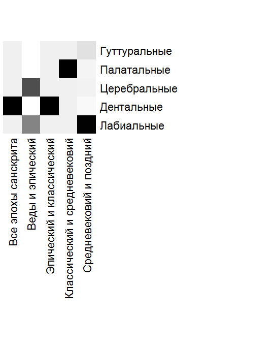

**Распределение рядов согласных**[^ed1]

***Аннотация***. Приводятся количественные данные о диахроническом распределении пяти рядов (варг) смычных и носовых согласных санскрита по пяти временным срезам корпуса DCS (ведийский, эпический, классический, средневековый, поздний). Наблюдения 2014 г., полученные попарными критериями χ², дополнены пересчётом 2026 г. по выросшему корпусу (4,24 млн слов, 9,94 млн смычных и носовых варн): вместо p-значений публикуются доли рядов по срезам и величина эффекта (V Крамера = 0,037). Диахронические сдвиги реальны, но малы; крупнейшие из них -- убывание дентальных от ведийского к эпическому срезу и постепенный рост гуттуральных вплоть до средневекового.

***Ключевые слова:*** санскрит, ряды согласных, варга, корпусная статистика, диахроническая фонетика, DCS.

## Постановка вопроса (2014)

Данные по количественному распределению рядов согласных получены как побочный результат при анализе сегментального (в частности структура слога) и надсегментального уровня (в частности ударение в ведийских словах) Гейдельбергского корпуса санскритских текстов. При исчислениях использовались язык программирования среды R и VBA. Представленные нами данные отвечают на следующие основные эмпирические вопросы:

1\) Какие ряды согласных в санскрите преобладают?

2\) Меняется ли частотность разных рядов согласных в диахронии?

В дальнейшем исследование следует углубить.

Перспективными для себя мы считаем два направления.

Во-первых, сейчас мы не разграничиваем прозаические (например, Daśakumāracaritam) и поэтические (стихотворные) тексты (например, Meghadūta). В случае стихотворных текстов, а таких по предварительным данным большинство, мы имеем дело с «условными возможностями». Из-за просодических соображений меняется частотность кратких и долгих гласных, реже это отражается даже на выборе согласных. Насколько именно меняется -- вопрос остается открытым. В случае «Облака-вестника» из-за стихотворного размера Mandākrāntā мы всегда будем иметь 10 долгих и 7 кратких слогов, что может повлиять на частотность тех или иных явлений. Заодно можно было бы посчитать распространенность стихотворных размеров в произведениях.

Во-вторых, также возможно уточнение количественных данных по фонологической интерпретации, высказанных Т.Я. Елизаренковой насчет ведийского языка [Елизаренкова 1982]. В статистическом плане ведийских язык и сейчас относительно плохо разработан, но все же лучше, чем раньше.

Впервые в мировой санскритологии приводятся исчисления насчет соотношения консонант между собой. Подсчеты проводились не на конкретном литературном памятнике, а на основе крупного корпуса. Но не только сопоставление, даже статистические подсчеты по отдельным согласным древнейших индоиранских языков до недавнего времени были редкостью. Первая отечественная работа, которая оперирует статистическими сведениями отдельных фонем ведийского языка, вышла больше тридцати лет тому назад [Елизаренкова 1982]. С тех пор подобные подсчеты у нас не повторялись.

## Данные и метод

Подсчёт 2014 г. выполнен по Гейдельбергскому корпусу санскрита [Hellwig 2010]: 430 000 предложений, 3 250 000 слов или около 7 500 000 слогов. Единственный альтернативный источник (хранилище разрозненных текстов г. Гёттингена) хотя и содержит вчетверо больше текстов, но не содержит никакой грамматической разметки слов, то есть представлен исключительно в виде слитных текстов. Помимо этого в гёттингенском хранилище порой недостаточно строго проведена граница между текстами на древних, средне- и новоиндийских языках. Даже внутри документов не всегда проведена четкая грань между основным текстом и метаязыковыми пояснениями, которые иначе вносят весьма значимые погрешности.

Временные срезы (ведийский, эпический, классический, средневековый и поздний санскрит) в 2014 г. сопоставлялись, согласно требованиям теста Пирсона χ², попарно; результатом была таблица p-значений (табл. 1).

Пересчёт 2026 г. выполнен по тому же корпусу в его выросшем состоянии -- Digital Corpus of Sanskrit [DCS]: 4 240 775 слов, 31 805 819 варн, из них 9 940 591 смычных и носовых. 25 смычных и носовых варн агрегированы в пять варг (кантхья, талавья, мурдханья, дантья, оштхья); для каждого из пяти временных срезов DCS (dcsTimeSlot 1--5) вычислена доля каждой варги среди смычных и носовых данного среза (табл. 2), а для таблицы сопряжённости 5 варг × 5 срезов -- величина эффекта V Крамера.[^ed2]

## Результаты 2014 г.: попарные χ²

Наблюдения 2014 г. по хронологическим тенденциям формулировались так.

В эпическом санскрите, по сравнению с ведийским срезом, набирают популярность лабиальные и особенно церебральные согласные. Остальные три ряда (то есть гуттуральные, палатальные, дентальные) почти не представлены.

В классическом санскрите, по сравнению с эпическим срезом, набирают популярность исключительно дентальные согласные. Остальные четыре ряда представлены сравнительно одинаково мало. То есть если сравнивать средние значения по четырем временным срезам, то остальные четыре ряда согласных распределяются ровно.

В средневековом санскрите, по сравнению с классическим срезом, набирают популярность исключительно палатальные согласные. Остальные четыре ряда представлены сравнительно одинаково мало.

В позднем санскрите, по сравнению с средневековым срезом, набирают популярность лабиальные и лишь слегка гуттуральные согласные. Палатальные и церебральные представлены сравнительно одинаково мало, дентальные убывают. Следует отметить, что в текстах на позднем санскрите много грамматических конструкций, которые привнесены в него носителями новоиндийских языков.

Продолжим сопоставление рядами согласных.

Гуттуральные -- почти отсутствуя в ведийском и эпическом санскрите, их количество плавно увеличивается в классическом санскрите. Даже более того, наблюдается незначительный рост в позднейшем периоде.

Палатальные -- почти отсутствуя в ведийском и эпическом санскрите, их количество плавно увеличивается в классическом санскрите. Однако, в отличие от гуттурального ряда палатальные переживают резкий рост в средневековом санскрите, возвращаясь к прежним значениям в дальнейшем.

Церебральные -- единственная фаза достаточно резкого роста наблюдается в переходе от ведийского к эпическому санскриту. В дальнейшем выравнивается и приравнивается к средним значениям остальных рядов.

Дентальные -- почти отсутствуя в ведийском и эпическом санскрите, их количество крайне резко увеличивается в классическом санскрите. Потом в средние века падает и становится еще меньше в позднем санскрите. Среди пяти рядов согласных -- дентальные наиболее распространенные.

Лабиальные -- имеют две фазы значительного роста. Резкий рост в эпическом санскрите и еще более резкий в позднем санскрите. Относительно плавное состояние в классическом и средневековом санскрите.

Таблица 1. Значения p попарных критериев χ² (2014 г., Гейдельбергский корпус, ~7,5 млн слогов)[^ed3]

| Ряд | Все эпохи санскрита | Веды и эпический | Эпический и классический | Классический и средневековый | Средневековый и поздний |
|---|---|---|---|---|---|
| Лабиальные | 0.000000e+00 | 2.611753e-01 | 4.399987e-35 | 1.750870e-106 | 6.592439e-01 |
| Дентальные | 3.114376e-48 | 1.022459e-08 | 6.671614e-07 | 2.707000e-14 | 3.677069e-34 |
| Церебральные | 0.000000e+00 | 3.181280e-01 | 6.859133e-92 | 1.400428e-127 | 3.685050e-02 |
| Палатальные | 1.175834e-246 | 8.720096e-51 | 1.598550e-161 | 9.514065e-01 | 2.303646e-02 |
| Гуттуральные | 0.000000e+00 | 3.607401e-43 | 0.000000e+00 | 1.267108e-01 | 0.000000e+00 |

## Пересчёт 2026 г.: доли рядов по эпохам

Таблица 2. Доля варги среди смычных и носовых согласных среза, % (DCS, срез 2026-03-05; N по срезам: 2 111 674 / 3 017 826 / 2 262 736 / 1 861 997 / 686 358)

| Варга (ряд) | ведийский | эпический | классический | средневековый | поздний | всего |
|---|---|---|---|---|---|---|
| кантхья (гуттуральные) | 8,85 | 11,66 | 13,67 | 14,85 | 14,06 | 12,28 |
| талавья (палатальные) | 8,18 | 9,43 | 8,50 | 8,62 | 8,14 | 8,71 |
| мурдханья (церебральные) | 4,49 | 4,91 | 5,35 | 5,72 | 5,85 | 5,14 |
| дантья (дентальные) | 51,51 | 47,31 | 46,82 | 46,60 | 47,29 | 47,96 |
| оштхья (лабиальные) | 26,97 | 26,70 | 25,66 | 24,21 | 24,66 | 25,91 |

Величина эффекта для таблицы сопряжённости 5 варг × 5 срезов: V Крамера = 0,037 (χ² = 54 890 при N = 9 940 591). Иными словами, различие между срезами статистически «значимо» (при таком объёме корпуса значимым оказывается почти любое различие), но по величине оно мало́: принадлежность согласного к варге лишь в слабой степени зависит от эпохи.

Крупнейшие реальные сдвиги (в процентных пунктах, между соседними срезами):

- дентальные: −4,20 от ведийского к эпическому -- самый крупный сдвиг за всю письменную историю языка; далее доля почти стабильна;

- гуттуральные: +2,80 / +2,02 / +1,18 от ведийского до средневекового (суммарно +6,0 п.п.), затем лёгкое убывание;

- церебральные: медленный монотонный рост (+0,4 / +0,4 / +0,4 / +0,1);

- лабиальные: плавное убывание (−0,3 / −1,0 / −1,5), лёгкий возврат в позднем;

- палатальные: подъём в эпическом (+1,25 п.п.) и возврат к исходному уровню.

## Вывод

1\. Ответ на первый вопрос 2014 г. устойчив по обоим подсчётам: преобладают дентальные (около половины всех смычных и носовых в каждом срезе), за ними лабиальные (около четверти); гуттуральные, палатальные и церебральные делят оставшуюся часть.

2\. Ответ на второй вопрос требует уточнения формулировок 2014 г. Таблица p-значений (табл. 1) сама по себе не несёт ни направления, ни величины изменения, а прозаический разбор 2014 г. называет «набирающими популярность» как раз те ряды, для которых p-значение велико, то есть распределение которых между срезами статистически *не* различалось: лабиальные и церебральные для эпического среза (p = 0,26 и 0,32), палатальные для средневекового (p = 0,95), лабиальные для позднего (p = 0,66). Доли 2026 г. (табл. 2) согласуются с таблицей p-значений против прозы 2014 г.: от ведийского к эпическому значимо изменились именно гуттуральные (+2,80 п.п.), палатальные (+1,25) и дентальные (−4,20), тогда как лабиальные и церебральные остались практически на месте.[^ed4]

3\. Методологический итог: на корпусах в миллионы знаков направление и величину диахронического сдвига следует читать из долей и величины эффекта, а не из p-значений; V Крамера = 0,037 показывает, что распределение рядов согласных по варгам -- одна из наиболее стабильных характеристик санскрита на всём протяжении его письменной истории.

**Список литературы**

**Елизаренкова** Т. Я. (1982) Грамматика ведийского языка. -- М.: Наука, 1982.

**Hellwig** O. (2010) Performance of a Lexical and POS Tagger for Sanskrit // Sanskrit Computational Linguistics. -- New Delhi: Springer, 2010. -- P. 162--172.

**DCS** -- Hellwig O. The Digital Corpus of Sanskrit (DCS). 2008--2026. Данные в формате CoNLL-U, CC BY 4.0; использован срез от 2026-03-05.

[^ed1]: Статья доведена до полного вида при подготовке издания 2026 г.: добавлены аннотация, раздел «Данные и метод», пересчёт долей по корпусу DCS 2026 г. (взамен интерпретации по p-значениям, табл. 1) и вывод; текст 2014 г. сохранён в разделах «Постановка вопроса» и «Результаты 2014 г.». Заглавие приведено к форме основного текста диссертации («Распределение», не «Распространение»). -- Прим. ред. 2026.

[^ed2]: Подсчёт воспроизводим: скрипт и результат -- `GasunsDhatu_2014/revision-2026/varga_shares.py`, `varga_shares.csv` (в репозитории книги); исходные частоты варн -- VisualDCS, `derived-data/Fonetika/regen-2026/varna_freq.csv` (48 варн × 5 срезов, provenance прилагается).

[^ed3]: В версии 2014 г. таблица была разбита на две части («Все эпохы санскрита» -- опечатка исправлена); при конверсии исходного файла табличная вёрстка была утрачена, здесь восстановлена по исходному тексту. Нули вида 0.000000e+00 -- машинный underflow (p < 10⁻³⁰⁸), а не точный ноль. -- Прим. ред. 2026.

[^ed4]: По-видимому, отсутствие значимого различия в 2014 г. было прочитано как рост. Окончательная формулировка соответствующего положения диссертации (положение 9) -- за автором; черновик пересмотра см. в `revision-2026/PROPOSALS.md`. -- Прим. ред. 2026.
