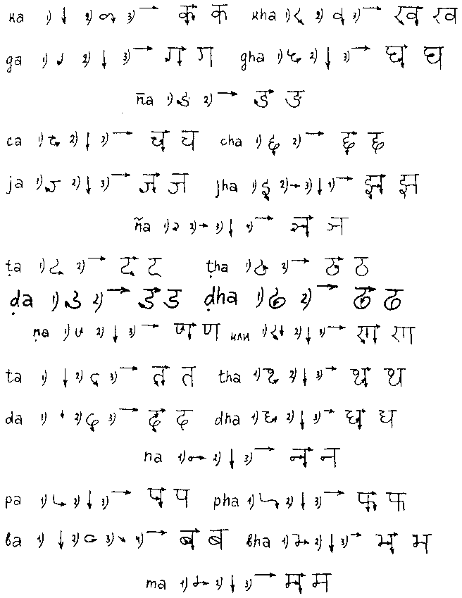
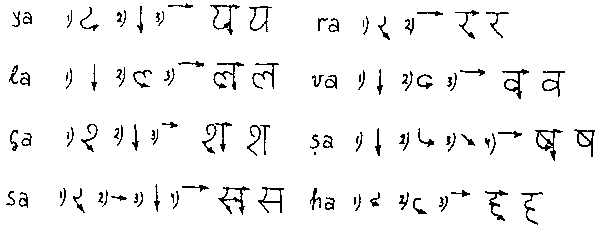
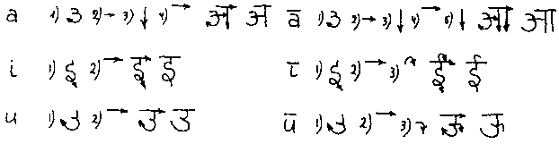
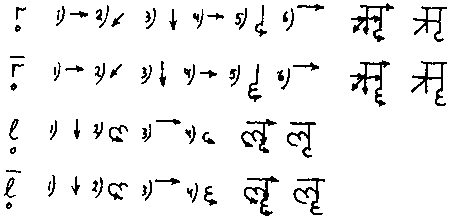
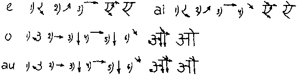
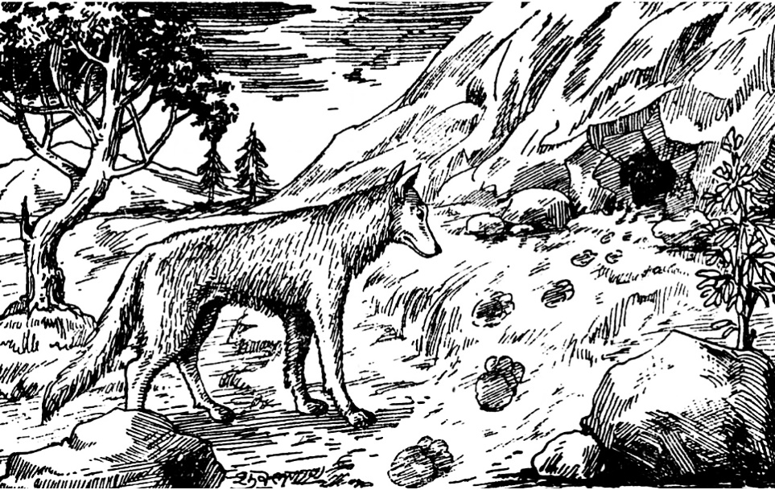
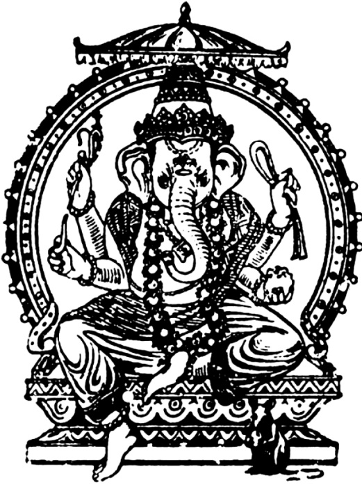
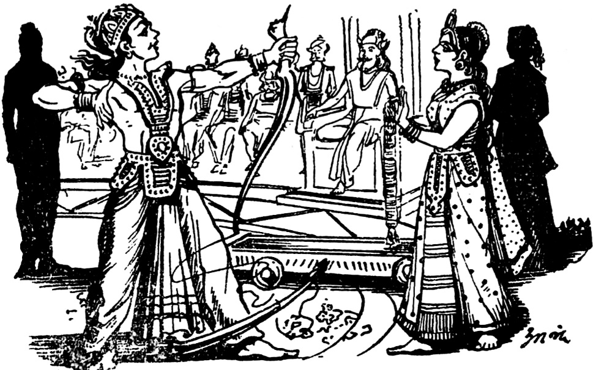

В. А. Кочергина

УЧЕБНИК САНСКРИТА

Рецензенты

доктор филологических наук, профессор *О.С.Широков*

доктор филологических наук, профессор *С.Л.Невелева*

Кочергина В.А. Учебник санскрита. 6-е издание, исправленное и дополненное, под редакцией Лихушиной Н.П.

Учебник для высших учебных заведений - Москва, издательство ВКН, 2017 - 336 с.

Настоящий учебник знакомит с основами эпического и классического санскрита. Он рассчитан на интенсивное изучение санскрита под руководством преподавателя или самостоятельно. При этом возможно знакомство с системой языка без овладения письмом devanāgarī.

Учебник предназначен для языковедов и в первую очередь - для компаративистов, а также для специалистов в различных областях индологии и для всех, интересующихся Индией.

*Светлой памяти родителей*

*и сына Андрея*

*\*

«Чудный язык! Дивлюсь и его строению,

и обширной литературе, и легкости, и

вместе трудности его изучения.» --

П.Я.Петров, первый санскритолог Московского университета --

В.Г.Белинскому (письмо от 12 августа 1834 года).

Санскрит - древнеиндийский литературный язык, принадлежащий к индийской группе индоевропейских языков.

Древнеиндийские языки отражены в памятниках нескольких исторических периодов; эти памятники различаются не только хронологически, но и функционально, и по диалектной основе их языков.

Когда во II - начале I тысячелетия до н.э. на территорию Индостана вторглись с Северо-Запада индоевропейские племена ариев, они говорили на нескольких близкородственных диалектах. Западные диалекты легли, вероятно, в основу языка, отраженного в ведах (veda - священное знание) и называемого ведийским.

Ведийский язык представляет собой самый ранний период древнеиндийского. Временем его становления ученые считают XV - Х века до н.э. На ведийском языке существуют четыре сборника (saṃhita): Ригведа (ṛgveda) веда гимнов, яджурведа (yajurveda) - веда жертвенных заклинаний, Самаведа (sāmaveda) - веда мелодий, звучаний и Атхарваведа (atharvaveda) - веда атхарвана (жреца огня), сборник заклинаний и заговоров.

К каждому из четырех сборников примыкают более поздние по времени создания трактаты: Брахманы (brāhmaṇa) - жреческие книги, Араньяки (āraṇyaka - букв. \"относящийся к лесу, лесной\") - книги отшельников и Упанишады (upaniṣad букв. \"подседание (ученика к учителю)\") - эзотерические учения, корпус текстов, венчающих религиозно-философскую традицию ведийского периода.

К ведам были созданы четыре дополнения (upaveda), среди них - знаменитый трактат по медицине Аюрведа (āyurveda) - веда здоровья или жизни.

Восточные диалекты индоевропейского легли в основу древнеиндийского языка, который позже был назван санскритом (saṃskṛta - \"обработанный, совершенный\"). Он сохранился в многочисленных памятниках древней и средневековой литературы разных жанров.

С середины I тысячелетия до н.э. по III - IV века н.э. складывались индийские эпические поэмы Махабхарата (mahābhārata) - \"Великая (битва) потомков Бхараты\" и Рамаяна (rāmāyaṇa) - \"Странствия Рамы\". Древнеиндийский язык этих поэм называют эпическим санскритом.

Историко-культурное значение создававшихся веками памятников на эпическом санскрите огромно. Они были и остаются источником для изучения религии, философии, истории, мифологии древней Индии и продолжают питать литературу и искусство современной Индии.

Эпические памятники были связаны с жанром Смрити (smṛti - \"память, воспоминание\") - предания, к которым относятся также Пураны (purāṇa - \"древний, старый\") - собрания мифов и легенд. К ним примыкают и Тантры (tantra - \"правило, свод\") - класс произведений религиозного и магического содержания.

Большинство санскритских памятников было создано на классическом санскрите - языке IV - VII веков. Это художественная литература разных жанров: проза - сборники рассказов и басен Панчатантра (pañcatantra) - \"Пять руководств\", Хитопадеша (hitopadeśa) - \"Доброе наставление\" и другие, а позже - средневековые индийские романы Дандина, Субандху и Бана; лирическая поэзия, стихотворные афоризмы и поэмы; драматургия - пьесы Бхасы (III в.), Шудраки (V в.), Калидасы (IV - V вв.); произведения Бхартрихари (V - VI вв.) и другие.

На классическом санскрите сохранилась разнообразная научная литература: труды по философии - изложение шести ортодоксальных систем индийской философии, трактаты по поэтике и теории драмы, шастры (śāstra) - сборники заповедей по разным отраслям знания, в которых зафиксированы этические и правовые нормы общества древней и средневековой Индии.

Традиции устной передачи текста еще раньше привели к появлению особого стиля изложения научной и ритуальной литературы, предельно сжатого, рассчитанного на заучивание наизусть - к появлению сутр (sūtra). Даже в XI веке моралист и философ Кшемендра использовал форму сутр в своих произведениях.

На санскрите писались труды по естественным наукам - по медицине, математике, астрономии и астрологии, по химии.

Особое место среди памятников на древнеиндийском занимают труды по языкознанию - лексикографические работы, описания звукового состава и грамматического строя языка. Работы многочисленных грамматистов были в V - IV вв. до н.э. систематизированы ученым Панини (pāṇini) в трактате \"Восьмикнижие\" (aṣṭādhyāyi). В труде Панини зафиксированы языковые нормы, соблюдение которых позже становится обязательным в литературных произведениях на классическом санскрите.

Термин \"санскрит\" употребляется в узком и в широком смысле. В узком смысле он подразумевает эпический и классический язык, в широком смысле (включая ведийский) употребляется как синоним древнеиндийского. Мы употребляем этот термин в узком смысле.

Санскрит как литературный язык на протяжении многих веков сосуществовал и взаимодействовал с другими индийскими языками - с поздним ведийским, со среднеиндийскими языками, с дравидийскими языками (языки Юга Индии). На среднеиндийских языках пали (pāli) и пракритах (prākṛta - букв. \"необработанный, естественный\") проповедывались учения неортодоксальных философских систем Индии - буддизма (на пали) и джайнизма. Среднеиндийские языки уступали санскриту как выразителю более древней и богатой культурной традиции и подвергались его мощному воздействию. Санскритизация среднеиндийских языков привела к созданию буддийского гибридного санскрита и джайнского санскрита. Они, как и формы позднего санскрита, представляют собой явления псевдоисторической эволюции языка.

Санскрит сыграл исключительно важную роль в Индии как язык культурного единства страны. До сих пор изучение санскрита входит в систему традиционного индийского образования. Санскрит используется как язык богослужения в индуистских храмах; на санскрите издаются газета и журналы; ученые ведут на нем переписку; санскрит признается рабочим языком на научных санскритологических конференциях. Литературное и научное наследие на санскрите тщательно хранится, исследуется и переиздается учеными современной Индии.

\* \* \*

Европейские ученые познакомились с санскритом в конце XVIII - начале XIX века. В 1786 году основатель Азиатского Общества в Калькутте Уильям Джонс обратил внимание европейцев на древнеиндийский язык и на его сходство с древними языками Европы. \"Независимо от того, насколько древен санскрит, он обладает удивительной структурой, - отмечал Уильям Джонс, - он более совершенен, чем греческий язык, более богат, чем латинский, и более изыскан, чем каждый из них, и в то же время он носит столь близкое сходство с этими двумя языками, как в корнях глаголов, так и в грамматических формах, что оно вряд ли может быть случайностью; это сходство так велико, что ни один филолог, который занялся бы исследованием этих языков, не смог бы не поверить тому, что они произошли из общего источника, которого уже не существует\" (цит. по \"A Reader in Nineteenth-Century Historical Indo-European Linguistics\". Bloomington - London, 1967, p. 10).

С XIX века начинается систематическое изучение санскрита и интенсивное освоение духовного наследия древней Индии. Последнему способствовала большая работа по переводу на европейские языки и комментированию древнеиндийских памятников правовой литературы, отрывков из эпических поэм (в том числе перевод знаменитой Бхагавадгиты - bhagavadgītā), драматургии и прозы, работы по исследованию и толкованию вед. Филологические работы XIX века заложили основы для дальнейшего изучения древнеиндийской литературы как самобытного и значительного явления мировой культуры.

Открытие санскрита европейцами привело к созданию научной индоевропеистики и к утверждению сравнительно-исторического метода в языкознании. Изучение санскрита и становление компаративистики, разработка концепции генеалогического родства индоевропейских языков, развивались в неразрывной связи. О путях исследования санскрита дают представление многочисленные работы сравнительно-исторического характера, статьи в периодических изданиях по индоевропеистике, словари, грамматические описания, монографии, а также работы обобщающего характера.

В начале XIX века полагали, что \"индийский древнее родственных ему языков и был их общим предком\" (Ф. Шлегель), но от взгляда на санскрит, как на \"праязык\", компаративисты вскоре отказались. Однако санскрит считали эталоном сравнения при исследовании других индоевропейских языков, так как ученые (Ф. Бопп, А. Шлейхер, И. Шмидт и другие) признавали его языком, наиболее близким праиндоевропейскому.

Оставляя в стороне изменение взглядов на праиндоевропейский, на язык-основу, в компаративистике последующих десятилетий (А. Мейе, Ф.Ф. Фортунатов, Н.С. Трубецкой), обратимся к изменению представления о санскрите. Новые сравнительно-исторические исследования, основанные на длительном изучении фактического материала, поколебали в конце XIX века (период младограмматизма) мнение об архаичности санскрита. Так, \"закон палатализации\" заставил изменить мнение о системе вокализма санскрита как о древнейшей. Позже уточнения в сложившиеся ранее представления о фонетике, морфонологии и морфологии санскрита внесла \"ларингальная теория\" (Ф. де Соссюр, Е. Курылович). Этому способствовало открытие в начале XX века хеттского и других неизвестных ранее индоевропейских языков. Оно заставило ученых окончательно отказаться от взгляда на санскрит как на самый древний из индоевропейских языков, так как памятники на хеттском (XVIII в. до н.э.) давали представление о системе языка, более близкой к доисторической фазе существования индоевропейской языковой общности. Таким образом, в XX веке произошла смена эталона сравнения в компаративистике. Дальнейшие исследования в области сравнительно-исторического языкознания продолжают вносить уточнения в сложившиеся в XIX веке представления о системе санскрита (\"глоттальная теория\" Т.В. Гамкрелидзе и Вяч.В. Иванова, работы К. Уоткинса, Я. Гонды и другие).

Санскрит является одним из важнейших \"опорных\" языков компаративистики. Он представляет собой образец языка, на котором вырабатывался сравнительно-исторический метод и его исследовательские приемы. Занятия санскритом предоставляют возможность для постоянных экскурсов в область истории и теории компаративистики и тем самым закладывают основы для овладения методикой сравнительно-исторических исследований.

Непреходящее значение санскрита для науки о языке заключается и в том, что о нем имеется уникальная лингвистическая литература. Ученые древней Индии оставили сведения не только о звучании и о толковании слов своего языка, но и поразительное по своей полноте описание морфонологии и морфологии санскрита. Интересны их синтаксические теории, тесно связанные с философскими воззрениями древних. Близость приемов и методов описания языка древнеиндийскими учеными методам современного языкознания не раз отмечалась специалистами (М.Б. Эмено, П. Тиме, В.Н. Топоров).

Не прерывается живая связь санскрита с языками современной Индии.

Современные индийские языки выросли, \"образно говоря, в атмосфере санскрита\" (С.К. Чаттерджи). В их лексике существуют слова, без изменений перешедшие из санскрита (tatsama) и возникшие из него (tadbhava). Интенсивно создаются \"неосанскритизмы\" - слова, образованные из санскритских корней, по санскритским словообразовательным моделям, но обозначающие современные явления. Санскритская лексика - это основной источник обогащения словаря современных индийских языков, особенно в области терминотворчества.

Индийские языки в их историческом развитии зафиксированы в памятниках на протяжении не менее четырех тысячелетий. Только в письменной форме санскрит существует уже более двух тысяч лет. Исследования индийских языков в диахронии могут опираться на исключительно богатый и разнообразный фактический материал, а диапазон изменений типа языка - от флективного, синтетического в санскрите до аналитического с элементами агглютинации - в современных языках, обращает исторические исследования индийских языков в сторону типологии.

В последние десятилетия к изучению источников на санскрите обращаются исследователи литературы и мифологии, культуры и истории, религии и философии, математики, медицины\... Отечественных специалистов не удовлетворяет получение сведений по своей науке \"из вторых рук\", т. е. из переводов на европейские языки, что нередко практиковалось в прошлом. В связи с этим большое значение в настоящее время приобретают текстологические исследования. Доступ к сокровищнице знаний, хранимых в текстах древней и средневековой Индии, открывается только знанием основ санскрита.

\* \* \*

\"Учебник санскрита\" создавался в процессе многолетнего преподавания санскрита в Московском университете - на филологическом факультете, в Институте стран Азии и Африки при МГУ, на историческом и философском факультетах.

Студенты, изучающие санскрит, и прежде всего студенты-филологи, давно нуждаются в учебнике, составленном специально для них, в учебнике, который содержал бы основы языка и подводил к дальнейшему использованию санскрита в соответствии с научными интересами учащихся. Написание учебника стимулировалось неоднократно высказываемыми пожеланиями наших лингвистов-компаративистов иметь учебник санскрита, созданный на основе современных научно-методических подходов и предназначенный для интенсивного изучения языка.

Необходимость появления такого учебника подтверждают также многочисленные обращения ко мне лиц, вынужденных самостоятельно знакомиться с графикой и грамматическим строем санскрита.

Эти потребности стремится учесть и, по возможности, удовлетворить предлагаемый учебник.

При изучении санскрита, языка, существующего для нас только в письменной форме, целью является пассивное овладение языком, т. е. умение читать и переводить текст с большим или меньшим использованием словаря.

Задача подготовки к работе над оригинальными специальными текстами при пассивном овладении языком обуславливает построение и содержание учебника. Он состоит из сорока занятий, трех приложений и словаря. \"Учебник санскрита\" знакомит со звуковым составом, графикой, морфонологией, морфологией, лексикой с элементами словообразования и с некоторыми своеобразными явлениями синтаксиса эпического и классического санскрита.

Дать представление о таком языке, как санскрит, в жанре учебника - сложная научно-методическая задача.

Знакомство со звуковым составом санскрита осуществляется в том его описании, которое было предложено древнеиндийскими языковедами и в основе которого лежит анатомо-физиологический принцип классификации звуков. Изучение звукового состава неразрывно связано с овладением древнеиндийским слоговым письмом devanāgari. В Учебнике предлагается рациональная методика обучения письму devanāgarī, позволяющая овладеть им за 4-5 занятий. Для изучающих письмо devanāgarī самостоятельно в \"Учебник санскрита\" впервые включена техника написания графем. Фонетический характер письма делает допустимым в теоретических частях Учебника, в упражнениях и в Словаре ограничиваться (по техническим причинам) общепринятой в санскритологии латинской транслитерацией devanāgarī. В текстах Учебника письмо devanāgarī передается путем клиширования с используемых источников.

Знакомство с фонологией и с явлениями морфонологии, пронизывающими всю систему санскрита, начинается с Занятия V и сопровождает всю последующую работу над грамматикой и словообразованием.

Систематическое изучение грамматики (морфологии) начинается с Занятия VIII. При расположении в учебнике грамматического материала руководящим являлось стремление дать цельное представление о системе языка, не дробить темы и начинать, по возможности, с более простых и употребительных явлений.

Овладение морфологией санскрита как языка флективного, синтетического, представляет определенные трудности ввиду обилия в нем форм словоизменения. Преодолевать эти трудности помогает предлагаемая в Учебнике методика постепенного овладения морфологией - работа с таблицами. Эта методика опирается на принцип разграничения во флективных языках трех функций аффиксов, иначе - трех процессов морфологической деривации: словоизменения, основообразования и словообразования. Первые два включаются в учение о форме слова и составляют предмет морфологии, словообразование тяготеет к лексике.

Изучающие морфологию санскрита знакомятся с именными основами и со способами основообразования глаголов от исходных корней. Глагольные основы складываются в системы - группы форм, образуемых от общей основы. Формы словоизменения внутри систем образуются с одними и теми же типами словоизменительных аффиксов (окончаний). Например, тип первичных личных окончаний - в настоящем и в будущем времени, тип вторичных личных окончаний - в имперфекте и в аористе с его пятью разновидностями основ\... Поэтому типы личных, а также падежных окончаний удобно вынести в таблицы. Приводимые в учебнике таблицы следует выписывать, причем каждую таблицу - на отдельный листок с одной стороны. Дальнейшая работа ведется с использованием этих таблиц, и постепенно наиболее часто встречающиеся окончания запоминаются.

Изучение систем склонения и спряжения сводится, таким образом, к усвоению правил образования глагольных основ и правил функционирования именных и глагольных основ при словоизменении - связь с определенным типом окончания и возможные морфонологические явления (чередование гласных в основе, внутренние saṃdhi).

Вопросы словообразования включаются в Учебник на протяжении всего курса изучения санскрита. Отграничивая аффиксальное словообразование от двух других процессов морфологической деривации, целесообразно среди аффиксальных и прочих словообразовательных средств языка разграничивать способы монофункциональные и полифункциональные. В Учебник включаются монофункциональные словообразовательные способы, т. е. способы, используемые только для словообразования. В санскрите это префиксация и основосложение. Суффиксация, способ используемый в санскрите как для словообразования, так и для основообразования и словоизменения, т. е. полифункциональный способ, при многозначности и нестандартности большинства суффиксов санскрита как языка флективного, в Учебнике не рассматривается. Приводятся лишь отдельные, наиболее очевидные и употребительные случаи. Изучение словообразования и грамматики базируется на знакомстве с лексикой языка.

Лексика эпического и классического санскрита, включаемая в Учебник, содержит около 3 тысяч исходных именных основ и глагольных корней; знакомство с рядом словообразовательных моделей это число значительно увеличивает.

В Учебник включена наиболее употребительная лексика, которая дает представление о богатстве словарного состава санскрита и вводит в круг древнеиндийской культурной терминологии.

Высокая степень повторяемости слов, связь изучения лексики с занятиями морфологией облегчают и ускоряют усвоение основного лексического фонда санскрита.

Учебник построен на оригинальных текстах (отрывки и отдельные предложения), взятых из эпических поэм (Mahābhārata II, III и Rāmāyaṇa I), из шастр и смрити (Mānava - Dharmaśāstra VI, Yājñavalkya - Smṛti II, Kauṭilīya - Arthaśāstra I), из прозы (Pañcatantra I, Hitopadeśa) и поэтических произведений (Kālidāsa, Bhartṛhari) на классическом санскрите[^1]. Кроме этого использованы предложения и обработан ряд текстов из учебной литературы индийских авторов[^2] и учебников санскрита на русском языке.[^3]

Каждое занятие Учебника состоит из теоретического материала, упражнений и текстов; оно включает пять видов работы. Упражнения на графику первых занятий сменяются упражнениями на saṃdhi, словообразование или новый грамматический материал.

Начиная с Занятия VIII в упражнении III вводится работа со словарем; в нем задаются слова к новому тексту, которые распределены по частям речи и приводятся в транслитерации; их следует записать шрифтом devanāgarī и перевести со словарем.

IV - отдельные предложения или связный текст на новую грамматическую тему для чтения, анализа и перевода. Это - основной текст каждого занятия.

V - текст для чтения и перевода. Он дается для развития навыков самостоятельной ориентации в тексте на санскрите и для закрепления нового грамматического материала. К этому тексту слова приводятся последовательно и с переводом, чтобы все внимание было направлено на расчленение слитных написаний, анализ saṃdhi и определение грамматических форм. При задаче скорейшего знакомства с системой санскрита тексты V могут быть пропущены, а при достаточном количестве учебных часов работа над текстами V может быть углублена и расширена.

В текстах IV и V иногда приводятся двустишия, называемые обычно subhāṣitāni - \"хорошо сказанные\", сентенции. Они имеют ряд преимуществ при использовании их в учебных целях: обладают смысловой завершенностью и афористичностью; построение их в большинстве случаев основано на параллелизме I и II строк, что облегчает понимание; в каждом двустишии преобладает какое-либо одно грамматическое явление, что позволяет использовать их для закрепления определенного материала по грамматике. Наконец, ритмическая форма двустиший (обычно - размер śloka) дает возможность заучивать их наизусть, что разнообразит виды упражнений при пассивном изучении языка.

Четыре занятия Учебника целиком посвящены работе над связными, интересными текстами, содержащими только что проработанный материал по грамматике и словообразованию. Тематическим продолжением последнего из них являются тексты V последних пяти занятий.

Учебник содержит три приложения.

Приложение I - транслитерация текстов IV. Приложение I следует использовать при самостоятельной работе с Учебником. Оно служит средством проверки правильности прочтения текстов IV, даваемых в занятиях письмом devanāgarī. В случае знакомства с системой санскрита без овладения письмом devanāgarī, а такая возможность для лингвистов в предлагаемом Учебнике предоставляется, текстами Приложения I заменяются тексты IV соответствующих занятий.

Приложение II содержит сводную таблицу сочетаний звуков, данную в учебнике Г. Бюлера. Она служит справочником при практическом овладении правилами saṃdhi (без разграничения их на внешние и внутренние).

Приложение III систематизирует морфологию глагола. Оно содержит алфавитный список корней, включенных в Учебник, с указанием их залога, класса, основ, форм инфинитива и деепричастий. Основы демонстрируются, как это принято в санскритологии, формой 3 л. единственного числа. Значения корней следует смотреть по Словарю, приводимому в конце.

Санскритско-русский словарь содержит лексику Учебника и построен по тем же правилам, что и изданный ранее более полный словарь.

\* \* \*

Тексты первой половины Учебника были просмотрены профессором Ч. К. Шарма (Мадрас), за что выражаю ему глубокую признательность.

Благодарю ведущего сотрудника Института востоковедения РАН Т.Я. Елизаренкову, доцента МГУ А.А. Вигасина и профессора ИСАА при МГУ Б. А. Захарьина за внимательное знакомство с частями учебника, за ценные советы и конкретные замечания.

Приношу искреннюю благодарность ведущему научному сотруднику Института востоковедения ЛО РАН С.Л. Невелевой и профессору МГУ О.С. Широкову, взявшим на себя нелегкий труд по рецензированию учебника и оказавшим неоценимую помощь в подготовке его к печати.

Условные сокращения

> A. - accusativus - винительный падеж\
> A.duplex - accusativus duplex - двойной винительный падеж
>
> Abl. - ablativus - отложительный падеж\
> adj. - adjectivum - прилагательное\
> *adv*. - adverbium - наречие\
> aor. - aoristus - аорист\
> Ā. - Ātmanepada - средний залог\
> bah. - bahuvrīhi - сложное посессивное определение\
> caus. - causativum - каузативный глагол\
> conj. - conjunctio - союз\
> cpv. - comparativus - сравнительная степень\
> D. - dativus - дательный падеж\
> den. - denominativum - отыменный глагол\
> des. - desiderativum - желательный глагол\
> du. - dualis - двойственное число\
> dv. - dvandva - копулятивное сложное слово\
> encl. - enclitike - безударное слово\
> *f* - femininum - женский род\
> fut. - futurum - будущее время\
> G. - genetivus - родительный падеж\
> ger. - gerundium - деепричастие\
> ij. - interjectio - междометие\
> inf. - infinitivum - инфинитив
>
> ind. - indicativus - изъявительное наклонение\
> I. - instrumentalis - творительный падеж\
> imp. - imperativus - повелительное наклонение\
> impf. - imperfectum - прошедшее время\
> int. - intensivum - интенсивный глагол\
> L. - locativus - местный падеж\
> *m* - masculinum - мужской род\
> *n* - neutrum - средний род\
> nom. ag. - nomen agentis - имя деятеля\
> nom. pr. - nomen proprium - имя собственное\
> N. - nominativus - именительный падеж\
> opt. - optativus - желательное наклонение\
> P. - parasmaipada - действительный залог\
> part. - participium - причастие\
> p. - passivum - страдательный залог\
> pf. - perfectum - прошедшее время\
> pfph. - perfectum periphrasticum - описательный перфект\
> pl. - pluralis - множественное число\
> pn. - participium necessitatis - причастие долженствования\
> pp. - participium perfecti passivi - причастие страдательного залога прошедшего времени\
> pr. - praesens - настоящее время\
> pref. - praefixus - префикс\
> relat. - relativum - относительное местоимение\
> sg. - singularis - единственное число\
> S. - substantivum - существительное\
> spv. - superlativus - превосходная степень\
> U. - Ubhayapada - имеющий оба залога\
> V. - vocativus - звательная форма
>
> осн. - основа\
> о.н.в. - основа настоящего времени
>
> ◊ - устойчивое выражение

Занятие I

1\. Письмо devanāgarī.\
2. Звуковой состав санскрита. Группа sparśa - шумные смычные согласные и носовые сонанты.\
\

1\. Письмо devanāgarī

В Индии используется несколько видов письма. Наиболее распространенным является *письмо devanāgarī*, которым записано большинство памятников на древнеиндийских языках. Письмо devanāgarī используется и в современном индийском языке хинди.

Письмо devanāgarī древнеиндийского языка является слоговым письмом, т. е. в нем один графический знак (графема) передает целый слог. Так, каждый графический знак devanāgarī передает сочетание согласной с гласной *а.*

2\. Звуковой состав санскрита

Согласные группы sparśa

Древнеиндийские ученые делили согласные на три группы и классифицировали звуки по их физиологическим признакам.

Первая группа - звуки sparśa (букв. прикосновение) - включают шумные смычные согласные и носовые сонанты. Все они по месту образования делятся на пять рядов (varga), в которых смычные четко противопоставляются по глухости/звонкости и непридыхательности/придыхательности.

Рассмотрим пять рядов первой группы:

<table>
<colgroup>
<col style="width: 22%" />
<col style="width: 0%" />
<col style="width: 13%" />
<col style="width: 0%" />
<col style="width: 15%" />
<col style="width: 0%" />
<col style="width: 13%" />
<col style="width: 0%" />
<col style="width: 15%" />
<col style="width: 0%" />
<col style="width: 18%" />
</colgroup>
<tbody>
<tr>
<td>заднеязычные</td>
<td></td>
<td><blockquote>
<p>क ka</p>
</blockquote></td>
<td></td>
<td><blockquote>
<p>ख kha</p>
</blockquote></td>
<td></td>
<td><blockquote>
<p>ग ga</p>
</blockquote></td>
<td></td>
<td><blockquote>
<p>घ gha</p>
</blockquote></td>
<td></td>
<td><blockquote>
<p>ङ n̄a (ṅa)</p>
</blockquote></td>
</tr>
<tr>
<td>палатальные</td>
<td></td>
<td><blockquote>
<p>च ca</p>
</blockquote></td>
<td></td>
<td><h1 id="छ-छ-cha">छ (छ) cha</h1></td>
<td></td>
<td>ज ja</td>
<td></td>
<td><h1 id="झ-झ-jha">झ (झ) jha</h1></td>
<td></td>
<td><blockquote>
<p>ञ ña</p>
</blockquote></td>
</tr>
<tr>
<td>церебральные</td>
<td></td>
<td><blockquote>
<p>ट ṭa</p>
</blockquote></td>
<td></td>
<td><h1 id="ठ-ṭha">ठ ṭha</h1></td>
<td></td>
<td><blockquote>
<p>ड ḍa</p>
</blockquote></td>
<td></td>
<td><h1 id="ढ-ḍha">ढ ḍha</h1></td>
<td></td>
<td><blockquote>
<p>ण (ण) ṇa</p>
</blockquote></td>
</tr>
<tr>
<td>зубные</td>
<td></td>
<td><blockquote>
<p>त ta</p>
</blockquote></td>
<td></td>
<td><blockquote>
<p>थ tha</p>
</blockquote></td>
<td></td>
<td><blockquote>
<p>द da</p>
</blockquote></td>
<td></td>
<td><blockquote>
<p>ध dha</p>
</blockquote></td>
<td></td>
<td><blockquote>
<p>न na</p>
</blockquote></td>
</tr>
<tr>
<td>губные</td>
<td></td>
<td><blockquote>
<p>प pa</p>
</blockquote></td>
<td></td>
<td><blockquote>
<p>फ pha</p>
</blockquote></td>
<td></td>
<td><blockquote>
<p>ब ba</p>
</blockquote></td>
<td></td>
<td><blockquote>
<p>भ bha</p>
</blockquote></td>
<td></td>
<td><blockquote>
<p>म ma</p>
</blockquote></td>
</tr>
</tbody>
</table>

Произнесение согласных

Шумные взрывные *k, g, t, d, p, b* сходны с русскими *к, г, т, д, п, б*; *c* походит на русск. ч - \"чашка\", \"час\"; *j* произносится как слитное *дж* - англ. \[dʒ\] age \[eidʒ\], magic \[\`mӕdʒik\]; при произнесении церебральных кончик языка завернут назад, нижняя сторона языка касается твердого нёба; церебральные *ṭ, ḍ,* напоминают альвеолярные *t, d* английского.

В шумных придыхательных звучит слабое *h*: глухое после глухих и звонкое после звонких взрывных.

Носовое *n̄* (1-го ряда) произносится как англ., нем. ŋ; *ñ* (2-го ряда) - как русское мягкое н\`; *ṇ* - как церебральное *н; m, n* произносятся как русские *м, н*

Правила написания

{width="5.767361111111111in" height="7.465972222222222in"}

В древнеиндийском письме имеется два знака препинания - । и ॥, называемые daṇḍa (т. е. палочка, стержень).

Упражнения

I. Напишите каждый графический знак несколько раз, строго соблюдая правила написания.

> II\. Напишите шрифтом devanāgarī:

1)  ka -- кто, который?

kha -- воздух, небо

-ga[^4] - идущий

> ca -- и
>
> -ja - рожденный
>
> ta -- тот
>
> -da -- дающий
>
> na -- не
>
> -pa - пьющий
>
> bha *п* -- звезда, созвездие

2)  kaṭa *т* -- циновка dama *т* -- дом, жилище

kaja *п* -- цветок лотоса dhana *п* -- богатство, деньги

khana *т* - яма nakha *т, п* -- ноготь

gaja *т* -- слон pada *п* -- шаг, нога

gaṇa *т* -- множество patha *т* -- путь

gata -- идущий bhaga *т* -- счастье

jana *т* -- человек mama -- мой, меня

tana *п* - дитя

3\) kanaka *п* -- золото kanatha -- вы довольны

> katama -- который из многих? patatha -- вы падаете
>
> caṭaka -- воробей gadatha -- вы говорите
>
> dhanada -- щедрый gachatha - вы идете
>
> janana *п* -- создание, творение
>
> janaka *т* -- создатель, творец
>
> kathana *п* -- рассказывание
>
> kathaka *т* -- рассказчик naṭana *п* -- танец
>
> gaṇana *п* -- счет naṭaka *т* -- танцор, актер
>
> gaṇaka *т* -- математик
>
> III\. Прочтите:

क। च। न। गज। जन। कट। गण। धन। नख। खन।

दम। जनक। गदथ। कथक। नटक। गणन। चटक॥

> IV\. Прочтите и переведите:
>
> क। त॥ च। न॥ ° ग। ° द \*॥ गज॥ जन। जनन। जनक॥
>
> गण। गणन। गणक॥ कथन॥ नटक॥ पद॥ पथ॥ कतम॥

Занятие II

1\. Звуковой состав санскрита. Группа antaḥstha, uṣman - неносовые сонанты и шумные фрикативные.\
2. \"Ослабленные\" согласные. Virāma.\
\

1\. Звуковой состав санскрита

Согласные группы antaḥstha, uṣman

(продолжение)

Вторая группа согласных - неносовые сонанты, antaḥstha (*букв*. \"стоящие между, внутри\"):

+:--------------------:+:----:+:------------:+
| \<TBODY\>палатальный | य    | ya           |
```rst-table
+----------------------+------+--------------+
| церебральный         | र    | ra           |
+----------------------+------+--------------+
| зубной               | ल    | la           |
+----------------------+------+--------------+
| губной               | व    | va\</TBODY\> |
+----------------------+------+--------------+
```

Третья группа согласных - шумные фрикативные, uṣman (*букв.* \"жар, зной\"):

+:--------------------:+:----:+:------------:+
| \<TBODY\>палатальный | श    | śa (ça)      |
```rst-table
+----------------------+------+--------------+
| церебральный         | ष    | ṣa (sha)     |
+----------------------+------+--------------+
| зубной               | स    | sa           |
+----------------------+------+--------------+
| гортанный            | ह    | ha\</TBODY\> |
+----------------------+------+--------------+
```

Произнесение согласных

Знаком *y* передается звук *й, j* - русск. *я* \[já\], яма. \[jáмъ\]; *r* - церебральное *р; l* соответствует нем., фр*. l; v* произносится как русское *в*.

Фрикативный *ç* соответствует русскому *ш\'* (мягкий, краткий звук), для передачи его в латинской транслитерации употребляется также знак *ś*; *ṣ* произносится как русское *ш, s* - как русское с.

*h* соответствует нем. или англ. *h*.

Правила написания

{width="5.767361111111111in" height="2.2215277777777778in"}\

2\. \"Ослабленные\" согласные. Virāma.

В санскрите имеются особые обозначения для так называемых ослабленных согласных: visarga - графическое изображение звука ḥ, возникающего из s (реже r) в конце предложения и в конце слова или префикса перед некоторыми согласными: taḥ तः, maḥ मः, vaḥ वः.

В именительном падеже единственного числа большинство существительных и прилагательных мужского рода имеют окончание s. Поэтому visarga обычно встречается в этой форме.

Anusvāra - графическое изображение носового призвука (ṃ или ṁ), возникающего после гласной из m или после гласных в конце слова перед словом, начинающимся с согласной, кроме согласных губного ряда: taṃ तं, naṃ नं, paṃ पं.

В винительном падеже единственного числа существительных и прилагательных мужского и женского рода и в именительном-винительном падежах ряда существительных и прилагательных среднего рода конечным звуком является m. Поэтому anusvāra встречается главным образом в этих формах.

Anunāsika - графическое изображение назализованного долгого гласного: tām̐ ताँ, vām̐ वाँ, dām̐ दाँ (встречается редко).

Если слово оканчивается на согласный звук, то в конце ставится знак ् virāma (т. е. остановка, конец), указывающий на отсутствие а:

कर kara -- рука → कर् kar -- делать;

जन jana -- человек → जन् jan -- рождаться.

Упражнения

I.  Напишите каждый графический знак несколько раз, строго соблюдая правила написания.

**II.** Напишите шрифтом devanāgarī :

> 1\) --ra -- помогающий, способствующий
>
> ya -- который
>
> sa -- этот, он
>
> ha -- ведь, же

2)  kara -- делающий, *т* рука

cara -- движущийся; bala *п* -- сила, могущество

jala *п* -- вода bhava *т* -- происхождение, существо

tala *п* -- плоскость, ладонь ratha *т* -- колесница

dama *т* - дом, жилище vana *п* -- лес

nava -- новый, девять vara -- отборный, лучший; *т, п* выбор, дар

daśa -- десять śata *п* -- сотня, сто

nara -- человек, герой śara *т* -- стрела

para -- другой, дальнейший sama -- одинаковый, ровный

phala *п* -- плод

3)  katara -- который из двух? vacana *п* -- слово, речь

caṣaka *т, п* -- сосуд, чашка śaraṇa *п* -- прибежище, защита,

caraṇa *п* -- нога, выполнение покровительство

parama -- высший, лучший, очень śatatama -- сотый

bharata -- Бхарата, nom.pr. эпического героя varayatha -- вы выбираете

**III. 1)** Напишите шрифтом devanāgarī форму именительного падежа единственного числа мужского рода от gaja, jana, nara, dama, caṣaka.

**2)** Напишите шрифтом devanāgarī словосочетания с винительным падежом, переведите их:

vacanaṃ gadatha;

varaṃ varayatha.

**IV.** Напишите шрифтом devanāgarī глаголы и подберите образованные от них формы и слова, встречавшиеся в сделанных упражнениях:

kath -- рассказывать; var -- выбирать;

gam -- идти; gaṇ -- считать;

kar -- делать; jan -- рождаться;

vac -- говорить; naṭ - танцевать.

**V. 1)** Прочтите:

च। न। गज। जन। जल। दश। नर। बल।

गम्। कर्। वन। वर। वर्। शत। भरत। वच्।

वचन। गछथ। नव। जन्। परम। स। ह। दम।

मम। धन। पद। य। चषक। फल। पथ। रथ।

गदथ। कतर। चरण। शत। शततम॥

**2)** Прочтите и переведите слова:

च। न। दश। शत। गज। वन। नटक। गणक।

स। य। कर् गम्। जन्। जन। नर। भरत। दम। पद॥

Занятие III

1\. Звуковой состав санскрита: гласные\
2. Принцип их написания. Написание ā̆,ī̆,ū̆.

1\. Звуковой состав санскрита: гласные.

[Система гласных]{.underline} санскрита включает:

1.  гласные простого образования - нелабиализованные a, i и лабиализованный u;

2.  гласные сонанты ṛ (как в русск. \"метр\", \"мудрствовать\") и ḷ;

3.  гласные дифтонического происхождения - нелабиализованный e и лабиализованный o;

4.  дифтонги ai и au.

Гласные a, i, u, ṛ и ḷ противопоставляются по долготе и краткости. Это противопоставление играет смыслоразделительную роль. Например:

sa -- он śastra - оружие

sā -- она śāstra - учение

В индоиранских языках общеиндоевропейские гласные ā̆, ē̌, ō̌, \*, \* совпали в ā̆. Поэтому для системы гласных санскрита характерно преобладание гласных a и ā.

2\. Принцип написания гласных

Написание гласных зависит от того, встречаются ли они в начале слова или группы слов, или в середине их; в соответствии с этим существует два способа обозначения гласных на письме:

1\) В начале слова или группы слов гласные обозначаются самостоятельными графическими знаками.

Написание гласных a, i, u в начале слова:

अ (अ) a इ i उ u

आ (आ) ā ई ī ऊ ū

Правила написания

{width="5.767361111111111in" height="1.4944444444444445in"}

2\) В середине слова или группы слов гласные входят в состав слога и при слоговом письме обозначаются дополнительными (диакритическими) значками к графемам для согласных. Гласная a не обозначается никакими дополнительными значками (см. Занятие I).

Написание гласных a, i, u в середине слова:

+:----:+:-----:+:-----:+:-----:+:-----:+:-----:+
| a    | क ka  | ग ga  | ज ja  | त ta  | द da  |
```rst-table
+------+-------+-------+-------+-------+-------+
| ā    | का kā | गा gā | जा jā | ता tā | दा dā |
+------+-------+-------+-------+-------+-------+
| i    | कि ki | गि gi | जि ji | ति ti | दि di |
+------+-------+-------+-------+-------+-------+
| ī    | की kī | गी gī | जी jī | ती tī | दी dī |
+------+-------+-------+-------+-------+-------+
| u    | कु ku  | गु gu  | जु ju  | तु tu  | दु du  |
+------+-------+-------+-------+-------+-------+
| ū    | कू kū  | गू gū  | जू jū  | तू tū  | दू dū  |
+------+-------+-------+-------+-------+-------+
```

Сочетание र् r и श् ś (не всегда) с ū̌ обозначается особым образом:

```rst-table
+------------------------------+------------------------------------------+
| \<TBODY\>ru रु rū रू           | \- видоизменяются знаки для u и ū.       |
+------------------------------+------------------------------------------+
| śu शु śū शू                    | видоизменяется знак для ś [^5]\</TBODY\> |
+------------------------------+------------------------------------------+
```

Упражнения

I.  Напишите шрифтом devanāgarī:

<!-- -->

1)  kathā *f* - рассказ\
    kāla *m* - время\
    jagāma - он пришел\
    tadā - тогда\
    yathā - как\
    hā - ай!\
    tathā - так\
    dāna *n* - щедрость, даяние\
    nārada *m* - nom. pr. мудреца\
    mahā- - большой, великий\
    sabhā *f* - зал собраний\
    mahābhārata *n* - \"Махабхарата\", *название древнеиндийского эпоса*\
    rāmāyaṇa *n* - \"Рамаяна\", *название древнеиндийского эпоса*

2\) hi - ибо, так как\
kavi *m* - поэт\
gati *f* - путь\
yadi - если\
dina *n* - день\
niyama *m* - обет\
pādābhivādana *n* - земной поклон\
mahī *f* - земля\
pari - вокруг\
sakhi *m* - друг\
samīpa *n* - близость\
śiva *m* - Шива (*nom. pr*. бога)\
pitāmaha *m* - дед\
-gāminī - идущая

3\) tu - но\
su- - хорошо\
bhū - быть\
bhava - \"будь\"\
kula *n* - род, семья\
pura *n* - город\
bhūmi *f* - земля\
sukha *n* - счастье\
kar - делать\
kuru - \"сделай\"\
suta *m* - сын\
sutā *f* - дочь\
sūnu *m* - сын\
puruṣa *m* - человек; мужчина\
duḥkha *n* -- несчастье

4\) ati - через, мимо\
iti - так\
ubha - оба\
atha - итак\
uvāca - \"он сказал\"\
api - тоже\
iva - как\
abhāva *m* - гибель, небытие\
āhāra *m* - еда\
udaka *n* - вода\
uṣas *f* - рассвет, утренняя заря, утро; nom. pr. богини

5\) as - быть\
āsīt (или āsīd) - \"он был\"\
aham - я\
mām - A. sg. *от* aham\
gam - идти\
āgam - приходить\
duhitar *f* - дочь\
nāman *n* - имя\
punar - снова\
pitar *m* - отец\
mātar *f* - мать\
rājan *m* - царь, князь\
vid - знать, ведать\
vayas *n* - возраст\
śiras *n* - голова\
ṣaṣ - шесть\
savitar *m* -- солнце

II.Напишите шрифтом devanāgarī и переведите слова: mahāphala, mahāgaja, mahāpatha, mahākathā, mahāratha, mahādāna, mahāvana.

III\. Напишите шрифтом devanāgarī синонимы санскрита для слов:

> вода, земля, путь, быть, сын, дочь, человек.

IV\. Напишите шрифтом devanāgarī и переведите встречавшиеся формы от глаголов:

> gam, vac, as, bhū, kar.

V.1) Прочтите:

इति। अपि। राजीव। उभ। महाभारत। यदि। कुल। इव।

काल। नियम। पुरुष। उदक। हि। मन्। मनस्॥

> 2\) Прочтите и переведите слова:\
> यथा। तथा॥ भू। अस्। आसीत् ॥ कर्। कुरु॥ नारद॥ पुर॥
>
> वच्। वचन। उवाच॥ गम्। जगाम। गज। गम्। गजगामिनी॥
>
> राजन्। महाराज॥ पितर्। मातर्। दुहितर्। सुत। सुता॥\
> \
> 3) Прочтите и переведите предложения:\
> नारद उवाच ॥ तथा कुरु॥ आसीद् राजा॥

Занятие IV

1\. Написание гласных e и o, дифтонгов и слоговых ṛ, ḷ.\
2. Обозначение r в сочетании с согласными.\
3. Словообразование.\
\

1.  Написание гласных e и o, дифтонгов и слоговых ṛ, ḷ.

Гласные дифтонгического происхождения e и o являются долгими гласными. Они могут чередоваться с дифтонгами (подробнее о чередовании гласных - в Занятии XIII): e // ai, o // au. Связь e с ai, o с au видна в закономерностях их графического изображения.

Написание e, ai, o, au в начале слов: ए e, ऐ E, ओ (Aो) o, औ (Aौ) au.

Слоговые ṛ и ḷ в начале слов обозначаются: ऋ (\\)R, ॠ (§)ṝ, लृ ḷ, लॄ ḹ.

ṝ и ḷ употребляются очень редко, ḹ практически не употребляется.

Правила написания

{width="4.6875in" height="2.25in"}

{width="5.761111111111111in" height="1.4604166666666667in"}

Написание e, ai, o, au в середине слов:

+:--:+:------:+:------:+:------:+:------:+:------:+
| e  | के ke   | गे ge   | जे je   | ते te   | दे de   |
```rst-table
+----+--------+--------+--------+--------+--------+
| ai | कै kai  | गै gai  | जै jai  | तै tai  | दै dai  |
+----+--------+--------+--------+--------+--------+
| o  | को ko  | गो go  | जो jo  | तो to  | दो do  |
+----+--------+--------+--------+--------+--------+
| au | कौ kau | गौ gau | जौ jau | तौ tau | दौ dau |
+----+--------+--------+--------+--------+--------+
```

В середине слова чаще всего встречается ṛ. Написание ṛ: कृ kṛ, गृ gṛ, जृ jṛ,

तृ tṛ, दृ dṛ, मृ mṛ, वृ vṛ. В сочетании с ṛ знак श видоизменяется, как и при сочетании с u,

а именно: śṛ शृ

2\. Обозначение r в сочетании с согласными.

Сонант r र्, входя в состав слога, состоящего из согласного и гласного звуков, обозначается дополнительными значками к знаку для согласного:

1\) r после согласного звука передается знаком {width="9.097222222222222e-2in" height="0.10208333333333333in"} , присоединяемым слева к середине вертикальной черты, а в буквах без горизонтальной черты - к нижней части буквы:

क्र kra, ग्र gra, द्र dra, म्र mra, व्र vra.

Сочетание с последующим र् r изменяет त् t и श् ś:

त्र tra, श्र śra.

Сочетание kra также передает графема

2\) r перед согласным звуком передается надстрочным знаком справа

над горизонтальной чертой буквы:

र्क rka, र्ग rga, र्त rta, र्द rda, र्म rma, र्व rva.

3\. Словообразование.

> Префикс su- с существительными и причастиями значит \"хороший, хорошо\". Например: su-ratha - хорошая колесница, su-kṛta - хорошо сделанный.
>
> Префикс su- с прилагательными обозначает усиление их значения \"очень\". Например: su-dīrgha - очень длинный.

Упражнения

I. Напишите каждый графический знак (для обозначения гласной в начале слова) несколько раз.

II\. Напишите шрифтом devanāgarī:

1)  

2)  me - D. от aham\
    te - D. от tvam ты\
    deva *m* - бог\
    devī *f* - богиня\
    veda *m* - Веда\
    deśa *m* - место, страна\
    he - эй!\
    eva - частица \"же\"\
    etad - это\
    eka - один\
    ekaika - один за другим\
    haima - золотой\
    mahābhārate - (L. sg.) в эпосе \"Махабхарата\"

2\) go *f* - корова\
ghora - ужасный\
ghoṣa *m* - шум\
loka *m* - мир\
bhojana *n* - пища\
ojas *n* - сила, мощь\
odana *m* - рисовая каша\
tapovana *n* - лес подвижничества\
paura *m* - горожанин\
pādau - ноги\
pitarau - родители\
yauvana *n* - молодость\
audaka - водяной, водный\
auṣasa - утренний, ранний

> 3)kṛta - сделанный\
> vṛṇomi - я выбираю
>
> śṛṇu - слушай!\
> pitar - pitṛ - отец\
> nṛpati *m* - царь\
> pṛthivī *f* - земля\
> mātar - mātṛ - мать
>
> 4\) sahasra - тысяча\
> artha *m, n* - дело, цель\
> ācārya *m* - учитель, наставник\
> karman *n* - дело\
> car - ходить, жить
>
> caryā *f* - странствие, жизнь
>
> darś - видеть\
> darśana *n* - вид\
> dīrgha - длинный\
> durgā *f* - nom. pr. богини\
> dharma *m* - закон, правило
>
> dhārmika - справедливый\
> nirmala - чистый\
> pārvatī *f* - nom. pr. богини\
> varṣa *m* - дождь\
> sarga *m* - отдел, глава\
> prajā *f* - народ, население; потомство, дети\
> prathama - первый\
> śru - слушать\
> kutra - куда?\
> sāvitrī *f* - nom. pr. богини\
> priya - милый, приятный\
> putra *m* - мальчик, сын\
> putrī *f* - девочка, дочь\
> nalo *m* - nom. pr. Наль (N. sg.)\
> nāma - по-имени\
> bhram - бродить, ходить\
> netrau -- глаза

III\. По моделям [su + осн. s. или part]{.underline}. \"хороший\" и [su + осн. adj]{.underline}. \"очень\" образуйте производные от следующих слов: patha, putra, varṣa, ghora, ghoṣa, jana, dina, dīrgha, kathā, karman, kavi, kṛta. Производные слова напишите шрифтом devanāgarī и переведите.

IV\. Прочтите и переведите:

1)  группы слов

> दश। शत। सहस्र॥ देव। देवी॥ चर्। चर्या॥

नामन्॥ वेद। विद्। वेदविद्॥ वर। वर्। वृणोमि॥

सावित्री॥ कर्। कुरु। कृत॥ श्रु। शृणु॥

पितर्। मातर्। पितरौ॥ धर्म। धार्मिकः। परमधार्मिकः॥

दुहितर्। पुत्र। पुत्री॥ सुख। दुःख॥

> दर्श्। दर्शन। प्रियदर्शन॥ राजन्। नृपति। नृपते॥
>
> प्रथमः सर्गः॥ महाभारत। महाभारते॥

2)  предложения

> आसीद् राजा नलो नाम ॥ वरम् एतं वृणोमि॥
>
> आसीद् राजा परमधार्मिकः॥ सावित्री वचनं उवाच॥
>
> शृणु राजन् ॥ इति महाभारते प्रथमः सर्गः॥

Занятие V

1.  Написание сочетаний согласных: лигатуры.

2\. Особенности письма devanāgarī.

3\. Правила слитного написания слов.

4\. Правила saṃdhi.

5\. Регрессивная ассимиляция зубного t.\
\

1\. Написание сочетаний согласных: лигатуры.

Для обозначения сочетаний нескольких согласных звуков употребляются сложные графические знаки, [лигатуры]{.underline}[^6]. Лигатура состоит из комбинации характерных частей знаков тех согласных, которые входят в данное сочетание.

Все графические знаки письма devanāgarī имеют в своем составе горизонтальную черту сверху и большинство графических знаков - вертикальную черту справа. Характерная часть графического знака находится под горизонтальной чертой и слева от вертикальной черты:

ग् - характерная часть ग्

व् - характерная часть व्

म् - характерная часть म्

स् - характерная часть स् и т.д.

В зависимости от последовательности расположения характерных частей различаются горизонтальные и вертикальные лигатуры.

В горизонтальных лигатурах характерные части графических знаков располагаются слева направо под общей горизонтальной чертой, причем графический знак последней согласной берется полностью.

Например:

sva स्व, gma ग्म, tya त्य, ntha न्थ.

Но графический знак первого согласного полностью берется в сочетаниях

द्म dma, द्य dya, ह्म hma, ह्य hya, क्म kma, क्य kya.

В горизонтальных лигатурах могут объединяться две и более согласных.

В вертикальных лигатурах характерные части графических знаков располагаются сверху вниз, причем графический знак первой согласной берется полностью.

Например:

mna म्न, n̄ga ङ्ग, dva द्व , hla ' .

Но графический знак [второй]{.underline} согласной полностью берется в сочетаниях ष्ट ṣṭa и ष्ठ ṣṭha.

В вертикальных лигатурах могут объединяться только две согласные.

Горизонтальные лигатуры более употребительны, чем вертикальные.

Имеются графические знаки, которые соединяясь в лигатуру, изменяются и образуют нерасчленимые лигатуры. Их необходимо запомнить:

Изменение характерной части обоих знаков:

क् и ष् образуют क्ष् (क्ष्)

ज् и ञ् образуют ज्ञ् (ज्ञ्)

Изменение характерной части первого знака.

क् и त् образуют क्त

त् и त् образуют त्त्

श् и व् образуют श्व्

श् и च् образуют श्च् [^7]

2\. Особенности письма devanāgarī.

Ознакомившись с письмом devanāgarī, отметим его особенности:\
1) каждый графический знак обозначает сочетание согласной с a;\
2) написание гласных различно в зависимости от положения их в начале или в середине слова;\
3) сочетание согласных передается на письме лигатурами.

3\. Правила слитного написания слов.

В санскрите действует правило слитного написания слов:

***Слово, оканчивающееся на согласную (кроме висарги и анусвары), обычно пишут слитно с последующим словом.***

Например:

आसीद् आचार्यः «был учитель» → आसीदाचार्यः

महत् पापम् "большое несчастье"→ महत्पापम्

4\. Правила saṃdhi.

В основе письма devanāgarī лежит фонетический принцип: каждый звук передается определенным графическим знаком, т. е. написание всегда соответствует произношению. Из этого следует, что одно и то же слово или словоформа, в зависимости от окружения во фразе, могут звучать, а, следовательно, и писаться по-разному. Например, tāt \"так, поэтому\" в разных позициях может звучать и писаться как tād, tān, tāc, или jana \"человек\" в именительном падеже единственного числа может звучать и писаться как janaḥ, janas, jana, jano, janaś.

Чтобы установить основной фонетический вид словоформы, приходится учитывать комбинаторные и позиционные звуковые изменения. Древнеиндийские ученые назвали их saṃdhi (\"соединение\", \"правила соединения\").

Имеются saṃdhi согласных и saṃdhi гласных.

Saṃdhi на стыке слов называются внешними, saṃdhi на стыке морфем называются внутренними[^8].

Чтобы понимать текст, необходимо восстанавливать фонетическую структуру и основной вид встречающихся в нем слов и словоформ. Этому и помогает знание saṃdhi.

Правила внутренних saṃdhi позволяют расчленить словоформу на морфемы, выделить лексическую морфему. Правила внешних saṃdhi, восстанавливая основной вид словоформы, помогают определить ее грамматическое значение.

5\. Регрессивная ассимиляция зубного t.

Среди внешних saṃdhi согласных широко распространена регрессивная ассимиляция, т. е. уподобление предшествующего звука последующему.

1\. Шумный глухой t подвергается неполной регрессивной ассимиляции перед шумными звонкими заднеязычного, зубного и губного рядов, перед y, r, v и перед гласными, изменяясь в звонкий d.

Например:

āsī[t]{.underline} [r]{.underline}ājā \"жил был раджа\": āsī[d]{.underline} [r]{.underline}ājā

2\. Зубной t подвергается полной регрессивной ассимиляции перед шумными (глухими и звонкими) палатального и церебрального рядов и перед сонорным l.

Например:

ta[t]{.underline} [c]{.underline}a \"и это\": ta[c]{.underline} [c]{.underline}a

3\. Зубной t перед носовыми изменяется в носовой зубного ряда n.

Например:

āsī[t]{.underline} [m]{.underline}adreṣu \"он жил среди мадров\": āsī[n]{.underline} [m]{.underline}adreṣu

4\. t перед фрикативным ś изменяется в c, причем ś изменяется в ch.

Например:

āsī[t]{.underline} śālveṣu \"он жил среди шальвов\": āsī[c]{.underline} chālveṣu.

Упражнения

I.  Составьте и напишите лигатуры:\
    \
    1) горизонтальные:\
    mya, ccha, ṣṭa, nta, sta, bdha, vya, hma, nma, tva;\
    \
    2) вертикальные:\
    kka, n̄ga, dba, dva, hna, n̄kha, dhna, sna, hva, ddha;\
    \
    3) лигатуры с измененными знаками:\
    kta, kṣa, jña, tta, śva, śca;\
    \
    4) лигатуры из трех букв:\
    tmya, ntva, trya, bdhya, ktva.

> II Напишите шрифтом devanāgarī:
>
> 1\) kva - где? куда?\
> khyā - называть\
> jñā - знать\
> tvā - A. от ты\
> dva - два\
> plu - плавать\
> danta *m* - зуб\
> mnā - указывать\
> strī *f* - женщина\
> sthā - стоять\
> sva - свой\
> smi - смеяться\
> hvā - звать\
> kṣetra *n* - поле
>
> 2\) названия четырех основных сословий (варн):\
> brāhmaṇa *m*\
> kṣatriya *m*\
> vaiśya *m*\
> śūdra *m*\
> \
> мифологические имена:
>
> indra\
> śiva\
> pārvatī\
> durgā\
> viṣṇu\
> lakṣmī\
> gaṇeśa\
> aśvinau

III\. Прочтите лигатуры:

क्व । क्ष। क्ष्ण। क्ष्म। त्म्य। त्य। थ्य।

ख्य। घ्न। च्य। ज्ञ। ब्द।। ष्ठ। द्ग।

ग्द। ग्ध। ग्न। ग्भ। भ्य। ह्म। ह्य। व्य।

स्थ। स्न। स्प। न्थ। म्न। म्प। ब्य। श्च।

न्त। न्त्य। न्त्र। ल्म। ल्य। त्व। ज्य। प्ल॥

IV\. Напишите шрифтом devanāgarī слова к предложениям для перевода с санскрита:\
āsīt - impf. 3 л. sg. \"был, жил\"\
ācārya *m* - учитель, наставник, здесь N. sg.\
vīrasenasuta *m* - сын Вирасены\
-suto - N. sg.\
balī *m* - N. sg. \"могущественный\"\
madra *m* - название народа\
madreṣu - L. pl. \"среди мадров\"\
mahātmā - N. sg. \"великий духом\"\
paramadhārmikaḥ - N. sg. \"очень справедливый\"\
śālva *m* - название народа\
śālveṣu - L. pl. \"среди шальвов\"\
dharmātmā - N. sg. \"справедливый\"\
pṛthivīpati *m* - N. sg. \"владыка земли\"

V. Прочтите и переведите предложения, объяснив встречающиеся sandhi конечного t:

āsīdrājā nalo nāma vīrasenasuto balī --

āsīdācāryaḥ - āsītkṣatriyaḥ --

आसीन्मद्रेषु महात्मा राजा परमधार्मिकः ॥

आसीच्छाल्वेषु धर्मात्मा क्षत्रियः पृथिवीपतिः ॥

\
Занятие VI

> 1\. Система письма devanāgarī.\
> 2. Особенности санскритских словарей.\
> 3. Вопросы ударения.\
> 4. Внешние saṃdhi -s и -r.\
> \

1\. Система письма devanāgarī.

Система письма devanāgarī соответствует звукам древнеиндийского языка. Порядок расположения графических знаков основан на акустических и артикуляционных признаках обозначаемых звуков. Алфавит начинается с гласных простых, кратких и долгих, и дифтонгов, затем следуют согласные в той последовательности, в какой они приводились на Занятиях I и II.

Строение алфавита:

अ a आ ā इ i ई ī उ u ऊ ū

ऋ ṛ ॠ ṝ ऌ L ॡ 

ए е ऐ ai ओ o औ au

क ka ख kha ग ga घ gha ङ n̄a

च ca छ cha ज ja झ jha ञ ña

ट ṭa ठ \[ha ड\]a ढ\]ha ण ṇa

त ta थ tha द da ध dha न na

प pa फ pha ब ba भ bha म ma

य ya र ra ल la व va

श śa ष ṣa स sa ह ha

Слова с анусварой (ṃ), предшествующей смычным и носовым, помещаются в словаре после носового соответствующего ряда. Например, saṃtata после sant. Слова с анусварой, предшествующей фрикативным, помещаются перед смычными. Например, saṃsad перед saṃkar.

Слова с висаргой (ḥ), предшествующей фрикативным, помещаются в словаре после соответствующих фрикативных. Например, niḥśalya после niśvas, niḥṣecana после niṣṣidh, niḥsan̄ga после nisvara.

Знание принципов построения индийского алфавита облегчает работу со словарем.

2\. Особенности санскритских словарей.

[Древнеиндийские словари]{.underline} - это словари лексических морфем для слов, имеющих формы словоизменения. У именных разрядов слов, т. е. у существительных, прилагательных, у местоимений и порядковых числительных в словаре приводятся [основы]{.underline} (у существительных - с указанием рода). У глаголов приводятся [корни]{.underline} , после которых сообщаются, с большей или меньшей степенью полноты, сведения по морфологии глагола.

Например:\
[основы]{.underline}:\
putra *m* - сын, tad - это,

dīrgha - длинный dvitīya - второй;\
[корни]{.underline}:\
gam (P. pr. gácchati - I; fut. gamiṣyáti; pf. jagāma; pp. gatá; ger. gatvā; inf. gántum) -

1)  идти 2) двигаться и т. д.

sthā (U. pr. tíṣṭhati/tiṣṭhate - I; fut. sthāsyáti/sthāsyáte; pf. tasthau/tasthé; pp. sthitá; ger. sthitvā; inf. sthātum) - стоять.

3\. Вопросы ударения.

Ударение в ведийском языке было основано на повышении и понижении тона слогообразующих гласных, т. е. было музыкальным. Различалось три тона: udātta - высокий, anudātta - низкий и svarita - восходяще-нисходящий тон, циркумфлекс. Существовала и система обозначения тонов на письме[^9]. В более поздних текстах ударение уже не обозначалось, поэтому для многих слов место ударения осталось неизвестным.

В послеведийский период древнее музыкальное ударение постепенно утрачивалось. В эпическом и классическом санскрите складывается слабое экспираторное ударение. В прозаических текстах оно передается на основе правил ударения латинского языка, т. е.:

1)  в двусложных словах ударение падает на первый слог;

2\) в многосложных словах ударение приходится на второй от конца слог с долгим гласным. Если этот слог имеет краткий гласный, то ударение ставится на третьем от конца слоге, независимо от долготы гласного в этом слоге.

Следует помнить, что в древнеиндийском языке для большинства грамматических форм ударение фиксировано, на что будет постоянно указываться. Кроме того, имеются слова, никогда не носящие на себе ударение: частицы, краткие (энклитические) формы местоимений и verbum finitum в середине предложения.

В стихотворных текстах на санскрите ударение используется как средство передачи определенного стихотворного размера: ударными произносятся слоги, стоящие в \"сильных\" местах стихотворных стоп.

В дальнейшем мы будем проставлять ударение при транслитерации слов на основе данных Большого Петербургского словаря и в соответствии с фиксированным местом ударения в ряде грамматических форм.

4\. Внешние saṃdhi -s и -r.

1)  В конце предложения или стихотворной строки -s и -r изменяются в висаргу ḥ:

> sa paramadhārmikaḥ (из paramadhārmikas) \"он - очень справедливый\".

2)  Перед глухими согласными -s и -r изменяются:

а) в висаргу перед k, kh, p, ph, ś, ṣ, s: prathamaḥ sargaḥ (из prathamas sargaḥ) \"первая глава\";

punaḥ punaḥ (из punar punaḥ) \"снова и снова\";\
б) в ś перед c-, ch: sutaśca (из sutas ca) \"и сын\"; punaś calati (из punar calati) \"он снова ходит\";\
в) в ṣ перед ṭ-, ṭh-: vṛkṣaṣ ṭīkate (из vṛkṣas ṭīkate) \"дерево качается\";\
г) в s перед t-, th-: antas-tāpa (из antar-tāpa) \"внутреннее тепло\".

3)  Перед звонкими согласными (кроме r) и перед гласными (но не после ā̆) -s изменяется в -r:

kavir bhāṣate (из kavis bhāṣate) \"поэт говорит\";

agnir iva (из agnis iva) \"как огонь\".

4)  Перед r- согласные -s (но не после ā̆) и -r выпадают, удлиняя предшествующую краткую гласную:

agnī rocate (из agnis rocate) \"огонь сверкает\";

dadū rāmāya (из dadur rāmāya) \"они дали Раме\".

Упражнения

I.  Напишите шрифтом devanāgarī и найдите по словарю значения слов:

makṣikā, pārthiva, vraṇa, dhana, kalaha, śānti, nīca, sādhu, iṣ.

II. Напишите шрифтом devanāgarī текст:

> मक्षिका व्रणमिच्छन्ति धनमिच्छन्ति पार्थिवाः।
>
> नीचाः कलहमिच्छन्ति शान्तिमिच्छन्ति साधवः॥

III. Расчлените текст на слова, учитывая, что существительные на -m употреблены в винительном падеже sg., остальные существительные - в именительном падеже pl. Форма icchanti - 3 л. pl. pr. от глагола iṣ.

IV\. Объясните имеющиеся saṃdhi -s и переведите текст.

Упражнения на повторение графики и слов

I.  Напишите шрифтом devanāgarī и переведите:\
    1) ca, na, pitar, mātar, pitarau, putra, duhitar, sūnu, jñā, darś, śru, vid, bhū, loka, nāman.\
    2) naṭ, naṭaka, naṭana;

> gaṇ, gaṇaka, gaṇana;
>
> kath, kathaka, kathana.
>
> 3\) mahāphala suputra
>
> mahāpatha suratha
>
> mahāratha sukathā
>
> mahāvana sumahant
>
> mahāgaja sukṛta.

II\. Напишите встречавшиеся Вам формы глаголов: gam, vac, as, bhū, kar, śru.

III\. Напишите известные Вам синонимы санскрита для слов: вода, земля, путь, быть, сын, дочь, человек.

IV\. Напишите шрифтом devanāgarī и переведите слова: brāhmaṇa, kṣatriya, vaiśya, śūdra; veda, mahābhārata, rāmāyaṇa; indra, viṣṇu; eka, daśa, śata, sahasra; artha, dharma, karman.

IV. Напишите шрифтом devanāgarī и найдите по словарю значения незнакомых слов:

tuṣ, aśvapati, upākhyāna, śāstra, ās.

Занятие VII

1\. Saṃdhi гласных ā̆, ī̆, ū̌, ṛ.\
2. Внешние saṃdhi -m.\
\

1\. Saṃdhi гласных ā̆, ī̆, ū̆, ṛ.

Внешние saṃdhi конечных гласных ā̆, ī̆, ū̆, ṛ сводятся к трем правилам:\
1) Простые однородные[^10] гласные, краткие и долгие, при встрече сливаются в одну долгую гласную:\
ā̆ + ā̆ → ā\
ī̆ + ī̆ → ī\
ū̆ + ū̆ → ū

Например:

na aham \"не я\" → nāham;

api idānīm \"теперь же\" → apīdānīm;

su ukta \"хорошо сказанный\" → sūkta.

2\) Гласная ā̆ и последующая разнородная гласная сливаются, изменяясь следующим образом:

ā̆ + ī̆ → e

ā̆ + ū̆ → o

ā̆ + e → ai

ā̆ + o → au

ā̆ + ṛ → ar\
Например:

tathā iti \"так, хорошо\" → tatheti,

rājā uvāca \"раджа сказал\" → rājovāca,

nāma etad \"это имя\" → nāmaitad,

mahā ṛṣi \"великий мудрец\" → maharṣi;

3\) Гласные ī̆, ū̆ и ṛ перед неоднородной гласной изменяются в сонанты:

ī̆ →y, ū̆ → v, ṛ → r.\
Например:

sāvitrī uvāca \"Савитри сказала\" → sāvitryuvāca,

su āgatam \"добро пожаловать\" → svāgatam,

pitṛ artham \"ради отца\" → pitrartham.\
Заметим, что внешние saṃdhi гласных ведут к слитному написанию слов.

2\. Внешние saṃdhi -m.

Конечная -m перед начальной согласной следующего слова изменяется в анусвару. Например:

patram likhati \"он пишет письмо\" → patraṃ likhati.

Конечная -m не изменяется в анусвару перед гласными; напомним, что в этом случае соблюдается правило о слитном написании слов (см. Занятие V). Например:

śāntim icchanti \"они хотят мира\" → शान्तिमिच्छन्ति

Упражнения

I.  Напишите шрифтом devanāgarī, соединив слова по правилам saṃdhi; не забудьте о возможности слитного написания слов.

> 1\. evam astu iti - \"да будет так\";\
> 2. eka ekam - \"один за другим\";\
> 3. āhāra artham - \"для пищи\";\
> 4. tena uktam - \"им сказано\";\
> 5. na aham aparāddhaḥ - \"я не виноват\";\
> 6. kva asau durātmā - \"где этот злодей?\"\
> 7. tatra paśya iti - \"посмотри туда\".

II. Напишите шрифтом devanāgarī слова и некоторые словоформы, найдите значения незнакомых слов по словарю:

> tuṣṭā\
> asmi (pr. 1 л. sg. от as)\
> aśvapati\
> aśvapate (звательная форма)\
> var\
> vṛṇomi (pr. 1 л. sg. от var)
>
> vṛṇīṣva, varayasva (imp. 2 л. sg. от var)\
> sā\
> abravīt (impf. 3 л. sg. от brū)\
> uttiṣṭha (imp. 2 л. sg. от utthā)\
> kariṣyāmi (fut. 1 л. sg. от kar)\
> evam\
> yathā\
> īpsitam

III Напишите шрифтом devanāgarī и переведите слова:\
vacana, vac, uvāca; etad, etam; evam; vara, varam, var, vṛṇīṣva, varaya,

> vṛṇomi; as, āsīt, asmi; brū, abravīt; aśvapati, aśvapate; sā, tuṣṭā; kar,
>
> kariṣyāmi; darś, paśyati; utthā, uttiṣṭha; īpsitam.

IV Прочтите текст, запишите его транслитерацию, расчлените слитные написания и объясните случаи saṃdhi, переведите предложения:

> तुष्टास्मि॥ वरं वृणीष्वाश्वपते॥ वरमेतं वृणोम्यहम्॥
>
> सावित्र्युवाच॥ साब्रवीत्॥ उत्तिष्ठोत्तिष्ठ॥
>
> करिष्याम्येतदेवम्॥ वरं वरयस्व यथेप्सितम्॥

Занятие VIII

Морфология.

> 1\. Грамматические категории глагола.
>
> 2\. Спряжение глаголов в настоящем времени.

Санскрит отличается многообразием форм словоизменения.

1\. Грамматические категории глагола.

Глагол в древнеиндийском характеризуется грамматическими категориями наклонения, залога, лица, числа и времени.

В санскрите три основных наклонения: изъявительное (indicativus), желательное (optativus) и повелительное (imperativus)[^11].

В системе спряжения древнеиндийского глагола противопоставляются три залога: действительный (Parasmaipada), средний (Ātmanepada) и страдательный. Parasmaipada значит \"слово, выражающее действие по отношению к другому\", Ātmanepada значит \"слово, выражающее действие по отношению к самому себе\".

Рассмотрим, например, употребление глагола pac \"печь, варить, готовить (пищу)\". Форма Parasmaipada - janaḥ pacati \"человек готовит (пищу)\" - значит, что он готовит пищу для кого-то другого. Форма Ātmanepada - janaḥ pacate \"человек готовит (пищу)\" - показывает, что он готовит пищу для самого себя.

Употребление Parasmaipada или Ātmanepada определенным образом связывалось с семантикой глагола. Одни глаголы функционируют только в Parasmaipada, другие - только в Ātmanepada. Имеются глаголы, употребление которых оказывается возможным в обоих залогах, Ubhayapada. В соответствии с этим в словарях глагольный корень снабжается пометой P., Ā. или U. Страдательный залог в древнеиндийском представляет собой систему производных форм.

Категория лица включает противопоставление 1-го, 2-го и 3-го лица.

Категория числа образуется противопоставлением единственного (singularis, sg.), двойственного (dualis, du.), и множественного (pluralis, pl.) чисел.

Категория времени включает следующие формы, для обозначения которых здесь и далее будем применять латинские названия: praesens, imperfectum, perfectum, futurum и aoristus.

2\. Спряжение глаголов в настоящем времени Parasmaipada и Ātmanepada.

Для образования форм настоящего времени к основе настоящего времени прибавляются определенные, так называемые [первичные]{.underline}, личные окончания.

О способах образования основ настоящего времени (о.н.в.) речь будет идти позже (см. Занятия XV-XVII).\
Ударение в формах настоящего времени фиксировано на определенной гласной основы (или окончания) и указано в транслитерации.

Первичные личные окончания[^12]

**Parasmaipada**

```rst-table
+-----------+---------+-----------+--------------------+
| \<TBODY\> | sg.     | du.       | pl.                |
```
+:=========:+:=======:+:=========:+:==================:+
| 1 л.      | **-mi** | **-vas**  | **-mas**           |
```rst-table
+-----------+---------+-----------+--------------------+
| 2 л.      | **-si** | **-thas** | **-tha**           |
+-----------+---------+-----------+--------------------+
| 3 л.      | **-ti** | **-tas**  | **-nti\</TBODY\>** |
+-----------+---------+-----------+--------------------+
```

**Ātamānepādā**

```rst-table
+-----------+---------+----------------+--------------------+
| \<TBODY\> | sg.     | du.            | pl.                |
```
+:=========:+:=======:+:==============:+:==================:+
| 1 л.      | **-i**  | **-vahe**      | **-mahe**          |
```rst-table
+-----------+---------+----------------+--------------------+
| 2 л.      | **-se** | **-ithe**[^13] | **-dhve**          |
+-----------+---------+----------------+--------------------+
| 3 л.      | **-te** | **-ite**[^14]  | **-nte\</TBODY\>** |
+-----------+---------+----------------+--------------------+
```

Поскольку лицо и число передаются окончаниями глагола, личные местоимения при спряжении не употребляются.

[Образцы спряжения]{.underline}

Parasmaipada

likh \"писать\". P., о.н.в. likhá-

+:---------:+:------------:+:-------------:+:------------------:+
| \<TBODY\> | sg.          | du.           | pl.                |
```rst-table
+-----------+--------------+---------------+--------------------+
| 1 л.      | likhā́mi      | likhā́vas      | likhā́mas           |
+-----------+--------------+---------------+--------------------+
| 2 л.      | likhási      | likháthas     | likhátha           |
+-----------+--------------+---------------+--------------------+
| 3 л.      | likháti      | likhátas      | likhánti\</TBODY\> |
+-----------+--------------+---------------+--------------------+
```

Ātmanepada\
śikṣ \"учиться\". Ā., о.н.в. śíkṣa

+:---------:+:------------:+:---------------:+:------------------:+
| \<TBODY\> | sg.          | du.             | pl.                |
```rst-table
+-----------+--------------+-----------------+--------------------+
| 1 л.      | śíkṣe        | śikṣāvahe       | śikṣāmahe          |
+-----------+--------------+-----------------+--------------------+
| 2 л.      | śíkṣase      | śikṣethe        | śikṣadhve          |
+-----------+--------------+-----------------+--------------------+
| 3 л.      | śíkṣate      | śikṣete         | śikṣante\</TBODY\> |
+-----------+--------------+-----------------+--------------------+
```

Заметим, что 1-ое лицо - так называемая \"сильная\" форма: в ней гласная основы перед личным окончанием удлиняется.

Примечание: у глаголов, рассматриваемых до Занятия XVI, во 2 л. и 3 л. du. Ā. настоящего времени, а также imperfectum (Занятие X) и повелительного наклонения (Занятие XIV), используются окончания, начинающиеся с -i; гласная основы -a + i- стягиваются в -e- (см. Занятие VII, 1.).

Упражнения

I. Напишите шрифтом devanāgarī; постарайтесь запомнить основу настоящего времени и значение следующих глаголов:\
iṣ - icchá- (U.) - искать, желать, стремиться к чему-либо (A.)\
khād - khā́da- (P.) - есть, питаться\
gam - gáccha- (P.) - идти\
cal - cála- (P.) - ходить, бродить\
jīv - jī́va- (P.) - жить\
paṭh -- páṭha- (P.) - читать\
pat - páta- (P.) - падать, летать\
likh - likhá- (P.) - писать\
vad - váda- (P.) - говорить\
vas - vása- (U.) - жить, обитать\
īkṣ - ī́kṣa- (Ā.) - смотреть, видеть\
kamp - kámpa- (Ā.) - бояться\
bhāṣ- bhā́ṣa- (Ā.) - говорить\
labh - lábha- (Ā.) - получать\
vart - várta- (Ā.) - вертеться\
śikṣ - śíkṣa- (Ā.) - учиться

II\. Переведите на санскрит:

Мы учимся. Я говорю. Ты читаешь. Он пишет. Они живут.

Вы (двое) идете. Мы говорим. Мы (двое) смотрим. Они (двое) едят.

Он боится. Ты говоришь. Они бродят.

III\. Напишите слова шрифтом devanāgarī и найдите значения незнакомых слов по словарю:

vṛkṣa, kutra, kva, sarvatra, cakravat, patra, tatra, evam, kas, pari-vart.

> IV\. Прочтите предложения, спишите их, объясните случаи saṃdhi, определите формы глаголов, переведите:\
> vṛkṣaḥ patati - patraṃ likhāmi - patraṃ likhanti -- patraṃ paṭhati -
>
> patraṃ paṭhanti - kutra gacchasi - kutra gacchatha -
>
> tatra gacchāmaḥ - kva vasasi - kva vasatha - tatra vasāmaḥ -
>
> tatra vasāmi - īkṣante - īkṣate - evaṃ vadati - evaṃ bhāṣāmahe -
>
> evaṃ vadanti - sutaḥ khādati - khādāmaḥ - sarvatra jīvanti -
>
> putraścalati - śikṣate kaḥ - śikṣāmahe.
>
> शान्तिमिच्छन्ति साधवः॥
>
> चक्रवत् परिवर्तन्ते सुखानि च दुःखानि च॥\
> (sukhāni, duḥkhāni - N., pl.).

V. Текст для чтения и перевода:

संवादः

रामः कुत्र गच्छसि।

देवः विद्यालयं गच्छामि।

रामः किमर्थम् विद्यालयं गच्छसि।

देवः अहम् अध्ययनाय विद्यालयं गच्छामि। तत्र पुस्तकानि पठामि।

रामः अहम् अपि गच्छामि।

देवः कुत्र गच्छसि।

रामः अहम् वनं गच्छामि।

देवः किमर्थम् वनं गच्छसि।

रामः अहम् पुष्पेभ्यः फलेभ्यश्च वनं गच्छामि॥

Слова\
saṃvādas - беседа, разговор\
vidyālayam - в школу\
kimartham - зачем?\
adhyayanāya - для учения, чтобы учиться\
pustakāni - книги\
vanam - в лес\
puṣpebhyas - за цветами\
phalebhyas - за плодами, за ягодами.

Занятие IX

1\. Грамматические категории имени существительного.\
2. Типы склонения. Склонение основ на -а.\
3. Saṃdhi слога ā̆s.\
\

1\. Грамматические категории имени существительного.

Имя существительное в древнеиндийском характеризуется грамматическими категориями рода, числа и падежа.

В санскрите три рода - мужской, женский и средний; три числа - единственное, множественное и двойственное. Последнее представляет собой архаическую форму парности: форма двойственного числа встречается обычно у существительных, обозначающих предметы, лица или явления, существующие в окружающей действительности попарно - ноги, руки, глаза, родители, день и ночь (т. е. сутки), и т. п.

Древнеиндийский язык имеет развитую падежную систему, состоящую из восьми падежных форм. Они располагаются в следующем порядке:

> именительный падеж (Nominativus, N.)\
> винительный падеж (Accusativus, A.)\
> творительный падеж (Instrumentalis, I.)\
> дательный падеж (Dativus, D.)\
> отложительный падеж (Ablativus, Abl.)\
> родительный падеж (Genetivus, G.)\
> местный падеж (Locativus, L.)\
> звательная форма (Vocativus, V.)

Краткая характеристика основных функций падежей:

[N. - обозначает]{.underline} деятеля: **сын** читает - **sutaḥ** paṭhati; **дерево** падает - **vṛkṣaḥ** patati; **отец** стоит - **pitā** tiṣṭhati.

Двойной N. употребляется при глаголах со значением «быть, становиться»: **сыновья** становятся героями - **sutā** bhavanti vīrāḥ[^15].

> [A. обозначает:]{.underline}
>
> 1\) объект (при переходных глаголах): он пишет **письмо** - **patraṃ** likhati;\
> 2) направление (при глаголах движения и речи): он идет **в город** - **nagaraṃ** gacchati; сын говорил отцу - sutaḥ **pitaram** abravīt;

3\) время: она стояла **день и ночь** - **divārātraṃ** sthitābhavat.

Двойной A. употребляется при глаголах речи: она сказала **слово** (речь) **царю** - uvāca **vacanaṃ pārthivam.**

I.  [обозначает:]{.underline}

<!-- -->

1)  чем, с помощью чего совершается действие: (я) пишу **рукой - hastena** likhāmi; он едет **на колеснице** - **rathena** gacchati;

> 2\) деятеля (в пассивной конструкции): **сыном** пьется вода - **sutena** jalaṃ pīyate;\
> 3) причину действия: **по причине несчастья** он идет в город - **duḥkhena** nagaraṃ gacchati;\
> 4) имеет социативное значение: (он) идет **с сыном** - **sutena** gacchati; **со временем** (она) стала взрослой - **kālena** yauvanasthā babhūva.

[D. обозначает]{.underline}:

1)  адресат действия: (я) пишу **сыну** (письмо) - **sutāya** likhāmi;

2)  цель: он идет **на битву** (т. е. для сражения) - **yuddhāya** gacchati;

3\) направление (при глаголах движения): он идет (направляется) **к деревне** - **grāmāya** gacchati.

[Abl. обозначает]{.underline}:

1)  исходное место действия: он идет **от деревни**, **из леса** - **grāmād** gacchati, **vanād** gacchati;

2\) причину: от счастья - sukhād, от горя - duḥkhād; **от жадности** возникает гнев - **lobhāt** krodhaḥ prabhavati.

[G. обозначает]{.underline}:

1)  приименной падеж, обозначает отношение, принадлежность: улица **деревни** - **grāmasya** rathyā; рычание **льва** - **siṃhasya** garjanam.

2)  G. употребляется при глаголах со значением «быть, иметься»: **у человека** были сыновья - **narasya** putrāḥ samabhavan; **у врагов** имеются колесницы - **arīṇāṃ** rathā bhavanti.

[L. обозначает]{.underline}:

1)  место: живет **в лесу, среди деревьев** - **vane taruṣu** vasati;

2)  время: летом - grīṣme; днем - dine.

[V. обозначает]{.underline} лицо, к которому обращаются с рассказом, вопросом, приказанием: послушай, **о Юдхиштхира** - śṛṇu **yudhiṣṭhira**; приди, **Савитри** - ehi **sāvitri**.

2\. Типы склонения.

В зависимости от исходного звука все именные основы делятся на две группы: основы на гласные и основы на согласные. Соответственно двум группам основ существует два главных типа склонения: склонение основ на гласные и склонение основ на согласные.

Склонение основ на гласные охватывает бо́льшую часть основ и является наиболее продуктивным. Основы на гласные представлены несколькими видами склонений в зависимости от исходной гласной основы.

Склонение существительных с основой на -a.

Существительные с основой на -a составляют большую часть всех существительных в древнеиндийском языке. Склонение существительных с основой на -a является самым распространенным видом склонения.

Существительные с основой на -a являются существительными мужского и среднего рода. Падежные окончания основ на -a мужского и среднего рода в большинстве форм совпадают.

Падежные окончания основ на -a

```rst-table
+------+-----------------------+-----------------------+-----------------------+
|      | sg.                   | du.                   | pl.                   |
|      +-----------+-----------+-----------+-----------+-----------+-----------+
|      | *m*       | *n*       | *m*       | *n*       | *m*       | *n*       |
```
+:====:+:=========:+:=========:+:=========:+:=========:+:=========:+:=========:+
| N.   | s         | m         | au        | e         | as        | āni       |
+------+-----------+-----------+           |           +-----------+           |
| A.   | m                     |           |           | an        |           |
```rst-table
+------+-----------------------+-----------+-----------+-----------+-----------+
| I.   | e/na                  | ā/bhyām               | ais                   |
```
+------+-----------------------+                       +-----------------------+
| D.   | āya                   |                       | e/bhyas               |
+------+-----------------------+                       |                       |
| Abl. | ād                    |                       |                       |
```rst-table
+------+-----------------------+-----------------------+-----------------------+
| G.   | sya                   | ay/os                 | ān/ām                 |
```
+------+-----------------------+                       +-----------------------+
| L.   | e/                    |                       | e/ṣu                  |
```rst-table
+------+-----------------------+-----------------------+-----------------------+
| V.   | =основе               | =N.                   | =N.                   |
+------+-----------------------+-----------------------+-----------------------+
```

Образец склонения suta *m* «сын» и vana *n* «лес».

Единственное число

> N sutás vanám\
> A sutám vanám\
> I suténa vanéna\
> D sutā́ya vanā́ya\
> Abl sutā́d vanā́d\
> G sutásya vanásya\
> L suté vané\
> V súta vána
>
> Двойственное число
>
> N.A.V. sutáu vané\
> I.D.Abl. sutā́bhyām vanā́bhyām\
> G.L. sutáyos vanáyos
>
> Множественное число
>
> N.V. sutā́s (из suta + as) vanā́ni\
> A. sutā́n (из suta + an) vanā́ni\
> I. sutáis vanáis\
> D.Abl. sutébhyas vanébhyas\
> G. sutā́nām vanā́nām\
> L. sutéṣu vanéṣu

[Следует заметить]{.underline}, что:

у именных основ среднего рода формы N. и A. во всех числах совпадают;

в двойственном числе имеются только три падежных формы, так как совпадают

1\) N.A. и V., 2) I.D.Abl., 3) G.L.;

во множественном числе всегда сходны формы N.V. и формы D.Abl.

3\. Saṃdhi слога --ā̆s.

-s, которому предшествует --a или --ā, т. е. слог --ā̆s, перед звонкими согласными, носовыми и перед гласными изменяется следующим образом:

1\. -ās перед звонкими согласными и носовыми → ā:

vīrās bhāṣante «герои говорят» → vīrā bhāṣante;

2\. -as перед гласными (кроме a) → a:

vīras īkṣate «герой глядит» → vīra īkṣate;

3\. -as перед звонкими согласными, носовыми и перед a → o:

vīras bhāṣate «герой говорит» → vīro bhāṣate.

4\. После конечной --o (или --e) начальная a следующего слова выпадает, заменяясь на письме знаком avagraha (т. е. отделитель) ऽ (в транслитерации \' ):

vīras api gacchati «герой тоже идет» → vīro \`pi gacchati वीरो ऽपि गच्छति

Упражнения

I.  Напишите шрифтом devanāgarī, соединив слова по правилам sandhi:\
    vīras jayati «герой побеждает»\
    bālās gacchanti «мальчики идут»\
    janas api gacchati «человек тоже идет»\
    janās calanti «люди движутся»\
    aśvas annam khādati «лошадь ест корм»\
    abhitas vṛkṣās rohanti «вокруг растут деревья»

II. Напишите слова шрифтом devanāgarī и их перевод, найдя значения незнакомых слов по словарю:

> kim?\
> patra\
> hasta\
> api\
> phala\
> vīra\
> pārthiva\
> aśvapati\
> bhojana
>
> mukha\
> sas\
> doṣa\
> vṛkṣa\
> sakṛt\
> aṃśa\
> pat
>
> nipat
>
> III\. Прочтите предложения, спишите их, объясните случаи sandhi, определите формы существительных и глаголов, переведите:\
> kiṃ likhasi -- patraṃ likhāmi -- hastena patraṃ likhāmi 

bhojanaṃ khādasi -- mukhena bhojanaṃ khādasi -- so \`pi mukhena

bhojanaṃ khādati -- patraṃ paṭhāvaḥ -- phalaṃ khādathaḥ -- suta īkṣate --

suto bhāṣate -- vīro na kampate

अस्ति पार्थिवो ऽश्वपतिर्नाम॥ नारद उवाच॥

एको दोषो ऽस्ति॥ सकृदंशो निपतति॥

यथा वृक्षस्तथा फलम्॥

IV\. Текст для чтения и перевода:

1)  १फ हस्तस्य भूषणं दानं सत्यं कण्ठस्य भूषणम्।

> श्रोत्रस्य भूषणं शास्त्रम् भूषणैः किम् प्रयोजनम्॥
>
> Слова

hasta *m* -- рука\
bhūṣaṇa *n* -- украшение\
dāna *n* -- щедрость\
satya *n* -- правда, истина\
kaṇṭha *m* -- горло, шея\
śrotra *n* -- ухо, слух\
śāstra *n* -- учение, наука

kim prayojanam (*n*) -- какая необходимость в чем-либо

> 2\) लोभात्क्रोधः प्रभवति लोभात्कामः प्रजायते।
>
> लोभान्मोहश्च नाशश्च लोभः पापस्य कारणम्॥

Слова

lobha *m* - жадность\
krodha *m* - гнев\
prabhū - возникать, P., о.н.в. prabháva-\
kāma *m* - желание\
prajan - появляться, A., о.н.в. prajāya-\
moha *m* - заблуждение, ошибка\
nāśa *m* - погибель\
ca - и\
pāpa *n* - зло\
kāraṇa *n* - причина

Занятие X

1.  Склонение существительных с основой на -ā.\
    2. Церебрализация -s.\
    3. О склонении прилагательных.\
    4. Спряжение глаголов в imperfectum.\
    5. Внешние saṃdhi -n.

1\. Склонение существительных с основой на -ā.

Существительные с основой на -ā являются существительными женского рода.

Падежные окончания основ на --ā

```rst-table
+-----------+-----------------+--------------+----------------+
|           | **sg.**         | **du.**      | **pl.**        |
```
+:=========:+:===============:+:============:+:==============:+
| N.        | \-              | -e/          | -s             |
+-----------+-----------------+              |                |
| A.        | -m              |              |                |
```rst-table
+-----------+-----------------+--------------+----------------+
| I.        | -ā              | -bhyām       | -bhis          |
```
+-----------+-----------------+              +----------------+
| D.        | -ai             |              | -bhyas         |
+-----------+-----------------+              |                |
| Abl.      | -ās             |              |                |
+-----------+                 +--------------+----------------+
| G.        |                 | -os          | -ām            |
+-----------+-----------------+              +----------------+
| L.        | -ām             |              | -su            |
```rst-table
+-----------+-----------------+--------------+----------------+
| V.        | -e/\</TBODY\>   | =N.          | =N.            |
+-----------+-----------------+--------------+----------------+
```

Между -ā основы и окончаниями, начинающимися с гласной, появляются соединительные элементы -y- (sg., du.) и -n- (pl.).

В I.sg. и G.L.du. -ā основы сокращается в -a.

В V.sg. и N.A.du. окончание -e замещает -ā основы.

Образец склонения sutā *f* \"дочь\"

```rst-table
+-----------+--------------+----------------+----------------------+
| \<TBODY\> | sg.          | du.            | pl.                  |
```
+:=========:+:============:+:==============:+:====================:+
| N.        | sutā́         | suté           | sutā́s                |
+-----------+--------------+                |                      |
| A.        | sutā́m        |                |                      |
```rst-table
+-----------+--------------+----------------+----------------------+
| I.        | sutáyā       | sutā́bhyām      | sutā́bhis             |
```
+-----------+--------------+                +----------------------+
| D.        | sutā́yai      |                | sutā́bhyas            |
+-----------+--------------+                |                      |
| Abl.      | sutā́yās      |                |                      |
+-----------+              +----------------+----------------------+
| G.        |              | sutáyos        | sutā́nām              |
+-----------+--------------+                +----------------------+
| L.        | sutā́yām      |                | sutā́su               |
```rst-table
+-----------+--------------+----------------+----------------------+
| V.        | súte         | suté           | sutā́s\</TBODY\>      |
+-----------+--------------+----------------+----------------------+
```

Познакомившись со склонением основ на -ā, следует отметить, что несколько падежных окончаний являются универсальными для всех именных основ.

Универсальные падежные окончания

```rst-table
+---------------------------+----------------------------------+
| Единств. число (sg.)      | A. -m                            |
```
+:=========================:+==================================+
| Двойств. число(du.)       | I.D.Abl. -bhyām                  |
|                           +----------------------------------+
|                           | G.L. -os                         |
```rst-table
+---------------------------+----------------------------------+
| Множественное число (pl.) | I. -bhis (но не в основах на -а) |
|                           +----------------------------------+
|                           | D.Abl. -bhyas                    |
|                           +----------------------------------+
|                           | G. -(n)ām                        |
|                           +----------------------------------+
|                           | L. -su                           |
+---------------------------+----------------------------------+
```

2\. Церебрализация -s-.

После морфем, оканчивающихся на -k, -r, гласные (кроме ā̆) и на сочетания таких гласных с ṃ и ḥ, начальное -s следующей морфемы изменяется в -ṣ. Например, в L.pl. suteṣu, madreṣu, но у основ на -ā - sutāsu, rathyāsu.

3\. О склонении прилагательных.

Прилагательные в санскрите формально не отграничены от существительных. Поэтому склонение существительных и прилагательных, имеющих один и тот же вид основы, сходно. Так, прилагательные с основой на --ā̆ склоняются как существительные с основой на --ā̆. Например, прилагательное priya \"приятный, милый\" в мужском роде склоняется как suta *m* \"сын\", в среднем - как vana *n* \"лес\", в женском - как sutā *f* \"дочь\", т. e. в N.sg. *m* priyas \"милый\", *n* priyam \"милое\", *f* priyā \"милая\".

4\. Спряжение глаголов в imperfectum.

Imperfectum выражает действие в прошедшем времени и обычно употребляется как время повествования о событиях прошлого.

Для образования imperfectum к основе настоящего времени прибавляются особые личные окончания, [вторичные]{.underline} личные окончания, в отличие от первичных личных окончаний, с которыми образуются формы настоящего времени. Признаком прошедшего времени imperfectum является приращение (аугмент) a-, на которое падает ударение.

Вторичные личные окончания[^16]

```rst-table
+-------------------------------------------------------------------+
| Parasmaipada                                                      |
```
+:==============:+:==============:+:==============:+:==============:+
|                | *sg.*          | *du.*          | *pl.*          |
```rst-table
+----------------+----------------+----------------+----------------+
| 1              | -m             | -va            | -ma            |
+----------------+----------------+----------------+----------------+
| 2              | -s             | -tam           | -ta            |
+----------------+----------------+----------------+----------------+
| 3              | -t             | -tām           | -n             |
+----------------+----------------+----------------+----------------+
| Ātmanepada                                                        |
+----------------+----------------+----------------+----------------+
| 1              | -i             | -vahi          | -mahi          |
+----------------+----------------+----------------+----------------+
| 2              | -thās          | -ithām         | -dhvam         |
+----------------+----------------+----------------+----------------+
| 3              | -ta            | -itām          | -nta           |
+----------------+----------------+----------------+----------------+
```

Образцы спряжения

Parasmaipada: pat \"падать, летать\", P., о.н.в. páta-

+:---------:+:------------:+:---------------:+:------------------:+
| \<TBODY\> | sg.          | du.             | pl.                |
```rst-table
+-----------+--------------+-----------------+--------------------+
|           |              |                 |                    |
+-----------+--------------+-----------------+--------------------+
| 1\.       | > ápatam     | > ápatāva       | > ápatāma          |
+-----------+--------------+-----------------+--------------------+
| 2\.       | > ápatas     | > ápatatam      | > ápatata          |
+-----------+--------------+-----------------+--------------------+
| 3\.       | > ápatat     | > ápatatām      | > ápatan\</TBODY\> |
+-----------+--------------+-----------------+--------------------+
```

Ātmanepada: bhāṣ \"говорить\", Ā, о.н.в. bhāṣa-

+:---------:+:------------:+:-----------------:+:---------------------:+
| \<TBODY\> | sg.          | du.               | pl.                   |
```rst-table
+-----------+--------------+-------------------+-----------------------+
|           |              |                   |                       |
+-----------+--------------+-------------------+-----------------------+
| 1\.       | > ábhāṣe     | > ábhāṣāvahi      | > ábhāṣāmahi          |
+-----------+--------------+-------------------+-----------------------+
| 2\.       | > ábhāṣathās | > ábhāṣethām[^17] | > ábhāṣadhvam         |
+-----------+--------------+-------------------+-----------------------+
| 3\.       | > ábhāṣata   | > ábhāṣetām       | > ábhāṣanta\</TBODY\> |
+-----------+--------------+-------------------+-----------------------+
```

Если в формах imperfectum употребляется глагол с префиксом, то аугмент оказывается между префиксом и основой глагола. При этом нередко происходят внутренние sandhi. Например, saṃ-gam \"встречаться, стекаться\" P., о.н.в. saṃ-gaccha-, 3 л.sg. imperfectum sam-a-gacchat, samagacchat \"(он) встречался\" или \"(она) встречалась\"; vi-vardh \"вырастать\", Ā, о.н.в. vi-várdha-, 3 л.sg. imperfectum vi-a-vardhata, vyávardhata \"(он) вырастал\" или \"(она) вырастала\".

5\. Внешние saṃdhi -n.

В конце словоформы -n подвергается следующим изменениям:

1\) -n + j- (jh-) → -ñj- (-ñjh-)\
-n + ś- → -ñś- / -ñch-

2\) -n + l- → -ṃll-;

-n + c- (ch) → -ṃśc- (ṃśch-)\
-n + ṭ- (ṭh-) → -ṃṣṭ (ṃṣṭh)\
-n + t- (th-) → -ṃst (-ṃsth-)

При неразличении в печатных текстах анунасики и анусвары ṃ, в сочетаниях пункта (2) выступает анусвара.

Например:

apatan ca \"и (они) падали\" → apataṃ ś ca ;

kasmin cit vanoddeśe \"в какой-то лесистой местности\" → kasmiṃ ś cit .

Упражнения

I.  Напишите прилагательные в указанных формах:\
    para \"другой, дальнейший\" - *m*, N.sg., A.pl.; *f* L.sg., L.pl.;\
    nīca \"низкий\" - *n* N.A.du., N.A.pL, G.pl.;\
    kṣipra \"быстрый\" - *f* A.sg., G.L.du., L.pl.; *m* L.pl.;\
    dīrgha \"длинный, долгий\" - *n* I.pl.; f I.pl.; *m* G.sg., Abl.sg.;\
    nava \"новый\" - *m* I.sg., L.sg.; *n* N.sg., N.du.; *f* I.pl.;

II. Напишите шрифтом devanāgarī, соединив слова по правилам sandhi:

śṛgālas siṃhas ca \"шакал и лев\"\
śṛgālas avasat \"шакал обитал\"\
bahis atiṣṭhat \"он стоял снаружи\"\
vanāni agacchat \"он шел в леса\"\
siṃhas agarjat \"лев рычал\"\
sutas cintayati \"сын думает\"\
sas acintayat \"он думал\"\
kena upāyena \"какой хитростью?\"\
uccais ākrośat \"он громко закричал\"\
adhāvat ca \"и он бежал\"

III. Напишите новые слова шрифтом devanāgarī:\
     1) gāh Ā., о.н.в. gā́ha- \"нырять, погружаться\"\
     rac P., о.н.в. racáya- \"плести, сплетать\"\
     vardh U, о.н.в. várdha- \"расти\"\
     vivardh Ā., о.н.в. vivárdha- \"вырастать\"\
     sthā U., о.н.в. tíṣṭha- \"стоять; находиться\"\
     saṃgam Ā., о.н.в. saṃgáccha- \"встречаться, стекаться\"\
     bhram P., о.н.в. bhrā́mya- \"бродить\"\
     śram P., о.н.в. śrā́mya- \"уставать\"\
     kasmin *m.n*. L. sg. от kas \"какой\" и -cid частица \"то\"

2\) Напишите слова шрифтом devanāgarī и их перевод, найдя значения незнакомых слов по словарю:

> *\<TBODY\>m*
>
> mitra
>
> siṃha
>
> divasa
>
> mṛga
>
> rāma
>
> śiṣya
>
> prayāga
>
> grāma
>
> gaja
>
> aśva
>
> janaka
>
> *f*
>
> gan̄gā
>
> kanyā
>
> mālā
>
> ātmajā
>
> guhā
>
> niśā
>
> bhikṣā
>
> yamunā
>
> rathyā
>
> bhūmau L.sg. от bhūmi
>
> sabhā
>
> vidyā
>
> devatā

\</TBODY\>

> IV\. Прочтите предложения, объясните случаи saṃdhi, определите формы слов и переведите:\
> mitrau gan̄gāyāṃ gāhete - kanyā mālāṃ racayati -- vyavardhatātmajā -\
> kasmiṃścid vane ekaḥ siṃho \`vasat - sa ca divase guhāyāmatiṣṭhat

niśāyāṃ mṛgānakhādat - bhikṣayā rāmasya śiṣyau vartete.

> प्रयागे गङ्गा यमुनया संगछते॥ ग्रामस्य रथ्यासु गजा भ्राम्यन्ति॥
>
> अश्वा अश्राम्यन्भूमावपतँश्च॥ सभायां जनको ऽभाषत॥
>
> विद्या परा देवता॥

V.  Текст для чтения и перевода:

> रामो रावणमजयत्। सीता गोदावर्यास्तीरमगच्छत्।
>
> रामः सीतया सह गोदावर्यास्तीरे ऽरमत॥
>
> पाण्डवानां धार्तराष्ट्रैः सह युद्धान्यभवन्।
>
> अरण्ये महिषानपश्यम्॥ गङ्गाया जलमपिबम्॥
>
> गिरेः शिखरादजावपतताम्॥ अग्निर्वनमदहत्॥
>
> आचार्या धर्ममुपादिशन्॥

Слова

> rāvaṇa *n* nom.pr. - Равана (царь о-ва Ланка)\
> ji - о.н.в. jaya - побеждать
>
> sītā *f* nom. pr. - Сита (супруга Рамы)\
> godāvaryās G. sg. от godāvarī *f* (назв. реки)\
> tīra *n* - берег\
> saha - с, вместе с (+I.)\
> ram - о.н.в. ráma- - отдыхать\
> pāṇḍava *m* - сторонник, потомок рода Панду\
> dhārtarāṣṭra *m* - сын Дхритараштры\
> yuddha *n* - сражение, битва\
> araṇya *n* - лес\
> mahiṣa *m* - буйвол\
> darś - о.н.в. páśya- - видеть\
> pā - о.н.в. píba- - пить\
> gires G. sg. от giri m - гора\
> śikhara *m, n* - вершина (горы)\
> aja *m* - козел\
> agnis N.sg. от agni *m* - огонь\
> dah - о.н.в. dáha- - сжигать, гореть\
> upadiś - о.н.в. upa-diśá- - наставлять *кого-либо* (A.) *в* *чем-либо* (A.)

Занятие XI

Чтение и перевод текста для повторения грамматики и правил saṃdhi.

{width="4.375in" height="2.767361111111111in"}

चतुरः शृगालः

**Часть I**

> एकस्मिन् वने शृगालो ऽवसत्। एकदा स
>
> भोजनाय गुहाया बहिर् आगच्छत्। तत्र स चिरमभ्राम्यत्
>
> भोजनमखादच् च। तदैकः सिंहस् तत्रागच्छत्। स
>
> तस्यां प्राविशच् च। शृगालः प्रत्यागच्छत्। तत्र सः
>
> सिंहस्य पादानां चिह्नान्यपश्यत्। शृगालो ऽचिन्तयत्।
>
> सिंहो गुहायामस्ति न वा। यदि सिंहस् तत्रास्ति तदा
>
> अहमन्यत्र गच्छामि। यदि सिंहो गुहायां नास्ति तदाहं
>
> गुहायां प्रविशामि। केनोपायेन सत्यमवगच्छामीति।

Слова

catura - ловкий, сообразительный\
śṛgāla *m* - шакал\
ekadā adv. - однажды\
guhā *f* - нора, пещера

bahis - от, из; снаружи (+ Abl.)\
āgam - выходить наружу; приходить

ciram *adv*. - долго

tasyām Loc.sg *f от* sā - она\
praviś - входить; располагаться где-либо (L.) P., о.н.в. pravíśa-\
pratyāgam - приходить назад, возвращаться\
pāda *m* - нога\
cihna *n* - след\
darś - видеть. P., о.н.в. páśya-\
cint - думать, U., о.н.в. cintaya-

as - быть. P., о.н.в. as-

vā - или\
yadi - если\
anyatra *adv*. - в другое место\
gam - идти. P., о.н.в. gáccha-\
ka - какой\
upāya *m* - способ; уловка; хитрость\
satya *n* - истина, правда\
avagam - доходить; узнавать\
iti - так (указание на конец прямой речи)

Часть II

> शृगाल उपायमचिन्तयत्। शृगालो गुहाया
>
> बहिर् एवातिष्ठत् उच्चैर् आक्रोशच् च। गुहे यदाहं
>
> प्रत्यागच्छामि तदा त्वं नित्यं मामाह्वयसि।
>
> अद्य किं तूष्णीं तिष्ठसि। अद्य त्वं मां कथं नाह्वयसि।
>
> मामाह्वय अन्यथा पुनरन्यत्र गच्छामि।
>
> सिंहो ऽपि तमाकर्णयत्। सो ऽब्रवीत्। यद्यहं न वदामि
>
> शृगालो ऽन्यत्र गच्छति। यद्यहं तमाह्वयामि स गुहायां
>
> प्रविशति। तदाहं तं खादामि।
>
> सिंहो ऽगर्जत्। शृगालः सिंहस्य गर्जनमाकर्णयत्
>
> तस्मात् स्थानाद् अधावच् च। एवं स जीवनमरक्षत्॥

**Слова**

sthā - стоять, U., о.н.в. tíṣṭha-\
uccais *adv*. - громко\
ākruś - кричать, P., о.н.в. króśa-\
nityam *adv*. - всегда, постоянно\
mām - A.sg. от aham\
āhvā - звать, призывать, U., о.н.в. āhváya-; в тексте āhvaya - \"позови\"\
adya *adv*. - сегодня\
kim - что?\
tūṣṇīm adv. - молча\
katham - почему?\
anyathā - иначе, в противном случае\
punar - снова, опять\
tam - A.sg. от sa\
ākarṇ - слышать. P., о.н.в. ākarṇáya-\
garj - рычать, P., о.н.в. gárja-\
garjana *n* - рычание\
tasmād - Abl. sg. от tad - это\
sthāna *n* - место\
dhāv - бежать, U., о.н.в. dhā́va-\
evam - так, таким образом\
jīvana *n* - жизнь\
rakṣ - спасать; защищать, P., о.н.в. rákṣa-

\
Занятие XII

1\. Спряжение глаголов в желательном наклонении.\
2. Склонение основ на -ī и -ū.\
3. Словообразование существительных женского рода.

1\. Спряжение глаголов в желательном наклонении.

[Желательное наклонение]{.underline} (optativus), широко употреблялось в санскрите, четко отграничивая свои функции от функций повелительного наклонения. Optativus в санскрите употребляется для выражения:

1\) пожелания или совета (\"пожалуйста, \...\")\
2) предписания или предложения (\"следует\...\")\
3) возможности, сомнения (\"возможно\...\", \"кажется\...\")\
4) вероятности действия в ближайшем будущем (с союзами \"когда\... тогда\", yadā \... tadā)\
5) условия действия (с союзами \"если\... тогда\", yadi \... tadā, \"как \... так и\" yathā + opt., \... evam +

ind.)\
6) уступительного значения (\"чтобы \...\" yathā + opt., \... ind. или imp.)

Optativus образуется от основы настоящего времени прибавлением суффикса -ī - или -yā- и вторичных личных окончаний.

Перед личными окончаниями, начинающимися с гласного, появляется -y-. В 3 л. pl. P. используется перфектное окончание -ur, в 3 л. pl. Ā. - окончание -ran. В Ā. 2-3 du. окончания yāthām, yātām.

Мы знакомимся сейчас с глаголами первого спряжения, образующими формы желательного наклонения с суффиксом -ī-, при этом происходят внутренние saṃdhi гласных основы: -a- + -ī- → e.

Например:

likh \"писать\" - о.н.в. likhá- + -ī- → likhé-\
bhāṣ \"говорить\" - о.н.в. bhā́ṣa- + - ī - → bhā́ṣe-\
bhū \"быть\" - о.н.в. bháva- + - ī - → bháve-\
gam \"идти\" - о.н.в. gáccha- + -i- → gácche-

Ударение в формах желательного наклонения с суффиксом -ī- обусловлено ударением в основе настоящего времени.

Образцы спряжения

Parasmaipada likh - о.н.в. likhá-

+:---------:+:-------------:+:---------------:+:--------------------:+
| \<TBODY\> | sg.           | du.             | pl.                  |
```rst-table
+-----------+---------------+-----------------+----------------------+
| 1\.       | > likhéyam    | > likhéva       | > likhéma            |
+-----------+---------------+-----------------+----------------------+
| 2\.       | > likhés      | > likhétam      | > likhéta            |
+-----------+---------------+-----------------+----------------------+
| 3\.       | > likhét      | > likhétām      | > likhéyur\</TBODY\> |
+-----------+---------------+-----------------+----------------------+
```

Ātmanepada bhāṣ - о.н.в. bhā́ṣa-

+:---------:+:-------------:+:-----------------:+:--------------------:+
| \<TBODY\> | sg.           | du.               | pl.                  |
```rst-table
+-----------+---------------+-------------------+----------------------+
| 1\.       | > bhā́ṣeya     | > bhā́ṣevahi       | > bhā́ṣemahi          |
+-----------+---------------+-------------------+----------------------+
| 2\.       | > bhā́ṣethās   | > bhā́XeyAthAm     | > bhā́ṣedhvam         |
+-----------+---------------+-------------------+----------------------+
| 3\.       | > bhā́ṣeta     | > bhā́ṣeyātām      | > bhā́ṣeran\</TBODY\> |
+-----------+---------------+-------------------+----------------------+
```

2\. Склонение основ на -ī и -ū.

> Основы на -ī и -ū всегда женского рода.

Падежные окончания основ на -ī и --ū

```rst-table
+---------+-----------------------+-----------------------+-----------------------+
|         | sg.                   | du.                   | pl.                   |
|         +-----------+-----------+-----------+-----------+-----------+-----------+
|         | ī         | ū         | ī         | ū         | ī         | ū         |
```
+:=======:+:=========:+:=========:+:=========:+:=========:+:=========:+:=========:+
| N.      | \-        | -s        | -au                   | -as                   |
+---------+-----------+-----------+                       +-----------------------+
| Acc.    | -m                    |                       | -s                    |
```rst-table
+---------+-----------------------+-----------------------+-----------------------+
| In.     | -ā                    | -bhyām                | -bhis                 |
```
+---------+-----------------------+                       +-----------------------+
| D.      | -āi                   |                       | -bhyas                |
+---------+-----------------------+                       |                       |
| Abl.    | -ās                   |                       |                       |
+---------+                       +-----------------------+-----------------------+
| G.      |                       | -os                   | -n-ām                 |
+---------+-----------------------+                       +-----------------------+
| L.      | -ām                   |                       | -ṣu                   |
```rst-table
+---------+-----------+-----------+-----------------------+-----------------------+
| V.      | -i/       | -u/       | =N.                   | =N.                   |
+---------+-----------+-----------+-----------------------+-----------------------+
```

\<BR.\>В формах с падежными окончаниями, начинающимися с гласной, происходят внутренние saṃdhi.

Образцы склонения

+:----------------------:+:----------------------:+:------------------------:+
| \<TBODY\>              | nadī- \"река\"         | vadhū- \"невеста\"       |
```rst-table
+------------------------+------------------------+--------------------------+
| Sg.                                                                        |
+------------------------+------------------------+--------------------------+
| N.                     | nadī́                   | vadhū́s                   |
+------------------------+------------------------+--------------------------+
| А.                     | nadī́m                  | vadhū́m                   |
+------------------------+------------------------+--------------------------+
| I.                     | nadyā́                  | vadhvā́                   |
+------------------------+------------------------+--------------------------+
| D.                     | nadyái                 | vadhvái                  |
+------------------------+------------------------+--------------------------+
| Abl.                   | nadyā́s                 | vadhvā́s                  |
```
+------------------------+                        |                          |
| G.                     |                        |                          |
```rst-table
+------------------------+------------------------+--------------------------+
| L.                     | nadyā́m                 | vadhvā́m                  |
+------------------------+------------------------+--------------------------+
| V.                     | nádi                   | vádhu                    |
+------------------------+------------------------+--------------------------+
| du.                                                                        |
+------------------------+------------------------+--------------------------+
| N.A.V.                 | nadyáu                 | vadhváu                  |
+------------------------+------------------------+--------------------------+
| I.D.Abl.               | nadī́bhyām              | vadhū́bhyām               |
+------------------------+------------------------+--------------------------+
| G.L.                   | nadyós                 | vadhvós                  |
+------------------------+------------------------+--------------------------+
| pl.                                                                        |
+------------------------+------------------------+--------------------------+
| N.                     | nadyás                 | vadhvás                  |
+------------------------+------------------------+--------------------------+
| A.                     | nadī́s                  | vadhū́s                   |
+------------------------+------------------------+--------------------------+
| I.                     | nadī́bhis               | vadhū́bhis                |
+------------------------+------------------------+--------------------------+
| D.                     | nadī́bhyas              | vadhū́bhyas               |
```
+------------------------+                        |                          |
| Abl.                   |                        |                          |
```rst-table
+------------------------+------------------------+--------------------------+
| G.                     | nadī́nām                | vadhū́nām                 |
+------------------------+------------------------+--------------------------+
| L.                     | nadī́ṣu                 | vadhū́ṣu                  |
+------------------------+------------------------+--------------------------+
| V.                     | =N.                    | =N.\</TBODY\>            |
+------------------------+------------------------+--------------------------+
```

Примечание: lakṣmī nom. pr. \"Лакшми\" и tantrī \"струна\" имеют в N.sg. окончание -s.

3\. Словообразование существительных женского рода

От большинства существительных мужского рода, обозначающих одушевленные предметы (людей, богов, животных, птиц), образуются соответствующие существительные женского рода путем изменения в основе гласной -a на -ī.

Например:

\"мальчик\" - putra → \"девочка\" - putrī.

Исключения:\
suta \"сын\" - *f* sutā\
aja \"козел\" - *f* ajā\
aśva \"конь\" - *f* aśvā\
kokila \"кукушка\" - *f* kokilā\
balāka \"журавль\" - *f* balākā

Существительные и прилагательные, оканчивающиеся на -aka, при образовании соответствующих существительных и прилагательных женского рода изменяют -aka на -ikā.

Например:\
bālaka \"молодой\", m \"юноша\" → bālikā \"молодая\", *f* \"девушка\"\
gāyaka *m* \"певец\" → gāyikā *f* (или gāyakī *f*) \"певица\".

Упражнения

I.  Образуйте от существительных мужского рода соответствующие существительные женского рода:

deva \"бог\", nāra \"мужчина\", naṭa \"актер\", siṃha \"лев\", haṃsa \"гусь\", mayūra \"павлин\", vyāghra \"тигр\", aśva \"конь\", aja \"козел\", putra \"мальчик\".

II. Переведите на санскрит и напишите шрифтом devanāgarī словосочетания с союзом ca \"и\" по модели [S\'N + S\"N + ca]{.underline}, используя слова женского рода с основой на -ī и соблюдая правила sandhi.

Образец: \"мужчина и женщина\" nāras (или naras) nārī ca → nāro nārī ca

Женщины и мужчины, мальчик и девочка, актриса и актер, девочки и мальчики,

богиня и бог, боги и богини, лев и львица.

III\. Напишите слова шрифтом devanāgarī и их перевод, найдя значения незнакомых слов по словарю.

Существительные:

```rst-table
+------------------------------+------------+-------------------+
| *\<TBODY\>f*                 | > *m*      | > *n*             |
+------------------------------+------------+-------------------+
| devatā                       | > matsya   | > satya           |
+------------------------------+------------+-------------------+
| nadī                         | > amuka    | > vāṇijya         |
+------------------------------+------------+-------------------+
| nagarī                       | > lekhaka  | > pāśupālya       |
+------------------------------+------------+-------------------+
| patnī                        | > anta     | > bhūṣaṇa         |
+------------------------------+------------+-------------------+
| vadhū                        | > durjana  |                   |
|                              |            |                   |
| purī                         |            |                   |
```
+------------------------------+------------+                   |
| śvaśrū                       | > īśvara   |                   |
+------------------------------+------------+                   |
| vidyā                        |            |                   |
+------------------------------+            |                   |
| vāc - vācam A.sg.\</TBODY\>  |            |                   |
```rst-table
+------------------------------+------------+-------------------+
```

Глаголы

darś - P. о.н.в. páśya-\
ā-gam - P. о.н.в. āgáccha-\
pā - P. о.н.в. píba-\
tar - P. о.н.в. tára-\
vart - Ā. о.н.в. várta- (+I. \"жить чем-либо\")\
pra-budh - U. о.н.в. prabódha-\
tyaj - P. о.н.в. tyája-\
pūj - U. о.н.в. pūjáya-\
kup - P. о.н.в. kúpya- (+D. \"быть сердитым на кого-либо\")

Прилагательные:

vastrapūta\
satyapūta\
sarva\
likhita

Наречия:

sarvadā\
tatas\
prātar

Союзы

vā - или (в постпозиции)\
yadā\... tadā - когда\... тогда\
hi (здесь можно не переводить)\
yadi\... tadā - если\... то

IV.Прочтите предложения, спишите их, объясните случаи sandhi, определите формы слов, переведите:

> nadīṣu matsyānapaśyāma - yadā grāmamāgaccheva tadā patraṃ likheva -\
> patnībhirnārā nagarīmāgacchan - vadhūbhir nārāḥ purīm āgacchan -\
> vastrapūtaṃ jalam pibet satyapūtāṃ vadedvācam -\
> likhitaṃ hyamukeneti lekhako \`nte tato likhet --
>
> विद्या सर्वस्य भूषणम्॥ हे बालौ सर्वदा सत्यं भाषेयाथाम्॥
>
> नदीं न तरेत्॥ वैश्याः वाणिज्येन पाशुपाल्येन वा वर्तेरन्॥
>
> प्रातः प्रबोधेत् नरः। सत्यं वदेत्। दुर्जनान् त्यजेत्।

ईश्वरं पूजयेत्॥ श्वश्रूर्वध्वै न कुप्येत्॥ देवतानां वाच्यो न भवेयम्॥

V. Тексты для чтения.\
1)

यथा ह्येकेन चक्रेण न रथस्य गतिर्भवेत्।

एवं पुरुषकारेण विना दैवं न सिध्यति॥

Слова

> yathā\... evam - как-. так и-.\
> hi - ибо, так как (здесь можно не переводить)\
> cakra *m, n* - колесо\
> ratha *m* - колесница; повозка\
> gati *f* - движение; путь\
> puruṣakāra *m* - дело, работа человека\
> vinā - без (+I.)\
> daiva *n* - божественность, судьба\
> sidh U., о.н.в. sídhya- - действовать, совершаться, исполняться

2\)

> विद्या शस्त्रस्य शास्त्रस्य द्वे विद्ये प्रतिपत्तये।
>
> आद्या हास्याय वृद्धत्वे द्वितीयाद्रियते सदा॥

\<CENTER.\>Слова

vidyā *f* - знание\
śastra *n* - оружие\
śāstra *n* - учение, наука; шастра (древнеиндийские трактаты по различным отраслям

знаний)\
dva - два, -ā *f*\
pratipatti *f* - уважение; успех; слава (*здесь* D.sg.)\
ādya - первый, -ā *f*\
hāsya *n* - смех; шутка\
vṛddhatva *n* - старость\
dvitīya - второй, -ā *f*\
ā-dar Ā, о.н.в. ā-dríya- - уважаться, почитаться\
sadā adv. - всегда

Занятие XIII

1\. Чередование гласных.\
2. Склонение основ на -i и -u.\
3. Словообразование: вриддхирование.\
\

1\. Чередование гласных.

При словоизменении и словообразовании санскрита большую роль играет чередование гласных. Оно не определяется правилами saṃdhi и происходит преимущественно в корнях и суффиксах, включая и основообразующие. Различаются три ступени чередования гласных: **слабая ступень, ступень guṇa**[^18] **ступень vṛddhi**[^19]. Древнеиндийские ученые исходной, основной ступенью считали слабую, из которой выводили ступени guṇa и vṛddhi. Исторически чередование гласных было связано с ударением. Под ударением находилась гласная в ступени guṇa. Поэтому европейские ученые-компаративисты признают гласные guṇa исходной, \"нормальной\" ступенью гласных, называя их средним или сильным звуковым видом (или ступенью огласовки). Из гласных средней ступени выводят слабый звуковой вид (слабая ступень) и протяженный (ступень vṛddhi).

Трехступенчатое чередование части[^20] гласных санскрита может быть представлена в следующем виде:

+:-----------------------:+:-------------:+:--------------:+
| \<TBODY\>Слабая ступень | Ступень guṇa  | Ступень vṛddhi |
```rst-table
+-------------------------+---------------+----------------+
| нуль                    | a             | ā              |
+-------------------------+---------------+----------------+
| ī̆                       | e             | ai             |
+-------------------------+---------------+----------------+
| ū̆                       | o             | au             |
+-------------------------+---------------+----------------+
| ṛ                       | ar            | ār             |
+-------------------------+---------------+----------------+
| ḷ                       | al            | āl\</TBODY\>   |
+-------------------------+---------------+----------------+
```

Например:\
корень as \"быть\": s- // as- // ās-\
корень nī- \"нести\": nī- // ne- // nai-\
корень śru \"слушать\": śru- // śro- // śrau-\
корень kar \"делать\": kṛ- // kar- // kār-

Перед гласными и перед -y- в словоформах происходят внутренние saṃdhi чередующихся гласных e, o, ai, au: e → ay, o → av, ai → āy, au → āv.

Например:

nī: netar \"тот, кто ведет; вождь\", но nayati \"он ведет\".

Заметьте: -e-, -ai- перед -y- могут оставаться без изменений.

Например:

ji \"побеждать\"; jetar \"победитель\", но jayati \"он побеждает\", хотя может быть и jeya \"которого следует победить\".

Выбор определенной ступени чередования зависит от грамматической формы и от словообразовательного типа, в которых выступает данный корень.

Приведенные выше корни встречаются во всех ступенях чередования. Это полноизменяемые корни. Но есть корни, которые встречаются только в двух ступенях (совпадают слабая ступень и ступень guṇa). Обычно это корни с гласной -a-.

Например:

tyaj \"оставлять\": слабая ступень и guṇa - tyaj- // ступень vṛddhi - tyāj-. Их называют неполноизменяемыми. К ним же можно отнести некоторые глаголы с нечередующимися гласными.

Например: jñā \"знать\".

Мы рассмотрели чередование гласных на примере глагольных корней, но чередование гласных можно наблюдать и в именных основах.

2\. Склонение основ на -i и -u.

Основы на -i и -u бывают всех трех родов. Среди основ на -i преобладают слова мужского и женского рода, а среди основ на -u - слова мужского и среднего рода (но vāri \"вода\" - среднего рода, dhenu \"корова\" - женского рода).

Падежные окончания при склонении основ на -i и основ на -u одинаковы; в большинстве падежных форм единственного числа сходны окончания основ мужского и женского рода, а в двойственном и множественном числе сходно большинство окончаний основ всех родов.

Падежные окончания основ на -i и -u.

```rst-table
+------+--------------------------+--------------------------+-------------------------------+
|      | sg.                      | du.                      | pl.                           |
|      +--------+--------+--------+--------+--------+--------+---------+---------+-----------+
|      | *m*    | *f*    | *n*    | *m*    | *f*    | *n*    | *m*     | *f*     | *n*       |
```
+:====:+:======:+:======:+:======:+:======:+:======:+:======:+:=======:+:=======:+:=========:+
| N.   | -s              | =осн.  | -ī/-ū           | -nī    | -as               | -īni/-ūni |
+------+-----------------+        |                 |        +---------+---------+           |
| Acc. | -m              |        |                 |        | -īn/-ūn | -īs/-ūs |           |
```rst-table
+------+--------+--------+--------+-----------------+--------+---------+---------+-----------+
| In.  | -nā    | -ā     | -nā    | -bhyām                   | -bhis                         |
```
+------+--------+--------+--------+                          +-------------------------------+
| D.   | -e              | -ne    |                          | -bhyas                        |
+------+-----------------+--------+                          |                               |
| Abl. | -s              | -nas   |                          |                               |
+------+                 |        +-----------------+--------+-------------------------------+
| G.   |                 |        | -os             | -nos   | -īnām/-ūnām                   |
+------+-----------------+--------+                 |        +-------------------------------+
| L.   | -au/            | -ni    |                 |        | -ṣu                           |
```rst-table
+------+-----------------+--------+-----------------+--------+-------------------------------+
| V.   | \-              | =осн.  | =N.                      | =N.                           |
+------+-----------------+--------+--------------------------+-------------------------------+
```

При склонении основ на -i и -u следует учитывать:

1). Чередование гласной основы:\
а) в Abl.-G. и V.sg. *m* и *f* гласная основы выступает в ступени guṇa, т. е. i → e, u → o.\
б) в D.sg. *m* и *f* в N.V. pl. *m* и *f* гласная основы выступает в ступени guṇa, изменяясь перед гласной окончания, т. е. e → ay, o → av.\
в) в L.sg. *m* и *f* основ на -u гласная основы выступает в ступени vṛddhi, т.е. u → au. В L.sg. *m* и *f* основ на -i по аналогии с основами на -u гласная основы замещается -au.

2\) Saṃdhi гласной основы перед падежными окончаниями, начинающимися с гласной, т. е. I.sg. *f*, D.sg. *m* и *f*; G.-L. du. *m* и *f*; N.pl. *m* и *f*.

3\) Удлинение гласной основы:\
а) в N.A.V.du. *m* и *f* (без присоединения окончания)\
б) в G.pl. всех родов, в N.A.pl. *n* и в A.pl*. m* и *f* (перед падежными окончаниями).

Образцы склонения

1)  pāṇi *m* \"рука\", bhūmi *f* \"земля\", vāri *n* \"вода\";

+:----------------:+:----------------:+:---------------------------:+:------------------:+:----------------:+
| Единственное число                                                                                        |
```rst-table
+------------------+------------------+-----------------------------+--------------------+------------------+
| N.               | > pāṇís          | > bhū́mis                    | > vā́ri             |                  |
+------------------+------------------+-----------------------------+--------------------+------------------+
| A.               | > pāṇím          | > bhū́mim                    | > vā́ri             |                  |
+------------------+------------------+-----------------------------+--------------------+------------------+
| I.               | > pāṇínā         | > bhū́myā                    | > vā́riṇā           |                  |
+------------------+------------------+-----------------------------+--------------------+------------------+
| D.               | > pāṇáye         | > bhū́maye или bhū́myai       | > vā́riṇe[^21]      |                  |
+------------------+------------------+-----------------------------+--------------------+------------------+
| Abl.G.           | > pāṇés          | > bhū́mes или bhū́myās        | > vā́riṇas          |                  |
+------------------+------------------+-----------------------------+--------------------+------------------+
| L.               | > pāṇáu          | > bhū́mau или bhū́myām        | > vā́riṇi           |                  |
+------------------+------------------+-----------------------------+--------------------+------------------+
| V.               | > pā́ṇe           | > bhū́me                     | > vā́ri             |                  |
+------------------+------------------+-----------------------------+--------------------+------------------+
| двойственное число                                                                                        |
+------------------+------------------+-----------------------------+--------------------+------------------+
| N.A.V.           | > pāṇī́           | > bhū́mī                     | > vā́riṇī           |                  |
+------------------+------------------+-----------------------------+--------------------+------------------+
| I.D.Abl.         | > pāṇíbhyām      | > bhū́mibhyām                | > vā́ribhyām        |                  |
+------------------+------------------+-----------------------------+--------------------+------------------+
| G.L.             | > pāṇyós         | > bhū́myos                   | > vā́riṇos          |                  |
+------------------+------------------+-----------------------------+--------------------+------------------+
| множественное число                                                                                       |
+------------------+------------------+-----------------------------+--------------------+------------------+
| N.V.             | > pāṇáyas        | > bhū́mayas                  | > vā́rīṇi           |                  |
+------------------+------------------+-----------------------------+--------------------+------------------+
| A.               | > pāṇī́n          | > bhū́mīs                    | > vā́rīṇi           |                  |
+------------------+------------------+-----------------------------+--------------------+------------------+
| I.               | > pāṇíbhis       | > bhū́mibhis                 | > vā́ribhis         |                  |
+------------------+------------------+-----------------------------+--------------------+------------------+
| D.Abl.           | > pāṇíbhyas      | > bhū́mibhyas                | > vā́ribhyas        |                  |
+------------------+------------------+-----------------------------+--------------------+------------------+
| G.               | > pāṇī́nām        | > bhū́mīnām                  | > vā́rīṇām          |                  |
+------------------+------------------+-----------------------------+--------------------+------------------+
| L.               | > pāṇíṣu         | > bhū́miṣu                   | > vā́riṣu\</TBODY\> |                  |
+------------------+------------------+-----------------------------+--------------------+------------------+
```

2)  guru *m* \"учитель\", dhenu *f* \"корова\", aśru *n* \"слеза\"

+:-----------------:+:-----------------:+:---------------------:+:------------------:+:-----------------:+
| \<TBODY\>Единственное число                                                                            |
```rst-table
+-------------------+-------------------+-----------------------+--------------------+-------------------+
| N.                | > gurús           | > dhenús              | > áśru             |                   |
+-------------------+-------------------+-----------------------+--------------------+-------------------+
| A.                | > gurúm           | > dhenúm              | > áśru             |                   |
+-------------------+-------------------+-----------------------+--------------------+-------------------+
| I.                | > gurúṇā          | > dhenvā́              | > áśruṇā           |                   |
+-------------------+-------------------+-----------------------+--------------------+-------------------+
| D.                | > guráve          | > dhenáve или dhenvái | > áśruṇe           |                   |
+-------------------+-------------------+-----------------------+--------------------+-------------------+
| Abl.G.            | > gurós           | > dhenós или dhenvā́s  | > áśruṇas          |                   |
+-------------------+-------------------+-----------------------+--------------------+-------------------+
| L.                | > guráu           | > dhenáu или dhenvā́m  | > áśruṇi           |                   |
+-------------------+-------------------+-----------------------+--------------------+-------------------+
| V.                | > gúro            | > dhéno               | > áśru             |                   |
+-------------------+-------------------+-----------------------+--------------------+-------------------+
| Двойственное число                                                                                     |
+-------------------+-------------------+-----------------------+--------------------+-------------------+
| N.A.V.            | > gurū́            | > dhenÚ               | > áśruṇī           |                   |
+-------------------+-------------------+-----------------------+--------------------+-------------------+
| I.D.Abl.          | > gurúbhyām       | > dhenúbhyām          | > áśrubhyām        |                   |
+-------------------+-------------------+-----------------------+--------------------+-------------------+
| G.L.              | > gurvós          | > dhenvós             | > áśruṇos          |                   |
+-------------------+-------------------+-----------------------+--------------------+-------------------+
| Множественное число                                                                                    |
+-------------------+-------------------+-----------------------+--------------------+-------------------+
| N.V.              | > gurávas         | > dhenávas            | > áśrūṇi           |                   |
+-------------------+-------------------+-----------------------+--------------------+-------------------+
| A.                | > gurū́n           | > dhenū́s              | > áśrūṇi           |                   |
+-------------------+-------------------+-----------------------+--------------------+-------------------+
| I.                | > gurúbhis        | > dhenúbhis           | > áśrubhis         |                   |
+-------------------+-------------------+-----------------------+--------------------+-------------------+
| D.Abl.            | > gurúbhyas       | > dhenúbhyas          | > áśrubhyas        |                   |
+-------------------+-------------------+-----------------------+--------------------+-------------------+
| G.                | > gurū́ṇām         | > dhenūnā́m            | > áśrūṇām          |                   |
+-------------------+-------------------+-----------------------+--------------------+-------------------+
| L.                | > gurúṣu          | > dhenúṣu             | > áśruṣu\</TBODY\> |                   |
+-------------------+-------------------+-----------------------+--------------------+-------------------+
```

3\. Словообразование: вриддхирование.

Вридхирование - изменение корневой гласной в ступень vṛddhi - является способом словообразования существительных и прилагательных санскрита.

Способом врдхирования:

1)  от имен существительных, обозначающих лицо, образуются так называемые патронимические имена или прилагательные.

Например:

bharata \"Бхарата\" → bhārata \"потомок Бхараты\", \"относящийся к Бхарате\";

śiva \"Шива\" → śaiva \"потомок Шивы\", \"относящийся к Шиве\";

2)  от существительных образуются прилагательные.

Например:

mitra \"друг\" → maitra \"дружеский\",

pura \"город\" → paura \"городской\",

deva \"бог\" → daiva \"божественный\".\
Подобные прилагательные могут субстантивироваться: maitra *n* \"дружба\", paura *m* \"горожанин\", daiva *n* \"божественность, судьба, провидение\".

Упражнения

I.  Напишите шрифтом devanāgarī и переведите новые слова, образованные от данных существительных:

> udaka \"вода\" → audaka\
> megha \"облако\" → maigha\
> puṣpa \"цветок\" → pauṣpa\
> indra \"Индра\" → aindra\
> puruṣa \"человек\" → pauruṣa\
> putra \"сын\" → pautra\
> sūrya \"солнце\" → saurya\
> śarada \"осень\" → śārada\
> hima \"зима, холод\" → haima\
> vasanta \"весна\" → vāsanta\
> grīṣma \"лето, жара\" → graiṣma\
> upala \"камень\" → aupala\
> varṣa \"дождь; сезон дождей\" → vārṣa\
> kula \"род, семья\" → kaula

II. Просклоняйте письменно, подчеркнув формы с чередованием гласных:\
    śānti *f* \"мир\" в единственном числе,\
    kavi *m* \"поэт\" во множественном числе,\
    sūnu *m* \"сын\" в единственном числе,\
    vasu n \"добро, вещи\" во множественном числе.

III. Напишите слова шрифтом devanāgarī и их перевод, найдя значения незнакомых слов по словарю.

Существительные

+:---------:+:----------------:+:-------------:+:-----:+:----:+:----:+
| *\<TBODY\>m*                 | *f*           | *n*                 |
```rst-table
+-----------+------------------+---------------+--------------+------+
| > giri    | > guru           | > bhūmi       | > vasu       |      |
+-----------+------------------+---------------+--------------+------+
| > agni    | > ṛṣi            | > svabhūmi    | > madhu      |      |
+-----------+------------------+---------------+--------------+------+
| > vṛkṣa   | > pāṇi           | > parabhūmi   | > kṣīra      |      |
+-----------+------------------+---------------+-------+------+------+
| > siṃha   | > kavi           | > rātri       |       |      |      |
```
+-----------+------------------+---------------+       +------+------+
| > mṛga    | > hari           | > dhenu       |       |      |      |
+-----------+------------------+---------------+       +------+------+
| > ari     | > sādhu          |               |       |      |      |
+-----------+------------------+               |       +------+------+
| > grantha | > paśu\</TBODY\> |               |       |      |      |
```rst-table
+-----------+------------------+---------------+-------+------+------+
```

Глаголы

vas U. о.н.в. vása-\
saṃ-car P., о.н.в. saṃ-cára-\
dah P., о.н.в. dáha-\
nī U., о.н.в. náya-\
har U., о.н.в. hára-\
tuṣ P., о.н.в. tuṣya-\
ā-cam P., о.н.в. ā-cāma-\
śaṃs P., о.н.в. śáṃsa-

Служебное слово bahis\
\
Прилагательное vidyāvihīna\
\
Местоимение sarva

IV. Прочтите предложения, напишите их транслитерацию, объясните случаи saṃdhi, определите формы слов, переведите:

> svabhūmau ca vasetsarvaḥ parabhūmau na saṃcaret - girergrāmaṃ gacchāmi -\
> agnirvanasya vṛkṣān dahati - rātryāṃ siṃho mṛgānakhādat -\
> bālo dhenū grāmād bahiranayat - arayo janānāṃ vasūnyaharan -\
> śivo viṣṇuśca granthamapaṭhatām --
>
> जलं गिरेः पतति॥ बालो गुरवे पत्रं लिखति॥ मधुना क्षीरेण च तुष्यन्ति बालाः॥
>
> अरयो जनानां वसूनि हरन्ति॥ ऋषिरधुना पाणिना जलमाचामति॥
>
> कवयो हरिं शंसन्ति॥ विद्याविहीनः पशुः॥ विद्या गुरूणां गुरुः॥

V.  Тексты для чтения:

1\)

पर्वतानां भयं वज्रात् पद्मानां शिशिराद् भयम्।

पादपानां भयं वातात् सज्जनानां खलाद् भयम् ॥

Слова

parvata *m* - гора\
bhaya *n* - опасность (для кого-либо), боязнь (чего-либо)\
vajra *m, n* - молния\
padma *m, n* - лотос\
śiśira *m* - прохлада; холод\
pādapa *m* - растение (букв. пьющий корнями)\
vāta *m* - ветер\
sajjana *n* - благой человек, хороший человек\
khala *m* - злодей

2\)

> दिवा पश्यति नोलूकः काको नक्तं न पश्यति।
>
> विद्याविहीनो मूढस्तु दिवा नक्तं न पश्यति॥

Слова

divā adv. - днем\
darś - P., о.н.в. páśya- - видеть\
ulūka *m* - сова\
kāka *m* - ворона\
naktam adv. - ночью\
mūḍha *m* - глупец, невежда

Занятие XIV

1\. Спряжение глаголов в повелительном наклонении.\
2. Склонение корневых основ на -ā, -ī, -ū.\
3. Словообразование.\
\

1\. Спряжение глаголов в повелительном наклонении.

Повелительное наклонение (imperativus) в санскрите имеет полную парадигму спряжения в действительном и медиальном залогах во всех лицах и числах.

Формы повелительного наклонения образуются от основы настоящего времени прибавлением особых личных окончаний; место ударения обусловлено его местом в основе настоящего времени. Конечный -a основы выпадает перед личными окончаниями, начинающимися с гласной.

Личные окончания повелительного наклонения

```rst-table
+-----------------------------------------------------------------------+
| Parasmaipada                                                          |
```
+:===============:+:===============:+:===============:+:===============:+
|                 | sg.             | du.             | pl.             |
```rst-table
+-----------------+-----------------+-----------------+-----------------+
| 1               | -āni            | -āva            | -āma            |
+-----------------+-----------------+-----------------+-----------------+
| 2               | \-              | -tam            | -ta             |
+-----------------+-----------------+-----------------+-----------------+
| 3               | -tu             | -tām            | -ntu            |
+-----------------+-----------------+-----------------+-----------------+
| Ātmanepada                                                            |
+-----------------+-----------------+-----------------+-----------------+
| 1               | -e              | āvahai          | -āmahai         |
+-----------------+-----------------+-----------------+-----------------+
| 2               | -sva            | -ithām          | -dhvam          |
+-----------------+-----------------+-----------------+-----------------+
| 3               | -tām            | -itām           | -ntām           |
+-----------------+-----------------+-----------------+-----------------+
```

Образец спряжения глаголов в повелительном наклонении

likh \"писать\", о.н.в. likhá- и pac \"печь, варить\", о.н.в. páca

+:---------------:+:---------------:+:---------------:+:--------------------:+:---------------:+
| \<TBODY\>Parasmaipada                                                                        |
```rst-table
+-----------------+-----------------+-----------------+----------------------+-----------------+
|                 | *sg.*           | *du.*           | *pl.*                |                 |
+-----------------+-----------------+-----------------+----------------------+-----------------+
| 1\.             | > likhā́ni       | > likhā́va       | > likhā́ma            |                 |
+-----------------+-----------------+-----------------+----------------------+-----------------+
| 2\.             | > likhá         | > likhátam      | > likháta            |                 |
+-----------------+-----------------+-----------------+----------------------+-----------------+
| 3\.             | > likhátu       | > likhátām      | > likhántu           |                 |
+-----------------+-----------------+-----------------+----------------------+-----------------+
| Ātmanepada                                                                                   |
+-----------------+-----------------+-----------------+----------------------+-----------------+
| 1\.             | > pácai         | > pácāvahai     | > pácāmahai          |                 |
+-----------------+-----------------+-----------------+----------------------+-----------------+
| 2\.             | > pácasva       | > pácethām[^22] | > pácadhvam          |                 |
+-----------------+-----------------+-----------------+----------------------+-----------------+
| 3\.             | > pácatām       | > pácetām       | > pácantām\</TBODY\> |                 |
+-----------------+-----------------+-----------------+----------------------+-----------------+
```

Наиболее часто, однако, употребляются формы 2-го лица. Следует запомнить следующие формы:

[Parasmaipada:]{.underline}

2 л. sg. - (форма, равная основе настоящего времени)[^23]

3 л. sg. -- tu

2 л. pl. - ta

> [Ātmanepada:]{.underline}

2л. sg. - sva\
2 л. pl. - dhvam

В предложениях с глаголом в повелительном наклонении употребляется отрицание mā \"не\" (\"запретительная частица\").

2\. Склонение корневых основ на -ā, -ī, -ū.

Корневые основы на -ā женского и мужского рода, основы на -ī, -ū - женского рода. Все корневые основы на -ā, -ī, -ū склоняются одинаково.

Падежные окончания корневых основ на -ā, -ī, -ū.

```rst-table
+------------+------------+----------+---------------+
| \<TBODY\>  | sg         | du       | pl            |
```
+:==========:+:==========:+:========:+:=============:+
| N.         | -s         | -au      | -as           |
+------------+------------+          |               |
| A.         | -am        |          |               |
```rst-table
+------------+------------+----------+---------------+
| I.         | -ā         | -bhyām   | -bhis         |
```
+------------+------------+          +---------------+
| D.         | -e         |          | -bhyas        |
+------------+------------+          |               |
| Abl.       | -as        |          |               |
+------------+            +----------+---------------+
| G.         |            | -os      | -nām          |
+------------+------------+          +---------------+
| L.         | -i         |          | -ṣu           |
```rst-table
+------------+------------+----------+---------------+
| V.         | =N.        | =N.      | =N.\</TBODY\> |
+------------+------------+----------+---------------+
```

Следует учитывать:

1.  У основ на -ā в D.-L. sg. и в N.А.V. и G.L. du. окончания присоединяются непосредственно к согласной корня (вместо -ā).

2.  У основ на -ī, -ū перед падежными окончаниями, начинающимися с гласной, происходят внутренние saṃdhi: ī → iy, ū → uv.

Образец склонения существительных с основой на -ā, -ī, -ū:

jā *f* \"потомство\", śrī *f* \"красота\", bhū *f* \"земля\"

+:-----------:+:-----------:+:-----------:+:--------------------:+:-------------:+:------------:+:-----------:+
| *\<TBODY\>Единственное число*                                                                               |
```rst-table
+-------------+---------------------------+----------------------+------------------------------+-------------+
| N.          | > jās                     | > śrīs               | > bhūs                       |             |
+-------------+---------------------------+----------------------+------------------------------+-------------+
| A.          | > jām                     | > śríyam             | > bhúvam                     |             |
+-------------+---------------------------+----------------------+------------------------------+-------------+
| I.          | > jā                      | > śriyā́              | > bhuvā́                      |             |
+-------------+---------------------------+----------------------+------------------------------+-------------+
| D.          | > je                      | > śriyé или śriyai   | > bhuvé или bhuvai           |             |
+-------------+---------------------------+----------------------+------------------------------+-------------+
| Abl.        | > jas                     | > śriyás или śriyās, | > bhuvás или bhuvās          |             |
```
+-------------+                           |                      +---------------+--------------+-------------+
| G.          |                           |                      |               |              |             |
```rst-table
+-------------+---------------------------+----------------------+---------------+--------------+-------------+
| L.          | > ji                      | > śriyí или śriyām   | > bhuví или bhuvām[^24]      |             |
+-------------+---------------------------+----------------------+------------------------------+-------------+
| V.          | > jās                     | > śrīs               | > bhūs                       |             |
+-------------+---------------------------+----------------------+------------------------------+-------------+
| *Двойственное число*                                                                                        |
+-------------+---------------------------+----------------------+------------------------------+-------------+
| N.A.V.      | > jau                     | > śríyau             | > bhúvau                     |             |
+-------------+---------------------------+----------------------+------------------------------+-------------+
| I.D.Abl.    | > jābhyā́m                 | > śrībhyā́m           | > bhūbhyā́m                   |             |
+-------------+---------------------------+----------------------+------------------------------+-------------+
| G.L.        | > jos                     | > śriyós             | > bhuvós                     |             |
+-------------+---------------------------+----------------------+------------------------------+-------------+
| *Множественное число*                                                                                       |
+-------------+---------------------------+----------------------+------------------------------+-------------+
| N.V.        | > jās                     | > śríyas             | > bhúvas                     |             |
+-------------+---------------------------+----------------------+------------------------------+-------------+
| A.          | > jās                     | > śríyas             | > bhúvas                     |             |
+-------------+---------------------------+----------------------+------------------------------+-------------+
| I.          | > jā́bhis                  | > śrībhís            | > bhūbhís                    |             |
+-------------+---------------------------+----------------------+------------------------------+-------------+
| D.Abl.      | > jā́bhyas                 | > śrībhyás           | > bhūbhyás                   |             |
+-------------+---------------------------+----------------------+------------------------------+-------------+
| G.          | > jā́nām                   | > śrīṇām             | > bhūnā́m                     |             |
+-------------+---------------------------+----------------------+------------------------------+-------------+
| L.          | > jā́su                    | > śrīṣu              | > bhūṣu\</TBODY\>            |             |
+-------------+-------------+-------------+----------------------+------------------------------+-------------+
|                           | 3\. Словообразование.                                                           |
```
+---------------------------+                                                                                 |
|                           |                                                                                 |
+---------------------------+                                                                                 |
|                           |                                                                                 |
```rst-table
+---------------------------+---------------------------------------------------------------------------------+
```

При сочетании основы существительного, обозначающего лицо, с -deva \"бог\", т.е. по модели [S. осн. + deva]{.underline}, образуются слова, обозначающие \"уважающий, почитающий кого-либо\" (букв. \"имеющий богом-.\"). Например, gurudeva \"уважающий учителя\", atithi-deva \"почитающий гостя\", и т. п.

Гласная в основе на -ar первого существительного выступает в слабой ступени: pitar \"отец\" - pitṛ-deva \"почитающий отца\", mātar \"мать\" - mātṛ-deva \"почитающий мать\".

Упражнения

I.  Напишите шрифтом devanāgarī основу настоящего времени и перевод следующих глаголов:

likh, paṭh, gam, darś, sthā, bhū, śikṣ, khād, vad, car.

II. Переведите с русского:

Смотри! Стой! Учись! (Ā.). Учитесь! Идите!

Пиши письмо. Читайте текст (grantha *m*). Иди в город.

Пусть он ест. Пусть он говорит.

Пусть на земле (pṛthivī *f* 2) всегда (sarvadā 4) будет (3) мир (śānti *f* 1).

III. Напишите слова шрифтом devanāgarī и их перевод, найдя значения незнакомых слов по словарю:

Существительные

+-------------------------------+:------------------------:+--------------------------+
| *\<TBODY\>m*                  | *f*                      | > *n*                    |
```rst-table
+-------------------------------+--------------------------+--------------------------+
| > śiṣya                       | > ājñā                   | > kārya                  |
+-------------------------------+--------------------------+--------------------------+
| > dūta                        | > ayodhyā                | > padma                  |
+-------------------------------+--------------------------+--------------------------+
| > pitar, pitṛ- (pitror G.du.) | > sakhī                  | > vacas (в тексте A.sg.) |
+-------------------------------+--------------------------+--------------------------+
| > prayāga                     | > śrī                    |                          |
```
+-------------------------------+--------------------------+                          |
| > ācārya                      | > vasati                 |                          |
+-------------------------------+--------------------------+                          |
| > dharma                      | > sāvitrī                |                          |
+-------------------------------+--------------------------+                          |
| > atithi                      | > mātar, matṛ-\</TBODY\> |                          |
```rst-table
+-------------------------------+--------------------------+--------------------------+
```

> Наречия
>
> prātar\
> punar\
> tatra

Глаголы

ārabh - Ā., о.н.в. ā-rábha-\
man - Ā., о.н.в. mánya-\
āgam - P., о.н.в. ā-gáccha-\
utthā (ud-sthā) - U., о.н.в. ut-tíṣṭha-\
ānī - U, о.н.в. ā-náya-\
anuṣṭhā (anu-sthā) - U., о.н.в. anu-tíṣṭha-\
nivas - U., о.н.в. ni-vása-\
nivart - Ā., о.н.в. ni-várta-\
anuśās - P., о.н.в. anu-śās-\
car - P., о.н.в. cára-

IV. Прочтите предложения, объясните случаи saṃdhi, определите формы слов, переведите:

> prātaḥ kāryamārabhethām - punarmanyadhvam - śiṣyāvāgacchatam
>
> iti gurorājñā -- uttiṣṭhottiṣṭha - ayodhyāṃ dūtā gacchantu -\
> sakhyau puṣpāṇyānayatam - pitrorgurośca vacanamanutiṣṭha --
>
> वचो निबोध॥ पद्मं श्रिया वसतिः॥ प्रयागं गच्छतं सुखेन च तत्र
>
> निवसतम्॥ निवर्त गच्छस्व न ते श्रमो भवेत्॥
>
> आचार्यो ऽनुशास्ति। सत्यं वद। धर्मं चर।
>
> मातृदेवो भव। पितृदेवो भव। आचार्यदेवो भव।
>
> अतिथिदेवो भव॥

V.  Тексты для чтения и перевода.

> 1\)
>
> त्यज दुर्जनसंसर्गं भज साधुसमागमम्।
>
> कुरु पुण्यमहोरात्रं स्मर नित्यमनित्यताम्॥
>
> Слова

tyaj P., о.н.в. tyája - сторониться, оставлять\
saṃsarga *m* - общение, соприкосновение\
durjanasaṃsarga *m* - общение с плохим человеком\
bhaj U., о.н.в. bhája - почитать; уважать\
samāgama *m* - связь; встреча\
sādhusamāgama *m* - встреча с благим человеком\
puṇya *n* - доброе дело, добро\
ahorātram *adv*. - день и ночь; всегда\
smar P., о.н.в. smára- - помнить; думать о (A.)\
nityam *adv*. - постоянно, всегда\
anityatā *f* - непостоянство, бренность, изменчивость

> 2)\
> दरिद्रान् भर कौन्तेय मा प्रयच्छेश्वरे धनम्।
>
> व्याधितस्यौषधं[^25] पथ्यं नीरुजस्य किमौषधैः॥

Слова

daridra - бедный, неимущий\
bhar- P., о.н.в. bhára - держать, поддерживать\
kaunteya *m* - сын Кунти (назв. трех сыновей Панду, героев эпоса \"Махабхарата\")\
mā - не (отрицание при императиве)\
prayam P., о.н.в. pra-yaccha - подавать, приносить (дар)\
īśvara *m* - бог\
dhana *n* - дар, подарок\
vyādhita - больной; усталый\
auṣadha *n* - лекарство\
pathya - полезный, благотворный\
nīruja - здоровый\
kim - что? зачем? (+ I.)

Занятие XV

Образование основ настоящего времени.\
Первое главное спряжение.

В системе спряжения санскрита формы настоящего времени, прошедшего imperfectum, желательного и повелительного наклонений образуют систему настоящего времени, так как все эти формы образуются от одной и той же основы глагола, от [основы настоящего времени]{.underline}.

По способам образования основ настоящего времени различаются десять классов глаголов. Эти классы делятся на два главных спряжения тематическое и атематическое[^26].

Первое главное спряжение, тематическое, охватывает большинство глаголов. Особенностью его является тематическая гласная -a- между корнем и личными окончаниями и постоянное ударение на одном и том же слоге основы. Тематическая гласная -a- в 1-ом лице всех трех чисел удлиняется.

I главное спряжение включает 4 класса глаголов: I, VI, IV и X.

Классы глаголов I главного спряжения.

Основа настоящего времени глаголов **[I класса]{.underline}** образуется путем прибавления к корню глагола тематической гласной -a-. Ударение постоянно на корне.

Модель основы настоящего времени глаголов I класса:

+:-------:+
| \`√ + a |
```rst-table
+---------+
```

К I классу относятся встречавшиеся ранее глаголы:

P khād - \"есть, питаться\", о.н.в. khā́da-

> car - \"ходить, жить\", о.н.в. cára-\
> jīv - \"жить, существовать\", о.н.в. jī́va-\
> pat - \"летать, падать\", о.н.в. páta-\
> paṭh - \"читать\", о.н.в. páṭha-\
> vad - \"говорить\", о.н.в. váda-\
> vas - \"жить, обитать\", о.н.в. vása-

Ā īkṣ - \"смотреть, воспринимать\", о.н.в. Íkṣa-

> kamp - \"дрожать, бояться\", о.н.в. kámpa-\
> bhāṣ - \"говорить, общаться\", о.н.в. bhā́ṣa-\
> vart - \"вертеться, существовать\", о.н.в. várta-\
> labh - \"получать\", о.н.в. lábha-\
> śikṣ - \"учиться\", о.н.в. śíkṣa-
>
> U. vardh - \"расти\", о.н.в. várdha-

Корни глаголов с гласными i, u, ṛ и ḷ и оканчивающиеся на одну согласную, имеют в основе настоящего времени гласную корня в ступени guṇa, т. е. i → е, u → о, ṛ → ar, ḷ→ al.

Например:\
P. budh \"будить; бодрствовать\", о.н.в. bódha-

Корни глаголов, оканчивающиеся на ī̆, или ū̆, имеют в основе настоящего времени эти гласные в ступени guṇa (т.е. -e, -o). Перед тематической гласной -a гласные guṇa изменяются по правилам saṃdhi: е → ay, о → av.

Например:\
U. ji \"побеждать\", о.н.в. je + a → jáya-\
Ā. plu \"плавать\", о.н.в. plo + a → pláva-\
U. nī \"нести, вести\", о.н.в. ne + a → náya-\
P. bhū \"быть\", о.н.в. bho + a → bháva-

Так как глаголы I класса образуют основу настоящего времени как глагол bhū, то и весь I класс древнеиндийские ученые назвали bhvādi (bhū + ādi, ādi \"начало\"), что значит \"начиная с bhū, как bhū\".

Есть несколько глаголов I класса, образующих основу настоящего времени особым образом:

1.  Глаголы gam \"идти\" и yam \"держать\" образуют основу настоящего времени с суффиксом cch:\
    P. gam - gáccha-\
    P. yam - yáccha-

2.  Глаголы pā \"пить\", sthā \"стоять\" и некоторые другие образуют основу настоящего времени удвоением:\
    P. pā - píba-\
    U. sthā - tíṣṭha-

Основа настоящего времени глаголов **[VI класса]{.underline}** образуется путем прибавления к корню глагола в слабом звуковом виде тематической гласной -a. Ударение постоянно на тематической гласной -a.

Модель основы настоящего времени глаголов VI класса:

+:-----:+
| √ + á |
```rst-table
+-------+
```

Например:

P. likh \"писать\", о.н.в. likhá-

U. tud \"ударять\", о.н.в. tudá-

Так как все глаголы VI класса образуют основу настоящего времени как глагол tud, то древнеиндийские ученые назвали весь VI класс tudādi.

У немногих глаголов, корень которых оканчивается на i, ū̆ и ṝ, в основе настоящего времени i → iy, ū̆ → ūv и ṝ → ir.

У некоторых корней на -ar перед тематической гласной -a ar → ir или ur,\
у некоторых корней на ā перед тематической гласной -a ā → i(y).

Глагол iṣ \"искать, желать\" и некоторые другие образуют основу настоящего времени с суффиксом cch: P. iṣ - icchá-

Основа настоящего времени глаголов **[IV класса]{.underline}** образуется путем прибавления к корню глагола в слабом звуковом виде суффикса -ya. Ударение постоянно на корне.

Модель основы настоящего времени глаголов IV класса:

+:--------:+
| \`√ + ya |
```rst-table
+----------+
```

Hапример:

P. tuṣ \"радоваться, наслаждаться\", о.н.в. túṣya-.

Корни на -am удлиняют a перед ya:\
P. bhram \"бродить, ходить\", о.н.в. bhrā́mya-\
P. śram \"уставать\", о.н.в. śrā́mya-.

Корни на -iv удлиняют i перед ya:\
P. div \"играть\", о.н.в. dī́vya-

По образцу глагола div весь IV класс назвали divādi.

Корень darś \"видеть\" образует основу настоящего времени способом супплетивизма - páśya- (от глаг. paś \"видеть\").

Основа настоящего времени глаголов **[X класса]{.underline}** образуется путем прибавления к корню глагола суффикса -aya. Ударение постоянно на -áya.

Модель основы настоящего времени глаголов X класса:

+:-------:+
| √ + áya |
```rst-table
+---------+
```

Например:

U. kath \"рассказывать\", о.н.в. katháya-

U. cint \"думать\", о.н.в. cintáya-\
Корни глаголов с гласными ī̆, u, ṛ, ḷ, оканчивающиеся на одну согласную, имеют в основе настоящего времени звуковой вид guṇa, т. е. i → e, u → o, ṛ → ar, ḷ → al.

Например:

U. cur \"воровать\", о.н.в. coráya-.

По образцу глагола cur весь X класс называется curādi.

Упражнения

I.  В предложениях со словами из прочитанных текстов определите классы глаголов:\
    अश्वः चलति॥ फलं पतति॥ धनेन न तुष्यति॥

> पत्रं लिखतः॥ स मध्याह्ने कुत्र गच्छति॥ तत्र गच्छति॥
>
> अहं पश्यामि॥ त्वं पश्यसि किम्॥ रामः फलं खादति॥
>
> मक्षिका व्रणमिच्छन्ति॥ सुखं भवेत्॥

II\. Напишите слова шрифтом devanāgarī и их перевод, найдя значение незнакомых слов по словарю:

Существительные

```rst-table
+---------------------+------------------+-----------------+
| *\<TBODY\>m*        | *n*              | *f*             |
+---------------------+------------------+-----------------+
| udaya               | prabhāta         | śobhā           |
+---------------------+------------------+-----------------+
| asta                | sāya             | niśā            |
+---------------------+------------------+-----------------+
| sūrya               | namas (+ D.)     | diśā            |
+---------------------+------------------+-----------------+
| prakāśa             |                  | pūrva-diśā      |
```
+---------------------+                  +-----------------+
| kiraṇa              |                  | paścima-diśā    |
+---------------------+                  +-----------------+
| parvata             |                  | dakṣiṇa-diśā    |
+---------------------+                  +-----------------+
| śikhara             |                  | uttara-diśā     |
+---------------------+                  +-----------------+
| divasa              |                  |                 |
+---------------------+                  |                 |
| madhyāhna           |                  |                 |
+---------------------+                  |                 |
| sāyaṃkāla\</TBODY\> |                  |                 |
```rst-table
+---------------------+------------------+-----------------+
```

Глаголы

gam I кл.\
bhū I кл.\
div IV кл.\
darś о.н.в. páśya- IV кл.\
nam I кл.\
udayaṃ gam восходить\
astaṃ gam заходить (о солнце, о луне)

Прилагательные

komala\
pracaṇḍa\
pūrva

paścima

dakṣiṇa

uttara

III. Переведите с русского:

луч (2) солнца (1), блеск солнца, вершина горы;\
утром, днем, вечером, ночью;\
северный, южный, восточный, западный;\
север, юг, восток, запад.\
На востоке солнце восходит. На западе солнце заходит.

IV\. Прочтите текст, напишите его транлитерацию, объясните случаи saṃdhi, определите формы слов, переведите:

सूर्यः

प्रभाते पूर्वदिशायां सूर्य उदयं गच्छति। प्रभाते सूर्यस्य

प्रकाशः कोमलो भवति। सूर्यस्य किरणाः पर्वतानां शिखरेषु दीव्यन्ति।

जनाः प्रभाते सूर्यं नमन्ति। दिवसे जनाः सूर्यस्य शोभां पश्यन्ति।

मध्याह्ने सूर्यस्य प्रकाशः प्रचण्डो भवति। सायंकाले सूर्यो ऽस्तं गच्छति।

यदा सूर्यो ऽस्तं गच्छति तदा निशा भवति। सूर्याय नमः॥

> V. Текст для чтения и перевода:

वर्षर्तुः

> वर्षाकाले नभो मेघाच्छन्नो भवति। गगने चपला
>
> विस्फुरति। क्वचित् प्रकाशः क्वचिद् अन्धकारं भवति।
>
> सरा नद्यः ह्रदाश्च जलप्लाविता भवन्ति।
>
> वर्षाकाले वृष्ट्या भूमिः पंकिला भवति।
>
> कृषकाः स्वक्षेत्राणि कर्षन्ति बीजानि वपन्ति च।
>
> मधुराणि पक्वानि आम्रफलानि जम्बूफलानि च
>
> भूमौ पतन्ति जनास्तानि खादन्ति च।
>
> जना वर्षाकालस्य स्वागतं कुर्वन्ति॥

Слова

ṛtu *m* - время года, сезон\
varṣā *f* - дождь\
varṣartu (varṣā-ṛtu) *m* - сезон дождей\
varṣā-kāla *m* - время дождей\
nabha *m* - небо\
megha *m* - облако; туча\
meghācchanna - покрытый облаками, облачный\
gagana *n* - небо\
capalā *f* - молния\
vi-sphur - VI кл. блистать; вспыхивать\
kvacit\... kvacit - то\... то\
andhakāra *m, n* - мрак, темнота\
sarā *f* - ручей\
nadī *f* - река\
hrada *m* - озеро\
jalaplāvita - залитый водой, переполненный водой\
vṛṣṭi *f* - ливень\
paṃkila или pan̄kila - грязный, размытый\
kṛṣaka *m* - земледелец, пахарь\
svakṣetra *n* - свое поле\
karṣ - I кл. пахать, обрабатывать\
bīja *n* - зерно, семя\
vap - I кл. сеять\
madhura - сладкий\
pakva - спелый\
āmraphala *n* - плод манго\
jambūphala *n* - плод дерева джамбу\
jana *m* - человек\
tāni А. pl. *n* - от \<они\>, т.е. \<их\>\
svāgata *n* - приветствие (по случаю прихода)\
svāgataṃ kar - приветствовать приход кого- или чего-либо (+ G.)\
kurvanti - 3 л. pl. pr. от kar.

Занятие XVI

Образование основ настоящего времени.\
Второе главное спряжение.

Второе главное спряжение включает шесть классов глаголов: II, III, V, VIII, VII и IX.

Классы глаголов второго главного спряжения имеют следующие общие признаки:

1)  отсутствует гласная основы, личные окончания присоединяются непосредственно к корню (поэтому второе главное спряжение называется еще атематическим); корень может иметь аффиксы или удваивается;

2)  каждый корень выступает в двух звуковых видах, в среднем/сильном (ступень guṇa) и в слабом;

3)  из среднего звукового вида корня - ступень guṇa - образуются формы:

> единственное число Parasmaipada настоящего времени и imperfectum;
>
> 1-е лицо всех трех чисел Parasmaipada и Ātmanepada в imperativus;
>
> 3-е лицо единств. числа Parasmaipada в imperativus.
>
> Остальные формы системы настоящего времени образуются из корня в слабом звуковом виде.\
> 4) Ударение в формах со средним звуковым видом корня падает на корень или основу глагола, ударение в формах со слабым звуковым видом корня падает на личные окончания.

Классы глаголов II главного спряжения.

**[Класс II]{.underline}** называется корневым, т. к. личные окончания присоединяются непосредственно к корню глагола. Этот класс постепенно делается непродуктивным, но ко II классу относятся несколько очень употребительных глаголов:\
P. as \"быть\",

P. i \"идти\",

U. brū \"говорить\",

P. svap \"спать\",

P. yā \"идти\",

P. vā \"веять\"

P. vid \"знать\",

U. stu \"прославлять\",

P. han \"убивать\",

P. ad \"есть, питаться\".

По глаголу ad древнеиндийские ученые назвали II класс adādi. Глаголы II класса обладают рядом индивидуальных особенностей при склонении, о чем будет сказано в следующем занятии.

**[Класс III]{.underline}** - удвоительный, личные окончания присоединяются к удвоенному корню глагола[^27].

Из часто встречающихся глаголов к III классу относятся:\
U. dā - \"давать\", о.н.в. dad-/dadā-\
U. dhā - \"ставить, класть\", о.н.в. dadh-/dadhā-\
P. mā - \"мерить\", о.н.в. mim(i)-/mimā-\
U. hu - \"возливать\", о.н.в. juhu-/juho-

По глаголу hu древнеиндийские ученые назвали III класс hvādi или juhotyādi.

Основа настоящего времени глаголов **[V класса]{.underline}** образуется прибавлением к ослабленному корню суффиксов nu-/no- (nu- для форм со слабым звуковым видом, no- для форм со средним звуковым видом).

Например:\
P. āp - \"достигать\", о.н.в. āpnu-/āpnó-\
U. śru - \"слышать\", о.н.в. śṛṇu-/śṛṇó-\
U. su - \"выжимать\", о.н.в. sunu-/sunó-

По примеру глагола su весь V класс глаголов древнеиндийские ученые назвали svādi.

Основа настоящего времени глаголов **[VIII класса]{.underline}** образуется прибавлением к корню гласных u-/o- (u- - для форм со слабым звуковым видом, о- - для форм со средним звуковым видом).

Например:

U. kar - \"делать\", о.н.в. kuru-/karó-[^28]

Ā. man - \"думать\", о.н.в. manu-/manó-

U. tan - \"тянуть\", о.н.в. tanu-/tanó-

По примеру глагола tan весь VIII класс глаголов древнеиндийские ученые назвали tanādi.

Корни глаголов **[VII класса]{.underline}** оканчиваются только на согласную и образуют основу настоящего времени при помощи инфиксов n-/na между гласной и конечной согласной корня (n- - для форм со слабым звуковым видом, na- - для форм со средним звуковым видом).

Например:

U. yuj - \"соединять\", о.н.в. yuñj-/yunáj-

U. rudh - \"противиться, сопротивляться\", о.н.в. rundh-/ruṇádh-

По примеру глагола rudh весь VII класс глаголов называется rudhādi.

**[Класс IX]{.underline}** древнеиндийские ученые назвали kryādi (krī \"покупать\"). Большинство входящих в IX класс глаголов оканчивается на \"носовой + согласная\". Основа настоящего времени глаголов IX класса образуется прибавлением к корню суффиксов nī-/nā- (nī для форм со слабым звуковым видом, nā для форм со средним звуковым видом). В основе настоящего времени носовой корня утрачивается.

Например:

U. bandh \"связывать\", о.н.в. badhnī-/badhnā́-

P. stambh \"укреплять\", о.н.в. stabhnī-/stabhnā́-

У корня иной структуры, напр. U. jñā \"знать\", в основе настоящего времени носовой тоже отсутствует: jānī-/jānā́-.

При спряжении глаголов IX класса перед личными окончаниями, начинающимися с гласной, гласная суффикса выпадает.

При спряжении всех глаголов II главного спряжения наблюдается несколько форм, отличающих эти глаголы от глаголов I главного спряжения:

1)  В Parasmaipada личное окончание настоящего времени 3 л. pl. -anti, в imperfectum личные окончания 1 л. sg. -am, 3 л. pl -an, imperativus 3 л. pl. -antu.

2)  В 3 л. pl. настоящего времени, imperfectum и imperativus Ātmanepada личное окончание без носового n (-ate, -ata, atām).

3)  Во 2 и 3 л. du. Ātmanepada настоящего времени личные окончания -āthe, -āte, в imperfectum и imperativus -āthām, -ātām.

4)  В imperativus 2 л. sg. P. у глаголов с основой на согласную личное окончание -dhi. У глаголов с основой на гласную может быть (не у всех глаголов) личное окончание -hi. У глаголов IX класса, оканчивающихся на согласный - личное окончание -āna. Глаголы V и VII классов могут не иметь личных окончаний и 2 л. sg. у них равно основе настоящего времени, как и у глаголов I главного спряжения.

5)  Формы желательного наклонения образуются присоединением к основе настоящего времени ударяемого суффикса -yā́- в Parasmaipada и -ī- (перед гласной -īy) в Ātmanepada.

Пример спряжения в формах системы настоящего времени глагола

U. tan \"тянуть\", о.н.в. tanu-/tanó-.

Настоящее время

+-------------------+:----------------------:+:------------------------:+
| \<TBODY\>         | Parasmaipada           | Ātmanepada               |
```rst-table
+-------------------+------------------------+--------------------------+
| # Единственное число                                                  |
+-------------------+------------------------+--------------------------+
| 1\.               | > tanómi               | > tanvé                  |
+-------------------+------------------------+--------------------------+
| 2\.               | > tanóṣi               | > tanuṣé                 |
+-------------------+------------------------+--------------------------+
| 3\.               | > tanóti               | > tanuté                 |
+-------------------+------------------------+--------------------------+
| # Двойственное число                                                  |
+-------------------+------------------------+--------------------------+
| 1\.               | > tanuvás (или tanvás) | > tanuváhe (или tanváhe) |
+-------------------+------------------------+--------------------------+
| 2\.               | > tanuthás             | > tanvā́the               |
+-------------------+------------------------+--------------------------+
| 3\.               | > tanutás              | > tanvā́te                |
+-------------------+------------------------+--------------------------+
| # Множественное число                                                 |
+-------------------+------------------------+--------------------------+
| 1\.               | > tanumás (или tanmás) | > tanumáhe (или tanmáhe) |
+-------------------+------------------------+--------------------------+
| 2\.               | > tanuthá              | > tanudhvé               |
+-------------------+------------------------+--------------------------+
| 3\.               | > tanvánti             | > tanváte\</TBODY\>      |
+-------------------+------------------------+--------------------------+
```

Imperfectum

+:------------------:+:----------------------:+:--------------------------:+
| \<TBODY\>          | Parasmaipada           | Ātmanepada                 |
```rst-table
+--------------------+------------------------+----------------------------+
| # Единственное число                                                     |
+--------------------+------------------------+----------------------------+
| 1\.                | > átanavam             | > átanvi                   |
+--------------------+------------------------+----------------------------+
| 2\.                | > átanos               | > átanuthās                |
+--------------------+------------------------+----------------------------+
| 3\.                | > átanot               | > átanuta                  |
+--------------------+------------------------+----------------------------+
| # Двойственное число                                                     |
+--------------------+------------------------+----------------------------+
| 1\.                | > átanuva (или átanva) | > átanuvahi (или átanvahi) |
+--------------------+------------------------+----------------------------+
| 2\.                | > átanutam             | > átanvāthām               |
+--------------------+------------------------+----------------------------+
| 3\.                | > átanutām             | > átanvātam                |
+--------------------+------------------------+----------------------------+
| # Множественное число                                                    |
+--------------------+------------------------+----------------------------+
| 1\.                | > átanuma (или átanma) | > átanumahi (или atanmahi) |
+--------------------+------------------------+----------------------------+
| 2\.                | > átanuta              | > átanudhvam               |
+--------------------+------------------------+----------------------------+
| 3\.                | > átanvan              | > átanvata\</TBODY\>       |
+--------------------+------------------------+----------------------------+
```

Optativus

+--------------------+:------------------:+:--------------------:+
| \<TBODY\>          | Parasmaipada       | Ātmanepada           |
```rst-table
+--------------------+--------------------+----------------------+
| # Единственное число                                           |
+--------------------+--------------------+----------------------+
| 1\.                | > tanuyā́m          | > tanvīyá            |
+--------------------+--------------------+----------------------+
| 2\.                | > tanuyā́s          | > tanvīthā́s          |
+--------------------+--------------------+----------------------+
| 3\.                | > tanuyā́t          | > tanvītá            |
+--------------------+--------------------+----------------------+
| # Двойственное число                                           |
+--------------------+--------------------+----------------------+
| 1\.                | > tanuyā́va         | > tanvīváhi          |
+--------------------+--------------------+----------------------+
| 2\.                | > tanuyā́tam        | > tanvīyā́thām        |
+--------------------+--------------------+----------------------+
| 3\.                | > tanuyā́tām        | > tanvīyā́tām         |
+--------------------+--------------------+----------------------+
| # Множественное число                                          |
+--------------------+--------------------+----------------------+
| 1\.                | > tanuyā́ma         | > tanvīmáhi          |
+--------------------+--------------------+----------------------+
| 2\.                | > tanuyā́ta         | > tanvīdhvám         |
+--------------------+--------------------+----------------------+
| 3\.                | > tanuyúr          | > tanvīrán\</TBODY\> |
+--------------------+--------------------+----------------------+
```

Imperativus

+:-----------------:+:-----------------:+:--------------------:+
| \<TBODY\>         | Parasmaipada      | Ātmanepada           |
```rst-table
+-------------------+-------------------+----------------------+
| # Единственное число                                         |
+-------------------+-------------------+----------------------+
| 1\.               | > tanávāni        | > tanávai            |
+-------------------+-------------------+----------------------+
| 2\.               | > tanu            | > tanuṣvá            |
+-------------------+-------------------+----------------------+
| 3\.               | > tanótu          | > tanutā́m            |
+-------------------+-------------------+----------------------+
| # Двойственное число                                         |
+-------------------+-------------------+----------------------+
| 1\.               | > tanávāva        | > tanávāvahai        |
+-------------------+-------------------+----------------------+
| 2\.               | > tanutám         | > tanvā́thām          |
+-------------------+-------------------+----------------------+
| 3\.               | > tanutā́m         | > tanvā́tām           |
+-------------------+-------------------+----------------------+
| # Множественное число                                        |
+-------------------+-------------------+----------------------+
| 1\.               | > tanávāma        | > tanávāmahai        |
+-------------------+-------------------+----------------------+
| 2\.               | > tanutá          | > tanudhvám          |
+-------------------+-------------------+----------------------+
| 3\.               | > tanvántu        | > tanvátām\</TBODY\> |
+-------------------+-------------------+----------------------+
```

Упражнения

I.  Прочтите и переведите встречавшиеся ранее предложения, определив в них классы глаголов:

वरं वृणीष्व। वरमेतं वृणोम्यहम्। ददानि ते वरम्॥

सो ऽब्रवीत्। तथा कुरु॥ शृणु देवर्षे।

त्वं किं करोषि। किं कुर्वन्ति तत्र। भद्रमस्तु वः॥

नगरस्य गृहाणि शोभनानि सन्ति॥

II\. Напишите слова шрифтом devanāgarī и их перевод, найдя значения незнакомых слов по словарю.

Существительные

*m*

kāla

uṣaḥkāla

mahiman (здесь - A. sg.)

aśvinau

ratha

aśva

pakṣin (pakṣiṣu - L. pl.

pakṣiṇas - N.pl)

ulūka

manuṣya

caura

cakravāka

kolāhala

kṛṣaka

āpaṇika

ṛṣi

yajña

vāyu

*f*

uṣas

cakravākī

*n*

kamala-vana

kriyā-bāhulya

kṣetra

paṇyājira

Местоимения

asmin L. sg. *m* от idam

tam A. sg. *m* от ta

Наречия

prātar

sānandam

sarvatra

mandam

Глаголы

jñā U., о.н.в. jānī-/jānā́- IX\
ud-i P., о.н.в. ud-i-/ud-e- II\
abhi-nand P., о.н.в. abhi-nanda- I\
prāp (pra-āp) P., о.н.в. prāpnu-/prāpnó- V\
prāpya - деепричастие от prāp\
passiv: dṛśyáte \"виднеется\", \"видно\"\
tan U., о.н.в. tanu-/tanó- VIII\
ul-las P., о.н.в. ul-lása- I\
yā P., о.н.в. yā- II\
hu U., о.н.в. juhu-/juhó- III\
vā P., о.н.в. vā- II\
darś P., о.н.в. páśya- IV\
prārabh Ā., о.н.в. prā-rabha- I; см. rabh

III\. Прочтите текст, объясните случаи saṃdhi, определите формы слов и классы глаголов, переведите:

उषःकालः

> उषःकालस्य महिमानं को न जानाति। अस्मिन् काले सूर्य उदेति।
>
> पक्षिषु उलूको मनुष्येषु च चौरस्तु तं न अभिनन्दति। चक्रवाकश्चक्रवाकीं सानन्दं प्राप्नोति। पक्षिणः कोलाहलं तन्वन्ति। कमलवनं सूर्यं प्राप्य उल्लसति।
>
> उषःकाले सर्वत्र क्रियाबाहुल्यं दृश्यते। कृषकः क्षेत्रं याति। आपणिकः पण्याजिरं गच्छति। ऋषिः यज्ञं प्रारभते। वायुर्मन्दं वाति॥

IV\. Текст для чтения и перевода:

> आकाशः
>
> आकाशो विशालो ऽस्ति। आकाशस्यान्तः नास्ति। तत्रासंख्यानि नक्षत्राणि सन्ति। आकाशे सूर्यश् चन्द्रो भौमो बुधो गुरुः शुक्रः शनिश्च सन्ति।
>
> निशायां चन्द्रस्य उदयो भवति। तस्य प्रकाशः शीतलो ऽस्ति। सः सूर्यात् प्रकाशं विन्दति। पूर्णिमायां चन्द्रस्य बिम्बं वर्तुलं भवति। क्रमेण तत् क्षयति। अमावस्यायामाकाशे तस्यांशो नास्ति। शुक्लपक्षे चन्द्रः क्रमेण वृद्धिं गच्छति। कृष्णपक्षे क्रमेण क्षयति च।
>
> रात्रौ आकाशे तारा दीव्यन्ति। कृष्णपक्षस्य निशायां ताराणां प्रकाशेन अंधकारं नश्यति।
>
> निशायां वयम् आकाशस्य शोभां पश्यामः॥

Слова

ākāśa *m* - небо\
viśāla - беспредельный, огромный\
anta *m* - конец\
tatra - там\
asaṃkhya - бесчисленный\
nakṣatra *n* - небесное светило; звезда; созвездие\
candra *m* - луна\
bhauma *m* - планета Марс\
budha *m* - планета Меркурий\
guru *m* - планета Юпитер\
śukra *m* - планета Венера\
śani *m* - планета Сатурн\
rātri *f* - ночь\
prakāśa *m* - лучи, свет\
śītala - холодный\
vid U. о.н.в. vindá- VI - брать, отражать\
pūrṇimā *f* - ночь полнолуния\
bimba *n* - диск\
vartula - круглый\
krameṇa - adv. постепенно\
kṣi P. о.н.в. kṣaya- I - уменьшаться, исчезать\
amāvasyā *f* - ночь новолуния\
tasya (G. sg. от \"он\") - его\
aṃśa *m* - часть\
śuklapakṣa *m* - светлая половина лунного месяца (от новолуния до полнолуния)\
vṛddhi *f* - увеличение, рост\
vṛddhiṃ gam - увеличиваться, расти\
kṛṣṇapakṣa *m* - темная половина месяца\
tārā *f* - звезда\
naś P. о.н.в. náśya- IV - уничтожать\
andhakāra или aṃdhakāra *n* - мрак, темнота\
vayam - мы\
śobhā *f* - красота, великолепие

Занятие XVII

**Индивидуальные особенности некоторых глаголов второго главного спряжения.**

При образовании основ настоящего времени и при спряжении у отдельных глаголов второго главного спряжения наблюдаются индивидуальные особенности. Рассмотрим их у наиболее часто встречающихся глаголов.

II класс.

1.  глаголы на -ā (yā \"идти\", vā \"дуть, веять\") сохраняют его во всех формах.

Например:

pr. P. yāmi sg., yāvas du., yāmas pl.

2\. глагол - i \"идти\" в 3 л. pl. praesens и imperativus имеет формы yanti и yantu.

3.  глаголы на -u (stu \"восхвалять\" и др.) имеют -u в ступени vṛddhi в сильных формах перед окончанием, начинающимся с согласной. Во всех формах перед окончанием может появиться -ī-.

Например:\
praesens 1 л. staumi или stavīmi\
imperfectum 3 л. astaut или astavīt\
optativus 1 л. stuyām или stuvīyām\
imperativus 3 л. stautu или stuvītu.

4.  глагол brū \"говорить\" имеет -ī- в сильных формах с окончаниями, начинающимися с согласной.

Например:\
praesens вр. 1 л. sg. bravīmi, но 1 л. pl. brūmas\
imperativus 3 л. sg. bravītu, но 2 л. sg. brūhi.

5.  глагол han \"убивать\":

<!-- -->

1)  утрачивает -n в слабых формах перед окончаниями, начинающимися с -t или -th.

Например:

praesens 2 л. du hathas, 2л. pl. hatas.

2)  утрачивает -а- и изменяет h в gh в 3 л. pl. praesens, imperfectum и imperativus: ghnanti, aghnan, ghnantu.

3)  2 л. sg. imperativus от han - jahi.

<!-- -->

6.  глагол as \"быть\", часто употребляемый и самостоятельно, и в некоторых аналитических глагольных формах, в Parasmaipada имеет следующую парадигму спряжения:

+:----------:+:----------:+:----------:+:-----------------:+
| \<TBODY\>  | sg.        | du.        | pl.               |
```rst-table
+------------+------------+------------+-------------------+
| # *Настоящее время*                                      |
+------------+------------+------------+-------------------+
| 1\.        | > ásmi     | > svás     | > smás            |
+------------+------------+------------+-------------------+
| 2\.        | > ási      | > sthás    | > sthá            |
+------------+------------+------------+-------------------+
| 3\.        | > ásti     | > stás     | > sánti           |
+------------+------------+------------+-------------------+
| # *ीमपेरडेचतुम*                                             |
+------------+------------+------------+-------------------+
| 1\.        | > ā́sam     | > ā́sva     | > ā́sma            |
+------------+------------+------------+-------------------+
| 2\.        | > ā́sīs     | > ā́stam    | > ā́sta            |
+------------+------------+------------+-------------------+
| 3\.        | > ā́sīt     | > ā́stām    | > ā́san            |
+------------+------------+------------+-------------------+
| # *ख्पतातविुस*                                             |
+------------+------------+------------+-------------------+
| 1\.        | > syā́m     | > syā́va    | > syā́ma           |
+------------+------------+------------+-------------------+
| 2\.        | > syā́s     | > syā́tam   | > syā́ta           |
+------------+------------+------------+-------------------+
| 3\.        | > syā́t     | > syā́tām   | > syúr            |
+------------+------------+------------+-------------------+
| Imperativus                                              |
+------------+------------+------------+-------------------+
| 1\.        | > ásāni    | > ásāva    | > ásāma           |
+------------+------------+------------+-------------------+
| 2\.        | > edhí     | > stám     | > sta             |
+------------+------------+------------+-------------------+
| 3\.        | > ástu     | > stā́m     | > sántu\</TBODY\> |
+------------+------------+------------+-------------------+
```

III класс.

1.  глаголы dā \"давать\" и dhā \"ставить, класть\" имеют слабую ступень основы соответственно как dad- и dadh-, 2 л. imperativus - как dehi и dhehi.

2.  В личном окончании 3 л. pl praesens у глаголов III класса утрачивается -n.

При спряжении имеют место внутренние saṃdhi.

Образец спряжения в настоящем времени глагола dā, о.н.в. dadā-/dad-

+:-------------:+:-------------:+:-------------:+:------------------:+
| \<TBODY\>     | sg.           | du.           | pl.                |
```rst-table
+---------------+---------------+---------------+--------------------+
| Parasmaipada                                                       |
+---------------+---------------+---------------+--------------------+
| 1\.           | > dádāmi      | > dadvás      | > dadmás           |
+---------------+---------------+---------------+--------------------+
| 2\.           | > dádāsi      | > datthás     | > datthá           |
+---------------+---------------+---------------+--------------------+
| 3\.           | > dádāti      | > dattás      | > dádati           |
+---------------+---------------+---------------+--------------------+
| Ātmanepada                                                         |
+---------------+---------------+---------------+--------------------+
| 1\.           | > dadé        | > dádvahe     | > dádmahe          |
+---------------+---------------+---------------+--------------------+
| 2\.           | > datsé       | > dadā́the     | > daddhvé          |
+---------------+---------------+---------------+--------------------+
| 3\.           | > datté       | > dadā́te      | > dádate\</TBODY\> |
+---------------+---------------+---------------+--------------------+
```

Образец спряжения в imperfectum глагола dhā, о.н.в. dadhā-/dadh-

+:-----------------:+:-----------------:+:------------------:+:--------------------:+
| \<TBODY\>         | sg.               | du.                | pl.                  |
```rst-table
+-------------------+-------------------+--------------------+----------------------+
| Parasmaipada                                                                      |
+-------------------+-------------------+--------------------+----------------------+
| 1\.               | > ádadhām         | > ádadhva          | > ádadhma            |
+-------------------+-------------------+--------------------+----------------------+
| 2\.               | > ádadhās         | > ádhattam         | > ádhatta            |
+-------------------+-------------------+--------------------+----------------------+
| 3\.               | > ádadhāt         | > ádhattām         | > ádadhur            |
+-------------------+-------------------+--------------------+----------------------+
| Ātmanepada                                                                        |
+-------------------+-------------------+--------------------+----------------------+
| 1\.               | > ádadhi          | > ádadhvahi        | > ádadhmahi          |
+-------------------+-------------------+--------------------+----------------------+
| 2\.               | > ádhatthās       | > ádadhāthām       | > ádhaddhvam         |
+-------------------+-------------------+--------------------+----------------------+
| 3\.               | > ádhatta         | > ádadhātām        | > ádadhata\</TBODY\> |
+-------------------+-------------------+--------------------+----------------------+
```

2\. глагол mā \"мерить\" (Ā.) образует основу настоящего времени как mimī-/mim-, ī исчезает перед окончаниями, начинающимися с гласного:\
praesens mime, mimīṣe\
imperfectum amimi, amimīthās\
optativus mimīya, mimīthās\
imperativus mimai, mimāvahai.

V класс.

Глагол śru \"слушать\" изменяется в основе настоящего времени в śṛ: śṛṇo-/śṛṇu-.

VIII класс.

Глагол kar \"делать\" имеет основу настоящего времени в слабых формах в виде kuru, а перед личными окончаниями, начинающимися с m, y и v - в виде kur. В ряде форм со средним звуковым видом основы перед гласной o → av (imperfectum 1 л. sg. parasmaipada и imperativus 1 л. всех трех чисел Parasmaipada и Ātmanepada).

Парадигма спряжения глагола kar, о.н.в. karó-/kuru-

+:----------------:+:----------------:+:----------------:+:--------------------:+
| \<TBODY\>        | sg.              | du.              | pl.                  |
```rst-table
+------------------+------------------+------------------+----------------------+
| ## प्रोसेनस                                                                     |
+-------------------------------------------------------------------------------+
| Parasmaipada                                                                  |
+------------------+------------------+------------------+----------------------+
| 1\.              | > karómi         | > kurvás         | > kurmás             |
+------------------+------------------+------------------+----------------------+
| 2\.              | > karóṣi         | > kuruthás       | > kuruthá            |
+------------------+------------------+------------------+----------------------+
| 3\.              | > karóti         | > kurutás        | > kurvánti           |
+------------------+------------------+------------------+----------------------+
| Ātmanepada                                                                    |
+------------------+------------------+------------------+----------------------+
| 1\.              | > kurvé          | > kurváhe        | > kurmáhe            |
+------------------+------------------+------------------+----------------------+
| 2\.              | > kuruṣé         | > kurvā́the       | > kurudhvé           |
+------------------+------------------+------------------+----------------------+
| 3\.              | > kuruté         | > kurvā́te        | > kurváte            |
+------------------+------------------+------------------+----------------------+
|                                                                               |
+-------------------------------------------------------------------------------+
| ## ीमपेरडेचतुम                                                                   |
+-------------------------------------------------------------------------------+
| Parasmaipada                                                                  |
+------------------+------------------+------------------+----------------------+
| 1\.              | > ákaravam       | > ákurva         | > ákurma             |
+------------------+------------------+------------------+----------------------+
| 2\.              | > ákaros         | > ákurutam       | > ákuruta            |
+------------------+------------------+------------------+----------------------+
| 3\.              | > ákarot         | > ákurutām       | > ákurvan            |
+------------------+------------------+------------------+----------------------+
| Ātmanepada                                                                    |
+------------------+------------------+------------------+----------------------+
| 1\.              | > ákurvi         | > ákurvahi       | > ákurmahi           |
+------------------+------------------+------------------+----------------------+
| 2\.              | > ákuruthās      | > ákurvāthām     | > ákurudhvam         |
+------------------+------------------+------------------+----------------------+
| 3\.              | > ákuruta        | > ákurvātām      | > ákurvata           |
+------------------+------------------+------------------+----------------------+
|                                                                               |
+-------------------------------------------------------------------------------+
| ## ख्पतातविुस                                                                   |
+-------------------------------------------------------------------------------+
| Parasmaipada                                                                  |
+------------------+------------------+------------------+----------------------+
| 1\.              | > kuryā́m         | > kuryā́va        | > kuryā́ma            |
+------------------+------------------+------------------+----------------------+
| 2\.              | > kuryā́s         | > kuryā́m         | > kuryā́ta            |
+------------------+------------------+------------------+----------------------+
| 3\.              | > kuryā́t         | > kuryā́tām       | > kuryúr             |
+------------------+------------------+------------------+----------------------+
| Ātmanepada                                                                    |
+------------------+------------------+------------------+----------------------+
| 1\.              | > kurvīyá        | > kurvīváhi      | > kurvīmáhi          |
+------------------+------------------+------------------+----------------------+
| 2\.              | > kurvīthā́s      | > kurvīyā́thām    | > kurvīdhvám         |
+------------------+------------------+------------------+----------------------+
| 3\.              | > kurvītá        | > kurvīyā́tAm     | > kurvīrán           |
+------------------+------------------+------------------+----------------------+
|                                                                               |
+-------------------------------------------------------------------------------+
| ## ीमपेरातविुस                                                                  |
+-------------------------------------------------------------------------------+
| Parasmaipada                                                                  |
+------------------+------------------+------------------+----------------------+
| 1\.              | > karávāṇi       | > karávāva       | > karávāma           |
+------------------+------------------+------------------+----------------------+
| 2\.              | > kurú           | > kurutám        | > kurutá             |
+------------------+------------------+------------------+----------------------+
| 3\.              | > karótu         | > kurutā́m        | > kurvántu           |
+------------------+------------------+------------------+----------------------+
| Ātmanepada                                                                    |
+------------------+------------------+------------------+----------------------+
| 1\.              | > karávai        | > karávāvahai    | > karávāmahai        |
+------------------+------------------+------------------+----------------------+
| 2\.              | > kuruṣvá        | > kurvā́thām      | > kurudhvám          |
+------------------+------------------+------------------+----------------------+
| 3\.              | > kurutā́m        | > kurvā́tām       | > kurvátām\</TBODY\> |
+------------------+------------------+------------------+----------------------+
```

IX класс.

Глагол jñā \"знать\" утрачивает носовой корня в основе настоящего времени,

т.е. jānā́-/jānī-.

Глагол grah \"схватывать\" изменяется в gṛh в основе настоящего времени,

т.е. gṛhṇā́-/gṛhṇī-.

Имеется несколько глаголов, которые могут образовать основу настоящего времени несколькими способами и, следовательно, могут быть отнесены к нескольким классам. Так, глагол var \"выбирать\" образует основу настоящего времени:

varáya - по X классу I главного спряжения

vṛṇó-/vṛṇu- - по V классу II главного спряжения

vṛṇā́-/vṛṇī- - по IX классу II главного спряжения.

Упражнения

I. Напишите шрифтом devanāgarī и переведите со словарем:

likhāmi - kena hastena likhasi - anena hastena likhāmi -

sa dakṣiṇahastaḥ - anyo vāmahastaḥ -

bhruvoradhastānnetre vartete - netre karṇau mukham

nāsikā śīrṣaṃ grīvo hastau pādau ca śarīrasyān̄gāni santi 

> II\. Напишите требуемые формы глаголов as, kar и darś в настоящем времени Parasmaipada, переведите; напишите шрифтом devanāgarī:
>
> sutaḥ kiṃ (kar); sa puraṃ yāti. dakṣiṇahastena likhāmi; haste pañcān̄gulyaḥ (as);\
> dvayor hastayor daśān̄gulyaḥ (as). hastābhyāṃ kiṃ (kar, 2 л. pl.);\
> hastābhyāṃ kāryāṇi (kar, 1 л. pl.) (kar, 3 л. pl.) ca. netrābhyāṃ kiṃ (kar, 2 л. pl.);\
> netrābhyāṃ (darś, 1 л. pl.). nāsikāyāṃ dvau randhrau (as).

Незнакомые слова

pañca - пять\
an̄guli *f* - палец\
kārya *n* - работа, дело\
randhra *m, n* - отверстие; ноздря.

> III\. Напишите формы imperativus 2 лицо sg. Parasmaipada от śru, brū, kar, i, gam, bhū, var (Ā. IX, P. X, V), и 3 лицо sg. Parasmaipada от as.

IV\. Напишите слова шрифтом devanāgarī и их перевод, найдя значения незнакомых слов по словарю.

Существительные

*m*

devarṣi

aśvapati

*f*

devatā

sāvitrī

vidyā

pātratā

*n*

pradāna

bhadra

pātratva

Прилагательные

vācya

anya

śobhana

avighna

sarva

Наречие

vistareṇa

Глаголы

āp V кл.

abhyas IV кл.

Местоимения

tvam

vas encl. A., D., G. pl. от tvam

V.  Прочтите предложения, объясните случаи saṃdhi, определите формы слов и классы глаголов, переведите:

> शृणु देवर्षे॥ ब्रूहि विस्तरेण॥ वरं वृणीष्वाश्वपते॥
>
> देवतानां यथा वाच्यो न भवेयं तथा कुरु ॥
>
> एहि सावित्रि गच्छ त्वमन्यं वरय शोभने॥
>
> अविघ्नमस्तु सावित्र्याः प्रदानम्॥ सर्वेषां भद्रमस्तु वः॥
>
> विद्या ददाति विनयं विनयाद्याति पात्रताम्।
>
> पात्रत्वाद्धनमाप्नोति धनाद्धर्मं ततः सुखम्॥
>
> यदि शास्त्रमभ्यस्येयं तदा गुरवस्तुष्येयुः॥

VI\. Тексты для чтения и перевода:

1\)

> कविः करोति काव्यानि रसं जानाति पण्डितः।
>
> तरुः सृजति पुष्पाणि मरुद्वहति सौरभम्॥ १॥

Слова

kavi *m* - поэт\
kāvya *n* - поэма; стихотворение\
rasa *m* - раса, поэтическое переживание; религиозное чувство\
paṇḍita *m* - пандит (ученый брахман)\
taru *m* - дерево\
sarj, о.н.в. sṛja- - давать; приносить; создавать\
puṣpa *n* - цветок\
marut *m* - ветер\
vah - веять, дуть; доносить (аромат, запахи)\
saurabha *n* -- аромат

2\)

> सर्वे ऽपि सुखिनः सन्तु सर्वे सन्तु निरामयाः।
>
> सर्वे भद्राणि पश्यन्तु न कश्चिद्दुःखमाप्नुयात्॥

Слова

sukhin - радостный, счастливый здесь - N.pl. m\
nirāmaya - здоровый, благоденствующий\
na kaścid - никто\
api - тоже, также; и\
as II кл.\
darś IV кл.\
āp V кл.

Занятие XVIII

1\. Основа будущего времени.\
2. Внутренние saṃdhi перед -s.\
3. Спряжение в простом будущем времени.\
4. Словообразование: имена деятеля.\
\

1\. Основа будущего времени.

[Основа будущего времени]{.underline} образуется от всех глаголов по единому правилу - прибавлением к корню ударяемого суффикса -syá. Корни на согласные могут иметь варианты этого суффикса -ṣya или -iṣya[^29]. При образовании основы будущего времени от глаголов на гласные суффикс -sya прибавляется к корням на -ā, -ṣya - к корням на другие гласные, -iṣya - к корням на дифтонги или на -ar.

Например:\
dā \"давать\" - основа будущего времени dāsyá-\
kar \"делать\" - основа будущего времени kariṣyá-.

Корни, содержащие i, ī, u, ū в основе будущего времени имеют эти гласные в ступени guṇa, т.е. e, o.

Например:\
likh \"писать\" - основа будущего времени lekhiṣyá-\
nī \"вести\" - основа будущего времени neṣyá-\
budh \"будить\" - основа будущего времени bodhiṣyá-.

Корни, оканчивающиеся на ū, имеют в основе будущего времени o, изменяющееся перед -i в -av.

Например:\
bhū \"быть\" - основа будущего времени bho- + iṣya → bhaviṣya-.

2\. Внутренние saṃdhi перед -s.

Перед суффиксом, начинающимся с -s, конечные согласные некоторых корней изменяются:

1)  -ś, -ṣ, -c, -ch, в большинстве случаев - -j и -h → k, при этом s → ṣ [^30]

> Например:

tuṣ \"радоваться\" → tokṣyá-, pac \"печь\" → pakṣyá-, prach \"рассказывать\" → prakṣyá -, yuj \"соединять\" → yokṣyá-, lih \"лизать\" → lekṣyá -.

После согласной перед сочетаниями kṣ, а также ṣṭ, ps, pt возможна метатеза ar, ār и al.

Например:

darś \"видеть\" → darkṣyá- → drakṣyá-.

2)  -d, -dh, -s → t.

Например:

sad \"сидеть\" → satsyá-, sādh \"достигать\" → sātsyá-,

vas \"жить\" → vatsyá-, но возможно и vasiṣyá-.

3\. Спряжение в простом будущем времени.

Простое будущее время образуется от основы будущего времени прибавлением к ней первичных личных окончаний. Ударение падает на суффикс основы.

Образец спряжения в простом будущем времени глаголов

gam \"идти\" P. и dā \"давать\" Ā.

+:-----------------:+:-----------------:+:-----------------:+:--------------------:+
| \<TBODY\>         | sg.               | du.               | pl.                  |
```rst-table
+-------------------+-------------------+-------------------+----------------------+
| Parasmaipada                                                                     |
+-------------------+-------------------+-------------------+----------------------+
| 1\.               | > gamiXyā́mi       | > gamiXyā́vas      | > gamiXyā́mas         |
+-------------------+-------------------+-------------------+----------------------+
| 2\.               | > gamiṣyási       | > gamiṣyáthas     | > gamiṣyátha         |
+-------------------+-------------------+-------------------+----------------------+
| 3\.               | > gamiṣyáti       | > gamiṣyátas      | > gamiṣyánti         |
+-------------------+-------------------+-------------------+----------------------+
| Ātmanepada                                                                       |
+-------------------+-------------------+-------------------+----------------------+
| 1\.               | > dāsyé           | > dAsyā́vahe       | > dAsyā́mahe          |
+-------------------+-------------------+-------------------+----------------------+
| 2\.               | > dāsyáse         | > dāsyéthe        | > dāsyádhve          |
+-------------------+-------------------+-------------------+----------------------+
| 3\.               | > dāsyáte         | > dāsyéte         | > dāsyánte\</TBODY\> |
+-------------------+-------------------+-------------------+----------------------+
```

4\. Словообразование: имена деятеля.

От глагольного корня может быть образовано имя деятеля (nomen agentis) при помощи ударяемого суффикса -tar, т.е. по модели **[√ + -tar]{.underline}**. При этом гласные корня ī̆, ū̆ изменяются как при образовании основы будущего времени, а суффиксу -tar в тех же случаях может предшествовать -i.

Например:\
kar - kartar \"деятель, свершитель\"\
rakṣ \"защищать\" - rakṣitar \"защитник\".

От существительных мужского рода на -tar образуются соответствующие существительные женского рода прибавлением -ī к слабой ступени корня:\
*m* kartar *-- f* kartrī (kartṛ + ī)\
*m* rakṣitar *- f* rakṣitrī (rakṣitṛ + ī).

Упражнения

I.  Образуйте по модели **[√ + -tar]{.underline}** от данных глаголов имена деятеля и переведите их:

nī *вести*, ji *побеждать*,

śru *слушать*, dā *давать*, hu *приносить жертву*.

II. Переведите данные корни и образуйте от них основу настоящего времени и основу будущего времени; напишите шрифтом devanāgarī:

pat (I), budh (I), bhū (I), nī (I), gam (I),

sthā (I), likh (VI), bhram (IV), yā (II), dā (III),

śru (V), kar (VIII), jñā (IX), dhā (III), bhāṣ (I).

III. Проспрягайте в будущем времени глаголы dhā (P.) и budh (Ā.).

IV. Переведите с русского:

Что я буду делать? Куда пойду? Что я буду видеть? Где они будут стоять?

Что ты дашь? Каким образом мы будем знать? Он будет говорить правду.

Где ты будешь жить? Что (о чем) они будут спрашивать?

Слова к переводу

что? kim\
куда? kutra\
где? kva\
когда? kadā\
как, каким образом? katham\
правда satya *n*

спрашивать pracch (P. VI, pṛccha-)

V. Напишите слова шрифтом devanāgarī и их перевод, найдя значения незнакомых слов по словарю.

Существительные

```rst-table
+--------------+--------------+------------+
| *\<TBODY\>m* | *f*          | *n*        |
+--------------+--------------+------------+
| pati         | kalyāṇī      | vastra     |
+--------------+--------------+------------+
| saumya       | mālā         | gṛha       |
+--------------+--------------+------------+
| muni         |              | \</TBODY\> |
+--------------+--------------+------------+
```

Прилагательное

tejasvinī *f*.

Наречия

śvas

adhunā

nirantaram

eva

naiva ← na + eva

evam

api

sadā

kṣipram

tāvat

Глаголы

abhi-dhā

ava-dhā

abhi-bhāṣ

ā-gam

Местоимения

aham

tvam

tava G.sg. от tvam

vayam

yūyam

etad

sa

tad

kas

yuṣmān A.pl. от tvam

> VI\. Прочтите предложения, напишите их транслитерацию, объясните случаи saṃdhi, определите формы слов, переведите:
>
> किं करिष्यसि॥ क्व यास्यामि॥ पतिं द्रक्ष्यसि कल्याणि क्षिप्रम्॥
>
> त्वं रात्रौ कुत्र गमिष्यसि। अहं तव गृहं गमिष्यामि। स सायं नैव
>
> गमिष्यति। यदा स गमिष्यति तदा त्वं किं करिष्यसि।
>
> यदा त्वं श्वः तत्र गमिष्यसि तदा अहं अपि तत्र एव आगमिष्यामि॥
>
> त्वं कदा लेखिष्यसि। अहं पत्रमधुनैव लिखामि॥ कृष्णः मालां करिष्यति॥
>
> रामो निरन्तरं वदिष्यति। त्वं सदा किं वदिष्यसि॥ कृष्णो वस्त्रं
>
> दास्यति। कृष्णो वस्त्रं नेष्यति॥ करिष्याम्येतदेवम्॥
>
> भुवि कन्या तेजस्विनी सौम्य क्षिप्रमेव भविष्यति॥
>
> यदा मुनिर्युष्मानभिभाषिष्यते तदा यूयमवधास्यध्वे॥
>
> यदा नगरं यास्यथ तदा मम गृहं गमिष्यथ॥

VII\. Тексты для чтения и перевода:

1\)

> न कश्चिदपि जानाति किं कस्य श्वो भविष्यति।
>
> अतः श्वः करणीयानि कुर्यादद्यैव बुद्धिमान्॥

Слова

na kaścid - никто\
kasya G.sg. - от ka\
atas - поэтому\
śvas - завтра

karaṇīya - то, что должно быть сделано (завтра)\
adya - сегодня\
buddhimān N.sg. от buddhimant - умный; мудрый

2\)

> हरिद्वारं गमिष्यामि तत्र च गङ्गाया उद्गमं हिमाचलं च द्रक्ष्यामि
>
> सर्वासां देवतानां पूजां च विधाय स्वकीयं ग्रामं प्रतिनिवर्त्स्यामि॥

Слова

haridvāra *m* - Харидвар (назв. города)\
udgama *m* - истоки, начало\
himācala *m* - Гималаи\
vidhāya (ger. от vidhā) - совершив, воздав\
pūjā *f* - поклонение, почести\
svakīya - свой\
prati-ni-vart - возвращаться в (А.)

Занятие XIX

1\. Склонение существительных с основой на -ar/-tar.\
2. Спряжение глаголов в описательном будущем времени.\
3. Образование форм conditionalis.\
\

1.  Склонение существительных с основой на -ar/-tar.

Существительные с основой на -ar/-tar представляют небольшую, но однородную по значению группу слов, включающую в себя:

1)  имена родства, существительные мужского или женского рода:\
    pitar - отец\
    mātar - мать\
    duhitar - дочь\
    bhrātar - брат\
    svasar - сестра\
    bhartar -- муж

Существуют и некоторые другие.

2)  имена деятеля (nomina agentis), существительные мужского или среднего рода:

rakṣitar - защищающий, защитник

dātar - дающий, податель

Склонение имен родства и nomina agentis сходно, за исключением того, что в A. sg., N.A. du. и N.V. pl. nomina agentis мужского рода имеют гласную основы в ступени vṛddhi (ā), а имена родства - в ступени guṇa (a).

Nomina agentis среднего рода во всех падежах имеют основу в слабой ступени (-)

Падежные окончания в склонении основ на -ar/-tar

```rst-table
+------+--------------------------+--------------------------+--------------------------+
|      | sg.                      | du.                      | pl.                      |
```
+:====:+:======:+:======:+:======:+:======:+:======:+:======:+:======:+:======:+:======:+
|      | *m*    | *f*    | *n*    | *m*    | *f*    | *n*    | *m*    | *f*    | *n*    |
```rst-table
+------+--------+--------+--------+--------+--------+--------+--------+--------+--------+
| N.   | -ā/             | -ṛ/    | -au             | -ṛṇ/ī  | -as             | -ṝṇ/i  |
```
+------+-----------------+        |                 |        +--------+--------+        |
| Acc. | -am             |        |                 |        | -ṝn    | -ṝs    |        |
```rst-table
+------+-----------------+--------+-----------------+--------+--------+--------+--------+
| I.   | -ā              | -ṛṇ/ā  | -tṛ/bhyām                | -ṛ/bhis                  |
```
+------+-----------------+--------+                          +--------------------------+
| D.   | -e              | -ṛṇ/e  |                          | -ṛ/bhyas                 |
+------+-----------------+--------+                          |                          |
| Abl. | -ur             | -ṛṇ/as |                          |                          |
+------+                 |        +-----------------+--------+--------------------------+
| G.   |                 |        | -tr/os          | -ṛṇ/os | -ṝṇ/ām                   |
+------+-----------------+--------+                 |        +--------------------------+
| L.   | -i              | -ṛṇ/i  |                 |        | -ṣu                      |
```rst-table
+------+-----------------+--------+-----------------+--------+--------------------------+
| V.   | -ar/            | -ṛ/    | =N.                      | =N.                      |
+------+-----------------+--------+--------------------------+--------------------------+
```

Следует заметить:

1)  В I. и D. единственного числа, в I.-Abl. и в G.L. двойственного числа и во всех падежах множественного числа (кроме N.V.!) имена деятеля мужского рода и имена родства имеют гласную основы в слабой ступени (dātṛ-, pitṛ-, mātṛ-).

2)  В N. единственого числа все основы на -ar/-tar мужского и женского рода утрачивают r (dātā, pitā, mātā).

3)  для Abl.G. единственного числа у основ на -ar/-tar мужского и женского рода характерно окончание -ur[^31].

4)  имена родства svasar \"сестра\" и bhartar \"муж\" склоняются как имена деятеля.

Образец склонения имени родства и nomen agentis мужского рода: pitar \"отец\", rakṣitar \"защитник\".

+:-----------------:+:------------------:+:-----------------------:+:-----------------:+
| \<TBODY\>Единственное число                                                          |
```rst-table
+-------------------+--------------------+-------------------------+-------------------+
| N.                | pitā́               | > rakṣitā́               |                   |
+-------------------+--------------------+-------------------------+-------------------+
| A.                | pitáram            | > rakXitā́ram            |                   |
+-------------------+--------------------+-------------------------+-------------------+
| I.                | pitrā́              | > rakṣitrā́              |                   |
+-------------------+--------------------+-------------------------+-------------------+
| D.                | pitré              | > rakṣitré              |                   |
+-------------------+--------------------+-------------------------+-------------------+
| Abl.              | pitúr              | > rakṣitúr              |                   |
```
+-------------------+                    |                         +-------------------+
| G.                |                    |                         |                   |
```rst-table
+-------------------+--------------------+-------------------------+-------------------+
| L.                | pitári             | > rakṣitári             |                   |
+-------------------+--------------------+-------------------------+-------------------+
| V.                | pítar              | > rakṣitar              |                   |
+-------------------+--------------------+-------------------------+-------------------+
| Двойственное число                                                                   |
+-------------------+--------------------+-------------------------+-------------------+
| N.A.V.            | pitárau            | > rakXitā́rau            |                   |
+-------------------+--------------------+-------------------------+-------------------+
| I.D.Abl.          | pitṛ́bhyām          | > rakṣitṛ́bhyām          |                   |
+-------------------+--------------------+-------------------------+-------------------+
| G.L.              | pitrós             | > rakṣitrós             |                   |
+-------------------+--------------------+-------------------------+-------------------+
| Множественное число                                                                  |
+-------------------+--------------------+-------------------------+-------------------+
| N.                | pitáras            | > rakXitā́ras            |                   |
+-------------------+--------------------+-------------------------+-------------------+
| A.                | pitṛ́n              | > rakṣitṛ́n              |                   |
+-------------------+--------------------+-------------------------+-------------------+
| I.                | pitṛ́bhis           | > rakṣitṛ́bhis           |                   |
+-------------------+--------------------+-------------------------+-------------------+
| D.                | pitṛ́bhyas          | > rakṣitṛ́bhyas          |                   |
```
+-------------------+                    |                         +-------------------+
| Abl.              |                    |                         |                   |
```rst-table
+-------------------+--------------------+-------------------------+-------------------+
| G.                | pitṛ́ṇām            | > rakṣitṛ́ṇām            |                   |
+-------------------+--------------------+-------------------------+-------------------+
| L.                | pitṛ́ṣu             | > rakṣitṛ́ṣu             |                   |
+-------------------+--------------------+-------------------------+-------------------+
| V.                | pítaras            | rakṣitāras\</TBODY\>    |                   |
+-------------------+--------------------+-------------------------+-------------------+
```

2\. Спряжение глаголов в описательном будущем времени.

Описательное будущее время или будущее II употребляется для обозначения действия в будущем в определенный указанный момент и образуется из nominis agentis на -tar в N. sg. и настоящего времени глагола as \"быть\". (Эта конструкция имеет значение причастия будущего времени действительного залога). В 3 л. всех трех чисел глагол as не употребляется.

Спряжение глагола as в залоге Parasmaipada - см. Занятие XVII, в залоге Ātmanepada as употребляется только в описательном будущем времени и не имеет формы 3-го лица.

Спряжение as в Ātmanepada

+-----------+:----:+:------:+:---------------:+
| \<TBODY\> | sg.  | du.    | pl.             |
```rst-table
+-----------+------+--------+-----------------+
| 1\.       | -he  | -svahe | -smahe          |
+-----------+------+--------+-----------------+
| 2\.       | -se  | -sāthe | -dhve\</TBODY\> |
+-----------+------+--------+-----------------+
```

Образец спряжения в описательном будущем времени глагола dā, имя деятеля dātar, N. sg. dātā.

+:--------------:+:--------------:+:---------------:+:-------------------:+
| \<TBODY\>      | sg.            | du.             | pl.                 |
```rst-table
+----------------+----------------+-----------------+---------------------+
| Parasmaipada                                                            |
+----------------+----------------+-----------------+---------------------+
| 1\.            | > dātāsmi      | > dātāsvas      | > dātāsmas          |
+----------------+----------------+-----------------+---------------------+
| 2\.            | > dātāsi       | > dātāsthas     | > dātāstha          |
+----------------+----------------+-----------------+---------------------+
| 3\.            | > dātā         | > dātārau       | > dātāras           |
+----------------+----------------+-----------------+---------------------+
| Ātmanepada                                                              |
+----------------+----------------+-----------------+---------------------+
| 1\.            | > dātāhe       | > dātāsvahe     | > dātāsmahe         |
+----------------+----------------+-----------------+---------------------+
| 2\.            | > dātāse       | > dātāsāthe     | > dātādhve          |
+----------------+----------------+-----------------+---------------------+
| 3\.            | > dātā         | > dātārau       | > dātāras\</TBODY\> |
+----------------+----------------+-----------------+---------------------+
```

3\. Образование форм conditionalis.

От основы будущего времени образуется сравнительно редко употребляемое в санскрите наклонение [conditionalis.]{.underline} Оно обозначает нереальное действие (которое при определенных условиях могло бы произойти в прошлом) и употребляется в обеих частях условного предложения.

Формы conditionalis образуются прибавлением к основе будущего времени вторичных личных окончаний и приращения (аугмента) a-, на которое падает ударение, например, от kar, P.

+:---------:+:---------------:+:------------------:+:---------------------:+
| \<TBODY\> | sg.             | du.                | pl.                   |
```rst-table
+-----------+-----------------+--------------------+-----------------------+
| 1\.       | > ákariṣyam     | > ákariṣyāva       | > ákariṣyāma          |
+-----------+-----------------+--------------------+-----------------------+
| 2\.       | > ákariṣyas     | > ákariṣyatam      | > ákariṣyata          |
+-----------+-----------------+--------------------+-----------------------+
| 3\.       | > ákariṣyat     | > ákariṣyatām      | > ákariṣyan\</TBODY\> |
+-----------+-----------------+--------------------+-----------------------+
```

Упражнения

I.  Запишите известные вам имена родства и просклоняйте два из них (*m* и *f*).

II. От каких глагольных корней образованы следующие имена деятеля:

jetar, kartar, netar, dātar, pradātar, śrotar, rakṣitar, bhavitar.

III\. Напишите слова шрифтом devanāgarī и их перевод, найдя значения незнакомых слов по словарю:

Существительные

*m*

pāṇini

*f*

svasti

D. + namaḥ слава кому-либо

D. + svasti да здравствует кто-либо

*n*

vacana

jīvana

śāstra

namas

Прилагательное

vācya

Глаголы:

ā-prach VI

adhi-gam I

anu-sar I

nam I

pūj I

IV. Прочтите предложения, объясните случаи saṃdhi, определите формы слов, переведите:

> रथेन जेता गच्छतु॥ नेत्रे स्वस्ति॥ श्रोतारो गुरोर्वचनैस्तुष्यन्तु॥
>
> नेतारमनुसरामः॥ हे बाल पितरमापृच्छस्व॥ हे स्वसः पित्रोर्गृहे तिष्ठेः॥
>
> ग्राममद्य गच्छतमिति मातरौ पुत्रावभाषेताम्॥ दुहितरो मातरं नमन्तु॥
>
> दुहितरं पितरौ रक्षेतां स्वसारं भ्रातरो मातॄः पुत्राश्च रक्षेयुः॥
>
> भर्तारं भर्तुश्च पितरं मातरं च पत्नी देवानिव पूजयेत्॥
>
> जीवने कर्तार एव सुखमधिगच्छन्ति॥ शास्त्रस्य कर्त्रे पाणिनये नमः॥
>
> अप्रदाता पिता वाच्यः पुत्रश्च वाच्यो मातुररक्षिता॥

V.  Текст для чтения и перевода:

# अथ श्रीमद्भगवद्गीता

> संजय उवाच
>
> पार्थ पश्यैतान्समवेतान्कुरूनिति॥ २५॥
>
> तत्रापश्यत्स्थितान्पार्थः पितॄनथ पितामहान्।
>
> आचार्यान्मातुलान्भ्रातॄन्पुत्रान्पौत्रान्सखींस्तथा॥ २६॥
>
> श्वशुरान्सुहृदश्चैव सेनयोरुभयोरपि।

Слова

atha - теперь, итак, и, а также

shrīmat - знаменитый, известный (*прибавляется к названиям произведений и уважаемых лиц*)\
bhagavadgītā *f* - \"Песнь господа\", назв. религиозно-философской поэмы, написанной в форме

диалога Кришны и Арджуны и включенной в VI книгу \"Махабхараты \"\
saṃjaya *m* - nom. pr. Санджая\
pārtha *m* - сын Притхи, матронимическое имя Арджуны\
darś - видеть\
etān A. pl. m от etad\
samaveta - собравшийся, сошедшийся вместе\
kuru *m* pl. - род Куру, потомки Куру, Кауравы\
tatra - туда\
sthita - стоящий\
pitāmaha *m* - дед (по отцу)\
mātula *m* - брат матери, дядя\
pautra *m -* внук\
sakhi *m* - свояк, муж сестры жены\
sakhīṃstathā - sakhīṃ-s-tathā (см. sandhi, Занятие X, 5)\
śvaśura *m* - свекор, тесть\
suhṛd *m* - друг, suhṛdas A. pl.\
ubha - оба, два\
api - же, ведь\
caiva - ca eva\
senā *f* - войско.

Занятие XX

Чтение и перевод текста для повторения грамматики

и правил saṃdhi.

{width="2.3694444444444445in" height="3.1645833333333333in"}

श्रीविनायकः

Часть I

> अयं कः? अयं श्रीविनायकः। अस्य पिता कः?
>
> अस्य पिता श्रीपरमेश्वरः। अस्य माता का? अस्य माता
>
> श्रीपार्वती। अस्य भ्राता श्रीसुब्रह्मण्यः॥
>
> पश्य! विनायकस्य शरीरं नरस्येव आननं गजस्येव
>
> च वर्तेते अतो ऽयं \" गजाननः\" इति नाम भजते। यद्यप्यस्य
>
> आननं गजस्येव वर्तते तथाप्यस्य दन्त एक एव। गजस्य
>
> तु द्वौ दन्तौ स्तः। गजस्येवास्य मुखे शुण्डा विद्यते॥

Слова

śrī- - славный, знаменитый, известный *(прибавляется к именам богов, уважаемых лиц, к названиям произведений)*

vināyaka *m* - Устранитель препятствий - эпитет бога Ганеши (gaṇeśa)\
ayam - это, этот; он\
asya - (G. *m* sg. от idam *этот, он*) его\
parameśvara *m* - Всевышний - эпитет бога Шивы\
pārvatī *f* - nom. pr. Парвати, супруга Шивы\
subrahmaṇya *m* - эпитет Сканды, бога войны, сына Шивы\
śarīra *m, n* - тело, туловище\
nara *m* - человек, мужчина\
iva - как\
ānana *n* - лицо\
vart (U. I) - (вертеться); быть, являться\
atas - поэтому\
gajānana - слоноликий\
bhaj (U. I) - использоваться, служить\
nāma N. sg. от nāman *n* - имя\
yadyapi (yadi + api) - хотя\
tathāpi (tathā + api) - все же, однако\
danta *m* - зуб; клык\
eva - ведь, же\
tu - но, однако\
mukha *n* - лицо\
śuṇḍā *f* - хобот\
vidyate - 3 л. sg. p. от vid II (U. VI) - находиться, быть\
gajasyevāsya - gajasya + iva + asya

Часть II

विनायको विघ्नानां राजा। अतो विद्यारम्भकाले बालास्तं

नमन्ति। तथा नम्यमानः स विघ्नान् अपोहति। गोविन्दः

प्रतिदिनं विनायकं पूजयति। तेन स निर्विघ्नं सर्वाणि कार्याणि

साधयति। त्वमपि प्रत्यहं विनायकं पूजय। तवापि सर्वस्मिन्

कर्मण्यविघ्नं भविष्यति। अत एव सर्वे ऽपि

वक्रतुण्ड महाकाय कोटिसूर्यसमप्रभ।

अविघ्नं कुरु मे देव सर्वकार्येषु सर्वदा॥

इति प्रार्थयन्ते॥

Слова

vighna *m* - препятствие, помеха, трудность\
rājan *m,* N.sg. rājā - повелитель\
vidyārambhakāla (vidyā + ārambha + kāla) *m* - время начала учебы\
bāla *m* - мальчик\
tam (A. sg. *m* от sa) - его\
nam (P. I) - приветствовать; почитать, поклоняться\
tathā - так\
namyamāna - почитаемый\
apoh (apa + ūh P. I) - отклонять, устранять\
govinda *m* - главный пастух, эпитет бога Кришны\
pratidinam adv. - каждый день, ежедневно\
pūj X - почитать, поклоняться\
tena - с этим, поэтому\
nirvighnam *adv*. - беспрепятственно, без помех\
kārya *n* - дело\
sādhay - выполнять, совершать\
pratyaham *adv*. = pratidinam\
tava - твой\
sarvasmin L. sg. от sarva - весь, каждый\
karmaṇi L. sg. от karman *n* - дело; работа\
avighna *n* - беспрепятственность, успех\
sarve N.pl. от sarva\
prārth (pra-arth), о.н.в. prārthaya - X - просить о чем-либо (А.)\
vakratuṇḍa - имеющий кривой хобот (нос); кривоносый\
mahākāya - грузный, толстый\
koṭisūryasamaprabha - имеющий блеск, подобный миллионам солнц\
sarvakārya *n* - каждое дело\
sarvadā *adv*. - всегда

Занятие XXI

1\. Правила удвоения.\
2. Простой (удвоительный) перфект.\
\

1\. Правила удвоения.

[Удвоение]{.underline} (редупликация) корня используется в санскрите при образовании основ настоящего времени (напр. pā - piba-, sthā -- tiṣṭha, hu - juhu), перфекта, аориста, интенсивных и дезидеративных глаголов.

Существуют определенные правила удвоения, причем в каждом из последующих соблюдаются предыдущие правила:

1)  При удвоении корня в составе \"согласная + гласная + согласная\" удвоению подвергается только первая согласная:

tud → tutud

pat → papat

darś →dadarś

2)  У корней с начальными придыхательными согласными при удвоении придыхание утрачивается:

bhid → bibhid \"разбивать\"

bhū → babhū

3)  Начальные согласные I ряда (варги) при удвоении изменяются в соответствующие согласные II ряда (варги); h изменяется в j:

kar → cakar

gam → jagam

har \"брать\" →jahar

Заметьте: han \"убивать\" → ja[gh]{.underline}an

4)  Корни, начинающиеся с s + шумной глухой, при удвоении утрачивают -s:

stambh → tastambh \"поддерживать\"

stu → tuṣṭu \"восхвалять\"

sthā → tasthā

5)  Корни, начинающиеся с гласной, удваивают только гласную:

as → ās

ad → ād \"питаться\"

iṣ → īṣ

6)  Корни с долгими гласными имеют в удвоении эти гласные краткими:

nī → ninī

jīv → jijīv

jñā → jajñā

7)  Корни, в которых за начальной согласной следует -r-, в удвоении -r- утрачивают:

pracch → papracch

bhram →babhram

8)  Некоторые корни, начинающиеся с va- и глагол yaj имеют в удвоении соответственно u- или i-[^32]:

vac → uvac

vas → uvas

vad → uvad

yaj → iyaj

2\. Простой (удвоительный) перфект.

Перфект обозначает действие или состояние в прошлом[^33], связанное с другим действием, происходящим позже. В эпическом и классическом санскрите часто значение форм perfectum приближается к значению форм imperfectum. Система перфекта включает две формы - простой или удвоительный перфект и описательный перфект. По грамматическому значению они не различаются: они образуются у разных глаголов.

Формы простого перфекта образуются от всех односложных глагольных корней, начинающихся с согласной или с a, i, u и ṛ.

Простой перфект образуется прибавлением к удвоенному глагольному корню особых личных окончаний.

Окончания перфекта

+:---------:+:--------:+:--------:+:--------:+:-------:+:-------:+:--------------:+
| \<TBODY\> | Parasmaipada                   | Ātmanepada                         |
|           +----------+----------+----------+---------+---------+----------------+
|           | sg.      | du.      | pl.      | sg.     | du.     | pl.            |
```rst-table
+-----------+----------+----------+----------+---------+---------+----------------+
| 1\.       | -a       | -va      | -ma      | -e      | -vahe   | -mahe          |
+-----------+----------+----------+----------+---------+---------+----------------+
| 2\.       | -tha     | -athur   | -a       | -se     | -āthe   | -dhve          |
+-----------+----------+----------+----------+---------+---------+----------------+
| 3\.       | -a       | -atur    | -ur      | -e      | -āte    | -ire\</TBODY\> |
+-----------+----------+----------+----------+---------+---------+----------------+
```

Следует заметить, что перед окончаниями, начинающимися с согласной, к корню присоединяется -i-, за исключением нескольких корней на -r и -u (например, kar, śru).

При спряжении удвоенный глагольный корень выступает в средней ступени guṇa в 1, 2 и 3 л. единственного числа Parasmaipada. Корни, представляющие собой открытый слог, или имеющие гласную -a- и следующую одиночную согласную, выступают в 3 л. единственного числа Parasmaipada в ступени vṛddhi. Ударение во всех этих формах падает на гласную корня.

В остальных формах Parasmaipada и во всех формах Ātmanepada удвоенный корень выступает в слабой ступени. Ударение в этих формах падает на личное окончание.

Пример спряжения в простом перфекте глагола kar \"делать\":

ступень guṇa - cakar, ступень vṛddhi - cakār, слабая ступень cakṛ.

+:---------------:+:-----------------:+:-------------------:+
| \<TBODY\>       | Parasmaipada      | Ātmanepada          |
```rst-table
+-----------------+-------------------+---------------------+
| Единственное число                                        |
+-----------------+-------------------+---------------------+
| 1\.             | > cakára/ cakā́ra  | > cakré             |
+-----------------+-------------------+---------------------+
| 2\.             | > cakártha        | > cakṛṣé            |
+-----------------+-------------------+---------------------+
| 3\.             | > cakā́ra          | > cakré             |
+-----------------+-------------------+---------------------+
| Двойственное число                                        |
+-----------------+-------------------+---------------------+
| 1\.             | > cakṛvá          | > cakṛváhe          |
+-----------------+-------------------+---------------------+
| 2\.             | > cakráthur       | > cakrā́the          |
+-----------------+-------------------+---------------------+
| 3\.             | > cakrátur        | > cakrā́te           |
+-----------------+-------------------+---------------------+
| Множественное число                                       |
+-----------------+-------------------+---------------------+
| 1\.             | > cakṛmá          | > cakṛmáhe          |
+-----------------+-------------------+---------------------+
| 2\.             | > cakrá           | > cakṛḍhvé          |
+-----------------+-------------------+---------------------+
| 3\.             | > cakrúr          | > cakriré\</TBODY\> |
+-----------------+-------------------+---------------------+
```

Упражнения

I.  Произведите удвоение данных корней, объяснив в каждом случае действующие правила редупликации:

> budh, likh, darś, śikṣ, gam, bhram, stambh, paṭh, as,
>
> cal, vac, ah \"говорить\", pat, car, vas, khād, pracch, yuj, jīv,
>
> nī, vad, kar, sthā, kamp, bhāṣ.

II. Образуйте формы простого перфекта 1 л. и 3 л. sg. и 3 л. pl. parasmaipada от kar, gam, ah, gad \"говорить\".

III\. Напишите слова шрифтом devanāgarī и их перевод, найдя значения незнакомых слов по словарю:

Существительные

*m*

rājan, rājā - N. sg.

pura

dvijāti

dharma

duṣyanta

nārada

nṛpa

svapura

saṃtāna

janaka

*n*

pādābhivādana

nāman, nāma - A. sg.

śīla

rūpa

*f*

mithilā

sītā

> Глагол

abhijñā

Прилагательные

parama

mitabhojana

anupama

Прочие части речи

mām A.sg от aham

iva

purā *adv.*

ṣaṣṭha

tadā

sā N.sg *f* от ta

tasya G.sg *m* от ta

IV. Прочтите предложения, объясните случаи saṃdhi, определите формы слов, переведите:

> पुरा मिथिलायां जनको नाम राजा बभूव। तस्य सुता सीता नाम।
>
> सा रूपे शीले चानुपमा बभूव॥ सा चक्रे पादाभिवादनम्॥ जगाम स्वपुरं नृपः॥
>
> नारद उवाच॥ राजोवाच॥ सावित्र्युवाच॥ संतानं परमो धर्म इत्याहुर्मां द्विजातयः॥
>
> दुष्यन्तो राजा शकुन्तलां नाभिजज्ञे॥

V.  Текст для чтения и перевода:

> पुरा किल दुष्यन्तो नाम राजा बभूव। स एकदा वनमियाय। तं तस्य सैनिका अमात्याश्चानुजग्मुः। तस्मिन्कानने दुष्यन्तो बहून्मृगाञ्जघान मार्गे च दिव्याश्रमपदं ददर्श। तस्य सैनिकाः पूर्वस्मिन्नेव स्थाने तस्थुः। कण्वस्यायमृषेराश्रम इति ज्ञात्वा तं प्रविवेश। प्रविश्य च को नु भो अत्रेति पप्रच्छ।

Слова

kila -- ведь, как известно

ekadā -- однажды

nāma -- по имени

i -- идти

sainika *m* - воин

tasya -- G.sg *m* от ta

amātya *m* придворный, министр

anugam -- следовать за (Ā), сопровождать

tasmin -- L.sg *m* от ta

kānana *n* - лес

bahu -- многочисленный

mṛga *m* -- животное, газель, антилопа

han -- убивать

mārga *m --* дорога

divyāśramapada *n* -- прекрасная обитель, дивное, уединенное место

darś -- видеть

pūrva -- первый, предшествующий (здесь L.sg *m, n* и удвоение n перед е)

sthāna *n* - место

sthā -- стоять, останавливаться

kaṇva *m* nom. pr. Канва

ṛṣi *m* -- риши, мудрец

ayam -- N.sg. *m* от idam «это»

āśrama *m* -- обитель

jñātvā -- узнав (деепричастие от jñā)

viś -- попадать, вступать

praviś -- входить, проникать в (A.)

praviśya -- войдя (деепричастие от praviś)

kas -- кто

nu -- сейчас, теперь

bho -- эй! послушайте!

atra -- здесь

pracch -- говорить, спрашивать

Занятие XXII

1\. Особые случаи образования перфекта.\
2. Описательный перфект.\
3. Склонение личных местоимений 1-го и 2-го лица.\
\

1\. Особые случаи образования перфекта.

При образовании форм простого перфекта отмечаются [особые случаи]{.underline}:

Корни, оканчивающиеся на -ā, в 1 л. и 3 л. sg. Parasmaipada принимают -au; они опускают -ā перед личными окончаниями du. и pl.

Образец спряжения в Parasmaipada глагола yā

и в Ātmanepada глагола jñā

+:--------------:+:--------------:+:---------------:+:-----------------:+
| \<TBODY\>      | sg.            | du.             | pl.               |
```rst-table
+----------------+----------------+-----------------+-------------------+
| Parasmaipada                                                          |
+----------------+----------------+-----------------+-------------------+
| 1\.            | > yayáu        | yayivá          | yayimá            |
+----------------+----------------+-----------------+-------------------+
| 2\.            | > yayā́tha      | yayáthur        | yayá              |
+----------------+----------------+-----------------+-------------------+
| 3\.            | > yayáu        | yayátur         | yayúr             |
+----------------+----------------+-----------------+-------------------+
| Ātmanepada                                                            |
+----------------+----------------+-----------------+-------------------+
| 1\.            | > jajñé        | jajñiváhe       | jajñimáhe         |
+----------------+----------------+-----------------+-------------------+
| 2\.            | > jajñiṣé      | jajñā́the        | jajñidhvé         |
+----------------+----------------+-----------------+-------------------+
| 3\.            | > jajñé        | jajñā́te         | jajñiré\</TBODY\> |
+----------------+----------------+-----------------+-------------------+
```

Корни с гласной -a-, которой предшествует и за которой следует по одной согласной (т.е. модель корня C\`VC\`\`) и при этом первая согласная при удвоении остается неизменной (т.е. не является согласной первой варги), в слабых формах не удваиваются и меняют a на e.

Пример спряжения в Parasmaipada глагола pat \"падать\" и в Ātmanepada глагола labh \"получать\".

Parasmaipada средняя форма - papat-, сильная - papāt-, слабая - pet-

+:---------:+:------------:+:------------:+:-----------------:+
| \<TBODY\> | sg.          | du.          | pl.               |
```rst-table
+-----------+--------------+--------------+-------------------+
| 1\.       | > papáta     | > petivá     | > petimá          |
+-----------+--------------+--------------+-------------------+
| 2\.       | > papáttha   | > petáthur   | > petá            |
+-----------+--------------+--------------+-------------------+
| 3\.       | > papā́ta     | > petátur    | > petúr\</TBODY\> |
+-----------+--------------+--------------+-------------------+
```

Ātmanepada слабая форма lebh-

+:---------:+:-----------:+:-----------:+:-------------------:+
| \<TBODY\> | sg.         | du.         | pl.                 |
```rst-table
+-----------+-------------+-------------+---------------------+
| 1\.       | > lebhé     | > lebhiváhe | > lebhimáhe         |
+-----------+-------------+-------------+---------------------+
| 2\.       | > lebhiṣé   | > lebhā́the  | > lebhidhvé         |
+-----------+-------------+-------------+---------------------+
| 3\.       | > lebhé     | > lebhā́te   | > lebhiré\</TBODY\> |
+-----------+-------------+-------------+---------------------+
```

Некоторые корни, начинающиеся на va-, и глагол yaj, дающие в удвоении u- или i- (см. Занятие XXI), корневой va или ya в слабых формах тоже изменяют в u или i; в результате слияния с u или i -удвоения образуется ū, ī.

Например:

vac \"говорить\" (средняя форма основы - uvac-, сильная - uvāc-, слабая - -ūc (u + uc) - в 3 л. pl. P. ūcur; yaj \"совершать жертвоприношение\" (средняя форма - iyaj, сильная - iyāj, слабая - īj) - в 3 л. pl. P. ījur.

2\. Описательный перфект.

Описательный перфект не отличается по значению от простого перфекта. Он употребляется от глаголов, начинающихся с ī, ū и от производных глаголов (например, от каузативных), а также от ās \"сидеть\" и vid \"знать\".

Описательный перфект образуется из неизменяемой формы на -ām смыслового глагола и любого из трех вспомогательных глаголов - as \"быть\", bhū \"быть\" (редко) или kar \"делать\" - в форме перфекта.

Например:\
vidāṃ cakāra \"он знал\"\
āsāṃ babhūva \"он сидел\"\
darśayām āsa \"он показался, явился\".

3\. Склонение личных местоимений 1-го и 2-го лица.

Личные местоимения древнеиндийского языка - aham \"я\" и tvam \"ты\" - имеют три числа и склоняются. В формах словоизменения у них выступают разные корни и основы (супплетивизм основ). Древнеиндийские ученые считали исходными основами mad и asmad для местоимения 1-го лица, tvad и yuṣmad для местоимения 2-го лица.

В A. D. G. личных местоимений 1-го и 2-го лица параллельно основным формам имеются краткие безударные формы, употребляемые в предложении как энклитики.

Склонение личных местоимений

```rst-table
+------------------------------------------------------------------+
| **\<TBODY\>Единственное число**                                  |
```
+:===================:+======================+====================:+
| N.V.                | ahám                 | tvam                |
```rst-table
+---------------------+----------------------+---------------------+
| A.                  | mām, mā              | tvām, tvā           |
+---------------------+----------------------+---------------------+
| I.                  | máyā                 | tváyā               |
+---------------------+----------------------+---------------------+
| D.                  | máhyam, me           | túbhyam, te         |
+---------------------+----------------------+---------------------+
| Abl.                | mad                  | tvad                |
+---------------------+----------------------+---------------------+
| G.                  | máma, me             | táva, te            |
+---------------------+----------------------+---------------------+
| L.                  | máyi                 | tváyi               |
+---------------------+----------------------+---------------------+
| **Двойственное число**                                           |
+---------------------+----------------------+---------------------+
| N.V.                | āvā́m                 | yuvā́m               |
+---------------------+----------------------+---------------------+
| A.                  | āvā́m, nau            | yuvā́m, vām          |
+---------------------+----------------------+---------------------+
| I.                  | āvā́bhyām             | yuvā́bhyām           |
+---------------------+----------------------+---------------------+
| D.                  | āvā́bhyām, nau        | yuvā́bhyām, vām      |
+---------------------+----------------------+---------------------+
| Abl.                | āvā́bhyām             | yuvā́bhyām           |
+---------------------+----------------------+---------------------+
| G.                  | āváyos, nau          | yuváyos, vām        |
+---------------------+----------------------+---------------------+
| L.                  | āváyos               | yuváyos             |
+---------------------+----------------------+---------------------+
| **Множественное число**                                          |
+---------------------+----------------------+---------------------+
| N.V.                | vayám                | yūyám               |
+---------------------+----------------------+---------------------+
| A.                  | asmā́n, nas           | yuṣmā́n, vas         |
+---------------------+----------------------+---------------------+
| I.                  | asmā́bhis             | yuṣmā́bhis           |
+---------------------+----------------------+---------------------+
| D.                  | asmábhyam, nas       | yuṣmábhyam, vas     |
+---------------------+----------------------+---------------------+
| Abl.                | asmád                | yuṣmád              |
+---------------------+----------------------+---------------------+
| G.                  | asmā́kam, nas         | yuṣmā́kam, vas       |
+---------------------+----------------------+---------------------+
| L.                  | asmā́su               | yuṣmā́su\</TBODY\>   |
+---------------------+----------------------+---------------------+
```

Упражнения

I.  Определите формы местоимений aham и tvam, переведите:

me, mayi, nas, vayam, mām, vas, asmān, asmad, yuṣmad, tava, tvām, mama, mayā, tvayā, te, vām.

II. Проспрягайте в формах простого перфекта в Parasmaipada sthā и в Ātmanepada man \"думать\".

III\. Напишите слова шрифтом devanāgarī и их перевод, найдя значения незнакомых слов по словарю:

Существительные

*m*

rājakumāra

janaka

dūta

nṛpa

pārthiva

jana

bhīma

vivāha

nala

dharmarāja

*f*

devakanyā

damayantī

patnī

*n*

vacana

svanagara

bhavana

Прилагательные

varada,

prāpta.

Местоимения

tam A. sg. *m* от ta\
enam A. sg. *m* от enad\
kaścid\
tasmai D.sg. *m* от ta.\
iyam N. sg. *f* от idam\
tām A. sg. *f* от ta

etāni N. pl*. n* от etad

Наречия

tadā

evam

tatra

Служебные слова

tu,

saha

Глаголы

preṣaya-

darśaya-

saṃ-man

varaya-

kāraya-

ram.

IV. 

V.  Прочтите предложения, объясните случаи saṃdhi, определите формы слов, переведите:

राजकुमारा जनकाय दूतान् प्रेषयामासुः॥ देवी दर्शयामास तं नृपम्।

उवाच चैनं वरदा वचनं पार्थिवं तदा॥ प्राप्तेयं देवकन्येति संमेनिरे जनाः॥

तां तु न कश्चिद्वरयामास॥ भीमो विवाहं कारयामास दमयन्त्या नलस्य च।

स जगाम स्वनगरं तत्र च रेमे सह पत्न्या॥ धर्मराजः स्वमेव भवनं ययौ॥

V.  Текст для чтения и перевода:

(продолжение)

कण्वस्य कृतिका दुहिता शकुन्तलाश्रमाद्बहिर्जगाम दुष्यन्तं च

स्वागतं व्याजहार। दुष्यन्तः शकुन्तलां ददर्श तां च चकमे।

तस्याः पाणिं गान्धर्वेण विधिना राजा जग्राह।

अनन्तरं कंचित्कालं तावुभौ तस्मिन्नाश्रमे चिक्रीडतुः।

सैनिकाः पुरं निववृतिरे। राजापि पश्चात्स्वं नगरमुपययौ॥

Слова:

kṛtikā *f* -- *здесь:* приемная дочь

bahis -- из (+ Abl.)

svāgata *n* - приветствие *(по случаю прихода кого-либо)*

vyāhar -- высказывать, выказывать

kam Ā -- полюбить

tām A.sg *f* от ta

tasyās G.sg *f* от ta

gāndharva -- гандхарвский брак *(брак без свадебного обряда)*

vidhinā adv. -- по правилу, как положено

anantaram -- сейчас же, тотчас же

kaṃcid A.sg. *m* от ka cit

kāla *m --* время, срок

krīḍ -- веселиться, развлекаться

sainika *m -* воин

tau N.du. -- они (двое)

ubha -- оба

nivart Ā. -- возвращаться

api -- тоже

paścād *adv.* -- позже

nagara *m,n -* город

upayā -- отправляться, уходить

Занятие XXIII

1\. Корни seṭ и aniṭ.\
2. Образование инфинитива и деепричастий.\
3. Внутренние saṃdhi шумных согласных.\
4. Склонение местоимения tad.\
\

1\. Корни seṭ и aniṭ.

В ряде словоформ при соединении корня и аффикса, начинающегося с -t или -s, появляется соединительная гласная -i-. Ср. употребление соединительной гласной -i- при образовании основ простого будущего времени (Занятие XVIII) и имен деятеля (Занятие XIX).

В зависимости от наличия или отсутствия -i- корни делятся на типы, которые по индийской терминологии называются seṭ (sa+iṭ \"с i\")[^34] и aniṭ (an+iṭ \"без i\"). Имеется и несколько корней смешанного типа veṭ (vā+iṭ \"или i\").

Из встречавшихся ранее корней к seṭ относятся, например, pat, bhāṣ, jīv, likh, paṭh; к aniṭ - ji, śru, darś, sthā, yā; к немногочисленным корням veṭ относится, например, nī (основа будущего времени neṣyá- или nayiṣyá-).

2\. Образование инфинитива и деепричастий.

Различия корней seṭ и aniṭ проявляются при образовании инфинитива и деепричастий.

1)  [Инфинитив]{.underline} образуется прибавлением суффикса --tum, у глаголов seṭ - itum к глагольному корню, причем -- **ā̆**- в корне остается неизменной, **ī̆, ū̆** выступают в ступени guṇa.

> Например:

pat - patitum, nī - netum, bhū - bhavitum.

Ударение падает на корень.

2)  [Деепричастия]{.underline} образуются двумя способами.

От непроизводных глаголов - прибавлением к слабой ступени корня суффикса -tvā у типа seṭ - itvā.

Например: pat - patitvā, bhū - bhūtvā, kar - kṛtvā, mil \"встречать\" - militvā.

От глаголов с префиксами - прибавлением к слабой ступени корня суффикса -ya, после краткой гласной -tya.

Например: nipat \"выпадать\" - nipatya, saṃśru \"обещать\" - saṃśrutya, āgam - \"приходить\" - āgamya или āgatya.

Ударение приходится на гласную суффикса.

3\. Внутренние saṃdhi шумных согласных.

При образовании инфинитива и деепричастий на -tvā от корней типа aniṭ, оканчивающихся на шумную согласную, происходят внутренние saṃdhi.

Шумные глухие и непредыхательные звонкие изменяются перед t следующим образом:

-k, -kh, -g, -c, -j~1~ + t- → -kt- (vac - vaktum, uktvā)

-ṭ, -ṭh, -ḍ + t- → -ṭṭ- (редкий случай)

-t, -th, -d + t- → -tt- (chid \"рассекать\" - chettum, chittvā)

-p, -ph, -b + t- → -pt- (svap \"спать\" - svaptum, suptvā)

Шумные звонкие придыхательные или -h перед t- изменяются следующим образом:

-gh, -h~1~[^35] + t- → gdh (dah \"гореть\" - dagdhum, dagdhvā)

-dh + t- → -ddh- (budh \"будить\" - boddhum, buddhvā)

-bh + t- → -bdh- (labh \"получать\" - labdhum, labdhvā)

-h~2~ + t- → -ḍh- (lih \"лизать\" -- leḍhum, līḍhvā)

Фрикативные --ś, ṣ, шумные -ch и -j~2~ + t- → -ṣṭ- (prach \"рассказывать\" -- praṣṭum, pṛṣṭvā; darś \"видеть\" -- draṣṭum, dṛṣṭvā).

4\. Склонение местоимения tad.

Mестоимение tad является указательным местоимением, но при самостоятельном употреблении выполняет функцию личного местоимения третьего лица.

Местоименная основа ta- изменяется по родам: мужской род - sa \"тот, он\", женский род - sā \"та, она\", средний род - tad \"то, оно\".

Склонение местоимения tad:

```rst-table
+----------------+----------------------------------+----------------+------------------+
|                | Мужской род                      | Средний род    | Женский род      |
```
+:==============:+:===============:+:==============:+:==============:+:================:+
| Единственное число                                                                    |
```rst-table
+----------------+-----------------+---------------------------------+------------------+
| N.V.           | sas, sa         | tad                             | sā               |
```
+----------------+-----------------+                                 +------------------+
| A.             | tam             |                                 | tām              |
```rst-table
+----------------+-----------------+---------------------------------+------------------+
| I.             | tena                                              | táyā             |
+----------------+---------------------------------------------------+------------------+
| D.             | tásmai                                            | tásyai           |
+----------------+---------------------------------------------------+------------------+
| Abl.           | tásmād                                            | tásyās           |
```
+----------------+---------------------------------------------------+                  |
| G.             | tásya                                             |                  |
```rst-table
+----------------+---------------------------------------------------+------------------+
| L.             | tásmin                                            | tásyām           |
+----------------+---------------------------------------------------+------------------+
| Двойственное число                                                                    |
+----------------+----------------------------------+----------------+------------------+
| N.A.V.         | tau                              | te             | te               |
+----------------+----------------------------------+----------------+------------------+
| I.D.Abl.       | tā́bhyām                                                              |
+----------------+----------------------------------------------------------------------+
| G.L.           | táyos                                                                |
+----------------+----------------------------------------------------------------------+
| Множественное число                                                                   |
+----------------+----------------------------------+----------------+------------------+
| N.V.           | te                               | tā́ni           | tās              |
```
+----------------+----------------------------------+                |                  |
| A.             | tān                              |                |                  |
```rst-table
+----------------+----------------------------------+----------------+------------------+
| I.             | tais                                              | tā́bhis           |
+----------------+---------------------------------------------------+------------------+
| D.Abl.         | tébhyas                                           | tā́bhyas          |
+----------------+---------------------------------------------------+------------------+
| G.             | téṣām                                             | tā́sām            |
+----------------+---------------------------------------------------+------------------+
| L.             | téṣu                                              | tā́su             |
+----------------+---------------------------------------------------+------------------+
```

\</TBODY\>

Подобно местоимению tad склоняется производное от него указательное местоимение etad \"это\".\

Упражнения

I.  Переведите незнакомые глаголы со словарем; образуйте от глаголов инфинитивы; напишите шрифтом devanāgarī:

han, ativart, darś, śru, kar, bhū, gam, labh.

II. Переведите незнакомые глаголы со словарем; образуйте от глаголов деепричастия; напишите шрифтом devanāgarī:

darś, āsthā, vac, samutpat, abhigam, śru, kar, bhū, ākram, upagam.

III\. Напишите слова шрифтом devanāgarī и их перевод, найдя значения незнакомых слов по словарю:

Существительные

*m*

ratha

nārada

doṣa

viśvāmitra

svayaṃvara

paura

kālidāsa

*n*

pādābhivādana

tridiva

*f*

āśā

mithilāpurī

Глаголы

iṣ - icchá- VI

arh - árha- I

śak - śaknó-/śaknu- V

tvar - tvára- I

Наречия, частица

eva

prayatnena

śakyam

Прилагательные

haima

racita

parāvara

Местоимения

idam

asya

IV\. Прочтите предложения, объясните случаи sandhi, определите формы слов, переведите:

पितरं दृष्ट्वा सा चक्रे पादाभिवादनम्॥ आशां नार्हसि मे हन्तुम्॥

सा हैमं रथमास्थाय वनानि जगाम॥

॥ नारद उवाच॥

एक एवास्य दोषो हि गुणानाक्रम्य तिष्ठति।

स च दोषः प्रयत्नेन न शक्यमतिवर्तितुम्॥ २२॥

॥ मार्कण्डेय उवाच॥

> एवमुक्त्वा समुत्पत्य नारदस्त्रिदिवं गतः॥
>
> श्रोतुमिच्छामि सावित्रि परावरम्॥ विश्वामित्रः स्वयंवरं
>
> द्रष्टुं मिथिलापुरीं ययौ॥ सो ऽभिगम्य प्रियां भार्यामुवाच॥
>
> सर्वे पौराः कालिदासेन रचितं नाटकं द्रष्टुमागच्छन्॥
>
> V. Текст для чтения и перевода:
>
> 1\) इदं मे वचनं श्रुत्वा भर्तुरन्वेषणे त्वर।
>
> देवतानां यथा वाच्यो न भवेयं तथा कुरु॥
>
> Слова:

idam -- это

vacana *n* - слово, речь

bhartar *m* - муж

anveṣaṇa *n* - поиски

далее см. Занятие XII, Текст IV

> 2\) सा समासाद्य सावित्री भर्तारमुपगम्य च।
>
> उत्सङ्गे ऽस्य शिरः कृत्वा निषसाद महीतले॥ ५॥
>
> Слова:

samāsad - *здесь:* пугаться, бледнеть

upagam -- приближаться

utsan̄ga *m* - колени

śiras -- *n* - голова (A.sg)

niṣad (ni-sad) -- садиться, опускаться

mahītala *n* - земля, почва.

Занятие XXIV

1\. Пассив.\
2. \"Безличный пассив\".\
3. Пассивные причастия настоящего времени.\
4. Указательные местоимения idam и adas.\
\

1\. Пассив.

Пассив не связан в санскрите противопоставлениями с активным и медиальным залогами. По происхождению он представляет собой более позднее образование, сложившееся в системе настоящего времени. Формы пассива образуются от особой [основы]{.underline}.

Основа пассива равна ослабленному [корню + суффикс -ya]{.underline}, носящий ударение.

Например:

darś \"видеть\" - dṛśyá-, prach \"сообщать\" - pṛchyá-,

vac \"говорить\" - -ucyá-, bhū \"быть\" - bhūyá-,

paṭh \"читать\" -- paṭhyá-, grah \"хватать\" - gṛhyá-.

В ряде корней при образовании основы пассива происходят изменения.

1)  Корни, оканчивающиеся [на гласную]{.underline}, изменяют ее:

ā → ī: dā \"давать\" → dīyá-, pā \"пить\" → pīyá -, gā (gai) \"петь\" → gīyá-

i → ī: ji \"побеждать\" → jīyá-

u → ū: śru \"слышать\" → śrūyá-, stu \"хвалить\" → stūyá-

ṛ(ar) → ri: kṛ (kar) \"делать\" → kriyá-

Исключения: śī \"лежать\" → śayyá-, hvā \"звать\" → hūyá-.

2)  Корни, оканчивающиеся [на согласную]{.underline}:

а) утрачивают предшествующий носовой: bandh- \"связывать\" → badhyá-

б) от корней на -an образуются две основы пассива:\
jan \"рождать(ся)\" → janyá- и jāyá-\
tan \"тянуть\" → tanyá- и tāyá-.

Заметьте: div \"играть\" → dīvyá-, śās \"приказывать\" → śiṣyá-.

Личные формы страдательного залога образуются прибавлением к основе пассива личных окончаний Ātmanepada.

Формы пассива настоящего времени, имперфекта, желательного и повелительного наклонений образуются от основы пассива переходных глаголов такими же способами, какими образуются соответствующие формы от основы настоящего времени в залоге Ātmanepada.

Например:

dīyáte \"дается\", ádīyata \"давался\", dīyásva \"будь дан\", dīyèta \"пусть будет дан\".

При употреблении страдательного залога действующее лицо передается формой I., объект действия передается формой N., а глагол согласуется с объектом в лице и числе.

Например:

nṛpaḥ (N.sg.) arīn (A.pl.) ajayat (impf. от ji), т.е. nṛpo \`rīnajayat \"царь побеждал врагов\" - в страдательном залоге: nṛpeṇa (I.sg.) apayaḥ (N.pl.) ajīyanta (impf. passiv), т.е. nṛpeṇārayo \`jīyanta \"враги побеждались царем\".

2\. \"Безличный пассив\".

В санскрите возможно употребление в страдательном залоге и непереходных глаголов. При этом они всегда имеют форму 3 л. sg.: bhū \"быть\" - bhūyate, sthā \"стоять\" - sthīyáte, gam \"идти\" - gamyáte, svap \"спать\" -- supyáte.

Это так называемый \"[безличный пассив]{.underline}\"; носитель действия обозначается формой творительного падежа.

Например:

ahaṃ tiṣṭhāmi (1 л. pr. от sthā) \"я стою\" → \"безличный пассив\" mayā (I.) sthīyate (3 л. sg.); saritas (N.pl. от sarit \"река\") vahanti (3 л. pl. pr. от vah \"течь\"), т.е. sarito vahanti \"реки текут\" → \"безличный пассив\" saridbhis (I.pl.) uhyate (3 л. sg.), т.е. saridbhiruhyate.

3\. Пассивные причастия настоящего времени.

Пассивные причастия настоящего времени образуются от основы пассива прибавлением суффикса -māna.

Например:\
dā \"давать\" → dīya- → dīyamāna \"даваемый\"\
kar \"делать\" → kriya- → kriyamāṇa \"делаемый\"\
śru \"слышать\" → śrūya → śrūyamāṇa \"слышимый\".

Пассивные причастия настоящего времени склоняются как основы на -a мужского и среднего рода (см. Занятие IX). Соответствующие причастия женского рода образуются удлинением конечной -a.

Например:

dīyamānā \"даваемая\", kriyamāṇā \"делаемая\", śrūyamāṇā \"слышимая\".

Пассивные причастия настоящего времени женского рода склоняются как основы на -ā (см. Занятие X).

4\. Указательные местоимения idam и adas.

Кроме местоимения tad \"то, оно\", которое может выступать и как указательное и как личное местоимение 3-го лица, и производного указательного местоимения etad \"это\", в древнеиндийском языке существуют еще указательные местоимения ближнего плана idam \"это\" (находящееся вблизи от говорящего) и дальнего плана adas \"то\" (находящееся вдали от говорящего, отсутствующее).

При склонении этих местоимений наблюдаются супплетивизм основ и явления, характерные для местоименного склонения (о нем - далее, Занятие XXVI).

Склонение местоимения idám

```rst-table
+----------------+------------------+------------------+------------------+
| \<TBODY\>      | Мужской род      | Средний род      | Женский род      |
```
+:==============:+:================:+:================:+:================:+
| Единственное число                                                      |
```rst-table
+----------------+------------------+------------------+------------------+
| N.V.           | ayám             | idám             | iyám             |
```
+----------------+------------------+                  +------------------+
| A.             | imám             |                  | imā́m             |
```rst-table
+----------------+------------------+------------------+------------------+
| I.             | anéna                               | anáyā            |
+----------------+-------------------------------------+------------------+
| D.             | asmái                               | asyái            |
+----------------+-------------------------------------+------------------+
| Abl.           | asmā́d                               | asyā́s            |
```
+----------------+-------------------------------------+                  |
| G.             | asyá                                |                  |
```rst-table
+----------------+-------------------------------------+------------------+
| L.             | asmín                               | asyā́m            |
+----------------+-------------------------------------+------------------+
| Двойственное число                                                      |
+----------------+------------------+-------------------------------------+
| N.A.V.         | imáu             | imé                                 |
+----------------+------------------+-------------------------------------+
| I.D.Abl.       | ābhyā́m                                                 |
+----------------+--------------------------------------------------------+
| G.L.           | anáyos                                                 |
+----------------+--------------------------------------------------------+
| Множественное число                                                     |
+----------------+------------------+------------------+------------------+
| N.V.           | imé              | imā́ni            | imā́s             |
```
+----------------+------------------+                  |                  |
| A.             | imā́n             |                  |                  |
```rst-table
+----------------+------------------+------------------+------------------+
| I.             | ebhís                               | ābhís            |
+----------------+-------------------------------------+------------------+
| D.Abl.         | ebhyás                              | ābhyas           |
+----------------+-------------------------------------+------------------+
| G.             | eṣā́m                                | āsā́m             |
+----------------+-------------------------------------+------------------+
| L.             | eṣú                                 | āsú\</TBODY\>    |
+----------------+-------------------------------------+------------------+
```

Склонение местоимения adas

```rst-table
+-------------------+-----------------------+----------------------+----------------------+
|                   | \<TBODY\>Мужской род  | Средний род          | Женский род          |
```
+:=================:+:=====================:+:====================:+:====================:+
| Единственное число                                                                      |
```rst-table
+-------------------+-----------------------+----------------------+----------------------+
| N.V.              | asáu                  | adás                 | asáu                 |
```
+-------------------+-----------------------+                      +----------------------+
| A.                | amúm                  |                      | amū́m                 |
```rst-table
+-------------------+-----------------------+----------------------+----------------------+
| I.                | amúnā                                        | amúyā                |
+-------------------+----------------------------------------------+----------------------+
| D.                | amúṣmai                                      | amúṣyai              |
+-------------------+----------------------------------------------+----------------------+
| Abl.              | amúṣmād                                      | amúṣyās              |
```
+-------------------+----------------------------------------------+                      |
| G.                | amúṣya                                       |                      |
```rst-table
+-------------------+----------------------------------------------+----------------------+
| L.                | amúṣmin                                      | amúṣyām              |
+-------------------+----------------------------------------------+----------------------+
| Двойственное число                                                                      |
+-------------------+---------------------------------------------------------------------+
| N.A.V.            | amÚ                                                                 |
+-------------------+---------------------------------------------------------------------+
| I.D.Abl.          | amū́bhyām                                                            |
+-------------------+---------------------------------------------------------------------+
| G.L.              | amúyos                                                              |
+-------------------+---------------------------------------------------------------------+
| Множественное число                                                                     |
+-------------------+-----------------------+----------------------+----------------------+
| N.V.              | amī́                   | amū́ni                | amū́s                 |
```
+-------------------+-----------------------+                      |                      |
| A.                | amū́n                  |                      |                      |
```rst-table
+-------------------+-----------------------+----------------------+----------------------+
| I.                | amī́bhis                                      | amū́bhis              |
+-------------------+----------------------------------------------+----------------------+
| D.Abl.            | amī́bhyas                                     | amū́bhyas             |
+-------------------+----------------------------------------------+----------------------+
| G.                | amī́ṣām                                       | amū́ṣām               |
+-------------------+----------------------------------------------+----------------------+
| L.                | amī́ṣu                                        | amū́ṣu\</TBODY\>      |
+-------------------+----------------------------------------------+----------------------+
```

К указательным местоимениям относится еще местоимение enad \"то, оно\", от которого употребляются только формы A. всех чисел, I. единственного числа и G.L. двойственного числа:

```rst-table
+-----------+-----------------+-----------------+-----------------+
| \<TBODY\> | Мужской род     | Средний род     | Женский род     |
```
+===========+:===============:+:===============:+:===============:+
| *sg.*     |                 |                 |                 |
```rst-table
+-----------+-----------------+-----------------+-----------------+
| A.        | enam            | enad            | enām            |
+-----------+-----------------+-----------------+-----------------+
| I.        | enena                             | enayā           |
+-----------+-----------------+-----------------+-----------------+
| *du.*     |                 |                 |                 |
+-----------+-----------------+-----------------+-----------------+
| A.        | enau            | ene                               |
+-----------+-----------------+-----------------------------------+
| G.L.      | enayos                                              |
+-----------+-----------------+-----------------+-----------------+
| *pl.*     |                 |                 |                 |
+-----------+-----------------+-----------------+-----------------+
| A.        | enān            | enāni           | enās\</TBODY\>  |
+-----------+-----------------+-----------------+-----------------+
```

Упражнения

I.  Образуйте основу пассива от следующих глаголов:

kar, bhū, vac, prach \"сообщать\", śru, ji, dā, pā, sthā, vad, grah \"хватать\", paṭh \"читать\", jan \"рождаться\", div \"блистать, играть\", śī \"лежать\", pūj \"восхвалять\", gā \"петь\", vah \"течь\".

II. Напишите от глаголов darś, ji, prach, pūj, grah

<!-- -->

1)  пассив 3 л. sg.

2)  пассивное причастие настоящего времени мужского и женского рода в N.sg.

III\. Напишите слова шрифтом devanāgarī и их перевод, найдя значения незнакомых слов по словарю:

Существительные

*m*

bhagavan - V.sg. от bhagavant

dūta

īśvara

chātra

svadeśa

vidvān N.sg. от vidvaṃs

*f*

sarit\
*n*

gīta

nagara

vidvattva

nṛpatva

Глаголы

upa-diś

tyaj

vand

prakāś

Прилагательное

tulya

Наречие

kadācana

naiva (na eva)

IV\. Прочтите предложения, объясните случаи saṃdhi, определите формы слов, переведите:

> अश्वेन जलं पीयते। कन्याभ्यां गीतं गीयते। आचार्यैर्धर्म उपदिश्यते।
>
> मित्रैस्त्यज्ये। ऋषयो जनेन वन्द्यन्ते। देवो वन्द्यते। ईश्वरेण भूयते।
>
> श्रूयते भगवन्दूतास्तवागच्छन्ति।जनैर्नगरं गम्यते। सूर्येण प्रकाश्यते।
>
> छात्रैः श्लोकाः पठ्यन्ते। सरिद्भिरुह्यते। युष्माभिरुद्यते।
>
> विद्वत्त्वं च नृपत्वं च नैव तुल्यं कदाचन।
>
> स्वदेशे पूज्यते राजा विद्वान् सर्वत्र पूज्यते॥
>
> V. Текст для чтения и перевода:
>
> कमलम्
>
> कमलानि सरसि पङ्के जायन्ते। पश्य कानिचित् कुसुमानि
>
> मुकुलितानि कानिचित् विकसितानि च दृश्यन्ते।
>
> कमलानां मध्यभागे किञ्जल्काः सन्ति। तेषु सुगन्धयः परागा
>
> विद्यन्ते। मधुकराः प्राधान्येन कमलेभ्यो मधु पिबन्ति। कमलेषु
>
> नानाजातयः सन्ति। तत्र नीलमम्भोरुहम् उत्पलम् इति
>
> रक्तम् कोकनदम् इति सितम् पुण्डरीकम् इति चोच्यन्ते॥
>
> Слова
>
> kamala *n* -- лотос
>
> saras *n* -- озеро, пруд (*здесь* L.sg)
>
> pan̄ka *m* -- ил, тина
>
> jan о.н.в. jāya- I -- рождаться, расти
>
> kānicid -- какие-то, некоторые, при повторе -- одни\...другие
>
> kusuma *n -* цветок
>
> mukulita -- закрытый, не распустившийся (о цветке)
>
> vikasita -- раскрывшийся, расцветший (о цветке)
>
> madhyabhāga (madhya-bhāga) *m* средняя часть, середина
>
> kiñjalka *m,n* - тычинка
>
> sugandhi -- ароматный, благоухающий
>
> parāga *m -* пыльца (цветка)
>
> vid о.н.в. vindá VI - находиться
>
> madhukara (madhu-kara) *m* пчела

prādhānyena adv. главным образом, преимущественно

madhu *n -* мед

jā *f --* род, сорт

nānājātayas N.pl. -- разные сорта, виды

nīla - голубой

ambhoruha *m* дневной цветок лотоса utpala *n \\*

rakta - красный kokanada *n - \~* названия видов лотоса

sita - белый puṇḍarīka *n* /

Занятие XXV

1\. Чередование гласных (продолжение). Samprasāraṇa.\
2. Пассивные причастия прошедшего и будущего времени.\
3. Местоимения: относительные, вопросительные, неопределенные и притяжательные.\
\

1\. Чередование гласных (продолжение). Samprasāraṇa.

Трехступенчатое чередование гласных, о котором речь шла в Занятии XIII, охватывает еще несколько гласных, а именно:

+:-----------------------:+:-----------------:+:-----------------------:+
| \<TBODY\>Слабая ступень | Ступень guṇa      | Ступень vṛddhi          |
```rst-table
+-------------------------+-------------------+-------------------------+
| ī̆                       | ā                 | ā                       |
+-------------------------+-------------------+-------------------------+
| a (ā̆n)                  | am                | ām                      |
+-------------------------+-------------------+-------------------------+
| ā̆                       | an                | ān\</TBODY\>            |
+-------------------------+-------------------+-------------------------+
```

Например:

> sthā \"стоять\": sthi-/sthā-/ sthā-\
> gam \"идти\": ga-/gam-/gām-\
> jan \"рождаться\": jā-/jan-/jān-.\
> Если перед чередующимися гласными ī̆, ū̆ или ṛ стоят сонанты y, r или v, то происходит двойное чередование, называемое samprasāraṇa

+:-----------------------:+:-----------------:+:-----------------------:+
| \<TBODY\>Слабая ступень | Ступень guṇa      | Ступень vṛddhi          |
```rst-table
+-------------------------+-------------------+-------------------------+
| i                       | ya                | yā                      |
+-------------------------+-------------------+-------------------------+
| u                       | va                | vā                      |
+-------------------------+-------------------+-------------------------+
| ṛ                       | ra                | rā                      |
+-------------------------+-------------------+-------------------------+
| ī                       | yā                | yā                      |
+-------------------------+-------------------+-------------------------+
| ū                       | vā                | vā\</TBODY\>            |
+-------------------------+-------------------+-------------------------+
```

Например:

yaj \"жертвовать\": ij-/yaj-/yāj-\
vac \"говорить\": uk-/vac-/vāc-\
svap \"спать\": sup-/svap-/svāp-\
pracch \"сообщать\": pṛch-/prach-/prāch-\
grah \"хватать\": gṛh-/grah-/grāh-.

2\. Пассивные причастия прошедшего и будущего времени.

Пассивное причастие прошедшего времени (participium perfecti passivi, pp.) образуется прибавлением суффиксов **-(i)ta** и (реже) -**na** к слабому звуковому виду корня[^36]. Ударение падает на суффикс.

Учитывая правила чередования гласных и samprasāraṇa, рассмотрим примеры:

har \"брать\" → hṛta \"взятый\"\
jñā \"знать\" → jñāta \"узнанный, известный\"\
likh \"писать\" → likhita \"написанный\"\
mā \"мерить, измерять\" → mita \"измеренный, умеренный\"\
dhā \"давать; класть\" → dhita/hita \"данный; положенный\"\
jan \"рождаться\" → jāta \"рожденный\".

У корней, оканчивающихся на придыхательные dh, bh и на h[^37], присоединение суффикса -ta вызывает озвончение -t с перераспределением придыхания.

Например: labh \"получать\" - labh + ta → labdha \"полученный\"

> bandh \"связывать\" - badh + ta → baddha \"связанный\"\
> dah \"гореть, сжигать\" → dagdha \"сгоревший, сожженный\"

Запомните: dā \"давать\" → datta \"данный\"

> pac \"печь, варить\" → pakva \"вареный\"\
> hvā \"звать, окликать\" → hūta \"призванный, окликнутый\".

Некоторые корни на -m, удлиняя при образовании причастий -a-, меняют m на n (регрессивная ассимиляция носового последующему зубному t):

> kram \"ходить, бродить\" → krānta \"бродивший\"\
> kṣam \"терпеть\" → kṣānta \"терпевший; терпеливый\"\
> śram \"уставать\"→ śrānta \"уставший\".

Как видим, возможны образования причастий на -ta и -na и от непереходных глаголов; образованные от них причастия имеют активное значение и выражают действие в прошлом:

gam \"идти\" → gata \"шедший\"

sthā \"стоять\" → sthita \"стоявший\".

В классическом санскрите нередки сочетания причастий на -ta от непереходных глаголов с существительным в N., обозначающим деятеля, как эквивалент конструкции с личной формой глагола в прошедшем времени:

sa gataḥ \"он шел\", sa sthitaḥ \"он стоял\".

Причастия на -ta от переходных глаголов могут употребляться с существительным в I., обозначающим деятеля:

tenoktam (tena uktam) \"им было сказано\", т.е. \"он сказал\";

jñātaṃ mayā yat\... \"мне (I.!) (стало) известно, что\...\", т.е. \"я узнал, что\...\".

Основная функция причастий на -ta и -na - служить определениями, пополняя бедно представленную в древнеиндийском языке систему имен прилагательных.

**[Пассивное причастие будущего времени]{.underline}** - причастие долженствования (participium necessitatis, pn.) - совмещает в себе три грамматических значения, т.е. характеризуется тремя граммемами - пассивность, модальность (долженствование) и будущее время. Оно образуется прибавлением к корню суффиксов с одинаковым грамматическим значением -ya, -(i)tavya или -anīya. С суффиксом -ya корень выступает в сильной ступени огласовки (kar → kārya \"который должен быть сделан\"), средней (ji → jeya \"который должен быть побежден\") или слабой (darś → dṛśya \"который должен быть увиден\"). С корнем, оканчивающимся на краткую гласную, суффикс приобретает вид -tya ((kar → kṛtya \"который должен быть сделан\"). С суффиксами -tavya и -anīya сочетается корень в средней ступени огласовки (kar → kartavya, karaṇīya - то же значение). Корни на ā меняют ā на e (dā \"давать\" → deya \"тот, который должен быть дан; тот, которого следует дать\").

3\. Местоимения: относительные, вопросительные, неопределенные и притяжательные.

[Относительное местоимение yad]{.underline} \"который\", изменяясь по родам, склоняется как tad, но не меняя согласных в основе, т.е. в N.sg. *m* yaḥ \"который\", *f* yā \"которая\", *n* yad \"которое\".

[Вопросительное местоимение]{.underline} ka- \"кто? какой?\" тоже изменяется по родам и склоняется как ta-, но при этом в N.sg. *m* kaḥ \"кто?\", *f* kā \"кто?\", *n* kim \"что?\".

[Неопределенные местоимения]{.underline} образуются путем прибавления к вопросительным местоимениям частиц api, ca, cana или cid.

Например:\
kaścid - \"кто-то\", мужской род\
kiṃcid - \"что-то\", средний род\
kācid - \"кто-то\", женский род.

Нередко неопределенные местоимения употребляются с отрицанием na:\
na kaścid - \"никто\", мужской род\
na kiṃcid - \"ничто\", средний род\
na kācid - \"никто\", женский род.

При склонении неопределенных местоимений изменяется только первая их часть, т.е. вопросительное местоимение, неизменяемые частицы прибавляются к падежной форме с соблюдением правил внешних saṃdhi.

Например: I. sg. *m, n* kenacid,

L. sg. *m, n* kasmiṃścit (saṃdhi -n см. Занятие X,5).

[Притяжательные местоимения]{.underline} 1 и 2 лица образуются от исходных основ личных местоимений прибавлением ударяемого суффикса -īya:

> mad - madīya \"мой\"\
> asmad - asmadīya \"наш\"\
> tvad - tvadīya \"твой\"\
> yuṣmad - yuṣmadīya \"ваш\"

Для 2л. sg. и pl. при почтительном обращении употребляется производное образование bhavadīya \"Твой\", \"Ваш\". Принадлежность выражается также производными от местоименных основ asmāka \"наш\" и yuṣmāka \"ваш\". В той же функции выступает G.sg. местоимений mama \"мой\", tava \"твой\", tasya \"его\".

Упражнения

I.  Просклоняйте во всех родах и числах относительное местоимение ya- и вопросительное ka-.

II. 1\) Образуйте пассивное причастие прошедшего времени от следующих глаголов:

labh, paribhū \"охватывать\", grah, rakṣ, pat, pīḍ \"мучить\", jñā, rud \"кричать\", prabudh, bandh, dā, sthā, āgam, svap, vac.

2\) Переведите каждый глагол и образованное от него пассивное причастие будущего времени; напишите их шрифтом devanāgarī:

var - varaṇīyaḥ; paṭh -- paṭhanīyaḥ;

dā -- deyam; kar - kāryā, karaṇīyā, kṛtyā;

pramad \"отворачиваться от\..., пренебрегать чем-либо\" - pramaditavyam.

III. Напишите слова шрифтом devanāgarī и их перевод, найдя значения незнакомых слов по словарю:

Существительные

*m*

vanoddeśa

paśu

mūṣaka

prabhu

samrāj (N.sg. samrāṭ)

parākrama

*f*

rātri

chāyā

nidrā\
*n*

bila

śarīra

Глаголы (см. также упр. II.,1)

bhakṣ X. о.н.в. bhakṣaya\
nart IV. о.н.в. nṛtya-

Прочие части речи

divā

bahu

bahis

sānandam

Отглагольные прилагательные

paribhramant (в тексте N.sg. m),

citavant (в тексте N.sg. m).

IV. Прочтите текст, объясните случаи saṃdhi, определите формы слов, переведите:

> पर्वतस्य समीपे वनमासीत्। तस्मिन् वने सिंहो ऽवसत्। स च दिवा गिरौ सुप्तो रात्रौ
>
> वने परिभ्रमन् पशूनभक्षयत्। कदाचित् प्रभूतमाहारं चितवानयं सिंहो वृक्षस्य छायायां निद्रया
>
> परिभूतः। बहवो मूषका बिलाद् बहिरागताः सानन्दं सिंहस्य शरीरे ऽनृत्यन्। तेन पीडितः
>
> सिंहः प्रबुद्धो ऽभवत्। मूषकाणामेकः सिंहेन गृहीतः। तेनोक्तम्। " भोः प्रभो, त्वं पशूनां
>
> सम्राट् श्रूयसे। तव पराक्रमो ज्ञातः।

(продолжение следует)

V.  Текст для чтения и перевода:

पत्रम्

अयि प्रिय सुहृत्सोम!

भवदीयं पत्रं मया लब्धम्।

> ज्ञातं मया यत् त्वं महाविद्यालयं प्रवेक्ष्यसि।
>
> तत्र के विषयाः अध्ययनार्थं वरणीयाः।
>
> हिन्दी च आंगलभाषा च अवश्यं पठनीये।
>
> वैकल्पिकेषु विषयेषु त्वया संस्कृतम् एव अध्येतव्यम्।

Слова:

> ayi -- междометие (при обращении) о!
>
> suhṛd *m* - друг (*здесь* V.sg. *m*);
>
> bhavadīya -- твой, ваш;
>
> yat -- союз "что";
>
> mahāvidyālaya *m, n -* высшая школа ;
>
> praviś - поступать, осн.буд.вр. pravekṣya-
>
> viṣaya *m* - предмет, дисциплина;
>
> adhyayanārtham -- для изучения;
>
> hindī *f* - язык хинди;
>
> āṃgalabhāṣā *f* - английский язык;
>
> paṭh -- изучать, заниматься *чем-либо*;
>
> avaśyam -- обязательно, конечно;
>
> vaikalpika -- любой;
>
> adhī - изучать.

Занятие XXVI

1\. Активные причастия прошедшего времени.\
2. Активные причастия настоящего времени.\
3. Местоименное склонение.\
4. Удвоение n.\
\

1\. Активные причастия прошедшего времени.

Активные причастия прошедшего времени образуются двумя способами:

1)  От основы причастия на -ta или -na прибавлением вторичного суффикса -vant.

Например:\
kar \"делать\" → kṛta- → kṛtavant \"делавший\";\
śru \"слушать\" → śruta- → śrutavant \"слушавший\".

2)  От основы перфекта в слабом звуковом виде присоединением первичного суффикса -(i)vaṃs- (перфектные причастия).

Например:\
kar \"делать\" → cakṛ- → cakṛvaṃs \"делавший\"\
gam \"идти\" → jagm- → jagmivaṃs \"шедший\".

Заметим: активные причастия прошедшего времени, образованные двумя разными способами, имеют одно и то же значение.

2\. Активные причастия настоящего времени.

Активные причастия настоящего времени образуются от основы настоящего времени.

1)  У глаголов залога parasmaipada тематического спряжения к основе настоящего времени прибавляется суффикс -nt.

Например:\
gam - о.н.в. gáccha- → gacchant \"идущий\"\
likh - о.н.в. likhá- → likhant \"пишущий\"\
bhū - о.н.в. bháva- → bhavant \"сущий, существующий\"\
vas - о.н.в. vása- → vasant \"живущий\"

Если глагол - атематического спряжения, то берется слабый вид основы настоящего времени и суффикс -ant.

Например:\
kar - о.н.в. kuru-/karó- → kurvant (kuru-ant) \"делающий\"\
dā - о.н.в. dad-/dadā → dadant \"дающий\"

2)  У глаголов залога Ātmanepada тематического спряжения к основе настоящего времени прибавляется суффикс -māna.

Например:\
labh - о.н.в. lábha- → labhamāna \"получающий\"\
bhāṣ - о.н.в. bhā́ṣa- → bhāṣamāṇa \"говорящий\".

У глаголов атематического спряжения к слабому виду основы настоящего времени прибавляется суффикс -āna.

Например:\
tan - о.н.в. tanu-tanó- → tanvāna (tanu-āna) \"тянущийся\"\
su - о.н.в. sunu-/sunó- → sunvāna (sunu-āna) \"выжимающийся; рождающийся\".

О склонении активных причастий прошедшего и настоящего времени речь будет идти в Занятии XXVIII.

3\. Местоименное склонение.

Знакомясь со склонением указательных и других местоимений мы наблюдали тип местоименного склонения.

Своеобразие [местоименного склонения]{.underline} по сравнению со склонением именным заключается в следующем:\
1). В D.Abl. L. sg. мужского и среднего рода присоединение к основе -sma-.\
2). В L. sg. мужского и среднего рода окончание -in.\
3). В D.Abl. G.L. sg. женского рода присоединение к основе -sya-.\
4). В N.pl. мужского рода характерная форма на -е.\
5). В G. pl. перед окончанием -ām к основе прибавляется -s-.

В прочих формах единственного и множественного числа и во всех формах двойственного числа именное и местоименное склонения сходны.

По местоименному типу склоняются также так называемые местоименные прилагательные:

anyá \"другой\"\
anyátara \"один из двух\"\
ítara \"различный\"\
ekatama \"один (из многих)\"

вопросительные

katará \"который (из двух?)\"

katamá \"который (из многих?)\"

относительные

> yatará \"который (из двух)\"\
> yatamá \"который (из многих)\"
>
> sárva \"весь, целый; каждый\" (но в N.A.sg. *n = m*).

Прилагательные pára \"другой, дальний\" и pū́rva \"передний\" склоняются как по именному, так и по местоименному склонению.

Образец склонения sarva \"весь, целый; каждый\"

```rst-table
+------------------+------------------+------------------+-------------------+
| \<TBODY\>        | *m*              | *n*              | *f*               |
```
+:================:+:================:+:================:+:=================:+
| Единственное число                                                         |
```rst-table
+------------------+------------------+------------------+-------------------+
| N.V.             | sarvas           | sarvam           | sarvā             |
+------------------+------------------+------------------+-------------------+
| A.               | sarvam                              | sarvām            |
+------------------+-------------------------------------+-------------------+
| I.               | sarveṇa                             | sarvayā           |
+------------------+-------------------------------------+-------------------+
| D.               | sarvasmai                           | sarvasye          |
+------------------+-------------------------------------+-------------------+
| Abl.             | sarvasmād                           | sarvasyās         |
+------------------+-------------------------------------+-------------------+
| G.               | sarvasya                            | sarvasyās         |
+------------------+-------------------------------------+-------------------+
| L.               | sarvasmin                           | sarvasyām         |
+------------------+-------------------------------------+-------------------+
| Двойственное число                                                         |
+------------------+------------------+--------------------------------------+
| N.A.V.           | sarvau           | > sarve                              |
+------------------+------------------+--------------------------------------+
| I.D.Abl.         | > sarvābhyām                                            |
+------------------+---------------------------------------------------------+
| G.L.             | > sarvayos                                              |
+------------------+---------------------------------------------------------+
| Множественное число                                                        |
+------------------+------------------+------------------+-------------------+
| N.V.             | > sarve          | > sarvāṇi        | sarvās            |
```
+------------------+------------------+                  |                   |
| A.               | sarvān           |                  |                   |
```rst-table
+------------------+------------------+------------------+-------------------+
| I.               | sarvais                             | sarvābhis         |
+------------------+-------------------------------------+-------------------+
| D.Abl.           | sarvebhyas                          | sarvābhyas        |
+------------------+-------------------------------------+-------------------+
| G.               | sarveṣām                            | sarvāsām          |
+------------------+-------------------------------------+-------------------+
| L.               | sarveṣu                             | sarvāsu\</TBODY\> |
+------------------+-------------------------------------+-------------------+
```

4\. Удвоение n.

В конце слов после кратких гласных n может удваиваться перед начальной гласной следующего слова.

Например:\
tasminneva vṛkṣe \"ведь к этому дереву\"\
rājannabhiprāyamimaṃ tava \"о царь, это твое намерение\...\".

Упражнения

I.  Определите, какие формы и каких местоимений приводятся ниже:

tvayā, mama, yūyam, nas, etasya, teṣām, sā, ayam, imam, asmād, ebhyas, amum, adas, kasmiṃścid, asmadīya, amūs, kim, yas.

II. От активных причастий прошедшего времени на -vant именительный падеж единственного числа мужского рода будет оканчиваться на -ān. Например:

kar \"делать\" - kṛta - kṛtavant \"сделавший\" - N.sg. *m* kṛtavān.

По этому образцу образуйте указанные формы от следующих глаголов (соблюдая правила внутренних saṃdhi шумных согласных, см. Занятие XXIII, 3):

śru \"слушать\",

muc \"освобождать, отпускать\",

vac \"говорить\",

gam \"идти\",

darś \"видеть\".

III\. Напишите слова шрифтом devanāgarī и их перевод, найдя значения незнакомых слов по словарю:

Существительные

*m*

nara

danta

mitra

*f*

dayā

dayāṃ kar + L.

kṛtajñatā

*n*

jāla

bhaya

Прилагательные

kṣudra

balavant

Наречия

atas

tadanantaram

alam + I.

uccais

Глаголы

bandh

pat

rud

āgam

muc - о.н.в. muñca-

kart - о.н.в. kṛnta-

IV. Прочтите текст, объясните случаи saṃdhi, определите формы слов, переведите:

(продолжение)

> अहं क्षुद्रस्त्वं बलवान्। अत एव मयि दयां कुरु।"
>
> सिंहो मूषकस्य वचनं श्रुतवांस्तं च मुक्तवान्। तदनन्तरं नरेण तस्मिन्नेव वृक्षे जालं बद्धम्।
>
> तस्मिञ् जाले पतितः स सिंहः। तेनोच्चै रुदितम्। तं श्रुतवान् मूषक आगत उक्तवान्
>
> "हे प्रभो! अलं भयेन। अस्माज्जालादहं त्वां मुञ्चामि।" स जालं दन्तैरकृन्तत्। सिंहेनोक्तम्
>
> " अहो मम मित्रस्य कृतज्ञता!"

V.  Текст для чтения и перевода:

(продолжение)

> संस्कृतभाषा अस्माकं सर्वासां भाषाणां जननी।
>
> अस्याम् एव सर्वाणि काव्यानि शास्त्राणि दर्शनानि
>
> वेदवेदांगानि च उपनिबद्धानि। कालिदासस्य शाकुन्तले
>
> कस्य मनो न रमते। उपनिषत्सु कः न शान्तिम् आनन्दं
>
> च विन्दति। अतः संस्कृतम् अवश्यं पठ इति मे मतिः।
>
> पत्रमिदं कृपया प्रतिपत्रयितव्यम्॥
>
> Слова:
>
> saṃskṛtabhāṣā *f -* язык санскрит;
>
> jananī *f -* родительница, мать;
>
> kāvya *n -* поэтический жанр, поэма;
>
> śāstra *n -* научный трактат, шастра;
>
> darśana *n -* философское учение, система;

vedavedAn̄gāni pl. -- Веды и веданги (отрасли знания, возникшие из необходимости правильного чтения, толкования и применения Вед при жертвоприношениях);

> upanibandh -- создавать, сочинять, писать;
>
> kālidāsa *m -* nom. pr. поэта и драматурга, автора драмы śākuntala;
>
> manas *n -* душа, дух, ум, мысль;
>
> ram -- находить удовольствие в\...(L);
>
> upaniṣad *f -* упанишада (pl. -- корпус текстов, венчающих религиозно-философскую традицию ведийского периода);
>
> śānti *f -* мир, спокойствие;
>
> ānanda *m,n -* радость, удовольствие;
>
> vid - о.н.в. vinda- - находить;
>
> atas -- поэтому;
>
> mati *f -* мысль, цель, понятие, мнение;
>
> kṛpayā - пожалуйста;
>
> pratipatray - отвечать на письмо;

Занятие XXVII

Чтение и перевод текста на повторение грамматики

и правил saṃdhi.

पत्रमिदं कृपया प्रतिपत्रयितव्यम्॥

वाराणसीक्षेत्रम्

Часть I

> सन्ति खलु भारतवर्षे तत्र तत्र बहूनि तीर्थक्षेत्राणि।
>
> तत्रापि वाराणसी पुराणेष्वतिशयेन वर्ण्यमानमनुत्तमं पुण्यक्षेत्रम्।
>
> सैव काशीत्युच्यते। परिसरे पुण्यसलिला भागीरथी प्रवहति॥
>
> गङ्गायास्तीरे निबद्धाः सुन्दराः सुविशालाश्च तीर्थशिलाः
>
> जनैराकीर्णा उपलभ्यन्ते॥

Слова

vārāṇasī *f* - nom.pr., город и место паломничества Варанаси\
kṣetra *n* - место\
khalu - ведь, именно\
bhāratavarṣa *m* - Индия (букв. \<страна Бхаратов\>)\
tatra tatra - здесь и там, повсюду\
bahu - многий\
tīrthakṣetra *n* - тиртха, священное место для омовения\
tatrāpi - здесь же\
purāṇa - старый, древний\
atiśayena adv. - особенно, очень\
varṇ - живописать, рисовать; varṇya- осн. пассива\
anuttama - превосходнейший, самый известный\
puṇyakṣetra *n* - священное место\
kāśī *f* - название города и места паломничества\
parisara *m* - близость; окружение\
puṇyasalila -- чистоструйный

bhāgīrathī *f* - эпитет реки Ганги (по имени царя, благодаря подвижничеству которого Ганга спустилась с небес)

pravah - спешить; струить, катить\
nibandh - строить, сооружать\
sundara - прекрасный\
suviśāla - обширный, широкий\
tīrthaśilā *f* - каменные ступени, ведущие к воде\
ākar - усыпать, покрывать; pp. ākīrṇa\
upalabh -- находить

Часть II

> भारतवर्षस्य सर्वेभ्यो देशेभ्यः स्त्रियः पुरुषा बाला वृद्धाश्च
>
> गङ्गास्नानार्थं काशीं गच्छन्ति। गत्वा च तत्र नद्यां स्नात्वा
>
> विश्वनाथं पश्यन्ति अर्चन्ति च॥
>
> वाराणस्येषा बहुभूमिकैरत्युच्छ्रितैर्मन्दिरैः संशोभते।
>
> विशेषतश्च नद्यास्तीरे सुप्रतिष्ठिता गृहपङ्क्तिः महतीं शोभां
>
> बिभर्ति। नगरमिदं पुरा हाटकमयं बभूवेति श्रूयते। इदानीं तु
>
> केवलं शिलामयं दृश्यते।काशीनगरस्य सुषमा निरीक्षणीया॥

Слова

deśa *m* - страна, край, государство\
gan̄gAsnAnArtham (gan̄gā-snāna-artham) - для омовения в Ганге\
nadī *f* - река\
snā - купаться; совершать обряд омовения\
viśvanātha *m* - эпитет Шивы (букв. \<Владыка мира\>)\
arc - о.н.в. árca- - почитать, приветствовать\
bahubhūmika - многоэтажный\
ucchri (ud-śri) - возводить, сооружать\
atyucchrita - очень высокий (о зданиях)\
mandira *n* - дворец; храм\
saṃśubh - о.н.в. saṃśobha- - выглядеть красивым, быть украшенным\
viśeṣatas adv. - особенно\
pratiṣṭhā (prati-sthā) - стоять, возвышаться\
gRhapan̄kti (gRha-pan̄kti) *f* - ряд построек\
mahatī *f* от mahant\
śobhā *f* - красота\
bhar - о.н.в. bibhar- - обладать, иметь\
nagara *m, n* - город\
purā adv. - в старые времена, когда-то\
hāṭakamaya - золотой\
bhū - быть\
idānīm adv. - в настоящее время, теперь\
kevalam adv. - лишь, только\
śilāmaya - каменный\
kāśīnagara *m, n* - город Каши

suṣamā *f* - красота, великолепие\
nirīkṣ - видеть, рассматривать

Занятие XXVIII

1\. Внешние saṃdhi шумных согласных и -s.\
2. Склонение основ на согласные.\
3. Основы на согласные с тремя ступенями чередования.\
\

1\. Внешние saṃdhi шумных согласных и -s.

1)  Словоформы санскрита могут оканчиваться только на одну согласную. Если, например, при склонении возникает сочетание согласных, то в нем согласные, [кроме первой]{.underline}, отпадают.

Например:\
marut *m* \"ветер\", N. sg. maruts (-s отпадает) → marut\
vadant \"говорящий\", N. sg. vadants (-ts отпадают) → vadan.

2)  В конце словоформы или перед s шумные согласные изменяются:\
    k, kh, g, gh, c, j, h (в конце корня) → k\
    ṭ, ṭh, ḍ, ḍh → ṭ\
    t, th, d, dh → t\
    p, ph, b, bh → p

Например:\
vāc *f* \"речь\", N. sg. vācs (-s отпадает) → vāc → vāk\
yudh *f* \"битва\", N. sg. yudhs (-s отпадает) → yudh → yut.

3)  Конечные k, ṭ, t и p озвончаются перед гласными и всеми согласными, кроме шумных глухих; о регрессивной ассимиляции t см. в Занятии V, 4.

Следует помнить, что в сочетаниях с падежными окончаниями -bhyām, -bhis, -bhyas и -su действуют правила [внешних]{.underline} saṃdhi[^38].

2\. Склонение основ на согласные.

Основы на согласные очень разнообразны в зависимости от конечного согласного в его сочетании с предшествующими звуками и могут принадлежать существительным и прилагательным.

Существительные с основой на согласную бывают мужского, женского и среднего рода; прилагательные с основой на согласную - мужского и среднего рода.\
Все именные основы на согласные склоняются одинаково (за исключением N.A.V. имен среднего рода).

Общие окончания именных основ на согласные:

```rst-table
+------+--------------------------+--------------------------+--------------------------+
|      | sg.                      | du.                      | pl.                      |
```
+:====:+:======:+:======:+:======:+:======:+:======:+:======:+:======:+:======:+:======:+
|      | *m*    | *f*    | *n*    | *m*    | *f*    | *n*    | *m*    | *f*    | *n*    |
```rst-table
+------+--------+--------+--------+--------+--------+--------+--------+--------+--------+
| N.   | -s              | \-     | -au             | -ī     | -as             | -i     |
|      |                 |        |                 |        |                 |        |
|      |                 | \-     |                 |        |                 |        |
```
+------+-----------------+        |                 |        |                 |        |
| Acc. | -am             |        |                 |        |                 |        |
```rst-table
+------+-----------------+--------+-----------------+--------+-----------------+--------+
| I.   | -ā                       | bhyām                    | -bhis                    |
```
+------+--------------------------+                          +--------------------------+
| D.   | -e                       |                          | -bhyas                   |
+------+--------------------------+                          |                          |
| Abl. | -as                      |                          |                          |
+------+                          +--------------------------+--------------------------+
| G.   |                          | -os                      | -ām                      |
+------+--------------------------+                          +--------------------------+
| L.   | -i                       |                          | -su                      |
```rst-table
+------+--------------------------+--------------------------+--------------------------+
| V.   | \-                       | =N.                      | =N.                      |
+------+--------------------------+--------------------------+--------------------------+
```

При склонении происходит чередование звуков в основе. В зависимости от этого именные основы на согласные объединяются в три группы:

1)  основы с тремя ступенями чередования;

2)  основы с двумя ступенями чередования;

3)  основы без чередования, но с разнообразными sandhi на границе основ и окончаний.

3\. Основы на согласные с тремя ступенями чередования.

Основы с тремя ступенями чередования могут быть мужского и среднего рода: ступень vṛddhi представлена у имен мужского рода в N.A. sg., N.A.V. du., N.V. pl. и у имен среднего рода в N.A.V. pl., средняя ступень - перед падежными окончаниями, начинающимися с согласной и в N.A.V. sg. у имен среднего рода; слабая ступень - перед падежными окончаниями, начинающимися с гласной и в N.A. du. у имен среднего рода.

В связи с этим соответственно различают \"сильные\", \"средние\" и \"слабые\" падежи. Выделим их в таблице:

+-----------+:---------------:+:---------------:+:---------------:+:------:+:------:+:------:+:------------:+
| \<TBODY\> | *m, f*                                              | *n*                                     |
|           +-----------------+-----------------+-----------------+--------+--------+--------+--------------+
|           | sg.             | du.             | pl.                      | sg.    | du.    | pl.          |
```rst-table
+-----------+-----------------+-----------------+--------------------------+--------+--------+--------------+
| N.        | > -s            | > -au           | > -as                    | \--    | -ī     | -i           |
+-----------+-----------------+-----------------+--------------------------+--------+--------+--------------+
| А.        | > -am           | > -au           | > -as                    | \--    | -ī     | -i           |
+-----------+-----------------+-----------------+--------------------------+--------+--------+--------------+
| I.        | -ā              | > -bhyām        | > -bhis                  | =*m*                           |
```
+-----------+-----------------+-----------------+--------------------------+                                |
| D.        | -e              | > -bhyām        | > -bhyas                 |                                |
+-----------+-----------------+-----------------+--------------------------+                                |
| Abl.      | -as             | > -bhyām        | > -bhyas                 |                                |
+-----------+-----------------+-----------------+--------------------------+                                |
| G.        | -as             | -os             | > -ām                    |                                |
+-----------+-----------------+-----------------+--------------------------+                                |
| L.        | -i              | -os             | > -su                    |                                |
```rst-table
+-----------+-----------------+-----------------+--------------------------+--------+--------+--------------+
| V.        | \--             | > -au           | > -as                    | \--    | -ī     | -i\</TBODY\> |
+-----------+-----------------+-----------------+--------------------------+--------+--------+--------------+
```

К основам с тремя ступенями чередования относятся существительные m и n на -an (некоторые), перфектные причастия на -(i)vaṃs и немногие прилагательные (со значением направления) на -añc.

Рассмотрим склонение существительных с основой на -an: -ān/-a/-n.

rājan *m* \"царь\" nāman *n* \"имя\"

+:-----------------------:+:-----------------------:+:--------------------------------:+
| Единственное число                                                                   |
```rst-table
+-------------------------+-------------------------+----------------------------------+
| N.                      | > rā́jā                  | > nā́ma                           |
```
+-------------------------+-------------------------+                                  |
| A.                      | > rā́jānam               |                                  |
```rst-table
+-------------------------+-------------------------+----------------------------------+
| I.                      | > rā́jñā                 | > nā́mnā                          |
+-------------------------+-------------------------+----------------------------------+
| D.                      | > rā́jñe                 | > nā́mne                          |
+-------------------------+-------------------------+----------------------------------+
| Abl.G.                  | > rā́jñas                | > nā́mnas                         |
+-------------------------+-------------------------+----------------------------------+
| L.                      | > rā́jñi                 | > nā́mni                          |
+-------------------------+-------------------------+----------------------------------+
| V.                      | > rā́jan                 | > nā́ma                           |
+-------------------------+-------------------------+----------------------------------+
| Двойственное число                                                                   |
+-------------------------+-------------------------+----------------------------------+
| N.A.V.                  | > rā́jānau               | > nā́mnī                          |
+-------------------------+-------------------------+----------------------------------+
| I.D.Abl.                | > rā́jabhyām             | > nā́mabhyām                      |
+-------------------------+-------------------------+----------------------------------+
| G.L.                    | > rā́jños                | > nā́mnos                         |
+-------------------------+-------------------------+----------------------------------+
| Множественное число                                                                  |
+-------------------------+-------------------------+----------------------------------+
| N.V.                    | > rā́jānas               | > nā́māni                         |
```
+-------------------------+-------------------------+                                  |
| A.                      | > rā́jñas                |                                  |
```rst-table
+-------------------------+-------------------------+----------------------------------+
| I.                      | > rā́jabhis              | > nā́mabhis                       |
+-------------------------+-------------------------+----------------------------------+
| D.Abl.                  | > rā́jabhyas             | > nā́mabhyas                      |
+-------------------------+-------------------------+----------------------------------+
| G.                      | > rā́jñām                | > nā́mnām                         |
+-------------------------+-------------------------+----------------------------------+
| L.                      | > rā́jasu                | nā́masu\</TBODY\>                 |
+-------------------------+-------------------------+----------------------------------+
```

Существительное ātman *m* \"душа\" и другие на -man и -van в слабых формах сохраняют -a- перед -n.

Образец склонения существительного\
ātman *m* \"дух, душа\": -ān/-an/-a

+-----------+:------------:+:---------------:+:-------------------:+
| \<TBODY\> | sg.          | du.             | pl.                 |
```rst-table
+-----------+--------------+-----------------+---------------------+
| N.        | > ātmā       | > ātmānau       | > ātmānas           |
```
+-----------+--------------+                 +---------------------+
| A.        | > ātmānam    |                 | > ātmanas           |
```rst-table
+-----------+--------------+-----------------+---------------------+
| I.        | > ātmanā     | > ātmabhyām     | > ātmabhis          |
```
+-----------+--------------+                 +---------------------+
| D.        | > ātmane     |                 | > ātmabhyas         |
+-----------+--------------+                 |                     |
| Abl.      | > ātmanas    |                 |                     |
+-----------+              +-----------------+---------------------+
| G.        |              | > ātmanos       | > ātmanām           |
+-----------+--------------+                 +---------------------+
| L.        | > ātmani     |                 | > ātmasu            |
```rst-table
+-----------+--------------+-----------------+---------------------+
| V.        | > ātman      | > ātmānau       | > ātmānas\</TBODY\> |
+-----------+--------------+-----------------+---------------------+
```

К подобной группе основ относятся употребительные слова karman *n* \"дело, работа\" и vartman *n* \"путь, дорога\".

Заметим: śvan *m* \"собака\" и yuvan *m* \"юноша\" в \"слабых\" падежах имеют основы śun- и yūn-.

Образец склонения перфектного причастия на -vaṃs:

cakṛvaṃs \"делавший\". Сильная ступень - cakṛvāṃs, средняя - cakṛvat, слабая - cakruṣ (cakṛ + us).

+---------------------+:---------------------:+:---------------------:+
| \<TBODY\>           | *m*                   | *n*                   |
```rst-table
+---------------------+-----------------------+-----------------------+
| Единственное число                                                  |
+---------------------+-----------------------+-----------------------+
| N.                  | > cakṛvān             | cakṛvat               |
```
+---------------------+-----------------------+                       |
| A.                  | > cakṛvāṃsam          |                       |
```rst-table
+---------------------+-----------------------+-----------------------+
| I.                  | cakruṣā                                       |
+---------------------+-----------------------------------------------+
| D.                  | cakruṣe                                       |
+---------------------+-----------------------------------------------+
| Abl.                | cakruṣas                                      |
```
+---------------------+                                               |
| G.                  |                                               |
```rst-table
+---------------------+-----------------------------------------------+
| L.                  | cakruṣi                                       |
+---------------------+-----------------------+-----------------------+
| V.                  | cakṛvan               | cakṛvat               |
+---------------------+-----------------------+-----------------------+
| Двойственное число                                                  |
+---------------------+-----------------------+-----------------------+
| N.A.V.              | cakṛvāṃsau            | cakruṣī               |
+---------------------+-----------------------+-----------------------+
| I.D.Abl.            | > cakṛvadbhyām                                |
+---------------------+-----------------------------------------------+
| G.L.                | > cakruṣos                                    |
+---------------------+-----------------------------------------------+
| Множественное число                                                 |
+---------------------+-----------------------+-----------------------+
| N.                  | cakṛvāṃsas            | cakṛvāṃsi             |
```
+---------------------+-----------------------+                       |
| A.                  | cakruṣas              |                       |
```rst-table
+---------------------+-----------------------+-----------------------+
| I.                  | > cakṛvadbhis                                 |
+---------------------+-----------------------------------------------+
| D.                  | > cakṛvadbhyas                                |
```
+---------------------+                                               |
| Abl.                |                                               |
```rst-table
+---------------------+-----------------------------------------------+
| G.                  | > cakruṣām                                    |
+---------------------+-----------------------------------------------+
| L.                  | > cakṛvatsu                                   |
+---------------------+-----------------------+-----------------------+
| V.                  | cakṛvāṃsas            | cakṛvāṃsi\</TBODY\>   |
+---------------------+-----------------------+-----------------------+
```

Среди перфектных причастий на -vaṃs следует запомнить vidvaṃs \"знавший, сведущий\", позже субстантивированное и употребляющееся в санскрите в значении *m* \"ученый; мудрец\". Сильная ступень - vidvāṃs, средняя - vidvat, слабая - viduṣ.

Образец склонения прилагательного направления на -añc:

pratyañc \"находящийся сзади, западный\".

Сильная ступень - pratyañc, средняя - pratyac, слабая - pratīc.

+-------+----------------+:----------------:+:-------------------:+
| \<TBODY\>              | *m*              | *n*                 |
```rst-table
+-------+----------------+------------------+---------------------+
|       | Единственное число                                      |
+-------+----------------+------------------+---------------------+
| N.                     | pratyaṅ          | pratyak             |
```
+------------------------+------------------+                     |
| A.                     | pratyañcam       |                     |
```rst-table
+------------------------+------------------+---------------------+
| I.                     | pratīcā                                |
+------------------------+----------------------------------------+
| D.                     | pratīce                                |
+------------------------+----------------------------------------+
| Abl.                   | pratīcas                               |
```
+------------------------+                                        |
| G.                     |                                        |
```rst-table
+------------------------+----------------------------------------+
| L.                     | pratīci                                |
+------------------------+------------------+---------------------+
| V.                     | pratyaṅ          | pratyak             |
+-------+----------------+------------------+---------------------+
|       | Двойственное число                                      |
+-------+----------------+------------------+---------------------+
| N.A.V.                 | pratyañcau       | pratīcī             |
+------------------------+------------------+---------------------+
| I.D.Abl.               | pratyagbhyām                           |
+------------------------+----------------------------------------+
| G.L.                   | pratīcos                               |
+-------+----------------+----------------------------------------+
|       | Множественное число                                     |
+-------+----------------+------------------+---------------------+
| N.                     | pratyañcas       | pratyañci           |
```
+------------------------+------------------+                     |
| A.                     | pratīcas         |                     |
```rst-table
+------------------------+------------------+---------------------+
| I.                     | pratyagbhis                            |
+------------------------+----------------------------------------+
| D.                     | pratyagbhyas                           |
```
+------------------------+                                        |
| Abl.                   |                                        |
```rst-table
+------------------------+----------------------------------------+
| G.                     | pratīcām                               |
+------------------------+----------------------------------------+
| L.                     | pratyakṣu                              |
+------------------------+------------------+---------------------+
| V.                     | pratyañcas       | pratyañci\</TBODY\> |
+------------------------+------------------+---------------------+
```

К склоняющимся по этому образцу относятся еще архаичные прилагательные anvañc \"следующий\", udañc \"направленный вверх, северный\", nyañc \"направленный вниз\", prāñc \"направленный вперед, восточный\", viśvañc \"распространяющийся во все стороны\", saṃyañc \"направленный внутрь\".

Следует запомнить tiryañc \"движущийся поперек, поперечный\" с особыми ступенями чередования: сильная ступень - tiryañc-, средняя - tiryac-, слабая - tiraśc-. Это прилагательное позже субстантивируется и начинает употребляться в значении \"животное, зверь\" (*m, n*).

Упражнения

I.  Просклоняйте: vidvaṃs *m* ученый; мудрец; karman *n* дело, работа.

II. Напишите шрифтом devanāgarī и определите данные ниже формы от vartman, rājan, jagmivaṃs \"шедший\", tiryañc:

vartmanā, vartmāni, vartma, vartmabhyas;

rājñe, rājñi, rājānas, rājñām;

jagmuṣā, jagmivāṃsau, jagmivadbhis, jagmivat;

tiryak, tiraścā, tiryakṣu, tiryañcas.

III\. Напишите слова шрифтом devanāgarī и их перевод, найдя значения незнакомых слов по словарю:

Существительные

*m*

daśaratha

rāma

samāgama

parākrama

śrama

ātman

agni

jagatkartar

mahiman

*n*

kauśala

bhūṣaṇa

heman

*f*

vidyā

viśuddhi

śyāmikā

Глаголы

vac

brū о.н.в. bravī-/brū-

pūj

sparh о.н.в. spṛhaya- (+ D.)

jñā

pra-śaṃs о.н.в. pra-śáṃsa-

saṃ-lakṣ

vid

Прочие части речи

saha

api

vā

sarvatra

IV. Прочтите предложения, объясните случаи saṃdhi, определите формы слов и переведите:

> दशरथस्य पुत्रो नाम्ना रामः॥ तेन वर्त्मना गच्छ॥ राजोवाच॥
>
> राजा राजानमब्रवीत्॥ पराक्रमो राज्ञो भूषणम्॥ विद्या सर्वत्र पूज्यते॥
>
> विद्वांसो विद्वद्भिः सह समागमाय स्पृहयन्ति॥ विद्वद्भिरेव विदुषां
>
> श्रमो ज्ञायते॥ आत्मनः पुत्राणां कर्मसु कौशलं प्रशंसति॥
>
> जगत्कर्तुर्महिम्नां फलं सर्वत्र दृश्यते॥ आत्मानं विद्धि॥
>
> हेम्नः संलक्ष्यते ह्यग्नौ विशुद्धिः श्यामिकापि वा॥

V.  Текст для чтения и перевода:

1\)

> त्रिविधं नरकस्येदं द्वारं नाशनमात्मनः।
>
> कामः क्रोधस्तथा लोभस्तस्मादेतत्त्रयं त्यजेत्॥
>
> Слова:
>
> trividha -- тройной, троякий
>
> naraka *m,n* -- подземный мир, ад
>
> dvāra *n* -- дверь, ворота
>
> nāśana *n* -- уничтожение, разрушение
>
> ātman *m --* дух, душа
>
> tathā - а также, и
>
> tasmād (Abl.sg, *m,n* от ta) -- поэтому
>
> traya *n* -- тройка, триада
>
> tyaj (о.н.в. tyája-) -- оставлять, отказываться от (+A.)
>
> 2\)
>
> सीता वचनमब्रवीत्॥ २॥
>
> दुहिता जनकस्याहं मैथिलस्य महात्मनः।
>
> सीता नाम्नास्मि भद्रं ते रामस्य महिषी शुभा॥ ३॥

Слова:

janaka *m* - nom. pr. Джанака, царь Митхилы

mithilā *f* - *назв.* города

maithila *m* - житель Митхилы

mahātman -- великий духом

sītā *f* -- nom. pr. Сита

as (о.н.в. as-) -- быть, являться

bhadra *n* -- благо, счастье

bhadraṃ te -- "благо тебе" (*приветствие*)

mahiṣī *f* - супруга, жена

śubha -- 1) прекрасный, 2) счастливый

Занятие XXIX

1\. Основы на согласные с двумя ступенями чередования.\
2. Степени сравнения имен прилагательных.\
\

1\. Основы на согласные с двумя ступенями чередования.

Основы с двумя ступенями чередования могут быть мужского и среднего рода; они включают три группы:

1)  имена с суффиксом -ant (-mant, -vant), среди них:\
    а) существительные и прилагательные:\
    bhagavant *m* бог, божество (букв. \"владеющий долей\")\
    dhīmant умный, мудрый\
    б) активные причастия настоящего и прошедшего времени:\
    gacchant идущий\
    kṛtavant делавший\
    в) прилагательные, обозначающие количество:\
    kiyant сколь большой?\
    iyant столь большой; столь маленький\
    yāvant сколь большой (о пространстве, о времени)\
    etāvant столь большой, столь великий\
    tāvant такой большой, столь долгий

2)  существительные и прилагательные с суффиксом -in (-min, -vin):\
    śaśin *m* \"луна\", balin \"сильный\"

3)  прилагательные в сравнительной степени с суффиксом -īyaṃs.

Имена с суффиксом -ant (-mant, -vant) при чередовании имеют сильную основу на -ant и слабую основу (в \"средних\" и \"слабых\" формах) на -at.

Образец склонения: dhīmant \"умный\"

```rst-table
+-------------------+-------------------+--------------------+------------------------+
| \<TBODY\>         | sg.               | du.                | pl.                    |
```
+:=================:+:=================:+:==================:+:======================:+
| *m*                                                                                 |
```rst-table
+-------------------+-------------------+--------------------+------------------------+
| N.                | dhīmān            | dhīmantau          | dhīmantas              |
```
+-------------------+-------------------+                    +------------------------+
| A.                | dhīmantam         |                    | dhīmatas               |
```rst-table
+-------------------+-------------------+--------------------+------------------------+
| I.                | dhīmatā           | dhīmadbhyām        | dhīmadbhis             |
```
+-------------------+-------------------+                    +------------------------+
| D.                | dhīmate           |                    | dhīmadbhyas            |
+-------------------+-------------------+                    |                        |
| Abl.              | dhīmatas          |                    |                        |
+-------------------+                   +--------------------+------------------------+
| G.                |                   | dhīmatos           | dhīmatām               |
+-------------------+-------------------+                    +------------------------+
| L.                | dhīmati           |                    | dhīmatsu               |
```rst-table
+-------------------+-------------------+--------------------+------------------------+
| V.                | dhīman            | dhīmantau          | dhīmantas              |
+-------------------+-------------------+--------------------+------------------------+
| *n*                                                                                 |
+-------------------+-------------------+--------------------+------------------------+
| N.A.V.            | dhīmat            | dhīmantī           | dhīmanti               |
+-------------------+-------------------+--------------------+------------------------+
```

\</TBODY\>

Остальные формы совпадают с *m.*

**Прилагательное mahant \"большой, великий\" имеет сильную основу на -ānt:**

```rst-table
+--------------------+-----------------------+-----------------------+-----------------------+
| \<TBODY\>          | sg.                   | du.                   | pl.                   |
```
+:==================:+:=====================:+:=====================:+:=====================:+
| *m*                                                                                        |
```rst-table
+--------------------+-----------------------+-----------------------+-----------------------+
| N.                 | mahān                 | mahāntau              | mahāntas              |
```
+--------------------+-----------------------+                       +-----------------------+
| A.                 | mahāntam              |                       | (mahatas)             |
+--------------------+-----------------------+                       +-----------------------+
| V.                 | mahān                 |                       | mahāntas              |
```rst-table
+--------------------+-----------------------+-----------------------+-----------------------+
| *n pl.*                                                                                    |
+--------------------+-----------------------------------------------------------------------+
| N.A.V.             | mahānti\</TBODY\>                                                     |
+--------------------+-----------------------------------------------------------------------+
```

Активные причастия настоящего времени имеют в N. sg. *m* -an; в N.A.V. du. *n* у причастий от глаголов I, VI (иногда), IV и X классов перед конечной гласной -t появляется -n-.

Например:

gacchant \"идущий\": N. sg. *m* gacchan, *n* gacchat; N.A.V. du. *n* gacchantī, *n* pl. gacchanti.

Причастие bhavant \"существующий\" - в N. sg. *m* bhavan, *n* bhavat, - употребленное в значении \"господин\" при вежливом обращении - в N. sg. *m* имеет форму bhavān.

Прилагательные, обозначающие количество, склоняются как dhīmant.

Имена с суффиксом -in (-min, -vin) имеют сильную основу на -in и слабую на -i. Сильная основа встречается перед окончаниями, начинающимися с гласной (т.е. в \"сильных\" и \"слабых\" формах), слабая ступень - перед окончаниями, начинающимися с согласной.

Образец склонения: balin \"сильный\".

```rst-table
+-------------------+-------------------+--------------------+-----------------------+
| \<TBODY\>         | > sg.             | du.                | pl.                   |
```
+:=================:+:=================:+:==================:+:=====================:+
| *m*                                                                                |
```rst-table
+-------------------+-------------------+--------------------+-----------------------+
| N.                | balī              | balinau            | balinas               |
```
+-------------------+-------------------+                    |                       |
| A.                | balinam           |                    |                       |
```rst-table
+-------------------+-------------------+--------------------+-----------------------+
| I.                | balinā            | balibhyām          | balibhis              |
```
+-------------------+-------------------+                    +-----------------------+
| D.                | baline            |                    | balibhyas             |
+-------------------+-------------------+                    |                       |
| Abl.              | balinas           |                    |                       |
+-------------------+                   +--------------------+-----------------------+
| G.                |                   | balinos            | balinām               |
+-------------------+-------------------+                    +-----------------------+
| L.                | balini            |                    | baliṣu                |
```rst-table
+-------------------+-------------------+--------------------+-----------------------+
| V.                | balin             | balinau            | balinas               |
+-------------------+-------------------+--------------------+-----------------------+
| *n*                                                                                |
+-------------------+-------------------+--------------------+-----------------------+
| N.A.V.[^39]       | bali              | balinī             | balīni\</TBODY\>      |
+-------------------+-------------------+--------------------+-----------------------+
```

Остальные формы совпадают с *m.*

Следует заметить, что:\
1). в N. sg. *m* удлиняется -i, а конечное -n исчезает;\
2). в N.A.V. pl. *n* удлиняется -i.

Прилагательные в сравнительной степени на -īyaṃs имеют сильную основу на -īyāṃs и слабую (в \"средних\" и \"слабых\" формах) на -īyas или -yan (только в V. sg. *m*).

Образец склонения: laghīyas \"более легкий\"\
(cpv. от laghu \"легкий\")

```rst-table
+-----------------+-----------------+-----------------+----------------------+
| \<TBODY\>       | sg.             | du.             | pl.                  |
```
+:===============:+:===============:+:===============:+:====================:+
| *m*                                                                        |
```rst-table
+-----------------+-----------------+-----------------+----------------------+
| N.              | laghīyān        | laghīyāṃsau     | laghīyāṃsas          |
```
+-----------------+-----------------+                 +----------------------+
| A.              | laghīyāṃsam     |                 | laghīyasas           |
```rst-table
+-----------------+-----------------+-----------------+----------------------+
| I.              | laghīyasā       | laghīyobhyām    | laghīyobhis          |
```
+-----------------+-----------------+                 +----------------------+
| D.              | laghīyase       |                 | laghīyobhyas         |
+-----------------+-----------------+                 |                      |
| Abl.            | laghīyasas      |                 |                      |
+-----------------+                 +-----------------+----------------------+
| G.              |                 | laghīyasos      | laghīyasām           |
+-----------------+-----------------+                 +----------------------+
| L.              | laghīyasi       |                 | laghīyaḥsu           |
```rst-table
+-----------------+-----------------+-----------------+----------------------+
| V.              | laghīyan        | laghīyāṃsau     | laghīyāṃsas          |
+-----------------+-----------------+-----------------+----------------------+
| *n*                                                                        |
+-----------------+-----------------+-----------------+----------------------+
| N.A.V.          | laghīyas        | laghīyasī       | laghīyāṃsi\</TBODY\> |
+-----------------+-----------------+-----------------+----------------------+
```

Остальные формы совпадают с m.\

2\. Степени сравнения имен прилагательных.

Большинство прилагательных древнеиндийского языка как прилагательные качественные могут образовать [степени сравнения]{.underline}.

**[Сравнительная степень]{.underline}** образуется путем прибавления к основе прилагательного вторичных суффиксов -tara (*m, n*), -tarā (*f*).

Например:\
dīrgha \"длинный, долгий\" - cpv. dīrghátara\
priya \"приятный\" - cpv. priyátara

Реже употребляется первичный суффикс -(ī)yaṃs (*m, n*). Он прибавляется к корню, при этом гласная корня выступает в ступени guṇa.

Например:\
kṣiprá \"быстрый\", корень - kṣip - cpv. kṣépīyaṃs\
pṛthú \"широкий\", корень - pṛth - cpv. práthīyaṃs.

Прилагательные в сравнительной степени употребляются с существительным в отложительном падеже.

Например:

tvam tasmāt paṭīyān \"ты его (Abl.) умнее\".

**[Превосходная степень]{.underline}** образуется путем прибавления к основе прилагательного вторичных суффиксов -tama (*m, n*), -tamā (*f*).

Например:\
dīrgha \"длинный\" - spv. dīrghátama\
priyá \"приятный\" - spv. priyátama.

Реже прибавляется первичный суффикс --iṣṭha (*m, n*), -iṣṭhā (*f*) к корню прилагательного, а гласная корня выступает в звуковом виде guṇa.

Например:\
kṣiprá \"быстрый\", корень - kṣip - spv. kṣépiṣṭha\
pṛthú \"широкий\", корень - pṛth - spv. práthiṣṭha.

Прилагательное в превосходной степени употребляется с существительным в родительном или местном падежах.

Например:

vīreṣu bhīmo bāliṣṭhaḥ \"среди героев Бхима - самый сильный\".

Ряд прилагательных употребляется только в сравнительной или превосходной степени:\
kánīyaṃs \"меньший\" -- kániṣṭha \"самый маленький\"\
jyā́yaṃs \"более старший\" -- jyéṣṭha \"самый старший\"\
nédīyaṃs \"более близкий\" -- nédiṣṭha \"самый близкий\"\
bhū́yaṃs \"больший\" -- bhū́yiṣṭha \"самый большой\"\
śréyaṃs \"лучший\" -- śréṣṭha \"самый хороший\".

Прилагательные в сравнительной и превосходной степени склоняются по именному склонению как основы на a и ā или как основы на согласные II группы.

Степени сравнения образуются и от некоторых непроизводных основ.

Например:

ud \"из, на \...\", úttara \"высший\", uttáma \"самый высший, крайний\".

Степени сравнения нередко образуются от таких основ присоединением суффиксов -ra (в сравнительной степени) и -ma (в превосходной степени).

Например:

adha \"внизу, под\" - ádhara \"низший\", adhamá \"самый низкий\".

Получившиеся подобным образом прилагательные в сравнительной и превосходной степенях склоняются по местоименному типу склонения.

Упражнения

I.  Образуйте сравнительную и превосходную степень с суффиксами -tara и -tama от основ прилагательных śuci \"чистый\", dhanin \"богатый\", dhīmant \"умный\", mahant \"большой\", vidvaṃs \"ученый\".

II. Просклоняйте: balavant \"сильный\", *m* и *n*; śaśin *m* \"луна\".

III\. Напишите слова шрифтом devanāgarī и их перевод, найдя значения незнакомых слов по словарю:

Существительные

*m*

bāla

bhagavant

vāsudeva

adhamarṇa

aśman

sadman

*f*

ājñā

vyālī

kaikeyī

Глаголы

kuṇṭh

niviś

Неизменяемые слова

namas + D.

sarvathā

saha +I.

iti

iva

kevalam

kintu (kiṃtu)

Прилагательные

āyuṣmant

balavant

dhīmant

yaśasvant

mūrtimant

paravant

bhavant

śrīmant

kuṇṭhita

jyeṣṭha

balīyaṃs

paṭu

paṭīyaṃs

IV\. Прочтите предложения, объясните случаи saṃdhi, определите формы слов и переведите:

> हे बाला आयुष्मन्तो भवत॥ स बलवानस्तु॥
>
> हे भगवन् बलवन्तं मां कुरु॥ धीमन्तो लोके यशस्वन्तो भवन्ति॥
>
> रामो मूर्तिमान् धर्म इव॥ नमो भगवते वासुदेवाय॥ अधमर्णाः सर्वथा परवन्तो
>
> भवन्ति॥ भवन्तः पुत्रैः सहागच्छन्त्विति श्रीमतो देवस्याज्ञा॥ अश्मभिरश्वस्य गतिः
>
> कुण्ठिता॥केवलं राज्ञा दशरथेन व्यालीव कैकेय्यात्मनः सद्मनि निवेशिता॥
>
> तव ज्येष्ठो भ्राता त्वद् बलीयान् किन्तु त्वं तस्मात् पटीयान्॥
>
> V. Текст для чтения и перевода:
>
> 1\)
>
> सर्वत्र देशे गुणवान् शोभते प्रथितो नरः।
>
> मणिः शीर्षे गले बाहौ यत्र कुत्रापि शोभते॥
>
> Слова:
>
> deśa *m* - место, город, страна
>
> guṇavant -- добродетельный
>
> śubh (о.н.в. śobha-) блистать, красоваться
>
> prathita -- известный, знаменитый
>
> maṇi *m -* жемчужина, драгоценный камень
>
> śirṣa *n* - голова
>
> gala *m* - шея
>
> bāhu *m* - рука
>
> yatra kutrāpi - всюду, везде
>
> 2\)
>
> काव्यशास्त्रविनोदेन कालो गच्छति धीमताम्।
>
> व्यसनेन च मूर्खाणां निद्रया कलहेन च॥
>
> Слова:
>
> kāvya *n* - поэзия; поэт. жанр
>
> śāstra *n* -- учение, наука; шастра
>
> vinoda *m* -- занятие, времяпровождение
>
> kāvya-śāstra-vinoda *m* - занятие поэзией и наукой
>
> mūrkha *m* -- глупец
>
> vyasana *n* -- порок
>
> nidrā *f* - сон

Занятие XXX

1\. Внутренние saṃdhi согласных.\
2. Основы на согласные без чередования.\
3. Корневые основы на согласные.\
\

1\. Внутренние saṃdhi согласных.

При склонении имен на согласные необходимо помнить два общих правила:

1)  Стоящие в конце корня ś, ṣ, ch и (в некоторых случаях) j, h в конце словоформы и перед s дают ṭ, а перед падежными окончаниями, начинающимися с bh-, дают ḍ.

Например[^40]:

viś *m* \"место жительства\": N. sg. viṭ, I. sg. viśā, I. pl. viḍbhis, L. p. viṭsu

samrāj *m* \"господин, повелитель\": N. sg. samrāṭ, I. sg. samrājā, I. pl. samrāḍbhis, L. pl. samrāṭsu.

madhu-lih *m* \"пчела\": N. sg. madhuliṭ, I. sg. madhulihā, I. pl. madhuliḍbhis, L. pl. madhuliṭsu.

Заметим: ś дает -k и -g в корневых именах diś *f* \"сторона света\", dṛś \"видящий\", spṛś \"касающийся\".

> Например:\
> N. sg. dik, I. sg. diśā, I. pl, digbhis, L. pl. dikṣu.

2)  Стоящие в конце корня придыхательные перед падежными окончаниями, начинающимися с bh-, утрачивают придыхание.

Например: kakubh *f* \"страна, край\": N. sg. kakup, I. sg. kakubhā, I. pl. kakubbhis.

На более частные случаи звуковых изменений будет указываться при рассмотрении склонения.

2\. Основы на согласные без чередования.

К основам без чередования относятся:

1)  имена с суффиксом, оканчивающимся на -s (-as, -is, -us);

2)  корневые имена, оканчивающиеся на разнообразные согласные.

Напомним, что имена *m* и *f* склоняются одинаково, своеобразие n - формы N.A.V. всех чисел (см. Занятие XXVIII).

При склонении конечные согласные основы подвергаются изменениям по известным правилам saṃdhi (см. Занятия VIII,3, IX,2, X,2, XXVIII,1, XXX,1).

Имена с суффиксами -as, -is, -us в большинстве своем - среднего рода. В N.A.V. pl. среднего рода при окончании -i перед -s появляется -ṃ- и удлиняется гласная суффикса.

Образцы склонения:\
manas *n* \"мысль\", cakṣus *n* \"глаз\".

+:-----------------:+:-----------------:+:------------------:+
| \<TBODY\>Единственное число                                |
```rst-table
+-------------------+-------------------+--------------------+
| N.A.V.            | > manas           | cakṣus             |
+-------------------+-------------------+--------------------+
| I.                | > manasā          | cakṣuṣā            |
+-------------------+-------------------+--------------------+
| D.                | > manase          | cakṣuṣe            |
+-------------------+-------------------+--------------------+
| Abl.G.            | > manasas         | cakṣuṣas           |
+-------------------+-------------------+--------------------+
| L.                | > manasi          | cakṣuṣi            |
+-------------------+-------------------+--------------------+
| Двойственное число                                         |
+-------------------+-------------------+--------------------+
| N.A.V.            | > manasī          | cakṣuṣī            |
+-------------------+-------------------+--------------------+
| I.D.Abl.          | > manobhyām       | cakṣurbhyām        |
+-------------------+-------------------+--------------------+
| G.L.              | > manasos         | cakṣuṣos           |
+-------------------+-------------------+--------------------+
| Множественное число                                        |
+-------------------+-------------------+--------------------+
| N.A.V.            | > manāṃsi         | cakṣūṃṣi           |
+-------------------+-------------------+--------------------+
| I.                | > manobhis        | cakṣurbhis         |
+-------------------+-------------------+--------------------+
| D.Abl.            | > manobhyas       | cakṣurbhyas        |
+-------------------+-------------------+--------------------+
| G.                | > manasām         | cakṣuṣām           |
+-------------------+-------------------+--------------------+
| L.                | > manaḥsu         | cakṣuḥṣu\</TBODY\> |
+-------------------+-------------------+--------------------+
```

Заметим: имена мужского и женского рода с суффиксом -as в N.sg. также удлиняют гласный суффикса.

Например:

sumanas *m* \"бог; мудрец\"[^41], N.sg. sumanās; uṣas *f* \"заря\" - N.sg. uṣās.

3\. Корневые основы на согласные.

Корневые имена на согласные и подобные им бывают трех родов. По характеру конечной согласной корня и, следовательно, по своеобразию звуковых изменений на границе корня и окончания, такие имена можно разделить на три группы:

1)  Корневые имена, оканчивающиеся на шумные согласные.

Образцы склонения\
vāc *f* \"речь\", suhṛd \"дружественный\", *m* \"друг\"

+:----------------:+:----------------:+:------------------:+
| \<TBODY\>Единственное число                              |
```rst-table
+------------------+------------------+--------------------+
| N.V.             | vāk              | suhṛt              |
+------------------+------------------+--------------------+
| A.               | vācam            | suhṛdam            |
+------------------+------------------+--------------------+
| I.               | vācā             | suhṛdā             |
+------------------+------------------+--------------------+
| D.               | vāce             | suhṛde             |
+------------------+------------------+--------------------+
| Abl.G.           | vācas            | suhṛdas            |
+------------------+------------------+--------------------+
| L.               | vāci             | suhṛdi             |
+------------------+------------------+--------------------+
| Двойственное число                                       |
+------------------+------------------+--------------------+
| N.A.V.           | vācau            | suhṛdau            |
+------------------+------------------+--------------------+
| I.D.Abl.         | vāgbhyām         | suhṛdbhyām         |
+------------------+------------------+--------------------+
| G.L.             | vācos            | suhṛdos            |
+------------------+------------------+--------------------+
| Множественное число                                      |
+------------------+------------------+--------------------+
| N.A.V.           | vācas            | suhṛdas            |
+------------------+------------------+--------------------+
| I.               | vāgbhis          | suhṛdbhis          |
+------------------+------------------+--------------------+
| D.Abl.           | vāgbhyas         | suhṛdbhyas         |
+------------------+------------------+--------------------+
| G.               | vācām            | suhṛdām            |
+------------------+------------------+--------------------+
| L.               | vākṣu            | suhṛtsu\</TBODY\>  |
+------------------+------------------+--------------------+
```

2)  Корневые имена на -r. Среди них корневые имена на -ar склоняются без каких-либо изменений в корне.

Например:

dvār *f* \"дверь\": N.sg. dvār, I.sg. dvārā, I.pl. dvārbhis, L.pl. dvārṣu.

Корневые имена на -ir, -ur при склонении удлиняют гласную, предшествующую r, перед нулевым падежным окончанием и перед падежными окончаниями, начинающимися с согласной.

Например:\
gir *f* \"голос\": N.sg. gīr, I.sg. girā, I.pl. gīrbhis\
pur *f* \"город\": N.sg. pūr, I.sg. purā, I.pl. pūrbhis.

3)  Корневые имена на -h являются обычно вторым элементом сложного слова. При склонении -h изменяется в соответствии с известными правилами saṃdhi.

Например:\
kāma-duh *f* \"корова\": N.sg. kāmadhuk, I.sg. kāmaduhā, I.pl. kāmadhugbhis, L.pl. kāmadhukṣu.

Отметим, что в формах с падежными окончаниями, начинающимися с согласной, корневые имена на -h, изменяя по правилу saṃdhi h на k или g, приобретают придыхательный в начале корня (d → dh).

Об основах на -lih см. 1.1.

Отметим, что в существительном upā-nah[^42] *f* \"сандалия\" - -h изменяется в зубные -t- и -d-: N.sg. upā-nat, I.sg. upānahā, I.pl. upānadbhis, L.pl. upānatsu.

Два корневых существительных обнаруживают чередование гласного a/ā:\
pad *m* нога: N.sg. pād, I.sg. padā, I.pl. padbhis, L.pl. patsu\
ap *f* вода, употребляется только во множественном числе (pl. tantum).

Образец склонения ap:

+:-----------:+----------------+
| \<TBODY\>N. | āpas           |
```rst-table
+-------------+----------------+
| A.          | apas           |
+-------------+----------------+
| I.          | adbhis         |
+-------------+----------------+
| D.Abl.      | adbhyas        |
+-------------+----------------+
| G.          | apām           |
+-------------+----------------+
| L.          | apsu\</TBODY\> |
+-------------+----------------+
```

В I., D. и Abl. p → d в результате регрессивной ассимиляции.\

Упражнения

I.  Просклоняйте: tapas *n* \"покаяние\", sumanas *m* \"бог; мудрец\".

II

1)  Переведите следующие корневые существительные:

vāc, viś, diś, ap, gir, pad, pur, dvār.

2)  Напишите шрифтом devanāgarī и определите формы этих существительных; объясните происходящие звуковые изменения:

āpas, dikṣu, viṭ, vāk, gīr, pūrṣu, padbhis, dvāros, vāgbhyas, viḍbhis, digbhyām, adbhis, girā, puram, purām, pād, dvārṣu, dvāras, vākṣu, apsu, dik, viśe, gīrbhyas, padau.

III\. Напишите слова шрифтом devanāgarī и их перевод, найдя значения незнакомых слов по словарю:

Существительные

*m*

suhṛd

candramas

samudra

megha

kavi

udbhava

utsava

hetu

niścaya

*f*

saṃpad

āpad

śarad

sarit

vāc

dṛśad

*n*

jyotis

padma

vidyut

viyat

mādhurya

jagat

manas

pramāṇa

Глаголы

vid о.н.в. vindá-

pāl о.н.в. pāláya-

upa-diś о.н.в. upadiśá-

abhi-dhā.

Неизменяемые слова

api,

iha

tatas

paścād

Прилагательные и причастие

śrīmant

dhanavant

tejasvin

niṣaṇṇa

Местоименные слова

asmān (Acc.pl. от vayam)

kaścid

anya

IV\. Прочтите предложения, объясните случаи saṃdhi, определите формы слов и переведите:

श्रीमन्तो धनवन्तश्च संपद्यपि सुखं न विन्दन्ति। आपदि

सुहृदो ऽस्मान्पालयेयुः। शरदि चन्द्रमसो ज्योतिस्तेजस्वि।

शरदि कासुचित्सरित्सु पद्मानि दृश्यन्ते॥ त्वं जीव शरदः शतम्।

काश्चित्सरितः समुद्रेण काश्चिदन्याभिः सरिद्भिः संगच्छन्ते।

विद्युता सह मेघो वियति वर्तते। कवीनां वाक्षु माधुर्यमस्ति।

इह जगति पुत्रस्योद्भव उत्सवस्य हेतुः।

दृशदि निषण्णो गुरुः शिष्यान्धर्ममुपादिशत्।

मनसा निश्चयं कृत्वा ततो वाचाभिधीयते।

कर्मणा क्रियते पश्चात्प्रमाणं मे मनस्ततः॥

V. Текст для чтения и перевода:

1\)

विपदि धैर्यमथाभ्युदये क्षमा

सदसि वाक्पटुता युधि विक्रमः।

यशसि चाभिरतिर्व्यसनं श्रुतौ

प्रकृतिसिद्धमिदं हि महात्मनाम्॥

Слова:

vipad *f* - горе, несчастье

dhairya *n* - стойкость

abhyudaya *m* - счастье, богатство, процветание

atha -- и, а

kṣamā *f* - умеренность

sadas *n* - собрание, совет

vākpaṭutā .*f* - красноречие

yudh *f* - сражение, борьба

vikrama *m* - доблесть, героизм

yaśas *n* -- слава, известность

abhirati *f* - радость

vyasana *n -* усердие, рвение

śruti *[f]{.underline} -* учение, слушание

prakṛtisiddha *n --* сущность природы

idam - это

mahātman -- великий духом, благородный душой

2\)

भर्तृहरिकृतान् नीतिशतकाद् वैराग्यशतकाच्च गृहीता इमे श्लोकाः।

Слова:

bhartṛhari *m* - nom. pr. Бхартрихари, знаменитый ученый и поэт VII в., автор трактата vākyapadīya, посвященного философскому учению о слове, и поэтического произведения śatakatrayam «Три сборника по сто строф». Два из них упоминаются здесь, третий -- śṛṅgāraśataka -- «Сто строф о любви».

bhartṛharikṛta -- созданный, сочиненный Бхартрихари

nītiśataka *n* - "Сто строф о нравственности"

vairāgyśataka *n* - "Сто строф об отрешенности от мирских желаний"

grah -- брать, схватывать

ime N.pl. от idam

śloka *m* стих, изречение, строфа

Занятие XXXI

1\. Параллелизм основ и гетероклитическое склонение.\
2. Образование основ женского рода от основ мужского рода на согласные.\
3. Числительные - образование и склонение.\
\

1\. Параллелизм основ и гетероклитическое склонение.

Корневые основы - архаичный вид основ. В санскрите корневые основы на согласные нередко имеют параллельную основу на гласную. Особенно делается продуктивным тип основ на -a. Примеры параллелизма встречавшихся основ: diś *f* и diśā *f* \"сторона света\", dvār *f* и dvāra *n* \"дверь\", pad *m* и pada *m* \"нога\", nar *m* и nara *m* \"человек\".

Среди параллельно существующих основ имеется несколько разносклоняемых, так называемое гетероклитическое склонение.

Отметим важнейшие разносклоняемые основы:

path-, pathi-, panthan-, panthā- *m* \"путь\":

N.sg. panthās, I.sg. pathā, I.pl. pathibhis, L.pl. pathiṣu;

ahan-, ahar-, ahas- *n* \"день\":

N.sg. ahas, I.sg. ahnā, I.pl. ahobhis, L.pl. ahaḥsu (или ahassu), N.A.V. du. ahnī и ahanī, pl. ahāni;

asthi-, asthan- *n* \"кость\":

N.A. asthi (V. asthi и asthe), I.sg. asthnā, I.pl. asthibhis, L.pl. asthiṣu; N.A.V. du. asthinī, pl. asthīni.

Так же склоняются akṣi- *m* \"глаз\" и dadhi- *n* \"творог\".

puṃs-, pumaṃs- \"мужчина\":

N.sg. pumān, A.sg. pumāṃsam, I.sg. puṃsā, V.sg. puman, I.pl. pumbhis или puṃbhis, L.pl. puṃṣu.

2\. Образование основ женского рода\
от основ мужского рода на согласные.

Основы женского рода существительных и прилагательных образуются от соответствующих основ мужского рода на согласные прибавлением суффикса -ī-.

От основ мужского рода с тремя ступенями чередования основы женского рода образуются прибавлением -ī- к слабой ступени.

Например:

rājan *m* - слабая ступень rajñ- → женский род rajñī

cakṛvaṃs *m* - слабая ступень cakruṣ- → женский род cakruṣī

pratyañc *m* - слабая ступень pratīc → женский род pratīcī.

Основы на согласные мужского рода с двумя ступенями чередования образуют соответствующие основы женского рода прибавлением ī

1)  к слабой ступени

а) у прилагательных на -ant, -mant, у активных причастий прошедшего времени на -vant и у прилагательных, обозначающих количество.

Например:\
dhīmant - слабая ступень dhīmat → женский род dhīmatī\
kṛtavant - слабая ступень kṛtavat → женский род kṛtavatī\
kiyant - слабая ступень kiyat → женский род kiyatī

б) у прилагательных в сравнительной степени.

Например:\
paṭīyaṃs \"более сильный\" - слабая ступень paṭīyas → женский род paṭīyasī

2)  к сильной ступени

а) у прилагательных на -in.

Например:\
balin → женский род balinī

б) у активных причастий настоящего времени на -ant от глаголов I, IV, X классов и всех классов атематического спряжения.

Например:

gacchant → женский род gacchantī,

kurvant → женский род kurvantī.

У активных причастий настоящего времени от глаголов VI класса основа женского рода может быть образована как от сильной, так и от слабой ступени основы мужского рода.

Например:\
likhant - слабая ступень likhat → женский род likhantī или likhatī.

Как активное причастие настоящего времени bhavant образует основу женского рода от [сильной]{.underline} ступени: bhavantī. Употребляемое в функции местоимения при вежливом обращении bhavant образует основу женского рода от [слабой]{.underline} ступени: bhavatī.

Основы на согласные без чередования имеют одну и ту же форму и для мужского, и для женского рода. Например: suhṛd - N.sg. suhṛt \"дружественный\" и \"дружественная\".

3\. Числительные - образование и склонение.

+:----------------------:+:-:+:-:+:-:+:-:+:-:+:-:+:-:+:-:+:-:+:--:+
| Обозначения чисел      | १ | २ | ३ | ४ | ५ | ६ | ७ | ८ | ९ | १० |
|                        +---+---+---+---+---+---+---+---+---+----+
|                        | 1 | 2 | 3 | 4 | 5 | 6 | 7 | 8 | 9 | 10 |
```rst-table
+------------------------+---+---+---+---+---+---+---+---+---+----+
```

Простые числительные:

+:-------------------------------------:+:----------------------------:+
| [\<TBODY\>количественные]{.underline} | [порядковые]{.underline}     |
```rst-table
+---------------------------------------+------------------------------+
| éka 1                                 | prathamá 1-й                 |
+---------------------------------------+------------------------------+
| dva (dvi) 2                           | dvitī́ya 2-й                  |
+---------------------------------------+------------------------------+
| tri 3                                 | tṛtī́ya 3-й                   |
+---------------------------------------+------------------------------+
| catúr 4                               | caturthá 4-й                 |
+---------------------------------------+------------------------------+
| páñcan 5                              | pañcamá 5-й                  |
+---------------------------------------+------------------------------+
| ṣaṣ 6                                 | ṣaṣṭhá 6-й                   |
+---------------------------------------+------------------------------+
| saptán 7                              | saptamá 7-й                  |
+---------------------------------------+------------------------------+
| aṣṭán 8                               | aṣṭamá 8-й                   |
+---------------------------------------+------------------------------+
| návan 9                               | navamá 9-й                   |
+---------------------------------------+------------------------------+
| dáśan 10                              | daśamá 10-й                  |
+---------------------------------------+------------------------------+
| viṃśati 20                            | viṃśá 20-й                   |
+---------------------------------------+------------------------------+
| triṃśát 30                            | triṃśá 30-й                  |
+---------------------------------------+------------------------------+
| catvāriṃśat 40                        | catvāriṃśá 40-й              |
+---------------------------------------+------------------------------+
| pañcāśát 50                           | pañcāśá 50-й                 |
+---------------------------------------+------------------------------+
| ṣaṣṭí 60                              | ṣaṣṭá 60-й                   |
+---------------------------------------+------------------------------+
| saptatí 70                            | saptatá 70-й                 |
+---------------------------------------+------------------------------+
| aśītí 80                              | aśītá 80-й                   |
+---------------------------------------+------------------------------+
| navatí 90                             | navatá 90-й                  |
+---------------------------------------+------------------------------+
| śatá 100                              | śatatamá 100-й               |
+---------------------------------------+------------------------------+
| sahásra 1000                          | sahasratamá 1000-й\</TBODY\> |
+---------------------------------------+------------------------------+
```

Порядковые числительные для десятков от 20 до 90 могут образо вываться еще и прибавлением к соответствующим количественным числительным суффикса -tama: viṃśatitamá \"двадцатый\", triṃśattamá \"тридцатый\", catvāriṃśattamá \"сороковой\" и т.д .

Сложные числительные

Количественные числительные образуются сложением единиц с десятками, тысячами, причем единицы стоят на первом месте:

ékādaśan 11,

dvā́daśan 12,

tráyodaśan 13,

cáturdaśan 14,

páñcadaśan 15,

ṣódaśan 16,

saptádaśan 17,

aṣṭā́daśan 18,

návadaśan 19,

ekonaviṃśati 19;

saptáṣaṣṭi 67,

ékaśatam[^43] 101,

aṣṭāśatám 800,

trisahasram 3000.

Числительные dva - 2, tri - 3 и aṣṭa - 8 в соединении с 10, 20 и 30 выступают как dvā, trayas и aṣṭā, в соединении с 80 dva изменяется в dvi:

dvā́daśa - 12,

aṣṭā́daśa - 18,

dvyáśīti - 82.

С десятками от 40 до 70 и с 90 числительные 2, 3 и 8 могут употребляться в любой форме.

Сложные числительные могут передаваться и свободным сочетанием слов с союзом ca \"и\".

Например:

dvau viṃśatiśca 22.

Числительные, обозначающие несколько сотен или тысяч, могут быть образованы не только словосложением, но и сочетанием чисел с соблюдением формы двойственного или, соответственно, множественного числа у последнего слова, а иногда и согласования первого и второго числительных в роде, числе и падеже.

Например:\
aṣṭaśata или aṣṭá śatā́ni - 800 (pl. без согласования)\
trisahasra или trīṇi sahásrāṇi - 3000 (pl. и согласование)\
dviśata или dvé śaté - 200 (du. и согласование).

Порядковые числительные образуются от сложных количественных числительных путем перемещения ударения на последний слог:

dvādaśá 12-й,

aṣṭādaśá 18-й,

ekaśatá 101-й.

При образовании сложных числительных действуют правила внешних saṃdhi гласных и согласных.

Например:\
catúr ṣaṣṭi - 64 → cátuḥṣaṣṭi (catuṣṣaṣṭi),\
saptá aśītí - 87 → saptā́śīti.

Склонение числительных.

О склонении количественных числительных.

Числительное eka склоняется по местоименному склонению (см. Занятие XXVI,3), dva имеет формы только двойственного числа и склоняется как основы на **-ā̆** (см. Занятия IX,2 и X,1), различаясь по родам, все последующие числительные имеют формы только множественного числа. Начиная с pañca, род не различается. Числительное tri *m* и *n* склоняется как основы на -i, *f* с основой tisṛ склоняется как основы на -ar, а именно:

+-----------+:---------:+:---------:+:----------------:+
| \<TBODY\> | *m*       | *n*       | *f*              |
```rst-table
+-----------+-----------+-----------+------------------+
| N.V.      | trayas    | trīṇi     | tisras           |
```
+-----------+-----------+           |                  |
| A.        | trīn      |           |                  |
```rst-table
+-----------+-----------+-----------+------------------+
| I.        | tribhis               | tisṛbhis         |
+-----------+-----------------------+------------------+
| D.Abl.    | tribhyas              | tisṛbhyas        |
+-----------+-----------------------+------------------+
| G.        | trayāṇām              | tisṛṇām          |
+-----------+-----------------------+------------------+
| L.        | triṣu                 | tisṛṣu\</TBODY\> |
+-----------+-----------------------+------------------+
```

Числительные catúr, ṣaṣ склоняются с характерными для множественного числа окончаниями и имеют некоторые индивидуальные особенности в образовании основ, а именно:

**catur:**

+-----------+:-------------:+:-------------:+:------------------:+
| \<TBODY\> | *m*           | *n*           | *f*                |
```rst-table
+-----------+---------------+---------------+--------------------+
| N.V.      | catvāras      | catvāri       | catasras           |
```
+-----------+---------------+               |                    |
| A.        | caturas       |               |                    |
```rst-table
+-----------+---------------+---------------+--------------------+
| I.        | caturbhis                     | catasṛbhis         |
+-----------+-------------------------------+--------------------+
| D.Abl.    | caturbhyas                    | catasṛbhyas        |
+-----------+-------------------------------+--------------------+
| G.        | caturṇām                      | catasṛṇām          |
+-----------+-------------------------------+--------------------+
| L.        | caturṣu                       | catasṛṣu\</TBODY\> |
+-----------+-------------------------------+--------------------+
```

**ṣaṣ:** N.A.V. ṣaṭ, I. ṣaḍbhis, D.Abl. ṣaḍbhyas, G. ṣaṇṇām, L. ṣaṭsu.

Прочие числительные на -a склоняются как существительные среднего рода с основой на -a[^44].

Числительные на -i и -t склоняются как существительные женского рода с основой на -i и с основой на согласную (см. Занятия XIII,2 и XXX,2).

Порядковые числительные различаются по родам и склоняются в мужском и среднем роде как основы на -a. Порядковые числительные женского рода образуются удлинением конечного -a для числительных 1-ая, 2-ая и 3-я и изменением конечного -a на -ī для прочих числительных. Соответственно этому порядковые числительные женского рода склоняются как основы на -ā, и, в большинстве случаев, как основы на -ī (см. Занятие XII).

Упражнения

I.  Просклоняйте: path *m* \"путь\", ahan *n* \"день\".

> II\. Повторите правила образования основ женского рода, изложенные в Занятии XII.3.; переведите со словарем данные ниже словосочетания мужского рода; измените мужской род на женский и запишите получившиеся словосочетания шрифтом devanāgarī:
>
> dhāvan aśvaḥ - taruṇo gāyakaḥ - gacchan bālakaḥ -\
> hato vyāghraḥ - tādṛśaḥ kokilaḥ - kiyān siṃhaḥ -\
> ḍīyamānaścaṭakaḥ -- dṛṣṭo mayūraḥ .
>
> III\. Напишите слова шрифтом devanāgarī и их перевод, найдя значения незнакомых слов по словарю:

Существительные

*m*

pūrvārdha

ārambha

parārdha

candrāpīḍa

veda

ṛgveda

yajurveda

sāmaveda

atharvaveda

*f*

chāyā

kalā

śākhā

smṛti

*n*

purāṇa

darśana

mata

Глаголы

saṃkal Ā. о.н.в. saṃkálaya-

Прилагательные

guru

kṣayin

laghu

vṛddhimant

bahu

-uttara

Наречия

krameṇa

paścād

purā

tadyathā

Числительные

catur

catuṣṣaṣṭi

aṣṭādaśan

ṣaṭtriṃśat

pañcan

ṣaḍaśīti

saptan

navan

IV. Прочтите предложения, объясните случаи saṃdhi, определите формы слов и переведите:

दिनस्य पूर्वार्धे वृक्षाणां छाया आरम्भे गुर्व्यः क्रमेण च क्षयिण्यः परार्धे तु पुरा लघवः

पश्चाच्च वृद्धिमत्यः। चतस्रो विद्याश्चतुष्षष्टिं कलाश्च चन्द्रापीडो ऽशिक्षत। चत्वारो वेदा

विद्यन्ते ऽष्टादश पुराणानि षट्त्रिंशत्स्मृतयः षड् दर्शनानीति विदुषां मतम्। चतुर्णां

वेदानां तु बहवः शाखा वर्तन्ते। तद्यथा ऋग्वेदस्य पञ्च शाखा यजुर्वेदस्य षडशीतिः

सामवेदस्य सप्ताथर्ववेदस्य नवेति सर्वाः संकलय्य सप्तोत्तरं शतं शाखानां श्रूयते।

V. Текст для чтения и перевода:

1\)

सीता वचनमब्रवीत्

मम भर्ता महातेजा वयसा पञ्चविंशकः।

अष्टादश च वर्षाणि मम जन्मनि गण्यते॥ ४॥

Слова:

mahātejas *n* - доблестный

vayas *n* - возраст

varṣa *n* - год

janman *n* - жизнь

gaṇ -- насчитывать, подсчитывать, считать

2\)

शिशिरश्च वसन्तश्च ग्रीष्मो वर्षाः शरद्धिमः।

इति वत्सरस्यर्तूनां षण्णां नामानि ज्ञायन्ते॥

Слова:

śiśira *m* - ранняя весна, прохладный сезон

vasanta *m* - весна

grīṣma *m* - лето, жаркий сезон

varṣa *m* - дождь, pl. сезон дождей

śarad *f* - осень

hima *m* - зима

vatsara *m* - год

ṛtu *m* - сезон, время (года)

jñā - знать

Занятие XXXII

Основосложение: сложные слова\
tatpuruṣa, karmadhāraya, dvigu, bahuvrīhi, dvandva[^45].

Характерной чертой санскрита является сложение основ и образование сложных слов. Сложным словом мы будем считать такое сочетание основ, при котором каждая из основ встречается в самостоятельном употреблении в языке определенного периода - т. е. в эпическом и классическом санскрите.

Как важнейшее явление санскрита сложные слова (samāsa) были изучены древнеиндийскими учеными. Грамматист Панини (Pāṇini, V-IV вв. до н.э.) и его последователи дали исчерпывающее описание и классификацию сложных слов. Типы сложения они обозначили сложными словами-терминами, почти каждый из которых является представителем одного из типов. Род сложного слова определяется родом последней основы. Внутри сложного слова действуют правила внешних saṃdhi.

Сложение **[tatpuruṣa,]{.underline}** значение термина - \"его слуга, его человек\". Словами tatpuruṣa являются такие сложные слова, первый элемент которых выражен именем существительным или местоимением и уточняет значение второго элемента сложного слова. Вторым элементом слов tatpuruṣa может быть существительное, прилагательное или отглагольное образование.

Например:\
tat-kuśala *n* \"его здоровье\",\
kula-strī *f* \"женщина рода\",\
rāja-kanyā *f* \"дочь царя, царская дочь\",\
dāna-pati *m* \"владыка даров\",\
satya-saṃdha \"верный правде\".

Сложение **[karmadhāraya]{.underline}**, значение термина неясно. Словами karmadhāraya являются такие сложные слова, первый элемент которых выражен именем прилагательным, причастием или наречием и уточняет значение второго элемента сложного слова. Вторым элементом слов karmadhāraya может быть существительное, прилагательное или отглагольное образование.

Например:\
nīla-utpala *n* \"голубой лотос\",\
parama-dhārmika \"очень справедливый\",\
mahā-bhāgya *n* \"великая участь\".

К словам karmadhāraya относятся также сочетания двух существительных по типу приложения; тогда сложное слово содержит элемент сравнения.

Например:\
puruśa-vyāghra *m* \"человек-тигр\",\
kanyā-ratna *n* \"девушка-сокровище\".

Сложение **[dvigu]{.underline}**, значение термина - \"две коровы\". Словами dvigu являются такие сложные слова, первый элемент которых выражен именем числительным.

Например:\
tri-loka *m* \"три мира\",\
sapta-ṛṣi *m* \"семь мудрецов\".

У слов tatpuruṣa, karmadhāraya и dvigu общим является то, что первый элемент сложного слова определяет, уточняет, конкретизирует значение второго элемента. Для определения этих типов словосложения важно, чем выражен первый элемент сложного слова.

Сложение **[bahuvrīhi]{.underline}**, значение термина - \"имеющий много риса\". Слова bahuvrīhi являются сложным определением живых существ со стороны принадлежности им какого-либо качества или предмета. Слова bahuvrīhi образуются на основе слов karmadhāraya (значительно реже - tatpuruṣa), в которых конечный элемент сложного слова выражен существительным.

Например:\
mahā-ātman *m* \"великая душа\", \"великий дух\",\
rakta-vāsas *n* \"красная одежда\",\
jita-indriya *n* \"побежденное чувство\",\
saṃyata-indriya *n* *то же значение*.

Такие слова karmadhāraya, относящиеся к существительным или личным местоимениям, превращаются в сложное определение-прилагательное, согласуясь с определяемым словом в роде, числе и падеже и изменяя место ударения. Это и будут сложные слова bahuvrīhi.

Например:

mahātmā puruṣaḥ, букв. \"великая-душа-человек\", т. е. \"человек, имеющий великую душу\", \"великий духом\",

rājā jitendriyaḥ- \"царь, имеющий чувство побежденным\", \"царь с побежденным чувством\".

(Слово indriya - среднего рода и jitendriya как karmadhāraya имело бы в N.sg. форму jitendriyam).

Если последняя основа слова, переходящего в сложное определение bahuvrīhi, - некорневая и оканчивается на ā, то при согласовании с определяемым мужского рода ā → a. Если такая основа оканчивается на согласную, то при согласовании с определяемым мужского или среднего рода прибавляется -a-.

Например:

vāsas *n* \"одежда\", raktavāsas *n* \"красная одежда\", но при образовании bahuvrīhi - apaśyat puruṣaṃ raktavāsasam - \"увидел(а) человека, имеющего красную одежду\", \"увидел(а) человека в красной одежде\".

Bahuvrīhi как определения существительных женского рода образуются от основ мужского рода по известным правилам (см. Занятие XII,3 и XXXI,2).

Индийские имена и прозвища нередко являются сложными словами (чаще всего - словами bahuvrīhi), этимологию которых можно установить.

Например: имена daśa-ratha букв. \"обладающий десятью колесницами\", aśva-pati букв. \"владыка или хозяин коней\", kāli-dāsa букв. \"раб или слуга (богини) Кали\".

Слова tatpuruṣa, karmadhāraya, dvigu и bahuvrīhi в эпическом санскрите обычно двучленны, но иногда могут все же встретиться и трехчленные сложные слова этих типов.

Например: sarvabhūtahita *n* \"счастье всех существ\" - sarva-bhūta \"все существующее, все существа\" - сложение типа karmadhāraya; sarvabhūta-hita \"счастье всех существ\" - сложение типа tatpuruṣa.

Сложение **[dvandva]{.underline}**, значение термина - \"два и два\". Слова dvandva являются соединением основ однородных членов предложения и переводятся на русский язык с союзом \"и\". В слова dvandva соединяются существительные, реже прилагательные. Dvandva могут состоять из двух и более основ.

В dvandva, состоящих из двух основ, основа последнего существительного употребляется в форме двойственного числа или, при собирательном значении слова (samāhāra-dvandva), в форме единственного числа на -am.

Например: rāma-kṛṣṇau \"Рама и Кришна\", pāṇi-pādam \"руки и ноги, конечности\"[^46].

Двучленные dvandva, обозначающие множество предметов, могут иметь форму множественного числа.

Например: puṣpa-phalāni *n* \"цветы и плоды\".

Dvandva, состоящие из трех и более основ существительных, всегда имеют последнюю основу в форме множественного числа.

Например: deva-gandharva-manuṣya-uraga-rākṣasāḥ - \"боги, гандхарвы, люди, демоны-змеи и ракшасы\".

При образовании dvandva существуют определенные правила расположения основ внутри сложного слова. Основы, начинающиеся с гласной, занимают первые места, основы с меньшим количеством слогов предшествуют многосложным, названия времен года следуют в их естественном порядке; названия варн (каст) располагаются начиная с высшей, перечисление родственников начинают со старшего и т.п. (см. также пример, приведенный выше).

Сложение, особенно dvandva, может встретиться внутри других типов сложных слов.

Например:

paurajānapadapriya,

paura *m* \"житель города, горожанин\", jānapada *m* \"житель деревни, селянин\" - paura-jānapada - основа со значением \"горожанин и селянин\" - слово dvandva, priya *m* \"любимый, друг\", paurajānapada-priya - \"любимый горожан и селян\" - слово tatpuruṣa, первый элемент которого - слово dvandva.

Сложное слово, состоящее из трех и более основ, первоначально разбивается с конца на два компонента и типы сложений определяются постепенно.

В сложных словах типа tatpuruṣa, karmadhāraya и dvandva ударение падало обычно на последний слог последней основы. В словах bahuvrīhi ударение перемещалось на первую основу.

Например:

anya-rūpá *n* \"другой вид\" (karmadhāraya) - anyá-rūpa \"имеющий другой вид\" (bahuvrīhi),

agni-dūtá m \"вестник (бога) Агни\" (tatpuruṣa) - agní-dūta \"имеющий вестником (бога) Агни\" (bahuvrīhi).

Сложные слова широко используются в заглавиях произведений на санскрите.

Упражнения

I.  Постарайтесь запомнить на санскрите названия некоторых всемирно известных произведений:

> mahā-bhārata *n* - \"Великая (битва) потомков Бхараты\",\
> rāma-ayaṇa *n* - \"Странствия Рамы\",\
> artha-śāstra *n* - \"Наука о (политической) выгоде\", назв. трактата о политике,
>
> dharma-śāstra *n* - \"Наука дхармы\", назв. трактата, в котором излагаются нормы религиозной морали,

pañca-tantra - \"Панчатантра\", букв. \"Пять руководств\",\
hita-upadeśa *m* - \"Хитопадеша\", букв. \"Доброе наставление\",\
abhijñāna-śakuntala *n* - \"Узнанная (по кольцу) Шакунтала\",\
mālavikā-agnimitra *n* - \"Малавика и Агнимитра\",\
vikrama-urvaśī *f* - \"Мужеством (добытая) Урваши\",\
megha-dūta *m* - \"Облако-вестник\",\
raghu-vaṃśa *m* - \"Родословная Рагху\",\
ṛtu-saṃhāra *m* - \"Времена года\",\
daśa-kumāra-carita *n* - \"Приключения десяти принцев\".

II\. Образуйте сложные слова dvandva:\
priyaṃ ca apriyaṃ ca (\"приятное и неприятное, т. е. всё\"),\
dhenuśca aśvaśca \"корова и лошадь\",\
patrāṇi ca puṣpāṇi ca \"листья и цветы\",\
muniśca vidvāṅśca \"отшельник и мудрец\",\
caraṃ ca acaraṃ ca \"движущееся и неподвижное, т. е. всё\",\
rāmaśca lakṣmaṇaśca bharataśca śatrughnaśca \"Рама, Лакшмана, Бхарата и Шатругхна (братья, герои эпоса \"Рамаяна\").

III\. Напишите слова шрифтом devanāgarī и их перевод, найдя значения незнакомых слов по словарю:

Существительные

*m*

mārkaṇḍeya

yudhiṣṭhira

madra

yajvan

paurajānapadapriya

pārthiva

aśvapati

saṃtāpa

*f*

sāvitrī

kula-strī

*n*

vayas

mahā-bhāgya

Прилагательные и причастия

brahmaṇya

śaraṇya

dakṣa

rata

kṣamāvant

anapatya

satyavant

saṃyata-indriya

atikrānta

upajagmivaṃs

IV\. Прочтите текст, объясните случаи saṃdhi, определите формы слов, переведите:

॥ मार्कण्डेय उवाच॥

शृणु राजन्कुलस्त्रीणां महाभाग्यं युधिष्ठिर।

सर्वमेतद्यथा प्राप्तं सावित्र्या राजकन्यया॥ १॥

आसीन्मद्रेषु महात्मा राजा परमधार्मिकः।

ब्रह्मण्यश्च शरण्यश्च सत्यसंधो जितेन्द्रियः॥ २॥

यज्वा दानपतिर्दक्षः पौरजानपदप्रियः।

पार्थिवो ऽश्वपतिर्नाम सर्वभूतहिते रतः॥ ३॥

क्षमावाननपत्यश्च सत्यवान्संयतेन्द्रियः।

अतिक्रान्तेन वयसा संतापमुपजग्मिवान्॥ ४॥

V. Текст для чтения и перевода:

हिमालयः

अस्त्युत्तरस्यां दिशि देवतात्मा

हिमालयो नाम नगाधिराजः।

पूर्वापरौ तोयनिधी वगाह्य

स्थितः पृथिव्या इव मानदण्डः॥

श्री कालिदासविरचिते कुमारसंभवे I^st^ śloka

Слова:

uttara -- северный

devatā-ātman -- божественный, обладающий духом божеств

hima-ālaya *m* - Гималаи (*букв.* "жилище зимы")

naga-adhirāja *m* - властитель гор

pūrva-apara -- (простирающийся) вперед и назад, восточный и западный

toya-nidhi *m* - хранилище воды, т.е. океан (*здесь* du.)[^47]

vagāhya из ava-gāh -- погружаться

māna-daṇḍa *m* - мера, мерило

kālidāsa-viracita -- сочиненный Калидасой

kālidāsa *m* - знаменитый поэт и драматург IV-V в.в.

kumāra- saṃbhava *m* - "Рождение Кумары", поэма Калидасы.

Занятие XXXIII

1\. Основосложение: особые случаи образования и употребления основ.\
2. Повторы.\
3. Locativus absolutus.\
\

1\. Основосложение: особые случаи образования и употребления основ.

Входя в состав сложного слова, некоторые основы и корни изменяются.

[В конце сложного слова:]{.underline}

1)  основы на -i, -in, -an и некоторые другие переходят в основы на -a.

Например:\
rājan *m* \"царь\" → rāja: dharmarāja *m* \"царь Закона\",\
ahan *n* \"день\" → -aha или -ahna: puṇyāha *n* \"счастливый день\",\
pathi *m* \"путь\" → -patha: svargapatha *m* \"небесный путь\",\
rātri *f* \"ночь\" → -rātra: ahorātram \"день и ночь\",\
sakhi *m* \"друг\" → -sakha: kṛṣṇasakha *m* \"друг Кришны\",\
go *m* \"бык\" → (сильная ступень) -gava: paramagava *m* \"прекрасный бык\".

2)  Корни на -ā изменяют -ā на a.

Например:\
sthā \"стоять\" → -stha: rathastha \"стоящий на колеснице\",\
saṃdhā \"соединять\" → -saṃdha: satyasaṃdha \"верный правде\",\
jñā \"знать\" → jña: vakyajña \"знающий слово, владеющий словом\".

3)  Корни на -i, -u, -ar присоединяют t.

Например:

ji \"побеждать\" → -jit,

stu \"восхвалять\" → -stut,

kar \"делать\" → (слабая ступень) -kṛt.

4)  К основе на палатальные, d, ṣ или h в dvandva, имеющих собирательное значение, присоединяется a.

Например:

chatraṃ ca upānahau ca \"зонтик и сандалии\" (sg. upānah) → chatropānaham.

5)  Основа на долгую гласную или дифтонг в составе слов dvigu или dvandva имеет соответствующую краткую гласную, т. е. ai, e → i, au, о → u.

Например:

khārī *f* \"мера веса зерна\" → dvikhāri.

[В начале сложного слова:]{.underline}

1)  основы на -an, -in утрачивают носовой.

Например:

rājan → rāja: rāja-kanyā.

2)  основы на -ar, -añc, -ant и некоторые другие употребляются в слабой ступени огласовки, т. е. -ṛ, -ac, -at.

Например:\
pitar → pitṛ: pitṛdeva (см. Занятие XIV,3),\
bhavant → bhavat: bhavadāgamana *n* \"приход господина\".

3\) прилагательное mahant → mahā: mahābhāgya, mahārāja.

В исключительно редких случаях в словах tatpuruṣa первая основа сложения может быть представлена словоформой.

Например:

yuddhiṣṭhira \"стойкий в битве\" (yuddhi - L. sg.),

названия залогов Parasmaipadam (parasmai - D. sg.) и Ātmanepadam (ātmane - D. sg.).

Но в сложных словах dvandva, включающих основы на -tar, первые из них всегда стоят в форме N. sg.

Например:\
mātā ca pitā ca → mātāpitarau,\
vāktā ca śrotā ca \"говорящий и слушающий\" → vāktāśrotarau.

Следует заметить также сложение dvandva из словоформ:

naktaṃdivam и rātriṃdivam \"день и ночь, сутки\".

Некоторые основы абстрактного значения могут приобретать служебный характер в конце сложных слов tatpuruṣa и bahuvrīhi.

Так, в словах tatpuruṣa основа -artha *n, m* \"цель; причина; дело\" в форме косвенных падежей (обычно в А.) означает \"ради, для\": pitrartham \"ради отца; для отца\", putrārtham \"ради сына, для сына\"[^48].

В словах bahuvrīhi основы -ādi m \"начало\" и -prabhṛti *f* \"начало\", -mātra *n* \"мера, размер\", -apekṣā *f* \"замечание; сравнение\" тоже играют полуслужебную роль. Основы -ādi и -prabhṛti употребляются в значении \"начиная с \...\".

Например:

adyaprabhṛti \"начиная с сегодняшнего дня, отныне\".

Но -ādi часто служит и для обозначения главного, характерного.

Например:

-ādi в названиях классов глаголов tudādi, divādi и др. - т. е. принадлежащей к той же группе, что tud, div.

Еще примеры: an̄guṣṭhamātra \"величиною с (большой) палец\"; kamalāpekṣayā \"по сравнению с лотосом\".

В редких случаях при основосложении karmadhāraya может быть изменен обычный порядок следования основ:\
gata-pūrva \"прежде посещенный\",\
pitā-maha *m* \"предок, дед\".

2\. Повторы.

В санскрите встречаются повторения словоформы. Повторение может передавать:

1)  разделительное значение:\
    dine dine \"каждый день\",\
    ṣaṣṭhe ṣaṣṭhe kāle \"каждый шестой срок\",\
    taṃ taṃ deśam \"(она посетила) каждую страну\";

2)  усилительное значение:\
    sakṛt sakṛt \"только один раз\",\
    mandaṃ mandam \"очень медленно\",\
    uparyupari (upari upari) \"высоко-высоко; еще и еще\".

3\. Locativus absolutus.

Эквивалентами придаточных предложений в санскрите выступают деепричастные обороты (если подлежащее главного предложения и придаточного совпадают)[^49] и так называемые [абсолютные конструкции]{.underline} (если подлежащее главного предложения не совпадает с подлежащим придаточного).

Основа абсолютных конструкций - причастие и существительное (местоимение), согласующиеся в роде, числе и падеже. Они могут употребляться в местном и в родительном падежах и, соответственно, различаются конструкции locativus absolutus и genetivus absolutus. Подлежащему придаточного предложения соответствует существительное (местоимение) в форме locativus или genetivus, а сказуемому - причастие в той же форме.

Если обозначается действие, одновременное с действием, выраженным спрягаемым глаголом, то употребляется причастие настоящего времени. Если же обозначается действие, предшествовавшее тому действию, которое выражает спрягаемый глагол, то употребляется причастие прошедшего времени.

Конструкция [locativus absolutus]{.underline} эквивалентна придаточному предложению времени, реже - условному придаточному предложению.

Например:

\"Когда (или \"Если \...) воины мечут стрелы, военоначальник садится на лошадь\" - sainikeṣv iṣūn kṣipatsu senāpatir aśvam ārūḍhaḥ.

\"А когда (или \"После того как\...) подошел срок, она родила девочку\" - prāpte kāle tu suṣuve kanyām\...

\"И достоин порицания сын - незащитник матери, когда умер (ее) муж\"\... или \"если умер (ее) муж\"\... - mṛte bhartari putraśca vācyo māturarakṣitā\...

\"После того, как была преподнесена гирлянда, мальчики запели\" - mālāyāṃ dattāyāṃ bālā agāyan.

Если конструкция locativus absolutus содержит причастие от глагола as \"быть\", то locativus от него может быть пропущен.

Например:

\"Пока ты являешься (моим) защитником, (у меня) нет страха\" - tvayi rakṣitari (sati) mama bhayaṃ na asti.

Конструкция [genetivus absolutus]{.underline} эквивалентна уступительному придаточному предложению и обозначает действие, совершающееся вопреки действию, выражаемому спрягаемым глаголом. При этом обычно употребляется неизменяемое слово api \"и, же\".

Например:

\"Хотя отец и видит, мальчик бьет младшего брата\" - pituḥ paśyato \`pi bālaḥ kanīyāṃsaṃ bhrātaraṃ tāḍayati.

Упражнения

I.  Переведите сложными словами следующие словосочетания:

царская дочь, мать и отец, стоящий на колеснице, великий духом, день и ночь, царь закона, друг Рамы, ради матери.

II. Переведите со словарем и определите тип сложного слова:

apatyotpādana (apatya-utpādana) *n*

parimitāhāra (parimita-āhāra) *m*

brahmacārin (brahma-cārin)

jitendriya (jita-indriya) *n*

rājasattama (rāja-sattama)

mitabhojana (mita-bhojana) *n*

agnihotra (agni-hotra) *n*

III\. Напишите слова шрифтом devanāgarī и их перевод, найдя значения незнакомых слов по словарю:

Существительные

niyama *m*

kāla *m*

varṣa *m, n*

tuṣṭi *f*

harṣa *m*

pārthiva *m*

vacana *n*

Прилагательные и причастия

tīvra

āsthita

rūpin

anvita

varada

Глаголы

hu

darśaya

samutthā (sam-ud-sthā)

abhi-gā (в тексте - impf. aor. 3 л. sg.)

IV. Прочтите текст, объясните случаи saṃdhi, определите формы слов, переведите:

(продолжение текста IV Занятия XXXII)

अपत्योत्पादनार्थं च तीव्रं नियममास्थितः।

काले परिमिताहारो ब्रह्मचारी जितेन्द्रियः॥ ५॥

हुत्वा शतसहस्रं स सावित्र्या राजसत्तमः।

षष्ठे षष्ठे तदा काले बभूव मितभोजनः॥ ६॥

एतेन नियमेनासीद्वर्षाणि दश चाष्ट च।

पूर्णे त्वष्टादशे वर्षे सावित्री तुष्टिमभ्यगात्॥ ७॥

रूपिणी तु तदा राजन्दर्शयामास तं नृपम्।

अग्निहोत्रात्समुत्थाय हर्षेण महतान्विता।

उवाच चैनं वरदा वचनं पार्थिवं तदा॥ ८॥

V.Текст для чтения и перевода:

1)  विद्या नाम नरस्य रूपमधिकं प्रच्छन्नगुप्तं धनं

विद्या भोगकरी यशःसुखकरी विद्या गुरूणां गुरुः।

विद्या बन्धुजनो विदेशगमने विद्या परं दैवतं

विद्या राजसु पूज्यते नहि धनं विद्याविहीनः पशुः॥

Слова:

vidyā *f* - знание

rūpa *n* - красота, украшение

adhika -- высший, величайший

pracchanna-gupta -- надежно защищенный, тайно укрытый

bhoga-karin -- приносящий пользу, доставляющий удовольствие

yaśaḥ-sukha-karin -- приносящий славу и счастье

bandhu-jana *m* - близкий человек, друг, родственник

videśa-gamana *n* - путешествие на чужбину, далекое странствие

pūj -- почитать, чтить

hi -- *здесь:* даже, а

vidyā-vihīna -- лишенный знания

paśu *m* - скот

2\) भर्तृहरिकृतान् नीतिशतकाद् वैराग्यशतकाच्च गृहीता इमे श्लोकाः॥

Занятие XXXIV

Чтение и перевод текста для повторения грамматики.

Перед чтением текста следует повторить образование перфекта, причастий, склонение местоимений, сложные слова.

{width="4.409027777777778in" height="2.7555555555555555in"}

रामविवाहः

Часть I[^50]

> अस्ति अयोध्यायां महाप्रतापी राजा दशरथः। तस्य रामः। लक्ष्मणः। भरतः। शत्रुघ्नः च इति चत्वारः पुत्राः समभवन्। एकदा मुनिविश्वामित्रः रामलक्ष्मणौ यज्ञरक्षार्थं निनाय। यज्ञोपरान्तं विश्वामित्रः रामलक्ष्मणाभ्यां सह सीतास्वयंवरं द्रष्टुं मिथिलापुरीं ययौ। मिथिलाधिपतिः राजा जनकः मुनेरागमनं श्रुत्वा विनयेन सहसा प्रत्युज्जगाम। तेन जनकेन दत्तं पूजार्घं प्रतिगृह्य विश्वामित्रः राज्ञः दशरथस्य कुशलं यज्ञस्य च निर्विघ्नतां पप्रच्छ। तत्कुशलंं यज्ञस्य समाप्तिं च श्रुत्वा राजा जनकः उवाच धन्यः अनुग्रहीतश्चास्मि भवदागमनेन।

Слова

mahāpratāpin - многоуважаемый\
tasya catvāraḥ putrāḥ samabhavan - у него было четыре сына\
ekadā adv. - однажды\
yajña *m* - жертвоприношение\
yajña-rakṣā *f* - защита, охрана жертвоприношения (от злых ракшасов)\
nī - брать, уводить\
yajñoparāntam (yajña-uparāntam) adv. - после жертвоприношения\
saha - с (+ I.)\
svayaṃvara *m* - самостоятельный выбор супруга (одна из форм брака)\
mithilāpurī *f* - город Митхила\
āgamana *n* - прибытие; приход\
vinaya *m* - почтительность; вежливость\
sahasā adv. - сейчас же, тотчас же\
pratyudgam (prati-ud-gam) - идти навстречу, встречать\
pūjārgha (pūjā-argha) m - почетный дар\
pratigrah - принимать, брать\
kuśala *n* - здоровье\
nirvighnatā *f* - беспрепятственность, успех\
prach - 1) рассказывать, сообщать; 2) спрашивать\
samāpti *f* - завершение, окончание\
dhanya - богатый, счастливый\
anugrahīta - обласканный, привеченный, осчастливленный\
bhavadāgamana (bhavat-āgamana) *n* - прибытие, приход господина

Часть II

> ततः स्वयंवरकर्म अरभत। जनकः उवाच -- हे मुनिपुंगव। क्षेत्रं कृषतः मे लांगलात् उत्थिता एका सुता अस्ति। क्षेत्रं शोधयता लब्धा अतः सा सीता इति नाम्ना विश्रुता। सा इदानीं स्वयंवरयोग्या संजाता। वर्धमानां तां सीतां सर्वे राजानः अत्रागत्य वरयितुम् इच्छन्ति। वरयितुमिच्छतामपि तेषां कन्यां न ददामि वीर्यशुल्का सा इति। सर्वे नृपतयः वीर्यं जिज्ञासवः अत्र उपागच्छन्। तेषां पुरस्तात् मया शैवं धनुः उपाहृतम्। तस्य ग्रहणे तोलने ऽपि वा ते नृपा न शेकुः। तत् एतत् परमभास्वरं धनुः रामलक्ष्मणयोः चापि दर्शयिष्यामि। रामो यदि अस्य आरोपणं कुर्यात् अहं सीतां तस्मै दद्याम्।

Слова

karman *n* - 1) дело; 2) обряд, ритуал\
rabh Ā., о.н.в. rábha- - начинать(ся)\
munipuṃgava (muni-puṃgava) *m* - первый (лучший) из мудрецов\
kṛṣant - пашущий (корень karṣ)\
lāṅgala *n* - плуг\
kṣetra *n* - поле, пашня, земля, почва\
śodhayant - очищающийся, чистый\
atas - поэтому\
viśrutā - известная (здесь: известна)\
sītā *f* - 1) борозда; 2) nom. pr. Сита\
idānīm - теперь, сейчас\
yogyā - готовая, подходящая, пригодная\
saṃjan - рождаться, становиться\
atrāgam (atra-āgam) - приходить сюда, собираться\
varaya - брать в жены

vīrya-śulkā - букв. \<имеющая выкупом мощь\> (т. е. только тому будет отдана в жены Сита, у кого хватит силы натянуть тетиву на лук Шивы)

vīrya *m* - сила, мощь\
śulka *m, n* - выкуп (за девушку)\
jijñāsu - желающий узнать, желающий испытать\
upagam - собираться, подходить\
purastāt - в присутствии кого-либо (+ G.)\
śaiva - принадлежащий (богу) Шиве, относящийся к (богу) Шиве\
dhanus *n* - лук (оружие)\
upāhar - доставлять\
grahaṇa *n* - взятие\
tolana *n* - поднятие\
api vā - или даже\
śak - мочь; быть сильным в чем-либо (+ L.)\
tat etat - это(т) очень\
paramabhāsvara (parama-bhāsvara) - сильно сверкающий, сияющий\
darśaya - показывать\
āropaṇa *n* - поднятие, поднимание\
kuryāt - opt. от kar\
dadyām - opt. от dā.

Занятие XXXV

1\. Каузативные глаголы.\
2. Деноминативные глаголы.\
\

1\. Каузативные глаголы.

[Каузативные глаголы]{.underline} - это производные от глагольных корней, выражающие действие, к которому кто-то (что-то) понуждается. Поэтому каузативные глаголы называются еще понудительными.

При образовании конструкций с каузативными глаголами вводится новый субъект действия, а исходное подлежащее занимает место дополнения. Сравним в русском языке: \"картина висит\" и \"он вешает картину\" или \"стол стоит\" и \"он ставит стол\".

Каузативные глаголы всегда переходные. Способность образовать систему каузативных форм свойственна не всем глагольным корням и определенным образом связана с их семантическими особенностями.

Основа каузативов образуется по модели

```rst-table
+---------+
| √ + aya |
+---------+
```

Гласная корня выступает в ступени guṇa.

Например:

likh → lekháya- \"понуждать писать\", darś → darśáya- \"показывать\" (букв. \"давать видеть\").

Если корень оканчивается на гласную или имеет -a- с последующей одиночной согласной, то гласная корня имеет ступень vṛddhi.

Например:

vac → vācáya- \"понуждать говорить\",

śru → śrāváya- \"заставлять слушать, давать слушать\".

Следует заметить, что глаголы на -am, глаголы jan, tvar (\"спешить\") и несколько более редких имеют гласную в ступени guṇa: gamáya-, janáya-, tvaráya-.

Корни, оканчивающиеся на -ā, -e, -ai, -au присоединяют суффикс -páya при этом -e и дифтонги заменяются на -ā.

Например:

dā → dāpáya- \"понуждать давать\",

sthā → sthāpáya- \"ставить\",

jñā → jñāpáya \"учить\",

gai \"петь\" → gāpáya- \"заставлять петь\".

Корни kṣai \"опустошать\" и glai \"изнуряться\" (если употреблен без префиксов) имеют в основе каузатива a (kṣapáya-, glapáya-).

Заметьте: pā (\"пить\") → pāyáya- \"давать пить, поить\", hvā \"звать\" → hvāyáya- \"понуждать звать\".

Суффикс -páya присоединяется также к корням ar (\"двигать\") → arpáya-, adhī (adhi-i \"учиться\") → adhyāpáya-, ji (\"побеждать\") → jāpáya-, и нескольким другим.

Каузатив от han (\"убивать\") → ghātáya- \"заставлять убить\".

Каузатив от ruh (\"подниматься, расти\") может быть → roháya- или ropáya- «сажать», *букв*. «понуждать расти».

У корней rabh \"начинать\" и labh \"брать\" при образовании каузативов в основе появляется -m-: rambháya- \"побуждать начать\", lambháya\"доставлять; наделять\".

В санскрите, особенно более позднем, каузативные глаголы имеют формы залогов, наклонений и времен, образуемые по общим известным правилам. При этом для образования форм вне системы настоящего времени используется основа на -ay. В формах с суффиксами -ya, -ta, -ana суффикс -ay- отбрасывается.

Ниже приводится таблица, демонстрирующая формы 3-го лица единственного числа каузативных образований от корня śru.

```rst-table
+-------------------------------+--------------------------------------------------------+
| \<TBODY\>Времена и наклонения | Залоги                                                 |
```
+:=============================:+:================:+:================:+:================:+
|                               | Parasmaipada     | Ātmanepada       | Пассив           |
```rst-table
+-------------------------------+------------------+------------------+------------------+
| Настоящее время               | śrāvayati        | śrāvayate        | śrāvyate         |
+-------------------------------+------------------+------------------+------------------+
| Прошедшее Imperfekt           | aśrāvayat        | aśrāvayata       | aśrāvyata        |
+-------------------------------+------------------+------------------+------------------+
| Желательное наклонение        | śrāvayet         | śrāvayeta        | śrāvyeta         |
+-------------------------------+------------------+------------------+------------------+
| Повелительное наклонение      | śrāvayatu        | śrāvayatām       | śrāvyatām        |
+-------------------------------+------------------+------------------+------------------+
| Будущее время                 | śrāvayiṣyati     | śrāvayiṣyate                        |
+-------------------------------+------------------+-------------------------------------+
| Conditionalis                 | aśrāvayiṣyat     | aśrāvayiṣyata                       |
+-------------------------------+------------------+-------------------------------------+
| Прошедшее Perfect             | śrāvayām āsa     | śrāvayām āse                        |
+-------------------------------+------------------+-------------------------------------+
```

\</TBODY\>

От основы каузатива могут быть образованы по общим правилам деепричастие, инфинитив и причастия. При образовании страдательного причастия прошедшего времени основа каузативов утрачивает -aya, но сохраняет ступень guṇa гласной основы.

Например:\
kar - pp. kṛta → осн. каузатива kāraya- → pp. каузатива kārita,\
budh - pp. buddha → осн. каузатива bodhaya → pp. каузатива bodhita.

Предложения с каузативами от непереходных глаголов и от глаголов переходных имеют различие.

При образовании каузативов от непереходных глаголов, когда вводится новый субъект действия, исходное подлежащее получает форму винительного падежа.

Например:

udyāne vṛkṣo rohati \"в саду растет дерево\" → \"он сажает в саду дерево\" (*букв*. \"понуждает расти\") udyāne vṛkṣaṃ ropayati.

Винительный падеж при образовании каузативов от глаголов движения приводит к образованию конструкции с двойным винительным.

Например:

putro grāmaṃ gacchati \"мальчик идет в деревню\" → \"отец велит мальчику идти в деревню\" pitā putraṃ grāmaṃ gamayati.

Когда образуется каузатив от переходных глаголов, то при введении нового субъекта действия исходное подлежащее употребляется в форме творительного падежа.

Например:

dāsī annaṃ pacati \"служанка готовит пищу\" → \"мать велит служанке (*букв*. \"побуждает\") готовить пищу\" mātā dāsyā annaṃ pācayati.

При образовании каузативов от переходных глаголов pā \"пить\", darś \"видеть\"[^51] и глаголов с общим значением \"понимать\", \"читать\", \"говорить\" исходное подлежащее употребляется, как и у каузативов от непереходных глаголов, в винительном падеже.

Например:

pathiko jalaṃ pibati \"путник пьет воду\" → \"я пою путника водой\" (aham) pathikaṃ jalaṃ pāyayāmi;

śiṣyāḥ pustakaṃ adhīyante \"ученики изучают книгу\" → \"учитель заставляет учеников изучать книгу\" guruḥ śiṣyān pustakaṃ adhyāpayati.

При каузативах от глаголов kar \"делать\" и har \"брать\" возможно употребление как винительного, так и творительного падежей.

Например:

pāpam akaroḥ \"ты совершил грех (зло)\" → \"Кто побудил тебя совершить зло?\"

kas tvāṃ pāpam akārayat или kas tvayā pāpam akārayat.

\
2. Деноминативные глаголы.

[Деноминативные глаголы]{.underline} - производные от имен существительных и, реже, прилагательных. Отыменные глаголы имеют значения, различным образом связанные со значением исходных имен. Основа отыменного глагола образуется прибавлением к основе имени суффикса -yá. Конечные гласные основы -i, -u обычно удлиняются, -a удлиняется или изменяется в -ī, -ar изменяется в -rī.

Например:\
namas \"поклон\" → namasyá- \"совершать поклон, почитать\",\
sakhi \"друг\" → sakhīyá- \"искать дружбы, дружить\",\
putra \"сын\" → putrīyá- \"желать сына\",\
kṛṣṇā \"черный\" → kṛṣṇāyá- \"чернить, пачкать\",\
netar \"тот, кто ведет\" → netrīyá- \"желать, искать ведущего\".

Деноминативные глаголы могут быть переходными и непереходными; они употребляются в залогах Parasmaipada и Ātmanepada в формах системы настоящего времени как глаголы первого главного спряжения.

Упражнения

I.  От данных глаголов образуйте каузативные глаголы в форме 3 л. sg. Parasmaipada и переведите: kar, vac, nam, vid, budh, darś, sthā, ji, pā, lal \"играть\"; nivart \"возвращаться\", taḍ \"бить; наказывать\", mar \"умирать\", glai \"изнуряться\", vā, vah \"течь\", cal \"двигаться\", ruh, vardh.

II. Определите, используя в случае необходимости словарь, от каких существительных образованы данные деноминативы: śabdāyate \"он шумит\"; kalahāyate \"он ссорится\"; bāṣpāyate \"он плачет\"; śatrūyate \"он ищет вражды; враждует\"; devāyate \"он чтит богов\"; aśvāyati \"он желает коня\"; sukhāyate \"он счастлив\"; duḥkhāyate \"он несчастлив\".

III\. Напишите слова шрифтом devanāgarī и их перевод, найдя значения незнакомых слов по словарю:

Существительные

*m*

grIXmakAla

gharma

sveda

ari

tAra

saMsAra

adhvan

an̄gāra

*f*

tṛṣṇā

senā

vipad

prīti

*n*

an̄ga

yuddha

madhya

sakhya

Прилагательные

acyuta

rūpin

sama

uṣṇa,

śīta,

prāpta (pp. от pra-āp)

Числительное ṣoḍaśa

Наречие mitravat

Глаголы

pra-vartaya

pari-vardhaya

kāraya

dah

ā-car

IV\. Прочтите предложения, объясните saṃdhi, определите формы слов, переведите:

ग्रीष्मकाले घर्मो ऽङ्गानि ग्लपयति स्वेदं प्रवर्तयति तृष्णां परिवर्धयति च॥

> क्षत्रिया युद्धे ऽरीन्मारयन्ति॥ कालिदासस्य काव्यं मां श्रावयेः॥ सेनयोरुभयोर्मध्ये रथं स्थापय मे ऽच्युत॥ देवी रूपिणी तु तदा राजन्दर्शयामास तं नृपम्॥

यो वायुं वापयति नदीं वाहयति ताराश्चालयति वृक्षान् रोहयति स संसारस्य विपत्स्वध्वानं

त्वां दर्शयिष्यति॥

दुर्जनेन समं सख्यं प्रीतिं चापि न कारयेत्।

उष्णो दहति चाङ्गारः शीतः कृष्णायते करम्॥

लालयेत्पञ्च वर्षाणि दश वर्षाणि ताडयेत्।

प्राप्ते तु षोडशे वर्षे पुत्रं मित्रवदाचरेत्॥

V. Текст для чтения и самостоятельного перевода со словарем:

Rāmāyaṇa I, 67, 1-4[^52]

जनकस्य वचः श्रुत्वा विश्वामित्रो महामुनिः।

धनुर्दर्शय रामाय इति होवाच पार्थिवम्॥ १॥

ततः स राजा जनकः सचिवान्व्यादिदेश ह।

धनुरानीयतां दिव्यं गन्धमाल्यानुलेपितम्॥ २॥

जनकेन समादिष्टाः सचिवाः प्राविशन्पुरम्।

तद्धनुः पुरतः कृत्वा निर्जग्मुरमितौजसः॥ ३॥

नृणां शतानि पञ्चाशद्व्यायतानां महात्मनाम्।

मञ्जूषामष्टचक्रां तां समूहुस्ते कथंचन॥ ४॥

Пояснение к тексту:

\(1\) hovāca: ha uvāca,\
(2) ānīyatām 3 л. sg. imp. Ā. p. от ānī \"приносить, доставлять\",\
(3) prāviśan 3 л. pl. impf. P. от praviś \"вступать, входить\",\
(3) puratas kar \"ставить во главе, нести впереди\",\
(4) nṛṇām G. pl. от nṛ или nar *m* \"человек; мужчина; герой\",\
(4) samūhuste: samūhus te - samūhus \< sam-ūhur 3 л. pl. perfect P. от saṃvah \"(совместно, вместе) нести, везти\"; te (N. pl. *m* от ta \"это\") - \"они\".

Занятие XXXVI

1\. Дезидеративные глаголы.\
2. Словообразование от основ дезидеративных глаголов.\
3. Интенсивные глаголы.\
\

1\. Дезидеративные глаголы.

[Дезидеративные глаголы]{.underline} выражают пожелание или намерение совершить действие, обозначаемое корнем глагола.

Формы дезидеративных глаголов образуются от особой основы.

Основа дезидеративных глаголов образуется прибавлением к удвоенному глагольному корню суффикса -sa (у корней aniṭ) или -iṣa (у корней seṭ). Ударение падает на первый слог основы.

При удвоении соблюдаются известные правила (см. Занятие XXI,1).

Однако:

1)  корни с начальной гласной при образовании дезидеративов удваиваются [полностью]{.underline}, имея гласный удвоительного слога в средней (или сильной) ступени, а гласный корня измененным в -i: as \"быть\" → asiṣ-iṣa-, iṣ \"желать\" → eṣiṣ-iṣa-;

2)  начальные c- и j- иногда переходят в корне в k- и g-:

ji \"побеждать\" → jigī-ṣa-, ci \"собирать\" → cikī-ṣa-.

На границе удвоенного корня и суффикса возможны звуковые изменения, рассмотренные ранее (см. Занятия V,4, VII,2, X,2, XVIII,2).

При образовании основ дезидеративных глаголов гласные могут изменяться и в корне (а), и в удвоительном слоге (б).

а) В корнях seṭ гласные выступают обычно в ступени guṇa:

div \"играть\" → didev-iṣa-,

kup \"сердиться\" → cukop-iṣa-.

В корнях aniṭ гласные стоят по возможности в слабой ступени. У корней aniṭ, оканчивающихся на ī, ū чередования гласных не происходит, но -i → ī, -u → ū:

kṣi \"обитать\" → cikṣī-ṣa-, śru \"слышать\" → śuśrū-ṣa-.

Конечные слоги: -ar → īr, ūr (после губных); в некоторых корнях -am → -ām, -an → -ān; в корне han \"убивать\" a → ā.

Например:

kar \"делать\" → cikīr-ṣa-,

mar \"умирать\" → mumūr-ṣa-,

han \"убивать\" → jighāṃ-sa-.

Корни aniṭ со срединными i, u (но не перед -y) могут иметь ступень guṇa или оставаться без изменений:

mud \"радоваться\" → mumot-sa- или mumut-sa.

б) В удвоительном слоге при образовании основ дезидератива выступает i; у корней, содержащих ū в середине или конце корня - -u:

tvar \"спешить\" → titvar-iṣa-,

gam \"идти\" → jigam-iṣa-,

sthā \"стоять\" → tiṣṭhā-sa-,

bhū \"быть\" → bubhū-ṣa-.

Заметьте: от корня adhī (adhi-i) \"учить; изучать\" используется основа дезидератива от корня gam, но с усилением -a- (ā): adhi-jigāṃ-sa-.

От основы дезидератива по общим правилам образуются формы системы настоящего времени в залогах Parasmaipada и Ātmanepada.

Дезидеративы спрягаются как глаголы I главного спряжения.

Заметьте: дезидеративы от корней vart \"вертеться\" и vardh \"расти\" в Parasmaipada -- aniṭ, в Ātmanepada -- seṭ; дезидеративы от корней kram \"ступать\" и gam \"ходить\" в Parasmaipada -- seṭ, в Ātmanepada -- aniṭ; от корней aniṭ prach \"сообщать; спрашивать\" и smi \"смеяться\" - дезидеративы будут seṭ - pipṛch-iṣa-, sismay-iṣa-.

Образец спряжения в настоящем времени\
дезидеративного глагола от корня vart,\
основа дезидератива - P. vivṛtsa-, Ā. vivartiṣa-.

+-----------------+:---------------:+:---------------:+:----------------------:+
| \<TBODY\>       | Sg.             | du.             | pl.                    |
```rst-table
+-----------------+-----------------+-----------------+------------------------+
| Parasmaipada                                                                 |
+-----------------+-----------------+-----------------+------------------------+
| 1\.             | vivṛtsāmi       | vivṛtsāvas      | vivṛtsāmas             |
+-----------------+-----------------+-----------------+------------------------+
| 2\.             | vivṛtsasi       | vivṛtsathas     | vivṛtsatha             |
+-----------------+-----------------+-----------------+------------------------+
| 3\.             | vivṛtsati       | vivṛtsatas      | vivṛtsanti             |
+-----------------+-----------------+-----------------+------------------------+
| Ātmanepada                                                                   |
+-----------------+-----------------+-----------------+------------------------+
| 1\.             | vivartiṣe       | vivartiṣāvahe   | vivartiṣāmahe          |
+-----------------+-----------------+-----------------+------------------------+
| 2\.             | vivartiṣase     | vivartiṣethe    | vivartiṣadhve          |
+-----------------+-----------------+-----------------+------------------------+
| 3\.             | vivartiṣate     | vivartiṣete     | vivartiṣante\</TBODY\> |
+-----------------+-----------------+-----------------+------------------------+
```

Формы дезидератива без удвоения образуют следующие корни:\
āp \"достигать\" → 3 л. sg. ī́psati,\
dā \"давать\" → 3 л. sg. dítsati,\
dhā \"класть\" → 3 л. sg. dhī́tsati,\
pat \"падать\" → Зл. sg. pítsati,\
pad \"идти\" → 3 л. sg. pítsate,\
mā \"мерить\" → 3 л. sg. mítsati,\
rabh \"начинать\" → 3 л. sg. rípsate,\
labh \"получать\" → 3 л. sg. lípsate,\
śak \"мочь, быть в состоянии\" → 3 л. sg. śíkṣati.

Заметьте: дезидеративы от корней jñā \"знать\" → jijñā-sa-, darś \"видеть\" → didṛk-ṣa-, śru \"слушать\" → śuśrū-ṣa-, smar \"помнить\" → susmūr-ṣa- употребляются в залоге Ātmanepada, от корня mar \"умирать\" → mumūr-ṣa- - в залоге parasmaipada.

Имеются глаголы, спрягаемые как дезидеративные, но по значению такими не являющиеся.

Например: man \"мыслить\" → 3 л. sg. mīmāṃsate \"он мыслит; он думает\".

Кроме форм системы настоящего времени от основ дезидеративов в редких случаях могут быть образованы по общим правилам формы будущего времени (простого и описательного), описательного перфекта, страдательного залога (настоящее время и пассивное причастие прошедшего времени), формы каузатива и аориста на -iṣ (о нем см. ниже, Занятие XXXVIII).

2\. Словообразование от основ дезидеративных глаголов.

От основ дезидеративных глаголов происходит регулярное образование прилагательных и существительных.

Прилагательные образуются от основы дезидератива прибавлением суффикса -u вместо тематического -a основы.

Например:

pā \"пить\", основа дезидератива pipāsa- → прилагательное pipāsu \"желающий пить, жаждущий\",

bhuj \"есть, питаться\", основа дезидератива bubhukṣa- → прилагательное bubhukṣu \"желающий есть, голодный\".

Существительные образуются от основы дезидератива прибавлением суффикса -ā вместо тематического -a основы.

Например:

основа pipāsa- → pipāsā *f* \"желание пить, жажда\",

основа bubhukṣa- → bubhukṣā *f* \"желание есть, голод\".

3\. Интенсивные глаголы.

Фреквентативные (или интенсивные) глаголы[^53] выражают повторяемость или интенсивность действия, обозначаемого корнем. Они могут быть образованы только от односложных корней, начинающихся с согласной. Фреквентативы встречаются в санскрите редко.

Основа фреквентативных глаголов образуется от удвоенного корня прибавлением суффикса -ya-. Удвоение корня происходит по общим правилам (см. Занятие XXI.1), но:

а) корни на -an, -am, -al удваиваются полностью: gam → jan̄gam-, jan → jañjan-.

б) корни с срединным -r- не удваивают последнюю согласную и после удвоенного слога имеют ī: nart (nṛt) \"танцевать\" → narīnṛt-.

Гласные корня выступают в слабой ступени, меняются как при образовании основы пассива (см. Занятие XXIV.1), т. е. напр. -ā → ī, -ar → rī.

Гласные удвоительного слога выступают в ступени guṇa (\"тяжелое\" удвоение):

rud \"плакать\" → rorud-;

gā \"петь\" → gī → jegī-;

tap \"быть горячим; страдать\" → tātap-;

kar \"делать\" → krī- → cekrī-.

Заметьте: основа фреквентатива от car \"ходить, бродить\" → cañcurya-; от dah \"жечь\" → dandahya-, от pat \"падать\" → panīpatya-, от pad \"идти\" → panīpadya-.

Формы системы настоящего времени образуются по общим правилам прибавлением к основе фреквентатива личных окончаний Ātmanepada. От основы фреквентативов образуются причастия.

В других формах фреквентативные глаголы в санскрите практически не встречаются.

Упражнения

I. Напишите форму 3 л. sg. pf. и форму 3 л. sg. pr. дезидератива от корней tud (U.), stambh (P.), kar (U), yā (P.), sthā (P.), bhū (P.), budh (Ā.), likh (P.).

II\. 1. Восстановите корни, от которых образованы формы 3 л. sg. дезидеративных глаголов;

2\. переведите эти формы со словарем:

cikhādiṣati, cicariṣati, cikampiṣate, jigīṣati, jijīviṣati, titapsati, ninaṃsati,

ninīṣati, bubhūṣati, pipāsati, bibhāṣiṣate, yuyutsati, rirakṣiṣati, lipsate,

vivadiṣati, śiśikṣiṣate, āsisiṣate, mitsati, vivāsati, vividiṣati, jigāsati, jighāṃsati,

ditsati, jijaniṣate, dideviṣati, pitsate, īpsati, śikṣati, śuśrūṣate, titaniṣati,

jijñāsati.

3\. Образуйте прилагательные от основы дезидератива корней labh, yudh, han, bhū, gā и переведите их.

III\. Напишите слова шрифтом devanāgarī и их перевод, найдя значения незнакомых слов по словарю.

Существительные

*m*

brāhmaṇa

rāvaṇa

ādi

rāvaṇādi

videha

rudra

duryodhana

bhīmasena

yudhiṣṭhira

adhyāya

dhṛtarāṣṭra

pāṇḍava

saṃjaya

vaṃśa

*n*

tṛṇa

varṣaṇa

prabhūtavarṣaṇa

kūla

tapas

dhanus

rudradhanus

dharmakṣetra

kurukṣetra

saṃbhava

yaśas

stotra

*f*

āśas

nadī

sabhā

Прилагательные

prabhūta

ugra

aśakta

bhagna-āśa(s)

gadā-ghāta

māmaka

Глаголы

anu-sar

hreṣ

bhuj

namaya

samave (sam-ava-i)

ni-var

ah

IV\. Прочтите предложения, объясните sandhi, определите формы слов, переведите:

> किं मे दित्ससि॥ पुत्रः पितरमनुसिसीर्षति॥ ह्रेषमाणा अश्वास्तृणं बुभुक्षन्ति॥
>
> प्रभूतवर्षणादस्या नद्याः कूलं पिपतिषति॥ ब्राह्मणो बुभूषू [^54] राजर्षिर्विश्वामित्र उग्रं तपश्चक्रे॥
>
> स्वयंवरकाले सीतां लिप्सवो रावणादयो बहवो राजानो विदेहाञ्जग्मुः॥ किं तु रुद्रधनुर्नमयितुमशक्ताः सर्वे भग्नाशा बभूवुः॥ तस्यां सभायामेव दुर्योधनं गदाघातेन जिघांसुर्भीमसेनो युधिष्ठिरेण निवारितः॥ सूर्यवंशसंभवानां राज्ञां यशो जिगासुः कालिदास आह॥

# **अथ श्रीमद्भगवद्गीता**

प्रथमो ऽध्यायः

धृतराष्ट्र उवाच

> धर्मक्षेत्रे कुरुक्षेत्रे समवेता युयुत्सवः।
>
> मामकाः पाण्डवाश्चैव किमकुर्वत संजय॥ १॥

V. Текст для чтения и самостоятельного перевода со словарем:

Rāmāyaṇa I, 67, 5-8

तामादाय सुमञ्जूषामायसीं यत्र तद्धनुः।

सुरोपमं ते जनकमूचुर्नृपतिमन्त्रिणः॥ ५॥

इदं धनुर्वरं राजन्पूजितं सर्वराजभिः।

मिथिलाधिप राजेन्द्र दर्शनीयं यदीच्छसि॥ ६॥

तेषां नृपो वचः श्रुत्वा कृताञ्जलिरभाषत।

विश्वामित्रं महात्मानं तावुभौ रामलक्ष्मणौ॥ ७॥

इदं धनुर्वरं ब्रह्मञ्जनकैरभिपूजितम्।

राजभिश्च महावीर्यैरशक्तैः पूरितुं तदा॥ ८॥

Пояснения к тексту:

\(6\) yadīcchasi: yadi icchasi;\
(7) tāvubhau: tau ubhau.

Занятие XXXVII

1\. Аорист: корневой, тематический простой и тематический удвоительный.\
2. Словообразование с префиксами a- и sa-.\

1\. Аорист:\
корневой, тематический простой\
и тематический удвоительный.

Аорист выражает действие, недавно завершившееся (без указания на время) и связанное с тем, что происходит в настоящий момент. Аорист редко употребляется при повествовании, чаще он встречается в разговорной речи, в диалоге (в частности, в драмах на санскрите).

Формы аориста образуются лишь от части корней. В ведийском языке аорист мог употребляться примерно от половины глагольных корней. Постепенно количество корней, употребляемых в формах аориста, уменьшается, и в санскрите аорист встречается редко. По грамматическому значению он делается сходным с формами imperfectum и perfectum.

Формы аориста образуются прибавлением к особой основе аориста аугмента a- и вторичных личных окончаний. Ударение падает на аугмент. При образовании аориста префиксальных глаголов аугмент помещается между префиксом и корнем. При употреблении с \"запретительной частицей\" mā аугмент утрачивается, а форма приобретает значение imperativ\'a.\
Основа аориста образуется несколькими способами и, в соответствии с этим, различают несколько типов аориста.

I тип - корневой аорист.

Образуется от некоторых корней на -ā и от bhū; образуются только формы залога Parasmaipada; личные окончания присоединяются непосредственно к корню. Парадигма спряжения сходна с парадигмой имперфекта глаголов II класса, но в 3 л. pl. P. окончание -ur, перед которым -ā корня выпадает.

Образец спряжения глагола dā \"давать\"

+-----------+:-------:+:------------:+:--------------:+
| \<TBODY\> | sg.     | du.          | pl.            |
```rst-table
+-----------+---------+--------------+----------------+
| 1\.       | ádām    | ádāva        | ádāma          |
+-----------+---------+--------------+----------------+
| 2\.       | ádās    | ádātam       | ádāta          |
+-----------+---------+--------------+----------------+
| 3\.       | ádāt    | ádātām       | ádur\</TBODY\> |
+-----------+---------+--------------+----------------+
```

Своеобразны формы 1 л. sg. и 3 л. pl. употребительного глагола bhū \"быть\":

+:---------:+:------------:+:-------------:+:-----------------:+
| \<TBODY\> | sg.          | du.           | pl.               |
```rst-table
+-----------+--------------+---------------+-------------------+
| 1\.       | ábhūvam      | ábhūva        | ábhūma            |
+-----------+--------------+---------------+-------------------+
| 2\.       | ábhūs        | ábhūtam       | ábhūta            |
+-----------+--------------+---------------+-------------------+
| 3\.       | ábhūt        | ábhūtām       | ábhūvan\</TBODY\> |
+-----------+--------------+---------------+-------------------+
```

II тип - тематический простой аорист.

Самый распространенный в санскрите тип аориста. Обычно образуется от корней на согласную; к корню присоединяется суффикс -a; гласная корня - в слабой ступени, у корней на -an, -am, -ar - в ступени guṇa.

Заметьте: основы аориста от

khyā \"рассказывать\" → akhya-,

as \"бросать\" → astha-,

pat \"падать\" → apapta-,

vac \"говорить\" → avoca-.

Спряжение возможно в обоих залогах. Парадигма спряжения сходна с парадигмой имперфекта глаголов VI класса.

Образец спряжения глагола gam \"идти\"\
основа аориста agama-

+:------------:+:------------:+:-------------:+:----------------:+
| \<TBODY\>Parasmaipada                                          |
```rst-table
+--------------+--------------+---------------+------------------+
|              | sg.          | du.           | pl.              |
+--------------+--------------+---------------+------------------+
| 1\.          | ágamam       | ágamāva       | ágamāma          |
+--------------+--------------+---------------+------------------+
| 2\.          | ágamas       | ágamatam      | ágamata          |
+--------------+--------------+---------------+------------------+
| 3\.          | ágamat       | ágamatām      | ágaman\</TBODY\> |
+--------------+--------------+---------------+------------------+
```

III тип - тематический удвоительный аорист.

Образуется от глаголов X класса, каузативов и некоторых других глаголов. Удвоение согласных происходит по общим правилам (см. Занятие XXI,1). Гласная корня выступает в слабой ступени, у корней на -an, -am, -ar - в ступени guṇa. Гласная удвоительного слога --i/ī или -- u/ū (у корней на -u), у отдельных корней - -a; в корнях, начинающихся с одной согласной, в удвоительном слоге ī или ū, в корнях, начинающихся с двух согласных, в удвоительном слоге i и u.

Например:\
jan \"рождаться\" → ajījana-,\
budh \"будить\" → abūbudha-,\
kram \"ступать\" → acikrama-.

Несколько основ тематического удвоительного аориста образованы от корней с конечным p (от каузативной основы), при этом ā корня изменяется в i.

Например:

jñā \"знать\" → осн. каузатива jñāpaya- → осн. аориста ajijñipa-,

sthā \"стоять\" → осн. каузатива sthāpaya- → осн. аориста atiṣṭhipa-.

Парадигма спряжения как у аориста II типа.

Образец спряжения глагола har \"брать\"\
основа аориста ajīhara-

+:---------------:+:---------------:+:---------------:+:--------------------:+
| \<TBODY\>       | sg.             | du.             | pl.                  |
```rst-table
+-----------------+-----------------+-----------------+----------------------+
| Parasmaipada                                                               |
+-----------------+-----------------+-----------------+----------------------+
| 1\.             | ájīharam        | ájīharāva       | ájīharāma            |
+-----------------+-----------------+-----------------+----------------------+
| 2\.             | ájīharas        | ájīharatam      | ájīharata            |
+-----------------+-----------------+-----------------+----------------------+
| 3\.             | ájīharat        | ájīharatām      | ájīharan             |
+-----------------+-----------------+-----------------+----------------------+
| Ātmanepada                                                                 |
+-----------------+-----------------+-----------------+----------------------+
| 1\.             | ájīhare         | ájīharāvahi     | ájīharāmahi          |
+-----------------+-----------------+-----------------+----------------------+
| 2\.             | ájīharathās     | ájīharethām     | ájīharadhvam         |
+-----------------+-----------------+-----------------+----------------------+
| 3\.             | ájīharata       | ájīharetām      | ájīharanta\</TBODY\> |
+-----------------+-----------------+-----------------+----------------------+
```

2\. Словообразование с префиксами a- и sa-.

Префикс a- (общеиндоевропейский а-privativum) обозначает отсутствие того, что выражает производящая основа и служит для образования существительных и прилагательных[^55].

Префикс a-(an-) очень продуктивен.

Не менее трети всех префиксальных существительных составляют существительные, образованные по модели **[а- + S.]{.underline}** Из них большинство (около 80%) - наименования абстрактных понятий, образующие с исходной основой антонимические пары:

> dharma *m* \"закон\", - adharma *m* \"беззаконие, несправедливость\";\
> artha *m* \"дело; польза\" - anartha *m* \"вред\";\
> guṇa *m* \"добродетель\" - aguṇa *m* \"отсутствие добродетели\";\
> śakti *f* \"сила\" - aśakti *f* \"отсутствие силы, слабость\".

Значительно реже с префиксом a- образуются наименования лиц и конкретных явлений:

> dasa *m* \"раб\" - adasa *m* \"не раб, свободный человек\",\
> mitra *m* \"друг\" - amitra *m* \"недруг, враг\",\
> varṣa *m* \"дождь\" - avarṣa *m* \"отсутствие дождя, засуха\".

Прилагательные с префиксом a- образуют два типа моделей.

I. Модель a- + Adj. → Adj.

> alpa \"маленький\" - analpa \"немаленький, большой\",\
> ṛta \"правильный, истинный\" - anṛta \"неверный, ложный\",\
> para \"далекий\" - apara \"недалекий, близкий\",\
> kṛta \"сделанный\" - akṛta \"несделанный\".

II\. По модели a- + S. → Adj. образуются определения лиц по отсутствию у них того, что выражает производящая основа:

> karṇa *m* \"ухо; слух\" - akarṇa \"безухий; глухой\";\
> cakṣus *n* \"глаз; зрение\" - acakṣus \"безглазый; слепой\";\
> putra *m* \"сын\" - aputra \"не имеющий сына\".

Реже встречаются образованные по этой модели определения не-лиц:

> udaka *n* \"вода\" - anudaka \"лишенный воды, безводный\";\
> puṣpa *n* \"цветок\" - apuṣpa \"лишенный цветов, не цветущий\";\
> phala *n* \"плод\" - aphala \"лишенный плодов, не плодоносящий\".

Противоположным по значению префиксу a- является именной префикс **sa-** \"с, вместе\". Существительные с sa- в санскрите практически не встречаются. Прилагательные с sa- образуются только по модели: **sa- + S. → Adj**. Они обозначают наличие того или общность, совместность с тем, что обозначает производящая основа.

Префикс sa- очень продуктивен; он сочетается с разнообразными по значению существительными. Производные прилагательные как определения лиц имеют социативное значение:

> kampa *m* \"дрожание\" - sakampa \"дрожащий\",\
> vraṇa *m, n* \"рана\" - savraṇa \"раненый\",\
> ratha *m* \"колесница\" - saratha \"имеющий колесницу, с колесницей\",\
> putra *m* \"сын\" - saputra \"вместе с сыном\",\
> rāma *m* Рама - sarāma \"вместе с Рамой\",\
> varṇa *n* \"цвет; варна; каста\" - savarṇa \"одного цвета, одной касты; равный, подобный\".

Как определения не-лиц производные прилагательные приобретают посессивное значение:

udaka *n* \"вода\" - sodaka \"с водой, полный воды\",\
avadhi *m* \"граница\" - sāvadhi \"ограниченный, имеющий предел\",\
śabda *m* \"звук; слово\" - saśabda \"звучащий; словесный\".

Упражнения

I.1. Переведите со словарем двустишие, обратив внимание на значение слов с префиксом -a.

धर्मं चरत माधर्मं सत्यं वदत मानृतम्।

दीर्घं पश्यत मा ह्रस्वं परं पश्यत मापरम्॥ ३॥

mā - отрицание с глаголом в повелительном наклонении (см. Занятие XIV).

2\. Напишите шрифтом devanāgarī и переведите производные с префиксом sa- (имя-основа имеется в словаре): saguṇa, sagraha (*о реке*), sajala, sanidra, sapakṣa (о стреле), sapuṣpa, saphala, samūla, sarajasa, saruja, savayas, saśoka, sasveda, sahāsa, sāgra.

II\. Переведите корни и образуйте от них основы аориста и форму 3 л. sg. P.:

по I типу: udbhū, nirgā;

по II типу: pat, sic, dhvas, muh, gaṇ, vac, darś, gam;

по III типу: uddhar.

III\. Напишите слова шрифтом devanāgarī и их перевод, найдя значения незнакомых слов по словарю.

Существительные

*m*

paṇḍita

parivāra

udbhava

vatsa

manoratha

pakṣigaṇ,

vaṭavṛkṣa

maṇḍapa

*n*

āmra-phala

pāpa

śrīnagara

śaraṇa

anātha

viṣṇupada

pan̄kaja

maraṇa

*f*

vārtā

Прилагательные

avahita

gantukāma

anāth,

-viṣayaka,

nirdiṣṭa

gahana

-samākula

samāhṛta

Глаголы

kath

ruc

svād (svad)

ārabh

āśvas

muh

dhvas (dhvaṃs)

sic

ud-dhar

Прочие части речи

kva

punar

īdṛśa

kutas

nānā

pañcasaptati

IV\. Прочтите предложения, объясните случаи saṃdhi, определите формы слов, переведите:

॥ नारद उवाच॥

क्व गताभूत्सुतेयं ते कुतश्चैवागता नृप॥

> किं यूयमवोचत। पुनरपि कथयत नाहमवहितो ऽभूवम्॥ काशीं गन्तुकामः श्रीनगरान्निरगात्पण्डितः सह परिवारेण॥ इदमाम्रफलं वृक्षादपप्तत्। यदि रोचते गृहीत्वा स्वादस्व॥ हे गङ्गे यदीदृशेभ्यःपापेभ्यो मामुददीधरस्ततः सत्यमनाथशरणमसि विष्णुपदपङ्कजोद्भवासि॥ प्रातरारभ्य पञ्चसप्ततिं वृक्षानसिचाम॥ वत्सस्य मरणेन तद्विषयकाः सर्वे मनोरथा मे ऽध्वसन्॥ इयं बालिका दुःखवार्तां श्रुत्वामुहत्। आश्वासयैनामुदकेन च सिञ्च॥ इमं ग्राममागच्छन्तौ भवन्निर्दिष्टे गहने वने नानापक्षिगणसमाकुलं महावटवृक्षं तमदर्शाव॥ अस्मिन्मण्डपे समाहृतान्ब्राह्मणानहमजगणम्। पञ्च शतानि तेषां वर्तन्ते॥

V. Текст для чтения и самостоятельного перевода со словарем:

Rāmāyaṇa, I, 67, 9-12

नैतत्सुरगणाः सर्वे सासुरा न च राक्षसाः।

गन्धर्वयक्षप्रवराः सकिंनरमहोरगाः॥ ९॥

क्व गतिर्मानुषाणां च धनुषो ऽस्य प्रपूरणे।

आरोपणे समायोगे वेपने तोलने तथा॥ १०॥

तदेतद्धनुषां श्रेष्ठमानीतं मुनिपुंगव।

दर्शयैतन्महाभाग अनयो राजपुत्रयोः॥ ११॥

विश्वामित्रः सरामस्तु श्रुत्वा जनकभाषितम्।

वत्स राम धनुः पश्य इति राघवमब्रवीत्॥ १२॥

Пояснения к тексту:

\(9\) sāsurā: sa-asurās;\
(9) sakiṃnara-: sa-kiṃnara;\
(10) dhanuṣo \`sya: dhanuṣas (G. sg.) asya;\
(11) darśayaitanmahābhaga: darśaya etad mahābhāga (V.);\
(11) anayo rājaputrayoḥ: anayor rājaputrayos (G.L. du.);\
(12) rāghava *m* \"потомок Рагху\". Рагху - царь Айодхьи, прадед Рамы, основатель рода Рагху.

Занятие XXXVIII

1\. Сигматический аорист.\
2. Словообразование с префиксами su-, dus- и ku-.\
\

1\. Сигматический аорист.

Следующие образования аориста объединяются под названием сигматический аорист, т. к. основа аориста образуется прибавлением к корню суффиксов, содержащих s[^56].

У основ сигматического аориста выступает суффикс -s для корней aniṭ и суффикс -iṣ для корней seṭ (позже такое распределение нарушается). В результате контаминации[^57] аористов на -s и -iṣ образуются редкие формы аориста на -siṣ. Редко встречаются и формы аориста на -sa, образуемые по тематическому типу (аорист на -a).

Поскольку у форм сигматического аориста с разными суффиксами имеются различия в огласовке корней и в окончаниях, основы с разными суффиксами рассматриваются как разные типы аориста.

IV тип - аорист на -s.

В залоге Parasmaipada основы на -s имеют гласные корня в ступени vṛddhi; в залоге Ātmanepada интерконсонантные гласные имеют слабую ступень:

kar \"делать\" → akārṣ-, akṛṣ-.

Корни на -i, -u, -r имеют эти гласные в Parasmaipada в ступени vṛddhi, в Ātmanepada - в ступени guṇa:

nī \"вести\" → anaiṣ-, aneṣ-;

śru \"слышать\" → aśrauṣ-, aśroṣ-.

Перед суффиксом -s конечные согласные корня могут изменяться по известным правилам sandhi, а именно:

-n, -m → anusvāra: man \"думать\" → amaṃs-,

ram \"радоваться\" → araṃs-;

-s → -t: vas \"жить\" → avats-;

-ś, -j → -k: darś \"видеть\" → adrākṣ-,

sarj \"отпускать\" → asrākṣ-.

Особенности парадигмы спряжения:

Перед окончаниями 2 и 3 л. P. появляется -ī; в 3 л. pl. P. -ur; в 3 л. pl. Ā. - -ata. Во 2 л. pl. Ā. озвончение и выпадение s вызывает церебрализацию в окончании: dhvam → ḍhvam.

Образец спряжения глаголов kar - основа аориста akārṣ-, P.,\
nī \"вести; нести\" - основа аориста aneṣ-, Ā.

+----------------+:--------------:+:-----------------:+:-----------------:+
| \<TBODY\>      | sg.            | du.               | pl.               |
```rst-table
+----------------+----------------+-------------------+-------------------+
| Parasmaipada                                                            |
+----------------+----------------+-------------------+-------------------+
| 1\.            | ákārṣam        | ákārṣva           | ákārṣma           |
+----------------+----------------+-------------------+-------------------+
| 2\.            | ákārṣīs        | ákārṣṭam          | ákārṣṭa           |
+----------------+----------------+-------------------+-------------------+
| 3\.            | ákārṣīt        | ákārṣṭām          | ákārṣur           |
+----------------+----------------+-------------------+-------------------+
| Ātmanepada                                                              |
+----------------+----------------+-------------------+-------------------+
| 1\.            | áneṣi          | áneṣvahi          | áneṣmahi          |
+----------------+----------------+-------------------+-------------------+
| 2\.            | áneṣṭhās       | áneṣāthām         | áneḍhvam          |
+----------------+----------------+-------------------+-------------------+
| 3\.            | áneṣṭa         | áneṣātām          | áneṣata\</TBODY\> |
+----------------+----------------+-------------------+-------------------+
```

Заметьте: корни на -ā, образующие аорист Parasmaipada по I (корневому) типу (см. Занятие XXXVII,1), образуют формы залога Ātmanepada по IV типу, изменяя в корне ā на i: dā \"давать\" → adiṣ-, sthā \"стоять\" → asthiṣ-.

Тип V - аорист на -iṣ.

Корни на согласный с интерконсонантными -i-, -u-, -ṛ- в обоих залогах имеют гласные в ступени guṇa: budh \"будить\" - основа аориста abodhiṣ-.

Корни, оканчивающиеся на гласные, и некоторые корни на -an в Parasmaipada имеют гласные в ступени vṛddhi, в Ātmanepada - в ступени guṇa.

Гласную в ступени vṛddhi в Parasmaipada имеет также глагол vad \"говорить\" → основа аориста avādiṣ-.

Особенности парадигмы спряжения те же, что у IV типа.

Образец спряжения глаголов budh - основа аориста abodhiṣ-, P.,\
śī \"лежать\" - основа аориста aśayiṣ-, Ā.

+:-----------------:+:------------------:+:----------------------:+:-------------------:+
| \<TBODY\>         | Sg.                | du.                    | pl.                 |
```rst-table
+-------------------+--------------------+------------------------+---------------------+
| Parasmaipada                                                                          |
+-------------------+--------------------+------------------------+---------------------+
| 1\.               | ábodhiṣam          | ábodhiṣva              | ábodhiṣma           |
+-------------------+--------------------+------------------------+---------------------+
| 2\.               | ábodhīs            | ábodhiṣṭam             | ábodhiṣṭa           |
+-------------------+--------------------+------------------------+---------------------+
| 3\.               | ábodhīt            | ábodhiṣṭām             | ábodhiṣur           |
+-------------------+--------------------+------------------------+---------------------+
| Ātmanepada                                                                            |
+-------------------+--------------------+------------------------+---------------------+
| 1\.               | áśayiṣi            | áśayiṣvahi             | áśayiṣmahi          |
+-------------------+--------------------+------------------------+---------------------+
| 2\.               | áśayiṣṭhās         | áśayiṣāthām            | áśayiḍhvam          |
+-------------------+--------------------+------------------------+---------------------+
| 3\.               | áśayiṣṭa           | áśayiṣātām             | áśayiṣata\</TBODY\> |
+-------------------+--------------------+------------------------+---------------------+
```

Тип VI - аорист на -siṣ.

Образуется от немногих корней на -ā и представлен только формами Parasmaipada. Обычно глаголы, образующие аорист на -siṣ, имеют параллельные формы аориста на -s.

Особенности парадигмы спряжения те же, что у IV и V типов, но во 2 и 3 л. sg. - формы на -īs и --īt.

Образец спряжения глагола\
yā \"идти\" - основа аориста ayāsiṣ-, P.

+------------------+:----------------:+:-----------------:+:------------------:+
| \<TBODY\>        | sg.              | du.               | pl.                |
```rst-table
+------------------+------------------+-------------------+--------------------+
| Parasmaipada                                                                 |
+------------------+------------------+-------------------+--------------------+
| 1\.              | áyāsiṣam         | áyāsiṣva          | áyāsiṣma           |
+------------------+------------------+-------------------+--------------------+
| 2\.              | áyāsīs           | áyāsiṣṭam         | áyāsiṣṭa           |
+------------------+------------------+-------------------+--------------------+
| 3\.              | áyāsīt           | áyāsiṣṭām         | áyāsiṣur\</TBODY\> |
+------------------+------------------+-------------------+--------------------+
```

Тип VII - аорист на -sa.

Образуется от немногих корней на -j, -ś[^58], -ṣ и -h. Гласные основы -i, -u, -ṛ выступают в слабой ступени; конечные согласные корня, соединяясь с -sa, дают по правилам sandhi -kṣa-:

yaj \"жертвовать\" - основа аориста ayakṣa-,

diś \"указывать\" - основа аориста adikṣa-.

Особенности парадигмы спряжения:

В обоих залогах в 1 л. sg. и 3 л. pl. гласная a- суффикса выпадает, в 1 л. du. и pl. гласная a- суффикса удлиняется.

В залоге Ātmanepada в 3 л. pl. - окончание -anta.

Образец спряжения глаголов diś - основа аориста -adikṣa-, P.,\
duh - основа аориста -adhukṣa-, Ā.

+-------------------+:------------------:+:--------------------:+:--------------------:+
| \<TBODY\>         | sg.                | du.                  | pl.                  |
```rst-table
+-------------------+--------------------+----------------------+----------------------+
| Parasmaipada                                                                         |
+-------------------+--------------------+----------------------+----------------------+
| 1\.               | ádikṣam            | ádikṣāva             | ádikṣāma             |
+-------------------+--------------------+----------------------+----------------------+
| 2\.               | ádikṣas            | ádikṣatam            | ádikṣata             |
+-------------------+--------------------+----------------------+----------------------+
| 3\.               | ádikṣat            | ádikṣatām            | ádikṣan              |
+-------------------+--------------------+----------------------+----------------------+
| Ātmanepada                                                                           |
+-------------------+--------------------+----------------------+----------------------+
| 1\.               | ádhukṣi            | ádhukṣāvahi          | ádhukṣāmahi          |
+-------------------+--------------------+----------------------+----------------------+
| 2\.               | ádhukṣathās        | ádhukṣāthām          | ádhukṣadhvam         |
+-------------------+--------------------+----------------------+----------------------+
| 3\.               | ádhukṣata          | ádhukṣātām           | ádhukṣanta\</TBODY\> |
+-------------------+--------------------+----------------------+----------------------+
```

Формы Ātmanepada корней duh, dih \"увеличиваться, прибавляться\", lih \"лизать, пробовать\" и guh \"скрываться, укрываться\" могут быть образованы без суффикса -sa во 2 л. и 3 л. sg., 1 л. du и 2 л. pl.

Например:

от lih - основа аориста alikṣa-:

2 л. sg. alikṣathās или alīḍhās[^59]

3 л. sg. alikṣata или alīḍha,

1 л. du. alikṣāvahi или alihvahi,

2 л. pl. alikṣadhvam или alīḍhvam.

2\. Словообразование с префиксами su-, dus- и ku-.

Префиксы su- и dus- - общеиндоевропейские именные префиксы, имеющие в санскрите широкую сферу применения. Префикс -su передает позитивную оценку, dus- - негативную оценку или отсутствие того, что выражает производящая основа. Эти префиксы служат для образования существительных и прилагательных.

Словообразование существительных.

О префиксе su- при образовании существительных говорилось в Занятии IV. Теперь рассмотрим образование существительных с префиксом dus- (варианты согласно правилам внутренних sandhi - dur-, duś-, duṣ-, duḥ-).

По модели **dus- + s.** образуются сравнительно немногие наименования лиц.

Например:\
jana *m* \"человек\" - durjana *m* \"плохой человек\",\
mitra *m* \"друг\" - durmitra *m* \"плохой друг\",\
brāhmaṇa *m* брахман - durbrāhmaṇa *m* \"плохой брахман\".

Основная масса существительных с dus- - наименования неодушевленных предметов, явлений:\
jīva *n* \"жизнь\" - durjīva *n* \"плохая жизнь\",\
buddhi *f* \"ум\" - durbuddhi *f* \"слабоумие, безумие\",\
manas *m* \"мысль\" - durmanas *n* \"ложная мысль, заблуждение\",\
jala *n* \"вода\" - durjala *n* \"плохая вода\",\
dina *n* \"день\" - durdina *n* \"плохой (пасмурный) день\".

По значению существительные с su- и dus- сходны со сложными словами karmadhāraya, но ударение в них падает на префикс. Существительные с префиксом a-, su- dus- и некоторыми другими (см. Занятие XXXX) будем называть аналогами слов karmadhāraya.

Словообразование прилагательных.

Прилагательные с su- и dus- образуются по двум типам моделей.

I. Pref. + Adj.\' → Adj.\'\';

Модель [su- + Adj.\' → Adj.\'\']{.underline} передает усиление качества:

dīrgha \"длинный\" → sudīrgha \"очень длинный\",

priya \"милый, приятный\" → supriya \"очень милый, очень приятный\".\
По модели [dus- + Adj.\' → Adj.\'\']{.underline} образуются прилагательные от отглагольных прилагательных:

durukta \"плохо (неверно, грубо) сказанный\",

duravagraha \"с трудом удерживаемый\",

durāpa \"труднодостижимый\".\
У прилагательных, образованных по модели I, ударение на префиксе.

II\. По модели Pref. + S. → Adj.

Образуются прилагательные сложной номинации: они выражают принадлежность кому-либо качества, свойства или предмета, сопровождаемых положительной (su-) или отрицательной (dus-) их оценкой. Обычно прилагательные выступают определениями лиц (людей, богов, животных).

[su- + S → Adj.:]{.underline}

locana *n* \"глаз\" → sulocana \"обладающий красивыми глазами\", \"прекрасноокий\";

vṛtta *n* \"поведение\" → suvṛtta \"хорошего поведения, благовоспитанный\";

ratha *m* \"колесница\" → suratha \"имеющий красивую колесницу\";

vāsas *n* \"одежда\" → suvāsas \"красиво одетый, нарядный\";

prajā *f* \"дети\" → supraja \"имеющий хороших (многих) детей\".

[dus- + S. → Adj.:]{.underline}

ātman *m* \"дух, душа\" → durātman \"негодный, подлый\";

akṣan *n* \"глаз\" → durakṣa \"имеющий слабое зрение\";

vāsas *n* \"одежда\" → durvāsas \"плохо одетый\" или \"голый\";

carman \"кожа\" → duścarman \"имеющий плохую (больную) кожу, прокаженный\";

hṛd *n* \"сердце\" → durhṛd \"имеющий злое сердце\".

У прилагательных, образованных по модели II, ударение на последнем слоге основы.

По своему посессивному значению эти прилагательные близки к сложным словам типа bahuvrīhi. Индийская грамматическая традиция относила подобные прилагательные, а также прилагательные с a-, sa и некоторыми другими префиксами (см. Занятие XXXX) к bahuvrīhi. По современным научным критериям мы не можем относить префиксальные образования к сложным словам, но по значению можем считать их аналогами слов bahuvrīhi.

К общеиндоевропейским именным префиксам относится и редко встречающийся префикс **ku**-, генетически связанный с местоименной основой (ср. ku-tra, ku-tas и т. п.). Префикс ku- служит для образования существительных, передающих негативную оценку того, что выражает производящая основа; иногда привносятся некоторые семантические оттенки.

puruṣa *m* \"человек\" → kupuruṣa *m* \"плохой (бедный) человек\";

putra *m* \"сын\" → kuputra *m* \"плохой (или неродной) сын\";

strī *f* \"жена\" → kustrī *f* \"плохая жена\";

śīla *n* \"характер, нрав\" → kuśīla *n* \"плохой нрав\";

mati *f* \"мысль\" → kumati *f* \"плохой образ мыслей; ограниченность\".

Существительные с ku- являются аналогами слов karmadhāraya.

Упражнения

I.  Шрифтом devanāgarī выпишите отдельно аналоги karmadhāraya и аналоги bahuvrīhi; переведите (имя-основа имеется в словаре):

susvara, supuṣpa *n*, supuṣpá, durupadeśa *m*, durjana *m*, durbhāṣa, sukathā *f*,

sukarman *n*, durjala *n*, durbuddhi, sukavi *m*, sugandhá, duścitta, durvāda *m*,

duṣkarman *n*, sudantá, suphalá, duḥśiṣya *m*, durvivāha *m*, surūpá,

suhastá, sutīrtha *n*.

II\. Образуйте основу аориста и форму 3 л. parasmaipada от lih \"пробовать, лизать\" (VII тип), karṣ \"пахать\" (VII тип), diś \"показывать\" (VII тип), yā \"идти\" (VI тип), duh \"доить\" (VII тип), dviṣ \"соперничать, плохо относиться (*друг к другу*)\" (VII тип), dā \"давать\" (IV тип).

III\. Напишите слова шрифтом devanāgarī и их перевод, найдя значения незнакомых слов по словарю:

Существительные

*m*

kṛṣīvala

parjanya

purohita

baṭu

asta

ravi

bhāga

putraka

tāta

vahni

*f*

ārdrā

ājñā,

sāvitrī

gām A. sg. от go

*n*

timira

nabhas

payas

riktha

kusumapura

dhana

koṭara

Прилагательные

rucikara

āvṛta

asmāka

āsannamaraṇa

samāna

kaniṣṭha

nikṣipta

puṣpita

sugandhi

Глаголы

varṣ

anusar

upadiś

ādā

vas, caus. vāsáyate или vāsyate

dah

IV\. Прочтите предложения, объясните случаи saṃdhi, определите формы слов, переведите:

> इदं मधु किं नालिक्षः। रुचिकरमेतत्॥ कृषीवला भूमिमकृक्षन्परं त्वार्द्रासु स्थिते ऽपि सूर्ये पर्जन्यो न वर्षति॥ भोः पुरोहित भवदाज्ञामनुसृत्य बटवे ऽहं सावित्रीमुपादिक्षम्। तदधुनान्यत्करणीयं दर्शय॥ अस्तमयासीद्रविस्तिमिरेणावृतं नभः। तत्किमद्यापि गां नाधुक्षत पयः॥ मा वयं भ्रातरः परस्परं द्विक्षामेत्यस्माकं पितासन्नमरणो रिक्थस्य समानांश्चतुरो

भागानकरोत्॥ कनिष्ठं पुत्रमहमब्रवं पुत्रक कुसुमपुरं गत्वा तत्रैकस्मिन्गृहे मया

> निक्षिप्तं धनमास्ते तद्गृहाण। सो ऽगच्छत्। निवृत्य च मामब्रवीत्तात भ्रातरो मे तत्रागत्यास्मभ्यमेतद्धनं पितादादिति वदन्तः सर्वमेव तदादिषत॥

एकेनापि सुवृक्षेण पुष्पितेन सुगन्धिना।

> वास्यते तद्वनं सर्वं सुपुत्रेण कुलं यथा॥
>
> एकेनापि कुवृक्षेण कोटरस्थितवह्निना।

दह्यते तद्वनं सर्वं कुपुत्रेण कुलं यथा॥

V. Текст для чтения и самостоятельного перевода со словарем:

Rāmāyaṇa, I, 67, 13-17

महर्षेर्वचनाद्रामो यत्र तिष्ठति तद्धनुः।

मञ्जूषां तामपावृत्य दृष्ट्वा धनुरथाब्रवीत्॥ १३॥

इदं धनुर्वरं दिव्यं संस्पृशामीह पाणिना।

यत्नवांश्च भविष्यामि तोलने पूरणे ऽपि वा॥ १४॥

बाढमित्यब्रवीद्राजा मुनिश्च समभाषत।

लीलया स धनुर्मध्ये जग्राह वचनान्मुनेः॥ १५॥

पश्यतां नृसहस्राणां बहूनां रघुनन्दनः।

आरोपयत्स धर्मात्मा सलीलमिव तद्धनुः॥ १६॥

आरोपयित्वा मौर्वीं च पूरयामास तद्धनुः।

तद्बभञ्ज धनुर्मध्ये नरश्रेष्ठो महायशाः॥ १७॥

Пояснения к тексту:

\(14\) yatnavāṃśca: yatnavān-ś-ca\
(15) vacanānmuneḥ: vacanād munes\
(16) paśyatāṃ nṛsahasrāṇāṃ bahūnāṃ - genetivus absolutus - \"в то время как многие тысячи людей смотрели\...\", т. е. \"\... на глазах у\...\" (см. Занятие XXXIII)\
(17) mahāyaśāḥ - N.sg. m (основы на -as, обозначающие лицо, имеют в N.sg. -ās (см. Занятие XXX).

Занятие XXXIX

1\. Инъюнктив. Прекатив.\
2. Префиксальное словообразование глаголов.\
\
**1. Инъюнктив. Прекатив.**

С основой аориста связано образование безаугментных форм инъюнктива и прекатива.

Инъюнктив - система глагольных форм, существовавшая в древнейших индоиранских языках. Уже в ведийском языке формы инъюнктива являлись архаизмом. В санскрите сохранилась в основном форма 2 л. для выражения запрета. Она употребляется с отрицанием mā и равна аористу без аугмента.

Например:\
mā dāḥ \"не давай\" (корневой аорист),\
mā gamaḥ \"не иди\" (тематический простой аорист),\
mā yāsīḥ \"не иди\" (сигматический аорист VI типа).

Прекативом (или бенедективом) называют оптатив, образованный от основы аориста. Прекатив имеет формы Parasmaipada и Ātmanepada.

Прекатив parasmaipada образуется от основы корневого аориста в слабом звуковом виде[^60] прибавлением суффикса -yās- и вторичных личных окончаний. Следует особо заметить формы 2 и 3 л. sg.

Образец спряжения в Parasmaipada\
глагола kar.

+-----------+:------------:+:---------------:+:------------------:+
| \<TBODY\> | sg.          | du.             | pl.                |
```rst-table
+-----------+--------------+-----------------+--------------------+
| 1\.       | kriyāsam     | kriyāsva        | kriyāsma           |
+-----------+--------------+-----------------+--------------------+
| 2\.       | kriyās       | kriyāstam       | kriyāsta           |
+-----------+--------------+-----------------+--------------------+
| 3\.       | kriyāt       | kriyāstām       | kriyāsur\</TBODY\> |
+-----------+--------------+-----------------+--------------------+
```

Kорни на ā, e, ai, o в прекативе меняют эти гласные на e.

Например:

dā \"давать\" - основа прекатива deyās, sthā \"стоять\" - основа прекатива stheyās-.

Заметьте: pā \"пить\" - основа прекатива pīyās-; pā \"защищать\" - основа прекатива pāyās-.

Прекатив Ātmanepada образуется от основы сигматического аориста V типа у корней seṭ прибавлением суффикса -ī(īṣ) и вторичных личных окончаний. Следует заметить 2 и 3 л. du., где основа образована, как в залоге Parasmaipada (но окончания - Ātmanepada).

Образец спряжения в Ātmanepada\
глагола kar.

+-----------+:------------------:+:-----------------------:+:-----------------:+
| \<TBODY\> | sg.                | du.                     | pl.               |
```rst-table
+-----------+--------------------+-------------------------+-------------------+
| 1\.       | kṛṣīya             | kṛṣīvahi                | kṛṣīmahi          |
+-----------+--------------------+-------------------------+-------------------+
| 2\.       | kṛṣīṣṭhās          | kṛṣīyāsthām             | kṛṣīḍhvam         |
+-----------+--------------------+-------------------------+-------------------+
| 3\.       | kṛṣīṣṭa            | kṛṣīyāstām              | kṛṣīran\</TBODY\> |
+-----------+--------------------+-------------------------+-------------------+
```

Прекатив Ātmanepada встречается в санскрите крайне редко.

2\. Префиксальное словообразование глаголов.

Примерно третья часть глаголов санскрита - префиксальные глаголы. Префиксы сформировались из древних превербов, которые в ведийском языке были самостоятельными словами. Они могли стоять как перед, так и после глагола в контактном или дистактном положении по отношению к нему. Употребление превербов в качестве служебных слов (предлогов или послелогов) изредка можно наблюдать и в санскрите. Префиксы санскрита сохраняют семантическую связь с превербами и поэтому могут быть охарактеризованы семантически:

> ati \"сверх; мимо\",\
> adhi \"к; сверху\",\
> anu \"вслед; вдоль\",\
> antar \"внутри; между\",\
> apa \"от, прочь\",\
> api или pi \"сверху\",\
> abhi \"к; против\",\
> ava \"вниз; прочь\",\
> ā \"к, сюда\",\
> ut/ud \"вверх\",\
> upa \"к\",\
> ni \"вниз; назад, обратно\",\
> nis \"прочь, от\",\
> parā \"вдаль; прочь\",\
> pari \"вокруг\",\
> pra \"вперед\",\
> prati \"назад; против\",\
> vi \"в разные стороны\",\
> sam \"с, вместе\".

Глагол может иметь два префикса, причем в контактном положении к корню всегда будут стоять ā, ni, pra, parā, sam. Можно предположить, что они ранее других перешли из превербов в префиксы. У глаголов с двумя префиксами всегда в дистактном положении к корню оказываются самые \"молодые\" префиксы anu, apa, abhi, nis, pari и prati. Остальные префиксы занимают любое место перед корнем.

Префиксальные глаголы по степени мотивированности их значения можно разделить на три группы:

1)  Глаголы, значение которых можно прямо вывести из значения корня и префикса. Корень в них обозначает конкретное действие, в частности - движение.

Например:

gam \"идти\" - āgam \"приходить\"; saṃgam \"сходиться; сливаться\";

vart \"вертеться, двигаться\" - nivart \"возвращаться\";

yuj \"связывать\" - viyuj \"развязывать\".

Такие глаголы составляют большинство префиксальных глаголов (60%); заучивать их нет необходимости.

2)  Префиксальные глаголы, значение которых близко значению корня, но обретает новый нюанс. Иногда семантика префикса-преверба как бы выветривается или является избыточной.

Например:

īkṣ и nirīkṣ \"смотреть, рассматривать\";

śru и abhiśru \"слушать, воспринимать\";

cint и saṃcint \"думать, размышлять\";

diś и upadiś \"указывать\";

grah и pratigrah \"хватать\".

Подобные глаголы составляют примерно третью часть (30%) от общего числа префиксальных глаголов. Префиксальные глаголы этой группы всегда переходные и при них обычно указывается объект действия, что полезно иметь в виду при работе над текстом.

3)  Глаголы, в которых присоединение префикса в корне изменяет значение производного глагола по сравнению с исходным.

Например:

vas \"жить\" - upavas \"поститься\";

gam, i \"идти\" - adhigam, adhī \"учиться, изучать\".

Нередко такие значения формируются наряду с основным, \"выводимым\" значением: adhigam 1) \"доходить, достигать\"; 2) \"понимать\"; 3) \"изучать, учиться\". Или labh \"брать\" - ālabh (ālaṃbh) спец. \"убивать животных при жертвоприношении\", первичное же значение корня ālabh совпадает с бесприставочным.

Глаголов этой группы менее 10%, их надо запоминать.

Ослабление или утрата связи значения префикса со значением исходного преверба, изменения и колебания значений префиксов в зависимости от семантики глагольного корня, развитие многозначности и омонимии префиксов - все это способствовало в дальнейшем разрушению глагольной префиксации. Так, например, в хинди префиксация как способ словообразования глагола исчезает.

Упражнения

I.  Из текста rāmavivāhaḥ (Занятие XXXIV) выпишите префиксальные глаголы, значение которых выводимо из значений корня и префикса.

II. Напишите шрифтом devanāgarī и переведите со словарем префиксальные глаголы:

> āyā, vyāpad, avaṣṭambh, vijñā, preṣ, atikram, abhibhū, vilamb, āgam, aparādh, saṃrudh, upakram, nipat, upagam.

III\. Напишите слова шрифтом devanāgarī и их перевод, найдя значения незнакомых слов по словарю.

Существительные

*m*

uddeśa

mṛga

uccheda

sattva

āhāra

śaśaka

vāra

upāya

Глаголы

bhakṣ

mil

cint

Прилагательные и причастия

vijñāpita

dhūrta

mṛta

aśakya

buddhimant

Наречия

pratyaham

ekaikam

-prabhṛti

pratidinam

kadācid

atas

IV. Прочтите басню из сборника Pañcatantra (I, 6), объясните случаи saṃdhi, определите формы слов, переведите:

> अस्ति कस्मिंश्चिद्वनोद्देशे सिंहः। स च सर्वान्मृगानवष्टभ्याभक्षयत्।
>
> ततो मृगैर्मिलित्वा सिंहो विज्ञापितः। देव। सर्वमृगोच्छेदः किमर्थं
>
> क्रियते। वयमेव सर्वे प्रत्यहमेकैकं सत्त्वमाहारार्थं प्रेषयामः। तेनोक्तम्।
>
> एवमस्त्विति। ततःप्रभृति प्रतिदिनं तैः प्रेषितमेकैकं मृगं भक्षयन्स्थितः।
>
> अथ कदाचिद्धूर्तशशकस्य वार आयातः। सो ऽचिन्तयत्। मृतो ऽहम्। किं
>
> करोमि॥ क्व यास्यामि। यद्वा येन जीवामि तमुपायं चिन्तयामि।
>
> किमशक्यं बुद्धिमताम्। अतः सिंहमेवोपायान्तरेण व्यापादयामीति।

V. Текст для чтения и самостоятельного перевода со словарем:

Rāmāyaṇa I, 67, 18-22

तस्य शब्दो महानासीन्निर्घातसमनिःस्वनः।

भूमिकम्पश्च सुमहान्पर्वतस्येव दीर्यतः॥ १८॥

निपेतुश्च नराः सर्वे तेन शब्देन मोहिताः।

वर्जयित्वा मुनिवरं राजानं तौ च राघवौ॥ १९॥

प्रत्याश्वस्ते जने तस्मिन्राजा विगतसाध्वसः।

उवाच प्राञ्जलिर्वाक्यं वाक्यज्ञो मुनिपुंगवम्॥ २०॥

भगवन्दृष्टवीर्यो मे रामो दशरथात्मजः।

अत्यद्भुतमचिन्त्यं च अतर्कितमिदं मया॥ २१॥

जनकानां कुले कीर्तिमाहरिष्यति मे सुता।

सीता भर्तारमासाद्य रामं दशरथात्मजम्॥ २२॥

Пояснения к тексту:

\(18\) āsīnnirghātasamaniḥsvanaḥ: āsīt nirghāta-sama-niḥsvanas\
(19) nipetuśca narāḥ - nipetur\... - perfectum, 3 л. pl. P. от ni-pat\
(20) pratyāśvaste jane tasminrājā - locativus absolutus - \"когда этот народ успокоился, царь\...\" (см. Занятие XXXII).\
(22) bhartāramāsādya rāmaṃ - accusativus duplex (двойной винительный падеж) - \"приобретя (получив) мужем (A.) Раму (A.)\"\...

Занятие XXXX

1\. Именное словообразование с глагольными префиксами (превербами).\
2. Наречия санскрита.\
\

1\. Именное словообразование с глагольными префиксами (превербами).

Префиксация пронизывает всю лексическую систему санскрита. За счет нее происходит значительное расширение лексического состава языка. Глагольные префиксы (превербы) активно используются для образования существительных и прилагательных.

Префиксальное с ловообразование существительных.

Многочисленные существительные образованы от префиксальных глаголов, т. е. в них префикс входит в состав глагольной основы:

gam \"идти\" - āgam \"приходить\" - āgamana *n* \"приход\",

dā \"давать\" - pradā \"отдавать; выдавать замуж\" - pradātar *m* \"тот, кто выдает замуж\",

bhāṣ \"говорить\" - saṃbhāṣ \"разговаривать, беседовать\" - saṃbhāṣa *n* \"разговор, беседа\".

Подобные существительные сохраняют закономерности префиксального словообразования глаголов (см. Занятие XXXIX).

Сейчас мы рассматриваем префиксальные существительные, образованные от существительных. При их образовании используются префиксы ati-, adhi-, upa-, pra-, prati-, в единичных случаях - anu-, apa-, vi- (см. семантическую характеристику префиксов-адвербов в Занятии XXXIX).

Существительные с [**ati**-]{.underline} выражают бо́льшую интенсивность, высшую степень того, что выражает производящая основа:

varṣa *m, n* \"дождь\" - ativarṣa *m, n* \"сильный дождь, ливень\",

vāta *m* \"ветер\" - ativāta *m* \"сильный ветер, ураган\".

Существительные с **[adhi-]{.underline}** обозначают лицо, возвышающееся (в прямом или переносном смысле) над тем, кого обозначает производящая основа:

deva *m* \"бог\" - adhideva *m* \"высший бог, верховное божество\",

pati *m* \"господин; хозяин\" - adhipati *m* \"повелитель; царь\".

Префикс **[upa]{.underline}-** кроме идеи близости, передает подчиненность, вторичность и уменьшительный характер того, что выражает производящая основа:

vana *n* \"лес\" - upavana *n* \"лесок; подлесок\",

mātar *f* \"мать\" - upamātar *f* \"мачеха\",

purāṇa *n* \"Пураны\" - upapurāṇa *n* \"вторичные Пураны\".

С префиксом **[pra]{.underline}-** образуются существительные, выражающие более раннее существование (во времени и в пространстве), более высокое общественное положение (лиц), протяженность (предметов):

napāt *m* \"потомок; внук\" - pranapāt *m* \"правнук\",

pitāmahī *f* \"бабушка (по отцу)\" - prapitāmahī *f* \"прабабушка\",

puruṣa *m* \"человек\" - prapuruṣa *m* \"министр\",

dvār *m* \"дверь\" - pradvār *m* \"место снаружи или перед дверью, преддверие\",

patha *m* \"путь\" - prapatha *m* \"даль; дальняя дорога\".

Особенно многочисленны существительные с префиксом **[prati]{.underline}**-. Они обозначают, во-первых, противоположное тому, что выражает производящая основа:

jana *m* \"человек\" - pratijana *m* \"противник; соперник\",

vāta *m* \"ветер\" - prativāta *m* \"встречный ветер\",

pura *n* \"крепость\" - pratipura *n* \"неприятельская крепость\".

Существительное может передавать, во-вторых, подобие, как бы отражение того, что выражает производящая основа:

dāna *n* \"дар\" - pratidāna *n* \"ответный дар\",

dhvani *m* \"звук\" - pratidhvani *m* \"отзвук, эхо\".

Или - парное по отношению к тому, что выражает производящая основа:

veśman *n* \"дом\" - prativeśman *n* \"дом, расположенный напротив\",

cakra *m, n* \"колесо\" - praticakra *m, n* \"парное колесо\".

Для существительных с префиксом prati- характерно, в-третьих, разделительное значение:

dina *n* \"день\" - pratidina *n* \"каждый день\",

vatsara *m* \"год\" - prativatsara *m* \"каждый год\",

vana *n* \"лес\" - prativana *n* \"каждый лес\".

Префиксальное словообразование прилагательных.

а) [Прилагательные от прилагательных]{.underline} составляют ограниченную группу слов и образуются с префиксами ati-, abhi и ā-. С префиксами **[ati-]{.underline}** и **[abhi]{.underline}**- прилагательные выражают интенсивность или усиление того качества, которое обозначает исходное прилагательное:

kṛṣṇa \"черный, темный\" - atikṛṣṇa \"очень черный, очень темный\",

nava \"новый\" - abhinava \"совсем новый\".

Прилагательные с префиксом **[ā-]{.underline}** передают уменьшение, наличие в незначительной степени того качества, которое выражается производящей основой:

rakta \"красный\" - ārakta \"красноватый\",

pakva \"вареный\" - āpakva \"недоваренный, полусырой\".

Деадъективные прилагательные могут рассматриваться как аналоги слов karmadhāraya.

б) [Прилагательные от существительных]{.underline} - многочисленные образования, своеобразие которых заключается в том, что, соединяясь с префиксом, исходное существительное утрачивает свою характеристику по роду и становится определением (ср. образование слов bahuvrīhi. Занятие XXXII). В русском языке при образовании подобных определений используются суффиксы: блеск - блестящий, разум - разумный, сила - сильный и т. п. В санскрите в тех же случаях используются префиксы, причем префиксы привносят в образующиеся определения дополнительные оттенки значений:

tejas \"блеск\" - atitejas \"очень блестящий, сверкающий\",

manas *n* \"разум\" - vimanas \"лишенный разума, неразумный\",

ojas *n* \"сила\" - udojas \"очень сильный, мощный\".

Для образования десубстантивных прилагательных особенно продуктивными оказываются префиксы vi-, nis- и ud-.

Прилагательные с **[vi]{.underline}**- и, реже, с **[nis]{.underline}**- выражают отсутствие того, что обозначает исходное существительное:

pāpa *n* \"зло; недостаток\" - vipāpa \"безгрешный, безупречный\",

nidrā *f* \"сон\" - vinidra \"лишенный сна, бодрствующий\",

guṇa *m* \"хорошее качество, добродетель\" - viguṇa, nirguṇa \"лишенный добродетели\",

megha *m* \"облако\" - vimegha, nirmegha \"безоблачный\",

jana *m* \"человек\" - nirjana, vijana \"безлюдный; уединенный\".

Десубстантивные прилагательные с **[ud-]{.underline}** - определения лиц. Они выражают направленность вверх или наружу присущего лицу предмета или части тела, обозначаемого исходным существительным:

daṇḍa *m, n* \"палка\" -- uddaṇḍa \"с поднятой палкой\",

bāhu *m* \"рука\" - udbāhu \"воздевший руки\",

karṇa *m* \"ухо\" - utkarṇa \"навостривший уши, насторожившийся\".

Десубстантивные прилагательные с другими префиксамипревербами встречаются редко. Десубстантивные префиксальные прилагательные употребляются преимущественно как определения живых существ и связаны с обозначением принадлежности (или отсутствия) чего-либо, т. е. имеют посессивное значение. Нередко они являются синонимами или антонимами прилагательных с именными префиксами a- и sa- (см. Занятие XXXVI).

Префиксальные десубстантивные прилагательные по значению аналогичны словам bahuvrīhi[^61].

2\. Наречия санскрита.

Позже сложившийся лексико-грамматический разряд слов-наречий характеризуется словообразовательной соотнесенностью с другими частями речи языка. Так, наречия санскрита по своему образованию связаны с существительными, прилагательными, с основами местоимений и числительных.

1). Среди них многочисленны наречия, образованные при помощи суффиксов -tas, -tra, -thā, -dā, -dhā, -śas, -vat, -r.

С суффиксом -**[tas]{.underline}** (генетически связанным с формой родительного-отложительного падежей именных основ на -t) от именных основ образуются наречия времени (āditas \"вначале, сначала\") и образа действия (anurūpatas \"соответственно\").

От местоименных основ с суффиксом -tas образуются наречия аблативного значения (atas \"отсюда\", amutas \"оттуда\"); суффикс -**[tra]{.underline}** образует наречия со значением места или направления (sarvatra \"всюду\", anyatra \"в другое место, в другом месте\"); суффикс -**[dā]{.underline}** служит для образования наречий времени (ekadā \"однажды\", sadā \"всегда\"); с суффиксом -**[thā]{.underline}** образуются наречия образа действия (anyathā \"иначе\", pūrvathā \"как прежде\").

С суффиксами -tas, -tra, -dā, -thā образуются ряды указательных, относительных и вопросительных наречий:

tatas \"оттуда\", tatra \"туда\", tadā \"тогда\", tathā \"так\";

yatas \"откуда\", yatra \"куда\", yadā \"когда\", yathā \"как\";

kutas \"откуда?\", kutra \"куда?\", kadā \"когда\", kathā (или katham) \"как?\".

С суффиксами -**[dhā]{.underline}** и -**[śas]{.underline}** от основ числительных и существительных меры образуются обычно наречия количественные (yoniśas \"целиком\") и наречия с разделительным значением (dvidhā \"на две части, надвое\", tridhā \"на три части, натрое\").

С -**[vat]{.underline}**, суффиксом подобия, образуются наречия от основ имен и местоимений (brāhmaṇavat \"по-брахмански, подобно брахману\", pūrvavat \"как прежде\", tadvat \"так\"). Несколько употребительных наречий образуются с -**[r]{.underline}** (antar \"внутри\", punar \"снова\", prātar \"утром\" и некоторые другие).

2\) В функции наречий могут употребляться застывшие падежные формы существительных и прилагательных. Чаще всего встречается форма винительного падежа. В функции наречия может выступить любое качественное прилагательное (dūra \"далекий\" - dūram \"далеко\", kṣipra \"быстрый\" - kṣipram \"быстро\"), а также многие существительные (pārśva \"бок\" - pārśvam \"сбоку\", samīpa \"близость\" - samīpam \"близко\"). Реже в функции наречий выступают существительные в форме творительного падежа (satya *n* \"правда, истина\" - satyena \"несомненно\", sahas *n* \"сила, мощь\" - sahasā \"сильно\"). В отдельных случаях встречаются формы отложительного падежа (bala \"сила\" - balāt \"с силой, сильно\", āsa \"место\" - āsāt \"вблизи\").

3\) В эпическом и классическом санскрите могут встретиться наречия в форме винительного падежа на -am (очень редко - в форме других падежей), образованные с префиксом.

Префикс \"управляет\" формой винительного падежа.

Например:

prativanam \"к лесу\", atisāyam \"поздно вечером\", anugan̄gam \"вдоль Ганга\", adhividyam \"относительно знаний\", uparājam \"около царя\", nirvyājam \"без обмана, честно\".

Такие наречия входят в класс слов, называемых avyayībhava (\"имеющие неизменяемую природу\") и рассматриваются в индийской лингвистической традиции как один из типов сложных слов (samāsa).

**Упражнения**

I. Запишите шрифтом devanāgarī и переведите образованные с префиксом

а) существительные

bhāra *m* \"ноша, груз\" - atibhāra *m*\
kopa *m* \"гнев\" - atikopa *m*\
bhūta *m* \"существо\" - atibhūta *m*\
vana *n* \"лес\" - upavana *n\*
rājan *m* \"царь\" - pratirājan *m*\
niścaya *m* \"мнение\" - pratiniścaya *m*.

б) прилагательные

śuddha \"чистый\" - atiśuddha\
pramāṇa *n* \"размер, величина\" - atipramāṇa\
rakta \"красный\" - ārakta\
mukha *n* \"лицо\" - unmukha\
aśru *m, n* \"слеза\" - udaśru\
anna *n* \"еда, пища\" - niranna\
matsya *m* \"рыба\" - nirmatsya\
mala *m* \"грязь\" - nirmala\
pakṣa *m* \"крыло\" - vipakṣa\
vastra *n* \"платье, одежда\" - vivastra.

II\. Выпишите из текста IV Занятия XXXIX наречия и объясните способы их образования.

III\. Напишите слова шрифтом devanāgarī и их перевод, найдя значения незнакомых слов по словарю.

Существительные

*m*

atikrama

pathan

durātman

svāmin

kūpa

ātman

pratibimba

vaśa

*f*

velā

kṣutpipāsā

bhrānti

*n*

pañcatva

Прилагательные и причастия

abhibhūta

aparāddha

antara

upakrānta

pūrṇa

Глаголы

saṃrudh

bhakṣ

palāy

grah

nipat

Наречия

tatas

katham api

kutas

tvaritam

atīva

upari

IV\. Прочтите предложения, объясните случаи saṃdhi, определите формы слов, переведите:

ततो वेलातिक्रमं कृत्वा कथंचिन्मन्दं मन्दमगच्छत्। सिंहो ऽपि क्षुत्पिपासाभिभूतः

क्रोधादुवाच। कुतस्त्वं विलम्ब्यागतः। सो ऽब्रवीत्। नाहमपराद्धः।

पथि सिंहान्तरेण संरुध्य भक्षितुमुपक्रान्तः। तस्मात्कथमपि पलाय्यागतो

ऽस्मि। सिंह आह। क्वासौ दुरात्मा। स आह। त्वरितमागच्छ स्वामिन्।

तं दर्शयामीति। ततस्तं गृहीत्वातीवनिर्मलजलपूर्णकूपं गतः। तत्र

पश्येति तस्य प्रतिबिम्बं दर्शयामास। स चातिकोपवशादात्मनः प्रतिबिम्बं

दृष्ट्वा सिंहान्तरभ्रान्त्या जले तस्योपरि निपत्य पञ्चत्वमुपगतः॥

V. Текст для чтения и самостоятельного перевода со словарем:

Rāmāyaṇa I, 67, 23-27

मम सत्या प्रतिज्ञा सा वीर्यशुल्केति कौशिक।

सीता प्राणैर्बहुमता देया रामाय मे सुता॥ २३॥

भवतो ऽनुमते ब्रह्मञ्शीघ्रं गच्छन्तु मन्त्रिणः।

मम कौशिक भद्रं ते अयोध्यां त्वरिता रथैः। २४॥

राजानं प्रश्रितैर्वाक्यैरानयन्तु पुरं मम।

प्रदानं वीर्यशुल्कायाः कथयन्तु च सर्वशः॥ २५॥

मुनिगुप्तौ च काकुत्स्थौ कथयन्तु नृपाय वै।

प्रीतियुक्तं तु राजानमानयन्तु सुशीघ्रगाः॥ २६॥

कौशिकस्तु तथेत्याह राजा चाभाष्य मन्त्रिणः।

अयोध्यां प्रेषयामास धर्मात्मा कृतशासनान्।

यथावृत्तं समाख्यातुमानेतुं च नृपं तथा॥ २७॥

Пояснения к тексту:

\(23\) deyā - пассивное причастие будущего времени *f* от dā\
(24) bhavato (\< bhavatas) - Abl. G.sg. от bhavant\
(24) tvaritā rathaiḥ: tvaritās rathais - \"спешащие на колесницах\"\
(25) ānayantu - caus. от ānī (imperativus 3 л. pl. P.)\
(25) kathayantu - caus. от kath (imperativus 3 л. pl. P.)\
(26) nṛpāya - D.sg. *m*\
(27) mantriṇaḥ - A. pl. *m*.

Заключение.

Хочется заключить Учебник словами Индиры Ганди. В послании на санскрите к участникам V Международной санскритологической конференции, проходившей в Варанаси (Индия) в октябре 1981 года, она писала:

संस्कृतमस्ति जननी भूयसीनां भाषाणां,

सजीवमनुपमं साधनञ्च लोकव्यवहाराणामिदानीमपि। कस्य न स्पृशति

हृदयं कं वा न मुग्धीकरोति माधुर्यं लाघवं चास्य? इदमस्ति कोषो ऽक्षय्यः

साहित्यस्य बहुभूमिकस्य, सामाजिक - प्राकृतिक - धार्मिकदार्शनिकज्ञान -

विज्ञानानां च।

\"Санскрит является родоначальником многих языков и до сих пор - живым и совершенным средством общения. Чье сердце не трогает, кого не восхищает его красота и совершенство? Он - нетленная сокровищница многообразной литературы, (сокровищница) знаний по социальным и естественным наукам, по религии и философии\".

Ознакомившись с основами языка и приступая к работе над специальными текстами из сокровищницы памятников на санскрите, необходимо получить некоторые сведения о грамматических описаниях и словарях, к которым можно обращаться.

В помощь к излагавшемуся в Учебнике материалу рекомендую обращаться к \"Грамматическому очерку санскрита\" А.А. Зализняка (1) как к полному и хорошо систематизированному справочнику.

Одной из лучших и наиболее полных индийских грамматик санскрита является книга М.Р. Кале (2).

Из многочисленных работ по санскриту, созданных за пределами Индии, назову лишь грамматики В.Д. Уитни (3) (на английском), Л. Рэну (4) (на французском) и Я. Вакернагеля - А. Дебруннера (5) (на немецком языке).

Постоянно придется пользоваться словарями. Об имеющихся лексикографических работах по санскриту можно прочитать в статье В.А. Кочергиной (6). Кроме Санскритско-русского словаря (1) желательно использование санскритско-английского словаря Монье-Вильямса (7), а также, к сожалению, трудно доступного в нашей стране Большого Петербургского (санскритско-немецкого) словаря О. Бётлинга и Р. Рота (8), единственного из словарей, содержащего иллюстрирующие цитаты. Лингвистам интересно будет обратиться к новому этимологическому санскритско-немецкому словарю M. Майрхофера (9).

Занимаясь санскритом, полезно ознакомиться с доступными на русском языке книгами Т. Барроу (10), В. В. Иванова и В.Н. Топорова (11) и первыми главами книги С.К. Чаттерджи (12).

Более полный перечень грамматик и словарей, а также монографий по эпическому и классическому санскриту содержит библиография, приводимая в указанных работах.

1)  А.А. Зализняк. Грамматический очерк санскрита. - в кн.: В.А. Кочергина. Санскритско-русский словарь. Москва, 1978; 2-ое издание - 1987.

2)  2\) M.R. Kale. A Higher Sanskrit Grammar. Bombay, 1894; the 5th Edition - Bombay, 1918; reprinted: Delhi 1972, 1977, 1984, 1986, 1988, 2015

3)  W.D. Whitney. A Sanskrit Grammar. Gotha 1879, the 5th Edition - Leipzig, 1924; Cambridge, Mass., 1955; reprinted: Delhi 1962, 1969, 1973, 2003

4)  L. Renou. Grammaire sanscrite, I-II Paris, 1930; 1961.

5)  J. Wackernagel, A. Debrunner. Altindische Grammatik, I-III. Gottingen, 1896-1954.

6)  В.А. Кочергина. Из истории лексикографии древнеиндийских языков. - сб. Сравнительно-исторические и сопоставительно-типологические исследования. Москва, 1983.

7)  М.А. Monier-Williams. A Sanskrit-English Dictionary. Originally Published 1899; Delhi-Varanasi-Patna 1956; New Delhi 1976, 2011.

8)  O. Böhtlingk, R. Roth. Sanskrit-Wörterbuch, Bd. I-VII. St. Petersburg, 1855-1875; Indian Edition - Sanskrit Wörterbuch (7 Vols. Along with Nachtrage by Richard Schmidt) Delhi, 1991, 2009.

9)  M. Mayrhofer. Kurtzgefaßtes etymologisches Wörterbuch des Altindischen, Bd. I-IV. Heidelberg, 1956-1980.

10) Th. Burrow. The Sanskrit Language. London 1955, the 2th Edition - 1959; русский перевод: Т. Барроу. Санскрит. Москва, 1976.

11) В.В. Иванов, В.Н. Топоров. Санскрит. Москва, 1960.

12) S.K. Chatterji. Indo-Aryan and Hindi. The 2th Edition - Calcutta, 1960; русский перевод: С.К. Чаттерджи. Введение в индоарийское языкознание. Москва, 1977 (ч. I, лекции I-III).

**Приложение I**

**Транслитерация основных упражнений**

Занятие VI, упражнение II

makṣikā vraṇamicchanti dhanamicchanti pārthivāḥ

nīcāḥ kalahamicchanti śāntimicchanti sādhavaḥ

Занятие VII, упражнение IV

tuṣṭāsmi - varaṃ vṛṇīṣvāśvapate - varametaṃ vṛṇomyaham -

sāvitryuvāca - sābravīt - uttiṣṭhottiṣṭha - kariṣyāmyetadevam -

varaṃ varayasva yathepsītam

Занятие VIII, упражнение IV

śāntimicchanti sādhavaḥ - cakravat parivartante duḥkhāni ca sukhāni ca

Занятие IX, упражнение III

asti pārthivo \`śvapatirnāma - nārada uvāca - eko doṣo \`sti -

sakṛdaṃśo nipatati - yathā vṛkṣastathā phalam

Занятие X, упражнение IV

prayāge gan̄gā yamunayā saṃgacchate - grāmasya rathyāsu gajā bhrāmyanti -

aśvā āśrāmyanbhumāvapataṃśca - sabhāyāṃ janako \`bhāṣata - vidyā parā devatā

Занятие XI

caturaḥ śṛgālaḥ

Часть I

ekasmin vane śṛgālo \`vasat - ekadā sa bhojanāya guhāyā bahir āgacchat -

tatra sa ciramabhrāmyat bhojanamakhādac ca - tadaikaḥ siṃhas tatrāgacchat -

sa tasyāṃ prāviśac ca - śṛgālaḥ pratyāgacchat - tatra saḥ siṃhasya pādānāṃ

cihnānyapaśyat - śṛgālo \`cintayat - siṃho guhāyāmasti na vā - yadi siṃhas

tatrāsti tadāhamanyatra gacchāmi - yadi siṃho guhāyāṃ nāsti tadāhaṃ guhāyāṃ

praviśāmi - kenopāyena satyamavagacchāmīti

Часть II

> śṛgāla upāyamacintayat - śṛgālo guhāyā bahir evātiṣṭhat uccair ākrośac ca - guhe yadāhaṃ pratyāgacchāmi tadā tvaṃ nityaṃ māmāhvayasi - adya kiṃ tūṣṇīṃ tiṣṭhasi - adya tvaṃ māṃ kathaṃ nāhvayasi - māmāhvaya anyathā punaranyatra gacchāmi - siṃho \`pi tamākarṇayat - so \`bravīt - yadyahaṃ na vadāmi śṛgālo \`nyatra gacchati - yadyahaṃ tamāhvayāmi sa guhāyāṃ praviśati - tadāhaṃ taṃ khādāmi - siṃho \`garjat - śṛgālaḥ siṃhasya garjanamākarṇayat tasmāt sthānādadhāvacca - evaṃ sa jīvanamarakṣat.

Занятие XII, упражнение IV

> vidyā sarvasya bhūṣaṇam - he bālau sarvadā satyaṃ bhāṣeyāthām - nadīṃ na taret - vaiśyāḥ vāṇijyena pāśupālyena vā varteran - prātaḥ prabodhet naraḥ - satyaṃ vadet - durjanaṃ tyajet - īśvaraṃ pūjayet - śvaśrūrvadhvai na kupyet - devatānāṃ vācyo na bhaveyam.

Занятие XIII, упражнение IV

> jalaṃ gireḥ patati - bālo gurave patraṃ likhati - madhunā kṣīreṇa ca tuṣyanti bālāḥ - arayo janānāṃ vasūni haranti - ṛṣiradhunā pāṇinā jalamācāmati - kavayo hariṃ śaṃsanti - vidyāvihīnaḥ paśuḥ - vidyā gurūṇāṃ guruḥ.

Занятие XIV, упражнение IV

> vaco nibodha - padmaṃ śriyā vasatiḥ - prayāgaṃ gacchataṃ sukhena ca tatra nivasatam - nivarta gacchasva na te śramo bhavet - ācāryo \`nuśāsti - satyaṃ vada - dharmaṃ cara - mātṛdevo bhava - pitṛdevo bhava - ācāryadevo bhava - atithdevo bhava

Занятие XV, упражнение IV

sūryaḥ

> prabhāte pūrvadiśāyāṃ sūrya udayaṃ gacchati - prabhāte sūryasya prakāśaḥ komalo bhavati - sūryasya kiraṇāḥ parvatānāṃ śikhareṣu dīvyanti - janāḥ prabhāte sūryaṃ namanti - divase janāḥ sūryasya śobhāṃ paśyanti - madhyāhne sūryasya prakāśaḥ pracaṇḍo bhavati - sāyaṃkāle sūryo \`staṃ gacchati - yadā sūryo \`staṃ gacchati tadā niśā bhavati - sūryāya namaḥ.

Занятие XVI, упражнение IV

uṣaḥkālaḥ

> uṣaḥkālasya mahimānaṃ ko na jānāti - asmin kāle sūrya udeti - pakṣiṣu ulūko manuṣyeṣu ca caurastu taṃ na abhinandati - cakravākaścakravākīṃ sānandam prāpnoti - pakṣiṇaḥ kolāhalaṃ tanvanti - kamalavanaṃ sūryaṃ prāpya ullasati - uṣaḥkāle sarvatra kriyābāhulyaṃ dṛśyate - kṛṣakaḥ kṣetraṃ yāti - āpaṇikaḥ paṇyājiraṃ gacchati - ṛṣiḥ yajñaṃ prārabhate - vāyurmandaṃ vāti.

Занятие XVII, упражнение V

> śṛṇu devarṣe - brūhi vistareṇa - varaṃ vṛṇīṣvāśvapate - devatānāṃ yathā vācyo na bhaveyaṃ tathā kuru - ehi sāvitri gaccha tvamanyaṃ varaya śobhane - avighnamastu sāvitryāḥ pradānam - sarveṣāṃ bhadramastu vaḥ -
>
> vidyā dadāti vinayaṃ vinayādyāti pātratām
>
> pātratvāddhanamāpnoti dhanāddharmaṃ tataḥ sukham -
>
> yadi śāstramabhyasyeyaṃ tadā guravastuṣyeyuḥ.

Занятие XVIII, упражнение VI

> kiṃ kariṣyasi - kva yāsyāmi - patiṃ drakṣyasi kalyāṇi kṣipram - tvaṃ rātrau kutra gamiṣyasi - ahaṃ tava gṛhaṃ gamiṣyāmi - sa sāyaṃ naiva gamiṣyati - yadā sa gamiṣyati tadā tvaṃ kiṃ kariṣyasi - yadā tvaṃ śvaḥ tatra gamiṣyasi tadāhamapi tatraiva āgamiṣyāmi - tvaṃ kadā lekhiṣyasi - ahaṃ patramadhunaiva likhāmi - kṛṣṇaḥ mālāṃ kariṣyati - rāmo nirantaraṃ vadiṣyati - tvaṃ sadā kiṃ vadiṣyasi - kṛṣṇo vastraṃ dāsyati - kṛṣṇo vastraṃ neṣyati - kariṣyāmyetadevam - bhuvi kanyā tejasvinī saumya kṣiprameva bhaviṣyati - yadā muniryuṣmānabhibhāṣiṣyate tadā yūyamavadhāsyadhve - yadā nagaraṃ yāsyatha tadā mama gṛhaṃ gamiṣyatha.

Занятие XIX, упражнение IV

> rathena jetā gacchatu - netre svasti - śrotāro gurorvacanaistuṣyantu - netāramanusarāmaḥ - he bāla pitaramāpṛcchasva - he svasaḥ pitrorgṛhe tiṣṭheḥ - grāmamadya gacchatamiti mātarau putrāvabhāṣetām - duhitaro mātaraṃ namantu - duhitaraṃ pitarau rakṣetāṃ svasāraṃ bhrātaro mātṝḥ putrāśca rakṣeyuḥ - bhartāraṃ bhartuśca pitaraṃ mātaraṃ ca patnī devāniva pūjayet - jīvane kartāra eva sukhamadhigacchanti - śāstrasya kartre pāṇinaye namaḥ - apradātā pitā vācyaḥ putraśca vācyo māturarakṣitā.

Занятие XX

śrīvināyakaḥ

Часть I

> ayaṃ kaḥ - ayaṃ śrīvināyakaḥ - asya pitā kaḥ - asya pitā śrīparameśvaraḥ - asya mātā kā - asya mātā śrīpārvatī - asya bhrātā śrīsubrahmaṇyaḥ - paśya - vināyakasya śarīraṃ narasyeva ānanaṃ gajasyeva ca vartete ato \`yaṃ gajānanaḥ iti nāma bhajate - yadyapyasya ānanaṃ gajasyeva vartate tathāpyasya danta eka eva - gajasya tu dvau dantau staḥ - gajasyevāsya mukhe śuṇḍā vidyate.

Часть II

> vināyako vighnānāṃ rājā - ato vidyārambhakāle bālāstaṃ namanti - tathā namyamānaḥ sa vighnānapohati - govindaḥ pratidinaṃ vināyakaṃ pūjayati - tena sa nirvighnaṃ sarvāṇi kāryāṇi sādhayati - tvamapi pratyahaṃ vināyakaṃ pūjaya - tavāpi sarvasmin karmaṇyavighnaṃ bhaviṣyati - ata eva sarve \`pi -
>
> vakratuṇḍa mahākāya koṭisūryasamaprabha
>
> avighnaṃ kuru me deva sarvakāryeṣu sarvadā - iti prārthayante.

Занятие XXI, упражнение IV

> purā mithilāyāṃ janako nāma rājā babhūva - tasya sutā sītā nāma - sā rūpe śīle cānupama babhūva - sā cakre pādābhivādanam - jagāma svapuraṃ nṛpaḥ - nārada uvāca - rājovāca - sāvitryuvāca - saṃtānaṃ paramo dharma ityāhurmāṃ dvijātayaḥ - duṣyanto rājā śakuntalāṃ nābhijajñe.

Занятие XXII, упражнение IV

> rājakumārā janakāya dūtān preṣayāmāsuḥ - devī darśayāmāsa taṃ nṛpam - uvāca cainaṃ varadā vacanaṃ pārthivaṃ tadā - prāpteyaṃ devakanyeti saṃmenire janāḥ - tāṃ tu na kaścidvarayāmāsa - bhīmo vivāhaṃ kārayāmāsa damayantyā nalasya ca - sa jagāma svanagaraṃ tatra ca reme saha patnyā - dharmarājaḥ svameva bhavanaṃ yayau.

Занятие XXIII, упражнение IV

> pitaraṃ dṛṣṭvā sā cakre pādābhivādanam - āśāṃ nārhasi me hantum - sā haimaṃ rathamāsthāya vanāni jagāma - nārada uvāca -
>
> eka evāsya doṣo hi guṇānākramya tiṣṭhati
>
> sa ca doṣaḥ prayatnena na śakyamativartitum -
>
> mārkaṇḍeya uvāca - evamuktvā samutpatya nāradastridivaṃ gataḥ -
>
> śrotumicchāmi sāvitri parāvaram - viṣvāmitraḥ svayaṃvaraṃ draṣṭuṃ mithilāpurīṃ yayau - so \`bhigamya priyāṃ bhāryāmuvāca - sarve paurāḥ kālidāsena racitaṃ nāṭakaṃ draṣṭumāgacchan.

Занятие XXIV, упражнение IV

> aśvena jalaṃ pīyate - kanyābhyāṃ gītaṃ gīyate - ācāryairdharma upadiśyate - mitraistyajye - ṛṣayo janena vandyante - devo vandyate - īśvareṇa bhūyate - śrūyate bhagavandūtāstavāgacchanti - janairnagaraṃ gamyate - sūryeṇa prakāśyate - chātraiḥ ślokāḥ paṭhyante - saridbhiruhyate - yuṣmābhirudyate -
>
> vidvattvaṃ ca nṛpatvaṃ ca naiva tulyaṃ kadācana
>
> svadeśe pūjyate rājā vidvān sarvatra pūjyate.

Занятие XXV, упражнение IV

> parvatasya samīpe vanamāsīt - tasmin vane siṃho \`vasat - sa ca divā girau supto rātrau vane paribhraman paśūnabhakṣayat - kadācit prabhūtamāhāraṃ citavānayaṃ siṃho vṛkṣasya chāyāyāṃ nidrayā paribhūtaḥ - bahavo mūṣakā bilād bahirāgatāḥ sānandaṃ siṃhasya śarīre \`nṛtyan - tena pīḍitaḥ siṃhaḥ prabuddho \`bhavat - mūṣakāṇāmekaḥ siṃhena gṛhītaḥ - tenoktam - bhoḥ prabho tvaṃ paśūnāṃ samrāṭ śrūyase - tava parākrāmo jñātaḥ.

Занятие XXVI, упражнение IV

(продолжение)

> ahaṃ kṣudrastvaṃ balavān - ata eva mayi dayāṃ kuru - siṃho mūṣakasya vacanaṃ śrutavāṃstaṃ ca muktavān - tadanantaraṃ nareṇa tasminneva vṛkṣe jālaṃ baddham - tasmiñ jāle patitaḥ sa siṃhaḥ - tenoccai ruditam - taṃ śrutavān mūṣaka āgata uktavān - he prabho - alaṃ bhayena - tasmājjālādahaṃ tvāṃ muñcāmi - sa jālaṃ dantairakṛntat - siṃhenoktam - aho mama mitrasya kṛtajñatā.

Занятие XXVII

vārāṇasīkṣetram

Часть I

> santi khalu bhāratavarṣe tatra tatra bahūni tīrthakṣetrāṇi - tatrāpi vārāṇasī purāṇeṣvatiśayena varṇyamānamanuttamaṃ puṇyakṣetram - saiva kāśītyucyate - parsare puṇyasalilā bhāgirathī pravahati - gan̄gāyāstīre nibaddhāḥ sundarāḥ suviśalāśca tīrthaśilāḥ janairākīrṇā upalabhyante.

Часть II

> bhāratavarṣasya sarvebhyo deśebhyaḥ striyaḥ puruṣā bālā vṛddhāśca gan̄gāsnānārthaṃ kāśīṃ gacchanti - gatvā ca tatra nadyāṃ snātvā viśvanāthaṃ paśyanti arcanti ca - vārāṇasyeṣā bahubhūmikairatyucchritairmandiraiḥ saṃśobhate - viśeṣataśca nadyāstire supratiṣṭhitā gṛhapan̄ktiḥ mahatīṃ śobhāṃ bibharti - nagaramidaṃ purā hāṭakamayaṃ babhūveti śrūyate - idānīṃ tu kevalaṃ śilāmayaṃ dṛśyate - kāśīnagarasya suṣamā nirīkṣaṇīyā.

Занятие XXVIII, упражнение IV

> daśarathasya putro nāmnā rāmaḥ - tena vartmanā gaccha - rājovāca - rājā rājānamabravīt - parākramo rājño bhūṣaṇam - vidyā sarvatra pūjyate - vidvāṃso vidvadbhiḥ saha samāgamāya spṛhayanti - vidvadbhireva viduṣāṃ śramo jñāyate - ātmanaḥ putrāṇāṃ karmasu kauśalaṃ praśaṃsati - jagatkarturmahimnāṃ phalaṃ sarvatra dṛśyate - ātmānaṃ viddhi - hemnaḥ saṃlakṣyate hyagnau viśuddhiḥ śyāmikāpi vā.

Занятие XXIX, упражнение IV

> he bālā āyuṣmanto bhavata - sa balavānastu - he bhagavan balavantaṃ māṃ kuru - dhīmanto loke yaśasvanto bhavanti - rāmo mūrtimān dharma iva - namo bhagavate vāsudevāya - adhamarṇāḥ sarvatra paravanto bhavanti - bhavantaḥ putraiḥ sahāgacchantviti śrīmato devasyājñā - aśmabhiraśvasya gatiḥ kuṇṭhitā - kevalaṃ rājñā daśarathena vyālīva kaikeyyātmanaḥ sadmani niveśitā - tava jyeṣṭho bhrātā tvad baliyān kintu tvaṃ tasmāt paṭīyān

Занятие XXX, упражнение IV

> śrīmanto dhanavantaśca saṃpadyapi sukhaṃ na vindanti - āpadi suhṛdo \`smānpālayeyuḥ - śaradi candramaso jyotistejasvi - śaradi kāsucitsaritsu padmāni dṛśyante - tvaṃ jīva śaradaḥ śatam - kāścitsaritaḥ samudreṇa kāścidanyābhiḥ saridbhiḥ saṃgacchante - vidyutā saha megho viyati vartate - kavīnāṃ vākṣu mādhuryamasti - iha jagati putrasyodbhava utsavasya hetuḥ - dṛśadi niṣaṇṇo guruḥ śiṣyāndharmamupādiśat -
>
> manasā niścayaṃ kṛtvā tato vācābhidhīyate
>
> karmaṇā kriyate paścātpramāṇaṃ me manastataḥ

Занятие XXXI, упражнение IV

> dinasya pūrvārdhe vṛkṣāṇāṃ chāyā ārambhe gurvyaḥ krameṇa ca kṣayiṇyaḥ parārdhe tu parā laghavaḥ paścācca vṛddhimatyaḥ - catasro vidyāścatuṣṣaṣṭiṃ kalāśca candrāpīḍo \`śikṣata - catvāro vedā vidyante \`ṣṭādaśa purāṇāni ṣaṭtriṃśatsmṛtaya ṣaḍ darśanānīti viduṣāṃ matam - caturṇāṃ vedānāṃ tu bahavaḥ śākhā vartante - tadyathā ṛgvedasya pañca śākhā yajurvedasya ṣaḍaśītiḥ sāmavedasya saptātharvavedasya naveti sarvāḥ saṃkalayya saptottaraṃ śataṃ śākhānāṃ śrūyate.

Занятие XXXII, упражнение IV

mārkaṇḍeya uvāca

śṛṇu rājankulastrīṇāṃ mahābhāgyaṃ yuddhiṣṭhira

sarvametadyathā prāptaṃ sāvitryā rājakanyayā (1)

āsīnmadreṣu mahātmā rājā paramadhārmikaḥ

brahmaṇyaśca śaraṇyaśca satyasaṃdho jitendriyaḥ (2)

yajvā dānapatirdakṣaḥ paurajānapadapriyaḥ

pārthivo \'śvapatirnāma sarvabhūtahite rataḥ (3)

kṣamāvananapatyaśca satyavānsaṃyatendriyaḥ

atikrāntena vayasā saṃtāpamupajagmivān (4)

Занятие XXXIII, упражнение IV

apatyotpādanārthaṃ ca tīvraṃ niyamamāsthitaḥ

kāle parimitāharo brahmacārī jitendriyaḥ (5)

hutvā śatasahasraṃ sa sāvitryā rājasattamaḥ

ṣaṣṭhe ṣaṣṭhe tadā kāle babhūva mitabhojanaḥ (6)

etena niyamenāsīdvarṣāṇi daśa cāṣṭa ca

pūrṇe tvaṣṭadaśe varṣe sāvitrī tuṣṭimabhyagāt (7)

rūpiṇī tu tadā rājandarśayāmāsa taṃ nṛpam

agnihotrātsamutthāya harṣeṇa mahatānvitā

uvāca cainam varadā vacanaṃ pārthivaṃ tadā (8)

Занятие XXXIV

rāmavivāhaḥ

Часть I

> asti ayodhyāyāṃ mahāpratāpī rājā daśarathaḥ - tasya rāmaḥ lakṣmaṇaḥ bharataḥ śatrughnaḥ ca iti catvāraḥ putrāḥ samabhavan - ekadā munirviśvāmitraḥ rāmalakṣmaṇau yajñarakṣārthaṃ nināya - yajñoparāntaṃ viśvāmitraḥ rāmalakṣmaṇābhyāṃ saha sītāsvayaṃvaraṃ draṣṭuṃ mithilāpurīṃ yayau - mithilādhipatiḥ rājā janakaḥ munerāgamanaṃ śrutvā vinayena sahasā pratyujjagāma - tena janakena dattaṃ pūjārghaṃ pratigṛhya viśvāmitraḥ rajñaḥ daśarathasya kuśalaṃ yajñasya ca nirvighnatāṃ papraccha - tatkuśalaṃ yajñasya samāptiṃ ca śrutvā rājā janakaḥ uvāca dhanyaḥ anugrahītaścāsmi bhavadāgamanena.

Часть II

> tataḥ svayaṃvarakarma arabhata - janakaḥ uvāca - he minupuṃgava kṣetraṃ kṛṣataḥ me lāṃgalāt utthitā ekā sutā asti - kṣetraṃ śodhayatā labdhā ataḥ sā sītā iti nāmnā viśrutā - sā idānīṃ svayaṃvarayogyā saṃjātā - vardhamānāṃ tāṃ sītāṃ sarve rājānaḥ atrāgatya varayitum icchanti - varayitumicchatāmapi teṣāṃ kanyāṃ na dadāmi vīryaśulkā sā iti - sarve nṛpatayaḥ vīryaṃ jijñāsavaḥ atra upāgacchan - teṣāṃ purastāt mayā śaivaṃ dhanuḥ upāhṛtam - tasya grahaṇe tolane \`pi vā te nṛpā na śekuḥ - tat etat paramabhāsvaraṃ dhanuḥ rāmalakṣmaṇayoḥ cāpi darśayiṣyāmi - rāmo yadi asya āropanaṃ kuryāt ahaṃ sītāṃ tasmai dadyām.

Занятие XXXV, упражнение IV

> grīṣmakāle gharmo \`n̄gānī glapayati svedaṃ pravartayati tṛṣṇāṃ parivardhayati ca -
>
> kṣatriyā yuddhe \`rīnmārayanti - kālidāsasya kāvyaṃ māṃ śrāvayeḥ - senayorubhayormadhye rathaṃ sthāpaya me \`cyuta - devī rūpiṇī tu tadā rājan darśayāmāsa taṃ nṛpam - yo vāyuṃ vāpayati nadīṃ vāhayati tārāścālayati vṛkṣān rohayati sa saṃsārasya vipatsvadhvānaṃ tvāṃ darśayiṣyati -
>
> durjanena samaṃ sakhyaṃ prītiṃ cāpi na kārayet
>
> uṣṇo dahati cān̄gāraḥ śītaḥ kṛṣṇāyate karam.
>
> lālayetpañca varṣāṇi daśa varṣāṇi tāḍayet
>
> prāpte tu ṣoḍaśe varṣe putraṃ mitravadācaret.

Занятие XXXVI, упражнение IV

> kiṃ me ditsasi - putraḥ pitaramanusisīrṣati - hreṣamāṇā aśvāstṛṇaṃ bubhukṣanti - prabhūtavarṣaṇādasyā nadyāḥ kūlaṃ pipatiṣati - brāhmaṇo bubhūṣū rājārṣirviśvāmitra ugraṃ tapaścakre - svayaṃvarakāle sītāṃ lipsavo rāvaṇādayo bahavo rājāno videhāñjagmuḥ - kiṃ tu rudradhanurnamayitumaśaktāḥ sarve bhagnāśā babhūvuḥ - tasyāṃ sabhāyāmeva duryodhanaṃ gadāghātena jighāṃsurbhīmaseno yudhiṣṭhireṇa nivāritaḥ - sūryavaṃśasaṃbhavānāṃ rājñāṃ yaśo jigāsuḥ kālidāsa āha -
>
> atha śrīmadbhagavadgītā
>
> prathamo \`dhyāyaḥ
>
> dhṛtarāṣṭra uvāca
>
> dharmakṣetre kurukṣetre samavetā yuyutsavaḥ
>
> māmakāḥ pāṇḍavāścaiva kimakurvata saṃjaya.

Занятие XXXVII, упражнение IV

> nārada uvāca - kva gatābhūtsuteyaṃ te kutaścaivāgatā nṛpa - kiṃ yūyamavocata - punarapi kathayata nāhamavahito \`bhūvam - kāśīṃ gantukāmaḥ śrīnagarānniragātpaṇḍitaḥ saha parivāreṇa - idamāmraphalaṃ vrkṣādapaptat - yadi rocate grhītvā svādasva - he gan̄ge yadīdṛśebhyaḥ pāpebhyo māmudadīdharastataḥ satyamanāthaśaraṇamasi viṣṇipadapan̄kajodbhavāsi - prātarārabhya pañcasaptatiṃ vṛkṣānasicāma - vatsasya maraṇena tadviṣayakāḥ sarve manorathā me \`dhvasan - iyam bālikā duḥkhavārtāṃ śrutvāmuhat - āśvāsayaināmudakena ca siñca - imam grāmamāgacchantau bhavannirdiṣṭe gahane vane nānāpakṣigaṇasamākulaṃ mahāvaṭavṛkṣaṃ tamadarśāva - asminmaṇḍape samāhṛtānbrāhmaṇānahamajagaṇam - pañca śatāni teṣāṃ vartante

Занятие XXXVIII, упражнение IV

> idaṃ madhu kiṃ nālikṣaḥ - rucikarametat - kṛṣīvalā bhūmimakṛkṣanparaṃ tvārdrāsu sthite \`pi sūrye parjanyo na varṣati - bhoḥ purohita bhavadājñāmanusṛtya baṭave \`ham sāvitrīṃ upādikṣam tadadhunānyatkaraṇīyaṃ darśaya - astamayāsīdravistimireṇāvṛtaṃ nabhaḥ - tatkimadyāpi gāṃ nādhukṣata payaḥ - mā vayaṃ bhrātaraḥ parasparaṃ dvikṣāmetyasmākaṃ pitāsannamaraṇo rikthasya samānāṃścaturo bhāgānakarot - kaniṣṭhaṃ putramahamabravaṃ putraka kusumapuraṃ gatvā tatraikasmingṛhe mayā nikṣiptaṃ dhanamāste tadgṛhāṇa - so \`gacchat - nivṛtya ca māmabravīttāta bhrātaro me tatrāgatyāsmabhyametaddhanaṃ pitādāditi vadantaḥ sarvameva tadādiṣata -
>
> ekenāpi suvṛkṣeṇa puṣpitena sugandhinā
>
> vāsyate tadvanaṃ sarvaṃ suputreṇa kulaṃ yathā -
>
> ekenāpi kuvṛkṣeṇa koṭarasthitavahninā
>
> dahyate tadvanaṃ sarvaṃ kuputreṇa kulaṃ yathā.

Занятие XXXIX, упражнение IV

> asti kasmiṃścidvanoddeśe siṃhaḥ - sa ca sarvānmṛgānavaṣṭabhyābhakṣayat - tato mṛgairmilitvā siṃho vijñāpitaḥ - deva - sarvamṛgocchedaḥ kimarthaṃ kriyate - vayameva sarve pratyahamekaikaṃ sattvamāhārārthaṃ preṣayāmaḥ - tenoktam - evamastviti - tataḥprabhṛti pratidinaṃ taiḥ preṣitamekaikaṃ mṛgaṃ bhakṣayansthitaḥ - atha kadāciddhūrtaśaśakasya vāra āyātaḥ - so \`cintayat - mṛto \`ham - kiṃ karomi - kva yāsyāmi - yadvā yena jīvāmi tamupāyaṃ cintayāmi - kimaśakyaṃ buddhimatām - ataḥ siṃhamevopāyāntareṇa vyāpādayāmīti.

Занятие XXXX, упражнение IV

> tato velātikramaṃ kṛtvā kathaṃcinmandaṃ mandamagacchat - siṃho \`pi kṣutpipāsābhibhūtaḥ krodhāduvāca - kutastvaṃ vilambyāgataḥ - so \`bravīt - nāhamaparāddhaḥ - pathi siṃhānatareṇa saṃrudhya bhakṣitumupakrāntaḥ - tasmātkathamapi palāyyāgato \`smi - siṃha āha - kvāsau durātmā - sa āha - tvaritamāgaccha svāmin - taṃ darśayāmi - tatastaṃ gṛhītvātīvanirmalajalapūrṇakūpaṃ gataḥ - tatra paśyeti tasya pratibimbaṃ darśayāmāsa - sa cātikopavaśādātmanaḥ pratibimbaṃ dṛṣṭvā siṃhanatarabhrāntyā jale tasyopari nipatya pañcatvamupagataḥ.

Приложение II

**ТАБЛИЦА**

**сочетаний конечных звуков с начальными**

(Правила сандхи)

+:--------:+:---------:+:---------:+:---------:+:---------:+:---------:+:---------:+:---------:+:---------:+:---------:+:---------:+:---------:+
| конечные | \+ начальные                                                                                                                      |
```rst-table
+----------+-----------+-----------+-----------+-----------+-----------+-----------+-----------+-----------+-----------+-----------+-----------+
|          | a         | ā         | i         | ī         | u         | ū         | ṛ         | e         | ai        | o         | au        |
+----------+-----------+-----------+-----------+-----------+-----------+-----------+-----------+-----------+-----------+-----------+-----------+
| a        | ā         | ā         | e         | e         | o         | o         | ar        | ai        | ai        | au        | au        |
|          |           |           |           |           |           |           |           |           |           |           |           |
| ā        |           |           |           |           |           |           |           |           |           |           |           |
+----------+-----------+-----------+-----------+-----------+-----------+-----------+-----------+-----------+-----------+-----------+-----------+
| i        | ya        | yā        | ī         | ī         | yu        | yū        | yṛ        | ye        | yai       | yo        | yau       |
|          |           |           |           |           |           |           |           |           |           |           |           |
| ī        |           |           |           |           |           |           |           |           |           |           |           |
+----------+-----------+-----------+-----------+-----------+-----------+-----------+-----------+-----------+-----------+-----------+-----------+
| u        | va        | vā        | vi        | vī        | ū         | ū         | vṛ        | ve        | vai       | vo        | vau       |
|          |           |           |           |           |           |           |           |           |           |           |           |
| ū        |           |           |           |           |           |           |           |           |           |           |           |
+----------+-----------+-----------+-----------+-----------+-----------+-----------+-----------+-----------+-----------+-----------+-----------+
| ṛ        | ra        | rā        | ri        | rī        | ru        | rū        | ṝ         | re        | rai       | ro        | rau       |
|          |           |           |           |           |           |           |           |           |           |           |           |
| ṝ        |           |           |           |           |           |           |           |           |           |           |           |
+----------+-----------+-----------+-----------+-----------+-----------+-----------+-----------+-----------+-----------+-----------+-----------+
| e        | e \`      | a ā       | a i       | a ī       | a u       | a ū       | a ṛ       | a e       | a ai      | a o       | a au      |
|          |           |           |           |           |           |           |           |           |           |           |           |
|          |           | ayā       | ayi       | ayī       | ayu       | ayū       | ayṛ       | aye       | ayai      | ayo       | ayau      |
+----------+-----------+-----------+-----------+-----------+-----------+-----------+-----------+-----------+-----------+-----------+-----------+
| ai       | āya       | āyā       | āyi       | āyī       | āyu       | āyū       | āyṛ       | āye       | āyai      | āyo       | āyau      |
|          |           |           |           |           |           |           |           |           |           |           |           |
|          | ā a       | ā ā       | ā i       | ā ī       | ā u       | ā ū       | ā ṛ       | ā e       | ā ai      | ā o       | ā au      |
+----------+-----------+-----------+-----------+-----------+-----------+-----------+-----------+-----------+-----------+-----------+-----------+
| o        | o \`      | avā       | āvi       | āvī       | avu       | avū       | avṛ       | ave       | avai      | avo       | avau      |
|          |           |           |           |           |           |           |           |           |           |           |           |
|          |           | a ā       | a i       | a ī       | a u       | a ū       | a ṛ       | a e       | a ai      | a o       | a au      |
+----------+-----------+-----------+-----------+-----------+-----------+-----------+-----------+-----------+-----------+-----------+-----------+
| au       | āva       | āvā       | āvi       | āvī       | āvu       | āvū       | āvṛ       | āve       | āvai      | āvo       | āvau      |
|          |           |           |           |           |           |           |           |           |           |           |           |
|          | ā a       | ā ā       | ā i       | ā ī       | ā u       | ā ū       | ā ṛ       | ā e       | ā ai      | ā o       | ā au      |
+----------+-----------+-----------+-----------+-----------+-----------+-----------+-----------+-----------+-----------+-----------+-----------+
```

+:---------:+:------------:+:------------:+:------------:+:------------:+:------------:+:------------:+:------------:+:------------:+:------------:+:------------:+:------------:+:------------:+:------------:+:------------:+:------------:+:------------:+:------------:+
| Конеч-ные | \+ начальные                                                                                                                                                                                                                                                 |
```rst-table
+-----------+--------------+--------------+--------------+--------------+--------------+--------------+--------------+--------------+--------------+--------------+--------------+--------------+--------------+--------------+--------------+--------------+--------------+
|           | a            | ā            | k            | kh           | g            | gh           | ṅ            | c            | ch           | j            | jh           | ñ            | ṭ            | ṭh           | ḍ            | ḍh           | ṇ            |
+-----------+--------------+--------------+--------------+--------------+--------------+--------------+--------------+--------------+--------------+--------------+--------------+--------------+--------------+--------------+--------------+--------------+--------------+
| k         | ga           | gā           | \-           | \-           | gg           | ggh          | gṅ           | \-           | \-           | gj           | gjh          | gñ           | \-           | \-           | gḍ           | gḍh          | gn           |
|           |              |              |              |              |              |              |              |              |              |              |              |              |              |              |              |              |              |
|           |              |              |              |              |              |              | ṅṅ           |              |              |              |              | ṅñ           |              |              |              |              | ṅṇ           |
+-----------+--------------+--------------+--------------+--------------+--------------+--------------+--------------+--------------+--------------+--------------+--------------+--------------+--------------+--------------+--------------+--------------+--------------+
| ṭ         | ḍa           | ḍā           | \-           | \-           | ḍg           | ḍgh          | ḍṅ           | \-           | \-           | ḍj           | ḍjh          | ḍñ           | \-           | \-           | ḍḍ           | ḍḍh          | ḍṇ           |
|           |              |              |              |              |              |              |              |              |              |              |              |              |              |              |              |              |              |
|           |              |              |              |              |              |              | ṇṅ           |              |              |              |              | ṇñ           |              |              |              |              | ṇṇ           |
+-----------+--------------+--------------+--------------+--------------+--------------+--------------+--------------+--------------+--------------+--------------+--------------+--------------+--------------+--------------+--------------+--------------+--------------+
| p         | ba           | bā           | \-           | \-           | bg           | bgh          | bṅ           | \-           | \-           | bj           | bdh          | bñ           | \-           | \-           | bḍ           | bḍh          | bṇ           |
|           |              |              |              |              |              |              |              |              |              |              |              |              |              |              |              |              |              |
|           |              |              |              |              |              |              | mṅ           |              |              |              |              | mñ           |              |              |              |              | mṇ           |
+-----------+--------------+--------------+--------------+--------------+--------------+--------------+--------------+--------------+--------------+--------------+--------------+--------------+--------------+--------------+--------------+--------------+--------------+
| t         | da           | dā           | \-           | \-           | dg           | dgh          | dṅ           | cc           | cch          | jj           | jjh          | jñ           | ṭṭ           | ṭṭh          | ḍḍ           | ḍḍh          | ḍṇ           |
|           |              |              |              |              |              |              |              |              |              |              |              |              |              |              |              |              |              |
|           |              |              |              |              |              |              | nṅ           |              |              |              |              | ññ           |              |              |              |              | ṇṇ           |
+-----------+--------------+--------------+--------------+--------------+--------------+--------------+--------------+--------------+--------------+--------------+--------------+--------------+--------------+--------------+--------------+--------------+--------------+
| ṅ         | ṅṅa          | ṅṅā          | \-           | \-           | \-           | \-           | \-           | \-           | \-           | \-           | \-           | \-           | \-           | \-           | \-           | \-           | \-           |
|           |              |              |              |              |              |              |              |              |              |              |              |              |              |              |              |              |              |
|           | ṅa           | ṅā           |              |              |              |              |              |              |              |              |              |              |              |              |              |              |              |
+-----------+--------------+--------------+--------------+--------------+--------------+--------------+--------------+--------------+--------------+--------------+--------------+--------------+--------------+--------------+--------------+--------------+--------------+
| ṇ         | ṇṇa          | ṇṇā          | \-           | \-           | \-           | \-           | \-           | \-           | \-           | \-           | \-           | \-           | \-           | \-           | \-           | \-           | \-           |
|           |              |              |              |              |              |              |              |              |              |              |              |              |              |              |              |              |              |
|           | # न          | ṇā           |              |              |              |              |              |              |              |              |              |              |              |              |              |              |              |
+-----------+--------------+--------------+--------------+--------------+--------------+--------------+--------------+--------------+--------------+--------------+--------------+--------------+--------------+--------------+--------------+--------------+--------------+
| n         | nna          | nnā          | \-           | \-           | \-           | \-           | \-           | ṃśc          | ṃśch         | ñj           | ñjh          | ññ           | ṃṣṭ          | ṃṣṭh         | ṇḍ           | ṇḍh          | ṇṇ           |
|           |              |              |              |              |              |              |              |              |              |              |              |              |              |              |              |              |              |
|           | na           | nā           |              |              |              |              |              |              |              |              |              |              |              |              |              |              |              |
+-----------+--------------+--------------+--------------+--------------+--------------+--------------+--------------+--------------+--------------+--------------+--------------+--------------+--------------+--------------+--------------+--------------+--------------+
| m         | \-           | \-           | ṃk           | ṃkh          | ṃg           | ṃgh          | ṃṅ           | ṃc           | ṃch          | # म्ज         | ṃjh          | ṃñ           | ṃṭ           | ṃṭh          | ṃḍ           | ṃḍh          | # म्न्         |
|           |              |              |              |              |              |              |              |              |              |              |              |              |              |              |              |              |              |
|           |              |              | ṅk           | ṅkh          | ṅg           | ṅgh          | ṅṅ           | ñc           | ñch          | ñj           | ñjh          | ññ           | ṇṭ           | ṇṭh          | ṇḍ           | ṇḍh          | ṇṇ           |
+-----------+--------------+--------------+--------------+--------------+--------------+--------------+--------------+--------------+--------------+--------------+--------------+--------------+--------------+--------------+--------------+--------------+--------------+
| (i)ḥ      | ra           | rā           | ḥk           | ḥkh          | rg           | rgh          | rṅ           | śc           | śch          | rj           | rjh          | rñ           | ṣṭ           | ṣṭh          | rḍ           | rḍh          | rṇ           |
+-----------+--------------+--------------+--------------+--------------+--------------+--------------+--------------+--------------+--------------+--------------+--------------+--------------+--------------+--------------+--------------+--------------+--------------+
| aḥ        | o\`          | a ā          | \-           | \-           | o g          | o gh         | o ṅ          | aśc          | aśch         | o j          | o jh         | o ñ          | aṣṭ          | aṣṭh         | o ḍ          | o ḍh         | o ṇ          |
+-----------+--------------+--------------+--------------+--------------+--------------+--------------+--------------+--------------+--------------+--------------+--------------+--------------+--------------+--------------+--------------+--------------+--------------+
| āḥ        | ā a          | ā ā          | \-           | \-           | ā g          | ā gh         | ā ṅ          | āśc          | āśch         | ā j          | ā jh         | ā ñ          | āṣṭ          | āṣṭh         | ā ḍ          | ā ḍh         | ā ṇ          |
+-----------+--------------+--------------+--------------+--------------+--------------+--------------+--------------+--------------+--------------+--------------+--------------+--------------+--------------+--------------+--------------+--------------+--------------+
```

+:--------:+:------------:+:------------:+:------------:+:------------:+:------------:+:------------:+:------------:+:------------:+:------------:+:------------:+:------------:+:------------:+:------------:+:------------:+:------------:+:------------:+:------------:+:------------:+
| конечные | \+ начальные                                                                                                                                                                                                                                                                |
```rst-table
+----------+--------------+--------------+--------------+--------------+--------------+--------------+--------------+--------------+--------------+--------------+--------------+--------------+--------------+--------------+--------------+--------------+--------------+--------------+
|          | t            | th           | d            | dh           | n            | p            | ph           | b            | bh           | m            | y            | r            | l            | v            | ś            | ṣ            | s            | h            |
+----------+--------------+--------------+--------------+--------------+--------------+--------------+--------------+--------------+--------------+--------------+--------------+--------------+--------------+--------------+--------------+--------------+--------------+--------------+
| k        | \-           | \-           | gd           | gdh          | gn           | \-           | \-           | gb           | gbh          | gm           | gy           | gr           | gl           | gv           | kś           | \-           | \-           | g+h          |
|          |              |              |              |              |              |              |              |              |              |              |              |              |              |              |              |              |              |              |
|          |              |              |              |              | ṅn           |              |              |              |              | ṅm           |              |              |              |              | kch          |              |              | ggh          |
+----------+--------------+--------------+--------------+--------------+--------------+--------------+--------------+--------------+--------------+--------------+--------------+--------------+--------------+--------------+--------------+--------------+--------------+--------------+
| ṭ        | \-           | \-           | ḍd           | ḍdh          | ḍn           | \-           | \-           | ḍb           | ḍbh          | ḍm           | ḍy           | ḍr           | ḍl           | ḍv           | ṭś           | \-           | \-           | ḍ+h          |
|          |              |              |              |              |              |              |              |              |              |              |              |              |              |              |              |              |              |              |
|          |              |              |              |              | ṇn           |              |              |              |              | ṇm           |              |              |              |              | ṭch          |              |              | ḍḍh          |
+----------+--------------+--------------+--------------+--------------+--------------+--------------+--------------+--------------+--------------+--------------+--------------+--------------+--------------+--------------+--------------+--------------+--------------+--------------+
| p        | \-           | \-           | bd           | bdh          | bn           | \-           | \-           | bb           | bbh          | bm           | by           | br           | bl           | bv           | pś           | \-           | \-           | b+h          |
|          |              |              |              |              |              |              |              |              |              |              |              |              |              |              |              |              |              |              |
|          |              |              |              |              | mn           |              |              |              |              | mm           |              |              |              |              | pch          |              |              | bbh          |
+----------+--------------+--------------+--------------+--------------+--------------+--------------+--------------+--------------+--------------+--------------+--------------+--------------+--------------+--------------+--------------+--------------+--------------+--------------+
| t        |              |              | dd           | ddh          | dn           | \-           | \-           | db           | dbh          | dm           | dy           | dr           | ll           | dv           | cś           | \-           | \-           | d+h          |
|          |              |              |              |              |              |              |              |              |              |              |              |              |              |              |              |              |              |              |
|          |              |              |              |              | nn           |              |              |              |              | nm           |              |              |              |              | cch          |              |              | ddh          |
+----------+--------------+--------------+--------------+--------------+--------------+--------------+--------------+--------------+--------------+--------------+--------------+--------------+--------------+--------------+--------------+--------------+--------------+--------------+
| ṅ        | \-           | \-           | \-           | \-           | \-           | \-           | \-           | \-           | \-           | \-           | \-           | \-           | \-           | \-           | \-           | \-           | \-           | \-           |
+----------+--------------+--------------+--------------+--------------+--------------+--------------+--------------+--------------+--------------+--------------+--------------+--------------+--------------+--------------+--------------+--------------+--------------+--------------+
| ṇ        | \-           | \-           | \-           | \-           | \-           | \-           | \-           | \-           | \-           | \-           | \-           | \-           | \-           | \-           | \-           | \-           | \-           | \-           |
+----------+--------------+--------------+--------------+--------------+--------------+--------------+--------------+--------------+--------------+--------------+--------------+--------------+--------------+--------------+--------------+--------------+--------------+--------------+
| n        | ṃst          | ṃsth         | \-           | \-           | \-           | \-           | \-           | \-           | \-           | \-           | \-           | \-           | ṃll          | \-           | ñś           | \-           | \-           | \-           |
|          |              |              |              |              |              |              |              |              |              |              |              |              |              |              |              |              |              |              |
|          |              |              |              |              |              |              |              |              |              |              |              |              |              |              | ñch          |              |              |              |
+----------+--------------+--------------+--------------+--------------+--------------+--------------+--------------+--------------+--------------+--------------+--------------+--------------+--------------+--------------+--------------+--------------+--------------+--------------+
| m        | ṃt           | ṃth          | ṃd           | ṃdh          | ṃn           | ṃp           | ṃph          | ṃb           | ṃbh          | ṃm           | ṃy           | ṃr           | ṃl           | ṃv           | ṃś           | ṃṣ           | ṃs           | ṃh           |
|          |              |              |              |              |              |              |              |              |              |              |              |              |              |              |              |              |              |              |
|          | nt           | nth          | nd           | ndh          | nn           | mp           | mph          | mb           | mbh          | mm           | ँyy           |              | ँll           | ँvv           |              |              |              |              |
+----------+--------------+--------------+--------------+--------------+--------------+--------------+--------------+--------------+--------------+--------------+--------------+--------------+--------------+--------------+--------------+--------------+--------------+--------------+
| (i)ḥ     | st           | sth          | rd           | rdh          | rn           | ḥ p          | ḥ ph         | rb           | rbh          | rm           | ry           | ˉr           | rl           | rv           | ḥś           | ḥṣ           | ḥs           | rh           |
|          |              |              |              |              |              |              |              |              |              |              |              |              |              |              |              |              |              |              |
|          |              |              |              |              |              |              |              |              |              |              |              |              |              |              | śś           | ṣṣ           | ss           |              |
+----------+--------------+--------------+--------------+--------------+--------------+--------------+--------------+--------------+--------------+--------------+--------------+--------------+--------------+--------------+--------------+--------------+--------------+--------------+
| (a)ḥ     | ast          | asth         | o d          | o dh         | o n          | aḥ p         | aḥ ph        | o b          | o bh         | o m          | o y          | o r          | o l          | o v          | aḥś          | aHX          | aḥs          | o h          |
|          |              |              |              |              |              |              |              |              |              |              |              |              |              |              |              |              |              |              |
|          |              |              |              |              |              |              |              |              |              |              |              |              |              |              | aśś          | aṣṣ          | ass          |              |
+----------+--------------+--------------+--------------+--------------+--------------+--------------+--------------+--------------+--------------+--------------+--------------+--------------+--------------+--------------+--------------+--------------+--------------+--------------+
| (ā)ḥ     | āst          | # असतह       | ā d          | ā dh         | ā n          | āḥ p         | āḥ ph        | ā b          | ā bh         | ā m          | ā y          | ā r          | ā l          | ā v          | \-           | \-           | \-           | ā h          |
+----------+--------------+--------------+--------------+--------------+--------------+--------------+--------------+--------------+--------------+--------------+--------------+--------------+--------------+--------------+--------------+--------------+--------------+--------------+
```

Корни глаголов, употребляемых в Учебнике, и их основы (представленные в форме 3 лица единственного числа).

Значения корней даются в Словаре.

+:----------:+:-----------------:+:---------------:+:------------------:+:--------:+:----------:+:--------------------:+:------------------------------------:+:-----------:+
| *корень*   | *настоящее время* | *будущее время* | *перфект*          | *пассив* | *каузатив* | *дезидератив*        | *прич.страд. залога прошед. времени* | *инфинитив* |
```rst-table
+------------+-------------------+-----------------+--------------------+----------+------------+----------------------+--------------------------------------+-------------+
| ad P II    | atti              | atsyati         | āda                | adyate   | ādayati    | jighatsati           | anna                                 | attum       |
|            |                   |                 |                    |          |            |                      |                                      |             |
| arc P I    | arcati            | arciṣyati       | ānarca             | arcyate  | arcayati   | arciciṣati           | arcita                               | arcitum     |
+------------+-------------------+-----------------+--------------------+----------+------------+----------------------+--------------------------------------+-------------+
| arth Ā X   | arthayate         | arthayiṣyate    | arthayāñ           | arthyate |            |                      | arthita                              | arthayitum  |
+------------+-------------------+-----------------+--------------------+----------+------------+----------------------+--------------------------------------+-------------+
|            |                   |                 | cakre              |          |            |                      |                                      |             |
+------------+-------------------+-----------------+--------------------+----------+------------+----------------------+--------------------------------------+-------------+
| arh P I    | arhati            | arhiṣyati       | ānarha             | arhyate  | arhayati   | arjihisati           | arhita                               | arhitum     |
+------------+-------------------+-----------------+--------------------+----------+------------+----------------------+--------------------------------------+-------------+
| as P II    | asti              | bhaviṣyati      | babhūva            | bhūyate  | bhāvayati  | bubhūṣati            | bhūta                                | bhavitum    |
+------------+-------------------+-----------------+--------------------+----------+------------+----------------------+--------------------------------------+-------------+
| ah         |                   |                 | āha                |          |            |                      |                                      |             |
+------------+-------------------+-----------------+--------------------+----------+------------+----------------------+--------------------------------------+-------------+
| āp P V     | āpnoti            | āpsyati         | āpa                | āpyate   | āpayati    | īpsati               | āpta                                 | āptum       |
+------------+-------------------+-----------------+--------------------+----------+------------+----------------------+--------------------------------------+-------------+
| ās Ā II    | āste              | āsiṣyate        | āsāñcakre          | āsyate   | āsayati    | āsisiṣate            | āsita, āsīna                         | āsitum      |
+------------+-------------------+-----------------+--------------------+----------+------------+----------------------+--------------------------------------+-------------+
| i P II     | eti               | eṣyati          | iyāya              | īyate    | āyayati    | jigamiṣati           | ita                                  | etum        |
+------------+-------------------+-----------------+--------------------+----------+------------+----------------------+--------------------------------------+-------------+
| iṣ P VI    | icchati           | eṣiṣyati        | iyeṣa              | iṣyate   | eṣayati    | eṣiṣiṣati            | iṣṭa                                 | eṣitum      |
+------------+-------------------+-----------------+--------------------+----------+------------+----------------------+--------------------------------------+-------------+
| īkṣ Ā I    | īkṣate            | īkṣiṣyate       | īkṣāṃ cakre        | īkṣyate  | īkṣayati   | īcikṣiṣate           | īkṣita                               | īkṣitum     |
+------------+-------------------+-----------------+--------------------+----------+------------+----------------------+--------------------------------------+-------------+
| ūh A I     | ūhate             | ūhiṣyate        | ūhāñcakre          | ūhyate   | ūhayati    |                      | ūhita                                | ūhitum      |
+------------+-------------------+-----------------+--------------------+----------+------------+----------------------+--------------------------------------+-------------+
| kath P X   | kathayati         | kathayiṣyati    | kathayāmāsa        | kathyate |            | cikathayiṣati        | kathita                              | kathayitum  |
+------------+-------------------+-----------------+--------------------+----------+------------+----------------------+--------------------------------------+-------------+
| kam Ā I    |                   | kāmayiṣyate     | cakame             |          | kāmayate   |                      | kānta                                | kāmayitum   |
+------------+-------------------+-----------------+--------------------+----------+------------+----------------------+--------------------------------------+-------------+
|            |                   |                 | kāmayāñcakreeeeeуу |          |            |                      |                                      |             |
+------------+-------------------+-----------------+--------------------+----------+------------+----------------------+--------------------------------------+-------------+
| kamp Ā I   | kampate           | kampiṣyate      | cakampe            | kampyate | kampayati  | cikampiṣate          | kampita                              | kampitum    |
+------------+-------------------+-----------------+--------------------+----------+------------+----------------------+--------------------------------------+-------------+
| kar U VIII | karoti/kurute     | kariṣyati/-te   | cakāra/cakre       | kriyate  | kārayati   | cikīrṣati/ cikīrṣate | kṛta                                 | kartum      |
+------------+-------------------+-----------------+--------------------+----------+------------+----------------------+--------------------------------------+-------------+
| kart P VI  | kṛntati           | kartiṣyati      | cakarta            | kṛtyate  | kartayati  | cikartiṣati/         | kṛtta                                | kartitum    |
+------------+-------------------+-----------------+--------------------+----------+------------+----------------------+--------------------------------------+-------------+
|            |                   |                 |                    |          |            | cikṛtsati            |                                      |             |
+------------+-------------------+-----------------+--------------------+----------+------------+----------------------+--------------------------------------+-------------+
| karṣ U VI  | kṛṣati/-te        | karkṣyati/-te   | cakarṣa/           | kṛṣyate  | karṣayati  | cikṛkṣati/-te        | kṛṣṭa                                | kraṣṭum,    |
|            |                   |                 |                    |          |            |                      |                                      |             |
|            |                   | krakṣyati/-te   | cakṛṣe             |          |            |                      |                                      | karṣṭum     |
+------------+-------------------+-----------------+--------------------+----------+------------+----------------------+--------------------------------------+-------------+
|            |                   |                 |                    |          |            |                      |                                      |             |
+------------+-------------------+-----------------+--------------------+----------+------------+----------------------+--------------------------------------+-------------+
| kal Ā I    | kalate            | kaliṣyate       | cakale             |          | kalayati   |                      | kalita                               |             |
+------------+-------------------+-----------------+--------------------+----------+------------+----------------------+--------------------------------------+-------------+
|            |                   |                 |                    |          |            |                      |                                      |             |
+------------+-------------------+-----------------+--------------------+----------+------------+----------------------+--------------------------------------+-------------+
| kāś I      | kāṣate            | kāśiṣyate       | cakāśe             | kāśyate  | kāśayati   | cikāśiṣate           | kāśita                               | kāśitum     |
+------------+-------------------+-----------------+--------------------+----------+------------+----------------------+--------------------------------------+-------------+
| kup P IV   | kupyati           | kopiṣyati       | cukopa             | kupyate  | kopayati   | cukopiṣati           | kupita                               | kopitum     |
+------------+-------------------+-----------------+--------------------+----------+------------+----------------------+--------------------------------------+-------------+
```

+:----------:+:-------------------:+:---------------------:+:---------------:+:-----------------:+:-------------:+:------------------:+:---------------------------------------:+:-----------:+
| *корень*   | *настоящее время*   | *будущее время*       | *перфект*       | *пассив*          | *каузатив*    | *дезидератив*      | *прич .страд . зал ога прошед. времени* | *инфинитив* |
```rst-table
+------------+---------------------+-----------------------+-----------------+-------------------+---------------+--------------------+-----------------------------------------+-------------+
| kram U I   | kramati/-te krīḍati | kramiṣyati krīḍiṣyati | cakrāma/cakrame | kramyate krīḍyate | kramayati     | cikramiṣati        | krānta                                  | kramitum    |
|            |                     |                       |                 |                   |               |                    |                                         |             |
| krīḍ P I   |                     |                       | cikrīḍa         |                   | krīḍayati     | cikrīḍiṣati        | krīḍita                                 | krīḍitum    |
+------------+---------------------+-----------------------+-----------------+-------------------+---------------+--------------------+-----------------------------------------+-------------+
| kruś P V   | krośati             | krokṣyati             | cukrośa         | kruśyate          | krośayati     | cukrukṣati         | kruṣṭa                                  | kroṣṭum     |
+------------+---------------------+-----------------------+-----------------+-------------------+---------------+--------------------+-----------------------------------------+-------------+
| kṣam Ā I   | kṣamate             | kṣamiṣyate            | cakṣame         | kṣamyate          | kṣamayati     | cikṣamiṣate        | kṣanta                                  | kṣamitum,   |
|            |                     |                       |                 |                   |               |                    |                                         |             |
|            |                     |                       |                 |                   |               |                    |                                         | kṣantum     |
+------------+---------------------+-----------------------+-----------------+-------------------+---------------+--------------------+-----------------------------------------+-------------+
| kṣi P I    | kṣayati             | kṣeṣyati              | cikṣāya         | kṣīyate           | kṣayayati     | cikṣīṣati          | kṣita, kṣīṇa                            | kṣetum      |
+------------+---------------------+-----------------------+-----------------+-------------------+---------------+--------------------+-----------------------------------------+-------------+
| khan U I   | khanati/-te         | khaniṣyati/-te        | cakhāna         | khāyate,          | khānayati     | cikhaṇiṣati/-te    | khāta                                   | khanitum    |
+------------+---------------------+-----------------------+-----------------+-------------------+---------------+--------------------+-----------------------------------------+-------------+
|            |                     |                       |                 | khanyate          |               |                    |                                         |             |
+------------+---------------------+-----------------------+-----------------+-------------------+---------------+--------------------+-----------------------------------------+-------------+
| khād P I   | khādati             | khādiṣyati            | cakhāda         | khādyate          | khādayati     | cikhādiṣati        | khādita                                 | khāditum    |
+------------+---------------------+-----------------------+-----------------+-------------------+---------------+--------------------+-----------------------------------------+-------------+
| khyā P II  | khyāti              | khyāsyati             | cakhyau         | khyāyate          | khyāpayati    | cikhyāsati         | khyāta                                  | khyātum     |
+------------+---------------------+-----------------------+-----------------+-------------------+---------------+--------------------+-----------------------------------------+-------------+
| gaṇ X      | gaṇayati            | gaṇayiṣyati           | gaṇayāmāsa      | gaṇyate           |               | jigaṇayiṣati       | gaṇita                                  | gaṇayitum   |
+------------+---------------------+-----------------------+-----------------+-------------------+---------------+--------------------+-----------------------------------------+-------------+
| gam P I    | gacchati            | gamiṣyati             | jagāma          | gamyate           | gamayati      | jigamiṣati         | gata                                    | gantum      |
+------------+---------------------+-----------------------+-----------------+-------------------+---------------+--------------------+-----------------------------------------+-------------+
| garj P I   | garjati             | garjiṣyati            | jagarja         | garjyate          | garjayati     | jigarjiṣati        | garjita                                 | garjitum    |
+------------+---------------------+-----------------------+-----------------+-------------------+---------------+--------------------+-----------------------------------------+-------------+
| gah U X    | gahayati/-te        |                       | gahayañ-        |                   |               |                    |                                         |             |
+------------+---------------------+-----------------------+-----------------+-------------------+---------------+--------------------+-----------------------------------------+-------------+
|            |                     |                       | cakāra/-cakre   |                   |               |                    |                                         |             |
+------------+---------------------+-----------------------+-----------------+-------------------+---------------+--------------------+-----------------------------------------+-------------+
| I gā Ā II  | gāte                | gāsyate               | jage            | gāyate            | gāpayati      | jigīṣati, jigāsati |                                         |             |
+------------+---------------------+-----------------------+-----------------+-------------------+---------------+--------------------+-----------------------------------------+-------------+
| II gā P IV | gāyati              | gāsyati               | jagau           | gīyate            | gāpayati      | jigāsati           | gīta                                    | gātum       |
+------------+---------------------+-----------------------+-----------------+-------------------+---------------+--------------------+-----------------------------------------+-------------+
| gāh U I    | gāhati/te           | gāhiṣyate             | jagāha/jagāhe   | gāhyate           | gāhayati      | jigāhiṣati,        | gāḍha,                                  | gāhitum,    |
|            |                     |                       |                 |                   |               |                    |                                         |             |
|            |                     |                       |                 |                   |               | jighākṣati         | gāhita                                  | gāḍhum      |
+------------+---------------------+-----------------------+-----------------+-------------------+---------------+--------------------+-----------------------------------------+-------------+
| gup P I    |                     | gopsyati,             | jugopa          | gupyate           | gopayati      | jugupiṣati,        | gupta                                   | gopitum,    |
+------------+---------------------+-----------------------+-----------------+-------------------+---------------+--------------------+-----------------------------------------+-------------+
|            |                     | gopiṣyati             |                 |                   |               | jugopiṣati         |                                         | goptum      |
+------------+---------------------+-----------------------+-----------------+-------------------+---------------+--------------------+-----------------------------------------+-------------+
| grah U IX  | gṛhṇāti/            | grahiṣyati/-te        | jagrāha/        | gṛhyate           | grāhayati/-te | jighṛkṣati/-te     | gṛhīta                                  | grahītum    |
|            |                     |                       |                 |                   |               |                    |                                         |             |
|            |                     |                       |                 |                   |               |                    | о                                       |             |
+------------+---------------------+-----------------------+-----------------+-------------------+---------------+--------------------+-----------------------------------------+-------------+
|            | gṛhṇīte             |                       | jagṛhe          |                   |               |                    |                                         |             |
+------------+---------------------+-----------------------+-----------------+-------------------+---------------+--------------------+-----------------------------------------+-------------+
| glai P I   | glāyati             | glāsyati              | jaglau          | glāyate           | glapayati     | jiglāsati          | glāna                                   | glātum      |
+------------+---------------------+-----------------------+-----------------+-------------------+---------------+--------------------+-----------------------------------------+-------------+
| ghaṭ Ā I   | ghaṭate             | ghaṭiṣyate            | jaghaṭe         | ghaṭyate          | ghaṭayati,    | jighaṭiṣate        | ghaṭita                                 | ghaṭitum    |
+------------+---------------------+-----------------------+-----------------+-------------------+---------------+--------------------+-----------------------------------------+-------------+
```

+:----------:+:-----------------:+:-------------------:+:-------------------:+:--------:+:------------------:+:---------------------:+:--------------------------------------:+:----------------:+
| *корень*   | *настоящее время* | *будущее время*     | *перфект*           | *пассив* | *каузатив*         | *дезидератив*         | *прич .страд .залога прошед . времени* | *инфинитив*      |
```rst-table
+------------+-------------------+---------------------+---------------------+----------+--------------------+-----------------------+----------------------------------------+------------------+
| car Р I    | carati            | cariṣyati caliṣyati | cacāra              | caryate  | cārayati           | cicariṣati cicaliṣati | carita                                 | caritum          |
|            |                   |                     |                     |          |                    |                       |                                        |                  |
| cal Р I    | calati            |                     | cacāla              | calyate  | cālayati, calayati |                       | calita                                 | calitum          |
+------------+-------------------+---------------------+---------------------+----------+--------------------+-----------------------+----------------------------------------+------------------+
| cint U X   | cintayati/-te     | cintayiṣyati/-te    | cintayāñcakāra/     | cintyate |                    |                       | cintita                                |                  |
|            |                   |                     |                     |          |                    |                       |                                        |                  |
|            |                   |                     | cakre               |          |                    |                       |                                        |                  |
+------------+-------------------+---------------------+---------------------+----------+--------------------+-----------------------+----------------------------------------+------------------+
| cur U X    | corayati/-te      | corayiṣyati/-te     | corayāñcakāra/cakre | coryate  |                    | cucorayiṣati          | corita                                 | corayitum        |
+------------+-------------------+---------------------+---------------------+----------+--------------------+-----------------------+----------------------------------------+------------------+
| jan A IV   | jāyate            | janiṣyate           | jajñe               | janyate  | janayati           | jijaniṣati            | jāta                                   | janitum          |
+------------+-------------------+---------------------+---------------------+----------+--------------------+-----------------------+----------------------------------------+------------------+
| ji U I     | jayati/-te        | jeṣyati/-te         | jigāya / jigye      | jīyate   | jāpayati           | jigīṣati /-te         | jita                                   | jetum            |
+------------+-------------------+---------------------+---------------------+----------+--------------------+-----------------------+----------------------------------------+------------------+
| jīv Р I    | jīvati            | jīviṣyati           | jijīva              | jīvyate  | jīvayati           | jijīviṣati            | jīvita                                 | jīvitum          |
+------------+-------------------+---------------------+---------------------+----------+--------------------+-----------------------+----------------------------------------+------------------+
| jñā U IX   | jānāti / jānīte   | jñāsyati/-te        | jajñau / jajñe      | jñāyate  | jñāpayati/-te      | jijñāsati /-te        | jñāta                                  | jñātum           |
+------------+-------------------+---------------------+---------------------+----------+--------------------+-----------------------+----------------------------------------+------------------+
| ṭīk Ā I    | ṭīkate            |                     | ṭiṭīke              |          | ṭīkayati           | ṭiṭīkṣate             |                                        |                  |
+------------+-------------------+---------------------+---------------------+----------+--------------------+-----------------------+----------------------------------------+------------------+
| ḍī Ā IV    | ḍīyate            | ḍayiṣyate           | ḍiḍye               | ḍīyate   | ḍāyayati/-te       | ḍiḍayiṣate            | ḍayita, ḍīna                           | ḍayitum          |
+------------+-------------------+---------------------+---------------------+----------+--------------------+-----------------------+----------------------------------------+------------------+
| taḍ P X    | tāḍayati          | tāḍayiṣyati         | tāḍayāñcakāra       | tāḍyate  |                    |                       | tāḍita                                 | tāḍayitum        |
+------------+-------------------+---------------------+---------------------+----------+--------------------+-----------------------+----------------------------------------+------------------+
| tan U VIII | tanoti/tanute     | taniṣyati /-te      | tatāna / tene       | tanyate  | tānayati           | titaniṣati/-te        | tata                                   | tantum           |
+------------+-------------------+---------------------+---------------------+----------+--------------------+-----------------------+----------------------------------------+------------------+
|            |                   |                     |                     |          |                    | titaṃsati/-te         |                                        |                  |
+------------+-------------------+---------------------+---------------------+----------+--------------------+-----------------------+----------------------------------------+------------------+
| tar P I    | tarati            | tariṣyati,          | tatāra              | tīryate  | tārayati           | titīrṣati, titariṣati | tīrṇa                                  | taritum, tarītum |
|            |                   |                     |                     |          |                    |                       |                                        |                  |
| VI         | tirati            | tarīṣyati           |                     |          |                    |                       |                                        |                  |
+------------+-------------------+---------------------+---------------------+----------+--------------------+-----------------------+----------------------------------------+------------------+
| tark U X   | tarkayati/-te     | tarkayiṣyati/-te    | tarkayāñ-           | tarkyate |                    |                       | tarkita                                | tarkayitum       |
+------------+-------------------+---------------------+---------------------+----------+--------------------+-----------------------+----------------------------------------+------------------+
|            |                   |                     | -cakāra /cakre      |          |                    |                       |                                        |                  |
+------------+-------------------+---------------------+---------------------+----------+--------------------+-----------------------+----------------------------------------+------------------+
| tarj P I   | tarjati           | tarjiṣyati          | tatarja             | tarjyate | tarjayati          | titarjiṣati           | tarjita                                |                  |
+------------+-------------------+---------------------+---------------------+----------+--------------------+-----------------------+----------------------------------------+------------------+
| tud U VI   | tudati /-te       | totsyati/-te        | tutoda / tutude     | tudyate  | todayati           | tututsati /-te        | tunna                                  |                  |
+------------+-------------------+---------------------+---------------------+----------+--------------------+-----------------------+----------------------------------------+------------------+
| tuṣ P IV   | tuṣyati           | tokṣyati            | tutoṣa              | tuṣyate  | toṣayati           | tutukṣati             | tuṣṭa                                  | toṣṭum           |
+------------+-------------------+---------------------+---------------------+----------+--------------------+-----------------------+----------------------------------------+------------------+
```

+:----------:+:----------------:+:---------------:+:--------------:+:---------:+:------------------:+:----------------:+:------------------------------------:+:-----------:+
| *корень*   | *настоящее врем* | *будущее время* | *перфект*      | *пассив*  | *каузатив*         | *дезидератив*    | *прич.страд. залога прошед. времени* | *инфинитив* |
```rst-table
+------------+------------------+-----------------+----------------+-----------+--------------------+------------------+--------------------------------------+-------------+
| tyaj P I   | tyajati          | tyakṣyati       | tatyāja        | tyajyate  | tyājayati          | tityakṣati       | tyakta                               | tyaktum     |
+------------+------------------+-----------------+----------------+-----------+--------------------+------------------+--------------------------------------+-------------+
| tvar Ā I   | tvarate          | tvariṣyate      | tatvare        | tvaryate  | tvarayati          | titvariṣate      | tvarita, tūrṇa                       | tvaritum    |
+------------+------------------+-----------------+----------------+-----------+--------------------+------------------+--------------------------------------+-------------+
| darś P IV  | paśyati          | drakṣyati       | dadarśa        | dṛśyate   | darśayati          | didṛkṣate        | dṛṣṭa                                | draṣṭum     |
+------------+------------------+-----------------+----------------+-----------+--------------------+------------------+--------------------------------------+-------------+
| dah P I    | dahati           | dhakṣyati       | dadāha         | dahyate   | dāhayati           | didhakṣati       | dagdha                               | dagdhum     |
+------------+------------------+-----------------+----------------+-----------+--------------------+------------------+--------------------------------------+-------------+
| dā U III   | dadāti/ datte    | dāsyati /-te    | dadau/dade     | dīyate    | dāpayati           | ditsati /-te     | datta                                | dātum       |
+------------+------------------+-----------------+----------------+-----------+--------------------+------------------+--------------------------------------+-------------+
| div U IV   | dīvyati /-te     | deviṣyati       | dideva         | dīvyate   | devayati           | dideviṣati       | dyūta, dyūna                         | devitum     |
+------------+------------------+-----------------+----------------+-----------+--------------------+------------------+--------------------------------------+-------------+
| diś U VI   | diśati/-te       | dekṣyati /-te   | dideśa/ didiśe | diśyate   | deśayati/-te       | didikṣati /-te   | diṣṭa                                | deṣṭum      |
+------------+------------------+-----------------+----------------+-----------+--------------------+------------------+--------------------------------------+-------------+
| dhar U I   | dharati /-te     | dhariṣyati /-te | dadhāra/       | dhriyate  | dhārayati          | didhariṣati /-te | dhṛta                                | dhartum     |
+------------+------------------+-----------------+----------------+-----------+--------------------+------------------+--------------------------------------+-------------+
|            |                  |                 | dadhre         |           |                    |                  |                                      |             |
+------------+------------------+-----------------+----------------+-----------+--------------------+------------------+--------------------------------------+-------------+
| dhā U III  | dadhāti/         | dhāsyati /-te   | dadhau/dadhe   | dhīyate   | dhāpayati/-te      | dhitsati /-te    | hita                                 | dhātum      |
+------------+------------------+-----------------+----------------+-----------+--------------------+------------------+--------------------------------------+-------------+
|            | dhatte           |                 |                |           |                    |                  |                                      |             |
+------------+------------------+-----------------+----------------+-----------+--------------------+------------------+--------------------------------------+-------------+
| dhāv U I   | dhāvati /-te     | dhāviṣyati /-te | dadhāva/       | dhāvyate  | dhāvayati          | didhāviṣati /-te | dhāvita,dhauta                       | dhāvitum    |
+------------+------------------+-----------------+----------------+-----------+--------------------+------------------+--------------------------------------+-------------+
|            |                  |                 | dadhāve        |           |                    |                  |                                      |             |
+------------+------------------+-----------------+----------------+-----------+--------------------+------------------+--------------------------------------+-------------+
| dhvaṃs Ā I | dhvaṃsate        | dhvaṃsiṣyate    | dadhvaṃse      | dhvasyate | dhvaṃsayati        | didhvaṃsiṣate    | dhvasta                              |             |
+------------+------------------+-----------------+----------------+-----------+--------------------+------------------+--------------------------------------+-------------+
| naṭ P I    | naṭati           | naṭiṣyati       | nanāṭa         | naṭyate   | nāṭayati           |                  | naṭita                               |             |
+------------+------------------+-----------------+----------------+-----------+--------------------+------------------+--------------------------------------+-------------+
| nand P I   | nandati          | nandiṣyati      | nananda        | nandyate  | nandayati          | ninandiṣati      | nandita                              |             |
+------------+------------------+-----------------+----------------+-----------+--------------------+------------------+--------------------------------------+-------------+
| nam P I    | namati           | naṃsyati        | nanāma         | namyate   | namayati nāmayati, | ninaṃsati        | nata                                 | nantum      |
+------------+------------------+-----------------+----------------+-----------+--------------------+------------------+--------------------------------------+-------------+
| naś Р IV   | naśyati          | naśiṣyati,      | nanāśa         | naśyate   | nāśayati/-te       | ninaśiṣati,      | naṣṭa                                | naśitum,    |
+------------+------------------+-----------------+----------------+-----------+--------------------+------------------+--------------------------------------+-------------+
|            |                  | naṃkṣyati       |                |           |                    | ninaṃkṣati       |                                      | naṃṣṭum     |
+------------+------------------+-----------------+----------------+-----------+--------------------+------------------+--------------------------------------+-------------+
| nī U I     | nayati /-te      | neṣyati /-te    | nināya/ ninye  | nīyate    | nāyayati/-te       | ninīṣati /-te    | nīta                                 | netum       |
+------------+------------------+-----------------+----------------+-----------+--------------------+------------------+--------------------------------------+-------------+
| рас U I    | pacati /-te      | pakṣyati /-te   | papāca/ pece   | pacyate   | pācayati/-te       | pipakṣati /-te   | pakva                                | paktum      |
+------------+------------------+-----------------+----------------+-----------+--------------------+------------------+--------------------------------------+-------------+
| paṭh P I   | paṭhati          | paṭhiṣyati      | papāṭha        | paṭhyate  | pāṭhayati          | pipaṭhiṣati      | paṭhita                              | paṭhitum    |
+------------+------------------+-----------------+----------------+-----------+--------------------+------------------+--------------------------------------+-------------+
| pat P I    | patati           | patiṣyati       | papāta         | patyate   | pātayati           | pipatiṣati       | patita                               | patitum     |
+------------+------------------+-----------------+----------------+-----------+--------------------+------------------+--------------------------------------+-------------+
| par P IX   | prṇāti           | pariṣyati,      | papāra         | pūryate   | pārayati           | pipariṣati,      | pūrṇa, pūrita                        |             |
|            |                  |                 |                |           |                    |                  |                                      |             |
|            | 0 •              |                 |                |           |                    |                  |                                      |             |
+------------+------------------+-----------------+----------------+-----------+--------------------+------------------+--------------------------------------+-------------+
|            |                  | parīṣyati       |                |           |                    | piparīṣati       |                                      |             |
+------------+------------------+-----------------+----------------+-----------+--------------------+------------------+--------------------------------------+-------------+
```

+:-------------:+:-----------------:+:---------------:+:-------------:+:---------:+:-------------:+:----------------:+:-------------------------------------:+:-----------:+
| *корень*      | *настоящее время* | *будущее время* | *перфект*     | *пассив*  | *каузатив*    | *дезидератив*    | *прич .страд, залога прошел. времени* | *инфинитив* |
```rst-table
+---------------+-------------------+-----------------+---------------+-----------+---------------+------------------+---------------------------------------+-------------+
| palāy Ā I     | palāyate          | palāyiṣyate     | palāyāṃ cakre | pīyate    | pāyayati      | pipāsati         | palāyita                              | palāyitum   |
|               |                   |                 |               |           |               |                  |                                       |             |
| pā P I        | pibati            | pāsyati         | papau         |           |               |                  | pīta                                  | pātum       |
+---------------+-------------------+-----------------+---------------+-----------+---------------+------------------+---------------------------------------+-------------+
| pāl P X       | pālayati          | pālayiṣyati     | pālayāmāsa    | pālyate   |               |                  | pālita                                | pālayitum   |
+---------------+-------------------+-----------------+---------------+-----------+---------------+------------------+---------------------------------------+-------------+
| pūj P X       | pūjayati          | pūjayiṣyati     | pūjayāmāsa    | pūjyate   |               | pupūjayiṣati     | pūjita                                | pūjayitum   |
+---------------+-------------------+-----------------+---------------+-----------+---------------+------------------+---------------------------------------+-------------+
| prac(c)h P VI | pṛcchati          | prakṣyati       | papraccha     | pṛchyate  | pracchayati   | pipṛcchiṣati     | pṛṣṭa                                 | praṣṭum     |
+---------------+-------------------+-----------------+---------------+-----------+---------------+------------------+---------------------------------------+-------------+
| plu Ā I       | plavate           | ploṣyate        | pupluve       | plūyate   | plāvayati     | puplūṣate        | pluta                                 | plotum      |
+---------------+-------------------+-----------------+---------------+-----------+---------------+------------------+---------------------------------------+-------------+
| bandh P IX    | bandhāti          | bhantsyati      | babandha      | badhyate  | bandhayati    | bibhantsati      | baddha                                | banddhum    |
+---------------+-------------------+-----------------+---------------+-----------+---------------+------------------+---------------------------------------+-------------+
| budh U I      | bodhati/-te       | bodhiṣyati /-te | bubodha/      | budhyate  | bodhayati/-te | bubodhiṣati/te   | bodhita,                              | bodhitum    |
+---------------+-------------------+-----------------+---------------+-----------+---------------+------------------+---------------------------------------+-------------+
|               |                   | bhotsyati/-te   | bubudhe       |           |               |                  | buddha                                | boddhum     |
+---------------+-------------------+-----------------+---------------+-----------+---------------+------------------+---------------------------------------+-------------+
| brū U II      | bravīti/ brūte    | vakṣyati /-te   | uvāca/ūce     | ucyate    | vācayati/-te  | vivakṣati /-te   | ukta                                  | vaktum      |
+---------------+-------------------+-----------------+---------------+-----------+---------------+------------------+---------------------------------------+-------------+
| bhakṣ U X     | bhakṣayati/-te    | bhakṣiṣyati/-te | bhakṣayāmāsa  | bhakṣyate |               | bibhakṣayiṣati   | bhakṣita                              | bhakṣitum   |
+---------------+-------------------+-----------------+---------------+-----------+---------------+------------------+---------------------------------------+-------------+
| bhaj U I      | bhajati /-te      | bhakṣyati /-te  | babhāja/bheje | bhajyate  | bhājayati/-te | bibhakṣati /-te  | bhakta                                | bhaktum     |
+---------------+-------------------+-----------------+---------------+-----------+---------------+------------------+---------------------------------------+-------------+
| bhañj P VII   | bhanakti          | bhañkṣyati      | babhañja      | bhajyate  | bhañjayati    | bibhan̄kṣati      | bhagna                                | bhan̄ktum    |
+---------------+-------------------+-----------------+---------------+-----------+---------------+------------------+---------------------------------------+-------------+
| bhar U III    | bibharti/         | bhariṣyati /-te | babhāra/      | bhriyate  | bhārayati/-te | bibhariṣati /-te | bhṛta                                 | bhartum     |
+---------------+-------------------+-----------------+---------------+-----------+---------------+------------------+---------------------------------------+-------------+
|               | bibhṛte           |                 | babhre        |           |               |                  |                                       |             |
+---------------+-------------------+-----------------+---------------+-----------+---------------+------------------+---------------------------------------+-------------+
| bhāṣ Ā I      | bhāṣate           | bhāṣiṣyate      | babhāṣe       | bhāṣyate  | bhāṣayati     | bibhāṣiṣate      | bhāṣita                               | bhāṣitum    |
+---------------+-------------------+-----------------+---------------+-----------+---------------+------------------+---------------------------------------+-------------+
| bhuj U VII    | bhunakti/         | bhokṣyati /-te  | bubhoja/      | bhujyate  | bhojayati/-te | bubhukṣati       | bhukta                                | bhoktum     |
+---------------+-------------------+-----------------+---------------+-----------+---------------+------------------+---------------------------------------+-------------+
|               | bhun̄kte           |                 | bubhuje       |           |               |                  |                                       |             |
+---------------+-------------------+-----------------+---------------+-----------+---------------+------------------+---------------------------------------+-------------+
| bhū P I       | bhavati           | bhaviṣyati      | babhūva       | bhūyate   | bhāvayati     | bubhūṣati        | bhūta                                 | bhavitum    |
+---------------+-------------------+-----------------+---------------+-----------+---------------+------------------+---------------------------------------+-------------+
| bhram P IV    | bhrāmyati         | bhramiṣyati     | babhrāma      | bhramyate | bhramayati    | bibhramiṣati     | bhrānta                               | bhramitum   |
+---------------+-------------------+-----------------+---------------+-----------+---------------+------------------+---------------------------------------+-------------+
| mad P IV      | mādyati           | madiṣyati       | mamāda        | madyate   | madayati      | mimadiṣati       | matta                                 | maditum     |
+---------------+-------------------+-----------------+---------------+-----------+---------------+------------------+---------------------------------------+-------------+
| man Ā IV      | manyate           | maṃsyate        | mene          | manyate   | mānayati      | mimāṃsati        | mata                                  | mantum      |
+---------------+-------------------+-----------------+---------------+-----------+---------------+------------------+---------------------------------------+-------------+
| mar Ā VI      | marate, mriyate   | mariṣyati/-te   | mamre         | mriyate   | mārayati      | mumūrṣati        | mṛta                                  | martum      |
+---------------+-------------------+-----------------+---------------+-----------+---------------+------------------+---------------------------------------+-------------+
| mā Ā III      | mimīte            | māsyate         | mame          | mīyate    | māpayati      | mitsati/-te      | mita                                  | mātum       |
+---------------+-------------------+-----------------+---------------+-----------+---------------+------------------+---------------------------------------+-------------+
| mil U VI      | milati /-te       | meliṣyati /-te  | mimela/       | milyate   | melayati/-te  | mimiliṣati /-te  | milita                                | melitum     |
+---------------+-------------------+-----------------+---------------+-----------+---------------+------------------+---------------------------------------+-------------+
|               |                   |                 | mimile        |           |               | mimeliṣati/-te   |                                       |             |
+---------------+-------------------+-----------------+---------------+-----------+---------------+------------------+---------------------------------------+-------------+
| muc U VI      | muñcati /-te      | mokṣyati /-te   | mumoca/       | mucyate   | mocayati      | mumukṣati /-te   | mukta                                 | moktum      |
+---------------+-------------------+-----------------+---------------+-----------+---------------+------------------+---------------------------------------+-------------+
|               |                   |                 | mumuce        |           |               |                  |                                       |             |
+---------------+-------------------+-----------------+---------------+-----------+---------------+------------------+---------------------------------------+-------------+
```

+:----------:+:-----------------:+:-------------------:+:----------:+:--------:+:--------------:+:--------------:+:------------------------------------:+:------------------------:+
| *корень*   | *настоящее время* | *будущее время*     | *перфект*  | *пассив* | *каузатив*     | *дезидератив*  | *прич.страд. залога прошел, времени* | *инфинитив*              |
```rst-table
+------------+-------------------+---------------------+------------+----------+----------------+----------------+--------------------------------------+--------------------------+
| muh P IV   | muhyati           | mohiṣyati, mokṣyati | mumoha     | muhyate  | mohayati       | mumuhiṣati,    | mugdha, mūḍha                        | mohitum, moḍhum, mogdhum |
|            |                   |                     |            |          |                |                |                                      |                          |
|            |                   |                     |            |          |                | mumukṣati      |                                      |                          |
+------------+-------------------+---------------------+------------+----------+----------------+----------------+--------------------------------------+--------------------------+
| mnā P I    | manati            | mnāsyati            | mamnau     | mnāyate  | mnāpayati      | mimnāsati      | mnāta                                | mnātum                   |
+------------+-------------------+---------------------+------------+----------+----------------+----------------+--------------------------------------+--------------------------+
| yaj U I    | yajati/-te        | yakṣyati /-te       | iyāja/ īje | ijyate   | yājayati       | yiyakṣati /-te | iṣṭa                                 | yaṣṭum                   |
+------------+-------------------+---------------------+------------+----------+----------------+----------------+--------------------------------------+--------------------------+
| yam P I    | yacchati          | yaṃsyati            | yayāma     | yamyate  | yāmayati       | yiyaṃsati      | yata                                 | yantum                   |
+------------+-------------------+---------------------+------------+----------+----------------+----------------+--------------------------------------+--------------------------+
| yā P II    | yāti              | yāsyati             | yayau      | yāyate   | yāpayati       | yiyāsati       | yāta                                 | yatum                    |
+------------+-------------------+---------------------+------------+----------+----------------+----------------+--------------------------------------+--------------------------+
| yuj U VII  | yunakti/          | yokṣyati/-te        | yuyoja/    | yūjyate  | yojayati/-te   | yuyukṣati /-te | yukta                                | yoktum                   |
+------------+-------------------+---------------------+------------+----------+----------------+----------------+--------------------------------------+--------------------------+
|            | yuñkte            |                     | yuyuje     |          |                |                |                                      |                          |
+------------+-------------------+---------------------+------------+----------+----------------+----------------+--------------------------------------+--------------------------+
| rakṣ P I   | rakṣati           | rakṣiṣyati          | rarakṣa    | rakṣyate | rakṣayati      | rirakṣiṣati    | rakṣita                              | rakṣitum                 |
+------------+-------------------+---------------------+------------+----------+----------------+----------------+--------------------------------------+--------------------------+
| rac P X    | racayati          | racayiṣyati         | racayāmāsa | racyate  |                | riracayiṣati   | racita                               | racayitum                |
+------------+-------------------+---------------------+------------+----------+----------------+----------------+--------------------------------------+--------------------------+
| rabh Ā I   | rabhate           | rapsyate            | rebhe      | rabhyate | rambhayati/-te | ripsate        | rabdha                               | rabdhum                  |
+------------+-------------------+---------------------+------------+----------+----------------+----------------+--------------------------------------+--------------------------+
| ram Ā I    | ramate            | raṃsyate            | reme       | ramyate  | ramayati/-te   | riraṃsate      | rata                                 | rantum                   |
+------------+-------------------+---------------------+------------+----------+----------------+----------------+--------------------------------------+--------------------------+
| rādh P IV  | rādhyati          | rātsyate            | rarādha    | rādhyate | rādhayati      | rirātsati      | rāddha                               | rāddhum                  |
+------------+-------------------+---------------------+------------+----------+----------------+----------------+--------------------------------------+--------------------------+
| ruc Ā I    | rocate            | rociṣyate           | ruruce     | rucyate  | rocayati/-te   | ruruciṣate,    | rucita                               | rocitum                  |
+------------+-------------------+---------------------+------------+----------+----------------+----------------+--------------------------------------+--------------------------+
| rud P II   | roditi            | rodiṣyati           | ruroda     | rudyate  | rodayati       | rurociṣate     | rudita                               | roditum                  |
+------------+-------------------+---------------------+------------+----------+----------------+----------------+--------------------------------------+--------------------------+
| rudh U VII | runaddhi /        | rotsyati/-te        | rurodha/   | rudhyate | rodhayati/-te  | rurudiṣati     | rudita                               |                          |
+------------+-------------------+---------------------+------------+----------+----------------+----------------+--------------------------------------+--------------------------+
|            | runddhe           |                     | rurudhe    |          |                | rurutsati/-te  | ruddha                               | roddhum                  |
+------------+-------------------+---------------------+------------+----------+----------------+----------------+--------------------------------------+--------------------------+
| rup P IV   | rupyati           | ropiṣyati           | ruropa     |          | ropayati       | rurupiṣati     | rupita                               |                          |
+------------+-------------------+---------------------+------------+----------+----------------+----------------+--------------------------------------+--------------------------+
| ruh P I    | rohati            | rokṣyati            | ruroha     | ruhyate  | rohayati,      | ruropiṣati     | rūḍha                                | roḍhum,                  |
|            |                   |                     |            |          |                |                |                                      |                          |
|            |                   |                     |            |          | ropayati       | rurukṣati      |                                      | rohitum                  |
+------------+-------------------+---------------------+------------+----------+----------------+----------------+--------------------------------------+--------------------------+
| lakṣ Ā I   | lakṣate           | lakṣiṣyate          | lalakṣe    | lakṣyate | lakṣayati      | lilakṣayiṣate  | lakṣita                              | lakṣitum,                |
|            |                   |                     |            |          |                |                |                                      |                          |
|            |                   |                     |            |          |                |                |                                      | lakṣayitum               |
+------------+-------------------+---------------------+------------+----------+----------------+----------------+--------------------------------------+--------------------------+
```

+:------------:+:-----------------:+:-------------------:+:--------------:+:-----------------:+:----------:+:----------------:+:------------------------------------:+:-----------:+
| *\*          | *настоящее время* | *будущее время*     | *перфект*      | *пассив*          | *каузатив* | *дезидератив*    | *прич.страд. залога прошед. времени* | *инфинитив* |
|              |                   |                     |                |                   |            |                  |                                      |             |
| *корень*     |                   |                     |                |                   |            |                  |                                      |             |
```rst-table
+--------------+-------------------+---------------------+----------------+-------------------+------------+------------------+--------------------------------------+-------------+
| labh Ā I     | labhate           | lapsyate lambiṣyate | lebhe          | labhyate lambyate | lambhayati | lipsate          | labdha                               | labdhum     |
|              |                   |                     |                |                   |            |                  |                                      |             |
| lamb Ā I     | lambate           |                     | lalambe        |                   | lambayati  |                  | lambita                              | lambitum    |
+--------------+-------------------+---------------------+----------------+-------------------+------------+------------------+--------------------------------------+-------------+
| lal P I      | lalati            | laliṣyati           | lalāla         |                   | lālayati   | lilaliṣati       | lalita                               | lalitum     |
+--------------+-------------------+---------------------+----------------+-------------------+------------+------------------+--------------------------------------+-------------+
| las P I      | lasati            | lasiṣyati           | lalāsa         | lasyate           | lāsayati   | lilasiṣati       | lasita                               | lasitum     |
+--------------+-------------------+---------------------+----------------+-------------------+------------+------------------+--------------------------------------+-------------+
| likh P VI    | likhati           | lekhiṣyati          | lilekha        | likhyate          | lekhayati  | lilikhiṣati,     | likhita                              | lekhitum    |
|              |                   |                     |                |                   |            |                  |                                      |             |
|              |                   |                     |                |                   |            | lilekhiṣati      |                                      |             |
+--------------+-------------------+---------------------+----------------+-------------------+------------+------------------+--------------------------------------+-------------+
| lip U VI     | limpati /-te      | lepsyati /-te       | lilepa/ lilipe | lipyate           | lepayati   | lilipsati /-te   | lipta                                | leptum      |
+--------------+-------------------+---------------------+----------------+-------------------+------------+------------------+--------------------------------------+-------------+
| vac P II     | vakti             | vakṣyati            | uvāca          | ucyate            | vācayati   | vivakṣati        | ukta                                 | vaktum      |
+--------------+-------------------+---------------------+----------------+-------------------+------------+------------------+--------------------------------------+-------------+
| vad P I      | vadati            | vadiṣyati           | uvāda          | udyate            | vādayati   | vivadiṣati       | udita                                | vaditum     |
+--------------+-------------------+---------------------+----------------+-------------------+------------+------------------+--------------------------------------+-------------+
| vand Ā I     | vandate           | vandiṣyate          | vavande        | vandyate          | vandayati  | vivandiṣate      | vandita                              | vanditum    |
+--------------+-------------------+---------------------+----------------+-------------------+------------+------------------+--------------------------------------+-------------+
| vap U I      | vapati /-te       | vapsyati /-te       | uvāpa/ūpe      | upyate            | vāpayati   | vivapsati /-te   | upta                                 | vaptum      |
+--------------+-------------------+---------------------+----------------+-------------------+------------+------------------+--------------------------------------+-------------+
| I var U V,   | vṛṇoti/ vṛṇute    | variṣyati /-te      | vavāra/ vavre  | vriyate           | vārayati   | vivariṣati /-te, | vṛta                                 | varitum,    |
+--------------+-------------------+---------------------+----------------+-------------------+------------+------------------+--------------------------------------+-------------+
| IX,          | vṛṇāti/vṛṇīte     | varīṣyati/-te       |                |                   |            | vuvūrṣati /-te   |                                      | varītum     |
+--------------+-------------------+---------------------+----------------+-------------------+------------+------------------+--------------------------------------+-------------+
| X            | varayati /-te     |                     |                |                   |            |                  |                                      |             |
+--------------+-------------------+---------------------+----------------+-------------------+------------+------------------+--------------------------------------+-------------+
| II var IX*,* | vṛṇāti/vṛṇīte     | variṣyati /-te,     | vavāra/vavre   | vriyate           | vārayati   | vivariṣati /-te, | vṛta                                 | varitum,    |
+--------------+-------------------+---------------------+----------------+-------------------+------------+------------------+--------------------------------------+-------------+
| I            | varati /-te       | varīṣyati /-te      |                |                   |            | vuvūrṣati /-te   |                                      | vartum      |
+--------------+-------------------+---------------------+----------------+-------------------+------------+------------------+--------------------------------------+-------------+
| varj P I,    | varjati,          | varkṣyati           | vavarja        | vṛjyate           | varjayati  | vivṛkṣati        | vṛkta                                | varjitum    |
+--------------+-------------------+---------------------+----------------+-------------------+------------+------------------+--------------------------------------+-------------+
| VII          | vṛṇakti           | varjiṣyati          |                |                   |            |                  |                                      |             |
+--------------+-------------------+---------------------+----------------+-------------------+------------+------------------+--------------------------------------+-------------+
| vart Ā I     | vartate           | vartiṣyati/-te      | vavṛte         | vṛtyate           | vartayati  | vivartiṣate,     | vṛtta                                | vartitum    |
|              |                   |                     |                |                   |            |                  |                                      |             |
|              |                   | vartsyati/-te       |                |                   |            | vivṛtsati        |                                      |             |
|              |                   |                     |                |                   |            |                  |                                      |             |
|              |                   |                     |                |                   |            | vivrtsati        |                                      |             |
+--------------+-------------------+---------------------+----------------+-------------------+------------+------------------+--------------------------------------+-------------+
```

+:-----------:+:-----------------:+:----------------------:+:-----------------:+:--------:+:--------------------:+:----------------:+:-------------------------------------:+:---------------:+
| *корень*    | *настоящее время* | *будущее время*        | *перфект*         | *пассив* | *каузатив*           | *дезидератив*    | *прич.ст рад. залога прошел. времени* | *инфинитив*     |
```rst-table
+-------------+-------------------+------------------------+-------------------+----------+----------------------+------------------+---------------------------------------+-----------------+
| vardh U I   | vardhati /-te     | vartsyati/ vardhiṣyate | vavardha/ vavṛdhe | vṛdhyate | vardhayati           | vivṛtsati/       | vṛddha                                | vardhitum       |
|             |                   |                        |                   |          |                      |                  |                                       |                 |
|             |                   |                        |                   |          |                      | vivardhiṣate     |                                       |                 |
+-------------+-------------------+------------------------+-------------------+----------+----------------------+------------------+---------------------------------------+-----------------+
| varṣ U I    | varṣati /-te      | varṣiṣyati /-te        | vavarṣa/          | vṛṣyate  | varṣayati            | vivarṣiṣati /-te | vṛṣṭa                                 | varṣitum        |
+-------------+-------------------+------------------------+-------------------+----------+----------------------+------------------+---------------------------------------+-----------------+
|             |                   |                        | vavṛṣe            |          |                      |                  |                                       |                 |
+-------------+-------------------+------------------------+-------------------+----------+----------------------+------------------+---------------------------------------+-----------------+
| vas U I     | vasati /-te       | vatsyati /-te          | uvāsa/ūṣur        | uṣyate   | vāsayati             | vivatsati /-te   | uṣita                                 | vastum, vasitum |
+-------------+-------------------+------------------------+-------------------+----------+----------------------+------------------+---------------------------------------+-----------------+
| vah U I     | vahati /-te       | vakṣyati /-te          | uvāha/ūhe         | uhyate   | vāhayati/-te         | vivakṣati/-te    | ūḍha                                  | voḍhum          |
+-------------+-------------------+------------------------+-------------------+----------+----------------------+------------------+---------------------------------------+-----------------+
| vā P II     | vāti              | vāsyati                | vavau             | vāyate   | vāpayati             | vivāsati         | vāta                                  | vātum           |
+-------------+-------------------+------------------------+-------------------+----------+----------------------+------------------+---------------------------------------+-----------------+
| I vid P II  | vetti, veda       | vediṣyati              | vedañcakāra       | vidyate  | vedayati/-te         | vividiṣati       | vidita                                | veditum         |
+-------------+-------------------+------------------------+-------------------+----------+----------------------+------------------+---------------------------------------+-----------------+
| II vid U VI | vindati /-te      | vediṣyati /-te         | viveda/           | vidyate  | vedayati             | vivitsati /-te   | vinna, vitta                          | veditum, vettum |
+-------------+-------------------+------------------------+-------------------+----------+----------------------+------------------+---------------------------------------+-----------------+
|             |                   | vetsyati/-te           | vivide            |          |                      |                  |                                       |                 |
+-------------+-------------------+------------------------+-------------------+----------+----------------------+------------------+---------------------------------------+-----------------+
| viś U VI    | viśati /-te       | vekṣyati /-te          | viveśa/viviśe     | viśyate  | veśayati/-te         | vivikṣati /-te   | viṣṭa                                 | veṣṭum          |
+-------------+-------------------+------------------------+-------------------+----------+----------------------+------------------+---------------------------------------+-----------------+
| śaṃs P I    | śaṃsati           | śaṃsiṣyati             | śaśaṃsa           | śasyate  | śaṃsayati            | śiśaṃsiṣati      | śasta                                 | śaṃsitum        |
+-------------+-------------------+------------------------+-------------------+----------+----------------------+------------------+---------------------------------------+-----------------+
| śak P V     | śaknoti           | śakṣyati               | śaśāka            | śakyate  | śākayati             | śikṣati          | śakta                                 | śaktum          |
+-------------+-------------------+------------------------+-------------------+----------+----------------------+------------------+---------------------------------------+-----------------+
| śas P II    | śaāsti            | śāsiṣyati              | śaśāsa            | śiṣyate  | śāsayati             | śiśāśiṣati       | śiṣṭa                                 | śāsitum         |
+-------------+-------------------+------------------------+-------------------+----------+----------------------+------------------+---------------------------------------+-----------------+
| śikṣ Ā I    | śikṣate           | śikṣiṣyate             | śiśikṣe           | śikṣyate | śikṣayati            | śiśikṣiṣate      | śikṣita                               | śikṣitum        |
+-------------+-------------------+------------------------+-------------------+----------+----------------------+------------------+---------------------------------------+-----------------+
| śi Ā II     | śete              | śayiṣyate              | śiśye             | śayyate  | śayayati             | śiśayiṣate       | śayita                                | śayitum         |
+-------------+-------------------+------------------------+-------------------+----------+----------------------+------------------+---------------------------------------+-----------------+
| śudh U IV   | śudhyati /-te     | śotsyati /-te          | śuśodha/          | śudhyate | śodhayati,           | śuśutsati /-te   | śuddha                                |                 |
+-------------+-------------------+------------------------+-------------------+----------+----------------------+------------------+---------------------------------------+-----------------+
| U I         | śundhati /-te     |                        | śuśudhe           |          | śundhayati           |                  |                                       |                 |
+-------------+-------------------+------------------------+-------------------+----------+----------------------+------------------+---------------------------------------+-----------------+
| śubh Ā I    | śobhate           | śobhiṣyate             | śuśubhe           |          | śobhayati            | śuśobhiṣate      | śobhita                               | śobhitum        |
+-------------+-------------------+------------------------+-------------------+----------+----------------------+------------------+---------------------------------------+-----------------+
| śram P IV   | śramyati          | śramiṣyati             | śaśrāma           | śramyate | śramayati, śrāmayati | śiśramiṣati      | śrānta                                | śramitum        |
+-------------+-------------------+------------------------+-------------------+----------+----------------------+------------------+---------------------------------------+-----------------+
```

+:---------:+:---------------:+:--------------:+:----------------:+:--------:+:------------:+:----------------:+:------------------------------------:+:-----------:+
| *корень*  | *наст. время*   | *буд. время*   | *перфект*        | *пассив* | *каузатив*   | *дезидератив*    | *прич.страд. залога прошел. времени* | *инфинитив* |
```rst-table
+-----------+-----------------+----------------+------------------+----------+--------------+------------------+--------------------------------------+-------------+
| śri U I   | ## śrayati /-te | śrayiṣyati/-te | śiśrāya/ śiśriye | śrīyate  | śrāyayati    | śiśrayiṣati /-te | śrita                                | śrayitum    |
|           |                 |                |                  |          |              |                  |                                      |             |
|           |                 |                |                  |          |              | śiśrīṣati        |                                      |             |
+-----------+-----------------+----------------+------------------+----------+--------------+------------------+--------------------------------------+-------------+
| śru U V   | śṛṇoti /śṛṇute  | śroṣyati /-te  | śuśrāva/         | śrūyate  | śrāvayati    | śuśrūṣati /-te   | śruta                                | śrotum      |
|           |                 |                |                  |          |              |                  |                                      |             |
|           |                 |                | śuśruve          |          |              |                  |                                      |             |
+-----------+-----------------+----------------+------------------+----------+--------------+------------------+--------------------------------------+-------------+
| śvas P II | śvasiti         | śvasiṣyati     | śaśvāsa          | śvasyate | śvāsayati    | śiśvasiṣati      | śvasita, śvasta                      | śvasitum    |
+-----------+-----------------+----------------+------------------+----------+--------------+------------------+--------------------------------------+-------------+
| sad P I   | sīdati          | satsyati       | sasāda           | sadyate  | sādayati     | siṣatsati        | sanna                                | sattum      |
+-----------+-----------------+----------------+------------------+----------+--------------+------------------+--------------------------------------+-------------+
| sar P I,  | sarati,         | sariṣyati      | sasāra           | sriyate  | sārayati     | sisīrṣati        | sṛta                                 | sartum      |
+-----------+-----------------+----------------+------------------+----------+--------------+------------------+--------------------------------------+-------------+
| III       | sisarti         |                |                  |          |              |                  |                                      |             |
+-----------+-----------------+----------------+------------------+----------+--------------+------------------+--------------------------------------+-------------+
| sarj U VI | sṛjati /-te     | srakṣyati /-te | sasarja/sasṛje   | sṛjyate  | sarjayati    | sisṛkṣati /-te   | sṛṣṭa                                | sraṣṭum     |
+-----------+-----------------+----------------+------------------+----------+--------------+------------------+--------------------------------------+-------------+
| sah Ā I   | sahate          | sahiṣyate      | sehe             | sahyate  | sāhayati     | sisahiṣate       | soḍha                                | sahitum,    |
|           |                 |                |                  |          |              |                  |                                      |             |
|           |                 |                |                  |          |              |                  |                                      | soḍhum      |
+-----------+-----------------+----------------+------------------+----------+--------------+------------------+--------------------------------------+-------------+
| sādh U I, | sādhati /-te    | sātsyati       | sasādha          | sādhyate | sādhayati    | siṣātsati        | sāddha                               | sāddhum     |
+-----------+-----------------+----------------+------------------+----------+--------------+------------------+--------------------------------------+-------------+
| P V       | sādhnoti        |                |                  |          |              |                  |                                      |             |
+-----------+-----------------+----------------+------------------+----------+--------------+------------------+--------------------------------------+-------------+
| sic U VI  | siñcati /-te    | sekṣyati /-te  | siṣeca/ siṣice   | sicyate  | secayati/-te | sisikṣati/-te    | sikta                                | sektum      |
+-----------+-----------------+----------------+------------------+----------+--------------+------------------+--------------------------------------+-------------+
| sidh U IV | sidhyati /-te   | setsyati /-te  | siṣedha/         | sidhyate | sedhayati,   | siṣitsati /-te   | siddha                               | seddhum     |
+-----------+-----------------+----------------+------------------+----------+--------------+------------------+--------------------------------------+-------------+
|           |                 |                | siṣidhe          |          | sādhayati    |                  |                                      |             |
+-----------+-----------------+----------------+------------------+----------+--------------+------------------+--------------------------------------+-------------+
| su U V    | sunoti/         | soṣyati /-te   | suṣāva/          | sūyate   | sāvayati     | susūṣati /-te    | suta                                 | sotum       |
+-----------+-----------------+----------------+------------------+----------+--------------+------------------+--------------------------------------+-------------+
|           | sunute          |                | suṣuve           |          |              |                  |                                      |             |
+-----------+-----------------+----------------+------------------+----------+--------------+------------------+--------------------------------------+-------------+
| sev Ā I   | sevate          | seviṣyate      | siṣeve           | sevyate  | sevayati/-te | siseviṣate       | sevita                               | sevitum     |
+-----------+-----------------+----------------+------------------+----------+--------------+------------------+--------------------------------------+-------------+
```

+:-------------------:+:---------------------------:+:--------------------------:+:------------------:+:-----------------:+:----------------------:+:---------------:+:--------------------------------------:+:-----------:+
| *корень*            | *настоящее время*           | *будущее время*            | *перфект*          | *пассив*          | *каузатив*             | *дезидератнв*   | *прич /страд . залога прошел. времени* | *инфинитив* |
```rst-table
+---------------------+-----------------------------+----------------------------+--------------------+-------------------+------------------------+-----------------+----------------------------------------+-------------+
| stambh P V stu U II | stabhnoti stauti, stvavīti/ | stambhiṣyati stoṣyati /-te | tastambha tuṣṭāva/ | stabhyate stūyate | stambhayati            | tistambhiṣati   | stabdha                                | stambhitum  |
|                     |                             |                            |                    |                   |                        |                 |                                        |             |
|                     |                             |                            |                    |                   | stāvayati              | tuṣṭuṣati /-te  | stuta                                  | stotum      |
+---------------------+-----------------------------+----------------------------+--------------------+-------------------+------------------------+-----------------+----------------------------------------+-------------+
|                     | stute, stuvite              |                            | tuṣṭuve            |                   |                        |                 |                                        |             |
+---------------------+-----------------------------+----------------------------+--------------------+-------------------+------------------------+-----------------+----------------------------------------+-------------+
| sthā U I            | tiṣṭhati /-te               | sthāsyati /-te             | tasthau/           | sthīyate          | sthāpayati             | tiṣṭhāsati /-te | sthita                                 | sthātum     |
+---------------------+-----------------------------+----------------------------+--------------------+-------------------+------------------------+-----------------+----------------------------------------+-------------+
|                     |                             |                            | tasthe             |                   |                        |                 |                                        |             |
+---------------------+-----------------------------+----------------------------+--------------------+-------------------+------------------------+-----------------+----------------------------------------+-------------+
| snā P II            | snāti                       | snāsyati                   | sasnau             | snāyate           | snāpayati              | sisnāsati       | snāta                                  | snātum      |
+---------------------+-----------------------------+----------------------------+--------------------+-------------------+------------------------+-----------------+----------------------------------------+-------------+
| sparh U X           | spṛhayati /-te              | spṛhayiṣyati               | spṛhayāmāsa        | spṛhyate          |                        | pispṛhayiṣati   | spṛhita                                | spṛhayitum  |
+---------------------+-----------------------------+----------------------------+--------------------+-------------------+------------------------+-----------------+----------------------------------------+-------------+
| sphur P VI          | sphurati                    | sphuriṣyati                | susphora           |                   | sphorayati, sphurayati | pusphuriṣati    | sphurita                               | sphuritum   |
+---------------------+-----------------------------+----------------------------+--------------------+-------------------+------------------------+-----------------+----------------------------------------+-------------+
| smar P I            | smarati                     | smariṣyati                 | sasmāra            | smaryate          | smārayati              | susmurṣate      | smṛta                                  | smartum     |
+---------------------+-----------------------------+----------------------------+--------------------+-------------------+------------------------+-----------------+----------------------------------------+-------------+
| smi Ā I             | smayate                     | smeṣyate                   | siṣmiye            | smīyate           | smāyayati, smāpayati   | sismayiṣate     | smita                                  | smetum      |
+---------------------+-----------------------------+----------------------------+--------------------+-------------------+------------------------+-----------------+----------------------------------------+-------------+
| sru U I             | sravati /-te                | sroṣyati /-te              | susrāva/           |                   | srāvayati              | susrūṣati       | sruta                                  | srotum      |
+---------------------+-----------------------------+----------------------------+--------------------+-------------------+------------------------+-----------------+----------------------------------------+-------------+
|                     |                             |                            | susruve            |                   |                        |                 |                                        |             |
+---------------------+-----------------------------+----------------------------+--------------------+-------------------+------------------------+-----------------+----------------------------------------+-------------+
| svap P II           | svapiti                     | svapsyati                  | suṣvāpa            | supyate           | svāpayati              | suṣupsati       | supta                                  | svaptum     |
+---------------------+-----------------------------+----------------------------+--------------------+-------------------+------------------------+-----------------+----------------------------------------+-------------+
| svād *или*          | svādate,                    | svādiṣyate,                | sasvāde,           | svādyate          | svadayati              | siṣvadiṣate,    | svadita                                | svāditum    |
+---------------------+-----------------------------+----------------------------+--------------------+-------------------+------------------------+-----------------+----------------------------------------+-------------+
| svad Ā I            | svadate                     | svadiṣyate                 | sasvade            |                   | svādayati              | siṣvādiṣate     |                                        |             |
+---------------------+-----------------------------+----------------------------+--------------------+-------------------+------------------------+-----------------+----------------------------------------+-------------+
| han P II            | hanti                       | haniṣyati                  | jaghāna            | hanyate           | ghātayati              | jighāṃsati      | hata                                   | hantum      |
+---------------------+-----------------------------+----------------------------+--------------------+-------------------+------------------------+-----------------+----------------------------------------+-------------+
| har U I             | harati /-te                 | hariṣyati /-te             | jahāra/jahre       | hriyate           | hārayati               | jihīrṣati /-te  | hṛta                                   | hartum      |
+---------------------+-----------------------------+----------------------------+--------------------+-------------------+------------------------+-----------------+----------------------------------------+-------------+
| hu U III            | juhoti/juhute               | hoṣyati /-te               | juhāva/juhuve      | hūyate            | hāvayati               | juhūṣati /-te   | huta                                   | hotum       |
+---------------------+-----------------------------+----------------------------+--------------------+-------------------+------------------------+-----------------+----------------------------------------+-------------+
| heṣ Ā I             | heṣate                      |                            | jiheṣe             |                   |                        |                 | heṣita                                 |             |
+---------------------+-----------------------------+----------------------------+--------------------+-------------------+------------------------+-----------------+----------------------------------------+-------------+
| hvā U I             | hvayati /-te                | hvāsyati /-te              | juhāva/juhuve      | hūyate            | hvāyayati              | juhūṣati /-te   | hūta                                   | hvātum      |
+---------------------+-----------------------------+----------------------------+--------------------+-------------------+------------------------+-----------------+----------------------------------------+-------------+
```

# Словарь

a

अंश áṃśa *m* 1) часть, доля; 2) наследство

अकर्ण ákarṇa 1) безухий; 2) глухой

अग्नि agní *m* 1) огонь; 2) nom. pr. (*бога огня*) Агни

अग्निहोत्र agni-hotrá *n* 1) жертвоприношение на огне; 2) жертвенный огонь

अग्र ágra *n* острие; вершина

अङ्ग án̄ga *n* 1) тело; 2) часть (тела)

अङ्गार án̄gāra *m, n* древесный уголь

अङ्गुलि an̄gúli *f* палец

अचर acara неподвижный, неживой

अचल acala *см*. acara

अचिन्त्य acintya 1) непонятный, непостижимый; 2) *m эпитет Шивы*

अच्युत ácyuta 1) непоколебимый; 2) вечный (*эпитет Вишну и Кришны*)

अज aja *m* козёл

अतर्कित atarkita ненаблюдавшийся, невиданный (pp. *от* tark)

अतस् atas adv. 1) потом, затем; 2) поэтому, на этом основании

अति áti 1) очень, чрезвычайно; 2) мимо

अतिकोप atikopa *m* сильный гнев

अतिक्रम् atikram (*формы* см. kram) проходить, миновать (*о времени*); нарушать (*срок*)

अतिक्रम atikrama *m* нарушение

अतिक्रान्त atikrānta (pp. от atikram) проходящий (*о годах, о возрасте*)

अतिथि atithi *m* гость, странник

अतिवर्त् ativart (*формы* см. vart) 1) проходить, протекать (*о времени*); 2) преодолевать

अतिशय atiśaya 1. выдающийся, замечательный; 2. adv. особенно, очень

अतिष्ठा atiṣṭhā (*формы* см. sthā) 1) подниматься, возвышаться над *чем-либо*; 2) преодолевать; 3) захватывать, овладевать

अतीव atīva adv. чрезвычайно, очень

अत्यद्भुत atyadbhuta очень удивленный

अत्युच्छ्रित atyucchrita очень высокий (*о зданиях*)

अत्र átra adv. здесь

अथ átha 1) *в начале книги, главы, раздела*: теперь, итак; 2) и, также;

3\) а, но, однако

अथर्ववेद atharva-veda *m* Атхарваведа (*назв. одной из вед, содержит заклина­ния и заговоры против болезней, демонов, врагов и пр*.)

अद् ad (Р. pr. átti --- II; fut. atsyáti; pf. jaghā́sa; pp. jagdhá, anná) есть, поглощать

अदस् adás то, оно (отсутствующее)

अद्य adya I (pn. *от* ad) 1) съедобный, поедаемый; 2) n пища

अद्य adya II *adv*. сегодня, теперь

अधमर्ण adhamarṇa *m* должник

अधस्ताद् adhastād *adv.* под

अधिक adhika 1) очень большой; 2) высший, величайший

अधिगम् adhigam (*формы* *см*. gam) 1) достигать, доходить; 2) учить, изучать

अधी adhī (формы см. i) учиться; изучать; читать

अधुना adhunā́ *adv*. сейчас, теперь

अध्ययन adhyayana *n* учение; изучение; чтение

अध्ययनार्थम् adhyayanārtham (adhyayana-artham) для изучения, ради изучения

अध्याय adhyāya *m* 1) чтение, изучение (особ, священных текстов); 2) время занятий, урок; 3) глава, раздел

अध्वन् ádhvan *m* 1) путь, дорога; 2) путешествие; 3) пространство

अनन्तरम् anantarám adv. сейчас же, тотчас же; непосредственно за\...

अनपत्य anapatyá бездетный

अनाथ anātha 1. беззащитный 2. anāthá *n* беззащитность; беспомощность

अनुगम् anugam (*формы см*. gam) следовать за (А.), сопровождать

अनुग्रहीत anugrahīta 1) осчастливленный, счастливый; 2) благодарный

अनुत्तम anuttama 1) самый высокий; 2) превосходнейший

अनुपम anupama несравнимый, несравненный

अनुमत anumata *n* согласие; разрешение

अनुलिप् anulip (*формы см*. lip) мазать; окрашивать; облеплять; украшать

अनुलेपित anulepita намазанный; окрашенный

अनुशास् anuśās (формы см. śās) поучать, наставлять

अनुशासन anuśā́sana *n* 1) учение; нравоучение; 2) правило, предписание; 3) приказ

अनुष्ठा anuṣṭhā (*формы см.* sthā) следовать, исполнять, поступать, совершать, делать

अनुसर् anusar (*формы см*. sar) 1) двигаться за (А.); 2) следовать *чему-ли­бо* (А.); 3) выполнять (*приказ*)

अनृत ánṛta 1. ложный; неправильный; неискренний 2. *n* ложь, неправда

अन्त anta *m,n* 1) конец; 2) край; предел

अन्तर् antar *adv*. 1) внутри, в; 2) между, в середине чего-либо (A., G., L.)

अन्तर -antara другой, отличный от (+Abl.)

अन्ध andha слепой

अन्धकार andha-kāra *m, n* мрак, темнота

अन्न ánna *n* 1) еда, пища; 2) рис

अन्वित anvitá преисполненный, одаренный, снабженный чем-либо (I.)

अन्वेषण anveṣaṇa *n* поиски

अन्य anyá 1) другой; отличающийся от\... (Аbl.) 2) некоторый, некий; 3) общий; 4) обычный

अन्यत्र anyátra adv. 1) в другом месте; в другое место; 2) в другом случае; 3) за исключением *чего-либо* (Аbl.)

अन्यथा anyáthā adv. иначе, в противном случае

अप् ар *f* pl. вода

अपत्य apatya *n* 1) потомство; 2) потомок; ребенок

अपत्योत्पादन apatyotpādana (apatya-utpādana) *n* рождение потомства

अपर ápara 1) недалекий, близкий; 2) следующий, будущий ,

अपराद्ध aparāddhá 1. виноватый, виновный; 2. *n* вина, виновность *в чем-либо* (G., L.)

अपराध् aparādh (*формы* см. rādh) оскорблять, наносить обиду, причи­нять зло

अपवर् apavar (*формы см*. var I) открывать, раскрывать

अपि ápi *adv*. тоже, также; и; ◊ api vā или даже

अपोह् apoh (*формы см*. ūh) 1) отклонять; 2) устранять; 3) опровергать

अप्रिय ápriya 1) неприятный; 2) нелюбимый

अभाव abhāva *m* гибель, небытие

अभिगम् abhigam (*формы см*. gam) подходить, приближаться

अभिगा abhigā (*формы см*. gā) достигать *чего-либо*, доходить до\... (А.)

अभितस् abhítas adv. вокруг, кругом

अभिधा abhidhā (*формы см*. dhā) сообщать; говорить; называть

अभिनन्द् abhinand (*формы см*. nand) находить удовольствие, радоваться *чему-либо* (А.)

अभिपूज् abhipūj (*формы см.* pūj) 1) уважать, почитать; 2) молиться на\...(А.)

अभिपूजित abhipūjitá очень почитаемый

अभिभाष् abhibhāṣ (*формы см*. bhāṣ) поучать, наставлять

अभिभू abhibhū (формы см. bhū I) одолевать; охватывать

अभिभूत abhibhūta одолеваемый; охваченный

अभिरति abhirati *f* радость, удовольствие

अभ्यस् abhyas (P. pr. abhyasyati --- IV, pp. abhyasta) изучать, заниматься

अभ्युदय abhyudaya *m* 1) подъем; 2) счастье; 3) богатство; 4) процветание, успех

अमात्य amātya *m* министр; советник; придворный

अमावस्या amāvasyā *f* ночь новолуния

अमितौजस् amitaujas (a-mita-ojas) bah. имеющий неограниченную силу, всемогущий

अमुक amuka такой-то, имярек

अम्भस् ámbhas *n* вода

अम्र amra *n назв. плодового дерева*

अयम् ayam *m* N. sg. от idam «это»

अयि ayi --- о! (восклицание при обращении)

अयोध्या ayodhyā *f* *название города*

अरण्य araṇya *n* лес

अरि arí 1. враждебный; 2. *m* враг, неприятель

अर्च् arc (P. pr. árcati --- I; fut. arciṣyáti; pf. ānárca; aor. ā́rcīt) 1) сиять, излучать; 2) петь, воспевать; 3) почитать, приветствовать

अर्थ् arth (Ā. pr. artháyate --- X; fut. artháyiṣyáte; pfph. arthayāṃ cakré; aor. ārtathata; pp. arthitá) 1) стремиться, желать; 2) требовать, просить о чем-либо (А.)

अर्थ ártha *m, n* 1) дело, цель; 2) причина; A. sg. -artham ради, для; с целью

अर्ह् arh (P. pr. árhati --- I; pf. ānárha; aor. ā́rhīt) мочь, иметь возмож­ность (inf.)

अलम् álam *adv*. довольно, достаточно; хватить *чего-либо* (I.) alaṃ kar украшать

अवगम् avagam (*формы см*. gam) 1) спускаться; 2) доходить; 3) узнавать

अवगाह् avagāh (*формы см*. gāh) нырять, погружаться

अवधा avadhā (*формы см*. dhā) 1) вкладывать; 2) внимать, слушать внимательно

अवश्यम् avaśyam adv. обязательно, конечно

अवष्टम्भ् avaṣṭambh (*формы см*. stambh) останавливать, задерживать

अवहित avahita внимательный, прилежный

अविघ्न avighna 1. беспрепятственный; 2. *n* беспрепятственность; успех

अशक्त aśakta не в состоянии, не могущий *что-либо сделать* (inf.)

अशक्य aśakya невозможный, неисполнимый

अश्मन् áśman *m* камень; скала

अश्रु áśru *m, n* слеза

अश्व áśva *т* конь

अश्वपति aśvapati *m* nom. pr. Ащвапати

अश्विन् aśvín *m,* du. nom pr. (*двух божеств утренней и вечерней зари,* *сыновей бога солнца*) Ащвины

अष्टचक्र aṣṭacakra bah. имеющий восемь колес, восьмиколесный

अष्टन् aṣṭán восемь

अष्टादश aṣṭādaśa восемнадцать; aṣṭādaśá восемнадцатый

अस् as (P. pr. ásti --- II; fut. bhaviṣyáti; pf. āsa; pp. bhūtá) быть; про­исходить

असंख्य asaṃkhya бесчисленный, неисчислимый

असुर ásura *m* 1) дух, божество; 2) pl. асуры (небесные демоны, враги богов)

असौ asau *m, f* N. sg. от adas

अस्त asta *m* заход (солнца); astaṃ gam заходить (о светилах)

अस्मद् asmad *основа местоимения* 1 *лица* --- я *или* мы

अस्मभ्यम् asmabhyam D. Abl. pl. от aham

अस्माक asmā́ka наш

अस्मान् asmān A. pl. от aham

अस्य asya *m* G. sg. от idam

अह् ah (только 3 pf. ā́ha, āhatur, āhur) говорить

अहन् áhan (ср.ст. ahas) *n* день

अहम् ahám я

अहित áhita *n* зло, вред

अहो aho ax! увы!

अ

आंगलभाषा āṃgala-bhāṣā *f* английский язык

आकर् ākar (*формы см*. kar) усыпать, покрывать

आकर्णय ākarṇaya (den. от karṇa) слышать

आकाश ākāśá *m* 1) пространство; 2) небо

आक्रम् ākram (*формы см*. kram) 1) подходить, приближаться; 2) преодо­- левать

आक्रुश् ākruś (*формы см*. kruś) кричать (*по направлению к кому-либо*) (А.)

आगम् āgam (*формы см*. gam) 1) подходить; приходить; 2) с bahir + Abl.: выходить наружу из\...

आगमन āgamana *n* прибытие, приход

आचम् ācam (P. pr. ācā́mati --- I; pf. acacā́ma) 1) пить, хлебать; 2) зачер­пывать

आचर् ācar (формы см. car) 1) относиться *к кому-либо*, обращаться *с кем-либо* (L.); 2) совершать, выполнять; 3) причинять

आचार्य ācārya *m* учитель, наставник

आज्ञा ājñā *f* приказ, распоряжение

आत्मज ātmaja *m* родной сын

आत्मजा ātmajā *f* родная дочь

आत्मन् ātmán *m* 1) душа; 2) собственное «я»; *как местоимение* --- сам,

себя; 3) *филос*. атман, высший дух

आदा ādā (*формы см*. dā) 1) получать, брать себе; 2) давать, вручать

आदि ādi *m* начало; -ādi 1) начиная с\...; 2) и т. д.; 3) и другие

आदेश ādeśá *m* приказ; предписание; совет

आनन ānana *n* лицо

आनी ānī (*формы см*. nī) доставлять; приносить; приводить

आनीत ānītá 1. доставленный, принесенный; 2. *п* имущество, принесенное

невестой из отцовского дома

आप् āp (P. pr. āpnóti/āpnumás --- V; fut. āpsyáti; pf. ā́pa; aor. ā́pat;

pp. āptá) 1) достигать (*цели*); 2) получать, добывать

आपद् āpad *f* несчастье, беда

आपणिक āpaṇika *т* торговец, лавочник

आप्रच्छ् āpracch (*формы см*. pracch) прощаться

आभाष् abhāṣ (формы см. bhāṣ) говорить кому-либо (А.); обратиться с

речью к (А.)

आम्र āmrá 1. *m* манговое дерево; 2. *п* (плод) манго

आम्रफल āmra-phala *n* плод манго

आयस āyasá 1) железный; 2) медный; бронзовый

आया āyā (*формы см*. yā) 1) доходить (напр, об очереди); 2) приходить

आयुष्मन्त् āyuṣmant долгожизненный, долговечный

आयुस् ā́yus *n* жизнь

आरभ् ārabh (*формы см*. rabh) 1) приниматься *за что-либо*; начинать;

2\) начинаться, делаться

आरम्भ ārambha *m* начало

आरुप् ārup (*формы см*. rup) натягивать (тетиву лука)

आरोपण āropaṇa *n* 1) поднятие, поднимание; 2) натягивание (тетивы на лук)

आर्द्रा ārdrā *f* шестой лунный дом

आवर्त् āvart (*формы см*. vart) заволакивать, покрывать

आवृत āvṛtá покрытый

आशस् āśás *f* 1) надежда; ожидание; 2) желание

आशा āśā *f* = āśas

आश्रम āśrama *т, п* обитель, пустынь

आश्वस् āśvas (*формы см*. śvas I) 1) свободно дышать; 2) отдыхать;

3)успокаиваться; утешаться

आस् ās (Ā. pr. āste --- II; fut. āsiṣyáte; pfph. āsāṃ cakré aor. ā́siṣṭa)

сидеть; 2) жить, пребывать

आसद् āsad (*формы см*. sad) 1) приобретать, находить; 2) достигать,

приближаться

आसन्न āsanna близкий

आसन्नमरण āsanna-maraṇa bah. умирающий (*букв*, имеющий близкую смерть)

आसाद्य āsādya ger. caus. от āsad

आसीत् āsīt impf. 3 л. sg. P. от as, *см.*

आसीद् āsīd *см*. āsīt

आस्था āsthā (*формы см*. sthā) подниматься на (А.); всходить (*о светилах*)

आस्थित āsthitá пребывающий, находящийся в\... (А.)

आह āha 3 sg. pf. от ah, *см*.

आहर् āhar (*формы* см. har) приносить, доставлять

आहार āhāra *т* еда, пища; принятие пищи

आह्वा āhvā (*формы* см. hvā) звать, призывать

i

इ i (P. pr. áyati --- I; éti --- II; fut. eṣyáti; pf. iyā́ya) 1) идти,

отправляться; 2) проходить (*о времени*)

इति iti 1) так (*в конце прямой речи, при цитатах, в конце главы или сочинения*); 2) согласно, по

इदम् idám *n* это

इदानीम् idānīm *adv.* в настоящее время, сейчас, теперь

इन्द्र índra *т* nom. pr. Индра (*бог грозы и бури, владыка небесной сферы*)

इन्द्रिय indriyá *n* 1) сила Индры; 2) власть; 3) чувство; 4) орган чувства

इमम् imám A. sg. *т* от idám

इमे imé 1) N. pl. *т* от idám 2) N. A. du. *f*, *п* от idam

इयम् iyám N. sg. *f* от idám

इव iva 1) как, подобно; 2) же (*усиливает значение предыдущего слова*)

इष् iṣ (U. pr. iccháti/iccháte --- VI; fut. eṣiṣyáti/eṣiṣyáte; pf. iyéṣa/īṣé; aor. áiṣīt; pp. iṣṭá) желать, стремиться к чему-либо (А.)

इह iha здесь, на этом свете

ी

ईक्ष् īkṣ (Ā. pr. ī́kṣate --- I; fut. īkṣiṣyáte; pf. īksāṃ cakré; aor. áikṣiṣṭa; pp. īkṣitá) смотреть, видеть, воспринимать

ईदृश īdṛśa такой

ईप्सितम् īpsitám adv. желаемо, угодно

ईश्वर īśvará *m* 1) господин, повелитель; 2) бог, всевышний

u

उक्त uktá сказанный, произнесенный (pp. от vac)

उग्र ugrá строгий; жестокий

उच्चैस् uccais *adv*. 1) громко; 2) сильно

उच्छेद uccheda *т* уничтожение, истребление

उच्छ्रि ucchri (*формы* см. śri) возводить, сооружать

उत्तर úttara 1) более высокий; 2) более верхний; 3) северный

उत्तर -uttara свыше, более (*с числительным*): saptottara свыше семи

उत्तरदिशा uttaradiśā *f* север

उत्था utthā (формы см. sthā) 1) вставать; 2) восходить, подниматься (*о солнце, луне*)

उत्पल utpala *n* *назв.* голубого лотоса

उत्पादन utpādana *n* рождение; происхождение

उत्सङ्ग utsan̄ga *т* колени

उत्सव utsavá *т* праздник, торжество

उदक udaka *n* вода

उदय udaya *т* восход;

udayaṃ gam восходить (о светилах)

उदि udi (*формы см*. i) 1) отправляться, идти; 2) восходить, подниматься (*о небесных светилах*)

उद्देश uddeśa *т* местность, край

उद्धर् uddhar (*формы см*. dhar) 1) вынимать; поднимать; способствовать, содействовать

उद्भव udbhava *т* рождение; появление

उद्भू udbhū (*формы см*. bhū) происходить, возникать

उद्यान udyā́na *n* сад

उपक्रम् upakram (*формы см*. kram) 1) подходить, доходить до (А.); 2) приближаться, приходить; 3) начинать (A., Dat., In.)

उपक्रान्त upakrānta 1. pp. *от* upakram 2. *n* начало

उपगम् upagam (*формы см*. gam) 1) собираться, подходить; 2) достигать, доходить; 3) попадать в (А.)

उपजग्मिवंस् upajagmivaṃs достигший; дошедший до\... (А.)

उपदिश् upadiś (*формы см*. diś I) наставлять *кого-либо* (А.) *в чем-либо* (А.); поучать, учить, проповедовать

उपदेश upadeśa *т* совет; наставление

उपम upamá 1) высший; 2) лучший, первый

उपया upayā (формы см. yā) отправляться, уходить

उपरि upári 1) на, сверху; 2) над, вверху (G.)

उपल upala *m* камень

उपलभ् upalabh (*формы см*. labh) 1) находить; 2) достигать; 3) узнавать

उपसद् upasad (*формы см*. sad) подсаживаться, сидеть рядом с (А.)

उपाख्यान upākhyāna *n* небольшой рассказ

उपाय upāya *т* хитрость, уловка

उपायान्तर upāyāntara (upāya-antara) другая хитрость

उपाहर् upāhar (*формы см*. har) доставлять

उभ ubhá du. оба, двое

उलूक úlūka *т* сова

उल्लस् ullas (ud-las, *формы см*. las) раскрываться, распускаться (о цветах)

उवाच uvāca *pf. от* vac, *см*.

उषस् uṣás *f* 1) утренняя заря; 2) nom.pr. Ушас (богиня утренней зари)

उषःकाल uṣaḥkāla время (*богини*) Ушас, рассвет

उष्ण uṣṇa 1. жаркий, яркий; 2. *п* 1) жар, зной; 2) жаркий сезон, лето

ू

ऊह् ūh (Ā. pr. óhate --- I; fut. ūhiṣyáte; pf. ūhe; aor. áuhīt) 1) наблюдать; 2) учитывать; 3) понимать

र्

ऋग्वेद ṛgveda *т* Ригведа (*назв. первой и главной из четырех вед --- веды поэтических гимнов, обращенных к богам*)

ऋषि Ŕṣi *т* риши, мудрец

e

ए е (ā-i, формы см. i) приходить из, от (Аbl.)

एक éka один, единственный

एकदा ekadā́ *adv*. 1) однажды, когда-то; 2) в то же время, одновременно

एकस्मिन् ekasmín Loc.-sg. *m, п* *от* eka

एकैकम् ekaikam *adv*. по одному, один за другим; по очереди

एतद् etád это

एतान् etān A. pl. *т* *от* etad

एतानि etāni N. pl. *n* *от* etad

एनद् enad то, оно

एनम् enam A. sg. *т* *от* enad

एनाम् enām A. sg. *f* *от* enad

एव evá ведь; же; именно

एवम् evám *adv*. так, таким образом

एषा eṣā N.sg. *f* от etad

о

ओजस् ójas *n* сила, мощь

ओदन odaná *т* рисовая каша

au

औदक audaka водяной; водный

औषध auṣadha 1. травяной; состоящий из травы; 2. *п* 1) трава; 2) лекарство

औषस auṣasa утренний, ранний

k

क ka 1) кто? что? 2) какой?

कट kaṭa *т* циновка; подстилка

कण्ठ kaṇṭha *т* шея, горло

कण्व kaṇva *т* nom.pr. Канва (*мудрец, имевший приемной дочерью Шакунталу*)

कतम katamá кто? который (из многих)?

कतर katará кто? который (из двух)?

कथ् kath (U. pr. katháyati / katháyate --- X; fut. kathayiṣyáti / kathayiṣyáte; pfph. kathayāṃ cakā́ra/cakré; aor. ácakathat/ácakathata; pp. kathitá) 1) беседовать *с кем-либо* (I.); 2) рассказывать, говорить о (А.)

कथक kathaka *т* рассказчик

कथन kathana *п* 1) рассказывание; 2) упоминание, сообщение

कथम् kathám *adv*. 1) как? каким образом? 2) почему? зачем? ◊ katham api, kathaṃcid кое-как, как-то, едва, с трудом

कथा kathā *f* 1) разговор, беседа; 2) рассказ, повествование

कदा kadā́ adv. когда? ◊ kadācid, kadācana а) когда-нибудь; б) когда-то, однажды

कनक kánaka *n* золото

कनिष्क kaniṣka *т* nom.pr. Канишка (*царь Кушанской династии* I *в. н.э*.)

कनिष्ठ kaniṣṭhá 1. 1) самый маленький; 2) самый молодой; 2. *т* младший брат

कन्या kanyā *f* 1) девочка, девушка; 2) дочь

कन्यारत्न kanyā-ratna *n* девушка-сокровище

कम् kam I (Ā. fut. kamiṣyáte; pf. cakamé; aor. ácakamata; pp. kāntá) 1) любить; 2) хотеть, желать

कम् kam II A. sg. *т* от ka; kaṃcid A. sg. *т* *от* kaścid

कमल kamala *т, п* лотос

कमलवन kamala-vana *п* заросли лотоса (*букв*, лес лотосов)

कम्प् kamp (Ā. pr. kámpate --- I; fut. kampiṣyáte; pf. cakampé) дрожать

कर् kar (U. pr. karóti/kuruté --- VIII; fut. kariṣyáti/kariṣyáte; pf. cakā́ra/cakré; aor. ákarṣīt/ákṛta; p. kriyáte; pp. kṛtá) делать, совершать

कर kará 1. делающий; 2. *т* рука

कर्ण karṇa *т* ухо

कर्णय karṇaya (den. от karṇa) слышать

कर्त् kart (P. pr. kṛṇtati --- VI; fut. kartiṣyáti; pf. cakárta; aor. ákartīt; pp. kṛttá) 1) резать, разрезать; 2) перегрызать; разгрызать

कर्तर् kartár *m* 1) создатель, творец, деятель, вершитель;

2\) автор, составитель

कर्मन् kárman *п* 1) дело, работа; 2) обязанность, долг; 3) обряд, ритуал;

судьба, карма

कर्ष् karṣ (P. pr. kárṣati --- I; fut. karkṣyáti; pf. cakárṣa; aor. ákārkṣīt; pp. kṛṣṭá) пахать, вспахивать; обрабатывать (поле)

कल् kal (Ā. pr. kálate --- I; P. kalayati - X, fut. kaliṣyáte; pf. cakalé; aor. ákaliṣṭa; pp. kalitá) считать, полагать

कलह kalaha *т, п* ссора; спор

कला kalā́ *f* искусная работа, мастерство

कल्याणी kalyāṇī *f* счастливая; добрая; красивая; красавица

कवि kavi *т* 1) мудрец; 2) поэт

कश्चिद् kaścid кто-то, какой-то; один, некий; ◊ na kaścid никто

कस् kas N. sg. *т* *от* ka

काक kāka *т* ворона

काकुत्स्थ kākutstha *т* потомок Какутстхи (о сыновьях Дашаратхи)

कानन kānana *п* лес

काम kāma *т* 1) желание; 2) любовь

कारक kāraka 1. *т* творец, создатель; 2. *п* отношение имени и глагола в предложении; падеж

कारण kāraṇa *п* причина

कारय kāraya (caus. от kar) допускать, разрешать

कार्य kārya (pn. от kar) *п* 1) дело, работа; 2) намерение; 3) обязанность

काल kāla *т* 1) срок; 2) время; период

कालिदास kāli-dāsa *т* nom.pr. Калидаса (*знаменитый поэт и драматург V в.)*

काव्य kāvya *п* 1) поэма; стихотворение; 2) поэзия

काश् kāś (Ā. pr. kā́śate --- I, kā́śyate --- IV; fut. kāśiṣáte; pf. cakāśé; aor. ákāśiṣṭa; pp. kāśitá) 1) быть видимым; 2) появляться

काशी kāśī *f* Каши (*назв. места паломничества и древнее название горо­да Варанаси --- Бенареса*)

काशीनगर kāśī-nagara *т, п* город Каши

किञ्जल्क kiñjalka *т, п* тычинка

किंनर kiṃnara *т* мифическое существо с лошадиной головой, полубог-получеловек

किम् kim 1) что? 2) почему? kiṃcit что-то; ◊ kim artham зачем? kiṃtu (kintu) но, однако, тем не менее;

किरण kiráṇa *т* луч

किल kíla *adv*. 1) именно, конечно; 2) ведь, же; 3) как известно

किशोर kiśorá *т* жеребенок

कीर्ति kīrtí *f* известность, слава

कुण्ठित kuṇṭhitá испорченный, исковерканный; затрудненный

कुतस् kútas 1) откуда? куда? где? 2) почему? как? 3) когда?

कुत्र kútra куда? когда? где?

कुप् kup (P. pr. kúpyati --- IV; fut. kopiṣyáti; pf. cukópa; aor. ákupat; pp. kupitá) быть сердитым, гневаться на (D.)

कुमारसंभव kumāra-saṃbhava *m* «Рождение Кумары» (*назв. поэмы Калидасы*)

कुरु kuru I *m* nom. pr. Куру (*древний царь, основатель рода Куру ---* *героев «Махабхараты»*) pl. род Куру, потомки Куру, Кауравы

कुरु kuru II 2 sg. imp. от kar

कुरुक्षेत्र kuru-kṣetra *n* поле Куру (*назв. священного поля --- места битвы* *между Кауравами и Пандавами*)

कुल kúla *n* род, семья

कुलस्त्री kula-strī *f* женщина (знатного) рода

कुशल kúśala *n* 1) здоровье; 2) благополучие

कुसुम kusuma *n* цветок

कुसुमपुर kusuma-pura *n* Кусумапур (*назв. города*)

कूप kū́pa *т* 1) яма; пещера; нора; 2) колодец

कूल kū́la *n* отлогий берег; отмель

कृत kṛta сделанный (pp. от kar)

कृतज्ञता kṛtajñatā *f* благодарность, признательность

कृतशासन kṛta-śāsana bah. с выполненным распоряжением, имеющий распоряжение выполненным

कृताञ्जलि kṛtāñjali (kṛta-añjali) bah. с молитвенно сложенными ладонями

कृतिका kṛtikā *f* приемная (дочь)

कृषक kṛṣaka *т* земледелец, пахарь

कृषन्त् kṛṣant пашущий, идущий за плугом

कृषि kṛṣí *f* земледелие; хлебопашество

कृषीवल kṛṣīvala *т* см. kṛṣaka

कृष्ण kṛṣṇa 1. черный; темный; 2. *т* nom.pr Кришна (*один из главней­ших* *богов, восьмое воплощение Вишну*)

कृष्णपक्ष kṛṣṇa-pakṣa *т* темная половина месяца

कृष्णाय kṛṣṇāya (den. от kṛṣṇa) чернить, пачкать

केवलम् kevalam *adv*. 1) только, лишь; 2) в одиночестве, один/одна

कैकेयी kaikeyī *f* nom.pr Кайкейи (*супруга Дашаратхи и мать Бхараты)*

कोकनद kokanada *n* назв. красного лотоса

कोकिल kokila *т* кукушка

कोटर koṭara *n* дупло

कोटरस्थितवह्नि koṭara-sthita-vahni bah. с огнем, находящимся в дупле

कोटि koṭi *f* острие; луч; десять миллионов

कोटिसूर्यसमप्रभ koṭi-sūrya-sama-prabha bah. имеющий блеск, подобный миллионам солнц

कोमल komala нежный, мягкий; приятный

कोलाहल kolāhala *т, п* крик, гомон; щебетание

कौन्तेय kaunteya *т* сын Кунти (*назв. трех сыновей Панду*)

कौरव kaurava *т* потомок Куру

कौशल kauśala *n* 1) счастье; 2) здоровье; 3) опытность, мастерство в\... (L.)

कौशिक kauśika *т* потомок Кушики (*имя Вишвамитры*)

क्रम् kram (U. pr. krámati/kramate --- I; fut. kramiṣyáti/kramiṣyáte; pf. cakrā́ma/cakramé; pp. krāntá) 1) ступать, шагать; 2) ходить, бродить, гулять

क्रम kráma *m* 1) шаг; 2) движение

क्रमेण krameṇa *adv.* постепенно (I. *от* krama)

क्रियाबाहुल्य kriyā-bāhulya *n* разнообразие дел, обилие дел

क्री krī (U. pr. krīṇā́ti/krīṇīté --- IX; fut. kreṣyáti/kreṣyáte, pf. cikrā́ya/cikriyé) 1) покупать; 2) торговать

क्रीड् krīḍ (P. pr. krī́ḍati --- I; fut. krīḍiṣyáti; pf. cikrī́ḍa; aor. ákrīḍīt; pp. krīḍitá) веселиться, развлекаться

क्रुश् kruś (P. pr. króśati --- I; fut. krokṣyáti; pf. cukróśa; aor. ákrukṣat; pp. kruṣṭá) звать, кричать

क्रोध kródha *т* злоба, гнев

क्व kva 1) где? 2) когда? 3) для чего? ◊ kvacid\... kvacid то\... то

क्षत्रिय kṣatríya *т* 1) воин; 2) представитель второй главной касты, кшатрий

क्षम् kṣam (U. pr. kṣámati/kṣámate --- I; P. pr. kṣā́myati --- IV; fut. kṣamiṣyáti/ kṣamiṣyáte; pf. cakṣā́ma/cakṣamé; aor. ákṣamat/ákṣamiṣṭa; pp. kṣāntá, kṣamitá) 1) терпеть; 2) прощать

क्षमा kṣamā *f* умеренность; терпение

क्षमावन्त् kṣamāvant терпеливый; снисходительный

क्षयिन् kṣayin убывающий, уменьшающийся

क्षि kṣi (P. pr. kṣáyati --- I; kṣinoti --- V; kṣināti --- IX; fut. kṣayiṣyáti; pf. cikṣāya; aor. ákṣaiṣīt; pp. kṣitá) 1) уничтожать, истреблять; 2) заканчивать; 3) уменьшать

क्षिप्र kṣiprá быстрый, скорый

क्षिप्रम् kṣipram *adv*. быстро (А. *от* kṣipra)

क्षीर kṣīrá *n* молоко

क्षुत्पिपासा kṣut-pipāsā *f* dv. голод и жажда

क्षुद्र kṣudrá маленький, слабенький

क्षुध् kṣúdh *f* голод

क्षेत्र kṣetra *n* 1) место; 2) поле, пашня

kh

ख khá *n* воздушное пространство; небо

खन् khan (U. pr. khánati/khánate --- I; fut. khaniṣyáti/khaniṣyáte; pf.cakhā́na/cakhné; pp. khātá) копать, рыть, выкапывать

खन khaná *т* яма

खनक khanaka *т* рудокоп

खनन khanana *n* копание

खलु khalu *adv*. ведь, же; именно, конечно

खाद् khād (P. pr. khā́dati --- I; fut. khādiṣyáti; pf. cakhā́da; aor. ákhādīt;

pp. khāditá) есть, питаться

ख्या khyā (P. pr. khyā́ti --- II; pp. khyātá) называть, рассказывать

g

ग -ga идущий

गगन gagana *n* небо; воздушное пространство

गङ्गा gán̄gā *f* Ганга (*назв. реки, совр. Ганг*)

गङ्गास्नानार्थम् gan̄gāsnānārtham (gan̄gā-snāna-artham) ради омовения в Ганге

गज gája *m* слон

गजानन gajānana (gaja-ānana) bah. слоноликий --- *эпитет бога Ганеши*

गण् gaṇ (U. pr. gaṇáyati/gaṇáyate --- X; fut. gaṇayiṣyáti/gaṇayiṣyáte; pfph. gaṇayāṃ cakā́ra/cakré; aor. ájīgaṇat, ájagaṇat; pp. gaṇitá) считать, насчитывать, подсчитывать

गण gaṇa *т* собрание; множество, толпа; свита; *разряд полубогов из свиты Шивы, во главе которой стоит Ганеша*

गणक gáṇaka *т* 1) математик; 2) астролог

गणन gaṇana *n* счет

गणेश gaṇeśa *т* nom. pr. Ганеша (*бог мудрости, устранитель препятствий, сын Шивы и Парвати*)

गत gatá шедший (pp. *от* gam)

गति gáti *f* 1) движение; путь; 2) способ, манера

गद् gad (P. pr. gádati ---- I; fut. gadiṣyáti; pf. jagā́da; aor. ágadīt, ágādīt) 1) говорить 2) рассказывать кому-л. (A.) что-л. (A.)

गदा gadā *f* дубинка; палица

गदाघात gadā-ghāta вооруженный дубинкой (ghāta pp. *от* caus. han)

गन्तुकाम gantu-kāma bah. имеющий желание пойти

गन्ध gandhá *т* запах, аромат

गन्धमाल्यानुलेपित gandhamālyānulepita (gandha-mālya-anulepita) украшенный благоухаю­щими гирляндами

गन्धर्व gandharvá *т* pl. гандхарвы (*добрые полубоги --- небесные певцы и музыканты*)

गम् gam (P. pr. gácchati --- I; fut. gamiṣyáti; pf. jagā́ma; aor. ágamat; pp. gatá) 1) идти, ходить; 2) двигаться

गर्ज् garj (P. pr. gárjati --- I; fut. garjiṣyáti; pf. jagárja; aor. ágarjīt) 1) реветь, рычать; 2) громко кричать

गर्जन garjana *n* рычание

गल gala *т* шея

गह् gah (U. pr. gaháyati/gaháyate --- X; pfph. gahayāṃ cakā́ra/cakré; aor. ájagahat/ájagahata) входить, проникать в\... (А.)

गहन gahana густой, дремучий (о лесе)

गा gā I (A. pr. gā́te --- II; fut. gāsyáte; pf. jagé; aor. ágāsta) 1) идти; 2) приходить

गा gā II (P. pr. gā́yati --- IV; fut. gāsyáti; pf. jagau; aor. ágāsīt; pp. gītá) петь

गान्धर्व gāndharvá относящийся к гандхарвам; гандхарвский (о браке без свадебного обряда, одна из форм брака)

गाम् gām A. sg. от go

गामिनी -gāminī идущая

गायक gāyaka *т* певец

गायिका gāyikā *f* певица

गाह् gāh (Ā. pr. gā́hate - I; fut. gāhiṣyáte; ghākṣyate; pf. jagāhé; aor. ágāhiṣṭa; pp. gāhitá; gāḍhá) купаться; нырять, погружаться

गिर् gir *f* 1) голос; 2) речь; 3) песня

गिरि girí *т* гора

गीत gītá *n* 1) песня; 2) пение

गुण guṇá *т* 1) качество, свойство; 2) добродетель

गुणग्राहिन् guṇa-grāhin высоко почитающий добродетели

गुणवन्त् guṇavant преисполненный хороших качеств; добродетельный

गुप् gup (Р. pr. нет; fut. gopsyáti, gopiṣyáti; pf. jugópa; aor. ágaupsīt; pp. guptá) 1) охранять, защищать; 2) беречь

गुप्त guptá охраняемый, защищаемый (pp. от gup)

गुरु gurú 1. тяжелый; большой; длинный 2. *т* 1) учитель; наставник;

старший родственник; 3) планета Юпитер

गुहा gúhā *f* 1) укрытие, убежище; 2) пещера, нора

गृह gṛha *n* 1) дом; постройка; 2) храм

गृहपङ्क्ति gṛha-pan̄kti *f* ряд построек; ряд храмов

गै gai см. gā II.

गो go *т* бык *f* корова

गोदावरी godāvarī *f* Годавари (назв. реки)

गोविन्द go-vinda *т* 1) главный пастух; 2) *эпитет бога Кришны*

गौर gaurá красноватый; рыжий

ग्रन्थ grantha *т* 1) текст; 2) книга

ग्रह् grah (U. pr. gṛhṇā́ti/gṛhṇīté --- IX; fut. grahiṣyáti/grahiṣyáte; pf. jagrā́ha/jagṛhé; aor. ágrahīt/ágrahīṣṭa; pp. gṛhītá) 1) брать, схватывать; 2) привлекать, очаровывать; ◊ pāṇiṃ grah жениться

ग्रह gráha *т* крокодил (*букв.* хватающий)

ग्रहण grahaṇa *n* I) взятие, захват; 2) *астр*. затмение

ग्राम grā́ma *т* деревня; селение

ग्रीव grīva *m* шея

ग्रीष्म grīṣmá *т* 1) лето; 2) жара, зной

ग्रीष्मकाल grīṣma-kāla *т* время жары, жаркий сезон

ग्लै glai (P. pr. glā́yati --- I; fut. glasyáti; pf. jáglau; aor. áglāsīt; pp. glāná) изнуряться; истощаться

gh

घट् ghaṭ (Ā. pr. gháṭate --- I; fut. ghaṭiṣyáte; pf. jaghaṭé; aor. ághaṭiṣṭa; pp. ghaṭitá) 1) соединять, объединять; 2) связывать

घटन ghaṭana *n* связь, соединение

घर्म gharmá *т* жар; жара

घोर ghora страшный, ужасный

घोष ghóṣa *т* шум; крик

c

च ca и; а; а именно; а также; ◊ са\... са как\... так и; и\... и\...

चक्र cakrá *т, п* 1) колесо; 2) круглый предмет; диск; чакра (*оружие Вишну и Кришны*)

चक्रवत् cakravat adv. как колесо, подобно спицам колеса

चक्रवाक cakravāká *т* красноватый гусь

चक्रवाकी cakravākī *f* от cakravaka, см.

चक्षुस् cakṣus *n* 1) глаз; 2) зрение

चटक caṭaka *т* воробей

चतुर् catur- четыре, четырех-

चतुष्षष्टि catuṣ-ṣaṣṭi шестьдесят четыре

चन्द्र candrá *т* луна

चन्द्रमस् candrámas 1. лунный, относящийся к луне; 2. *т* месяц, луна

चन्द्रापीड candrāpīḍa (candra-āpīḍa) *т* nom.pr. Чандрапида, *букв*. имеющий лунный венец (*на голове*)

चपला capalā *f* молния

चर् car (P. pr. cárati --- I; fut. cariṣyáti; pf. cacā́ra; aor. ácārīt; pp. caritá) 1) ходить, бродить; 2) жить; ◊ dharmaṃ car соблюдать закон, жить по закону

चर cara 1) движущийся, живой; 2) существующий

चरक cáraka *т* путник

चरण caraṇa 1. *п* 1) действие; 2) поведение; 2. *т, п* нога

चर्या caryā *f* 1) странствование; 2) жизнь; образ жизни

चल् cal (P. pr. cálati --- I; fut. caliṣyáti; pf. cacā́la; aor. ácalīt; pp. calitá)

двигаться, перемещаться

चषक caṣaka *т, п* бокал, сосуд; чашка

चितवन्त् citavant собравший, нашедший

चित्त cittá *n* 1) мысль; 2) ум, разум

चित्र citrá 1) пестрый, цветной; 2) странный; 3) удивительный, вызывающий удивление

चिन्त् cint (U. pr. cintáyati/cintáyate --- X; fut. cintayiṣyáti/cintayiṣyáte; pfph. cintayāṃ cakā́ra/cakré; aor. ácicintat, ácīcintat; pp. cintitá) думать, размышлять

चिरम् ciram adv. долго

चिह्न cihna *n* 1) след; 2) запах; З) признак, примета

चुर् cur (U. pr. coráyati/coráyate --- X; fut. corayiṣyáti/corayiṣyáte; pfph. corayāṃ cakā́ra/cakré; aor. ácūcurat/ácūcurata; pp. coritá) воровать, красть

चौर caura *т* вор; грабитель

ch

छात्र chātra *т* ученик

छाया chāyā *f* тень

छिद् chid (U. pr. chinátti/chintté --- VII; fut. chetsyáti/chetsyáte; pf. cichéda/cichidé; pp. chinná) резать, рассекать

j

ज -ja рожденный, *напр*. dvi-ja 1. дваждырожденный; 2. *т* 1) человек, принадлежащий к одной из трех высших каст; 2) птица; 3) постоянный зуб

जगत् jágat *n* 1) земля; 2) мир, вселенная

जगत्कर्तर् jagat-kartar *т* творец мира, бог; божественный творец

जन् jan (Ā. pr. jā́yate --- IV; fut. janiṣyáte; pf. jajñé; aor. ájaniṣṭa; pp. jātá) рождаться, расти, возникать

जन jána *т* человек

जनक janaká *т* nom. pr. Джанака (*царь Митхилы, герой эпоса «Рамаяна»*); родитель, творец

जनकभाषित janaka-bhāṣita сказанное Джанакой

जनन jánana *n* 1) создание, творение; 2) рождение

जनी janī *f* женщина, жена

जन्मन् jánman *n* жизнь

जम्बु jambu *n* назв. плодового дерева

जरा jarā́ *f* старость, дряхлость

जल jalá *n* вода

जलप्लावित jála-plāvita залитый водой; переполненный водой; затопленный

जा jā *f* 1) род, племя; 2) потомство; 3) сорт, вид

जानपद jāna-pada *т* житель деревни, селянин

जाल jā́la *n* 1) сеть, сетка; 2) капкан

जि ji (U pr. jáyati/jáyate --- I; fut. jeṣyáti/jeṣyáte; pf. jigā́ya/jigyé; aor. ájaiṣīt/ájeṣṭa; pp. jitá) побеждать

जिज्ञासु jijñāsu желающий знать

जित jitá побежденный (pp. *от* ji)

जितेन्द्रिय jitendriya (jito-indriya) bah. с побежденными чувствами, обуздавший чувства; аскетический

जीव् jīv (P. pr. jī́vati --- I; fut. jiviṣyáti; pf. jijīva; aor. ájīvīt; pp. jivitá) жить

जीवन jī́vana *n* жизнь; существование

ज्ञा jñā (U. pr. jānā́ti/jānīté --- IX; fut. jñāsyáti/jñāsyáte; pf. jájñau/jajñe; aor. ájñāsīt/ájñāsta; pp. jñātá) 1) знать; быть осведомленным; 2) узнавать; 3) понимать

ज्येष्ठ jyéṣṭha spv. 1) наилучший; 2) самый старший

ज्योतिस् jyótis *n* свет, блеск; pl. небесные светила (планеты, звезды)

ṭ

टीक् ṭīk (A. pr. ṭīkate --- I) качаться (*о дереве*)

ḍ

डी\]ī (A. pr. ḍiyáte --- IV, ḍáyate --- I; fut. ḍayiṣyáte; pf. ḍiḍyé; aor. áḍayiṣṭa; pp. ḍīná, ḍayitá) летать

t

त tá осн. 1) тот, та, то; 2) этот, эта, это; 3) он, она, оно

तड् taḍ (U pr. tāḍáyati/tāḍáyate --- X; fut. tāḍayiṣyáti/tāḍayiṣyáte; pfph. tadayāṃ cakā́ra/cakré; aor. átītaḍat/átītaḍata; pp. tāḍitá) бить, ударять

ततस् tátas *adv*. после этого, потом, затем; и, а также

तत्कुशल tat-kuśala *n* его здоровье

तत्र tatra adv. 1) там; туда; 2) тогда, потом; ◊ tatra tatra здесь и там, повсюду; tatrāpi (tatra api) здесь же

तथा tathā 1) так, таким образом; 2) а также, и; ◊ tathāpi (tathā+api) все же, однако

तद् tad I N. A. sg. *n* *от* ta; ◊ tad\... anyad иной (чем) этот

तद् tad II 1) поэтому; 2) итак

तदनन्तरम् tad-anantaram adv. вскоре после этого, потом

तदा tadā adv. 1) тогда, в то время; 2) потом, затем

तद्यथा tad-yathā adv. а именно, как-то (*при перечислении*)

तन् tan (U. pr. tanóti/tanuté --- VIII; fut. taniṣyáti/taniṣyáte; pf. tatā́na/tené; aor. átānīt/atanīṣṭa; pp. tatá) 1) тянуть, растягивать; распространять

तन्त्री tantrī *f* струна

तप् tap (U. tápati/tápate - I, fut. tapsyáti/tapsyáte, pf. tatāpa/tepé, pp. tapta) 1) нагревать, пылать; 2) мучить; 3) совершать аскезу

तपस् tápas *n* покаяние; аскеза; обет

तपोवन tapo-vana *n* священный лес, лес покаяния (в котором живут отшельники)

तम् tam A. sg. *т* от ta

तर् tar (P. pr. tárati --- I; fut. tariṣyáti; pf. tatā́ra; aor. átārīt; pp. tīrṇá) переправляться через; пересекать

तरु táru *т* дерево

तरुण táruṇa 1) юный, молодой; 2) только что взошедший (о солнце);

растущий, прибавляющийся (о месяце)

तर्क् tark (U. pr. tarkáyati/tarkáyate --- X; fut. tarkayiṣyáti/tarkayiṣyáte; pf. tarkayāṃ cakā́ra/cakré; aor. átatarkat/átatarkata; pp. tarkitá) 1) наблюдать, видеть; 2) исследовать; 3) обдумывать; 4) считать

तर्ज् tarj (Р. pr. tárjati --- I; fut. tarjiṣyáti; pf. tatárja; aor. átarjīt; pp. tarjitá) грозить, угрожать

तल talá *n* 1) плоскость; 2) ладонь; ◊ L. tale к подножию чего-либо (G.) táva (G. sg. *от* tvam) твой

तव táva (G. sg. от tvam) твой

तस्थिवंस् tasthivaṃs стоящий

तस्माद् tásmād Аbl. sg. *m, n* от ta

तस्मिन् tasmin L. sg. *m, n* *от* ta

तस्मै tasmai D. sg. *m, n* *от* ta

तस्य tasya G. sg. *m, n от* ta

तस्यास् tasyās G. sg. *f от* ta

ताडय tāḍaya (caus. *от* tad) наказывать; держать в строгости

तात tāta *m* отец

तादृश tādŔśa такого же вида, подобный

तानि tāni N. A. pl. *n от* ta

ताप tāpa *m* 1) жар; зной; 2) внутреннее тепло

ताम् tām A. sg. *f* *от* ta

तार tārá *т* звезда; светило

तारा tārā *f см*. tāra

तावत् tā́vat adv. между тем, тем временем

तिमिर timira *n* темнота, мрак

तीर tīra *n* берег

तीर्थ tīrtha *т, п* 1) подход или ступени (*к реке, к жертвенному алтарю*); 2) священное место для омовения;3) место паломничества

तीर्थक्षेत्र tīrtha-kṣetra *n* священное место для омовения

तीर्थशिला tīrtha-śilā *f* каменные ступени, ведущие к воде

तीव्र tīvrá строгий, суровый; тяжелый (тж. перен.)

तु tú а, но, же; однако

तुण्ड tuṇḍa *n* хобот; клюв; нос

तुद् tud (U. pr. tadáti/tudáte --- VI; fut. totsyáti/totsyáte; pf. tutóda/tutudé; aor. átautsīt, átutta; pp. tunná) бить, ударять

तुल्य tulya равный (*по положению*), равнозначный

तुष् tuṣ (P. pr. túṣyati --- IV; fut. tokṣyáti; pf. tutóṣa; aor. átuṣat; pp. tuṣṭá) 1) быть довольным; 2) наслаждаться чем-либо (I.)

तुष्टा tuṣṭā радостная, довольная (pp. *f от* tuṣ)

तुष्टि tuṣṭi *f* удовлетворение; довольство

तूष्णीम् tūṣṇī́m adv. 1) молча; 2) тихо, тайно

तृण tṛ́ṇa *n* трава

तृष्णा tṛṣṇā *f* жажда

ते te G., D. sg. *от* tvam

तेजस्विन् tejasvín блестящий

तेजस्विनी tejasvinī *f* блестящая, прекрасная

तेन téna I. sg. *т, п от* ta

तेषाम् téṣām G. pl. *т, п от* ta

तोयनिधि toya-nidhi *т* хранилище воды; изобилие воды; богатство, клад (состоящий) из воды

तोलन tolana *n* поднятие

तौ táu N. A. du *m, f от* ta

त्यज् tyaj (P. pr. tyájati --- I; fut. tyakṣyáti; pf. tatyā́ja; aor. átyākṣīt; pp. tyaktá) покидать, оставлять

त्रय trayá *n* тройка; триада

त्रि tri *т, п* pl. три; тройка

त्रिदिव tri-divá *n* *миф*. третье небо, рай

त्रिलोक tri-loka *т, п* pl. *миф*. три мира (*небо, земля и подземное царство*)

तिविध tri-vidha тройной; троякий

त्वम् tvám ты

त्वर् tvar (U. pr. tvárati/tvárate --- I; Ā. pf. tatvaré; aor. átvariṣṭa; pp. tvaritá; turṇá) спешить, торопиться

त्वरितम् tvaritam adv. поспешно; скоро

त्वा tvā A. sg. *от* tvam.

d

द -da дающий

दक्ष dákṣa 1) сильный; 2) деятельный; З) разумный

दक्षिण dakṣiṇá 1. 1) правый; 2) южный 2. *т, п* 1) правая сторона; 2) юг

दक्षिणदिशा daksiṇa-diśā *f* южная сторона, юг

दण्ड daṇḍa *m, n* палка

दन्त dánta *т* зуб

दम dáma *m, n* дом, жилище

दमयन्ती damayantī *f* nom. pr. Дамаянти (*супруга Наля*)

दया dayā́ *f* жалость; сострадание; ◊ dayāṃ kar жалеть *кого-либо* (L.)

दर् dar (Ā. pr. p. driyáte; pf. dadre; aor. adṛta; pp. dRtá) 1) обращать внимание; 2) почитать; уважать

दरिद्र dáridra бедный, неимущий

दर्श् darś (P. pr. páśyati --- IV; fut. drakṣyáti; pf. dadárśa; aor. ádarśat, adrākṣīt; pp. dṛṣṭá) 1) видеть, смотреть; 2) узнавать; исследовать

दर्शन darśana *n* 1) взгляд; видение; 2) философская система, учение

दर्शय darśaya (caus. *от* darś) являться, показываться, *букв*. давать (себя) видеть

दशन् daśan десять

दशरथ daśa-ratha I. bah. имеющий десять колесниц; 2. *т* nom. pr. Дашаратха (*один из героев эпоса «Рамаяна»*) daśarathātmaja (daśaratha-ātmaja) *т* сын Дашаратхи

दह् dah (P. pr. dáhati --- I; fut. dakṣyáti; pf. dadā́ha; aor. ádhākṣit; pp. dagdhá) 1) гореть; 2) сжигать

दा dā (U. pr. dádāti/datté --- III; fut. dāsyáti/dāsyáte; pf. dádau/dadé; aor. ádāt/ádiṣṭa; pp. dattá) давать; дарить

दातर् dā́tar *m* тот, кто дает; дающий; податель

दान dāná *n* 1) дар, дарение; 2) пожертвование

दानपति dāna-pati *т* жертвователь, букв, владыка даров, очень щедрый

человек

दासी dāsī *f* 1) рабыня; 2) служанка

दिन dína *n* день

दिव् div (P. pr. dī́vyati --- IV; fut. deviṣyáti; pf. didéva; aor. ádevīt; pp. dyūtá; dyūná) 1) играть; 2) веселиться, развлекаться

दिवस dívasa *т* 1) небо; 2) день

दिवा divā adv. днем

दिव्य divyá небесный; божественный; дивный; чудесный; прекрасный

दिव्याश्रमपद divyāśramapada (divya-āśrama-pada) *n* прекрасная обитель, дивное

уединенное место

दिश् diś I (U. pr. diśáti/diśáte --- VI; fut. dekṣyáti/dekṣyáte; pf. didéśa/didiśé; aor. ádikṣat/ ádikṣata; pp. diṣṭá) 1) указывать; 2) определять; З) направлять

दिश् diś II *f* 1) направление; 2) сторона света

दिशा diśā *f* см. diś II

दीर्घ dīrghá 1) долгий, длинный; 2) обширный (*о пространстве*)

दीर्यन्त् dīryant трескающийся, разламывающийся

दुःख duḥkhá *n* несчастье, горе; зло

दुरात्मन् durātman 1) злой; 2) подлый; 3) наглый, дерзкий

दुर्गा durgā *f* nom. pr. Дурга (*супруга бога Шивы*)

दुर्जन durjana *т* плохой человек; злодей

दुर्योधन duryodhana *т* nom. pr. Дурьйодхана (*старший сын Дхритараштры,* *героя эпоса «Махабхарата»*)

दुष्यन्त duṣyanta *m* nom.pr. Душьянта (*имя царя*)

दुहितर् duhitár *f* дочь

दूत dūta *т* вестник, посланец

दृशद् dṛśad *f* камень

दृष्ट dṛṣṭa увиденный, показанный (pp. *от* darś)

दृष्टवीर्य dṛṣṭa-vīrya bah. с испытанной силой, *букв*. имеющий силу показанной

देव devá *т* бог, божество; ◊ -deva bah. имеющий богом кого-либо, почитающий кого-либо

देवकन्या deva-kanyā *f* божественная девушка, девушка божественного происхождения

देवता devátā *f* божество

देवतात्मन् devatātman (devatā-ātman) bah. обладающий духом божества, божественный

देवर्षि deva-rṣi *т* божественный риши

देवी devī *f* богиня

देश deśá *т* 1) место, город; 2) страна, край; 3) государство

दैव daiva 1. божественный; 2. *п* 1) божественность; 2) судьба, рок,

провидение

दोष doṣa *т, п* 1) недостаток; 2) ошибка, промах

द्व dvá два, оба

द्वार् dvā́r *f* дверь; ворота

द्वार dvā́ra *п* см. dvā́r

द्विजाति dvi-jāti 1. дваждырожденный; 2. *т* человек, принадлежащий

к одной из трех высших каст

द्वितीय dvitī́ya второй

द्विष् dviṣ (U.pr. dvéṣṭi/dviṣṭé - II; p.p. dviṣṭá) ненавидеть, враждовать

dh

धन dhana 1. имеющий, обладающий; состоятельный, богатый

2\. *п* 1) деньги, богатство, благосостояние; 2) дар, подарок;

награда

धनवन्त् dhanavant богатый

धनु dhanu *т* лук (*оружие*)

धनुस् dhanus *п* 1) см. dhanu; 2) дуга, часть окружности

धन्य dhánya 1) одаренный; обогащенный, богатый; 2) обрадованный,

радостный

धन्व् dhanv (U. pr. dhánvati/dhánvate --- I; pf. dadhanvé; aor. ádhanvīt) идти; 2) бежать; 3) течь

धर् dhar (U. pr. dhárati/dhárate --- I; fut. dhariṣyáti/dhariṣyáte;

pf. dadhā́ra/dadhré; pp. dhṛtá) держать; укреплять; сохранять

धर्म dhárma *т* 1) правило, закон; 2) обязанность, долг; дхарма; 3) добродетель; 4) религия, вера

धर्मक्षेत्र dharma-kṣetra *п* назв. равнины между Дели и Амбалой (*где проис­ходила борьба между Кауравами и Пандавами, отраженная в эпосе «Махабхарата»*)

धर्मराज dharma-rāja *т* царь справедливости, эпитет бога смерти Ямы

धर्मात्मन् dharmātman (dharma-ātman) bah. сознающий свой долг, преисполненный чувства ответственности

धा dhā (U. pr. dadhā́ti / dhatté --- III; fut. dhāsyáti/dhāsyáte; pf. dadháu /dadhé; aor. ádhāt / ádhita; pp. hitá) давать; ставить, класть

धार्तरष्ट्र dhārtaraṣṭra 1. принадлежащий Дхритараштре; 2. *т* сын Дхритараштры (*Дурьйодхана*)

धार्मिक dhārmika 1) справедливый; 2) добродетельный

धाव् dhāv (U. рг. dhā́vati/dhā́vate --- I; fut. dhāviṣyati/dhāviṣyate; pf. dadhā́va/dadhavé; aor. ádhāvīt/ádhāviṣṭa; pp. dhāvitá, dhautá) бежать

धावन्त् dhāvant бегущий

धीमन्त् dhīmant умный; мудрый; разумный

धूर्त dhū́rta 1. хитрый; 2. *т* хитрец; обманщик, плут

धृतरष्ट्र dhṛtaraṣṭra *т* nom. pr. Дхритараштра (*слепой царь из рода Куру, герой эпоса «Махабхарата»*)

धेनु dhenu *f* корова

धैर्य dhairya *n* стойкость; серьезность

ध्वंस् dhvaṃs или dhvas (Ā. pr. dhváṃsate --- I; fut. dhvaṃsiṣyáte; pf. dadhvaṃsé; aor. adhvasat; pp. dhvastá) распадаться; погибать

n

न na не, нет; ◊ naiva (na eva) ведь не

नक्तम् naktam *adv*. ночью

नक्षत्र nakṣatra *n* небесное светило; звезда; созвездие

नख nakhá *т, п* ноготь, коготь

नग nága *m* 1) гора; 2) змей

नगर nágara *n* город

नगरी nagarī *f* см. nagara

नगाधिराज nagādhirāja (naga-adhirāja) *т* Властитель гор (*эпитет Гималаев*)

नट् naṭ (Р. pr. náṭati --- I; fut. naṭiṣyáti; pf. nanā́ta; aor. ánaṭīt;

pp. naṭitá) танцевать, играть (но сцене)

नट naṭa *т* актер; танцор

नटक naṭaka *т* см. naṭa

नटन naṭana *n* 1) танец; 2) театральное представление

नटी naṭī *f* актриса

नदी nadī́ *f* река

नन्द् nand (Р. pr. nándati --- I; fut. nandiṣyáti; pf. nanánda; aor. ánandīt;

pp. nandita) радоваться

नभ nabha *т* см. nabhas

नभस् nábhas *n* небо; воздушное пространство

नम् nam (P. pr. námati --- I; fut. naṃsyáti; pf. nanā́ma; aor. ánaṃsīt; pp. natá) 1) приветствовать; 2) почитать, поклоняться; 3) кланяться, гнуться

नमय namáya (caus. *от* nam) сгибать

नमस् námas *n* 1) поклон; 2) почтение; 3) хвала; ◊ D. + namas хвала,

слава кому-либо

नम्यमान namyamāna почитаемый

नर nára *т* 1) человек; мужчина; 2) герой

नरक naraka *т, п* подземный мир, ад

नरश्रेष्ठ nara-śreṣṭha *т* лучший из героев; первый среди героев

नर्त् nart (P.pr. nṛtyati - IV, p.p. nṛtta) - танцевать, плясать

नल nala *m* nom. pr. Наль (*герой рассказа из эпоса «Махабхарата»*)

नव náva I. 1) новый; 2) молодой

नव náva II девять

नश् naś (P. pr. náśyati --- IV; fut. naśiṣyáti; pf. nanā́śa; aor. ánaśat; pp. naṣṭa) уничтожать

नहि nahi нет; конечно, нет

नाटक nāṭaka *m* драма, представление

नाना nā́nā *adv*. 1) различно; 2) многообразно

नामन् nā́man *n* имя; ◊ A. nāma adv. по-имени

नार nārá *т* 1) мужчина; 2) муж

नारद nā́rada *т* nom. pr. Нарада (*божественный мудрец, посредник между богами и людьми)*

नारी nā́rī *f* 1) женщина; 2) жена

नाश nāśa *т* 1) гибель; исчезновение; 2) смерть

नाशन nāśana *n* уничтожение; разрушение

नासा nāsā *f* нос

नासिका nāsikā *f* нос

निक्षिप्त nikṣipta оставленный; брошенный

नित्यम् nityam *adv*. постоянно, всегда

निद्रा nidrā́ *f* сон

निपत् nipat (*формы см*. pat) 1) падать на (А.); 2) выпадать, доставаться;

3\) попадать, достигать

निपेतुर् nipétur pf. *от* nipat

निबन्ध् nibandh (*формы см*. bandh) строить; сооружать

निबुध् nibudh (*формы см*. budh) выслушать, внять

नियम niyama *т* 1) обет; 2) обуздывание, усмирение

निरन्तरम् nirantaram adv. 1) тотчас же, сразу же; 2) постоянно, беспрерывно

निरामय nirāmaya 1) здоровый; 2) благоденствующий

निरीक्ष् nirīkṣ (*формы см*. īkṣ) видеть; рассматривать

निरुज niruja здоровый

निर्गम् nirgam (*формы см*. gam) 1) достигать; 2) идти, шествовать

निर्गा nirgā (*формы см*. gā I) уходить; выходить из (АЫ.)

निर्घात nirghāta *т* 1) удар, гром; 2) буря, шторм

निर्घातसमनिःस्वन nirghāta-sama-niḥsvana *т* звук, подобный грому

निर्दिश् nirdiś (формы см. diś) указывать, показывать

निर्दिष्ट nirdiṣṭa (pp. *от* nir-diś) указанный; показанный

निर्मल nirmala чистый, прозрачный

निर्विघ्न nirvighna беспрепятственный, лишенный помех

निर्विघ्नम् nirvighnam adv. беспрепятственно

निर्विघ्नता nirvighnatā *f* 1) беспрепятственность; 2) успешность, успех

निवर् nivar (*формы см*. var) 1) удерживать; 2) отражать (*нападение*),

3\) отгонять (*противника*); 4) предотвращать

निवर्त् nivart (*формы см*. vart) возвращаться, идти обратно

निवस् nivas (*формы см*. vas) жить, обитать

निविश् niviś (формы см. viś) располагаться, поселяться

निशा niśā *f* ночь

निश्चय niścaya *т* 1) твердое решение; 2) убеждение; ◊ niścayaṅ kar принимать решение

निषण्ण niṣaṇṇa сидящий (pp. *от* niṣad)

निषद् niṣad (*формы см*. sad) садиться, опускаться

निःस्वन niḥsvana *т* звук

नी nī (U. pr. náyati/náyate --- I; fut. neṣyáti/neṣyáte; pf. ninā́ya/ninyé; aor. ánaiṣīt/áneṣṭa; pp. nītá) 1) вести; 2) брать, уводить

नीच nīca 1. низкий; глубокий; 2. *т* низкий, плохой человек

नील nī́la голубой; синий; темный

नीलोत्पल nīlotpala (nīla-utpala) *n* цветок голубого лотоса

नु nú *adv*. сейчас, теперь

नृप nṛра *т* царь, *букв.* защитник людей

नृपति nṛpáti *т* царь, *букв.* повелитель людей

नृपत्व nṛpatva *n* царское достоинство; господство; власть

नेत्र netra *n* глаз

नैव naiva (na eva) ведь не

p

प -ра I пьющий

प -ра II защищающий

पक्व pakvá 1) готовый (о пище); 2) спелый

पक्ष pakṣá *т* 1) перо; 2) крыло; 3) хвостовое оперение стрелы

पक्षिगण pakṣi-gaṇa *т* стая птиц

पक्षिन् pakṣín *т* птица

पङ्क pán̄ka *т* ил; тина

पङ्कज pan̄ka-ja *n* 1) цветок лотоса; 2) водяная лилия (*букв.* рожденный

в иле)

पङ्किल pan̄kila грязный; размытый, запачканный *чем-либо* (I.)

पच् pac (U. pr. pácati/pácate - I; fut. pakṣyáti/pakṣyáte; pf. papā́ca/pecé, pp. pakvá) печь, варить, готовить пищу

पञ्चत्व pañcatva *n* 1) пять первичных элементов (*земля, вода, огонь, воздух, эфир*); 2) распад, разложение; смерть; ◊ pañcatvam upagam умереть, погибнуть

पञ्चन् páñcan пять

पञ्चसप्तति pañca-saptati семьдесят пять

पञ्चाशत् pañcāśát пятьдесят

पटीयंस् paṭīyaṃs cpv. более ловкий

पटु paṭu ловкий, искусный

पठ् paṭh (Р. pr. paṭhati --- I; fut. paṭhiṣyáti; pf. papā́ṭha; aor. ápaṭhīt; pp. paṭhitá) 1) читать; 2) учить, изучать; заниматься чем-либо (А.)

पण्डित paṇḍitá *т* пандит (*ученый брахман*)

पण्याजिर paṇyājira *n* лавка, небольшой магазин

पत् pat (Р. pr. pátati --- I; fut. patiṣyáti; pf. papā́ta; aor. ápaptat; pp. patitá) 1) летать, падать; 2) попасть, угодить; 3) доставаться, выпадать (*напр, наследство*)

पतग pata-ga *т* птица

पतन pátana *n* 1) падение (*вниз*); 2) полет

पति páti *т* 1) господин, хозяин; 2) муж; 3) повелитель, царь

पतिमन्त्रिन् pati-mantrin *т* царский советник, министр

पत्नी pátnī *f* госпожа; жена, супруга

पत्र patra *п* лист; письмо

पत्रपुष्प patra-puṣpa *n* pl. dv. лист и цветок

पथ् páth *слабая основа от* pathí

पथि pathi *т* путь, дорога

पथिक pathika *т* путник; странник

पथ्य pathya полезный; благотворный

पद् pad *т* 1) нога; 2) шаг

पद padá *т, п* 1) см. pad; 2) слово; 3) стихотворная строка

पद्म padma *т, п* цветок лотоса; лотос

पयस् páyas *n* 1) питье; 2) молоко

पर् par (P. pr. píparti --- III; pṛṇāti --- IX; fut. pariṣyáti; pf. papāra; aor. ápārṣīt; caus. pūrayati; pp. pūrṇá, pūrtá) наполнять; выполнять (*желание*); caus. натягивать (*тетиву лука*), сгибать (*лук*)

पर pára 1) далекий; 2) другой; 3) чужой; 4) прошлый, более ранний 5) высший

परभूमि para-bhūmi *f* чужбина (букв, чужая, другая земля)

परम् param adv. дальше; позже

परम paramá (spv. *от* para) 1. высший, лучший; 2. *adv.* очень, в высшей

степени

परमधार्मिक parama-dhārmika очень справедливый

परमभास्वर parama-bhāsvará очень сверкающий, в высшей степени блестящий

परमेश्वर parameśvara (parama-īśvara) *т* Всевышний (*эпитет бога Шивы*)

परवन्त् paravant зависимый *от чего-либо* (I., G.), несамостоятельный

परस्परम् parasparam adv. друг друга, взаимно

परा parā adv. наоборот, прочь, назад

पराक्रम parākrama *т* могущество, мощь

पराग parāga *т* пыльца (цветка)

परार्ध parārdha (para-ardha) *т* вторая половина

परावर parāvara (para-avara) dv. всё, букв, предшествующее и последующее

परि pari- 1) кругом, вокруг; 2) совсем, полностью; 3) очень

परितर्ज् paritarj (*формы см*. tarj) грозить, угрожать

परिभूत paribhūtá охваченный

परिभ्रम् paribhram бродить, шататься, вертеться, кружиться

परिमित parimitá очень умеренный, ограниченный

परिमिताहार parimitāhāra (parimita-āhāra) bah. имеющий очень умеренную пищу,

ограниченный в еде

परिवर्त् parivart (*формы см*. vart) вращаться

परिवर्ध् parivardh (*формы см*. vardh) усиливать; увеличивать

परिवर्धय parivardhaya caus. *от* parivardh

परिवार parivāra *т* свита; охрана

परिसर parisara *т* 1) близость; 2) окружение

परिस्रु parisru (*формы см*. sru) утекать, вытекать

पर्जन्य parjanya *т* дождь

पर्वत párvata *т* гора

पलाय् palāy (Ā. pr. pálāyate --- I; fut. palāyiṣyáte; pfph. palāyāṃ cakré; aor. ápalāyiṣṭa; pp. palāyitá) 1) бежать, убегать; 2) исчезать

पशु paśu *т* скот; мелкий домашний скот

पश्चाद् paścād *adv.* затем, потом

पश्चिम paścima 1) последний; 2) задний; 3) западный

पश्चिमदिशा paścima-diśā *f* 1) последняя, задняя сторона; 2) запад

पश्य páśya 2 sg. imp. *от* darś

पा pā (P. pr. píbati --- I; fut. pāsyáti; pf. papáu; aor. ápāt; pp. pitá) пить

पाणि pāṇí *т* рука

पाणिनि pāṇini *т* nom. pr. Панини (*знаменитый древнеиндийский языковед*

IV---III *в. до н.э*.)

पाण्डव pāṇḍava *т* pl. Пандавы (*пять сыновей Панду* --- yudhiṣṭhira, bhimasena, arjuna, nakula, sahadeva --- *герои эпоса «Махабхарата»)*

पात्रता pātratā *f* 1) способность; 2) достоинство

पात्रत्व pātratva *n* см. pātratā

पाद pā́da *m* 1) нога; 2) корень (растения)

पादप pāda-pa *т* 1) растение; 2) дерево (букв, пьющий корнями)

पादाभिवादन pādābhivādana (pāda-abhivādana) *n* земной поклон, *букв*. приветствие

к ногам

पादौ pādáu *m* du. ноги

पाप pāpá *n* 1) зло; 2) грех; 3) вред

पार्थ pārtha *т* сын Притхи (имя Арджуны)

पार्थिव pārthiva *т* царь, властелин земли

पार्वती pārvatī *f* nom. pr. Парвати (*богиня, супруга Шивы*)

पाल् pāl (U. pr. pāláyati/pāláyate --- X; pfph. pālayāṃ cakā́ra/cakré; aor. ápīpalat/ápīpalata; pp. pālitá) 1) защищать, охранять; 2) покровительствовать

पाशुपाल्य pāśupālya *n* скотоводство

पितर् pitár *т* отец; du. родители; pl. предки

पितरौ pitárau du. родители

पितामह pitā-mahá *m* 1) дед (по отцу); 2) прародитель

पितृ pitṛ- *слабая основа от* pitar

पिपासा pipāsā́ *f* жажда

पीड् pīḍ (U. pr. pīḍáyati/pīḍáyate--- X; pfph. pīḍayāṃ cakā́ra/cakré; pp. pīḍitá) мучить

पुंगव puṃgava *т* 1) бык; 2) герой

पुण्डरीक puṇḍárīka *n* белый лотос (*символ красоты и непорочности*)

पुण्य púṇya чистый, священный

पुण्यक्षेत्र puṇya-kṣetra *n* священное место

पुण्यसलिल puṇya-salila bah. чистоструйный

पुत्र putrá *т* мальчик; сын

पुत्रक putraka *т* сынишка

पुत्री putrī́ *f* девочка, дочь

पुनर् púnar *adv*. снова, опять

पुर् pur *f* город, крепость

पुर púra *n* см. pur

पुरतस् puratas *adv*. впереди; ◊ -purataḥ kar поставить впереди, во главе;

нести впереди

पुरस्तात् purástāt adv. 1) впереди, дальше; 2) в присутствии *кого-либо* (G.)

पुरा purā́ adv. в старые времена, давным-давно; сперва

पुराण purāṇa 1. старый, древний; 2. *п* Пурана (*назв. собрания мифов и*

*легенд. Насчитывается восемнадцать главных Пуран*)

पुरुष púruṣa *т* человек; мужчина

पुरुषकार puruṣa-kāra *т* дело человека; деяние людское

पुरुषव्याघ्र puruṣa-vyāghra *т* человек-тигр

पुरोहित puró-hita 1. поставленный во главе; 2. *т* домашний жрец, пурохита

पुष्प púṣpa *n* цветок

पुष्पफल puṣpa-phala *n* dv. цветок и плод

पुष्पित puṣpita цветущий

पुस्तक pustaka *т, п* книга; рукопись

पूज् pūj (U. pr. pūjáyati/pūjáyate --- X; fut. pūjayiṣyáti/pūjayiṣyáte; pfph. pūjayāṃ cakā́ra/cakré; aor. ápūpujat/ápūpujata; pp. pūjitá) почитать, чтить; поклоняться

पूजा pūjā *f* поклонение, почести

पूजार्घ pūjārgha (pūjā-argha) *т* знак почтения; почетный дар

पूजित pūjitá почитаемый (pp. *от* pūj)

पूरण pūraṇa *n* сгибание (лука)

पूरय pūraya caus *от* par.

पूरितुम् pūritum (inf. caus. *от* par) натягивать (*тетиву* лука)

पूर्ण pūrṇá (pp. *от* par) наполненный, полный

पूर्णिमा pūrṇimā *f* ночь полнолуния

पूर्व pūrva 1) первый, передний, прежний; 2) восточный

पूर्वदिशा pūrva-diśā *f* 1) первая, передняя сторона; 2) восток

पूर्वापर pūrvāpara (pūrva-apara) dv. 1) первый и последний;

2\) *простирающийся* вперед и назад; 3) восточный и западный

पूर्वार्ध pūrvārdha (pūrva-ardha) *т, п* 1) первая половина; 2) передняя или

верхняя часть

पृथिवी pṛthivī *f* земля

पौत्र pautra 1. происходящий от сына; 2. *т* внук

पौर paura 1. городской; 2. *т* горожанин

पौरजानपदप्रिय paura-jānapada-priya *т* любимый *или* друг горожан и селян

प्रकाश् prakāś (*формы см*. kāś) сиять, светить

प्रकाश prakāśá *т* свет, блеск

प्रकृति prakṛti *f* природа, натура

प्रकृतिसिद्ध prakṛti-siddha *n* сущность природы

प्रचण्ड pracaṇḍa 1) жаркий; 2) сильный

प्रच्छन्नगुप्त pracchanna-guptá надежно защищенный; тайно укрытый

प्रछ् prach (или pracch, P. pr. pṛccháti --- VI; fut. prakṣyáti; pf. papráccha; aor. áprākṣīt; pp. pṛṣṭá) 1) спрашивать кого-либо (А.) *о чем-либо* (А.); 2) рассказывать, сообщать *о чем-либо* (А.)

प्रजन् prajan (*формы см*. jan) появляться, возникать; рождаться

प्रजा prajā́ *f* 1) народ, население; 2) дети, потомство

प्रतापवन्त् pratāpavant 1) величественный; 2) известный, знаменитый

प्रतिग्रह् pratigrah (*формы см*. grab) принимать, брать

प्रतिज्ञा pratijñā I (*формы см*. jñā) признавать, соглашаться

प्रतिज्ञा pratijñā II *f* 1) согласие; 2) обещание

प्रतिदिनम् pratidinam adv. каждый день, ежедневно

प्रतिबिम्ब pratibimba *т, п* отражение (*в воде, в зеркале*)

प्रतिष्ठा pratiṣṭhā (*формы см*. sthā) 1) стоять; возвышаться; 2) противостоять

प्रत्यहम् pratyaham adv. каждый день, ежедневно

प्रत्यागम् pratyāgam (формы см. gam) возвращаться от, из (Аbl.), в, к (А.)

प्रत्याश्वस्त pratyāśvasta очнувшийся (pp. *от* prati-ā-śvas)

प्रत्युद्गम् pratyudgam (prati-ud-gam) (*формы см*. gam) подняться и идти

навстречу, встречать

प्रथम prathamá первый

प्रथित prathita известный, знаменитый

प्रदा pradā (*формы см*. dā) выдавать замуж

प्रदान pradāna *n* выдавание замуж

प्रपूरण prapūraṇa *n* сгибание (*лука*)

प्रबुध् prabudh (*формы см*. budh) пробуждаться

प्रभा prabhā *f* блеск

प्रभात prabhāta *n* утро

प्रभु prabhu *т* господин, повелитель, царь

प्रभू prabhū (*формы см*. bhū) возникать

प्रभूत prabhūta (pp. от prabhū) 1) многочисленный; 2) обильный;

3\) богатый

प्रभूतवर्षण prabhūta-varṣaṇa *n* проливной дождь, ливень

प्रभृति -prabhṛti adv. начиная с\...

प्रमद् pramad (*формы см*. mad) отворачиваться, пренебрегать чем-либо

(Аbl.); быть невнимательным, небрежным

प्रमाण pramāṇa *n* 1) размер; 2) мерило, критерий

प्रयत्नेन prayatnena adv. с трудом, еле-еле

प्रयम् prayam (*формы см*. yam) подавать; дарить; приносить (дар)

प्रयाग prayāga *т* Праяга (*назв. города, совр. Аллахабад*)

प्रयोजन prayojana *n* необходимость, нужда *в чем-либо* (I.); ◊ kim prayojanam

какая необходимость в\... ( I.)

प्रवर -pravara главный, лучший из (*в сложен, слове или* Аbl.)

प्रवर्त् pravart (*формы см*. vart) 1) приходить в движение; 2) возникать,

появляться

प्रवर्तय pravartaya (caus. *от* pravart) заставлять появляться, вызывать

प्रवह् pravah (*формы см*. vah) 1) спешить; 2) струить, катить (*воды*)

प्रविश् praviś (*формы см*. viś) 1) входить, вступать (приближаясь);

проникать в (А.); 2) поступать (*в школу*)

प्रशंस् praśaṃs (*формы см*. śaṃs) восхвалять, прославлять

प्रश्रित praśrita почтительный, вежливый

प्रहर् prahar (*формы см*. har) наносить удар, поражать

प्राञ्जलि prāñjali сложивший молитвенно ладони

प्राण prāṇa *т* 1) дыхание; 2) лицо; 3) pl. жизнь

प्रातर् prātár adv. рано утром, на заре

प्राधान्येन prādhānyena adv. главным образом, преимущественно

प्राप् prāp (*формы см*. āp) 1) направляться, стремиться к кому-либо (А.);

2\) достигать

प्राप्त prāpta (pp. от prāp) достигнутый; настоящий, подлинный

प्रार्थ् prārth (*формы см*. arth) просить о чем-либо (А.)

प्रिय priya 1. приятный, милый; 2. *т* любимый; друг

प्रीति prīti *f* радость; любовь; расположение; дружба

प्रेष् preṣ (формы см. iṣ) приводить в движение; высылать, посылать

प्रेषय preṣaya caus. от preṣ

प्लु plu (Ā. pr. plávate --- I; fut. ploṣyáte; pf. pupluvé; aor. áploṣṭa;

pp. plutá) плавать, купаться

ph

फल phála *n* плод

b

बटु baṭu *т* мальчик

बत batá ij. ox! ax! увы!

बन्ध् bandh (U. pr. badhnā́ti/badhnīté --- IX; fut. bandhiṣyáti/bandhiṣyáte; pf. babándha/bedhé; pp. baddhá) 1) связывать, завязывать; 2) привязывать

बन्धुजन bandhu-jana *т* близкий человек; друг; родственник

बल bála *n* 1) сила; 2) мужество; 3) власть

बलवन्त् bálavant сильный, могучий

बलाक balāka *т* журавль

बलिन् balín 1. сильный; мужественный; 2. *т* воин

बलीयंस् balīyaṃs cvp. от balin 1.

बहिस् bahís 1) из, от (Аbl.); 2) снаружи, наружу

बहु bahú 1. многий; многочисленный; 2. adv. 1) много; 2) часто;

3\) очень

बहुभूमिक bahu-bhūmika многоэтажный

बहुमत bahu-mata весьма уважаемый, высоко оцениваемый

बाढम् bāḍham *adv*. несомненно; конечно

बाल bāla *т* мальчик

बालिका bālikā *f* девочка

बाष्प bāṣpa *т* слезы

बाहु bāhú *т* рука

बिम्ब bimba *т, п* диск; круг

बिल bila *n* нора

बीज bīja *n* семя, зерно

बुद्धि buddhi *f* 1) ум, разум; 2) дух, душа

बुद्धिमन्त् buddhimant умный, мудрый

बुध् budh (U. pr. bódhati/bódhate --- I; fut. bodhiṣyáti/bodhiṣyáte; pf. bubódha/bubudhé; aor. ábodhīt/ábuddha; pp. buddhá) 1) будить, пробуждать; 2) учить, изучать; 3) знать

बुध budha *т* планета Меркурий

ब्रह्मचारिन् brahma-cārin благочестиво живущий; исполняющий обет воздержания

ब्रह्मण्य brahmaṇyá 1) брахманский; 2) благочестивый, набожный

ब्रह्मन् brahman 1. *n* 1) благоговение; 2) благочестивая жизнь; 3) брахма, мировая душа 2. *т* 1) жрец-брахман, руководящий жертвоприношением

ब्राह्मण brāhmaṇá 1. *т* 1) брахман (*член первой, главной касты (варны), знаток вед и жрец при жертвоприношениях*); 2) каста (варна) брахманов 2. *n* pl. Брахманы, жреческие книги (*назв. приложений к ведам, описывающих ритуалы жертвоприношения*)

ब्रू brū (U. pr. brávīti/bruté --- II; fut. vakṣyáti/vakṣyáte; pf. uvā́ca/ūce;

aor. ávocat/ávocata; pp. uktá) говорить

bh

भक्त bhaktá верный, преданный (pp. от bhaj)

भक्ति bhaktí *f* 1) смирение, покорность; 2) любовь; 3) преданность,

верность; 4) (ступень) познания

भक्ष् bhakṣ (U pr. bhakṣáyati/bhakṣáyate --- X; fut. bhakṣayiṣyáti/bhakṣayiṣyáte; pfph. bhakṣayāṃ cakā́ra/cakré; aor. ábhakṣata; pp. bhakṣitá) есть, пожирать, уничтожать

भग bhága *т* счастье, благополучие

भगवद्गीता bhagavad-gītā *f* «Песнь господа» (*назв. религиозно-философской*

*поэмы, включенной в VI книгу «Махабхараты»)*

भगवन् bhagavan (V. sg. *т* от bhagavant) о, господин!

भगवन्त् bhagavant 1. счастливый, благодатный; 2. *т* бог; господин

भग्नाश bhagnāśa (bhagna-āśas) bah. утративший надежду, букв, с разбитой

надеждой

भज् bhaj (U. pr. bhájati/bhájate --- I; fut. bhakṣyáti/bhakṣyáte; pf. babhā́ja/bhejé; pp. bhaktá) служить, использоваться

भञ्ज् bhañj (P. pr. bhanákti --- VII; fut. bhan̄kṣyáti; pf. babháñja;

aor. ábhanksīt; pp. bhagná) 1) ломать; 2) изгибать, скривлять

भद्र bhadrá *n* благо, счастье; ◊ bhadraṃ te благо тебе (*приветствие*)

भय bhayá *n* 1) страх; боязнь; 2) опасность

भर् bhar (U. pr. bibhárti/bibhṛté --- III; bhárati/bhárate --- I; fut. bhriṣyáti/bhriṣyáte; pf. babhāra/babhré; aor. ábharṣīt/ábhṛta) носить; 2) держать, поддерживать

भरत bharatá *т* nom. pr. Бхарата ( 1) *царь, сын Душьянты и Шакунталы;* *2) сводный брат Рамы*)

भर्तर् bhartár *т* муж

भर्तृहरि bhartṛhari *т* nom. pr. Бхартрихари (*знаменитый ученый и поэт*

VII *в*.)

भव bháva I 2л. sg. imp. P. *от* bhū

भव bhava II *т* 1) происхождение; рождение; 2) бытие, существование

भवदागमन bhavad-āgamana *n* прибытие, приход господина

भवन bhavana *n* дом, жилище; дворец

भवन्त् bhavant I существующий; настоящий

भवन्त् bhavant II *т* господин, повелитель; вежливое обращение \"*Вы*\"

भव्य bhávya *n* 1) то, что должно быть; будущее; 2) счастье, благо

(pn. *от* bhū)

भाग bhāgá *т* часть; доля

भागीरथी bhāgīrathī *f* эпитет реки Ганги (*по имени царя, благодаря подвиж­ничеству* *которого Ганга спустилась с неба*)

भारतवर्ष bhārata-varṣa *т* Индия, букв, страна бхаратов

भार्या bhāryā *f* жена, супруга

भाष् bhāṣ (Ā. pr. bhāṣate --- I; fut. bhāṣiṣyáte; pf. babhāṣé; aor. ábhāṣiṣṭa;

pp. bhāṣitá) говорить

भाषा bhāṣā *f* язык; способность говорить

भिक्षा bhikṣā́ *f* подаяние, милостыня

भिद् bhid (U. pr. bhinátti/bhintté --- VII; fut. bhetsyáti/bhetsyáte; pp. bhinná) 1) отделять; 2) ломать, разбивать

भिन्नघट bhinna-ghaṭa *т* разбитый сосуд, разбитый кувшин

भीम bhīma *т* nom.pr. Бхима (*герой рассказа из «Махабхараты»*)

भीमसेन bhīma-sena *т* nom. pr. Бхимасена (*сын Панду, герой эпоса*

*«Махабхарата»*)

भुज् bhuj (P. pr. bhojati --- I; U. pr. bhunākti/ bhuṅkté --- VII; fut. bhokṣyáti/ bhokṣyáte; pf. bubója/bubhujé; aor. ábhaukṣīt/ábhukta; pp. bhuktá) есть, пожирать

भू bhū I (P., редко Ā., pr. bhávati/bhávate --- I; fut. bhaviṣyáti/bhaviṣyáte; pf. babhū́va/babhūvé; aor. ábhūt; pp. bhūtá) быть, становиться *кем-(чем-)либо* (А.); А. достигать, доходить

भू bhÚ II *f* земля, почва

भूत bhūta (pp. *от* bhū) 1. 1) минувший, прошедший; 2) ставший, сделавшийся;

2\. *п* все сущее, существующее; мир

भूप bhū-pa *т* царь

भूमि bhū́mi *f* 1) земля; 2) место; 3) страна

भूमिकम्प bhūmi-kampa *т* землетрясение

भूषण bhūṣana *n* украшение

भो bho ij. эй! послушай (me)!

भोग bhogá *т* 1) пища; 2) польза; 3) удовольствие

भोगकरिन् bhoga-karin 1) приносящий пользу; 2) доставляющий удовольствие

भोजन bhójana *n* еда, пища

भौम bhaumá *т* планета Марс

भ्रम् bhram (P. pr. bhrámati --- I; pr. bhrā́myati --- IV; fut. bhramiṣyáti; pf. babhrā́ma; aor. ábhramīt; pp. bhrāntá) бродить; скитаться

भ्रातर् bhrā́tar *т* брат

भ्रान्ति bhrānti *f* 1) заблуждение, ошибка; 2) воображение, грёзы

भ्रू bhrū *f* бровь

m

मक्षिका mákṣikā *f* муха

मञ्जूषा mañjūṣā *f* большой ящик; сундук, ларь; футляр

मणि maṇí *т, n* 1) перл, жемчужина; 2) драгоценный камень

मण्डप maṇḍapa *т* временное сооружение для праздника; беседка; навес

मत mata *n* мнение

मति mati *f* мысль, мнение, понятие

मत्स्य mátsya *т* рыба

मद् mad I (P. pr. mádyati --- IV; fut. madiṣyáti; pf. mamā́da; aor. ámādīt; pp. mattá)

1\) пьянеть; 2) радоваться; З) кипеть (о воде)

मद् mad II (Ā. pr. mādáyate --- X; fut. madayiṣyáte; aor. ámīmadata;

pp. māditá) 1) нравиться; 2) получать удовольствие

मद्र madra *т* 1) *назв*. страны в северо-западной Индии; 2) pl. *назв*.

народа

मधु mádhu 1. 1) сладкий; 2) приятный; 2. *п* 1) мёд; 2) нектар

मधुकर madhu-kara *т* пчела (*букв*. делающий мед)

मधुर madhura см. madhu 1.

मधुलिह् madhu-lih *f* пчела (*букв*. слизывающая нектар)

मध्य mádhya 1. средний; 2. *п* середина

मध्यभाग madhya-bhāga *т* средняя часть

मध्याह्न madhyāhna (madhya-ahna) *т* полдень

मन् man (Ā. pr. mánate --- I; mányate --- IV; manuté --- VIII; fut. maṃsyáte; maniṣyáte; pf. mené; aor. ámaṃsta; ámaniṣṭa; ámata; pp. matá) 1) думать; 2) считать, полагать

मनस् mánas *п* 1) мысль; 2) дух, душа

मनुष्य mánuṣya *т* человек

मनोरथ mano-ratha *т* желание; мечта (*букв.* колесница мысли)

मन्त्र mantra *т, п* 1) pl. мантры (*назв. священных стихов ведических*

*гимнов*); 2) заклинание; 3) совет; наставление

मन्त्रिन् mantrín *m* министр, советник

मन्दम् mandam *adv*. медленно

मन्दिर mandira *п* дворец, храм

मम máma G. sg. *от* aham

मयूर mayū́ra *т* павлин

मर् mar (Ā. pr. mriyáte --- VI; fut. mariṣyáte; pf. mamré; aor. ámṛta;

pp. mṛtá) умирать, погибать

मरण maraṇa *п* смерть

मरुत् marut *т* 1) ветер; 2) nom. pr. Марут (*бог ветра*); 3) pl. *группа*

*богов бурь и ветров, помощников Индры*

महती mahatī *f* от mahant

महन्त् mahánt 1) большой; 2) сильный; 3) великий

महा mahā- см. mahant

महाकथा mahā-kathā *f* великий рассказ

महाकाय mahā-kāya bah. обладающий большим телом, грузный, толстый

महातेजस् mahā-tejas bah. 1) доблестный; 2) преисполненный великой мощи

महात्मन् mahātman (mahā-ātman) bah. великий духом; благородный

महाप्रतापिन् mahā-pratāpin многоуважаемый

महाभाग mahā-bhāga bah. имеющий великую долю, выдающийся

महाभाग्य mahā-bhāgya *п* великая участь; счастливая судьба

महाभारत mahā-bhārata *п* 1) великая битва между потомками Бхараты;

2\) Махабхарата (*назв. эпической поэмы, рассказывающей*

*о войне между пандавами и кауравами*)

महामुनि mahā-muni *т* великий отшельник

महायशस् mahā-yaśas bah. обладающий большой известностью, знаменитый,

прославленный

महाविद्यालय mahā-vidyālaya (vidyā-ālaya) *m, п* высшая школа

महावीर्य mahā́-vīrya bah. обладающий великой силой, наделенный огромной

силой

महिमन् mahimán *т* величие; благородство

महिष máhiṣa *т* бык; буйвол

महिषी mahisī *f* 1) буйволица; 2) первая, главная супруга

मही mahī́ *f* 1) земля; 2) страна

महीतल mahī-tala *п* поверхность земли; почва

महोरग mahoraga (mahā-uraga) *m* l) огромный змей; 2) демон

मा mā I (P. pr. mā́ti --- II; Ā. pr. mimīte --- III; mā́yate --- IV; fut. māsyáti/māsyáte; pf. mámau/mamé, mamire; aor. ámāsīt; pp. mitá) мерить, измерять

मा mā II не (*отрицание при глаголе в повелительном наклонении*)

मातर् mātár *f* мать

मातुल mātula *т* брат матери, дядя

मातृ mātṛ- слабая основа от mātar

माधुर्य mādhurya *n* 1) сладость; 2) красота, прелесть

मान mā́na *n* мера (*совр*. эталон)

मानदण्ड māna-daṇḍa *т* мера (для) сравнения, мерило

मानुष mānuṣa *т* человек; человеческий

माम् mām A. sg. *от* aham

मामक māmaká мой

मार्कण्डेय mārkaṇḍeya *т* nom. pr. Маркандея (*мудрец, достигший бессмертия*)

मार्ग mārga *т* дорога, тропа

माला mālā *f* венок, гирлянда

माल्य mālya *n* венок

मित mitá умеренный, ограниченный (pp. от mā I)

मितभोजन mita-bhojana bah. имеющий умеренную пищу, умеренный в пище

मित्र mitrá *т* 1) друг; 2) пот. pr. Митра (*ведийский бог*)

मित्रवत् mitravat adv. по-дружески, как с другом

मिथिला mithilā *f* Митхила (*назв. города*)

मिथिलापुरी mithilā-purī *f* город Митхила

मिल् mil (U. pr. miláti/miláte --- VI; fut. meliṣyáti/meliṣyáte; pf. miméla/mimilé; aor. ámelīt/ámeliṣṭa; pp. militá) встречаться, собираться, сходиться

मुकुलित mukulita закрытый, не распустившийся (*о цветке*)

मुख múkha *n* 1) рот; 2) лицо

मुच् muc (U. pr. muñcáti/muñcáte --- VI; fut. mokṣyáti/mokṣyáte;

pf. mumóca/mumucé; aor. ámucat/ámukta; pp. muktá) освобождать

मुनि múni *т* мудрец; аскет; отшельник

मुनिपुंगव muni-puṃgava *т* первый из мудрецов; лучший из аскетов (*букв*. бык среди мудрецов)

मुह् muh (P. pr. múhyati --- IV; fut. mohiṣyáti; mokṣyáti; pf. mumóha; aor. ámuhat; pp. mugdhá; mūḍhá) 1) падать в обморок; 2) ошибаться

मूर्ख mūrkha *т* глупец

मूर्तिमन्त् mūrtimant воплощающий, олицетворяющий

मूल mū́la *n* 1) корень; 2) основа

मूषक mū́ṣaka *т* мышь

मूषिक mū́ṣika *т* см. mū́ṣaka

मृग mṛgá *т* 1) животное; 2) газель, антилопа

मृत mṛtá мертвый; погибший (pp. *от* mar)

मे me D. G. *от* aham

मेघ meghá *т* облако; туча

मेघाच्छन्न meghācchanna (megha-ācchanna) покрытый облаками, облачный

मैथिल maithila *т* житель (города) Митхила

मोह móha *т* заблуждение; обман

मोहित mohitá оглушенный (pp. *от* muh)

मौर्वी maurvī *f* тетива

मौलि mauli *т* венец

म्ना mnā (P. pr. mánati --- I; fut. mnāsyáti; pf. mamnáu; aor. ámnāsīt; pp. mnātá) указывать; поучать, учить

y

य ya который

यक्ष yakṣá 1. *n* сверхестественное существо, дух; 2. *т* якша (*назв.*

*добрых полубогов, составляющих свиту бога богатства и*

*сокровищ Куберы*)

यज् yaj (U. pr. yájati/yájate --- I; fut. yakṣyáti/yakṣyáte; pf. iyā́ja / ījé;

aor. áyākṣīt/áyaṣṭa; pp. iṣṭá) приносить жертву; жертвовать; давать

यजुर्वेद yajur-veda *т* Яджурведа (*назв. веды жертвенных заклинаний*)

यजुस् yájus *n* жертвенное заклинание; формула

यज्ञ yajña *т* жертвоприношение

यज्ञरक्ष yajña-rakṣa *n* защита, охрана жертвоприношения

यज्ञोपरान्तम् yajñoparāntam (yajña-uparāntam) adv. после жертвоприношения

यज्वन् yájvan *т* жертвователь; приносящий жертву

यत् yat см. yad

यत्नवन्त् yatnavant стремящийся, усердный

यत्र yátra relat. 1) где; 2) когда; 3) куда; ◊-yatra kutrapi везде, всюду;

-yatra\... tatra куда\... туда

यथा yáthā adv. 1) как, подобно; 2) чтобы (opt., ind., imp.); ◊ yathā\... evam как\... так и\...; -yathā\... tathā чтобы (opt.) \... так

यद् yad 1. N. A. sg. *n* *от* ya; 2. 1) что, так что; 2) чтобы

यदा yadā conj. когда; ◊ -yadā\... tadā когда\... тогда

यदि yádi conj. если;◊ -yadi\... tadā если\... тогда; -yadyapi хотя

यम् yam (P. pr. yáchati --- I; fut. yaṃsyáti; pf. yayā́ma; aor. áyāṃsīt; pp. yatá) 1) держать, сдерживать; 2) препятствовать

यम yamá *т* nom. pr. Яма (*бог смерти и правосудия*)

यमुना yamunā *f* Ямуна (*название реки, совр. Джамуна*)

यशस् yáśas *n* 1) слава, известность; 2) почет; уважение

यशस्वन्त् yáśasvant счастливый; славный; известный

यशःसुखकरिन् yaśaḥ-sukha-karin приносящий славу и счастье

या yā I (P. pr. yā́ti --- II; fut. yāsyáti; pf. yayáu; aor. áyāsīt; pp. yātá)

идти

या yā II N. sg. *f* от ya

युक्त yuktá связанный, соединенный (pp. *от* yuj)

युज् yuj (U. pr. yunákti/yun̄kte --- VII; fut. yokṣyáti/yokṣyáte; pf. yuyója/yuyujé; aor. áyaukṣīt/áyukta; pp. yuktá) 1) впрягать, запрягать; 2) укреплять, прикреплять; 3) связывать, соединять

युद्ध yuddha *n* 1) битва, сражение; 2) борьба

युध् yudh I (Ā. yúdhyate - IV, fut. yotsyáte; pf. yuyudhé; p.p. yuddha) биться, сражаться

युध् yudh II *f* 1) сражение; 2) борьба

युधिष्ठिर yudhi-ṣṭhira *т* nom. pr. Юдхиштхира (*царь, старший из Пандавов,* *герой эпоса «Махабхарата»*)

युयुत्सु yuyutsu воинственный, желающий сражаться

युष्मद् yuṣmad Abl. pl. *от* tvam

यूयम् yūyam N. pl. *от* tvam

योग्य yogya подходящий, пригодный

यौवन yauvana *n* юность, молодость

यौवनस्था yauvana-sthā юная, молодая

r

र -ra помогающий; способствующий

रक्त raktá красный

रक्तवासस् rakta-vāsas bah. (человек) в красной одежде

रक्ष् rakṣ (P. pr. rákṣati --- I; fut. rakṣiṣyáti; pf. rarā́kṣa; aor. árakṣīt; pp. rakṣitá)

1\) охранять; 2) защищать; 3) спасать

रक्षितर् rakṣitár *т* защитник

रघु raghú *т* nom. pr. Рагху (*царь Айодхьи, прадед Рамы, основатель*

*рода Рагху*)

रघुनन्दन raghu-nandana *т* Потомок Рагху (*эпитет Рамы*)

रच् rac (U. pr. racáyati/racáyate --- X; fut. racayiṣyáti/racayiṣyáte; pfph. racayāṃ cakā́ra/cakré; aor. áraracat/áraracata; pp. racitá) 1) творить, создавать; 2) украшать; 3) плести (*о венке, гирлянде*)

रचित racitá красивый, украшенный; созданный (pp. *от* rac)

रजस् rájas *n* пыль

रत ratá радующийся, находящий радость в чем-либо (L.) (pp. *от* ram)

रथ rathá *т* колесница, повозка

रथ्या rathyā *f* улица

रन्ध्न rándhra *т, п* отверстие; ноздря

रभ् rabh (Ā. pr. rábhate --- I; fut. rapsyáte; pf. rebhé; aor. árabdha;

pp. rabdhá) 1) начинать(ся); 2) предпринимать

रम् ram (Ā. pr. rámate --- I; fut. raṃsyáte; pf. remé; aor. áraṃsīt; pp. ratá)

играть; 2) радоваться; З) отдыхать

रवि ravi *т* солнце

रस rasa *т* 1) сок; 2) сердцевина; суть; 3) поэтическое переживание, раса;

4\) религиозное чувство

राक्षस rākṣasa *т* ракшас, демон (*носитель злых сил*)

राघव rāghava *т* потомок Рагху (*эпитет Рамы*)

राजकन्या rāja-kanyā *f* дочь царя, царская дочь

राजकुमार rāja-kumāra *т* царский сын, принц

राजन् rā́jan *т* 1) раджа, царь; 2) член касты воинов, кшатрий

राजसत्तम rāja-sattama *т* лучший из царей

राजा rājā N. sg. *т* от rājan

राजीव rājīva *n* (синий) лотос

रात्रि rā́tri *f* ночь

राद्ध rāddhá p.p. *от* rādh

राध् rādh (Ā. pr. rā́dhyate --- IV; fut. rātsyáti; pf. rarā́dha; aor. árātsīt;

p.p. rāddhá) 1) расти; 2) процветать; 3) удовлетворять

राम rāma *т* nom. pr. Рама (*герой эпоса «Рамаяна» и многих поэм*)

रामायण rāmāyaṇa (rāma-ayaṇa) *n* «Странствия Рамы» (*назв. эпическойпоэмы о жизни и подвигах Рамы*)

रावण rāvaṇa *m* nom. pr. Равана (*демон, царь Ланки (Цейлона), повелитель ракшасов)*

रावणादि rāvaṇādi (rāvaṇa-ādi) начиная с Раваны; Равана и другие

रिक्थ rikthá *n* 1) богатство, состояние; 2) собственность

रुच् ruc (Ā. pr. rócate --- I; fut. rociṣyáte; pf. rurucé; aor. árucat; pp. rucitá) 1) блестеть; 2) нравиться

रुचिकर ruci-kara вкусный, приятный

रुचिर rucira сверкающий, прекрасный

रुज् ruj *f* болезнь, боль

रुजा rujā *f* см. ruj

रुद् rud (P. pr. róditi --- II; pf. ruróda; aor. árudat, árodīt; pp. ruditá)

плакать; рыдать; 2) кричать

रुद्र rudrá *т* nom. pr. Рудра (*ведическое божество, олицетворяющее*

*разрушительную силу; отождествляется с богом Шивой*)

रुद्रधनुस् rudra-dhanus *n* лук Рудры; лук Шивы

रुध् rudh (U. pr. runáddhi/rundhé --- VII; fut. rotsyáti/rotsyáte;

pf. ruródha/rurudhé; aor. árudhat/áruddha; pp. ruddhá)

противиться; сопротивляться; 2) препятствовать

रुप् rup (P. pr. rúpyati --- IV; fut. ropiṣyáti; pf. rurópa) ломать

रुह् ruh (P. pr. róhati --- I; fut. rokṣyáti; pf. ruróha; aor. árukṣat;

p.p. rūḍhá) 1) подниматься; 2) расти

रूप rūpá *n* 1) вид, внешность, внешний вид; 2) красота; 3) украшение

रूपिन् rūpin 1) воплощенный, видимый, в видимом облике; 2) красивый

रोग róga *т* 1) боль; 2) болезнь

रोगार्त rogārta (roga-arta) мучимый болью, больной

l

लक्ष् lakṣ (Ā. pr. lákṣate --- I; pf. lalakṣé; aor. álakṣiṣṭa; pp. lakṣitá)

ощущать, воспринимать; 2) познавать; 3) наблюдать

लक्ष्मी lakṣmī *f* nom. pr. Лакшми (*богиня счастья и красоты*)

लघु laghú легкий, слабый

लभ् labh (Ā. pr. lábhate --- I; fut. lapsyáte; pf. labhé; aor. álabdha; pp. labdhá) 1) получать, брать; 2) добиваться чего-либо (А.)

लम्ब् lamb (Ā. pr. lámbate --- I; pf. lalambé; aor. álambiṣṭa; pp. lambitá)

висеть, свисать

लम्भय lambhaya (caus. *от* labh) доставлять что-либо, наделять чем-либо (А.)

लल् lal (P. pr. lálati --- I; fut. laliṣyáti; pf. lalāla; aor. álalīt; pp. lalitá) играть

लस् las (P. pr. lásati --- I; pf. lalā́sa; aor. álasīt; pp. lasitá) 1) играть;

появляться

लाङ्गल lā́n̄gala (или lāṃgala) *n* плуг

लिख् likh (P. pr. likháti --- VI; fut. lekhiṣyáti; pf. lilékha; aor. álekhīt;

pp. likhitá) 1) писать; 2) царапать; З) рисовать

लिखित likhitá написанный (pp. *от* likh)

लिप् lip (U. pr. liṃpáti/liṃpáte --- VI; fut. lepsyáti/lepsyáte; pf. lilépa/lilipé;

aor. álipat/álipta; pp. liptá) 1) мазать, пачкать; 2) окрашивать,

красить; 3) писать

लिह् lih (U. léḍhi/līdhé --- II; fut. lekṣyáti/lekṣyáte; pf. liléha/lilihé; aor. álikṣat/álikṣata; pp. līḍhá) лизать, пробовать

लीलया līlayā adv. (I. *om* līlā) легко, играючи

लीला līlā *f* игра; шутка

लेखक lekhaka *т* писец

लोक loká *т* мир; вселенная

लोभ lobha *т* 1) жадность, алчность; 2) желание; 3) стремление *к*

*чему-либо* (G., L.)

v

वंश vaṃśa *т* 1) род; семья; 2) родословная

वक्र vakra кривой

वक्रतुण्ड vakra-tuṇḍa bah. имеющий кривой хобот; кривоносый

वच् vac (P. pr. vákti --- II; vácati --- I; fut. vakṣyáti; pf. uvā́ca;

aor. ávocat; pp. uktá) говорить

वचन vacaná *n* слово; речь

वचस् vácas *n* см. vacana

वज्र vájra *т, п* молния

वटवृक्ष vaṭa-vṛkṣa *т* смоковница

वत्स vatsá *т* дитя, ребенок; V. милый, дорогой

वद् vad (P. pr. vádati --- I; fut. vadiṣyáti; pf. uvā́da; aor. ávādīt; pp. uditá) 1) говорить; 2) рассказывать

वदन्त् vadant говорящий

वधू vadhū *f* 1) невеста; 2) жена, супруга

वन vána *n* лес

वनोद्देश vanoddeśa (vana-uddeśa) *т* лесистая местность

वन्द् vand (Ā. pr. vándate --- I; pf. vavandé; aor. ávandiṣṭa; pp. vanditá) почитать, поклоняться

वप् vap (U. pr. vápati/vápate --- I; pf. uvā́pa/upé; aor. ávāpsīt/ávapta; pp. uptá) сеять

वयम् vayám N. pl. *от* aham

वयस् váyas *n* возраст

वर् var I (U. pr. vṛṇóti/ vṛṇuté --- V; vṛṇā́ti/vṛṇīté --- IX; varáyati/varáyate --- X; fut. variṣyáti/variṣyáte; pf. vavā́ra/vavré; aor. ávārīt/ávariṣṭa; pp. vṛtá) 1) выбирать, отбирать; 2) предпочитать *что-либо, кого-либо*

वर् var II (U. pr. vṛṇáti/vṛṇīté --- IX; várati/várate --- I; fut. variṣyáti/variṣyáte; pf. vavā́ra/vavré; aor. ávārīt/ávariṣṭa) покрывать; 2) скрывать, прятать; 3) закрывать (*напр. дверь*)

वर vará 1. отборный, избранный, лучший; 2. *т, п* выбор; дар

वरद vara-dá дающий дар, исполняющий желания

वरय varaya (caus. *от* var I) выбирать, брать в жены

वर्ज् varj (P. pr. várjati - I; vṛṇákti --- VII; fut. varkṣyáti; varjiṣyáti; pf. vavā́rja; aor. ávarjīt; pp. vṛktá) отвращать, устранять; ◊ --- ger. varjayitvā исключая, за исключением (+ А.)

वर्ण varṇa *m* 1) цвет, окраска; 2) варна, каста (*замкнутая группа людей, занимающая строго определенное место в обществе. Члены варны имеют традиционную профессию. Принадлежность к вар не определяется рождением и наследуется*)

वर्त् vart (Ā. pr. vártate --- I; fut. vartsyáte; vartiṣyáte; pf. vavā́rta; aor. ávṛtat/ávartiṣṭa; pp. vṛttá) 1) вертеться; 2) существовать, жить

वर्तुल vartula 1. круглый; 2. *т* круг

वर्त्मन् vártman *n* путь

वर्ध् vardh (U. pr. várdhati/várdhate ---I; fut. vartsyáti/vardhiṣyáte;

pf. vavárdha/vavṛdhé; aor. ávṛdhat/ávardhiṣṭa; pp. vṛddhá) расти,

увеличиваться

वर्ष् varṣ (U. pr. várṣati/várṣate --- I; pf. vavárṣa/vavrṣé; aor. ávarṣīt/ávarṣiṣṭa; pp. vṛṣtá) 1) посылать дождь, поливать дождем; 2) идти (о дожде)

वर्ष varṣá *m, n* 1) дождь, pl. период дождей; 2) год

वर्षण varṣana *n* дождь

वर्षा varṣā *f* см. varṣa 1)

वर्षाकाल varṣā-kāla *т* время дождей, сезон дождей

वश váśa *т* 1) воля; 2) желание; 3) власть ◊-vaśa находящийся

во власти *чего-либо, кого-либо*

वस् vas I (U. pr. vásati/vásate --- I; fut. vatsyáti/vatsyáte; pf. uvā́sa/ūṣúr;

aor. ávātsīt; pp. uṣitá) жить, обитать; caus. vāsáyate или vāsyáte жить, процветать, благоденствовать

वस् vas II A. D., G. pl. *от* tvam

वसति vasatí *f* жилище; обитель

वसन्त vasantá *т* весна

वसु vásu *n* богатство; добро; клад

वस्त्र vástra *n* платье, одежда

वस्त्रपूत vastra-pūta очищенный тканью, т. е. процеженный

वह् vah (U pr. váhati/váhate --- I; fut. vakṣyáti/vakṣyáte; pf. uvā́ha/ūhé; aor. ávākṣīt/ávoḍha; pp. ūḍhá) 1) нести; 2) приносить (аромат); течь (о реке)

वह्नि váhni *т* огонь; тление

वा vā I или ◊ --- vā\... vā или\... или

वा vā II (P. pr. vāti --- II; fut. vāsyáti; pf. vaváu; aor. ávāsīt; pp. vātá) дуть, веять;

2\) идти; 3) распространяться

वाक् vāk- см. vāc

वाक्पटुता vāk-paṭutā *f* красноречие

वाक्य vākya *n* 1) речь, слово; 2) *грам*. предложение

वाक्यज्ञ vākya-jña 1. знающий слова, сведущий в речи; 2. *т* ритор

वाच् vāc *f* 1) речь; 2) слово; 3) звук; 4) высказывание; 5) язык

वाच्य vācya (pn. *от* vac) 1. достойный порицания; 2. *п* упрек, порицание

वाणिज्य vāṇijya *n* торговля

वात vā́ta *т* 1) ветер; 2) воздух

वाद vāda *т* речь; разговор

वाम vāma левый

वायु vāyú *т* 1) ветер; 2) воздух

वार vāra *т* 1) очередь; 2) толпа, сборище

वाराणसी vārāṇasī *f* Варанаси (Каши) --- *назв. одного из семи священных городов*

वारि vāri *n* вода

वार्ता vārtā *f* слух; молва

वासुदेव vāsudevá *т* сын Васудевы --- *эпитет Кришны*

वास्यते vāsyáte см. vas I.

विकसित vikasitá раскрывшийся, расцветший (*о цветке*)

विक्रम vikramá доблесть; мужество; героизм

विगतसाध्वस vigata-sādhvasa bah. лишенный страха (*букв.* с исчезнувшим страхом)

विघ्न vighna *т* 1) препятствие, помеха; 2) затруднение

विज्ञा vijñā (*формы см*. jñā) понимать, узнавать, говорить, обращаться

(*со словами*), спрашивать

विज्ञापित vijñāpita спрошенный, к которому обратились со словами

विद् vid I (P. pr. vétti; vidánti, veda --- II; fut. vediṣyáti; pf. vidāṃ cakā́ra;

aor. ávedīt; pp. viditá) 1) знать, ведать; 2) учить, изучать

विद् vid II (U. pr. vindáti/vindáte --- VI; fut. vetsyáti/vetsyáte; pf. vivéda/vividé; aor. ávidat/ávitta; pp. vinná) 1) находиться, быть; 2) брать; 3) отражать

विदेश videśa *т* чужбина, чужая страна

विदेशगमन videśa-gamana *n* путешествие на чужбину; далекое странствие

विदेह videhá *т* *назв.* царства Джанаки; pl. назв. народа этого царства

विद्या vidyā́ *f* 1) знание; 2) приобретение знаний, учеба; 3) наука

विद्यारम्भकाल vidyārambhakāla (vidyā-ārambha-kāla) *т* время начала учебы

विद्यालय vidyālaya (vidyā-ālaya) *т* школа

विद्याविहीन vidyā-vihīna лишенный знания

विद्युत् vidyút 1. сияющий; 2. *п* свет, молния

विद्वंस् vidvaṃs *т* 1. ученый; 2) мудрец

विद्वत्त्व vidvattva *n* ученость, эрудиция

विद्वान् vidvā́n N. sg. *т от* vidvaṃs

विधि vidhi *m* 1) способ, форма; 2) обряд, ритуал

विधिना vidhinā adv. по правилу, как положено

विनय vinayá *т* 1) поведение, воспитание; 2) почтительность, вежливость

विना vínā кроме, без (с I.)

विनायक vināyaka *т* устранитель препятствий --- *эпитет бога Ганеши*

विनोद vinoda *т* занятие; времяпрепровождение; развлечение

विपद् vipad *f* горе, несчастье, беда

वियत् viyát *n* небо; воздушное пространство

विराचित virācita сочиненный, написанный

विलस् vilas (*формы см*. las) сиять, сверкать

विलम्ब् vilamb (*формы см*. lamb) опаздывать

विवर्ध् vivardh (*формы см*. vardh) вырастать

विवाह vivāhá *т* 1) сватовство; 2) брак, супружество

विश् viś I (U. pr. viśáti/viśáte --- VI; pf. vivéśa/viviśé; aor. ávikṣat/ávikṣata; pp. viṣṭa)

1\) входить, вступать; 2) попадать в (А.)

विश् viś II *f* место жительства

विशल viśala беспредельный, огромный

विशुद्धि viśuddhi *f* чистота, святость

विशेषतस् viśeṣatas adv. особенно

विश्रुत viśruta услышанный, *т. е*. известный, знаменитый

विश्वनाथ viśva-nātha *т* Владыка мира (эпитет бога Шивы)

विश्वामित्र viśvā-mitra *m* nom. pr. Вишвамитра (*легендарный мудрец,*

*родившийся кшатрием, но ставший впоследствии брахманом*)

विषय viṣaya *т* предмет, дисциплина (для изучения)

विषयक -viṣayaka относящийся к\..., имеющий отношение к\...; касающийся

*кого-(чего-)либо*

विष्णु viṣṇu *m* nom. pr. Вишну (*одно из трех главных божеств*

*индуистского пантеона, хранитель мира*)

विष्णुपद viṣṇu-pada *n* 1) обитель Вишну; 2) небо; 3) атмосфера

विस्फुर् visphur (*формы см*. sphur) блистать; вспыхивать

विस्तरेण vistareṇa *adv.* подробно, пространно

वीर vīrá *т* 1) мужчина; 2) герой

वीरसेन vīrasena *m* nom. pr. Вирасена (*эпический герой, отец Наля*)

वीरसेनसुत vīrasena-suta *т* сын Вирасены (*эпитет Наля*)

वीर्य vīrya *т* сила, мощь; геройство

वीर्यशुल्क vīrya-śulkā bah. приобретенная при помощи геройства,

*букв.* имеющая выкупом (за невесту) геройство

वृक्ष vṛkṣá *т* дерево

वृत्त vṛttá *n* случай; происшествие; событие

वृद्ध vṛddhá взрослый, старый; *m* старик

वृद्धि vṛddhi *f* 1) увеличение, рост; ◊ vṛddhiṃ kar увеличиваться, расти;

*грам*. вридхи, сильная ступень огласовки

वृद्धिमन्त् vṛddhimant усиливающийся; растущий

वृष्टि vṛṣṭí *f* дождь; ливень

वेद véda *т* 1) знание; 2) священное знание; 3) pl. веды (*назв. четырех* *сборников: поэтических гимнов, обращенных к богам* (Ригведы), *ритуальных изречений и заклинаний* (Яджурведа), *песнопений* (Самаведа) *и заговоров против болезней, демонов, врагов и пр.* (Атхарваведа)

वेपन vepaná *n* потрясание (луком)

वेला vélā *f* время, срок

वेलातिक्रम velātikrama (velā-atikrama) *т* нарушение срока

वै vai да, действительно, конечно;

वैकल्पिक vaikalpika любой; произвольный

वैश्य vaíśya *т* вайшья, человек третьей касты (варны) (*представляющий торговцев и земледельцев*)

व्यसन vyasana *n* 1) усердие, рвение; 2) порок; недостаток

व्याघ्र vyāghrá *т* тигр

व्यादिश् vyādiś (*формы см*. diś) приказывать; указывать на (А.), устанавливать

व्याधित vyādhita 1) больной; 2) усталый

व्यापद् vyāpad (*формы см*. pad) гибнуть; caus. уничтожать, губить

व्याली vyālī *f* тигрица; самка

व्यायत vyāyata крепкий, сильный

व्याहर् vyāhar (формы см. har) 1) высказывать; 2) выказывать, оказывать (*знаки почтения*)

व्रण vraṇa *т* 1) рана; 2) болячка

स्

शंस् śaṃs (P. pr. śáṃsati --- I; pf. śaśáṃsa; aor. áśaṃsīt; pp. śastá) 1) рассказывать; 2) хвалить, восхвалять

शक् śak (P. pr. śaknóti --- V; pf. śaśā́ka; aor. áśakat; pp. śaktá) мочь; быть сильным *в чем-либо* (L.)

शकुन्तला śakuntalā *f* nom. pr. Шакунтала (*героиня драмы Калидасы, мать*

*Бхараты*)

शक्यम् śakyam adv. возможно

शत śatá *n, т* сто; сотня; ◊ -śatāni N. A. pl. сотни, очень много

शततम śatatama сотый

शत्रु śátru *т* враг, неприятель; противник

शनि śani *т* планета Сатурн

शब्द śabda *т* 1) звук; шум; 2) слово, речь

शर śará *т* стрела

शरण śaraṇá *n* убежище, покров

शरण्य śaraṇya предоставляющий убежище, покровительствующий,

защищающий

शरद् śarad *f* осень

शरीर śárīra *п, т* тело; туловище

शश śaśá *т* заяц

शशक śaśaka *т* зайчик, зайка

शशिन् śaśin *m* луна, месяц

शस्त्र śastra *п* 1) нож; кинжал; 2) меч; 3) оружие

शाखा śākhā *f* 1) ветвь; 2) разновидность; 3) редакция (*текста*)

शान्ति śānti *f* мир; покой; тишина

शाल्व śālva *т* pl. *название народа*

शास् śās (P. pr. śā́sti --- II; pf. śaśā́sa; aor. áśiṣat) учить

शास्त्र śāstra *n* 1) указание; 2) правило, наука; 3) учение, теория; 4) учебник; 5) священные книги, шастры (*сборники заповедей по различным отраслям знаний*)

शिक्ष् śikṣ (Ā. pr. śikṣate --- I; fut. śikṣiṣyáte; pf. śiśikṣe; aor. aśikṣiṣṭa;

pp. śikṣitá) учиться чему-либо, обучаться

शिक्षक śikṣaka *т* учитель, наставник

शिखर śikhara 1. острый; 2. *т, п* 1) острие, шпиль; 2) вершина (*горы*)

शिघ्रम् śighram *adv*. быстро, стремительно

शिरस् śiras *n* 1) голова; 2) вершина

शिलामय śilāmaya каменный

शिव śivá *m* nom. pr. Шива (*одно из трех главных божеств индуистского пантеона, бог --- разрушитель мира*)

शिशिर śiśira *т* 1) прохлада; холод; 2) прохладный сезон, ранняя весна

शिष्य śiṣya *т* ученик

शी śī (Ā. pr. śeté --- II; pf. śiśyé; aor. áśayiṣṭa; pp. śayitá) 1) лежать, покоиться; 2) спать; 3) отдыхать

शीत śītá 1. холодный, остывший; 2. *п* холод

शीतल śītala *см*. śīta 1.

शीर्ष śīrṣa *n* голова

शील śīla *n* 1) поведение, нрав, характер; 2) нравственность, добродетель

शुक्र śukrá 1. ясный, светлый; 2. *т* планета Венера

शुक्लपक्ष śukla-pakṣa *т* светлая половина лунного месяца (*от новолуния* до

*полнолуния*)

शुण्डा śuṇḍā *f* хобот (*слона*)

शुद्ध śuddhá 1) чистый; 2) безупречный; 3) непорочный (pp. *от* śudh)

शुध् śudh (U. pr. śúdhati/śúdhate --- I; śúdhyati/śúdhyate --- IV; pf. śuśódha; aor. áśudhat; pp. śuddhá) 1) очищать(ся); освобождать(ся) *от долгов, пороков и пр*.

शुभ् śubh (Ā. pr. śóbhate --- I; fut. śobhiṣyáte; pf. śuśubhé; aor. áśobhiṣṭa;

pp. śobhitá, śubhitá) сиять, блистать; красоваться

शुभ śubha 1. прекрасный, хороший, счастливый; 2. *п* 1) красота;

2\) счастье

शुल्क śulká *т, п* 1) цена, плата; 2) выкуп (за невесту); 3) пошлина, налог

शूद्र śūdrá *т* шудра, человек четвертой касты (варны) (*низшей из четырех главных каст*)

शूर śūra 1. мужественный, отважный; 2. *т* 1) герой; 2) воин

शृगाल śṛgāla *т* шакал

शैव śaiva относящийся к (богу) Шиве; принадлежащий (богу) Шиве

शोक śóka *т* печаль, горе

शोधयन्त् śodhayant (p.pr.caus. от śudh) очищающий; чистый

शोभन śobhaná 1. 1) блестящий; 2) красивый, прекрасный; 2. *п* I) счастье;

2\) добродетель

शोभा śobhā *f* 1) блеск, великолепие; 2) красота

श्यामिका śyāmikā *f* 1) темнота; 2) чернота; 3) примесь

श्रम् śram (P. pr. śrā́myati --- IV; fut. śramiṣyáti; pf. śaśrā́ma; aor. áśramat; pp. śrāntā́)

1\) уставать; 2) прилагать (*усилия*)

श्रम śráma *т* 1) усталость; 2) старение

श्रि śri (U. pr. śráyati/śráyate --- I; pf. śiśrā́ya/śiśriyé;

aor. áśiśriyat/áśiśriyata; pp. śritá) 1) прилипать; 2) зависеть *от к.-(ч.-)л.*

श्रित śritá вежливый (pp. *от* śri)

श्री śrī I. красивый, прекрасный; 2. *f* 1) красота; 2) nom. pr. Щри (*богиня красоты*)

श्री śrī II славный, знаменитый, известный (*прибавляется к именам богов, уважаемых лиц, к названиям произведений*)

श्रीनगर śrī-nagara *п* назв. города

श्रीमन्त् śrīmant 1) красивый; 2) знаменитый, известный; 3) почтенный, уважаемый; ◊ śrīmat- *в названиях произведений, уважаемых лиц*

श्रु śru (U. pr. śṛṇóti/śṛṇúte --- V; fut. śroṣyáti/śroṣyáte;

pf. śuśrā́va/śuśruvé; aor. áśrauṣīt; pp. śrutá) 1) слышать, слушать;

учить, изучать (*со слуха*)

श्रुति śruti *f* 1) слушание; учение; 2) шрути (*назв. текстов ведийской*

*литературы*)

श्रेष्ठ śréṣṭha (spv. *от* śrī) 1) самый красивый, лучший, необыкновенный

श्रोणि śroṇi *f* бедра

श्रोत्र śrótra *n* 1) ухо; 2) слух

श्लोक śloka *т* 1) изречение; 2) стих; строфа, шлока (*основной эпический размер, состоит из двух 16-сложных полустиший, каждое из которых делится цезурой на две части, пады*)

श्वशुर śváśura *т* свекор

श्वश्रू śvaśrÚ *f* свекровь

श्वस् śvas I (P. pr. śvásiti --- II; pf. śaśvā́sa; aor. áśvasīt; pp. śvastá) дышать; вздыхать

श्वस् śvas II *adv*. завтра

ध्

षट्त्रिंशत् ṣaṭtriṃśat тридцать шесть

षडशीति ṣaḍaśīti восемьдесят шесть

षष् ṣaṣ шесть

षष्ठ ṣaṣṭhá шестой

षोडश ṣoḍaśá шестнадцатый

षोडशन् ṣoḍaśan шестнадцать

s

स sa или sas N. sg. *т* *от* ta

संयतेन्द्रिय saṃyatendriya (saṃyata-indriya) bah. с обузданными чувствами,

владеющий собой

संरुध् saṃrudh (*формы см*. rudh) преграждать путь, останавливать

संलक्ष् saṃlakṣ (*формы см*. lakṣ) определять, устанавливать; отмечать;

воспринимать

संवह् saṃvah (*формы см*. vah) (вместе, совместно) везти, переправлять

संवाद saṃvādá *т* беседа, разговор

संशुभ् saṃśubh (*формы см*. śubh) выглядеть красивым; быть украшенным

संसार saṃsāra *т* течение мирской жизни

संस्पर्श् saṃsparś (*формы см*. sparś) прикасаться; соприкасаться

सकिंनर sakiṃnara вместе с кимнарой (*см*. kiṃnara)

सकृत् sakŔt *adv*. один раз, однажды: ◊ sakṛt sakṛt только один раз

सखि sákhi *т* 1) друг, товарищ; 2) муж сестры жены

सख्य sakhyá *n* дружба

संकल् saṃkal (*формы см*. kal) считать, делать сложение

संगम् saṃgam (*формы см*. gam) Ā. 1) сходиться; 2) стекаться

सचिव saciva *т* 1) товарищ; 2) слуга; 3) министр, советник

संचर् saṃcar (*формы см*. car) отправляться, уходить

संजन् saṃjan (*формы см*. jan) рождаться; становиться; происходить

संजय saṃjayá *т* 1) победа; 2) nom. pr. Самджая (*возница Дхритараштры, см.*)

सत्त्व sattvá *т* живое существо, тварь

सत्य satyá 1. верный; надежный; правильный; 2. *п* правда, истина

सत्यपूत satya-pūta очищенный правдой, проверенный

सत्यवन्त् satyavant 1. правдивый; 2. *т* nom. pr. Сатьяван (*супруг Савитри, см*.)

सत्यसंध satya-saṃdha верный правде; верный данному слову

सद् sad (P. pr. sī́dati --- I; aor. ásadat; pp. sanná) 1) сидеть; опускаться; 3) быть побежденным

सदस् sádas *n* 1) сиденье; 2) собрание, совет

सदा sádā *adv*. всегда, постоянно

सद्मन् sádman *т* 1) место сидения; 2) дом, жилище

संतान saṃtāna *т* продолжение рода

संताप saṃtāpá *т* 1) жар; 2) страдание; 3) аскетизм, аскетический образ жизни

सप्तन् saptán семь

सप्तर्षि sapta-rṣi *т* семь мудрецов

सभा sabhā́ *f* 1) дворец; чертоги; 2) зал собраний

सम samá 1) равный, одинаковый; 2) подобный (I., G., *сложн. сл*.)

समवे samave (*формы см*. i) собираться, сходиться

समवेत samaveta собравшийся, сошедшийся вместе

समाकुल -samākula полный, наполненный кем-либо, чем-либо (*сложн. сл*.)

समाख्या samākhyā (*формы см*. khyā) полностью высказать; подробно сообщить

समागम samāgama *т* встреча; объединение с (I. *с* saha)

समादिश् samādiś (формы см. die) приказывать, направлять

समादिष्ट samādiṣṭa pp. от samādiś

समान samāná 1) похожий; 2) равный, одинаковый

समाप्ति sámāpti *f* завершение, окончание

समायोग samāyoga *m* 1) соприкосновение; 2) возложение (стрелы)

समासद् samāsad (*формы см*. sad) здесь: пугаться; бледнеть

समाहर् samāhar (*формы см*. har) собирать; объединять

समाहृत samāhṛta (pp. *от* samāhar) собравшийся

समीप samīpa 1. близкий; 2. *п* близость, присутствие; ◊ samīpam к (G.)

समुत्था samutthā (*формы см*. sthā) подниматься *от, из* (Abl.)

समुत्पत् samutpat (*формы см*. pat) подниматься, возноситься

समुद्र samudra *т* море; океан

संपद् saṃpad *f* успех, удача

संभव saṃbhava *n* происхождение; рождение

संभाष् saṃbhāṣ (*формы см*. bhāṣ) соглашаться

संभू saṃbhū (*формы см*. bhū) быть вместе, одновременно; объединяться

संमन् saṃman (*формы см*. man) думать, считать; помогать

सम्राज् samrāj *m* великодержавный царь (N.sg samrāṭ)

सर् sar (P. pr. sísarti --- III, sárati --- I; fut. sariṣyáti; pf. sasāra; aor. ásarat; pp. sṛtá) 1) течь, струиться; 2) идти, бежать

सरस् sáras *п* озеро, пруд

सरा sarā *f* ручей

सराम sarāma adj. вместе с Рамой

सरित् sarít *f* река

सर्ग sarga *т* отдел, глава

सर्ज् sarj (U. pr. sṛjáti/sṛjáte --- VI; fut. srakṣyáti/srakṣyáte; pf. sasárja/sasṛjé; aor. ásrākṣīt/ásṛṣṭa; pp. sṛṣṭá) 1) давать, дарить; 2) приносить (*цветы, плоды --- о растении, дереве*); 3) отпускать

सर्व sárva 1) весь, целый; 2) всякий, каждый

सर्वकार्य sarva-kārya *п* каждое дело; pl. все дела

सर्वत्र sarvátra *adv*. везде, повсюду

सर्वथा sarvathā *adv*. совершенно, полностью

सर्वदा sarvadā́ *adv*. всегда, постоянно

सर्वभूतहित sarva-bhūta-hita *п* счастье (благо) всего существующего

सर्वशस् sarvaśás *adv*. везде; повсюду

सलीलम् salīlam *adv*. шутя, легко

सवितर् savitár *т* 1) солнце; 2) nom. pr. Савитар (*бог солнца*)

सस् sas см. sa

सह् sah (Ā. pr. sáhate --- I; fut. sahiṣyáte; pf. sehé; aor. ásahiṣṭa; pp. soḍhá) переносить, выносить, терпеть

सह sahá с, вместе с (I.)

सहसा sahasā adv. сейчас же, тотчас же

सहस्र sahásra *п* 1) тысяча; 2) большое количество чего-либо (G.)

सा sā N. sg. *f* от ta

साध् sādh (U. pr. sā́dhati/sā́dhate --- I; P. pr. sādhnóti --- V; fut. sātsyáti; pf. sasā́dha; aor. ásātsīt; pp. sādhitá) достигать; осуществлять (*намерение*)

साधय sādhaya (caus. *от* sādh) 1) выполнять, совершать; 2) отправляться

в путь, уходить

साधु sādhú 1. хороший, благой, праведный; 2. *т* благой; святой человек; садху

सानन्दम् sānandam *adv*. радостно

सामवेद sāma-veda *т* Самаведа (*назв. одной из вед, веды мелодий, звучаний*)

साय sāya *п* исход дня, вечер

सायंकाल sāyaṃ-kāla *т* вечернее время, вечер

सावित्री sāvitrī 1. *f* nom. pr. Савитри ( 1) *богиня, дочь Савитара;* героиня эпизода из Махабхараты)

सावित्री sāvitrī II *f* *назв. мантры, священного стиха из Ригведы, повторяемого брахманами ежедневно*

सासुर sāsura adj. вместе с асурами, в сопровождении асуров

सिंह siṃha *т* лев

सिंहान्तर siṃhāntara (siṃha-antara) другой лев

सिंही siṃhī *f* львица

सिच् sic (U. pr. siñcáti/siñcáte --- VI; fut. sekṣyáti/sekṣyáte; pf. siṣéca/siṣicé;

aor. ásicat/ásicata; pp. siktá) лить, орошать

सित sitá белый; светлый

सिध् sidh (U. pr. sídhyati/sídhyate --- IV; fut. setsyáti/setsyáte; pp. siddhá) совершать(ся), исполнять(ся), реализовать(ся)

सीत sītā *f* 1) борозда; 2) nom. pr. Сита (*дочь Джанаки, супруга Рамы*)

सीद sī́da- о.н.в. *от* sad

सु su I (U. pr. sunóti/sunuté --- V; pf. suṣāva/suṣuvé; aor. ásāvīt/ásoṣṭa; pp. sutá) 1) выжимать, выдавливать; 2) рождать

सु su- II 1. хороший; 2. хорошо, очень

सुख sukhá *п* счастье; радость

सुखिन् sukhin счастливый, радостный

सुखेन sukhena adv. спокойно, счастливо

सुगन्धि sugandhi ароматный, благоухающий

सुत sutá *m* сын

सुता sutā́ *f* дочь

सुन्दर sundara прекрасный

सुब्रह्मण्य subrahmaṇyá *т* эпитет бога войны, сына Шивы

सुमनस् sumánas 1) *т* бог, мудрец; 2) *f* цветок

सुमहन्त् sumahant очень большой

सुर sura *т* бог

सुरगण sura-gaṇa *т* множество, сонм божеств

सुरोपम suropama (sura-upama) богоподобный

सुविशल suviśala обширный, широкий

सुशीघ्रग suśīghra-ga очень быстро идущий

सुषमा suṣamā *f* красота, великолепие

सुहृद् suhṛd *т* 1) друг; 2) союзник

सूनु sūnu *т* сын

सूर्य sū́rya *т* 1) солнце; 2) nom. pr. Сурья (*бог солнца*)

सेना sénā *f* войско

सेव् sev (Ā. pr. sévate --- I; fut. seviṣyáte; pf. siṣevé; aor. áseviṣṭa; pp. sevitá) 1) служить; 2) ухаживать; З) почитать

सैनिक sainika *т* воин

सौम्य saumyá *т* *при обращении* (V.) о, друг! о, дорогой!

सौरभ saurabha *n* аромат

स्तम्भ् stambh (P. pr. stabhnóti --- V; stabhnā́ti --- IX; fut. stambhiṣyáti; pf. tastámbha; aor. ástambhīt) 1) останавливать; 2) устраивать; укреплять, поддерживать

स्तु stu (U. pr. stauti, stávīti/stuté, stuvīte --- II; fut. staviṣyáti, stoṣyáti/staviṣyáte, stoṣyáte; pf. tuṣṭāva/tuṣṭuvé; aor. ástavīt, ástauṣīt/ástoṣṭa; pp. stutá) 1) хвалить, восхвалять; 2) воспевать

स्तोत्र stotrá *n* хвалебная песня, гимн

स्त्री strī́ *f* 1) женщина; 2) жена

स्था sthā (U. pr. tíṣṭhati/tíṣṭhate --- I; fut. sthāsyáti/sthāsyáte; pf. tastháu/tasthé; aor. ásthat/ásthita; pp. sthitá) стоять, находиться

स्थान sthā́na *n* место, местопребывание

स्थित sthitá (pp. *от* sthā) стоящий

स्ना snā (P. pr. snā́ti ---II; snāyati --- IV; fut. snāsyáti; pf. sásnau; aor. ásnāsīt; pp. snātá) 1) купаться; 2) совершать омовение

स्पर्ह् sparh (U. pr. spṛháyati/spṛháyate --- X; pp. spṛhitá) стремиться к *чему-либо* (D.)

स्फुर् sphur (P. pr. sphuráti --- VI; fut. sphuriṣyáti; pf. pusphóra; aor. ásphorīt; pp. sphuritá) 1) бросать; 2) вскакивать, прыгать; 3) волноваться

स्मर् smar (P. pr. smárati ---I; fut. smariṣyáti; pf. sasmā́ra; aor. ásmārṣīt) 1) помнить, вспоминать; 2) думать о (А.); 3) учить

स्मि smi (Ā. pr. smáyate --- I; fut. smeṣyáte; pf. sismiye; aor. ásmeṣṭa; pp. smitá) 1) улыбаться; 2) смеяться

स्मृति smŔti *f* священное предание; заповедь; смрити (*жанр произведений,*

*включающих сочинения по религиозным, философским,*

*морально-этическим, юридическим и др. вопросам*)

स्रु sru (U. pr. srávati/srávate --- I; fut. sraviṣyáti/sraviṣyáte; pf. susrā́va/susruvé; pp. srutá) течь

स्व sva свой, собственный

स्वक्षेत्र sva-kṣetra *n* свое поле

स्वद् svad (Ā. pr. svádate --- I; fut. svadiṣyáte; pf. sasvadé; aor. ásiṣvadat/ásvadiṣṭa; pp. svaditá) лакомиться

स्वदेश sva-deśa *т* своя страна, родина

स्वनगर sva-nagara *n* свой город

स्वप् svap (P. pr. svápiti --- II, svapati --- I; pf. suṣvā́pa; aor. ásvāpsīt; pp. suptá) спать

स्वपुर sva-pura *т* свой город

स्वभूमि sva-bhūmi *f* родина (*букв.* своя земля)

स्वयंवर svayaṃ-vara *т* самостоятельный (собственный) выбор (супруга) ---

*одна из форм брака*

स्वर svara *т* 1) голос; 2) звук; 3) тон

स्वसर् svásar *f* сестра

स्वस्ति svasti *f* благо; счастье; ◊ D. + svasti да здравствует кто-либо (D.)

स्वागत svāgata *n* приветствие (*по случаю прихода*) ◊ svagataṃ kar приветствовать приход кого-либо или чего-либо (G.)

स्वामिन् svāmin *т* господин, повелитель

स्वेद svéda *т* пот; pl. капли пота

h

ह ha ведь, же

हंस haṃsá *т* гусь

हंसी haṃsī *f* 1) гусыня; 2) самка лебедя *или* фламинго

हत hatá (pp. *от* han) убитый

हन् han (P. pr. hánti --- II; pf. jaghā́na; aor. áhanīt, avadhīt; pp. hatá) 1) убивать;

2\) бить

हर् har (U. pr. hárati/hárate --- I; fut. hariṣyáti/hariṣyáte; pf. jahā́ra/jahré aor. áhārṣīt/áhṛta; pp. hṛtá) 1) брать; 2) держать; З) нести; 4) получать

हरि hari 1. 1) желтый; 2) зеленый 2. *т* nom. pr. Хари (*эпитет многих богов, особенно Индры и Вишну*)

हर्ष harṣa *т* радость

हस्त hasta *т* рука

हा hā I (P. pr. jahā́ti --- III; pf. jaháu; pp. hīná) оставлять, покидать

हा hā II *ij.* ай! ой! о!

हाटक hāṭaka *т* золото

हाटकमय hāṭakamaya золотой

हास hāsa *т* смех; веселость

हि hi 1) ибо, так как; 2) даже; а

हिन्दी hindī *f* язык хинди

हिन्दु hindu *т* 1) индиец; 2) индуист

हिम hima 1. холодный; прохладный; 2. *т* холод, зима

हिमालय himālaya (hima-ālaya) *т* Гималаи (*букв*. Обитель холода)

हु hu (U. pr. juhóti/juhuté --- III; fut. hoṣyáti/hoṣyáte; pf. juhā́va/juhuvé; aor. áhauṣīt; pp. hutá) приносить жертву, жертвовать

हे he эй! (при обращении)

हेतु hetu *т* причина

हेमन् heman *n* золото

हेष् heṣ (Ā. pr. heṣate --- I; pf. jiheṣé; aor. áheṣiṣṭa; pp. heṣitá) ржать

हैम haima золотой

होत्र hotra *n* жертвоприношение

ह्रद hrada *т* озеро

ह्रस्व hrasva быстрый; беглый (*взгляд*)

ह्रेष् hreṣ см. heṣ

ह्वा hvā (U pr. hváyati/hváyate --- I; fut. hvāsyáti/hvāsyáte; pf. juhvā́va/juhvé; pp. hūtá) 1) звать, окликать; 2) называть

Оглавление

Предисловие. 00

Занятие I. 1. Письмо devanāgarī. 2. Звуковой состав санскрита: шумные смычные согласные и носовые сонанты. 01

Занятие II. 1. Звуковой состав санскрита: неносовые сонанты и шумные фрикативные. 2. Ослабленные согласные. Virāma. 02

Занятие III. 1. Звуковой состав санскрита: гласные. 2. Принцип написания гласных. 03

Занятие IV. 1. Написание гласных e и o, дифтонгов и слоговых ṛ, ḷ. 2. Обозначение r в сочетании с согласными. 3. Словообразование. 04

Занятие V. 1. Написание сочетаний согласных: лигатуры. 2. Особенности письма devanāgarī. 3. Правила слитного написания слов. 4. Правила saṃdhi. 5. Регрессивная ассимиляция зубного t. 05

Занятие VI. 1. Система письма devanāgarī. 2. Особенности санскритских словарей. 3. Вопросы ударения. 4. Внешние saṃdhi -s и -r. 06

Занятие VII. 1. Saṃdhi гласных , ī̆, ū̆, ṛ. 2. Внешние saṃdhi -m. 07

Занятие VIII. Морфология. 1. Грамматические категории глагола. 2. Спряжение глаголов в настоящем времени. 08

Занятие IX. 1. Грамматические категории имени существительного. 2. Типы склонения. Склонение основ на -а. 3. Saṃdhi слога --s. 09

Занятие X. 1. Склонение существительных с основой на -ā. 2. Церебрализация -s. 3. О склонении прилагательных. 4. Спряжение глаголов в imperfectum. 5. Внешние saṃdhi -n. 10

Занятие XI. Чтение и перевод текста для повторения грамматики и правил saṃdhi 11

Занятие XII. 1. Спряжение глаголов в желательном наклонении. 2. Склонение основ на -ī и -ū. 3. Словообразование существительных женского рода. 12

Занятие XIII. 1. Чередование гласных. 2. Склонение основ на -i и -u. 3. Словообразование: вриддхирование. 13

Занятие XIV. 1. Спряжение глаголов в повелительном наклонении. 2. Склонение корневых основ на -ā, -ī, -ū. 3. Словообразование. 14

Занятие XV. Образование основ настоящего времени. Первое главное спряжение. 15

Занятие XVI. Образование основ настоящего времени. Второе главное спряжение. 16

Занятие XVII. Индивидуальные особенности некоторых глаголов второго главного спряжения. 17

Занятие XVIII. 1. Основа будущего времени. 2. Внутренние saṃdhi перед -s. 3. Спряжение в простом будущем времени. 4. Словообразование: имена деятеля. 18

Занятие XIX. 1. Склонение существительных с основой на -ar/-tar. 2. Спряжение глаголов в описательном будущем времени. 3. Образование форм conditionalis. 19

Занятие XX. Чтение и перевод текста для повторения грамматики и saṃdhi. 20

Занятие XXI. 1. Правила удвоения. 2. Простой (удвоительный) перфект. 21

Занятие XXII. 1. Особые случаи образования перфекта. 2. Описательный перфект. 3. Склонение личных местоимений 1-го и 2-го лица. 22

Занятие XXIII. 1. Корни seṭ и aniṭ. 2. Образование инфинитива и деепричастий.

3\. Внутренние saṃdhi шумных согласных. 4. Склонение местоимения tad 23

Занятие XXIV. 1. Пассив. 2. \"Безличный пассив\". 3. Пассивные причастия настоящего времени. 4. Указательные местоимения idam и adas. 24

Занятие XXV. 1. Чередование гласных (продолжение). Samprasāraṇa. 2. Пассивные причастия прошедшего и будущего времени. 3. Местоимения: относительные, вопросительные, неопределенные и притяжательные. 25

Занятие XXVI. 1. Активные причастия прошедшего времени. 2. Активные причастия настоящего времени. 3. Местоименное склонение. 4. Удвоение n. 26

Занятие XXVII. Чтение и перевод текста на повторение грамматики и правил saṃdhi. 27

Занятие XXVIII. 1. Внешние saṃdhi шумных согласных и -s. 2. Склонение основ на согласные. 3. Основы на согласные с тремя ступенями чередования. 28

Занятие XXIX. 1. Основы на согласные с двумя ступенями чередования. 2. Степени сравнения имен прилагательных. 29

Занятие XXX. 1. Внутренние saṃdhi согласных. 2. Основы на согласные без чередования. 3. Корневые основы на согласные. 30

Занятие XXXI. 1. Параллелизм основ и гетероклитическое склонение. 2. Образование основ женского рода от основ мужского рода на согласные. 3. Числительные - образование и склонение. 31

Занятие XXXII. Основосложение: сложные слова tatpuruṣa, karmadhāraya, dvigu, bahuvrīhi, dvandva. 32

Занятие XXXIII. 1. Основосложение: особые случаи образования и употребления основ. 2. Повторы. 3. Locativus absolutus. 33

Занятие XXXIV. Чтение и перевод текста для повторения грамматики. 34

Занятие XXXV. 1. Каузативные глаголы. 2. Деноминативные глаголы. 35

Занятие XXXVI. 1. Дезидеративные глаголы. 2. Словообразование от основ дезидеративных глаголов. 3. Интенсивные глаголы. 36

Занятие XXXVII. 1. Аорист: корневой, тематический простой и тематический удвоительный. 2. Словообразование с префиксами a- и sa-. 37

Занятие XXXVIII. 1. Сигматический аорист. 2. Словообразование с префиксами su-, dus- и ku-. 38

Занятие XXXIX. 1. Инъюнктив. Прекатив. 2. Префиксальное словообразование глаголов. 39

Занятие XXXX. 1. Именное словообразование с глагольными префиксами (превербами). 2. Наречия санскрита. 40

Заключение. 41

Приложение I Транслитерация основных упражнений 42

Приложение II Таблица сочетаний конечных звуков с начальными. (Правила saṃdhi) 43

Приложение III Корни глаголов, употребляемых в учебнике, и их основы. 44

Санскритско-русский словарь 45

Оглавление 46

[^1]: Использованные издания указаны в кн.: В.А. Кочергина Санскритско-русский словарь. Издательство \"Русский язык\", 1978; издание 2-ое - 1987; - с. 10 - \"Источники\"; еще - \"Kumārasaṃbhava of Kālidāsa\". Ed. by M.R. Kale и \"The Nīti and Vairāgyam śatakas of Bhartṛhari\". Ed. by M.R. Kale. Delhi-Patna-Varasi, 1974.

[^2]: R. Antoine. A Sanskrit Manual for High Schools. Calcutta. Part I, Seventh Edition - 1972, Part II, Forth Edition - 1970.

    R.G. Bhandarkar. First book of Sanskrit. Fortysecond Edition. Bombay, 1988; Second book of Sanskrit. Twenty seventh Edition. Bombay, 1988.

    V.N. Bharadwaj. Elementary Sanskrit Manual. New Delhi. Part II - 1976, Part III - 1975. D.R.

    Gupta. Samskṛtāmṛtam. Dilli, 1959.

    Vidyasagar K.L. śastri. Samskṛtabālādarśaḥ. Revised Thirty-Fourth Edition. Kalghat, S. India, 1978; Samskṛtadvitīyadarśaḥ. Revised Twelfth Edition. Palghat, S. India, 1978.

[^3]: Г. Бюлер. Руководство к элементарному курсу санскритского языка. Стокгольм, 1923.

    Ф.И. Кнауэр. Учебник санскритского языка. Лейпциг, 1908.

[^4]: ^∗^ Знак ° перед словом указывает, что оно употребляется только в конце сложного слова.

[^5]: такое изменение ś происходит не только при сочетании с u и ū, об этом см. в Занятии IV.

[^6]: ligatura - связь (лат.).

[^7]: Следует отметить, что эти лигатуры иногда употребляются и без изменения характерной части первого знака, т. е. श्व, श्च.

[^8]: Но сочетания с префиксами, с окончаниями -bhyām, -bhis, -bhyas, -su и сочетания основ в сложных словах подчиняются правилам внешних saṃdhi.

[^9]: которая сохраняется, например, в Большом Петербургском словаре в словах из ведийского.

[^10]: т.е одинаковые, различающиеся только по долготе

[^11]: встречающиеся в ведийском языке субъюнктив, кондиционалис и инъюнктив не рассматриваются.

[^12]: для глаголов первого спряжения. Особенности глагольных окончаний второго спряжения см. Занятие XVI.

[^13]: сочетание подчинется правилам saṃdhi

[^14]: сочетание подчиняется правилам saṃdhi

[^15]: sutā из sutās перед звонкими согласными (см. 3. saṃdhi этого занятия).

[^16]: для глаголов первого спряжения. Особенности глагольных окончаний второго спряжения см. Занятие XVI.

[^17]: см. Примечание к Занятию VIII, 2.

[^18]: guṇa -\"качество, свойство\".

[^19]: vṛddhi (от глагола vardh - \"расти\") - \"приращение, рост\".

[^20]: Полностью система чередования будет изложена в Занятии XXV.

[^21]: В середине слова после ṛ, ṝ, r и ṣ носовой зубного ряда n изменяется в носовой церебрального ряда ṇ перед гласными, носовыми согласными и y, v, т. е. имеет место неполная прогрессивная ассимиляция. Если между r или ṣ и зубным n стоят согласные палатального, церебрального, зубного рядов или ś, s, то n остается без изменений. Наличие между r - ṣ и зубным n всех прочих звуков (а именно заднеязычных и губных) изменению n в ṇ не препятствует.

[^22]:
    > см. Примечание к Занятию VIII, 2.

[^23]:
    > для глаголов, рассматриваемых в учебнике до Занятия XVI.

[^24]: т.е. как у многосложных существительных с основой на ī и ū (см. Занятие XII).

[^25]: -a + au- → -au-

[^26]: Тема (греч. thema) - глагольная основа, образованная прибавлением к корню гласной (тематической гласной -a-).

[^27]: О правилах удвоения - в Занятии XXI.

[^28]: В ведийском языке основа настоящего времени от kar была kṛṇu-/kṛṇo-, т. е. исторически kar - глагол V класса.

[^29]: О делении корней на seṭ и aniṭ см. Занятие XXIII.

[^30]: saṃdhi см. Занятие X, 2.

[^31]: исторически из -ṛ + -s (т.е. слабая ступень -ṛ + окончание -s).

[^32]: О чередовании по типу samprasāraṇa - см. Занятие XXV, 1.

[^33]: Индийские грамматисты добавляют, что говорящий не был свидетелем этого действия и поэтому формы перфекта в 1 лице не употребляются (за исключением бессознательных действий, напр., \"я говорил во сне\").

[^34]: iṭ - условное обозначение i.

[^35]: подробнее о h~1~ и h~2~, j~1~ и j~2~ см. А.А. Зализняк. Грамматический очерк санскрита. § 34 (в книге В.А. Кочергина. Санскритско-русский словарь. Москва, 1978; 2-ое издание - 1987)

[^36]: -na употребляется после большинства корней на -r и в немногих других корнях. Например, par \"наполнять\" - pūrṇa \"наполненный, полный\"; hā \"оставлять\" - hīna \"оставленный, покинутый\".

[^37]: перед -ta в причастии h → g.

[^38]: См. Занятие V, 4 (примечание).

[^39]: или V.sg. balin.

[^40]: Здесь и далее будут приводиться характерные представители парадигмы склонения, показывающие звучание согласной в конце словоформы (N.sg.), перед окончанием на гласную (I.sg.), перед окончанием на согласную звонкую (I.pl.) и на согласную глухую (L.pl.)

[^41]: sumanas *f* \"цветок\" употребляется только во множественном числе.

[^42]: Исходный глагольный корень nah \"привязывать, надевать\" имеет ту же закономерность изменения h в зубные шумные. Например, пассивное причастие прошедшего времени naddha \"надетый, привязанный\".

[^43]: При сложении с единицами и десятками сотни и тысячи стоят в конце в форме на -am.

[^44]: aṣṭa 8 может иметь основу aṣṭā и тогда склоняться в N.A.V. aṣṭau, I. aṣṭābhis, D.Abl. aṣṭābhyas, G. aṣṭānām, L. astāsu.

[^45]: О выделяемых в индийской лингвистической традиции словах avyayībhava см. в Занятии XXXX.

[^46]: иногда возможны оба случая: sukham ca duḥkham ca \"счастье и несчастье\" → sukhaduḥkham (sg.) или sukhaduḥkhe (du.).

[^47]: т.е. \"(погрузившись) в два океана - западный и восточный\".

[^48]: так позже начинают формироваться послелоги, ср. хинди послелог ke arth \"ради, для\".

[^49]: см. Занятие XXIII,2

[^50]: в современном изложении кое-где допущено упрощение внешних saṃdhi.

[^51]: только в Parasmaipada.

[^52]: по содержанию - продолжение текста Rāmavivāhaḥ (Занятие XXXIV).

[^53]: Здесь рассматриваются фреквентативы вторичного образования. Тип первичного образования, характерный для ведийского языка, в санскрите вытеснен рассматриваемым типом.

[^54]: saṃdhi, см. Занятие VI, 4.

[^55]: По традиционной индийской классификации это (и далее) - слова samāsa.

[^56]:
    > *греч.* название s - \"сигма\".

[^57]:
    > *лат*. contaminatio - \"соприкосновение\".

[^58]: за исключением глагола darś \"видеть\".

[^59]: о церебрализации окончания сказано выше (см. IV тип аориста).

[^60]: Изменения звуков в корне как при образовании основы пассива.

[^61]: Согласно индийской лингвистической традиции их и относили к сложным словам bahuvrīhi.
