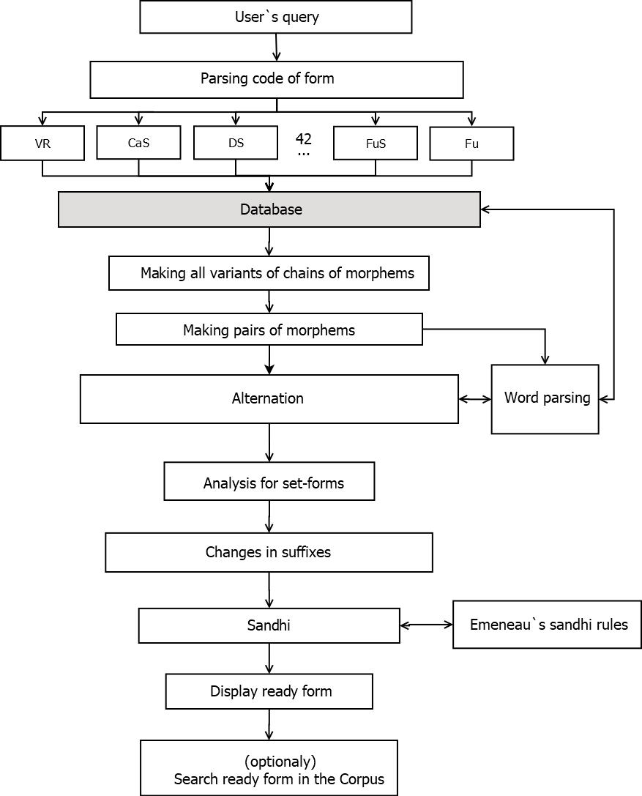

**A NonPaninian Approach to Sanskrit Morphonology**

**Based on the Works of Andrei Zalizniak**

```rst-table
+------------------------------------------------------+----------------------------------------------+
| **Ivan Tolchelnikov**                                | > **Andrei Shirobokov**                      |
|                                                      | >                                            |
| > Lomonosov Moscow State University / Russia, Moscow | > Sanskrit Zealots\' Society/ Russia, Moscow |
| >                                                    | >                                            |
| > Sanskrit Zealots\' Society/ Russia, Moscow         | > anshirm@gmail.com                          |
| >                                                    |                                              |
| > vanishtax@gmail.com                                |                                              |
+======================================================+==============================================+
```

**Abstract**

> This article presents the non-Paninian approach to Sanskrit morphonology designed by A. Zalizniak and developed by our team. The core ideas dicussed are: (1) the division of phonological processes into three groups: pure alternation, verbal-root sandhi and general sandhi rules; (2) the description of the alternation process in pairs of morphemes A and B in terms of morphological positions and alternation types; (3) the description of phonological processes in terms of alternation series (13 sets of basic, guṇa, and vṛddhi grades). Our current goal is to create a database of all Sanskrit morphemes with these characteristics defined and a tree showing all their possible combinations. Our current project is to develop using this approach a Sanskrit morphological generator much similar to Huet\'s[^1], but more comprehensive, accurate, and understandable.

**Introducing Ourselves**

We are the team of the Sanskrit Zealots\' Society[^2]. Our approach is based on the article by one of the most prominent Soviet and Russian linguists, Andrei Zalizniak, titled "Morphonological Classification of Verbal Roots of the Ancient Indian Language" ("Морфологическая классификация древнеиндийских глагольных корней") [^3]. Zalizniak used W.D. Whitney "The Roots, Verb-Forms and Primary Derivatives of the Sanskrit Language" as a data source (and so primarily do we adding to it Oliver Helwig\'s corpus[^4]).

**Why it might be helpful for Sanskrit computational linguistics**

1\. It is much simpler than the Paninian approach. It only has three core concepts (alternation series, alternation type, and morphological position) describing alternation and a few additional concepts, such as connecting vowel -i- or seṭ-quality, to describe morpheme connections. Also our model strictly divides alternation, reduplication, special verbal root sandhi rules, general sandhi rules etc. therefore these domains could be developped and adjusted separately. Thus, it could be useful for creating Sanskrit morphological generators or simple models for verifying more complex models, such as Paninian.

2\. It is prepared to minimize the number of exceptions by slightly complicating the grammatical rules with these three core concepts.

**Phonological Processes**

The first step in our Zalizniak-based approach involves categorizing all phonological processes in Sanskrit into three groups.

1\. The first group consists of the most abstract processes --- pure alternation. There are 13 special phonemes[^5] that have 3 grades: basic, guṇa, and vṛddhi. Such as /u/ in the root √yuj with basic /u/, guṇa /o/, and vṛddhi /au/. Or such as /u/ in the suffix -nu- with basic grade in 'āpnute\' and guṇa-grade in 'āpnoti\'. While Indian grammarians reconstructed /ṝ/, we also use 4 more reconstructed from PIE phonemes: /n̥/ and /n̥̄/ (as in √man and √jan) and /m̥/ and /m̥̄/ (as in √gam and √śam). Pure alternation does not depend on surroundings of the alternating morpheme.

2\. The second group of processes that Zalizniak referred to as phoneme-surroundings dependent changes are phonological changes that occur exclusively in the alternating phonemes of the verbal roots. So, they may be referred to as verbal root sandhi.

3\. The third group of processes is the general sandhi rules that may be applied to any combination of sounds (for example, every nasal before a sibilant becomes an anusvara, regardless of whether it is the nasal of the root or of the suffix). These processes are out of focus of our project[^6] because they have already been thoroughly described and algorithmized in many previous works, such as Emeneau\'s manual[^7].

+:==================:+:===============:+:===============:+:===============:+
| A1                 | **ø**s          | **a**s          | **ā**s          |
```rst-table
+--------------------+-----------------+-----------------+-----------------+
| A2                 | sth**ø̄**        | sth**ā**        | sth**ā**        |
+--------------------+-----------------+-----------------+-----------------+
| I1                 | j**i**          | j**e**          | j**ai**         |
+--------------------+-----------------+-----------------+-----------------+
| I2                 | n**ī**          | n**e**          | n**ai**         |
+--------------------+-----------------+-----------------+-----------------+
| U1                 | st**u**         | st**o**         | st**au**        |
+--------------------+-----------------+-----------------+-----------------+
| U2                 | bh**ū**         | bh**o**         | bh**au**        |
+--------------------+-----------------+-----------------+-----------------+
| R1                 | k**ṛ**          | k**ar**         | k**ār**         |
+--------------------+-----------------+-----------------+-----------------+
| R2                 | p**ṝ**          | p**ar**         | p**ār**         |
+--------------------+-----------------+-----------------+-----------------+
| L                  | k**ḷ**p         | k**al**p        | k**āl**p        |
+--------------------+-----------------+-----------------+-----------------+
| M1                 | g**m̥**          | g**am**         | g**ām**         |
+--------------------+-----------------+-----------------+-----------------+
| M2                 | ś**m̥̄**          | ś**am**         | ś**ām**         |
+--------------------+-----------------+-----------------+-----------------+
| N1                 | m**n̥**          | m**an**         | m**ān**         |
+--------------------+-----------------+-----------------+-----------------+
| N2                 | j**n̥̄**          | j**an**         | j**ān**         |
+--------------------+-----------------+-----------------+-----------------+
```

Table 1. Alternation Series\
(with the examples of verbal roots; alternating elements are in bold)

The pure alternation accounts for 13 series of alternation, which represent 13 sets of basic, guṇa, and vṛddhi grades of some phoneme. The phoneme in a morpheme that undergoes alternation according to these series is called the alternating element (E).

The series A1, for example, has zero sound as basic grade (as in the third person plural present of √as --- "øsanti"), /a/ as guṇa-grade (as in the third person singular present of √as --- "asti"), and /ā/ as vṛddhi-grade (as in the third person singular perfect 'āsa\'). The series A2 differs in guṇa --- it has /ā/ both as guṇa and as vṛddhi. We mark all zero sounds and differentiate the A1 zero sound that alternates to guṇa as /a/ from A2 zero sound that alternates in guṇa as /ā/. This brings to existence an oxymoron symbol of long zero sound (as in √sthø̄), but it is useful for differentiating between basic grades of A1 and A2.

All other series 1 differ from series 2 only in the length of basic grade (as √ji of I1 and √nī of I2). The only series which does not have its pair is series L, because there is no such morpheme in Sanskrit that has /ḹ/ as basic grade.

On Table 1 there are the reconstructed phonemes for basic grades such as /ṝ/ in √pṝ "to fill", /m̥/ in √gam "to go", /m̥̄/ in √śam "to quiet", /n̥/ in √man "to think", and /n̥̄/ in √jan "to born". We use these reconstructed phonemes in cases where the basic grade of a series does not have one clear form because of the second group of phonological processes (verbal root sandhi). For example, √ji "to win" has such clear form basically as "ji" but √man does not; instead it has "ma", "man", and "mn".

+:==:+:=============:+:=============:+:=============:+:=============:+:=============:+:=============:+:=============:+:=============:+:=============:+:=============:+:=============:+:=======:+:======:+:=======:+:======:+
| A1 | ø                                                                                                             | ø                                                             | a                | ā                |
```rst-table
+----+---------------+---------------+---------------------------------------------------------------+---------------+-------------------------------+-------------------------------+------------------+------------------+
| A2 | i / ī         | ø̄             | ī                                                             | ø̄             | ø̄                             | īø̄ ⇒ yø̄                       | ā                | ā                |
|    |               |               |                                                               |               |                               |                               |                  |                  |
|    |               |               |                                                               |               |                               | uø̄ ⇒ uvø̄                      |                  |                  |
+----+---------------+---------------+---------------------------------------------------------------+---------------+-------------------------------+-------------------------------+---------+--------+---------+--------+
| I1 | i                             | ī                                                                             | iy                            | y                             | e       | ay     | ai      | āy     |
```
+----+-------------------------------+-------------------------------------------------------------------------------+                               |                               |         |        |         |        |
| I2 | ī                                                                                                             |                               |                               |         |        |         |        |
+----+-------------------------------+-------------------------------------------------------------------------------+                                                               |         |        |         |        |
| U2 | ū                                                                                                             |                                                               |         |        |         |        |
+----+-------------------------------+-------------------------------+-----------------------------------------------+                               |                               |                  |                  |
| R2 | īr \| ūr                                                                                                      |                               |                               |                  |                  |
```rst-table
+----+-------------------------------+-------------------------------------------------------------------------------+-------------------------------+-------------------------------+------------------+------------------+
| L  | ḷ                             |                                                                                                                                               | al               | āl               |
+----+-------------------------------+---------------+-------------------------------+-------------------------------+---------------+-------------------------------+---------------+------------------+------------------+
|    | СEC\                                          | СЕy, СEn                      | СЕv, СЕm                      | #EV           | VCEV, CСЕV, #CЕV              | VCЕV, #CEV    |                                     |
|    | (C ≠ y, v, m, n)                              |                               |                               |               |                               |               |                                     |
+----+-----------------------------------------------+-------------------------------+-------------------------------+---------------+-------------------------------+---------------+------------------+------------------+
| M1 | a                                             | am                            | an                            | ām & am       | am                            | m             | am               | ām               |
```
+----+-----------------------------------------------+-------------------------------+-------------------------------+               |                               |               |                  |                  |
| M2 | ām                                                                                                            |               |                               |               |                  |                  |
+----+-----------------------------------------------+---------------------------------------------------------------+               |                               |               |                  |                  |
| N2 | ā                                                                                                             |               |                               |               |                  |                  |

Table 2. Laws of the phoneme-surroundings dependent changes or verbal root sandhi

Table 2 is the complete description of all laws of the phoneme-surroundings dependent changes or verbal root sandhi with usage of C as consonant, V as vowel and E as an alternating element of the verbal root. Zalizniak also added \# symbol to mark the beginning of the verbal root. We added the symbol E for the alternating element. The only necessary requirement is that E belongs to the verbal root, the other phonemes designated as C or V may belong to the root, suffix, infix or ending.

For example of this process: √man belongs to the N1 series, so it alternates as n̥ --- an --- ān. In the guṇa and vṛddhi grades it does not undergo any special changes, only general sandhi rules are possible in some word-forms. But in the basic grade the root √man has reconstructed /n̥/, that does not occur in any Sanskrit word, so in all cases of basic grade √man this /n̥/ will undergo some transformation.

\(1\) √mn̥ + -ta- = mn̥ta- = mata-

In the case (1) alternating element appears in between two consonants and the second consonant is not /y/, /v/, /m/ or /n/, so according to the Table 2 in transforms to /a/ and the result is the past passive participle "mata". The same process will occur in the series M1, for example in past participle of √gam --- "gata".

\(2\) √mn̥ + -ya- + -te = mn̥yate = manyate

In the case (2) alternating element is followed by /y/ so it transforms to /an/ --- "manyate" similar to its guṇa-grade. Same thing happens in M1 series in "gamyate".

\(3\) √mn̥ + -u- + -te = mn̥ute = manute

In the case (3) alternating element is followed by a vowel and preceded by single consonant and the #-sign. Here we also have /an/ in "manute".

\(4\) √mamn̥ + -e = mamn̥e = mamne

In the case (4) alternating element preceded by reduplication syllable that gives another vowel before the root, so alternating element transforms to consonant /n/ in "mamne". Back to the case (3): if there were no #-sign the transformation to /n/ (as in the case (4)) would be necessary in the imperfect, where additional /a/ (augment) would give a vowel before the root, so in the case of prefixes. Thus, it could lead to generation of junk-forms suc as "amnot" instead of right form "amanot" or "anumnute" instead of "anumanute".

**Morphological Positions and Alternation Types**

It remains to define the circumstances in which morphemes took basic, guṇa or vṛddhi grade. We will introduce the core concepts of the Zalizniak-based approach to alternation by means of an example of one simple grammar rule.

In W.D. Whitney\'s grammar, it is stated that in the simple future, or sya-future, the root "undergoes guṇa-strengthening". From W.D. Whitney\'s "The Roots, Verb-Forms and Primary Derivatives of the Sanskrit Language", we could extract approximately 820 independent verbal roots, with 110 of them having no guṇa-grade. This number includes roots that have only basic grade, for example √pūj "to worship" or √īś "to rule", and roots that have only vṛddhi grade, such as √dhau "to run" or √kāṅkṣ "to desire". So, there are 110 exceptions. $\frac\{820 - 110\}\{820\}\  \times 100\% \approx 87\%.$ The efficiency of this simple rule is only 87%, which causes significant issues in generative morphology.

Zalizniak defines[^8] morphological structure as the combination of two morphemes: a preceding morpheme A and a following morpheme B. In this structure, he introduces the concept of morphological position. In our approach, it is defined as the expectation of a certain grade --- basic, guṇa or vṛddhi --- for every morpheme A with a certain morpheme B.

For example of B let\'s take the ending -t of the third plural Parasmaipada in three forms of the imperfect:

\(5\) a + √øs + -t = aast → ās

A is the root √as "to be" of second class stem which directly attaches endings. The ending -t is B, and without sandhi, the final form is "aast" with guṇa /a/ of the series A1.

\(6\) a + √kṛ + -nu- + -t = akṛnot → akṛṇot

A is the suffix -nu- of the fifth class stem √kṛnu-, and B is ending -t. The final form is "akṛnot" with guṇa /o/ of the series U1.

\(7\) a + √yu\^j + -nø- + -t = ayunajt → ayunak

A is the infix -nø- of the seventh present class, and B is the ending -t. In this case, the infix takes guṇa /a/ of the series A1.

So, we can establish a rule that the ending -t expects guṇa-grade from every immediately preceding morpheme, whether it is a root, suffix or infix. But it only expects guṇa from A and does not make A guṇa because not every morpheme has guṇa-grade.

For example of such B\'s let\'s consider two optative forms with the same ending -t:

\(8\) √kṛ + -nu- + -yā- + -t = kṛnuyāt = kṛuyāt

In case (8), the suffix -yā- is A and /ā/ is already the vṛddhi-grade of A2. It does not take guṇa-grade not only with the ending -t but never and the basic grade as well. Therefore, this suffix is fixed in vṛddhi. The ending -t expects guṇa and this expectation matches reality sometimes (as it has shown in cases 5-7) but not always. Morphological position is merely an expectation because designated grade doesn\'t appear in every case.

\(9\) √bhū + -a- + -ī- + -t = bhavaīt = bhavet

In case (9), there is the optative suffix -ī- as A and it is fixed in basic grade because it never becomes guṇa or vṛddhi.

So our task is not only to derive rules of expectations, the rules for morphemes B, but also to derive rules of matching these expectations, the rules for morphemes A.

Returning to the definition of morphological position as the expectation of a certain grade in every A with a certain B, we need to specify it in three expectations according to three grades present in Sanskrit.

The first morphological position (MP) is the expectation of basic grade in every A as seen with suffixes such as 1MP-ta- of the past passive participle, 1MP-ya- of the fourth present class stem, and 1MP-u- of the eighth present class stem.

The second morphological position is the expectation of guṇa-grade in every A as seen with suffixes 2MP-sya- of the future stem, 2MP-tavya- of the future passive participle, and 2MP-tṛ- of the nomen agentis.

The third morphological position is the expectation of vṛddhi-grade in every A as seen with suffixes 3MP-siṣ- and 3MP-s- of the sixth and the fourth aorist stem in Parasmaipada.

Looking back to the matching of the expected grade with the actual grade of morpheme A, it should be acknowledged that it is not a random process and some patterns might be discerned. Zalizniak defines alternation types as alternation patterns of A in three different morphological positions. In the simple terms, which grade A takes in case of which expectation. There are 4 alternation types:

+:================:+:===============================:+:=================================:+:================================:+
| I                | basic                           | guṇa                              | vṛddhi                           |
|                  +---------------------------------+-----------------------------------+----------------------------------+
|                  | √kṛ + -ta- = kṛta-\             | √kṛ + -sya- = kariṣya-\           | √kṛ + -s- = kārṣ-\               |
|                  | (ppp)                           | (fut)                             | (aor 4)                          |
```rst-table
+------------------+---------------------------------+-----------------------------------+----------------------------------+
| II               | guṇa                            | guṇa                              | vṛddhi                           |
|                  +---------------------------------+-----------------------------------+----------------------------------+
|                  | √tsar + -ta- = tsarita- (ppp)   | √tsar + -sya- = tsariṣya-\        | √tsar + -s- = tsārṣ-\            |
|                  |                                 | (fut)                             | (aor 4)                          |
+------------------+---------------------------------+-----------------------------------+----------------------------------+
| III              | basic                           | basic                             | basic                            |
|                  +---------------------------------+-----------------------------------+----------------------------------+
|                  | √jṛṃbh + -ta- = jṛṃbhita- (ppp) | √jṛṃbh + -sya- = jṛṃbhiṣya- (fut) | √jṛṃbh + -is- = jṛṃbhiṣ- (aor 5) |
+------------------+---------------------------------+-----------------------------------+----------------------------------+
| IV               | vṛddhi                          | vṛddhi                            | vṛddhi                           |
|                  +---------------------------------+-----------------------------------+----------------------------------+
|                  | √dhau + -ta- = dhauta- (ppp)    | √dhau + -sya- = dhāviṣya- (fut)   | √dhau + -is- = dhāviṣ-           |
|                  |                                 |                                   |                                  |
|                  |                                 |                                   | (aor 5)                          |
+------------------+---------------------------------+-----------------------------------+----------------------------------+
```

Table 3. Alternation types (with the examples of verbal roots)

The first type meets all expectations. What is expected by B is taken by A as in cases of root √kṛ in past passive participle when suffix -ta- expects basic grade and √kṛ remains in basic; in future stem when suffix -sya- expects guṇa-grade and √kṛ becomes "kar"; and in fourth aorist stem when suffix -s- expects vṛddhi-grade and √kṛ becomes "kār". The morphemes of the first type have all three grades, therefore they can be used as a criterion to figure out what expectation morpheme B has. The first type is the most numerous among all Sanskrit morphemes.

The second type meets the expectations of guṇa and vṛddhi but it does not meet the expectation of basic grade. In this case, it also gives guṇa as in the past passive participle of √tsar "to sneak" when it does not become "tsṛta" (as R1) or "tsīrta" (as R2), but remains in guṇa as 'tsarita\'. In other words, morphemes of the second type do not have a basic grade. The second type is approximately one and a half times less numerous than the first type.

The third type is the fixed basic grade. For example, √jṛmbh "to gape" never occurs in guṇa as "jarmbh" or vṛddhi as "jārmbh". The the third type is approximately five times less numerous than those of the first type.

Fourth type is the fixed vṛddhi-grade. For example, √dhau 'to run\'. There are nearly twenty morphemes of the fourth type in Sanskrit.

Now we should return to the rules of grammar. When Whitney states that the verbal root takes the guṇa-grade with the future suffix -sya-, it provides us with 110 exceptions and an 87% efficiency in this simple case. But if we reformulate this rule as "the future stem suffix -sya- expects guṇa from every immediately preceding morpheme A" its efficiency tends to 100% if we are aware of the alternation types of all 820 verbal roots. This approach complicates the rules: one task to make morpheme A guṇa-grade is replaced by two tasks: (1) to expect guṇa from A and (2) to match this expectation with grades that morpheme A has. So, the number of exceptions has significantly decreased.

Algorithm for connecting a certain A with a certain B:

1\. Placing A in proper grade according to morphological position and alternation type;

2\. Placing connecting vowel -i-/-ī- (if necessary);

3\. Changing alternation series (if required by B);

4\. If A = verbal root / causative suffix; then reduplication of the verbal root (if required by B);

5\. If A = verbal root, applying special verbal root sandhi;

6\. Applying general rules of sandhi. For vowel chains sandhi rules are applied from right to left (for example, ai+i+u+u+a+a ⇒ ai+i+u+u+ā ⇒ ai+ i+uvā ⇒ ai+yuvā ⇒ aiyuvā), for consonants --- from left to right as usual.

Example I.

A = √tn̥ "to stretch"; B = 1MP-se (second singular Ātmanepada);

1\. √tn̥ + 1MP-se = tn̥se \[basic grade is expected bu -se; √tn̥ is of the first alternation type, so it remains in the basic grade as /n̥/\]

2\. tn̥ise

3\. tn̥ise & tenise \[transformation /n̥→en/ is possible here\]

4\. tatn̥ise & tenise \[transformed form does not undergo reduplication\]

5\. tatnise & tenise \[/n̥/ preceded by a reduplicated syllable and followed by a vowel transforms into the consonant /n/; case VCEV in the Table 2\]

6\. tatniṣe & teniṣe \[/s→ṣ/\]

Result: tatniṣe & teniṣe "you were born".

Example II.

A = √jñā "to know"; B = 3MP-pay- (causative);

1\. √jñā + 3MP-pay- = jñāpay- \[√jñā of A2 series and the second alternation type becomes vṛddhi when vṛddhi is expected bu -pay-\];

2\. -

3\. -

4\. -

5\. -

6\. -

A = -pay-; B = 2MP-s- (desiderative);

1\. jñāpay- + 2MP-s- = jñāpays- \[-s- expects guṇa; -pay- is already a guṇa\];

2\. jñāpayis-;

3\. -

4\. jijñāpayis- \[desiderative suffix requires specific reduplication in the verbal root\];

5\. -

6\. jijñāpayiṣ- \[/s→ṣ/\]

A = -s-; B = 1MP-ta- (past passive participle);

1\. jijñāpayiṣ- + 1MP-ta- = jijñāpayiṣta- \[-s- does not have alternating element\]

2\. jijñāpayiṣita-;

3\. -

4\. -

5\. -

6\. -

A = -ta-; B = 1MP-i (locative singular)

1\. jijñāpayiṣita- + 1MP-i = jijñāpayiṣtai \[-ta- is of the second alternation type and when the basic grade is expected it remains in guṇa\]

2\. -

3\. -

4\. -

5\. -

6\. jijñāpayiṣite \[/a/ + /i/ → /e/\]

Result: jijñāpayiṣte "in that which is desired to be known".

**Goals and achievements**

This approach is designed to deal primarily with the alternations and secondarily with the special verbal root sandhi. To explain Sanskrit alternation, it is necessary to determine the alternation type for all morphemes that could potentially be an A, in other words, those that could possibly be followed by another morpheme. This includes verbal roots, noun roots (such as pitṛ "father" or go "cow"), suffixes, infixes, and prefixes in some rare cases like "vairāgya-" from "vi-raj-" with vṛddhi on the prefix vi-. The next step is to determine morphological position, that is expectation placed by every single morpheme B. To achieve that we need to examine grade all possible morphemes A take before morpheme B (accounting for effects of general and verbal root sandhi).These goals primarily require a database of all Sanskrit morphemes with their morphological characteristics, such as alternation series, alternation type, morphological position or grade expectation, seṭ-aniṭ-veṭ quality, and present and aorist stem classes. The verbal root has all of them, and the database of nearly 820 verb roots with these characteristics has already been created[^9]. The noun roots have all of these characteristics except for the present and aorist classes, as this data has not been gathered yet. Infixes and suffixes share similar characteristics. Data about characteristics of infixes and suffixes (we lump them into single category because they\'re functionally similar) is also being gathered as time of publication.

These goals also require the algorithmization of verb root reduplication in all forms in which it occurs, including perfect, third present class, desiderative, intensive, and third aorist class. This work is completely finished[^10].

Third, these goals require formulating the rules for insertion of connecting vowel -i- (so called seṭ-quality). By solving this problem, we added 5 more subdivisions of veṭ. Pure veṭ is free to insert -i- in every applicable case, while other veṭ\'s have this freedom partly limited. Then this seṭ-quality is defined for every verbal root and verbal suffix. It remains to formulate rules for the verbal endings and for nominal derivation.

Fourth, our goals require creating a tree of all possible morpheme combinations and presently it is done for verbal derivation only[^11] and just started for the nominal derivation. After completing it we also could describe denominative verbs.

Our nearest goal is to develop a computer Sanskrit morphological generator that is more accurate and comprehensible than existing ones, and complete as much as possible (we strive to include even extraordinary forms such as the causative desiderative past passive participle, for example "jijñāpayiṣita" from "Naiṣkarmyasiddhi" (I.97) of Sureśvara, the disciple of Śaṅkarācharya, which is not covered by Huet\'s generator[^12]).

**Computer Code**

The computer code is written in PHP in the functional programming style. The main operating principle of the program is the representation of a word form as a chain of morphemes. Each such morpheme has its own unified properties, and further transformation of this chain into the final version according to the rules formulated in our Zalizniak-based approach.

The code consists of several dozen functions. Some of the functions describe lexemes, all the rules and exceptions that are required to build the correct chain of word forms. The other part of the functions is utility --- they are involved in parsing words, applying sandhi, alternating and other necessary operations.

There is also a verification block[^13] which allows one to compare the word forms that the algorithm generates with reference forms from various corpora, as well as a function that searches for the resulting form in the Sanskrit corpus and, if successful, provides a link and a block with the translation of this word.



Figure 1. Program Architecture

*User\`s query* contains:

1\. Person (1, 2, 3);

2\. Number (1, 2, 3);

3\. Voice (Parasmaipada, Ātmanepada, Ubhayapada);

4\. Code of form (for example \"VR-CaS-DS-FuS-Fu\" equals deriving from prefixed or unprefixed verbal root (VR) the causative stem (CaS), then the desiderative stem (DS), then future stem (FuS), and then adding endings for the simple future (Fu); if VR = √kṛ, such 3 sg. Par. of it would be "cikārayiṣiṣyati").

*Parsing code of form*: We analyze each part of the form code and make a request with user data in special functions of morphemes. Each such function contains unique rules and exceptions for required morpheme.

*Database* contains list of verbal roots, suffixies, endings and their properties. Special functions above askes from database one or some suffixies or endings.

*Making chains of morphems*: Each morpheme above can have many variants of suffixes and endings (from 1 to 6 options). Some of them also have augmented variants. Thus, we need to combine all of them into several chains of morphemes (from 1 to 21 options).

*Making pairs of morphems*: Next step is alternating all variants of chains. At this step function make pairs of morphems from the chains. Each of morphemes B will expect some grade from A.

*Alternation*: Making alternations according to the rules formulated in our Zalizniak-based approach.

*Analysis for seṭ-quality*: Adding i for set-forms if necessary.

*Changes in suffixes*: Some suffixes are dropped (such as causative -ay- with following passive -y-, for evample: kāray- + -y- + -a- + -te = kāryate), some suffixes change their form (such as Ātmanepada participle suffix -āna- with preceding /a/ becomes -māna-; for example, √nī + -a- + -āna- = nayamāna-)

*Sandhi*: Change form for inner sandhi rules. For vowel chains sandhi rules are applied from right to left, for consonants --- from left to right as usual.

**References**

Andrei Zalizniak. 1975. Morphonological classification of verbal roots of the ancient indian language (Морфологическая классификация древнеиндийский глагольных корней). Ed. 2018 in A. Zalizniak. 1978. Sanskrit Grammar Overview (Грамматический очерк санскрита), Nestor-Istoriya, Moscow.

William D. Whitney. 1885. Ed. 2000, The Roots, Verb-Forms and Primary Derivatives of the Sanskrit Language. Motilal Banarsidass, Delhi.

William D. Whitney. 1896. Sanskrit Grammar. Ed. 1950, Harvard University Press, Cambrodge, Massachusetts.

[^1]: https://sanskrit.inria.fr/DICO/grammar.en.html

[^2]: The project team consists of Ivan Tolchelnikov, Andrei Shirobokov, Marcis Gasuns, Viktor Kochergin, Marsel Ishimbaev, Alexandr Myltsev, Anatoliy Artemenko, Elena Trefilova, Vadim Sanzharov, Vladimir Leonchenko.

[^3]: Unfortunately, it has not been translated from Russian yet. The subject of the article is the Sanskrit verbal roots, our work extends Zalizniak\'s approach to all possible pairs of Sanskrit morphemes. Differences between Zalizniak\'s work and ours will be explained in the footnotes.

[^4]: http://www.sanskrit-linguistics.org/dcs/index.php?contents=abfrage

[^5]: Zalizniak has 18 of them because he added saṃprasāraṇa series: i --- ya --- yā, u --- va --- vā, ṛ --- ra --- rā, u --- vā --- vā, ī --- yā --- yā. They could be reduced to series A1: ø --- a --- ā; or to the series A2: ø̄ --- ā --- ā by applying general sandhi rules after the alternation.

[^6]: Zalizniak inserts general sandhi of vowels into the second group of phonological processes but for the preciseness of the model we put them back into the third group.

[^7]: To coordinate Emeneau's algorithm and our approach the following rules must be added: n̥C &gt; aC (for the suffixes -n̥t-, -mn̥t-, -vn̥t-, -n̥-); ø̄C &gt; īC (for the suffix of ninth present class -nø̄-).

[^8]: Zalizniak defines morphological structure as pair of verbal root and some verbal affix. So morphological position is the expectation of some grade in verbal root in certan morphological structure.

[^9]: http://sanskrit.anshir.ru/

[^10]: Same link. The work of these algorithms might be seen in pages for every verbal root.

[^11]: This tree describes approximately 160 morpheme combinations and requires another long report about it

[^12]: https://sanskrit.inria.fr/cgi-bin/SKT/sktconjug.cgi?lex=MW&q=j%7Enaa&t=VH&c=9&font=roma (accessed 25.01.2024)

[^13]: http://sanskrit.anshir.ru/compare/
