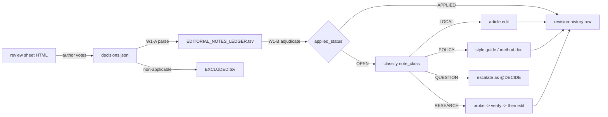

# Architecture — the Sangram editorial-note pipeline

_Created: 18-07-2026 · Last updated: 18-07-2026_

How a note written in the margin of a review sheet becomes a tracked, addressable worklist item and
then an article revision — without losing the link back to the sheet it came from. Cover doc:
[`docs/PLAN_SANGRAM_EDITORIAL_NOTES_AND_CHARTER_2026H2.md`](https://github.com/gasyoun/SanskritGrammar/blob/main/docs/PLAN_SANGRAM_EDITORIAL_NOTES_AND_CHARTER_2026H2.md).

## 1. The pipeline



## 2. Prior art — build the gap, not the pipeline

A `decisions.json` ingestion path already exists and is **not** re-implemented here:

| Existing asset | Role | Reused how |
|---|---|---|
| [`/review-sheet`](https://github.com/gasyoun/claude-config/blob/main/commands/review-sheet.md) | Generates the sheet + emits `decisions.json` | Unchanged. It is the upstream producer |
| [`/decisions-apply`](https://github.com/gasyoun/claude-config/blob/main/commands/decisions-apply.md) | Ingests a `decisions.json`, validates votes, applies approved items, parks deferred, logs rejected | **This is the executor.** The ledger is its input manifest |
| [`Uprava/REVIEW_SHEETS_INDEX.md`](https://github.com/gasyoun/Uprava/blob/main/REVIEW_SHEETS_INDEX.md) | Org-wide sheet registry | Each of the 13 sheets gets/keeps a row |

What is genuinely missing — and all this architecture adds — is the **ledger**: a durable, tracked,
per-note record with an applied/open status. `/decisions-apply` handles one sheet at a time and
assumes the sheet is fresh; it has no concept of "this note was voted three days ago and half of it
already shipped". The 81-row ledger is that missing state.

## 3. Addressing: `note_uid`

```
note_uid = <sheet_id>#<item_id>        e.g.  sanskritgrammar-sg-mo-021-future_visa#MO021-03
```

This is the single stable handle. It is chosen over sheet-file paths or line offsets because:

| Property | Why it matters here |
|---|---|
| Survives sheet-HTML loss | 4 of 13 sheets have already lost their HTML |
| Survives article restructuring | Notes outlive the section numbering they commented on |
| Greppable | An applied note cites its uid in the revision row, so "is this done?" is one `grep` |

### 3.1 Provenance recovery for orphaned sheets

`item_id` resolvability is not uniform, and the pipeline must not pretend it is:

| Sheet | ID form | Resolvable? | Route |
|---|---|---|---|
| `sg-mo-001-declension-overview`, `w2-core`, `metodichka-*`, `precative`, `sg-mo-021`, `sg-mo-028`, `taddhita*` | positional or domain | **Yes** — sheet HTML survives | Read the item text from the HTML |
| `a65-verdict-validation` | `HB-*` / `HK-*` | **Yes** — external registry | Resolve against `claims.json` (403 + 260 claims) |
| `prose-style-guide`, `sg-mo-017-perfect` | positional `A1`/`B1` | **No** | Recover by matching note text against article prose; flag `provenance=RECONSTRUCTED` |
| `sg-mo-002-a-stems` | positional | Moot | All 3 notes already applied |

**8 open notes** sit in the unresolvable row. They are still actionable — the notes quote the text
they criticise — but the ledger must mark them `RECONSTRUCTED` so a future reader knows the referent
was inferred, not read off the sheet.

## 4. `note_class` — the taxonomy that makes the backlog executable

The single most consequential design finding: **a large fraction of the 81 notes are not edits.**
Treating them uniformly as "apply this" produces either fabrication or churn. Four classes:

| Class | Definition | Executable by an agent? | Example (verbatim) |
|---|---|---|---|
| `LOCAL` | A bounded edit to one article: terminology, hedging, an added example | **Yes** | `[MO028-08]` «vṛддхi — это помесь на 3 языках» → fix spelling everywhere |
| `POLICY` | A standing rule that must not be applied per-article | Yes, but writes to the style guide | `[HK-4b]` «Всегда верить Витни, сверить все утверждения всех грамматик с Витни» |
| `RESEARCH` | Requires a corpus number that does not exist yet | Only via probe → verify | `[MO26]` «-ya/-tya на 97,8 % — так сколько -ya и сколько -tya?» |
| `QUESTION` | A question to the author with no in-repo answer | **No** — escalate | `metodichka-apte-v1#zan-09` «А как Шерцль?» · `sangram-prose-style-guide-visa#A8` «Сам корпус слова „перфект“ не знает — верно ли?» |

> **Always qualify a positional id with its sheet.** `A8` looks like it belongs to the `perfect` sheet
> because it talks about the perfect — it does not. `perfect`'s ids stop at `A7`/`B1`; `A8` exists only in
> `sangram-prose-style-guide-visa_16.07.26`. Positional ids are reused across sheets, which is the whole
> reason `note_uid` is `<sheet_id>#<item_id>` (§3). A bare `[A8]` in prose is the same defect the ledger
> schema exists to prevent.

> `QUESTION` is the class that makes an autonomous wave honest. An agent that "applies" a question
> invents an answer. The contract is: answer it if the evidence is in-repo, otherwise raise an
> `@DECIDE` and move on.

`RESEARCH` notes are also where the numbers guard binds: a note disputing a published DCS figure
never edits the figure. It opens a probe, the probe is verified adversarially, and only then does
the article change — the same discipline H1229 used to re-derive 129 published numbers.

## 5. Decision record — reversing H856

**Context.** [`.gitignore`](https://github.com/gasyoun/SanskritGrammar/blob/main/.gitignore) line 23
excludes `/review/`, with the rationale "H856: interactive review-sheet artifacts (personal working
artifacts, not repo deliverables)".

**Why H856 was reasonable then.** When sheets were generated, voted, and applied within a single
session, they genuinely were scratch — the durable output was the article revision.

**Why it is wrong now — measured.** The votes became the record of the author's scholarly sign-off,
and they are *not* consumed in-session:

| Evidence | Measurement |
|---|---|
| Adjudicated items at risk | 120 across 13 sheets, all untracked, on one machine |
| Author sign-off represented | Every visa cast since 15-07-2026 |
| Loss already realised | **4 of 13** sheet HTMLs are gone; 8 open notes now have unresolvable referents |
| Cost of tracking | ~250 KB of generated HTML — accepted |
| Failure modes that erase everything | `git clean -xfd`, drive failure, machine change |

**Ruling (18-07-2026).** Track the **whole** `review/` directory — sheets *and* votes. `/review/` is
removed from `.gitignore`. This reverses H856.

**Consequences.** Generated HTML enters version control (accepted, quantified above). Sheets become
citable by blob URL, so a revision row can link the exact sheet that motivated it. Future sessions
can answer "was this note applied?" without local state.

> Recorded as a decision record per ruling 2 — the `.gitignore` edit alone would leave no trace of
> *why* a documented prior ruling was reversed, which is precisely how H856's own rationale would
> have been re-derived from scratch a year from now. W1-A ships this as
> `docs/DECISION_RECORD_REVIEW_TRACKING_H856_REVERSAL.md`.

## 6. Provenance contract on the write side

Every applied note leaves a revision-history row in its target file:

```
| 18-07-2026 | <what changed> (<item_id>) | Лист `<sheet_id>`; <handoff> |
```

This is not a new convention — it is the pattern
[`future/index.mdx`](https://github.com/gasyoun/SanskritGrammar/blob/main/sangram/articles/future/index.mdx)
and [`causative/index.mdx`](https://github.com/gasyoun/SanskritGrammar/blob/main/sangram/articles/causative/index.mdx)
already use, and it is the *only* reason this session could tell applied notes from open ones. The
articles that recorded a visa **without** citing item ids (`perfect`, `a-stems`) are exactly the ones
whose status had to be reconstructed by hand. Generalising this row is the cheapest defect-prevention
in the whole pipeline.

## 7. Failure modes designed against

| Failure | Guard |
|---|---|
| Re-applying an already-applied note (H919 duplicate-build class) | W1-B adjudication gates all application work |
| Applying a rejection rationale as if it were an instruction | `EXCLUDED.tsv` is a separate artifact; 6 items live there |
| Fabricating an answer to a `QUESTION` note | Class-based routing; escalate, never guess |
| Silently changing a published corpus number | Numbers guard: probe → verify → then edit |
| Losing the note ↔ article link | `note_uid` cited in every revision row |
| Sheet HTML lost again | `review/` tracked (§5); `note_uid` independent of the HTML |

_Dr. Mārcis Gasūns_
