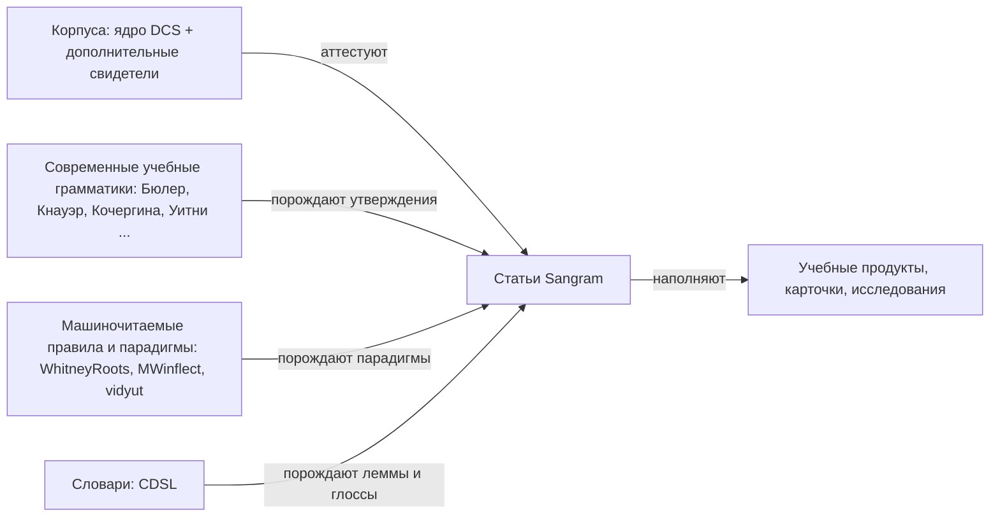
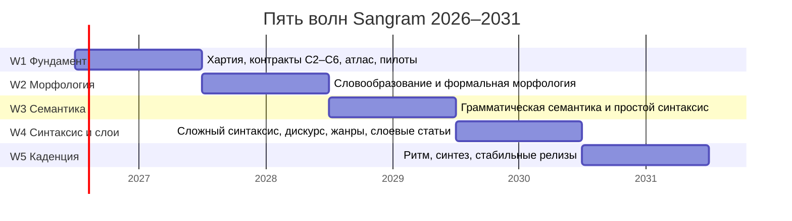
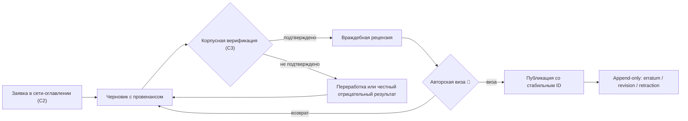

# Хартия корпусной грамматики «Sangram», 2026–2031

_Создано: 11-07-2026 · Последнее обновление: 11-07-2026_

## 1. Что учреждается

**Sangram** (рабочее имя, стяжение *Sanskrit Grammar*) — публичная **корпусная
грамматика санскрита**: сеть грамматических статей, каждое утверждение которых
опирается на проверяемые корпусные свидетельства с устойчивыми адресами
(locus), а не на пересказ предшественников. Жанровый образец — корпусная
грамматика русского языка [RusGram](https://rusgram.ru/)
([описание проекта в НИУ ВШЭ](https://ling.hse.ru/Projects_RusLang_RusGram)):
современное учебно-описательное изложение, где за каждым правилом стоит
корпусная проверка.

Дом проекта — каталог
[`sangram/`](https://github.com/gasyoun/SanskritGrammar/tree/main/sangram)
репозитория [SanskritGrammar](https://github.com/gasyoun/SanskritGrammar);
публикация — на действующем Docusaurus-сайте
[gasyoun.github.io/SanskritGrammar](https://gasyoun.github.io/SanskritGrammar/),
рядом с оцифрованными первоисточниками (Апте, Бюлер, Гасунс, Кнауэр,
Кочергина, Толчельников, Уитни, Зализняк), которые служат ему свидетелями.

Sangram — главный акцент грамматической ветви всей исследовательской
программы: из трех ветвей грамматического слоя (традиционные трактаты ·
современные учебные грамматики · машиночитаемые правила и парадигмы) именно
современная учебная описательная грамматика признана приоритетом решением
автора 11-07-2026. Исследовательский трек репозитория
([дорожная карта 2026–2027](https://github.com/gasyoun/SanskritGrammar/blob/main/ROADMAP_GRAMMAR_CORPUS_ACL_2026_2027.md),
[исследовательская повестка](https://github.com/gasyoun/SanskritGrammar/blob/main/docs/SANSKRITGRAMMAR_RESEARCH_AGENDA.md))
питает Sangram методами и данными; первый измеренный результат уже существует —
[коэффициенты Кендалла τ по порядку уроков трех учебников](https://github.com/gasyoun/SanskritGrammar/blob/main/S1_TEXTBOOK_SEQUENCING_TAU_RESULT.md).

### Место Sangram среди источников

Диаграмма использует закрытый набор типизированных отношений онтологии
источников (пополняет · порождает · аттестует · связывается · наполняет):

## 2. Решения, на которых стоит хартия

Зафиксированы автором 11-07-2026; хартия их оформляет, а не пересматривает.
Повторное обсуждение любого из них требует явного решения автора, а не новой
сессии рассуждений.

1. **Русский — язык по умолчанию; английская локаль — по выбору читателя.**
2. **IAST — запись по умолчанию; деванагари — пользовательская настройка.**
3. **Классический санскрит — ядро; ведийский, эпический и поздний санскрит —
   явно маркированные дополнительные слои.**
4. **DCS — основной воспроизводимый корпус.** VedaWeb, GRETIL,
   SamudraManthanam, Wisdomlib и новые возможности DharmaMitra — дополнительные
   свидетели, каждый только через отдельные ворота качества, прав и живости.
5. **Пятилетний успех — устойчивый редакционный конвейер и представительное
   ядро статей, продолжающее расширяться, а не фиктивная «полнота».**

## 3. Языковая и графическая политика

- **Русский по умолчанию.** Весь контур авторинга, рецензирования и публикации
  сначала строится и стабилизируется на русском языке.
- **Английская локаль** подключается как перевод устоявшихся статей, когда
  русский конвейер продержался стабильным не менее двух кварталов подряд
  (см. волну W2). Английская локаль никогда не опережает русскую.
- **IAST по умолчанию, деванагари по настройке.** Обе записи порождаются из
  одного канонического представления одним каноническим преобразователем
  (`sanskrit-util`); двух рукописных копий одного примера не существует.
- Техническую схему (структура статьи, локали, скрипты, устойчивые ID
  примеров) фиксирует отдельный контракт C4 (см. § 11); хартия задает
  политику, контракт — реализацию.

## 4. Охват: ядро и маркированные слои

Предмет Sangram — **грамматика классического санскрита**, описанная по
корпусным свидетельствам. Ведийский, эпический и поздний санскрит присутствуют
только как **явно маркированные боковые слои**: статья ядра может нести
слоевые примечания («в ведийском иначе: …»), а отдельные слоевые статьи
появляются не раньше волны W3 и всегда несут явную пометку слоя.

Корпусная основа:

- **DCS** — основной воспроизводимый корпус; потребляется через канонический
  ingest [VisualDCS](https://github.com/gasyoun/VisualDCS), не пересоздается.
- Дополнительные свидетели ([VedaWeb](https://vedaweb.uni-koeln.de/),
  [GRETIL](https://gretil.sub.uni-goettingen.de/gretil.html), SamudraManthanam,
  [Wisdomlib](https://www.wisdomlib.org/), DharmaMitra) — каждый подключается
  только через отдельные ворота **прав, живости и качества**.
- Метод корпусной проверки (запрос → выборка → валидация → утверждение →
  примеры) фиксирует контракт C3 (см. § 11).

## 5. Критерий успеха

К 30-06-2031 Sangram успешен, если выполнены **оба** условия:

1. **Устойчивый редакционный конвейер.** Статьи проходят полный цикл
   (черновик → корпусная верификация → враждебная рецензия → авторская виза →
   публикация → append-only исправления) в предсказуемом ритме, и конвейер
   переживает перерывы во внимании любого участника, включая автора.
2. **Представительное ядро.** Каждый крупный грамматический домен
   (фонология/графика · словообразование · формальная морфология ·
   грамматическая семантика · синтаксис · дискурс · вариативность) имеет
   опубликованные статьи ядра образцового качества, и сеть продолжает
   расширяться.

**Запрещенный критерий — «полнота».** Ни один отчет, релиз или анонс не
вправе заявлять полное покрытие грамматики. Мера прогресса —
представительность доменов и качество конвейера, не процент «закрытых» тем.

## 6. Пять годовых волн

Волны соответствуют пятилетней рамке серии MEGABOOK × Sangram; каждая волна
заканчивается **годовым checkpoint'ом** (июль), который сверяет метрики § 8,
пересматривает целевые диапазоны и открывает следующую волну. Целевые числа
ниже — управленческие ориентиры на дату хартии, пересматриваемые на
checkpoint'ах; ворота (§ 8) непересматриваемы без решения автора.

### W1 · 2026–2027 · Фундамент

- **Вход:** онтология источников принята (выполнено 11-07-2026).
- **Результаты:** эта хартия; полная сеть-оглавление статей со стабильными ID
  (C2); метод корпусных свидетельств (C3); редакционная схема статьи с
  локалями и скриптами (C4); тематические программы морфологии (C5) и
  семантики/синтаксиса (C6); публичный атлас-фундамент (волна B серии);
  **3–5 пилотных статей**, проведенных через полный цикл конвейера.
- **Годовая цель:** конвейер доказан на пилотах; ≥1 версионированный релиз.

### W2 · 2027–2028 · Морфология

- **Вход:** контракты C2–C6 приняты; ≥3 пилотных статьи опубликованы полным
  циклом.
- **Результаты:** представительное ядро **словообразования и формальной
  морфологии** по программе C5: каждый макрокластер программы получает не
  менее одной статьи ядра; квоты по кластерам задает C5.
- **Годовая цель:** 15–25 статей ядра суммарно; решение о старте английской
  локали (ворота: стабильный русский конвейер ≥2 квартала).

### W3 · 2028–2029 · Грамматическая семантика и простой синтаксис

- **Вход:** checkpoint W2 пройден.
- **Результаты:** представительное ядро **грамматической семантики и простого
  синтаксиса** по программе C6; первые явно маркированные слоевые статьи
  (ведийский/эпический контраст) как пилоты слоевой политики § 4.
- **Годовая цель:** 30–50 статей ядра суммарно.

### W4 · 2029–2030 · Сложный синтаксис, дискурс и слои

- **Вход:** checkpoint W3 пройден.
- **Результаты:** сложный синтаксис, конструкции, информационная структура,
  дискурс, регистр/жанр; систематическая слоевая маркировка (ведийский,
  эпический, поздний) в опубликованных статьях.
- **Годовая цель:** 50–80 статей ядра суммарно.

### W5 · 2030–2031 · Каденция и синтез

- **Вход:** checkpoint W4 пройден.
- **Результаты:** установившийся редакционный ритм (целевой ориентир — 1–2
  статьи в месяц при пакетных окнах визирования); кросс-статейные синтезные
  обзоры; стабильные цитируемые релизы (версия + DOI при явном решении
  автора).
- **Годовая цель:** конвейер и ядро соответствуют критерию успеха § 5;
  хартия следующего пятилетия готовится на материале пяти checkpoint'ов.

## 7. Управление

### Роли

- **Главный редактор — автор (M. Gasūns).** Научная виза каждой публикуемой
  статьи; решения о правах, слоях, запуске локали, DOI; пакетные окна
  адъюдикации.
- **Агентные сессии** — черновики, корпусная верификация, враждебная
  рецензия, сборка и проверка сайта. Каждая сессия работает по явному
  заданию-handoff и оставляет провенанс: модельный тир и точная версия.
- **Внешние соавторы** — по приглашению автора, в рамках тех же ворот
  конвейера; внешний вклад не обходит визу.

### Редакционный конвейер

### Правила изменений

- **Стабильные ID статей — append-only** (реестр задает C2): ID не
  переиспользуются и не перенумеровываются.
- **Опубликованное не переписывается молча.** Любая правка опубликованной
  статьи — записанное исправление одного из трех ярусов (erratum · revision ·
  retraction) по образцу
  [модели исправлений ACL Anthology](https://aclanthology.org/info/corrections/),
  уже принятой дорожной картой репозитория; оригинал остается доступным.
- **Решенное не переспрашивается.** Развилки, требующие человека, фиксируются
  и закрываются записями решений; закрытое решение цитируется, а не
  открывается заново.
- **Стабильное отделено от летучего.** Хартия и статьи несут только
  устойчивое содержание; текущие статусы, очереди и заявки живут во внутренних
  реестрах проекта и в публичном атласе, а не в теле статей.
- **Ежегодный checkpoint (июль)** сверяет метрики, риски и целевые диапазоны;
  каждый пересмотр хартии — строка в таблице ревизий § 12 с датой и
  основанием.

## 8. Метрики

**Ворота** — обязательные условия публикации; действуют всегда, не
пересматриваются checkpoint'ом (только явным решением автора).

| # | Ворота |
|---|---|
| G1 | 100% публикуемых статей корпусно аттестованы по методу C3; каждый корпусный запрос воспроизводим |
| G2 | 100% примеров несут устойчивый locus, перевод и запись по политике § 3 |
| G3 | Публикация только после враждебной рецензии и авторской визы |
| G4 | Сборка сайта зеленая; ноль битых внутренних ссылок в `sangram/` |
| G5 | Правки опубликованного — только append-only (erratum / revision / retraction) |
| G6 | Каждая статья несет провенанс: человеческое авторство и/или модельный тир с точной версией |
| G7 | Дополнительный корпусный свидетель подключается только через ворота прав, живости и качества (C3) |

**Целевые показатели** — измеряются на каждом годовом checkpoint'е;
диапазоны пересматриваемы:

| Показатель | W1 | W2 | W3 | W4 | W5 |
|---|---|---|---|---|---|
| Статей ядра суммарно (опубликовано) | 3–5 пилотов | 15–25 | 30–50 | 50–80 | ядро § 5 |
| Домены с ≥1 статьей ядра | ≥1 | + морфология | + семантика, простой синтаксис | + синтаксис, дискурс, слои | все семь |
| Версионированных релизов за волну | ≥1 | ≥1 | ≥1 | ≥1 | ≥2 |
| Медиана черновик→публикация | измерить базу | ≤ базы | стабильна | стабильна | ≤ 8 недель |
| Очередь на визе (конец волны) | измерить базу | не растет год к году | не растет | не растет | пакетные окна закрывают за месяц |

## 9. Риски

| # | Риск | Смягчение |
|---|---|---|
| R1 | **Узкое горлышко авторской визы** — единственные человеческие ворота конвейера; известный главный ограничитель всей системы | Пакетные окна адъюдикации; очередь на визе — явная метрика § 8; конвейер продолжает готовить статьи «до визы», не блокируясь |
| R2 | **Реаллокация внимания**: Sangram живет рядом с продуктовыми и приоритетными исследовательскими обязательствами | Волны рассчитаны на прерывистый темп; представительность вместо полноты; checkpoint пересматривает диапазоны, а не отменяет ворота |
| R3 | **Права дополнительных свидетелей** (GRETIL, Wisdomlib и др.) | Ворота прав C3 до любого включения текста; при сомнении — только ссылка на источник, без републикации |
| R4 | **Зависимость от одного корпуса (DCS)** | Версионируемые снапшоты через канонический ingest; ворота живости для свидетелей; отрицательный результат проверки публикуем честно |
| R5 | **Разреженность корпуса** для редких явлений | Доверительные интервалы вместо точечных чисел; правило «нет CI — нет количественного утверждения» |
| R6 | **Двойная стоимость RU/EN** | Английская локаль стартует только по воротам W2; перевод только устоявшихся статей |
| R7 | **Расползание охвата** (соблазн «дописать все») | Non-goals § 10; слоевые статьи не раньше W3; пилоты с явными kill-gate |
| R8 | **Хрупкость сборки** (MDX/таблицы/скрипты) | Только зеленая сборка считается доказательством; ворота G4; гигиена конвертации уже кодифицирована в репозитории |

## 10. Non-goals — чего Sangram не делает

1. **Не заявляет полноту** — ни «полного описания грамматики», ни процента
   «закрытых тем» (§ 5).
2. **Не заменяет Панини и не соперничает с референс-грамматиками**: Уитни,
   Бюлер и другие остаются свидетелями и источниками, Sangram — корпусная
   надстройка над ними, а не их пересказ.
3. **Не пересоздает готовые активы**: ingest DCS (VisualDCS), корневые
   инвентари ([WhitneyRoots](https://github.com/gasyoun/WhitneyRoots),
   [`mw_roots.tsv`](https://github.com/sanskrit-lexicon/csl-orig/blob/main/v02/mw/mw_roots.tsv)),
   парадигмы ([MWinflect](https://github.com/sanskrit-lexicon/MWinflect),
   [csl-inflect](https://github.com/sanskrit-lexicon/csl-inflect)),
   транслитерацию (`sanskrit-util`), кроссуоки — потребляются, не строятся
   заново.
4. **Не словарь и не поисковый портал**: словарная точка сборки —
   [kosha](https://github.com/gasyoun/kosha); Sangram ссылается, не дублирует.
5. **Не учебный курс и не LMS**: учебные продукты наследуют содержание
   Sangram со ссылкой на источник, но живут в своих контурах.
6. **Не публикует машинный текст без визы**: ни одна статья не выходит без
   враждебной рецензии и авторской визы (G3), независимо от того, кто писал
   черновик.
7. **Не републикует чужие полные тексты** без прав: корпусные свидетельства
   цитируются в объеме примера с locus, права проверяются воротами C3.
8. **Не хостит летучие статусы**: очереди, заявки и текущие проценты живут во
   внутренних реестрах и атласе, не в статьях и не в этой хартии.

## 11. Контракты серии и делегирование

Хартия — слот C1 серии MEGABOOK × Sangram. Детализацию она сознательно
делегирует соседним контрактам той же серии; до их принятия действуют только
политики этой хартии.

| Слот | Контракт | Что фиксирует |
|---|---|---|
| C2 | Сеть-оглавление статей | Полный append-only реестр статей: домены, стабильные ID, пререквизиты, корпусные запросы, свидетели |
| C3 | Метод корпусных свидетельств | Реестр корпусов и ворота прав/живости/качества; цикл запрос → выборка → валидация → утверждение → примеры |
| C4 | Редакционная схема | MDX-схема статьи: локали RU/EN, IAST/деванагари, научный и педагогический слои, устойчивые ID примеров, валидатор |
| C5 | Программа морфологии | Кластеры словообразования и формальной морфологии, квоты, свидетели, пилоты волны W2 |
| C6 | Программа семантики и синтаксиса | Кластеры семантики, синтаксиса, дискурса, слоевую политику в статьях, пилоты волн W3–W4 |
| B1–B6 | Публичный атлас | Санитизированный data-слой и пять интерактивных представлений (внимание · переиспользование · цепочка ценности · зависимости · провенанс) |

## 12. Провенанс и ревизии

Хартия исполнена по слоту C1 внутренней серии
[MEGABOOK × Sangram](https://github.com/gasyoun/Uprava/blob/main/MEGABOOK_SANGRAM_VISUALIZATION_PLAN_2026_2031.md)
(handoff [H625](https://github.com/gasyoun/Uprava/blob/main/handoffs/archive/H625-Fable_SanskritGrammar_sangram-five-year-charter_11.07.26.md);
обе ссылки — внутренний архив Uprava). Решения § 2 приняты автором
11-07-2026. Черновик и сборка — Fable 5 (`claude-fable-5`); научная
ответственность — автор.

| Дата | Ревизия | Основание |
|---|---|---|
| 11-07-2026 | Хартия учреждена (v1) | Слот C1, решения автора 11-07-2026 |

_Dr. Mārcis Gasūns_
