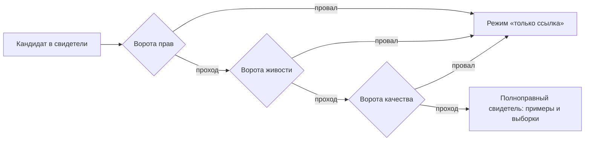
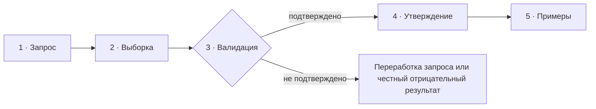

# Метод корпусных свидетельств Sangram (контракт C3)

_Создано: 12-07-2026 · Последнее обновление: 15-07-2026_

## 1. Что фиксирует этот контракт

Контракт C3 серии
[MEGABOOK × Sangram](https://github.com/gasyoun/Uprava/blob/main/MEGABOOK_SANGRAM_VISUALIZATION_PLAN_2026_2031.md)
(внутренний архив Uprava) исполняет делегирование § 11
[хартии Sangram](https://gasyoun.github.io/SanskritGrammar/grammars/sangram/charter-2026-2031):
он задает **реестр корпусов** — какой корпус является основным, какие
источники допускаются как дополнительные свидетели и через какие ворота, — и
**цикл корпусной проверки** каждого грамматического утверждения:
запрос → выборка → валидация → утверждение → примеры.

Ворота хартии, которые этот контракт делает исполнимыми: G1 (100 %
публикуемых утверждений корпусно аттестованы, каждый запрос воспроизводим),
G2 (каждый пример несет устойчивый locus), G7 (дополнительный свидетель
подключается только через ворота прав, живости и качества). Контракт несет
только **устойчивую методологию**; текущие статусы источников (что сегодня
лежит, что отвечает) живут во внутренних реестрах проекта, а не здесь.

## 2. Реестр корпусов

### 2.1. Основной корпус — DCS

**[Digital Corpus of Sanskrit](http://www.sanskrit-linguistics.org/dcs/)
(О. Хельвиг) — единственный основной, воспроизводимый корпус Sangram**
(решение автора 11-07-2026, § 2 хартии). Основания:

- **Права ясны:** дистрибуция DCS в формате CoNLL-U распространяется под
  **CC BY 4.0** — совместимо с публичной грамматикой.
- **Воспроизводимость:** корпус потребляется не с живого сайта, а из
  **пинованного снапшота** — зеркала
  [gasyoun/dcs-conllu](https://github.com/gasyoun/dcs-conllu) (на дату
  контракта пин `04e0778`: 270 текстов · 5 688 416 токенов · 754 726
  предложений · 74 текста с синтаксическими деревьями), собранного в
  запрашиваемый SQLite-мастер документированным конвейером
  [VisualDCS](https://github.com/gasyoun/VisualDCS). Sangram **не строит
  собственный ingest** — он потребляет канонический (non-goal § 10.3 хартии).
  Перезапись истории зеркала (обнаружена 15-07-2026, пилот P1) уничтожила
  сам коммит-объект пина; привязка восстановлена по решению автора тегом
  [`c3-pin-04e0778-content`](https://github.com/gasyoun/dcs-conllu/tree/c3-pin-04e0778-content)
  на живой коммит с точно сверенным деревом корпуса (270 текстов ·
  5 688 416 токенов · 754 726 предложений); дублирующая привязка —
  provenance-таблица SQLite-мастера + его SHA-256. Урок для будущих пинов:
  пин снапшота закрепляется **тегом в зеркале** (и копией в provenance
  производного артефакта), а не голым хешем в прозе.
- **Аннотация:** лемматизация и морфологическая разметка Universal
  Dependencies на каждом токене; для части текстов — синтаксические деревья.

Каждое количественное утверждение статьи привязывается к **версии снапшота**
(коммит зеркала или версия SQLite-релиза), а не к «DCS вообще»: живой сайт
DCS пополняется, и число, снятое с сайта, невоспроизводимо через год.

### 2.2. Дополнительные свидетели

Дополнительный свидетель **никогда не заменяет DCS** — он добавляет то, чего
в DCS нет (ведийский акцент, полнота редких текстов, русские переводы,
современная нейроморфология). Каждый подключается **только через три ворот
§ 3**; до прохождения ворот источник можно цитировать лишь ссылкой, без
воспроизведения текста.

| Свидетель | Что дает сверх DCS | Права | Известные ограничения доступа | Типовая роль в статье |
|---|---|---|---|---|
| [VedaWeb](https://vedaweb.uni-koeln.de/) (Кельн) | Ригведа с **ведийским акцентом** и морфологией Цюрихского университета; REST API с воспроизводимой формой запроса | CC BY 4.0 (аннотированная Ригведа) | Хост живет «окнами»: периоды недоступности и анти-бот-блокировки задокументированы; каждая сессия проверяет живость перед запросом | Слоевые примечания «в ведийском …»; всё, где нужен акцент (напр., различение презентных классов, неразличимых в безакцентном DCS) |
| [GRETIL](https://gretil.sub.uni-goettingen.de/gretil.html) (Геттинген) | Машиночитаемые e-тексты, отсутствующие в DCS; сверка чтений | **Неоднородны по текстам** — у каждого e-текста свой правовой заголовок; ворота прав проходятся **на каждый текст отдельно** | Без морфологической разметки; качество оцифровки различается от текста к тексту | Свидетель существования формы/чтения; источник дополнительного примера с locus по печатному изданию |
| [SamudraManthanam](https://github.com/gasyoun/SamudraManthanam) | Параллельный санскритско-русский корпус с FTS5-поиском (точный, regex, морфологическое расширение) | Код Apache 2.0; санскрит — public domain, но **русские переводы под правами переводчиков/издательств**: цитирование в объеме примера со ссылкой на печатное издание, без републикации | Морфологическое расширение — эвристика по основам, не полная разметка | Русский перевод примера (политика § 3 хартии: русский — язык по умолчанию); locus по печатному изданию |
| [Wisdomlib](https://www.wisdomlib.org/) | Широта покрытия текстов и переводов, удобные постатейные адреса | Права на тексты сайтом не унифицированы; воспроизведение текста не допускается — **только ссылка** | Массовый доступ закрыт анти-бот-защитой; годится для точечной ручной сверки, не для выборок | Внешняя ссылка «см. также»; ручная сверка перевода; никогда — источник выборки |
| [DharmaMitra](https://dharmamitra.org/) (Беркли) | Нейросетевая морфология/сегментация и перевод; перспективный API | Модели и выдача — по условиям проекта; выдача модели **не является корпусным свидетельством** | API в развитии; версии моделей меняются без уведомления | Инструмент подготовки (предразметка, кандидаты примеров) — с обязательной ручной верификацией; в статье помечается как инструмент, не как корпус |

Право добавить нового свидетеля в этот реестр (или расширить роль
существующего) дает только явное решение автора; заявка оформляется как
прохождение трех ворот § 3 с записанными ответами.

## 3. Ворота подключения свидетеля

Свидетель допускается к использованию в статьях только после того, как для
него **записаны ответы** на все три блока. Ответы кладутся рядом с реестром
(§ 2.2) и пересматриваются при каждом инциденте.

1. **Права.** Под какой лицензией текст и разметка? Допустимо ли цитирование
   в объеме примера? Допустима ли публикация производных чисел (частот)?
   Для неоднородных коллекций (GRETIL) — ответ на каждый текст. При любом
   сомнении действует режим «только ссылка» (риск R3 хартии).
2. **Живость.** Есть ли пинуемый снапшот (идеал — как у DCS)? Если источник
   живой (API/сайт): записана ли воспроизводимая форма запроса, проверяется
   ли доступность перед сессией, есть ли зеркало на случай исчезновения?
   Число, снятое с живого API, обязано нести дату снятия.
3. **Качество.** Какова природа разметки (ручная, полуавтоматическая,
   нейросетевая)? Известны ли систематические дефекты? Дефект не
   дисквалифицирует свидетеля — он **записывается в § 6** и учитывается
   правилами § 5.

## 4. Цикл корпусной проверки

Каждое проверяемое утверждение статьи проходит пять шагов. Цикл соответствует
узлу «Корпусная верификация (C3)» редакционного конвейера хартии (§ 7).

### 4.1. Запрос

- Запрос формулируется к **пинованному снапшоту** (для DCS — SQL к
  SQLite-мастеру VisualDCS или выборка по CoNLL-U зеркала) и записывается
  **дословно** вместе с версией снапшота. Правило: по записи запроса другая
  сессия обязана получить те же числа без переписки с автором запроса.
- Запросы к живым API (VedaWeb) записываются в полной форме (эндпоинт + тело)
  с датой исполнения.
- Нормализация записи в запросах — только каноническими преобразователями
  (`sanskrit-util`); самодельная Unicode-нормализация запрещена: наивное
  NFD-разложение со срезанием диакритик уничтожает долготу гласных и
  ретрофлексные точки, тихо склеивая разные леммы.

### 4.2. Выборка

- Из результата запроса берется либо **полный перечень** (когда вхождений
  мало), либо **случайная выборка фиксированного размера с записанным
  зерном** (seed) — чтобы выборка была воспроизводима.
- Размер выборки для ручной проверки — не менее 50 вхождений на утверждение
  (или все, если их меньше); для контраста двух явлений — не менее 50 на
  сторону. Отклонение вниз разрешено только с явной оговоркой в статье.
- Записывается **знаменатель**: сколько всего вхождений дал запрос, из чего
  и как отобрано.

### 4.3. Валидация

- Выборка проверяется на **релевантность** (то ли явление поймал запрос) и
  на **известные дефекты разметки** из § 6: если утверждение касается
  категории, задетой дефектом, валидация обязана включать ручную
  переразметку затронутой части выборки.
- Валидация фиксирует долю ложных срабатываний запроса. Если она превышает
  10 %, запрос дорабатывается и цикл повторяется — утверждение не строится
  поверх грязной выборки.
- Отрицательный исход — не провал, а результат: «корпус не подтверждает
  формулировку X» публикуемо (риск R4 хартии) и оформляется тем же циклом.

### 4.4. Утверждение

- Количественное утверждение несет **число, знаменатель и доверительный
  интервал**. Правило хартии (R5): **нет доверительного интервала — нет
  количественного утверждения**; для редких явлений вместо точечных чисел —
  интервальные формулировки или честное «данных недостаточно».
- Утверждение обязано быть **фальсифицируемо той же процедурой**: из
  формулировки ясно, какой запрос и какая выборка его опровергли бы.
- Провенанс утверждения — версия снапшота + записанный запрос + дата;
  этого достаточно для ворот G1.

### 4.5. Примеры

- Каждый пример несет **устойчивый locus** (текст, книга/глава/стих по
  принятой для этого текста схеме адресации), **перевод** (русский — по
  умолчанию; из SamudraManthanam — со ссылкой на печатное издание перевода)
  и **запись по политике § 3 хартии** (IAST по умолчанию, деванагари — из
  того же канонического представления).
- Пример из дополнительного свидетеля допустим только при пройденных
  воротах § 3; объем цитирования — пример с locus, не пассаж (non-goal
  § 10.7 хартии).
- Примеры отбираются из валидированной выборки, а не подыскиваются задним
  числом под готовую формулировку.

## 5. Правила количественных утверждений

Сводные правила, применяемые на шагах 4.2–4.4:

| # | Правило |
|---|---|
| П1 | Число без знаменателя и версии снапшота не публикуется |
| П2 | Нет доверительного интервала — нет количественного утверждения (R5) |
| П3 | Случайная выборка — только с записанным зерном; «первые N результатов» выборкой не считаются |
| П4 | Доля ложных срабатываний запроса выше 10 % блокирует утверждение до доработки запроса |
| П5 | Утверждение о категории, задетой известным дефектом разметки (§ 6), требует ручной переразметки затронутой части выборки |
| П6 | Числа с живых API несут дату снятия; сравнивать их между датами без оговорки запрещено |
| П7 | Отрицательный результат оформляется тем же циклом и публикуем наравне с положительным |
| П8 | **Знаменатель-универсум и межстатейная соизмеримость.** Число несёт не только знаменатель (П1), но и **явно названный универсум** — предикат, порождающий этот знаменатель. Для утверждения о «падежном распределении» по всему корпусу канонический универсум — **реальные вибхакти** (восемь падежей, `feat_case IN (…)`, 3 173 636), НЕ `feat_case`-универсум с псевдопадежом `Cpd` (4 014 688) и НЕ ограниченный по части речи. Если подстатья считает ту же категорию над иным универсумом (напр. только `NOUN`), она **обязана** назвать свой универсум И дать перекрёстную ссылку на статью-сестру, считающую ту же категорию иначе, — иначе доли (напр. Nom 44,7 % от 3 173 636 против 38,7 % от 1 790 270) читаются как сопоставимые, хотя таковыми не являются. Машинно проверяется: `sangram/audit/universe_commensurability.py` (вердикт на каждую межстатейную пару, ноль неклассифицированных) + `scripts/check_denominator_commensurability.py` (семейство знаменателей в CI). |

## 6. Известные дефекты и подводные камни источников

Записанные систематические дефекты — вход для правила П5. Список
append-only: дефект, однажды подтвержденный, не удаляется, а помечается
исправленным с указанием версии, где исправлен.

| # | Источник | Дефект | Следствие для метода |
|---|---|---|---|
| Д1 | DCS (UD-разметка) | Значение `Tense=Past` склеивает исторические претериты (аорист/перфект/имперфект в части текстов размечены неразличимо) | Утверждения о распределении прошедших времен — только после ручной переразметки выборки (П5) |
| Д2 | DCS (безакцентный текст) | Презентные классы I и VI, а также IV и пассив на -ya- в части форм **неразличимы без акцента** | Такие контрасты проверяются через акцентного свидетеля (VedaWeb, для ведийского слоя) либо честно помечаются неразрешимыми на классическом материале |
| Д3 | Любой источник в IAST | Наивная Unicode-нормализация (NFD + срезание комбинирующих знаков) уничтожает долготу и ретрофлексию, склеивая разные леммы | Только канонические преобразователи `sanskrit-util` на всех шагах цикла (§ 4.1) |
| Д4 | DCS (живой сайт) | Сайт корпуса исторически страдает дефектом HTTPS-сертификата | Ничего не снимать с живого сайта: только пинованное зеркало/SQLite (§ 2.1) |
| Д5 | VedaWeb (API) | Доступность «окнами»; анти-бот-защита периодически отдает явные блокировки | Проверка живости перед сессией; полученные числа — с датой (П6); свидетель не годится для срочных проверок |
| Д6 | Wisdomlib | Анти-бот-защита закрывает массовый доступ; права на тексты неоднородны | Только ручная точечная сверка и внешние ссылки; выборки не строятся (§ 2.2) |
| Д7 | SamudraManthanam (морфопоиск) | Морфологическое расширение запроса — эвристика по основам, дает ложные срабатывания | Выборки для утверждений строятся по DCS; SamudraManthanam поставляет переводы и параллели, не частоты |
| Д8 | DharmaMitra (модели) | Выдача нейромодели не воспроизводима между версиями модели | Выдача — черновой инструмент; в цикл § 4 входит только после ручной верификации, корпусным свидетельством не считается |

## 7. Провенанс и ревизии

Контракт исполнен по слоту C3 внутренней серии
[MEGABOOK × Sangram](https://github.com/gasyoun/Uprava/blob/main/MEGABOOK_SANGRAM_VISUALIZATION_PLAN_2026_2031.md)
(handoff [H632](https://github.com/gasyoun/Uprava/blob/main/handoffs/archive/H632-Fable_SanskritGrammar_sangram-corpus-evidence-method_11.07.26.md);
обе ссылки — внутренний архив Uprava). Решения о ролях корпусов приняты
автором 11-07-2026 (§ 2 хартии); черновик и сборка — Fable 5
(`claude-fable-5`); научная ответственность — автор.

| Дата | Ревизия | Основание |
|---|---|---|
| 12-07-2026 | Контракт учрежден (v1) | Слот C3, делегирование § 11 хартии |
| 15-07-2026 | § 2.1: пин `04e0778` восстановлен тегом `c3-pin-04e0778-content` после перезаписи истории зеркала (эквивалентность сверена: 270 текстов · 5 688 416 токенов · 754 726 предложений); добавлено правило «пин — тегом, не голым хешем» | Виза MG (review-sheet SG-MO-002, карточка A6); H953; Fable 5 (`claude-fable-5`) |

_Dr. Mārcis Gasūns_
