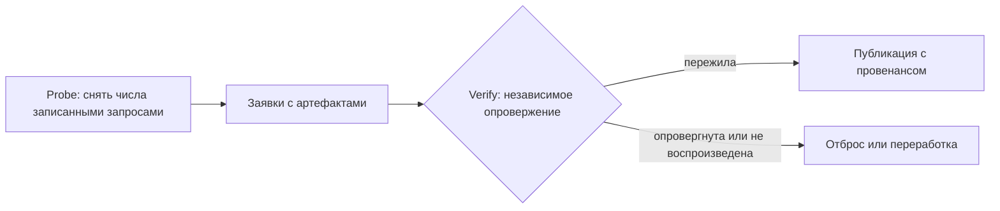

# Метод кодирования грамматических утверждений Sangram

_Создано: 25-07-2026 · Последнее обновление: 25-07-2026_

> **Abstract (EN).** This is the normative methodology manual for encoding and
> corpus-verifying grammatical claims in the Sangram programme. It fixes, as
> reusable rules rather than restated results: the falsifiable-claim criterion
> and register format; the two-axis fact × presentation verdict system
> (TRUE/OVERSTATED/FALSE/UNTESTABLE × JUSTIFIED/MISLEADING/RARE-AS-CENTRAL/
> FREQUENCY-HIDDEN/ORDER-QUESTIONABLE); the four-way divergence typology
> (overgeneralization · real-but-marginal · system-vs-usage · direct
> contradiction); the adversarial probe → verify workflow; the kāraka↔UD-deprel
> proxy rules with their three systematic non-mappings; gold extraction and
> per-lemma agreement measurement; and the reproducibility pitfalls of
> denominator universes, kappa rederivation, and snapshot pinning. The method
> was distilled from a completed verification programme (776 verdicted claims
> over five Russian-language Sanskrit grammars, plus the kāraka–case endgame
> article); this manual carries the durable method only.

## 1. Что фиксирует этот метод

Контракт [C3](https://github.com/gasyoun/SanskritGrammar/blob/main/sangram/SANGRAM_CORPUS_EVIDENCE_METHOD.mdx)
отвечает на вопрос «каким корпусом и каким циклом проверяется утверждение».
Настоящий документ — его методологическая пара: он отвечает на вопрос **«что
считается утверждением, как оно кодируется и какой вердикт получает»**. C3
владеет реестром корпусов и циклом запрос → выборка → валидация → утверждение →
примеры; этот метод владеет единицей кодирования (§ 2), осями вердиктов (§ 3),
классификатором расхождений (§ 4), адверсариальной проверкой (§ 5), правилами
наложения паниниевских карак на UD-слой (§ 6), эталонным слоем (§ 7) и
записанными ямами воспроизводимости (§ 8). На конфликте корпусных вопросов
приоритет у C3; на конфликте вопросов кодирования — у этого документа.

Метод выработан завершенной программой верификации — 776 вердиктованных
утверждений по пяти русскоязычным описаниям санскрита плюс 214 сверенных
морфологических разборов
([синтез](https://github.com/gasyoun/SanskritGrammar/blob/main/REPORT_GRAMMAR_CLAIM_VERIFICATION_SYNTHESIS_2026.md)),
статьей-эндшпилем падежного кластера
([SG-SE-013](https://github.com/gasyoun/SanskritGrammar/blob/main/sangram/articles/karaka-case/index.mdx))
и аудитом соизмеримости знаменателей
([AUDIT](https://github.com/gasyoun/SanskritGrammar/blob/main/docs/AUDIT_SANGRAM_CASE_DENOMINATOR_COMMENSURABILITY_2026.md)).
Здесь эти работы **не пересказываются** — из них извлечены правила,
переносимые на следующие пять грамматик очереди и на статьи A54/A65. Числа
ниже приводятся только как калибровочные примеры правил и несут знаменатель
и источник.

## 2. Единица кодирования: фальсифицируемое утверждение

**Критерий.** Утверждением считается высказывание книги о языке, которое **в
принципе проверяемо против свидетельств** («будущее время образуется от всех
глаголов», «основы на -ī и -ū всегда женского рода»), — в отличие от
определения, упражнения и парадигматической таблицы. Тест на фальсифицируемость
двойной: (а) из формулировки выводима операционализация «фальсифицируемо-как» —
конкретный запрос и выборка, которые могли бы утверждение опровергнуть; (б)
существует источник, уполномоченный его рассудить (§ 3, правило D-B). Не
проходит тест — не кодируется; эталон оформления полного протокола
фальсифицируемости — [RQ4](https://github.com/gasyoun/SanskritGrammar/blob/main/docs/RQ4_EVALUATION_PROTOCOL_2026.md)
(гипотеза H0/H1 + предзаявленный план анализа).

**Формат записи.** Каждое утверждение — запись машиночитаемого реестра
(`claims.yml`) с полями: адрес в тексте книги · русский оригинал дословно ·
операционализация «фальсифицируемо-как» · вердикт оси факта · вердикт оси
подачи · фактическое число с знаменателем · провенанс вердикта (модель, ярус и
точная версия). Реестры собираются в индекс
([CLAIMS_VERIFIED.md](https://github.com/gasyoun/SanskritGrammar/blob/main/CLAIMS_VERIFIED.md))
скриптом `build_claims.py`; выработка реестра книги завершена, только когда
бэклог кандидатов пуст (`candidates: []`) — «сколько успели» выработкой не
считается.

**Три правила единицы:**

- **Отрицательный результат — результат.** «Корпус не подтверждает формулировку
  X» публикуемо тем же циклом, что и подтверждение (правило П7 контракта C3).
- **«Непроверяемо» — спецификация, не пожатие плечами.** Вердикт UNTESTABLE
  обязан называть недостающий инструмент или данные (DCS-2021 не тегирует тип
  образования аориста; процент Кочергиной невоспроизводим без ее базы
  подсчета). Смешивать «корпус не может рассудить» с «корпус опровергает» —
  категориальная ошибка; реестр их разводит статусом.
- **Жанр диктует вилку.** Хрестоматия без грамматических формулировок получает
  адаптированную шкалу — аудит разборов CONFIRMED · QUESTIONABLE · ERROR
  вместо осей § 3 (прецедент — Кнауэр 1908: 214 разборов).

## 3. Двухосевая система вердиктов: факт × подача

Каждое утверждение получает **два независимых вердикта**. Оси разведены
сознательно, потому что расходятся: правило бывает фактически верным и при
этом педагогически вводящим в заблуждение — корректная формула, прячущая, как
часто встречается ее «исключение».

**Ось факта** — верно ли утверждение против корпуса и справочной грамматики:

| Вердикт | Правило назначения |
|---|---|
| TRUE | корпус и справочники подтверждают формулировку как она есть |
| OVERSTATED | ядро верно, но заявленный охват шире свидетельств; требует **конкретного контркласса** (какие формы выпадают и сколько их), не общего сомнения |
| FALSE | требует **жесткого противоречия**: заявленное распределение прямо не совпадает с засвидетельствованным; «скорее не так» на FALSE не тянет |
| UNTESTABLE | проверка невозможна имеющимися инструментами; спецификация недостающего обязательна (§ 2) |

**Ось подачи** — независимо от истинности, оправдана ли подача (порядок,
выпячивание, хеджирование): JUSTIFIED · MISLEADING · RARE-AS-CENTRAL ·
FREQUENCY-HIDDEN · ORDER-QUESTIONABLE. Типовой носитель флага подачи при
верном факте — корректное правило, поданное без частотной оговорки
(FREQUENCY-HIDDEN), и маргиналия, поданная как центр (RARE-AS-CENTRAL).

**Правила суждения** (обязательны для любой модели-адъюдикатора, письменный
регламент — до начала прохода):

1. **Числа не изобретаются.** Вердикт опирается только на детерминированно
   пересчитываемые числа (скрипты над пинованным снапшотом) и на названные
   справочники; число без артефакта-источника — блокер вердикта.
2. **Правило D-B (приоритет источников).** DCS — авторитет **частоты и
   аттестации**; Уитни 1889 — авторитет **системного факта** (по §§);
   Талмуд Толчельникова — авторитет **морфокласса корня**. Несогласие
   источников **флагуется в записи**, а не разрешается молча.
3. **Один факт — одна мера.** Один и тот же языковой факт у разных авторов
   может получать разные вердикты только из-за формулировки (абсолют против
   хеджа) — это ожидаемое поведение системы, а не дефект: кодируется
   формулировка, не «тема».
4. **Валидация слоя суждения — измерением, не доверием** (§ 8: слепой второй
   проход, каппа, человеческая адъюдикация).

## 4. Четырехчастная типология расхождений

Каждая запись с вердиктом OVERSTATED или FALSE дополнительно получает **ровно
один** из четырех классов. Слой классов хранится отдельно от реестра
(прецедент — [divergence_classes.yml](https://github.com/gasyoun/SanskritGrammar/blob/main/TolchelnikovTalmud_2026/papers/GrammarClaimsCorpusDenies_A60/divergence_classes.yml)),
склейка механическая; классификатор применяется как решающее дерево сверху
вниз — берется первый подошедший класс:

1. **Сверхобобщение** — абсолютный квантификатор («всегда», «от всех»,
   «никогда») при существующем, отнюдь не маргинальном классе исключений.
2. **Правило-реально-но-маргинально** — заявка на большинство («большинство»,
   «обычно»), которой корпус не подтверждает: паттерн есть, но он меньшинство
   или обусловлен регистром/периодом, скрытым плоской формулировкой.
3. **Система-против-узуса** — справочная грамматика лицензирует форму, которой
   корпус почти не пользуется: *лицензировано ≠ аттестовано*.
4. **Прямое противоречие** — заявленное распределение (какой алломорф когда
   выступает) не совпадает с корпусным; острее всего — «вариант», оказавшийся
   большинством.

**Два проверяемых следствия** (диагностика качества раскладки, не догма):

- **Класс почти однозначно предсказывает вердикт подачи**: сверхобобщения →
  MISLEADING; частотные расхождения → FREQUENCY-HIDDEN. Исключения возможны,
  но каждое обязано быть названо поименно (в калибровочной программе на 776
  утверждений исключение одно: HK-5, класс 2 при подаче JUSTIFIED). Массовое
  расхождение класса и подачи — признак дрейфа классификатора, повод
  переадъюдицировать.
- **Класс 3 ведет себя жанрово**: в учебнике для начинающих он ожидаемо пуст,
  заполняют его систематические описания. Заполнение класса 3 учебником —
  сигнал перепроверить раскладку.

## 5. Воркфлоу probe → verify

Числа, несущие вес в публикуемом утверждении, добываются и проверяются
**разными агентами с разными ролями** — порождение и опровержение не
совмещаются в одной сессии:

1. **Probe.** Агент снимает числа **записанными дословно** запросами к
   пинованному снапшоту (C3 § 4.1) и оформляет каждую заявку с артефактом
   (скрипт + JSON в репозитории).
2. **Verify.** Независимые агенты — не авторы заявок — пытаются каждую
   **опровергнуть**: воспроизводят числа с нуля по записанным запросам,
   проверяют определения выборки и знаменатель. Вердикт по умолчанию при
   неопределенности — **опровергнуто**: доказывает автор заявки, а не скептик
   ее хоронит.
3. **Порог публикации.** Заявка входит в статью, только пережив опровержение
   с числами, воспроизведенными до токена. Калибровочный прецедент —
   SG-SE-013: два probe-агента, четыре адверсариальных verify-агента, все
   четыре ключевые заявки пережили опровержение.
4. **Рекурсия на себя.** Методологический документ (включая настоящий)
   проходит тот же цикл: перед слиянием отдельный проход пытается опровергнуть
   его собственные несущие утверждения.

## 6. Прокси kāraka ↔ deprel: правила наложения

У DCS **нет разметки карак**. Паниниевская роль накладывается на слой
зависимостей Universal Dependencies; это наложение — **научное утверждение,
не нативный тег**, и каждое его употребление обязано так себя и называть.
Принятое отображение (калибровка и числа —
[SG-SE-013 § 3–4](https://github.com/gasyoun/SanskritGrammar/blob/main/sangram/articles/karaka-case/index.mdx)):

| Kāraka (роль, Пāṇini 1.4.23–55) | Прокси `deprel` (UD) |
|---|---|
| kartṛ — агенс (актив) | `nsubj`, `csubj` |
| kartṛ — агенс (пассив) | `obl:agent` |
| karman — пациенс | `obj` |
| karaṇa — орудие | `obl:instr` |
| sampradāna — адресат | `iobj` |
| sampradāna — цель | `obl:goal` |
| sampradāna — бенефициант | `obl:benef` |
| apādāna — исходник | `obl:source` |
| adhikaraṇa — место | `obl:loc` |

**Правила употребления прокси:**

- **Покрытие называется всегда.** `deprel` покрывает 223 751 из 5 688 416
  токенов снапшота (3,93 %); любая раскладка роль↔падеж видит менее 4 %
  корпуса и обязана это заявить рядом с числами, не в сноске.
- **Слепота прокси именуется.** Отображение кроет шесть паниниевских карак;
  роли эталона вне UD-слоя (hetu, tādarthya, авторская корзина anya — § 7)
  прокси **не измеримы в принципе**, и их отсутствие в кросс-таблице — предел
  инструмента, не факт о языке.
- **Малые несовпадения не перетолковываются.** Точечные off-diagonal
  (например, kartṛ в локативе) — краевые случаи разметки DCS; даются как
  есть, без надстройки объяснений.

**Три системных не-отображения** — не шум, а устойчивые свойства пары
модель×разметка; каждое наследуется любым будущим замером по этой таблице:

1. **Агенс пассива уходит в инструменталис.** Роль kartṛ инвариантна, падеж —
   нет: в активе Nom (97,8 % на `nsubj`), в пассиве `obl:agent` → Ins
   (61,8 %). Зеркально инструменталис несет две караки (орудие и агенс) —
   отображение роль↔падеж не взаимно-однозначно в обе стороны. Любой замер,
   складывающий `nsubj` и `obl:agent` в один «агенс» без оговорки залога,
   несоизмерим с этой таблицей.
2. **Единая sampradāna дробится натрое.** Один паниниевский «адресат»
   распадается в UD на три отношения с разными доминирующими падежами:
   `iobj` → Dat (66,4 %), `obl:goal` → Acc (64,0 %), `obl:benef` → Dat/Gen
   почти поровну (47,0/42,9 %). Замер «sampradāna вообще» без разбивки по
   трем отношениям запрещен — он усредняет три разных падежных профиля.
3. **Предел nsubj:pass = 0.** Пациенс пассива в номинативе нативно **не
   отделим на стороне подлежащего**: подтипа `:pass` нет ни у одного
   отношения, активный агенс и пассивный пациенс делят один `nsubj`. Пассив
   массово виден на глаголе (`feat_voice=Pass` = 36 701), подлежащее пассива —
   лишь косвенным предикатным маршрутом (`nsubj` при Pass-глаголе = 607, из
   них Nom 563 = 92,8 %). Правило: такой разрыв публикуется **диапазоном**
   (видимая доля → потолок), никогда точечным числом.

## 7. Эталонный слой: извлечение золота и пословное согласие

Прокси-слою противопоставляется **нативный эталон карак** — модель
kāraka-ожидания из докторской Уши Санки (**опубликована в 2014 году**; ее
отбор и анализ используются **с научной атрибуцией** — это
обязательная формулировка прав для любой новой поверхности; обзор трове —
[USHA_SANKA_KARAKA_TROVE_REUSE_SURVEY_2026.md](https://github.com/gasyoun/SanskritGrammar/blob/main/Concordance/USHA_SANKA_KARAKA_TROVE_REUSE_SURVEY_2026.md)).
Правила слоя, переносимые на любой будущий эталон:

- **Источник — чистейший машиночитаемый слой, не самый удобный.** Извлечение
  идет из исходного Word-файла без OCR (у сшитого PDF битый текстовый слой);
  извлекатель и структурированный выход коммитятся
  ([usha_karaka_gold/](https://github.com/gasyoun/SanskritGrammar/tree/main/Concordance/usha_karaka_gold):
  145 смысловых групп · 581 корень · 1 372 цитаты, 93 % с явным классическим
  источником · 9 ролей).
- **Словарь ролей эталона — авторский, не приводится к своему.** К шести
  паниниевским каракам эталон добавляет hetu, tādarthya, anya; запись
  `karman: अकर्मकः` значит «непереходный», а не пропуск. Сравнение с прокси —
  только по пересечению словарей (шесть ядровых карак), слепые роли
  исключаются из замера, а не занижают согласие.
- **Кросс-уок — каноническим преобразователем.** Деванāгарī-корень → IAST
  через `indic_transliteration`, прямое совпадение с DCS-леммой;
  самодельная нормализация запрещена (C3, дефект Д3).
- **Согласие меряется с защитой от насыщения.** Бинарный набор ролей у
  частотных глаголов насыщается (у `kṛ` 1 757 аргументов — засветится любая
  роль), поэтому рядом с полным Жаккаром дается **salient-набор** (роль ≥ 2
  токенов и ≥ 5 % аргументов корня); к насыщению устойчиво направление
  «только эталон» (эталон утверждает, корпус дает ноль). Калибровка:
  196 сравнимых корней, Жаккар 0,52 (salient 0,37). Пословный замер § 7.2
  SG-SE-013 выполнен и слит ([H1399](https://github.com/gasyoun/Uprava/blob/main/handoffs/archive/H1399-Opus_SanskritGrammar_sg-se-013-karaka-perlemma-agreement-join_20.07.26.md),
  [PR #496](https://github.com/gasyoun/SanskritGrammar/pull/496)) — фиксируется
  здесь как **выполненный**, повторное исполнение не требуется.
- **Пропуск данных ≠ отсутствие караки.** Группа, дающая по корню лишь
  hetu/anya-заметку без ядрового утверждения, из замера исключается как
  пропуск, а не считается «нет караки» (прецедент: группа `दाने-` для
  `दा`/`धा`).

## 8. Ямы воспроизводимости

Записанные и закрытые механикой классы ошибок; список append-only, как Д-реестр
C3 § 6.

### 8.1. Универсум знаменателя

Число несет не только знаменатель, но и **явно названный универсум** —
предикат, порождающий этот знаменатель (правило П8 контракта C3). Для
падежных счетов канонична семья с инвариантом
`case_bearing = real_vibhakti + Cpd` (4 014 688 = 3 173 636 + 841 052 на
пине `04e0778`): доля, посчитанная на базе с псевдопадежом `Cpd`, и доля на
базе восьми реальных вибхакти **несопоставимы** (Dat: 1,63 % против 2,06 %) —
обе публикуются только с именем базы. Подстатья, считающая ту же категорию
над иным универсумом, обязана назвать его и сослаться на статью-сестру.
Механика: [check_denominator_commensurability.py](https://github.com/gasyoun/SanskritGrammar/blob/main/scripts/check_denominator_commensurability.py)
в CI (`npm run check-denominators`); происхождение —
[аудит соизмеримости](https://github.com/gasyoun/SanskritGrammar/blob/main/docs/AUDIT_SANGRAM_CASE_DENOMINATOR_COMMENSURABILITY_2026.md).

### 8.2. Пересчет каппы

Опубликованная межаннотаторская статистика обязана быть **пересчитываемой из
закоммиченных сырых аннотаций** автономным скриптом без доступа к корпусу.
Эталон — [rederive_kappa.py](https://github.com/gasyoun/SanskritGrammar/blob/main/sangram/audit/rederive_kappa.py):
по закоммиченному TSV двойной аннотации воспроизводит κ грубой классификации
0,929 (117/120) и κ тонкой 0,720 (73/93). Правила: сырые аннотации коммитятся
вместе со статистикой; скрипт пересчета — stand-alone; расхождение пересчета с
публикацией — блокер слияния.

Валидация LLM-вердиктов реестра (§ 3) — тем же измерительным принципом:
**слепой второй проход независимой моделью** по стратифицированной выборке
(все флаги + все UNTESTABLE + случайные TRUE с записанным зерном), каппа с
бутстрэп-интервалом, все расхождения — на человеческую адъюдикацию с
записанным исходом (калибровка: κ = 0,877 [0,796; 0,946], n = 115, 9/9
адъюдикаций за первый проход; дизайн —
[verdict_validation/](https://github.com/gasyoun/SanskritGrammar/tree/main/verdict_validation)).
Направление расхождений проверяется отдельно: второй аннотатор строже первого —
флаги консервативны; мягче — повод пересмотреть регламент § 3.

### 8.3. Пин снапшота

Урок восстановления пина C3 (15-07-2026): перезапись истории зеркала
уничтожила сам коммит-объект `04e0778`, и привязка была восстановлена **тегом**
[`c3-pin-04e0778-content`](https://github.com/gasyoun/dcs-conllu/tree/c3-pin-04e0778-content)
на живой коммит со сверенным деревом (270 текстов · 5 688 416 токенов ·
754 726 предложений). Правило для всех будущих пинов: снапшот закрепляется
**тегом в зеркале** плюс копией в provenance-таблице производного артефакта
(с его SHA-256), **никогда голым хешем в прозе**. Утверждение, привязанное к
«DCS вообще» или к живому сайту, не кодируется (C3 § 2.1).

### 8.4. Локальные скрипты против CI

Скрипты, требующие нетрекнутого массива (920-мегабайтный `dcs_full.sqlite`),
в CI не запускаются — CI гейтит их **закоммиченные выходы** (таблицы JSON +
pytest поверх них). Правило: у каждого такого скрипта в докстринге названы
вход, который он требует, и закоммиченный артефакт, который он порождает;
регенерация без массива не симулируется.

## 9. Провенанс и ревизии

Документ исполнен по волне 3 программы глубоких мануалов
(handoff [H1406](https://github.com/gasyoun/Uprava/blob/main/handoffs/H1406-Fable_SanskritGrammar_deep-manual-karaka-claims-methodology-wave3_20.07.26.md);
план — [PLAN_ORG_DEEP_MANUALS_FABLE_WAVES_2026H2.md](https://github.com/gasyoun/Uprava/blob/main/docs/PLAN_ORG_DEEP_MANUALS_FABLE_WAVES_2026H2.md),
внутренний архив Uprava). Извлечение метода и сборка — Fable 5
(`claude-fable-5`); научная ответственность — автор. Язык — русский с
английской аннотацией по хартии § 2.1/§ 3 и i18n-контракту C4 (разрешенное
контрактное отступление от общепрограммного правила D4). Верификация при
авторинге: pytest зелен; `rederive_kappa.py` воспроизвел κ 0,929/0,720;
`check_denominator_commensurability.py` — 34 сводки соизмеримы; сборка сайта
зелена; live-поверхностей со стертой формулировкой прав Уши Санки — ноль
(проверка `git grep`, § 7).

| Дата | Ревизия | Основание |
|---|---|---|
| 25-07-2026 | Метод учрежден (v1): критерий фальсифицируемости и формат реестра; оси факт × подача с регламентом суждения и правилом D-B; четырехчастная типология с двумя проверяемыми следствиями; воркфлоу probe → verify; таблица прокси kāraka↔deprel с тремя системными не-отображениями; правила эталонного слоя (права: опубликована 2014, использование с атрибуцией; H1399 зафиксирован выполненным, PR #496); ямы воспроизводимости — универсум знаменателя, пересчет каппы, пин тегом, локальные скрипты против CI | Волна 3, H1406; Fable 5 (`claude-fable-5`) |

_Dr. Mārcis Gasūns_
