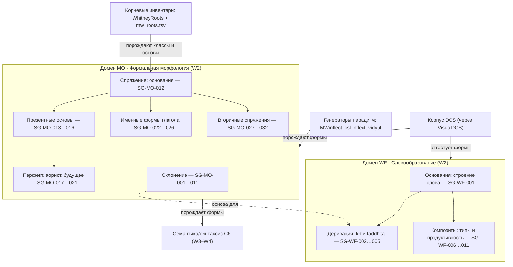
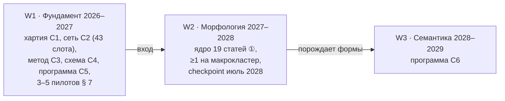

# Программа морфологии Sangram (слот C5), волна W2

_Создано: 12-07-2026 · Последнее обновление: 12-07-2026_

## 1. Что фиксирует этот документ

Слот **C5** серии MEGABOOK × Sangram — тематическая программа
[хартии](https://github.com/gasyoun/SanskritGrammar/blob/main/sangram/SANGRAM_CHARTER_2026_2031.mdx)
для волны **W2 (словообразование и формальная морфология, 2027–2028)**.
Документ задаёт:

1. **кластеры** — макрокарту морфологических доменов над уже зарегистрированными
   в C2 статейными слотами;
2. **метод «аттестовано / порождено / традиционно»** — как отделять форму,
   реально встреченную в корпусе, от порождённой генератором парадигм и от
   предписанной грамматической традицией; это методологическое ядро именно
   морфологической программы;
3. **пределы свидетельств** — что корпусная база (ядро — DCS через
   [VisualDCS](https://github.com/gasyoun/VisualDCS)) может и чего не может
   аттестовать во флексии и словообразовании;
4. **корпусные запросы** — как морфологическое утверждение операционализируется
   к пинованному снапшоту DCS (форма-класс вместо UD-времени, join классов
   через WhitneyRoots, запрос покрытия клеток парадигмы);
5. **квоты волны W2** — распределение канонических слотов C2 по макрокластерам с
   приоритетом ① (ядро волны) / ② (расширение) и сверкой с целевым диапазоном
   хартии;
6. **пилоты** — пять статей-кандидатов, каждая проверяет свой предел
   свидетельств, с воротами запуска и kill-gate;
7. **разрывы аннотации** — чего не хватает в разметке и какова самая дешёвая
   заплатка для каждого пилота;
8. **свидетелей** — грамматики-предшественники и машинно-читаемые активы
   корней/парадигм;
9. **пятилетнее размещение** — место морфологии в волне W2 между фундаментом W1
   и семантикой W3.

Программа — **стабильный** документ: летучие статусы (кто пишет, что в очереди)
живут в реестрах проекта и публичном атласе, не здесь (правило хартии § 7).
Пересмотр — строкой в таблице ревизий § 11.

### Отношение к соседним контрактам

| Слот | Отношение C5 к нему |
|---|---|
| C2 (сеть-оглавление) | **Канон стабильных ID — целиком за C2.** Морфологические слоты уже зарегистрированы: домены [«Словообразование» (WF, 11 статей)](https://github.com/gasyoun/SanskritGrammar/blob/main/sangram/toc/02-word-formation.mdx) и [«Формальная морфология» (MO, 32 статьи)](https://github.com/gasyoun/SanskritGrammar/blob/main/sangram/toc/03-formal-morphology.mdx). C5 **не заводит новых ID** — он группирует слоты C2 в макрокластеры § 2, назначает квоты § 5 и выбирает пилоты § 6; при расхождении канон — C2 |
| C3 (метод свидетельств) | Каждый корпусный запрос пилотов § 6 исполняется по циклу [C3](https://github.com/gasyoun/SanskritGrammar/blob/main/sangram/SANGRAM_CORPUS_EVIDENCE_METHOD.mdx) (запрос → выборка → валидация → утверждение → примеры); известные дефекты Д1–Д8 источника — вход для пределов § 3–4 |
| C4 (редакционная схема) | Формат статьи, локали, IAST/деванагари, устойчивые ID примеров — [C4](https://github.com/gasyoun/SanskritGrammar/blob/main/sangram/editorial/SANGRAM_EDITORIAL_I18N_CONTRACT.mdx); C5 не задаёт разметку |
| C6 (программа семантики и синтаксиса) | Граница «форма — C5, употребление — C6» — § 8 контракта [C6](https://github.com/gasyoun/SanskritGrammar/blob/main/sangram/SANGRAM_SYNTAX_SEMANTICS_PROGRAM_W3_W4.mdx); морфология **порождает формы**, которые семантика/синтаксис затем описывают в употреблении |

## 2. Карта кластеров

Два домена сети-оглавления C2 — словообразование (WF) и формальная морфология
(MO) — и девять макрокластеров над ними; отношения типизированы по онтологии
источников (порождает · аттестует · связывается · наполняет). Метки кластеров и
диапазоны ID совпадают с колонкой «Кластер» реестра C2.

### Домен WF · Словообразование

- **Основания (SG-WF-001).** Строение слова: корень, основа, аффикс; морфемная
  модель, на которой стоят и деривация, и композиты; опирается на чередования
  ступеней корня (`SG-PH-005`).
- **Деривация (SG-WF-002…005).** Первичная деривация (kṛt) от корня и вторичная
  (taddhita) от именной основы; образование основ женского рода. Суффиксальная
  разметка **отсутствует в DCS** — кластер работает join'ом словарных деривациий
  CDSL (предел EM5).
- **Композиты (SG-WF-006…011).** Внутреннее устройство и классификация
  композитов (dvandva, tatpuruṣa, bahuvrīhi, avyayībhāva/dvigu), их
  продуктивность, глаголы с превербами. DCS даёт **членение** композита, но не
  его **тип** — тип классифицируется вручную по циклу C3 (предел EM4). Внешний
  синтаксис композита (согласование, референция членов) — это C6, не C5 (§ 8).

### Домен MO · Формальная морфология

- **Склонение (SG-MO-001…011).** Именное словоизменение: типы основ (тематические
  `-a`; `-ā/-ī/-ū`; `-i/-u`; `-ṛ`; согласные, `-an/-in`, причастные), степени
  сравнения, местоимения, числительные. Базовая частотная рамка — матрица
  падеж × число.
- **Спряжение: основания (SG-MO-012).** Рамка лицо × число × время × наклонение ×
  залог; точка входа всей глагольной флексии.
- **Презентные основы (SG-MO-013…016).** Десять презентных классов (тематические
  I/IV/VI/X, корневой и редуплицирующий II/III, носовые V/VII/VIII/IX) и
  имперфект. **Класс презенса не хранится в морфопризнаках DCS** — берётся join'ом
  через классный инвентарь WhitneyRoots; классы I/VI и IV/пассив неразличимы без
  акцента на классическом материале (предел EM1).
- **Перфект, аорист, будущее (SG-MO-017…021).** Исторические претериты и
  будущее. UD-разметка DCS склеивает `Tense=Past` — отбор ведётся по **форма-классу**
  (редупликация, сигматика), не по UD-признаку времени (предел EM2).
- **Именные формы глагола (SG-MO-022…026).** Причастия, герундив, инфинитив,
  абсолютив: образование основ и парадигмы. Их **употребление** (таксис,
  причастные обороты, -ta-нарратив) — это C6.
- **Вторичные спряжения (SG-MO-027…032).** Пассив, каузатив, дезидератив,
  интенсив, деноминатив, перифрастический перфект: морфология производных основ.

## 3. Три источника формы: аттестовано / порождено / традиционно

Это методологическое ядро именно морфологической программы. Флексия и
деривация санскрита **сверхпорождаемы**: и грамматическая традиция, и любой
машинный генератор способны выдать полную парадигму любого корня (все лицо ×
число × время × наклонение × залог, все падеж × число), но подавляющее
большинство этих клеток **в корпусе никогда не встречается**. Поэтому любое
утверждение о «форме» обязано нести один из трёх ярлыков источника, и они
**не смешиваются**:

| Ярлык | Что это | Провенанс формы | Роль в статье |
|---|---|---|---|
| **Аттестовано** (attested) | форма реально встречается в пинованном снапшоте DCS | устойчивый locus (текст, книга/глава/стих) | **несёт количественное утверждение** — только аттестованное даёт частоты и распределения |
| **Порождено** (generated) | форма произведена генератором парадигм ([MWinflect](https://github.com/sanskrit-lexicon/MWinflect), [csl-inflect](https://github.com/sanskrit-lexicon/csl-inflect), vidyut) из корня/основы, но не найдена в корпусе | правило + генератор + его версия | заполняет клетку парадигмы как **гипотезу формы**; помечается «порождено, корпусно не подтверждено»; никогда не выдаётся за аттестованное |
| **Традиционно** (traditional) | форма предписана грамматической традицией (Панини, Уитни, справочные и учебные грамматики) | правило + свидетель-грамматика + параграф | свидетель **существования** формы; расхождение «традиция ↔ корпус» — сам предмет статьи, а не дефект |

**Правило представления парадигмы.** Каждая клетка парадигмы в статье несёт
свой ярлык. Клетка, порождённая генератором и не подтверждённая корпусом,
показывается **отличимо** от аттестованной (формат — за C4); молчаливое
слияние трёх слоёв в одну «полную таблицу» запрещено (нарушает ворота G1: не
всё в такой таблице корпусно аттестовано).

**Правило количественного утверждения.** Частота, покрытие клеток,
продуктивность суффикса считаются **только по аттестованному слою** и несут
знаменатель + версию снапшота + доверительный интервал (C3, правила П1–П7).
«Полнота парадигмы» как заявление запрещена — измеряется **доля аттестованных
клеток**, а не постулируется 100 %.

**Правило расхождения.** Форма традиционная, но не аттестованная, — не ошибка
корпуса и не ошибка традиции: это **находка**, публикуемая честно (разрежённость
— правило R5). Форма, порождённая генератором, но противоречащая и традиции, и
корпусу, — сигнал дефекта генератора, фиксируемый в разрывах § 7, а не
печатаемый.

## 4. Пределы свидетельств

Честная карта того, что корпусная база может аттестовать в морфологии. Каждый
предел — **правило метода** для статей задетых кластеров; исполнение конкретных
запросов — по контракту C3, дефекты источника — его же § 6 (Д1–Д8).

| # | Предел | Задетые кластеры | Правило метода |
|---|---|---|---|
| EM1 | **Класс презенса (I–X) не хранится в морфопризнаках DCS; классы I/VI и IV/пассив на -ya- неразличимы без акцента** на классическом материале (C3 Д2) | Презентные основы, Вторичные спряжения | Класс берётся join'ом через классный инвентарь [WhitneyRoots](https://github.com/gasyoun/WhitneyRoots); контраст I/VI и IV/пассив либо проверяется акцентным свидетелем (VedaWeb, ведийский слой, через ворота C3), либо честно помечается неразрешимым на классике |
| EM2 | **`Tense=Past` склеивает имперфект/аорист/перфект** в UD-конверсии DCS (C3 Д1) | Перфект/аорист/будущее, Имперфект | Категориальные заявления о претеритах — только по **форма-классу** (редупликация, сигматика, аугмент), никогда по одному UD-признаку `Tense`; правило уже измерено в [VisualDCS](https://github.com/gasyoun/VisualDCS) |
| EM3 | **Сверхгенерация парадигмы**: традиция и генератор выдают полную парадигму, но большинство клеток в корпусе отсутствует | все флективные кластеры | Обязательное разделение аттестовано/порождено/традиционно (§ 3); количественная заявка — только по аттестованному слою; «полнота парадигмы» не постулируется, а измеряется как доля аттестованных клеток |
| EM4 | **Тип композита не размечен в DCS** — есть членение, нет типа (dvandva/tatpuruṣa/bahuvrīhi…) | Композиты | Тип классифицируется **вручную** на выборке по циклу C3; межразметочное согласие двух проходов фиксируется (κ); автоматический подсчёт по типам не публикуется без ручной валидации |
| EM5 | **Деривационная (суффиксальная) разметка отсутствует в DCS; сандхи стирает границы морфем** | Деривация | Отбор по исходу леммы валидируется словарной деривацией CDSL (иначе ложные членения); поверхностное совпадение суффикса — кандидат, не факт деривации |
| EM6 | **Корневые инвентари расходятся**: [WhitneyRoots](https://github.com/gasyoun/WhitneyRoots) и [mw_roots.tsv](https://github.com/sanskrit-lexicon/csl-orig/blob/main/v02/mw/mw_roots.tsv) дают разные счёт и членение корней | Спряжение, классы презенса | Инвентарь фиксируется **явно с версией**; заявление о «числе корней класса» называет выбранный инвентарь; расхождение инвентарей — сам предмет, а не шум |
| EM7 | **Омонимия корней/основ схлопывает выборку** при retrieval (известный потолок гомонимии) | все | Леммный ключ несёт гомонимный индекс; спорные вхождения разводятся вручную на этапе валидации C3 |
| EM8 | **Редкие категории → разрежённые выборки** (прекатив, интенсив, деноминатив) | Перфект/аорист/будущее, Вторичные спряжения | Правило хартии R5 / C3 П2: нет доверительного интервала — нет количественного утверждения; честный отрицательный результат публикуем |

## 5. Корпусные запросы

Как морфологическое утверждение операционализируется к корпусу. Запросы
исполняются к **пинованному снапшоту** DCS (SQLite-мастер или CoNLL-U зеркала
через [VisualDCS](https://github.com/gasyoun/VisualDCS)), не с живого сайта
(C3 Д4); полная исполнимая форма и ворота — контракт C3. Эскизы запросов на
каждый слот уже стоят в реестре C2 (колонка «Запрос»); ниже — **правила
построения**, специфичные для морфологии.

1. **Форма-класс, не UD-время.** Категории претеритов и вторичных спряжений
   отбираются по инвентарю форма-классов DCS (`present_a`, `perfect`, `aor_s`,
   `causative`, `passive_present`…), а не по признаку `Tense` — из-за склейки
   `Tense=Past` (EM2). Пример намерения: `dcs:form-class perfect` вместо
   `dcs:morph Tense=Past`.
2. **Join класса презенса через WhitneyRoots.** Класс I–X не выводится из
   морфопризнаков токена (EM1) — он приписывается join'ом `lemma → корень →
   класс` по инвентарю [WhitneyRoots](https://github.com/gasyoun/WhitneyRoots)
   (мост уже собран в [карте грамматических отношений](https://github.com/gasyoun/SanskritGrammar/blob/main/GrammarRelations/grammar-relations-map.mdx)).
3. **Запрос покрытия клеток парадигмы** (операционализация § 3). Для типа основы
   или корня: (а) перечислить **аттестованные** клетки — различные кортежи
   морфопризнаков при данной лемме в снапшоте; (б) сопоставить с **порождённой**
   полной парадигмой из [MWinflect](https://github.com/sanskrit-lexicon/MWinflect) /
   [csl-inflect](https://github.com/sanskrit-lexicon/csl-inflect) / vidyut;
   (в) сопоставить с **традиционной** парадигмой грамматики. Результат —
   **доля аттестованных клеток** со знаменателем, не «полная таблица».
4. **Композиты — членение из DCS, тип вручную.** Базовая выборка кластера —
   `dcs:morph Compound=Yes`; тип классифицируется на выборке вручную (EM4).
5. **Деривация — join словаря.** Поверхностный отбор по исходу леммы
   (`dcs:lemma /(ana|ti|tf|in)$/`) валидируется словарной деривацией CDSL (EM5),
   иначе кандидаты отбрасываются.
6. **Нормализация — только каноническая.** Запись в запросах нормализуется
   только преобразователями `sanskrit-util`; наивное NFD-разложение со срезанием
   диакритик уничтожает долготу и ретрофлексию, склеивая разные леммы (C3 Д3).
7. **Провенанс числа.** Каждое количественное утверждение несёт версию снапшота
   + дословный запрос + знаменатель + доверительный интервал (C3 П1–П7); число,
   снятое с живого сайта, невоспроизводимо и не публикуется (EM/Д4).

## 6. Квоты волны W2

Домены WF и MO дают **43 зарегистрированных слота** (11 + 32). Волна W2 не
публикует их все — это нарушило бы запрет «полноты» (хартия § 5). Программа
назначает приоритет каждому слоту: **① — ядро волны** (без него W2 не
закрывается), **② — расширение** (публикуется по ходу ритма, часть переходит в
хвост W2 / карт W3). Правило хартии для W2 — **каждый макрокластер имеет ≥1
статью ядра**; целевой диапазон — 15–25 статей ядра суммарно.

### Домен WF · Словообразование

| Кластер | Слоты ① (ядро W2) | Слоты ② (расширение) |
|---|---|---|
| Основания | SG-WF-001 | — |
| Деривация | SG-WF-002 (kṛt обзор), SG-WF-004 (taddhita обзор) | SG-WF-003 (kṛt-суффиксы), SG-WF-005 (женский род) |
| Композиты | SG-WF-006 (обзор), SG-WF-008 (tatpuruṣa), SG-WF-009 (bahuvrīhi) | SG-WF-007 (dvandva), SG-WF-010 (avyayībhāva/dvigu), SG-WF-011 (превербы) |

WF: **6 ①** + 5 ② = 11.

### Домен MO · Формальная морфология

| Кластер | Слоты ① (ядро W2) | Слоты ② (расширение) |
|---|---|---|
| Склонение | SG-MO-001 (обзор), SG-MO-002 (-a), SG-MO-006 (согласные), SG-MO-010 (местоимения) | SG-MO-003, SG-MO-004, SG-MO-005, SG-MO-007, SG-MO-008, SG-MO-009, SG-MO-011 |
| Спряжение: основания | SG-MO-012 (обзор) | — |
| Презентные основы | SG-MO-013 (тематические), SG-MO-016 (имперфект) | SG-MO-014 (корневой/редупл.), SG-MO-015 (носовые) |
| Перфект, аорист, будущее | SG-MO-017 (перфект), SG-MO-018 (аорист) | SG-MO-019, SG-MO-020 (прекатив), SG-MO-021 (будущее) |
| Именные формы глагола | SG-MO-023 (-ta/-na), SG-MO-026 (абсолютив) | SG-MO-022, SG-MO-024 (герундив), SG-MO-025 (инфинитив) |
| Вторичные спряжения | SG-MO-027 (пассив), SG-MO-028 (каузатив) | SG-MO-029, SG-MO-030, SG-MO-031, SG-MO-032 |

MO: **13 ①** + 19 ② = 32.

### Сверка квоты

| Показатель | Значение |
|---|---|
| Ядро W2 (① суммарно) | **19** статей |
| Расширение (② суммарно) | 24 статьи |
| Зарегистрировано в C2 | 43 слота (не изменяется здесь) |
| Макрокластеров с ≥1 ① | **9 из 9** ✓ (правило хартии W2) |
| Целевой диапазон хартии W2 | 15–25 ✓ (19 внутри) |

Ядро из 19 статей закрывает волну; 24 расширения — явный backlog, не обещание
«полноты». Приоритет ① внутри кластера отдан представителю кластера плюс
наиболее частотным по корпусу категориям (тематическое `-a`-склонение,
`-ta`-причастие, тематический презенс, перфект/аорист, пассив/каузатив); тонкая
настройка диапазона — на checkpoint'е W2 (§ 9), ворота хартии § 8 при этом
непересматриваемы.

## 7. Пилоты волны W2

Пять пилотов; каждый — статья из § 6, проводимая через полный конвейер хартии
(черновик → корпусная верификация C3 → враждебная рецензия → авторская виза →
публикация). Пилоты выбраны так, чтобы **каждый упирался в свой предел
свидетельств** (§ 4) и честно проверял метод. Пилот P1 — флагман: он
доказывает само методологическое ядро C5 (§ 3) и потому идёт первым; эти пять
статей — естественные кандидаты в 3–5 пилотов фундамента W1 (хартия § 6) и
входное условие волны W2.

| # | Пилот (ID) | Проверяемый предел | Почему выбран | Ворота запуска | Kill-gate |
|---|---|---|---|---|---|
| P1 | SG-MO-002 (Основы на -a) | EM3 (сверхгенерация) | Флагман метода § 3: самое частотное склонение; измерение **доли аттестованных клеток** матрицы падеж × число против порождённой (MWinflect/vidyut) и традиционной (Уитни) парадигм — прямой тест аттестовано/порождено/традиционно | C3 принят; снапшот DCS + генератор доступны в ingest | Доля ложных срабатываний морфоразметки в выборке &gt;10 % → покрытие клеток снимается, публикуется интервальная оценка (C3 П4) |
| P2 | SG-MO-013 (Презенс: тематические классы) | EM1 (класс/акцент) | Прямой тест join'а класса через WhitneyRoots и коллапса I/VI, IV/пассив без акцента | C3 принят; классный инвентарь WhitneyRoots подключён | Join `lemma→класс` валидируется против DCS-леммы в &lt;90 % выборки → классовые частоты снимаются, статья публикует «неразрешимо на классическом материале» |
| P3 | SG-MO-017 (Перфект) | EM2 (Tense=Past) | Прямой тест отбора по форма-классу (редупликация) вместо UD-времени | C3 принят; форма-класс `perfect` доступен в ingest | Форма-класс отделяет перфект от аориста/имперфекта в &lt;95 % выборки → количественная часть снимается, публикуется честный отрицательный результат |
| P4 | SG-WF-008 (Детерминативные композиты, tatpuruṣa) | EM4 (тип не размечен) | Тест ручной классификации типа композита на выборке членённых композитов DCS | C3 принят; базовая выборка `Compound=Yes` построена | Межразметочное согласие двух независимых проходов классификации &lt;0.7 (Cohen κ) → таксономия типов пересматривается до публикации |
| P5 | SG-WF-003 (Основные kṛt-суффиксы) | EM5 (нет деривац. разметки) | Тест join'а словарной деривации CDSL как фильтра поверхностных совпадений суффикса | C3 принят; словарные деривации CDSL доступны | Словарная валидация отбрасывает &gt;20 % поверхностно-совпавших кандидатов → запрос переработан до утверждения |

Порядок жёсткий: P1 (доказать метод) → P2/P3 (пределы глагольной системы) →
P4/P5 (пределы словообразования). Три опубликованных пилота — входное условие
checkpoint'а фундамента и открытия ядра W2 (хартия § 6).

## 8. Граница с программой семантики и синтаксиса C6

Правило одно: **форма — C5, употребление — C6.** Полная граница задана в § 3
контракта [C6](https://github.com/gasyoun/SanskritGrammar/blob/main/sangram/SANGRAM_SYNTAX_SEMANTICS_PROGRAM_W3_W4.mdx);
здесь — её морфологическая сторона, чтобы две программы не породили дублей.

| Явление | C5 (эта программа) | C6 (семантика/синтаксис) |
|---|---|---|
| Композиты | внутреннее устройство, типы, продуктивность | внешний синтаксис: согласование, референция членов, bahuvrīhi как модификатор клаузы |
| Причастия | образование основ и парадигмы | причастные клаузы, -ta-нарратив, абсолютные обороты |
| Каузатив, дезидератив | морфология производных основ | диатеза, аргументная структура, семантика употребления |
| Времена/наклонения | флексия, форма-классы основ | нарративные функции, выбор формы в тексте |
| Падежная флексия | парадигмы склонения | семантика и синтаксис падежей |
| Абсолютив, инфинитив | образование основ | таксис, клаузальное сцепление, целевые обороты |

Спорный случай решается в пользу C5, если утверждение проверяется на уровне
**словоформы без контекста**, и в пользу C6, если нужен **клаузальный контекст**.

## 9. Разрывы аннотации

Чего не хватает в разметке; для каждого разрыва — самая дешёвая заплатка,
достаточная для пилотов § 7. Создание новых слоёв аннотации — отдельные
решения, **не** предусловие программы: пилоты спроектированы стартовать без них.

| # | Разрыв | Задето | Самая дешёвая заплатка | Полное решение (за горизонтом C5) |
|---|---|---|---|---|
| G1 | Класс презенса не в признаках DCS | Презентные основы | Join через классный инвентарь WhitneyRoots (EM1) | Слой класса в ingest VisualDCS — оценка стоимости на checkpoint W2 |
| G2 | Клетки парадигмы не помечены аттестовано/порождено | все флективные | Запрос покрытия клеток § 5.3 + ручная сверка выборки | Материализованная таблица «аттестованные клетки на лемму» как производный дата-актив |
| G3 | Тип композита не размечен | Композиты | Ручная классификация выборки (EM4) | Классификатор типа композита; кандидат в исследовательский трек репозитория |
| G4 | Нет деривационной разметки | Деривация | Join словарной деривации CDSL (EM5) | Слой суффиксальной сегментации на эталонном подкорпусе |
| G5 | Расхождение корневых инвентарей | Спряжение, классы | Явная фиксация инвентаря + версии (EM6) | Сверенный кросс-инвентарь корней WhitneyRoots ↔ mw_roots как FAIR-набор |
| G6 | `Tense=Past` непригоден для претеритов | Перфект/аорист | Отбор по форма-классу (EM2) | Исправление конвертера в VisualDCS; уже зафиксировано там как известный дефект |

## 10. Свидетели

### 10.1. Грамматики-предшественники (порождают утверждения)

Оцифрованные в репозитории грамматики — источники морфологических утверждений,
которые статьи C5 затем корпусно проверяют; их покрытие по главам Уитни уже
сведено в таблицах реестра C2:

- [Уитни 1889](https://github.com/gasyoun/SanskritGrammar/tree/main/WhitneyGrammar_1889) —
  главный референс-свидетель; главы IV–XVIII задают адресацию слотов MO и WF.
- [Зализняк: «Грамматический очерк» 1978](https://github.com/gasyoun/SanskritGrammar/tree/main/ZalizniakOcherk_1978),
  [«Морфология» 1975](https://github.com/gasyoun/SanskritGrammar/tree/main/ZalizniakMorphology_1975),
  [конспект 2004](https://github.com/gasyoun/SanskritGrammar/tree/main/ZalizniakKonspekt_2004) —
  формальная модель морфоклассов (склонение и глагольные классы); главный
  свидетель формальной стороны, донор системы морфоклассов реестра C2.
- [Бюлер 1923](https://github.com/gasyoun/SanskritGrammar/tree/main/BuhlerLeitfaden_1923),
  [Кочергина 1998](https://github.com/gasyoun/SanskritGrammar/tree/main/KocherginaUchebnik_1998) —
  учебная традиция; порядок подачи тем наследует измеренному согласию учебников
  ([результат S1, Kendall τ](https://github.com/gasyoun/SanskritGrammar/blob/main/S1_TEXTBOOK_SEQUENCING_TAU_RESULT.md)).
- [Апте 1885](https://github.com/gasyoun/SanskritGrammar/tree/main/ApteSyntax_1885),
  [Кнауэр 1908](https://github.com/gasyoun/SanskritGrammar/tree/main/KnauerFrazy_1908) —
  композиты и русскоязычный фразовый материал; доноры примеров-кандидатов.
- [Гасунс, «Dhātu» 2014](https://github.com/gasyoun/SanskritGrammar/tree/main/GasunsDhatu_2014),
  [Толчельников 2026](https://github.com/gasyoun/SanskritGrammar/tree/main/TolchelnikovTalmud_2026) —
  морфемный строй корня и непаниниевская модель слова; свидетели строения слова
  (SG-WF-001) и глагольной статистики корней.

### 10.2. Машинно-читаемые активы (порождают парадигмы и аттестуют)

Готовые корневые инвентари, генераторы парадигм и корпусный ingest —
**потребляются, не пересоздаются** (non-goal хартии № 3):

| Актив | Что даёт | Отношение | Роль |
|---|---|---|---|
| [WhitneyRoots](https://github.com/gasyoun/WhitneyRoots) | корневой инвентарь + класс презенса Уитни | порождает классы | join `лемма→корень→класс` (EM1, § 5.2) |
| [mw_roots.tsv](https://github.com/sanskrit-lexicon/csl-orig/blob/main/v02/mw/mw_roots.tsv) | корневой инвентарь MW | порождает основы | второй инвентарь для сверки (EM6) |
| [MWinflect](https://github.com/sanskrit-lexicon/MWinflect), [csl-inflect](https://github.com/sanskrit-lexicon/csl-inflect) | генераторы флективных парадигм | порождают формы | **порождённый** слой § 3 (запрос покрытия § 5.3) |
| vidyut | машинная морфология (генерация/разбор) | порождает формы | порождённый слой; только display/кандидат, не автокоррекция |
| [VisualDCS](https://github.com/gasyoun/VisualDCS) | ingest DCS → SQLite-мастер + инвентарь форма-классов | аттестует формы | **аттестованный** слой § 3; поверхность запросов § 5 |
| [Карта грамматических отношений](https://github.com/gasyoun/SanskritGrammar/blob/main/GrammarRelations/grammar-relations-map.mdx) | кроссуок Уитни ↔ корни ↔ корпус | связывает | мост join'ов § 5.2 |

## 11. Пятилетнее размещение

Морфология — волна **W2 (2027–2028)** пятилетней рамки хартии; программа
привязывает её к соседним волнам явными входами и выходами.

- **Вход из W1.** Фундамент поставляет: [хартию](https://github.com/gasyoun/SanskritGrammar/blob/main/sangram/SANGRAM_CHARTER_2026_2031.mdx) (C1),
  [сеть-оглавление](https://github.com/gasyoun/SanskritGrammar/blob/main/sangram/toc/SANGRAM_TOC_NETWORK.mdx) (C2, 43 морфологических слота),
  [метод свидетельств](https://github.com/gasyoun/SanskritGrammar/blob/main/sangram/SANGRAM_CORPUS_EVIDENCE_METHOD.mdx) (C3),
  [редакционную схему](https://github.com/gasyoun/SanskritGrammar/blob/main/sangram/editorial/SANGRAM_EDITORIAL_I18N_CONTRACT.mdx) (C4),
  эту программу (C5) и 3–5 пилотов § 7.
- **Работа W2.** Публикация ядра из 19 статей ① по 9 макрокластерам (§ 6);
  каждый макрокластер — ≥1 статья ядра; цель 15–25 суммарно; ворота хартии § 8
  (G1–G7) непересматриваемы. Решение о старте английской локали — по воротам W2
  (стабильный русский конвейер ≥2 квартала).
- **Выход в W3.** Морфология **порождает формы** для программы семантики и
  синтаксиса [C6](https://github.com/gasyoun/SanskritGrammar/blob/main/sangram/SANGRAM_SYNTAX_SEMANTICS_PROGRAM_W3_W4.mdx)
  (ребро `C5 → SEM` карты кластеров C6); слой аттестовано/порождено/традиционно
  (§ 3) питает отбор примеров всех последующих волн.
- **Checkpoint W2 (июль 2028).** Сверяет метрики хартии § 8, пересматривает
  диапазоны квот § 6, решает о старте английской локали; ворота § 8 при этом не
  трогаются.

## 12. Провенанс и ревизии

Документ исполнен по слоту C5 внутренней серии
[MEGABOOK × Sangram](https://github.com/gasyoun/Uprava/blob/main/MEGABOOK_SANGRAM_VISUALIZATION_PLAN_2026_2031.md)
(handoff [H634](https://github.com/gasyoun/Uprava/blob/main/handoffs/H634-Fable_SanskritGrammar_sangram-morphology-program_11.07.26.md);
обе ссылки — внутренний архив Uprava). Слот минтился для Fable 5
(`claude-fable-5`); черновик и сборка исполнены **Opus 4.8 (`claude-opus-4-8`)**
по явному решению автора для этой сессии; научная ответственность — автор.
Канон стабильных ID — за C2 (§ 1); C2–C4, C6 на дату написания исполнялись
параллельными сессиями серии.

| Дата | Ревизия | Основание |
|---|---|---|
| 12-07-2026 | Программа учреждена (v1) | Слот C5, хартия § 11 |

_Dr. Mārcis Gasūns_
