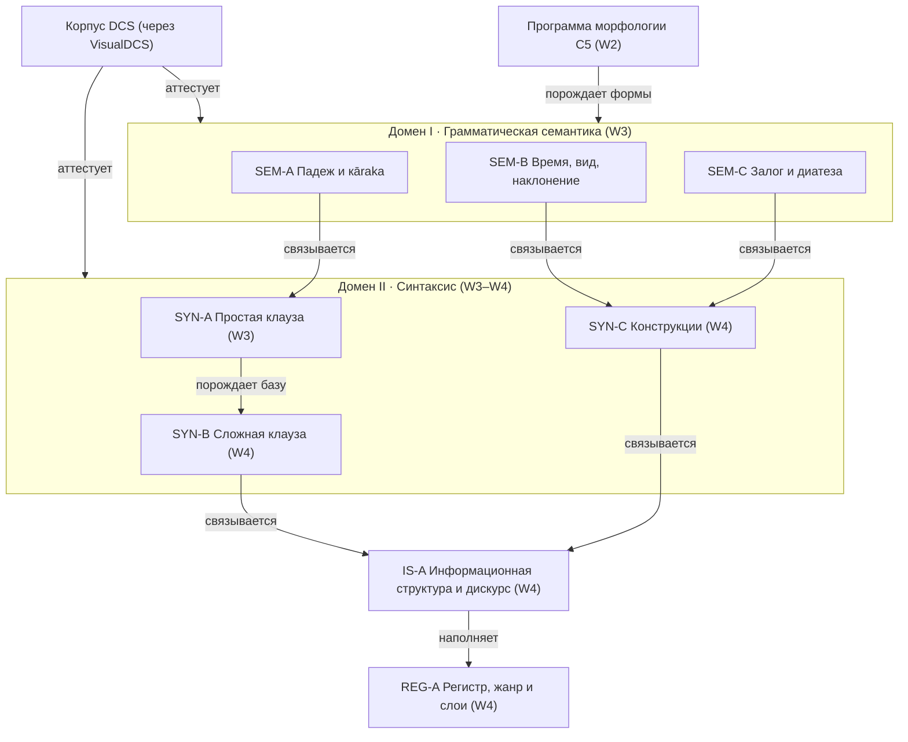

# Программа семантики и синтаксиса Sangram (слот C6), волны W3–W4

_Создано: 12-07-2026 · Последнее обновление: 13-07-2026_

## 1. Что фиксирует этот документ

Слот **C6** серии MEGABOOK × Sangram — тематическая программа
[хартии](https://github.com/gasyoun/SanskritGrammar/blob/main/sangram/SANGRAM_CHARTER_2026_2031.mdx)
для волн **W3 (грамматическая семантика и простой синтаксис, 2028–2029)** и
**W4 (сложный синтаксис, дискурс, жанры и слои, 2029–2030)**. Документ задает:

1. **кластеры** — устойчивую карту доменов с типизированными отношениями;
2. **пределы свидетельств** — что корпусная база (ядро — DCS через
   [VisualDCS](https://github.com/gasyoun/VisualDCS)) реально может и чего не
   может аттестовать в синтаксисе и семантике;
3. **слоевую политику в статьях** — как классическое ядро и маркированные слои
   (ведийский · эпический · поздний) живут внутри одной статьи;
4. **стабильные ID статейных слотов** — append-only перечень заявок для
   сети-оглавления C2;
5. **пилоты** — пять статей-кандидатов с воротами запуска и kill-gate;
6. **разрывы аннотации** — чего не хватает в существующей разметке и какова
   самая дешевая заплатка для каждого пилота.

Программа — **стабильный** документ: летучие статусы (кто пишет, что в
очереди) живут в реестрах проекта и публичном атласе, не здесь (правило
хартии § 7). Пересмотр — строкой в таблице ревизий § 10.

### Отношение к соседним контрактам

| Слот | Отношение C6 к нему |
|---|---|
| C2 (сеть-оглавление) | C6 **порождает** статейные слоты; канонический реестр ID — C2. Слоты § 6 передаются в C2 как заявки; при расхождении схемы ID канон — C2, слоты C6 переименовываются маппинг-таблицей, а не молчаливой правкой |
| C3 (метод свидетельств) | Каждый корпусный запрос пилотов § 7 исполняется по циклу C3 (запрос → выборка → валидация → утверждение → примеры); ворота прав/живости/качества дополнительных свидетелей — целиком C3 |
| C4 (редакционная схема) | Формат статьи, локали, IAST/деванагари, устойчивые ID примеров — C4; C6 не задает разметку |
| C5 (программа морфологии) | Граница доменов — § 3 ниже; словообразование и формальная морфология — C5 |

## 2. Карта кластеров

Шесть макрокластеров в двух доменах; отношения типизированы по онтологии
источников (порождает · аттестует · связывается · наполняет).

### Домен I · Грамматическая семантика — волна W3

- **SEM-A · Падежная семантика и кāraka.** Функции восьми падежей по
  корпусным распределениям; соотношение туземной модели kāraka и западной
  падежной семантики — как два описания над одними свидетельствами, не как
  спор школ. Свидетели-грамматики: [Апте 1885](https://github.com/gasyoun/SanskritGrammar/tree/main/ApteSyntax_1885)
  (гл. о падежах), [Кнауэр 1908](https://github.com/gasyoun/SanskritGrammar/tree/main/KnauerFrazy_1908),
  [Уитни 1889](https://github.com/gasyoun/SanskritGrammar/tree/main/WhitneyGrammar_1889).
- **SEM-B · Семантика глагольных категорий.** Времена и «времена»
  (презенс/имперфект/аорист/перфект в реальном нарративном употреблении),
  наклонения (оптатив, императив, кондиционалис), нефинитные формы как
  носители таксиса (абсолютив, причастия, инфинитив).
- **SEM-C · Залог и диатеза.** Актив/медий/пассив по корпусной частоте;
  безличный пассив; каузатив как диатезная операция; дезидератив/интенсив —
  только семантика употребления (их морфология — C5).

### Домен II · Синтаксис — волны W3–W4

- **SYN-A · Простая клауза (W3).** Порядок слов и его вариативность,
  согласование, безглагольная предикация (номинальное предложение), pro-drop,
  простое отрицание (na, mā).
- **SYN-B · Сложная клауза (W4).** Коррелятивы ya-…ta- как основной
  релятивный тип; комплементация с iti; условные периоды (yadi/ced +
  оптатив/презенс); сочинение и клаузальные частицы (ca, vā, tu, api).
- **SYN-C · Конструкции (W4).** Цепочки абсолютивов как нарративный
  скелет; locative absolute (sati saptamī) и genitive absolute; конструкция
  с -ta-причастием как основной перфективный нарратив; герундивная
  (долженствовательная) конструкция; дативно-экспериенцерные модели.

### Поперечные кластеры — волна W4

- **IS-A · Информационная структура и дискурс.** Частицы eva, api, hi,
  khalu, vai как маркеры фокуса/топика/общего знания; позиционные эффекты
  (инициальная/вторая позиция); переключение нарративных времен; прямая речь
  с iti как дискурсивный механизм.
- **REG-A · Регистр, жанр и слои.** Систематические контрасты проза/стих,
  śāstra/kāvya/эпос; слоевые контрастные статьи (ведийский vs классический;
  эпические отклонения) — пилоты слоевой политики § 5.

## 3. Граница с программой морфологии C5

Правило одно: **форма — C5, употребление — C6.** Развернутая граница, чтобы
две программы не породили дублей:

| Явление | C5 (морфология) | C6 (эта программа) |
|---|---|---|
| Композиты | внутреннее устройство, типы, продуктивность | внешний синтаксис композита: согласование, референция членов, bahuvrīhi как модификатор клаузы |
| Причастия | образование основ и парадигмы | причастные клаузы, -ta-нарратив, абсолютные обороты |
| Каузатив, дезидератив | морфология основ | диатеза, аргументная структура, семантика употребления |
| Времена/наклонения | флексия, классы основ | нарративные функции, выбор формы в тексте |
| Падежная флексия | парадигмы склонения | семантика и синтаксис падежей |
| Абсолютив, инфинитив | образование | таксис, клаузальное сцепление, целевые обороты |

Спорный случай решается в пользу C5, если утверждение проверяется на
уровне **словоформы без контекста**, и в пользу C6, если для проверки нужен
**клаузальный контекст**.

## 4. Пределы свидетельств

Честная карта того, что корпусная база может аттестовать. Каждое ограничение —
не примечание, а **правило метода** для статей соответствующих кластеров;
исполнение конкретных запросов — по контракту C3.

| # | Предел | Задетые кластеры | Правило метода |
|---|---|---|---|
| E1 | **Нет синтаксической (dependency) аннотации классического DCS.** Деревья зависимостей существуют только для ведийского слоя (UD Vedic-TreeBank) | SYN-A/B/C, IS-A | Клаузальные утверждения операционализируются через морфологию + леммы + смежность (proxy-запросы) и валидируются ручной выборкой ≥100 клауз на утверждение; прямые количественные заявления о синтаксических деревьях классического слоя запрещены |
| E2 | **UD-конверсия DCS схлопывает Tense=Past** (аорист/перфект/имперфект неразличимы в конвертированном слое VisualDCS) | SEM-B, SYN-C | Категориальные заявления о временах — только по родным тегам DCS, никогда по UD-конверсии; правило уже измерено в [VisualDCS](https://github.com/gasyoun/VisualDCS) |
| E3 | **Корпус преимущественно стихотворный; порядок слов конфундирован метром** | SYN-A, IS-A | Порядок слов и позиция частиц измеряются prose-first: сначала прозаический подкорпус, стих — как явно маркированный контраст, не как смесь |
| E4 | **Сегментация клауз в стихе ненадежна** (пада-границы ≠ клаузальные границы) | SYN-B/C, IS-A | Единица выборки в стихе — строфа с ручной клаузальной разметкой выборки; автоматический подсчет «клауз» в стихе не публикуется |
| E5 | **Редкие явления → разреженные выборки** | все | Правило хартии R5: нет доверительного интервала — нет количественного утверждения; честный отрицательный результат публикуем |
| E6 | **Нет аннотации информационной структуры и кореференции** | IS-A | ИС-заявления строятся на частицах-прокси и позиционных распределениях с ручной валидацией; понятия «топик/фокус» в статьях всегда операционализированы явным критерием |
| E7 | **Жанровые/датировочные метаданные DCS грубые** | REG-A | Каждое регистровое утверждение называет явный список текстов сравнения (poimenno), а не «жанр» как готовую переменную |
| E8 | **Дополнительные свидетели (VedaWeb, GRETIL, SamudraManthanam, Wisdomlib, DharmaMitra) — только через ворота C3** | REG-A, слоевые статьи | Слоевой контраст «ведийский vs классический» может опираться на VedaWeb (акцент, UD-деревья) лишь после ворот прав/живости/качества C3 |

## 5. Слоевая политика в статьях

Детализация политики хартии § 4 для статейного уровня; вместе с C4 она
становится частью валидатора статьи.

1. **Ядро статьи — классический санскрит.** Всякое немаркированное
   утверждение читается как утверждение о классическом слое.
2. **Каждый корпусный пример несет слоевую метку** (classical ·
   vedic · epic · late), выводимую из метаданных текста по реестру C3;
   пример без метки не проходит ворота G2.
3. **Слоевые примечания** внутри статьи ядра — только как явно маркированные
   блоки («Слой: ведийский — …»), не как немаркированные абзацы; формат
   блока фиксирует C4.
4. **Слоевые контрастные статьи** (отдельный тип: «X в ведийском vs
   классическом») открываются не раньше W3 (правило хартии § 4) и обязаны
   называть парные подкорпуса сравнения явно (E7).
5. **Поздний/буддийский слой** до W4 живет только в слоевых примечаниях;
   отдельные статьи позднего слоя — решение checkpoint'а W4.
6. **Диахроническое утверждение** («в эпосе чаще, чем в śāstra») — всегда
   количественное с CI (E5) либо явно помеченное как импрессионистское
   свидетельство грамматик-предшественников, ждущее корпусной проверки.

## 6. Статейные слоты — стабильные ID

Append-only заявки для сети-оглавления C2. Схема ID: `<кластер>-<слаг>`;
канонизация — за C2 (§ 1). Приоритет: ① — ядро волны, без него волна не
закрывается; ② — расширение.

### SEM-A · Падеж и kāraka (W3)

| ID | Статья | Приоритет |
|---|---|---|
| sem-a-case-overview | Падежная система: обзор функций по корпусу | ① |
| sem-a-instrumental | Творительный: агенс, инструмент, сопровождение, причина | ① |
| sem-a-genitive | Родительный: приименные и предикативные функции | ① |
| sem-a-dative-experiencer | Дательный: адресат, цель, экспериенцер | ② |
| sem-a-locative | Локатив: место, время, тема, условие | ② |
| sem-a-karaka-vs-case | Kāraka и падеж: две модели над одними свидетельствами | ② |

### SEM-B · Глагольные категории (W3)

| ID | Статья | Приоритет |
|---|---|---|
| sem-b-past-competition | Конкуренция претеритов: имперфект, аорист, перфект в нарративе | ① |
| sem-b-ta-narrative | -ta-причастие как основной перфектив нарратива | ① |
| sem-b-optative | Оптатив: предписание, возможность, вежливость | ① |
| sem-b-imperative | Императив и запрет (mā + инъюнктив) | ② |
| sem-b-nonfinite-taxis | Таксис нефинитных форм: абсолютив, причастия, инфинитив | ② |

### SEM-C · Залог и диатеза (W3)

| ID | Статья | Приоритет |
|---|---|---|
| sem-c-passive | Пассив: личный и безличный, частота по жанрам | ① |
| sem-c-middle | Медий: остаточная семантика и лексикализация | ② |
| sem-c-causative | Каузатив: аргументная структура и падеж каузируемого | ② |

### SYN-A · Простая клауза (W3)

| ID | Статья | Приоритет |
|---|---|---|
| syn-a-word-order | Порядок слов: базовый SOV и его вариативность (prose-first, E3) | ① |
| syn-a-nominal-clause | Номинальное предложение и предикация без связки | ① |
| syn-a-agreement | Согласование: субъект–глагол, имя–определение | ② |
| syn-a-negation | Отрицание na и mā в простой клаузе | ② |

### SYN-B · Сложная клауза (W4)

| ID | Статья | Приоритет |
|---|---|---|
| syn-b-correlatives | Коррелятивы ya-…ta-: основной релятивный тип | ① |
| syn-b-iti | iti: комплементация, цитация, метаязык | ① |
| syn-b-conditionals | Условные периоды: yadi/ced и выбор наклонения | ② |
| syn-b-coordination | Сочинение: ca, vā, tu и клаузальное сцепление | ② |

### SYN-C · Конструкции (W4)

| ID | Статья | Приоритет |
|---|---|---|
| syn-c-absolutive-chain | Цепочки абсолютивов как нарративный скелет | ① |
| syn-c-locative-absolute | Locative absolute (sati saptamī) и genitive absolute | ① |
| syn-c-gerundive | Герундивная конструкция долженствования | ② |
| syn-c-dative-possessive | Посессивные и экспериенцерные модели без «иметь» | ② |

### IS-A · Информационная структура и дискурс (W4)

| ID | Статья | Приоритет |
|---|---|---|
| is-a-eva | eva: фокусная частица и ее хосты | ① |
| is-a-second-position | Частицы второй позиции: hi, khalu, vai | ② |
| is-a-tense-switching | Переключение нарративных времен как дискурсивный прием | ② |
| is-a-direct-speech | Прямая речь с iti: дискурсивная рамка | ② |

### REG-A · Регистр, жанр и слои (W4)

| ID | Статья | Приоритет |
|---|---|---|
| reg-a-prose-verse | Проза vs стих: что меняется в грамматике | ① |
| reg-a-layer-vedic-classical | Слоевой контраст: ведийский vs классический (пилот слоевой политики § 5) | ① |
| reg-a-epic-deviations | Эпические отклонения от классической нормы | ② |

Итого 33 слота, из них 16 приоритета ① — это согласуется с целевыми
диапазонами хартии § 8 (W3: 30–50 статей суммарно с учетом ядра W2; W4:
50–80).

## 7. Пилоты волн W3–W4

Пять пилотов; каждый — статья из § 6, проводимая через полный конвейер
(черновик → корпусная верификация C3 → враждебная рецензия → авторская виза →
публикация). Пилоты выбраны так, чтобы **каждый упирался в свой предел
свидетельств** (§ 4) и честно проверял метод, а не только тему.

| # | Пилот (ID) | Волна | Почему выбран | Ворота запуска | Kill-gate |
|---|---|---|---|---|---|
| P1 | syn-c-locative-absolute | W3 | Четко очерченная конструкция; retrieval через морфологию (локативное причастие + локативная ИГ) без деревьев — прямой тест предела E1 | C3 принят; proxy-запрос сформулирован | Точность retrieval &lt;80% на ручной выборке 100 кандидатов → пилот останавливается, разрыв A1 эскалируется |
| P2 | sem-b-past-competition | W3 | Ядро семантики W3; прямой тест предела E2 (только родные теги DCS) | C3 принят; родные теги DCS доступны в ingest | Родные теги различают три претерита в &lt;95% выборки → количественная часть снимается, статья публикует честный отрицательный результат |
| P3 | syn-b-iti | W3 | Дешевый string-retrieval (токен iti); классификация функций (цитация/комплементация/номинация) на ручной выборке 200 — тест ручного цикла C3 | C3 принят | Межразметочное согласие двух независимых проходов классификации &lt;0.7 (Cohen's κ) → таксономия функций пересматривается до публикации |
| P4 | is-a-eva | W4 | Высокочастотная частица; позиционные распределения prose-first — прямой тест пределов E3/E6 | Прозаический подкорпус определен (E3); P1–P3 опубликованы | Позиционный сигнал неотличим от базовой линии (CI перекрываются) → статья публикуется как отрицательный результат, кластер IS-A пересматривает прокси |
| P5 | reg-a-layer-vedic-classical | W4 | Пилот слоевой политики § 5 и ворот C3 для дополнительного свидетеля (VedaWeb) | Ворота прав/живости/качества VedaWeb пройдены (E8) | Ворота свидетеля не пройдены → пилот заменяется на reg-a-prose-verse (только DCS), слоевая статья ждет свидетеля |

Порядок жесткий только внутри волны: P1→P2→P3 (W3), P4→P5 (W4). Три
опубликованных пилота W3 — входное условие checkpoint'а волны по хартии § 6.

## 8. Разрывы аннотации

Чего не хватает в существующей разметке; для каждого разрыва — самая дешевая
заплатка, достаточная для пилотов § 7. Создание новых слоев аннотации —
отдельные решения, **не** предусловие программы: пилоты спроектированы так,
чтобы стартовать без них.

| # | Разрыв | Задето | Самая дешевая заплатка | Полное решение (за горизонтом C6) |
|---|---|---|---|---|
| A1 | Нет dependency-деревьев классического слоя | SYN-*, IS-A | Ручная валидационная выборка ≥100 клауз на утверждение (правило E1) | Seed-treebank классической прозы (UD), решение автора + оценка стоимости на checkpoint W3 |
| A2 | Нет клаузальной сегментации | SYN-B/C | Строфа как единица + ручная разметка выборки (E4) | Клаузальный сегментер по абсолютивам/финитным формам; кандидат в исследовательский трек репозитория |
| A3 | Нет ИС-аннотации (топик/фокус) | IS-A | Частицы-прокси + позиционные распределения с ручной валидацией (E6) | ИС-разметка малого эталонного подкорпуса — только после положительного P4 |
| A4 | Грубые жанровые метаданные | REG-A | Явные поименные списки текстов сравнения (E7); прозаический подкорпус-реестр как приложение C3 | Датировочно-жанровый реестр DCS-текстов с провенансом |
| A5 | UD-слой непригоден для претеритов | SEM-B | Родные теги DCS (E2) | Исправление конвертера в VisualDCS; уже зафиксировано там как известный дефект |

## 9. Свидетели-предшественники

Оцифрованные в этом репозитории грамматики — источники утверждений
(отношение «порождает» онтологии), которые статьи C6 затем корпусно
проверяют:

- [Апте, «Guide to Sanskrit Composition» 1885](https://github.com/gasyoun/SanskritGrammar/tree/main/ApteSyntax_1885) —
  главный туземно-ориентированный свидетель синтаксиса: падежи, композиты,
  частицы; естественный донор утверждений для SEM-A и SYN-*.
- [Кнауэр, «Фразы» 1908](https://github.com/gasyoun/SanskritGrammar/tree/main/KnauerFrazy_1908) —
  русскоязычный фразовый материал; донор примеров-кандидатов и русских
  формулировок.
- [Уитни 1889](https://github.com/gasyoun/SanskritGrammar/tree/main/WhitneyGrammar_1889),
  [Бюлер 1923](https://github.com/gasyoun/SanskritGrammar/tree/main/BuhlerLeitfaden_1923),
  [Кочергина 1998](https://github.com/gasyoun/SanskritGrammar/tree/main/KocherginaUchebnik_1998) —
  учебная традиция; порядок подачи тем в статьях наследует измеренному
  согласию учебников ([результат S1, Kendall τ](https://github.com/gasyoun/SanskritGrammar/blob/main/S1_TEXTBOOK_SEQUENCING_TAU_RESULT.md)).
- Исследовательский трек репозитория
  ([дорожная карта 2026–2027](https://github.com/gasyoun/SanskritGrammar/blob/main/ROADMAP_GRAMMAR_CORPUS_ACL_2026_2027.md),
  [повестка](https://github.com/gasyoun/SanskritGrammar/blob/main/docs/SANSKRITGRAMMAR_RESEARCH_AGENDA.md))
  питает программу методами (детекторы, конкордансы, морфоклассы); жанровый
  образец остается [RusGram](http://rusgram.ru/) (https не отвечает — см. Uprava
  SERVER_OUTAGES.md).

## 10. Провенанс и ревизии

Документ исполнен по слоту C6 внутренней серии
[MEGABOOK × Sangram](https://github.com/gasyoun/Uprava/blob/main/MEGABOOK_SANGRAM_VISUALIZATION_PLAN_2026_2031.md)
(handoff [H635](https://github.com/gasyoun/Uprava/blob/main/handoffs/H635-Fable_SanskritGrammar_sangram-syntax-semantics-program_11.07.26.md);
обе ссылки — внутренний архив Uprava). Черновик и сборка — Fable 5
(`claude-fable-5`); научная ответственность — автор. C2–C5 на дату написания
исполнялись параллельными сессиями; маппинг ID § 6 на реестр C2 — по правилу
§ 1.

| Дата | Ревизия | Основание |
|---|---|---|
| 12-07-2026 | Программа учреждена (v1) | Слот C6, хартия § 11 |
| 13-07-2026 | Исправлена итоговая строка § 6: «Итого 32 слота, 15 приоритета ①» → «Итого 33 слота, 16 приоритета ①» (пересчитано по таблицам SEM-A 6 + SEM-B 5 + SEM-C 3 + SYN-A 4 + SYN-B 4 + SYN-C 4 + IS-A 4 + REG-A 3 = 33; канон — таблицы); также исправлена ссылка RusGram на http (https сертификат недоступен) | weekly-review Phase 2c triage (Sonnet 5, `claude-sonnet-5`), papercut `9d29842d1db1` |

_Dr. Mārcis Gasūns_
