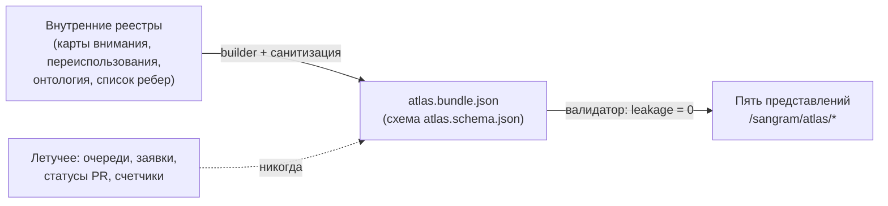

# Контракт данных публичного атласа Sangram

_Создано: 11-07-2026 · Последнее обновление: 12-07-2026_

## 1. Что фиксирует контракт

Атлас Sangram — публичная витрина устройства всей исследовательской программы:
пять интерактивных представлений (внимание · переиспользование · цепочка
ценности · зависимости · происхождение данных), обещанных
[хартией](https://gasyoun.github.io/SanskritGrammar/grammars/sangram/charter-2026-2031) (§ 11, слоты B1–B6).
Этот контракт — слот **B1**: он фиксирует единственный формат данных, который
все пять представлений потребляют, и правила, по которым эти данные попадают
из внутренних реестров в публичный bundle.



Один принцип управляет всем контрактом: **атлас показывает устойчивую
объяснительную структуру, а не оперативное состояние**. Оперативные статусы
живут во внутренних реестрах проекта и в публичный bundle не попадают.

## 2. Три температуры данных

Каждый узел и каждое ребро несут поле `temperature`. Допустимы два значения;
третья категория запрещена по построению:

| Температура | Что это | Примеры | Правило обновления |
|---|---|---|---|
| `structural` | Стабильная объяснительная структура | классы источников, семейства активов, запреты пересоздания, маршруты представлений | меняется только решением автора; ревизия — новая строка в § 10 |
| `assessed` | Датированная авторская или реестровая оценка | оценки E/Z/P/K и вердикты тезисов, типы ворот, статусы ребер (`live`/`queued`/…) | пересобирается builder'ом; каждый элемент несет `as_of` |
| летучее (запрещено) | Оперативное состояние | очереди, заявки, номера PR, проценты, счетчики, claims | в bundle не входит никогда; валидатор ловит характерные паттерны |

## 3. Узлы

Закрытый набор из семи типов (`kind`). Общие поля: `id` (стабильный,
`kind:slug`), `label_ru` (русский — язык по умолчанию), опционально
`label_en`, `url`, `thesis_refs` (ссылки на тезисы внутренней карты, формат
`2.1`…`5.4`), `rule_refs` (правила `7.1`…`7.50`), `temperature`, `as_of`,
`evidence`.

| `kind` | Что моделирует | Обязательные поля сверх общих |
|---|---|---|
| `thesis` | Тезис программы (21 шт.): направление с оценкой и воротами | `section`, `importance`, `state`, `scores` (e/z/p/k), `verdict` (`amplify`/`sustain`/`pause`), `gates` (типы `human`/`external`), `as_of` |
| `source-class` | Класс онтологии источников: словари · корпуса · грамматики (+ три ветви грамматик) и питающие слои | `tier` (`top`/`feeding`); ветви несут `parent` |
| `repo` | Публичный репозиторий GitHub | `org`, `name`, `url`; опционально `programme_ru` (v1.1.0) — программная группа census, по которой представление зависимостей (B5) группирует репозитории |
| `asset` | Каноническое переиспользуемое семейство (код/данные/схема/workflow) с запретом пересоздания | `asset_types`, `owner`, `prohibition_ru`, `rights` (`open`/`rights-gated`/`quarantine`) |
| `external-stack` | Внешний стек (Heritage, DharmaMitra, vidyut, VedaWeb, GRETIL…) с правилом потребления | `consume_rule_ru`, `prohibition_ru`, опционально `license` |
| `stage` | Абстрактная ступень цепочки ценности или цепочки происхождения данных | `chain` (`value`/`provenance`) |
| `surface` | Собирательная поверхность-потребитель (учебные/funnel-поверхности, «все репозитории») | — |

Приватный ярус (внутренние hubs, локальные корпуса, закрытые tier'ы данных)
**не имеет типа узла**: такие сущности в bundle не представимы в принципе —
это санитизация по построению, а не пометка.

## 4. Типизированные ребра

Закрытый набор из шестнадцати типов в четырех семействах. Направление всегда
`source → target`.

**Онтологическое семейство** — закрытый набор отношений онтологии источников
(решение автора 11-07-2026):

| `kind` | Русское имя | Домен → кодомен |
|---|---|---|
| `replenishes` | пополняет | питающий слой → класс источников |
| `generates` | порождает | класс источников → производный слой |
| `attests` | аттестует | корпуса → утверждения словарей и грамматик |
| `crosslinks` | связывается | производный слой → crosswalks и typed links |
| `fills` | наполняет | проверенные данные → продукты, исследования, релизы |

**Репозиторное семейство** — типы машиночитаемого списка межрепозиторных
ребер:

| `kind` | Семантика |
|---|---|
| `feeds` | данные/актив источника втекают в потребителя |
| `consumes` | потребитель читает/выводит из актива владельца |
| `vendors` | вендоренная копия чужого кода/данных |
| `produces` | канонический производитель актива |
| `cites` | ссылка уровня документации/стандарта, без потока данных |

Репозиторные ребра несут `asset_ru` (что именно течет), `status`
(`live`/`queued`/`proposed`/`unverified`) и, как все `assessed`-элементы,
дату `as_of`.

**Семейство цепочки ценности** — только между `stage`-узлами: `creates`
(создают), `strengthens` (усиливает), `funds` (финансирует), `scales`
(масштабируют).

**Атласное семейство**: `anchors` (тезис → репозиторий-смысловой-дом),
`owns` (репозиторий-владелец → каноническое семейство активов).

## 5. Пять представлений

Bundle несет декларацию каждого представления: вопрос, какие типы узлов и
ребер оно читает, чем засеяно и по какому маршруту живет. Слот-владелец —
номер этапа серии, который реализует интерактивное представление поверх
этого контракта.

| id | Вопрос представления | Маршрут | Слот-владелец |
|---|---|---|---|
| `attention` | Куда направлять следующую единицу внимания и какой тип ворот ее запирает? | `/sangram/atlas/attention` | B2 |
| `reuse` | У кого уже есть нужный актив, кто его потребляет, что запрещено пересоздавать? | `/sangram/atlas/reuse` | B3 |
| `value-chain` | Как источники превращаются в данные, публикации, продукты и выручку? | `/sangram/atlas/value-chain` | B4 |
| `dependencies` | Какие репозитории питают, потребляют, вендорят и цитируют друг друга? | `/sangram/atlas/dependencies` | B5 |
| `provenance` | Из каких классов источников рождается каждый производный слой? | `/sangram/atlas/provenance` | B6 |

Правила для слотов B2–B6: представление читает **только** bundle (никаких
собственных обращений к внутренним реестрам); статическое объяснение — Mermaid,
интерактивность — существующий Docusaurus; каждая диаграмма несет доступные
метки (`accTitle`/`accDescr`), таблично-текстовый эквивалент и отзывчивую
верстку; источник, объем и дата данных показываются на странице.

## 6. Провенанс и свидетельства

- **Bundle-провенанс** (обязателен): дата генерации, генератор, исполнитель
  (модельный тир с точной версией или человек), слот серии, список источников
  с видимостью и коммитами, счетчики санитизации.
- **Свидетельство** (`evidence`) на узле/ребре: `label_ru` + `visibility`.
  `public` — обязателен `https`-URL; `internal` — **URL запрещен**: внутренний
  источник называется по имени, но не адресуется. Так публичная страница
  никогда не ведет читателя на приватный ресурс.
- Оценки и ворота — всегда датированные (`as_of`); представление обязано
  показывать эту дату рядом с числами.

## 7. Санитизация

Правила, по которым builder режет внутренние данные до публичного среза:

1. **Приватные hubs и репозитории** в узлы не попадают; ребра с приватным
   концом отбрасываются целиком.
2. **Локальные каталоги без публичного remote** и неразрешимые имена
   отбрасываются так же.
3. **Летучие данные** (§ 2) не читаются вовсе: builder парсит только
   стабильные и датированно-оценочные слои источников.
4. **Приватные байты за публичными builder'ами** (закрытые tier'ы данных,
   выравнивания, TM/TMX) представлены только своим публичным семейством
   `asset` с пометкой `rights`; сами данные не описываются.
5. Каждый прогон записывает **счетчики отброшенного** (`dropped_nodes`,
   `dropped_edges`) и версию denylist в провенанс — усечение никогда не
   маскируется под полноту.
6. Валидатор дополнительно сканирует сериализованный bundle на запрещенные
   паттерны (приватные URL, файловые пути, маркеры внутренних реестров);
   критерий приемки — **утечка = 0**.

## 8. Файлы и инструменты

| Артефакт | Путь | Роль |
|---|---|---|
| Схема | [atlas.schema.json](https://github.com/gasyoun/SanskritGrammar/blob/main/sangram/atlas/data/atlas.schema.json) | JSON Schema 2020-12, машинная форма контракта |
| Bundle | [atlas.bundle.json](https://github.com/gasyoun/SanskritGrammar/blob/main/sangram/atlas/data/atlas.bundle.json) | санитизированный публичный снимок, питающий представления |
| Фикстура | [atlas.fixture.json](https://github.com/gasyoun/SanskritGrammar/blob/main/sangram/atlas/data/atlas.fixture.json) | минимальный образец с каждым типом узла и ребра — для разработки B2–B6 и self-test валидатора |
| Builder | [scripts/atlas_build_bundle.py](https://github.com/gasyoun/SanskritGrammar/blob/main/scripts/atlas_build_bundle.py) | сборка bundle из внутренних реестров с санитизацией (запускается локально, где доступны реестры) |
| Валидатор | [scripts/atlas_validate_bundle.py](https://github.com/gasyoun/SanskritGrammar/blob/main/scripts/atlas_validate_bundle.py) | схема + целостность ссылок + семантика контракта + проверка утечек |

Проверка перед каждым коммитом bundle:

```sh
python scripts/atlas_validate_bundle.py --self-test
python scripts/atlas_build_bundle.py --uprava <путь-к-внутренним-реестрам> --generated-by "<тир (точная версия)>"
python scripts/atlas_validate_bundle.py sangram/atlas/data/atlas.bundle.json
```

## 9. Версионирование

`contract_version` — semver. Внутри мажорной версии наборы типов узлов,
ребер и представлений **только расширяются** (append-only); переименование
или удаление типа, изменение семантики поля — новая мажорная версия и
согласованное обновление схемы, builder'а, валидатора и всех представлений.
Стабильные `id` узлов не переиспользуются — как и стабильные ID статей
Sangram.

## 10. Провенанс и ревизии

Контракт исполнен по слоту B1 внутренней серии
[MEGABOOK × Sangram](https://github.com/gasyoun/Uprava/blob/main/MEGABOOK_SANGRAM_VISUALIZATION_PLAN_2026_2031.md)
(handoff [H623](https://github.com/gasyoun/Uprava/blob/main/handoffs/archive/H623-Fable_SanskritGrammar_sangram-atlas-data-contract_11.07.26.md);
обе ссылки — внутренний архив Uprava). Черновик, builder, валидатор и
сборка — Fable 5 (`claude-fable-5`); научная и управленческая
ответственность — автор.

| Дата | Ревизия | Основание |
|---|---|---|
| 11-07-2026 | Контракт 1.0.0: схема, bundle, фикстура, builder, валидатор, шелл маршрута | Слот B1, H623 |
| 12-07-2026 | Контракт 1.1.0: опциональное поле `programme_ru` на узлах `repo` (программная группа census); в источнике interlinks исправлены два инвертированных `vendors`-ребра (vidyut) | Слот B5, H620 |

_Dr. Mārcis Gasūns_
