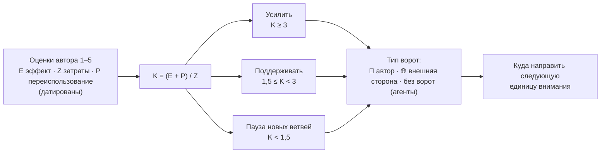

import AtlasAttentionView from '@site/src/components/AtlasAttentionView';
import bundle from './data/atlas.bundle.json';

# Внимание и приоритеты

_Создано: 12-07-2026 · Последнее обновление: 12-07-2026_

Первое из пяти представлений [атласа](https://gasyoun.github.io/SanskritGrammar/grammars/sangram/atlas).
Оно отвечает на один вопрос: **куда направлять следующую единицу внимания —
человеческого и агентного — и какой тип ворот ее сейчас запирает**.

## Как читать оценки

Каждый из 21 тезиса программы несет датированную авторскую оценку по шкале
1–5: эффект `E`, затраты `Z`, переиспользование `P`. Из них считается
коэффициент рациональности `K = (E + P) / Z`, и коэффициент определяет
вердикт: `K ≥ 3` — **усилить**, `1,5 ≤ K < 3` — **поддерживать**,
`K < 1,5` — **пауза новых ветвей**. Вердикт говорит, *сколько* внимания
направление заслуживает; тип ворот говорит, *чье* это внимание: 👤 — узкое
место автора (решение, виза, голос, креденшалы), 🌐 — внешняя сторона
(maintainers, правообладатели, подрядчики, соавторы), без маркера —
человеческих ворот нет и пропускную способность определяют агенты.

Оценки — управленческая гипотеза на дату снимка, а не измеренная истина;
дата стоит рядом с каждым числом. Летучее состояние — очереди, заявки,
счетчики, статусы PR — по [контракту данных](https://gasyoun.github.io/SanskritGrammar/grammars/sangram/atlas/data-contract)
в атлас не попадает и живет во внутренних реестрах проекта.

## Представление

Фильтры и карточки управляются с клавиатуры: кнопки фильтров — `Tab` и
стрелки ←/→ внутри группы, карточка тезиса раскрывается `Enter`/`Space`.
Каждая карточка показывает датированные оценки, вердикт, ворота с их
устойчивым описанием, свидетельство (внутренние источники называются по
имени, но по правилам санитизации не адресуются) и якорные публичные
репозитории тезиса на GitHub.

<AtlasAttentionView bundle={bundle} />

## Провенанс

Представление исполнено по слоту **B2** серии
[MEGABOOK × Sangram](https://github.com/gasyoun/Uprava/blob/main/MEGABOOK_SANGRAM_VISUALIZATION_PLAN_2026_2031.md)
(handoff [H629](https://github.com/gasyoun/Uprava/blob/main/handoffs/archive/H629-Fable_SanskritGrammar_sangram-atlas-attention-view_11.07.26.md);
обе ссылки — внутренний архив Uprava) поверх bundle контракта
[B1](https://gasyoun.github.io/SanskritGrammar/grammars/sangram/atlas/data-contract).
Представление читает **только** bundle; провенанс самого снимка данных —
дата генерации, исполнитель, источники, счетчики санитизации — показан на
[обзорной странице атласа](https://gasyoun.github.io/SanskritGrammar/grammars/sangram/atlas).
Реализация — Fable 5 (`claude-fable-5`); оценки и научная ответственность —
автор.

| Дата | Ревизия | Основание |
|---|---|---|
| 12-07-2026 | Представление 1.0: фильтры вердикт/ворота, сортировка, датированные E/Z/P/K, якорные репозитории | Слот B2, H629 |

_Dr. Mārcis Gasūns_
