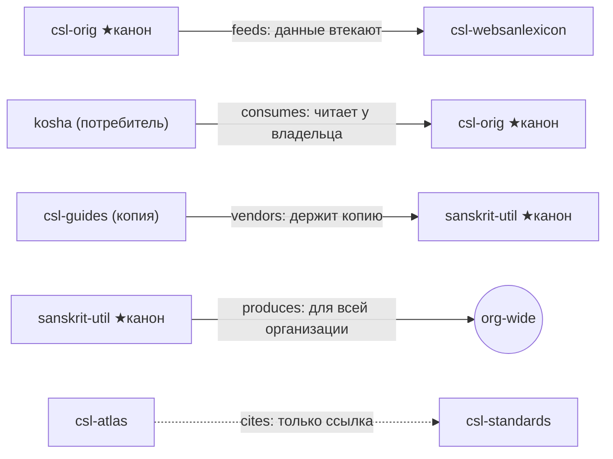

import AtlasDependencies from '@site/src/components/AtlasDependencies';
import bundle from './data/atlas.bundle.json';

# Зависимости репозиториев

_Создано: 12-07-2026 · Последнее обновление: 12-07-2026_

Четвертое из пяти представлений [атласа](https://gasyoun.github.io/SanskritGrammar/grammars/sangram/atlas).
Оно отвечает на один вопрос: **какие репозитории питают, потребляют, вендорят
и цитируют друг друга — и где для каждого актива живет канон, а где копия**.

## Как читать ребра

Каждое ребро — типизированное отношение из публичного экспорта interlinks
с направлением, активом и датированным статусом. Пять видов ребер несут
разную семантику направления, поэтому у каждого вида свой цвет **и** свой
текстовый бейдж — виды различимы и без восприятия цвета:

Репозитории сгруппированы по **программным группам census** — устойчивым
разделам приложения о покрытии канонических репозиториев (поле
`programme_ru` bundle, контракт v1.1.0). Census покрыт полностью: репозиторий
без единого типизированного ребра не исчезает, а показан пунктирной карточкой —
отсутствие ребер само по себе факт покрытия, а не пробел. Летучее состояние —
очереди, заявки, счетчики, статусы PR — по
[контракту данных](https://gasyoun.github.io/SanskritGrammar/grammars/sangram/atlas/data-contract)
в атлас не попадает.

## Представление

Поиск фильтрует карточки по имени репозитория, названию актива и контрагенту.
Кнопки-фильтры видов ребер и программных групп работают с клавиатуры
(`Tab`, `Enter`/`Space`); нажатие на имя репозитория выбирает узел — на
[едином маршруте](https://gasyoun.github.io/SanskritGrammar/grammars/sangram/atlas/unified)
выбор сохраняется при переключении представлений. Таблица «канон против
копии» собирает все вендоренные копии организации в один список
синхронизационных обязательств.

<AtlasDependencies bundle={bundle} />

## Провенанс

Представление исполнено по слоту **B5** серии
[MEGABOOK × Sangram](https://github.com/gasyoun/Uprava/blob/main/MEGABOOK_SANGRAM_VISUALIZATION_PLAN_2026_2031.md)
(handoff [H620](https://github.com/gasyoun/Uprava/blob/main/handoffs/archive/H620-Fable_SanskritGrammar_sangram-atlas-repo-dependency-view_11.07.26.md);
обе ссылки — внутренний архив Uprava) поверх bundle контракта
[B1](https://gasyoun.github.io/SanskritGrammar/grammars/sangram/atlas/data-contract).
Представление читает **только** bundle; провенанс самого снимка данных —
дата генерации, исполнитель, источники, счетчики санитизации — показан на
[обзорной странице атласа](https://gasyoun.github.io/SanskritGrammar/grammars/sangram/atlas).
Реализация — Fable 5 (`claude-fable-5`); оценки и научная ответственность —
автор.

| Дата | Ревизия | Основание |
|---|---|---|
| 12-07-2026 | Представление 1.0: направление и канон/копия по пяти видам ребер, программные группы census (`programme_ru`, контракт v1.1.0), поиск, полное покрытие census с пунктирными изолятами; в источнике исправлены два инвертированных `vendors`-ребра (vidyut) | Слот B5, H620 |

_Dr. Mārcis Gasūns_
