import AtlasProvenance from '@site/src/components/AtlasProvenance';
import bundle from './data/atlas.bundle.json';

# Происхождение данных

_Создано: 12-07-2026 · Последнее обновление: 12-07-2026_

Представление отвечает на вопрос: **из каких классов источников рождается
каждый производный слой и по каким типизированным отношениям он движется к
продуктам?** Питающие слои — сканы, издания и архивы, комментарии, переводы —
пополняют три верхнеуровневых источника (словари · корпуса · грамматики);
источники порождают производные данные; производные данные связываются в
crosswalks и typed links; те наполняют сборку, исследования и публичные
поверхности. Корпуса дополнительно **аттестуют** утверждения словарей и
грамматик — это единственное отношение, идущее внутри слоя источников.

Данные читаются только из санитизированного
[bundle](https://gasyoun.github.io/SanskritGrammar/grammars/sangram/atlas/data-contract)
(слот B1 серии); летучие статусы сюда не попадают.

```mermaid
flowchart LR
  accTitle: Цепочка происхождения данных от материалов и изданий до публичных поверхностей
  accDescr: Питающие слои — сканы и издания, комментарии, переводы — пополняют словари, корпуса и грамматики. Корпуса аттестуют словари и грамматики. Каждый источник порождает свой производный слой данных. Производные слои связываются в crosswalks и typed links, которые наполняют kosha, API и учебные карточки, а также исследования и статьи. Сборка наполняет LMS, FAQ и free funnel; исследования наполняют цитируемые releases и DH-интерфейсы.
  subgraph FEED["Материалы, издания, питающие слои"]
    SCANS["Сканы, издания, архивы"]
    COMM["Комментарии"]
    TRANS["Переводы"]
  end
  subgraph SRC["Три верхнеуровневых источника"]
    DICT["Словари: CDSL"]
    CORP["Корпуса: DCS + свидетели"]
    GRAM["Грамматики: трактаты · учебные · машиночитаемые"]
  end
  subgraph DER["Производные данные"]
    DDICT["XML, headwords, roots"]
    DCORP["SQLite, frequency, concordance"]
    DGRAM["правила, парадигмы, root crosswalks"]
  end
  XWALK["Crosswalks и typed links"]
  subgraph CONS["Сборка и потребители"]
    ASM["kosha / API / учебные карточки"]
    RES["Исследования и статьи"]
    LMS["LMS, FAQ, free funnel"]
    REL["Цитируемые releases и DH-интерфейсы"]
  end
  SCANS -->|пополняет| DICT
  SCANS -->|пополняет| CORP
  SCANS -->|пополняет| GRAM
  COMM -->|пополняет| CORP
  TRANS -->|пополняет| CORP
  CORP -.аттестует.-> DICT
  CORP -.аттестует.-> GRAM
  DICT -->|порождает| DDICT
  CORP -->|порождает| DCORP
  GRAM -->|порождает| DGRAM
  DDICT -->|связывается| XWALK
  DCORP -->|связывается| XWALK
  DGRAM -->|связывается| XWALK
  XWALK -->|наполняет| ASM
  XWALK -->|наполняет| RES
  ASM -->|наполняет| LMS
  RES -->|наполняет| REL
```

<AtlasProvenance bundle={bundle} />

_Dr. Mārcis Gasūns_
