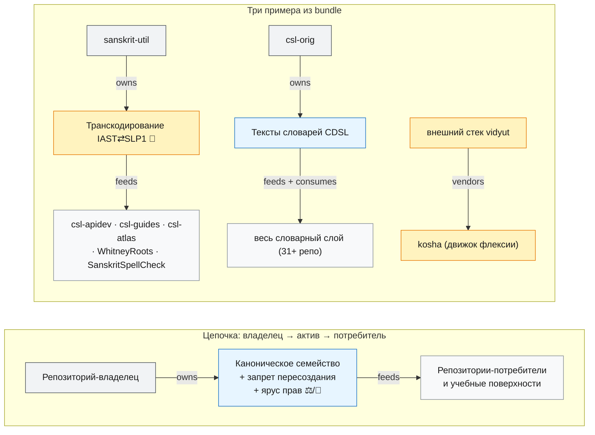

import AtlasReuseView from '@site/src/components/AtlasReuseView';
import bundle from './data/atlas.bundle.json';

# Переиспользование готовых активов

_Создано: 12-07-2026 · Последнее обновление: 12-07-2026_

Второе из пяти представлений [атласа Sangram](https://gasyoun.github.io/SanskritGrammar/grammars/sangram/atlas)
(слот B3 серии). Оно отвечает на один вопрос:
**у кого уже есть нужный актив, кто его уже потребляет и что именно запрещено
пересоздавать**. Каждое семейство активов — код, данные, схема или workflow —
имеет ровно одного канонического владельца; потребители запрашивают или
импортируют его выход, а не выводят собственную копию. Каждый запрет ниже
оплачен уже случившимся дублированием, измеренным во внутреннем census
организации, — не абстрактной осторожностью.

Представление читает только санитизированный публичный bundle по
[контракту данных](https://gasyoun.github.io/SanskritGrammar/grammars/sangram/atlas/data-contract)
(слот B1): приватные ярусы и летучие статусы туда не попадают по построению,
внутренние источники называются по имени, но не адресуются.

Как читать карточки ниже: **владелец** — единственный канонический дом
семейства; **«не пересоздавать»** — предупреждение, зачем нельзя строить
заново; **ярус прав** — ⚖️ ограничение правами (лицензия или закрытый ярус
данных за публичным builder'ом), 🧪 карантин (кандидатный слой, потребляемый
только с явной меткой), без маркера — публичный воспроизводимый актив.
Маршрут при новой задаче: это представление говорит, *кто владеет и что
запрещено*; что именно импортировать — внутренние реестры организации,
названные в свидетельствах карточек.

<AtlasReuseView bundle={bundle} />

_Dr. Mārcis Gasūns_
