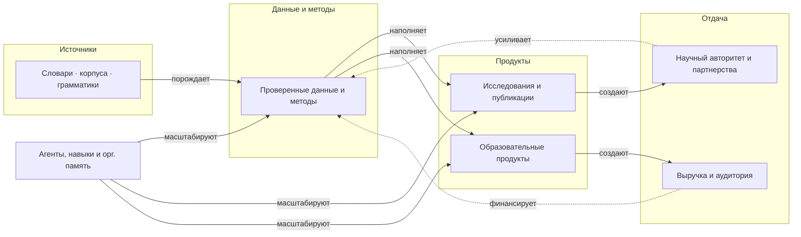

import AtlasValueChain from '@site/src/components/AtlasValueChain';
import bundle from './data/atlas.bundle.json';

# Движение от исследования к продуктам

_Создано: 12-07-2026 · Последнее обновление: 12-07-2026_

Вопрос представления: **как источники превращаются в проверенные данные,
публикации, продукты и выручку — и что возвращается обратно?** Это слот **B4**
атласа: интерактивная цепочка ценности поверх
[контракта данных](https://gasyoun.github.io/SanskritGrammar/grammars/sangram/atlas/data-contract)
(слот B1). Представление читает **только** санитизированный
[bundle](https://github.com/gasyoun/SanskritGrammar/blob/main/sangram/atlas/data/atlas.bundle.json) —
никаких обращений к внутренним реестрам. Это же представление подключено к
[единому маршруту пяти представлений](https://gasyoun.github.io/SanskritGrammar/grammars/sangram/atlas/unified?view=value-chain)
(слот B6): там выбранный узел сохраняется при переключении представлений.

## Три контура

Цепочка ценности — не одна линия, а три замкнутых контура над семью ступенями.
Два производственных контура делят общее первое звено «источники → проверенные
данные» и расходятся по типу продукта; третий — сквозной мультипликатор.

## Роли ступеней: источники и продукты не смешиваются

Каждая ступень несет ровно одну роль; типы источников и типы продуктов
непересекающиеся по построению — класс источников не может быть продуктом,
продукт не входит в источники.

| Роль | Ступени | Что это |
|---|---|---|
| Источник | Источники: словари · корпуса · грамматики | три верхнеуровневых класса онтологии источников |
| Данные и методы | Проверенные данные и методы | общий сырьевой слой обоих производственных контуров |
| Продукт | Исследования и публикации · Образовательные продукты | два непересекающихся типа продуктов |
| Отдача | Научный авторитет и партнерства · Выручка и аудитория | что продукты возвращают программе |
| Мультипликатор | Агенты, навыки и организационная память | масштабирует данные и оба типа продуктов, сам не производя ни источников, ни продуктов |

## Интерактивное представление

Выберите контур — диаграмма подсветит его ступени и типизированные ребра,
таблица ниже сузится до звеньев выбранного контура. Щелчок по ступени
открывает ее состав и связи. Каждое звено каждого контура доказано
типизированным ребром bundle: тип ребра, идентификатор ребра и свидетельство
показаны в таблице.

<AtlasValueChain bundle={bundle} />

## Данные и провенанс

- Снимок bundle: **{bundle.provenance.generated}**, генератор
  <code>{bundle.provenance.generator}</code>, исполнитель снимка —
  {bundle.provenance.generated_by}, слот снимка {bundle.provenance.series_slot}.
- Представление читает ступени цепочки ценности (<code>stage</code>,
  <code>chain: value</code>) и шесть типов ребер декларации
  <code>value-chain</code>; состав ступени источников раскрыт из узлов
  онтологии (<code>source-class</code>) того же bundle.
- Все элементы этой страницы — температуры <code>structural</code>:
  устойчивая объяснительная структура, а не оперативное состояние. Летучие
  статусы живут во внутренних реестрах и сюда не попадают.
- Формат и правила санитизации:
  [контракт данных атласа](https://gasyoun.github.io/SanskritGrammar/grammars/sangram/atlas/data-contract) ·
  [схема](https://github.com/gasyoun/SanskritGrammar/blob/main/sangram/atlas/data/atlas.schema.json) ·
  [bundle](https://github.com/gasyoun/SanskritGrammar/blob/main/sangram/atlas/data/atlas.bundle.json).

## Провенанс и ревизии

Представление исполнено по слоту B4 внутренней серии
[MEGABOOK × Sangram](https://github.com/gasyoun/Uprava/blob/main/MEGABOOK_SANGRAM_VISUALIZATION_PLAN_2026_2031.md)
(handoff [H627](https://github.com/gasyoun/Uprava/blob/main/handoffs/H627-Fable_SanskritGrammar_sangram-atlas-research-product-view_11.07.26.md);
обе ссылки — внутренний архив Uprava). Компонент, страница и проверки —
Fable 5 (`claude-fable-5`); научная и управленческая ответственность — автор.

| Дата | Ревизия | Основание |
|---|---|---|
| 12-07-2026 | Первая версия: три контура, селектор, диаграмма, таблица звеньев | Слот B4, H627 |

_Dr. Mārcis Gasūns_
