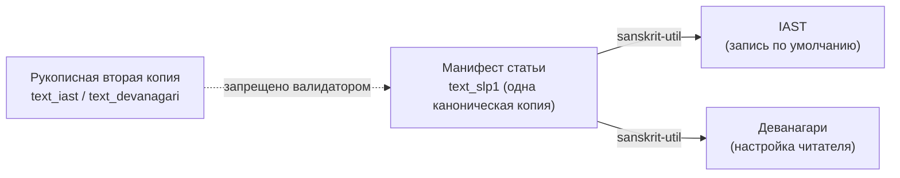

# Редакционная и i18n-схема статьи Sangram

_Создано: 12-07-2026 · Последнее обновление: 19-07-2026_

## 1. Что фиксирует контракт

[Хартия](https://gasyoun.github.io/SanskritGrammar/grammars/sangram/charter-2026-2031)
задает политику: русский — язык по умолчанию, английская локаль — по выбору
читателя; IAST — запись по умолчанию, деванагари — пользовательская
настройка; обе записи порождаются из одного канонического представления
одним каноническим преобразователем. Этот контракт — слот **C4**: он
превращает политику в машинно-проверяемую схему статьи — манифест с локалями,
слоями, устойчивыми ID примеров, локусами, переводами и провенансом — и в
валидатор, который держит эти правила зелеными при каждом коммите.



Принцип тот же, что в [контракте атласа B1](https://gasyoun.github.io/SanskritGrammar/grammars/sangram/atlas/data-contract):
манифест несет **устойчивую объяснительную структуру**, а не оперативное
состояние. Конвейерные статусы («черновик», «на рецензии», очереди, заявки)
в манифест не входят никогда; публикационная история живет как append-only
список ревизий.

## 2. Анатомия статьи

Каждая статья ядра — папка с манифестом `article.manifest.json` (единственный
источник машинной истины) и MDX-страницами локалей:

| Составляющая | Носитель | Правило |
|---|---|---|
| Метаданные, слои, локали | манифест | схема § 8; валидатор при каждом коммите |
| Примеры (текст, локус, перевод, провенанс) | манифест | устойчивые ID § 5; MDX ссылается на пример по ID, а не копирует его |
| Проза статьи | MDX по локалям | русская страница обязательна; английская — только перевод устоявшейся ревизии |
| Интерактив | существующий Docusaurus | статическое объяснение — Mermaid c `accTitle`/`accDescr`; отзывчивая верстка |

## 3. Локали: русский первичен

- **`locales.ru` обязателен всегда** — русский конвейер строится и
  стабилизируется первым (хартия, волна W1).
- **`locales.en` — перевод, не оригинал.** Поле `translated_from` обязано
  называть дату существующей ревизии из `revisions[]`: английская локаль
  никогда не опережает русскую (риск R6 хартии; старт — по воротам W2).
- Набор локалей контракта 1.x закрыт: `ru` + `en`. Расширение набора — новая
  мажорная версия контракта.
- Перевод примера (`translations.en`) опционален и подчиняется тому же
  правилу: русский перевод примера обязателен всегда.

## 4. Скрипты: одна каноническая копия

- Весь санскритский текст манифеста хранится **один раз** — в SLP1
  (ASCII, без потерь), поля `text_slp1` / `segmentation_slp1`.
- **IAST (запись по умолчанию) и деванагари (настройка читателя) — производные
  представления**, порождаемые каноническим преобразователем
  [sanskrit-util](https://github.com/gasyoun/github-spine/blob/main/SHARED_CODE.md)
  (семейство §1–2 SHARED_CODE; JS-порт вендорится из `sanskrit-util/js/`
  байт-в-байт, как в csl-guides, и никогда не правится на месте).
- Рукописная вторая копия одного примера в другой записи — дефект: валидатор
  запрещает и не-SLP1 символы в канонических полях, и сами ключи-двойники
  (`text_iast`, `text_devanagari`, `text_hk`, …) по построению.
- Ведийский слой с ударениями остается в SLP1 (знаки `/ \ ^`); классический
  санскрит — ядро, ведийские примеры идут через отдельные ворота качества
  (хартия, решение 3).

## 5. Устойчивые ID

| Сущность | Грамматика ID | Кто назначает |
|---|---|---|
| Статья | `art:<slug>` | сеть-оглавление **C2** (этот контракт фиксирует только грамматику; поле `toc_ref` остается `null` до привязки) |
| Пример | `ex:<slug-статьи>:<n>`, `n ≥ 1` | редакция статьи при первом включении примера |

ID никогда не переиспользуются — как стабильные ID узлов атласа. Снятый
пример оставляет дыру в нумерации и ревизию вида `retraction`; его номер
не освобождается. MDX-проза ссылается на пример только по ID — так один
пример живет в обоих слоях и обеих локалях без копий.

## 6. Два слоя содержания

| Слой | Назначение | Правило для примеров |
|---|---|---|
| `scientific` | корпусно верифицируемые утверждения с числами и свидетельствами | локус обязан называть реальный корпус (реестр — метод **C3**); `constructed` запрещен |
| `pedagogical` | учебное изложение, упражнения, мнемоника | допустимы сконструированные примеры с `locus.corpus = "constructed"` и внутренним свидетельством |

Статья объявляет предоставляемые слои в `layers` (непустое подмножество);
каждый пример помечен своим слоем. Педагогический слой никогда не маскирует
сконструированный пример под корпусный — это ловит валидатор.

## 7. Локус, перевод, провенанс примера

Каждый пример несет:

- **`locus`** — `corpus` (slug реестра корпусов; закрытый реестр с воротами
  качества/прав/живости — собственность метода **C3**, до его прихода
  валидатор предупреждает о незарегистрированных slug'ах), опционально
  `work`, обязательно `ref`.
- **`translations`** — русский обязателен, английский опционален (§ 3).
- **`evidence`** — правило то же, что в атласе B1: `public` требует
  `https`-URL; `internal` **запрещает** URL — внутренний источник называется,
  но не адресуется, и публичная страница никогда не ведет читателя на
  приватный ресурс.
- **`as_of`** — датированность каждого примера; страница обязана показывать
  дату рядом с примером.

Валидатор дополнительно сканирует сериализованный манифест на приватные
паттерны (внутренние hubs, файловые пути, маркеры летучих реестров);
критерий приемки — **утечка = 0**.

## 8. Файлы и инструменты

| Артефакт | Путь | Роль |
|---|---|---|
| Схема | [article.schema.json](https://github.com/gasyoun/SanskritGrammar/blob/main/sangram/editorial/data/article.schema.json) | JSON Schema 2020-12, машинная форма контракта |
| Фикстура | [article.fixture.json](https://github.com/gasyoun/SanskritGrammar/blob/main/sangram/editorial/data/article.fixture.json) | минимальный образец: оба слоя, обе локали, публичное и внутреннее свидетельство — и self-test валидатора |
| Валидатор | [scripts/article_validate.py](https://github.com/gasyoun/SanskritGrammar/blob/main/scripts/article_validate.py) | схема + редакционная семантика + одна-каноническая-копия + проверка утечек + консолидационный мораторий (§ 8b) |
| Реестр моратория | [consolidation_ledger.json](https://github.com/gasyoun/SanskritGrammar/blob/main/sangram/editorial/data/consolidation_ledger.json) + [схема](https://github.com/gasyoun/SanskritGrammar/blob/main/sangram/editorial/data/consolidation_ledger.schema.json) | машиночитаемая диспозиция 26 базовых кандидатов (H1260) |
| Обновление реестра | [scripts/consolidation_ledger_refresh.py](https://github.com/gasyoun/SanskritGrammar/blob/main/scripts/consolidation_ledger_refresh.py) | детерминированно обновляет немотивированные (не-человеческие) поля реестра, сохраняя диспозицию/примечание/ссылки |

Проверка перед каждым коммитом манифеста:

```sh
python scripts/article_validate.py --self-test
python scripts/article_validate.py sangram/editorial/data/article.fixture.json
python scripts/article_validate.py --all
python scripts/consolidation_ledger_refresh.py --check
```

## 8b. Консолидационный мораторий (freeze, с 18-07-2026)

Полное постановление и правило старшинства — [хартия § 7](https://github.com/gasyoun/SanskritGrammar/blob/main/sangram/SANGRAM_CHARTER_2026_2031.mdx)
(handoff [H1260](https://github.com/gasyoun/Uprava/blob/main/handoffs/H1260-Sonnet_SanskritGrammar_sangram-consolidation-policy-ledger_18.07.26.md)).
Здесь — только точка входа валидатора: пока `consolidation_ledger.json`
несет `freeze.active: true`, `scripts/article_validate.py` отклоняет любой
манифест с `article.toc_ref` вне замороженного набора из 35 ID (26
кандидатов + 9 опубликованных на 18-07-2026); `toc_ref: null` (тема еще не
назначена C2) — исключение. Правки, визы и диспозиции существующих 35
манифестов остаются разрешенными без ограничений.

## 9. Версионирование

`contract_version` — semver, правило атласа B1 действует дословно: внутри
мажорной версии наборы локалей, слоев, полей примера и видов ревизий **только
расширяются** (append-only); переименование или удаление, изменение семантики
поля — новая мажорная версия и согласованное обновление схемы, валидатора и
всех манифестов.

## 10. Провенанс и ревизии

Контракт исполнен по слоту C4 внутренней серии
[MEGABOOK × Sangram](https://github.com/gasyoun/Uprava/blob/main/MEGABOOK_SANGRAM_VISUALIZATION_PLAN_2026_2031.md)
(handoff [H633](https://github.com/gasyoun/Uprava/blob/main/handoffs/archive/H633-Fable_SanskritGrammar_sangram-editorial-i18n-schema_11.07.26.md);
обе ссылки — внутренний архив Uprava). Слоты C2 (сеть-оглавление, назначение
`art:`-ID) и C3 (реестр корпусов и метод свидетельств) исполнялись
параллельно; их интерфейсные точки помечены в § 5–7, сверка — чекпойнт серии.
Черновик, схема, фикстура и валидатор — Fable 5 (`claude-fable-5`); научная
и управленческая ответственность — автор.

| Дата | Ревизия | Основание |
|---|---|---|
| 12-07-2026 | Контракт 1.0.0: схема, фикстура, валидатор; интерфейсные точки C2/C3 | Слот C4, H633 |
| 19-07-2026 | Добавлен § 8b «Консолидационный мораторий» + реестр/скрипт в § 8 | Постановление автора 18-07-2026; установлено handoff H1260 |

_Dr. Mārcis Gasūns_
