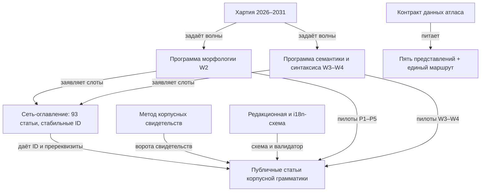

# Sangram — корпусная грамматика санскрита: обзор программы

_Создано: 14-07-2026 · Последнее обновление: 14-07-2026_

**Sangram** — публичная корпусная грамматика классического санскрита:
русский язык по умолчанию, английская локаль по выбору; IAST по умолчанию,
Devanāgarī — по настройке читателя. Каждое грамматическое утверждение
опирается на воспроизводимое корпусное свидетельство (DCS — первичный
корпус), несёт провенанс и проходит научную визу перед публикацией.
Прецедент жанра — [Русская корпусная грамматика](https://rusgram.ru/)
([описание проекта НИУ ВШЭ](https://ling.hse.ru/Projects_RusLang_RusGram)).

Эта страница — карта всей программы: двенадцать опорных документов серии
2026 года, их роли и связи. Показана **устойчивая структура** проекта;
оперативные статусы, очереди и заявки живут во внутренних реестрах и сюда
не попадают.

## Двенадцать опор программы

### Основание и редакционная система

| Документ | Роль | Связи |
|---|---|---|
| [Хартия 2026–2031](https://gasyoun.github.io/SanskritGrammar/grammars/sangram/charter-2026-2031) | учредительный документ: пять годовых волн W1–W5, управление, метрики, риски, non-goals | задаёт волны программам C5/C6; её конвейер «черновик → верификация → рецензия → виза → публикация» исполняют все статьи |
| [Сеть-оглавление статей](https://gasyoun.github.io/SanskritGrammar/grammars/sangram/toc-network-c2) | append-only реестр статей ядра: 93 статьи, 7 доменов, 117 рёбер-пререквизитов (DAG) | владеет стабильными ID статей; программы C5/C6 заявляют слоты в этот реестр, канон ID — за ним |
| [Метод корпусных свидетельств](https://gasyoun.github.io/SanskritGrammar/grammars/sangram/corpus-evidence-method) | реестр корпусов с воротами прав/живости/качества; цикл запрос → выборка → валидация → утверждение → примеры | ворота запуска каждого пилота C5/C6; правила П1–П7 гейтят количественные утверждения статей |
| [Редакционная и i18n-схема](https://gasyoun.github.io/SanskritGrammar/grammars/sangram/editorial/contract) | манифест-схема статьи: локали RU/EN, одна каноническая SLP1-копия, слои scientific/pedagogical, устойчивые ID, машинный валидатор | гейтит каждую будущую статью; потребляет ID сети-оглавления и реестр корпусов метода свидетельств |

### Тематические программы

| Документ | Роль | Связи |
|---|---|---|
| [Программа морфологии (W2)](https://gasyoun.github.io/SanskritGrammar/grammars/sangram/morphology-program) | словообразование и формальная морфология: 9 макрокластеров, метод «аттестовано / порождено / традиционно», квоты W2, пилоты P1–P5 | кластеры построены над доменами WF/MO сети-оглавления; пилоты идут через конвейер хартии и ворота метода свидетельств |
| [Программа семантики и синтаксиса (W3–W4)](https://gasyoun.github.io/SanskritGrammar/grammars/sangram/syntax-semantics-program) | грамматическая семантика, синтаксис, информационная структура, регистр: 8 кластеров, слоевая политика, 32 статейных слота, пилоты W3–W4 | граница с морфологией — «форма — C5, употребление — C6»; слоты заявлены в сеть-оглавление |

### Атлас проекта — пять представлений

[Атлас](https://gasyoun.github.io/SanskritGrammar/grammars/sangram/atlas) —
публичная карта устройства программы поверх единого санитизированного
data-слоя ([контракт данных](https://gasyoun.github.io/SanskritGrammar/grammars/sangram/atlas/data-contract)):

1. [Внимание и приоритеты](https://gasyoun.github.io/SanskritGrammar/grammars/sangram/atlas/attention) — куда направлено внимание программы и почему;
2. [Переиспользование активов](https://gasyoun.github.io/SanskritGrammar/grammars/sangram/atlas/reuse) — кто владеет готовыми активами и что запрещено пересоздавать;
3. [Цепочка ценности](https://gasyoun.github.io/SanskritGrammar/grammars/sangram/atlas/value-chain) — как исследование превращается в продукты;
4. [Зависимости репозиториев](https://gasyoun.github.io/SanskritGrammar/grammars/sangram/atlas/dependencies) — карта зависимостей экосистемы;
5. [Происхождение данных](https://gasyoun.github.io/SanskritGrammar/grammars/sangram/atlas/provenance) — путь данных от источника до страницы.

Все пять живут и на [едином маршруте](https://gasyoun.github.io/SanskritGrammar/grammars/sangram/atlas/unified)
с переключением представлений без потери выбранного узла.

## Как опоры связаны

## Граница публичного и приватного

Программа управляется из приватного стратегического хаба; публичный Sangram
получает только санитизированный, provenance-bearing срез:

- **Слой данных** (bundle атласа, реестры, схемы): внутренние свидетельства
  называются по имени, но не получают ссылок; валидатор контракта данных
  держит `leakage=0` машинно.
- **Слой документов**: подписи-провенанс внизу страниц могут ссылаться на
  внутренний архив с явной пометкой — содержание страниц от этих ссылок не
  зависит.
- Приватные очереди, заявки, личные заметки и неопубликованные данные в
  публичный срез не попадают никогда.

> Провенанс: страница создана в капстоуне серии
> [MEGABOOK × Sangram](https://github.com/gasyoun/Uprava/blob/main/MEGABOOK_SANGRAM_VISUALIZATION_PLAN_2026_2031.md)
> (handoff [H636](https://github.com/gasyoun/Uprava/blob/main/handoffs/H636-Fable_Uprava_megabook-sangram-capstone_11.07.26.md);
> обе ссылки — внутренний архив Uprava). Модель: Fable 5 (`claude-fable-5`).

_Dr. Mārcis Gasūns_
