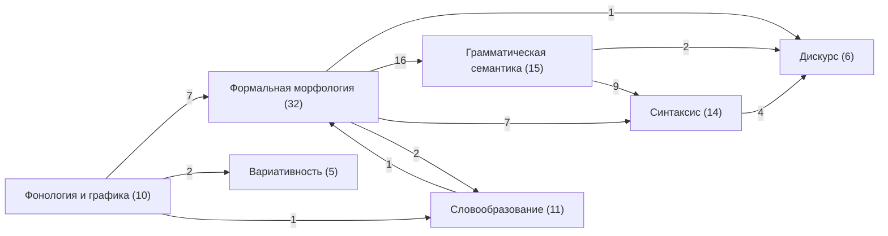

{/* AUTO-GENERATED by scripts/toc_build_pages.py from sangram/toc/data/articles.json -- do not hand-edit; edit the registry and re-run. */}

# Сеть-оглавление статей Sangram — обзор

**93 статей ядра** в **7 доменах** [хартии](../SANGRAM_CHARTER_2026_2031.mdx) § 5, **117 ребер** пререквизитов, **33 слотов** [программы C6](../SANGRAM_SYNTAX_SEMANTICS_PROGRAM_W3_W4.mdx) замаплено в реестр. Правила сети — [контракт C2](./SANGRAM_TOC_NETWORK.mdx); машиночитаемый реестр — [`articles.json`](https://github.com/gasyoun/SanskritGrammar/blob/main/sangram/toc/data/articles.json).

| Домен | Код | Статей | Кластеры |
|---|---|---|---|
| [Фонология и графика](./01-phonology-script.mdx) | PH | 10 | Звуковой состав · Графика · Морфонология · Сандхи |
| [Словообразование](./02-word-formation.mdx) | WF | 11 | Основания · Деривация · Композиты |
| [Формальная морфология](./03-formal-morphology.mdx) | MO | 32 | Склонение · Спряжение: основания · Презентные основы · Перфект, аорист, будущее · Именные формы глагола · Вторичные спряжения |
| [Грамматическая семантика](./04-grammatical-semantics.mdx) | SE | 15 | Падежная семантика · Глагольная семантика |
| [Синтаксис](./05-syntax.mdx) | SY | 14 | Простое предложение · Сложное предложение · Частицы и полярность |
| [Дискурс](./06-discourse.mdx) | DI | 6 | Частицы дискурса · Связность · Прагматика |
| [Вариативность](./07-variation.mdx) | VA | 5 | Слои |

### Зависимости между доменами

_Автогенерировано `scripts/toc_build_pages.py` из реестра C2._
