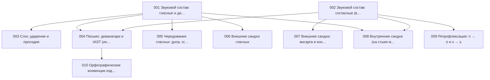

{/* AUTO-GENERATED by scripts/toc_build_pages.py from sangram/toc/data/articles.json -- do not hand-edit; edit the registry and re-run. */}

# Фонология и графика (PH)

Домен 1 из 7 сети-оглавления [C2](./SANGRAM_TOC_NETWORK.mdx): **10 статей ядра**. ID стабильны и append-only; пререквизиты — ребра сети; запрос — эскиз намерения по грамматике C2 (исполнимая форма и ворота — [метод C3](../SANGRAM_CORPUS_EVIDENCE_METHOD.mdx)).

| ID | Статья | Кластер | Пререквизиты | Уитни | Прочие свидетели | Запрос (эскиз) | Слот C6 |
|---|---|---|---|---|---|---|---|
| SG-PH-001 | **Звуковой состав: гласные и дифтонги** | Звуковой состав | — | [§19–97](https://en.wikisource.org/wiki/Sanskrit_Grammar_%28Whitney%29/Chapter_II) | Кочергина: вводные уроки (алфавит и фонетика); Гасунс: гл. о фоностатистике корня | `dcs:surface /[aAiIuUfFxeEoO]/` | — |
| SG-PH-002 | **Звуковой состав: согласные (варги)** | Звуковой состав | — | [§19–97](https://en.wikisource.org/wiki/Sanskrit_Grammar_%28Whitney%29/Chapter_II) | Кочергина: вводные уроки (алфавит и фонетика); Гасунс: Табл. варговых долей (ревизия 2026) | `dcs:surface /[kKgGNcCjJYwWqQRtTdDnpPbBmyrlvSzsh]/` | — |
| SG-PH-003 | **Слог, ударение и просодия** | Звуковой состав | SG-PH-001 | [§19–97](https://en.wikisource.org/wiki/Sanskrit_Grammar_%28Whitney%29/Chapter_II) | — | `dcs:meta accent-layer` | — |
| SG-PH-004 | **Письмо: деванагари и IAST (интерфейс графики)** | Графика | SG-PH-001, SG-PH-002 | [§1–18](https://en.wikisource.org/wiki/Sanskrit_Grammar_%28Whitney%29/Chapter_I) | Кочергина: вводные уроки (письмо деванагари) | `dcs:meta script-roundtrip` | — |
| SG-PH-005 | **Чередования гласных: guṇa, vṛddhi, ступени корня** | Морфонология | SG-PH-001 | [§235–243](https://en.wikisource.org/wiki/Sanskrit_Grammar_%28Whitney%29/Chapter_III) | Зализняк: система Рядов и позиций; Гасунс: морфонологическая запись корня (гл. 3); Толчельников: позиции и ряды (система Талмуда) | `dcs:form-class perfect|aor_root & lemma-grade join` | — |
| SG-PH-006 | **Внешние сандхи гласных** | Сандхи | SG-PH-001 | [§98–260](https://en.wikisource.org/wiki/Sanskrit_Grammar_%28Whitney%29/Chapter_III) | Кочергина: уроки сандхи гласных; Бюлер: начальные уроки (сандхи) | `dcs:surface sandhi-boundary(V+V)` | — |
| SG-PH-007 | **Внешние сандхи: висарга и конечные согласные** | Сандхи | SG-PH-002 | [§98–260](https://en.wikisource.org/wiki/Sanskrit_Grammar_%28Whitney%29/Chapter_III) | Кочергина: уроки сандхи висарги; Бюлер: начальные уроки (сандхи) | `dcs:surface sandhi-boundary(C|H)` | — |
| SG-PH-008 | **Внутренние сандхи (на стыке морфем)** | Сандхи | SG-PH-001, SG-PH-002 | [§98–260](https://en.wikisource.org/wiki/Sanskrit_Grammar_%28Whitney%29/Chapter_III) | Толчельников: морфонологические правила стыка | `dcs:form-class ppp|infinitive & stem-final join` | — |
| SG-PH-009 | **Ретрофлексация: n → ṇ и s → ṣ** | Сандхи | SG-PH-002 | [§98–260](https://en.wikisource.org/wiki/Sanskrit_Grammar_%28Whitney%29/Chapter_III) | — | `dcs:surface /[rzfF].*[nR]/ within word` | — |
| SG-PH-010 | **Орфографические конвенции изданий и корпусов (анусвара, аваграха)** | Графика | SG-PH-004 | [§1–18](https://en.wikisource.org/wiki/Sanskrit_Grammar_%28Whitney%29/Chapter_I) | — | `dcs:surface /M|~/ vs assimilated nasal` | — |

### Оговорки к запросам

- **SG-PH-001** — частоты гласных по SLP1-инвентарю на лемма-слое DCS
- **SG-PH-002** — варговые доли; сопоставимо с Табл. 5 Гасунса 2014
- **SG-PH-003** — DCS без ударения; акцентные свидетельства — VedaWeb, только через ворота C3
- **SG-PH-004** — единый канонический преобразователь sanskrit-util (политика хартии §3); статья фиксирует интерфейс записи, не правила корпуса
- **SG-PH-005** — ступени наблюдаются через сопоставление формклассов одного корня (WhitneyRoots), не прямым морфопризнаком
- **SG-PH-006** — требует несегментированного поверхностного слоя рядом с анализом DCS; исполнимая форма — ворота C3
- **SG-PH-007** — как SG-PH-006: поверхностный слой, ворота C3
- **SG-PH-008** — внутренние сандхи наблюдаемы на парах основа+суффикс (например, -ta после звонких)
- **SG-PH-009** — правило RUKI и n-ретрофлексация; проверка на словоформах DCS
- **SG-PH-010** — разнобой анусвара/класс-назальный в изданиях — источник ложных расхождений при поиске

### Пререквизиты внутри домена

### Покрытие глав Уитни другими работами (производный слой)

Автоматическая первичная разметка по [предметному конкордансу](https://github.com/gasyoun/SanskritGrammar/blob/main/SubjectConcordance/catalog.mdx) (куррированный ключевой лексикон, не филологическая карта): ● — покрыто, ○ — упомянуто, — — не найдено. Куррированные свидетели каждой статьи — в таблице выше и в реестре.

| Глава Уитни | §§ | Апте | Бюлер | Гасунс | Кнауэр | Кочергина | Толчельников | Зализняк | Зализняк | Зализняк |
|---|---|---|---|---|---|---|---|---|---|---|
| I | 1–18 | ○ | ○ | ● | ○ | ● | ○ | — | ● | ● |
| II | 19–97 | — | ○ | ● | — | ● | ● | ● | ● | ● |
| III | 98–260 | ○ | ○ | ● | — | ● | ● | — | ● | ● |

_Автогенерировано `scripts/toc_build_pages.py` из реестра C2._
