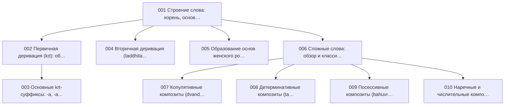

{/* AUTO-GENERATED by scripts/toc_build_pages.py from sangram/toc/data/articles.json -- do not hand-edit; edit the registry and re-run. */}

# Словообразование (WF)

Домен 2 из 7 сети-оглавления [C2](./SANGRAM_TOC_NETWORK.mdx): **11 статей ядра**. ID стабильны и append-only; пререквизиты — ребра сети; запрос — эскиз намерения по грамматике C2 (исполнимая форма и ворота — [метод C3](../SANGRAM_CORPUS_EVIDENCE_METHOD.mdx)).

| ID | Статья | Кластер | Пререквизиты | Уитни | Прочие свидетели | Запрос (эскиз) | Слот C6 |
|---|---|---|---|---|---|---|---|
| SG-WF-001 | **Строение слова: корень, основа, аффикс** | Основания | SG-PH-005 | [§321–474](https://en.wikisource.org/wiki/Sanskrit_Grammar_%28Whitney%29/Chapter_V) | Гасунс: морфемный строй корня (весь труд); Зализняк: модель корня и позиций; Толчельников: непаниниевская модель слова | `dcs:lemma root-join(WhitneyRoots)` | — |
| SG-WF-002 | **Первичная деривация (kṛt): обзор** | Деривация | SG-WF-001 | [§1136–1245](https://en.wikisource.org/wiki/Sanskrit_Grammar_%28Whitney%29/Chapter_XVII) | Гасунс: производные от корня (приложения) | `dcs:lemma suffix-strata(kṛt) via MW etymology` | — |
| SG-WF-003 | **Основные kṛt-суффиксы: -a, -ana, -ti, -tṛ, -in** | Деривация | SG-WF-002 | [§1136–1245](https://en.wikisource.org/wiki/Sanskrit_Grammar_%28Whitney%29/Chapter_XVII) | — | `dcs:lemma /(ana|ti|tf|in)$/ & MW-derivation check` | — |
| SG-WF-004 | **Вторичная деривация (taddhita): обзор** | Деривация | SG-WF-001 | [§1136–1245](https://en.wikisource.org/wiki/Sanskrit_Grammar_%28Whitney%29/Chapter_XVII) | — | `dcs:lemma suffix-strata(taddhita) via MW etymology` | — |
| SG-WF-005 | **Образование основ женского рода** | Деривация | SG-WF-001, SG-MO-001 | [§321–474](https://en.wikisource.org/wiki/Sanskrit_Grammar_%28Whitney%29/Chapter_V) | Кочергина: уроки основ на -ā, -ī | `dcs:morph Gender=Fem & lemma-pair join(masc)` | — |
| SG-WF-006 | **Сложные слова: обзор и классификация** | Композиты | SG-WF-001 | [§1246–1316](https://en.wikisource.org/wiki/Sanskrit_Grammar_%28Whitney%29/Chapter_XVIII) | Кочергина: уроки сложных слов; Толчельников: раздел о композитах | `dcs:morph Compound=Yes` | — |
| SG-WF-007 | **Копулятивные композиты (dvandva)** | Композиты | SG-WF-006 | [§1246–1316](https://en.wikisource.org/wiki/Sanskrit_Grammar_%28Whitney%29/Chapter_XVIII) | Бюлер: уроки композитов | `dcs:morph Compound=Yes & type=dvandva-sample` | — |
| SG-WF-008 | **Детерминативные композиты (tatpuruṣa, karmadhāraya)** | Композиты | SG-WF-006 | [§1246–1316](https://en.wikisource.org/wiki/Sanskrit_Grammar_%28Whitney%29/Chapter_XVIII) | Бюлер: уроки композитов | `dcs:morph Compound=Yes & type=tatpurusha-sample` | — |
| SG-WF-009 | **Посессивные композиты (bahuvrīhi)** | Композиты | SG-WF-006 | [§1246–1316](https://en.wikisource.org/wiki/Sanskrit_Grammar_%28Whitney%29/Chapter_XVIII) | Апте: уроки об употреблении композитов | `dcs:morph Compound=Yes & external-agreement check` | — |
| SG-WF-010 | **Наречные и числительные композиты (avyayībhāva, dvigu)** | Композиты | SG-WF-006 | [§1246–1316](https://en.wikisource.org/wiki/Sanskrit_Grammar_%28Whitney%29/Chapter_XVIII) | — | `dcs:morph Compound=Yes & first-member ∈ {adv, num}` | — |
| SG-WF-011 | **Глаголы с превербами (upasarga)** | Композиты | SG-MO-012 | [§1076–1095](https://en.wikisource.org/wiki/Sanskrit_Grammar_%28Whitney%29/Chapter_XV) | Кочергина: уроки глагольных приставок | `dcs:form-class verb_compounds` | — |

### Оговорки к запросам

- **SG-WF-001** — корневой инвентарь — WhitneyRoots и mw_roots.tsv, не пересоздается (non-goal хартии №3)
- **SG-WF-002** — суффиксальная разметка не в DCS; join через словарные деривации CDSL
- **SG-WF-003** — поверхностный отбор по исходу леммы валидируется словарной деривацией — иначе ложные членения
- **SG-WF-004** — как SG-WF-002
- **SG-WF-005** — пары m./f. одного деривационного гнезда
- **SG-WF-006** — DCS размечает членение композитов — базовая выборка для всех статей кластера
- **SG-WF-007** — тип композита в DCS не размечен — классификация выборки вручную по методу C3
- **SG-WF-008** — как SG-WF-007
- **SG-WF-009** — диагностика bahuvrīhi — согласование с внешним именем
- **SG-WF-011** — DCS лемматизирует преверб+корень единой леммой — выборка по лемма-инвентарю с превербами

### Пререквизиты внутри домена

### Пререквизиты из других доменов

- SG-WF-001 ← **SG-PH-005** (Чередования гласных: guṇa, vṛddhi, ступени корня)
- SG-WF-005 ← **SG-MO-001** (Склонение: категории и обзор системы)
- SG-WF-011 ← **SG-MO-012** (Спряжение: категории и обзор системы)

### Покрытие глав Уитни другими работами (производный слой)

Автоматическая первичная разметка по [предметному конкордансу](https://github.com/gasyoun/SanskritGrammar/blob/main/SubjectConcordance/catalog.mdx) (куррированный ключевой лексикон, не филологическая карта): ● — покрыто, ○ — упомянуто, — — не найдено. Куррированные свидетели каждой статьи — в таблице выше и в реестре.

| Глава Уитни | §§ | Апте | Бюлер | Гасунс | Кнауэр | Кочергина | Толчельников | Зализняк | Зализняк | Зализняк |
|---|---|---|---|---|---|---|---|---|---|---|
| V | 321–474 | ● | ● | ● | — | ● | ● | ○ | ● | ● |
| XV | 1069–1095 | — | — | ○ | — | ○ | — | — | — | — |
| XVII | 1136–1245 | ○ | ○ | ● | ○ | ○ | ● | ○ | ○ | ○ |
| XVIII | 1246–1316 | ○ | ● | — | — | ● | ● | — | ● | ● |

_Автогенерировано `scripts/toc_build_pages.py` из реестра C2._
