{/* AUTO-GENERATED by scripts/toc_build_pages.py from sangram/toc/data/articles.json -- do not hand-edit; edit the registry and re-run. */}

# Формальная морфология (MO)

Домен 3 из 7 сети-оглавления [C2](./SANGRAM_TOC_NETWORK.mdx): **32 статей ядра**. ID стабильны и append-only; пререквизиты — ребра сети; запрос — эскиз намерения по грамматике C2 (исполнимая форма и ворота — [метод C3](../SANGRAM_CORPUS_EVIDENCE_METHOD.mdx)).

| ID | Статья | Кластер | Пререквизиты | Уитни | Прочие свидетели | Запрос (эскиз) | Слот C6 |
|---|---|---|---|---|---|---|---|
| SG-MO-001 | **Склонение: категории и обзор системы** | Склонение | SG-PH-006 | [§261–320](https://en.wikisource.org/wiki/Sanskrit_Grammar_%28Whitney%29/Chapter_IV) | Кочергина: уроки склонения (сводно); Зализняк: очерк: именное склонение | `dcs:morph POS=NOUN & Case=* & Number=*` | — |
| SG-MO-002 | **Основы на -a** | Склонение | SG-MO-001 | [§321–474](https://en.wikisource.org/wiki/Sanskrit_Grammar_%28Whitney%29/Chapter_V) | Кочергина: первые уроки склонения; Бюлер: начальные уроки | `dcs:morph POS=NOUN & stem-final=a` | — |
| SG-MO-003 | **Основы на -ā, -ī, -ū** | Склонение | SG-MO-001 | [§321–474](https://en.wikisource.org/wiki/Sanskrit_Grammar_%28Whitney%29/Chapter_V) | Кочергина: уроки женских основ | `dcs:morph POS=NOUN & stem-final ∈ {A, I, U}` | — |
| SG-MO-004 | **Основы на -i, -u** | Склонение | SG-MO-001 | [§321–474](https://en.wikisource.org/wiki/Sanskrit_Grammar_%28Whitney%29/Chapter_V) | Кочергина: уроки i/u-основ | `dcs:morph POS=NOUN & stem-final ∈ {i, u}` | — |
| SG-MO-005 | **Основы на -ṛ (имена деятеля и родства)** | Склонение | SG-MO-001 | [§321–474](https://en.wikisource.org/wiki/Sanskrit_Grammar_%28Whitney%29/Chapter_V) | Кочергина: урок основ на -ṛ | `dcs:morph POS=NOUN & stem-final=f` | — |
| SG-MO-006 | **Корневые и односложные согласные основы** | Склонение | SG-MO-001, SG-PH-008 | [§321–474](https://en.wikisource.org/wiki/Sanskrit_Grammar_%28Whitney%29/Chapter_V) | Зализняк: очерк: согласное склонение | `dcs:morph POS=NOUN & stem-final=C` | — |
| SG-MO-007 | **Основы на -an и -in** | Склонение | SG-MO-006 | [§321–474](https://en.wikisource.org/wiki/Sanskrit_Grammar_%28Whitney%29/Chapter_V) | Кочергина: уроки основ на -an/-in | `dcs:morph POS=NOUN & stem-final ∈ {an, in}` | — |
| SG-MO-008 | **Основы на -ant, -vāṅs, -yāṅs (причастные и компаративные)** | Склонение | SG-MO-006 | [§321–474](https://en.wikisource.org/wiki/Sanskrit_Grammar_%28Whitney%29/Chapter_V) | Зализняк: очерк: причастные основы | `dcs:morph VerbForm=Part & Case=*` | — |
| SG-MO-009 | **Степени сравнения** | Склонение | SG-MO-002 | [§321–474](https://en.wikisource.org/wiki/Sanskrit_Grammar_%28Whitney%29/Chapter_V) | Кочергина: урок степеней сравнения | `dcs:morph Degree ∈ {Cmp, Sup}` | — |
| SG-MO-010 | **Местоимения** | Склонение | SG-MO-001 | [§490–526](https://en.wikisource.org/wiki/Sanskrit_Grammar_%28Whitney%29/Chapter_VII) | Кочергина: уроки местоимений | `dcs:morph POS=PRON & lemma ∈ {tad, etad, idam, adas, yad, kim, asmad, yuṣmad}` | — |
| SG-MO-011 | **Числительные** | Склонение | SG-MO-001 | [§475–489](https://en.wikisource.org/wiki/Sanskrit_Grammar_%28Whitney%29/Chapter_VI) | Кочергина: уроки числительных | `dcs:morph POS=NUM` | — |
| SG-MO-012 | **Спряжение: категории и обзор системы** | Спряжение: основания | SG-PH-005 | [§527–598](https://en.wikisource.org/wiki/Sanskrit_Grammar_%28Whitney%29/Chapter_VIII) | Зализняк: морфоклассы глагола (система статьи); Толчельников: глагольная система Талмуда; Гасунс: глагольная статистика корней | `dcs:morph POS=VERB & VerbForm=Fin` | — |
| SG-MO-013 | **Презенс: тематические классы (I, IV, VI, X)** | Презентные основы | SG-MO-012 | [§733–750](https://en.wikisource.org/wiki/Sanskrit_Grammar_%28Whitney%29/Chapter_IX); [§759–767](https://en.wikisource.org/wiki/Sanskrit_Grammar_%28Whitney%29/Chapter_IX); [§751–758](https://en.wikisource.org/wiki/Sanskrit_Grammar_%28Whitney%29/Chapter_IX); [§775](https://en.wikisource.org/wiki/Sanskrit_Grammar_%28Whitney%29/Chapter_IX) | Кочергина: первые уроки глагола (I, IV, VI, X классы); Бюлер: начальные уроки глагола; Зализняк: тематические морфоклассы | `dcs:form-class present_a|present_ya|present_acc_a|present_cur` | — |
| SG-MO-014 | **Презенс: корневой и редуплицирующий классы (II, III)** | Презентные основы | SG-MO-012, SG-PH-005 | [§611–641](https://en.wikisource.org/wiki/Sanskrit_Grammar_%28Whitney%29/Chapter_IX); [§642–682](https://en.wikisource.org/wiki/Sanskrit_Grammar_%28Whitney%29/Chapter_IX) | Зализняк: атематические морфоклассы; Кочергина: уроки атематических глаголов | `dcs:form-class present_root|present_redup` | — |
| SG-MO-015 | **Презенс: носовые классы (V, VII, VIII, IX)** | Презентные основы | SG-MO-012 | [§683–696](https://en.wikisource.org/wiki/Sanskrit_Grammar_%28Whitney%29/Chapter_IX); [§697–716](https://en.wikisource.org/wiki/Sanskrit_Grammar_%28Whitney%29/Chapter_IX); [§717–732](https://en.wikisource.org/wiki/Sanskrit_Grammar_%28Whitney%29/Chapter_IX) | Зализняк: носовые морфоклассы | `dcs:form-class present_nasal|present_nu_u|present_na` | — |
| SG-MO-016 | **Имперфект и аугмент** | Презентные основы | SG-MO-012 | [§527–598](https://en.wikisource.org/wiki/Sanskrit_Grammar_%28Whitney%29/Chapter_VIII) | Кочергина: уроки имперфекта | `dcs:morph Tense=Impf|Past & VerbForm=Fin & form-class present_*` | — |
| SG-MO-017 | **Перфект** | Перфект, аорист, будущее | SG-MO-012, SG-PH-005 | [§781–823](https://en.wikisource.org/wiki/Sanskrit_Grammar_%28Whitney%29/Chapter_X) | Зализняк: перфектный морфокласс и ступени; Кочергина: уроки перфекта | `dcs:form-class perfect` | — |
| SG-MO-018 | **Аорист: классификация и простые типы (корневой, a-аорист)** | Перфект, аорист, будущее | SG-MO-016 | [§824–827](https://en.wikisource.org/wiki/Sanskrit_Grammar_%28Whitney%29/Chapter_XI); [§828–846](https://en.wikisource.org/wiki/Sanskrit_Grammar_%28Whitney%29/Chapter_XI); [§847–855](https://en.wikisource.org/wiki/Sanskrit_Grammar_%28Whitney%29/Chapter_XI) | Зализняк: аористные морфоклассы; Кочергина: уроки аориста | `dcs:form-class aor_root|aor_a` | — |
| SG-MO-019 | **Аорист: редуплицированный и сигматические типы** | Перфект, аорист, будущее | SG-MO-018 | [§856–873](https://en.wikisource.org/wiki/Sanskrit_Grammar_%28Whitney%29/Chapter_XI); [§878–897](https://en.wikisource.org/wiki/Sanskrit_Grammar_%28Whitney%29/Chapter_XI); [§898–911](https://en.wikisource.org/wiki/Sanskrit_Grammar_%28Whitney%29/Chapter_XI); [§912–915](https://en.wikisource.org/wiki/Sanskrit_Grammar_%28Whitney%29/Chapter_XI); [§916–920](https://en.wikisource.org/wiki/Sanskrit_Grammar_%28Whitney%29/Chapter_XI) | Зализняк: сигматические морфоклассы | `dcs:form-class aor_redup|aor_s|aor_is|aor_sis|aor_sa` | — |
| SG-MO-020 | **Прекатив (бенедиктив)** | Перфект, аорист, будущее | SG-MO-018 | [§921–926](https://en.wikisource.org/wiki/Sanskrit_Grammar_%28Whitney%29/Chapter_XI) | — | `dcs:form-class precative` | — |
| SG-MO-021 | **Будущее время и кондиционал** | Перфект, аорист, будущее | SG-MO-012 | [§931–940](https://en.wikisource.org/wiki/Sanskrit_Grammar_%28Whitney%29/Chapter_XII); [§941](https://en.wikisource.org/wiki/Sanskrit_Grammar_%28Whitney%29/Chapter_XII); [§942–949](https://en.wikisource.org/wiki/Sanskrit_Grammar_%28Whitney%29/Chapter_XII) | Кочергина: уроки будущего времени; Апте: уроки об употреблении будущих | `dcs:morph Tense=Fut | form-class s_future|periphrastic_future` | — |
| SG-MO-022 | **Причастия презенса и перфекта** | Именные формы глагола | SG-MO-013, SG-MO-017 | [§583–584](https://en.wikisource.org/wiki/Sanskrit_Grammar_%28Whitney%29/Chapter_VIII); [§802–806](https://en.wikisource.org/wiki/Sanskrit_Grammar_%28Whitney%29/Chapter_X) | Зализняк: очерк: причастия | `dcs:form-class present_participle|perfect_participle` | — |
| SG-MO-023 | **Причастия на -ta/-na и -tavant** | Именные формы глагола | SG-MO-012 | [§952–958](https://en.wikisource.org/wiki/Sanskrit_Grammar_%28Whitney%29/Chapter_XIII); [§959–960](https://en.wikisource.org/wiki/Sanskrit_Grammar_%28Whitney%29/Chapter_XIII) | Кочергина: уроки причастия на -ta; Бюлер: уроки причастий | `dcs:form-class ppp|past_active_participle` | — |
| SG-MO-024 | **Герундив (причастие долженствования)** | Именные формы глагола | SG-MO-012 | [§961–966](https://en.wikisource.org/wiki/Sanskrit_Grammar_%28Whitney%29/Chapter_XIII) | Кочергина: урок герундива | `dcs:form-class gerundive` | — |
| SG-MO-025 | **Инфинитив** | Именные формы глагола | SG-MO-012 | [§968–979](https://en.wikisource.org/wiki/Sanskrit_Grammar_%28Whitney%29/Chapter_XIII) | Кочергина: урок инфинитива | `dcs:morph VerbForm=Inf` | — |
| SG-MO-026 | **Абсолютив (деепричастие на -tvā, -ya)** | Именные формы глагола | SG-MO-012 | [§989–994](https://en.wikisource.org/wiki/Sanskrit_Grammar_%28Whitney%29/Chapter_XIII); [§995](https://en.wikisource.org/wiki/Sanskrit_Grammar_%28Whitney%29/Chapter_XIII) | Кочергина: уроки деепричастия; Бюлер: уроки абсолютива | `dcs:morph VerbForm=Conv` | — |
| SG-MO-027 | **Пассив: yá-презенс и аорист на -i** | Вторичные спряжения | SG-MO-013 | [§768–774](https://en.wikisource.org/wiki/Sanskrit_Grammar_%28Whitney%29/Chapter_IX); [§998–999](https://en.wikisource.org/wiki/Sanskrit_Grammar_%28Whitney%29/Chapter_XIV); [§843](https://en.wikisource.org/wiki/Sanskrit_Grammar_%28Whitney%29/Chapter_XI) | Кочергина: уроки пассива | `dcs:morph Voice=Pass | form-class passive_present` | — |
| SG-MO-028 | **Каузатив** | Вторичные спряжения | SG-MO-012, SG-PH-005 | [§1041–1052](https://en.wikisource.org/wiki/Sanskrit_Grammar_%28Whitney%29/Chapter_XIV) | Кочергина: уроки каузатива; Зализняк: каузативный морфокласс | `dcs:form-class causative` | — |
| SG-MO-029 | **Дезидератив** | Вторичные спряжения | SG-MO-012 | [§1026–1040](https://en.wikisource.org/wiki/Sanskrit_Grammar_%28Whitney%29/Chapter_XIV) | Зализняк: дезидеративный морфокласс | `dcs:form-class desiderative` | — |
| SG-MO-030 | **Интенсив** | Вторичные спряжения | SG-MO-012, SG-PH-005 | [§1000–1025](https://en.wikisource.org/wiki/Sanskrit_Grammar_%28Whitney%29/Chapter_XIV) | — | `dcs:form-class intensive` | — |
| SG-MO-031 | **Деноминатив** | Вторичные спряжения | SG-MO-012, SG-WF-004 | [§1053–1068](https://en.wikisource.org/wiki/Sanskrit_Grammar_%28Whitney%29/Chapter_XIV) | — | `dcs:form-class denominative` | — |
| SG-MO-032 | **Перифрастический перфект** | Вторичные спряжения | SG-MO-017 | [§1070–1073](https://en.wikisource.org/wiki/Sanskrit_Grammar_%28Whitney%29/Chapter_XV) | — | `dcs:form-class periphrastic_perfect` | — |

### Оговорки к запросам

- **SG-MO-001** — матрица падеж×число как базовая частотная рамка домена
- **SG-MO-002** — тип основы через лемма-исход + словарный род
- **SG-MO-005** — контраст vṛddhi/guṇa в сильных падежах деятеля vs родства
- **SG-MO-006** — конечные кластеры основ дают внутренние сандхи в падежных формах
- **SG-MO-007** — сильные/слабые/слабейшие ступени основы
- **SG-MO-008** — склонение причастий — мост к SG-MO-022/023
- **SG-MO-009** — распределение -tara/-tama против -īyas/-iṣṭha
- **SG-MO-012** — рамка лицо×число×время×наклонение×залог; классы презенса — join WhitneyRoots (SG-MO-013…015)
- **SG-MO-013** — класс презенса не в морфопризнаках DCS — join через классный инвентарь WhitneyRoots
- **SG-MO-014** — чередование сильной/слабой основы внутри парадигмы
- **SG-MO-016** — UD-разметка DCS сглаживает прошедшие (Tense=Past покрывает имперфект/аорист/перфект — наблюдение VisualDCS); отбирать по форме основы, не по одному признаку Tense
- **SG-MO-017** — та же оговорка о Tense=Past, что в SG-MO-016: отбор по редупликации формкласса, не по UD-признаку
- **SG-MO-018** — оговорка Tense=Past как в SG-MO-016
- **SG-MO-020** — редкая форма — правило хартии R5: нет доверительного интервала, нет количественного утверждения
- **SG-MO-021** — контраст простого и перифрастического будущего
- **SG-MO-023** — самая частотная предикативная форма классической прозы — мост к SG-SY-008
- **SG-MO-024** — распределение -tavya/-anīya/-ya
- **SG-MO-026** — распределение -tvā (простой корень) vs -ya (с превербом)
- **SG-MO-028** — vṛddhi-ступень корня перед -aya-
- **SG-MO-030** — редкая категория — правило R5 о доверительных интервалах
- **SG-MO-032** — -ām + вспомогательный: связка с каузативами и деноминативами

### Пререквизиты внутри домена

```mermaid
flowchart TD
  accTitle: Пререквизиты внутри домена Формальная морфология
  accDescr: Ориентированный ациклический граф: ребро ведет от статьи-пререквизита к статье, которая на нее опирается.
  SG_MO_001["001 Склонение: категории и обзор…"]
  SG_MO_002["002 Основы на -a"]
  SG_MO_003["003 Основы на -ā, -ī, -ū"]
  SG_MO_004["004 Основы на -i, -u"]
  SG_MO_005["005 Основы на -ṛ (имена деятеля и…"]
  SG_MO_006["006 Корневые и односложные соглас…"]
  SG_MO_007["007 Основы на -an и -in"]
  SG_MO_008["008 Основы на -ant, -vāṅs, -yāṅs…"]
  SG_MO_009["009 Степени сравнения"]
  SG_MO_010["010 Местоимения"]
  SG_MO_011["011 Числительные"]
  SG_MO_012["012 Спряжение: категории и обзор…"]
  SG_MO_013["013 Презенс: тематические классы…"]
  SG_MO_014["014 Презенс: корневой и редуплици…"]
  SG_MO_015["015 Презенс: носовые классы (V, V…"]
  SG_MO_016["016 Имперфект и аугмент"]
  SG_MO_017["017 Перфект"]
  SG_MO_018["018 Аорист: классификация и прост…"]
  SG_MO_019["019 Аорист: редуплицированный и с…"]
  SG_MO_020["020 Прекатив (бенедиктив)"]
  SG_MO_021["021 Будущее время и кондиционал"]
  SG_MO_022["022 Причастия презенса и перфекта"]
  SG_MO_023["023 Причастия на -ta/-na и -tavant"]
  SG_MO_024["024 Герундив (причастие долженств…"]
  SG_MO_025["025 Инфинитив"]
  SG_MO_026["026 Абсолютив (деепричастие на -t…"]
  SG_MO_027["027 Пассив: yá-презенс и аорист н…"]
  SG_MO_028["028 Каузатив"]
  SG_MO_029["029 Дезидератив"]
  SG_MO_030["030 Интенсив"]
  SG_MO_031["031 Деноминатив"]
  SG_MO_032["032 Перифрастический перфект"]
  SG_MO_001 --> SG_MO_002
  SG_MO_001 --> SG_MO_003
  SG_MO_001 --> SG_MO_004
  SG_MO_001 --> SG_MO_005
  SG_MO_001 --> SG_MO_006
  SG_MO_006 --> SG_MO_007
  SG_MO_006 --> SG_MO_008
  SG_MO_002 --> SG_MO_009
  SG_MO_001 --> SG_MO_010
  SG_MO_001 --> SG_MO_011
  SG_MO_012 --> SG_MO_013
  SG_MO_012 --> SG_MO_014
  SG_MO_012 --> SG_MO_015
  SG_MO_012 --> SG_MO_016
  SG_MO_012 --> SG_MO_017
  SG_MO_016 --> SG_MO_018
  SG_MO_018 --> SG_MO_019
  SG_MO_018 --> SG_MO_020
  SG_MO_012 --> SG_MO_021
  SG_MO_013 --> SG_MO_022
  SG_MO_017 --> SG_MO_022
  SG_MO_012 --> SG_MO_023
  SG_MO_012 --> SG_MO_024
  SG_MO_012 --> SG_MO_025
  SG_MO_012 --> SG_MO_026
  SG_MO_013 --> SG_MO_027
  SG_MO_012 --> SG_MO_028
  SG_MO_012 --> SG_MO_029
  SG_MO_012 --> SG_MO_030
  SG_MO_012 --> SG_MO_031
  SG_MO_017 --> SG_MO_032
```

### Пререквизиты из других доменов

- SG-MO-001 ← **SG-PH-006** (Внешние сандхи гласных)
- SG-MO-006 ← **SG-PH-008** (Внутренние сандхи (на стыке морфем))
- SG-MO-012 ← **SG-PH-005** (Чередования гласных: guṇa, vṛddhi, ступени корня)
- SG-MO-014 ← **SG-PH-005** (Чередования гласных: guṇa, vṛddhi, ступени корня)
- SG-MO-017 ← **SG-PH-005** (Чередования гласных: guṇa, vṛddhi, ступени корня)
- SG-MO-028 ← **SG-PH-005** (Чередования гласных: guṇa, vṛddhi, ступени корня)
- SG-MO-030 ← **SG-PH-005** (Чередования гласных: guṇa, vṛddhi, ступени корня)
- SG-MO-031 ← **SG-WF-004** (Вторичная деривация (taddhita): обзор)

### Покрытие глав Уитни другими работами (производный слой)

Автоматическая первичная разметка по [предметному конкордансу](https://github.com/gasyoun/SanskritGrammar/blob/main/SubjectConcordance/catalog.mdx) (куррированный ключевой лексикон, не филологическая карта): ● — покрыто, ○ — упомянуто, — — не найдено. Куррированные свидетели каждой статьи — в таблице выше и в реестре.

| Глава Уитни | §§ | Апте | Бюлер | Гасунс | Кнауэр | Кочергина | Толчельников | Зализняк | Зализняк | Зализняк |
|---|---|---|---|---|---|---|---|---|---|---|
| IV | 261–320 | ○ | ○ | ○ | — | ○ | ○ | — | ○ | ○ |
| V | 321–474 | ● | ● | ● | — | ● | ● | ○ | ● | ● |
| VI | 475–489 | ○ | ○ | — | — | ○ | ○ | ○ | ○ | ○ |
| VII | 490–526 | ○ | ○ | ○ | — | ○ | ○ | — | ○ | ○ |
| VIII | 527–598 | — | ○ | ● | — | ○ | ○ | ○ | ○ | ○ |
| IX | 599–779 | ○ | ○ | ● | — | ○ | ○ | ○ | ○ | ○ |
| X | 780–823 | ○ | ○ | ○ | — | ○ | ○ | ○ | ○ | ○ |
| XI | 824–930 | ○ | ○ | ● | — | ● | ○ | ○ | ○ | ○ |
| XII | 931–950 | ● | ○ | ○ | — | ● | ○ | ○ | ○ | ○ |
| XIII | 951–995 | ● | ● | ○ | — | ● | ● | ● | ● | ● |
| XIV | 996–1068 | ● | ○ | ○ | — | ● | ● | ● | ● | ● |
| XV | 1069–1095 | — | — | ○ | — | ○ | — | — | — | — |

_Автогенерировано `scripts/toc_build_pages.py` из реестра C2._
