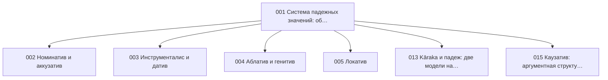

{/* AUTO-GENERATED by scripts/toc_build_pages.py from sangram/toc/data/articles.json -- do not hand-edit; edit the registry and re-run. */}

# Грамматическая семантика (SE)

Домен 4 из 7 сети-оглавления [C2](./SANGRAM_TOC_NETWORK.mdx): **15 статей ядра**. ID стабильны и append-only; пререквизиты — ребра сети; запрос — эскиз намерения по грамматике C2 (исполнимая форма и ворота — [метод C3](../SANGRAM_CORPUS_EVIDENCE_METHOD.mdx)).

| ID | Статья | Кластер | Пререквизиты | Уитни | Прочие свидетели | Запрос (эскиз) | Слот C6 |
|---|---|---|---|---|---|---|---|
| SG-SE-001 | **Система падежных значений: обзор** | Падежная семантика | SG-MO-001 | [§261–320](https://en.wikisource.org/wiki/Sanskrit_Grammar_%28Whitney%29/Chapter_IV) | Апте: уроки падежного управления | `dcs:morph Case=* & verb-frame join` | `sem-a-case-overview` |
| SG-SE-002 | **Номинатив и аккузатив** | Падежная семантика | SG-SE-001 | [§261–320](https://en.wikisource.org/wiki/Sanskrit_Grammar_%28Whitney%29/Chapter_IV) | Апте: уроки о подлежащем и прямом дополнении | `dcs:morph Case=Nom|Acc & deprel` | — |
| SG-SE-003 | **Инструменталис и датив** | Падежная семантика | SG-SE-001 | [§261–320](https://en.wikisource.org/wiki/Sanskrit_Grammar_%28Whitney%29/Chapter_IV) | Апте: уроки творительного и дательного | `dcs:morph Case=Ins|Dat & deprel` | `sem-a-instrumental`, `sem-a-dative-experiencer` |
| SG-SE-004 | **Аблатив и генитив** | Падежная семантика | SG-SE-001 | [§261–320](https://en.wikisource.org/wiki/Sanskrit_Grammar_%28Whitney%29/Chapter_IV) | Апте: уроки родительного и исходного | `dcs:morph Case=Abl|Gen & deprel` | `sem-a-genitive` |
| SG-SE-005 | **Локатив** | Падежная семантика | SG-SE-001 | [§261–320](https://en.wikisource.org/wiki/Sanskrit_Grammar_%28Whitney%29/Chapter_IV) | Апте: уроки местного падежа | `dcs:morph Case=Loc & deprel` | `sem-a-locative` |
| SG-SE-006 | **Время и вид: конкуренция прошедших (имперфект, перфект, аорист)** | Глагольная семантика | SG-MO-016, SG-MO-017, SG-MO-018 | [§780–823](https://en.wikisource.org/wiki/Sanskrit_Grammar_%28Whitney%29/Chapter_X); [§824–930](https://en.wikisource.org/wiki/Sanskrit_Grammar_%28Whitney%29/Chapter_XI) | Апте: уроки об употреблении прошедших времен | `dcs:form-class perfect|aor_*|impf-stem & genre-strata` | `sem-b-past-competition` |
| SG-SE-007 | **Значения презенса и будущих** | Глагольная семантика | SG-MO-013, SG-MO-021 | [§599–779](https://en.wikisource.org/wiki/Sanskrit_Grammar_%28Whitney%29/Chapter_IX); [§931–950](https://en.wikisource.org/wiki/Sanskrit_Grammar_%28Whitney%29/Chapter_XII) | Апте: уроки о временах | `dcs:morph Tense=Pres|Fut & discourse-context sample` | — |
| SG-SE-008 | **Наклонения: императив и оптатив** | Глагольная семантика | SG-MO-012 | [§527–598](https://en.wikisource.org/wiki/Sanskrit_Grammar_%28Whitney%29/Chapter_VIII) | Апте: уроки повелительного и желательного; Кочергина: уроки императива и оптатива | `dcs:morph Mood=Imp|Opt` | `sem-b-optative`, `sem-b-imperative` |
| SG-SE-009 | **Залог: актив, медий, пассив (семантика)** | Глагольная семантика | SG-MO-012 | [§527–598](https://en.wikisource.org/wiki/Sanskrit_Grammar_%28Whitney%29/Chapter_VIII) | Апте: уроки о залогах | `dcs:morph Voice=Act|Mid|Pass & lemma` | `sem-c-passive`, `sem-c-middle` |
| SG-SE-010 | **Именная предикация и связка (as, bhū)** | Глагольная семантика | SG-MO-001 | [§261–320](https://en.wikisource.org/wiki/Sanskrit_Grammar_%28Whitney%29/Chapter_IV) | Апте: уроки об именном сказуемом | `dcs:cooccur clause without finite verb | lemma as,bhU` | — |
| SG-SE-011 | **Семантика причастных форм: -ta как повествовательное прошедшее** | Глагольная семантика | SG-MO-023 | [§952–958](https://en.wikisource.org/wiki/Sanskrit_Grammar_%28Whitney%29/Chapter_XIII) | Апте: уроки о причастных оборотах | `dcs:form-class ppp & clause-predicate position` | `sem-b-ta-narrative` |
| SG-SE-012 | **Модальные значения герундива и инфинитива** | Глагольная семантика | SG-MO-024, SG-MO-025 | [§961–966](https://en.wikisource.org/wiki/Sanskrit_Grammar_%28Whitney%29/Chapter_XIII); [§968–979](https://en.wikisource.org/wiki/Sanskrit_Grammar_%28Whitney%29/Chapter_XIII) | Апте: уроки долженствования | `dcs:form-class gerundive & agent-case join` | `syn-c-gerundive` |
| SG-SE-013 | **Kāraka и падеж: две модели над одними свидетельствами** | Падежная семантика | SG-SE-001 | [§261–320](https://en.wikisource.org/wiki/Sanskrit_Grammar_%28Whitney%29/Chapter_IV) | Толчельников: непаниниевский взгляд на систему форм | `dcs:morph Case=* & role-annotation sample` | `sem-a-karaka-vs-case` |
| SG-SE-014 | **Таксис нефинитных форм: абсолютив, причастия, инфинитив** | Глагольная семантика | SG-MO-023, SG-MO-025, SG-MO-026 | [§951–995](https://en.wikisource.org/wiki/Sanskrit_Grammar_%28Whitney%29/Chapter_XIII) | Апте: уроки о причастных и деепричастных оборотах | `dcs:cooccur nonfinite form + finite predicate, linear order` | `sem-b-nonfinite-taxis` |
| SG-SE-015 | **Каузатив: аргументная структура и падеж каузируемого** | Глагольная семантика | SG-MO-028, SG-SE-001 | [§1041–1052](https://en.wikisource.org/wiki/Sanskrit_Grammar_%28Whitney%29/Chapter_XIV) | Апте: уроки о каузативных оборотах | `dcs:form-class causative & causee-case join` | `sem-c-causative` |

### Оговорки к запросам

- **SG-SE-001** — падежные рамки частотных глаголов как эмпирическая основа домена
- **SG-SE-002** — двойной аккузатив при глаголах речи/движения
- **SG-SE-003** — инструменталис агенса — мост к SG-SY-008
- **SG-SE-004** — конкуренция gen./abl. при сравнении
- **SG-SE-005** — локатив цели и условия — мост к SG-SY-005
- **SG-SE-006** — ключевая оговорка: UD Tense=Past в DCS-ingest не различает три прошедших (наблюдение VisualDCS) — различение только через формкласс; распределение по жанрам/эпохам
- **SG-SE-007** — исторический презенс в повествовании
- **SG-SE-008** — оптатив предписания в шастре vs просьбы в диалоге — жанровое расслоение
- **SG-SE-009** — лексические предпочтения медия; медий без рефлексивного значения
- **SG-SE-010** — доля бессвязочных клауз — базовая величина для SG-SY-003
- **SG-SE-011** — вытеснение финитных прошедших причастием — диахронная ось, связь с SG-VA-003
- **SG-SE-012** — инструменталис/генитив агенса при герундиве
- **SG-SE-013** — kāraka-разметки в DCS нет — обе модели накладываются на одну и ту же валидированную выборку (метод C3)
- **SG-SE-014** — предшествование/одновременность относительно финитного предиката
- **SG-SE-015** — аккузатив vs инструменталис каузируемого по классам матричного глагола

### Пререквизиты внутри домена

### Пререквизиты из других доменов

- SG-SE-001 ← **SG-MO-001** (Склонение: категории и обзор системы)
- SG-SE-006 ← **SG-MO-016** (Имперфект и аугмент)
- SG-SE-006 ← **SG-MO-017** (Перфект)
- SG-SE-006 ← **SG-MO-018** (Аорист: классификация и простые типы (корневой, a-аорист))
- SG-SE-007 ← **SG-MO-013** (Презенс: тематические классы (I, IV, VI, X))
- SG-SE-007 ← **SG-MO-021** (Будущее время и кондиционал)
- SG-SE-008 ← **SG-MO-012** (Спряжение: категории и обзор системы)
- SG-SE-009 ← **SG-MO-012** (Спряжение: категории и обзор системы)
- SG-SE-010 ← **SG-MO-001** (Склонение: категории и обзор системы)
- SG-SE-011 ← **SG-MO-023** (Причастия на -ta/-na и -tavant)
- SG-SE-012 ← **SG-MO-024** (Герундив (причастие долженствования))
- SG-SE-012 ← **SG-MO-025** (Инфинитив)
- SG-SE-014 ← **SG-MO-023** (Причастия на -ta/-na и -tavant)
- SG-SE-014 ← **SG-MO-025** (Инфинитив)
- SG-SE-014 ← **SG-MO-026** (Абсолютив (деепричастие на -tvā, -ya))
- SG-SE-015 ← **SG-MO-028** (Каузатив)

### Покрытие глав Уитни другими работами (производный слой)

Автоматическая первичная разметка по [предметному конкордансу](https://github.com/gasyoun/SanskritGrammar/blob/main/SubjectConcordance/catalog.mdx) (куррированный ключевой лексикон, не филологическая карта): ● — покрыто, ○ — упомянуто, — — не найдено. Куррированные свидетели каждой статьи — в таблице выше и в реестре.

| Глава Уитни | §§ | Апте | Бюлер | Гасунс | Кнауэр | Кочергина | Толчельников | Зализняк | Зализняк | Зализняк |
|---|---|---|---|---|---|---|---|---|---|---|
| IV | 261–320 | ○ | ○ | ○ | — | ○ | ○ | — | ○ | ○ |
| VIII | 527–598 | — | ○ | ● | — | ○ | ○ | ○ | ○ | ○ |
| IX | 599–779 | ○ | ○ | ● | — | ○ | ○ | ○ | ○ | ○ |
| X | 780–823 | ○ | ○ | ○ | — | ○ | ○ | ○ | ○ | ○ |
| XI | 824–930 | ○ | ○ | ● | — | ● | ○ | ○ | ○ | ○ |
| XII | 931–950 | ● | ○ | ○ | — | ● | ○ | ○ | ○ | ○ |
| XIII | 951–995 | ● | ● | ○ | — | ● | ● | ● | ● | ● |
| XIV | 996–1068 | ● | ○ | ○ | — | ● | ● | ● | ● | ● |

_Автогенерировано `scripts/toc_build_pages.py` из реестра C2._
