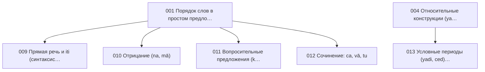

{/* AUTO-GENERATED by scripts/toc_build_pages.py from sangram/toc/data/articles.json -- do not hand-edit; edit the registry and re-run. */}

# Синтаксис (SY)

Домен 5 из 7 сети-оглавления [C2](./SANGRAM_TOC_NETWORK.mdx): **14 статей ядра**. ID стабильны и append-only; пререквизиты — ребра сети; запрос — эскиз намерения по грамматике C2 (исполнимая форма и ворота — [метод C3](../SANGRAM_CORPUS_EVIDENCE_METHOD.mdx)).

| ID | Статья | Кластер | Пререквизиты | Уитни | Прочие свидетели | Запрос (эскиз) | Слот C6 |
|---|---|---|---|---|---|---|---|
| SG-SY-001 | **Порядок слов в простом предложении** | Простое предложение | SG-SE-001 | — | Апте: вводные уроки синтаксиса; Кнауэр: фразы как корпус простых предложений | `dcs:cooccur linear order S–O–V per clause` | `syn-a-word-order` |
| SG-SY-002 | **Согласование (род, число, лицо)** | Простое предложение | SG-MO-001, SG-MO-012 | [§261–320](https://en.wikisource.org/wiki/Sanskrit_Grammar_%28Whitney%29/Chapter_IV) | Апте: уроки согласования | `dcs:cooccur head–modifier feature match` | `syn-a-agreement` |
| SG-SY-003 | **Именное предложение** | Простое предложение | SG-SE-010 | — | Апте: уроки об именном сказуемом; Кнауэр: фразы-образцы именных предложений | `dcs:cooccur clause without finite verb` | `syn-a-nominal-clause` |
| SG-SY-004 | **Относительные конструкции (ya- … ta-)** | Сложное предложение | SG-MO-010 | [§490–526](https://en.wikisource.org/wiki/Sanskrit_Grammar_%28Whitney%29/Chapter_VII) | Апте: уроки относительных предложений | `dcs:cooccur yad-form … tad-form same sentence` | `syn-b-correlatives` |
| SG-SY-005 | **Абсолютные обороты (locativus/genitivus absolutus)** | Сложное предложение | SG-SE-004, SG-SE-005 | [§261–320](https://en.wikisource.org/wiki/Sanskrit_Grammar_%28Whitney%29/Chapter_IV) | Апте: уроки абсолютных оборотов | `dcs:cooccur Loc participle + Loc subject, no head` | `syn-c-locative-absolute` |
| SG-SY-006 | **Цепочки абсолютивов** | Сложное предложение | SG-MO-026 | [§989–994](https://en.wikisource.org/wiki/Sanskrit_Grammar_%28Whitney%29/Chapter_XIII) | Апте: уроки деепричастных оборотов; Бюлер: упражнения с абсолютивами | `dcs:cooccur ≥2 VerbForm=Conv per clause` | `syn-c-absolutive-chain` |
| SG-SY-007 | **Инфинитивные конструкции** | Сложное предложение | SG-MO-025, SG-SE-012 | [§968–979](https://en.wikisource.org/wiki/Sanskrit_Grammar_%28Whitney%29/Chapter_XIII) | Апте: уроки инфинитива цели | `dcs:morph VerbForm=Inf & matrix-verb join` | — |
| SG-SY-008 | **Пассивная конструкция (kartari/karmaṇi prayoga)** | Сложное предложение | SG-MO-027, SG-SE-009, SG-MO-023 | [§998–999](https://en.wikisource.org/wiki/Sanskrit_Grammar_%28Whitney%29/Chapter_XIV) | Апте: уроки страдательного оборота | `dcs:cooccur Ins agent + (Voice=Pass | ppp predicate)` | — |
| SG-SY-009 | **Прямая речь и iti (синтаксис цитации)** | Сложное предложение | SG-SY-001 | [§1096–1135](https://en.wikisource.org/wiki/Sanskrit_Grammar_%28Whitney%29/Chapter_XVI) | Апте: уроки о прямой речи | `dcs:lemma iti & left-context clause` | `syn-b-iti` |
| SG-SY-010 | **Отрицание (na, mā)** | Частицы и полярность | SG-SY-001 | [§1096–1135](https://en.wikisource.org/wiki/Sanskrit_Grammar_%28Whitney%29/Chapter_XVI) | Апте: уроки отрицания | `dcs:lemma na,mA & mood join` | `syn-a-negation` |
| SG-SY-011 | **Вопросительные предложения (kim, api, katham)** | Частицы и полярность | SG-SY-001 | [§490–526](https://en.wikisource.org/wiki/Sanskrit_Grammar_%28Whitney%29/Chapter_VII) | Апте: уроки вопросительных предложений | `dcs:lemma kim,katham,api & clause-initial position` | — |
| SG-SY-012 | **Сочинение: ca, vā, tu** | Частицы и полярность | SG-SY-001 | [§1096–1135](https://en.wikisource.org/wiki/Sanskrit_Grammar_%28Whitney%29/Chapter_XVI) | Апте: уроки сочинительных союзов | `dcs:lemma ca,vA,tu & position-in-clause` | `syn-b-coordination` |
| SG-SY-013 | **Условные периоды (yadi, ced) и выбор наклонения** | Сложное предложение | SG-SE-008, SG-SY-004 | [§527–598](https://en.wikisource.org/wiki/Sanskrit_Grammar_%28Whitney%29/Chapter_VIII); [§941](https://en.wikisource.org/wiki/Sanskrit_Grammar_%28Whitney%29/Chapter_XII) | Апте: уроки условных предложений | `dcs:lemma yadi,ced & mood join per clause pair` | `syn-b-conditionals` |
| SG-SY-014 | **Посессивные и экспериенцерные конструкции (без «иметь»)** | Сложное предложение | SG-SE-003, SG-SE-004 | [§261–320](https://en.wikisource.org/wiki/Sanskrit_Grammar_%28Whitney%29/Chapter_IV) | Апте: уроки родительного и дательного | `dcs:cooccur Gen|Dat + existential as/bhU/vid` | `syn-c-dative-possessive` |

### Оговорки к запросам

- **SG-SY-001** — SOV-доминанта и отклонения в стихе; чувствительно к жанру
- **SG-SY-002** — согласование при dvandva и с рядом подлежащих
- **SG-SY-004** — порядок клауз (рел. слева) и кратные корреляты
- **SG-SY-005** — генитивный абсолютив как маркированный («пренебрежительный») вариант
- **SG-SY-006** — длина цепочек по жанрам — нарративная проза vs шастра
- **SG-SY-007** — матричные глаголы: мочь, хотеть, начинать, надлежать
- **SG-SY-008** — пассивная стратегия как немаркированная в классической прозе
- **SG-SY-009** — iti при глаголах речи, мысли, причины
- **SG-SY-010** — mā с инъюнктивом/аористом без аугмента — связь с SG-VA-002
- **SG-SY-012** — энклитическая позиция ca; одиночное vs парное употребление
- **SG-SY-013** — оптатив vs презенс в протасисе/аподосисе; редкий кондиционал — правило R5
- **SG-SY-014** — генитив + экзистенциальный глагол как посессивная стратегия

### Пререквизиты внутри домена

### Пререквизиты из других доменов

- SG-SY-001 ← **SG-SE-001** (Система падежных значений: обзор)
- SG-SY-002 ← **SG-MO-001** (Склонение: категории и обзор системы)
- SG-SY-002 ← **SG-MO-012** (Спряжение: категории и обзор системы)
- SG-SY-003 ← **SG-SE-010** (Именная предикация и связка (as, bhū))
- SG-SY-004 ← **SG-MO-010** (Местоимения)
- SG-SY-005 ← **SG-SE-004** (Аблатив и генитив)
- SG-SY-005 ← **SG-SE-005** (Локатив)
- SG-SY-006 ← **SG-MO-026** (Абсолютив (деепричастие на -tvā, -ya))
- SG-SY-007 ← **SG-MO-025** (Инфинитив)
- SG-SY-007 ← **SG-SE-012** (Модальные значения герундива и инфинитива)
- SG-SY-008 ← **SG-MO-027** (Пассив: yá-презенс и аорист на -i)
- SG-SY-008 ← **SG-SE-009** (Залог: актив, медий, пассив (семантика))
- SG-SY-008 ← **SG-MO-023** (Причастия на -ta/-na и -tavant)
- SG-SY-013 ← **SG-SE-008** (Наклонения: императив и оптатив)
- SG-SY-014 ← **SG-SE-003** (Инструменталис и датив)
- SG-SY-014 ← **SG-SE-004** (Аблатив и генитив)

### Покрытие глав Уитни другими работами (производный слой)

Автоматическая первичная разметка по [предметному конкордансу](https://github.com/gasyoun/SanskritGrammar/blob/main/SubjectConcordance/catalog.mdx) (куррированный ключевой лексикон, не филологическая карта): ● — покрыто, ○ — упомянуто, — — не найдено. Куррированные свидетели каждой статьи — в таблице выше и в реестре.

| Глава Уитни | §§ | Апте | Бюлер | Гасунс | Кнауэр | Кочергина | Толчельников | Зализняк | Зализняк | Зализняк |
|---|---|---|---|---|---|---|---|---|---|---|
| IV | 261–320 | ○ | ○ | ○ | — | ○ | ○ | — | ○ | ○ |
| VII | 490–526 | ○ | ○ | ○ | — | ○ | ○ | — | ○ | ○ |
| VIII | 527–598 | — | ○ | ● | — | ○ | ○ | ○ | ○ | ○ |
| XII | 931–950 | ● | ○ | ○ | — | ● | ○ | ○ | ○ | ○ |
| XIII | 951–995 | ● | ● | ○ | — | ● | ● | ● | ● | ● |
| XIV | 996–1068 | ● | ○ | ○ | — | ● | ● | ● | ● | ● |
| XVI | 1096–1135 | ● | ● | ● | — | ● | ● | — | ● | ● |

_Автогенерировано `scripts/toc_build_pages.py` из реестра C2._
