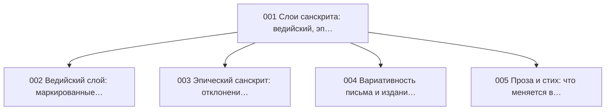

{/* AUTO-GENERATED by scripts/toc_build_pages.py from sangram/toc/data/articles.json -- do not hand-edit; edit the registry and re-run. */}

# Вариативность (VA)

Домен 7 из 7 сети-оглавления [C2](./SANGRAM_TOC_NETWORK.mdx): **5 статей ядра**. ID стабильны и append-only; пререквизиты — ребра сети; запрос — эскиз намерения по грамматике C2 (исполнимая форма и ворота — [метод C3](../SANGRAM_CORPUS_EVIDENCE_METHOD.mdx)).

| ID | Статья | Кластер | Пререквизиты | Уитни | Прочие свидетели | Запрос (эскиз) | Слот C6 |
|---|---|---|---|---|---|---|---|
| SG-VA-001 | **Слои санскрита: ведийский, эпический, классический, поздний (обзор)** | Слои | — | — | Зализняк: очерк: вводные замечания о периодизации | `dcs:meta text-dating strata` | — |
| SG-VA-002 | **Ведийский слой: маркированные отличия (акцент, субъюнктив, инъюнктив)** | Слои | SG-VA-001, SG-PH-003 | [§527–598](https://en.wikisource.org/wiki/Sanskrit_Grammar_%28Whitney%29/Chapter_VIII) | — | `dcs:meta stratum=vedic & morph Mood=Sub|Inj` | `reg-a-layer-vedic-classical` |
| SG-VA-003 | **Эпический санскрит: отклонения от классической нормы** | Слои | SG-VA-001 | — | Апте: примеры из эпоса в уроках | `dcs:meta stratum=epic & deviation sample` | `reg-a-epic-deviations` |
| SG-VA-004 | **Вариативность письма и изданий (рукописная и издательская орфография)** | Слои | SG-VA-001, SG-PH-010 | [§1–18](https://en.wikisource.org/wiki/Sanskrit_Grammar_%28Whitney%29/Chapter_I) | — | `dcs:surface orthographic doublets (M vs class-nasal, b/v)` | — |
| SG-VA-005 | **Проза и стих: что меняется в грамматике** | Слои | SG-VA-001 | — | Апте: стиховые примеры в уроках синтаксиса | `dcs:meta genre=verse|prose & feature battery` | `reg-a-prose-verse` |

### Оговорки к запросам

- **SG-VA-001** — DCS несет датировки текстов — базовая стратификация всех слоевых запросов; политика слоев — хартия §4
- **SG-VA-002** — акцентные свидетельства — VedaWeb через ворота C3; слоевые статьи публикуются не раньше W3 (хартия §4)
- **SG-VA-003** — нарушения сандхи и согласования metri causa; эпический подкорпус DCS
- **SG-VA-004** — издательские конвенции как источник ложной вариативности в корпусных числах
- **SG-VA-005** — prose-first политика программы C6 (E3): нормой считается проза, стих описывается как отклонение

### Пререквизиты внутри домена

### Пререквизиты из других доменов

- SG-VA-002 ← **SG-PH-003** (Слог, ударение и просодия)
- SG-VA-004 ← **SG-PH-010** (Орфографические конвенции изданий и корпусов (анусвара, аваграха))

### Покрытие глав Уитни другими работами (производный слой)

Автоматическая первичная разметка по [предметному конкордансу](https://github.com/gasyoun/SanskritGrammar/blob/main/SubjectConcordance/catalog.mdx) (куррированный ключевой лексикон, не филологическая карта): ● — покрыто, ○ — упомянуто, — — не найдено. Куррированные свидетели каждой статьи — в таблице выше и в реестре.

| Глава Уитни | §§ | Апте | Бюлер | Гасунс | Кнауэр | Кочергина | Толчельников | Зализняк | Зализняк | Зализняк |
|---|---|---|---|---|---|---|---|---|---|---|
| I | 1–18 | ○ | ○ | ● | ○ | ● | ○ | — | ● | ● |
| VIII | 527–598 | — | ○ | ● | — | ○ | ○ | ○ | ○ | ○ |

_Автогенерировано `scripts/toc_build_pages.py` из реестра C2._
