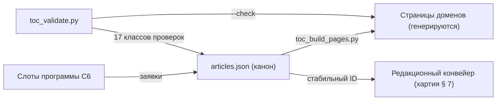

# Сеть-оглавление статей Sangram (слот C2)

_Создано: 12-07-2026 · Последнее обновление: 12-07-2026_

## 1. Что фиксирует контракт

C2 учреждает **сеть-оглавление** корпусной грамматики
[Sangram](https://github.com/gasyoun/SanskritGrammar/blob/main/sangram/SANGRAM_CHARTER_2026_2031.mdx):
полный append-only реестр статей ядра по семи доменам хартии § 5
(фонология/графика · словообразование · формальная морфология ·
грамматическая семантика · синтаксис · дискурс · вариативность). Каждая
запись реестра — **заявка на статью** со стабильным ID, пререквизитами,
эскизом корпусного запроса и свидетелями из оцифрованных учебных грамматик
репозитория. Сеть — вход редакционного конвейера хартии § 7: статья
начинается как строка здесь и заканчивается публикацией под этим же ID.

Канонический носитель — машиночитаемый реестр
[`articles.json`](https://github.com/gasyoun/SanskritGrammar/blob/main/sangram/toc/data/articles.json);
человекочитаемые страницы доменов **генерируются** из него
([`scripts/toc_build_pages.py`](https://github.com/gasyoun/SanskritGrammar/blob/main/scripts/toc_build_pages.py))
и вручную не правятся. Валидатор
[`scripts/toc_validate.py`](https://github.com/gasyoun/SanskritGrammar/blob/main/scripts/toc_validate.py)
держит реестр, сеть и кросс-контрактные связи в целости (§ 7).



На дату учреждения сеть содержит **93 статьи ядра**, 117 ребер
пререквизитов (ациклический граф) и полный маппинг слотов программы C6 —
обзор и таблицы по доменам: [страница обзора](https://github.com/gasyoun/SanskritGrammar/blob/main/sangram/toc/00-network-overview.mdx).

## 2. Грамматика стабильных ID

- Форма: `SG-<домен>-<NNN>`, регулярно `^SG-(PH|WF|MO|SE|SY|DI|VA)-[0-9]{3}$`.
  Коды доменов: PH фонология/графика · WF словообразование · MO формальная
  морфология · SE грамматическая семантика · SY синтаксис · DI дискурс ·
  VA вариативность.
- **Числовая часть непрозрачна**: она отражает порядок минтования внутри
  домена, а не место в изложении. Порядок подачи на страницах задают
  кластеры и пререквизиты, не номера.
- **Append-only** (хартия § 7 «Правила изменений»): ID не переиспользуются
  и не перенумеровываются. Новая статья минтуется следующим свободным
  номером своего домена и дописывается в конец доменного блока реестра.
  Снятая заявка переносит свой ID в `retired_ids` навсегда; валидатор
  запрещает пересечение живых и снятых ID.
- Ошибочная запись (неверный свидетель, неточный якорь) исправляется
  правкой реестра **со строкой в таблице ревизий § 9** — молчаливых правок
  сеть не знает; опубликованных статей это не касается (их исправления —
  трехъярусная модель хартии, G5).

## 3. Поля записи

| Поле | Семантика |
|---|---|
| `id`, `title_ru`, `cluster` | Стабильный ID (§ 2), русское заглавие (язык по умолчанию — хартия § 3), кластер подачи внутри домена |
| `layer` | `core` — ядро классического санскрита; `layered` — явно маркированная слоевая статья (хартия § 4; публикуется не раньше волны W3) |
| `prerequisites` | ID статей, знание которых предполагается; ребра сети. Граф обязан быть ациклическим |
| `whitney` | Якоря `whitney-sec:LO[-HI]` (§§ 1–1316) на спинной хребет Уитни 1889 — ту же ось, что несет [предметный конкорданс](https://github.com/gasyoun/SanskritGrammar/blob/main/SubjectConcordance/catalog.mdx) |
| `form_classes` | Слаги формклассов из канонического typed-link-набора H540 ([`typed_link_thematic.tsv`](https://github.com/gasyoun/SanskritGrammar/blob/main/SubjectConcordance/typed_link_thematic.tsv)); валидатор сверяет каждый слаг с TSV |
| `witnesses` | Свидетели из 10 работ репозитория: `work` (слаг из блока `works` реестра) + `locus` + `method` (§ 4) |
| `query` | Эскиз корпусного запроса (§ 5): `engine`, `sketch`, `note` |
| `c6_slots` | Слоты программы C6, которым статья отвечает (§ 6) |
| `minted` | Дата минтования записи, DD-MM-YYYY |

## 4. Свидетели: куррированный и производный слои

- **Куррированный слой** (в реестре, `method: curated`) — свидетели,
  утверждаемые предметным суждением: точные §§ Уитни; работы, чей вклад в
  тему известен по самим текстам репозитория (Зализняк 1975 для рядов и
  морфоклассов, Апте 1885 для синтаксического домена, Толчельников 2026 для
  морфонологии и т. д.). Гранулярность locus — честная: точнее «уроки
  темы X» не утверждается, пока статья не написана и свидетель не выверен.
- **Производный слой** (НЕ в реестре) — покрытие глав Уитни девятью
  остальными работами по автоматическому ключевому лексикону конкорданса,
  транскрибированное в
  [`whitney_chapter_coverage.json`](https://github.com/gasyoun/SanskritGrammar/blob/main/sangram/toc/data/whitney_chapter_coverage.json).
  Он рендерится на страницах доменов как ориентир («● покрыто / ○
  упомянуто») и никогда не выдается за куррированное свидетельство.
- Уточнение свидетеля (глава → урок → страница) — обычный append: строка
  ревизии § 9, `method` остается `curated`.

## 5. Эскизы корпусных запросов

Реестр хранит **намерение** запроса, а не исполнимую форму — исполнимость,
пиннинг снапшотов, ворота прав/живости/качества и цикл
запрос → выборка → валидация → утверждение → примеры принадлежат
[методу C3](https://github.com/gasyoun/SanskritGrammar/blob/main/sangram/SANGRAM_CORPUS_EVIDENCE_METHOD.mdx).
Эскиз обязан быть достаточно конкретным, чтобы сессия-исполнитель C3
построила из него дословный запрос без переписки с автором заявки.

| Префикс эскиза | Намерение |
|---|---|
| `dcs:morph …` | Отбор по морфопризнакам UD-разметки DCS (Case, Mood, Voice, VerbForm …) |
| `dcs:lemma …` | Отбор по леммам (SLP1) |
| `dcs:form-class …` | Отбор по формклассам Уитни через join с классным инвентарем WhitneyRoots (слаги H540) — обход UD-огрублений вроде Tense=Past |
| `dcs:surface …` | Несегментированный поверхностный слой (сандхи, орфография) — доступность слоя проверяет C3 |
| `dcs:cooccur …` | Совместная встречаемость в клаузе/предложении (корреляты, абсолютные обороты, порядок слов) |
| `dcs:meta …` | Стратификация метаданными (датировка, жанр, слой) |

Обязательная оговорка реестра: UD-признак `Tense=Past` в DCS-ingest не
различает имперфект/аорист/перфект (наблюдение
[VisualDCS](https://github.com/gasyoun/VisualDCS)) — все статьи о
претеритах несут `note` с требованием отбора по формклассу.

## 6. Маппинг слотов программы C6

[Программа C6](https://github.com/gasyoun/SanskritGrammar/blob/main/sangram/SANGRAM_SYNTAX_SEMANTICS_PROGRAM_W3_W4.mdx)
§ 6 подает статейные слоты как **заявки**; канонический реестр ID — C2
(правило самого C6 § 3: «при расхождении схемы ID канон — C2»). Маппинг —
поле `c6_slots`; допустим N:1 (несколько слотов на одну статью — напр.,
`is-a-eva` и `is-a-second-position` обе входят в SG-DI-001 о частицах).
Валидатор требует: каждый слот C6 замаплен ровно один раз, неизвестных
слотов нет.

Фактических слотов в таблицах C6 § 6 — **33** (итоговая строка C6 «Итого
32 слота» недосчитывает на один; расхождение зафиксировано здесь и в
papercut-леджере, канон — сами таблицы). Семь слотов не имели статьи в
первичной сети и породили новые записи: SG-SE-013…015, SG-SY-013…014,
SG-DI-006, SG-VA-005.

## 7. Валидация

```text
python scripts/toc_validate.py     # 17 классов проверок, exit 0 = чисто
python scripts/toc_build_pages.py  # перегенерация страниц доменов
```

Проверяются: грамматика и уникальность ID; непересечение с `retired_ids`;
существование пререквизитов и ацикличность графа; ≥1 свидетеля с известным
слагом работы и непустым locus; непустой эскиз запроса; корректность якорей
Уитни (§§ 1–1316); существование каждого формкласса в TSV H540; маппинг
всех 33 слотов C6 ровно по разу; покрытие всех семи доменов; синхронность
генерируемых страниц с реестром (`--check`). Зеленая сборка сайта — ворота
G4 хартии, поверх валидатора.

## 8. Границы: что C2 не делает

- **Не пишет статей** и не задает их внутреннюю структуру — формат, локали,
  IAST/деванагари и ID примеров фиксирует
  [редакционный контракт C4](https://github.com/gasyoun/SanskritGrammar/blob/main/sangram/editorial/SANGRAM_EDITORIAL_I18N_CONTRACT.mdx).
  Интерфейс двух контрактов: файл статьи C4 несет `id` вида `art:<slug>` и
  поле `toc_ref`, которое при привязке получает стабильный ID этого реестра
  (`SG-…`); до привязки `toc_ref` = `null` (C4 § «Идентификаторы»).
- **Не исполняет запросов** — реестр корпусов, ворота и цикл свидетельств
  принадлежат C3 (§ 5).
- **Не задает квот и пилотов волн** — их несут тематические программы: C5
  (морфология, волна W2; на дату учреждения исполняется параллельной
  сессией) и C6 (семантика/синтаксис, волны W3–W4). Программы порождают
  заявки; сеть их канонизирует.
- **Не хостит летучих статусов** (хартия § 10.8): в реестре нет полей
  «в работе/опубликовано» — состояние конвейера живет во внутренних
  реестрах Uprava и в атласе.

## 9. Провенанс и ревизии

Контракт исполнен по слоту C2 внутренней серии
[MEGABOOK × Sangram](https://github.com/gasyoun/Uprava/blob/main/MEGABOOK_SANGRAM_VISUALIZATION_PLAN_2026_2031.md)
(handoff [H631](https://github.com/gasyoun/Uprava/blob/main/handoffs/H631-Fable_SanskritGrammar_sangram-grammar-toc_11.07.26.md);
обе ссылки — внутренний архив Uprava). Черновик, реестр и инструменты —
Fable 5 (`claude-fable-5`); научная ответственность — автор.

| Дата | Ревизия | Основание |
|---|---|---|
| 12-07-2026 | Сеть учреждена: 93 статьи, 117 ребер, маппинг 33 слотов C6 (v1) | Слот C2, H631 |

_Dr. Mārcis Gasūns_
